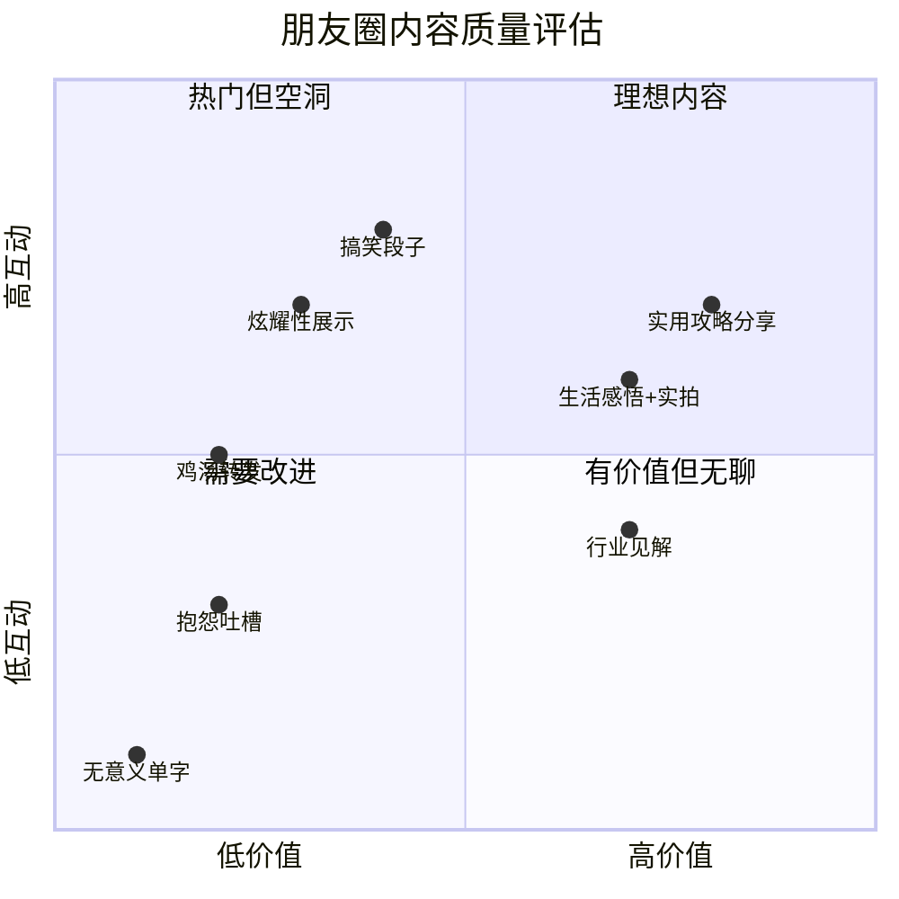

# 第十六章 网络社交沟通 —— 实战案例

实战是检验沟通能力的唯一标准。本章通过大量真实场景案例，从微信私聊、朋友圈经营、群聊沟通、冲突处理、跨平台社交、网络安全等维度，系统展示网络社交沟通中的成功策略与常见陷阱。每个案例不仅呈现"怎么做"，更深入分析"为什么这样做有效"，帮助读者建立可迁移的沟通能力。

---

## 一、微信一对一聊天实战

微信是中国最核心的社交工具，一对一聊天是网络社交的基本单元。开场白的质量、对话节奏的把控、情绪回应的方式，直接决定了关系的走向。

### 1.1 开场白的艺术

开场白的本质是**降低对方的回复成本**。心理学中的"登门槛效应"（Foot-in-the-Door Technique）表明，先提出一个容易接受的小请求，对方更愿意回应后续的大请求。开场白的设计应遵循"低压力+高关联"原则。

**❌ 失败案例：长时间不联系后的突兀请求**

小王：在吗？
小王：[5分钟后] 在吗？
小王：[10分钟后] 怎么不理我啊
小李：[2小时后] 在，什么事？
小王：我想问你个事，你们公司还招人吗？能帮我内推吗？
小李：[已读未回]

**问题诊断（逐条拆解）：**

| 问题 | 具体表现 | 心理机制 |
|------|---------|---------|
| "在吗"连发 | 3条消息只有"在吗"两个字 | 制造不确定性焦虑，对方不知道你要干嘛，回复成本极高 |
| 质问语气 | "怎么不理我啊" | 将对方的正常行为定义为"不理你"，触发防御心理 |
| 零铺垫直接请求 | 久不联系第一句就要内推 | 违反互惠原则——你没有给予任何价值就索取帮助 |
| 缺乏情境信息 | 没说清楚什么岗位、什么背景 | 对方需要追问才能判断，增加了回复成本 |

**✅ 成功案例：自然切入+价值先行**

小王：李哥，好久没联系了！最近忙什么呢？上次在朋友圈看到你去了云南
      旅行，照片拍得真棒，是在大理吗？
小李：哈哈是的，和家人去了一趟，风景特别好。
小王：真羡慕，我也一直想去。对了，最近看到你们公司在招XX岗位，感觉
      和我目前做的方向挺匹配的，不知道方便了解一下情况吗？
小李：当然可以，你把简历发我看看，我帮你问问HR。

**成功要素拆解：**

1. **具体化的关注**：不是泛泛地说"好久不见"，而是提到对方朋友圈的具体内容（云南旅行），说明你有在关注对方，这本身就是一种社交货币
2. **真诚的赞美+开放式问题**："照片拍得真棒，是在大理吗？"——赞美+提问，给对方一个轻松回复的入口
3. **自然过渡**：从旅行话题转入工作请求，用"对了"作为转折词，避免生硬
4. **降低请求的压迫感**："不知道方便了解一下情况吗？"——而不是"你能帮我内推吗"，给对方留足拒绝的空间
5. **信息充分**：提到具体岗位和匹配方向，让对方能快速判断

**开场白的万能公式：**

[称呼/问候] + [具体的关注点/共同回忆] + [轻松的互动/问题]
     ↓
[等对方回复，建立1-2轮互动]
     ↓
[自然过渡] + [你的请求，用商量的语气]

**更多开场白模板：**

| 场景 | ✅ 推荐开场白 | 💡 核心技巧 |
|------|-------------|-----------|
| 久不联系的朋友 | "刚看到XX（共同经历的地方/事物），想起咱们以前……" | 用共同记忆唤醒连接 |
| 新认识的朋友 | "今天聊得很开心，关于你说的XX话题，我后来想了想……" | 延续线下的话题热度 |
| 工作关系维护 | "看到你们公司最近的XX新闻/产品，做得很不错！" | 表达关注+真诚认可 |
| 求助型开场 | "我知道你在XX方面很专业，想请教一个小问题……" | 先肯定对方的专业性 |
| 感谢型开场 | "上次你帮我的那个事，后来进展很顺利，特别感谢！" | 及时反馈+闭环 |

### 1.2 对话节奏的把控

聊天节奏的核心是**信息密度的平衡**——每条消息都应该包含足够的信息量和互动价值。"审讯式聊天"（连续提问不自我暴露）是最常见的失败模式。

**❌ 失败案例：审讯式对话**

小张：你平时有什么爱好啊？
朋友：我喜欢看书和跑步。
小张：哦
小张：我也喜欢跑步
小张：你一般跑多少公里？
朋友：5公里左右吧
小张：哦
小张：我也差不多
小张：你用什么跑鞋？
朋友：[不再回复]

**问题诊断：**

- **信息密度极低**：每条消息只有几个字，对方需要承担全部的对话推进工作
- **"哦"字的杀伤力**：在文字沟通中，"哦""嗯""好"被广泛认为是敷衍的信号。心理学研究表明，这些单字回复会让发送方觉得自己的信息不值得被认真对待
- **缺乏自我暴露**：社会渗透理论（Social Penetration Theory）指出，关系的深化需要双方逐步暴露个人信息。单方面提问而不分享，会让对话变成单向索取
- **没有找到"钩子"**：每个话题都是蜻蜓点水，没有深入任何一个共同点

**✅ 成功案例：互动式深入**

小张：你平时有什么爱好啊？
朋友：我喜欢看书和跑步。
小张：跑步好啊！我也在坚持跑，不过之前一直断断续续的。最近开始跟着
      一个跑步App的计划在跑，感觉坚持起来容易多了。你一般跑什么路线？
朋友：我一般在XX公园跑，那边环境特别好，晚上跑步的人也很多，氛围
      不错。
小张：XX公园我知道！那边是不是有一条沿湖的跑道？我之前周末去那边散
      步过，感觉确实很适合跑步。下次有机会一起约跑啊～
朋友：好啊！周末早上我一般会去，到时候提前联系。

**节奏分析（用信息交换模型）：**

小张的第一条回复做了三件事：
┌─────────────────────────────────────────────┐
│ 1. 表达认同："跑步好啊！" → 情感连接          │
│ 2. 自我暴露："我也在跑，之前断断续续" → 建立平等 │
│ 3. 深入提问："你一般跑什么路线？" → 推进对话     │
└─────────────────────────────────────────────┘

小张的第二条回复做了三件事：
┌─────────────────────────────────────────────┐
│ 1. 具体回应："XX公园我知道！" → 证明在认真听     │
│ 2. 补充细节："沿湖跑道" → 展示共同认知          │
│ 3. 未来邀约："下次一起约跑" → 将线上关系转为线下  │
└─────────────────────────────────────────────┘

**聊天节奏的三条铁律：**

1. **每条消息至少包含一个"钩子"**——一个对方可以接话的点（提问、分享、认同+延伸）
2. **自我暴露与提问的比例不低于1:1**——你问一个问题，就应该分享一个自己的相关信息
3. **消息长度与对方匹配**——对方发长消息你也发长的，对方简短你也简短，这叫"镜像效应"

### 1.3 情绪回应的差异

当对方表达负面情绪时，最常见的错误是"急于解决问题"。心理学中的"情感确认"（Emotional Validation）理论指出：人在情绪激动时，首先需要的是被理解和接纳，而不是被教育和指导。

**❌ 失败回应：否定情绪+讲大道理**

朋友：今天被领导当众批评了，心情特别差。
你：别想太多了，领导可能也是为你好。
朋友：可是他说话真的很难听……
你：职场就是这样，习惯就好了。早点睡吧。
朋友：[不再回复]

**逐句诊断：**

| 你说的话 | 对方的感受 | 问题本质 |
|---------|-----------|---------|
| "别想太多了" | "你根本不在乎我的感受" | 否定情绪的合理性 |
| "领导也是为你好" | "你在帮领导说话？" | 站错了立场 |
| "职场就是这样" | "你在教训我" | 用普遍性消解个体痛苦 |
| "习惯就好了" | "你觉得我的痛苦不值一提" | 最小化对方的体验 |
| "早点睡吧" | "你急着结束对话" | 情感断联 |

**✅ 成功回应：共情→倾听→支持**

朋友：今天被领导当众批评了，心情特别差。
你：啊，当着大家的面？那确实会很不舒服。发生什么事了？
朋友：就是一个项目出了点小问题，其实也不是我的责任，但他直接就发火了。
你：这种情况真的挺委屈的，明明不是你的问题还要承受这些。你现在感觉
    怎么样？要不晚上出来吃个饭，聊聊？
朋友：好啊，谢谢你，感觉好多了。

**回应策略拆解：**

情绪回应的四步模型（VASE模型）：

V - Validate（确认）："那确实会很不舒服" → 你的感受是合理的
A - Ask（询问）："发生什么事了？" → 给对方倾诉的空间
S - Share perspective（共情）："真的挺委屈的" → 我理解你的处境
E - Extend support（支持）："出来吃个饭聊聊？" → 我愿意提供实际帮助

**常见情绪场景的回应对照表：**

| 对方说的话 | ❌ 错误回应 | ✅ 正确回应 |
|-----------|-----------|-----------|
| "我考试挂了" | "谁让你不好好复习" | "挂了确实难受，哪科？现在怎么打算的？" |
| "我和对象吵架了" | "你们总是吵，分了算了" | "又吵了？这次因为什么？你现在心情怎么样？" |
| "工作压力好大" | "谁工作没压力啊" | "最近确实辛苦了，具体是哪方面让你压力最大？" |
| "我生病了" | "多喝热水" | "严不严重？有没有去看医生？需要我帮你带什么东西吗？" |
| "我觉得自己好没用" | "你别这么想" | "听你这么说我很心疼，你最近遇到什么事了？愿意跟我聊聊吗？" |

### 1.4 高难度对话场景

**场景：需要拒绝朋友的请求**

很多人面对朋友的请求不敢拒绝，结果要么勉强答应后心生怨气，要么拖延不回复导致关系冷淡。有效的拒绝需要"共情+边界+替代方案"三要素。

朋友：我这周末搬家，你能来帮忙吗？

❌ 错误回应：
"好吧"（不情愿地答应，内心不满）
"我没空"（过于生硬，没有解释）

✅ 正确回应：
"搬家确实是个大工程！不过这周末我刚好有事走不开，实在抱歉。我帮你
 问问有没有靠谱的搬家公司？上次我搬家用的那个师傅还不错，价格也公道。"

**场景：对方已读不回怎么办**

已读不回是网络社交中最常见的焦虑来源。应对策略：

1. **不要追问"你怎么不回我"**——这会制造压力
2. **给对方合理的时间**——工作日白天至少等4小时，晚上可以等到第二天
3. **如果确实需要回复，换个方式再发一次**——比如补充新信息或换一个角度
4. **理解对方可能只是忙**——不要将"已读不回"等同于"不在乎你"

第一天：正常发消息
第二天（确实需要回复时）：
"上次说的那个事，我又想了想，补充一点：[新信息]。你看什么时候方便
 回复我都行，不着急～"

---

## 二、朋友圈经营实战

朋友圈是你的"社交名片"。研究表明，人们平均通过浏览对方最近10条朋友圈来形成第一印象。朋友圈的质量直接影响你在社交网络中的信用等级。

### 2.1 朋友圈内容的四象限模型

### 2.2 六种常见问题朋友圈及优化

**类型一：过度抱怨型**

> "今天又是烦死了！堵车迟到、午饭难吃、开会无聊、同事奇葩……这日子什么时候是个头啊！[愤怒]"

**问题分析**：持续输出负能量会触发"情绪传染"效应——读者在浏览朋友圈时也会被负面情绪影响，本能地想要远离。研究显示，经常发负面内容的人在社交网络中的受欢迎度下降约40%。

**优化后：**
> "今天虽然遇到了一些小挫折，但也学到了不少。特别感谢同事XX的帮助，让我对这个项目有了新的理解。有时候，困难真的是成长的催化剂。💪"

**优化原理**：保留真实性（确实遇到了困难），但增加积极的框架（感恩、学习），让读者感受到你的韧性和成长性。

**类型二：炫耀型**

> "又买了个新包，不多说了，上图。" [九宫格奢侈品照片]

**问题分析**：炫耀性消费在社交媒体上会触发"社会比较"效应，引发他人的嫉妒或不适。哈佛商学院的研究表明，炫耀性内容获得的表面互动（点赞）虽多，但会降低发布者的实际社交吸引力。

**优化后：**
> "终于入手了心心念念的XX，从选品到下单纠结了好久。分享一下选购心得：[具体经验]……给有同样需求的朋友们参考。"

**优化原理**：从"展示结果"转向"分享过程"，将炫耀转化为对他人的实用价值。

**类型三：鸡汤型**

> "人生就像一杯茶，不会苦一辈子，但总会苦一阵子。——致每一个努力的你。早安！🌹"

**问题分析**：鸡汤内容缺乏具体性和个人色彩，容易被视为"复制粘贴"，不会增加社交价值。

**优化后：**
> "最近在练习早起，坚持了21天，说说我的感受：前3天最难，第7天开始适应，第14天已经不需要闹钟了。最大的变化是早上多出了1小时读书时间，已经看完两本书了。早起的朋友们有什么经验分享？"

**优化原理**：用具体的个人经历替代抽象的道理，用数据增加可信度，用提问增加互动。

**类型四：无意义型**

> "嗯。""。。。""[一张模糊的饭菜照片]"

**优化后**：要么不发，要发就发有价值的内容。一道菜的照片可以写成：
> "周末尝试了一家新开的日料店，推荐这道三文鱼刺身，食材新鲜，价格也合理。地址在XX路XX号，人均150左右。"

**类型五：转发机器型**

每天转发多条公众号文章，没有自己的观点和评论。

**优化后**：转发时加上自己的思考：
> "这篇文章关于XX的观点挺有意思的，尤其是第三点关于XX的论述，让我想到了自己之前的一个经历……你们怎么看？"

**类型六：定位打卡型**

每到一个地方就发定位，但没有实质内容。

**优化后**：将定位打卡升级为实用攻略：
> "在XX咖啡店坐了一下午，环境安静，适合工作。推荐靠窗的位置，WiFi稳定，拿铁不错。唯一缺点是停车不太方便，建议坐地铁来。"

### 2.3 朋友圈互动的学问

朋友圈的评论区是社交关系的"温度计"。高质量的互动能够显著增强关系亲密度。

**场景一：朋友晒自制蛋糕**

| 互动质量 | 示例 | 效果分析 |
|---------|------|---------|
| ❌ 低质量 | 点赞（无文字） | 几乎没有社交价值，对方甚至不知道你看了 |
| ❌ 低质量 | "好看""不错" | 敷衍，无法推进对话 |
| ✅ 高质量 | "这个蛋糕太棒了！是自己从零开始做的吗？用的什么配方？" | 表达赞赏+提出具体问题，给对方展示的机会 |
| ✅ 高质量 | "这个裱花技术绝了！你是什么时候开始学烘焙的？" | 具体的赞美+好奇对方的经历 |
| ✅ 高质量 | "看饿了！下次聚会能不能请你做甜点呀😄" | 表达喜欢+创造未来互动机会 |

**场景二：朋友说生病了**

| 互动质量 | 示例 | 效果分析 |
|---------|------|---------|
| ❌ 禁忌 | 不回应 | 在对方脆弱时缺席，关系会降温 |
| ❌ 禁忌 | 点赞 | 对他人的不幸点赞是社交大忌 |
| ❌ 敷衍 | "多喝热水" | 已经成为"不关心"的代名词 |
| ✅ 恰当 | "怎么了？严重吗？有没有去看医生？" | 表达关心+具体询问 |
| ✅ 恰当 | "好好休息，需要什么跟我说，我帮你带。" | 关心+实际帮助 |
| ✅ 深度 | 私聊发消息，而不是在评论区回复 | 私聊更能表达真诚的关心 |

**朋友圈互动的黄金法则：**

1. **具体胜过笼统**——"这个角度拍得真好"胜过"好看"
2. **提问胜过陈述**——问题能推进对话，陈述只能终结对话
3. **私聊胜过评论**——真正关心对方时，私聊更能传递温度
4. **及时胜过延迟**——朋友圈发布后2小时内互动效果最好
5. **真诚胜过技巧**——所有技巧的前提是你真的在意这段关系

### 2.4 朋友圈分组策略

朋友圈分组是平衡不同社交圈层的关键工具。以下是一个通用的分组框架：

| 分组 | 可见内容 | 不可见内容 | 分组逻辑 |
|------|---------|-----------|---------|
| 家人 | 生活日常、家庭活动、正能量 | 工作抱怨、深夜聚会、敏感观点 | 让家人放心，避免担心 |
| 同事/领导 | 工作成就、行业分享、正能量 | 私人生活、吐槽、政治观点 | 维护职业形象 |
| 密友 | 全部内容 | 几乎无限制 | 真实自我的展示空间 |
| 普通朋友 | 生活分享、行业见解 | 过于私密的内容 | 保持适度的社交距离 |
| 客户/合作伙伴 | 专业内容、行业动态 | 个人生活、情绪表达 | 维护专业形象 |
| 学生/晚辈 | 教育分享、正能量、榜样内容 | 负面情绪、成人话题 | 承担社会责任 |

**分组的注意事项：**

1. **定期更新分组**——人际关系是动态的，每季度检查一次分组是否需要调整
2. **不要让对方发现被分组**——避免在同一条朋友圈中出现明显的分组痕迹
3. **"仅聊天"是终极方案**——对于确实不想让对方看到朋友圈但又不方便删除的人
4. **标签命名要谨慎**——不要用"讨厌的人""装X组"等容易被看到的标签名

---

## 三、群聊沟通实战

群聊是网络社交的放大器。在群聊中，你的每一句话都同时面对多个受众，影响力成倍增长，但翻车的风险也成倍增加。

### 3.1 工作群的汇报艺术

工作群是职场沟通的核心场景。汇报质量直接影响领导和同事对你的专业评价。

**❌ 不当方式：**

小刘：进度更新。
小刘：[发了一个很长的文档]
小刘：大家看看

**问题分析**：
- 没有摘要，强迫所有人打开文档才能了解进度
- "大家看看"没有明确的行动指引——你需要他们做什么？
- 没有时间预期——什么时候需要反馈？

**✅ 恰当方式：**

小刘：各位好，以下是本周的项目进度更新：

📊 整体进度：75%（上周65%）

✅ 已完成：
1. 用户调研报告（已完成）
2. 首页设计初稿（已完成）

🔄 进行中：
1. 后端接口开发（预计周三完成）
2. 测试用例编写（预计周四完成）

⚠️ 风险点：
- 第三方API对接可能延迟，需要确认

📎 详细文档见附件，有问题随时讨论。
下周二下午3点同步会照常，届时会重点讨论风险点的应对方案。

**结构化汇报的SCQA框架：**

S - Situation（现状）：整体进度75%，比上周增长10%
C - Complication（问题）：第三方API可能延迟
Q - Question（需要什么）：需要确认API对接的最终时间
A - Action（行动建议）：周二同步会上讨论应对方案

**工作群汇报的通用模板：**

[时间范围] + [项目/任务名称] 进度更新

📊 整体状态：[一句话总结]

✅ 已完成：
- [事项1]（[完成时间]）
- [事项2]（[完成时间]）

🔄 进行中：
- [事项1]（预计[完成时间]，进度[X]%）
- [事项2]（预计[完成时间]）

⚠️ 需要关注：
- [风险/问题]（[影响范围]，需要[谁]做什么）

📎 详细资料：[链接/附件]

### 3.2 家庭群的沟通智慧

家庭群是中国特有的社交场景，涉及代际沟通、面子文化、信息素养差异等多重挑战。

**场景：长辈转发养生谣言**

**❌ 不当回应：**
小明：这是假的，别信了。
小明：你们怎么什么都信啊
小明：[发了一个"辟谣"链接]

**问题分析**：
- 直接否定会让长辈觉得"被教训"，触发代际权力冲突
- "你们怎么什么都信"是群体性的否定，伤害面更大
- 辟谣链接如果没有上下文，长辈可能根本不会点开

**✅ 恰当回应：**
小明：妈，我看到您分享的这个了。您关心大家的健康真的很好👍
      不过我之前看过一些资料，说这个说法可能不太准确。
      给您发一个权威的科普文章看看，以后咱们可以一起辨别真假信息～

[温和地分享科普文章，最好是权威媒体或官方机构的]

**成功要素：**
1. **先肯定动机**——"您关心大家的健康"——不是批评你分享，而是认可你的出发点
2. **用"我"开头**——"我之前看过"而不是"你这是错的"——降低对抗性
3. **提供替代方案**——不只是说"这是假的"，而是给出"什么是真的"
4. **建设性结尾**——"一起辨别"而不是"你以后别转了"——保持对方的尊严

**家庭群的沟通原则：**

| 原则 | 说明 | 示例 |
|------|------|------|
| 面子优先 | 在群里给长辈留面子，有分歧私聊解决 | 不在群里直接指出长辈的错误 |
| 及时回应 | 长辈发的消息要回应，哪怕是简单的表情 | 不要让长辈的消息"石沉大海" |
| 主动分享 | 偶尔分享自己的生活，让家人放心 | 工作餐、周末活动、旅行照片 |
| 避免争论 | 政治、宗教等敏感话题不在群里讨论 | 话题跑偏时温和地转移 |
| 尊重差异 | 接受代际之间的认知差异 | 不要求长辈和你有一样的信息素养 |

### 3.3 社交群的活跃技巧

在兴趣群、校友群、社区群等社交群中，如何从"潜水党"变成"有价值的核心成员"？

**从0到1建立群内社交存在感的五步法：**

1. **观察期（第1-2周）**：潜水观察群的氛围、话题偏好、核心成员、潜规则
2. **低风险互动（第2-3周）**：对他人的分享点赞、发表简短的正面评论
3. **价值输出（第3-4周）**：分享与群主题相关的有价值信息、经验、资源
4. **主动连接（第4周后）**：回应他人的问题，提供帮助，建立一对一关系
5. **成为节点（持续）**：成为群内信息的连接者——"这个问题XX比较专业，我帮你问问"

**群聊中的禁忌清单：**

- ❌ 连续刷屏（尤其是多条语音）
- ❌ 在群里发广告、拉票、求转发
- ❌ 在群里公开批评或争论
- ❌ 发送未经核实的信息
- ❌ 在工作时间频繁闲聊
- ❌ 对他人的分享视而不见，只在自己需要帮助时出现

---

## 四、社交媒体危机处理实战

网络世界的信息传播速度远超现实世界。一条被误解的消息可能在几小时内造成严重的社交后果。掌握危机处理能力是网络社交的必修课。

### 4.1 被误解时的澄清策略

**场景：** 小陈在朋友圈分享了一篇关于"年轻人应该学会拒绝加班"的文章，被领导看到后，领导认为小陈在抱怨公司加班文化。

**❌ 错误处理方式：**

| 方式 | 后果 |
|------|------|
| 删除朋友圈 | 显得心虚，反而印证了领导的猜测 |
| 发阴阳怪气的朋友圈 | 火上浇油，让局面更糟 |
| 在同事群里抱怨领导 | 消息可能传到领导耳朵里，雪上加霜 |
| 假装什么都没发生 | 误会发酵，影响后续工作关系 |

**✅ 正确处理方式：**

小陈私下给领导发了一条消息：
王总，看到您给我那条朋友圈的评论，我想跟您解释一下。我分享那篇文章
主要是觉得里面的观点挺有意思的，并不是针对咱们公司。咱们团队的氛围
我一直觉得很好，您也一直很尊重大家的工作和生活平衡。如果让您产生了
不好的理解，我非常抱歉。

**处理策略拆解：**

危机澄清的 AERA 模型：

A - Acknowledge（确认）：确认对方看到了什么，不回避问题
E - Explain（解释）：说明自己的真实意图，但不是推卸责任
R - Reaffirm（重申）：重申对关系的重视和正面态度
A - Apologize（致歉）：为造成的误解表达歉意，无论是否有意

### 4.2 网络暴力的应对

**场景：** 小美在小红书分享了一篇旅游攻略，被一些网友恶意评论攻击长相。

**❌ 错误应对：**
- 在评论区和网友对骂——降低自己的格调，给围观者留下负面印象
- 发一条哭诉的动态博取同情——可能引发更多关注和二次伤害
- 情绪崩溃后删除所有内容——冲动决定，失去已有的正面积累

**✅ 正确应对——三阶段处理法：**

**第一阶段：保护自己的情绪（立即执行）**
1. 关闭评论和私信提醒，减少负面信息的持续输入
2. 不要反复查看负面评论——每一次查看都是一次情绪伤害
3. 找信任的朋友或家人倾诉，获得情感支持
4. 记住：**恶意评论反映的是攻击者的问题，不是你的问题**

**第二阶段：理性处理（24小时内）**
1. 截图保留证据（包括评论内容、用户ID、时间戳）
2. 举报恶意评论——利用平台的举报机制
3. 屏蔽或拉黑持续骚扰的用户
4. 如果涉及人身威胁或严重诽谤，考虑报警或法律途径

**第三阶段：继续前行（长期）**
1. 继续发布优质内容——不要因为少数人的恶意而放弃
2. 用积极的互动覆盖负面——回应那些支持你的评论
3. 如有必要，发布一条简短的声明，澄清事实，然后不再回应
4. 如果持续受到骚扰，可以暂时关闭评论功能，等热度过去再开放

**网络暴力应对的心理建设：**

认知重构——将恶意评论"去个人化"：

"他们骂我丑" → "他们在互联网上随机找人发泄，和我无关"
"好多人都在骂" → "沉默的大多数并不认同，只是攻击声量大"
"是不是我真的有问题" → "我分享的是旅游攻略，长相和内容无关"
"我是不是不该发" → "表达的自由不应被恶意绑架"

### 4.3 信息泄露的紧急处理

**场景：** 不小心在群里发了不该发的内容（比如私人照片、敏感信息、发错群的消息）

**黄金3分钟处理流程：**

1. **立即撤回**（微信2分钟内可撤回）
2. **如果撤回失败**：
   - 在群里发一条轻松的解释："哈哈发错群了，大家忽略～"
   - 私聊群主或管理员，请帮忙删除
3. **事后处理**：
   - 检查信息泄露的范围和影响
   - 如果涉及敏感信息，通知相关方做好防范
   - 反思为什么会发错，建立"发送前检查"的习惯

---

## 五、网络社交中的冲突处理

网络冲突与面对面冲突最大的区别在于：**文字缺少语气和表情，误解的概率成倍增加**。同一句话在不同的情绪解读下可以有完全不同的含义。

### 5.1 朋友圈引发的误会

**场景：** 小芳和小丽是好朋友。小芳发了一条朋友圈，配文"今天和真正的朋友一起度过了美好的一天"，配图是和其他朋友的合照。小丽看到后觉得被"内涵"了。

**❌ 错误处理方式（小丽）：**

| 方式 | 后果 |
|------|------|
| 发朋友圈"内涵"回去 | 朋友圈战争升级，共同好友夹在中间 |
| 在共同好友群里暗示 | 扩大冲突范围，可能传到小芳耳朵里 |
| 直接拉黑小芳 | 冲动决定，失去一段本可修复的友谊 |
| 找共同好友评理 | 让第三方卷入，增加复杂性 |

**✅ 正确处理方式：**

小丽：小芳，看到你今天发的朋友圈了，你们玩得很开心呢😊
      不过说实话，我看到"真正的朋友"那句话时有点小吃醋，哈哈。
      是不是我太敏感了？
小芳：啊！你别多想，我就是随手写的。你当然是我最好的朋友啦！
      上次咱们一起吃饭我都没来得及发朋友圈呢。这周末一起出来玩呀？
小丽：哈哈好呀，那你这周末有空吗？

**处理策略拆解：**

1. **私聊解决**：不在公开场合制造尴尬，给双方留有余地
2. **用轻松的语气**："有点小吃醋，哈哈"——降低对抗性，让对方知道你不是来兴师问罪的
3. **自我解嘲**："是不是我太敏感了？"——给对方一个台阶，也给自己留有余地
4. **给对方解释的机会**：没有下结论，而是表达感受后等待回应
5. **用行动修复**：约周末见面，用实际互动巩固关系

### 5.2 群聊中的冲突调解

**场景：** 在一个兴趣群里，两个人因为观点不同开始激烈争论，逐渐升级为人身攻击。

**❌ 不当处理：**
- 装作没看见（冲突升级，群氛围被破坏）
- 站队支持其中一方（加剧对立）
- 直接踢人（除非是管理员，否则没有权限也容易引发更大的争议）

**✅ 恰当处理（作为旁观者）：**

"两位都冷静一下哈～ 其实你们说的都有道理，A的观点侧重XX，B的观点侧
重YY，只是角度不同而已。这个话题确实见仁见智，不如咱们先聊聊XX（相关
但更轻松的话题）？晚上有空的话可以约个线上讨论，好好聊～"

**调解技巧：**
1. **肯定双方**——"都有道理"，避免让任何一方觉得被否定
2. **重新定义冲突**——"只是角度不同"，将人身攻击拉回到观点讨论
3. **转移话题**——提供一个轻松的替代话题
4. **提供出口**——"约个线上讨论"，给冲突一个正式但友好的解决渠道

### 5.3 与陌生人冲突的止损策略

**场景：** 在微博/抖音评论区与陌生人发生争执，对方开始人身攻击。

**核心原则：在公开平台上与陌生人争论，你永远赢不了。**

**止损三步法：**

1. **识别止损信号**：当对方开始人身攻击、翻旧账、扣帽子时，说明这场争论已经没有意义
2. **发出最后一条有格调的回复**：
   "我理解你的观点，但我有不同看法。我们可以各自保留意见。祝好。"
3. **退出，不再回应**：无论对方说什么，不再回复。沉默是最高级的回应

**为什么"赢了"争论反而"输了"？**
- 在旁观者眼中，持续争论的双方都在掉分
- 你的时间和精力是最宝贵的资源，不值得浪费在陌生人身上
- 情绪的消耗远大于争论本身的"收益"

---

## 六、跨平台社交实战

不同的社交平台有不同的用户画像、内容偏好和社交规则。在多个平台上保持一致且有效的社交形象，需要系统性的策略。

### 6.1 多平台形象统一

**场景：** 小周是一名自由设计师，需要在多个社交平台上建立一致的个人品牌。

**✅ 平台策略矩阵：**

| 平台 | 核心定位 | 内容策略 | 发布频率 | 互动方式 |
|------|---------|---------|---------|---------|
| 微信 | 专业社交+私域 | 设计作品、行业见解、客户案例 | 朋友圈2-3条/周 | 私聊深度交流 |
| 小红书 | 生活方式+种草 | 设计师日常、灵感分享、生活美学 | 3-5条/周 | 评论区互动 |
| 微博 | 公共表达+热点 | 设计评论、行业热点、作品展示 | 1-2条/天 | 转发+评论 |
| 抖音 | 创意展示+流量 | 设计过程视频、创意灵感、教学 | 3-5条/周 | 评论区+直播 |
| Behance | 专业作品集 | 完整的项目案例、详细的作品说明 | 每月1-2个完整项目 | 作品评论 |
| 即刻 | 圈子社交+日常 | 设计师圈子、日常感悟、碎片分享 | 随时 | 圈子讨论 |

**统一要素：**

1. **视觉一致性**：头像使用同一张照片或同一风格的插画，配色方案统一
2. **简介一致性**：核心身份标签一致（如"UI设计师 | 10年经验 | 服务过XX品牌"），但根据不同平台调整语气
3. **内容一致性**：核心信息和价值观一致，但表达方式适配各平台的调性
4. **互动一致性**：在所有平台上保持友好、专业的互动风格

### 6.2 平台间的引流策略

各平台不是孤岛，需要建立有机的引流路径：

抖音/小红书（流量入口）
    ↓ 引导关注
微信公众号（内容沉淀）
    ↓ 引导添加
个人微信（深度连接）
    ↓ 建立信任
私域社群（长期运营）

**引流的注意事项：**
- 不要在内容中硬植入微信号——大多数平台会限流甚至封号
- 通过"私信回复关键词获取资料"等软性方式引流
- 每个平台都要提供独立的价值——不要让人觉得"关注了等于没关注"
- 尊重各平台的规则和用户习惯

### 6.3 跨平台内容复用的效率法则

同一条内容在不同平台需要不同的呈现形式：

| 原始内容 | 微信朋友圈 | 小红书 | 微博 | 抖音 |
|---------|-----------|--------|------|------|
| 一次旅行经历 | 3-5张精选照片+感悟文字 | 9宫格图文攻略+详细tips | 一句话+几张照片+话题标签 | 15-60秒Vlog |
| 一个设计理念 | 作品截图+简短思考 | 图文教程+步骤拆解 | 作品+行业评论 | 设计过程录屏+解说 |
| 一本书的读后感 | 一段金句+推荐语 | 详细书评+思维导图 | 核心观点+讨论话题 | 3分钟讲书视频 |

---

## 七、网络社交心理学深度案例

理解背后的心理学原理，能够帮助我们更自觉地运用社交策略，而不是盲目模仿。

### 7.1 社交比较的陷阱

**场景：** 小美刷朋友圈时，看到同事A升职加薪、朋友B在马尔代夫度假、同学C买了新房、闺蜜D的孩子上了名校。小美感到越来越焦虑和自卑。

**心理学分析：**

社交比较理论（Social Comparison Theory，Festinger 1954）指出，人有评估自身能力和观点的天然需求，当缺乏客观标准时，会通过与他人比较来完成评估。社交媒体放大了这种比较效应：

1. **展示偏差**：朋友圈展示的是精心筛选的"精彩瞬间"，而非生活的全貌。研究表明，人们在社交媒体上展示的内容中，正面信息的比例约为80%，远高于实际生活中的比例
2. **比较对象的失真**：你拿来比较的不是对方的真实生活，而是对方的"最佳剪辑版"
3. **频率的放大**：在现实生活中，你可能偶尔听到朋友的好消息；在朋友圈，你每天都能看到几十个人的好消息

**✅ 应对策略：**

**认知层面：**
- 识别"展示偏差"——提醒自己：你看到的是别人的"精彩集锦"，不是"完整纪录片"
- 重新定义比较的基准——和过去的自己比，而不是和别人的高光时刻比
- 培养"替代性喜悦"的能力——他人的成功不等于你的失败

**行为层面：**
- 设定每天刷朋友圈的时间限制（建议不超过30分钟）
- 主动取关或屏蔽那些持续让自己焦虑的账号——这不是小气，是自我保护
- 增加线下社交——面对面的交流更真实，也更少"表演"成分
- 定期进行"社交断食"——每周选一天不看任何社交媒体

**深度练习——朋友圈"去滤镜"训练：**

当你看到一条让你焦虑的朋友圈时，练习以下思维：
"这条朋友圈让我感到焦虑，因为……"
"但实际上，对方可能也有……的困难"
"如果把我的生活也剪辑成'精彩集锦'，我会展示什么？"
"我和一年前的自己相比，进步了什么？"

### 7.2 信息茧房的突破

**场景：** 小李发现自己在社交媒体上看到的内容越来越单一，思维方式越来越固化。

**心理学分析：**

信息茧房（Information Cocoon）由哈佛大学法学家凯斯·桑斯坦提出。算法推荐系统通过分析你的浏览历史和互动行为，持续推送你"喜欢"的内容，形成正反馈循环。长期处于信息茧房中会导致：

- 认知窄化：只接触符合已有观点的信息，丧失全面思考的能力
- 极化效应：观点越来越极端，因为没有接触到不同立场的声音
- 社交圈层固化：只和同质化的人交流，丧失了理解不同群体的能力

**✅ 突破策略：**

1. **主动关注不同观点的账号**——特别是那些你不同意但论证严谨的博主
2. **定期清除算法痕迹**——清除浏览历史、关闭个性化推荐、使用无痕模式
3. **建立"信息食谱"**——像饮食均衡一样，确保自己的信息来源多元化
4. **参与不同圈子的讨论**——加入与自己专业、兴趣不同的社群
5. **培养"钢铁人论证"能力**——不是"稻草人论证"（曲解对方观点后攻击），而是能准确复述对方的观点后再表达自己的不同意见

### 7.3 锚定效应在网络社交中的应用

**场景：** 你在微信群里想约朋友周末聚餐，如何提高成功率？

**心理学原理**：锚定效应（Anchoring Effect）指人们在做决策时，会过度依赖最先获得的信息（"锚"）。

**应用：**
❌ 低效方式：
"大家周末有空吗？想约个饭。"（开放性太强，大家会纠结"去哪吃""吃什么"）

✅ 高效方式：
"我发现了一家评分4.9的日料店，人均150左右，周六晚上7点，有没有人
一起来？目前已经有3个人了。"

分析：
- **具体的地点**（日料店）——消除了"吃什么"的决策成本
- **具体的时间**（周六7点）——消除了"什么时候"的决策成本
- **具体的价格**（人均150）——消除了"贵不贵"的不确定性
- **社会证明**（已有3人）——触发从众心理

### 7.4 互惠原则的社交应用

**场景：** 你想和一位行业大咖建立联系，但对方不认识你。

**互惠原则**（Robert Cialdini《影响力》）指出：当一个人接受了他人的好处，会产生回报的心理压力。

**应用策略——价值先行法：**

第一步：在对方的社交媒体上持续提供有价值的评论（不是"写得好"，
       而是提出有深度的问题或补充观点），持续2-4周

第二步：转发对方的内容并加上自己的深度解读，@对方表示认可

第三步：私信对方，提供一个对他有价值的信息/资源/机会
       "XX老师，我看到您最近在研究XX领域，我手上有一份XX的内部资料，
        觉得可能对您有用，分享给您。"

第四步：在建立了初步连接后，再提出你的需求

---

## 八、数字安全与隐私保护实战

网络安全是网络社交的底线。一次信息泄露可能导致长期的骚扰、诈骗甚至身份盗用。

### 8.1 个人信息保护清单

| 保护维度 | 具体措施 | 重要程度 |
|---------|---------|---------|
| 账号安全 | 不同平台使用不同的强密码（12位以上，含大小写+数字+符号），开启两步验证 | ⭐⭐⭐⭐⭐ |
| 隐私设置 | 定期检查每个平台的隐私设置，关闭"允许陌生人查看"相关选项 | ⭐⭐⭐⭐⭐ |
| 位置信息 | 关闭照片的地理位置标签，不实时分享位置 | ⭐⭐⭐⭐ |
| 个人敏感信息 | 身份证号、手机号、住址、银行卡号不要在任何社交平台上公开 | ⭐⭐⭐⭐⭐ |
| 社交工程防范 | 不点击陌生链接，不扫描来路不明的二维码，不轻信"中奖""退款"信息 | ⭐⭐⭐⭐ |
| 旧账号清理 | 定期清理不再使用的平台账号，防止数据泄露 | ⭐⭐⭐ |
| WiFi安全 | 不在公共WiFi下登录敏感账号，使用VPN加密流量 | ⭐⭐⭐ |

### 8.2 朋友圈的安全边界

**高风险朋友圈内容及替代方案：**

| 高风险内容 | 风险 | 替代方案 |
|-----------|------|---------|
| 实时定位+自拍 | 暴露行踪，可能被跟踪 | 回来后再发，或仅对亲密好友可见 |
| 机票/火车票照片 | 票面上有姓名、身份证号、座位号 | 将敏感信息打码后再发 |
| 孩子的学校/班级信息 | 可能被不法分子利用 | 避免提及具体学校名称，或设置分组可见 |
| 工牌/名片照片 | 暴露公司、职位、工号等信息 | 只拍不包含敏感信息的部分 |
| 家庭住址相关照片 | 通过窗户景色、楼栋号等可推断住址 | 注意照片背景，必要时裁剪 |
| 红包/转账截图 | 暴露财务信息 | 打码金额和对方信息 |

### 8.3 社交诈骗识别

**常见的社交诈骗模式：**

1. **"老同学"借钱诈骗**：盗用朋友的头像和昵称，以急事借钱为由诈骗
   - 防范：借钱前通过电话或视频确认对方身份
2. **"领导"指示转账**：冒充领导通过微信要求紧急转账
   - 防范：通过其他渠道（电话、当面）确认
3. **"客服"退款诈骗**：冒充电商平台客服，以退款为由套取银行卡信息
   - 防范：通过官方APP或网站联系客服，不点击对方发来的链接
4. **"投资理财"群诈骗**：拉你进投资群，通过"老师"带单骗取资金
   - 防范：任何承诺高回报的"投资"都是骗局

---

## 九、特殊场景的网络社交

### 9.1 职场社交：LinkedIn/脉脉

职场社交平台的核心价值是**弱关系网络**。社会学家格兰诺维特的"弱关系优势"理论指出，在求职和获取新信息方面，弱关系（不太熟的人）比强关系（亲密朋友）更有价值，因为弱关系连接了不同的社交圈。

**职场社交的黄金法则：**

1. **个人简介要"结果导向"**——不是"负责XX工作"，而是"主导XX项目，实现XX%的增长"
2. **定期更新状态**——分享行业见解、工作心得，保持社交存在感
3. **维护弱关系**——定期给联系人点赞、评论，保持"温热"的状态
4. **提供价值再索取**——帮别人介绍机会、分享资源，再提出自己的需求

### 9.2 陌生人社交：如何破冰

在社交活动、行业会议等场景中加了微信后，如何将"加了好友"变成"真正的社交连接"？

**24小时黄金破冰法则：**

加好友后24小时内发送第一条消息：

"XX你好，我是今天在[活动名称]上和你聊[话题]的[你的名字]。
 很高兴认识你！你提到的[具体内容]让我印象很深，[你的延伸思考]。
 有机会多交流～"

**关键要素：**
1. 自我介绍——帮对方回忆你是谁
2. 具体细节——证明你认真听了对方说的话
3. 你的价值——不是单方面索取，而是展示你能提供的价值
4. 开放结尾——"有机会多交流"，给未来互动留空间

### 9.3 商务社交：从线上到线下的转化

**场景：** 通过社交媒体认识了一位潜在的合作伙伴，如何推进关系？

**四步推进模型：**

第一步：线上互动（1-2周）
    - 评论对方的内容，展示专业度
    - 分享对方可能感兴趣的行业信息

第二步：轻量请求（第2-3周）
    - 请求对方推荐一本书、一个工具
    - 请教一个具体的小问题

第三步：线下见面（第3-4周）
    - "聊了这么久，方便的话找个时间喝杯咖啡？"
    - 选择对方方便的时间和地点

第四步：建立合作（见面后）
    - 及时跟进，发送见面后的感谢消息
    - 推进具体的项目或合作

---

## 十、本节小结

通过以上十六个核心案例和多个扩展场景，我们可以提炼出网络社交沟通的核心法则：

### 成功网络社交的五维模型

         开场能力
           ▲
           │
 回应能力 ◄─┼─► 边界能力
           │
           ▼
         危机处理
           ▲
           │
         持续经营

1. **开场能力**：决定对话的走向——低压力、高关联、给对方回复的动机
2. **回应能力**：决定关系的深度——共情优先于建议，倾听优先于表达
3. **边界能力**：决定社交的舒适度——懂得拒绝，懂得分组，懂得保护隐私
4. **危机处理能力**：决定关系的韧性——及时、私下、真诚、有建设性
5. **持续经营能力**：决定社交的长期价值——不是需要时才联系，而是持续提供价值

### 核心心态

- **真诚是最高级的技巧**——所有的策略都建立在真诚的基础上
- **价值交换是社交的本质**——先提供价值，再索取帮助
- **适度是社交的艺术**——不过度热情，不过度冷漠，保持舒适的节奏
- **长期主义是社交的智慧**——不要计较一时的得失，社交关系的价值在长期

网络社交看似简单，实则需要用心经营。将尊重、真诚、共情和智慧融入每一次互动，才能建立真正有价值的社交关系。记住：**你在线上的每一个行为，都在塑造别人眼中的你。**

***
