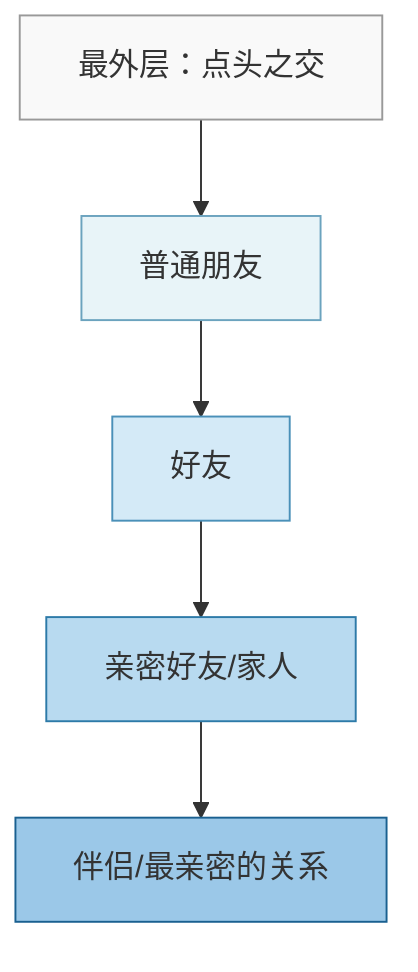

# 第十六章 网络社交沟通 —— 常见误区

网络社交沟通看似门槛极低——会打字就能参与，但正因如此，大量隐性误区被普遍忽视。这些误区不会在你犯错的瞬间发出警告，而是在日积月累中悄悄侵蚀你的社交关系、职业形象和心理健康。本章系统梳理网络社交中最常见的六大类误区，从心理学原理出发，提供可执行的纠正方案和自检工具。

---

## 一、文字沟通中的认知陷阱

文字是网络社交的基础载体，但它天生缺少语调、表情、肢体语言等非语言线索。斯坦福大学心理学家 Byron Reeves 的研究指出，人类在面对面交流中通过非语言渠道获取的信息占总信息量的 60%~70%，而纯文字沟通将这一通道完全切断，迫使接收者用自身的心理状态去"脑补"缺失的部分——这正是大多数文字误解的根源。

### 1.1 语气误读：你的大脑在替对方"配音"

**核心机制：投射效应（Projection Effect）**

当你读到一条简短的文字消息时，大脑会自动为其"配音"。这个配音过程不受你控制，且高度依赖你当下的情绪状态：心情好时，"好的"听起来是爽快的；心情差时，同样的"好的"听起来是敷衍的。

**高频误读对照表：**

| 对方发送的消息 | 可能的真实意图 | 常见误读 | 误读的心理根源 |
|:---:|:---:|:---:|:---:|
| "好的" | 同意、确认、收到 | 对方不情愿 | 对简短回复的不安全感 |
| "嗯" | 知道了、明白了 | 对方敷衍 | 将自身表达习惯投射到对方 |
| "随便" | 都可以、尊重你的选择 | 对方不关心 | 对"不确定感"的焦虑 |
| "哦" | 知道了、了解 | 对方冷淡 | 期待更热情的回应 |
| "呵呵" | 可能是尴尬、可能是无措 | 嘲讽、不屑 | 网络文化赋予的负面含义 |
| "......" | 无语、不知道说什么 | 表达不满 | 将省略号解读为"欲言又止的批评" |
| "行吧" | 可以、同意 | 勉强、不情愿 | "吧"字的语气弱化效果 |
| "随便你" | 交给你决定 | 生气、放弃 | 与口头语"随便你"的愤怒含义混淆 |

**纠正框架——"三秒原则"：**

1. **暂停**：收到让你不舒服的简短消息后，等三秒再反应。情绪激动时做出的回应几乎必然带有误解的成分。
2. **替换**：尝试用三种不同的情绪状态去"朗读"这条消息——中性的、开心的、疲惫的。你会发现同一句话可以有完全不同的味道。
3. **证据检验**：回顾对方最近 5~10 条消息的整体风格。如果对方一直是简洁风格，那"嗯"大概率不是针对你。
4. **直接确认**：如果涉及重要事项，温和地追问一句："你觉得这样可以吗？"比自己脑补十分钟有效得多。

**一个真实场景：**

小王发了一条精心编辑的提议给同事，同事回复了一个"好"。小王开始焦虑：是不是同事觉得我的想法不好？是不是我打扰到他了？实际上，同事只是在开会间隙快速回复确认，"好"就是"好"。小王在脑海中自编自导了一场不存在的冲突，消耗了半小时的情绪和精力。

### 1.2 "呵呵"现象学：一个词的社交死亡史

"呵呵"的语义演变是中国互联网文化变迁的缩影，它揭示了一个重要规律：**网络语言的含义不是固定的，而是由社群共识动态定义的。**

**"呵呵"的语义演变时间线：**

| 时期 | 时代背景 | 主要含义 | 典型使用场景 |
|:---:|:---:|:---:|:---:|
| 2000年前后 | BBS/论坛时代 | 真诚的笑声 | "你说得太对了，呵呵" |
| 2005—2010年 | QQ聊天时代 | 含义开始分化 | 有时真诚，有时敷衍 |
| 2010—2013年 | 微博兴起 | 负面含义占主导 | 敷衍、不想继续聊 |
| 2013年至今 | 全民社交时代 | 几乎=嘲讽 | 被视为"最伤人的词" |

2013年，网友评选"年度最伤人词汇"，"呵呵"以压倒性票数居榜首。复旦大学语言学教授分析认为，"呵呵"的堕落不是因为这个词本身变了，而是因为人们开始大量用它来表达"不愿正面回应但又不得不回复"的尴尬处境，这种用法通过社交媒体迅速扩散，最终覆盖了所有其他含义。

**实操建议：**
- 自己发消息：用"哈哈""哈哈哈""hhhh"或😂替代"呵呵"
- 收到"呵呵"：先检查对方的年龄段和一贯用语风格。60后父母发的"呵呵"大概率是真诚的笑
- 涉及模糊含义时：直接问"你是认真的还是在开玩笑"，远好过猜

### 1.3 标点符号的"情绪密码"

在网络社交中，标点符号已经脱离了语法功能，进化成了情绪信号。这种现象被语言学家称为"标点符号的情感化"（Emotional Punctuation）。

**句号恐惧症（Period Paradox）：**

学术论文中，句号是中性的句末标记。但在微信聊天中，句号传递的信号是冷淡、严肃、甚至生气。剑桥大学 2015 年的一项实验表明，参与者将结尾带句号的短消息评价为"不真诚"的概率比不带句号的高 42%。

| 表达 | 带句号 | 不带句号 | 语气差距 |
|:---:|:---:|:---:|:---:|
| 好的 | "好的。"——冷淡、不高兴 | "好的"——正常、友好 | 显著 |
| 没问题 | "没问题。"——勉强、不情愿 | "没问题"——干脆、爽快 | 中等 |
| 知道了 | "知道了。"——有点烦 | "知道了"——收到 | 显著 |
| 行 | "行。"——不太高兴 | "行"——可以 | 强烈 |

**感叹号的温度梯度：**

| 表达 | 传递的信号 |
|:---:|:---:|
| "收到" | 正常、中性 |
| "收到！" | 热情、积极 |
| "收到！！" | 非常热情，略显夸张 |
| "收到！！！" | 狂喜、过度兴奋（慎用） |

**省略号的多义性：**

省略号是网络社交中含义最丰富的标点，它可以表示无奈、欲言又止、思考、不满、期待，具体含义高度依赖上下文：
- "好吧……"→ 不太情愿，但不想正面拒绝
- "那个……"→ 欲言又止，可能有难以启齿的话
- "嗯……"→ 在思考，或者不知道怎么接
- "你开心就好……"→ 实际上不开心

**冒号与波浪号的隐藏含义：**

- 连续使用冒号"::::"或句号"。。。。"——表示无语、沉默
- 波浪号"~"——语气柔和、撒娇、友好（"好呀~"比"好呀"多了一层亲昵感）
- 中英文句号混用——无特殊含义，通常只是输入法问题，不要过度解读

**纠正策略：** 在私人聊天中，默认不加句号，用空格或换行来断句。需要表达严肃语气时才加句号。用emoji或感叹号来平衡文字的温度。

### 1.4 回复速度的心理博弈

**"秒回期望"背后的依恋心理学：**

心理学中的依恋理论（Attachment Theory）可以解释为什么有些人对回复速度异常敏感。焦虑型依恋风格的人倾向于将延迟回复解读为"被忽视"或"不被重视"，这种解读与实际信息无关，完全源于内在的不安全感。

**回复速度的合理预期（基于社交场景）：**

| 场景 | 合理回复时间 | 超出预期的信号 |
|:---:|:---:|:---:|
| 亲密好友闲聊 | 几分钟到几小时 | 超过24小时未回复 |
| 工作消息（工作时间） | 30分钟到2小时 | 超过半天 |
| 工作消息（非工作时间） | 次日回复即可 | 不必焦虑 |
| 群聊中的闲聊 | 可以不回复 | 完全正常 |
| 重要/紧急事务 | 电话沟通 | 不适合用文字等 |

**关键认知重构：**
- "对方没有秒回"≠"对方不重视我"。对方可能在开车、开会、洗澡、睡觉、或者单纯想先把手头的事做完。
- 回复速度与关系质量之间没有因果关系。有些亲密朋友恰恰因为关系太好，反而不需要即时回应来维系安全感。
- 如果你发现自己频繁因为对方没有秒回而焦虑，这是值得审视自身依恋模式的信号，而不是对方的问题。

### 1.5 文字沟通的隐藏雷区

**雷区一：反讽和幽默的文字表达**

面对面交流中，你可以说"你可真厉害"配合翻白眼，对方立刻知道是反讽。但文字中，"你可真厉害"要么被当真，要么被误读为嘲讽。在不够熟悉的聊天对象面前，文字中的反讽和幽默是一颗定时炸弹。

**解决方案：** 文字中的幽默需要更强的"路标"。加一个"/s"（sarcasm 标记）、一个表情符号、或者明确说"开玩笑的"，都能有效降低误解率。

**雷区二：连续短消息 vs. 长段落**

有些人喜欢一条消息只说一句话，连发十条：
我跟你说
今天发生了一件事
特别离谱
我在地铁上
看到一个人
他居然在地铁上
吃螺蛳粉
整个车厢都臭了
我快疯了
你说气不气人

而另一些人喜欢一次写一大段。这两种风格本身没有对错，但当两种风格的人对话时，短消息方可能觉得长消息方"有压迫感"，长消息方可能觉得短消息方"碎片化、抓不住重点"。

**解决方案：** 了解对方的消息风格偏好。如果不确定，采用"适度段落"——每条消息 2~4 句话，既有完整性又不会刷屏。

---

## 二、社交媒体人设经营的认知偏差

### 2.1 "完美人设"陷阱：精心策划的自我展示

**心理学基础：自我呈现理论（Self-Presentation Theory）**

社会学家 Erving Goffman 在《日常生活中的自我呈现》中提出，人在社交中总是在进行"印象管理"。社交媒体将这种管理推向了极致——你可以精心编辑每一张照片、斟酌每一个字，呈现一个"最佳版本"的自己。

问题在于，这种精心策划的展示会带来四个层面的负面影响：

**第一层：心理负担**

维护完美人设需要持续的精力投入。你发布的每一条内容都要经过"人设审核"：这符合我展示的形象吗？会不会让人觉得我在炫耀？够不够精致？这种持续的自我监控消耗认知资源，造成慢性心理疲劳。

**第二层：关系虚化**

当别人喜欢的是你精心策划的人设，而不是真实的你时，这种关系的基础是脆弱的。你获得的每一个点赞和赞美，都在强化一个虚假的自我——你开始分不清别人喜欢的到底是你还是你的朋友圈。

**第三层：认知失调**

心理学中的认知失调理论（Cognitive Dissonance Theory）指出，当行为与真实信念不一致时，人会感到不适。长期展示"完美生活"与"真实生活"之间的差距越大，认知失调越严重，焦虑感越强。

**第四层：信任崩塌风险**

完美人设是一把双刃剑。一旦某天你的不完美暴露——可能是朋友的无意提及、一次情绪失控、或者与人设矛盾的真实事件——之前积累的信任会迅速瓦解，而且崩塌的速度远快于建立的速度。

**健康的人设管理策略：**

| 策略 | 具体做法 | 预期效果 |
|:---:|:---:|:---:|
| 80/20法则 | 80%真实日常 + 20%精心内容 | 兼顾形象管理和真实性 |
| 脆弱性展示 | 偶尔分享失败和困惑 | 增强真实感，拉近距离 |
| 定期人设审计 | 每季度回顾朋友圈是否太假 | 及时校正偏离 |
| 内容发布前的"真实性测试" | 问自己"如果爸妈/老板/伴侣看到这条会怎样" | 过滤过度包装的内容 |

### 2.2 频率控制："刷屏综合征"

**核心原则：你有表达的自由，别人有不看的自由。**

朋友圈信息流是有限的公共资源。当你频繁发布内容时，你实际上在占用他人的时间和注意力。研究表明，当用户在信息流中看到同一人连续出现 3 条以上时，产生负面情绪的概率提升 67%。

**频率参考基准（非绝对标准，因社交圈而异）：**

| 频率 | 他人可能的感受 | 适用场景 |
|:---:|:---:|:---:|
| 每天0~1条 | 低调、有质感 | 职场人士、不常社交者 |
| 每天1~3条 | 正常、适度 | 大多数人的舒适区 |
| 每天3~5条 | 偏多，开始产生疲劳 | 仅适合深度社交活跃者 |
| 每天5条以上 | 刷屏，可能引发屏蔽 | 除非内容质量极高 |

**高危行为清单：**
- 吃饭必拍照、每餐必分享（食物照疲劳）
- 同一话题反复发布（如连续三天晒同一只猫的同一个睡姿）
- 情绪化连续发圈（吵架了连发五条伤感文案）
- 微商/营销刷屏（直接触发屏蔽/删除）
- 转发不加任何评论（缺乏个人价值判断的信号）

**优化策略：** 合并同类内容。拍了十张美食照，精选一两张发一条，而不是连发十条。用"九宫格"和相册功能来聚合内容，既展示了丰富性又不占据过多信息流。

### 2.3 点赞焦虑：当虚拟认可成为情感货币

**神经科学视角：**

社交媒体上的点赞和评论会触发大脑的多巴胺奖赏回路——与赌博和成瘾行为激活的是同一个神经机制。每一次通知红点亮起，都是一次微小的多巴胺释放。当发布的内容获得预期之外的点赞时，释放量更大。这就是为什么你会不自觉地反复刷新查看点赞数量。

**"点赞焦虑"的三个阶段：**

1. **发布前焦虑**：反复修改文案和配图，担心"发出去没人赞怎么办"
2. **发布后监控**：每隔几分钟查看一次点赞和评论数量
3. **结果解读**：点赞多→自我膨胀；点赞少→自我怀疑，甚至删帖

**认知重构：**

- 点赞数量 ≠ 内容质量。一条朋友圈获得多少赞，取决于发布时间、算法推送、好友活跃度、甚至手机解锁频率等多个与内容本身无关的因素。
- 点赞数量 ≠ 个人价值。把虚拟认可当作自我价值来源，就像用温度计测量体重——工具和目的完全不匹配。
- 删帖行为的信号价值：如果你发现自己经常删掉点赞少的朋友圈，这说明你在用他人的反应来定义自我，这是一个值得觉察的心理模式。

**实操建议：** 关闭朋友圈点赞通知。发布后不主动查看。一周回顾一次，仅作为反思社交习惯的参考，而非情绪的晴雨表。

### 2.4 "朋友圈考古"与数字足迹管理

你三年前发的那条深夜伤感文案，今天可能被一个刚认识的相亲对象翻到。这就是"朋友圈考古"——他人通过翻看你的朋友圈历史来形成对你的判断。

**风险场景：**
- 相亲/约会对象翻看你过去的情绪化内容
- 新同事/领导看到你几年前的吐槽或负面内容
- 商业合作伙伴评估你的专业性时看到不相关内容
- 个人信息被恶意截图传播

**数字足迹管理方案：**

| 策略 | 操作方法 | 适用人群 |
|:---:|:---:|:---:|
| 时间范围限制 | 设置"仅展示最近三天/一个月" | 所有人（强烈推荐） |
| 分组管理 | 创建"家人""同事""密友"等分组，按分组发布 | 社交圈复杂者 |
| 定期清理 | 每季度回顾并删除不再适合公开展示的内容 | 所有人 |
| 敏感内容标记 | 标记仅自己可见或仅密友可见的内容 | 有争议性观点者 |
| 朋友圈签名/封面管理 | 不要在签名中留下过时的情绪或立场 | 所有人 |

---

## 三、表情包与非文字沟通的使用误区

### 3.1 表情包的"表达替代陷阱"

表情包是网络社交中最生动的沟通工具，但当它替代了所有文字表达时，问题就出现了。

**过度依赖表情包的三个隐患：**

1. **信息衰减**：一个"笑哭"的表情可以是真笑、尬笑、无奈、自嘲中的任何一种。在需要准确传递信息的场景中，表情包的信息密度远低于文字。
2. **情感空洞化**：当所有回应都是表情包时，对方感受不到你的真实情感投入。"打了一串哈哈哈"和"真的很好笑，你上次说的那个事情我想起来就想笑"传递的情感浓度完全不同。
3. **能力退化**：长期依赖表情包会导致文字表达能力下降——不是因为你不会写，而是因为你习惯了偷懒。

**使用原则：** 表情包是调味品，不是主菜。在以下场景中应减少或避免表情包：严肃讨论、请求帮助、表达感谢、安慰他人、商务沟通。在闲聊、活跃气氛、表达无伤大雅的情绪时，表情包是很好的工具。

### 3.2 表情包的文化代沟

不同年龄段和社会群体对表情包的理解存在显著差异。这种差异不仅体现在偏好上，更体现在对同一表情的解读上。

**微信内置表情的代际差异地图：**

| 表情 | 年轻人（90后/00后）的解读 | 中老年人（60后/70后）的解读 |
|:---:|:---:|:---:|
| 😊微笑 | 冷漠、嘲讽、"呵呵"的图形版 | 友好、善意、真诚微笑 |
| 🙏双手合十 | 祈求、拜托、"求你了" | 感谢、祈祷、祝福 |
| 👍点赞 | 表示认可（但在某些语境中=敷衍） | 真诚的认可和鼓励 |
| 😅流汗笑 | 尴尬、无语、无话可说 | 真的在笑、开心 |
| 🤝握手 | 合作达成、交易完成 | 友好、正式的问候 |
| 🌹玫瑰 | 仅在浪漫语境中使用 | 通用的善意和祝福 |

**微信表情使用的"代际适配"原则：**
- 给同龄人发消息：避免使用😊微笑，除非明确是反讽
- 给长辈发消息：放心使用😊微笑和👍点赞，他们按字面意思理解
- 给上级/客户发消息：使用频率适中、含义明确的表情，避免搞怪表情包
- 不确定时：用文字替代表情，永远不会出错

### 3.3 表情包的版权与得体性

一个常被忽视的误区：表情包也有使用边界。

- **版权风险**：商业场景中使用未授权的表情包可能涉及侵权
- **政治敏感性**：某些表情包或梗图带有政治隐喻，在不了解对方立场时避免使用
- **冒犯风险**：涉及种族、性别、身体特征的表情包在任何正式场合都不应使用
- **截图陷阱**：你发的表情包可能被截图传播，在公共群聊中尤其注意

---

## 四、语音消息的使用误区

### 4.1 "语音轰炸"：把自己的便利建立在对方的不便之上

语音消息的本质是**将解码成本从发送方转移到了接收方**。发送者省了打字的时间，但接收者需要：
- 花 1 倍于语音时长的时间来收听（无法加速浏览）
- 找一个可以外放的环境，或者掏出耳机
- 无法快速检索信息——想回顾第三句说了什么？重听。
- 无法在公共场合安静地获取信息

**"60秒×5条"的代价分析：**

| | 文字版本 | 语音版本 |
|:---:|:---:|:---:|
| 发送方耗时 | 约3~5分钟 | 约2~3分钟 |
| 接收方耗时 | 约30秒~1分钟 | 约5分钟 |
| 可检索性 | 可搜索、可复制、可转发 | 需重听、不可搜索、转发困难 |
| 环境要求 | 任何环境 | 需要安静环境或耳机 |
| 信息保存 | 可直接存档 | 需要转文字或反复听 |

**语音消息的合理使用场景：**
- 亲密朋友之间的闲聊（双方都习惯语音沟通）
- 表达需要语调支撑的情感（安慰、鼓励、恭喜）
- 对方明确表示方便听语音
- 发送方正在开车/做家务等无法打字的情况

**不适用的场景：**
- 对方正在工作、开会、上课
- 深夜或清晨
- 传达精确信息（地址、电话号码、账号、时间）
- 对方明确表示不方便听语音
- 工作群聊（文字更方便所有人查阅）

### 4.2 语音质量的隐性成本

一条高质量的语音消息应该做到以下几点：
- 环境安静，没有背景噪音
- 语速适中（不是所有人都能跟上快速口语）
- 吐字清晰
- 信息有条理（先说结论，再说细节）
- 时长控制在 30 秒以内

**常见质量问题及后果：**

| 质量问题 | 接收方的体验 | 对方可能的行为 |
|:---:|:---:|:---:|
| 环境噪音大 | 听不清，需要反复听 | 烦躁，可能不再认真听 |
| 语速过快 | 信息遗漏 | 对方遗漏关键信息 |
| 条理混乱 | 听完不知道重点是什么 | 对方要求文字重述 |
| 连发5条60秒 | 心理压力极大 | 直接不听或只听最后一条 |

**发送前自检清单：** 环境安静吗？单条不超过 30 秒？先说了结论？信息需要精确传递吗（是就改用文字）？

### 4.3 语音转文字的使用技巧

微信自带的语音转文字功能是解决"语音轰炸"的有效工具，但它也有局限性：
- 方言识别率较低
- 专业术语可能识别错误
- 长语音转文字后缺乏标点，阅读困难

**建议：** 如果你必须发长语音，可以同时在最后补一条文字版摘要："以上语音的主要意思是：XXX"。这既保留了语音的温度，又提供了文字的可检索性。

---

## 五、网络社交中的边界与伦理误区

### 5.1 "关心"的越界：以爱之名的控制

**核心原则：关心是请求，不是指令。**

过度关心（Over-caring）在网络社交中非常普遍，因为它披着"为你好"的外衣。但在接收方看来，过度关心传递的信号是"我不信任你的判断力"或"你的生活需要我的指导"。

**越界行为清单：**

| 行为 | 发送方的意图 | 接收方的感受 |
|:---:|:---:|:---:|
| 频繁询问感情状况 | 关心你的幸福 | 隐私被侵犯 |
| 对饮食/作息指点 | 关心健康 | 被管教 |
| 未经同意转发他人动态 | 帮忙扩散/炫耀友谊 | 隐私被出卖 |
| 在他人朋友圈下发表批评 | 真诚建议 | 公开处刑 |
| 群发"天气冷了多穿衣服" | 关怀 | 信息噪音（尤其当你们并不熟） |

**边界判断的"亲密-权限"模型：**

你与某人的亲密程度决定了你可以介入的生活领域深度。这个模型可以概括为同心圆：

| 关系层级 | 可以介入的领域 | 不应介入的领域 |
|:---:|:---:|:---:|
| 点头之交 | 天气、公共话题 | 任何私人话题 |
| 普通朋友 | 兴趣爱好、工作概况 | 感情、财务、家庭矛盾 |
| 好友 | 工作困扰、一般性建议 | 具体人生决策的指挥 |
| 亲密好友 | 几乎所有话题 | 仍然需要对方主动求助 |
| 伴侣/家人 | 核心生活决策 | 仍然尊重个人空间 |

### 5.2 "已读不回"焦虑：数字时代的读心术

"已读"功能（或其等价物，如微信的"对方正在输入"提示）创造了一种新的社交焦虑：我知道你看了，但你没回。

**"已读不回"的五种真实含义（非全部是负面的）：**

1. **正在思考**：对方看到了但还没想好怎么回（尤其涉及复杂问题或情感话题）
2. **暂时不方便**：在开会、在地铁、在洗澡——看到了但来不及打字
3. **不知道怎么回**：对方可能不知道该说什么，正在纠结措辞
4. **已经回应过了（在心里）**：有些消息确实不需要回复，"好的，知道了"就完了
5. **确实不想回**：这是所有可能性中最让人不安的一种，但你无法通过猜测来区分

**关键认知：** "已读不回"是一种**沉默**，而沉默可以有一千种含义。你选择哪一种含义来相信，反映的是你的心理状态，而不是对方的真实意图。

**心理调适方案：**
- 事实检验：你有没有过"看了消息但忘记回复"的经历？对方也一样。
- 行动替代焦虑：如果超过 24 小时且事情重要，直接打电话或再发一条温和的提醒，比反复猜测高效一万倍。
- 认知解离："我注意到我在想'他为什么不回我'，但这只是一个想法，不是事实。"

### 5.3 "截图文化"与信任危机

**核心规则：你在网上说的任何话，都可能被截图。**

截图文化是网络社交中最严重的信任破坏因素之一。当人们意识到自己的私密对话可能被第三方看到时，沟通的深度和真诚度会急剧下降。

**截图的伦理边界：**

| 场景 | 是否可以截图 | 理由 |
|:---:|:---:|:---:|
| 朋友间的正常聊天，分享给另一朋友看 | ⚠️ 需要谨慎 | 可能无意中泄露对方隐私 |
| 对方发表威胁/违法言论 | ✅ 可以 | 保护自身权益 |
| 工作中的重要沟通记录 | ✅ 可以 | 留存证据 |
| 恋人的亲密对话，发给闺蜜/兄弟"分析" | ❌ 不应该 | 严重侵犯隐私 |
| 群聊中的争议，截图发到其他群 | ❌ 不应该 | 可能引发网络暴力 |

**自我保护策略：**
- 不要在文字中留下你不想被第三方看到的内容
- 敏感话题尽量电话或面谈
- 如果必须在文字中表达敏感内容，确认对方是可信赖的人
- 发送重要信息前想一想："如果这条消息出现在朋友圈，我能接受吗？"

### 5.4 群聊中的"社交隐形"与"社交膨胀"

群聊是一个独特的社交场域，它同时催生两种极端行为：

**社交隐形（Lurking）：**
- 长期潜水，从不发言，只看不说
- 偶尔冒泡只发表情包
- 问题：在需要帮助或协作时，你缺乏群内的社交信用

**社交膨胀（Over-dominating）：**
- 每条消息都回复，抢占所有话题
- 频繁@他人或发起话题
- 把群聊当作个人舞台
- 问题：让其他群成员感到压力，可能导致被静音或踢出

**健康的群聊参与模式：**
- 有价值的贡献优先于频率。说一句有用的话比发表十条表情包更有价值
- 注意发言与倾听的比例。如果群里有 20 人，你发言的频率不应超过总消息量的 10%~15%
- 尊重群聊主题。在技术群里连续发生活琐事，在闲聊群里频繁发工作链接，都是越界行为
- 避免在群聊中进行只有两个人参与的深入对话——这应该私聊

---

## 六、算法时代的信息茧房与认知偏差

### 6.1 推荐算法如何扭曲你的世界观

**信息茧房（Information Cocoon）效应：**

哈佛大学法学教授 Cass Sunstein 最早提出"信息茧房"概念。当你在社交媒体上持续消费某类内容时，推荐算法会为你构建一个信息气泡：你看到的都是你想看的，或者算法认为你想看的。结果是你误以为"全世界都这么想"，而实际上你只看到了一个被精心筛选的片面世界。

**识别信息茧房的信号：**
- 你觉得"所有人都在讨论XXX"，但跟线下朋友聊天时发现他们完全不知道
- 你的信息流内容高度同质化，几乎看不到不同观点
- 当你遇到与自己观点相反的内容时，第一反应是愤怒而不是好奇
- 你开始觉得"不认同我的人一定是蠢的/被洗脑的"

**破茧策略：**
- 主动关注与自己观点不同的信息源
- 定期浏览不同平台，而非只使用一个
- 对"人人都在说"的信息保持警惕
- 将线上看到的信息与线下朋友的实际反馈做对比

### 6.2 社交比较焦虑：他人朋友圈的"精选集"

**核心认知：你在拿自己的"完整版"和别人的"精选集"比较。**

心理学家 Leon Festinger 的社会比较理论指出，人有天然的倾向去和他人比较来评估自己的能力和观点。社交媒体将这种比较推到了病态的程度——你看到的每一条朋友圈都是精心筛选后发布的，而你了解自己生活的全部细节。

**"比较陷阱"的数学真相：**

假设你有 500 个微信好友，每天刷朋友圈看到 30 条内容。这 30 条是从 500 人的生活中挑选出的最高光时刻。当你把这些高光时刻和自己的日常做对比时，必然觉得自己"不如别人"。这不是逻辑推理，这是统计偏差。

**FOMO（Fear of Missing Out）的三层表现：**

| 层次 | 表现 | 典型内心独白 |
|:---:|:---:|:---:|
| 信息层 | 不断刷新社交媒体，生怕错过热点 | "大家都在讨论这个，我不能不知道" |
| 活动层 | 看到别人参加活动会焦虑 | "他们去了那个派对，为什么没叫我？" |
| 存在层 | 不发朋友圈就觉得自己"消失了" | "如果我不发朋友圈，别人会不会忘记我？" |

**JOMO 替代 FOMO：**

JOMO（Joy of Missing Out）是 FOMO 的健康替代品。它的核心理念是：错过某些东西不仅不可怕，反而是一种自由。当你不再被"别人都在做什么"绑架时，你才能真正专注于自己的生活。

**实操方案：**
1. 关闭朋友圈通知，改为每天固定时间（如晚饭后）浏览 10 分钟
2. 取关让你焦虑的账号（即使是朋友，如果TA的内容持续让你不舒服，也是可以设置"不看TA的朋友圈"的）
3. 培养至少一个与社交媒体无关的线下爱好
4. 练习"感恩日记"：每天记录三件值得感恩的小事，将注意力从"缺什么"转向"有什么"

---

## 七、网络社交中的心理安全误区

### 7.1 "键盘侠"心理：匿名性带来的道德松绑

**心理学机制：在线去抑制效应（Online Disinhibition Effect）**

心理学家 John Suler 提出的"在线去抑制效应"解释了为什么人们在网上会说出线下绝不会说的话。六个因素共同作用：

1. **匿名性**："他们不知道我是谁"
2. **不可见性**："他们看不到我的表情"
3. **异步性**："我不需要立即面对后果"
4. **唯我性**："只有我的感受是真实的"
5. **去权威化**："网上没有权威来约束我"
6. **想象性**："这只是网络，不是真实的"

**自检问题：** 你在网络上说的那些尖锐的话，你敢当面对那个人说吗？如果不敢，那你在网络上说这些话的勇气并不是来自正义，而是来自匿名性的保护。

### 7.2 "网络暴力"的旁观者误区

网络暴力中存在一个普遍的误区：**"我又没参与，跟我没关系。"**

事实上，沉默的旁观者在网络暴力中扮演了关键角色。每一条没有被反驳的恶意评论、每一次没有被举报的骚扰行为、每一个"看热闹"的点赞，都在为施暴者提供社会支持，都在强化受害者的孤立感。

**作为旁观者，你可以做的：**
- 不转发、不评论、不点赞恶意内容
- 私信关心受害者，提供情感支持
- 举报违规内容
- 在评论中表达反对意见（如果安全的话）
- 不参与"人肉搜索"和"网络审判"

### 7.3 网络社交中的"受害者有罪论"

"你为什么要发那条朋友圈？""你为什么要加陌生人？""你为什么要在网上暴露自己的信息？"——这些看似合理的追问，实际上是在将责任从施害者转移到受害者。

**核心原则：** 无论一个人在网络上发布了什么内容，都不构成对其进行骚扰、侮辱或威胁的理由。网络社交的基本底线是：**尊重他人的数字人格权。**

---

## 八、职业场景中的网络社交误区

### 8.1 工作群聊的"高危行为"

工作群聊融合了社交属性和职业属性，这使得它成为一个充满陷阱的场域。

**高危行为清单：**

| 行为 | 风险等级 | 可能后果 |
|:---:|:---:|:---:|
| 在群里发长语音 | 高 | 被同事私下吐槽、影响专业形象 |
| 对领导的发言发表不同意见 | 高 | 公开场合让领导难堪 |
| 深夜在群里讨论工作 | 中 | 给团队造成"内卷"压力 |
| 在群里回复"收到"但不执行 | 高 | 有文字记录的责任证据 |
| 频繁分享与工作无关的内容 | 中 | 影响他人工作效率 |
| 把A群的截图发到B群 | 高 | 信任危机、可能被辞退 |

**工作群聊的"黄金法则"：**
1. 能文字就不用语音
2. 先看上下文再发言
3. 不确定的事私聊确认
4. 群里不讨论敏感话题（薪资、人事变动、对同事的评价）
5. 重要的决定在群里留痕，但决策过程私聊进行

### 8.2 跨平台沟通的"风格错配"

不同的社交平台有不同的沟通文化。在微信里合适的方式，放到钉钉或邮件里可能完全不合适。

**平台沟通风格对照表：**

| 平台 | 沟通风格 | 典型误区 |
|:---:|:---:|:---:|
| 微信私聊 | 轻松、随意 | 在工作中过于随意，缺乏专业性 |
| 微信群聊 | 半正式 | 在工作群里发过多私人内容 |
| 钉钉/飞书 | 正式、高效 | 用社交平台的随意风格处理工作消息 |
| 电子邮件 | 最正式 | 用IM的简短风格写邮件（如只写"见附件"） |
| 朋友圈 | 展示性 | 在朋友圈发布工作抱怨（可能被领导/同事看到） |

**跨平台沟通的核心原则：** 你选择的平台本身就在传递信息。用微信发工作消息传递的是"这件事不太急/不太正式"，用邮件发传递的是"这件事需要认真对待/留有记录"。根据事情的性质选择合适的平台。

---

## 九、误区诊断与纠正的系统框架

### 9.1 "自我觉察清单"——定期审视你的网络社交健康度

每月一次，用以下清单来审视自己的网络社交习惯：

**文字沟通维度：**
- [ ] 我是否经常因为对方的简短回复而焦虑？
- [ ] 我是否过度解读了某条消息的语气？
- [ ] 我的回复是否清晰传达了我的真实意图？
- [ ] 我是否在情绪激动时发送了不该发的消息？

**社交媒体维度：**
- [ ] 我的朋友圈是否太过"完美"、与真实生活脱节？
- [ ] 我是否因为点赞数量而影响了心情？
- [ ] 我是否花了过多时间编辑和查看社交媒体？
- [ ] 我是否对他人朋友圈的内容产生了不必要的嫉妒？

**沟通边界维度：**
- [ ] 我是否尊重了他人的隐私和边界？
- [ ] 我是否在不适当的场合发了语音消息？
- [ ] 我是否参与了网络暴力或传播了未经证实的信息？
- [ ] 我是否在工作群聊中保持了适当的言行？

**心理健康维度：**
- [ ] 我是否对社交媒体产生了依赖？
- [ ] 我是否有"不刷就焦虑"的感觉？
- [ ] 我是否因为社交比较而感到自卑？
- [ ] 我的线下社交是否被网络社交挤占？

### 9.2 "纠正行动卡"——针对每个误区的可执行方案

| 误区类型 | 第一步行动 | 短期目标（一周） | 长期目标（一月） |
|:---:|:---:|:---:|:---:|
| 语气误读 | 实践"三秒原则" | 连续7天不因简短消息焦虑 | 形成稳定的认知重构习惯 |
| 朋友圈焦虑 | 关闭点赞通知 | 每天只查看朋友圈一次 | 重新定义发布朋友圈的目的 |
| 表情包依赖 | 下一条想发表情包的消息改用文字 | 工作沟通中零表情包 | 在所有场景中适度使用 |
| 语音轰炸 | 今天的语音消息全部控制在30秒内 | 养成先说结论的习惯 | 建立"文字为主、语音为辅"的模式 |
| 边界越线 | 回忆最近一次让对方不适的关心行为 | 询问3个朋友对你的社交风格的真实反馈 | 建立清晰的关系-权限模型 |
| 社交媒体依赖 | 设置每日使用时间限制（如2小时） | 关闭非必要的推送通知 | 培养至少一个线下爱好 |

### 9.3 "数字排毒"方案——当你需要完全重置时

如果你感到网络社交已经严重影响了你的情绪和生活质量，可以尝试以下"数字排毒"方案：

**轻度排毒（1~3天）：**
- 关闭所有社交媒体的推送通知
- 将社交媒体App从手机主屏幕移到最后一屏的文件夹里
- 不主动刷社交媒体，只在必要时回复消息

**中度排毒（3~7天）：**
- 卸载社交媒体App（数据不会丢失，重装后恢复）
- 仅保留微信基础通讯功能
- 用省下来的时间做一件一直想做但"没时间"做的事

**深度排毒（7天以上）：**
- 设置自动回复："我最近在做数字排毒，可能回复较慢，急事请打电话"
- 将手机调为灰度模式（去掉色彩后，社交媒体的吸引力大幅降低）
- 每天记录排毒日记，记录情绪变化和新发现

**注意：** 数字排毒不是目的，而是手段。目标不是永远离开社交媒体，而是重建你与社交媒体之间的健康关系——你是使用者，不是被使用者。

---

## 十、本节小结

网络社交沟通中的常见误区可以归纳为以下六层结构：

```mermaid
graph TD
    A[网络社交误区] --> B[文字沟通层]
    A --> C[人设经营层]
    A --> D[非文字表达层]
    A --> E[边界伦理层]
    A --> F[信息环境层]
    A --> G[心理安全层]
    
    B --> B1[语气误读]
    B --> B2[标点符号情绪化]
    B --> B3[回复速度焦虑]
    B --> B4[反讽/幽默风险]
    
    C --> C1[完美人设陷阱]
    C --> C2[刷屏综合征]
    C --> C3[点赞焦虑]
    C --> C4[数字足迹管理]
    
    D --> D1[表情包依赖]
    D --> D2[代际差异]
    D --> D3[语音轰炸]
    
    E --> E1[关心越界]
    E --> E2[已读不回焦虑]
    E --> E3[截图文化]
    E --> E4[群聊行为]
    
    F --> F1[信息茧房]
    F --> F2[社交比较焦虑]
    F --> F3[FOMO]
    
    G --> G1[去抑制效应]
    G --> G2[旁观者效应]
    G --> G3[受害者有罪论]
    
    style A fill:#2d3436,stroke:#2d3436,color:#fff
    style B fill:#636e72,stroke:#636e72,color:#fff
    style C fill:#636e72,stroke:#636e72,color:#fff
    style D fill:#636e72,stroke:#636e72,color:#fff
    style E fill:#636e72,stroke:#636e72,color:#fff
    style F fill:#636e72,stroke:#636e72,color:#fff
    style G fill:#636e72,stroke:#636e72,color:#fff
```

认识到这些误区只是第一步。真正的改变来自于持续的自我觉察和有意识的行为调整。网络社交能力不是天赋，而是可以练习和提升的技能。从今天开始，选择一到两个你最容易犯的误区，用本节提供的纠正框架去实践，你会在一个月内看到显著的改善。
