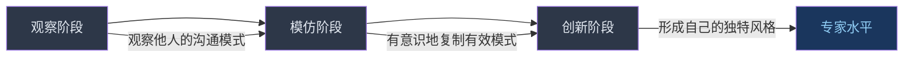
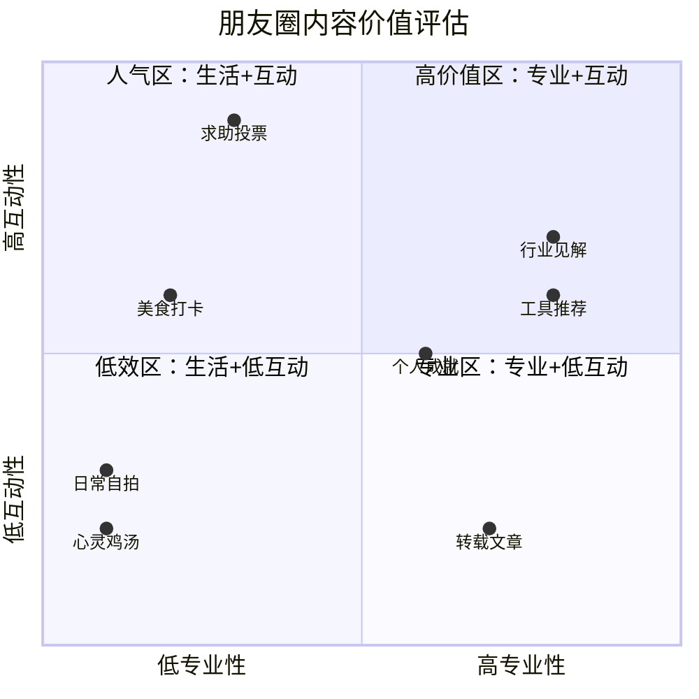
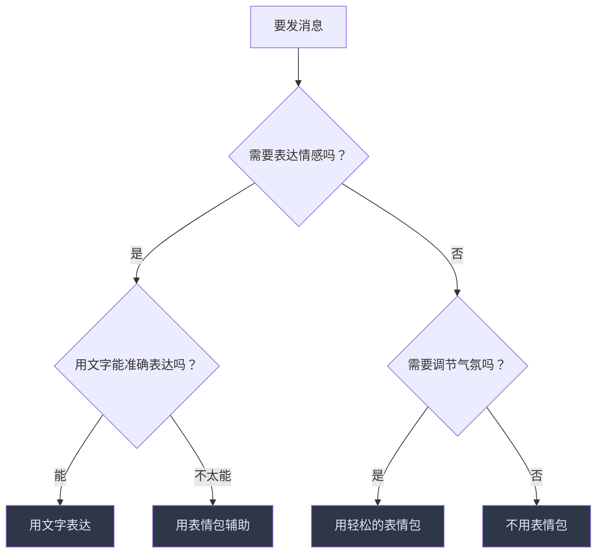

# 第十六章 网络社交沟通 —— 练习方法

***

## 一、练习体系的理论基础

在正式开始练习之前，需要理解为什么"刻意练习"在网络社交中至关重要。许多人认为社交能力是天生的——"有人天生会说话，有人天生不会"。但认知心理学的研究明确否定了这一观点。

### 1.1 刻意练习在网络社交中的适用性

安德斯·艾利克森（Anders Ericsson）在《刻意练习》中提出：任何复杂技能都可以通过有目的的练习来提升，前提是满足四个条件：

| 条件 | 在网络社交中的体现 |
|------|-------------------|
| 明确的目标 | 每次练习聚焦一个具体技能点，如"今天只练开场白" |
| 即时反馈 | 观察对方的回复速度、语气、内容长度来判断效果 |
| 舒适区边缘 | 主动尝试比当前水平略高的社交场景 |
| 重复与修正 | 同一类型场景反复练习，每次优化细节 |

网络社交相比面对面社交，有一个巨大的练习优势：**你有思考时间**。文字沟通天然允许你斟酌用词、修改措辞、甚至撤回重发。这意味着每一次文字对话都是一次低压力的技能训练机会。

### 1.2 社交技能的"肌肉记忆"原理

神经科学研究表明，重复执行某个行为模式会在大脑中形成"神经通路"。当你第一次刻意使用开放式问题时，需要刻意思考"用什么词、怎么问"；但经过50次练习后，开放式提问会变成你的自动反应。

关键数据参考：
- 形成基本习惯：约21天重复
- 技能自动化：约66天重复（伦敦大学学院研究）
- 达到熟练水平：约500次有意识的练习
- 达到专家水平：约5000次有意识的练习

这意味着：如果你每天进行3次有质量的社交练习，大约2个月后，良好的网络社交习惯会开始变得自然。

### 1.3 "观察-模仿-创新"三阶段模型

学习网络社交有一个自然的进阶路径：



- **观察阶段**（第1-2周）：大量阅读优秀的网络沟通案例，注意措辞、节奏、表情符号的使用时机
- **模仿阶段**（第3-8周）：把观察到的有效模式"复制"到自己的沟通中，即使感觉不自然也要坚持
- **创新阶段**（第9周起）：在模仿的基础上融入个人特色，形成自己的沟通风格

***

## 二、日常练习方案

### 2.1 微信聊天技巧练习

#### 练习一：开场白刻意练习

**目标：** 建立"破冰"的条件反射，让开场白从刻意设计变成自然反应。

**练习步骤：**

1. **准备阶段**（5分钟/天）
   - 打开微信好友列表，随机选择3位好友
   - 浏览对方最近3条朋友圈，记录可用的"连接点"
   - 为每人写出2种不同风格的开场白

2. **执行阶段**
   - 选择其中一个发送，另一个留作对比
   - 记录发送时间和对方回复时间（计算响应间隔）
   - 记录对方回复的长度和语气

3. **复盘阶段**（3分钟/天）
   - 对比两种开场白的预期效果和实际效果
   - 分析哪些因素影响了对方的回应意愿
   - 将有效模式记录到"沟通日志"中

**开场白策略矩阵：**

| 策略类型 | 适用场景 | 示例 | 预期回应率 |
|---------|---------|------|-----------|
| 朋友圈关联法 | 对方近期有动态 | "看你去了云南，泸沽湖的水真的那么蓝吗？一直想去" | 高（70%+）|
| 价值提供法 | 你有对方需要的信息 | "上次你说想学Python，看到一篇特别好的入门教程，发你看看" | 高（75%+）|
| 时事关联法 | 有共同关注的话题 | "今天XX发布会你看了吗？那个新功能我觉得特别适合你的工作场景" | 中高（60%+）|
| 共同回忆法 | 认识但久未联系 | "突然想起咱们上次在XX吃的那顿火锅，老板还记得咱们吗哈哈" | 中（50%+）|
| 请教求助法 | 对方是某领域专家 | "有个XX问题想请教，知道你在这方面特别有经验" | 高（80%+）|
| 关心问候法 | 有已知的生活事件 | "你上周说的感冒好些了吗？最近甲流挺严重的" | 中高（65%+）|

**常见开场白雷区：**

| 雷区 | 为什么无效 | 正确做法 |
|------|-----------|---------|
| "在吗？" | 制造焦虑，对方不知道你要说什么，倾向于不回复 | 直接说事情，不要先问"在吗" |
| "好久不见" | 空洞无信息量，对方不知道如何回应 | 加上具体的原因或连接点 |
| "最近忙啥呢？" | 太泛化，像群发消息 | 用具体细节代替泛泛提问 |
| 发一个表情包就完事 | 没有信息量，不构成对话启动 | 表情包只能作为辅助，不能作为开场 |

#### 练习二：对话深度训练

**目标：** 从"表面寒暄"升级到"有质量的对话"，培养深度交流的习惯。

**练习步骤：**

1. **识别对话层次**

   一次微信对话可以分为三个层次，练习的目标是逐步深入到第三层：

   | 层次 | 特征 | 示例 |
   |------|------|------|
   | 表面层 | 交换基本信息，无情感投入 | "最近怎么样？" "还行，你呢？" "也还行" |
   | 中间层 | 分享具体经历和观点 | "最近在忙一个新项目，挺有挑战的" "什么类型的？" |
   | 深度层 | 表达感受、需求、价值观 | "说实话最近压力挺大的，新项目让我重新思考职业方向" |

2. **练习"三轮推进法"**
   - **第一轮**：回应对方的内容 + 提出一个相关问题
   - **第二轮**：分享自己的相关经历 + 表达对对方经历的感受
   - **第三轮**：挖掘更深层的原因或感受 + 自然延伸到新话题

3. **具体操作示例**

   对方说："最近加班好多，好累。"

   | 回复层次 | 示例回复 |
   |---------|---------|
   | 表面层（避免） | "辛苦了" / "注意休息" |
   | 中间层（可接受） | "你们最近在忙什么项目？加了多久了？" |
   | 深度层（推荐） | "听起来确实不容易。是什么类型的项目这么赶？我记得你之前说想换工作来着，现在这个情况有影响你的打算吗？" |

**对话延伸的"STAR"技巧：**

- **S（Share）**：分享自己的相关经历或感受
- **T（Think）**：表达对对方分享内容的思考
- **A（Ask）**：提出一个新的、有深度的问题
- **R（Relate）**：将话题与对方关心的事情关联

示例：对方分享了一本书的读后感。

> **S**："我上个月也看了这本！作者那个关于XX的观点让我印象特别深。"
> **T**："不过我觉得他后面关于XX的论证有点牵强，你怎么看？"
> **A**："他提到的XX方法你在工作中有试过吗？"
> **R**："对了，你之前说在研究XX方向，这本书里那段正好能用上。"

#### 练习三：对话收尾艺术

**目标：** 掌握自然结束对话的技巧，避免"尬聊"和"突然消失"。

**自然收尾的五种方式：**

| 方式 | 适用场景 | 示例 |
|------|---------|------|
| 任务预告法 | 对话有明确目的时 | "好，那我先去准备XX，明天给你结果" |
| 期待延续法 | 想保持连接时 | "今天聊得真开心，下周找个时间线下聚聚？" |
| 价值总结法 | 信息交换较多时 | "你说的这个方法太有用了，我先试试，回头跟你汇报效果" |
| 自然过渡法 | 日常聊天时 | "行，我先去忙了，改天再聊~" |
| 话题完成法 | 话题讨论完整时 | "嗯嗯那就这么定了，周五见！" |

**练习任务：** 连续一周，每次结束对话时都刻意选择一种收尾方式。一周后回顾，记录哪种方式收到的回应最好。

### 2.2 朋友圈经营练习

#### 练习一：内容日历制定与执行

**目标：** 从"想到什么发什么"升级为"有策略地经营朋友圈"。

**朋友圈内容四象限：**



**一周内容规划模板：**

| 日期 | 时间 | 内容类型 | 具体方向 | 文案要点 | 配图要求 |
|------|------|---------|---------|---------|---------|
| 周一 | 7:30-8:30 | 专业内容 | 行业观点/工作感悟 | 有自己的见解，不要只转发 | 数据图表或现场照片 |
| 周二 | 12:00-13:00 | 生活分享 | 美食/运动/阅读 | 展示生活品质和个人趣味 | 高质量实拍照片 |
| 周三 | 21:00-22:00 | 互动话题 | 投票/征求意见/提问 | 降低参与门槛，让人容易回复 | 可选，增强话题感 |
| 周四 | 不发布 | 观察日 | 浏览朋友圈，点赞评论 | 积累社交货币 | — |
| 周五 | 18:00-19:00 | 周末预告 | 计划/活动/心情 | 展示积极的生活态度 | 相关图片 |
| 周六 | 随时 | 生活记录 | 旅行/聚会/活动 | 真实感最重要 | 多图（6-9张最佳） |
| 周日 | 20:00-21:00 | 深度内容 | 思考/总结/推荐 | 展示你的思考深度 | 书封面或相关配图 |

**配图质量检查清单：**

- [ ] 光线充足，不模糊
- [ ] 构图有主体，不杂乱
- [ ] 与文案内容相关
- [ ] 无敏感信息泄露（位置、证件、他人隐私）
- [ ] 数量合理（1张/3张/6张/9张为最佳，避免4张和7张）

#### 练习二：评论互动能力提升

**目标：** 从"点赞之交"升级为"有价值的互动者"。

**评论质量阶梯：**

| 等级 | 类型 | 示例 | 效果 |
|------|------|------|------|
| 1星 | 纯点赞 | 无文字 | 几乎无效果，仅表示"我看到了" |
| 2星 | 泛化评论 | "好看"、"赞"、"太厉害了" | 聊胜于无，对方不会特别记住你 |
| 3星 | 具体评论 | "这个构图好有意境，是在哪拍的？" | 表示认真看了，可能引发对话 |
| 4星 | 价值评论 | "你说的XX观点我特别认同，不过我觉得YY可能更好" | 提供了新的视角，展示你的思考 |
| 5星 | 连接评论 | "你提到的XX让我想起ZZ，你们可以认识一下" | 为对方创造价值，最高效的社交投资 |

**每日评论练习任务：**
1. 每天找出5条朋友圈，写至少3星以上的评论
2. 至少1条要达到4星或5星
3. 记录哪些评论引发了后续对话
4. 一周后统计：哪种类型的评论互动效果最好

### 2.3 表情包与多媒体使用练习

#### 表情包使用的精准度训练

**核心原则：** 表情包是调味品，不是主食。一条消息中表情包不超过消息总内容的20%。

**表情包使用决策树：**



**表情包分类与使用场景：**

| 分类 | 使用时机 | 注意事项 |
|------|---------|---------|
| 日常问候类 | 早安/晚安/节日 | 避免群发感太强的祝福图，加上个性化文字 |
| 情感表达类 | 开心/难过/惊讶 | 只用在关系亲近的人之间，工作场景慎用 |
| 搞笑幽默类 | 活跃气氛/化解尴尬 | 注意对方的接受度，避免冒犯性内容 |
| 缓和气氛类 | 表达善意/缓解紧张 | "狗头保命"类表情可降低误解风险 |
| 工作相关类 | 群聊互动/表达态度 | 仅限轻松的工作群，正式沟通不用 |

**表情包库存管理练习：**
1. 清理：删除超过6个月没用过的表情包
2. 分类：按场景建立文件夹（日常/搞笑/工作/节日）
3. 更新：每周添加1-2个符合当下热点的新表情包
4. 测试：在不同场景下使用，记录哪些表情包引发的回应最好

### 2.4 跨平台社交能力练习

不同社交平台有不同的沟通规则和用户预期。只会在微信上聊天是不够的。

**各平台沟通风格对比：**

| 平段 | 沟通特点 | 正式程度 | 最佳内容形式 | 常见误区 |
|------|---------|---------|------------|---------|
| 微信私聊 | 一对一，深度交流 | 中等 | 文字+语音 | 过度使用语音消息 |
| 微信群聊 | 多人，话题切换快 | 中低 | 简洁文字+图片 | 在群里发长篇大论 |
| 朋友圈 | 异步，展示性质 | 中等 | 图文搭配 | 刷屏或过度营销 |
| 微博 | 公开，传播性质 | 低 | 短文+话题标签 | 在评论区激烈争吵 |
| 小红书 | 种草，视觉导向 | 低 | 图文笔记/视频 | 标题党但内容空洞 |
| 知乎 | 深度，专业 | 高 | 长文回答 | 只抖机灵不提供价值 |
| 抖音/B站 | 视频为主 | 低 | 短视频/中视频 | 没有鲜明个人特色 |
| 邮件 | 正式，商务 | 高 | 结构化文字 | 主题栏写得不清楚 |
| 企业微信/钉钉 | 工作沟通 | 高 | 简洁明确的文字 | 混淆工作和生活语气 |

**跨平台练习任务：**
1. 选择你常用的3个平台
2. 针对同一个话题（比如最近看的一部电影），在3个平台上分别发布内容
3. 对比不同平台的回应差异
4. 总结：什么内容在什么平台效果最好

***

## 三、情境模拟训练

情境模拟是最接近实战的练习方式。以下是经过设计的模拟场景，每个场景都包含背景、目标、操作步骤和预期效果分析。

### 3.1 微信私聊场景模拟

#### 场景一：新加好友后的第一次对话

**背景：** 在行业会议上认识了李工（做产品设计的），交换了微信名片。你希望和他建立长期的职业联系。

**挑战：** 第一条消息决定了对方是否愿意继续交流。

**模拟练习：**

1. 写出4种不同风格的开场白：

   | 风格 | 示例 |
   |------|------|
   | 会议回顾型 | "李工好，昨天会上你分享的那个用户研究方法太赞了，我回去就跟团队说了，下周准备试试看" |
   | 价值提供型 | "你好李工，我记得你提过在研究XX设计趋势，刚好看到了一篇很好的报告，分享给你" |
   | 共同话题型 | "李工，会上聊得太仓促了。你提到的那个XX项目，我之前在YY公司也接触过类似的" |
   | 轻松自然型 | "嗨，我是昨天会上坐你旁边的那个，一直在偷听你的分享哈哈" |

2. 评估每种开场白的风险和收益：
   - 会议回顾型：安全，但可能显得客套
   - 价值提供型：最高效，但需要你真正有对方需要的信息
   - 共同话题型：最容易延续对话，但需要你有相关经历
   - 轻松自然型：最亲切，但需要看场合和对方性格

3. 选择最适合的一种发送，然后准备好3-5个后续话题方向

#### 场景二：重启久未联系的关系

**背景：** 大学室友小王，毕业后各奔东西，已经2年没联系了。你看到他朋友圈发了创业的消息，想重新建立联系。

**挑战：** 如何跨越"冷关系"的尴尬，自然地重新连接。

**模拟练习：**

1. **第一阶段：轻触（第1天）**
   - 给他的创业朋友圈点个赞
   - 写一条有质量的评论："恭喜啊！你之前在学校就特别有想法，创业项目是哪个方向的？"
   - 不主动私聊，先让对方注意到你

2. **第二阶段：连接（第2-3天）**
   - 如果他回复了你的评论，趁势私聊
   - 开场白："看到你创业了，特别佩服你的勇气。最近怎么样？"
   - 准备好聊：自己的近况、对创业的好奇、共同朋友的动态

3. **第三阶段：深化（第1-2周）**
   - 根据聊天情况，提出线下见面的邀请
   - 邀请要有具体时间和场景："下周三晚上有空吗？我知道一家不错的馆子，咱边吃边聊？"

**禁忌清单：**
- ❌ 一上来就借钱、推销、求帮忙
- ❌ 过度热情，让人感觉有目的
- ❌ 假装关系还很好，忽视时间的间隔
- ✅ 坦诚地承认"好久没联系了"，然后展示真诚的兴趣

#### 场景三：工作中的微信沟通

**背景：** 你需要和一个重要客户通过微信讨论一个即将到期的项目deadline问题。客户可能不太高兴。

**挑战：** 既要维护关系，又要推进工作，还要管理对方的情绪。

**模拟练习：**

1. **开场设计**
   - 不要一上来就说问题，先建立连接："王总，上次那个方案您看了吗？团队那边有几个想法想跟您聊聊。"
   - 用"我们一起面对"的语气，而不是"你那边的问题"

2. **信息传达**
   - 使用"总-分-总"结构：先说结论，再说原因，最后说方案
   - 示例："关于deadline的事，我建议咱们调整一下时间线。主要原因是XX和YY。新的计划是……您看这个方案可以吗？"

3. **异议处理**
   - 如果客户不满，使用"认同-转移-解决"策略：
   - "您说的对，时间确实很紧（认同）。不过如果赶工的话质量可能会受影响（转移）。我建议咱们先交付核心功能，剩余部分延后一周（解决）。"

4. **结束确认**
   - 总结达成的共识
   - 明确下一步的行动项和责任人
   - "好的，那咱们就按这个方案来：我这边周三前完成XX，您那边周四前给YY反馈。有任何问题随时沟通。"

### 3.2 群聊场景模拟

#### 场景一：工作群汇报

**背景：** 需要在50人的项目群里汇报本周工作进展，有好消息也有坏消息。

**结构化汇报模板：**

【第X周工作汇报】
负责人：XXX | 日期：YYYY-MM-DD

✅ 已完成：
1. XXX（比计划提前2天）
2. XXX（达到预期目标）

🔄 进行中：
1. XXX（进度70%，预计周三完成）
2. XXX（遇到XX问题，需要YY部门支持）

⚠️ 风险提示：
1. XXX可能影响整体进度，建议优先级调整
2. 需要在周五前确认XX方案

📌 下周计划：
1. XXX
2. XXX

有问题随时沟通 🙏

**关键技巧：**
- 用emoji（✅🔄⚠️📌）做视觉分隔，便于快速扫描
- 坏消息和好消息混着说，不要全放后面
- 遇到问题时一定要带解决方案，不要只抛问题
- 长汇报分段发，每段之间留3-5秒间隔，避免刷屏

#### 场景二：家庭群中的长辈沟通

**背景：** 家庭群里姑姑转发了一条"喝柠檬水能治癌症"的养生谣言。

**处理策略：**

| 步骤 | 做法 | 示例 |
|------|------|------|
| 1. 先肯定动机 | 不要直接否定，先认可关心健康的出发点 | "姑姑一直这么注重养生，真好👍" |
| 2. 私聊而非群里纠正 | 给长辈留面子，单独说 | 私信姑姑："姑，刚看到您转发的那个，我查了一下好像有些说法不太准确……" |
| 3. 提供替代方案 | 不要只说"这是假的"，要给出正确信息 | "不过柠檬确实挺好的，维C含量高，每天喝点温柠檬水对身体确实有好处" |
| 4. 引用权威来源 | 长辈更信权威 | "三甲医院的XX医生有个科普视频说的挺清楚的，我发给您看看" |

**绝对不能做的事：**
- ❌ 在群里公开说"这是假的/谣言"
- ❌ 发一个表情包讽刺
- ❌ 建了一个"家族辟谣群"
- ❌ 翻旧账："你上次转发的那个也是假的"

#### 场景三：兴趣群中的争议处理

**背景：** 在一个摄影群里，有人发了一张经过重度后期处理的照片，引发了一场"P图算不算摄影"的争论。

**参与讨论的正确方式：**

1. **表达立场时用"我"开头，不用"你"开头**
   - ❌ "你这P得也太过了吧"
   - ✅ "我个人更喜欢后期少一点的风格，但每个人的审美不同嘛"

2. **用提问代替反驳**
   - ❌ "后期和前期同样重要"
   - ✅ "想请教一下，你后期的主要思路是什么？我自己还在摸索"

3. **找到共识再表达不同**
   - "构图和光影确实抓得好，这个前期功底很扎实。我个人是在后期方面口味偏轻一点，不过这只是个人偏好。"

### 3.3 跨平台场景模拟

#### 场景：从线上社交到线下见面

**背景：** 你在知乎上和一位答主互相评论了好几次，觉得聊得来，想约线下见面。

**完整流程模拟：**

| 阶段 | 平台 | 行动 | 时间节点 |
|------|------|------|---------|
| 1. 建立连接 | 知乎 | 在对方的回答下持续高质量互动 | 1-2周 |
| 2. 私信沟通 | 知乎私信 | 移步私信，讨论更深入的话题 | 互动3-5次后 |
| 3. 转移到即时通讯 | 微信 | "方便加个微信吗？知乎上不太方便发图片" | 私信聊2-3天后 |
| 4. 微信深化 | 微信 | 继续交流，了解更多共同兴趣 | 1-2周 |
| 5. 线下邀约 | 微信 | 提出具体的线下活动建议 | 微信互动稳定后 |
| 6. 线下见面 | 线下 | 选择公共场合，活动性质的见面 | 对方同意后1周内 |

**邀约话术模板：**

> "聊了这么久发现咱们对XX都挺有热情的。下周六XX地方有个YY活动/展览，你有兴趣一起看看吗？顺便可以当面聊聊，网上聊毕竟不如面对面来得痛快😄"

**安全注意事项：**
- 第一次见面选在公共场合（咖啡馆、商场、活动现场）
- 告知一位朋友你的去向和预计回来的时间
- 第一次见面时间控制在2小时以内
- 如果感觉不舒服，随时可以找理由离开

***

## 四、反馈与改进机制

### 4.1 数据驱动的自我评估

不要凭感觉评估自己的社交能力，要用数据说话。

**每日社交数据记录模板：**

```markdown
## YYYY-MM-DD 社交日志

### 对话记录
| 时间 | 对象 | 平台 | 发起方 | 对话轮次 | 响应速度 | 情绪走向 |
|------|------|------|--------|---------|---------|---------|
| 9:00 | 小张 | 微信 | 我 | 8轮 | <1min | 积极→深入 |
| 14:00 | 王总 | 企业微信 | 对方 | 5轮 | 2-3min | 中性→解决 |

### 朋友圈数据
| 发布时间 | 内容类型 | 点赞数 | 评论数 | 主动私聊人数 |
|---------|---------|--------|--------|------------|
| 12:00 | 专业内容 | 23 | 5 | 2 |

### 今日反思
- 做得好：____________
- 待改进：____________
- 明日目标：____________
```

### 4.2 关键绩效指标（KPI）体系

将社交能力量化，每月追踪趋势变化：

**互动质量指标：**

| 指标 | 计算方式 | 初级目标 | 中级目标 | 高级目标 |
|------|---------|---------|---------|---------|
| 对话深度 | 平均对话轮次 | >3轮 | >6轮 | >10轮 |
| 响应速度 | 对方平均回复时间 | <30min | <15min | <5min |
| 朋友圈互动率 | （点赞+评论）/ 好友数 | >5% | >10% | >20% |
| 新关系建立 | 每月新增有价值联系人 | 2-3人 | 5-8人 | 10+人 |
| 关系维护 | 每月主动联系老朋友次数 | 5次 | 15次 | 30次 |

**形象管理指标：**

| 指标 | 评估方式 | 目标状态 |
|------|---------|---------|
| 朋友圈内容多样性 | 专业/生活/互动的比例 | 3:4:3 |
| 负面反馈率 | 引发不愉快的互动占比 | <5% |
| 跨平台一致性 | 不同平台的个人形象是否统一 | 高度一致 |
| 第一印象成功率 | 新好友首次聊天的积极回应率 | >80% |

### 4.3 他人反馈的获取方法

**方法一：直接请求反馈**

选择3位不同类型的朋友（亲密好友、普通朋友、工作伙伴），分别问：

> "我想提升一下自己的网络沟通能力，你能帮我看看吗？具体来说：
> 1. 跟我聊天时，你觉得有什么不太舒服的地方吗？
> 2. 你觉得我的朋友圈风格怎么样？有没有什么建议？
> 3. 如果要给我的网络社交能力打分（1-10），你会打几分？为什么？"

**注意事项：**
- 选择信任度高且愿意说真话的人
- 说明这是为了自我提升，不是客套
- 得到反馈后不要辩解，先记录再消化
- 每3个月做一次，追踪进步

**方法二：行为信号分析**

从对方的行为中提取隐性反馈：

| 行为信号 | 可能含义 | 应对策略 |
|---------|---------|---------|
| 经常不回消息 | 对话题不感兴趣或觉得不重要 | 调整话题选择和开场方式 |
| 回复总是很短 | 不想深聊或在忙 | 换个时间段，或减少聊天频率 |
| 朋友圈总被跳过 | 内容对TA没有价值 | 调整内容方向 |
| 私聊很积极但不互动朋友圈 | 更看重你们的私人关系 | 这是好事，维持 |
| 群聊中经常@你 | 认可你的价值或观点 | 继续在群里提供价值 |

### 4.4 常见问题诊断与纠正

| 症状 | 可能原因 | 纠正方法 |
|------|---------|---------|
| 发消息经常不被回复 | 开场白缺乏吸引力 | 回到"开场白练习"，用策略矩阵优化 |
| 聊天总是几句话就冷场 | 只回应不延伸 | 练习"STAR"技巧，每次回应都带一个新话题 |
| 朋友圈没人点赞 | 内容与受众不匹配 | 分析高赞朋友圈的共性，调整内容策略 |
| 被人说"太客气" | 缺少个人情感表达 | 增加"我"开头的主观表达，减少客套用语 |
| 在群里说话没存在感 | 发言频率低或内容太泛 | 提供具体的专业见解，而非泛泛评论 |
| 经常被误解语气 | 纯文字缺少语气线索 | 善用表情包和语气词（"哈哈"、"呢"、"~"） |

***

## 五、进阶学习路径

### 5.1 初级阶段（第1-12周）：建立基础习惯

**核心目标：** 从"无意识的糟糕习惯"到"有意识的正确习惯"。

**每周练习计划：**

| 周次 | 重点练习 | 每日时间 | 关键动作 |
|------|---------|---------|---------|
| 第1-2周 | 开场白 | 15分钟 | 每天练习3种不同开场白，记录回应率 |
| 第3-4周 | 对话维持 | 20分钟 | 每次对话至少进行3轮有意义交流 |
| 第5-6周 | 朋友圈经营 | 15分钟 | 按内容日历发布，练习评论互动 |
| 第7-8周 | 群聊参与 | 15分钟 | 每天在至少1个群中进行有价值发言 |
| 第9-10周 | 收尾与边界 | 10分钟 | 练习自然结束对话和拒绝不当请求 |
| 第11-12周 | 综合实战 | 30分钟 | 将所有技能综合运用到日常社交中 |

**阶段里程碑：**
- [ ] 能自然地发起对话，开场白回应率>60%
- [ ] 能维持10轮以上的深度对话
- [ ] 朋友圈平均点赞数提升50%
- [ ] 建立了每日社交复盘的习惯

### 5.2 中级阶段（第13-24周）：提升深度与影响力

**核心目标：** 从"能聊天"到"会社交"，开始经营个人品牌。

**学习内容：**

1. **网络社交心理学基础**
   - 互惠原理：先给予，再索取
   - 社会认同：展示你的专业能力和社会证明
   - 稀缺性：不必随时在线，创造"限量感"
   - 一致性：保持各平台形象的一致

2. **个人品牌建设**
   - 确定你的"社交人设"——不是假装，而是放大你最想展示的一面
   - 在特定领域持续输出专业内容
   - 让别人提到某个话题时，第一时间想到你

3. **高级沟通技巧**
   - 非暴力沟通在网络环境中的应用
   - 如何在网络上表达不同意见而不引发冲突
   - 如何处理网络上的负面评价和攻击
   - 如何在职场社交中平衡友好和专业

**练习升级：**

| 练习项目 | 初级版 | 中级版 |
|---------|--------|--------|
| 开场白 | 使用模板 | 根据对方个性定制 |
| 对话维持 | 追求轮次 | 追求深度和价值 |
| 朋友圈 | 按计划发布 | 基于数据反馈优化 |
| 群聊 | 参与讨论 | 引领讨论方向 |
| 新关系 | 被动添加 | 主动经营有价值的人脉 |

**阶段里程碑：**
- [ ] 在至少一个领域被视为"有见解的人"
- [ ] 朋友圈互动率提升到15%以上
- [ ] 拥有5个以上通过网络建立的深度关系
- [ ] 能自信地处理网络冲突

### 5.3 高级阶段（第25周+）：战略社交与影响力

**核心目标：** 从"会社交"到"社交产生价值"，让网络社交服务于你的人生目标。

**深度学习方向：**

1. **社交网络分析（SNA）**
   - 了解你社交网络的结构（中心节点、桥接节点、边缘节点）
   - 识别你网络中的"弱连接"（弱连接理论：弱连接比强连接更有信息价值）
   - 有意识地填补社交网络中的空白

2. **影响力运营**
   - 从1对1社交升级到1对多的影响力
   - 内容策略：什么内容能被传播、什么内容只能被消费
   - 社群运营：如何创建和维护一个有活力的社群

3. **跨文化网络社交**
   - 不同文化背景下的沟通差异
   - 国际社交平台的使用技巧（LinkedIn、Twitter/X等）
   - 如何在全球化的社交网络中建立影响力

4. **社交与职业发展的整合**
   - 如何通过社交获取职业机会
   - 如何通过社交建立行业影响力
   - 如何将线上关系转化为线下的合作关系

**持续精进的习惯：**
- 每月分析一次自己的社交网络变化
- 每季度更新一次个人品牌定位
- 每半年学习一个新的社交平台或工具
- 每年回顾并调整社交策略

***

## 六、实用练习工具

### 6.1 沟通日志详细模板

每次重要的网络社交互动后，花2分钟填写：

```markdown
## 沟通日志

- **日期：** YYYY-MM-DD
- **对象：** [姓名/昵称]
- **关系类型：** 亲密朋友/普通朋友/同事/客户/新认识
- **平台：** 微信/群聊/朋友圈/微博/知乎/其他
- **话题：** [简要描述]
- **发起方：** 我/对方
- **对话轮次：** [数字]
- **我的开场方式：** [具体文字]
- **对方的回应：** [积极/中性/消极]
- **对话深度：** 表面层/中间层/深度层
- **做得好的地方：** [具体描述]
- **可以改进的地方：** [具体描述]
- **学到的教训：** [一句话总结]
```

### 6.2 朋友圈内容规划表

```markdown
## 周度朋友圈规划 — 第X周

### 本周目标
- 发布数量：[目标条数]
- 互动目标：[点赞/评论目标数]
- 内容主题方向：[关键词]

### 发布计划
| 日期 | 时间 | 类型 | 主题 | 文案要点 | 配图 | 状态 |
|------|------|------|------|---------|------|------|
| 周一 | 8:00 | 专业 | | | | ⬜ |
| 周三 | 12:30 | 生活 | | | | ⬜ |
| 周五 | 21:00 | 互动 | | | | ⬜ |
| 周日 | 20:00 | 深度 | | | | ⬜ |

### 本周复盘
- 最高互动条目：[哪条，为什么]
- 最低互动条目：[哪条，为什么]
- 下周调整方向：[具体]
```

### 6.3 社交能力综合自评量表

每月月初花10分钟做一次自评，追踪成长曲线：

| 评估维度 | 评估问题 | 评分(1-5) | 上月分数 | 变化 |
|---------|---------|-----------|---------|------|
| 开场能力 | 我能自然地发起新对话 | | | |
| 倾听能力 | 我能准确理解对方的意图和感受 | | | |
| 表达能力 | 我能清晰地表达自己的想法 | | | |
| 话题能力 | 我能轻松找到和延伸话题 | | | |
| 情绪管理 | 我能在情绪化时保持理性沟通 | | | |
| 冲突处理 | 我能妥善处理意见分歧 | | | |
| 边界意识 | 我能尊重自己和他人的边界 | | | |
| 形象管理 | 我的网络形象一致且正面 | | | |
| 内容创作 | 我能产出有价值的朋友圈/内容 | | | |
| 关系维护 | 我能持续维护有价值的关系 | | | |
| 平台适应 | 我能适应不同平台的社交规则 | | | |
| 影响力 | 别人愿意听取和采纳我的意见 | | | |

**评分标准：**
- 1分：完全不具备
- 2分：偶尔能做到
- 3分：有时能做到
- 4分：大部分时候能做到
- 5分：自然且熟练

### 6.4 每日5分钟快速复盘模板

不需要每天写详细的沟通日志，用这个5分钟模板快速记录即可：

今天社交打卡 ✅

💬 对话：X次
📱 朋友圈：发布X条 / 评论X条
⭐ 最好的一次互动：[一句话]
⚠️ 需要改进的：[一句话]
🎯 明天的社交目标：[一个具体动作]

### 6.5 社交能力提升追踪表

用于长期追踪，每月更新一次：

```markdown
## 社交能力月度追踪 — YYYY年X月

### 核心指标
- 本月主动发起对话：___次
- 平均对话深度（轮次）：___
- 朋友圈发布：___条
- 朋友圈平均互动：___次
- 新建立有价值关系：___人
- 处理冲突事件：___次

### 本月突破
1. _______________
2. _______________

### 本月困惑
1. _______________
2. _______________

### 下月重点
1. _______________
2. _______________
```

***

## 七、常见误区与纠偏

### 7.1 练习阶段的典型错误

| 误区 | 表现 | 为什么是错的 | 正确做法 |
|------|------|-------------|---------|
| 急于求成 | 练习一周就觉得没效果，放弃 | 习惯形成需要至少21天 | 坚持至少4周再评估效果 |
| 机械套模板 | 所有对话都用同一套话术 | 对方能感觉到你的不真诚 | 模板只是起点，要融入个人特色 |
| 只练不反思 | 每天发很多消息但不回顾 | 没有反馈的练习是低效的 | 每天花5分钟复盘 |
| 刻意表演 | 在网上塑造一个完全不同的自己 | 早晚会被看穿，损害信任 | 放大真实的自己，不是假装别人 |
| 只关注技巧 | 背了很多话术但缺乏真诚 | 技巧是手段，真诚才是核心 | 先关心对方，再考虑怎么说 |
| 忽视负面信号 | 对方已经不感兴趣了还继续 | 会造成社交压力，适得其反 | 学会识别和尊重拒绝信号 |
| 过度社交 | 每天花大量时间在社交上 | 影响工作和生活，也会让人觉得你很闲 | 设定每日社交时间上限（如30分钟） |

### 7.2 关于网络社交的三个真相

**真相一：不是所有人都值得你花时间经营**

你的时间和精力是有限的。邓巴数（Dunbar's Number）告诉我们，人类能维持的稳定社交关系上限约为150人。其中：
- 核心圈（5人）：最亲密的人，每周都要联系
- 亲密圈（15人）：好朋友，每月至少联系一次
- 活跃圈（50人）：经常互动的熟人
- 外围圈（150人）：认识但不常联系的人

练习时要把最多精力放在核心圈和亲密圈上。

**真相二：线上社交不能替代线下社交**

研究表明，面对面交流中产生的催产素（信任激素）在纯文字交流中几乎不产生。网络社交应该是线下社交的补充和延伸，不是替代。最好的网络社交策略是：线上建立连接 → 线下深化关系 → 线上持续维护。

**真相三：社交能力的提升不是线性的**

你可能会在练习2个月后觉得有明显进步，然后在第3个月遇到瓶颈，甚至觉得自己"退步"了。这是完全正常的——你的标准在提高，感知在变敏锐。突破瓶颈的方法是：换一个练习角度，或者增加练习难度。

***

## 八、本节小结

网络社交沟通能力是一项可以通过系统练习获得的技能，而非天赋。本节的核心框架可以概括为"一个理念、两套工具、三个阶段"：

**一个理念：** 刻意练习——每次社交都是一次有目的的训练，而不是漫无目的地闲聊。

**两套工具：**
1. **日常练习工具**（第二章）：开场白、对话维持、朋友圈经营、表情包使用、跨平台适应
2. **反馈改进工具**（第四章）：沟通日志、KPI体系、他人反馈、问题诊断

**三个阶段：**
1. **初级（1-12周）**：建立正确的基础习惯
2. **中级（13-24周）**：提升深度和影响力
3. **高级（25周+）**：战略社交，让社交产生真实价值

最后，请记住三个原则：

1. **真诚是1，技巧是0。** 没有真诚，再多的技巧也只是套路。
2. **质量高于数量。** 3个深度对话的价值远大于30个"点赞之交"。
3. **持续胜于爆发。** 每天练习15分钟，比一周突击3小时有效得多。

好的网络社交不是让所有人都喜欢你，而是让你在意的人更了解你、信任你、愿意与你建立长久的连接。

***
