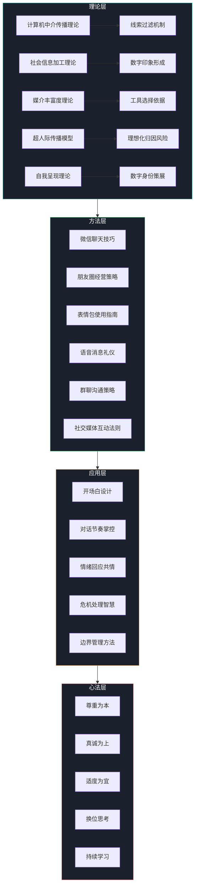
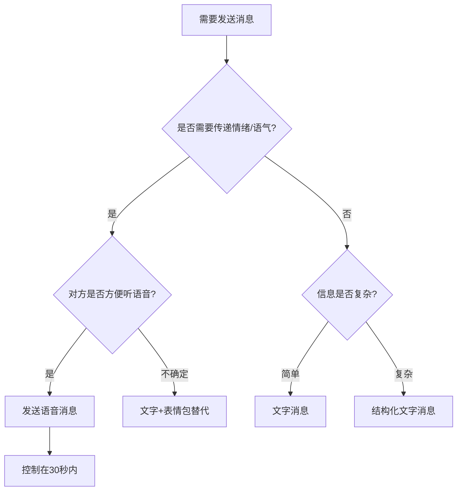

# 第十六章 网络社交沟通 —— 本章小结

***

## 一、知识架构全景图

本章从理论奠基到实战应用，构建了一套完整的网络社交沟通知识体系。以下是各模块之间的逻辑关系：

这张架构图揭示了一个关键逻辑：**理论决定认知高度，方法决定执行效率，应用决定实际效果，心法决定长期走向。** 四层缺一不可——只有方法没有理论，遇到新场景就束手无策；只有理论没有方法，懂得道理却做不好；只有方法没有心法，技巧会沦为操控术。

***

## 二、五大理论的核心提炼与融合理解

### 2.1 计算机中介传播（CMC）理论 —— "线索过滤"的底层逻辑

CMC理论的核心观点是：网络社交并非面对面社交的"残缺版"，而是一种具有独立特征的沟通形态。当非语言线索（面部表情、肢体语言、语调、空间距离）被大幅过滤后，文字、表情符号、回复速度、消息长度等成为新的"数字语言线索"。

**一句话掌握：** 网络社交中，你发出的每一条消息的用词、标点、长度、发送时间、回复速度，都在替你"说话"——你需要像管理表情和语气一样管理这些数字信号。

### 2.2 社会信息加工理论 —— "时间换深度"的适应机制

该理论解释了人们如何在缺乏非语言线索的环境中逐步建立印象。核心机制是：线索不足 → 投入更多认知资源 → 随时间推移逐步补充信息 → 最终形成完整印象。这意味着网络社交关系的建立需要更多的互动次数和更长的互动周期。

**一句话掌握：** 线上关系的建立比线下慢，但一旦建立，深度可能超过线下——耐心和持续投入是关键。

### 2.3 媒介丰富度理论 —— "选对工具"的决策框架

不同媒介传递信息的能力差异巨大。媒介丰富度从低到高排列：

| 媒介类型 | 丰富度等级 | 适用场景 | 不适用场景 |
|---------|----------|---------|----------|
| 纯文字消息 | ★☆☆☆☆ | 简单确认、信息传递 | 复杂情绪表达、敏感话题 |
| 文字+表情符号/表情包 | ★★☆☆☆ | 日常闲聊、轻度情感交流 | 深度沟通、严肃讨论 |
| 语音消息 | ★★★☆☆ | 情感传递、详细解释 | 需要对方即时反馈的场景 |
| 语音通话 | ★★★★☆ | 深度对话、解决分歧 | 时间紧张的简短沟通 |
| 视频通话 | ★★★★★ | 亲密关系维护、复杂话题 | 公共场合、对方不方便时 |

**一句话掌握：** 消息越重要、情绪越复杂、误解风险越高，就越应该选择丰富度高的媒介。

### 2.4 超人际传播模型 —— "理想化"的双刃剑

网络社交的异步性和可控性允许发送者精心编辑信息、优化自我呈现，而接收者在缺乏完整线索的情况下倾向于进行理想化归因。这解释了为什么网友之间有时会快速产生强烈的好感——但也埋下了"见光死"的隐患。

**一句话掌握：** 网络上的"完美印象"可能是编辑出来的，保持理性认知、适时将线上关系延伸到线下，才能验证关系的真实性。

### 2.5 自我呈现理论 —— "数字身份策展"的本质

Goffman的"拟剧论"在网络时代演变为"数字身份策展"。朋友圈是你的"舞台"，头像和签名是你的"戏服"，每一条发布都是精心编排的"表演"。但过度策展会导致"人设疲劳"——维持一个与真实自我差距过大的网络形象，需要持续消耗心理能量，且一旦"人设崩塌"，反噬效应远超线下。

**一句话掌握：** 适度包装是社交智慧，过度包装是社交隐患。真实的"80分自我"比虚假的"100分人设"更可持续。

### 2.6 理论融合：一张决策速查表

当你面对一个具体的网络社交场景时，可以快速调用以下理论框架做决策：

| 你面临的问题 | 对应理论 | 决策要点 |
|------------|---------|---------|
| 不知道该用文字还是语音 | 媒介丰富度理论 | 消息复杂度和情绪浓度决定媒介选择 |
| 对方消息简短，担心关系出问题 | CMC理论 | 文字线索有限，不要过度解读，关注整体模式 |
| 网聊感觉对方特别合拍 | 超人际传播模型 | 警惕理想化归因，适时线下验证 |
| 不知道该在朋友圈发什么 | 自我呈现理论 | 真实优先，适度包装，维持一致性 |
| 线上关系进展缓慢 | 社会信息加工理论 | 正常现象，需要更多互动周期来补充信息线索 |

***

## 三、核心技巧的分层总结

### 3.1 微信聊天：从"能聊"到"会聊"到"聊得好"

| 能力层级 | 表现特征 | 核心突破点 |
|---------|---------|----------|
| 初级：能聊 | 能发起对话，能回应对方 | 消灭"在吗"式开场，学会用情景关联法自然切入 |
| 中级：会聊 | 能维持有质量的对话，能识别对方情绪 | 掌握"开放式提问+适度自我暴露"的对话引擎 |
| 高级：聊得好 | 能让对方期待与你聊天，能处理复杂社交场景 | 建立"对话节奏感"——何时推进、何时留白、何时转向 |

**微信聊天的黄金公式：**

有效开场 = 关联点（朋友圈/共同经历/时事） + 真诚关注 + 开放式钩子
对话维持 = 共情回应 + 自我暴露 + 深入追问 + 适度幽默
优雅收尾 = 总结收获 + 表达感受 + 预告未来 + 自然过渡

### 3.2 朋友圈经营：从"随意发"到"有策略"到"无痕迹"

| 能力层级 | 表现特征 | 核心突破点 |
|---------|---------|----------|
| 初级：随意发 | 想到什么发什么，无规律 | 建立"内容比例意识"——生活/观点/专业/互动的配比 |
| 中级：有策略 | 有计划地发布，注重互动质量 | 掌握发布时机和评论区二次社交技巧 |
| 高级：无痕迹 | 看似随意实则用心，自然而不刻意 | 让策略内化为习惯，经营痕迹消失在真实表达中 |

**朋友圈内容的"四三三"法则：**

- 40% 真实生活分享（日常、旅行、美食、兴趣）
- 30% 观点与见解（读书笔记、行业思考、生活感悟）
- 30% 互动与连接（回应他人、发起讨论、分享有价值的信息）

### 3.3 表情包使用：从"凑合用"到"精准用"到"创造用"

表情包不是装饰品，而是一套完整的**数字非语言表达系统**。它承担三大功能：

1. **情绪标记功能** —— 补充文字无法传递的情绪信息（"好的😊" vs "好的"）
2. **氛围调节功能** —— 缓解尴尬、化解紧张、增添趣味
3. **身份认同功能** —— 通过表情包风格传递你的审美取向和群体归属

**表情包选择的"三看"原则：**
- **看对象** —— 对长辈用经典表情、对朋友用潮流表情、对同事用中性表情
- **看场景** —— 正式对话少用、轻松聊天多用、敏感话题慎用
- **看频率** —— 适度点缀是调味、过度使用是噪音、用表情包替代表达是逃避

### 3.4 群聊生存：从"潜水"到"有效参与"

群聊是一种独特的多人沟通场域，遵循与一对一聊天完全不同的规则。不同类型的群聊需要不同的生存策略：

| 群聊类型 | 核心规则 | 角色定位 | 关键禁忌 |
|---------|---------|---------|---------|
| 工作群 | 效率优先，信息精准 | 专业的信息提供者和协作者 | 闲聊、表情包轰炸、深夜消息 |
| 朋友群 | 气氛活跃，情感连接 | 话题贡献者和气氛维护者 | 过度沉默、扫兴发言、公开揭短 |
| 家族群 | 尊重长辈，温和耐心 | 孝顺的晚辈和信息过滤器 | 直接否定、不耐烦语气、已读不回 |
| 兴趣群 | 话题相关，价值交换 | 有价值的贡献者 | 纯潜水、广告引流、无意义刷屏 |

### 3.5 语音消息礼仪：便利与尊重的平衡

语音消息是微信沟通中争议最大的功能之一。使用得当，它能传递文字无法承载的温度和语气；使用不当，它会成为一种"社交暴力"。

**语音消息的"三要三不要"：**

| 要 | 不要 |
|---|-----|
| 要控制单条时长在30秒以内 | 不要连续发送多条60秒长语音 |
| 要考虑对方的接收环境 | 不要在对方明显不方便时发语音 |
| 要用语音传递情感和语气 | 不要用语音传递复杂信息（如地址、数字、步骤） |

**语音消息的决策树：**

***

## 四、关键原则的深度解读

### 原则一：尊重为本 —— 网络社交的"宪法"

尊重在网络社交中不是一个抽象概念，而是一系列具体可执行的行为准则：

- **尊重时间** —— 每条消息都消耗对方的注意力资源。"在吗？"之所以令人反感，是因为它强迫对方进行一次"猜测-回复-再等待"的无效交互循环。直接说事，是对对方时间的最大尊重。
- **尊重隐私** —— 截图转发前先征得同意，不在公开场合暴露他人的私人信息，不未经允许将他人拉入群聊。数字时代的隐私边界比物理时代更脆弱，也更需要主动维护。
- **尊重边界** —— 对方没有义务秒回你的消息，也没有义务对你的朋友圈点赞。接受"不回应也是一种回应"，是网络社交成熟度的标志。
- **尊重差异** —— 有人喜欢用句号，有人喜欢用感叹号；有人爱发表情包，有人偏好纯文字。不要用自己的表达标准去衡量他人的沟通诚意。

### 原则二：真诚为上 —— 最高效的社交策略

真诚不是"有什么说什么"的直白，而是一种**信息一致性**——你在线上呈现的自我与线下真实自我的差距越小，你需要维护的心理成本就越低，关系的可持续性就越强。

研究数据佐证：康奈尔大学的一项研究发现，社交媒体上"高自我监控"（即频繁调整自我呈现策略）的用户，虽然短期内获得了更多的社交反馈，但长期的社交满意度和心理健康水平均低于"低自我监控"的用户。**精心维护的人设是一种隐性负债。**

### 原则三：适度为宜 —— 网络社交的"剂量效应"

几乎所有网络社交行为都存在"倒U型曲线"——适度有益，过度有害：

| 行为 | 适度的效果 | 过度的效果 |
|-----|----------|----------|
| 发朋友圈 | 维持社交存在感，分享有价值的内容 | 信息过载导致被屏蔽或取关 |
| 回复速度 | 传递重视和热情 | 造成"秒回焦虑"和被依赖 |
| 自我暴露 | 建立信任和亲密感 | 引起不适或被利用 |
| 社交媒体使用 | 获取信息、维持连接 | 社交倦怠、焦虑、注意力碎片化 |

### 原则四：换位思考 —— 数字共情的核心能力

网络社交中的换位思考比线下更难，因为缺少非语言线索来辅助判断。培养数字共情的具体方法：

1. **发送前的"3秒检查"** —— 发出消息前停顿3秒，想象自己是接收方，第一反应是什么
2. **"最善意解读"原则** —— 对方的消息存在多种解读时，默认选择最善意的那种
3. **"时间换空间"策略** —— 感到被冒犯时，不要立即回复，给自己至少30分钟的冷静期
4. **主动确认机制** —— 涉及重要或敏感话题时，主动询问"我表达清楚了吗？"或"你是不是这个意思？"

### 原则五：持续学习 —— 网络社交的"版本迭代"

网络社交是一个以月为单位迭代的领域。2020年流行的"绝绝子""YYDS"，到2024年已成为"过时"用语；2023年年轻人热衷的"搭子社交"，到2025年已发展出更精细的形态。保持学习的具体方法：

- **每月花30分钟浏览社交平台的热门话题和流行语**，不是为了跟风使用，而是为了理解当下的社交语境
- **关注不同年龄段的社交习惯差异**，避免用自己的经验去"教育"他人
- **定期复盘自己的社交行为**，识别哪些做法有效、哪些需要调整

***

## 五、自检清单：你的网络社交能力处于哪个阶段？

阅读完本章后，用以下清单评估自己的网络社交能力。每个维度按1-5分打分，然后计算总分和平均分。

### 微信聊天能力自检

| 评估项目 | 1分（很少） | 3分（有时） | 5分（经常/总是） |
|---------|-----------|-----------|---------------|
| 我能用自然的方式开启对话 | 用"在吗"开场 | 有时能关联话题 | 总能找到自然的切入角度 |
| 我能维持有质量的对话 | 经常尬聊 | 有时能深入交流 | 对方通常会主动继续聊 |
| 我能识别对方的情绪信号 | 经常误读 | 有时能察觉 | 能敏锐感知对方的情绪变化 |
| 我能优雅地结束对话 | 突然消失或生硬结束 | 有时能找到自然收尾 | 对话结束时双方都感到舒适 |

### 朋友圈经营能力自检

| 评估项目 | 1分（很少） | 3分（有时） | 5分（经常/总是） |
|---------|-----------|-----------|---------------|
| 我发布内容有计划和策略 | 随意发 | 有时会想一想 | 有明确的内容比例和发布节奏 |
| 我的评论互动有质量 | 只点赞或"不错" | 有时能写出有内容的评论 | 评论通常能引发进一步交流 |
| 我对朋友圈形象有清晰认知 | 不太在意 | 有时会注意 | 能清晰描述自己的网络人设 |

### 群聊与社交平台能力自检

| 评估项目 | 1分（很少） | 3分（有时） | 5分（经常/总是） |
|---------|-----------|-----------|---------------|
| 我能在不同群聊中切换风格 | 一种风格走天下 | 有时会调整 | 在工作群/朋友群/家族群表现不同 |
| 我能处理群内冲突和尴尬 | 冲动回应或完全回避 | 有时能妥善处理 | 能在维护关系的同时化解冲突 |
| 我对社交平台差异有认知 | 所有平台用同一套 | 有时会区分 | 了解不同平台的隐性规则 |

### 数字边界与心理健康自检

| 评估项目 | 1分（很少） | 3分（有时） | 5分（经常/总是） |
|---------|-----------|-----------|---------------|
| 我能管理社交媒体使用时间 | 经常刷到停不下来 | 有时能控制 | 有明确的使用时间规划 |
| 我能处理社交比较带来的焦虑 | 经常因为别人的朋友圈焦虑 | 有时会受影响 | 能理性看待他人的"高光时刻" |
| 我有清晰的隐私边界意识 | 不太注意隐私设置 | 有时会检查 | 定期审查各平台的隐私设置 |

**评分解读：**

- **总分 52-65 分：网络社交高手** —— 你已经具备了成熟的网络社交能力，继续保持并关注新趋势
- **总分 39-51 分：进阶学习者** —— 你有不错的基础，针对薄弱环节重点突破即可
- **总分 26-38 分：初级学习者** —— 你已经意识到网络社交需要学习，这是最重要的第一步
- **总分 13-25 分：入门阶段** —— 建议从本章的核心技巧部分开始，逐项练习

***

## 六、核心要点速查卡

### 6.1 理论速查

| 理论名称 | 一句话核心 | 实际应用 |
|---------|----------|---------|
| CMC理论 | 网络社交不是低配版线下社交，是独立形态 | 不要用面对面社交的标准评判网络社交 |
| 社会信息加工 | 线上关系建立需要更长的信息补充周期 | 给新关系足够的时间和互动次数 |
| 媒介丰富度 | 不同工具传递信息的能力不同 | 重要/复杂/敏感消息选择高丰富度媒介 |
| 超人际传播 | 网络社交容易产生理想化印象 | 保持理性认知，适时线下验证 |
| 自我呈现 | 网络是数字身份策展空间 | 真实优先，适度包装 |

### 6.2 技巧速查

**微信聊天开场白模板库：**

朋友圈关联法："看到你分享的[具体内容]，[你的真实反应]..."
共同回忆法："突然想起咱们[具体经历]，哈哈你还记得吗？"
时事关联法："最近[热点事件]你关注了吗？你怎么看？"
关心问候法："上次你说[具体事项]，后来怎么样了？"
价值提供法："看到一个[内容]，觉得你会感兴趣，分享给你。"

**朋友圈发布的"黄金时段"：**

| 时段 | 活跃度 | 适合发布的内容类型 |
|-----|-------|----------------|
| 早7:00-8:30 | ★★★☆ | 正能量内容、早间分享 |
| 午12:00-13:30 | ★★★★ | 轻松有趣的内容、午间消遣 |
| 晚20:00-22:00 | ★★★★★ | 重要内容、深度分享、互动型内容 |
| 周末全天 | ★★★★ | 生活分享、休闲娱乐内容 |

**群聊"安全发言"检查清单：**

- [ ] 这条消息与群聊主题相关吗？
- [ ] 这条消息对群内大多数人有价值吗？
- [ ] 我在这个群里的角色适合说这句话吗？
- [ ] 如果这条消息被截图转发，我能否承担后果？
- [ ] 现在是合适的发送时间吗？

### 6.3 常见误区速查

| 误区 | 正确做法 | 背后原理 |
|-----|---------|---------|
| 用"在吗"开场 | 直接说事，附上问候 | 减少对方的猜测成本和焦虑 |
| 秒回所有消息 | 重要消息及时回复，一般消息适度间隔 | 避免形成"秒回期待"的隐性压力 |
| 对方回复简短=不重视 | 结合整体沟通模式判断 | 文字线索有限，不要过度解读单一信号 |
| 朋友圈追求完美人设 | 真实比完美更有吸引力 | 过度包装是隐性负债，真诚是长期资产 |
| 用表情包替代所有表达 | 表情包是调味品，不是主菜 | 核心情感表达需要文字承载 |
| 连续发60秒语音 | 单条控制在30秒内，关键信息用文字 | 尊重对方的时间和接收环境 |
| 在朋友圈对杠 | 私聊解决分歧 | 公开对峙没有赢家，只会消耗社交资本 |
| 社交媒体上与他人比较 | 专注自身成长 | 你看到的是别人的精选片段，不是完整生活 |

***

## 七、从"知道"到"做到"的行动路径

### 7.1 即刻行动清单（今天就做）

以下行动不需要任何准备，今天就可以执行，每项不超过10分钟：

| 序号 | 行动 | 预期效果 | 耗时 |
|-----|------|---------|-----|
| 1 | 检查微信头像、昵称、签名，确认是否传达了你想要的形象 | 数字身份的第一印象优化 | 5分钟 |
| 2 | 检查朋友圈的隐私设置（谁可以看、谁不可以看） | 隐私边界保护 | 5分钟 |
| 3 | 翻看最近一周的聊天记录，找出3个可以改进的对话 | 发现自己的沟通模式 | 10分钟 |
| 4 | 整理表情包库，删除不适合公开使用的表情包 | 避免误发尴尬 | 5分钟 |
| 5 | 给一位很久没联系的朋友发一条真诚的问候 | 维护弱关系连接 | 5分钟 |

### 7.2 一周内完成的行动

| 序号 | 行动 | 具体做法 | 预期效果 |
|-----|------|---------|---------|
| 1 | 制定一周朋友圈发布计划 | 按"四三三"法则规划7天的内容类型 | 建立发布节奏感 |
| 2 | 实践3种新的开场白方式 | 每天用不同的模板与好友开启对话 | 找到最适合自己的开场方式 |
| 3 | 给5位好友的朋友圈写有质量的评论 | 每条评论至少包含：回应具体内容+分享自己的相关经验或提问 | 提升评论区社交质量 |
| 4 | 评估自己在3个不同群聊中的角色 | 记录你在工作群/朋友群/家族群中的发言频率和类型 | 发现群聊行为模式 |
| 5 | 完成一次"社交审计" | 以陌生人的视角审视自己的朋友圈主页 | 发现网络形象的盲区 |

### 7.3 一个月内完成的行动

| 序号 | 行动 | 具体做法 | 预期效果 |
|-----|------|---------|---------|
| 1 | 建立沟通日志习惯 | 每周记录2-3次值得复盘的社交互动 | 形成反思-改进的循环 |
| 2 | 处理1-2个长期存在的社交问题 | 选择一个让你不舒服的关系，用本章方法主动处理 | 解决积压的社交困扰 |
| 3 | 系统优化跨平台形象 | 对照各平台特点调整头像、签名、内容策略 | 建立一致的数字身份 |
| 4 | 拓展2-3个新的社交连接 | 通过兴趣社群、行业活动等途径建立新关系 | 扩展社交网络 |

### 7.4 持续进行的长期行动

| 行动 | 频率 | 具体做法 |
|-----|------|---------|
| 关注网络社交新趋势 | 每月1次 | 浏览社交平台热门话题、了解新功能和新玩法 |
| 复盘社交表现 | 每周1次 | 回顾本周的社交互动，总结做得好和需要改进的地方 |
| 调整社交策略 | 每季度1次 | 评估当前的社交策略是否仍然有效，根据生活变化做调整 |
| 帮助他人提升社交能力 | 持续 | 将学到的技巧分享给需要的朋友，教学相长 |

***

## 八、本章知识的迁移应用

网络社交沟通的技巧不局限于微信和朋友圈，其底层逻辑可以迁移到更广泛的场景中：

### 8.1 向职场场景迁移

本章学到的"开场白设计"技巧可以直接应用于职场即时通讯（如钉钉、飞书）：
- **不要**："在吗？"
- **要**："王经理，关于XX项目的进度报告已完成，有3个关键点需要您确认，方便时看一下？"

"群聊策略"可以迁移到项目协作群：
- 信息结构化（使用标题、分点、emoji标记）
- 角色清晰（谁是信息提供者、谁是决策者）
- 时间敏感（非紧急消息在工作时间发送）

### 8.2 向内容创作迁移

如果你是自媒体从业者或内容创作者：
- 朋友圈经营的"内容比例"思维可以直接应用于社交媒体内容规划
- 评论区互动技巧可以提升粉丝运营质量
- 表情包和视觉表达能力可以增强内容的传播力

### 8.3 向人际关系维护迁移

本章的核心原则（尊重、真诚、适度、换位思考）适用于所有人际关系，不仅仅是网络社交：
- 面对面沟通同样需要"开场白设计"
- 线下社交同样需要"边界管理"
- 所有沟通都需要"情绪管理"和"危机处理"

***

## 九、延伸阅读与学习资源

### 9.1 推荐书籍

| 书名 | 作者 | 与本章的关联 | 适合读者 |
|-----|------|------------|---------|
| 《社交天性》 | 马修·利伯曼 | 从脑科学解释社交本能，理解"为什么我们天生需要社交" | 所有读者 |
| 《影响力》 | 罗伯特·西奥迪尼 | 六大影响力原则在网络社交中的应用 | 希望提升社交说服力的读者 |
| 《情商》 | 丹尼尔·戈尔曼 | 情商是网络社交的核心能力基础 | 希望系统提升情商的读者 |
| 《沟通的艺术》 | 罗纳德·阿德勒 | 人际沟通的系统理论框架 | 希望深入理解沟通原理的读者 |
| 《乌合之众》 | 古斯塔夫·勒庞 | 理解群体心理，对群聊和社交媒体中的群体行为有启发 | 对群聊策略感兴趣的读者 |
| 《数字化生存》 | 尼葛洛庞帝 | 理解数字时代人类行为的底层逻辑 | 对数字文化感兴趣的读者 |

### 9.2 学术文献精选

本章涉及的核心学术文献，供希望深入研究的读者参考：

1. Walther, J. B. (1996). Computer-mediated communication: Impersonal, interpersonal, and hyperpersonal interaction. *Communication Research*, 23(1), 3-43.
   —— 超人际传播模型的奠基之作，解释网络社交中理想化印象的形成机制

2. Suler, J. (2004). The online disinhibition effect. *CyberPsychology & Behavior*, 7(3), 321-326.
   —— 网络去抑制效应的经典研究，解释为什么人们在网络上更容易表达极端观点

3. Kiesler, S., Siegel, J., & McGuire, T. W. (1984). Social psychological aspects of computer-mediated communication. *American Psychologist*, 39(10), 1123.
   —— CMC理论的早期经典文献

4. Daft, R. L., & Lengel, R. H. (1986). Organizational information requirements, media richness and structural design. *Management Science*, 32(5), 554-571.
   —— 媒介丰富度理论的原始论文

5. Goffman, E. (1959). *The Presentation of Self in Everyday Life*. Doubleday.
   —— 自我呈现理论的源头，理解"拟剧论"在网络时代的应用

### 9.3 实用在线资源

| 资源 | 类型 | 推荐理由 |
|-----|------|---------|
| 丁香医生 | 健康科普 | 关注社交媒体与心理健康的专业内容 |
| 少数派 | 数字生活 | 学习数字工具使用技巧和效率方法 |
| 知乎相关话题 | 社区讨论 | 了解不同人群的网络社交经验和观点 |

***

## 十、结语

网络社交沟通的学习没有终点，因为社交的形式和规则在持续演变。但有些底层逻辑不会改变：

**真诚永远是最高效的社交策略。** 所有的技巧、模板、策略，如果脱离了真诚的底色，都会沦为操控术，最终反噬使用者自身。

**尊重永远是关系的基石。** 尊重对方的时间、隐私、边界和选择，这种尊重在数字时代比以往任何时候都更稀缺、也更珍贵。

**适度永远是健康的保障。** 网络社交应该增强而非消耗你的社交能量和心理健康。当你发现自己在社交媒体上感到焦虑、疲惫、自我怀疑时，最好的策略不是学习更多技巧，而是暂时放下手机，去见一个真实的人。

**记住这句话：网络社交的终极目标，不是获得更多的点赞和关注，而是建立真实、有意义的人际关系。** 技术是工具，人心是根本。无论网络社交的形式如何变化，真诚、尊重、共情永远是有效沟通的基石。

***
