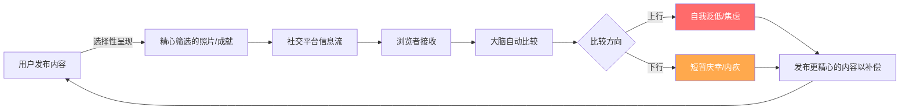
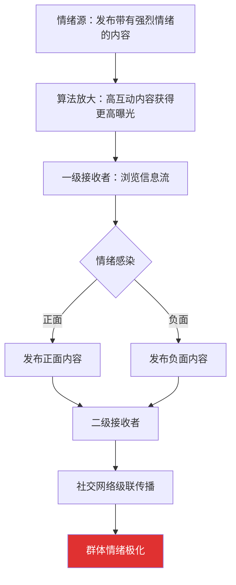
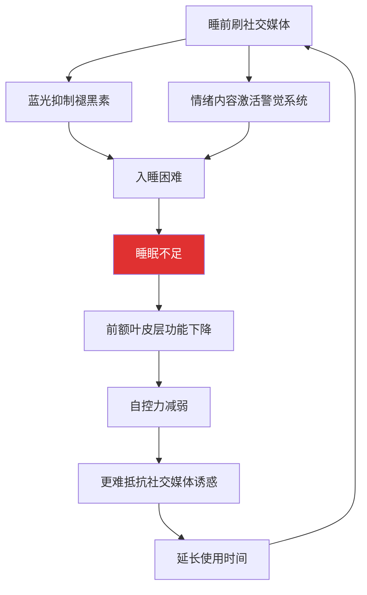
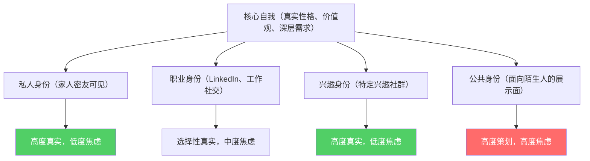
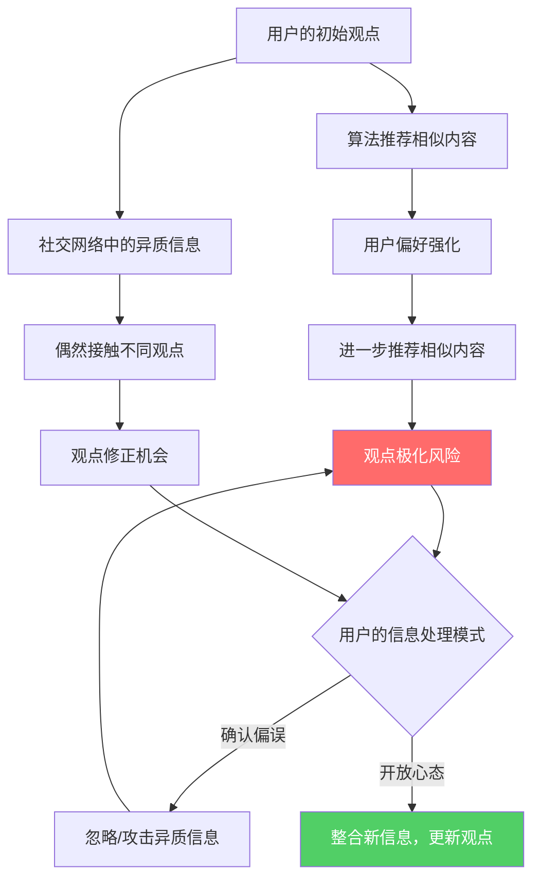
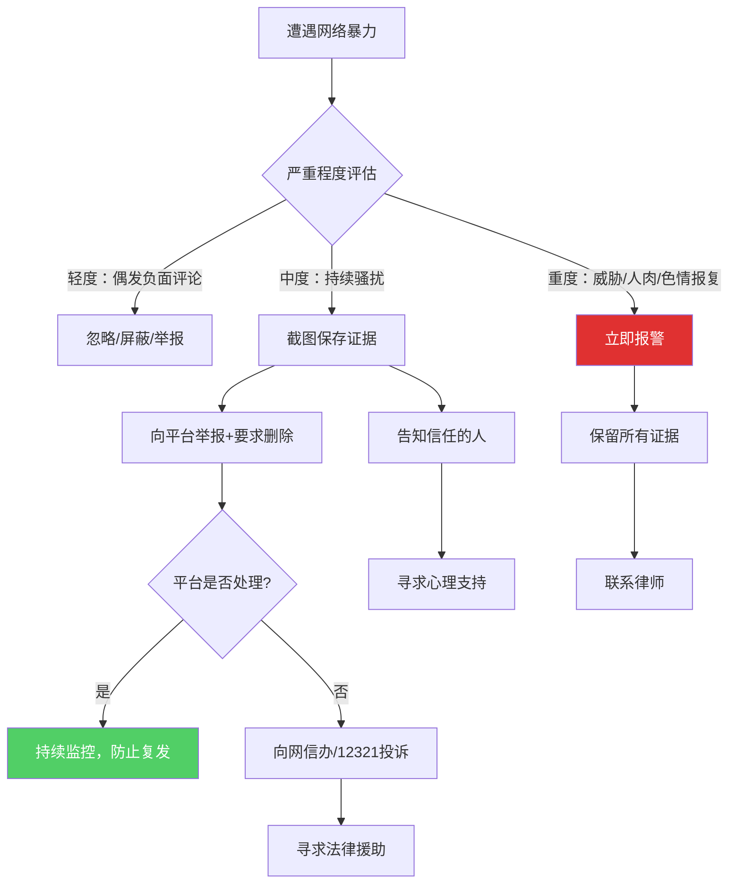
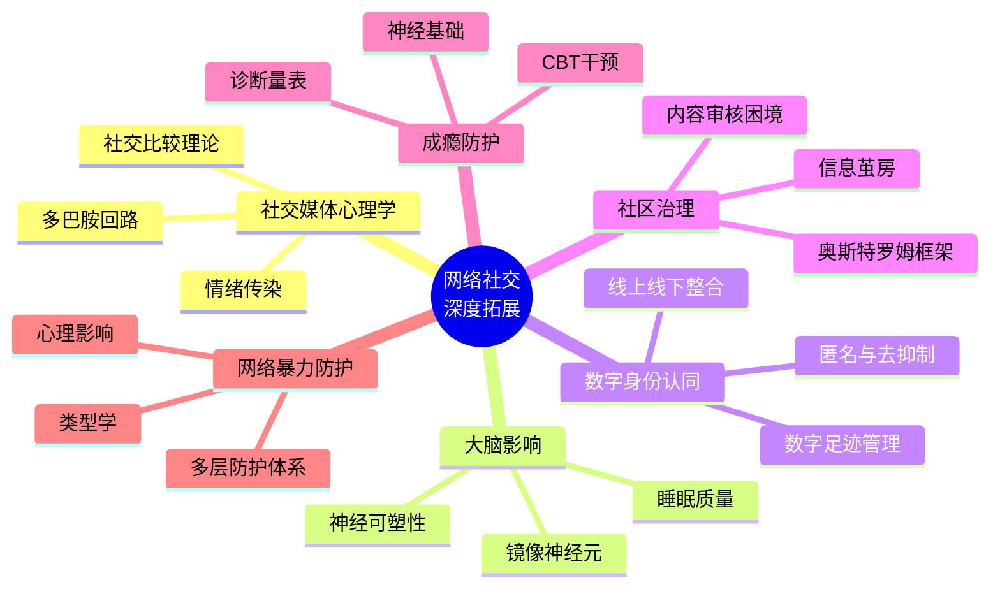

# 第十六章 网络社交沟通 · 深度拓展

> 本章是第十六章的进阶延伸，聚焦社交媒体心理学机制、大脑神经影响、数字身份认同、社区治理、成瘾防护与网络暴力六大前沿议题。每一节从理论原理出发，经由实证研究，落脚到可操作的自测工具与行动策略，实现"道法术器"的完整闭环。

---

## 一、社交媒体心理学研究

社交媒体并非中性的信息管道——它是一台精心设计的心理引擎，深刻影响着人类的比较本能、奖励回路和情绪状态。理解底层心理学机制，是建立健康网络社交习惯的第一步。

### 1.1 社交比较理论在数字环境中的演变

费斯廷格（Leon Festinger）1954年提出的**社交比较理论**指出，人类有评估自身能力和观点的内在驱动力，当缺乏客观标准时，会通过与他人比较来完成自我评估。在传统社会中，比较对象限于同事、邻居、同学等有限社交圈；而社交媒体将这一范围扩大到了全球尺度——你不再是和邻居比收入，而是和全网最光鲜的陌生人比生活。

**上行比较与下行比较的不对称效应：**

| 比较类型 | 定义 | 社交媒体中的典型场景 | 心理效应 | 持续时长 |
|---------|------|---------------------|---------|---------|
| 上行比较 | 与比自己"更好"的人比较 | 看到朋友的旅行/升职/健身照 | 短暂激励→长期自卑 | 负面效应可持续数小时至数天 |
| 下行比较 | 与比自己"更差"的人比较 | 看到他人的困境/失败 | 短暂满足→道德不安 | 正面效应通常短暂（<30分钟） |
| 平行比较 | 与相似处境的人比较 | 关注同龄同行业的博主 | 最稳定的情绪影响 | 可正可负，取决于信息解读方式 |

神经影像学研究发现，上行比较会激活**前扣带皮层**（anterior cingulate cortex）和**前脑岛**（anterior insula），这两个区域与社会疼痛和自我威胁感知密切相关。换言之，看到别人过得比你好，在大脑层面产生的反应与被拒绝、被排斥时的疼痛感受有显著重叠。

**"高光时刻"效应的认知偏差机制：**

哥伦比亚大学的一项纵向研究发现，Facebook使用频率与抑郁症状之间存在显著正相关（r=0.32），而社交比较是这一关系的主要中介变量。更值得关注的是，**被动浏览**（只看不发）比**主动互动**（发帖、评论）对心理健康的负面影响更大——因为被动浏览时，用户完全处于接收"高光时刻"的位置，没有任何自我表达的缓冲。

**破除社交比较陷阱的三步法：**

1. **觉察**：当出现"别人都比我好"的念头时，立即标记——"这是社交比较，不是事实"
2. **校准**：提醒自己看到的是对方1%的高光，而非99%的日常
3. **转化**：将比较对象从"结果"转向"过程"——不比谁过得好，比谁在认真努力

### 1.2 社交奖励与多巴胺回路

社交媒体平台深谙神经科学原理，将人类大脑的奖励系统转化为产品设计的核心驱动力。

**多巴胺回路的工作机制：**

多巴胺并非"快乐分子"，而是**"期待分子"**。它的主要功能不是在获得奖励时产生愉悦，而是在**预期**可能获得奖励时产生驱动力。社交媒体完美利用了这一机制：

| 设计元素 | 对应的神经机制 | 用户行为反应 |
|---------|--------------|------------|
| 红色通知角标 | 新异刺激→蓝斑核激活→警觉 | 强迫性点开查看 |
| 下拉刷新 | 可变比率强化→伏隔核持续激活 | 无法停止刷新 |
| 点赞计数 | 社会奖励→腹侧纹状体激活 | 反复检查点赞数 |
| 未读消息提示 | 开放式回路→前扣带皮层激活 | 必须清除所有未读 |
| 无限滚动 | 延迟关闭→多巴胺持续释放 | 无法找到停止点 |

哈佛大学神经科学家的研究表明，**自我披露行为**——社交媒体的核心活动——会激活与食物和金钱奖励相同的脑区。当你发一条朋友圈时，大脑的反应与收到一笔奖金类似。这就是为什么人们会不自觉地分享生活细节——不是因为别人真的需要知道，而是因为分享本身就是一种神经层面的奖励。

**可变比率强化**（variable ratio reinforcement）是社交媒体成瘾的核心机制。这种源于老虎机设计的心理原理意味着，用户无法预测何时会收到通知或获得社交反馈。心理学研究早已证明，**不可预测的奖励比可预测的奖励更能驱动重复行为**——赌徒不是因为赢钱而继续赌，而是因为不知道下一次会不会赢。

Facebook前副总裁查马斯·帕利哈皮提亚（Chamath Palihapitiya）曾公开承认："我们创造的短期多巴胺驱动的反馈循环正在摧毁社会的运作方式。"这不是阴谋论，而是平台商业模式的直接后果——用户停留时间越长，广告收入越高。

**识别多巴胺劫持的自测清单：**

- [ ] 早上醒来第一件事是看手机通知（而非感受自己的状态）
- [ ] 发完内容后反复检查点赞/评论数
- [ ] 手机不在身边时感到焦虑不安
- [ ] 明知该停止浏览但手指仍在滑动
- [ ] 刷手机时常忘记时间，一抬头已过了一小时
- [ ] 关闭通知后会频繁手动打开App查看

以上如果命中4项以上，说明你的多巴胺回路已被平台设计深度劫持，需要执行下文第五节的干预策略。

### 1.3 社交媒体中的情绪传染

2014年Facebook进行的争议性**情绪传染实验**是社交媒体心理学的分水岭事件。研究者操纵了约689,003名用户的信息流，增加正面或负面内容的比例，结果发现：接触到更多负面内容的用户随后发布的帖子也更加消极，反之亦然。这一发现证明了一个令人不安的事实——**你的情绪状态在一定程度上是由算法决定的**。

**情绪传染的传播模型：**

社交媒体上的情绪传染具有"超级传播"特征。麻省理工学院媒体实验室的研究发现，**虚假新闻在社交媒体上的传播速度是真实新闻的六倍**，部分原因在于虚假新闻往往包含更强烈的情绪刺激——恐惧、愤怒、震惊。社交媒体的算法恰好偏好高互动内容，而负面情绪引发的互动（评论、分享、争论）通常多于正面情绪，形成了"越假越火"的恶性循环。

**情绪防护实操策略：**

1. **信息流审计**：每季度审视一次关注列表，取关持续输出负面情绪的账号
2. **情绪日志**：浏览社交媒体前后各记录一次情绪评分（1-10），连续记录一周，观察相关性
3. **主动喂养算法**：有意识地点赞、收藏积极、有建设性的内容，训练推荐算法
4. **设置情绪缓冲区**：浏览社交媒体后不立即做重要决定，给情绪一个"冷却期"
5. **建立反向信息流**：关注与自己观点不同的理性声音，打破情绪回音室

---

## 二、网络社交对大脑的影响

社交媒体不仅改变行为习惯，还在物理层面重塑大脑结构。神经可塑性意味着"用进废退"——频繁使用社交媒体的用户，其大脑正在优化以适应数字环境，但这种适应可能以牺牲其他认知能力为代价。

### 2.1 神经可塑性与数字原住民

加州大学洛杉矶分校的神经科学家发现，频繁使用社交媒体的青少年在面对社交反馈时，**伏隔核**（nucleus accumbens）——与奖励处理相关的核心区域——表现出更强的激活模式。这意味着"数字原住民"一代的大脑正在发生适应性改变：他们的奖励系统变得对在线社交信号更加敏感，就像长期训练的运动员对特定运动信号更敏感一样。

**"持续部分注意力"的认知代价：**

斯坦福大学的研究发现了一个反直觉的结论：重度多媒体用户在过滤无关信息方面表现更差，工作记忆容量和任务切换效率**低于**轻度用户。人们通常认为频繁使用多种数字媒体会增强多任务处理能力，但事实恰恰相反——大脑不是在学会同时做多件事，而是在学会**哪件事都做不深**。

| 能力维度 | 重度社交媒体用户 | 轻度社交媒体用户 | 差异幅度 |
|---------|---------------|---------------|---------|
| 持续注意力（单一任务专注） | 平均12分钟 | 平均23分钟 | -48% |
| 工作记忆容量 | 4.2项 | 5.8项 | -28% |
| 深度阅读理解 | 正确率61% | 正确率79% | -23% |
| 创造性发散思维 | 联想数7.3个 | 联想数9.8个 | -26% |
| 情绪识别准确率 | 72% | 84% | -14% |

**注意力残留效应：**

牛津大学认知神经科学研究所的安德鲁·普日比尔斯基（Andrew Przybylski）发现，社交媒体通知会引发**"注意力残留"**（attention residue）效应——即使用户选择不查看通知，仅仅知道有通知存在就会占用认知资源，降低当前任务约20%的表现。这解释了为什么"手机放在旁边但不看"仍然比"手机放在另一个房间"的认知表现差。

**实操：构建深度注意力的环境工程**

环境设计方案（按投入成本排序）：

Level 1 — 零成本
  ├── 工作时将手机调为勿扰模式并放在视线之外
  ├── 关闭所有非紧急应用的通知（只保留电话和短信）
  └── 使用浏览器插件屏蔽社交媒体网站（如Cold Turkey、Freedom）

Level 2 — 低成本
  ├── 购买一个实体闹钟，手机不再放在床头
  ├── 使用物理定时器（番茄钟），而非手机计时器
  └── 在家中设置"无手机区域"（卧室/餐桌）

Level 3 — 中等投入
  ├── 购买功能手机（如Light Phone）作为工作日备用机
  ├── 使用专门的阅读器（Kindle）替代手机阅读
  └── 投资降噪耳机，用环境音替代手机背景音

### 2.2 镜像神经元系统与在线共情

镜像神经元系统是人类共情能力的神经基础。1992年意大利帕尔马大学的贾科莫·里佐拉蒂（Giacomo Rizzolatti）团队首次在猕猴大脑中发现了这类神经元——它们在猴子自己执行某个动作和观察其他猴子执行同样动作时都会放电。后续研究表明，人类的镜像神经元系统远比猕猴复杂，它不仅编码动作，还编码情绪和意图。

面对面交流中，镜像神经元通过观察他人的面部表情、肢体语言和语调变化来激活，帮助我们在毫秒级别理解他人的感受。但基于文本的在线交流**严重削弱了这一机制**——德国马克斯·普朗克研究所的研究发现，在纯文本在线交流中，参与者对他人情绪状态的判断准确率比面对面交流降低了约40%。

**不同沟通媒介的共情传递效率：**

| 沟通媒介 | 非语言线索占比 | 情绪识别准确率 | 共情激活程度 | 典型误解率 |
|---------|-------------|-------------|------------|----------|
| 面对面交流 | 93%（表情55%+语调38%） | 92% | 基准（100%） | ~5% |
| 视频通话 | ~70%（延迟/画面受限） | 78% | 约75% | ~15% |
| 语音消息 | ~38%（仅语调） | 71% | 约55% | ~20% |
| 语音通话 | ~38%（仅语调） | 68% | 约50% | ~22% |
| 文字+表情符号 | ~15%（表情符号替代） | 54% | 约35% | ~35% |
| 纯文字 | ~0% | 42% | 约20% | ~45% |

> **关键洞察**：文字沟通中，发送者的意图与接收者的解读之间存在巨大的"共情鸿沟"。发送者以为自己表达得很清楚（因为他脑中有完整的语境和情绪），但接收者只能看到冰冷的文字，缺失的非语言信息需要靠猜测填补——而人类的猜测系统有一个固有偏差：**在模糊情境中倾向于做出负面解读**（即"敌意归因偏差"）。

**提升在线共情的实操方法：**

1. **文字+原则**：在表达复杂情感时，先写文字，再大声读出来，感受语调——如果语调和你想传达的情绪不一致，就加表情符号或改用语音
2. **善意推定三秒法则**：收到让你不舒服的消息时，等待三秒，然后问自己"如果我最好的朋友发这条消息，我会怎么理解？"
3. **复述确认法**：在重要沟通中，用自己的话复述对方的意思——"你的意思是……对吗？"——消除共情鸿沟
4. **媒介升级策略**：当文字沟通出现误解迹象（对方回复变短、语气变冷），立即升级到语音或视频
5. **表情符号校准**：了解不同代际对同一表情符号的理解差异（如🙂在年轻人中常被理解为讽刺）

### 2.3 蓝光、屏幕时间与睡眠质量

社交媒体使用对大脑的影响不仅限于社交认知领域，还通过生理途径影响大脑功能。

**蓝光影响的生物学机制：**

智能手机屏幕发出的蓝光（波长450-495纳米）作用于视网膜中的**内在光敏视网膜神经节细胞**（ipRGCs），这些细胞含有黑视蛋白（melanopsin），直接向视交叉上核（SCN）发送信号——SCN是人体的"主时钟"，负责调节昼夜节律。蓝光在白天是健康的信号（抑制褪黑素、提升警觉性），但在夜间则会**欺骗大脑认为现在是白天**，从而抑制褪黑素分泌。

哈佛医学院的研究发现，睡前使用社交媒体两小时的受试者，其褪黑素分泌高峰延迟了约90分钟。这意味着如果你计划11点入睡，但9-11点在刷手机，你的身体实际上认为现在才9点半——你需要额外90分钟才能真正入睡。

**睡眠-社交媒体恶性循环：**

美国国家睡眠基金会的数据显示，89%的成年人和95%的青少年在睡前一小时内使用某种电子设备。这不仅是习惯问题，更是**生理劫持**——平台的算法被优化为最大化你的使用时长，而深夜正是自控力最薄弱的时刻。

**实操：睡眠保护的环境设计方案**

| 时间节点 | 行动 | 原理 | 执行难度 |
|---------|------|------|---------|
| 睡前90分钟 | 开启设备夜间模式/暖色调 | 减少蓝光对ipRGCs的刺激 | ★☆☆ |
| 睡前60分钟 | 将手机放到卧室外充电 | 物理隔绝，消除"最后一刷" | ★★☆ |
| 睡前45分钟 | 切换到纸质书或Kindle（非背光模式） | 替代刺激源，保持阅读习惯 | ★★☆ |
| 睡前30分钟 | 调暗室内灯光至暖色温<3000K | 配合褪黑素自然分泌节律 | ★☆☆ |
| 睡前15分钟 | 进行5-10分钟正念呼吸或身体扫描 | 激活副交感神经系统，降低警觉水平 | ★★☆ |
| 起床后30分钟 | 不看手机，先接受自然光照 | 重置昼夜节律锚点 | ★★★ |

---

## 三、数字身份认同

社交媒体时代的身份认同不再是简单的"我是谁"，而是"我在各个平台上是谁"——一个复杂、多层、持续演变的数字身份矩阵。

### 3.1 线上自我与线下自我的整合

社会心理学家欧文·戈夫曼（Erving Goffman）的**"印象管理"**理论在数字时代获得了全新的维度。戈夫曼将社交互动比作戏剧表演——每个人都在前台（front stage）扮演社会角色，同时在后台（back stage）卸下伪装。社交媒体创造了一个**永恒的前台**：你的每一次发布都是一场精心编排的演出，而观众可以是任何人。

玛莎·努斯鲍姆（Martha Nussbaum）等哲学家指出，当线上自我与线下自我之间的差距过大时，个体会经历**"身份一致性焦虑"**。一项针对大学生的质性研究发现，约67%的受访者承认在社交媒体上呈现的形象与真实生活存在明显差异。

**数字身份的分层模型：**

**身份整合的健康指标：**

- 各平台之间的形象差异在可接受范围内（不超过30%的"人设偏差"）
- 至少有1-2个平台可以展示相对真实的一面
- 不会因为维护某个平台形象而感到持续疲惫
- 线下亲密关系中的人认识的是"真实的你"
- 能够坦然面对他人同时看到你的不同平台账号

如果以上指标大部分不满足，说明你的数字身份已经过度分裂，需要进行下述的身份整合练习。

**身份整合实操练习：**

1. **"身份审计"**：列出你所有活跃的社交平台，对每个平台回答"这个平台上的我，有几分是真实的？"（1-10分）
2. **"差距识别"**：找出评分最低的1-2个平台，分析差距来自哪里——是外貌修饰？性格伪装？生活方式美化？
3. **"渐进真实化"**：选择一个中等安全的平台，每周增加一个真实元素——一张未修图的照片、一次真实的感受分享、一个不那么"完美"的日常
4. **"支持圈建设"**：培养2-3个"什么都可以展示"的线上关系，作为身份整合的安全基地

### 3.2 匿名性与去抑制效应

约翰·苏勒尔（John Suler）2004年提出的**"在线去抑制效应"**（online disinhibition effect）理论是理解网络行为的关键框架。苏勒尔识别了六个促成去抑制的因素：

| 因素 | 解释 | 对应的网络特性 |
|------|------|-------------|
| 隐名性（dissociative anonymity） | "没人知道我是谁" | 匿名账号、随机ID |
| 不可见性（invisibility） | "对方看不到我" | 纯文字交流，无法观察表情 |
| 异步性（asynchronicity） | "不用立即回应" | 非实时沟通，可以反复编辑 |
| 唯我独尊（solipsistic introjection） | "对方只是屏幕上的文字" | 去人性化，把对方当作抽象符号 |
| 去权威化（minimizing authority） | "这里没有等级制度" | 平台的平等主义设计 |
| 想象的分离（dissociative imagination） | "这不是真实世界" | 游戏心态，把网络当作虚拟空间 |

这六个因素共同作用，导致了两种截然不同的行为模式：

**良性去抑制**的典型表现：
- 在匿名心理咨询平台上更坦诚地表达心理困扰
- 在兴趣社区中勇敢分享被主流社会视为"不酷"的爱好
- 在支持性论坛中求助敏感问题（性取向、家庭暴力、心理健康）

**恶性去抑制**的典型表现：
- 网络暴力和仇恨言论
- "键盘侠"式的道德审判
- 谣言传播和诽谤
- 网络诈骗和操纵

研究表明，当用户以匿名身份参与在线讨论时，其攻击性语言的使用频率比实名状态下高出约三倍。但完全废除匿名性也不是解决方案——匿名性同时保护着隐私权、言论自由和弱势群体的安全表达空间。

**建设性去抑制的引导策略：**

1. **社区规范前置**：在用户参与讨论前明确展示行为准则，研究显示这可以减少约25%的攻击性行为
2. **渐进式匿名**：新用户需要一定时间的"声誉积累"才能获得完全匿名权限
3. **"暂停发布"机制**：在用户发送可能具有攻击性的内容前强制等待10-30秒，让前额叶皮层有时间介入
4. **共情唤醒**：在评论框中显示"对方也是真人"的提示（如YouTube实验性功能"保持评论友好"）

### 3.3 数字足迹与身份固化

与面对面社交不同，社交媒体上的互动会产生永久性的**"数字足迹"**——包括你主动发布的内容、被动留下的数据（浏览记录、位置信息、消费习惯），以及他人关于你的内容。

**数字足迹的三层结构：**

| 层次 | 内容 | 可控性 | 风险等级 |
|------|------|--------|---------|
| 主动足迹 | 你发布的帖子、照片、评论 | 高（可删除/编辑） | 中 |
| 被动足迹 | 浏览记录、点击行为、停留时间 | 低（通常无法删除） | 高 |
| 关联足迹 | 他人提及你、tag你的内容、群聊记录 | 极低 | 极高 |

牛津大学互联网研究所的研究发现，约35%的年轻成年人曾因过去的社交媒体内容在求职或人际关系中遭遇负面影响。美国CareerBuilder的调查显示，70%的雇主会在社交媒体上筛选候选人，57%的雇主发现过导致他们拒绝候选人的内容。

**数字足迹管理实操清单：**

**定期审计（每季度一次）：**

- [ ] 搜索自己的名字（Google/百度/微信/微博），查看前三页结果
- [ ] 检查各平台的隐私设置是否仍然符合预期
- [ ] 审查过去3个月发布的所有内容，删除不符合当前身份定位的内容
- [ ] 检查第三方应用授权，撤销不再使用的应用权限
- [ ] 搜索自己的手机号/邮箱，确认没有泄露在不该出现的地方

**发布前过滤（每次发布前）：**

- [ ] 这条内容5年后我还愿意让人看到吗？
- [ ] 如果我的老板/父母/未来伴侣看到，我会尴尬吗？
- [ ] 这条内容是否包含可识别的个人信息（地址、证件、车牌）？
- [ ] 这条内容是否可能被断章取义？

---

## 四、在线社区治理

在线社区不是自然状态下的乌托邦——它需要精心设计的治理结构才能健康发展。治理的核心挑战在于：如何在自由表达与秩序维护之间找到平衡。

### 4.1 平台治理的理论框架

诺贝尔经济学奖得主埃莉诺·奥斯特罗姆（Elinor Ostrom）的**公共池塘资源**（CPR）治理理论为理解在线社区提供了重要框架。她通过对全球数千个灌溉系统、渔场和森林的实证研究，总结出八项设计原则——这些原则最初用于解释农民如何自治管理灌溉水渠，但它们在数字社区中同样有效。

**奥斯特罗姆八原则在数字社区中的应用：**

| 原则 | 传统含义 | 数字社区对应 | 案例 |
|------|---------|------------|------|
| 1. 明确的边界 | 谁有权使用资源 | 注册机制、准入规则 | 专业论坛的邀请制 |
| 2. 适应当地条件的规则 | 规则因地制宜 | 社区规范与平台特性匹配 | Reddit各subreddit独立规则 |
| 3. 集体选择安排 | 参与者参与规则制定 | 社区投票、元讨论区 | Stack Overflow的社区治理 |
| 4. 有效的监督 | 监控资源使用情况 | 版主制度、自动化审核 | Discord的moderation bot |
| 5. 渐进式制裁 | 违规处罚递增 | 警告→禁言→封号 | 多数论坛的警告系统 |
| 6. 冲突解决机制 | 低成本纠纷解决 | 申诉通道、仲裁机制 | 维基百科的争议解决页面 |
| 7. 组织权的最低限度认可 | 外部权威尊重自治 | 平台不干预社区内部事务 | 子版块自治 |
| 8. 嵌套式治理 | 多层级治理结构 | 社区→版块→子版块分级管理 | Reddit的嵌套版块结构 |

维基百科是在线社区治理的经典案例。其"五大支柱"原则、编辑规范、管理员制度和争议解决机制构成了复杂的治理体系。维基百科成功的关键在于将**技术架构**（wiki编辑系统、版本回退功能）与**社会规范**（中立性原则、可靠来源要求）有机结合，形成了"代码即法律"（code is law）与"社会契约"的双重治理结构——违反规范的行为不仅会受到社区制裁，还会被技术系统自动回退。

### 4.2 内容审核的困境

内容审核是在线社区治理中最复杂、最昂贵、最具争议的环节。

**三种审核模式的对比：**

| 维度 | 纯人工审核 | 纯自动化审核 | 人机协同审核 |
|------|----------|------------|------------|
| 准确率 | ~95%（语境理解强） | ~85-92%（语境理解弱） | ~97%（互补优势） |
| 速度 | 慢（每人每小时约200条） | 极快（毫秒级） | 中（人工处理AI标记的疑难内容） |
| 成本 | 极高（需要大量人力） | 低（服务器成本） | 中等 |
| 心理风险 | 高（PTSD风险） | 无 | 中（人工只看高风险内容） |
| 文化适应性 | 高（审核员理解本地文化） | 低（模型训练数据偏差） | 高 |
| 规模化能力 | 差 | 极强 | 强 |

麻省理工学院的研究发现，当前最先进的自然语言处理模型在检测**讽刺、反语和文化特定表达**时的错误率高达30-40%。例如，"你可真是个天才啊"这句话——在夸奖语境和讽刺语境中含义完全不同，但对AI来说几乎无法区分。

**内容审核员的心理健康危机：**

前Facebook内容审核员揭露的工作条件引发了广泛关注。审核员每天需要审查数百条暴力、色情和仇恨内容，导致严重的心理创伤。美国审核员的年薪通常在28,000-36,000美元之间，远低于软件工程师的平均水平，但承受的心理压力却成倍于此。这种"数字血汗工厂"现象引发了关于平台责任的深刻伦理讨论——平台是否应该将人类心理健康作为内容安全的成本？

### 4.3 算法推荐与信息茧房

伊莱·帕里泽（Eli Pariser）2011年提出的**"过滤泡沫"**（filter bubble）概念和凯斯·桑斯坦（Cass Sunstein）的**"信息茧房"**（echo chamber）理论都指出，个性化推荐可能导致用户只接触到符合其既有观点的信息，加剧认知极化。

然而，最近的研究对信息茧房的严重性提出了质疑。牛津大学互联网研究所的研究发现，虽然社交媒体用户确实倾向于关注与其观点一致的信息源，但他们在实际使用中仍然会接触到一定比例的异质信息。

**信息茧房的修正模型：**

关键问题可能不在于信息茧房是否存在，而在于**接触异质信息后是否真的会改变人们的观点**。心理学研究给出了悲观的答案——**确认偏误**（confirmation bias）使人们倾向于忽略与自己观点不一致的信息，甚至将异质信息视为对自己身份的威胁（**身份保护认知**理论）。

**实操：主动打破信息茧房的策略**

1. **"对立面日"**：每周选一天，专门阅读/关注与自己观点不同的理性声音
2. **跨平台信息摄入**：不要只用一个平台获取信息，至少使用3个不同算法逻辑的平台
3. **RSS/Newsletter回归**：使用RSS阅读器或邮件订阅主动选择信息源，摆脱算法推荐
4. **信息多样性评分**：定期审视自己的信息来源是否覆盖了不同立场、不同地域、不同领域
5. **"钢铁人"练习**：定期尝试用最强有力的论据来论证你**不同意**的观点，锻炼换位思考能力

---

## 五、社交媒体成瘾机制

社交媒体成瘾不是"自控力差"那么简单——它有明确的神经基础，与赌博成瘾、游戏成瘾共享相同的脑机制。

### 5.1 行为成瘾的神经基础

功能性磁共振成像（fMRI）研究发现，社交媒体成瘾者在看到社交媒体图标或听到通知声音时，大脑的**中脑边缘奖励系统**（包括腹侧被盖区、伏隔核和前额叶皮层）会出现类似物质成瘾者的激活模式。

伦敦大学学院的研究团队发现，社交媒体成瘾者的大脑**白质完整性**在特定区域出现异常，这些区域涉及自我控制和情绪调节。白质是大脑中连接不同区域的"通信线路"，白质完整性下降意味着大脑不同区域之间的协调能力减弱——这解释了为什么成瘾者明知过度使用有害，却仍然难以控制行为：**负责"知道这不好"的前额叶皮层和负责"想要继续刷"的奖励系统之间的连接变弱了**。

### 5.2 社交媒体成瘾的诊断标准

虽然社交媒体成瘾尚未被纳入DSM-5或ICD-11，但研究者已经开发了多种评估工具。

**卑尔根社交媒体成瘾量表（BSMAS）：**

对以下六个陈述，按1（非常不同意）到5（非常同意）评分：

1. **显著性**：社交媒体是我日常生活中最重要的活动之一
2. **情绪调节**：使用社交媒体帮助我忘记个人问题
3. **耐受性**：我需要花越来越多的时间在社交媒体上才能获得满足感
4. **戒断**：如果不能使用社交媒体，我会感到不安/烦躁/焦虑
5. **冲突**：因为使用社交媒体，我与他人发生过冲突/影响了工作学习
6. **复发**：我曾试图减少社交媒体使用但失败了

**评分解读：**
- 总分 6-15：正常使用范围
- 总分 16-22：轻度成瘾风险，建议主动调整使用习惯
- 总分 23-28：中度成瘾风险，建议采用结构化干预策略
- 总分 29-30：高度成瘾风险，建议寻求专业心理咨询

跨文化研究表明，社交媒体成瘾的全球平均患病率约为5-10%，但东亚地区的比例明显高于欧美地区。这可能与东亚文化中更强的社交压力、集体主义价值观以及更高的社交比较倾向有关。

### 5.3 干预策略与数字健康

**认知行为疗法（CBT）的核心策略：**

| CBT步骤 | 具体操作 | 社交媒体场景示例 |
|---------|---------|---------------|
| 识别触发因素 | 记录每次使用社交媒体前的情境和情绪 | "我感到无聊/孤独/焦虑时最容易刷手机" |
| 挑战非理性信念 | 用理性思维替代自动化想法 | "不看手机就会错过重要信息"→"99%的信息不看也不影响生活" |
| 建立替代行为 | 在触发情境中用健康行为替代刷手机 | "感到无聊时→做5分钟伸展/读一章书" |
| 渐进式暴露 | 逐步延长不使用社交媒体的时间 | 第一周：每天减少30分钟；第二周：减少1小时 |
| 行为实验 | 验证成瘾信念是否真实 | "一天不看社交媒体试试，看会发生什么" |

**数字健康工具矩阵：**

| 工具类型 | 代表工具 | 功能 | 适用场景 |
|---------|---------|------|---------|
| 屏幕时间管理 | iOS屏幕时间/Android数字健康 | 统计使用时长、设置App限额 | 初级干预，了解使用模式 |
| 专注模式 | Forest/番茄ToDo | 种树计时、锁定App | 工作学习时段的物理隔离 |
| 通知管理 | Daywise/通知管理器 | 分类通知、定时推送 | 减少"注意力残留"效应 |
| 内容过滤 | Cold Turkey/Freedom | 屏蔽特定网站/App | 深度工作时段的绝对隔离 |
| 使用审计 | Moment/Usage Time | 详细的使用数据分析 | 需要量化分析的用户 |
| 数字排毒 | Flipd（不可逆锁定） | 设定时间后无法取消 | 意志力薄弱时的强制手段 |

**批判性视角**：苹果的"屏幕时间"和谷歌的"数字健康"代表了平台层面的努力，但批评者指出，**让用户自己限制使用平台的时间，这种"戒烟贴"式的解决方案忽略了问题的根本**——平台设计本身就是成瘾性的。真正的解决方案需要从商业模式层面改变：当平台的盈利模式从"最大化用户时长"转向"最大化用户价值"时，成瘾性设计才会真正减少。

---

## 六、网络暴力与防护

网络暴力不是"只是网上说说"——它有真实的受害者，造成真实的伤害，需要系统性的解决方案。

### 6.1 网络暴力的类型学

网络暴力（cyberbullying）涵盖多种行为形式，每种形式的伤害机制和应对策略都有所不同：

| 类型 | 具体表现 | 伤害机制 | 典型后果 |
|------|---------|---------|---------|
| 直接攻击 | 侮辱性消息、威胁、人身攻击 | 直接心理冲击 | 恐惧、焦虑、PTSD |
| 间接攻击 | 散布谣言、社会排斥、背后中伤 | 社会关系破坏 | 孤立、信任崩溃 |
| 网络跟踪 | 持续关注、骚扰、监视行踪 | 安全感丧失 | 恐惧症、生活受限 |
| 非自愿色情 | 传播私密照片/视频（色情报复） | 极度羞耻和失控感 | 重度抑郁、自杀风险 |
| 人肉搜索 | 公开个人信息（doxxing） | 隐私全面暴露 | 现实安全威胁 |
| 假冒身份 | 伪造账号发布不当内容 | 声誉损害 | 社会关系危机 |

皮尤研究中心的数据显示，约59%的美国青少年曾经历过某种形式的网络暴力，其中约16%经历了严重的网络暴力。在中国，中国互联网络信息中心（CNNIC）的报告也显示，青少年网民中遭遇网络欺凌的比例持续上升。

与传统欺凌相比，网络暴力具有四个独特特征：

1. **无边界性**：不受地理和时间限制——你无法"回家就安全了"
2. **持久性**：数字内容难以完全删除，伤害可以持续数年
3. **放大效应**：大量观众可以实时目睹你的痛苦，增加羞耻感
4. **匿名性**：施暴者可以隐藏身份，降低了行为的成本和愧疚感

### 6.2 网络暴力的心理影响

纵向研究表明，遭受网络暴力的青少年出现抑郁症状的风险是未遭受者的**2.5倍**，出现自杀意念的风险是**3.8倍**。更令人担忧的是，网络暴力的影响具有**"溢出效应"**——即使受害者关闭设备，网络暴力的持续性和公开性仍然会持续造成心理压力。受害者知道那些恶意内容仍然在线上被传播和围观，这种无力感本身就是持续性的创伤。

**"旁观者效应"在网络暴力中的加剧：**

社会心理学中的旁观者效应指出，在场人数越多，个体提供帮助的可能性越低。在线环境中，这一效应被进一步放大——因为旁观者感觉自己无需直接面对受害者的痛苦，而且"总会有别人去管"。研究表明，当网络暴力发生在公共平台上时，只有约**10-20%**的旁观者会采取行动干预。

但研究也发现了积极因素：当**第一个旁观者**站出来发声时，其他旁观者跟进的概率会显著提升。这就是**"破冰者效应"**——你的一句"这样说不对"可能成为扭转局面的关键。

### 6.3 防护策略与系统性解决方案

**个人防护策略：**

**证据保留实操：**

遭遇网络暴力时，第一反应不应该是回应，而是**保存证据**：

1. **截图**：全屏截图（包含URL、时间戳、施暴者ID），不要只截消息内容
2. **录屏**：对动态内容（如直播辱骂、限时动态）进行录屏
3. **网页存档**：使用archive.org/archive.today等工具保存网页快照
4. **公证**：对严重事件，可使用"可信时间戳"或在线公证平台（如权查查）固定证据
5. **日志记录**：记录每次事件的时间、平台、内容、影响，形成完整的受害时间线

**立法层面的进展：**

| 国家/地区 | 相关法律 | 核心要求 |
|----------|---------|---------|
| 中国 | 《网络暴力信息治理规定》（2023） | 平台建立网暴预警、保护当事人、快速处置机制 |
| 韩国 | 《信息通信网络利用促进及信息保护法》 | 实名制、平台删除义务、受害者救济 |
| 英国 | 《在线安全法案》（2023） | 平台对用户安全承担"注意义务"，违者最高罚款全球营收10% |
| 欧盟 | 《数字服务法》（DSA, 2024） | 平台透明度报告、用户投诉机制、算法审计 |
| 澳大利亚 | 《在线安全法案》（2021） | 在线安全专员制度、24小时删除令 |

**平台层面的技术解决方案正在快速发展：**

- **Twitter/X**的"对话提示"功能在用户发送可能具有攻击性的回复前进行提醒，研究显示减少了约6%的攻击性回复
- **Instagram**的"限制"功能允许用户悄悄限制骚扰者的可见性，而不直接拉黑引发冲突升级
- **TikTok**的评论过滤系统允许用户设置关键词过滤，自动隐藏包含特定词汇的评论
- **微信/微博**的"一键防护"模式限制陌生人私信和评论，在网暴事件发生时为当事人提供紧急保护

**社区层面的旁观者干预指南：**

当你目睹网络暴力时，可以采取以下行动，按投入成本递增排序：

| 行动 | 操作方式 | 预期效果 | 你的风险 |
|------|---------|---------|---------|
| 私信支持 | 私下告诉受害者"我看到了，你没有错" | 降低受害者的孤立感 | 极低 |
| 公开反对 | 简洁声明"这种行为不可接受" | 打破沉默螺旋，鼓励其他人跟进 | 低-中 |
| 举报内容 | 使用平台举报功能 | 推动平台介入处理 | 无 |
| 分散注意力 | 在评论区引导话题转向 | 中断暴力的注意力供给 | 低 |
| 提供资源 | 分享求助热线、法律援助信息 | 帮助受害者获得专业支持 | 低 |
| 联系当事人线下支持者 | 如果知道受害者的亲友，通知他们 | 线下支持是最有效的干预 | 低 |

---

## 七、前沿趋势与未来展望

### 7.1 AI社交代理与人际边界

大型语言模型（LLM）驱动的AI社交代理正在改变在线社交的格局。从Character.AI的角色扮演聊天到Replika的AI伴侣，越来越多的人开始与AI建立"社交关系"。这引发了一个根本性问题：**当你的"朋友"可以被完美定制、永远不会拒绝你、永远对你感兴趣时，你还愿意忍受真实人际关系中的摩擦和不确定性吗？**

早期研究表明，高频率使用AI社交代理的用户在真实人际关系中的满意度出现了下降趋势——不是因为AI"太好了"，而是因为与AI的互动**重置了人们对社交互动的期望值**，使得真实人际关系中的"不完美"变得更加难以忍受。

### 7.2 虚拟现实社交与具身认知

VR社交平台（如VRChat、Meta的Horizon Worlds）通过具身认知（embodied cognition）原理，让用户以虚拟化身的形式在三维空间中互动。这种形式部分恢复了面对面交流中的非语言线索——空间距离、头部朝向、手势动作——但同时引入了新的问题：**虚拟身体形象失调**（用户以理想化的虚拟形象出现，可能加剧线下身体不满）和**虚拟边界侵犯**（VR中的"虚拟骚扰"由于具身感而产生接近真实的心理冲击）。

### 7.3 去中心化社交网络

Mastodon、Bluesky、Nostr等去中心化社交协议代表了对平台垄断的反叛。去中心化社交的核心承诺是：**用户拥有自己的数据、自己的社交图谱、自己的内容分发逻辑**。但去中心化也带来了新的治理挑战——没有中心化的审核机制，如何处理有害内容？目前的探索方向包括社区自治（每个实例制定自己的规则）、声誉系统和可组合的内容过滤器。

---

## 本章小结

网络社交沟通的深度拓展涉及六个相互关联的维度：

**核心行动框架——数字公民的三层能力：**

| 能力层 | 内容 | 培养方式 |
|--------|------|---------|
| **认知层** | 理解社交媒体的心理机制和算法逻辑 | 阅读本章内容，建立系统性认知 |
| **习惯层** | 建立健康的数字使用习惯和信息管理策略 | 执行本章各节的实操清单，逐步养成 |
| **行动层** | 在网络社交中做出负责任的决策，保护自己和他人 | 遭遇问题时运用本章的工具和框架 |

未来，随着虚拟现实、增强现实和元宇宙技术的发展，网络社交沟通将进入新的阶段。AI代理、具身社交、去中心化网络等新趋势将持续重塑人际交互的方式。但底层的人性需求不会改变——**被理解、被接纳、被重视**——无论技术如何演进，这才是所有社交沟通的终极目标。建立数字素养、培养批判性思维、发展在线共情能力，将成为每个数字公民的必备技能。
