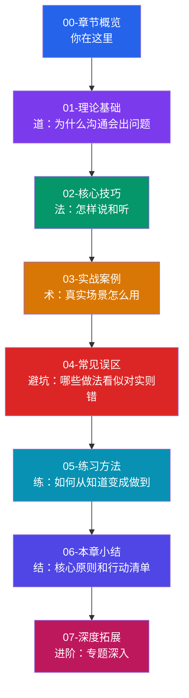
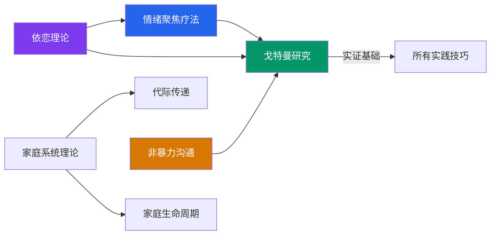

# 第十七章 亲密关系沟通

***

## 一、引言：为什么亲密关系中的沟通如此困难

### 1.1 一个普遍的悖论

你有没有经历过这样的场景——

你深爱着面前这个人，你们共同生活、共同养育孩子、共同面对人生的风雨。可是在某个疲惫的夜晚，一句无心的话就能引爆一场争吵。你说"我不是那个意思"，对方说"你就是那个意思"。你们都在想：**明明相爱，为什么沟通这么难？**

这不是你一个人的困惑。全球范围内的婚姻研究反复揭示同一个事实：**亲密关系中的沟通，是人类所有社交沟通中最复杂、最情绪化、也最容易出错的一种。** 原因很简单——我们对亲密之人的期待远高于对任何其他人。我们期待被完全理解、被无条件接纳、被持续关注，而这些期待本身就构成了巨大的沟通压力。

### 1.2 数据告诉我们的真相

在展开任何技巧讨论之前，让我们先看看权威研究揭示了什么：

| 研究指标 | 数据 | 来源 |
|---------|------|------|
| 基于沟通模式预测离婚的准确率 | 93.6% | John Gottman，华盛顿大学，40年纵向研究 |
| 幸福夫妻的积极/消极互动比 | ≥ 5:1 | Gottman Love Lab 实验室数据 |
| 婚后6年内离婚的夫妻比例（中国） | 约 35% | 最高人民法院司法大数据（2022） |
| 中国家庭中"经常争吵"的比例 | 约 27% | 全国妇联《中国家庭发展报告》 |
| 因"沟通不畅"导致婚姻咨询的占比 | 65-70% | 美国婚姻与家庭治疗协会（AAMFT） |
| 婚姻满意度与沟通质量的相关系数 | r = 0.68 | Markman, Stanley & Blumberg 元分析 |

这些数字指向一个关键结论：**婚姻的质量几乎等同于沟通的质量。** 感情再深，如果不会沟通，关系也会被慢慢磨损。

### 1.3 中国社会的独特挑战

亲密关系沟通在全球都是难题，但在中国社会，它还叠加了一层特殊的复杂性：

**代际嵌套结构。** 西方核心家庭是"夫妻+孩子"，而中国家庭常常是"夫妻+孩子+（外）祖父母"三代同堂甚至四代同堂。婆媳关系、翁婿关系、隔代教养冲突——这些在西方文化中较少出现的关系维度，在中国家庭中是日常。

**情感表达的含蓄传统。** 中国传统文化推崇"含蓄""内敛"，"我爱你"三个字在很多家庭中一辈子都说不出口。这种文化基因导致许多人在亲密关系中习惯性压抑情感，直到矛盾积累到爆发。

**集体主义vs.个人主义的价值碰撞。** 传统观念强调"家庭利益高于个人"，而年轻一代越来越重视个人感受和自我实现。当两代人坐在同一张餐桌上，冲突几乎是必然的。

**高期望的育儿压力。** "不能让孩子输在起跑线上"——这句话背后的焦虑渗透到夫妻关系和亲子关系的每一个角落。教育观念的分歧已经成为中国家庭冲突的首要来源之一。

理解这些独特挑战，是我们讨论中国语境下亲密关系沟通的前提。本章的所有理论、方法和案例，都会充分考虑这些本土化因素。

***

## 二、自我诊断：你在亲密关系沟通中处于什么水平

在开始系统学习之前，先花5分钟做一个快速自评。这个自评不是科学量表，而是一面镜子——帮你看到当前最需要关注的方向。

### 2.1 亲密关系沟通能力自评表

请对以下每个陈述打分：**1=几乎不符合，2=偶尔符合，3=有时符合，4=经常符合，5=几乎总是符合**

**A. 情绪觉察维度**

1. 当伴侣/家人说了一句让我不舒服的话，我能很快识别出自己具体的情绪是什么（是生气、受伤、还是失望）
2. 我能在情绪激动时按下"暂停键"，而不是立刻做出反应
3. 我能区分"我对他/她的行为不满"和"我对他/这个人不满"

**B. 表达能力维度**

4. 我能够用"我觉得……因为……"的方式表达不满，而不是用"你总是……你从来不……"
5. 我能清楚地告诉伴侣/家人我需要什么，而不是让对方猜
6. 我能在冲突中就事论事，不翻旧账

**C. 倾听能力维度**

7. 当伴侣/家人在表达不满时，我能在反驳之前先完整听完
8. 我能感受到对方话语背后的情绪，而不只是关注字面意思
9. 即使我不同意对方的观点，我仍然能让对方感到被听见了

**D. 冲突管理维度**

10. 我们之间的争吵通常有"冷却期"，而不是一直升级到失控
11. 争吵结束后，我们能回到问题本身讨论解决方案
12. 我能在争吵中承认自己的错误，而不是一味自卫

**E. 联结维护维度**

13. 我每天都会对伴侣/家人表达一次真诚的关心或赞美
14. 我会主动创造和伴侣/家人共处的专属时间
15. 在伴侣/家人分享日常琐事时，我会给予积极回应而不是敷衍

**评分解读：**

| 分数区间 | 水平 | 建议重点阅读 |
|---------|------|------------|
| 15-30 分 | 初学阶段 | 全章通读，重点掌握理论基础和核心技巧 |
| 31-45 分 | 进阶阶段 | 重点关注实战案例和常见误区部分 |
| 46-60 分 | 精通阶段 | 可直接跳转练习方法和深度拓展 |
| 61-75 分 | 专家水平 | 本章可作为复习参考，重点关注理论深度部分 |

***

## 三、章节全景图

### 3.1 内容架构

本章共分为七个部分，按照 **"道→法→术→器→练→结"** 的逻辑层层递进：

### 3.2 各部分详细说明

#### 第一部分：章节概览（本部分）

**定位：** 读者的"导航地图"，帮助你在进入具体内容之前建立全局认知。

**包含内容：**
- 亲密关系沟通的核心命题和数据背景
- 自我诊断工具，帮你定位当前水平
- 章节结构全景图和各部分之间的逻辑关系
- 差异化阅读路径建议（不同需求的读者如何高效阅读）
- 全章关键词索引

**预计阅读时间：** 15-20 分钟

---

#### 第二部分：理论基础

**定位：** 理解亲密关系沟通的"底层操作系统"——只有理解了"为什么"，才能真正用好"怎么做"。

**包含七大理论框架：**

| 理论 | 核心贡献 | 关键概念 | 应用场景 |
|------|---------|---------|---------|
| 依恋理论 | 解释个体在亲密关系中的行为模式 | 安全型/焦虑型/回避型/恐惧型 | 理解伴侣的"不可理喻"行为 |
| 戈特曼婚姻研究 | 基于实证数据的婚姻预测模型 | 末日四骑士、5:1法则、情感投标 | 评估关系健康度，识别危险信号 |
| 家庭系统理论 | 将家庭视为相互影响的整体 | 三角关系、自我分化、代际传递 | 理解婆媳矛盾、教育分歧的深层原因 |
| 情绪聚焦疗法（EFT） | 最权威的夫妻治疗方法之一 | 依恋需求、负性互动循环、情绪层次 | 破解"追逃模式"，重建情感联结 |
| 非暴力沟通（NVC） | 化解冲突的四步沟通法 | 观察→感受→需要→请求 | 日常争吵、敏感话题的沟通 |
| 代际传递理论 | 沟通模式的"遗传"机制 | 原生家庭模式识别与打断 | 觉察自己从父母那里"继承"了什么 |
| 家庭生命周期理论 | 家庭不同阶段的沟通重点 | 六个阶段的典型任务和挑战 | 预判当前阶段最容易出现的问题 |

**理论之间的关系：**

简单来说：**依恋理论**解释了"为什么你会这样反应"，**戈特曼研究**告诉我们"什么行为在摧毁关系"，**EFT**提供了"如何从破坏转向修复"的路线图，**NVC**给出了"具体怎么说话"的工具，**家庭系统理论**和**代际传递理论**帮我们看到"问题不只在你和伴侣之间，而是整个家族系统在起作用"。

**预计阅读时间：** 40-50 分钟

---

#### 第三部分：核心技巧

**定位：** 将理论转化为可操作的沟通方法——这是"怎么做的"部分。

**涵盖六大关系场景：**

1. **夫妻沟通技巧**——从日常对话到深度冲突，覆盖婚姻中最常见的沟通情境
2. **亲子沟通技巧**——按年龄段分层（0-3岁、3-6岁、6-12岁、12-18岁、成年子女），每个阶段的沟通重点完全不同
3. **婆媳沟通策略**——最中国特色的家庭沟通难题，从角色定位到话题禁区
4. **恋爱沟通技巧**——从暧昧到长期关系，不同阶段的沟通策略
5. **家庭会议的组织与主持**——让全家人坐下来高效沟通的制度化方法
6. **代际沟通方法**——与父母、祖辈沟通时如何跨越观念鸿沟

**预计阅读时间：** 50-60 分钟

---

#### 第四部分：实战案例

**定位：** 理论和技巧的"实景演练"——用真实场景告诉你，在具体的处境中，好的沟通和差的沟通分别长什么样。

**案例设计原则：**
- 每个案例包含 **"错误示范→分析→正确示范"** 三段式结构
- 所有案例均基于中国家庭常见场景（不是翻译美国教材）
- 涵盖高冲突场景和日常低冲突场景
- 每个案例标注所运用的理论/技巧

**预计阅读时间：** 40-50 分钟

---

#### 第五部分：常见误区

**定位：** "避坑指南"——有些沟通方式看起来正确，实际上正在悄悄伤害你的关系。

**核心警示：** 沟通中最大的风险不是"不知道怎么做"，而是"以为自己做对了其实做错了"。比如：

- "我什么都说了啊" ≠ 沟通到位（可能只是你单方面输出）
- "我从来不发脾气" ≠ 沟通健康（可能只是压抑）
- "我们从不吵架" ≠ 关系很好（可能只是回避冲突）

这部分将系统梳理各关系场景中最常见的认知偏差和行为陷阱。

**预计阅读时间：** 30-35 分钟

---

#### 第六部分：练习方法

**定位：** 从"知道"到"做到"的桥梁——没有练习，再好的理论都是纸上谈兵。

**练习体系：**
- **基础练习**（单人可做）：情绪日志、沟通模式反思、原生家庭回顾
- **双人练习**（需伴侣配合）：倾听练习、非暴力沟通演练、情感存款挑战
- **家庭练习**（全家参与）：家庭会议模拟、冲突复盘、感恩仪式

每个练习都包含：目标→步骤→时长→预期效果→常见困难及应对。

**预计阅读时间：** 25-30 分钟

---

#### 第七部分：本章小结

**定位：** 核心要点提炼和行动指南——快速回顾全章精华，并提供可立即执行的行动清单。

**预计阅读时间：** 15 分钟

---

#### 深度拓展

**定位：** 面向高阶读者的专题延伸——对特定话题感兴趣的读者可以继续深入。

**预计阅读时间：** 按需阅读

***

## 四、差异化阅读路径

不同背景、不同需求的读者，不应该用同一种方式读本章。以下是针对常见读者画像的阅读建议：

### 4.1 按读者身份分

**已婚人士（婚姻出现问题）：**
优先路径：概览（本文件）→ 01理论基础（重点：戈特曼+EFT）
→ 02核心技巧（重点：夫妻沟通部分）→ 03实战案例（夫妻相关）
→ 04常见误区 → 05练习方法（双人练习）

**已婚人士（婚姻暂无大问题，想预防和提升）：**
推荐路径：概览 → 01理论基础（重点：戈特曼的5:1法则和情感投标）
→ 02核心技巧（通读）→ 05练习方法（日常练习融入生活）

**父母（关注亲子沟通）：**
优先路径：概览 → 01理论基础（重点：依恋理论）
→ 02核心技巧（重点：亲子沟通，按孩子年龄段选读）
→ 03实战案例（亲子相关）→ 04常见误区（亲子部分）

**处于婆媳/翁婿关系困扰中的人：**
优先路径：概览 → 01理论基础（重点：家庭系统理论+代际传递）
→ 02核心技巧（重点：婆媳沟通+代际沟通）
→ 03实战案例（婆媳相关）→ 04常见误区

**恋爱中的人：**
优先路径：概览 → 01理论基础（重点：依恋理论）
→ 02核心技巧（重点：恋爱沟通技巧）
→ 05练习方法（基础练习）

**心理咨询/社工从业者：**
建议路径：完整通读，重点关注 01理论基础和07深度拓展

### 4.2 按时间充裕程度分

**只有30分钟：**
精读本文件（章节概览），重点看"自我诊断"和"章节全景图"，然后根据诊断结果选择性阅读对应章节。

**有2小时：**
概览 + 理论基础 + 核心技巧中与自己最相关的1-2个部分。

**有半天时间：**
完整通读第一到第六部分，跳过与自己无关的案例。

**愿意投入完整学习（3-4小时+）：**
全章通读 + 完成练习方法中的自评和基础练习 + 选择1-2个双人/家庭练习实践。

### 4.3 按紧急程度分

**正在吵架/冷战中（紧急）：**
直接跳转 04-常见误区 看看自己踩了哪些坑，然后看 03-实战案例 中对应场景的正确做法。理论可以后面再补。

**关系还不错但想变更好（不急）：**
按顺序从理论基础开始，慢慢建立认知框架，再逐步实践。

**刚开始一段新关系（预防性）：**
重点看依恋理论（了解自己和对方的依恋风格）和恋爱沟通技巧。

***

## 五、核心理念：在学习之前你需要接受的四个前提

在正式进入具体内容之前，有四个核心理念需要提前建立。它们不会教你具体怎么做，但会从根本上影响你学习和应用的效果。

### 5.1 沟通是一种可习得的技能，而不是天赋

很多人有一个隐含的信念："有些人天生就会说话，而我不行。"这个信念本身就是最大的障碍。

事实是：**所有有效的沟通技巧都是后天习得的。** 那些看起来"天生会沟通"的人，要么是在原生家庭中恰好习得了好的模式，要么是在后天经历中有意无意地训练过。无论你的起点在哪里，你都可以通过学习和练习显著提升。

Gottman的研究团队发现，经过12小时的夫妻沟通工作坊训练，参与者的关系满意度平均提升了30%以上，且效果持续至少4年。这意味着改变不仅是可能的，而且是相对快速的。

### 5.2 改变从自己开始，而不是从对方开始

这是最重要也最难接受的一条原则。当关系出现问题时，我们的本能反应是"对方需要改变"。"如果他/她能少说两句……""如果他/她能多理解我一点……"

但家庭系统理论告诉我们一个深刻的道理：**当系统中的一个元素改变时，整个系统都会随之调整。** 你不需要等对方改变。当你改变了沟通方式，对方的反应模式也会随之变化——虽然可能不是立刻，也未必如你预期的方向，但变化一定会发生。

这不是说所有责任都在你身上，而是说：**你唯一能完全控制的变量是你自己。** 把精力放在自己能改变的事情上，效率远高于等待对方改变。

### 5.3 沟通的目的不是赢，而是连接

在亲密关系中，最大的沟通陷阱就是把对话变成辩论赛。你可以"赢"了道理，但"输"了感情。当伴侣说"你为什么又忘了接孩子"，如果你的反应是解释、反驳、反指责——你在做的不是沟通，而是自我辩护。

亲密关系沟通的终极目的只有一个：**维持和加深两个人之间的情感联结。** 所有技巧、方法、理论，最终都服务于这个目的。当你在某个沟通场景中不确定该怎么做时，问自己一个问题："哪种做法更有利于维护我们的联结？"

### 5.4 进步是非线性的，允许反复

学习沟通技巧的过程不是一条上升的直线。你可能今天应用了非暴力沟通，明天在压力下又回到了老模式。这是完全正常的。

研究表明，行为改变通常遵循 **"意识→尝试→反复→坚持→内化"** 的螺旋上升路径。每一次"反复"都不是失败，而是大脑在巩固新模式过程中的正常波动。关键不是"永不犯错"，而是"犯错后的恢复速度越来越快"。

给自己至少3个月的时间来评估变化。如果你期望一周内看到巨大改变，那不是沟通技巧的问题，是期待管理的问题。

***

## 六、学习目标

通过本章的系统学习，读者将达成以下三层目标：

### 6.1 知识层面（认知地图）

完成本章后，你将能够：

1. **解释依恋理论的核心机制**——不只是知道四种类型的名字，而是理解为什么焦虑型的人会反复确认、为什么回避型的人会在冲突中沉默，以及这些行为背后的心理需求
2. **运用戈特曼的框架评估关系健康度**——识别"末日四骑士"在自己关系中的出现，计算积极/消极互动比例，理解"情感投标"和5:1法则的实际含义
3. **描述家庭系统的运作逻辑**——理解三角关系如何让婆媳矛盾变得更复杂，理解自我分化程度如何影响你在家庭压力下的反应
4. **区分不同层次的情绪**——EFT框架中的表面情绪、次级情绪和初级情绪，理解为什么愤怒的下面往往藏着恐惧和悲伤
5. **认识代际传递的力量**——理解你从原生家庭"继承"了哪些沟通模式，以及如何打断负性传递链条

### 6.2 技能层面（工具箱）

完成本章后，你将能够：

1. **运用"观察-感受-需要-请求"四步法**进行日常沟通——不是机械地套公式，而是内化为自然的表达习惯
2. **在冲突中识别并打破负性互动循环**——当"追逐-逃避"模式出现时，你能在早期阶段介入并转化
3. **根据孩子的年龄和发展阶段调整沟通方式**——对3岁孩子和对13岁孩子的沟通是完全不同的两套系统
4. **在婆媳/翁婿场景中运用策略性沟通**——不是"忍"也不是"怼"，而是在维护关系和坚守边界之间找到平衡点
5. **组织和主持有效的家庭会议**——让全家人在制度化框架内讨论问题、做出决策
6. **在情绪高涨时运用自我安抚技术**——给自己的"情绪刹车"系统升级

### 6.3 态度层面（底层信念）

完成本章后，你将建立以下四个核心信念：

1. **"沟通是可以学习的技能"**——从"我不擅长沟通"到"我正在学习更好的沟通方式"
2. **"先理解，后表达"**——从"我要让对方理解我"到"我要先理解对方"
3. **"亲密关系需要持续经营"**——从"如果爱就应该自然好"到"爱是一个动词，需要每天的行动"
4. **"冲突不等于关系失败"**——从"吵架说明不合适"到"如何吵架才是关键"

***

## 七、阅读建议

### 7.1 准备工作

在正式开始阅读之前，建议你做以下准备：

**1. 带着具体问题进入**

不要"泛泛地学"，而是想一想你目前在亲密关系中最困扰的1-3个具体问题。例如：
- "每次和老公讨论钱的问题就会吵架"
- "孩子上初中后什么都不跟我说"
- "婆婆总干涉我们的教育方式，老公不站在我这边"

将这些问题写在纸上或手机备忘录里。它们会成为你阅读过程中的"搜索关键词"，帮你快速定位最有价值的内容。

**2. 选择合适的阅读环境**

亲密关系沟通涉及深层情感反思。建议选择安静、不被打扰的时间段阅读。不建议在通勤地铁上读——不是因为内容不适合，而是因为你需要在阅读过程中进行自我反思，碎片化环境会严重影响效果。

**3. 准备一个笔记本**

记录以下内容：
- 让你"被戳中"的句子或概念
- 你想到的与自己相关的场景
- 你想尝试的具体做法
- 阅读过程中产生的问题

### 7.2 阅读策略

**与伴侣/家人分享的注意事项：**

如果你希望伴侣和你一起学习，以下做法比"把这个发给TA"更有效：

- ✅ **自己先读完，然后挑1-2个你最有感触的点和对方分享**——用"我读到一个很有意思的发现……"开头，而不是"你看看人家说的……"
- ✅ **邀请而不是要求**——"我在读一本关于沟通的书，里面有些内容我觉得对我们有帮助，你有兴趣一起聊聊吗？"
- ❌ **不要把书中的理论作为"武器"**——"你看，专家说了，你这就是末日四骑士里的批评！"这种做法只会制造防御。
- ❌ **不要在争吵中引用书中内容**——学习成果应该在平静时刻分享，而不是在冲突中用来"证明对方是错的"。

**循序渐进的节奏建议：**

第1天：  章节概览 + 完成自我诊断         （约30分钟）
第2-3天：理论基础                        （约50分钟，可分两次）
第4-5天：核心技巧                        （约60分钟，可按关系类型分次）
第6天：  实战案例                        （约50分钟）
第7天：  常见误区                        （约35分钟）
第8天：  练习方法 + 选择1-2个练习开始实践 （约30分钟）
第9天：  本章小结 + 回顾笔记             （约20分钟）

如果时间紧张，可以压缩到一周内完成；如果时间充裕，建议放慢节奏，每天读一小节后留出反思和实践的时间。

### 7.3 实践优先原则

**最重要的阅读建议只有一条：读完一个技巧，当天就用。**

不要等到"全部读完再开始实践"。研究行为改变的专家 James Clear 在《Atomic Habits》中指出：**知识不会自动转化为行为，只有在具体场景中的重复练习才能形成习惯。** 读完非暴力沟通的四个要素？今天晚上就试着用"观察-感受-需要-请求"和伴侣说一件事。读完戈特曼的"情感投标"概念？今天就观察伴侣发出了几次"投标"，你回应了几次。

哪怕只做到一个技巧的实践，也比读完全部内容但什么都不做要有价值一百倍。

***

## 八、本章关键词索引

以下是本章涉及的核心概念，按照首次出现的章节排列。你可以把它当作一个速查索引——当某个概念不清楚时，回到对应章节复习。

### 理论类关键词

| 关键词 | 首次出现章节 | 一句话解释 |
|--------|------------|-----------|
| 依恋类型 | 01-理论基础 | 个体在亲密关系中形成的情感联结模式，分为安全型、焦虑型、回避型、恐惧型 |
| 末日四骑士 | 01-理论基础 | Gottman发现的四种致命沟通模式：批评、蔑视、防御、石墙 |
| 情感投标 | 01-理论基础 | 伴侣发出的情感联结信号，回应或忽视它决定了关系的走向 |
| 5:1法则 | 01-理论基础 | 幸福婚姻中积极互动与消极互动的最低比例为5:1 |
| 自我分化 | 01-理论基础 | 在保持家庭情感联结的同时，维持独立思考和自主决策的能力 |
| 负性互动循环 | 01-理论基础 | 夫妻之间反复出现的破坏性互动模式，如"追逐-逃避"循环 |
| 非暴力沟通 | 01-理论基础 | 通过"观察-感受-需要-请求"四步法进行的无攻击性沟通 |
| 代际传递 | 01-理论基础 | 沟通模式和关系模式从一代人传递到下一代人的现象 |

### 技巧类关键词

| 关键词 | 首次出现章节 | 一句话解释 |
|--------|------------|-----------|
| "我"语句 | 02-核心技巧 | 用"我觉得……"替代"你总是……"的表达方式 |
| 情绪暂停 | 02-核心技巧 | 在情绪高涨时主动暂停对话，待情绪平复后再继续 |
| 情感存款 | 02-核心技巧 | 通过日常的小型积极互动为关系"充值" |
| 家庭会议 | 02-核心技巧 | 全家人定期坐下来讨论问题和做决定的制度化安排 |
| 共情式倾听 | 02-核心技巧 | 不只听内容，更听情绪和需求的深度倾听方式 |
| 边界设定 | 02-核心技巧 | 明确表达哪些行为是可接受的、哪些是不可接受的 |

### 中国文化语境关键词

| 关键词 | 首次出现章节 | 一句话解释 |
|--------|------------|-----------|
| 婆媳沟通 | 02-核心技巧 / 03-实战案例 | 中国家庭中最典型的关系沟通难题及应对策略 |
| 代际教养冲突 | 02-核心技巧 | 隔代教养中祖辈与父辈的教育观念差异及沟通方法 |
| 含蓄表达传统 | 本文件 | 中国传统文化中情感表达内敛含蓄的特点对亲密沟通的影响 |
| 家庭面子文化 | 04-常见误区 | 在外人面前维护家庭形象的倾向如何影响家庭内部沟通 |

***

## 九、预计阅读时间

| 部分 | 内容 | 预计时间 | 建议分几次 |
|------|------|---------|-----------|
| 00-章节概览 | 引言、自评、全景图、阅读建议 | 15-20 分钟 | 1 次 |
| 01-理论基础 | 七大理论框架 | 40-50 分钟 | 2 次（依恋+戈特曼一组，其余一组） |
| 02-核心技巧 | 六大关系场景的沟通方法 | 50-60 分钟 | 2-3 次（按关系类型分组） |
| 03-实战案例 | 真实场景的错误与正确示范 | 40-50 分钟 | 2 次 |
| 04-常见误区 | 认知偏差和行为陷阱 | 30-35 分钟 | 1 次 |
| 05-练习方法 | 可执行的沟通训练 | 25-30 分钟 | 1 次（后续反复练习） |
| 06-本章小结 | 核心要点和行动清单 | 15 分钟 | 1 次 |
| 07-深度拓展 | 专题深入 | 按需 | 按需 |

**总计：约 3.5-4.5 小时（建议分 7-9 次阅读完成，每次 30-40 分钟）**

> 💡 **高效阅读提示：** 如果你已完成第四节的自我诊断并找到了最适合自己的阅读路径，可以跳过与当前需求无关的部分，优先读最紧迫的内容。其他部分可以在后续需要时回过头来补读。

***

