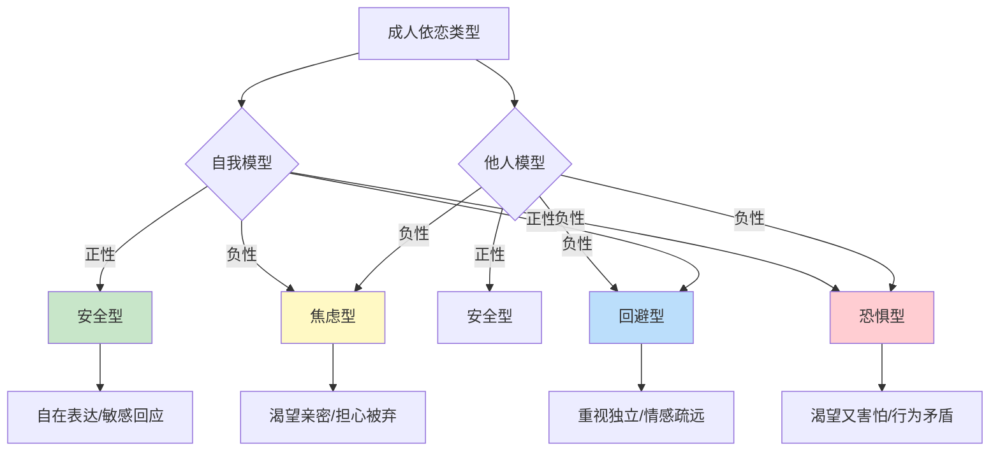
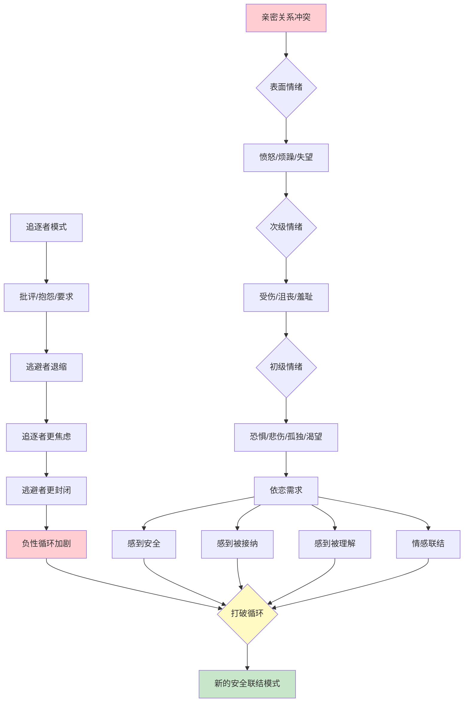
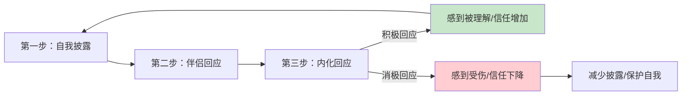
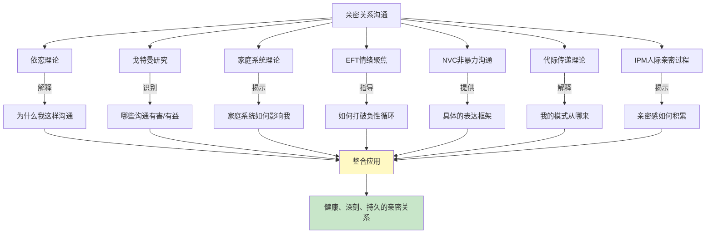

# 第十七章 亲密关系沟通 —— 理论基础

亲密关系是人类最深刻的情感体验之一，也是沟通挑战最为集中的领域。与职场沟通、社交沟通不同，亲密关系中的沟通涉及深层的情感暴露、脆弱性的展示和依恋需求的满足。理解亲密关系沟通背后的理论框架，不仅能帮助我们解释"为什么会这样"，更能指导我们"应该怎么做"。

本章系统梳理亲密关系沟通的核心理论，从依恋的起源到关系的动态过程，从个体心理到家庭系统，构建一个完整的理论认知框架。

***

## 一、依恋理论与沟通模式

依恋理论是理解亲密关系沟通最核心的理论框架。它解释了为什么不同的人在亲密关系中表现出截然不同的沟通风格——有人能自在地表达需求，有人却总是焦虑不安，有人习惯性地回避情感交流。

### 📊 依恋类型图

### 1.1 依恋理论的起源与发展

依恋理论（Attachment Theory）的发展经历了三个关键阶段，每个阶段都深化了我们对亲密关系沟通的理解。

**第一阶段：Bowlby的奠基（1950s-1960s）**

英国精神分析学家John Bowlby在20世纪50年代提出了依恋理论，最初用于解释婴儿与照料者之间的情感联结。Bowlby的核心洞见是：人类天生具有与他人建立情感联结的需要，这不是习得的行为，而是进化赋予的生存机制。婴儿与照料者之间的互动模式会形成一种"内部工作模型"（Internal Working Model），这个模型包含两个核心信念：

- **自我模型**：我是否值得被爱？我是否有能力获得他人的回应？
- **他人模型**：他人是否可信赖？他人是否会回应我的需要？

Bowlby认为，这种内部工作模型一旦形成，就具有相当的稳定性，会像一副"认知眼镜"一样影响个体一生的人际关系模式，包括亲密关系中的沟通方式。

**第二阶段：Ainsworth的类型划分（1960s-1970s）**

Mary Ainsworth通过著名的"陌生情境实验"（Strange Situation Procedure），在实验室中观察婴儿与母亲分离和重聚时的反应，识别出了三种基本的婴儿依恋类型：

- **安全型依恋**：母亲离开时有些不安，但母亲回来后迅速被安抚，继续探索环境
- **回避型依恋**：母亲离开时表现得无所谓，母亲回来时回避接触
- **焦虑-矛盾型依恋**：母亲离开时极度痛苦，母亲回来后既寻求接触又表现出愤怒

Ainsworth的研究为依恋理论提供了坚实的实证基础，将Bowlby的理论构想转化为了可观察、可测量的行为模式。

**第三阶段：成人依恋研究（1980s至今）**

Hazan和Shaver（1987）在《浪漫之爱可以被理解为依恋过程》这篇开创性论文中，将依恋理论应用到成人恋爱关系中，发现成人同样存在类似婴儿的依恋模式。他们的研究显示：约56%的成人属于安全型，约20%属于焦虑型，约24%属于回避型。

此后，Bartholomew和Horowitz（1991）提出了更具区分度的四类型模型，将回避型进一步分为"疏离型"（Dismissive）和"恐惧型"（Fearful），形成了今天被广泛使用的成人依恋四分类框架。

### 1.2 四种成人依恋类型的深度解析

Bartholomew和Horowitz的模型基于"自我模型"（正性/负性）和"他人模型"（正性/负性）两个维度的交叉组合：

**1. 安全型依恋（Secure Attachment）**

- **自我模型**：正性（"我是有价值的，值得被爱的"）
- **他人模型**：正性（"他人是可信赖的，愿意回应我的需要"）
- **沟通特点**：能够自在地表达自己的情感和需要，也能够敏感地回应伴侣的情感需要。在冲突中能够保持冷静，寻求建设性的解决方案。不害怕亲密，也不害怕独立。
- **典型表现**：能够坦诚地讨论关系中的问题；不会因为伴侣需要独处空间而感到被拒绝；在伴侣表达不满时不会过度防御或崩溃。
- **在冲突中的反应**：能够倾听伴侣的不满，承认自己的不足，同时也能清晰表达自己的立场。冲突结束后能较快恢复情感联结。
- **形成背景**：通常来自父母回应敏感、一致的家庭环境。父母能够识别并恰当回应孩子的情感需求，既不过度保护也不冷漠忽视。

**2. 焦虑型依恋（Anxious-Preoccupied Attachment）**

- **自我模型**：负性（"我不够好，不值得被爱"）
- **他人模型**：正性（"他人是好的，但我需要努力才能获得他们的爱"）
- **沟通特点**：渴望亲密，但常常担心被抛弃。在沟通中可能表现出过度需求、情绪化、反复确认等行为。对伴侣的情绪变化高度敏感，常常将中性的信号解读为拒绝。
- **典型表现**：频繁地寻求伴侣的确认和保证（"你爱我吗？""你是不是不开心了？"）；对伴侣的回复速度非常敏感（秒回期待）；容易嫉妒和焦虑；在伴侣忙碌或需要独处时感到被冷落。
- **在冲突中的反应**：情绪反应强烈，可能哭泣、指责、反复追问。害怕冲突意味着关系即将结束，因此可能过度道歉或讨好，但内心积累的不满会在某个临界点爆发。
- **形成背景**：通常来自父母回应不一致的家庭环境——有时热情回应，有时冷漠忽视，孩子无法预测何时能获得关爱，因此发展出过度警觉和不断寻求确认的策略。

**3. 回避型依恋（Dismissive-Avoidant Attachment）**

- **自我模型**：正性（"我是独立的，不需要依赖他人"）——但这种"正性"往往是一种防御性的自我膨胀
- **他人模型**：负性（"他人是不可靠的，不能真正理解我"）
- **沟通特点**：重视独立和自主，不喜欢过度亲密。在沟通中可能表现得冷淡、疏远，不善于表达情感。倾向于用理性分析替代情感表达。
- **典型表现**：在伴侣需要情感支持时可能显得不耐烦或给出"解决方案"而非情感回应；倾向于独自解决问题；不善于表达脆弱；在关系变得亲密时感到不适，可能通过工作、爱好等方式保持距离。
- **在冲突中的反应**：倾向于回避讨论，关闭情感，用沉默或离开来应对。可能说出"你想太多了""没什么好说的"等话语。内心可能感受到情绪，但习惯性地压抑。
- **形成背景**：通常来自父母情感疏远或对孩子独立性要求过高的家庭环境。孩子学到的是"表达需要是软弱的""靠自己最安全"。

**4. 恐惧型依恋（Fearful-Avoidant Attachment）**

- **自我模型**：负性（"我不够好"）
- **他人模型**：负性（"他人是不可靠的"）
- **沟通特点**：既渴望亲密又害怕亲密，在关系中表现出矛盾的行为。可能在不同的时间或情境中表现出焦虑型和回避型的特征。
- **典型表现**：时而热情，时而冷淡；在关系中摇摆不定；难以信任伴侣；可能在关系稳定后主动制造冲突或推远对方。
- **在冲突中的反应**：行为模式不一致——有时像焦虑型一样情绪爆发，有时像回避型一样冷漠离开。可能在冲突后反复纠缠又突然消失。
- **形成背景**：通常来自存在创伤经历的家庭环境——如虐待、忽视、父母精神疾病等。亲密关系在早期经验中既代表需要又代表危险，形成了"接近-回避"的矛盾模式。

### 1.3 依恋类型对沟通的系统性影响

不同的依恋类型会导致不同的沟通模式，以下从六个关键维度进行对比：

| 沟通维度 | 安全型 | 焦虑型 | 回避型 | 恐惧型 |
|---------|-------|-------|-------|-------|
| **表达需求** | 直接、清晰、不带攻击性 | 含蓄、间接或过度表达，常常通过情绪而非语言 | 压抑、不表达，或用否定的方式表达（"我不需要"） | 矛盾，时而直接时而压抑 |
| **处理冲突** | 冷静、建设性，聚焦解决问题 | 情绪化、担心被抛弃，容易偏离议题 | 逃避、冷处理，或用理性分析替代情感回应 | 模式不一致，有时爆发有时沉默 |
| **接受反馈** | 开放、不防御，能区分批评和建议 | 过度敏感、感到被攻击，容易崩溃 | 关闭、不回应，或反击 | 反应不可预测 |
| **表达情感** | 自在、真诚，能表达脆弱 | 渴望但不确定，可能过度表达 | 困难、不自然，倾向压抑 | 矛盾，想表达又害怕 |
| **回应伴侣** | 敏感、及时、有分寸 | 过度回应或焦虑性回应 | 回应不足、延迟、或敷衍 | 不一致 |
| **冲突修复** | 主动修复，能道歉也能接受道歉 | 可能过度道歉以维持关系，但内心不满 | 不主动修复，等待对方先行动 | 修复行为不一致 |

### 1.4 依恋配对的互动动态

理解依恋类型不仅要看个体，更要看配对。不同的依恋类型组合会产生特定的互动动态：

**安全型 + 任何类型**：安全型伴侣具有"缓冲效应"，能帮助不安全依恋的伴侣逐步建立安全感。这是最理想的配对组合。

**焦虑型 + 回避型（最常见的不安全配对）**：形成经典的"追逐-逃避"模式。焦虑型越是追着要回应，回避型越是退缩；回避型越是退缩，焦虑型越是焦虑地追逐。这种配对具有强烈的"化学反应"（熟悉感），但需要大量有意识的努力才能维持健康。

**焦虑型 + 焦虑型**：双方都渴望亲密，可能在关系初期高度融合，但容易互相放大焦虑，冲突时情绪反应相互升级。

**回避型 + 回避型**：双方都重视独立，关系可能缺乏深度的情感联结，表面平静但内心孤独。

### 1.5 依恋类型的可变性与"习得性安全"

重要的是，依恋类型不是固定不变的。研究表明，约70%的人在一生中保持相对稳定的依恋类型，但约30%的人会经历显著变化。影响依恋类型变化的因素包括：

1. **重大关系经历**：一段安全的关系（伴侣或亲密朋友）可以逐步修正不安全的内部工作模型
2. **心理咨询/治疗**：特别是依恋导向的治疗（如EFT），可以系统性地改变依恋模式
3. **自我觉察和学习**：通过理解自己的依恋模式，有意识地练习新的行为方式
4. **生命阶段转变**：如成为父母、经历丧亲等，可能触发依恋模式的重组

这一变化过程被称为"习得性安全"（Earned Security），意味着即使是早期经历不理想的人，也可以通过后天的努力发展出安全的依恋模式。研究显示，获得习得性安全的个体在心理健康和关系满意度方面，与原生安全型个体没有显著差异。

***

## 二、戈特曼的婚姻研究

### 2.1 研究概述与方法论

John Gottman是美国华盛顿大学的心理学教授，被誉为"婚姻研究的爱因斯坦"。他通过长达40多年的研究，对超过3000对夫妻进行了深入的观察和分析，是亲密关系实证研究领域最具影响力的学者之一。

Gottman的研究方法具有开创性意义：他在"爱情实验室"（Love Lab）中观察夫妻的日常互动，使用"特定情感影响编码系统"（Specific Affect Coding System, SPAFF）记录他们的对话内容、面部表情、肢体语言和生理反应（心率、皮肤电导、血流速度等），然后对这些夫妻进行纵向跟踪（最长14年），分析哪些沟通模式能够预测婚姻的成功或失败。

Gottman研究的核心价值在于它的预测力：他能够以超过90%的准确率预测一对夫妻是否会离婚，这在社会科学研究中是极为罕见的。

### 2.2 "末日四骑士"——四种致命沟通模式

Gottman发现，有四种沟通模式对婚姻具有极大的破坏力，他将其称为"末日四骑士"（Four Horsemen of the Apocalypse）。这四种模式通常按一定顺序出现，如果得不到纠正，将逐步摧毁关系。

**1. 批评（Criticism）**

批评与抱怨有着本质区别。抱怨是针对具体行为的不满（"你今天忘记买牛奶了"），而批评是对伴侣人格和性格的攻击（"你总是这么不靠谱，什么都记不住"）。

批评的核心句式是"你总是……""你从来不……""你就是……"这类将个别行为上升为永久性人格特质的语言模式。

**破坏性**：批评会让对方感到被攻击和贬低，引发防御反应。当批评成为沟通的常态，被批评的一方会感到自己无论怎么做都不够好。

**解药——温柔启动（Soft Startup）**：
- 用"我"开头的陈述替代"你"开头的批评
- 描述具体行为而非评价人格
- 表达自己的感受而非指责对方的动机

| 批评（破坏性） | 温柔启动（建设性） |
|--------------|-----------------|
| "你总是只顾自己，从来不考虑我的感受" | "当我一个人做晚饭时，我感到有些孤单，我希望我们能一起准备晚餐" |
| "你怎么这么自私" | "我需要感受到被关心，你能不能在我加班时给我发个消息？" |
| "你永远记不住我说的话" | "我之前提到过这件事，发现你好像忘了，我有点失落" |

**2. 蔑视（Contempt）**

蔑视是"末日四骑士"中最具破坏力的一种，也是**预测离婚的最强单一指标**。蔑视包括嘲讽、翻白眼、冷嘲热讽、人身攻击、模仿嘲笑等。蔑视的核心信息是"我比你优越""你不配和我在一起"。

**破坏性**：蔑视传达的是彻底的不尊重，会严重损害对方的自尊和关系的信任基础。研究表明，蔑视还与伴侣的免疫系统功能下降和感染疾病风险增加有关——Gottman称之为"关系的毒药"。

**解药——建立尊重和感恩的文化**：
- 定期表达对伴侣的欣赏和感谢
- 关注伴侣做对的事情，而非只盯着做错的事情
- 在内心建立对伴侣的正面叙事（"他不是故意的，他只是太累了"）

具体做法：每天至少向伴侣表达一次真诚的感谢或欣赏。例如："谢谢你今天接了孩子，让我能安心加班。""你做的这道菜真的很好吃。""我很欣赏你在工作上的认真态度。"

**3. 防御（Defensiveness）**

防御是在面对伴侣的抱怨或批评时，采取自我保护的态度，包括否认责任、找借口、反指责（"那你呢？"）、扮演受害者（"我做了这么多，你还不满足？"）。

防御的深层心理机制是：没有人愿意承认自己是"坏人"，当感到被攻击时，本能的反应就是保护自己。但在亲密关系中，防御会让对方感到没有被倾听，问题永远得不到解决。

**破坏性**：防御让冲突陷入"攻击-防御"的死循环，双方都在证明自己是对的，没有人真正在解决问题。

**解药——承担自己那部分责任**：
- 即使只有很小的一部分责任，也要主动承担
- 用"你说得对，我确实在……方面可以做得更好"替代"不是我的错"
- 先倾听和理解对方的感受，再表达自己的立场

示例：
- 伴侣："你又忘了去接孩子。"
- 防御式回应："我今天有三个会要开，你又不是不知道我有多忙！"
- 承担责任式回应："对不起，我今天确实忘了。我知道这让你很为难，我以后会在手机上设个提醒。"

**4. 石墙（Stonewalling）**

石墙是指在冲突中完全关闭沟通，表现为沉默、回避眼神接触、冷暴力、离开房间、转移话题等。Gottman发现，石墙通常是在前三骑士长期存在后出现的——当一方感到反复的批评和蔑视已经无法承受时，选择彻底"关机"。

研究表明，石墙者（通常是男性，约占85%）的生理状态是关键因素：他们的生理唤起水平（心率、皮质醇等）极高，处于"淹没"（Flooding）状态，认知功能受到严重影响，无法进行有意义的对话。

**破坏性**：石墙让对方感到被忽视和拒绝，问题被搁置，情感被压抑。长期石墙会导致关系名存实亡。

**解药——结构化暂停（Structured Break）**：
- 感到情绪即将失控时，主动提出暂停："我现在太激动了，没办法好好说话。我们暂停20分钟，等我平静下来再继续。"
- 暂停期间进行自我安抚：深呼吸、散步、听音乐、喝水——不要反刍对方的"罪行"
- 承诺在约定时间内回到对话中（这一步至关重要，否则暂停就变成了逃避）

### 2.3 情感银行账户

Gottman提出了"情感银行账户"（Emotional Bank Account）的比喻。每一次积极的互动（表达关心、赞美、幽默、身体接触、专注倾听）都是在向账户中存款，每一次消极的互动（批评、蔑视、忽视、冲突）都是在从账户中取款。

**黄金比例**：Gottman发现，幸福的夫妻在日常互动中的积极与消极互动比例至少是**5:1**，即每1次消极互动需要5次积极互动来平衡。在冲突情境中，这个比例至少是**3:1**。这个比例被称为"戈特曼比例"（Gottman Ratio），是关系健康度的核心指标。

**这意味着什么？** 如果你在一次争吵中说了伤害伴侣的话（1次消极互动），你需要在接下来的一段时间里创造至少5次积极互动才能弥补。如果消极互动长期多于积极互动，情感账户就会"透支"，关系就会走向崩溃。

**日常存款的方式**：

| 存款类型 | 具体行为 | 效果 |
|---------|---------|------|
| 关注 | 放下手机，眼神接触，专注倾听 | "我在你身边" |
| 欣赏 | 说出你欣赏伴侣的具体品质或行为 | "我看到你的好" |
| 体贴 | 记住伴侣的喜好，做小事表示关心 | "你在我心上" |
| 身体接触 | 牵手、拥抱、亲吻、抚摸 | "我渴望接近你" |
| 幽默 | 共同笑、善意的玩笑、轻松的互动 | "我们在一起很开心" |
| 支持 | 在伴侣压力大时给予帮助和鼓励 | "我站在你这边" |

### 2.4 情感转向与情感远离

Gottman发现了一个极其重要但常被忽视的概念——"情感投标"（Bids for Connection）及其回应模式。

**情感投标**：伴侣在日常生活中发出的情感联结信号，可以是语言性的（"你看那朵云好漂亮"），也可以是非语言性的（叹气、拥抱、眼神接触）。这些看似微小的瞬间，实际上是关系质量的基石。

**三种回应方式**：
- **情感转向（Turning Towards）**：给予积极回应。伴侣说"你看那朵云好漂亮"，你回应"真的好美，像一只小狗"。
- **情感远离（Turning Away）**：忽视投标。伴侣说"你看那朵云好漂亮"，你没有回应，继续看手机。
- **情感对抗（Turning Against）**：消极回应。伴侣说"你看那朵云好漂亮"，你说"有什么好看的，你很闲吗？"。

**数据的力量**：Gottman对新婚夫妻的研究发现，幸福的夫妻对彼此的投标回应率约为**86%**，而后来离婚的夫妻回应率只有**33%**。在6年后的跟踪中，那些回应率低于33%的夫妻全部离婚，而回应率超过86%的夫妻几乎全部维持了幸福的婚姻。

**这告诉我们什么？** 婚姻的存亡不在于那些戏剧性的大事件，而在于每天成百上千个微小的情感互动瞬间。每一次你选择转向（而非远离）伴侣的投标，都是在为关系的长寿和幸福投票。

### 2.5 四种夫妻沟通类型

根据Gottman对数千对夫妻的纵向研究，夫妻可以分为四种沟通类型：

**1. 冲突回避型（Conflict-Avoiding）**
- 特征：尽量避免冲突，有些问题选择不讨论
- 占比：约12%的幸福夫妻属于这种类型
- 关键条件：双方都真正接受这种安排，而不是一方在压抑。如果双方都认同"这个问题不重要"或"我们可以在分歧中和平共处"，这种模式可以稳定运行
- 风险：如果回避的是核心问题（如性生活、财务决策），未解决的不满会在多年后爆发

**2. 波动型（Volatile）**
- 特征：经常激烈争吵，但争吵后也能迅速和好，充满激情
- 占比：约15%的幸福夫妻属于这种类型
- 关键条件：积极互动的比例必须足够高（5:1以上），争吵后有有效的修复机制
- 风险：如果争吵中的蔑视和批评过多，激情会变成伤害

**3. 确认型（Validating）**
- 特征：在讨论中保持冷静和尊重，即使有分歧也能相互理解和确认对方的感受
- 占比：约73%的幸福夫妻属于这种类型——这是最常见的幸福婚姻类型
- 核心优势：这种模式在亲密感和稳定性之间取得了最佳平衡

**4. 敌对型（Hostile）**
- 特征：沟通中充满蔑视和敌意，很少有积极互动，冲突无建设性
- 稳定性：极不稳定，这种模式几乎无法维持健康的长期关系
- 关键信号：蔑视和石墙的高频出现

### 2.6 Gottman的"爱情地图"与"意义协商"

除了上述广为人知的概念，Gottman还提出了两个对日常沟通极具指导意义的概念：

**爱情地图（Love Maps）**：指你对伴侣内心世界的了解程度——你知道伴侣的压力来源、梦想、恐惧、童年经历、价值观吗？爱情地图是关系的"基础软件"，不了解伴侣的内心世界，就无法提供真正有意义的情感支持。

维护爱情地图的方式：定期进行深度对话，使用开放式问题（"你最近在想什么？""你小时候最开心的记忆是什么？""你现在最大的压力是什么？"）。

**意义协商（Dreams Within Conflict）**：Gottman发现，69%的夫妻冲突是"永久性问题"（perpetual problems），源于两人性格、价值观、生活方式的根本差异，永远无法"解决"。健康夫妻的关键能力不是解决这些问题，而是围绕这些问题进行有意义的对话——理解对方立场背后的梦想、恐惧和价值观。

***

## 三、家庭系统理论

### 3.1 理论概述与核心假设

家庭系统理论（Family Systems Theory）由精神科医生Murray Bowen在20世纪50年代提出，将家庭视为一个相互关联的情感系统。Bowen的核心洞见是：**不能孤立地理解一个人，必须把他放在家庭系统的关系网络中来理解。**

家庭系统理论建立在几个核心假设之上：

1. **家庭是一个情绪单元**：家庭成员的情绪状态相互影响，一个人的焦虑会传递给其他成员
2. **家庭成员之间存在情感互联**：距离近的成员之间情感传递更强
3. **家庭系统追求平衡**：当一个人发生变化时，系统会施加压力让其回到原来的状态
4. **症状是系统功能的反映**：一个人的"问题"可能是在维持家庭系统的平衡

### 3.2 八大核心概念

Bowen提出了八个相互关联的概念来理解家庭系统，以下是其中与亲密关系沟通最密切相关的六个：

**1. 三角关系（Triangulation）**

当两个人之间出现紧张关系时，往往会引入第三个人来缓解压力。三角关系是家庭系统中最基本的关系稳定机制。

例如：夫妻关系紧张时，一方可能将注意力转移到孩子身上，形成"母亲-孩子-父亲"的三角。表面上看，母亲在"关心孩子"，实际上是在通过孩子来缓解夫妻之间的紧张。

三角关系的沟通影响：
- 被拉入三角的人（如孩子）承担了不属于他们的情绪负担
- 原始的二人冲突没有得到解决，只是被暂时掩盖
- 三角关系使得直接、诚实的二人沟通变得更加困难

**健康的替代**：有问题的两个人应该直接面对和处理他们之间的紧张，而不是拉第三方介入。如果两人之间的冲突无法自行解决，应该寻求专业帮助（如夫妻治疗师），而不是把朋友或家人拉入三角。

**2. 自我分化（Differentiation of Self）**

自我分化是Bowen理论中最核心的概念，指个体在保持与家庭的情感联结的同时，保持独立思考和自主决策的能力。

自我分化程度的两个极端：
- **低分化**：情绪与理智高度融合，容易被家庭的情绪所影响，难以在亲密关系中保持"自我"。在沟通中表现为：要么过度融合（失去自我边界），要么情感隔离（切断联结以保护自我）
- **高分化**：能够在亲密关系中既保持情感联结又保持独立自我。在沟通中表现为：能够区分"想法"和"感受"，能够在压力下保持冷静思考，能够容纳不同的观点

自我分化对亲密关系沟通的影响：
- 低分化的人在伴侣表达不同意见时，会感到被威胁，因为"不同的观点"等于"关系的危机"
- 高分化的人能够在分歧中保持对话，不需要对方同意自己才能感到安全

**提升自我分化的方法**：
- 练习在冲突中暂停，区分事实和感受
- 学会使用"我觉得……同时我也理解你觉得……"的句式
- 发展独立的兴趣和支持网络，不过度依赖单一关系
- 通过心理咨询或系统排列等方式，识别和处理原生家庭的情感包袱

**3. 核心家庭情绪系统（Nuclear Family Emotional System）**

这个概念描述了家庭中情绪传递和症状表现的四种基本模式：
- 夫妻冲突：当双方分化水平都不高时，情绪通过频繁的冲突来表达
- 配偶功能障碍：一方承担大部分情绪功能，另一方退缩或"生病"
- 孩子被卷入（Child Impairment）：将焦虑投射到孩子身上，孩子出现行为或情绪问题
- 情感隔离（Emotional Cutoff）：通过物理或情感上的距离来管理焦虑

**4. 多代传递过程（Multigenerational Transmission Process）**

家庭的沟通模式、关系模式和情绪处理方式会代代传递。每一代中，分化水平最低的孩子会继承更多来自家庭系统的焦虑，在自己的亲密关系中表现出更多问题。这个过程是无意识的——人们通常不会意识到自己正在重复父母的模式，直到被指出或在治疗中意识到。

**5. 情感三角的位置（Sibling Position）**

Bowen借鉴了Walter Toman的研究，认为个体在兄弟姐妹中的位置会影响其在亲密关系中的角色。例如，长子/长女可能倾向于承担更多责任和控制，幼子/幼女可能更习惯被照顾。当伴侣的兄弟姐妹位置互补时（如长子配幼女），关系更容易和谐；当位置重叠时（如两个长子），权力竞争可能更多。

**6. 社会情绪过程（Societal Emotional Process）**

Bowen认为，社会层面的压力（如经济衰退、社会变革）会渗透到家庭系统中，增加家庭的焦虑水平，进而影响家庭成员之间的沟通质量。这个概念提醒我们：亲密关系中的沟通问题，有时不仅仅是"两个人的问题"，还受到更广泛的社会环境的影响。

### 3.3 家庭系统理论对沟通的核心启示

1. **个人问题往往是家庭系统问题的反映**：一个人的沟通问题（如回避冲突、过度控制、情绪爆发）可能与整个家庭的互动模式有关，而非单纯的个人缺陷
2. **改变一个人可以改变整个系统**：当一个家庭成员提高了自我分化水平，改变了沟通方式，其他成员也会被迫做出调整——这就是"系统中的自我改变"力量
3. **保持适当的边界**：健康的家庭关系需要适当的边界——既保持情感联结又保持个体独立。边界太模糊（过度融合）会导致失去自我，边界太僵硬（情感隔离）会导致孤独
4. **识别并跳出三角关系**：当发现自己被拉入他人的冲突时，有意识地退出，鼓励冲突双方直接沟通

***

## 四、情绪聚焦疗法（EFT）

### 4.1 理论概述与实证基础

情绪聚焦疗法（Emotionally Focused Therapy，简称EFT）由Sue Johnson和Leslie Greenberg在20世纪80年代提出，是目前最有实证支持的夫妻治疗方法之一。超过30年的研究显示，EFT的治疗成功率为70-75%（在治疗结束时），而在治疗结束后的跟踪中，大部分夫妻能够维持改善效果。

EFT的理论基础结合了依恋理论、体验主义心理学和系统理论。它的核心观点是：**亲密关系中的冲突往往不是关于表面问题的争论（如家务分配、财务决策），而是关于更深层的情感需求——特别是依恋需求——的争夺。**

### 📊 EFT情绪层次与循环模型图

### 4.2 EFT的核心概念深度解析

**1. 依恋需求：亲密关系的底层驱动力**

EFT认为，每个人在亲密关系中都有四种基本的依恋需求，这些需求不是"需要"而是"必要"——如同生理需要一样，长期得不到满足会导致关系的"疾病"：

- **感到安全和被保护**：在脆弱时知道伴侣会在身边，不会被抛弃
- **感到被接纳和被珍视**：包括自己的缺点和不完美也被接纳，不需要戴着面具生活
- **感到被理解和被回应**：伴侣能"看到"真实的自己，并给予恰当的情感回应
- **感到与伴侣有情感联结**：一种"我们在一起"的深层体验，不仅是物理上的在一起

当这些需求得不到满足时，人会经历深层的"依恋伤痛"（attachment injury），这种伤痛比日常的不满要深刻得多——它触及的是"我在你心中是否重要"这一根本问题。

**2. 负性互动循环：关系的恶性螺旋**

当依恋需求得不到满足时，夫妻往往会陷入负性互动循环（Negative Interaction Cycle）。EFT将这些循环分为几种典型模式：

**追逐-逃避模式（Pursue-Withdraw）**——最常见
- 追逐者（通常焦虑型）通过批评、抱怨、追问来寻求关注和回应——底层信息是"我需要你看到我"
- 逃避者（通常回避型）通过退缩、沉默来保护自己——底层信息是"我不想再被攻击了"
- 追逐者看到对方退缩，变得更加焦虑和激烈
- 逃避者看到对方更加激烈，进一步退缩
- 循环不断升级，双方都感到孤独和无力

**攻击-攻击模式（Attack-Attack）**
- 双方都用愤怒和攻击来回应对方
- 底层都是受伤和恐惧，但表达方式都是攻击性的
- 冲突可能非常激烈，甚至涉及人身攻击

**冻结-冻结模式（Withdraw-Withdraw）**
- 双方都退缩到自己的世界
- 表面平静但内心孤独
- 关系名存实亡，缺乏情感联结

**EFT的关键洞见**：循环中的每一方都不是"坏人"，而是被自己的依恋恐惧所驱动。追逐者不是"控制狂"，而是害怕失去联结；逃避者不是"冷漠"，而是害怕再次被攻击。当双方能够看到对方行为背后的脆弱，循环就开始松动。

**3. 情绪的三个层次**

EFT识别了三个层次的情绪，治疗的关键是帮助来访者从表面情绪进入初级情绪：

- **表面情绪（Secondary Emotions）**：愤怒、烦躁、失望——这是最容易被表达的，通常也是伴侣看到的。但表面情绪往往是"保护层"，掩盖着更脆弱的情感
- **次级情绪（Instrumental Emotions）**：受伤、沮丧、无助——比表面情绪更深一层，但仍然不是最核心的
- **初级情绪（Primary Emotions）**：恐惧、悲伤、羞耻、孤独、渴望——最深层，最脆弱，最少被表达，但也是最有治疗力量的

**临床示例**：妻子对丈夫说"你从来不关心我！"（表面情绪：愤怒）。如果深入探索，她可能感受到的是"我感到被忽视"（次级情绪）。再深入，她真正感受到的是"我害怕在你心中不重要，我害怕失去你"（初级情绪：恐惧和渴望）。当丈夫能够看到和回应这层初级情绪，真正的疗愈才会发生。

### 4.3 EFT的三阶段九步骤

EFT的治疗过程分为三个阶段，共九个步骤：

**阶段一：去升级（De-escalation）——步骤1-4**

| 步骤 | 内容 | 沟通意义 |
|------|------|---------|
| 步骤1 | 建立治疗联盟，识别核心问题 | 为安全的对话创造空间 |
| 步骤2 | 识别负性互动循环的模式 | 把"你vs.我"重新定义为"我们vs.循环" |
| 步骤3 | 接触循环背后的初级情绪 | 超越表面的愤怒，看到深层的恐惧和渴望 |
| 步骤4 | 重新定义问题——循环是敌人 | 双方都不再被定义为"问题的制造者" |

**阶段二：重组互动模式（Restructuring Emotional Engagement）——步骤5-7**

| 步骤 | 内容 | 沟通意义 |
|------|------|---------|
| 步骤5 | 促进逃避者接触和表达深层的依恋需求和脆弱情感 | 从"我不需要你"到"我害怕被你拒绝" |
| 步骤6 | 促进追逐者接触和表达深层的依恋需求 | 从"你从来不关心我"到"我害怕在你心中不重要" |
| 步骤7 | 促进伴侣之间的新回应——看到并接纳对方的脆弱 | 建立安全的情感联结新模式 |

**阶段三：巩固（Consolidation）——步骤8-9**

| 步骤 | 内容 | 沟通意义 |
|------|------|---------|
| 步骤8 | 巩固新的互动模式，用新的方式解决旧的问题 | 不再落入旧循环 |
| 步骤9 | 建立持续的情感联结习惯 | 新模式成为自然的沟通方式 |

### 4.4 EFT的日常应用：情感联结实操

即使不在治疗环境中，EFT的原则也可以应用于日常关系维护：

**练习1：识别循环信号**——当发现自己在争吵中情绪升级时，暂停，问自己："我们现在是不是又进入了追逐-逃避的循环？我真正想表达的是什么？"

**练习2：表达初级情绪**——用"当你……的时候，我感到……因为我需要……"的句式替代指责。例如："当你看手机不理我的时候，我感到害怕，因为我需要知道我在你心里是重要的。"

**练习3：回应脆弱而非表面**——当伴侣发脾气时，试着看到愤怒背后的恐惧。不是反击"你又在无理取闹"，而是回应"我看到你很受伤，能告诉我你真正害怕的是什么吗？"

**练习4：日常安全联结**——每天花5-10分钟进行"安全联结对话"：分享今天最开心和最难过的时刻，只倾听不评判，用眼神接触和肢体语言表示"我在这里"。

***

## 五、非暴力沟通理论

### 5.1 理论概述与哲学基础

非暴力沟通（Nonviolent Communication，简称NVC）由美国心理学家Marshall Rosenberg在20世纪60年代提出。Rosenberg深受人本主义心理学家Carl Rogers的影响，NVC的核心信念是：**所有人类行为都是为了满足需要，暴力和冲突源于需要未被满足且缺乏有效的表达方式。**

NVC不仅是一种沟通技巧，更是一种思维方式和生活哲学。它教导人们区分观察和评价、感受和想法、需要和策略、请求和要求——这些区分看起来简单，但在实践中需要大量的自我觉察和练习。

### 5.2 非暴力沟通的四个要素

NVC的核心框架由四个要素组成，形成一个完整的表达结构：

**1. 观察（Observation）**

客观地描述观察到的事实，不添加评价和判断。这是NVC中最难的一步，因为人类大脑天生倾向于在观察的同时进行评价。

| 评价（暴力沟通） | 观察（非暴力沟通） |
|----------------|------------------|
| "你总是迟到" | "这周你有三次在约定时间之后到达" |
| "你太懒了" | "我注意到这周的衣服还在椅子上" |
| "你不关心家" | "这个月你有四个晚上加班到十点以后" |
| "你脾气真差" | "刚才你说话的声音提高了，拳头握紧了" |

**关键区分**：观察是任何人在场都能看到/听到/验证的事实；评价加入了个人的解读和判断。当我们说"你总是迟到"时，"总是"就是评价——因为严格来说，并不是"每次"都迟到。

**2. 感受（Feeling）**

表达自己的真实感受，而非想法、判断或对对方行为的评价。

| 想法/判断（容易混淆） | 真实感受 |
|---------------------|---------|
| "我觉得你不尊重我"（这是对对方行为的判断） | "我感到受伤和失望" |
| "我觉得被忽略了"（这是对情况的评估） | "我感到孤独和不安" |
| "我感觉你在利用我"（这是对动机的猜测） | "我感到疲惫和委屈" |
| "我觉得自己没用"（这是自我评价） | "我感到沮丧和无力" |

**NVC的感受词汇表**（帮助扩展情感表达能力）：
- 需要被满足时的感受：开心、感动、温暖、安心、满足、感激、兴奋、平静、受鼓舞、充满希望
- 需要未被满足时的感受：伤心、害怕、愤怒、沮丧、孤独、焦虑、困惑、尴尬、疲惫、绝望

**3. 需要（Need）**

说出感受背后的需要。NVC认为，感受是由需要是否被满足所驱动的，而不是由他人的行为直接造成的。这个区分至关重要：它把责任从"你让我感到……"转移到"我感到……因为我需要……"。

| 外归因（暴力沟通） | 内归因（非暴力沟通） |
|-----------------|------------------|
| "因为你没有打电话给我，所以我生气了" | "我生气是因为我需要感受到被关心和重视" |
| "你让我觉得自己不重要" | "我感到受伤，因为我需要感受到自己在你心中是重要的" |
| "都是你的错" | "我感到沮丧，因为我需要被理解和尊重" |

**基本人类需要**（NVC将需要分为几个大类）：
- **身体需要**：食物、住所、安全、休息、身体接触
- **自主需要**：选择、自由、空间、独立
- **联结需要**：爱、归属、亲密、理解、信任、支持
- **意义需要**：贡献、成长、创造、价值感
- **玩耍需要**：乐趣、放松、冒险、幽默
- **庆祝需要**：感恩、哀悼、纪念

**4. 请求（Request）**

提出具体的、可操作的、正向的请求。请求与要求的本质区别在于：如果对方说"不"，请求者不会施加惩罚或表达不满。

| 模糊/要求式 | 具体/请求式 |
|-----------|-----------|
| "你能不能对我好一点" | "你能不能在下班回来时先抱我一下？" |
| "你要更关心我" | "你能不能每周六花一小时和我一起散步聊天？" |
| "别再这么晚回家了" | "你能不能在超过八点还没到家时给我发个消息？" |
| "你能不能成熟一点" | "当我们意见不同时，你能不能先听完我的想法再回应？" |

**好的请求的特征**：
- **具体**：明确说出希望对方做什么（而非不做什么）
- **正向**：说"我希望你做什么"而非"我希望你别做什么"
- **可行**：对方在当前能力范围内可以做到
- **当下**：是此刻可以行动的，而非模糊的未来承诺

### 5.3 非暴力沟通的完整应用示例

**场景：伴侣忘记了结婚纪念日**

**暴力沟通方式：**
"你又忘了我们的纪念日！你心里根本没有我！你总是这样，从来不重视我们的关系！你看别人的老公/老婆，哪有像你这样的！"

**非暴力沟通方式：**
"今天是我们的纪念日，我发现没有收到任何表示（观察），我感到有些失落和伤心（感受），因为这个日子对我来说很重要，我需要感受到我们之间的特殊联结和被珍视（需要）。你能不能今晚陪我一起吃顿饭，我们好好聊聊（请求）？"

**场景：伴侣总是玩手机不回应**

**暴力沟通方式：**
"你一天到晚就知道看手机！我和你说话你根本没在听！手机比我重要是吧？"

**非暴力沟通方式：**
"我注意到我刚才和你说话的时候，你的眼睛一直在看手机屏幕（观察），我感到有点失落和被忽视（感受），因为和你交流对我来说很重要，我需要知道我说的话被你听到了（需要）。你能不能在我和你说话的时候，先放下手机，我们聊几分钟（请求）？"

### 5.4 NVC的进阶应用：倾听他人

NVC不仅用于表达自己，更是一种倾听他人的方式。当伴侣在愤怒或痛苦中时，用NVC的方式倾听：

**步骤1：不急于反应**——不辩护、不解释、不反击
**步骤2：猜测对方的观察**——"你是不是在说……"
**步骤3：猜测对方的感受**——"你是不是感到……"
**步骤4：猜测对方的需要**——"你需要的是不是……"
**步骤5：确认**——"我理解得对吗？"

示例：伴侣愤怒地说"你从来不帮我做家务！"
NVC式回应："你是不是在说，这周家务基本上都是你在做（观察确认），你感到很疲惫和不公平（感受猜测），你需要支持和分担（需要猜测），对吗？"

### 5.5 NVC的常见误区与纠正

| 误区 | 纠正 |
|------|------|
| "NVC就是不表达愤怒" | NVC不否定愤怒，而是帮助在表达愤怒的同时不伤害对方 |
| "用NVC的句式就万事大吉" | 如果内心充满怨恨，即使说出完美句式也无效。真诚的态度比正确的句式更重要 |
| "NVC意味着我总是要妥协" | NVC是双向的，自己的需要同样重要。它追求的是双方需要的满足，而非单方牺牲 |
| "每次沟通都要用四个要素" | 日常生活中不需要每次都完整使用。NVC的思维模式比固定句式更重要 |
| "NVC适用于所有情境" | 在存在身体暴力或严重不对等权力关系时，NVC不是首要解决方案，安全才是 |

***

## 六、人际亲密过程模型（IPM）

### 6.1 理论概述

人际亲密过程模型（Interpersonal Process Model of Intimacy，简称IPM）由Harry Reis和Phillip Shaver在1988年提出，是理解亲密关系如何通过日常沟通建立和维持的重要理论框架。

IPM的核心观点是：**亲密感不是一次性建立的，而是通过反复的"披露-回应"循环逐步积累的。** 每一次成功的自我披露和被敏感回应，都会加深亲密感；每一次失败的披露（被忽视、被评判、被利用），都会削弱亲密感。

### 6.2 亲密发展的三步循环

IPM描述了一个三步循环过程：

**第一步：自我披露（Disclosure）**
- 一方分享内心的想法、感受、经历或脆弱面
- 披露的深度从浅层（事实、偏好）到深层（恐惧、羞耻、秘密）
- 披露需要勇气，因为它意味着暂时把自己放在一个脆弱的位置

**第二步：伴侣的感知和回应（Partner Responsiveness）**
- 伴侣需要感知到披露的内容和情感（而非仅仅是信息）
- 敏感回应包含三个要素：
  - **理解**：准确理解对方表达的内容和感受
  - **确认**：认可对方的感受是合理的、有价值的
  - **关怀**：表现出关心和爱护
- 不敏感的回应包括：忽视、批评、转移话题、最小化、试图"修复"

**第三步：内化回应（Perceived Partner Responsiveness）**
- 披露者评估伴侣的回应是否让自己感到被理解、被确认、被关心
- 如果是，亲密感增加，信任增强，更愿意在未来继续深度披露
- 如果否，亲密感受损，未来可能减少自我暴露

### 6.3 IPM在日常沟通中的应用

**高亲密感的沟通示例**：
- A："我最近工作压力很大，有时候觉得自己不够好。"（自我披露）
- B："我听到了，工作压力确实很大。你觉得自己不够好的时候，一定很不好受吧？在我眼里你已经做得很好了。"（理解+确认+关怀）
- A感到被理解和接纳，以后更愿意分享类似的感受。

**低亲密感的沟通示例**：
- A："我最近工作压力很大，有时候觉得自己不够好。"（自我披露）
- B："谁工作不压力大啊？你就别想了。"（最小化+忽视感受）
- A感到被敷衍，以后可能不再分享类似的感受。

**IPM给我们的核心启示**：亲密关系中的沟通质量，不在于讨论了多少"大话题"，而在于日常小互动中是否有高质量的披露-回应循环。每一次认真倾听伴侣的分享并给予敏感回应，都在加深关系的亲密感。

***

## 七、社会交换理论与投资模型

### 7.1 社会交换理论

社会交换理论（Social Exchange Theory）由Thibaut和Kelley在1959年提出，认为人际关系的本质是一种"交换"——人们在关系中追求收益最大化和成本最小化。

**核心概念**：
- **收益**：伴侣带来的快乐、支持、安全感、社会地位、经济利益等
- **成本**：关系中的牺牲、冲突、限制自由、情绪劳动等
- **满意度**：收益减去成本的净值——当收益大于成本时，关系令人满意
- **替代比较水平（CLalt）**：个体评估"离开这段关系后，我能找到更好的吗？"——即使当前关系不令人满意，如果没有更好的替代选择，人们也可能留下来

**社会交换理论对沟通的启示**：
- 关系中的每一次消极沟通（批评、蔑视）都是一种"成本"
- 每一次积极沟通（理解、支持、幽默）都是一种"收益"
- 当沟通中的成本长期大于收益，关系满意度下降
- 维持关系的关键不仅是减少消极互动，更是增加积极互动的"收益"

**该理论的局限**：过度强调"交换"可能导致关系被工具化。亲密关系中的爱、承诺和牺牲不能完全用成本-收益来衡量。这个理论更适用于理解关系满意度的机制，而非指导如何建立深层的情感联结。

### 7.2 Rusbult的投资模型

Caryl Rusbult在1980年代扩展了社会交换理论，提出了"投资模型"（Investment Model），增加了"投资"这一关键维度：

- **满意度**：关系带来的收益和成本之比
- **替代选择的质量**：离开关系后的其他选择
- **投资规模**：在关系中投入的有形资源（时间、金钱、共同财产）和无形资源（情感、记忆、共享身份）

**投资模型的沟通意义**：
- 共同投资（如一起买房、养宠物、建立共同的朋友圈）会增强关系的承诺
- 沟通是投资的重要形式——投入时间进行深度对话、共同规划未来、共同面对困难，都是在增加关系的"投资"
- 当关系出现危机时，较大的投资规模可以成为维持关系的动力

***

## 八、代际传递理论

### 8.1 沟通模式的代际传递机制

研究表明，家庭中的沟通模式具有显著的代际传递特点。Bandura的社会学习理论（Social Learning Theory）为这种传递提供了理论解释：儿童通过观察和模仿父母的行为来学习社会互动模式，包括沟通方式。

**三条传递路径**：

**路径一：观察学习**
- 孩子目睹父母之间的沟通模式——如何表达爱意、如何处理冲突、如何表达愤怒
- 这些模式被编码为"关系脚本"（Relationship Scripts），成为孩子未来亲密关系的默认模板
- 例如：如果父母之间用冷战来处理冲突，孩子可能学到"冲突=沉默"的脚本

**路径二：互动体验**
- 父母与孩子的互动方式塑造了孩子的依恋模式和沟通风格
- 如果父母回应敏感、一致，孩子发展出安全的内部工作模型
- 如果父母回应不一致或冷漠，孩子可能发展出焦虑或回避的沟通策略

**路径三：反向重复**
- 有些人会刻意选择与父母相反的沟通方式，但这种"反向重复"往往仍然受到原生家庭模式的深刻影响
- 例如：父母用暴力沟通，孩子可能走向另一个极端——过度压抑自己的情绪和需要

### 8.2 代际传递的具体表现

| 原生家庭模式 | 可能的代际表现 | 沟通影响 |
|------------|-------------|---------|
| 父母冷战/回避冲突 | 孩子成年后也回避冲突 | 重要问题被搁置，不满积累 |
| 父母频繁争吵 | 孩子成年后或频繁争吵或极度回避冲突 | 两个极端：重演或过度补偿 |
| 情感表达被禁止（"男儿有泪不轻弹"） | 孩子成年后难以表达脆弱 | 亲密关系缺乏深度情感联结 |
| 父母控制欲强 | 孩子成年后可能过度追求自主 | 在亲密关系中对控制高度敏感 |
| 父母关系融洽 | 孩子成年后有更健康的沟通模板 | 更容易建立安全的亲密关系 |

### 8.3 打破负性代际传递的系统方法

打破代际传递不是简单的"知道了就能改变"，它需要系统性的、持续的努力：

**第一步：觉察——看到模式**
- 识别自己的沟通模式与原生家庭的关系
- 问自己："当我像这样沟通时，我像谁？我在重复谁的模式？"
- 写"原生家庭沟通日记"，记录触发强烈情绪反应的沟通情境

**第二步：理解——超越评判**
- 理解父母的沟通模式可能也来自他们的原生家庭
- 认识到父母在他们的认知和资源限制下已经尽力了
- 从"都是父母的错"走向"这是可以被改变的模式"

**第三步：学习——建立新脚本**
- 学习新的、更健康的沟通方式（如本章介绍的各种理论和方法）
- 阅读相关书籍、参加工作坊、观看优质的关系教育内容
- 向健康的榜样学习——观察那些拥有良好亲密关系的人是如何沟通的

**第四步：实践——在关系中练习**
- 有意识地在亲密关系中运用新的沟通方式
- 接受改变不会一帆风顺，旧模式会在压力下复发
- 和伴侣一起学习和成长，互相支持和提醒

**第五步：专业帮助——加速改变**
- 心理咨询（特别是依恋导向的治疗、家庭系统治疗）可以提供专业指导
- 治疗师可以帮助识别自己看不到的盲点
- 在安全的治疗环境中练习新的沟通模式

***

## 九、自我决定理论与亲密关系

### 9.1 理论概述

自我决定理论（Self-Determination Theory，简称SDT）由Edward Deci和Richard Ryan在1980年代提出，是动机心理学领域最具影响力的理论之一。SDT认为，人类有三种基本心理需要：

- **自主需要（Autonomy）**：感到自己的行为是出于自愿选择，而非被迫
- **胜任需要（Competence）**：感到自己有能力应对挑战和完成任务
- **关系需要（Relatedness）**：感到与他人有联结、被关心和关心他人

当这三种需要得到满足时，个体会体验到更高的幸福感、更健康的动机和更好的心理功能。

### 9.2 SDT在亲密关系沟通中的应用

SDT对亲密关系沟通的启示在于：**支持伴侣的自主需要，是高质量亲密关系的关键因素之一。**

**支持自主的沟通方式**：
- 提供选择而非命令："你想今晚一起看电影还是出去散步？"
- 承认对方的感受和立场："我理解你想要一些独处的时间。"
- 避免控制性语言："你应该……""你必须……""你最好……"
- 鼓励而非施压："我支持你追求自己想做的事。"

**阻碍自主的沟通方式**：
- 命令和控制："你今天必须把这件事做完。"
- 有条件的爱："你要是不改，我就不理你了。"
- 内疚诱导："你这样做让我很伤心。"
- 情感操控：通过生气、冷战来迫使对方改变行为

**研究发现**：在亲密关系中，同时满足自主需要和关系需要是关键。过度强调"在一起"而忽视个体自主性，会导致关系满意度下降；过度强调自主而忽视联结，会导致关系疏远。健康的关系是在"亲密"和"独立"之间找到动态平衡。

### 9.3 SDT视角下的冲突沟通

当冲突发生时，SDT提醒我们关注两个层面：

1. **冲突内容层面**：双方在争论的具体问题是什么？
2. **需要层面**：在这场冲突中，双方的自主需要、胜任需要和关系需要分别是什么？

很多冲突看似关于具体事务（家务分配、假期安排），实际上是关于需要层面的争夺——"我觉得没有被尊重（自主需要）""我觉得自己不被信任（胜任需要）""我觉得不被在乎（关系需要）"。

识别冲突背后的需要层面，是有效解决冲突的关键一步。

***

## 十、家庭生命周期理论

### 10.1 理论概述

家庭生命周期理论（Family Life Cycle Theory）认为，家庭会经历一系列可预测的发展阶段，每个阶段都有其特定的任务、挑战和沟通需求。这个理论由多位学者发展完善，包括Betty Carter和Monica McGoldrick等。

理解家庭生命周期对沟通的意义在于：**不同阶段需要不同的沟通模式，过去的沟通方式可能不再适用于新的阶段。**

### 10.2 家庭生命周期的主要阶段与沟通要点

**阶段一：新婚期（两人世界）**

- **发展任务**：建立共同的生活方式，协调两个原生家庭的差异，形成"我们"的身份认同
- **沟通重点**：
  - 建立有效的冲突解决模式——这个阶段建立的模式会影响整个婚姻
  - 协商家庭规则和角色分工（家务、财务、社交等）
  - 讨论核心价值观和生活目标
  - 处理与原生家庭的边界问题（"过年去谁家"是经典案例）
- **常见沟通陷阱**：理想化期结束后幻灭感、两个家庭文化的冲突、"你应该知道我在想什么"的期待

**阶段二：育儿期（孩子0-6岁）**

- **发展任务**：适应父母角色，平衡工作与家庭，在有限的时间和精力中维持关系
- **沟通重点**：
  - 在忙碌中保持夫妻联结——婴儿时期的睡眠剥夺和注意力转移是关系的高压期
  - 协调育儿观念（喂养方式、睡眠训练、教育理念等）
  - 公平分配育儿和家务劳动
  - 处理角色转变带来的失落感（身份从"伴侣"变成"父母"）
- **常见沟通陷阱**：将所有对话都围绕孩子、缺乏二人时间、因疲惫而减少耐心、对家务分工的不满积累

**阶段三：学龄期（孩子6-12岁）**

- **发展任务**：支持孩子的学业和社交发展，同时维护夫妻关系
- **沟通重点**：
  - 在教育理念上保持一致（虎妈vs.猫爸的分歧）
  - 关注孩子的心理需求，不仅仅是学业成绩
  - 在"孩子中心"的家庭生活中为夫妻关系留出空间
- **常见沟通陷阱**：成为"项目经理式夫妻"（只讨论孩子的日程安排）、因教育理念分歧产生冲突

**阶段四：青春期（孩子12-18岁）**

- **发展任务**：应对青春期的挑战，逐步放手，为孩子独立做准备
- **沟通重点**：
  - 尊重孩子的独立性，保持开放的沟通渠道
  - 在管教方式上保持一致——一个严格一个宽松会让孩子钻空子
  - 处理"空巢预备期"的情感——孩子越来越不需要父母
- **常见沟通陷阱**：对孩子管教方式的冲突、将孩子的叛逆归咎于对方、忽视了需要为"二人世界"做准备

**阶段五：空巢期（孩子离家后）**

- **发展任务**：重新适应两人世界，处理中年危机，规划退休生活
- **沟通重点**：
  - 重新发现彼此——经过多年的"孩子中心"生活，很多夫妻发现彼此已经成了陌生人
  - 处理"空巢综合征"带来的失落和焦虑
  - 建立新的共同兴趣和生活目标
  - 处理照顾年迈父母的责任分配
- **常见沟通陷阱**：发现彼此已经没有共同话题、面对长期被忽视的不满、对人生意义的焦虑

**阶段六：老年期**

- **发展任务**：应对健康问题，面对人生的意义和终结
- **沟通重点**：
  - 表达感恩和爱意——不要等到太晚
  - 处理未完成的遗憾和和解需求
  - 应对健康衰退带来的角色变化（照顾者vs.被照顾者）
  - 讨论临终意愿和遗产安排
- **常见沟通陷阱**：对健康问题的否认和回避、因角色逆转产生的尊严冲突、对死亡话题的回避

### 10.3 阶段转换中的沟通挑战

每个阶段的转换都伴随着沟通模式的调整需求，这也往往是冲突的高发期：

- **新角色的适应**需要新的沟通方式——从情侣到夫妻、从夫妻到父母、从在职到退休
- **旧的沟通习惯可能不再适用**——曾经有效的"各自独立"可能在有了孩子后变得不可行
- **阶段转换期是冲突的高发期，也是成长的机会**——那些能够共同适应变化的夫妻，关系会变得更加深厚
- **转换期需要"元沟通"**——即"关于沟通的沟通"：主动讨论"我们现在面临的新情况需要我们如何调整沟通方式"

***

## 十一、理论整合：七大理论的互补关系

这七个理论并非相互独立，而是从不同角度描绘了亲密关系沟通的完整图景。理解它们的互补关系，能帮助我们在实践中灵活运用。

**整合应用指南**：

| 当你面对的问题 | 最相关的理论 | 实践建议 |
|-------------|-----------|---------|
| "我总是害怕被抛弃" | 依恋理论 | 识别自己的依恋类型，理解焦虑的来源 |
| "我们总是为同样的事吵架" | 戈特曼+EFT | 识别追逐-逃避循环，温柔启动，表达初级情绪 |
| "我不知道怎么表达感受" | NVC | 使用观察-感受-需要-请求四步框架 |
| "我发现自己在重复父母的模式" | 代际传递+家庭系统 | 觉察模式，理解来源，学习新脚本 |
| "我们关系变淡了" | IPM+戈特曼 | 增加情感转向，创造高质量的披露-回应循环 |
| "我觉得没有自我空间" | 自我决定理论+自我分化 | 在亲密和独立之间找到平衡 |
| "不同人生阶段的沟通总是调不好" | 家庭生命周期 | 主动进行"元沟通"，讨论阶段转换的需要 |

***

## 十二、本节小结

本节系统介绍了理解亲密关系沟通的十个核心理论框架，从个体心理到关系动态，从原生家庭到生命全程，构建了一个多维度的理论认知体系：

1. **依恋理论**：解释了为什么人们在亲密关系中会有不同的沟通模式——安全型、焦虑型、回避型、恐惧型各有其形成原因和沟通特征，但依恋类型是可以通过后天努力改变的。

2. **戈特曼的婚姻研究**：以超过40年的实证数据，告诉我们哪些沟通模式对婚姻有害（"末日四骑士"：批评、蔑视、防御、石墙），哪些对婚姻有益（5:1黄金比例、情感转向、爱情地图）。

3. **家庭系统理论**：帮助我们理解家庭是一个相互影响的情绪系统，自我分化水平决定了我们在亲密关系中的沟通能力，三角关系是冲突的常见逃避方式。

4. **情绪聚焦疗法（EFT）**：揭示了亲密关系冲突背后的深层情感需求，以及追逐-逃避循环的形成机制。三阶段九步骤的治疗过程为打破负性循环提供了系统路径。

5. **非暴力沟通（NVC）**：提供了一套具体、可操作的沟通框架——观察、感受、需要、请求——帮助人们在冲突中保持尊重和理解。

6. **人际亲密过程模型（IPM）**：揭示了亲密感通过"披露-回应"循环积累的机制，强调伴侣回应敏感性是关系质量的核心。

7. **代际传递理论**：提醒我们沟通模式可以通过观察学习、互动体验和反向重复代际传递，但通过觉察、理解、学习、实践和专业帮助，可以打破负性传递。

8. **自我决定理论**：强调在亲密关系中支持伴侣的自主需要，是高质量关系的关键。在"亲密"和"独立"之间找到平衡是持续的功课。

9. **家庭生命周期理论**：帮助我们理解家庭在不同阶段面临不同的发展任务和沟通挑战，阶段转换期需要主动进行"元沟通"。

10. **社会交换理论与投资模型**：从成本-收益和投资的角度解释关系满意度和承诺，提醒我们每一次沟通都是在为关系"存款"或"取款"。

这些理论不是抽象的学术概念，而是理解自身和伴侣行为的实用工具。当你在亲密关系中遇到困惑时，回到这些理论中寻找答案——它们会帮助你超越表面的行为，看到深层的需要和模式，从而做出更有意识、更有建设性的沟通选择。

***
