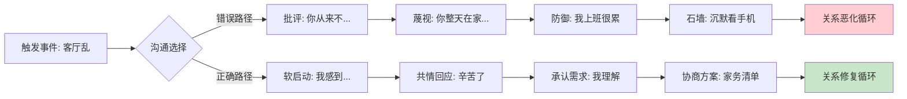
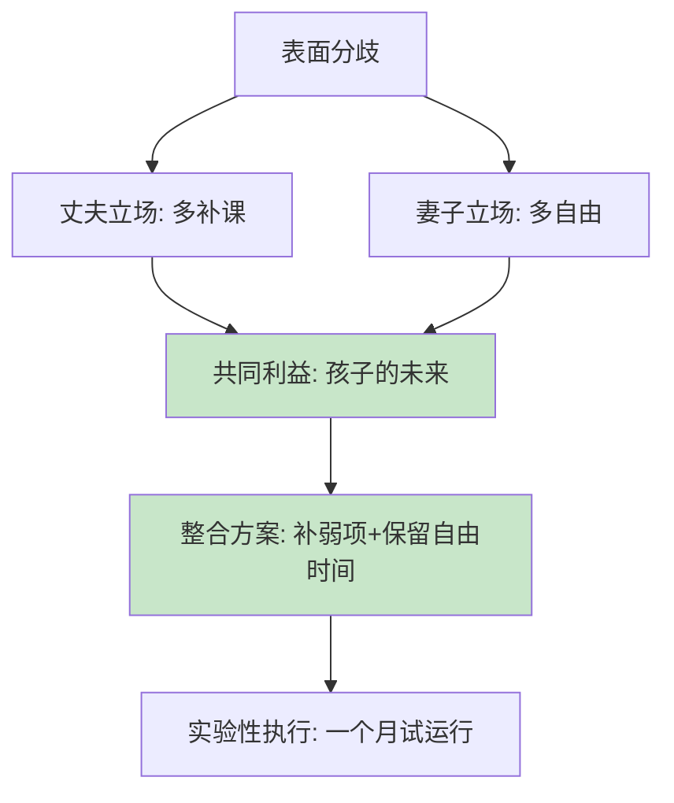
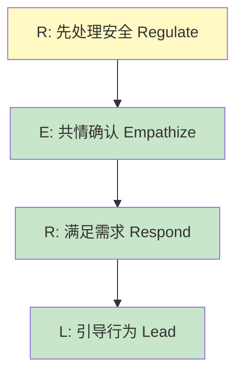
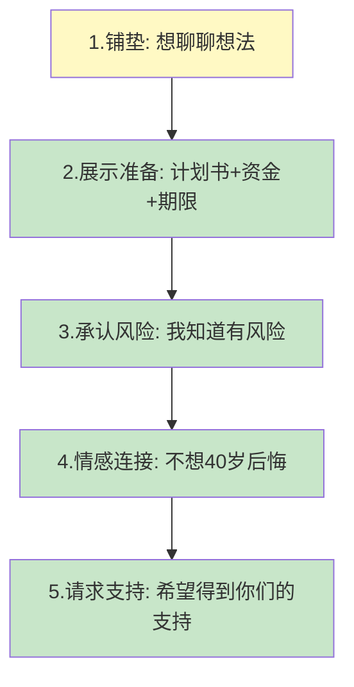
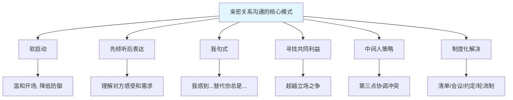

# 第十七章 亲密关系沟通 —— 实战案例

***

## 导读

理论学习的最终目的是落地实践。本节通过 15 个真实场景案例，覆盖夫妻、亲子、婆媳、恋爱、代际、家庭冲突六大维度，每个案例均包含：场景还原、错误示范、正确示范、理论解析、关键要点五个层次。读者可按自身需求跳转阅读，也可通读全篇建立完整的实战认知框架。

### 案例索引速查表

| 编号 | 类型 | 场景 | 核心技巧 |
|------|------|------|----------|
| 1 | 夫妻 | 末日四骑士→情感联结 | 软启动、"我"句式 |
| 2 | 夫妻 | 孩子教育分歧 | 寻找共同目标、协商 |
| 3 | 夫妻 | 信任危机修复 | 真诚道歉、行动重建 |
| 4 | 夫妻 | 性生活沟通 | 脆弱性表达、需求协商 |
| 5 | 亲子 | 孩子不写作业 | 共情、合作解决问题 |
| 6 | 亲子 | 青春期封闭 | 无条件接纳、留白 |
| 7 | 亲子 | 二胎平衡 | 专属时间、情感确认 |
| 8 | 亲子 | 网络沉迷 | 边界协商、动机探索 |
| 9 | 婆媳 | 育儿观念冲突 | 中间人策略、权威引用 |
| 10 | 婆媳 | 家务分工矛盾 | 感恩表达、角色分工 |
| 11 | 恋爱 | 异地恋信任维护 | 情感账户、仪式感 |
| 12 | 代际 | 帮父母用科技 | 费曼教学法、耐心 |
| 13 | 代际 | 辞职创业讨论 | 展示准备、风险预案 |
| 14 | 家庭 | 财务分歧 | 家庭会议、数据决策 |
| 15 | 家庭 | 过年去谁家 | 轮流制、灵活变通 |

***

## 一、夫妻沟通案例

### 案例一：从"末日四骑士"到情感联结

**背景：** 小明和小红结婚 5 年，有一个 3 岁的孩子。最近一年，两人经常因为家务和育儿问题发生争吵，关系逐渐冷淡。

#### 错误示范：末日四骑士全面爆发

```text
小红：（看到客厅很乱）你又把东西扔得到处都是！你从来不帮忙收拾！（批评）
小明：我上班那么累，回来还不能休息一下吗？你整天在家不就带个孩子吗？（防御+蔑视）
小红：带孩子不累吗？你试试一个人带一天！（愤怒升级）
小明：……（沉默，看手机）（石墙）
小红：你每次都这样！一说你就沉默！你到底有没有在听我说话？！（批评循环）
```

**逐句诊断：**

| 发言者 | 表面语言 | 深层需求 | 使用的末日骑士 |
|--------|----------|----------|----------------|
| 小红 | "你从来不帮忙收拾" | 希望被看见、被分担 | 批评（永久性归因：从来不） |
| 小明 | "你整天在家不就带个孩子" | 希望自己的辛苦被认可 | 蔑视（贬低对方贡献） |
| 小红 | "你试试一个人带一天" | 表达委屈和愤怒 | 批评升级 |
| 小明 | 沉默看手机 | 逃避冲突、情绪过载 | 石墙 |

Gottman 研究表明，当"末日四骑士"（批评、蔑视、防御、石墙）同时出现时，婚姻破裂预测准确率高达 93.6%。这四种行为的核心危害在于：批评攻击对方的人格而非行为，蔑视摧毁尊重基础，防御拒绝承担责任，石墙切断沟通通道。

#### 正确示范：软启动 + 情感联结

```text
小红：（深呼吸，选择软启动）老公，我今天带孩子有点累，看到客厅有点乱
      心里更烦躁了。你能不能帮我收拾一下客厅？

小明：（放下手机）辛苦了，我今天开会也挺累的，没注意到客厅。我现在就来收拾。

小红：谢谢。其实我知道你上班也很辛苦，我就是有时候会觉得有点委屈。

小明：（坐到小红身边）我理解，带孩子确实不容易。以后我回来先花 15 分钟
      收拾一下，这样你也能轻松一些。

小红：谢谢你理解我。要不我们列一个家务清单，分一下工？这样大家都知道
      自己该做什么。

小明：好主意，周末我们一起列一下。
```

#### 理论解析



**为什么有效：**

1. **软启动替代批评**：Gottman 研究发现，对话的前 3 分钟决定了 96% 的对话走向。用"我感到……"开头的软启动，将攻击目标从"你的人格"转为"我的感受"，对方不再需要防御。
2. **承认对方的付出**：小红说"我知道你上班也很辛苦"，这打破了"谁更辛苦"的零和博弈，转向"我们都辛苦，如何合作"的共赢框架。
3. **具体可执行的方案**：不是抽象的"你以后多帮忙"，而是"回来先花 15 分钟收拾"——具体的时间、行为、频率，降低执行门槛。
4. **制度化解决**：家务清单将一次性协商转化为长期制度，避免同类冲突反复发生。

#### 关键要点

- 用"我感到+具体事件+请求"的公式替代"你总是+人格攻击"
- 对话开始的 3 分钟决定全局走向——软启动至关重要
- 先认可对方的处境，再表达自己的需求
- 协商出具体、可执行的方案，而非停留在态度层面

***

### 案例二：关于孩子教育的分歧

**背景：** 丈夫认为孩子应该多上补习班追赶同龄人，妻子认为应该给孩子更多自由时间发展兴趣。双方都觉得自己是为了孩子好。

#### 错误示范：互相否定

```text
丈夫：小明家的孩子钢琴都过八级了，咱们家的就知道玩！
妻子：你整天就知道让孩子学习，孩子都要被你逼疯了！
丈夫：我这是为他好！你这样惯着他，将来怎么办？
妻子：你才是在害他！你看看那些被逼出来的孩子，有多少心理问题！
```

**问题诊断：** 双方陷入"立场之争"——各自的立场是"多补课"和"多自由"，但背后的利益（深层需求）是相同的："希望孩子有一个好的未来"。当双方固守立场时，看不到共同利益，对话变成零和博弈。

#### 正确示范：探索共同目标

```text
丈夫：老婆，我最近有点担心孩子的学习。你觉得他现在的学习状态怎么样？

妻子：嗯，我也在想这个问题。你觉得他哪些方面需要加强？

丈夫：我觉得他的数学基础有点薄弱，可能需要补一下。你怎么看？

妻子：我同意数学需要加强，但我不太想让他周末全部排满。
      你觉得我们能不能找一个平衡点？

丈夫：要不这样，周六上午补数学，下午和周日给他自由安排？
      这样既补了弱项，也有放松的时间。

妻子：这个方案我觉得可以。我们先试一个月，看看效果再说。
```

#### 理论解析：哈佛谈判原则的"利益 vs 立场"



Fisher 和 Ury 在《谈判力》中提出：每个立场背后都有一个利益。教育分歧中，"补课"和"自由"都是手段，"孩子健康成长为有能力的人"才是共同利益。找到共同利益后，创造性解决方案自然浮现。

**关键谈判技巧：**

| 技巧 | 错误示范 | 正确示范 |
|------|----------|----------|
| 开场方式 | 下命令："必须报班" | 询问："你觉得怎么样？" |
| 探索需求 | 假设对方的想法 | 用开放式问题了解对方的顾虑 |
| 寻找交集 | 坚持自己的方案 | "我们能不能找一个平衡点？" |
| 决策方式 | 一锤定音 | "先试一个月，看效果再调整" |
| 退出机制 | 无 | 设定评估节点，保留调整空间 |

#### 关键要点

- 用询问代替命令，先了解对方的想法和担忧
- 超越"谁对谁错"，寻找"我们都想要什么"
- 方案留有调整空间，降低双方的承诺压力
- 用"试运行 + 评估"替代"永久决定"

***

### 案例三：修复信任危机

**背景：** 妻子发现丈夫与一位女同事的聊天记录比较暧昧，虽然没有实质性的出轨行为，但妻子感到受伤和不信任。这是一个典型的"情感出轨"边缘场景。

#### 错误回应

```text
丈夫："你想多了，我们就是普通同事关系。你能不能不要这么疑神疑鬼的？"
```

**为什么这是最糟糕的回应：** 这句话同时触发了三个伤害——
1. **否认感受**："你想多了"等于说"你的感受是错的"
2. **转移责任**：把问题从"我的不当行为"转向"你的过度敏感"
3. **质疑人格**："疑神疑鬼"直接攻击对方的判断力

这会让妻子觉得不仅被背叛，还被羞辱，信任缺口会进一步扩大。

#### 正确修复对话

```text
丈夫：我知道你看到那些聊天记录一定很难受。对不起，我的行为确实不恰当。

妻子：你知道我看到的时候有多伤心吗？我觉得自己不被尊重。

丈夫：我能理解你的感受。如果换成是我，我也会很难过。
      我不应该那样和她聊天，这是我的错。

妻子：你现在打算怎么做？

丈夫：我会跟那位同事说清楚，以后聊天保持在工作范围内。
      我的手机你可以随时看。我也愿意花更多时间来重建你的信任。

妻子：我需要一些时间来消化这件事，但我愿意一起努力。

丈夫：谢谢你愿意给我机会。我会用行动来证明。
```

#### 理论解析：信任修复的五阶段模型


心理学家 John Gottman 的信任修复研究表明，信任重建需要满足以下条件：

1. **完全承认错误**——不辩解、不淡化、不找借口。"我的行为确实不恰当"比"我也没做什么过分的"有效 10 倍。
2. **理解伤害的深度**——不是"我知道你生气了"，而是"我知道我伤害了你的尊严和安全感"。
3. **具体可验证的行动**——"手机随时可以看"、"和同事说清楚"是可验证的承诺，而非"我以后不会了"的空头支票。
4. **接受修复的时间成本**——信任的破坏是一瞬间的事，重建却需要数月甚至数年。丈夫必须接受这个不对称性。
5. **持续一致的行动**——一次道歉不够，需要在日常生活中反复证明自己的可靠性。

**信任重建的时间线参考：**

| 阶段 | 时间范围 | 核心任务 | 伴侣的状态 |
|------|----------|----------|------------|
| 危机期 | 1-2 周 | 承认、道歉、停止伤害行为 | 愤怒、悲伤、反复追问 |
| 消化期 | 1-3 个月 | 透明化、持续证明 | 情绪波动、试探性信任 |
| 重建期 | 3-12 个月 | 建立新的关系约定 | 逐渐放松、偶尔触发 |
| 巩固期 | 1 年以上 | 深化关系质量 | 基本恢复、关系升级 |

#### 关键要点

- 承认错误，不找借口，不转移责任
- 表达对伴侣感受的深度理解
- 提出具体的、可验证的改正措施
- 给伴侣充足的时间和空间
- 用持续的行动而非语言重建信任

***

### 案例四：性生活与亲密需求的沟通

**背景：** 结婚 7 年的夫妻，妻子觉得丈夫对性生活的需求减少，担心丈夫不再被自己吸引；丈夫工作压力大，对性生活的频率需求降低，但不知如何开口。这类话题在中国文化中尤其难以启齿。

#### 错误的回避模式

```text
妻子：（旁敲侧击）你是不是觉得我没有以前好看了？
丈夫：你想什么呢，别胡思乱想。
妻子：那你为什么总是……算了，不说了。
丈夫：（转移话题）今天晚饭吃什么？
[双方都不舒服，但都不面对]
```

**问题诊断：** 性话题在中国家庭中属于"房间里的大象"——双方都知道问题存在，但谁都不愿意先开口。回避不会让问题消失，只会让误解累积：妻子可能误以为丈夫不爱自己了，丈夫可能感到被施加压力。

#### 正确的沟通方式

```text
妻子：（选择私密、放松的时机）老公，我想跟你聊聊我们亲密关系的事。
      不是抱怨，就是想了解你的感受。

丈夫：嗯，你说。

妻子：我最近感觉我们的亲密接触比以前少了。我不是在说性生活，
      就是感觉我们的距离好像远了一点。你最近工作压力是不是很大？

丈夫：确实，最近项目紧，每天都很累，回到家只想躺着。
      不是不想要你，是真的没精力。

妻子：我理解，工作确实很辛苦。你觉得我们可以怎么调整？
      比如不一定非要在晚上，周末白天怎么样？

丈夫：（松了口气）周末确实好一些。其实我也觉得我们最近有点疏远，
      只是不知道怎么开口。

妻子：以后有什么感受都跟我说，好不好？这是我们两个人的事。

丈夫：好，你也是。
```

#### 理论解析

性沟通的核心难点在于**脆弱性暴露**——谈论性需求意味着暴露自己最私密的渴望和恐惧。Brené Brown 的脆弱性研究表明，脆弱性不是软弱，而是勇气的表现，也是亲密关系深化的必要条件。

**性沟通的四个原则：**

1. **选择正确的时机**：不在争吵中、不在疲惫时、不在公开场合。选择双方都放松、私密的时刻。
2. **用"关系框架"而非"性框架"**：不是"你为什么不想做"，而是"我们的亲密感是不是少了一些"——后者涵盖情感和身体两个层面。
3. **先理解再表达**：先问对方的感受和压力，再表达自己的需求。
4. **协商而非要求**：提出灵活的替代方案（时间、方式），而不是固定诉求。

#### 关键要点

- 性话题不是禁忌，而是亲密关系的重要组成部分
- 用"关系"框架谈论性，而非单纯的"频率"框架
- 理解性欲差异的正常性——压力、年龄、健康都会影响
- 创造安全的对话环境，避免在争吵中翻出性话题

***

## 二、亲子沟通案例

### 案例五：应对孩子的"不听话"

**背景：** 7 岁的孩子不愿意写作业，每次都拖到很晚，妈妈已经多次催促无效。

#### 错误示范

```text
妈妈：你怎么又不写作业？说了多少遍了！你怎么这么不听话！
孩子：我不想写……
妈妈：不想写也得写！你是学生，写作业是你的责任！快去！
孩子：（委屈地去写作业，但效率很低，边写边玩）
```

**问题诊断：** 妈妈的催促模式——命令 → 抵抗 → 强制执行 → 低效结果。这不仅没有解决问题，还破坏了孩子的自主性动机。心理学中的"自我决定理论"（Deci & Ryan）指出，当人感到行为是被外部强迫时，内在动机会显著下降。孩子不是"不想写作业"，而是"不想被命令写作业"。

#### 正确示范

```text
妈妈：（坐到孩子身边）宝贝，我发现你最近好像不太想写作业，
      能告诉我为什么吗？

孩子：作业好多，写了好久都写不完，好烦。

妈妈：嗯，作业多确实会让人觉得烦。你觉得哪些作业最难？

孩子：数学那些计算题，要做好多道。

妈妈：我理解。那我们这样好不好？你先把最难的数学作业做了，
      做完之后休息 10 分钟，再做其他的。你觉得怎么样？

孩子：好，那我试试。

妈妈：妈妈相信你可以的。如果遇到不会的题，可以来问我。

孩子：好！
```

#### 理论解析

这个案例应用了三个核心心理学原理：

1. **自我决定理论**：通过"你觉得怎么样？"给予孩子选择权，将外部压力转化为内在动机。
2. **费斯汀格的分段效应**：将"一大堆作业"拆成"先做最难的 → 休息 → 再做其他的"，降低心理负担。
3. **积极期望效应（罗森塔尔效应）**："妈妈相信你可以的"传递信任，激活孩子的自我效能感。

**不同年龄段的作业沟通策略：**

| 年龄段 | 核心挑战 | 策略 | 语言模板 |
|--------|----------|------|----------|
| 6-8 岁 | 注意力短、需要陪伴 | 陪伴启动 + 分段完成 | "我们先做 15 分钟，然后休息" |
| 9-11 岁 | 开始有自己的想法 | 给选择权 + 自主安排 | "你想先做哪科？自己安排顺序" |
| 12-14 岁 | 渴望独立、反感监督 | 信任 + 后果承担 | "你自己规划，需要帮助跟我说" |
| 15-18 岁 | 高度自主需求 | 只在被请求时介入 | "你的学习你做主，我在这里" |

#### 关键要点

- 先了解"为什么不想做"，而非直接要求"你必须做"
- 给孩子选择权和自主感，激活内在动机
- 将大任务拆解为小段落，降低心理门槛
- 用信任和鼓励替代监督和催促

***

### 案例六：青春期孩子的封闭

**背景：** 15 岁的孩子最近情绪低落，不愿意和父母说话，总是把自己关在房间里。父母既担心又无奈。

#### 错误示范

```text
妈妈：你怎么总把自己关在房间里？出来和我们说说话！
孩子：不想说。
妈妈：你这孩子怎么这样？我们是你的父母，有什么不能说的？
孩子：（更加沉默）
爸爸：你妈说得对，你不能这样对我们！
孩子：你们根本不懂！（摔门）
```

**问题诊断：** 青春期大脑的前额叶皮层尚未发育成熟（通常要到 25 岁才完全成熟），情绪调节能力有限。同时，青春期的核心发展任务是"自我同一性建立"——孩子需要通过与父母保持心理距离来建立独立的自我。这不是叛逆，而是成长的必经阶段。

#### 正确示范

```text
妈妈：（敲门）宝贝，妈妈能进来吗？

孩子：嗯。

妈妈：（进来，不坐太近）我注意到你最近好像不太开心，想跟你说，
      无论发生什么事，爸爸妈妈都爱你，都在你身边。
      如果你愿意说，我随时都愿意听。如果现在不想说，也没关系，
      等你想说的时候再来找我。

孩子：……嗯。

妈妈：（起身准备离开）对了，桌上给你切了水果，记得吃。（轻轻关门）

[几天后]
孩子：妈，我想跟你说个事……
```

#### 理论解析：依恋理论与青春期

青春期的"推开父母"并不意味着依恋关系断裂。相反，Bowlby 的依恋理论指出，安全型依恋的孩子更敢于探索世界——包括探索独立性。当孩子确信"父母永远在那里"时，他才有勇气暂时推开。

**青春期沟通的五个关键原则：**

1. **尊重物理和心理空间**：敲门、保持距离、不翻看日记和手机——信任是青春期依恋的基石。
2. **表达无条件的爱**："无论发生什么事，我们都爱你"——这不是废话，而是青春期孩子最需要听到的安全感信号。
3. **不强迫即时沟通**：给孩子"现在不想说"的权利。强迫沟通只会强化防御。
4. **用行动而非语言表达关心**：切好的水果比"我们关心你"更有说服力。
5. **耐心等待**：几天后孩子主动开口，正是"安全基地"效应的体现。

#### 关键要点

- 青春期的封闭是正常的成长需要，不是针对父母的敌意
- 不要试图"撬开"孩子，而是"守在门口"
- 无条件的爱和支持比追问和审讯有效得多
- 行动（水果、安静的陪伴）比语言更有力量

***

### 案例七：二胎家庭的平衡

**背景：** 大宝 5 岁，二宝 1 岁。大宝最近经常发脾气，对二宝有敌意，甚至推搡二宝。

#### 错误示范

```text
大宝：（推了二宝一下）
妈妈：你怎么能推弟弟！你是哥哥，应该让着弟弟！
大宝：我不要弟弟！
妈妈：你怎么这么自私！弟弟还小，你应该保护他！
大宝：（大哭）
```

**问题诊断：** 用道德标签（"自私"）和角色压迫（"你是哥哥应该让"）来处理大宝的行为，只会加深大宝对二宝的敌意——"因为弟弟，妈妈骂我了"。大宝的行为不是"坏"，而是"丧失感"的表达。

#### 正确示范

```text
妈妈：（先把二宝安顿好，然后蹲下来，平视大宝）
      宝贝，你推了弟弟，妈妈需要先看看弟弟有没有受伤。
      （查看二宝，确认无碍后回到大宝身边）

妈妈：好了，弟弟没事。现在妈妈想听听你的感受。
      你是不是觉得妈妈最近陪弟弟太多了，陪你太少了？

大宝：（点头，眼眶红了）

妈妈：（抱住大宝）妈妈理解你的感受。有了弟弟之后，
      妈妈陪你的时间确实少了一些，你觉得委屈是不是？

大宝：嗯……你总是抱弟弟，都不抱我了。

妈妈：对不起宝贝，是妈妈疏忽了。妈妈对你的爱一点都没有少。
      这样好不好，每天弟弟睡觉的时候，就是妈妈和你的专属时间，
      我们一起看书、玩游戏，好不好？

大宝：好！那我现在可以抱抱弟弟吗？

妈妈：当然可以，来，妈妈教你怎么轻轻抱弟弟。
```

#### 理论解析

**大宝敌意的心理机制：** 阿德勒的出生顺序理论指出，二宝出生后，大宝从"唯一"变成"之一"，经历的是一种真实的丧失。大宝的攻击行为本质上是在测试："妈妈还爱我吗？"

**处理大宝行为的 RERL 模型：**



- **R（Regulate）**：先确认二宝安全，再处理大宝的情绪——顺序很重要。
- **E（Empathize）**：蹲下来平视大宝，确认他的感受是合理的。
- **R（Respond）**：用"专属时间"填补大宝的丧失感。
- **L（Lead）**：引导大宝参与照顾二宝，从"竞争者"转变为"保护者"。

#### 关键要点

- 大宝的敌意不是"坏"，而是"痛"——丧失感的表达
- 先处理安全问题，再处理情感问题
- 用"专属时间"而非"你也大了"来回应大宝的需求
- 引导大宝从竞争者转变为二宝的保护者和引导者

***

### 案例八：网络沉迷的边界协商

**背景：** 13 岁的孩子沉迷手机游戏，每天放学回家就玩到深夜，成绩下滑，父母强行没收手机后引发激烈冲突。

#### 错误示范

```text
爸爸：把手机交出来！你看看你的成绩！从今天起不准再玩游戏！
孩子：你凭什么没收我的手机！我同学都玩！
爸爸：别人家的事我不管！你是我的孩子就得听我的！
孩子：（摔东西）我恨你们！
```

#### 正确示范

```text
爸爸：儿子，我想跟你聊聊游戏的事。不是要骂你，
      就是想了解一下你为什么这么喜欢玩。

孩子：（警惕）……就是好玩呗。

爸爸：是什么游戏？你跟我讲讲，我也想了解一下。

孩子：（稍微放松）是一个组队的游戏，我们班好几个人一起玩的。

爸爸：哦，所以这个游戏的乐趣有一部分是跟朋友一起？

孩子：对啊，如果我不玩，他们聊什么我都不知道。

爸爸：我理解了。那你觉得每天玩多长时间比较合适？
      不是爸爸要限制你，而是一直玩到很晚，第二天上课会没精神。

孩子：……可能一个小时？

爸爸：一个小时可以。我们这样约定：作业做完之后可以玩一个小时，
      周末可以多一些。如果一个月后成绩没有下滑，我们继续保持；
      如果下滑了，再一起调整。你觉得怎么样？

孩子：行。

爸爸：还有，你跟我说说那个游戏，周末我们一起看看？
      我也想了解你的世界。
```

#### 理论解析

网络沉迷的根源通常不是"游戏太好玩"，而是现实世界中的心理需求未被满足。根据自我决定理论，人有三个基本心理需求：

| 心理需求 | 在游戏中的满足 | 在现实中可能的缺失 |
|----------|---------------|-------------------|
| 自主感 | 自己选择角色和策略 | 被安排、被控制 |
| 胜任感 | 升级、排名、成就 | 学业挫败、缺乏认可 |
| 归属感 | 团队合作、社交圈 | 在校社交困难、孤独 |

因此，解决沉迷问题不能只靠"禁止"，而需要同时满足这三个需求：给选择权（自主）、找到现实中的胜任体验（胜任）、理解社交需求并帮助建立线下连接（归属）。

#### 关键要点

- 先理解沉迷背后的心理需求，而非直接禁止
- 把限制变成协商，让孩子参与规则制定
- 用"试运行 + 评估"降低孩子的抵触心理
- 父母主动了解孩子的兴趣世界，建立共同语言

***

## 三、婆媳沟通案例

### 案例九：育儿观念冲突

**背景：** 婆婆认为孩子应该多穿衣服，媳妇认为孩子不能穿太多。这是中国家庭中最高频的婆媳冲突之一。

#### 错误的直接对抗

```text
婆婆：给孩子多穿点，别着凉了！
媳妇：妈，现在科学育儿都说孩子不能穿太多，会捂出病的。
婆婆：我养了三个孩子，都是这么带大的，有什么问题？
媳妇：那是以前，现在都什么年代了……
（婆媳关系恶化）
```

**问题诊断：** 媳妇犯了"权威对权威"的错误——用"科学育儿"的权威对抗"经验育儿"的权威。对婆婆来说，否定她的育儿经验等于否定她作为母亲的价值。这不是观念之争，而是尊严之争。

#### 正确的中间人策略

```text
丈夫：（私下对妈妈）妈，我知道您是关心孩子，怕他着凉。
      您的育儿经验我们都记在心里。不过儿科医生确实建议
      孩子不要穿太多，容易出汗感冒。
      要不我们按照医生的建议来，如果孩子真的冷了，我们再加衣服？

婆婆：医生说的？那行，那就听医生的。

丈夫：（私下对妻子）老婆，妈的出发点是好的，都是为了孩子。
      下次有什么不同意见，你先跟我说，我来和妈沟通，好不好？

妻子：好，辛苦你了。
```

#### 理论解析：三角化与中间人角色

家庭系统理论中的"三角化"（Triangulation）概念指出，当两个人之间的关系紧张时，往往会拉入第三个人来缓解压力。在婆媳关系中，**丈夫/儿子**天然就是那个"第三点"。

**丈夫作为中间人的黄金法则：**

| 原则 | 说明 |
|------|------|
| 1. 不传话 | 不把一方的抱怨原封不动转述给另一方 |
| 2. 分开沟通 | 与妈妈和妻子分别沟通，不当面对质 |
| 3. 各自肯定 | 对妈妈肯定经验和关心，对妻子肯定立场和感受 |
| 4. 引入权威 | 用第三方权威（医生、专家）化解"谁对谁错"的僵局 |
| 5. 承担责任 | "医生建议的"比"我老婆说的"更容易被婆婆接受 |

**为什么"医生说的"比"科学育儿说的"有效：** "科学育儿"在婆婆听来是"你的方法不科学"，带有否定意味；而"医生说的"是第三方权威，不涉及对婆婆的评价，更容易被接受。

#### 关键要点

- 丈夫/儿子必须主动承担中间人角色
- 分开沟通，不制造正面冲突
- 用权威第三方化解"谁对谁错"的零和博弈
- 先肯定出发点，再引入不同观点

***

### 案例十：家务分工的矛盾

**背景：** 婆婆来帮忙带孩子，但对媳妇的家务方式有很多不满，经常当面或背后批评。

#### 正确示范

```text
媳妇：妈，您来帮忙带孩子真的帮了我们大忙，我和小明都特别感激。
      我知道我做家务的方式可能和您不太一样，有什么做得不对的地方，
      您直接跟我说，我改。

婆婆：也没什么不对的，就是有些地方可以做得更好。
      比如这个碗，要先用洗洁精泡一下再洗，才能洗得干净。

媳妇：好，我记住了。以后按您说的方法试试。
      妈，您带孩子也辛苦了，家务的事您不用操心，我来做就行。
      您就负责陪宝宝玩就好。

婆婆：行，那我去做饭。

媳妇：妈，今天我来做饭吧，您休息一下。晚上我做您爱吃的红烧肉。
```

#### 理论解析

婆媳家务冲突的本质是**领地之争**——两个女人都觉得这个家应该按自己的方式运转。解决的关键不是"谁的方式更好"，而是"如何让两人都觉得自己有价值"。

**家务冲突的三个处理层次：**

1. **表达感激**：先承认婆婆的付出和价值——"帮了我们大忙"。
2. **主动请教**：给婆婆"被尊重"的感觉——"有什么做得不对的，您直接说"。
3. **角色分工**：各司其职减少摩擦——婆婆负责带孩子，媳妇负责家务。

**关键话术对比：**

| 场景 | 错误话术 | 正确话术 |
|------|----------|----------|
| 婆婆批评洗碗方式 | "这样也能洗干净" | "好，我试试您的方法" |
| 婆婆进厨房帮忙 | "妈您歇着吧不用管" | "妈您帮我递一下那个盘子" |
| 做饭口味不同 | "现在都吃得清淡" | "妈喜欢吃什么我学着做" |

#### 关键要点

- 表达感激是所有婆媳沟通的起点
- 主动请教给婆婆"被尊重"的感觉
- 清晰的角色分工减少日常摩擦
- 用行动（做她爱吃的菜）表达关心

***

## 四、恋爱沟通案例

### 案例十一：异地恋的信任维护

**背景：** 情侣异地恋 8 个月，女方开始对男方的社交活动感到不安，男方觉得被"监控"，双方频繁因为小事争吵。

#### 错误模式

```text
女方：你今天又跟谁出去了？拍个照片给我看看。
男方：你能不能不要总这样？我连一点自由都没有吗？
女方：你不心虚为什么不给我看？
男方：不可理喻！（挂断电话）
```

#### 正确示范

```text
女方：老公，我最近感觉有点不安，可能是距离太远了，
      我有时候会胡思乱想。不是不相信你，就是想你了。

男方：我理解你的感受。异地确实不容易。
      我也有不安的时候，怕你身边出现更好的人。

女方：真的吗？我还以为就我一个人会这样。

男方：怎么会。这样好不好，我们每天晚上固定 10 点视频通话，
      周末一起看个电影。有什么不安的时候直接跟我说，
      不要憋着变成猜疑。

女方：好。我也会注意，不总是追问你的行踪。
      其实我就是想确认你还爱我。

男方：我一直都爱你。以后想确认的时候直接说"我想你了"，
      比问"你在哪里"好用多了。

女方：（笑了）好，我想你了。
男方：我也想你。
```

#### 理论解析：情感银行账户

Gottman 提出的"情感银行账户"概念在异地恋中尤为关键：每一次积极互动（关心、分享、肯定）是存款，每一次消极互动（争吵、忽视、猜疑）是取款。异地恋的日常互动频率本身就低于同城恋爱，因此每一次互动的质量更加重要。

**异地恋沟通的四个支柱：**

| 支柱 | 具体做法 | 心理作用 |
|------|----------|----------|
| 固定仪式 | 每晚 10 点视频、早安晚安 | 建立确定性，降低焦虑 |
| 共享体验 | 一起看电影、玩游戏、读同一本书 | 创造"在一起"的感觉 |
| 情绪直说 | "我想你了"替代"你在哪里" | 表达需求而非控制行为 |
| 未来规划 | 明确异地结束的时间点 | 给关系一个"希望锚点" |

#### 关键要点

- 安全感的缺失是异地恋的常态，不是个人缺陷
- 用"我感到不安"替代"你是不是做了什么"
- 建立固定的沟通仪式，降低不确定性
- 表达想念比追问行踪更有效

***

## 五、代际沟通案例

### 案例十二：帮助父母使用科技

**背景：** 父母想学用微信视频通话和远在外地的孩子保持联系。

#### 错误示范

```text
女儿：妈，你怎么又忘了？我都教了你好几遍了！
      点这里，然后点这里，再点这里！
妈妈：（手忙脚乱）哪个啊？这里吗？
女儿：不是！是下面那个！唉，算了算了，你别学了，我打给你就行了。
妈妈：（沮丧地放下手机）
```

**问题诊断：** 女儿犯了"专家盲点"——已经完全掌握技能的人很难理解初学者的困惑。当女儿说"点这里"时，她以为很清楚，但妈妈面对一个满是图标的屏幕，根本不知道"这里"是哪里。

#### 正确示范

```text
女儿：妈，我来教你怎么打视频电话，学会了以后我们就可以天天视频了。

妈妈：好，但是我怕学不会。

女儿：没关系，很简单的。来，第一步，找到微信的图标，
      就是那个绿色的。您找到了吗？

妈妈：找到了。

女儿：好，然后点开它。看到了吗？下面有一排小图标，
      找到"通讯录"，就是那个小人。

妈妈：（用手指点）是这个吗？

女儿：对，就是这个。然后您找到我的名字，点进去，
      看到一个"视频通话"的按钮，点一下就好了。

妈妈：（试了一次）哎，真的出来了！

女儿：太棒了！妈您学得真快。来，我们再练几次，
      以后您想我了就直接打给我。

妈妈：好，我再试一次。
```

#### 理论解析：费曼教学法的应用

帮助父母使用科技，本质上是一个教学场景。费曼教学法的核心原则完全适用：

1. **用简单的语言**：不使用"APP"、"图标"等术语，而是"绿色的那个"、"小人"。
2. **一次一步**：每完成一步再进行下一步，不要一次性讲完所有步骤。
3. **让对方动手**：不是"你看我怎么做"，而是"你来试试"。
4. **及时鼓励**："太棒了，您学得真快"——父母和孩子一样需要正反馈。

**帮助父母学科技的进阶建议：**

| 阶段 | 方法 | 注意事项 |
|------|------|----------|
| 教学时 | 一次只教一个功能 | 不要同时教微信+支付宝+抖音 |
| 教学后 | 写一张步骤卡片放在旁边 | 字要大，最好配截图 |
| 巩固期 | 让父母每天练习一次 | 打给你的电话不要嫌烦 |
| 进阶期 | 父母熟练后再教下一个功能 | 间隔至少一周 |

#### 关键要点

- 耐心是帮助父母学科技的第一美德
- 用简单的语言和一次一步的方式教学
- 让父母动手操作，而非自己代劳
- 多练习、多鼓励、写步骤卡片备忘

***

### 案例十三：与父母讨论人生选择

**背景：** 28 岁的女儿决定辞去稳定的工作去创业，父母非常反对。

#### 错误示范

```text
女儿：爸妈，我决定辞职去创业。
父亲：什么？你疯了吗？好好的工作不要，创什么业！
母亲：你一个女孩子，创什么业？找个稳定的工作，早点结婚才是正事。
女儿：你们不懂！这是我的人生，我自己做主！
（不欢而散）
```

**问题诊断：** 女儿的"我自己做主"在法律上完全正确，但在关系中是一个失败的沟通策略。它直接否定了父母的参与权，触发了父母的"被抛弃感"和"失控焦虑"。

#### 正确示范

```text
女儿：爸妈，我想和你们聊聊我最近的一些想法。

父亲：你说。

女儿：我在现在的公司工作了三年，学到了很多东西，
      但我感觉自己需要更大的发展空间。我有一个创业的想法，
      想做 XX 方向。

母亲：创业？那风险多大啊，你考虑清楚了吗？

女儿：我知道你们会担心。其实我已经做了很多准备，
      写了详细的商业计划书，也存了一笔启动资金。
      而且我给自己定了一个期限，如果两年内做不出成绩，
      我会重新找工作。

父亲：你具体想做什么？跟我们说说。

女儿：（详细介绍自己的计划）……我知道创业有风险，
      但我不想到了 40 岁后悔当初没有尝试。
      而且我不会冲动行事，我会做好风险控制。

母亲：你真的想好了？

女儿：是的，我想好了。我希望能得到你们的支持，
      即使只是精神上的。

父亲：既然你想清楚了，那我们支持你。
      但你答应我们，有什么困难一定要跟我们说。

女儿：一定。谢谢爸妈。
```

#### 理论解析

与父母讨论重大人生决策的核心矛盾是**独立性 vs 归属感**。成年子女需要独立决策的空间，父母需要"孩子仍然需要我"的确认感。好的沟通两者兼顾。

**说服父母的五步框架：**



1. **铺垫**：用"想聊聊"而非"我决定了"开场——前者是邀请参与，后者是通知结果。
2. **展示准备**：计划书、启动资金、失败预案——这些信息让父母看到"她是认真的，不是冲动"。
3. **承认风险**：主动说出风险比父母追问更有说服力——"我也知道有风险"比"不会有风险的"更可信。
4. **情感连接**："不想 40 岁后悔"——这比"这是我的人生"更容易引起父母的共鸣，因为每个父母都不希望孩子遗憾。
5. **请求支持**："即使只是精神上的"——降低父母的压力，不需要他们出钱出力，只需要情感支持。

#### 关键要点

- 重大决策提前铺垫，不要突然通知
- 用充分的准备展示你不是冲动行事
- 主动承认风险，提出应对方案
- 理解父母反对背后的关心，用情感连接化解对立

***

## 六、家庭冲突解决案例

### 案例十四：家庭财务分歧

**背景：** 丈夫想换一辆新车（30 万），妻子觉得应该把钱存起来给孩子上好学校。

#### 正确示范：家庭会议讨论

```text
主持人（妻子）：今天我们讨论一下家庭的财务安排。老公，你先说说你的想法。

丈夫：我觉得现在的车开了好几年了，想换一辆新的，大概需要 30 万。

妻子：我理解你想要一辆好车，不过我在想，孩子明年就要上小学了，
      好一点的私立学校学费加上各种费用，每年也要不少钱。

丈夫：这个确实需要考虑。那你觉得我们的预算怎么分配比较合理？

妻子：我算了一下，如果我们现在买 30 万的车，加上孩子上学的费用，
      可能会影响到我们的储蓄。

丈夫：那要不这样，我先看看有没有性价比更高的车型，20 万以内的。
      省下来的钱用于孩子的教育基金。

妻子：这个方案我觉得可以。另外我们可以看看有没有合适的贷款方案，
      这样一次性的压力小一些。

丈夫：好，我这周末去 4S 店看看，回来再讨论。

妻子：行，到时候我们再一起决定。
```

#### 理论解析：家庭财务沟通的框架

财务分歧是夫妻冲突的第二大来源（仅次于家务分工）。核心问题不是"钱怎么花"，而是"价值观差异"——安全感 vs 享受、当下 vs 未来、个人 vs 家庭。

**家庭财务沟通的四个原则：**

| 原则 | 说明 | 实操建议 |
|------|------|----------|
| 数据先行 | 用数字而非感觉说话 | 一起看账单、算预算 |
| 需求分级 | 区分"需要"和"想要" | 丈夫想要好车，家庭需要教育基金 |
| 共同决策 | 大额支出双方同意 | 设定"必须协商"的金额门槛 |
| 留有弹性 | 不做非此即彼的决定 | 20 万车+教育基金=折中方案 |

**家庭会议的组织模板：**

1. **设定议程**：提前告知要讨论什么，避免突然袭击。
2. **轮流发言**：每人 3-5 分钟，不打断。
3. **记录需求**：把双方的核心需求写下来，贴在可见处。
4. **头脑风暴**：不评判任何方案，先列出所有可能。
5. **评估选择**：对每个方案评估利弊。
6. **达成共识**：选择双方都能接受的方案。
7. **设定时间点**：约定执行时间和复盘时间。

#### 关键要点

- 家庭会议是处理家庭重大分歧的最佳工具
- 用数据和预算替代"我觉得"和"你乱花"
- 寻找折中方案而非二选一
- 每个决策都留有评估和调整的窗口期

***

### 案例十五：过年去谁家的难题

**背景：** 夫妻双方都是独生子女，过年去谁家成了每年的难题。这个矛盾在中国社会具有高度普遍性。

#### 正确示范

```text
丈夫：又要过年了，今年去谁家过年？我们商量一下吧。

妻子：我其实挺想回我家的，去年是在你家过的。

丈夫：我理解，我也想让我爸妈高兴。要不我们这样安排？

妻子：你说说看。

丈夫：年三十和初一在我家过，初二去你家住到初五，怎么样？
      这样两边都能照顾到。

妻子：初二回娘家确实也是传统。不过我妈可能会觉得年三十见不到我……

丈夫：那我们也可以轮流来，今年按我这个方案，明年反过来，
      年三十在你家，初二再回我家。

妻子：这样比较公平，我同意。另外，我们也可以在过年之前，
      先分别去看望一下双方父母。

丈夫：好主意，这样过年之前就已经陪过他们了。
      那我们这周末先去你家？

妻子：好呀，我给我妈打个电话说一下。
```

#### 理论解析

"过年去谁家"看似是一个日程安排问题，实质上触及了三个深层议题：**公平感**（谁家更重要）、**归属感**（我在你心里的位置）、**代际责任**（孝道的表达方式）。

**解决过年难题的五种方案对比：**

| 方案 | 优点 | 缺点 | 适用场景 |
|------|------|------|----------|
| 轮流制 | 公平，可预期 | 可能两头都照顾不周 | 双方父母在同一城市 |
| 分段制 | 两边都去 | 行程紧凑、奔波 | 双方父母在同一区域 |
| 合并过年 | 全家团聚 | 生活习惯差异可能引发矛盾 | 双方父母关系融洽 |
| 各回各家 | 各自满足 | 夫妻分开过年，孤独感 | 双方父母距离远 |
| 提前探望+分流 | 灵活，减少压力 | 需要额外假期 | 有一方有假期余裕 |

本案例采用的是"分段制 + 轮流制 + 提前探望"的组合方案，兼顾了公平、灵活和人情。

#### 关键要点

- 主动提出讨论比被动争吵好——"我们商量一下"是正确开场
- 设计轮流制度保证长期公平
- 灵活变通，用"提前探望"创造额外的相处时间
- 核心目标不是"谁赢了"，而是"两家人都开心"

***

## 七、案例总结：跨场景的核心沟通模式

通过以上 15 个案例，我们可以提炼出亲密关系沟通中反复出现的六大核心模式：



### 六大模式详解

**1. 软启动的力量**

Gottman 研究表明，对话的前 3 分钟决定了 96% 的走向。用温和的方式开始对话，可以将冲突概率降低 50% 以上。所有成功案例的共同起点都是：不带攻击性的开场白。

**2. 倾听先于表达**

在 15 个案例中，每一个成功的沟通都以"先了解对方"为起点。无论是丈夫先问妻子对教育的看法，还是妈妈先问孩子为什么不想写作业——"先理解，后表达"是最基本也是最容易被忽略的原则。

**3. "我"句式的威力**

- 错误："你从来不帮忙"（攻击对方人格）
- 正确："我感到有点累，需要帮助"（表达自己的状态）

"我"句式将冲突从"你对我错"的零和博弈，转化为"我们的感受都需要被看见"的共赢框架。

**4. 寻找共同利益**

从教育分歧到财务分歧，从过年安排到婆媳关系——所有案例中的成功解决方案都源于同一个发现：双方的利益是相同的，只是立场不同。找到共同利益，创造性方案自然浮现。

**5. 中间人的协调作用**

在婆媳、翁婿等复杂家庭关系中，"桥梁人物"（通常是丈夫/儿子或妻子/女儿）的角色至关重要。好的中间人不是传话筒，而是分开沟通、各自肯定、引入权威的协调者。

**6. 制度化解决**

一次性的协商只能解决当下的问题。将解决方案转化为制度——家务清单、家庭会议、轮流制度、沟通约定——才能防止同类冲突反复发生。

***

## 八、自测清单：你的亲密关系沟通处于哪个水平？

请对照以下 15 个场景，评估自己在类似情况下的反应方式：

| 场景 | 初级（经常） | 中级（偶尔） | 高级（总是） |
|------|-------------|-------------|-------------|
| 伴侣做了一件让你不满的事 | 忍到爆发/直接批评 | 尝试沟通但带情绪 | 软启动+"我"句式 |
| 孩子不听话 | 命令/威胁 | 讲道理/催促 | 询问原因/共同解决 |
| 与伴侣意见不同 | 坚持己见/争论 | 各退一步 | 寻找共同利益 |
| 婆婆/岳母干涉你的生活 | 隐忍/爆发 | 直接沟通 | 通过配偶协调 |
| 伴侣情绪低落 | 不知道怎么办/回避 | 询问"怎么了" | 陪伴+不强迫表达 |
| 涉及钱的分歧 | 争吵/冷战 | 讨论但没结论 | 家庭会议+数据决策 |
| 伴侣和异性朋友交往 | 质问/盘查 | 表达不安但不追问 | 表达感受+信任 |
| 重大人生决策 | 自己决定/通知对方 | 征求意见 | 共同讨论+风险预案 |

- **初级为主**：你可能正在用本能反应处理亲密关系，建议从"软启动"和"我句式"开始练习。
- **中级为主**：你已有沟通意识，但技巧不够稳定，建议系统学习并刻意练习。
- **高级为主**：你的沟通水平已经相当成熟，可以在复杂场景中继续精进。

***

## 九、行动指南：从案例到实践

阅读案例是第一步，将案例中的技巧转化为日常习惯才是关键。以下是分阶段的实践建议：

### 第一周：观察

不急着改变沟通方式，先观察自己和家人的沟通模式。记录：每天有哪些对话以批评或指责开始？哪些时刻你选择了回避而非面对？

### 第二周：软启动

尝试在所有亲密对话中使用软启动。标准公式："我感到（情绪），因为（具体事件），我希望（具体请求）"。例如："我感到有点累，因为今天带了一天孩子，我希望你能帮忙收拾一下客厅。"

### 第三周：倾听练习

每天至少一次，在回应之前先复述对方的话："你的意思是……对吗？"确认自己理解正确后再表达自己的观点。

### 第四周：制度建设

和伴侣/家人一起建立一个沟通约定，例如：
- 每周一次 30 分钟的"家庭会议"
- 争吵时的"暂停规则"（情绪激动时各自冷静 20 分钟再继续）
- 大额支出超过 XX 元需要双方协商

### 持续改进

亲密关系沟通是一个终身学习的过程。没有完美的一天，只有不断进步的每一天。关键不是"永远不犯错"，而是"犯错后能修复"。

***
