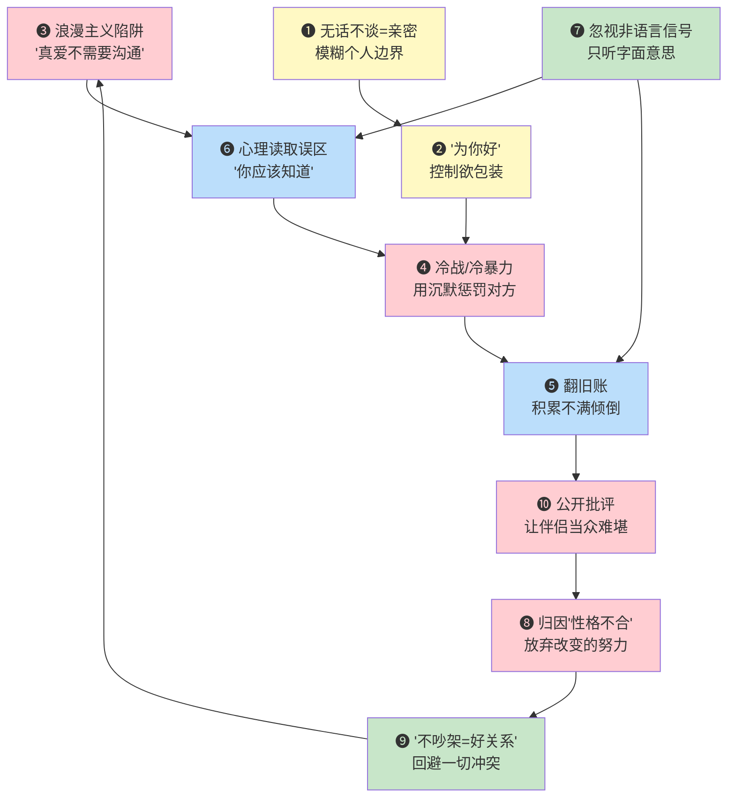
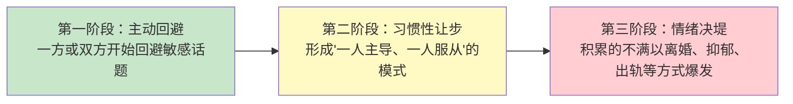
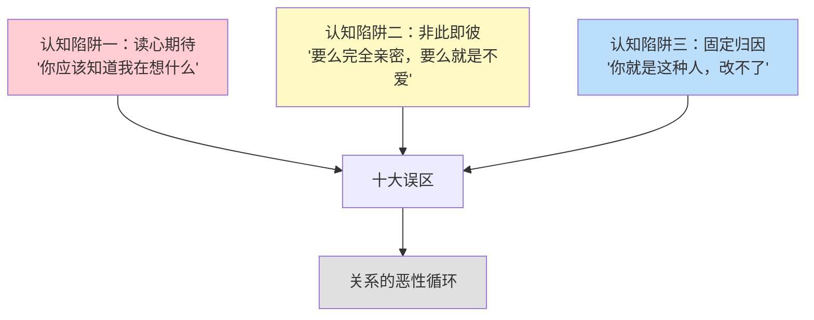

# 亲密关系沟通中的常见误区

亲密关系是人类最深刻的情感纽带，也是沟通最容易出问题的领域。许多伴侣在日常互动中不知不觉地陷入沟通误区，这些误区如同慢性毒药，日积月累地侵蚀着关系的根基。

本章系统梳理亲密关系中最常见的十大沟通误区，不仅帮你识别"坑"在哪里，更帮你理解"为什么会踩坑"以及"怎么爬出来"。每一个误区都配有心理机制分析、真实场景还原、对比对话示例和具体纠正方案。

本章内容与[理论基础](../_index.md)中的依恋理论、戈特曼"末日四骑士"模型、非暴力沟通框架密切关联。建议先阅读理论部分，再对照本章的误区进行自我诊断。

---

## 快速自测：你正在踩哪些误区？

在逐一了解误区之前，先花两分钟做一次自我扫描。以下10个判断题，回答"是"计1分，"否"计0分：

| 序号 | 自测题 | 是/否 |
|:---:|--------|:---:|
| 1 | 我认为伴侣之间应该没有秘密，包括查看对方手机 | |
| 2 | 我经常用"为你好"来说服伴侣接受我的建议 | |
| 3 | 我觉得如果对方真正爱我，就应该知道我在想什么 | |
| 4 | 生气时我会选择沉默不语，几天不跟对方说话 | |
| 5 | 争吵时我经常会提起对方过去的错误 | |
| 6 | 我期待伴侣在我还没开口时就满足我的需求 | |
| 7 | 我更关注伴侣说了什么，而不是怎么说的 | |
| 8 | 我认为沟通问题说明我们"性格不合" | |
| 9 | 我觉得好的关系就是不吵架 | |
| 10 | 我偶尔会在别人面前吐槽伴侣的缺点 | |

**评分解读：**

- **0-2分**：你的沟通意识较好，但仍有提升空间。通读本章可以帮助你巩固认知。
- **3-5分**：你可能正在无意识地踩入多个误区。重点关注得分项对应的章节。
- **6-8分**：你的亲密关系沟通存在较为明显的问题，建议认真阅读并配合[练习方法](../_index.md)同步改善。
- **9-10分**：你的关系正处于高风险状态，强烈建议在阅读本章的同时寻求专业婚姻咨询师的帮助。

---

## 十大误区的内在关联

这十个误区并非孤立存在，它们之间存在强烈的因果链和恶性循环关系。理解这种关联，有助于你从系统层面识别问题，而非仅修补单个症状。

> **图示说明**：红色节点是直接破坏信任的行为，黄色节点是边界的侵蚀，蓝色节点是认知偏差导致的沟通障碍，绿色节点是认知扭曲。箭头表示一个误区如何自然演变为下一个误区。

**关键洞察**：大多数关系不是被一个大问题击垮的，而是被多个相互强化的小误区慢慢侵蚀的。比如，浪漫主义陷阱（❸）让你觉得"不需要说"，心理读取误区（❻）让你觉得"你应该懂"，当期待落空后冷战（❹）登场，冷战积累的不满又通过翻旧账（❺）一次性爆发……这就是一个完整的恶性循环。

理解这个循环的意义在于：**你不需要同时解决所有问题，只需要找到循环中最薄弱的环节，从那里打断它。**

---

## 误区一：将"亲密"等同于"无话不谈"——失去个人边界

### 典型表现

- 要求对方随时汇报行踪和社交细节，精确到"和谁、在哪、几点回来"
- 翻看对方手机、社交媒体，认为"如果你没什么隐瞒的，为什么不能给我看"
- 对伴侣的独处时间感到不安，认为"你想一个人待着就是不爱我"
- 事无巨细地分享自己的每一个想法，期待对方时刻回应
- 要求对方把所有密码、银行卡、社交账号全部共享
- 对伴侣与朋友的聚会时间过长感到焦虑，频繁打电话催促
- 在伴侣需要独处空间时感到被拒绝，追问"你是不是不想跟我待在一起"

### 真实场景

小李和小王结婚三年。小李习惯每天翻看小王的手机聊天记录，起初小王觉得"无所谓，反正也没什么"。但渐渐地，小王感到自己没有一点私人空间，开始对小李产生抵触情绪，甚至不愿意在家多待。小李的不安感反而越来越强——她觉得"如果你没问题，为什么现在不让我看了？"这形成了一个典型的自我实现的预言：越控制，对方越想逃离，越逃离，越要控制。

**中国语境下的特殊表现**：在中国文化中，"夫妻一体"的传统观念强化了这种边界模糊。很多家庭中，夫妻共享所有银行密码和社交账号被视为"信任的标志"，而设置密码反而被认为是"有外心"。再加上中国社会中亲友的"关心式询问"（"你老公工资多少？""你老婆怎么又出去旅游了？"），外界的窥探压力也加剧了伴侣之间的边界模糊。

### 心理机制解析

心理学中的**自我分化理论**（Differentiation of Self，Bowen家庭系统理论的核心概念）指出，健康的亲密关系需要在"亲密性"（togetherness）与"自主性"（individuality）之间保持动态平衡。自我分化水平较低的人，容易将自己的身份与伴侣融合——"你的事就是我的事"，无法区分"我想知道"和"我需要知道"的区别。

依恋理论的视角看，这种行为往往与**焦虑型依恋**密切相关。焦虑型依恋者的核心恐惧是"被抛弃"，因此会通过监控和确认来缓解内心的不安。但这种策略适得其反：监控行为传递的信号是"我不信任你"，这会消耗伴侣的耐心，最终真的导致疏远甚至离开。

神经科学研究发现，监控行为激活的是大脑的"威胁检测系统"（杏仁核），而不是"信任系统"（腹侧纹状体）。换句话说，每一次翻看手机的行为都在强化大脑的"威胁编码"，让你越来越难以信任对方——即使你什么都没发现。

### 正确做法

| 误区行为 | 替代方案 | 具体操作 |
|---------|---------|---------|
| 翻看手机 | 信任为默认，开放为选择 | 双方自愿分享手机使用习惯，但不强制检查 |
| 要求汇报行踪 | 主动分享而非被迫交代 | 约定"出门告知去向、预计回家时间"的合理惯例 |
| 对独处时间不安 | 尊重个人空间 | 每周为双方各安排1-2小时独处时间，各自发展兴趣 |
| 融合式分享 | 有选择的深度分享 | 分享感受和重要决定，不必汇报每一个想法 |
| 共享所有密码 | 关键信息共享，个人空间保留 | 共享银行账户等核心信息，个人社交账号保留隐私权 |

**边界协商对话模板**：

> **错误方式**："你把手机给我看看，你是不是有什么瞒着我？"
>
> **正确方式**："我最近有一些不安全感，可能跟我的性格有关，不是你的问题。我需要的不是看你的手机，而是你能多跟我聊聊你的近况，让我感觉我们是连接的。你觉得我们可以怎么做？"

两者的核心区别在于：前者把责任推给对方（"你有问题"），后者为自己的情绪负责（"我有需要"），同时邀请对方一起参与解决方案。

### 进阶：依恋类型视角的边界协商

如果你和伴侣的依恋类型不同（这是最常见的组合——焦虑型+回避型），边界协商需要额外的耐心：

1. **焦虑型**需要学习：伴侣的独处不等于拒绝，监控不能带来真正的安全感
2. **回避型**需要学习：适度的分享是联结的桥梁，完全封闭会伤害关系
3. **双方共同**：定期讨论彼此的边界感受，建立一个双方都舒适的"透明度级别"

**自我诊断问题**：如果你发现自己对伴侣的隐私空间感到强烈不安，问自己："这种不安是来自伴侣的行为，还是来自我自己的过去？"很多翻看手机的冲动，根源不是伴侣做了什么，而是早期依恋经历中形成的"被抛弃恐惧"。识别这一点，是改变的第一步。

---

## 误区二：用"为你好"包装控制欲

### 典型表现

- 干涉伴侣的职业选择："你那个工作不稳定，我帮你换一个"
- 限制伴侣的社交活动："你那些朋友对你不好，少来往"
- 替对方做决定："我已经帮你拒绝了，你不需要去"
- 用情感绑架实现控制："如果你真的爱我，就应该听我的"
- 对伴侣的穿着打扮、饮食习惯、兴趣爱好进行"纠正"
- 在伴侣做决定后反复批评"你当初就应该听我的"
- 在涉及双方的决定时单方面做主，事后再"通知"对方

### 心理机制：关心与控制的边界

关心与控制的核心区别在于**谁拥有最终决定权**：

| 维度 | 关心 | 控制 |
|------|------|------|
| 信息传递 | 提供信息和建议，让对方做决定 | 要求对方按照自己的方案执行 |
| 情感基调 | "我担心你，想和你一起分析" | "你不行，必须听我的" |
| 对方的回应 | 感到被支持，有选择权 | 感到被否定，有压迫感 |
| 拒绝后的反应 | 尊重对方的决定，继续支持 | 生气、冷暴力、反复施压 |
| 动机根源 | 真心为对方的福祉考虑 | 缓解自己的焦虑和不安全感 |
| 对方的成长 | 促进自主决策能力 | 削弱对方的自信心和判断力 |

### 中国语境下的特殊表现

在中国文化中，"为你好"有着特殊的社会合法性。父母对子女说"为你好"、丈夫对妻子说"为你好"、甚至公婆对儿媳说"为你好"——这些在西方文化中可能被直接识别为控制的行为，在中国社会中往往被包装在"关心""孝道""家庭责任"的外衣下。

更复杂的是，很多使用"为你好"策略的人确实认为自己是出于善意。他们不是在"装"，而是真的相信自己的判断比伴侣的更好。这种"善意的控制"比恶意的控制更难识别，也更难对抗——因为拒绝它会让人感到"不识好歹"。

### 真实场景

张先生总是以"为妻子好"为由，反对她参加同学聚会、限制她与异性同事的正常交往，甚至建议她辞职在家。表面上看，张先生的每一个"建议"都有合理性——同学聚会确实没什么意思，异性同事确实可能产生误会，在家确实更轻松。但当这些建议叠加在一起，妻子发现自己的社交圈越来越小、自信越来越低、生活越来越封闭。她像一只被关在笼中的鸟，虽然"安全"，却失去了自由和活力。

更深层的问题是：张先生的控制行为并非出于恶意，而是源于他自己的**不安全依恋**。他通过限制妻子的活动范围来降低"失去她"的风险。这种行为在心理学中被称为**关系维护的控制策略**——一种低效且有害的应对焦虑的方式。

### 正确做法

**自我觉察练习**：当你想要"建议"伴侣改变某个行为时，先问自己三个问题：

1. 如果伴侣不接受我的建议，我能接受吗？（如果不能，这可能是控制而非关心）
2. 我的建议是基于伴侣的需求，还是基于我自己的焦虑？
3. 我是在提供一个选项，还是在施加一个要求？

**表达模板**：

| 场景 | 控制的表达（❌） | 关心的表达（✅） |
|------|---------------|---------------|
| 职业选择 | "你应该辞职，那个工作不适合你。" | "我注意到你在那个项目上压力很大，如果你想聊聊或者需要帮忙，我在这里。" |
| 社交活动 | "你那些朋友不靠谱，少跟他们来往。" | "我对你上次聚会后不太开心有些担心，能跟我聊聊发生了什么吗？" |
| 穿着打扮 | "你穿这个不合适，换一件。" | "你觉得那件蓝色的怎么样？我觉得你穿那个特别好看。" |
| 饮食习惯 | "你不许再吃垃圾食品了。" | "我最近在研究健康饮食，你要不要一起试试？" |

两者的区别在于：前者打开一扇门，后者关上所有的门。

### 高级技巧："影响力阶梯"

当你确实认为伴侣的某个决定可能带来负面后果时，可以使用"影响力阶梯"——根据情况的严重程度选择不同层级的介入方式：

1. **表达感受**（最轻）："我有些担心……"
2. **提供信息**（较轻）："我了解到……可能会有……的风险"
3. **请求讨论**（中等）："我们能不能一起想想有没有更好的方案？"
4. **表达立场**（较重）："我对这件事有不同看法，希望我们能认真讨论"
5. **设定底线**（最重）："这涉及到我们的核心价值观，我无法支持这个决定"

**原则**：能用低层级解决的，不要升级到高层级。大多数日常决定，表达感受就足够了。

---

## 误区三：认为"真爱不需要沟通"——浪漫主义陷阱

### 典型表现

- "如果你真的爱我，你就应该知道我在想什么"
- 期待对方主动察觉自己的需求而不愿开口
- 认为需要明确表达的情感是"不够真"的表现
- 对伴侣说"你不懂我"却从不解释自己真正的感受
- 看到影视作品中的"默契情侣"，觉得自己的关系"差了点什么"
- 期待伴侣像恋爱初期一样"时刻懂你"，忽略了长期关系需要持续沟通

### 心理机制：读心期待的认知根源

这种期待在认知心理学中属于**读心谬误**（mind-reading fallacy）——一种常见的认知扭曲。其心理根源有三层：

**第一层：童年经验的投射。** 婴幼儿期，母亲（或主要照料者）通过"镜映"来回应婴儿的需求——婴儿哭泣，母亲就知道是饿了还是困了。这种被"完美回应"的体验被记忆为"爱的标准"。成年后，人们无意识地期待伴侣复制这种"不用说就知道"的回应模式。但伴侣不是你的母亲，成人关系也不应该建立在婴儿式的依赖上。

**第二层：文化叙事的强化。** 从小到大，我们被大量影视作品和文学作品灌输了一种观念：真爱就是心有灵犀、不言自明。"真正爱你的人会懂你"——这句话听起来很美，但在现实中，它是关系的毒药。在中国文化中，这种期待被进一步强化——"含蓄"被视为美德，直接表达需求被视为"不够矜持"或"太作"。很多中国夫妻的矛盾，根源就在于双方都在等对方"主动懂"，却谁都不愿意先开口。

**第三层：表达脆弱的恐惧。** 明确说出"我需要什么"意味着暴露自己的脆弱。如果对方拒绝了明确表达的需求，伤害是直接的。而如果"你应该知道"却没做到，至少可以把责任推给对方——"你不够细心"。这是一种心理防御机制：通过不表达来保护自己免受被拒绝的痛苦。

### 误区三 vs 误区六：关键区别

很多读者会疑惑：误区三（浪漫主义陷阱）和误区六（心理读取误区）有什么区别？这里做一个清晰的对比：

| 维度 | 误区三：浪漫主义陷阱 | 误区六：心理读取误区 |
|------|-------------------|-------------------|
| **核心信念** | "真爱不需要沟通" | "沟通了但你应该不需要我说太明白" |
| **行为模式** | 完全不表达，期待对方主动察觉 | 用暗示、暗示、间接方式"表达" |
| **典型台词** | "如果你真的爱我，你就应该知道" | "你自己想想你做错了什么" |
| **心理根源** | 浪漫主义幻想 + 表达脆弱的恐惧 | 元沟通能力缺失 + 透明度错觉 |
| **错误类型** | 认知错误（对"真爱"的定义有误） | 技能缺失（不会清晰表达） |
| **改善方向** | 建立"表达是爱的能力"的信念 | 学习具体的表达技巧 |

简而言之：**误区三是"不愿说"，误区六是"不会说"。** 但两者常常共存——先因为"不愿说"而不表达，然后因为"不会说"而用错误的方式表达，最终导致伴侣完全接收不到你的信号。

### 真实场景

刘女士生日那天，她期待丈夫准备一个惊喜。但丈夫加班到很晚才回家，什么都没准备。刘女士非常伤心，却不愿告诉丈夫自己为什么难过，只是冷冷地说"没什么"。丈夫一头雾水，两人冷战了一周。

这个场景中的关键问题是：刘女士的期待本身并不不合理——生日想要惊喜是人之常情。不合理的是她**拒绝表达这个期待**，并把对方的"没有读到心思"等同于"不爱我"。

**对比对话**：

> **刘女士的实际做法**（冷战模式）：
> - 丈夫："你怎么了？看起来不太高兴。"
> - 刘女士："没什么。"
> - 丈夫："真的没什么？"
> - 刘女士："我说没什么就没什么。"（内心：你连我为什么不开心都不知道？）

> **更健康的表达方式**：
> - 刘女士："我今天有点失落。我知道你加班很忙，但我生日这天其实很期待能和你一起度过。不是要什么贵重的礼物，就是想跟你一起吃个蛋糕、聊聊天。"
> - 丈夫："对不起，我确实没考虑到。明天补上可以吗？"
> - 刘女士："好，明天我们一起做个蛋糕吧。"

两者的结果可能完全不同：第一种方式导致一周冷战，第二种方式可能反而成为一次增进理解的机会。

### 权威研究支撑

约翰·戈特曼（John Gottman）在其长达40年的婚姻研究中发现：**成功的伴侣不是那些能"读心"的人，而是那些善于"沟通尝试"（bid for connection）的人。** 他定义"沟通尝试"为任何向伴侣寻求关注、支持、回应的行为——可以是语言的，也可以是非语言的。关键不在于一方是否"懂你"，而在于双方是否愿意回应彼此的尝试。

戈特曼的研究还发现了一个惊人的数据：**幸福夫妻对彼此情感投标的回应率高达86%，而不幸福夫妻的回应率只有33%。** 这意味着：与其期待伴侣"不用说就懂"，不如学会敏锐地捕捉和回应伴侣发出的每一个微小信号。

### 正确做法

**从"你应该知道"到"我想告诉你"的转变练习：**

1. **识别需求**：在感到不满时，先暂停，问自己"我此刻真正需要的是什么？"（注意：不是"对方应该做什么"，而是"我需要什么"）
2. **选择时机**：不要在情绪高峰时沟通需求，等双方都平静后再谈
3. **具体表达**："我希望生日那天你能早点回家，一起吃个蛋糕。不需要多贵重，重要的是你在我身边。"
4. **放下预设**：表达之后，不要测试对方是否"真的记住了"或"主动做到了"——沟通是持续的过程，不是一次性考试

**"需求日记"练习**（建议坚持21天）：

每天记录一个你在亲密关系中未表达的需求，格式如下：

日期：____
事件：____
我的感受：____
我的需求：____
我是否表达了：是 / 否
如果没有表达，原因是什么：____
如果表达，用什么方式最合适：____

这个练习的目的是让你建立"识别需求→表达需求"的神经通路。经过21天的练习，你会发现表达需求变得越来越自然。

---

## 误区四：冷战比吵架更伤关系——用沉默代替沟通

### 典型表现

- 吵架后长时间不说话，几天甚至几周
- 用冷漠的态度对待对方，假装对方不存在
- 拒绝回应对方的沟通尝试："我不想说""你爱怎么想就怎么想"
- 用"我需要冷静"作为逃避沟通的借口，却从不主动回来解决问题
- 在同一屋檐下形同陌路，各吃各的、各睡各的
- 对伴侣的情感表达（道歉、示好）毫无反应
- 在微信上只回"嗯""哦""随便"等单字，拒绝深入交流

### 心理机制：冷暴力的三重伤害

冷暴力（stonewalling）是约翰·戈特曼提出的**"末日四骑士"**之一，是关系破裂的最强预测信号。它之所以具有如此大的破坏力，是因为它同时在三个层面造成伤害：

**生理层面**：被冷暴力对待的伴侣，其生理应激反应（心率、皮质醇水平）比面对激烈争吵时更高。UCLA的神经科学研究表明，社会排斥激活的大脑区域与身体疼痛相同——"心痛"不仅仅是比喻，而是真实的神经事件。fMRI扫描显示，被冷暴力对待的人的大脑活动模式，与经历身体疼痛的人高度相似。

**情感层面**：冷暴力传递的信息是"你对我来说不重要"、"你的感受我不在乎"。这种情感忽视比争吵更具破坏力，因为它否定的不是某个具体行为，而是对方**作为人的价值**。争吵至少说明双方还在乎这段关系，而冷暴力传递的信号是"你甚至不值得我浪费口舌"。

**认知层面**：长期遭受冷暴力的伴侣会发展出消极的认知模式——"他是不是不爱我了"、"我的感受不重要"、"我说什么都没用"。这些认知一旦固化，即使冷暴力停止，关系的裂痕也难以修复。

### 中国语境下的冷暴力

在中国文化中，冷暴力有其特殊的土壤。传统文化推崇"忍"——"小不忍则乱大谋"、"家丑不可外扬"。很多中国夫妻的矛盾处理方式是：不吵、不说、不解决，等着"时间冲淡一切"。但时间不会冲淡问题，只会让问题发酵。

更隐蔽的一种形式是**"微信冷暴力"**：在微信上只回"嗯""哦""随便"，拒绝深入交流，或者干脆不回消息。这种数字化的冷暴力在现代中国家庭中越来越普遍，因为它的"成本"极低——只需要动动手指就能让对方感到被忽视。

### 冷静 vs. 冷战：关键区别

| 维度 | 冷静（健康的暂停） | 冷战（有害的沉默） |
|------|-------------------|-------------------|
| 意图 | 为了更好地沟通 | 为了惩罚或控制对方 |
| 沟通 | 明确告知"我需要时间，之后我们再谈" | 不做任何解释，直接消失 |
| 时长 | 有预设的时限（通常20-60分钟） | 无明确时限，可能持续数天甚至数周 |
| 恢复 | 到期后主动回来继续对话 | 等对方先低头，或不了了之 |
| 内心状态 | 在处理自己的情绪，准备更好地表达 | 在积累愤怒和怨恨 |
| 对方感受 | "他在调整自己，稍后会回来" | "他不在乎我，我被抛弃了" |
| 对问题的影响 | 情绪平复后能更理性地讨论 | 问题被搁置，下次爆发时更严重 |

### 真实场景

赵先生每次和妻子发生矛盾，就选择"闭嘴"——不接电话、不回消息、晚上睡沙发。他觉得自己在"避免冲突升级"，认为沉默比吵架"文明"。但妻子感到被遗弃和无视，多次尝试沟通无果后，最终提出了离婚。赵先生困惑不已："我又没打她骂她，怎么就到这一步了？"

赵先生没有意识到：**沉默不是和平，而是一种无声的暴力。** 他回避了吵架的"暴力"，却制造了冷暴力的"虐待"。

**中国家庭的典型模式**：在中国社会中，男性更倾向于使用冷暴力（回避型应对），而女性更倾向于"追逐"（焦虑型应对）。这就形成了经典的"追逐-逃避"循环：妻子越追问"你倒是说话啊"，丈夫越沉默；丈夫越沉默，妻子越焦虑地追逐。这种模式在中国家庭中极其普遍，也是导致很多婚姻走向破裂的核心机制。

### 正确做法

**"暂停协议"模板**（建议在关系平静期与伴侣共同商定）：

> 当冲突升级到任一方感到无法理性沟通时，可以启动"暂停协议"：
> 1. **声明暂停**："我现在情绪太激动了，需要冷静一下。我们30分钟后继续谈，好吗？"
> 2. **承诺返回**："我保证不是逃避，我会回来的。"
> 3. **自我调节**：利用暂停时间做深呼吸、散步、写下自己的感受
> 4. **主动恢复**：暂停时间结束后，主动找到伴侣："我现在准备好了，我们继续？"
> 5. **如果还需要时间**：诚实告知，但必须给出明确的下一次时间

**关键原则**：暂停是为了更好地连接，不是为了逃避问题。如果暂停后你没有回来，那就不是冷静，而是冷战。

**给"冷暴力实施者"的自省问题**：

1. 我选择沉默，是因为我需要时间处理情绪，还是因为我想惩罚对方？
2. 如果对方此刻生病了需要我，我能打破沉默去照顾TA吗？（如果能，说明沉默是选择性的——你在"能说"的时候选择了"不说"）
3. 我的沉默持续了多久？如果超过了24小时，它已经从"冷静"变成了"冷战"。

---

## 误区五：翻旧账——用过去的错误攻击对方

### 典型表现

- "你上次也是这样！""你去年就……"
- 当前讨论的是家务分配，却扯到三年前的生日没有准备礼物
- 积累对方的"罪证"，在争吵时一次性倾倒
- 即使对方已经道歉并改正，仍然把旧事作为攻击武器
- 用"我记性好"来合理化翻旧行为
- 在争吵中列出"你的十大罪状"
- 在争吵中说"你跟你妈/爸一个德行"——把代际问题也翻出来

### 心理机制：为什么我们会翻旧账？

翻旧账的本质是**"未解决的情感议题"的累积性爆发**。它说明之前的矛盾并没有被真正处理——可能是道歉流于表面，可能是问题的根源没有被触及，可能是受伤的一方没有得到真正的情感验证。

从神经科学角度看，**负面记忆比正面记忆更容易被编码和提取**（这被称为"负面偏差"，negativity bias）。当伴侣在当前冲突中做出某个触发性行为时，大脑会自动检索过去相似的负面记忆，形成"证据链"——"你看，你总是这样！"

心理学中的**"未完成事件"效应**（Zeigarnik Effect）也解释了翻旧账的心理机制：未完成的事情比已完成的事情更容易被记住。如果一次矛盾没有得到真正的解决和情感修复，它就会像一个未关闭的程序一样，持续在后台运行，随时可能被激活。

但翻旧账不仅无法解决旧问题，还会产生三个严重后果：

1. **话题偏离**：当前的矛盾没有被解决，讨论被拉扯到无数个过去的问题上
2. **信任瓦解**：被翻旧账的一方感到"无论我怎么做，过去的错误永远不会被原谅"
3. **改变动力丧失**："既然改了也没用，那我还不如不改"

### 真实场景

陈先生和妻子因为周末计划产生分歧，争吵中妻子突然说："你从来不尊重我的想法！就像两年前你偷偷借钱给你弟弟，你根本不在乎这个家！"陈先生顿时哑口无言——那件事他早已道歉并改正，现在又被翻出来，他感到无论怎么做都无法被原谅。

这里有一个关键洞察：妻子翻旧账的行为背后，可能有一个**从未被真正解决的情感需求**。借钱给弟弟这件事可能表面上被"原谅"了，但妻子内心的"被排除在重大决定之外"的受伤感从未被充分回应。翻旧账不是因为"记仇"，而是因为"伤口还在"。

### 为什么"道歉了"但对方还在翻旧账？

这是很多人困惑的问题："我都道歉了，为什么还翻旧账？"原因可能是：

| 你以为的道歉 | 对方需要的道歉 |
|-------------|-------------|
| "好了好了，是我的错" | 具体说明你错在哪里 |
| "我下次注意" | 明确说明你会怎么改 |
| "别生气了" | 先确认对方的感受（"我知道你很受伤"） |
| "这件事不是已经过去了吗？" | 承认这件事对对方的影响是真实的 |
| 道歉后立刻转移话题 | 给对方充分表达感受的时间 |

**真正有效的道歉**需要包含四个要素：承认错误 + 共情对方的感受 + 承诺改变 + 实际行动。缺少任何一个要素，道歉就是不完整的，对方的"伤口"就不会真正愈合。

### 正确做法

**当你是翻旧账的一方：**

1. **觉察触发器**：当你想提起过去的事时，暂停，问自己："我现在真正感到受伤的是什么？"
2. **区分旧伤和新痛**：旧伤需要单独处理（选择一个平静的时间专门谈），不要在新冲突中叠加旧账
3. **聚焦当下**：用"我现在需要的是……"代替"你过去总是……"
4. **检查"原谅"是否完成**：如果某件事反复被提起，说明当初的道歉/修复过程不完整——不是要翻旧账，而是需要回到那个事件做一次完整的情感修复

**当你被翻旧账的一方：**

1. **不要急于反驳**"那件事不是已经过去了吗"——这会让对方觉得你不懂她/他的痛
2. **先回应情感**："我能听出来那件事到现在还在让你难受，我很抱歉。"
3. **然后拉回当下**："我们先把今天的问题解决，之后你想再聊聊那件事，我随时愿意。"
4. **事后主动修复**：找一个平静的时间，主动提起那件事，做一次完整的情感修复对话

**"旧账清单"练习**：如果你发现自己经常想翻某件旧事，说明这件事需要一次正式的处理。把它写下来，找一个双方都平静的时间，用以下框架进行对话：

> "关于______这件事，我想跟你认真聊聊。我当时的感受是______，我真正需要的是______。我现在提起这件事不是为了指责你，而是因为我发现我还没有真正放下。我们能一起解决它吗？"

---

## 误区六："你应该知道"的期待——心理读取误区

这个误区与[误区三（浪漫主义陷阱）](#误区三认为真爱不需要沟通浪漫主义陷阱)密切相关，但侧重的不是"不需要沟通"，而是"沟通了但期待对方不需要我说明白"。

### 典型表现

- 生气时说"你自己想想你做错了什么"
- 期待对方在自己还没开口时就主动满足需求
- 对方没有做到"心有灵犀"就认为"你不够爱我"
- 把对方的"不懂"等同于"不在乎"
- 用暗示、沉默、叹气等方式"表达"需求，期待对方解读
- 当对方追问时反而生气："你还要我说多明白？"
- 用反话表达需求："你忙你的吧，不用管我"（实际意思是"你快来陪我"）

### 心理机制：元沟通能力的缺失

心理读取误区反映的是一种**元沟通能力的缺失**——即"对自己沟通方式的沟通"。健康的关系需要双方能够讨论"我们是怎么沟通的"，而不仅仅讨论具体事务。

这种误区还与**假设的透明度错觉**（illusion of transparency）有关：人们倾向于高估他人理解自己内心状态的能力。研究显示，即使在恋爱关系中，伴侣之间的"想法读取"准确率也只有30%左右——远低于人们自以为的80%以上。

### 中国语境下的"含蓄期待"

在中国文化中，"含蓄"被视为一种美德——直接表达需求被认为是"太直接""不体贴""没眼力见"。很多中国夫妻之间的沟通充满了暗示、隐喻和"猜谜"式的互动：

- 妻子说"家里盐快没了"，期待丈夫主动去买（而不是直接说"帮我买包盐"）
- 丈夫说"最近工作好累"，期待妻子主动关心（而不是直接说"我需要你安慰我"）
- 一方说"你看着办吧"，期待对方做出让自己满意的选择（而不是给出明确偏好）

这种沟通方式在短期内可能增加"默契感"，但长期来看，它制造了大量的误解和不满。当暗示被解读错误时，失望的一方不会反思"我的表达是否清晰"，而是归因为"你不够爱我"。

### "情绪密码"的陷阱

很多人发展出一套"情绪密码系统"——特定的行为暗示特定的情绪状态：

- 沉默 = 生气
- 叹气 = 不满
- "没事" = 很有事
- 加快说话速度 = 委屈
- 突然做家务 = 心情不好（通过行动表达情绪）
- 微信回复变慢 = 不高兴

问题是，这些密码因人而异，伴侣之间的"密码本"往往完全不同。你用沉默表达愤怒，伴侣可能解读为"你只是累了"。这种"密码错配"是亲密关系中最常见的误解来源。

### 正确做法

**"需求表达四步法"：**

1. **自我觉察**："我现在感到……（情绪词），因为……（具体事件）"
2. **明确需求**："我需要的是……（具体、可执行的行动）"
3. **表达期待**："你愿意……吗？"（给对方选择权）
4. **确认理解**："你听到我说的了吗？你的感受是什么？"

**示例：**

| 错误方式 | 正确方式 |
|---------|---------|
| （叹气、沉默，期待对方来问） | "我今天工作上遇到了一些不顺，现在心情不太好，你能陪我聊聊吗？" |
| "你想想你做错了什么" | "你昨天说的那句话让我感到被贬低了，我希望你以后能换一种方式表达" |
| "算了，你不懂" | "我的感受是……可能我没说清楚，让我再试一次" |
| "你忙你的吧，不用管我" | "我今天特别想跟你待一会儿，你方便吗？" |
| "家里盐快没了" | "你能帮我买包盐吗？我走不开。" |

**练习：从"暗示"到"明说"的转换**

在接下来的一周里，每次你想用暗示或间接方式表达需求时，强迫自己直接说出来。记录一下：直接表达后，对方的回应是否比暗示更有效？你可能会惊讶地发现，大多数人并不会因为你的"直接"而感到被冒犯——相反，他们往往会感到"终于知道你要什么了，松了一口气"。

---

## 误区七：忽视非语言沟通信号

### 典型表现

- 嘴上说"我没事"，但表情僵硬、语气冰冷
- 只关注对方说了什么，不关注怎么说的
- 忽略伴侣的肢体语言——抱臂、转身、叹气
- 用语言表达爱意，行为上却表现出冷漠
- 沟通时各看各的手机，缺乏眼神接触
- 用"我不是在听吗"来辩护，却完全没有注意力投入
- 在伴侣分享开心的事情时，给出敷衍的回应

### 非语言沟通的五个通道

心理学家Albert Mehrabian的研究表明，在涉及情感和态度的沟通中，非语言信息占到信息总量的93%（其中55%来自面部表情和肢体语言，38%来自语音语调，只有7%来自语言内容本身）。虽然这个比例在不同情境下有所变化，但它揭示了一个核心事实：**在亲密关系中，你怎么说比你说什么更重要。**

| 非语言通道 | 正面信号 | 负面信号 |
|-----------|---------|---------|
| **眼神接触** | 温柔注视、专注倾听时看着对方 | 回避眼神、一直看手机/电视 |
| **面部表情** | 微笑、点头、表情与话题同步 | 面无表情、皱眉、翻白眼 |
| **身体姿态** | 面向对方、身体前倾、开放姿态 | 背对、抱臂、后仰、转身 |
| **语音语调** | 温和、音量适中、语速平稳 | 冷冰冰、讽刺、音量过高、叹气 |
| **肢体接触** | 牵手、拥抱、轻拍肩膀 | 回避触碰、甩开对方的手 |

### 现代中国家庭的"手机屏障"

在当代中国家庭中，手机已经成为非语言沟通最大的障碍。一个典型的场景：

> 晚饭后，夫妻俩坐在沙发上。妻子想聊聊今天发生的事，丈夫在刷短视频。妻子开口说话，丈夫头也不抬地说"嗯""好的""然后呢"。妻子说"你都不听我说话"，丈夫反驳"我不是在听吗？我都回应了！"

这种现象在心理学中被称为**"伪倾听"**（pseudo-listening）：身体在场，注意力缺席。戈特曼的研究发现，伴侣之间的日常互动质量——而非冲突处理——才是预测关系满意度的最强指标。那些在日常生活中持续传递"我在乎你"的非语言信号的伴侣，即使偶尔发生冲突，关系质量也明显更高。

### 正确做法

**"在场沟通"清单**（在重要对话前自查）：

- [ ] 放下手机，屏幕朝下或放到另一个房间
- [ ] 关掉电视/电脑/平板
- [ ] 面向伴侣，保持舒适的眼神接触
- [ ] 身体姿态开放（不抱臂、不背对）
- [ ] 用点头和简短回应（"嗯""然后呢？"）表示在听
- [ ] 避免打断，等对方说完再回应
- [ ] 用自己的话复述对方的要点，确认理解正确

**"每日联结仪式"建议**：

建立两个固定的"手机放下"时间点，用于高质量的面对面交流：

1. **早安联结**（5分钟）：起床后，放下手机，面对面说一句关心的话或拥抱
2. **晚安联结**（15-30分钟）：睡前，放下手机，聊聊今天的感受（不是汇报日程，而是分享感受）

这两个看似微小的仪式，如果坚持执行，会在3-6个月内显著提升关系满意度。它们的力量不在于"时间长"，而在于"在场感"——在这段时间里，你100%属于对方。

**进阶技巧——"非语言校准"：**

当伴侣之间出现"语言-非语言不一致"（比如嘴上说"我没事"但表情明显不对），高情商的应对方式是**温和地指出不一致**，而不是接受字面意思：

> "你说你没事，但我感觉你看起来好像有些不开心。我可能是猜错了，但如果你愿意的话，可以告诉我你真实的感受。"

这种回应既不强迫对方承认情绪，也不忽视非语言信号，为对方打开了一扇"安全表达"的门。

---

## 误区八：将沟通问题等同于"性格不合"

### 典型表现

- "我们就是三观不合，怎么沟通都没用"
- "你性格就是这样，改不了了"
- 把沟通困难归因于先天因素，而非后天技巧
- 认为如果需要"学习"沟通，说明两个人不合适
- 用"性格测试结果"来解释沟通失败："我是INFP，你是ESTJ，我们注定不合"
- 对伴侣的沟通风格贴标签："你就是太理性/太感性/太固执"
- 用星座、血型、属相来解释沟通障碍

### 心理机制：固定型思维 vs. 成长型思维

斯坦福大学心理学家Carol Dweck的研究揭示了两种思维模式在关系中的影响：

**固定型思维**（Fixed Mindset）认为：性格是固定的，关系要么"合适"要么"不合适"，不需要努力就能维持的关系才是"真爱"。持有这种思维的人，在面对沟通困难时更容易放弃，因为他们认为问题源于不可改变的因素。

**成长型思维**（Growth Mindset）认为：沟通是一种可以学习和提升的技能，关系需要经营和投入，困难是成长的机会而非放弃的理由。

研究表明，持有成长型思维的伴侣，其关系满意度在面对困难时反而会提升——因为他们把挑战视为"一起学习"的机会，而不是"不合适"的证据。

### 中国语境下的"三观不合"

在中国互联网文化中，"三观不合"已经成为一个被严重滥用的标签。几乎任何分歧都可以被归结为"三观不合"——从装修风格到育儿方式，从消费习惯到社交偏好。这种归因方式的问题在于：它把**可以改善的沟通技能问题**变成了**不可改变的本质问题**，从而为放弃改变找到了一个"合理"的借口。

### 真实场景

周先生是外向型，妻子是内向型。每次产生矛盾，周先生就说"我们性格太不同了"。实际上，外向和内向并不是沟通障碍——很多幸福的伴侣是外向+内向的组合。真正的问题是：周先生习惯快速反应、大声表达、追求即时解决，而妻子需要安静思考的时间来整理自己的想法和感受。但周先生从未给过她这个空间——他在冲突中不断追问"你倒是说话啊！"，把妻子的沉默解读为"冷漠"或"不在乎"，而妻子只是在处理信息而已。

这说明：**问题不是性格差异，而是对差异的理解和适应不足。**

**对比对话**：

> **错误归因**："你就是太内向了，跟你说话太费劲了。"
>
> **正确理解**："我注意到你在讨论重要事情时需要一些时间思考。我习惯说出来才能想清楚，而你需要先想清楚才能说出来。我们能不能约定一下——讨论重要事情时，你先想一想，明天我们再详细聊？"

### 正确做法

**从"性格不合"到"沟通方式需要调整"的转变：**

1. **了解差异**：了解彼此的沟通风格特点。不是用MBTI或星座贴标签，而是观察具体行为——"你在争论时需要时间思考，而我习惯即时回应"
2. **创造适配**：找到适合双方的方式——"我们可以约定，讨论重要事情时先各自想一晚上，第二天再谈"
3. **学习技巧**：沟通是技能，不是天赋。I-Message、积极倾听、情绪标注……这些都是可以练习的
4. **寻求帮助**：如果反复努力仍无法改善，这不是"性格不合"的证据，而是需要专业指导的信号。婚姻咨询师可以帮助你们看到自己看不到的模式

**沟通风格适配表**：

| 你的风格 | 伴侣的风格 | 适配策略 |
|---------|-----------|---------|
| 快节奏、直接 | 慢节奏、需要时间 | 设定"思考时间"：提出问题后给对方24小时再讨论 |
| 情感外露 | 情感内敛 | 写信/微信表达有时比面对面更容易让内敛的一方打开心扉 |
| 喜欢即时解决 | 需要空间消化 | 约定"暂停协议"，双方都知道暂停不等于逃避 |
| 喜欢详细讨论 | 喜欢简要概括 | 轮流选择讨论方式：这次详细聊，下次简要说 |
| 通过说来想 | 通过想来说 | 允许"我说的时候你先听，你想好了再告诉我" |

### "三观不合"的真相

很多被贴上"三观不合"标签的关系，实际上是**沟通技能不足**的伪装。真正的"三观不合"指的是核心价值观的根本冲突——比如一方想要孩子而另一方坚决不要、一方重视自由而另一方需要完全掌控。但在实际生活中，大多数被说成"三观不合"的冲突，其实是"观点不同但缺乏处理差异的能力"。

**判断标准**：如果你们的分歧可以通过以下方式改善，那就不是"三观不合"，而是"沟通待提升"：
- 学习更好的表达方式
- 理解对方的沟通风格
- 建立处理分歧的规则
- 寻求专业指导

只有当分歧涉及不可调和的核心价值观（如生育、宗教信仰、人生根本方向），且双方都无法妥协时，才可能是真正的"三观不合"。

---

## 误区九：认为好的沟通就是不吵架

### 典型表现

- 为了避免冲突而回避所有敏感话题
- 一方总是妥协退让，表面和平实则压抑
- 把"不吵架"作为关系质量的唯一指标
- 害怕表达不同意见，担心"破坏气氛"
- 对伴侣的不合理要求说"好好好"，内心却在积累不满
- 羡慕"从不吵架"的伴侣，认为那才是理想关系
- 用"为了孩子"来合理化回避冲突的行为

### 心理机制：回避冲突的代价

冲突本身不是问题，**如何处理冲突**才是关键。适度的冲突是关系的"免疫系统"——它帮助伴侣发现问题、表达需求、寻找解决方案。回避冲突就像免疫系统被关闭——表面上没有"症状"，实际上问题在地底积蓄能量，最终以更具破坏力的方式爆发。

戈特曼的研究发现，**69%的夫妻冲突是"永久性问题"**——源于性格、价值观、生活方式差异的问题，永远无法完全解决。幸福的伴侣和不幸福的伴侣之间的区别，不在于有没有冲突，而在于是否能够与这些永久性问题"和平共处"。回避冲突意味着永远无法学会共处。

### "假和平"关系的三个阶段

**第一阶段**看起来很美——"我们从不吵架"。
**第二阶段**看起来稳定——"我们有默契"。
**第三阶段**措手不及——"怎么突然就变成这样了？"

真相是：没有什么是"突然"的，一切都有迹可循。

### 中国家庭的"表面和谐"陷阱

在中国文化中，"家和万事兴"的理念深植人心。这本是好事，但当"和"被理解为"不冲突"而非"建设性地处理冲突"时，它就变成了一种隐性的压迫。

很多中国家庭中存在一种"表面和谐"的模式：
- 在外人面前表现得恩爱有加
- 在家里各过各的，互不干涉
- 所有矛盾都被"忍"字压下去
- 直到某个临界点，以离婚、出轨或抑郁的形式爆发

这种模式在中国传统家庭中尤为常见——女性被教育"贤妻良母要忍让"，男性被教育"大丈夫不拘小节"。双方都在维护"家庭和谐"的表象，却没有人真正在经营关系的实质。

### 真实场景

林先生和妻子"从不吵架"。但深入了解后发现，妻子总是那个让步的人——从晚餐吃什么到孩子的教育方式，她都选择"算了，听你的"。十年后，妻子在一次体检中被诊断为中度抑郁，积累的不满和委屈终于爆发。当林先生说"我们以前不是挺好的吗"时，妻子的回应是："你从来没有给过我说'不'的空间。"

### 健康冲突的特征

| 健康冲突 | 不健康冲突 |
|---------|-----------|
| 针对具体行为："你忘记倒垃圾了" | 人身攻击："你就是个不负责任的人" |
| 表达感受："我感到被忽视了" | 指责对方："你从来不关心我" |
| 寻求解决方案："我们怎么避免下次再发生？" | 追究责任："这都是你的错" |
| 尊重对方的人格 | 贬低对方的人格 |
| 有修复尝试（幽默、道歉、触摸） | 没有修复尝试，任由冲突升级 |
| 冲突后关系反而更紧密 | 冲突后留下永久性伤害 |
| 双方都有表达的机会 | 一方主导，一方沉默 |

### 正确做法

1. **重新定义"好沟通"**：不是不吵架，而是能建设性地处理分歧，冲突后关系能恢复甚至更好
2. **建立"安全的冲突空间"**：约定冲突规则——不人身攻击、不翻旧账、不冷暴力、不涉及对方的家庭
3. **练习"温和开场"**：戈特曼发现，冲突的前3分钟决定了整个冲突的走向。用"我感到……因为……我希望……"的格式开始，而非用指责开场
4. **学会"修复尝试"**：在冲突中主动刹车——"我们好像偏离主题了""让我重新说""刚才我说话太重了，抱歉"

**冲突规则模板**（建议双方共同制定并签字）：

> **我们的冲突规则：**
> 1. 对事不对人——可以讨论行为，不可以攻击人格
> 2. 不翻旧账——只讨论当前的问题
> 3. 不冷战——暂停可以，但必须在约定时间内回来
> 4. 不公开批评——矛盾只在两人之间解决
> 5. 不牵连家人——不拿对方的父母/兄弟姐妹说事
> 6. 可以喊停——任何一方觉得太激烈了，可以叫暂停
> 7. 冲突后必须有修复——无论谁对谁错，冲突结束后要有拥抱或和好的仪式

---

## 误区十：在公开场合批评伴侣

### 典型表现

- 在朋友聚会上说"我老公连饭都不会做"
- 当着家人的面指责伴侣"你看看人家老公/老婆"
- 在孩子面前贬低对方"你爸就是这样没出息"
- 在社交媒体上暗示伴侣的不足
- 在伴侣的同事或朋友面前揭短
- 用"开玩笑"来包装当众批评："我就是说个笑话嘛，你怎么这么小气"
- 在微信群里当着共同朋友的面与伴侣争论

### 心理机制：公开批评的三重伤害

公开批评之所以具有毁灭性，是因为它同时在三个维度上破坏关系：

**维度一：自尊伤害。** 每个人都有在社交场合维护"面子"的需求——这不仅仅是虚荣心，而是关乎基本的社会认同感。在中国文化中，"面子"的概念尤为重要——它不仅关乎个人尊严，还关乎一个人在社会网络中的地位和声誉。当伴侣在众人面前被贬低时，受伤害的不仅是面子，更是对自身价值的根本怀疑："连我最亲密的人都看不起我。"

**维度二：信任瓦解。** 亲密关系的核心安全感来自于"在你面前我可以做真实的自己，而不用担心被评判"。公开批评直接摧毁了这个安全感——"如果他在别人面前都这样说我，他在心里是怎么看我的？"

**维度三：社交羞耻。** 被当众批评的伴侣不仅面对批评本身，还要面对在场所有人目睹这一切的羞耻感。这种羞耻感可能持续数月甚至数年，成为关系中反复被触发的"伤疤"。

### 真实场景

马先生在一次家庭聚餐中，当着双方父母的面抱怨妻子不做家务。妻子当时脸色苍白，一言不发。事后她告诉马先生："你在所有人面前让我丢脸，我永远都不会忘记那一刻。"这成为他们关系中一道难以愈合的伤口。

马先生的意图可能是"找个话题"或者"借别人的力量督促妻子"，但他没有意识到：**家庭聚餐不是法庭，父母不是裁判，伴侣不是被告。** 当众批评不仅无法解决问题，还会制造一个更大的新问题。

### 特殊场景：社交媒体上的隐性批评

在社交媒体时代，公开批评有了新的形式：

- 发一条"有些人就是不知道感恩"然后配一张家里的凌乱照片
- 在朋友圈转发"嫁给巨婴老公的10种表现"
- 在共同好友的群聊中"吐槽"伴侣
- 用模糊的暗示让共同社交圈的人"猜"到你在说谁
- 在短视频平台拍"吐槽伴侣"的内容并@对方

这些行为看似没有直接点名，但当事人和共同好友都能心领神会，杀伤力有时甚至超过直接批评。更危险的是，社交媒体的传播效应会让更多人看到这些批评，放大了羞耻感。

### 正确做法

**原则：赞美公开，批评私下。**

| 场景 | 错误做法 | 正确做法 |
|------|---------|---------|
| 朋友聚会 | 调侃伴侣的缺点 | 当众赞美伴侣的优点 |
| 家人面前 | "你看看人家的老公" | 私下沟通具体不满 |
| 孩子面前 | "你爸就是没出息" | 在孩子面前维护对方的父母形象 |
| 社交媒体 | 发暗示性吐槽 | 删掉那条朋友圈，直接跟伴侣谈 |
| 微信群聊 | 在群里@伴侣争论 | 私信沟通，保护双方的社交形象 |

**如果不小心犯了错：**

1. **当场修复**：如果意识到自己说了不合适的话，立即温和地补充："其实他在很多方面都做得很好，我刚才说的只是小事。"
2. **私下道歉**：事后真诚道歉："我刚才不应该在大家面前那样说你，我很抱歉。"
3. **行动弥补**：在下一次社交场合中，当众赞美伴侣，用行动修复被伤害的自尊。

**"公开赞美"的力量**：在社交场合中主动赞美伴侣，不仅能修复过去的伤害，还能持续为关系"充值"。一句"我老婆做的菜特别好吃"或者"我老公在这方面真的很厉害"，在众人面前说出的效果，比私下说十遍都强。

---

## 误区背后的深层模式

### 三大认知陷阱

这十大误区的根源可以归纳为三大认知陷阱：

1. **读心期待**：期待伴侣理解自己未经表达的想法和感受。一旦落空，就归因为"不爱"。这是误区一、三、六的共同根源。
2. **非此即彼**：把关系状态极端化——要么完全透明/完全亲密，要么就是有问题。这是误区一、九的共同根源。
3. **固定归因**：把沟通困难归因于不可改变的因素（性格、三观），放弃改变的可能。这是误区八的核心，也暗含在其他多个误区中。

### 误区与依恋类型的关联

不同依恋类型的人更容易落入不同的误区：

| 依恋类型 | 最易落入的误区 | 核心恐惧 | 典型行为模式 |
|---------|---------------|---------|------------|
| **焦虑型** | ❶无边界、❸读心期待、❻心理读取 | "你会离开我" | 过度监控、反复确认、情绪化表达 |
| **回避型** | ❹冷战、❽性格不合、❾不吵架 | "你会吞噬我" | 情感封闭、回避冲突、理性化 |
| **恐惧型** | 所有误区都可能，行为模式矛盾 | "靠近你会受伤，离开你也会受伤" | 时而追逐时而逃避，行为不可预测 |
| **安全型** | 较少落入，但可能低估伴侣的不安全感 | （较少） | 能够识别和应对伴侣的不安全行为 |

> 了解自己和伴侣的依恋类型，可以帮助你预判最容易出现的误区，提前建立防护机制。参见[理论基础中的依恋类型详解](../_index.md)。

### 误区的代际传递

很多沟通误区不是"发明"的，而是从原生家庭"继承"的：

- 如果你的父母习惯冷战，你很可能也用冷战来处理冲突
- 如果你的家庭从不表达情感，你可能落入误区三（浪漫主义陷阱）
- 如果你的父母一方总是控制另一方，你可能无意识地复制这种模式
- 如果你在"表面和谐"的家庭中长大，你可能认为"不吵架"就是好关系

**觉察练习**：回顾你的原生家庭，回答以下问题：
1. 你的父母是如何处理冲突的？是吵架、冷战、还是回避？
2. 你的家庭中，谁拥有更多的"话语权"？
3. 你的父母是否在公开场合批评过彼此？
4. 你的家庭中，表达需求是被鼓励还是被压抑的？

这些答案会帮你识别你从原生家庭"继承"了哪些沟通模式，以及哪些模式需要有意识地打破。

---

## 综合自查清单

以下是帮助你持续监控自己沟通状态的自查清单。建议每周花5分钟过一遍：

**边界与控制：**
- [ ] 本周我是否尊重了伴侣的个人空间和隐私？
- [ ] 我最近的"建议"是出于关心还是控制？
- [ ] 我是否把伴侣当作独立的成年人来对待？

**表达与倾听：**
- [ ] 我是否清晰地表达了自己的需求，而不是期待对方猜测？
- [ ] 我在倾听时是否"在场"——放下手机，看着对方？
- [ ] 我是否关注了伴侣的非语言信号？

**冲突处理：**
- [ ] 本周的分歧是否聚焦在当前问题上，没有翻旧账？
- [ ] 我是否避免了冷战，及时回应了伴侣的沟通尝试？
- [ ] 我是否在冲突中保持了对伴侣人格的尊重？

**心态与归因：**
- [ ] 我是否把沟通困难看作"可以改善的"，而非"性格不合"？
- [ ] 我是否允许关系中存在健康的冲突？
- [ ] 我是否在公开场合维护了伴侣的形象？

---

## 小结：从觉察到改变

以上十大误区并非独立存在，它们常常相互交织、相互强化，形成一个自我维持的恶性循环。打破循环的关键不在于同时修正所有误区，而在于**找到最薄弱的环节，从那里开始**。

### 改变的路径

**第一步：觉察。** 当你在亲密关系的沟通中感到不舒服时，对照本章的十个误区，识别自己正在踩的坑。觉察本身就是改变的开始——你无法修正你没有意识到的问题。

**第二步：选择一个切入点。** 不要试图同时改变所有习惯。选择一个你最常犯的误区，用本章提供的替代方案坚持练习两周。习惯的改变需要时间和反复，但每一次成功的替代都在重塑你的沟通模式。

**第三步：邀请伴侣一起。** 亲密关系是两个人的事。把本章的内容分享给伴侣，建立共同的沟通语言。你们可以一起做每周自查，一起制定"暂停协议"，一起练习需求表达四步法。改变不是"修好自己"，而是"一起成长"。

### 21天误区修复计划

| 周次 | 重点 | 每日练习 |
|------|------|---------|
| **第一周** | 表达与倾听（误区❸❻❼） | 每天用"需求表达四步法"表达一个需求；睡前15分钟放下手机面对面交流 |
| **第二周** | 冲突处理（误区❹❺❾） | 每天检查是否有未处理的不满，用"旧账清单"框架及时处理；练习"暂停协议" |
| **第三周** | 边界与尊重（误区❶❷❽❿） | 每天检查一个"控制"冲动，用"关心"替代"控制"；在社交场合至少赞美伴侣一次 |

### 最后的提醒

亲密关系的沟通是一门需要终身学习的艺术。没有人天生就是沟通高手，但每个人都可以通过觉察和练习，逐步摆脱这些误区，建立更加健康、深入、充满爱意的沟通模式。

> **如果以上误区中有3个以上让你深有共鸣，且反复尝试改善未见成效，建议寻求专业婚姻/家庭咨询师的帮助。** 寻求帮助不是关系失败的标志，而是关系在被认真对待的证据。中国心理学会注册系统（http://www.chinacpb.net/）可以查询合格的心理咨询师。
