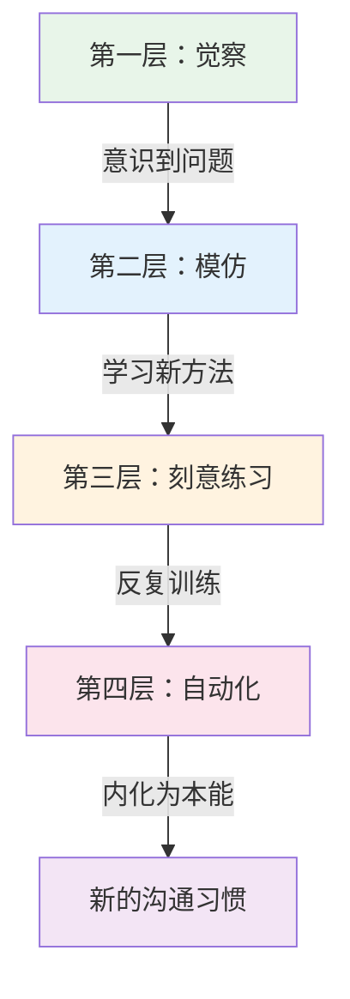
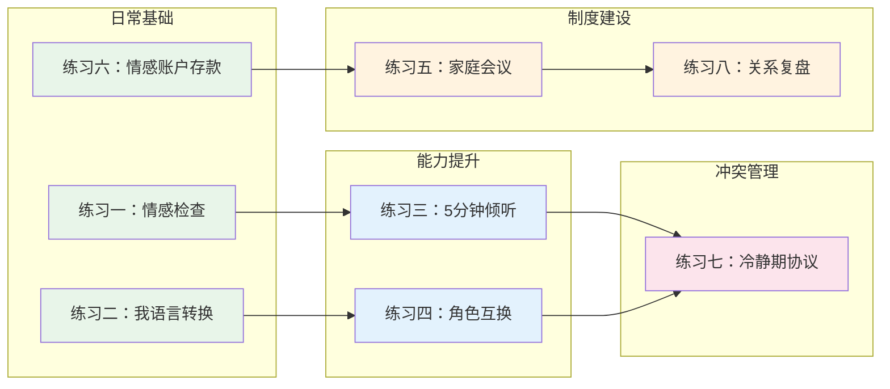

# 亲密关系沟通练习方法

> "我们不是因为幸福才感恩，而是因为感恩才幸福。沟通也是如此——不是关系好了才练习，而是练习了关系才会好。" ——改编自布琳·布朗

理论是地图，练习才是路。本章提供八套经过心理学研究验证的沟通练习，覆盖从日常习惯建立到深度冲突化解的完整链路。每套练习都包含理论原理、分层步骤、常见陷阱和纠偏方案，适用于不同关系阶段和沟通水平的伴侣。

## 为什么需要刻意练习

### 沟通是一种技能，不是天赋

很多人误以为"好的沟通是天生的"，或者"我们性格不合所以沟通不好"。神经科学的研究告诉我们，沟通能力像肌肉一样可以通过训练增强。

**神经可塑性基础：** 伦敦大学学院的研究发现，出租车司机经过训练后，海马体（负责空间记忆的脑区）体积显著增大。同理，当我们反复练习新的沟通模式时，大脑中负责共情、情绪调节和语言表达的神经回路会被强化，旧的"攻击-防御"模式会逐渐弱化。

**习惯养成的科学：** 伦敦大学学院的菲利帕·拉利（Phillippa Lally）在2009年的研究中发现，养成一个新习惯平均需要66天，而非流行的"21天"说法。这个数字因人而异，范围在18天到254天之间。关键不在于天数，而在于**一致性**——每天做比偶尔做效果好得多。

**戈特曼的研究数据：** 约翰·戈特曼（John Gottman）对3000多对夫妻进行了长达40年的追踪研究，发现幸福夫妻与不幸夫妻的区别不在于"是否吵架"，而在于日常互动中正面与负面互动的比例。幸福夫妻的比例约为5:1（5次正面互动对应1次负面互动），而最终离婚的夫妻比例低于1:1。

### 练习的四个层次

- **觉察层：** 你意识到自己的沟通模式有问题（"我刚才又在指责了"）
- **模仿层：** 你学习新的沟通方式并尝试使用（"让我换成'我'语句"）
- **刻意练习层：** 你有计划、有反馈地反复训练新技能
- **自动化层：** 新的沟通方式成为你的默认反应，不需要刻意控制

本章的八套练习覆盖从第二层到第四层的完整路径。

### 练习体系全景图

建议按照图中的依赖关系逐步引入练习。日常基础类练习是地基，能力提升类是框架，制度建设和冲突管理是上层建筑。

---

## 练习一：每日情感检查练习

**定位：** 所有其他练习的基石。这个练习建立日常沟通的"最小可行习惯"，让你和伴侣每天至少有一次高质量的情感连接。

**科学依据：** 加州大学洛杉矶分校的婚姻研究发现，幸福夫妻每天至少有20分钟的"减压对话"（stress-reducing conversation），即不涉及关系本身的日常交流。戈特曼称之为"转向"（turning towards）——当伴侣发出情感连接的信号时，你选择回应而非忽略。长期来看，那些"转向"率高于86%的夫妻，关系满意度显著更高。

### 基础版（入门级）

**适用人群：** 刚开始改善沟通的夫妻，或者沟通频率已经很低的伴侣。

**时间：** 每天10-15分钟，建议固定在晚饭后或睡前。

**步骤：**

**第一步：设定仪式感（1分钟）**

- 关掉电视、放下手机，面对面坐下
- 可以点一杯茶或咖啡，营造温馨氛围
- 明确告诉对方："接下来15分钟，我全心全意属于你"
- **为什么需要仪式感：** 仪式感帮助大脑从"日常模式"切换到"连接模式"。哈佛商学院的研究表明，简单的启动仪式（如一起点燃蜡烛）能显著提升关系满意度

**第二步：情感温度测量（3分钟）**

- 每人用1-10分评估今天的情感状态
- 简单描述："今天我的情感温度是6分，因为工作上遇到了一些压力"
- 不需要展开讨论，只是让对方了解你的状态
- **评分参考：** 1-3分（很糟糕，需要支持）、4-6分（一般，有起伏）、7-10分（很好，值得庆祝）

**第三步：三件好事分享（6分钟）**

- 每人分享今天发生的三件好事或值得感恩的事
- 可以很小："今天午饭的面条特别好吃""同事夸了我的新发型"
- 伴侣的回应规则：只倾听和认可，不评判不建议
- **回应模板：** "听起来真的很棒！""我能感受到你很开心。""谢谢你告诉我这些。"
- **为什么是三件：** 马丁·塞利格曼（积极心理学之父）的"三件好事"练习经过大规模随机对照实验验证，连续做一周就能显著提升幸福感，效果持续六个月以上

**第四步：一个需求表达（4分钟）**

- 每人表达一个当下的需求
- 用"我"语句："我希望今晚能早点休息""我需要你帮我揉揉肩膀"
- 对方简单回应"好的"或提出替代方案
- **需求类型参考：** 情感需求（需要倾听、需要安慰）、实际需求（需要帮忙做家务、需要空间）、社交需求（需要陪伴、需要独处时间）

### 进阶版（熟练级）

在基础版稳定运行一个月后，可以加入以下元素：

**新增步骤：情感追溯（3分钟）**

- 当情感温度偏低时，尝试追溯原因
- 不是分析对方的问题，而是探索自己的内在："我今天情绪低落，可能是因为上午的会议上被领导批评了，让我觉得自己不够好"
- 伴侣只需倾听，不急于解决问题

**新增步骤：主动关怀（2分钟）**

- 基于对方的分享，主动提出一个关怀行动
- "你今天压力这么大，要不要我帮你泡个澡？""你提到那个同事让你不舒服，想聊聊吗？"
- **关键：** 关怀要具体，不要笼统的"你没事吧"

### 高手版（精通级）

**新增元素：情感地图更新**

- 每周花10分钟更新对伴侣的"情感地图"——你知道对方最近在担心什么、期待什么、害怕什么吗？
- 戈特曼的研究发现，对伴侣内心世界了解越深的夫妻，关系越稳固
- **自测问题：**
  - 对方最近工作上最大的压力来源是什么？
  - 对方这周最开心的一个瞬间是什么？
  - 对方最近有没有什么隐忧没有说出来？
  - 对方目前最想实现的一个小目标是什么？

### 常见陷阱与纠偏

| 陷阱 | 表现 | 纠偏方案 |
|------|------|----------|
| 流于形式 | 每天机械地完成步骤，没有真实情感投入 | 偶尔换场景（散步时做、咖啡馆做），打破惯性 |
| 变成汇报工作 | "今天开了三个会，签了一个合同" | 引导关注感受而非事件："开会时你感觉怎么样？" |
| 一方不配合 | 对方觉得"太矫情""没必要" | 从缩短时间开始（5分钟），先做"三件好事"一个步骤 |
| 变成抱怨时间 | 每天都在说负面的事 | 严格执行"三件好事"规则，负面内容放到"一个需求"环节 |
| 中断后难以恢复 | 停了几天就彻底放弃了 | 设定"最低可行版本"：忙的时候只做"情感温度测量"30秒 |

---

## 练习二："我"语言转换练习

**定位：** 改善表达方式的核心练习。这个练习直接作用于沟通中最常见的问题——指责性语言。

**科学依据：** 心理学家哈维尔·亨德里克斯（Harville Hendrix）的"意象关系疗法"（Imago Relationship Therapy）指出，"你"语句激活对方的杏仁核（大脑的威胁检测中心），触发"战斗或逃跑"反应，此时对方的理性思考能力下降约60%。而"我"语句绕过杏仁核，直接作用于前额叶皮层（负责理性思考），使对方更可能以建设性方式回应。

### 第一步：理解转换原理

"我"语句的核心结构是四要素公式：

当[客观事实]发生时 → 我感到[情绪词] → 因为[深层需求] → 我希望[具体请求]

**四要素详解：**

- **客观事实（不加评判地描述发生的事）：** "当你连续三天加班到10点"（而非"你总是不回家"）
- **情绪词（精准命名情绪）：** 使用情绪词汇表，而非笼统的"不开心""不舒服"
- **深层需求（解释情绪背后的需要）：** "因为我需要和你共度时光来感受到我们的连接"
- **具体请求（可执行的行动）：** "我希望这周你能有两天在8点前回家"（而非"你能不能早点回来"）

**情绪词汇表（按强度排列）：**

| 强度 | 负面情绪 | 正面情绪 |
|------|----------|----------|
| 轻微 | 不安、困惑、犹豫、尴尬 | 平静、舒适、安心、放松 |
| 中等 | 失望、沮丧、焦虑、委屈 | 开心、满足、感激、温暖 |
| 强烈 | 愤怒、绝望、恐惧、心碎 | 狂喜、感动、幸福、被爱 |

**使用建议：** 尽量使用中等强度的情绪词。轻微的词显得不够真实，强烈的词容易引发对方防御。

### 第二步：对照转换练习

| "你"语句（避免） | "我"语句（使用） | 转换要点 |
|---|---|---|
| "你总是不听我说话" | "当我说话时没有得到回应，我感到被忽视，因为我需要被倾听" | 去掉"总是"等绝对化词汇 |
| "你从来不关心我" | "我最近感到有些孤独，因为我需要更多的陪伴和关注" | 用"最近"替代"从来" |
| "你怎么又忘了" | "这件事对我很重要，我希望我们能一起找到记住它的方法" | 聚焦解决方案而非追责 |
| "你太自私了" | "我希望在做决定时能一起商量，因为我需要被尊重" | 将人格攻击转化为具体行为 |
| "你能不能别这样" | "当这种情况发生时，我感到不舒服，我希望我们能找到更好的方式" | 明确"这样"是什么 |
| "你看看别人家老公/老婆" | "我看到别人能做到的事，我有些羡慕，我希望我们也能" | 去掉比较，聚焦自己 |

### 第三步：分层练习计划

**入门阶段（第1-2周）：书面转换**

- 准备一个专门的"我语言练习本"
- 每天晚上回顾当天的对话，找出3句你用了"你"语句的地方
- 在本子上写出转换后的"我"语句
- 不要求在实际对话中使用，先建立书面转换的能力

**进阶阶段（第3-4周）：实时转换**

- 在实际对话中有意识地使用"我"语句
- 如果不小心用了"你"语句，立刻自我纠正："对不起，让我换个说法……"
- 每天记录成功转换的次数和失败的次数
- **容错机制：** 前两周的目标是每天成功3次就算达标，不要追求完美

**高手阶段（第5周起）：深度表达**

- 学会在激烈情绪下仍然使用"我"语句
- 练习表达深层脆弱情感："当你那样做的时候，我感到害怕，因为我害怕失去你"
- 邀请伴侣给你反馈："我今天的表达方式有让你感到被指责吗？"

### 案例详解

**案例一：家务纠纷**

- 原话："你每次回家就把袜子扔在地上，你能不能有点素质！"
- 分析：包含"每次"（绝对化）、"有素质"（人格攻击）、命令语气
- 转换："当我看到地上的袜子时，我感到有些沮丧，因为我很在意家里的整洁。你能帮我把袜子放到洗衣篮里吗？"
- 分析：客观描述事实、表达情绪、说明原因、提出具体可执行的请求

**案例二：社交分歧**

- 原话："你又跟你那些朋友出去了，你心里根本没有这个家！"
- 转换："这个月你已经和朋友出去了四次，我感到有些失落，因为我希望我们能有更多共处的时间。这周我们能安排一次约会吗？"
- 要点：用具体数据替代"又""总是"，将攻击转化为需求

**案例三：金钱冲突**

- 原话："你买这么贵的东西之前都不跟我商量，你太不尊重我了！"
- 转换："我看到这笔消费的时候有些惊讶，因为我希望大额支出我们能一起商量。以后超过500块的开销，我们能先讨论一下吗？"
- 要点：设定具体金额标准，让请求可执行

### 常见陷阱与纠偏

| 陷阱 | 表现 | 纠偏方案 |
|------|------|----------|
| 伪"我"语句 | "我觉得你就是不在乎我"（本质还是指责） | 检查句子中是否包含对对方的评判，如果有就重写 |
| 过度公式化 | 每句话都像在背模板，对方觉得假 | 先掌握框架，再逐渐内化为自然表达 |
| 忽略情绪真实性 | 说"我感到失望"但语气愤怒 | 先处理情绪再沟通，或者直接说"我现在很生气，但我试着用不伤害你的方式说" |
| 只改语言不改态度 | 话说得漂亮但表情和语气充满敌意 | "我"语句需要配合真诚的语气和开放的身体语言 |

---

## 练习三：倾听挑战——5分钟不打断

**定位：** 解决亲密关系中最普遍的倾听问题——对方还没说完你就急着回应、反驳、建议。

**科学依据：** 卡尔·罗杰斯（Carl Rogers）的"积极倾听"（Active Listening）研究表明，当一个人感到被真正倾听时，其大脑中的皮质醇（压力激素）水平下降，催产素（信任激素）水平上升。戈特曼的研究则发现，婚姻治疗中最有效的干预不是教夫妻如何说话，而是教他们如何倾听。

### 基础版规则

- 一方说5分钟，另一方只能听，不能打断、反驳、解释、建议
- 倾听者的任务：眼神接触、点头、用"嗯"表示在听
- 5分钟后，倾听者用自己的话复述听到的内容
- 说者确认"你理解对了"或补充纠正
- 然后角色互换

**复述公式（三级复述）：**

- **初级复述（事实层）：** "我听到你说的是……"
- **中级复述（感受层）：** "你的感受是……"
- **高级复述（需求层）：** "你的需要是……我理解得对吗？"

**示例：**

> 说者："这周工作特别忙，周三加班到12点，周四又被领导批评了，我觉得自己怎么努力都不够好……"
> 
> 初级复述："你这周三加班到很晚，周四又被批评了。"
> 中级复述："你感到很疲惫，也有些委屈和自我怀疑。"
> 高级复述："你需要有人认可你的努力，也希望有人关心你累不累。我理解得对吗？"

### 进阶版：情感镜像

在基础复述之上，加入"情感镜像"——不仅复述内容，还反映对方的情绪状态。

**技术要点：**

- 注意对方的语调、语速、表情和肢体语言
- 用你自己的话描述你感受到的对方的情绪："你说到这件事的时候，我看到你的眼眶红了，这件事对你的影响比你说出来的更深吧？"
- **不要替对方下结论，** 而是邀请对方确认："是这样吗？"

### 高手版：深层倾听

**目标：** 听到对方话语背后未说出口的需求和恐惧。

**技术要点：**

- **听"冰山下面"：** 对方说"你从来不帮忙做家务"，表面是抱怨家务，深层可能是"我不觉得自己被重视"
- **听反复出现的主题：** 如果对方多次提到某类事情，说明这是一个核心关切
- **听情绪的变化：** 当对方说到某个话题时突然加快语速、提高音量或变得沉默，这往往是敏感点

**练习方法：**

每次倾听练习结束后，在心里或纸上回答三个问题：

1. 对方今天最想表达的核心感受是什么？
2. 对方有哪些话是"绕着说"的，没有直接表达？
3. 对方最需要从我这里得到的回应是什么？

### 话题库

**轻松话题（适合入门）：**

- "最近让你最开心的事是什么？"
- "你觉得我们关系中最好的部分是什么？"
- "如果明天放假一天，你最想做什么？"
- "你小时候最快乐的记忆是什么？"

**中等话题（适合进阶）：**

- "有什么事你一直想跟我说但没找到机会？"
- "你最近有什么压力或担忧？"
- "你觉得我做什么事情的时候最让你感到被爱？"
- "我们关系中有什么是你希望改变的？"

**深度话题（适合高手）：**

- "你最大的恐惧是什么？"
- "你有没有觉得在我面前不能完全做自己？"
- "你觉得我们之间有什么未解决的问题？"
- "你对我们的未来有什么期待和担忧？"

### 常见陷阱与纠偏

| 陷阱 | 表现 | 纠偏方案 |
|------|------|----------|
| 忍不住打断 | "但是……""你说得不对……" | 物理辅助：嘴里含一颗糖，提醒自己保持沉默 |
| 假装在听 | 眼神游离、看手机、心不在焉 | 刻意练习眼神接触，每30秒点一次头 |
| 急于解决问题 | 对方还没说完你就开始给建议 | 记住：80%的情况下对方需要的是被理解，不是被指导 |
| 复述变成评判 | "你的意思是你就知道抱怨" | 严格使用"我听到""我感受到"开头，不加评判 |
| 话题太重导致崩溃 | 一上来就聊深层恐惧，情绪失控 | 从轻松话题开始，建立安全感后再逐步深入 |

---

## 练习四：角色互换练习

**定位：** 打破"只有我才是对的"的思维定式，通过换位思考建立相互理解。

**科学依据：** 心理学中的"归因偏差"（Attribution Bias）解释了为什么我们在关系中容易"严以律人、宽以律己"——我们倾向于将自己的行为归因于外部环境（"我发脾气是因为工作压力大"），而将对方的行为归因于性格（"他发脾气是因为他脾气差"）。角色互换练习直接对抗这种偏差。

### 基础版步骤

1. **选择一个近期的分歧**（不要太大的矛盾，从小事开始）
2. **各自写下自己的立场和理由**（5分钟，不要让对方看到）
3. **角色互换：** 你代表对方的立场，对方代表你的立场
4. **各自为"对方的立场"做3分钟辩护**
5. **讨论：** 互换角色后，你有什么新的理解？

**关键规则：**

- 辩护时要**全力以赴**，不能敷衍了事
- 不能说"虽然我不认同，但你的意思是……"——要真正站在对方角度
- 辩护结束后，先说"我理解你了"，再讨论解决方案

### 案例详解

**案例一：周末安排分歧**

- 分歧：丈夫想周末和朋友打球，妻子想一起逛街
- 丈夫为妻子辩护："你一个人带了一周的孩子，周末希望我能陪你，一起逛街是你的放松方式，也是我们难得的相处时间"
- 妻子为丈夫辩护："你工作压力大，打球是你释放压力的方式，也需要和朋友社交来保持心理健康"
- 结果：两人都感到被理解，协商出"周六上午打球，下午一起带孩子出去玩"的方案

**案例二：消费观念冲突**

- 分歧：一方想买一台8000元的咖啡机，另一方觉得太贵
- 想买的一方为对方辩护："你担心我们目前有房贷和孩子的教育费用，大额支出需要谨慎，你不是小气，而是对家庭财务负责"
- 反对的一方为对方辩护："你每天早上都去咖啡店买咖啡，一年下来花的可能比咖啡机还多，而且你享受在家做咖啡的过程，这是一种生活品质"
- 结果：先买一台3000元的中端机型，如果使用频率高再升级

### 进阶版：第三人称叙事

**方法：** 以第三人称重写你们的分歧故事，假装在讲述一对朋友的经历。

**示例：**

> "有一对夫妻，丈夫叫小明，妻子叫小红。小明工作压力很大，他喜欢周末打球来放松。小红一个人带孩子一周了，她希望周末能一家三口在一起。其实两个人的需求都很合理，只是他们没有站在对方的角度想过……"

**为什么有效：** 第三人称叙事创造了心理距离，降低了防御感。斯坦福大学的研究表明，用第三人称反思自己的情绪问题，比第一人称反思更能降低焦虑并提升问题解决能力。

### 常见陷阱与纠偏

| 陷阱 | 表现 | 纠偏方案 |
|------|------|----------|
| 敷衍辩护 | "好吧，你想逛街是因为你喜欢买东西" | 设定规则：辩护必须包含对方的情感需求，不仅仅是表面理由 |
| 辩护变成攻击 | "你就是觉得逛街比陪我重要" | 停下来，重新用正面语言表述 |
| 选的议题太重 | 一上来就讨论婆媳关系、生育计划 | 从"今晚吃什么""周末去哪里"这种小分歧开始 |
| 无法跳出自己的视角 | "我实在想不出对方有什么道理" | 先做练习三（倾听），充分了解对方的想法后再做角色互换 |

---

## 练习五：家庭会议实操指南

**定位：** 将沟通从"随机事件"升级为"制度化机制"，让沟通成为家庭文化的一部分。

**科学依据：** 组织行为学中的"定期回顾"（Regular Retrospective）机制被证明能持续改善团队效能。家庭作为最小的社会组织，同样受益于制度化的沟通。戈特曼的研究发现，拥有"共同决策机制"的夫妻，关系满意度比没有的高出43%。

### 会议基本框架

**频率：** 每周一次，固定时间（如周日晚饭后），30-60分钟。

**会前准备：**

- 每人在手机备忘录或专用笔记本上记录本周想讨论的议题
- 选择一个安静、不被打扰的环境
- 准备零食和饮品，营造轻松氛围

### 详细流程

**环节一：感恩开场（5分钟）**

- 每人说一件这周感谢对方的事
- 要具体："谢谢你周三加班回来还记得帮我买了我爱吃的草莓"
- 不要笼统："谢谢你为这个家付出"
- **为什么从感恩开始：** 戈特曼的研究表明，会议的前3分钟决定了整场会议的基调。以感恩开始，能将会议从"找问题"模式切换到"建设性"模式

**环节二：玫瑰与刺（10分钟）**

- 每人分享本周的一个"玫瑰"（美好的事）和一个"刺"（不愉快的事）
- "玫瑰"让双方记住关系中美好的部分
- "刺"提供一个安全的空间来表达不满，避免积累
- 听到对方的"刺"时，只倾听不辩解

**环节三：议题讨论（20-30分钟）**

- 每人提1-2个想讨论的议题
- 使用"发言权杖"规则：只有拿着"发言权杖"（可以是任何物品——遥控器、水杯、小玩偶）的人才能说话
- **讨论流程：**
  1. 提出者表达议题和自己的想法（3分钟）
  2. 对方复述确认："我听到你的意思是……对吗？"
  3. 对方表达自己的想法（3分钟）
  4. 一起头脑风暴解决方案
  5. 选定方案并明确分工和时间节点
- **"停车场"机制：** 如果某个议题情绪太激烈或需要更多信息，记录在"停车场"（一张纸上），约定另外的时间专门讨论

**环节四：计划与安排（10分钟）**

- 讨论下周的重要安排（工作、社交、家庭事务）
- 分配家务和责任（用清单明确，避免"我以为你会做"）
- 确认是否有需要提前准备的事

**环节五：爱的结尾（5分钟）**

- 每人说一句对下周的期待
- 一个拥抱、亲吻或击掌结束会议
- **不要省略这个环节：** 身体接触释放催产素，能让整场会议的体验以积极感受收尾

### 进阶元素

**月度深度会议：** 每月一次，将会议时间延长到90分钟，加入以下内容：

- 回顾本月的情感账户余额
- 讨论一个长期议题（如职业规划、育儿理念、财务目标）
- 更新"关系愿景"——我们希望这段关系是什么样的？

**会议记录：** 养成简单记录的习惯，不需要逐字记录，只需记下：

- 本周讨论的主要议题
- 达成的决定
- 待跟进的事项
- "停车场"中的议题

**为什么记录有效：** 记录让你们能看到沟通的进步轨迹。当你回头看三个月前的记录，会发现很多当时觉得很大的问题已经解决了，这会增强你们对关系的信心。

### 常见陷阱与纠偏

| 陷阱 | 表现 | 纠偏方案 |
|------|------|----------|
| 变成批斗会 | 会议变成互相指责的时间 | 严格执行"感恩开场"和"玫瑰与刺"的正面框架 |
| 流于形式 | 只是走过场，没有真实讨论 | 会前要求每人至少准备一个真实议题 |
| 一方主导 | 一个人说个不停，另一个人沉默 | 用"发言权杖"严格控制发言时间 |
| 议题太多 | 一次会议讨论十个问题，疲惫不堪 | 限制每人最多2个议题，其余放入"停车场" |
| 执行力不足 | 会议决定的事情下周没人做 | 明确分工和时间节点，下次会议第一步就是"回顾上周执行情况" |

---

## 练习六：情感账户存款练习

**定位：** 日常关系维护的核心工具。大多数关系不是毁于一次大冲突，而是毁于长期的忽视和消耗。

**科学依据：** 戈特曼的"情感银行账户"（Emotional Bank Account）理论是他最核心的研究发现之一。他通过对3000多对夫妻的长期追踪发现：

- 幸福夫妻的正面/负面互动比约为5:1
- 离婚夫妻的比例低于1:1
- 最能预测关系稳定性的不是"冲突解决能力"，而是"日常正面互动的频率"
- 关系中69%的冲突是"永久性问题"（不会被解决的），幸福夫妻和不幸夫妻面对这些问题的比例相同——区别在于他们用幽默、接纳和亲密来"管理"这些问题

### 存款行为详解

| 存款类型 | 具体做法 | 科学原理 |
|----------|----------|----------|
| 言语赞美 | "你今天穿这件衣服真好看""你做的这道菜真的太好吃了" | 赞美激活大脑的奖励回路，释放多巴胺 |
| 身体接触 | 出门前的拥抱（至少6秒）、牵手散步、轻拍肩膀 | 6秒以上的拥抱释放催产素，降低皮质醇 |
| 关注细节 | 记住对方提过的小事并跟进（"你上次说想看那部电影，我买了票"） | 表达"我在意你说的话"，增强被重视感 |
| 主动服务 | 帮对方倒杯水、做顿饭、把对方的手机充上电 | 行动比语言更有说服力 |
| 高质量陪伴 | 一起散步、看电影、聊天——期间不看手机 | "在场感"（Presence）是亲密关系的核心要素 |
| 小惊喜 | 买对方爱吃的水果、留一张便签、发一条关心的短信 | 不确定性的奖励比固定的奖励更能激活大脑的期待系统 |
| 表达感恩 | "谢谢你为这个家付出的一切""有你在我很安心" | 感恩是关系满意度最强的预测因子之一 |
| 尊重支持 | 支持对方的兴趣爱好和决定，即使你不完全理解 | 自主感是人类三大基本心理需求之一 |

### 取款行为识别

了解哪些行为是"取款"同样重要：

| 取款行为 | 典型表现 | 存款替代 |
|----------|----------|----------|
| 批评 | "你怎么总是……" | 用"我"语句表达具体需求 |
| 蔑视 | 翻白眼、嘲讽、冷笑 | 培养感恩心态，关注对方的优点 |
| 防御 | "这不是我的错""你才是……" | 接受部分责任："你说得对，我确实可以做得更好" |
| 石墙 | 沉默、回避、冷暴力 | 使用冷静期协议，承诺恢复对话 |
| 忽视 | 不回应对方的连接信号 | 练习"转向"：当对方发出信号时，至少给一个回应 |
| 控制 | "你必须……""不许……" | 用请求替代命令，尊重对方的自主权 |

### 实践系统

**每日最低存款目标：3件**

- 不需要都是大事，小而频繁比大而稀少更有效
- 早安吻（身体接触）+ 一句赞美（言语肯定）+ 晚上一起散步15分钟（高质量陪伴）= 一天达标

**记录与追踪：**

- 使用手机备忘录或专用小本子
- 每天晚上记录今天的存款行为
- 每周回顾：本周存了多少？取了多少？
- **注意：** 记录的目的是培养意识，不是记账。如果记录让你感到压力，可以改为每周记录3件最大的存款

**月度评估：**

- 每月和伴侣一起评估：我们的"情感账户"余额如何？
- 评分标准：1-3分（透支状态，需要紧急修复）、4-6分（基本平衡，还有提升空间）、7-10分（健康状态，继续保持）
- 如果评分低于4分，需要立即增加存款频率，必要时寻求专业帮助

### 常见陷阱与纠偏

| 陷阱 | 表现 | 纠偏方案 |
|------|------|----------|
| 存款变成任务 | "我今天还没做存款，赶紧说句好话" | 存款必须发自内心，否则对方感受得到，适得其反 |
| 忽略取款行为 | 一边存款一边频繁取款，净余额为负 | 同时关注减少取款行为，特别是蔑视和防御 |
| 存款类型单一 | 只会说"我爱你"，从不行动 | 多样化存款类型，关注对方的主要"爱的语言" |
| 对方感受不到 | 你觉得自己在存款，对方无感 | 了解对方最看重的爱的语言（言语、服务、礼物、时间、身体接触） |

---

## 练习七：冷静期协议制定

**定位：** 冲突管理的安全网。不是为了避免冲突，而是为了在冲突发生时保护关系不被破坏。

**科学依据：** 约翰·戈特曼将婚姻中的四种最具破坏性的行为称为"末日四骑士"：批评（Criticism）、蔑视（Contempt）、防御（Defensiveness）和石墙（Stonewalling）。其中石墙（完全关闭沟通）和蔑视是最强的离婚预测因子。冷静期协议的核心目的是：用"计划性暂停"替代"反应性石墙"——前者是主动的情绪管理，后者是被动的逃避。

**生理基础：** 当人处于激烈情绪中时，身体会释放大量的肾上腺素和皮质醇。这些激素的消退至少需要20分钟。在这20分钟内，人的理性思考能力处于低谷，说出伤人话语的概率比平时高出数倍。冷静期就是给身体一个恢复平衡的时间。

### 协议制定步骤

**前提：在平静时期共同制定，绝不是在吵架时。**

**第一步：约定冷静信号**

- 双方约定一个手势或词语表示"我需要暂停"
- 推荐用语："我需要暂停一下""黄色信号""我先冷静一下"
- **避免用：** "我不想说了""随便你""你爱怎样怎样"——这些是拒绝沟通，不是冷静
- 可以配合手势：双手举起做"T"字形（体育比赛中的暂停手势），动作本身也有助于打断情绪升级的惯性

**第二步：明确冷静时长**

- 最少20分钟（情绪激素恢复的最短时间）
- 最长不超过24小时（超过24小时会让对方感到被冷暴力）
- 建议时长：30分钟到2小时
- **怎么判断自己准备好了：** 当你能用平静的语气描述对方的立场时，说明你已经恢复理性了

**第三步：制定冷静期间行为规范**

**允许做的：**

- 去另一个房间独处
- 出门散步（但要告知去哪里）
- 听音乐、看书、做运动
- 写日记梳理自己的情绪
- 做深呼吸或冥想

**不允许做的：**

- 摔门、砸东西（身体暴力会升级为关系暴力）
- 离家出走且不告知行踪（制造焦虑和不安全感）
- 拉黑对方电话或社交媒体（切断沟通渠道）
- 喝酒或使用其他物质（削弱判断力）
- 向第三方抱怨对方（扩大冲突范围）
- 冷战超过约定时长（变相惩罚）

**第四步：制定恢复沟通的信号**

- 冷静结束后主动说："我现在准备好了，我们可以继续"
- 恢复对话时的第一个动作：承认对方的感受（"我理解你刚才很生气"）
- 不要假装什么都没发生，也不要翻旧账重新开战

**第五步：明确责任归属**

- 谁先提出冷静，谁负责在冷静期结束后主动恢复对话
- 这个规则的目的：避免双方都等对方先开口，导致冷战无限期延长

### 协议模板

                 我们的冷静期协议

签署日期：___________

1. 我们的冷静信号是：___________
   （词语/手势）

2. 冷静时长：最少___分钟，最长不超过___小时

3. 冷静期间，我们同意：
   □ 不摔门、不砸东西
   □ 不离家出走（散步需告知去向）
   □ 不拉黑联系方式
   □ 不饮酒
   □ 不向第三方抱怨对方
   □ 不在社交媒体发泄

4. 恢复信号：___________

5. 责任规则：提出冷静的一方负责主动恢复

6. 如果冷静期到期后仍无法平静，我们同意：
   □ 延长冷静时间并通知对方
   □ 寻求第三方帮助（朋友/家人/咨询师）

签名：___________    签名：___________

### 进阶：情绪分级应对

| 情绪等级 | 表现 | 应对策略 |
|----------|------|----------|
| 绿色（平静） | 正常对话，偶有小分歧 | 常规沟通即可 |
| 黄色（升温） | 语速加快、音量提高、开始重复自己的观点 | 暂停60秒，做3次深呼吸，然后继续 |
| 橙色（激烈） | 开始出现人身攻击、翻旧账 | 使用冷静信号，暂停20-30分钟 |
| 红色（失控） | 摔东西、大吼大叫、想说最伤人的话 | 立即暂停，至少冷静1小时，冷静期间做身体活动消耗肾上腺素 |

### 常见陷阱与纠偏

| 陷阱 | 表现 | 纠偏方案 |
|------|------|----------|
| 冷静期变成冷战 | "我不想跟你说了"然后消失三天 | 严格执行24小时上限，到期必须恢复 |
| 一方总是发起冷静 | 每次吵架对方就喊暂停，你感到被拒绝 | 讨论：冷静信号不意味着"我不在乎"，而是"我在乎到不想说出伤害你的话" |
| 恢复后旧账重提 | "好了我冷静了，但是我还是要说你上次……" | 恢复对话只讨论当下的分歧，旧账另外安排时间谈 |
| 协议形同虚设 | 制定了协议但吵架时完全忘了 | 把协议贴在冰箱上或设为手机壁纸，需要时能看到 |

---

## 练习八：定期关系复盘

**定位：** 高层视角的关系管理。前面七个练习关注"怎么做"，这个练习关注"做得怎么样"和"接下来做什么"。

**科学依据：** 组织管理中的"事后回顾"（After Action Review, AAR）被美军和众多顶级企业用于持续改进。关系复盘采用同样的逻辑：定期停下来看看我们走到了哪里，方向对不对，需要调整什么。

### 月度复盘模板

**时间：** 每月一次，选一个双方都放松的时间（如月初的周末下午），30-45分钟。

**准备：** 翻阅本月的沟通练习记录（如果有）、家庭会议记录、情感账户记录。

**环节一：回顾本月（10分钟）**

回答以下问题，每人轮流：

- 本月我们关系中最美好的三个时刻是什么？
- 本月我们遇到的最大挑战是什么？
- 本月我的情感需求被满足的程度如何？（1-10分）
- 如果用一个词形容本月的关系，你会用什么词？

**环节二：评估沟通（10分钟）**

- 本月我们的沟通质量如何？（1-10分）
- 本月我们有没有使用过冷静期协议？效果如何？
- 有没有什么话题是我们回避了的？为什么回避？
- 有没有什么误会到现在还没有澄清？
- 我们的"我"语句使用率有提高吗？

**环节三：练习回顾（10分钟）**

- 本月我们做了哪些沟通练习？
- 哪个练习对我们帮助最大？为什么？
- 哪个练习我们没有坚持？原因是什么？
- 下月我们想尝试或加强哪个练习？

**环节四：展望下月（10分钟）**

- 下月我想对我们的关系做什么"存款"？
- 有没有什么一直想讨论但没机会的话题？
- 下月我们想一起做的一件事是什么？
- 下月有没有什么可能影响关系的外部因素（如出差、考试、节假日）？

**环节五：感恩与承诺（5分钟）**

- 每人说三件感谢对方的事
- 每人做一个下月的关系承诺
- 一个拥抱结束复盘

### 季度深度复盘

每三个月做一次更深入的复盘，时间延长到60-90分钟，加入以下内容：

**关系健康评估表：**

| 维度 | 评分（1-10） | 具体表现 |
|------|-------------|----------|
| 情感亲密 | | 我们是否经常分享内心感受？ |
| 性生活满意度 | | 双方是否都满意？ |
| 共同活动质量 | | 我们是否有一起享受的活动？ |
| 冲突处理能力 | | 我们能否建设性地解决分歧？ |
| 个人空间尊重 | | 双方是否有足够的个人时间和空间？ |
| 共同目标感 | | 我们是否对未来有共同的愿景？ |
| 外部压力应对 | | 面对外部压力时我们是否团结？ |
| 信任与安全感 | | 双方是否都感到安全和被信任？ |

**使用方法：** 各自独立打分，然后对比讨论。评分差距超过3分的维度是需要重点关注的领域。

### 年度关系回顾

每年做一次全面的关系回顾，可以安排在纪念日或新年期间：

- 回顾这一年的关系变化轨迹
- 重新审视共同的目标和愿景
- 讨论明年的关系重点
- 庆祝你们一起走过的路

### 常见陷阱与纠偏

| 陷阱 | 表现 | 纠偏方案 |
|------|------|----------|
| 复盘变成吵架 | 一回顾就想起对方的不好 | 严格执行"感恩-评估-展望"的正向框架 |
| 只有一个人重视 | 你觉得复盘很重要，对方觉得没必要 | 从简化版开始：只做"感恩与承诺"5分钟，让对方体验到价值 |
| 评分太主观 | "我觉得沟通质量有8分"但对方觉得只有3分 | 分数差异本身就是讨论的起点，不要争论"谁的分对" |
| 流于表面 | 每次都说"挺好的""没什么问题" | 准备具体的问题清单，引导深入讨论 |

---

## 练习进阶路径

### 不同关系阶段的优先级

| 关系阶段 | 优先练习 | 原因 |
|----------|----------|------|
| 新婚/新关系（<2年） | 练习一、二、六 | 建立沟通基础习惯，积累情感资本 |
| 稳定期（2-7年） | 练习三、四、五、八 | 防止惯性忽视，建立制度化沟通 |
| 危机期（任何阶段） | 练习七、三、二 | 先建立安全网，再重建沟通 |
| 修复期（冲突后） | 练习一、六、三 | 重建信任和连接，从最简单的开始 |
| 深化期（关系良好） | 练习四、八 | 进一步提升理解深度和关系质量 |

### 个性化调整建议

**内向者与外向者的搭配：**

- 内向者可能觉得"每日情感检查"消耗太大 → 缩短到5分钟，或改为书面形式
- 外向者可能觉得5分钟不打断太难受 → 从3分钟开始，逐渐延长
- 尊重双方的舒适区，但也要温和地推动成长

**高冲突型关系的特殊建议：**

- 先只做练习一（情感检查）和练习七（冷静期协议），其他练习暂缓
- 情感检查中只做"三件好事"，不做"需求表达"（避免引发新冲突）
- 稳定2-4周后再逐步引入其他练习

**异地恋的适配：**

- 情感检查可以通过视频通话完成
- 情感账户存款可以通过外卖、礼物、长消息来实现
- 家庭会议可以改为"视频约会"，保持固定的通话时间

### 练习效果自测

每月做一次以下自测，评估练习效果：

**沟通频率：** 我们每天有意义的对话时长是多少？
- <5分钟（需要大幅改善）
- 5-15分钟（基础水平）
- 15-30分钟（良好水平）
- >30分钟（优秀水平）

**冲突处理：** 最近一次分歧，我们用了多长时间恢复？
- 超过24小时（需要加强练习七）
- 几小时到一天（正常范围）
- 30分钟到几小时（良好水平）
- 当场解决（优秀水平）

**情感连接：** 我感到被伴侣理解的程度如何？
- 1-3分（严重缺乏连接）
- 4-6分（有一定连接但不深）
- 7-8分（较好的连接）
- 9-10分（深度连接）

---

## 小结：从练习到习惯的路线图

以上八套练习构成了亲密关系沟通的完整训练体系。不需要全部同时开始，按照以下节奏逐步引入：

**第一个月：建立基础**

- 第一周：从"每日情感检查"（练习一）开始，每天10分钟
- 第二周：加入""我"语言转换练习"（练习二）的书面练习
- 第三周：启动"情感账户存款"（练习六），每天3件存款
- 第四周：巩固以上三个练习，使之成为日常习惯

**第二个月：提升能力**

- 第五周：引入"5分钟倾听挑战"（练习三），每周2次
- 第六周：开始"角色互换练习"（练习四），每周1次
- 第七周：制定"冷静期协议"（练习七），签署并张贴
- 第八周：巩固所有练习

**第三个月：制度化**

- 第九周：启动"家庭会议"（练习五），每周一次
- 第十周：做第一次"关系复盘"（练习八）
- 第十一周起：根据复盘结果调整练习重点
- 第十二周：做第一次季度深度复盘

**关键提醒：**

- **改变不在于一次做得多好，而在于能否持续做下去。** 每天进步一点点，日积月累，你的亲密关系沟通质量将发生质的飞跃。
- **如果在练习过程中遇到困难或阻力，不要气馁。** 改变沟通模式就像学习一门新语言，需要时间和耐心。
- **当练习遇到瓶颈时，考虑以下资源：**
  - 伴侣共同阅读亲密关系相关书籍（推荐：戈特曼的《爱的博弈》、查普曼的《爱的五种语言》、约翰逊的《拥抱我》）
  - 参加伴侣沟通工作坊
  - 寻求专业婚姻/伴侣咨询师的帮助——这不是软弱的表现，而是对关系负责的态度。研究表明，平均来说，夫妻在关系出现问题后6年才寻求帮助——越早介入，效果越好
- **庆祝每一个小进步。** 当你第一次在激烈争吵中成功使用冷静协议，当伴侣第一次说"你今天的表达让我感到被理解"——这些都是值得庆祝的里程碑
