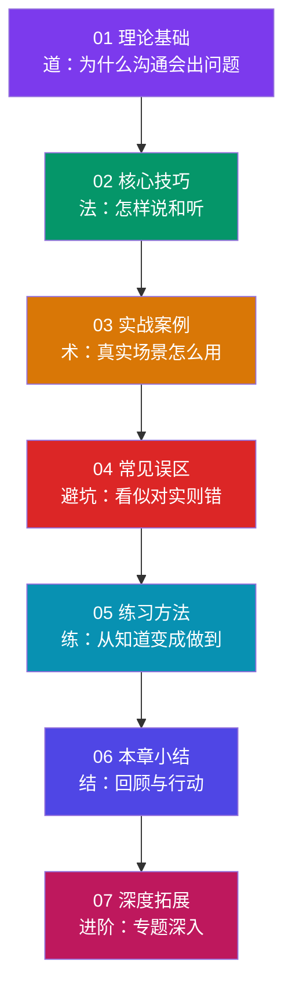
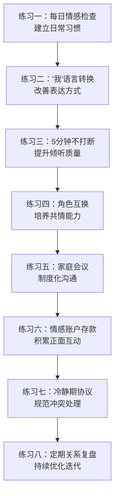

# 本章小结

亲密关系沟通是人类所有社交沟通中最深刻、最复杂，也最容易出错的一种。我们对亲密之人的期待远高于任何其他人——期待被完全理解、被无条件接纳、被持续关注——而这些期待本身就构成了巨大的沟通压力。本章从理论基础、核心技巧、实战案例、常见误区、练习方法到深度拓展，系统构建了亲密关系沟通的完整知识体系。本小结不是简单的要点罗列，而是将全章精华重新编织成一张可操作的认知地图——帮助你巩固所学、找到行动方向、并为长期成长提供参照。

***

## 全章知识架构回顾

本章遵循"道→法→术→器→练→结"的逻辑层层递进。下图展示了各部分之间的依赖关系——理论基础是地基，核心技巧是框架，实战案例是样板间，常见误区是施工禁区，练习方法是施工手册，本章小结是验收报告，深度拓展是精装升级方案。

### 各部分内容量与定位速览

| 部分 | 核心内容 | 关键词 | 适合谁重点读 |
|------|---------|--------|------------|
| 理论基础 | 7大理论框架（依恋理论、戈特曼研究、家庭系统理论、EFT、NVC、代际传递、家庭生命周期） | 为什么 | 想从根本上理解问题的读者 |
| 核心技巧 | 6大关系场景的沟通方法（夫妻、亲子、婆媳、恋爱、家庭会议、代际） | 怎么做 | 需要具体方法的读者 |
| 实战案例 | 错误示范→分析→正确示范 三段式案例 | 怎么用 | 面临具体场景困境的读者 |
| 常见误区 | 10大沟通陷阱及纠正方法 | 别踩坑 | 自认为"没问题"的读者 |
| 练习方法 | 8套可操作练习（从单人到家庭） | 怎么练 | 想把知识变成习惯的读者 |
| 深度拓展 | 四骑士深度解析、EFT三阶段、权力动态、跨文化关系、数字时代挑战 | 深入 | 进阶读者和专业人士 |

***

## 核心原则深度总结

### 原则一：尊重是基石——亲密不意味着控制

尊重伴侣作为独立个体的思想、感受、选择和边界，是亲密关系沟通的地基。这里的"尊重"不是客套，而是一种深层信念：**对方是一个完整的、有权做出与你不同选择的人。**

很多人混淆了"亲密"与"控制"的边界。"我管你是因为爱你"这句话背后，往往是一种将伴侣视为自己延伸的隐含假设。家庭系统理论告诉我们，健康的关系需要"自我分化"——在保持情感联结的同时，保有独立的自我。分化程度越高的人，越能在亲密与独立之间找到平衡，越不容易在冲突中失去理性。

**实践检验标准：** 当伴侣做出你不同意的决定时，你的第一反应是"你怎么能这样"还是"我不同意但我尊重你的选择"？前者是控制，后者是尊重。

### 原则二：倾听比表达更重要——接收比发送更难

真正的倾听不是等待对方说完然后反驳，而是带着理解对方的意愿去接收信息。约翰·戈特曼的研究表明，善于倾听的伴侣，其关系满意度比不善于倾听的伴侣高出40%以上。

倾听之所以困难，是因为我们的大脑在听到与自己观点不同的内容时，会自动进入"准备反驳"模式。神经科学研究发现，当人感到被攻击时，杏仁核会被激活，触发"战斗或逃跑"反应——此时前额叶皮层（负责理性思考）的功能被抑制。这就是为什么在争吵中，你越想"好好说"，越说不出有建设性的话。

**深层倾听的三个层次：**

| 层次 | 表现 | 效果 |
|------|------|------|
| 表层倾听 | 听到字面意思，准备自己的回应 | 对方感到"你在听但没听进去" |
| 情感倾听 | 听到话语背后的情绪和需求 | 对方感到"你理解我的感受" |
| 共鸣倾听 | 感同身受，与对方的情感产生共振 | 对方感到"你真的懂我" |

大多数关系中的问题出在只停留在第一层。练习方法部分的"5分钟不打断"练习，就是专门训练从第一层向第二、三层跃迁的方法。

### 原则三：沟通是技能，不是天赋——所有人都可以学会

"有些人天生会说话"——这个信念本身就是最大的学习障碍。Gottman的研究团队发现，经过12小时的夫妻沟通工作坊训练，参与者的关系满意度平均提升了30%以上，且效果持续至少4年。改变不仅是可能的，而且是相对快速的。

学习沟通遵循"意识→尝试→反复→坚持→内化"的螺旋上升路径。每一次"反复"都不是失败——行为改变研究表明，反复是大脑巩固新模式过程中的正常波动。给自己至少3个月的时间来评估变化。

### 原则四：冲突是关系的催化剂——关键在于如何处理

健康的冲突是关系成长的催化剂。戈特曼的研究发现，69%的夫妻冲突是"永恒的问题"——源于两人性格、价值观和生活方式的根本差异，永远无法彻底解决。幸福夫妻与不幸夫妻的区别不在于有没有冲突，而在于能否与这些永恒的问题和平共处。

适当的冲突比表面的和平更有价值。一项追踪研究发现，那些"从不吵架"的夫妻，离婚率反而高于偶尔有建设性争吵的夫妻——因为前者往往在回避问题，而非解决问题。

### 原则五：非语言沟通传递93%的情感信息

心理学家阿尔伯特·梅拉比安的研究表明，在情感性沟通中，语言内容仅占7%，语调占38%，肢体语言占55%。这意味着你在争吵中"说了什么"远不如"怎么说的"重要。

戈特曼的研究进一步证实了这一点：他发现可以通过观察夫妻互动最初3分钟的非语言信号（面部表情、语调、身体姿态），以超过90%的准确率预测他们是否会离婚。翻白眼（蔑视的典型非语言信号）是离婚的最强单一预测因子。

***

## 全章关键知识点提炼

### 一、理论基础——七大框架的核心洞见

**1. 依恋理论：你的沟通模式在童年就已写好**

鲍尔比的依恋理论揭示了四种成人依恋类型如何塑造亲密关系中的沟通模式：

| 依恋类型 | 核心信念 | 沟通特征 | 在冲突中的典型表现 |
|---------|---------|---------|------------------|
| 安全型 | "我值得被爱，他人是可靠的" | 直接表达需求，能容忍分歧 | 就事论事，不灾难化 |
| 焦虑型 | "我不够好，他人可能离开我" | 反复确认、过度解读、情绪化 | 追逐对方、翻旧账、升级冲突 |
| 回避型 | "依赖他人是危险的" | 压抑需求、情感隔离、独立 | 石墙、回避、冷战 |
| 恐惧型 | "我想亲近但害怕受伤" | 忽冷忽热、矛盾行为 | 反复无常、自我破坏 |

理解依恋类型不是为了贴标签，而是为了理解伴侣"不可理喻"行为背后的深层恐惧和需求。安全型依恋并非天生不可改变——通过稳定的亲密关系体验和有意识的自我觉察，不安全依恋可以逐渐向安全型"赚得"（earned security）。

**2. 戈特曼研究：用数据预测婚姻走向**

戈特曼的"爱情实验室"四十年研究贡献了亲密关系领域最具实证基础的发现：

- **末日四骑士**：批评、蔑视、防御、石墙——四种破坏性沟通模式同时出现时，离婚预测准确率高达93%
- **5:1法则**：幸福夫妻的积极互动与消极互动比例至少为5:1
- **情感投标**：日常微小的情感连接请求（"你看这个好有趣"），回应率是关系健康度的核心指标
- **永恒的问题**：69%的夫妻冲突是无法彻底解决的，关键在于如何讨论

**3. 情绪聚焦疗法（EFT）：破解"追逃模式"的路线图**

苏·约翰逊创立的EFT揭示了亲密关系中最常见的负性互动循环：焦虑型伴侣追逐（通过批评和要求寻求回应）→ 回避型伴侣退缩（通过沉默和回避保护自己）→ 焦虑型更加追逐 → 回避型更加退缩。EFT的三阶段九步骤提供了从识别循环、到打破循环、到建立新循环的系统方法，70-75%的夫妻在完成治疗后从困境中恢复。

**4. 非暴力沟通（NVC）：一个改变说话方式的四步公式**

马歇尔·卢森堡的NVC将沟通简化为四个步骤：**观察**（不带评判地描述事实）→ **感受**（识别和表达自己的情绪）→ **需要**（说出感受背后的深层需求）→ **请求**（提出具体、可执行的请求）。这四个步骤看似简单，但在情绪激动时极其难用——这就是为什么需要在平静时反复练习，直到形成肌肉记忆。

**5. 家庭系统理论与代际传递：问题不只在你们两人之间**

家庭系统理论提醒我们：任何一对夫妻的冲突，都不是孤立事件，而是整个家庭系统运作的产物。三角关系（将第三方卷入两人冲突）、自我分化（在保持联结的同时保有自我）、代际传递（沟通模式的"遗传"）——这些概念帮助我们看到，你从原生家庭"继承"了什么沟通模式，以及如何有意识地打断不良循环。

**6. 家庭生命周期：不同阶段有不同的沟通重点**

从新婚到养育幼儿、从青春期子女到空巢期、从退休到丧偶——每个家庭生命周期阶段都有特定的沟通任务和挑战。预判当前阶段最容易出现的问题，才能提前做好准备。

### 二、核心技巧——六大场景的方法要点

**1. 夫妻沟通：从日常联结到深度冲突**

夫妻沟通的核心不是"学会吵架"，而是建立日常情感联结的习惯。戈特曼发现，幸福夫妻的秘诀不在于冲突解决能力强，而在于日常互动中大量的正面情感积累。关键技巧包括：

- **情感投标的回应**：当伴侣发出连接请求（分享趣事、寻求关注），积极回应而非忽略
- **"我"语句替代"你"语句**："我感到被忽视"而非"你从来不关心我"
- **结构化暂停**：冲突中情绪升温时，约定暂停至少20分钟（情绪激素恢复的最短时间），之后必须恢复对话
- **修复尝试**：在冲突升级前主动发出降温信号（幽默、触碰、道歉、承认对方的观点）

**2. 亲子沟通：按年龄分层的策略**

亲子沟通的关键认知是：不同年龄段的孩子需要完全不同的沟通方式。0-3岁重在安全感建立和情感镜映；3-6岁重在规则设定与情感引导的平衡；6-12岁重在培养自主性和责任感；12-18岁重在尊重独立性与保持连接的平衡；成年子女则需要从"管教"转向"顾问"角色。

**3. 婆媳沟通：最中国式的沟通挑战**

婆媳冲突的本质往往不是"两个女人的战争"，而是两个家庭系统的碰撞——不同的生活习惯、育儿理念、消费观念、权力边界。核心策略是：丈夫/儿子必须承担"桥梁"角色而非"裁判"角色；建立清晰的边界但用尊重的方式表达；将"育儿分歧"从"对错之争"转化为"数据之争"（用科学研究代替个人观点）。

**4. 恋爱沟通：从暧昧到长期关系的演变**

恋爱不同阶段的沟通重点截然不同：暧昧期重在信息交换和吸引力建设；热恋期重在深度自我表露和价值观探索；稳定期重在冲突处理能力和日常维护；长期关系重在持续创新和抵御倦怠。

**5. 家庭会议：让沟通制度化**

将沟通从"出了问题才谈"转变为"定期坐下来谈"，是家庭沟通从应急模式升级为常态模式的关键。每周30-60分钟、固定时间、固定流程（感恩→议题→计划→表达），使用"发言权杖"规则确保每个人的声音都被听到。

**6. 代际沟通：跨越观念鸿沟**

与父母和祖辈沟通时，核心挑战是价值观差异。策略是：理解而不认同（"我理解你那个年代的想法，但现在情况不同了"），用事实和数据代替情感争论，找到共同关切点（"我们都希望孩子好"），在非原则问题上保持弹性。

### 三、实战案例——三个核心场景的复盘

**场景一：从"末日四骑士"到情感联结**

一对结婚5年的夫妻因家务和育儿问题频繁争吵。典型的错误模式：妻子用批评开头（"你总是不干家务"），丈夫用防御回应（"我做了那么多你看不到吗"），妻子升级为蔑视（"你连这点事都做不好"），丈夫采取石墙（沉默离开）。转变的关键是：识别四骑士模式→用"我"语句替代批评→学会修复尝试→建立每日情感检查习惯。

**场景二：婆媳育儿冲突**

三代同堂家庭中，婆婆坚持传统育儿方式，媳妇信奉科学育儿。冲突的本质不是"谁对谁错"，而是两个时代的育儿智慧在碰撞。解决方案不是一方说服另一方，而是建立"核心区-弹性区-无关区"的分类讨论机制——涉及安全和健康的核心问题用科学数据说话，在不影响孩子发展的问题上保持弹性，在纯粹偏好的问题上互相尊重。

**场景三：青春期亲子冲突**

14岁女儿开始反抗父母管教，成绩下滑，沉迷手机。父母的本能反应是加强控制——没收手机、限制自由——但这只会激发更强的反抗。有效策略是：从"管控"转向"好奇"（"你最近在看什么有意思的内容？"），建立"底线+自由"的双轨制，在非原则问题上给予选择权，在原则问题上保持坚定但用尊重的方式表达。

### 四、十大常见误区——必须避开的陷阱

本章识别了亲密关系沟通中最常见的十大误区，可归纳为三类：

**语言层面的陷阱：**

| 误区 | 为什么有害 | 正确做法 |
|------|----------|---------|
| 绝对化语言（"你总是""你从来不"） | 让对方感到被全盘否定，触发防御 | 用具体事件替代泛化："这次你忘了，我感到失望" |
| 翻旧账 | 让当前问题无法聚焦，让对方感到永远无法弥补 | 就事论事，每次只讨论一个问题 |
| "为你好"的控制 | 以爱之名剥夺对方的自主权 | 表达关心但尊重选择："我担心……但决定权在你" |

**认知层面的陷阱：**

| 误区 | 为什么有害 | 正确做法 |
|------|----------|---------|
| "你应该知道"的读心期待 | 设定不可能的标准，注定失望 | 清楚地表达自己的需求，不让对方猜 |
| "不吵架=好沟通" | 回避冲突不等于解决冲突，问题只会积累 | 允许建设性冲突存在，学会安全地表达分歧 |
| "性格不合=无法沟通" | 将可习得的技能问题归因为不可改变的性格问题 | 认识到沟通是技能，所有性格组合都可以学会有效沟通 |

**行为层面的陷阱：**

| 误区 | 为什么有害 | 正确做法 |
|------|----------|---------|
| 冷暴力（沉默惩罚） | 比吵架更具破坏性——让对方感到被遗弃和情感孤立 | 用"冷静期协议"替代：暂停≠冷战，有时间限制，有恢复承诺 |
| 将孩子卷入夫妻冲突 | 让孩子承受不属于TA的情感压力，破坏孩子的安全感 | 夫妻问题夫妻解决，绝不在孩子面前升级冲突 |
| 在公开场合批评伴侣 | 伤害对方自尊，破坏信任 | 有不满私下说，公开场合维护对方形象 |
| "我什么都说了"≠沟通到位 | 可能只是单方面输出，没有确认对方是否接收和理解 | 沟通=表达+确认+反馈的完整闭环 |

### 五、练习方法——八套练习的核心逻辑

本章提供的八套练习不是孤立的训练项目，而是一个层层递进的能力培养体系：

**启动建议：** 不要试图同时开始所有练习。第一周只做"每日情感检查"（每天15分钟），坚持21天形成习惯后，再加入下一个练习。行为改变的敌人不是"不会做"，而是"一次做太多然后放弃"。

**八套练习的适用场景速查：**

| 练习 | 频率 | 参与者 | 解决的核心问题 |
|------|------|--------|--------------|
| 每日情感检查 | 每天15分钟 | 双人 | 防止小问题积累，保持日常联结 |
| "我"语言转换 | 每天至少3次 | 单人 | 减少指责性语言，降低对方防御 |
| 5分钟不打断 | 每周2次 | 双人 | 培养深度倾听，让对方感到被听见 |
| 角色互换 | 按需 | 双人 | 打破"只有我才是对的"的思维定式 |
| 家庭会议 | 每周30-60分钟 | 全家 | 让沟通制度化、常态化 |
| 情感账户存款 | 每天至少3次 | 单人 | 有意识增加正面互动，维持5:1比例 |
| 冷静期协议 | 一次性制定 | 双人 | 为冲突中的情绪降温建立规范 |
| 定期关系复盘 | 每月一次 | 双人 | 及时发现和调整关系问题 |

***

## 核心数据回顾

本章引用的关键研究数据，值得反复记住：

| 数据 | 含义 | 来源 |
|------|------|------|
| 93.6% | 基于沟通模式预测离婚的准确率 | John Gottman，华盛顿大学，40年纵向研究 |
| ≥5:1 | 幸福夫妻的积极/消极互动比 | Gottman Love Lab |
| 69% | 夫妻冲突中"永恒问题"的比例——无法彻底解决，只能学会共处 | Gottman研究 |
| 70-75% | 完成EFT治疗后从困境中恢复的夫妻比例 | EFT临床研究汇总（30+项研究） |
| 30%+ | 经过12小时沟通训练后关系满意度的平均提升 | Gottman工作坊追踪数据 |
| 4倍 | 丈夫不愿接受妻子影响时，离婚概率增加的倍数 | Gottman纵向研究 |
| 65-70% | 因"沟通不畅"导致婚姻咨询的占比 | AAMFT |
| 93% | 蔑视是唯一能单枪匹马预测离婚的变量 | Gottman研究 |

***

## 六、中国语境下的特殊要点

本章所有内容都考虑了中国社会的独特背景。以下是需要特别强调的本土化要点：

**代际嵌套结构下的沟通。** 中国家庭常常是三代甚至四代同堂。婆媳关系、翁婿关系、隔代教养冲突——这些在西方文化中较少出现的关系维度，在中国家庭中是日常。沟通技能不仅用于夫妻之间，更需要扩展到整个家庭网络。

**含蓄文化中的表达挑战。** 中国传统文化推崇"含蓄""内敛"，"我爱你"三个字在很多家庭中一辈子都说不出口。但这不意味着不需要表达——只是表达方式可以从语言转化为行动：做一顿对方爱吃的饭、记住对方提过的小事、在对方疲惫时默默承担家务。关键是让对方感受到"你在乎"。

**育儿焦虑的传导效应。** "不能让孩子输在起跑线上"——这句话背后的焦虑渗透到夫妻关系和亲子关系的每一个角落。教育观念的分歧已经成为中国家庭冲突的首要来源之一。处理这类冲突的关键是：区分"核心底线"和"个人偏好"，在核心底线上达成共识，在个人偏好上保持弹性。

**面子文化中的冲突处理。** 中国人在冲突中比西方人更注重"面子"——避免在公开场合让对方下不来台。这不是虚伪，而是对关系的保护。掌握"给台阶"的艺术：在冲突中不把话说死，不把对方逼到墙角，给对方留出体面退让的空间。

***

## 行动清单：从阅读到改变的路线图

将本章所学转化为行动，建议按以下阶段推进。每个阶段的行动项都标注了对应的练习方法编号，方便你快速定位具体操作步骤。

### 第一阶段：启动期（本周开始）

这四项行动不需要伴侣配合，你可以独自开始：

- [ ] **识别自己的沟通模式。** 回顾最近一次冲突，用"末日四骑士"框架分析：你是否使用了批评、蔑视、防御或石墙？记录下来。（对应练习：情绪日志，单人可做）
- [ ] **识别自己的依恋类型。** 回想你在关系中感到不安全时的典型反应——是追逐确认还是回避退缩？理解自己的依恋模式是改变的第一步。（对应理论：依恋理论）
- [ ] **开始"我"语言转换练习。** 每天至少3次，将想说的"你"语句在心里转换为"我"语句。先从心里练习，不急于在实际对话中使用。（对应练习二）
- [ ] **启动每日情感检查。** 邀请伴侣一起，每天花15分钟（建议晚饭后或睡前）进行情感温度测量、三件好事分享和一个需求表达。（对应练习一）

### 第二阶段：建立期（本月完成）

这四项行动需要伴侣的参与和配合：

- [ ] **和伴侣一起阅读本章核心内容。** 不需要全部读完，重点是理论基础中的依恋类型和戈特曼5:1法则。共同阅读本身就是一次高质量的沟通。
- [ ] **建立每周家庭会议制度。** 固定时间（如周日晚饭后），30-60分钟，按照感恩→议题→计划→表达的流程进行。（对应练习五）
- [ ] **制定冷静期协议。** 在平静时期（不是吵架时）共同约定：冷静信号、冷静时长（最少20分钟，最长24小时）、冷静期间行为规范、恢复沟通的信号和责任归属。（对应练习七）
- [ ] **完成至少4次"5分钟不打断"倾听练习。** 每周2次，一方说5分钟，另一方只能听——不打断、不反驳、不建议。5分钟后用自己的话复述。（对应练习三）

### 第三阶段：深化期（持续3个月）

当基础练习成为习惯后，引入更高阶的练习：

- [ ] **启动情感账户存款计划。** 每天至少做3件"存款"行为（赞美、身体接触、关注细节、主动服务、高质量陪伴），记录并每周回顾。（对应练习六）
- [ ] **尝试角色互换练习。** 选择一个近期的小分歧，各自为对方的立场辩护3分钟。（对应练习四）
- [ ] **每月进行一次关系复盘。** 回顾本月最美好的三个时刻、最大挑战、沟通质量评分、下月期望。（对应练习八）
- [ ] **建立"修复尝试"的习惯。** 在冲突升级前主动发出降温信号——可以是一个手势、一句"我们能重新说吗"、或者直接说"我觉得我们跑题了"。

### 第四阶段：内化期（长期坚持）

当以上练习都成为自然习惯后，进入持续优化阶段：

- [ ] 保持每日情感检查习惯——这是所有其他练习的"锚点"
- [ ] 每月关系复盘——持续追踪关系健康度
- [ ] 情感账户存款——维持至少5:1的积极/消极互动比
- [ ] 每季度评估沟通改善情况——对照本章的自评表，看看分数是否有变化
- [ ] 当遇到困难时，不要犹豫寻求专业婚姻咨询师的帮助——这不是软弱，而是对关系负责

***

## 延伸阅读推荐

### 经典必读（建议全部阅读）

| 书名 | 作者 | 核心价值 | 阅读建议 |
|------|------|---------|---------|
| 《亲密关系》 | 罗兰·米勒 | 系统介绍亲密关系的心理学研究，是本章理论基础部分的扩展阅读 | 适合作为第一本读物，建立完整认知框架 |
| 《幸福的婚姻》 | 约翰·戈特曼 | 基于40年研究，揭示幸福婚姻的7个法则，含大量实操练习 | 本章戈特曼理论的详细展开，必读 |
| 《非暴力沟通》 | 马歇尔·卢森堡 | 沟通技巧的基石之作，NVC四步法的完整阐述 | 本章核心技巧部分的底层方法论 |
| 《爱的五种语言》 | 盖瑞·查普曼 | 帮助你了解自己和伴侣的"爱的语言"，理解为什么"我明明对你好你却不领情" | 薄而实用，2-3小时可读完 |
| 《关系的重建》 | 约翰·戈特曼 | 深入探讨信任、背叛与关系修复——当关系已经受损时怎么办 | 当关系出现裂痕时优先阅读 |

### 进阶阅读（按兴趣选择）

| 书名 | 作者 | 核心价值 | 适合谁读 |
|------|------|---------|---------|
| 《依恋与亲密关系》 | 阿米尔·莱文 | 从依恋理论角度理解亲密关系，帮助识别和改变不安全依恋模式 | 想深入了解依恋理论的读者 |
| 《关键对话》 | 科里·帕特森等 | 高风险对话的处理技巧——当谈话的赌注很高、情绪很激烈时怎么办 | 需要处理高难度对话的读者 |
| 《感受爱》 | 珍妮·西格尔 | 理解情感连接的本质——为什么物质丰裕的时代我们反而更孤独 | 感到"说不清哪里不对"的读者 |
| 《情商》 | 丹尼尔·戈尔曼 | 情感智力的全面解读——自我觉察、自我管理、社交觉察、关系管理 | 想系统提升情感能力的读者 |
| 《男人来自火星，女人来自金星》 | 约翰·格雷 | 理解两性沟通差异的经典之作——男女在表达需求和处理压力时的根本差异 | 感到"男女思维方式完全不同"的读者 |
| 《重新对话》 | 雪莉·特克尔 | 数字时代如何重建真实的对话和连接——手机正在如何侵蚀我们的关系 | 感到被手机和社交媒体干扰关系的读者 |

### 免费资源

- **约翰·戈特曼研究所**（www.gottman.com）：大量免费的夫妻沟通工具和评估量表，以及戈特曼博士的博客文章
- **中国心理学会婚姻家庭专业委员会**：可查询本地专业婚姻咨询师信息
- **TED演讲：约翰·戈特曼"幸福婚姻的秘密"**：15分钟了解核心研究成果，适合快速入门
- **非暴力沟通中心**（www.cnvc.org）：NVC的官方资源，含练习指南和工作坊信息

***

## 一个认知转变工具：从"谁对谁错"到"什么有效"

在结束本章之前，提供一个可以立即使用的认知转变工具。它不是一个具体的沟通技巧，而是一个改变你看待冲突方式的元认知框架。

当你发现自己在争吵中不断想"我是对的，你是错的"时，停下来问自己三个问题：

**问题一：** "我想要的是'证明我是对的'还是'解决这个问题'？"
——如果答案是前者，你正在打一场没有赢家的仗。

**问题二：** "如果我是对的，但对方因此更加疏远我，我赢了吗？"
——在亲密关系中，赢了道理输了感情，是最大的输。

**问题三：** "有没有一种方式，既表达了我的立场，又维护了我们的联结？"
——几乎总是有的。那就是NVC的路径：表达感受和需求，而非评判对方。

这三个问题的核心不是让你放弃立场，而是提醒你：**在亲密关系中，沟通的目的不是说服对方接受你的观点，而是让两颗心在理解中靠近。**

***

## 结语

亲密关系的沟通是一场终身修行。它不需要完美，需要的是真诚；不需要天赋，需要的是练习；不需要一蹴而就，需要的是耐心。

每一次你说出"我感到……"而非"你总是……"，每一次你放下手机专注倾听，每一次你在冲突中选择冷静而非冷战——这些微小的改变，都在为你的关系存入一笔宝贵的情感财富。戈特曼的研究告诉我们，这些存款的回报是巨大的：只要保持5:1的积极/消极互动比，关系就能健康运转。

不要等到关系出了问题才想起沟通的重要性。最好的维修是预防——在关系还好的时候就开始练习，在问题还小的时候就解决它。

最后，如果你在实践过程中遇到困难，请记住两件事：第一，进步是非线性的，允许自己反复，关键是反复后的恢复速度越来越快；第二，寻求专业帮助不是软弱的表现——当你的身体生病时你会去看医生，当你的关系生病时，寻求婚姻咨询师的帮助同样是理性和负责任的选择。

愿你在亲密关系中，既能勇敢地表达自己，也能温柔地倾听对方。因为最好的沟通，从来不是赢得辩论，而是赢得理解。
