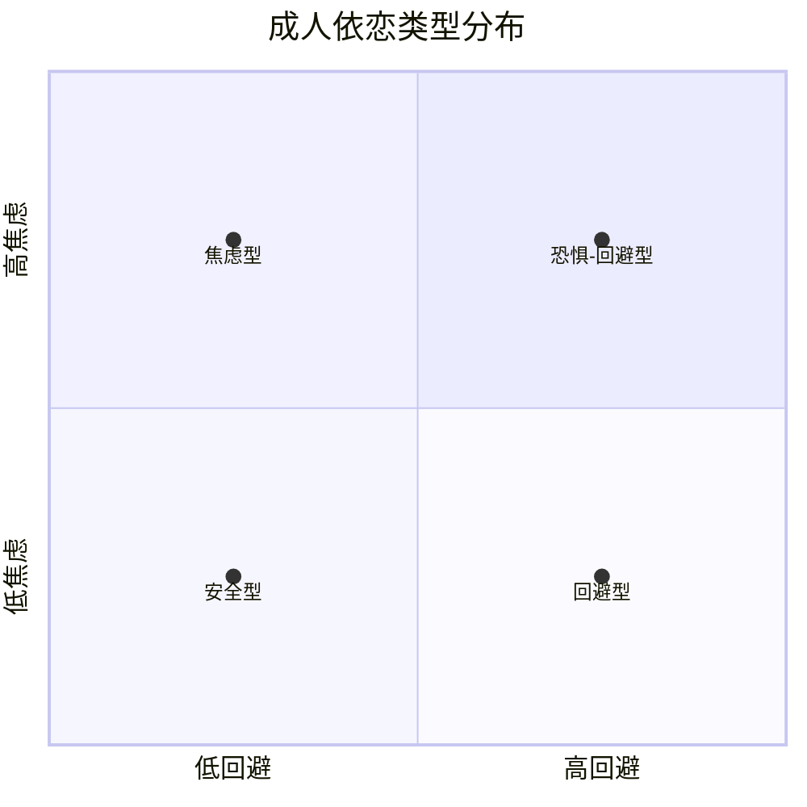
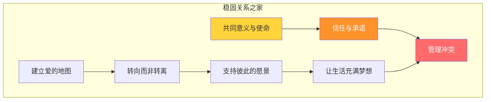
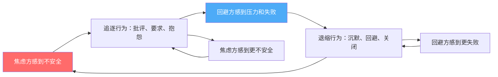

# 第十七章 亲密关系沟通 · 深度拓展

亲密关系是人类经验中最深刻、最复杂的沟通场域。与职场沟通或社交沟通不同，亲密关系中的沟通直接触及我们的依恋系统、自我认同和情感核心。本章将从依恋理论出发，系统解构亲密关系沟通的理论基础、破坏性模式、修复机制和当代挑战，提供从"知道"到"做到"的完整路径。

## 一、依恋理论：亲密关系的心理基石

### 1.1 Bowlby的依恋系统

约翰·鲍尔比（John Bowlby）在1950年代提出的依恋理论，是理解亲密关系沟通最重要的理论框架。鲍尔比认为，人类天生具有寻求和维持与重要他人（attachment figure）亲近的倾向，这种倾向具有进化意义——在远古环境中，与照料者保持亲近是生存的基本保障。

依恋系统一旦激活，会产生一系列可预测的认知和行为模式：

| 依恋需求 | 触发情境 | 行为表现 | 沟通特征 |
|:---------|:---------|:---------|:---------|
| 寻求亲近 | 感到威胁、压力、分离 | 接近依恋对象、寻求身体接触 | 直接表达需求或暗示需要陪伴 |
| 抗议分离 | 依恋对象不可获得 | 哭泣、愤怒、追逐行为 | 批评、质问、情绪化表达 |
| 探索安全基地 | 依恋对象稳定在场 | 自主探索外部世界 | 分享经历、寻求认可 |
| 安全港湾 | 遇到困难或恐惧 | 返回依恋对象身边 | 寻求安慰、坦诚脆弱 |

### 1.2 成人依恋的四种类型

玛丽·安斯沃斯（Mary Ainsworth）的"陌生情境"实验最初用于研究婴儿依恋，后来被Hazan和Shaver（1987）扩展到成人亲密关系领域。成人依恋类型沿两个核心维度展开：**焦虑维度**（对被抛弃的恐惧程度）和**回避维度**（对亲密的舒适程度）。



**安全型依恋（约55-60%人口）**：对亲密感到舒适，能够坦诚表达需求，信任伴侣的善意，在冲突中保持情绪稳定。沟通特征：直接而温和地表达感受，能够倾听而不防御，在分歧中寻求理解而非胜利。

**焦虑型依恋（约15-20%人口）**：高度敏感于关系中的威胁信号，害怕被抛弃，倾向于过度解读伴侣的行为。沟通特征：频繁寻求确认（"你还爱我吗？"），对未回复消息感到焦虑，在冲突中情绪升级快，倾向于"追逐"退缩的伴侣。

**回避型依恋（约20-25%人口）**：对过度亲密感到不适，重视独立和自主，在情感压力下倾向于退缩。沟通特征：避免讨论感受，在冲突中保持沉默或转移话题，倾向于问题解决而非情感共鸣，对伴侣的情感需求感到"窒息"。

**恐惧-回避型依恋（约5%人口）**：同时渴望和恐惧亲密，内心矛盾导致行为不可预测。沟通特征：在接近和退缩之间摇摆，在关系稳定时制造冲突，在冲突时又渴望和解。

### 1.3 依恋类型对沟通的深层影响

依恋类型不是固定的标签，而是可变的状态（malleable state）。研究表明，约30%的个体在成年生活中会改变依恋类型，通常是朝安全型方向移动。安全型伴侣的关系（"习得的安全感"）是促成这种转变的关键因素。

依恋类型通过三个机制影响沟通：

**注意偏向（attentional bias）**：焦虑型个体对关系威胁信号（如伴侣皱眉、语气变化）具有更高的注意敏感度，而对积极信号的敏感度相对较低。这导致他们更容易"听到"批评，即使伴侣的本意并非如此。

**解释偏向（interpretation bias）**：回避型个体倾向于将伴侣的情感需求解读为"控制"或"依赖"，而焦虑型个体倾向于将伴侣的独立行为解读为"不在乎"或"要离开"。这些自动化解释往往在意识觉察之前就已经形成。

**反应模式（response pattern）**：焦虑型个体在压力下倾向于升级情感表达（"追逐"），而回避型个体倾向于撤退（"逃跑"）。这两种反应会相互触发，形成"追逐-退缩"循环——亲密关系中最常见也最具破坏性的互动模式。

## 二、Gottman四骑士理论深度解析

### 2.1 理论背景与研究方法

约翰·戈特曼（John Gottman）博士被誉为"婚姻研究领域的爱因斯坦"。他在华盛顿大学建立的"爱情实验室"（Love Lab）进行了长达四十年的纵向研究，追踪了超过3000对夫妇的互动模式。戈特曼创新性地将生理指标监测（心率、皮肤电导、血压等）与行为编码系统相结合，能够在观察夫妻互动的最初几分钟内以超过90%的准确率预测他们是否会离婚。

"四骑士"理论是戈特曼最著名的发现之一。这四种破坏性沟通模式——批评（Criticism）、蔑视（Contempt）、防御（Defensiveness）和石墙（Stonewalling）——如同《启示录》中的四骑士，预示着亲密关系的终结。戈特曼的研究发现，当这四种模式同时出现时，离婚的预测准确率高达93%。

### 2.2 批评（Criticism）的深层机制

批评是四骑士中第一个出现的破坏性模式，其核心特征是将问题从具体行为上升到人格攻击。

| 类型 | 示例 | 本质区别 |
|:-----|:-----|:---------|
| 抱怨 | "你又忘了倒垃圾，我很困扰" | 针对具体行为，表达自身感受 |
| 批评 | "你总是这么不负责任，从来不考虑别人" | 攻击人格，贴标签，绝对化 |

批评背后往往隐藏着未被表达的深层需求和期望。戈特曼发现，习惯性批评者通常具有"未实现的梦想"（unmet dreams），他们在童年时期形成的某些核心需求在当前关系中未被满足。有效的干预需要帮助批评者识别并表达这些深层需求，而不是仅仅改变表面上的语言模式。

从依恋理论的视角来看，批评常常是焦虑型依恋者的抗议行为（protest behavior）。当他们感受到与伴侣的情感连接受到威胁时，会通过批评来试图获得关注和回应，尽管这种方式适得其反。

**从批评转向需求表达的实操框架：**

批评公式：你 + 总是/从来 + 人格标签
    ↓ 转化为 ↓
需求表达公式：当 [具体情境] 时，我感到 [情绪]，
    因为我需要 [深层需求]，
    我希望 [具体请求]。

示例：
批评："你总是只顾自己，从来不关心我的感受！"
    ↓
需求表达："这周你连续三天加班到很晚（情境），
    我感到孤单和被忽略（情绪），
    因为我需要感受到你在乎我们的相处时间（需求），
    你能不能这周抽一个晚上我们一起吃顿饭？（请求）"

### 2.3 蔑视（Contempt）的致命性

蔑视被戈特曼称为"婚姻的头号杀手"，是唯一能够单枪匹马预测离婚的变量。蔑视的本质是道德优越感的表达——翻白眼、嘲讽、冷笑话、辱骂——这些行为传达的核心信息是"我不尊重你，你不如我"。

蔑视的常见表现形式包括：

- **语言蔑视**：讽刺、挖苦、嘲讽性模仿、贬低性绰号
- **非语言蔑视**：翻白眼、冷笑、嗤之以鼻、转身背对
- **隐性蔑视**：在他人面前贬低伴侣、对伴侣的成就不以为然、用"开玩笑"包装侮辱

蔑视的神经生理影响尤为显著。长期处于蔑视氛围中的伴侣，其免疫系统功能会下降，感冒和感染的概率增加。戈特曼将这种现象称为关系压力的"生理渗透"（physiological flooding）。蔑视还会激活被攻击方的"战斗或逃跑"反应，导致皮质醇水平持续升高，长期可能引发焦虑和抑郁。

**消除蔑视的系统方法：**

第一步是建立"欣赏扫描"习惯——每天有意识地寻找伴侣值得欣赏的行为或品质，并即时表达。这不是盲目乐观，而是纠正注意力偏向——长期关系中的伴侣往往发展出"消极滤镜"，更容易注意到对方的缺点而非优点。

第二步是进行"欣赏练习"的具体操作：每晚花5分钟，各自写下当天伴侣让你感激的三件事，并在第二天与对方分享。戈特曼的研究发现，持续进行这一练习的伴侣，其关系满意度在六周内显著提升。

第三步是建立"蔑视觉察"机制——当发现自己产生蔑视念头时，按下暂停键，问自己："我现在是在表达优越感，还是在表达受伤的感觉？"蔑视的背后通常是长期积累的怨恨和失望，识别并直接表达这些底层情绪是消除蔑视的关键。

### 2.4 防御（Defensiveness）的自我保护陷阱

防御是对批评的典型回应，表现为推卸责任、反击对方或扮演受害者。

防御的三种常见模式：

- **反击型防御**："你也好不到哪里去！你上次还不是……"
- **否认型防御**："不是我的错，是你没提醒我！"
- **受害者型防御**："我做了这么多你还不满足，我真是里外不是人。"

防御的深层心理机制是自我保护。当个体感受到被攻击时，自我价值感受到威胁，防御反应成为保护自尊的本能策略。然而，防御的问题在于它拒绝了承担任何责任的可能性，使问题无法得到解决。

**打破防御循环的关键——接受影响（accepting influence）：**

戈特曼的研究发现，"接受影响"是男性关系技能中最关键的一项。具体而言，接受影响意味着在冲突中能够说出这样的句子：

- "你说得对，我确实在这件事上做得不够好。"
- "我理解你为什么会这样想，即使我的本意不是如此。"
- "我们各有一半道理，让我想想你的观点。"

即使在冲突中只有93%的问题是无法彻底解决的（"永恒的问题"），关键在于伴侣如何讨论这些问题。接受影响的核心是承认自己在问题中的角色，哪怕只是一小部分责任。

### 2.5 石墙（Stonewalling）与情绪淹没

石墙是指一方在冲突中完全退出互动——沉默、转头、离开房间或表现出完全的冷漠。石墙通常是情绪淹没（emotional flooding）的结果：当个体的生理唤醒水平超过阈值（心率超过100次/分钟），认知功能严重受损，个体无法进行有意义的对话，因此选择"关机"。

研究表明，男性比女性更容易采取石墙策略。戈特曼的生理学数据解释了这一性别差异：男性在冲突中的心率升高更快、恢复更慢，因此更容易达到情绪淹没的阈值。这与社会化过程中男性被鼓励抑制情绪表达有关——长期压抑情绪表达导致男性的情绪调节能力发展不足。

**应对石墙的结构化暂停协议：**

```mermaid
flowchart TD
    A[感到情绪即将淹没] --> B[发出暂停信号]
    B --> C["约定暂停时间（≥20分钟）"]
    C --> D[进行自我安抚活动]
    D --> E[承诺回到对话的具体时间]
    E --> F[按时回来继续对话]
    F --> G[用"我"语句重新开始]
    
    D --> D1[深呼吸：4-7-8呼吸法]
    D --> D2[散步或轻度运动]
    D --> D3[听舒缓音乐]
    D --> D4[写下自己的感受]
    
    style A fill:#ff6b6b,color:#fff
    style F fill:#51cf66,color:#fff
```

关键细节：暂停期间不要在心里反复"排练"反驳对方的台词——这会维持甚至加剧生理唤醒。正确的做法是专注于自我安抚，等心率恢复到正常水平后再思考如何回应。

### 2.6 Gottman关系之家模型

四骑士理论只是Gottman研究体系的一部分。他的"Sound Relationship House"（稳固关系之家）模型提供了更完整的亲密关系蓝图：



**地基——爱的地图（Love Maps）**：对伴侣内心世界的深入了解——他们的梦想、恐惧、压力源、童年经历、人生目标。戈特曼发现，许多关系危机的根源在于伴侣在日常琐事中逐渐失去了对彼此内心世界的关注。

**第一层——喜爱与赞美系统**：关系中积极互动的底色。这不是表面的恭维，而是对伴侣品格和努力的真诚欣赏。

**第二层——转向而非转离（Turning Towards vs. Turning Away）**：戈特曼发现，关系中的情感连接是通过无数次微小的"情感竞标"（bids for connection）建立的。当伴侣说"你看那朵云好美"，这是一个情感竞标——回应方可以选择"转向"（"确实很漂亮！"）、"转离"（无视）或"转反"（"别打扰我"）。幸福的伴侣在日常生活中"转向"彼此的比例约86%，而后来离婚的伴侣只有33%。

**第三层——积极视角**：当关系处于积极视角下时，伴侣倾向于对对方的行为做出善意的解释；而在消极视角下，同样的行为会被解读为恶意的。

**第四层——管理冲突**：包括前面讨论的四骑士识别与应对，以及冲突对话五步骤（详见第三部分）。

**顶层——共同意义**：伴侣共同创造的意义系统——共享的价值观、仪式、角色和目标。

## 三、EFT情绪聚焦疗法

### 3.1 EFT的理论基础

情绪聚焦疗法（Emotionally Focused Therapy，EFT）由苏·约翰逊（Sue Johnson）博士于1980年代创立，是目前实证支持最强的伴侣治疗方法之一。EFT融合了依恋理论、体验性治疗和系统理论，认为亲密关系问题的核心是依恋安全感受到威胁导致的情绪反应模式。

EFT的理论核心是"依恋之舞"（attachment dance）的概念。当伴侣的依恋需求未被满足时，会形成典型的互动循环——"追逐者-退缩者"（pursuer-withdrawer）模式。



约翰逊将这个循环称为"魔鬼式拥抱"（the demon dialogues）——双方都被困在痛苦的互动模式中，却不知道如何逃脱。追逐方的批评实际上是"请靠近我"的绝望呼喊，退缩方的沉默实际上是"请别伤害我"的自我保护。双方都在寻求安全，却用让对方感到更不安全的方式去追求。

### 3.2 EFT的三阶段九步骤

EFT的治疗过程分为三个阶段、九个步骤：

**第一阶段：去升级（De-escalation，步骤1-4）**

| 步骤 | 目标 | 具体操作 |
|:-----|:-----|:---------|
| 步骤1 | 识别核心冲突内容 | 厘清双方争论的表面议题和背后的情绪 |
| 步骤2 | 识别互动循环 | 揭示"追逐-退缩"循环的模式，让双方看到"循环才是敌人" |
| 步骤3 | 接触底层情绪 | 识别愤怒背后的恐惧、受伤、孤独等深层情绪 |
| 步骤4 | 重新框架问题 | 将问题从"你有问题"转化为"我们被困在了这个循环里" |

**第二阶段：互动位置的改变（Restructuring，步骤5-7）**

步骤5是EFT最关键的转折点——"撤退到依恋"（withdrawal to attachment）。退缩方被引导表达他们内心深处的恐惧和脆弱，而不是继续沉默。常见的底层情绪是："我害怕我永远不够好""我害怕无论我做什么都会让你失望""我害怕你会离开我"。

步骤6促进伴侣对另一方经验的接纳。当追逐方听到退缩方的脆弱表达时，他们通常会从愤怒转变为心疼和理解。这种情感共鸣是打破循环的关键时刻。

步骤7促进需求的直接表达和情感回应。退缩方学会说"当我感到压力时，我需要你靠近我而不是批评我"，追逐方学会回应"我听到了你的需要，我会在这里"。

**第三阶段：巩固（Consolidation，步骤8-9）**

步骤8在旧问题上应用新的互动模式——当旧的触发情境再次出现时，伴侣能够识别循环的启动信号，并选择新的回应方式。

步骤9巩固新的互动循环和关系叙事——伴侣共同重写他们的关系故事，从"我们总是吵架"转变为"我们曾经被困在循环里，但现在我们能够相互靠近"。

### 3.3 EFT的实证支持与局限

EFT拥有强大的实证研究支持。超过30项研究表明，70-75%的夫妻在完成EFT治疗后从困境中恢复，90%的夫妻报告有显著改善。这些效果在治疗结束两年后的跟踪研究中依然保持稳定。

神经影像学研究为EFT的有效性提供了神经科学证据。多伦多大学的研究发现，成功完成EFT治疗的伴侣在观看伴侣照片时，其大脑的依恋相关区域（如腹侧纹状体和眶额叶皮层）的激活模式发生了积极变化。这表明EFT不仅改变了行为模式，还重塑了大脑处理依恋信号的方式。

EFT的局限性：对于存在严重家庭暴力、持续外遇或一方已完全情感退出的关系，EFT的效果有限。此外，EFT需要伴侣双方都有意愿参与改变，单方努力通常难以奏效。

### 3.4 EFT自助应用

即使不接受专业治疗，伴侣也可以运用EFT的核心原则来改善关系。以下是一个简化的"EFT对话练习"：

**练习：发现底层情绪（15分钟）**

1. 回忆最近一次让你们争吵的具体事件
2. 各自静默写下：在那个时刻，除了愤怒之外，你还感受到了什么？（恐惧？受伤？孤独？羞耻？）
3. 轮流分享，倾听方的任务只是理解和确认，不做评判或反驳
4. 分享后，各自说出一个未被满足的依恋需求（"我需要感到被重视""我需要知道你不会离开我"）
5. 回应方用自己的话复述对方的需求，确认理解正确

## 四、亲密关系中的情感连接与修复

### 4.1 情感竞标（Bids for Connection）

戈特曼将伴侣之间的互动分解为无数微小的"情感竞标"——一个眼神、一句话、一个触碰、一声叹息。每个竞标都是一个人在说"请关注我""请和我连接"。

情感竞标的三种回应方式：

| 回应方式 | 行为示例 | 对关系的影响 |
|:---------|:---------|:-------------|
| 转向（Turning Towards） | 伴侣说"你看那只猫"，你抬头看了一眼并微笑 | 建立情感连接，存款 |
| 转离（Turning Away） | 伴侣说"你看那只猫"，你继续看手机没有回应 | 断开连接，无存款也无取款 |
| 转反（Turning Against） | 伴侣说"你看那只猫"，你说"我在忙，别烦我" | 制造伤害，取款 |

戈特曼的研究发现，区分幸福伴侣和不幸伴侣的不是争吵频率，而是日常生活中转向的比例。这是一个令人惊讶的发现——关系的质量不在于如何处理大冲突，而在于如何回应那些看似微不足道的小瞬间。

### 4.2 情感银行账户

戈特曼提出"情感银行账户"隐喻——每一次积极互动是存款，每一次消极互动是取款。稳固的关系需要至少5:1的积极与消极互动比例（5:1 ratio）。这意味着一次批评、嘲讽或冷漠需要至少五次温暖、理解和支持来平衡。

**日常存款清单：**

- 出门前和回家后的拥抱（至少6秒——催产素释放的最低阈值）
- 每天至少一次真诚的赞美或感谢
- 主动询问伴侣的一天，并认真倾听
- 在伴侣压力大时主动分担家务或提供支持
- 记住伴侣提到的小事并在后续跟进（"上次你说那个项目怎么样了？"）
- 身体接触：牵手、搭肩、轻触

**高频率取款行为：**

- 批评和指责（尤其是关于人格的攻击）
- 蔑视（翻白眼、嘲讽、冷笑）
- 防御（拒绝承认任何责任）
- 石墙（在冲突中完全关闭）
- 忽视伴侣的情感竞标
- 在他人面前贬低伴侣

### 4.3 冲突对话五步骤

戈特曼提出的"冲突对话软启动"（Softened Startup）是避免冲突升级的关键技术：

**步骤一：以"我"开头（I-Statement）**

❌ "你总是不做家务！"（你-攻击）
✅ "我这周做了很多家务，感到很疲惫。"（我-表达）

**步骤二：描述事实，不评判**

❌ "你又乱花钱！"（评判）
✅ "我注意到这周有三笔大额消费。"（事实）

**步骤三：表达感受，不指责**

❌ "你让我很生气！"（指责）
✅ "我感到焦虑和不安。"（感受）

**步骤四：说出需要**

❌ "你就不能省着点吗？"（命令）
✅ "我需要我们在大额消费前商量一下。"（需求）

**步骤五：提出具体请求**

❌ "你以后注意点！"（模糊）
✅ "超过500元的消费我们能不能先聊一聊？"（具体）

### 4.4 修复尝试——关系的免疫系统

戈特曼认为，区分稳定婚姻和破裂婚姻的最关键因素不是冲突的多少，而是"修复尝试"（repair attempts）的有效性。修复尝试是在冲突升级过程中任何试图缓和紧张局势的行为——一个玩笑、一声道歉、一个拥抱、一句"我们暂停一下"。

修复尝试失败的常见原因：
- 时机不对——在情绪最激动时尝试修复
- 方式不对——用讽刺的方式说"对不起"
- 底层信任已经破裂——对方不相信修复是真诚的
- 消极诠释——在消极视角下，即使善意的修复也会被曲解

**有效的修复尝试清单：**

- "我能重来一次吗？刚才那样说不好。"
- "我知道你在说的是……（复述对方观点），我理解。"
- "我觉得我们现在都太激动了，能暂停20分钟吗？"
- "你说得对，我在这件事上确实有问题。"
- 一个真诚的拥抱（不带语言）
- "我害怕我们会越吵越远，我想和你一起解决这个问题。"
- 使用幽默（确保不是讽刺性的幽默）

## 五、亲密关系中的权力动态

### 5.1 权力的多维度分析

亲密关系中的权力是一个复杂的多维度概念。社会心理学家将权力分为几种类型：

| 权力类型 | 定义 | 亲密关系中的表现 |
|:---------|:-----|:-----------------|
| 资源权力 | 控制物质和经济资源 | 谁挣钱多、谁管钱 |
| 信息权力 | 掌握关键信息 | 谁更了解家庭财务、孩子状况 |
| 专家权力 | 拥有特定知识或技能 | 一方擅长理财、另一方擅长家务 |
| 参照权力 | 通过个人魅力或吸引力影响 | 谁更被需要、谁更怕失去关系 |
| 合法权力 | 基于角色或传统赋予 | "男主外女主内"的传统观念 |

在现代亲密关系中，权力分配正在经历深刻变化。传统的基于性别的权力分工正在被更灵活、更平等的模式取代。然而，研究表明，即使在声称追求平等关系的伴侣中，权力不对称仍然普遍存在。

### 5.2 经济权力与关系满意度

经济权力是亲密关系中最敏感的权力维度之一。康奈尔大学的研究发现，当伴侣之间的收入差距过大时，高收入一方更容易采取控制行为，而低收入一方更容易经历"经济虐待"（economic abuse）——被限制使用共同财务资源、被迫汇报支出或被威胁经济孤立。

经济虐待的隐蔽形式：
- 给伴侣发"零花钱"而非共享账户
- 要求伴侣为每一笔支出提供详细说明
- 在经济决策中完全排除伴侣的意见
- 用"我挣的钱"来压制伴侣的发言权
- 威胁"如果你离开我，你一分钱也拿不到"

**建立健康经济沟通的框架：**

1. **透明原则**：双方对家庭财务状况有完整了解
2. **共同决策**：大额支出共同商量，小额支出各自自主
3. **独立底线**：即使一方不工作，也应有独立支配的资金
4. **尊重贡献**：家务劳动和育儿的经济价值被认可

### 5.3 决策模式与关系健康

戈特曼的研究发现，伴侣的决策模式是关系健康的重要预测指标。他区分了三种决策模式：

- **权力共享型**：双方平等参与决策，相互影响，这是关系健康的最佳指标
- **丈夫主导型**：丈夫在重大决策中拥有最终决定权，这在传统关系中较常见
- **妻子主导型**：妻子在重大决策中拥有最终决定权，这在现代关系中逐渐增加

戈特曼发现，能够"接受影响"（accepting influence）——即愿意考虑伴侣的观点并做出妥协——是男性关系技能中最关键的一项。研究显示，丈夫不愿意接受妻子影响的夫妻，其离婚概率是愿意接受影响的夫妻的四倍。

**接受影响的实操练习：**

在下一次意见分歧时，尝试以下步骤：
1. 先完整听完伴侣的观点（不打断）
2. 用"你的观点是……"复述一遍
3. 找出对方观点中你认同的部分，说出来
4. 提出你的不同看法，用"同时"而非"但是"连接
5. 共同寻找一个双方都能接受的方案

### 5.4 关系中的自主与亲密平衡

亲密关系中的一个核心张力是自主性（autonomy）与亲密性（intimacy）的平衡。过度追求亲密会导致"融合"（enmeshment）——个人边界消失，自我认同与关系认同混为一体；过度追求自主会导致"脱离"（disengagement）——情感连接断裂，关系变成两个独立个体的共处。

健康的关系需要同时满足两种需求：

- **归属需求**：感到被爱、被接纳、被重视
- **自主需求**：保持独立的自我认同、个人兴趣和社交圈

**平衡的实操建议：**

- 每周保留至少一个"独立时间"——各自做自己喜欢的事
- 支持伴侣的个人兴趣，即使你对此不感兴趣
- 在重要决策中表达自己的真实想法，即使与伴侣不同
- 避免"为了你我放弃了……"这类情感勒索
- 定期进行"关系健康检查"——各自评估自主和亲密的满足程度

## 六、亲密关系中的性沟通

### 6.1 性沟通的重要性

性是亲密关系中不可回避的重要维度。研究表明，性满意度与关系整体满意度之间存在强相关（相关系数约0.4-0.6），但这种关系是双向的——良好的关系质量提升性满意度，满意的性生活也增强关系质量。

性沟通是许多伴侣最难以启齿的话题。文化禁忌、羞耻感、害怕被拒绝或被评判，都使得伴侣回避性方面的坦诚对话。然而，回避性沟通会导致需求长期未被满足，最终可能引发关系危机。

### 6.2 性需求表达的框架

**打破僵局的三种方式：**

1. **书面沟通**：对于面对面谈性感到极度不适的伴侣，可以通过写信或发消息的方式开启对话
2. **"我想要"而非"你不"**：表达你想要什么，而非对方不做什么。"我喜欢你……的时候"比"你从来都不……"有效得多
3. **情境化表达**：在非性情境下谈论性需求（如散步时、晚餐时），减少压力感

**性需求沟通的四层模型：**

表层需求：具体的性行为偏好（频率、方式、时间）
    ↓
情感需求：在性行为中感受到的情感连接（被渴望、被珍视）
    ↓
依恋需求：通过性确认关系的安全性和稳定性
    ↓
自我认同需求：在性中感到被接纳、被认可的价值感

许多性方面的冲突表面上是关于频率或方式的分歧，底层实际上是关于"你是否还觉得我有吸引力""你是否还在乎我的感受"的依恋焦虑。

### 6.3 性欲差异的管理

伴侣之间的性欲差异是极其普遍的现象。研究表明，约80%的伴侣存在不同程度的性欲差异。问题不在于差异本身，而在于如何沟通和管理这种差异。

**常见误区：**

- 低性欲方认为自己"有问题"
- 高性欲方认为对方"不爱自己了"
- 将性欲差异等同于关系问题
- 用性来交换其他需求满足（"你做家务我才配合你"）

**健康管理策略：**

- 认识到性欲受压力、健康、年龄、激素等多因素影响，不是"爱不爱你"的指标
- 区分"自发性欲"（spontaneous desire）和"回应性欲"（responsive desire）——后者需要先有亲密接触才会产生欲望，这在女性中更常见
- 通过非性的亲密接触（拥抱、按摩、牵手）来维持身体连接
- 共同探索双方都感到舒适的亲密方式

## 七、跨文化亲密关系

### 7.1 集体主义与个人主义文化中的亲密关系

文化背景深刻影响亲密关系的期望、表达和维护方式。

| 维度 | 集体主义文化（中日韩等） | 个人主义文化（美欧等） |
|:-----|:------------------------|:----------------------|
| 婚姻观 | 两个家庭的结合 | 两个人的结合 |
| 择偶标准 | 家庭背景、经济条件、"门当户对" | 浪漫爱情、个人吸引力 |
| 冲突处理 | 间接沟通、回避、第三方调解 | 直接表达、公开讨论 |
| 情感表达 | 含蓄内敛、行动胜于言语 | 直接表达爱意和不满 |
| 个人边界 | 家庭介入被视为正常 | 伴侣关系独立于原生家庭 |
| 离婚态度 | 社会压力大、面子因素 | 相对宽容、个人幸福优先 |

当不同文化背景的个体成为伴侣时，这些差异可能成为冲突的来源，也可能成为相互学习的机会。

### 7.2 文化融合与协商

跨文化亲密关系面临着独特的沟通挑战。语言障碍是最直接的挑战，但更深层的困难在于文化脚本（cultural scripts）的差异——关于浪漫、承诺、家庭责任和性别角色的隐性期望。

成功的跨文化伴侣通常发展出"文化协商"（cultural negotiation）的能力——能够在两种文化之间灵活切换，创造性地融合双方的文化传统。研究发现，能够将文化差异视为"丰富性来源"而非"冲突来源"的伴侣，其关系满意度显著更高。

**文化协商的具体步骤：**

1. **识别文化脚本**：各自列出"在我的家庭/文化中，伴侣应该……"的隐性期望
2. **对比与讨论**：找出重叠和冲突的部分
3. **创造第三文化**：对于冲突的部分，共同决定"在我们的关系中，我们选择……"
4. **定期修订**：随着关系发展和外部环境变化，定期重新审视和调整

### 7.3 跨国亲密关系中的沟通策略

**元沟通（metacommunication）**：定期讨论双方的沟通方式本身，澄清文化差异带来的误解。"我知道在你的文化中，直接说'不'可能被认为是不礼貌的，但在我需要明确答案的时候，请直接告诉我。"

**文化翻译者角色**：伴侣常常需要充当彼此的"文化翻译者"，帮助对方理解自己文化中的隐性规则和期望。这包括解读家庭聚会中的微妙信号、解释节日庆祝的意义、帮助对方理解自己的"面子"需求。

**建立第三文化**：最成功的跨文化伴侣会创造属于他们自己的"第三文化"——融合双方文化元素的独特关系文化。这可能意味着同时庆祝春节和感恩节，在家中使用两种语言，或者创造全新的家庭传统。

## 八、数字时代的亲密关系挑战

### 8.1 科技干扰与"技术亲密"

智能手机和社交媒体正在深刻改变亲密关系的动态。"技术亲密"（technoference）——技术设备对亲密互动的干扰——已经成为当代伴侣最常见的抱怨之一。贝勒大学的研究发现，约70%的女性和62%的男性报告伴侣使用手机会干扰他们的关系。

"共同在场但心理缺席"（alone together）是数字时代的独特现象。伴侣坐在同一个沙发上，却各自沉浸在自己的手机中。雪莉·特克尔（Sherry Turkle）在《重新对话》（Reclaiming Conversation）一书中指出，这种现象正在侵蚀亲密关系中最宝贵的资源——彼此的注意力。

**减少技术干扰的实操协议：**

- 设定"无手机时段"：晚餐时间、睡前一小时、约会时段
- 创建"手机停放区"：卧室门外设置手机充电站，卧室不带手机
- 使用"信号约定"：当一方正在看手机时，另一方说"我需要你"即可获得即时关注
- 共同观看而非各自刷屏：如果要使用屏幕，选择共同的活动（一起看电影、玩游戏）

### 8.2 社交媒体与关系边界

社交媒体模糊了亲密关系的边界，创造了新的信任挑战。"脸书分手"（Facebook breakup）现象——通过社交媒体发现伴侣的不忠行为——已经成为关系冲突的常见来源。研究表明，社交媒体使用与关系嫉妒之间存在显著正相关。

"数字出轨"（digital infidelity）的定义正在成为伴侣冲突的新焦点。发送暧昧消息、观看色情内容、与前任保持联系——这些在线行为是否构成出轨？不同的伴侣可能有完全不同的答案，这种差异本身就是冲突的来源。

**建立数字关系边界的对话框架：**

1. **明确标准**：讨论双方对"数字出轨"的定义——哪些在线行为是可接受的，哪些不是
2. **透明原则**：对社交媒体使用保持开放——不是监视，而是没有需要隐藏的内容
3. **共同形象**：讨论是否以及如何在社交媒体上展示关系（发合照、标注关系状态）
4. **前任边界**：明确与前任的数字联系方式和边界
5. **定期复查**：随着社交媒体功能不断变化，定期重新讨论边界

### 8.3 在线约会与关系建立

在线约会应用正在改变人们建立亲密关系的方式。皮尤研究中心的数据显示，约30%的美国成年人使用过在线约会服务，而在18-29岁年龄段，这一比例高达53%。在线约会扩大了潜在伴侣的范围，但也带来了新的挑战。

"选择过载"（choice overload）是在线约会的核心困境之一。哥伦比亚大学的研究发现，当可选择的伴侣数量过多时，人们反而更难做出决定，对最终选择的满意度也更低。

**应对选择过载的策略：**

- 在开始搜索前明确3-5个"不可妥协"的核心标准
- 限制同时对话的匹配数量（建议不超过5人）
- 设定从线上到线下的时间框架（建议匹配后一周内见面）
- 意识到"完美匹配"的幻觉——没有完美的伴侣，只有愿意一起成长的伴侣

### 8.4 长距离关系的数字化维系

数字通信技术使得长距离亲密关系变得更加可行。WhatsApp、微信、视频通话等工具让分隔两地的伴侣能够保持日常联系。研究发现，长距离关系伴侣的沟通频率通常高于近距离伴侣，但沟通的"质量"——情感深度、冲突解决能力——可能面临更大的挑战。

康奈尔大学的研究者发现，长距离关系伴侣会发展出更丰富的"沟通工具包"——除了文字消息和视频通话，他们还会使用共享播放列表、协同观看电影、在线游戏等方式来维持情感连接。这些"共同活动"（shared activities）能够部分弥补物理距离带来的情感鸿沟。

**长距离关系的沟通最佳实践：**

- 建立固定的"视频约会"时间——每周至少一次高质量的视频通话
- 使用异步沟通工具分享日常——发送语音消息、照片、短视频
- 创造"共同体验"——同时看同一部电影、一起点外卖、玩同一个游戏
- 定期讨论"重聚计划"——长距离关系需要明确的终点或阶段性目标
- 信任建设：透明分享日常安排，避免引发不安全感的模糊表述

## 九、关系创伤与修复

### 9.1 信任破裂的层次

关系中的信任破裂有不同的严重程度，修复策略也因此不同：

| 层次 | 示例 | 修复难度 | 修复周期 |
|:-----|:-----|:---------|:---------|
| 小失信 | 忘记约定、迟到 | 低 | 数天 |
| 中失信 | 隐瞒消费、善意谎言被发现 | 中 | 数周到数月 |
| 重大失信 | 情感出轨、身体出轨、重大欺骗 | 高 | 数月到数年 |
| 核心背叛 | 持续性外遇、经济欺诈、暴力 | 极高 | 可能无法修复 |

### 9.2 出轨后的修复路径

出轨（无论是情感出轨还是身体出轨）是亲密关系中最严重的信任破裂之一。研究表明，约25-40%的已婚伴侣经历过不忠行为。虽然出轨通常被视为关系的"死刑"，但研究也发现，经过系统修复，约60-75%的伴侣能够成功重建关系。

**出轨修复的三个阶段：**

**阶段一：危机管理（0-3个月）**
- 出轨方必须完全终止与第三方的联系
- 出轨方必须回答伴侣的所有问题（即使答案令人痛苦）
- 被出轨方需要表达所有情绪——愤怒、悲伤、恐惧——这是正常的
- 不在情绪最激烈时做重大决定（是否离婚）
- 寻求专业帮助（伴侣治疗师）

**阶段二：意义建构（3-12个月）**
- 共同理解出轨发生的背景因素（不是为出轨找借口，而是理解关系中哪些脆弱点被利用）
- 被出轨方需要逐渐理解：出轨不是因为自己"不够好"
- 出轨方需要真正理解自己的行为对伴侣造成的伤害深度
- 重建透明度——愿意接受伴侣的信任验证需求

**阶段三：重建与成长（12个月以上）**
- 建立新的关系协议和边界
- 重新定义关系的承诺和期望
- 将这段经历整合为关系叙事的一部分——"我们经历了这些，并且走了出来"
- 发展更强的关系免疫系统——对脆弱性的觉察能力提升

### 9.3 原谅的心理学

原谅（forgiveness）不等于遗忘（forgetting），也不等于和解（reconciliation）。原谅是一个心理过程，核心是释放对伤害者的情感执念——愤怒、怨恨和报复欲望——这不是为了对方，而是为了自己的心理解放。

心理学家恩赖特（Robert Enright）提出的原谅四阶段模型：

1. **发现阶段**：承认伤害的真实性和严重程度，允许自己愤怒和悲伤
2. **决定阶段**：认识到长期持有愤怒对自己有害，决定尝试原谅
3. **工作阶段**：尝试从对方的角度理解（不是合理化），发展对对方的同理心
4. **深度阶段**：发现痛苦经历中的成长意义，情感上真正释放

原谅的关键前提：原谅必须是自愿的，强迫的原谅不是真正的原谅；原谅需要伤害方首先表现出真诚的悔意和改变的行为。

## 十、自我评估与持续成长

### 10.1 关系健康自评量表

定期评估关系的健康状况是维护亲密关系的重要实践。以下自评框架基于戈特曼的研究：

**评估过去一个月的情况（1=从不，5=总是）：**

情感连接维度：
__ 我能感受到伴侣在关注和回应我的情感需求
__ 我们每天至少有一次真正的情感交流（不只是事务性对话）
__ 我感到被伴侣欣赏和尊重
__ 我能向伴侣坦诚表达脆弱的情感

冲突管理维度：
__ 我们的争论不会升级为人身攻击
__ 我们能够在冲突中暂停并稍后继续
__ 冲突后我们能够修复和和解
__ 我感到自己在关系中有发言权

信任与安全感维度：
__ 我相信伴侣会支持我
__ 我不怕在伴侣面前展示真实的自己
__ 我相信伴侣对我诚实
__ 我感到这段关系是安全和稳定的

共同成长维度：
__ 我们共同规划未来
__ 我们支持彼此的个人目标
__ 我们有共同的兴趣和活动
__ 我们的关系在持续改善

**评分解读：**
- 60-80分：关系健康，继续保持
- 40-59分：某些维度需要关注，建议进行坦诚对话
- 20-39分：多个维度存在风险，建议寻求专业帮助
- 16-19分：关系处于危机状态，强烈建议立即寻求专业帮助

### 10.2 持续成长的实践清单

**每日习惯：**
- 至少一次真诚的赞美或感谢
- 出门前和回家后的拥抱
- 询问伴侣的一天，认真倾听
- 在感到不满时，练习"需求表达"而非批评

**每周习惯：**
- 一次"关系检查"对话（15-20分钟）——"这周我们的关系怎么样？有什么我可以做得更好的？"
- 一次"约会时间"——不受干扰的二人时光
- 回忆一个你们在一起的美好瞬间，分享感受

**每月习惯：**
- 回顾关系健康自评量表
- 讨论各自最近的压力和需求
- 共同做一件新的事情——打破日常惯性

**每年习惯：**
- 回顾这一年的关系历程——我们的成长和挑战
- 共同设定新一年的关系目标
- 考虑参加一次关系工作坊或阅读一本关系书籍

## 本章小结

亲密关系沟通是一个涉及心理学、神经科学、社会学和文化研究的复杂领域。本章从依恋理论出发，系统构建了亲密关系沟通的知识体系：

- **依恋理论**提供了理解伴侣行为的深层框架——许多看似不合理的沟通行为，在依恋视角下都有其内在逻辑
- **Gottman的四骑士理论**帮助我们识别和预防破坏性沟通模式，而关系之家模型则指明了建设健康关系的路径
- **EFT情绪聚焦疗法**为修复情感连接提供了系统方法——核心是帮助伴侣跳出"追逐-退缩"循环
- **情感连接与修复**强调了日常微小互动的决定性意义——关系的质量在于无数次情感竞标的累积
- **权力动态**提醒我们关注关系中的隐性不平等，建立真正互相尊重的决策模式
- **性沟通**打破了这一最常被回避的话题的僵局，提供了从表层需求到依恋需求的理解框架
- **跨文化视角**拓宽了我们对亲密关系多样性的认识，强调文化协商的重要性
- **数字时代的挑战**提醒我们技术是工具而非替代品——注意力是最珍贵的爱的表达
- **关系创伤与修复**证明了即使最严重的信任破裂也可能修复，但需要系统的方法和时间
- **自我评估**提供了持续监控和改进的工具

健康的亲密关系不是没有冲突的关系，而是能够有效管理冲突、保持情感连接的关系。通过持续学习、自我反思和相互支持，每一对伴侣都有能力建立深层次的情感纽带，共同面对生活中的挑战和变化。在数字化浪潮中，保持对彼此的专注、耐心和好奇心，将成为维护亲密关系最重要的品质。
