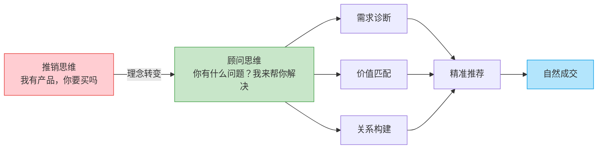
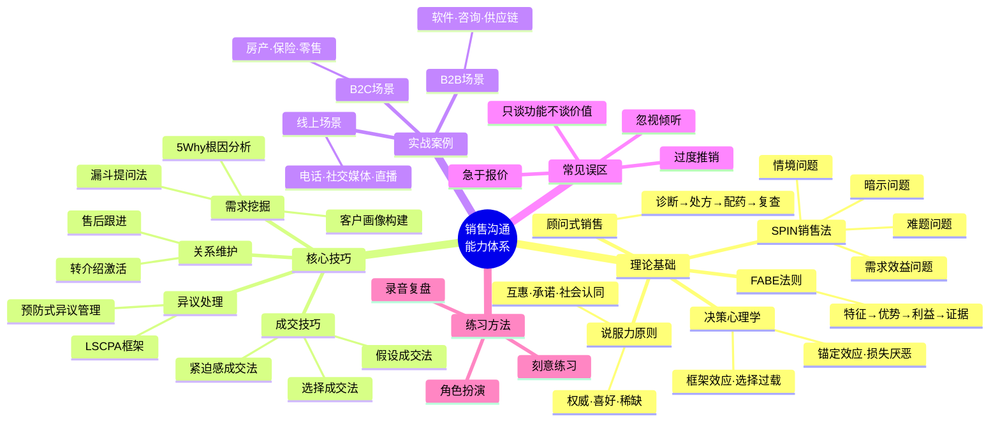

# 第十八章 销售与营销沟通

## 章节概览

### 引言：为什么销售沟通是一切商业活动的根基

在商业世界中，销售沟通是最直接、最考验综合能力的沟通场景之一。无论你是向投资人阐述商业计划、向客户推荐解决方案、还是在谈判桌上争取有利条款，本质上都是一次"销售沟通"——你在试图让对方理解一个价值主张，并基于这个理解做出对你有利的决策。

然而，大多数人对销售沟通存在根本性的误解。他们认为销售就是"说服别人买东西"，是口才好的人用话术"搞定"客户的技巧。这种认知偏差导致了大量低效甚至适得其反的销售行为：过度推销、强行推荐、急于成交、忽视客户真实感受……结果不仅没有赢得客户，反而让潜在买家敬而远之。

根据 HubSpot 2024 年的调研数据，**69% 的买家表示，他们最反感的销售行为是"不理解我的需求就开始推荐产品"**。而 Salesforce 的《State of Sales》报告则指出，高绩效销售人员与普通销售人员之间最大的差异，不在于话术技巧，而在于**倾听能力**和**需求诊断能力**——这两项能力分别高出普通销售 2.3 倍和 1.8 倍。

**销售沟通的本质，是帮助客户做出正确决策，而非推销。**

真正优秀的销售人员，不是最会说话的人，而是最会提问、最会倾听、最能理解客户需求的人。他们不是在"卖东西"，而是在"帮客户解决问题"。这种理念上的转变——从"推销思维"到"顾问思维"——是掌握销售沟通的第一步，也是贯穿本章的核心主线。

### 销售沟通的本质特征

要真正理解销售沟通，需要先厘清它与其他沟通形式的区别。销售沟通有四个本质特征，将它与日常沟通、演讲表达、谈判协商区分开来：

#### 1. 以价值交换为核心驱动力

所有沟通都涉及信息交换，但销售沟通的核心驱动力是**价值交换**。你提供的不是信息本身，而是信息所承载的价值——它如何帮助客户解决某个问题、达成某个目标、避免某种损失。客户支付的也不仅仅是金钱，还有时间成本、信任成本和机会成本。理解这个双向价值交换机制，才能让你的沟通始终围绕"创造价值"展开，而不是围绕"卖出产品"展开。

#### 2. 以客户决策过程为主线

销售沟通不是单向的信息传递，而是沿着**客户决策路径**展开的双向互动。客户的决策通常遵循"认知→兴趣→评估→决策→行动"的五阶段模型，每个阶段的信息需求和心理状态完全不同。在认知阶段，客户需要的是"为什么我应该关注这个问题"；在评估阶段，需要的是"你和竞争对手有什么不同"。脱离客户所处阶段的沟通，无论内容多好，都可能造成错位。

#### 3. 以信任关系为底层基础

心理学家罗伯特·西奥迪尼（Robert Cialdini）在《影响力》中指出，**人们更倾向于接受自己喜欢和信任的人的建议**。这在销售场景中尤为显著——客户在做出购买决策时，实际上是在承担风险（金钱风险、功能风险、社会风险），而信任是降低感知风险的最有效手段。没有信任基础的销售沟通，就像在沙地上盖房子。

#### 4. 以长期价值为导向

一次成功的销售沟通不一定以当场成交为标志。真正有远见的销售沟通，着眼于建立长期客户关系——这次不成还有下次，这位客户满意了还会推荐新客户。研究表明，获取新客户的成本是维护老客户的 5-25 倍（哈佛商业评论），而老客户的推荐转化率比陌生开发高 3-5 倍。因此，**每次销售沟通都是在为下一次合作播种**。

### 本章结构

本章从理论到实践，系统地构建你的销售沟通能力体系。我们采用"道-法-术-器"的贯穿结构：从底层原理出发，经由方法论框架，落实到具体技巧，最终在真实场景中验证和打磨。

```mermaid
graph TD
    A["第十八章 销售与营销沟通"] --> B["第一节 理论基础<br/>道：理解底层原理"]
    A --> C["第二节 核心技巧<br/>法：掌握方法框架"]
    A --> D["第三节 实战案例<br/>术：场景应用演练"]
    A --> E["第四节 常见误区<br/>避坑：识别认知陷阱"]
    A --> F["第五节 练习方法<br/>器：工具与训练体系"]
    A --> G["第六节 本章小结<br/>整合与行动"]
    A --> H["第七节 深度拓展<br/>进阶：前沿理论与新趋势"]

    B --> B1["SPIN销售法"]
    B --> B2["FABE法则"]
    B --> B3["顾问式销售"]
    B --> B4["说服力六大原则"]
    B --> B5["客户决策心理学"]

    C --> C1["需求挖掘"]
    C --> C2["异议处理"]
    C --> C3["成交技巧"]
    C --> C4["客户关系维护"]

    D --> D1["房产销售"]
    D --> D2["B2B软件"]
    D --> D3["保险行业"]
    D --> D4["高端零售"]
    D --> D5["电话销售"]
    D --> D6["社交媒体营销"]

    style A fill:#e8eaf6,stroke:#3949ab,stroke-width:2px
    style B fill:#fff3e0,stroke:#ef6c00
    style C fill:#e8f5e9,stroke:#2e7d32
    style D fill:#fce4ec,stroke:#c62828
    style E fill:#f3e5f5,stroke:#6a1b9a
    style F fill:#e0f7fa,stroke:#00838f
    style G fill:#fffde7,stroke:#f9a825
    style H fill:#efebe9,stroke:#4e342e
```

各节内容详解如下：

| 节次 | 主题 | 核心内容 | 关键方法论 | 预计学习时长 |
|------|------|----------|-----------|-------------|
| 第一节 | 理论基础 | SPIN销售法、FABE法则、顾问式销售、说服力原则、客户决策心理学 | SPIN、FABE、Cialdini六原则、行为经济学 | 45-60 分钟 |
| 第二节 | 核心技巧 | 需求挖掘、异议处理、成交技巧、客户关系维护 | 漏斗提问法、LSCPA、10种成交法、CRM策略 | 60-90 分钟 |
| 第三节 | 实战案例 | 房产、B2B软件、保险、高端零售、电话销售、社交媒体等场景 | 6大行业完整案例解析 | 60-90 分钟 |
| 第四节 | 常见误区 | 十大销售沟通陷阱及避坑指南 | 自检清单+纠正方案 | 30-45 分钟 |
| 第五节 | 练习方法 | 七种高效练习方式，从理论到内化 | 角色扮演、录音复盘、刻意练习 | 30 分钟了解，持续实践 |
| 第六节 | 本章小结 | 核心原则回顾、行动清单、推荐阅读 | 思维导图+30天行动计划 | 20-30 分钟 |
| 第七节 | 深度拓展 | 前沿理论、数字化趋势、跨文化销售、AI辅助销售 | 前沿工具与趋势分析 | 45-60 分钟 |

### 学习目标

完成本章学习后，你将能够：

1. **理解销售沟通的核心理念**——从"推销思维"转向"顾问思维"，建立以客户为中心的沟通框架。你将深刻理解为什么"帮客户解决问题"比"说服客户买东西"更有效，以及这种理念转变如何从根本上改变你的沟通效果。

2. **掌握系统化的销售沟通框架**——运用 SPIN、FABE 等专业方法论，将零散的沟通技巧整合为可复制、可迭代的系统。这些框架不是"话术模板"，而是帮你理解客户需求结构和决策逻辑的思维工具。

3. **熟练运用需求挖掘技巧**——通过提问发现客户的真实需求和痛点。你将学会区分"表面需求"和"深层需求"，掌握从客户的一句话中挖掘出背后真正动机的能力。这是所有高绩效销售的共同特质。

4. **有效处理客户异议**——将反对意见转化为推进机会。异议不是拒绝，而是客户在表达"我还需要更多信息才能做出决定"。你将学会 5 种异议处理框架，将每一个"太贵了""再考虑一下"变成推进成交的契机。

5. **灵活运用多种成交技巧**——在合适的时机以合适的方式促成决策。你将掌握 10 种经过验证的成交方法，并学会根据客户类型和场景灵活选择，避免在错误的时机使用错误的方法。

6. **建立长期客户关系**——从一次性交易走向持续合作。你将理解客户生命周期价值（CLV）的概念，并掌握在售后阶段持续创造价值的方法，让每一次成交都成为下一次合作的起点。

7. **识别并避免常见误区**——在实战中少走弯路。通过十大常见陷阱的深度解析，你将建立起一套"自我诊断"机制，能在犯错后快速识别问题并调整策略。

### 本章核心知识图谱

为了帮助你在学习过程中始终保持全局视野，这里提供本章的知识关系图。它展示了各节内容之间的逻辑关联——理论是地基，技巧是骨架，案例是血肉，误区是免疫系统，练习是肌肉记忆。

### 读者能力自评

在正式开始学习之前，建议你先做一次快速自评，以便选择最适合你的学习路径。请对照以下能力等级，找到自己当前的大致位置：

| 能力等级 | 典型特征 | 建议学习路径 |
|----------|----------|-------------|
| **入门级** | 刚接触销售工作，或从未系统学习过销售沟通；面对客户时不知道说什么，容易紧张；经常"背话术"但效果不稳定 | 从第一节理论基础开始，逐节精读，重点理解核心概念。先掌握 SPIN 和 FABE 两个基础框架，再进入技巧学习 |
| **进阶级** | 有 1-3 年销售经验，能独立完成销售流程，但成交率波动大；知道应该提问但不知道问什么；遇到异议容易慌 | 可快速浏览第一节，重点精读第二节核心技巧，尤其关注需求挖掘和异议处理。结合第三节案例做对照学习 |
| **熟练级** | 有 3 年以上经验，成交率稳定但难以突破瓶颈；能处理常规异议，但面对高端客户或复杂场景感到力不从心 | 跳过基础理论，聚焦第四节误区自检和第七节深度拓展，用第三节案例检验自己的方法论是否完整 |
| **专家级** | 5 年以上经验，能独立设计销售体系；关注的是如何将个人能力复制给团队 | 重点关注第七节深度拓展中的团队管理、销售赋能（Sales Enablement）和 AI 辅助销售等内容 |

### 阅读建议

**理论与实践结合**：第一节和第二节是理论与技巧的铺垫，建议先通读理解，再结合第三节的实战案例加深印象。单纯记理论容易遗忘，单纯看案例缺乏系统性——两者结合才能形成真正的认知框架。

**场景化学习**：选择与你工作最相关的 2-3 个场景重点研读，尝试将对话中的技巧提炼出来，标注出"这里用了 SPIN 的暗示问题""这里用了 FABE 的利益呈现"。这种主动标注的过程，比被动阅读有效 3 倍以上。

**循序渐进地练习**：第五节的练习方法不必全部同时开始，先选择 1-2 种最适合当前阶段的方式，建立习惯后再扩展。特别推荐"录音复盘法"——它是最接近实战、反馈最及时的自我提升手段。

**持续复盘**：每次实际销售沟通后，对照第四节的常见误区进行自我检查，逐步优化沟通方式。建议准备一个"销售沟通日志"，记录每次关键对话的经过、结果和反思。

**善用知识图谱**：在学习过程中，经常回到本节的知识图谱，检查自己是否对各个知识节点都有了清晰的理解。当你能在脑中重建这张图时，说明你已经建立了完整的知识体系。

### 本章关键词

以下是本章将频繁出现的核心术语，建议在阅读过程中不断加深对它们的理解：

| 术语 | 含义 | 首次出现 |
|------|------|----------|
| SPIN | Situation（情境）- Problem（问题）- Implication（暗示）- Need-payoff（需求效益）的提问框架，由尼尔·雷克汉姆提出 | 第一节 |
| FABE | Feature（特征）- Advantage（优势）- Benefit（利益）- Evidence（证据）的产品介绍法则 | 第一节 |
| 顾问式销售 | 以客户需求诊断为核心，提供专业建议而非推销产品的销售方法论 | 第一节 |
| CLV | Customer Lifetime Value，客户生命周期价值，衡量单个客户在整个合作周期内能带来的总价值 | 第二节 |
| LSCPA | Listen（倾听）- Share（认同）- Clarify（澄清）- Present（提出方案）- Ask（请求行动）的异议处理框架 | 第二节 |
| 锚定效应 | 行为经济学概念，指人们在做决策时会过度依赖最先接收到的信息 | 第一节 |
| 需求漏斗 | 从宽泛的开放式问题逐步收窄到具体的确认式问题的提问策略 | 第二节 |
| 转介绍率 | 现有客户主动推荐新客户的比率，是衡量客户关系质量的重要指标 | 第二节 |

> "最好的销售，是让客户觉得这个决定是他自己做出的，而不是被你说服的。"

***
