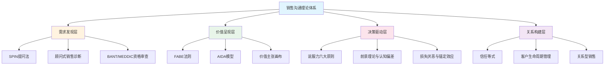
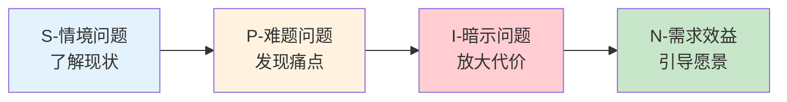
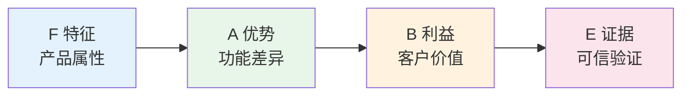
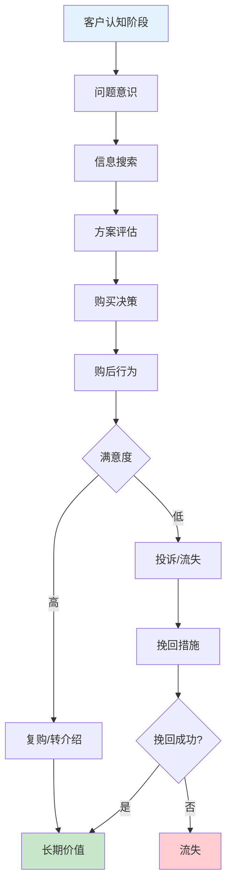
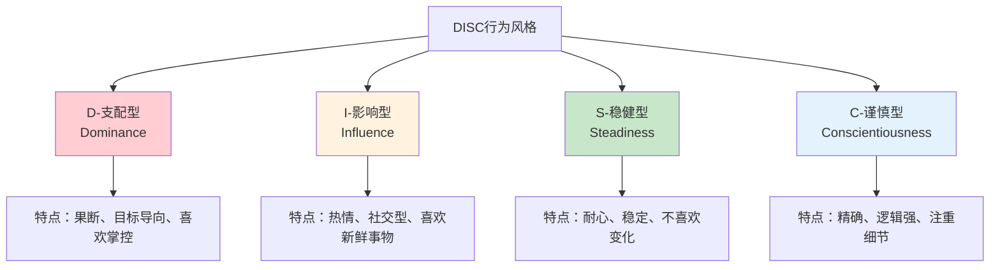
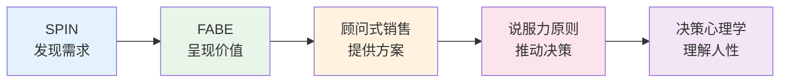

# 第十八章 销售与营销沟通 · 第一节 理论基础

## 一、销售沟通的理论全景

销售沟通不是"会说话"那么简单。它是一门融合了心理学、行为经济学、传播学和组织行为学的系统学科。从20世纪初的"AIDA"模型到当代的"挑战者销售"，销售理论经历了从"以产品为中心"到"以客户为中心"再到"以价值共创为中心"的三次范式转变。

理解这些理论的价值在于：当你面对真实的销售场景时，你不是在"猜"客户想要什么，而是在用经过验证的框架来诊断需求、呈现价值、推动决策。

### 📊 销售沟通理论体系全景图

### 理论演进时间线

| 时期 | 代表理论 | 核心理念 | 销售重心 |
|------|----------|----------|----------|
| 1900s | AIDA模型 | 注意→兴趣→欲望→行动 | 产品推销 |
| 1960s | 方式销售（Method Selling） | 标准化话术流程 | 话术训练 |
| 1980s | SPIN销售法 | 以提问驱动需求发现 | 需求挖掘 |
| 1990s | 顾问式销售 | 成为客户的问题解决者 | 解决方案 |
| 2000s | 挑战者销售 | 教导客户、定制方案、控制销售 | 价值引领 |
| 2010s+ | 价值共创 | 客户参与价值创造过程 | 共同创新 |

> **核心认知**：没有"最好"的销售理论，只有"最适合"当前场景的理论。B2B大客户销售中顾问式销售更有效，标准化产品销售中AIDA更实用，创新型解决方案销售中挑战者模式更有力。

***

## 二、SPIN销售法：以提问驱动成交

SPIN销售法由尼尔·雷克汉姆（Neil Rackham）在《SPIN Selling》中提出，是基于对35,000次销售拜访的系统研究而总结出的提问框架。这是迄今为止销售领域最大规模的实证研究，其结论经过了严格的统计验证。

### 2.1 SPIN的理论基础

传统销售培训假设"成交技巧"是关键——教销售人员如何处理异议、如何试探成交、如何克服拒绝。但雷克汉姆的研究发现，在大宗销售（Major Sales）中，这些技巧不仅无效，反而会降低成交率。

真正决定成交的因素是：**销售人员能否通过提问引导客户自己发现需求的紧迫性。** 当客户自己说出"我需要解决这个问题"时，其购买意愿远比销售人员说"您应该买这个产品"时强烈得多。

### 2.2 四层提问的递进逻辑

SPIN不是一个随意的问题清单，而是一个精心设计的递进结构：

#### 第一层：情境问题（Situation Questions）

**目的**：收集客户的基本信息和现状，建立对话的事实基础。

**示例**：
- "您目前使用的CRM系统是哪家供应商的？"
- "您的团队有多少人在使用这个工具？"
- "您目前的获客渠道主要有哪些？"
- "您现在每个月的客户流失率大约是多少？"

**关键限制**：情境问题不宜过多。研究表明，高效销售人员在初次拜访中情境问题的使用量通常不超过5个。过多的情境问题会让客户感到被"审问"，产生防御心理。

**最佳实践**：在拜访前通过公开信息（官网、年报、行业报告）尽可能多地了解客户情况，将情境问题留给那些无法通过公开渠道获取的关键信息。

#### 第二层：难题问题（Problem Questions）

**目的**：引导客户表达当前面临的困难和不满，让客户自己说出"痛处"。

**示例**：
- "目前的系统在数据整合方面是否存在困难？"
- "您对现有供应商的服务响应速度满意吗？"
- "团队成员在使用过程中最常抱怨的是什么？"
- "在客户跟进过程中，有没有哪些环节让您觉得效率不高？"

**为什么有效**：难题问题的威力在于，它让客户自己定义问题，而不是销售人员替客户定义。当客户自己说出"我对XX不满意"时，这个痛点就变成了客户自己的认知，而非销售人员的推销说辞。

**进阶技巧**：不要急于在客户说出难题后立刻给出解决方案。优秀的销售人员会让客户在"痛感"中停留一段时间，因为痛感越强，后续解决方案的价值感知就越高。

#### 第三层：暗示问题（Implication Questions）

**目的**：放大问题的影响，让客户意识到"不解决这个问题"会带来更大的代价。这是SPIN中最有力量但也最难掌握的提问类型。

**示例**：
- "如果数据整合的问题持续存在，对您的决策效率会有什么影响？"
- "响应速度慢是否导致过项目延期？那次延期带来了多大的损失？"
- "如果团队因为工具不好用而效率低下，长期来看会对人才留存产生什么影响？"
- "这个问题如果再持续半年，预计会对您的年度目标产生多大影响？"

**为什么最难**：暗示问题需要销售人员对客户的业务有深入理解。你必须能够预见一个问题如何像多米诺骨牌一样引发连锁反应。这要求你在拜访前做大量的行业研究和业务分析。

**暗示问题的放大路径**（以"系统响应慢"为例）：

| 层级 | 暗示问题 | 影响放大 |
|------|----------|----------|
| 直接影响 | "响应慢是否导致员工等待时间增加？" | 效率下降 |
| 间接影响 | "员工等待时间增加是否影响了项目交付进度？" | 项目延期 |
| 战略影响 | "项目延期是否影响了客户满意度和续约率？" | 收入损失 |
| 长期影响 | "客户流失率上升是否影响了公司的市场竞争力？" | 战略风险 |

#### 第四层：需求-效益问题（Need-payoff Questions）

**目的**：让客户自己说出解决方案的价值，将"痛点"转化为"愿景"。

**示例**：
- "如果有一款工具能将数据整合时间缩短70%，对您来说意味着什么？"
- "如果供应商能在2小时内响应，对您的项目管理会有什么改善？"
- "如果团队的协作效率提升30%，您打算把节省下来的时间投入到哪些方面？"
- "如果客户续约率能提升5个百分点，对您的年度收入目标有多大帮助？"

**成交信号**：当客户自己说出"如果能……那就太好了"的时候，成交就只是时间问题了。因为客户已经自己完成了"需求确认"和"价值想象"这两个关键步骤。

### 2.3 SPIN的常见误用

| 误用方式 | 问题 | 正确做法 |
|----------|------|----------|
| 一口气问完所有S问题 | 像审问，客户反感 | 事先调研，只问关键的2-3个 |
| 跳过P直接问I | 没有痛点基础，暗示问题显得突兀 | 先让客户确认痛点存在 |
| I问题不够深入 | 只停留在表面影响，没有放大痛感 | 追问"然后呢？""还有呢？" |
| N问题变成产品介绍 | "我们的产品可以……" | 保持提问形式，让客户自己说出价值 |
| 机械套用SPIN顺序 | 对话生硬不自然 | 根据对话灵活调整顺序 |

***

## 三、FABE法则：产品价值呈现的黄金结构

FABE法则是一个将产品特征转化为客户价值的结构化表达框架，由台湾中兴大学商学院推广运用。它的核心思想是：**客户购买的不是产品本身，而是产品能带来的利益。**

### 3.1 FABE四要素详解

| 要素 | 英文 | 核心问题 | 本质 |
|------|------|----------|------|
| **F** | Feature | "它是什么？" | 产品的客观属性 |
| **A** | Advantage | "它能做什么？" | 与竞品相比的差异点 |
| **B** | Benefit | "对你有什么好处？" | 客户能感知的价值 |
| **E** | Evidence | "怎么证明？" | 可验证的证据 |

**关键原则**：不要停留在F和A层面。很多销售人员习惯说"我们的产品有什么功能"（F）和"我们的产品比别人好在哪"（A），但客户真正关心的是B——"这对我有什么用？"

### 3.2 FABE的递进逻辑

- **F→A**：从"是什么"到"能做什么"——这是技术层面的转化
- **A→B**：从"能做什么"到"对你有什么用"——这是从产品语言到客户语言的转化
- **B→E**：从"承诺"到"证明"——这是从价值主张到可信度的转化

### 3.3 实战示例

**以一款企业协作软件为例**：

- **F**：我们的软件内置了AI智能助手，基于GPT-4级别的大语言模型
- **A**：它可以自动整理会议纪要、分配任务、追踪进度，准确率达到95%以上，比手动操作快10倍
- **B**：您团队每周可以节省约5小时的行政工作时间，这些时间可以投入到产品研发和客户拓展中
- **E**：目前已有超过200家企业在使用，平均反馈效率提升了35%。XX科技的CTO张总说："上了一个月，团队再也不想回去了。"

**以一款防晒霜为例**：

- **F**：SPF50+ PA++++，含有烟酰胺和透明质酸成分
- **A**：相比普通防晒霜，防护时间延长3倍，同时具有美白和保湿功效
- **B**：您出门前涂一次，整天不用担心晒黑晒老，皮肤还会越用越白嫩
- **E**：通过国家药监局特证认证，小红书上有超过5000条真实用户好评

### 3.4 FABE的高级用法

**反向FABE**：当客户提出异议时，用FABE的逻辑来回应。例如客户说"太贵了"，你可以说："您说得对，价格确实不低（承认F），但这个价格对应的是XX级别的材料和工艺（A），它能帮您省去未来3年内反复更换的成本（B），我们算过一笔账，三年下来其实比买三个便宜的更省钱（E）。"

**组合FABE**：当产品有多个卖点时，不要逐个罗列，而是选择与当前客户最相关的2-3个FABE进行组合呈现。判断"最相关"的标准是：哪个FABE直接对应客户在SPIN阶段表达的痛点。

***

## 四、AIDA模型：销售沟通的经典框架

AIDA模型由美国广告人E. St. Elmo Lewis于1898年提出，是销售和营销领域历史最悠久的沟通框架。虽然已经超过120年，但其核心逻辑依然成立。

### 4.1 AIDA四阶段

| 阶段 | 英文 | 目标 | 关键动作 |
|------|------|------|----------|
| **A** | Attention | 吸引注意 | 打破客户的注意力惯性 |
| **I** | Interest | 激发兴趣 | 让客户愿意继续听下去 |
| **D** | Desire | 刺激欲望 | 让客户产生"我想要"的冲动 |
| **A** | Action | 促成行动 | 推动客户做出购买决定 |

### 4.2 AIDA在不同场景中的应用

**电话销售中的AIDA**：

- **A（前5秒）**："王总您好，我是XX公司的小李。我们刚帮您同行业的YY公司解决了他们头疼了半年的库存周转问题。"——用行业案例打破电话销售的"秒挂"魔咒
- **I（30秒）**："他们之前的情况和您很像——库存周转天数超过60天，占用资金超过200万。我们用了3个月帮他们降到了35天，释放了将近100万的流动资金。"——用具体数据激发兴趣
- **D（2分钟）**："如果您现在的库存周转天数也能缩短25天，按照您的业务规模，预计能释放XX万的资金。这些钱可以投入到新品开发或者市场推广中。"——帮客户想象改善后的场景
- **A**："这周三下午或者周四上午，您方便的话我可以带方案过去详细聊30分钟，您看哪个时间合适？"——给出具体的行动选项

**面对面销售中的AIDA**：

- **A**：用一个与客户直接相关的问题或洞察开场，而不是"让我给您介绍一下我们的产品"
- **I**：通过2-3个关键数据点或案例，让客户意识到这个问题值得重视
- **D**：用暗示问题放大痛点，用需求-效益问题构建愿景
- **A**：在客户表达出明确兴趣后，自然地推进到下一步（试用、方案演示、报价）

### 4.3 AIDA的现代变体

随着数字营销的兴起，AIDA模型演化出了多个变体：

| 变体 | 新增阶段 | 适用场景 |
|------|----------|----------|
| AIDAS | +Satisfaction（满意） | 强调购后体验和复购 |
| AIDCA | +Conviction（确信） | 高单价、高风险购买决策 |
| AISAS | +Search（搜索）+Share（分享） | 数字时代的消费者行为路径 |
| AARRR | Acquisition→Activation→Retention→Revenue→Referral | SaaS/互联网产品的增长漏斗 |

***

## 五、顾问式销售理论

顾问式销售（Consultative Selling）的核心理念是：**销售人员不是产品的推销者，而是客户问题的解决者。** 这一理念由Mack Hanan在1970年代提出，后经Neil Rackham、Stephen Heiman等人的研究进一步发展完善。

### 5.1 顾问式销售与传统销售的本质区别

| 维度 | 传统销售 | 顾问式销售 |
|------|----------|------------|
| 出发点 | 我有什么产品 | 客户有什么问题 |
| 沟通重心 | 产品介绍 | 需求诊断 |
| 说服方式 | 突出产品优点 | 展示对客户的价值 |
| 关系定位 | 卖家-买家 | 顾问-客户 |
| 成交思维 | 短期交易 | 长期合作 |
| 核心能力 | 话术与谈判力 | 提问与倾听能力 |
| 价值来源 | 产品本身 | 对客户业务的理解深度 |
| 客户感受 | "被推销" | "被帮助" |

### 5.2 顾问式销售的实施框架

#### 第一步：建立信任

信任是顾问式销售的基础。没有信任，再好的提问技巧也会被视为"套路"。

**信任等式**：

信任 = (专业度 × 可靠度 × 亲近感) / 自我导向

- **专业度**：你对客户行业的理解深度
- **可靠度**：你是否说到做到，是否能兑现承诺
- **亲近感**：客户与你沟通时是否感到舒适
- **自我导向**（分母）：你是否只关心自己的业绩，还是真心为客户着想

#### 第二步：深度诊断

像医生问诊一样，通过系统性的提问和分析，找到问题的根源，而不是只解决表面症状。

**诊断的三个层次**：

1. **表象层**：客户说"我们的销售效率不高"——这只是症状
2. **原因层**：进一步追问发现"线索转化率低"——这接近原因
3. **根源层**：深入分析发现"销售团队缺乏系统的需求挖掘方法，每次拜访都直接跳到产品介绍"——这才是真正的根源

#### 第三步：个性化方案

基于对客户情况的深度理解，量身定制解决方案。方案不是产品功能的堆砌，而是针对客户具体问题的解决路径。

**方案呈现的"三个对齐"**：
- 与客户的业务目标对齐
- 与客户的组织能力对齐
- 与客户的预算和时间约束对齐

#### 第四步：教育与启发

帮助客户看到他们自己没有意识到的问题或机会。这是顾问式销售最有价值的部分——你不是在回应客户的需求，而是在创造需求。

**教育式销售的四种内容**：
- **行业趋势洞察**：帮助客户理解行业变化的方向
- **最佳实践分享**：展示同行是如何解决类似问题的
- **量化影响分析**：用数据说明问题的严重程度和解决后的收益
- **未来场景描绘**：帮客户想象解决问题后的理想状态

#### 第五步：长期关系

关注客户在购买后的长期成功，而非一次性交易。顾问式销售人员的目标是成为客户在某个领域的"外部顾问"，客户遇到相关问题时第一个想到的就是你。

### 5.3 挑战者销售模型

2011年，Matthew Dixon和Brent Adamson在《The Challenger Sale》中提出了挑战者销售模型，基于对6,000多名销售人员的研究，发现高绩效销售人员中占比最高的不是"关系型"销售人员，而是"挑战者型"。

**挑战者型销售人员的三个核心行为**：

1. **教导客户**（Teach）：给客户带来他们不知道的、关于自己业务的洞察，而不是重复客户已经知道的信息
2. **量身定制**（Tailor）：根据不同决策者的关注点，调整沟通内容和方式
3. **控制销售**（Take Control）：在价格谈判和异议处理中保持主导地位，而不是被动迎合

> **实践意义**：挑战者销售模型并非否定顾问式销售，而是在其基础上增加了一个关键维度——**你不仅要理解客户的需求，还要能给客户带来新的认知。** 最强的销售人员不是在回应需求，而是在重新定义需求。

***

## 六、BANT与MEDDIC：销售资格审查框架

在B2B销售中，不是每个潜在客户都值得投入同样的时间和精力。销售资格审查（Sales Qualification）框架帮助你判断一个潜在客户是否值得跟进，以及应该投入多少资源。

### 6.1 BANT框架

BANT由IBM在1950年代提出，是最早的销售资格审查框架：

| 要素 | 英文 | 核心问题 |
|------|------|----------|
| **B** | Budget | 客户有预算吗？预算够吗？ |
| **A** | Authority | 你沟通的人有决策权吗？ |
| **N** | Need | 客户有明确的需求吗？ |
| **T** | Timeline | 客户有明确的时间表吗？ |

**BANT的局限性**：在现代B2B销售中，BANT过于简化。客户的预算可能是弹性的，决策权可能分散在多个角色中，需求可能是需要被激发的而不是现成的，时间表可能是模糊的。

### 6.2 MEDDIC框架

MEDDIC由Dick Dunkel和Jack Napoli在1990年代提出，是针对复杂B2B销售的更精细的资格审查框架：

| 要素 | 英文 | 核心问题 |
|------|------|----------|
| **M** | Metrics | 成功的量化指标是什么？ |
| **E** | Economic Buyer | 谁有最终的财务决策权？ |
| **D** | Decision Criteria | 客户用什么标准来评估方案？ |
| **D** | Decision Process | 客户的决策流程是什么？ |
| **I** | Identify Pain | 客户的核心痛点是什么？ |
| **C** | Champion | 客户内部谁在推动这个项目？ |

**MEDDIC的核心价值**：它不仅告诉你"这个客户值不值得跟"，还告诉你"应该怎么跟"。特别是Champion（内部推动者）的概念——在复杂的B2B销售中，你需要在客户组织内部找到一个愿意为你说话、帮你推动项目的人。

### 6.3 如何选择框架

- **简单产品、短周期销售**：BANT足够
- **复杂产品、长周期销售**：使用MEDDIC或其升级版MEDDPICC（增加了Paper Process和Competition两个维度）
- **创新型解决方案**：结合挑战者销售模型，重点在"教导客户"和"Identify Pain"

***

## 七、说服力六大原则（罗伯特·西奥迪尼）

罗伯特·西奥迪尼（Robert Cialdini）在《影响力》中提出了影响人类行为的六大原则。这些原则基于大量的心理学实验和田野研究，在销售沟通中有广泛应用。

### 7.1 互惠原则（Reciprocity）

**原理**：人们倾向于回报他人的善意。这种倾向是跨文化普遍存在的，是人类社会合作的进化基础。

**销售应用**：
- 在第一次客户拜访时，带上一份针对客户行业的定制化分析报告，而不是产品宣传册
- 先分享一个有价值的行业洞察，再提出深入了解客户需求的请求
- 提供免费的试用、诊断、咨询，让客户感受到"先得到"的善意

**关键细节**：互惠的力量不在于给予的价值大小，而在于给予的**个性化程度**。一份针对客户具体情况定制的10页分析报告，比一份通用的100页行业白皮书更有效。

### 7.2 承诺与一致原则（Commitment & Consistency）

**原理**：人们倾向于保持言行一致。一旦做出了某个承诺（哪怕是口头的、非正式的），人们会倾向于后续的行为与之保持一致。

**销售应用**：
- 先让客户做出小的承诺："您是否同意这个效率问题需要解决？"
- 在会议开始时让客户确认议程和目标，后续讨论中客户会更配合
- 让客户在白板上写下他们最关心的三个问题，后续方案演示时逐个回应

**进阶技巧**：引导客户在公开场合做出承诺（如在多人会议上确认某个观点），比私下承诺更有效，因为违背公开承诺的心理成本更高。

### 7.3 社会认同原则（Social Proof）

**原理**：人们倾向于参考他人的行为来做决策，特别是在不确定的情况下。这是因为在进化过程中，模仿大多数人的行为通常是一种安全策略。

**销售应用**：
- "您同行业的XX公司使用后，三个月内效率提升了40%"
- "目前已有超过500家企业选择我们的方案"
- "这个方案是我们今年卖出最多的，客户反馈最好"

**B2B vs B2C的社会认同差异**：

| 维度 | B2B场景 | B2C场景 |
|------|---------|---------|
| 核心形式 | 行业标杆客户案例 | 用户评价和KOL推荐 |
| 数据展示 | 客户数量、行业渗透率 | 销量、好评率 |
| 信任来源 | 同行企业的选择 | 大众的选择 |
| 证明方式 | ROI数据、效率提升指标 | 口碑、使用体验 |

### 7.4 喜好原则（Liking）

**原理**：人们更愿意被自己喜欢的人说服。喜好度的三个来源：相似性、赞美、接触与合作。

**销售应用**：
- 在拜访前研究客户的背景（LinkedIn、行业报道），找到共同点
- 真诚地赞美客户的某个决策或成就（不要泛泛而谈，要具体）
- 在沟通中展现你的专业性，同时保持亲和力

**相似性的层次**：
1. **表面相似**：同一个城市、同一所学校——建立初步好感
2. **价值观相似**：对行业趋势的看法一致——建立深度信任
3. **经历相似**：曾经面临过类似的问题——建立"你懂我"的感觉

### 7.5 权威原则（Authority）

**原理**：人们倾向于听从专家的意见。这是因为在大多数情况下，听从专家的建议是一种理性策略。

**销售应用**：
- 引用行业研究报告的数据："根据Gartner的最新报告……"
- 展示专业资质和行业经验："我们在过去10年服务了超过100家同行业企业"
- 邀请技术专家参与客户会议，增强技术方案的可信度
- 使用客户行业内部的术语和概念，展示你"懂行"

**权威的建立方式**：

| 维度 | 方式 | 示例 |
|------|------|------|
| 专业资质 | 证书、学位、认证 | CFA、PMP、行业认证 |
| 行业经验 | 从业年限、服务案例 | "在这个行业做了15年" |
| 第三方背书 | 媒体报道、行业奖项 | "被XX评为行业最佳方案" |
| 知识展示 | 对客户业务的深度洞察 | 准确诊断客户未说出的问题 |

### 7.6 稀缺原则（Scarcity）

**原理**：人们对稀缺资源赋予更高的价值。当某样东西变得稀缺时，人们不仅更想要它，还会更珍惜它。

**销售应用**：
- "这个优惠价格只在本月底之前有效"
- "我们这个季度的实施团队名额有限，目前只剩2个位置"
- "这个定制化方案需要我们的高级顾问亲自参与，他的排期通常要提前两周预约"

**关键约束**：稀缺性必须是真实的。虚假的紧迫感（"限量100件"但其实库存充足）不仅会损害信任，还可能涉及法律风险。客户一旦发现被欺骗，信任关系将不可修复。

***

## 八、客户决策心理学

### 📊 客户决策路径图

### 8.1 前景理论与销售决策

诺贝尔经济学奖得主卡尼曼（Daniel Kahneman）和特沃斯基（Amos Tversky）提出的前景理论（Prospect Theory）揭示了人们在不确定条件下的决策规律。这是对传统经济学"理性人"假设的重大修正，对销售沟通有深远的指导意义。

**前景理论的四个核心发现及其销售应用**：

#### 发现一：参考点依赖

人们不是根据绝对价值做判断，而是根据相对于某个参考点的变化。

**销售应用**：
- 不要说"这个产品10万元"，而要说"这个产品每天的成本不到28元，比您每天喝两杯咖啡还便宜"
- 先说"市面上类似解决方案的价格通常在XX万/年"，再报价，让客户的参考点落在较高的位置
- 用"节省了多少"代替"花了多少"——"每年帮您节省30万的人力成本"比"每年投入10万"更有说服力

#### 发现二：损失厌恶

人们对损失的敏感度约是对收益的2-2.5倍。这意味着失去100元的痛苦，大约等于得到200-250元的快乐。

**销售应用**：
- "如果现在不解决这个问题，未来三个月您可能面临XX损失"比"使用我们的产品您可以获得XX收益"更有说服力
- 退费保证的逻辑：客户购买后如果不好用可以退款——但对客户来说，一旦拥有了产品，"失去它"的痛苦会让他们更不愿意退款（禀赋效应）
- "如果不做这个升级，您现在正在以每月XX元的速度流失客户"——用"正在流失"强调当下的损失

**注意**：损失厌恶策略必须基于真实的信息，不能制造虚假的紧迫感。否则当客户发现真相后，信任关系将彻底崩塌。

#### 发现三：确定性效应

人们倾向于高确定性的结果，即使期望值更低。

**销售应用**：
- 提供"不满意全额退款"的保证，可以显著降低客户的决策风险感
- 用确定性语言替代概率性语言："用了这个方案，您的效率一定会提升"比"可能会提升"更有说服力
- 分阶段交付、里程碑付款，降低客户对大额一次性投入的不确定性焦虑

#### 发现四：小概率事件的过度权重

人们倾向于过度关注小概率事件——对极小的收益抱有过高期望（如彩票），对极小的风险过度恐惧（如飞机失事）。

**销售应用**：
- 保险销售强调极端风险事件能有效提升购买意愿
- 网络安全产品可以用"如果发生数据泄露，平均损失是XX万"来激发防护需求
- 但要注意分寸——过度渲染小概率风险会让客户觉得你在"恐吓"

### 8.2 核心认知偏差在销售中的应用

| 认知偏差 | 定义 | 销售应用 | 注意事项 |
|----------|------|----------|----------|
| 锚定效应 | 第一印象影响后续判断 | 先展示高端方案，再展示推荐方案 | 锚不能太离谱，否则失去可信度 |
| 从众效应 | 受多数人行为影响 | 展示客户数量、行业渗透率 | 从众信息必须是真实的 |
| 光环效应 | 对某方面的好感扩展到整体 | 建立专业形象，提升整体信任度 | 一个负面细节也可能毁掉整体印象 |
| 稀缺效应 | 越稀缺越有价值 | 限时优惠、限量供应 | 稀缺必须真实 |
| 沉没成本 | 已投入的成本影响未来决策 | 让客户先投入时间（试用、学习） | 不应利用沉没成本误导客户 |
| 框架效应 | 信息呈现方式影响判断 | 用正面框架表达产品价值 | "95%存活率"比"5%死亡率"更受欢迎 |
| 近因效应 | 最近的信息影响更大 | 把最重要的信息放在最后说 | 结尾的印象比开头更持久 |
| 确认偏差 | 人们倾向于寻找支持自己观点的信息 | 先让客户表达观点，再用证据支持 | 客户会自动忽略与已有观点矛盾的信息 |

### 8.3 情绪与购买决策的关系

神经科学研究表明（Damasio的躯体标记假说），人类的购买决策更多由情绪驱动，而非理性分析。即使在B2B场景中，决策者也是人，也会受到情绪的影响。

**情绪决策的三个阶段**：

1. **情绪触发**：客户的购买欲望首先由情绪触发。可能是对现状的不满（负面情绪），也可能是对美好未来的向往（正面情绪）。
2. **理性验证**：情绪产生购买冲动后，理性开始寻找"合理化"的证据。这时客户需要数据、案例、逻辑来支持自己的决定。
3. **情绪确认**：最终的购买决定往往是在情绪得到确认后做出的。销售人员在这个阶段需要帮助客户"感觉良好"——对自己的决定感到满意和安心。

**实践启示**：
- 在沟通初期，先建立情感连接，再展示产品功能
- 在价值呈现时，先讲故事（情感），再给数据（理性）
- 在成交阶段，帮客户想象使用产品后的美好画面
- 购后跟进时，反复确认客户做了"正确的决定"，降低购后失调

### 8.4 决策疲劳与选择架构

当客户面对过多选项时，反而更容易放弃决策。这是心理学家Barry Schwartz在《选择的悖论》中提出的发现。

**销售应用**：
- 推荐方案不超过3个（基础版、标准版、高级版）
- 帮客户缩小选择范围："根据您刚才说的情况，我建议您重点考虑这两个方案"
- 提供明确的推荐意见："如果是我，我会选标准版，因为……"
- 不要让客户做不必要的选择——能由你来判断的，就不要推给客户

### 8.5 损失厌恶的高级应用

**"现状偏见"与损失厌恶的叠加**：人们不仅害怕损失，还倾向于维持现状。这意味着"不做任何改变"本身就是一个强大的竞争对手。你的对手往往不是竞品，而是客户的"不作为"。

**克服现状偏见的策略**：
- 让"不作为"变得有成本："您现在每多等一个月，就多损失XX万"
- 降低改变的感知风险："我们的方案可以先从小范围试点开始，不需要全面铺开"
- 提供过渡方案："我们可以先帮您处理XX部分，其他部分保持不变"

***

## 九、客户心理防御机制与异议处理

### 9.1 客户为什么会有防御心理

客户面对销售人员时，天然会产生防御心理。这不是客户的问题，而是人类的自我保护机制。理解防御心理的来源，才能有效应对。

**防御心理的四个来源**：

1. **过往的负面经历**：曾经被过度推销、被欺骗、被忽视——"上次那个销售说得好好的，结果完全不是那么回事"
2. **信息不对称**：担心自己被"套路"——"你比我更了解这个产品，你怎么说我都无法验证"
3. **决策压力**：害怕做出错误的购买决定——"万一买了不好用怎么办？"
4. **自我保护本能**：对陌生人和陌生事物保持警惕——这是人类进化形成的本能反应

### 9.2 降低客户防御的五种策略

| 策略 | 原理 | 具体做法 |
|------|------|----------|
| 互惠先行 | 先给予价值，降低对方的防御 | 提供免费的行业分析、有价值的建议 |
| 透明沟通 | 减少信息不对称 | 主动披露产品的局限性，展示竞品的优劣势 |
| 社会认同 | 降低不确定性 | 展示其他客户的真实评价和案例 |
| 承诺一致 | 利用言行一致的心理 | 先让客户做出小的承诺 |
| 专业形象 | 增强可信度 | 展示行业知识、从业经验、专业资质 |

**透明沟通的进阶用法**：主动说出产品的局限性，反而会增强客户对你的信任。"这款产品在XX方面确实不错，但在YY方面可能不如竞品。如果您的需求主要是YY，我建议您考虑ZZ方案。"——当你说出这样的话，客户会认为："这个人是真心为我着想，不是只想卖东西给我。"

### 9.3 客户异议的本质与应对框架

客户提出异议不是拒绝，而是在寻求更多信息。每一个异议的背后，都是一个没有被满足的需求或一个没有被消除的顾虑。

**常见异议的深层含义**：

| 客户说的 | 可能的真实含义 | 应对策略 |
|----------|---------------|----------|
| "太贵了" | "我还没看到足够的价值" | 重新用FABE呈现价值，或者分解价格 |
| "我再想想" | "我还有顾虑没有表达" | 追问："您主要在考虑哪些方面？" |
| "我们已经有供应商了" | "你还没给我足够的理由换" | 展示差异化的价值，特别是现有供应商的盲区 |
| "我不确定能不能用好" | "我需要更多的支持和保障" | 提供培训、试用、成功案例等保障措施 |
| "我需要请示领导" | "我需要更多材料来说服决策者" | 提供决策者关心的ROI分析和风险评估 |
| "我们目前没有这个预算" | "我还不确定这笔钱值不值得花" | 帮客户计算不解决这个问题的成本 |

**异议处理的LSCPA框架**：

1. **Listen**（倾听）：认真听完客户的异议，不要打断
2. **Share**（共情）：表示理解——"我完全理解您的顾虑，很多客户在初期也有同样的想法"
3. **Clarify**（澄清）：确认你理解了异议的真实含义——"您说的贵是指总价还是相对于预算？"
4. **Present**（呈现）：针对异议给出具体的回应
5. **Ask**（确认）：确认异议是否被消除——"这样解释之后，您对价格这块还有顾虑吗？"

***

## 十、销售沟通中的倾听与提问技巧

### 10.1 销售倾听的三个层次

**第一层：内容倾听**——听清客户说了什么事实和信息

这是最基本的层次。你需要准确记住客户提到的数字、名称、时间、事件等具体信息。

- "您目前使用的是XX系统"
- "团队有20人在使用"
- "去年的客户流失率是15%"

**第二层：情感倾听**——感受客户的情绪状态

客户在说话时，不仅在传递信息，还在传递情感。识别这些情感信号，能帮助你更好地理解客户的真实需求。

- "听起来您对现有系统不太满意"——识别不满情绪
- "我能感受到您对这个问题挺着急的"——识别紧迫感
- "这个问题似乎让您很头疼"——识别困扰

**第三层：意图倾听**——理解客户话背后的真实意图

客户说的不一定是他们真正想要的。意图倾听要求你穿透字面意思，理解背后的真实需求。

- 客户说"价格太贵了"→ 真实意图："我还没有看到足够的价值"
- 客户说"我再考虑考虑"→ 真实意图："我还有顾虑没有表达"
- 客户说"你们的产品功能挺全的"→ 可能的真实意图："但我不确定我是否都需要"

### 10.2 销售中的提问艺术

**开放式问题**（探索需求）：
- "您目前在这个方面是怎么做的？"
- "对现有方案，您最满意和最不满意的地方分别是什么？"
- "如果可以改变一件事，您最想改变什么？"

**聚焦式问题**（深入挖掘）：
- "您提到效率是个问题，具体体现在哪些环节？"
- "这个问题存在多久了？之前尝试过什么解决方式？"
- "您说的'不太满意'，能具体说说是哪些方面吗？"

**确认式问题**（确认理解）：
- "我确认一下，您主要关注三个方面：第一……第二……第三……对吗？"
- "我理解的对吗？您的核心诉求是……"
- "刚才您提到的XX，是指……这个意思吗？"

**引导式问题**（引导决策）：
- "如果这个问题解决了，预计能节省多少成本/时间？"
- "您觉得什么样的方案是您绝对不能接受的？"
- "在您看来，一个理想的解决方案应该具备哪些条件？"

**提问的节奏控制**：好的销售对话不是连续提问，而是"提问→倾听→回应→再提问"的节奏。在客户回答后，先给出一个简短的回应（"我理解了""这很有意思""确实是这样"），再提出下一个问题。这样客户会感觉在对话，而不是在被审问。

***

## 十一、销售沟通中的非语言信号

### 11.1 识别客户的购买信号

当客户开始表现出以下信号时，说明他们已经从"评估阶段"进入了"决策阶段"：

**语言信号**：
- 开始询问具体细节："价格是多少？""交付周期多长？""售后服务包括哪些？"
- 使用"我们"而非"你们"："我们什么时候可以开始？""我们的团队需要做什么准备？"
- 主动询问下一步流程："接下来的流程是什么？""需要签什么文件？"
- 询问竞争对手："你们和XX相比有什么不同？"——说明客户正在做最终比较

**非语言信号**：
- 身体前倾，表示感兴趣和投入
- 频繁点头，表示认同
- 开始认真翻看资料或合同
- 与同伴交换眼神，暗示内部讨论
- 放下手机，全神贯注听你说话
- 微笑频率增加，表情放松

### 11.2 销售人员的非语言管理

**眼神接触**：保持自然的眼神接触（约60-70%的时间），传达自信和真诚。眼神过于回避会显得不自信，过于强势会让客户感到压迫。

**身体姿态**：身体微微前倾（约15度），表示关注和兴趣。后仰显得漠不关心，过度前倾会让客户感到压力。

**手势**：使用开放的手势（手掌向上、双手展开），避免封闭手势（交叉双臂、双手插兜）。开放手势传达"我没有隐藏"的信号。

**语调**：语调平稳、自信，避免过于急促（显得紧张）或过于缓慢（显得不自信）。在关键信息处适当放慢语速，给客户消化的时间。

**空间距离**：与客户保持约1-1.5米的社交距离。太近会侵犯客户的舒适区，太远会显得疏离。在建立信任后，可以适当缩短距离。

**镜像效应**：适度模仿客户的肢体语言（如客户端起杯子你也端起杯子），可以潜意识地增强亲近感。但要注意自然，不要刻意。

***

## 十二、不同类型客户的沟通策略

### 12.1 DISC行为风格模型

DISC模型由心理学家William Moulton Marston提出，将人的行为风格分为四种类型。理解客户的DISC类型，可以帮助你调整沟通方式，提高沟通效率。

### 12.2 D型客户（支配型）

**特征识别**：说话直接、语速快、喜欢掌控谈话方向、关注结果、不喜欢废话。

**沟通策略**：
- 简洁明了，直奔主题，不要寒暄太久
- 强调产品如何帮助实现目标，用ROI数据说话
- 提供明确的时间表和行动方案
- 尊重其决策权，提供2-3个选项而非单一建议
- 不要试图"压过"对方，而是展示你的方案是实现其目标的最优路径

**禁忌**：不要啰嗦、不要浪费他们的时间、不要表现得犹豫不决。

### 12.3 I型客户（影响型）

**特征识别**：热情、健谈、喜欢社交、容易被新事物吸引、决策时感性大于理性。

**沟通策略**：
- 营造轻松愉快的沟通氛围，展现你的热情
- 强调产品的新颖性和独特性
- 利用社交故事和用户见证
- 给予适当的赞美和认可
- 让他们感到自己是"特别的"客户

**禁忌**：不要过于严肃、不要只谈数据不谈感受、不要催促他们做决定。

### 12.4 S型客户（稳健型）

**特征识别**：温和、耐心、不喜欢冲突、决策缓慢、重视稳定和安全感。

**沟通策略**：
- 耐心建立信任关系，不要急于推进
- 提供充分的安全保障和售后承诺
- 避免高压销售技巧，保持温和的沟通节奏
- 给予足够的思考空间，不要催促
- 强调"变化是渐进的，不会颠覆现有流程"

**禁忌**：不要施压、不要制造紧迫感、不要频繁改变方案。

### 12.5 C型客户（谨慎型）

**特征识别**：注重数据和逻辑、决策谨慎、喜欢深入研究、追求完美。

**沟通策略**：
- 提供详细的产品技术文档和数据报告
- 用对比表格展示方案优劣
- 给予充足的决策时间，不要催促
- 准备充分的技术细节回答
- 用事实和数据说话，少用情感诉求

**禁忌**：不要夸大其词、不要回避技术问题、不要用模糊的语言。

### 12.6 混合型客户

现实中，大多数客户是两种或三种类型的混合。判断客户类型的方法：
- 观察客户的说话速度和决策节奏
- 注意客户关注的重点（数据？关系？结果？安全感？）
- 根据客户的反应调整你的沟通风格

**核心原则**：不是改变你自己，而是在保持真诚的前提下，调整你的沟通方式来适应客户的偏好。

***

## 十三、B2B与B2C销售沟通差异

| 维度 | B2B销售沟通 | B2C销售沟通 |
|------|-------------|-------------|
| 决策链 | 多人决策，涉及不同层级和职能 | 通常个人或家庭决策 |
| 决策周期 | 长（数周至数月） | 短（即时至数天） |
| 沟通重点 | ROI、效率提升、风险控制 | 情感体验、个人需求满足 |
| 沟通方式 | 正式会议、方案演示、多方沟通 | 场景化体验、情感共鸣 |
| 关系要求 | 长期合作伙伴关系 | 品牌忠诚度 |
| 关键人 | 决策者、影响者、使用者、把关人 | 购买者本身就是决策者 |
| 价格敏感度 | 注重性价比和长期投入产出 | 更关注即时感受和价值感 |
| 信息需求 | 详细的技术文档和ROI分析 | 简洁有力的产品卖点 |
| 售后期望 | 持续的技术支持和关系维护 | 产品质量保障和便捷售后 |
| 销售周期 | 需要多次拜访和跟进 | 可能一次接触就成交 |

### B2B场景的关键挑战

在B2B销售中，你面对的不是一个人，而是一个"决策单元"（DMU）。这个单元通常包括：

| 角色 | 关注点 | 沟通策略 |
|------|--------|----------|
| 决策者（Decision Maker） | 战略价值、ROI、风险 | 用高管语言沟通，关注业务成果 |
| 影响者（Influencer） | 方案可行性、技术匹配度 | 提供技术细节和实施计划 |
| 使用者（User） | 易用性、效率提升、学习成本 | 提供试用和培训支持 |
| 把关人（Gatekeeper） | 合规性、预算控制、流程规范 | 准备完整的合规文件和预算说明 |

### B2C场景的关键挑战

在B2C销售中，决策过程更短、更感性。关键挑战在于：
- 如何在极短时间内吸引注意力
- 如何建立情感连接
- 如何降低决策门槛（试用、小包装、分期付款）
- 如何通过场景化营销激发购买欲望

***

## 本节小结

销售沟通的理论基础不是孤立的知识点，而是一个相互支撑的有机体系：

- **SPIN**帮助你发现客户的真实需求——"你有什么问题？"
- **FABE**帮助你将产品特征转化为客户价值——"这对你有什么用？"
- **顾问式销售**提供整体框架——"我如何成为值得信赖的顾问？"
- **说服力原则和决策心理学**从人性层面解释——"客户为什么会做出购买决定？"
- **BANT/MEDDIC**帮助你筛选和优先排序——"这个客户值不值得跟？"
- **DISC模型**帮助你调整沟通方式——"我应该如何与这个客户沟通？"

理解这些理论，才能在实践中灵活应变，而不是机械地套用话术。销售沟通的最高境界是"无招胜有招"——当你真正理解了客户的需求和心理，沟通就会自然流畅，不需要任何"技巧"。

> **最后的提醒**：所有销售理论的前提是——你提供的产品或服务确实能为客户创造价值。如果产品本身没有价值，再好的销售技巧也只是在延长一个注定失败的交易。真正的销售高手，是那些对自己的产品充满信心、真心想要帮助客户解决问题的人。
