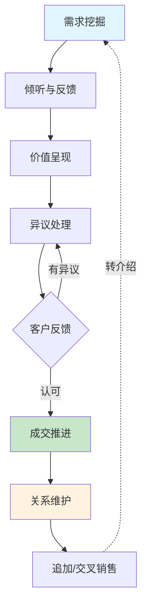

# 第十八章 销售与营销沟通 · 第二节 核心技巧

理论是地图，技巧是交通工具。第一节我们理解了 SPIN、FABE、顾问式销售、说服力六原则和客户决策心理学——这些是"道"。本节的任务是将"道"转化为可操作的"术"：面对一个活生生的客户，从开口的第一句话到售后的每一次跟进，你具体应该怎么做。

本节按照销售沟通的自然流程展开，从需求挖掘出发，经由倾听反馈、价值呈现、异议处理、成交推进，延伸到客户关系维护和追加销售，最后深入到高级话术设计的底层逻辑。每个环节都提供框架、模板、示例和常见错误，确保你不仅"知道"，还能"做到"。

***

## 一、需求挖掘提问技巧

需求挖掘是销售沟通的起点，也是区分普通销售和顶尖销售的分水岭。HubSpot 2024 年的调研显示，69% 的买家最反感"不理解我的需求就开始推荐产品"的行为。反过来说，那些能精准挖掘需求的销售人员，成交率平均高出同行 2.3 倍。

需求挖掘的核心原则是：**先诊断，后开方**。就像医生不会在不了解病情的情况下开药，销售人员也不应该在不了解需求的情况下推荐产品。

### 1. 漏斗式提问法

漏斗式提问法的核心逻辑是"从宽泛到具体，层层深入"，目的是逐步缩小范围，精准定位客户的核心需求。它对应 SPIN 框架中的情境问题和难题问题。

**第一层——开放式探索（对应 SPIN 的情境问题）**

这一层的目标是了解客户的现状、背景和大方向。问题要宽泛，让客户自由表达。

> - "您目前在这个方面是怎么做的？"
> - "对现有方案，您最满意和最不满意的地方分别是什么？"
> - "您今年在这个领域有什么重点目标？"
> - "团队目前面临的最大挑战是什么？"

**操作要点**：这一层不要急着深入，重点是建立全貌。用笔记本记录客户提到的关键词，这些关键词是后续深入挖掘的线索。高效销售人员在这一层通常使用 3-5 个开放式问题，不宜过多——雷克汉姆的研究表明，情境问题超过 5 个会让客户产生"被审问"的感觉。

**第二层——聚焦式挖掘（对应 SPIN 的难题问题）**

这一层的目标是引导客户表达具体的困难和不满。基于第一层获得的信息，选择最有价值的线索深入。

> - "您提到效率是个问题，具体体现在哪些环节？"
> - "这个问题存在多久了？之前尝试过什么解决方式？"
> - "这些尝试的效果如何？为什么没有完全解决？"
> - "如果满分 10 分，您对当前解决方案的满意度打几分？扣分的原因是什么？"

**操作要点**：这一层的关键是追问细节。客户说"效率低"，你要追问"低在哪里？是数据处理慢、审批流程长、还是跨部门协作不畅？"每一个模糊的描述背后都可能隐藏着一个具体的痛点。

**第三层——量化式确认（对应 SPIN 的暗示问题和需求-效益问题）**

这一层的目标是让客户自己量化问题的严重性，并表达对解决方案的期望。

> - "如果这个问题解决了，预计能节省多少成本/时间？"
> - "这个改善对您今年的 KPI 有多大的贡献？"
> - "如果不解决，半年后会是什么情况？"
> - "如果有一款工具能把这个时间缩短 70%，对您来说意味着什么？"

**操作要点**：量化是成交的催化剂。当客户说出"如果能省 30% 的成本，那就太好了"的时候，价值锚点已经建立。你后续的报价就有了参照系。

### 2. 5W2H 提问框架

5W2H 是一个全面覆盖问题各个维度的提问工具，特别适合初次拜访或需求梳理阶段。

| 维度 | 核心问题 | 示例 |
|------|----------|------|
| What | 解决什么问题 | "您希望解决什么问题？这个问题的核心表现是什么？" |
| Why | 为什么重要 | "这个问题为什么对您来说很重要？它跟您的哪些核心目标相关？" |
| Who | 影响谁、谁决策 | "谁会受到这个问题的影响？谁参与决策？最终拍板的是哪位？" |
| When | 时间节点 | "您希望在什么时间节点前解决？有没有硬性 deadline？" |
| Where | 发生在哪里 | "这个问题主要发生在哪个业务环节？哪个区域？" |
| How | 怎么解决 | "您之前尝试过哪些方式来解决？效果如何？" |
| How much | 代价多少 | "您为这个问题付出的代价大概有多少？包括时间、人力、资金" |

**使用技巧**：不需要每次拜访都问完所有 7 个维度。根据客户类型和沟通阶段灵活选择。B2B 场景中 Who（决策链）和 How much（预算）是必问项；B2C 场景中 Why（动机）和 When（时间节点）更关键。

### 3. SPIN 提问法实战整合

第一节已经介绍了 SPIN 的理论框架，这里将其与漏斗式提问法整合，给出一个完整的实战提问序列。以一家制造企业的 CRM 系统销售为例：

**S（情境）—— 了解现状**
> "王总，贵公司目前的客户管理是用什么系统在做？团队有多少人在用？"

**P（难题）—— 发现痛点**
> "在使用过程中，团队最常抱怨的是什么？数据同步方面有没有遇到困难？"

**I（暗示）—— 放大影响**
> "如果客户数据不准确，对您的销售预测会有什么影响？这种情况持续多久了？之前是否因为数据问题导致过丢单？"

**N（需求-效益）—— 引导期望**
> "如果有一套系统能让客户数据实时同步、自动生成销售预测报告，对您来说意味着什么？您打算把节省下来的时间投入到哪些方面？"

### 4. 反向提问法

反向提问法打破常规思路，从"不想发生什么"或"理想状态是什么"的角度切入，往往能更有效地打开客户的话匣子。

**"不解决"的代价提问**：
> - "如果不解决这个问题，半年后会是什么情况？"
> - "如果继续用现有方案，明年的目标能达成吗？"
> - "这个问题如果再拖一年，对团队士气会有什么影响？"

**"排除法"提问**：
> - "您觉得什么样的方案是您绝对不能接受的？"
> - "在您接触过的供应商中，最让您失望的是哪一家？为什么？"

**"理想状态"提问**：
> - "在您的理想中，最完美的解决方案应该是什么样的？"
> - "如果预算不受限，您最想改善的是哪个环节？"
> - "假设今天就把问题解决了，您明天第一件事会做什么？"

**操作要点**：反向提问特别适合两种场景——一是客户不愿正面回答问题时（绕过心理防线），二是需要帮客户明确需求边界时（排除法帮助缩小范围）。

### 5. 需求挖掘的常见错误

| 错误 | 表现 | 纠正 |
|------|------|------|
| 问题过多 | 连续问 10+ 个问题，客户感觉被审问 | 控制在 5-8 个核心问题，穿插倾听和反馈 |
| 只问不听 | 问完一个问题就急着问下一个，没有认真听回答 | 每个回答后停顿 2-3 秒，用复述确认理解 |
| 引导性过强 | "您是不是觉得效率很重要？"（暗示性太强） | 改为开放式："您觉得目前最需要改善的是什么？" |
| 跳过量化 | 挖掘到痛点就停止，没有量化影响 | 始终追问："这给您带来了多大的损失/影响？" |
| 忽视决策链 | 只跟对接人聊，不了解真正的决策者 | 直接问："这个决策还需要哪些人参与？" |

***

## 二、倾听与反馈技巧

提问是挖矿，倾听是淘金。你问出好问题只是第一步，能否从客户的回答中捕捉到关键信息，取决于你的倾听质量。Salesforce 的研究指出，高绩效销售人员的倾听能力比普通销售高出 2.3 倍。

### 1. 主动倾听的三个层次

**层次一：内容倾听——听清客户说了什么**

这是最基础的层次，要求你准确捕捉客户表达的事实和信息。

> - 不要打断客户的陈述
> - 用点头、"嗯""我明白"等表示在听
> - 在脑中或笔记中整理关键信息点
> - 注意客户提到的人名、数字、时间节点

**层次二：情感倾听——感受客户的情绪**

客户在表达时，除了传递信息，还在传递情绪。捕捉到情绪，你才能做出恰当的回应。

> - "听起来您对这个问题挺着急的"
> - "我能感受到这件事让您很困扰"
> - "您提到团队的时候，我能感觉到您对他们的关心"
> - 注意客户的语速变化、音量变化、停顿——这些都是情绪信号

**层次三：意图倾听——理解客户话背后的真实意图**

这是最高层次的倾听，要求你听懂客户的"弦外之音"。

| 客户说的 | 可能的真实意图 |
|----------|---------------|
| "价格太贵了" | "我还没有看到足够的价值" / "我的预算确实有限" / "我想砍价" |
| "我再考虑考虑" | "我还有顾虑没有表达" / "我需要跟其他人商量" / "我其实不太感兴趣" |
| "你们的产品跟 XX 比怎么样" | "我需要一个选你的理由" / "XX 给了我更低的报价" |
| "能不能再便宜点" | "我有意向，但需要确认价格是底线" / "我在试探你的价格弹性" |
| "你们的售后怎么样" | "我之前被售后坑过" / "这个产品我担心学不会" |

**操作要点**：意图倾听不是猜测，而是基于上下文的推理。如果你不确定客户的真实意图，最安全的做法是直接确认："我理解您的意思是……对吗？"

### 2. 确认与复述技巧

确认和复述不是简单的"鹦鹉学舌"，而是向客户证明"我听懂了你"，同时给自己争取思考时间的高级技巧。

**复述**——用自己的话重新表述客户的核心意思：
> "您的意思是，目前的数据整合主要靠手动完成，每个月大概要花 3 天时间，对吗？"

**总结**——在客户表达完一个完整观点后，做一个结构化总结：
> "我来确认一下，您目前主要关注三个方面：第一，数据整合的效率问题；第二，跨部门协作的流程问题；第三，系统的学习成本。对吗？"

**追问**——对客户提到的某个关键词或细节进行深入：
> "您刚才提到'团队配合不太好'，能再展开说说是什么情况吗？是沟通不畅还是职责不清？"

**情感确认**——回应客户的情绪，而不只是内容：
> "听起来这件事确实让您挺头疼的。换了谁遇到这种情况都会觉得棘手。"

### 3. 沉默的力量

这是一个被严重低估的技巧。提出重要问题后，给客户足够的思考时间。不要急于填补沉默——沉默往往意味着客户在认真思考，而你的打断可能让一个有价值的回答胎死腹中。

**数据支撑**：哈佛商学院的研究表明，销售对话中等待 3-5 秒再开口，往往能获得更有深度、更有价值的回答。而大多数销售人员在提出问题后不到 2 秒就会自己接话。

**实践方法**：
1. 提出一个重要的暗示问题或需求-效益问题后，在心里默数"一、二、三"
2. 如果客户还在思考，继续保持关注的表情，不要说话
3. 如果沉默超过 8 秒，可以用温和的语气说"不着急，您可以想想"
4. 特别是在成交请求后，提出请求然后闭嘴——很多销售人员因为紧张而在成交后不断说话，反而给了客户犹豫的理由

***

## 三、产品价值呈现技巧

挖掘完需求，下一步是向客户呈现你的解决方案的价值。这一步的核心挑战是：客户不关心你的产品"有什么"，只关心"对我有什么用"。

### 1. 从特征到价值的转换公式

FABE 法则告诉我们，产品介绍必须完成从 F（特征）到 B（利益）的转换。实操中，有一个简单的公式：

价值呈现 = 特征 + 客户场景 + 具体收益

| 错误示范 | 问题 | 正确示范 |
|----------|------|----------|
| "我们的产品采用了最新的 AI 技术" | 只说了特征，没有价值 | "我们的 AI 可以自动分析您的数据，帮您把每月报表生成时间从 3 天缩短到 2 小时" |
| "我们的系统响应速度很快" | 模糊，没有量化 | "系统查询响应在 200ms 以内，即使百万级数据量也不会卡顿，您的团队不用再等报表加载" |
| "我们有专业的售后团队" | 空洞，没有差异化 | "我们提供 7×24 小时专属客户经理，平均响应时间 15 分钟，过去一年客户满意度 98.6%" |

### 2. 故事化呈现

神经科学研究表明，人类大脑对故事的记忆效率是纯数据的 22 倍（斯坦福大学研究）。将产品价值融入客户成功故事中，是最高效的呈现方式。

**故事模板**：

> "之前有一家跟您情况很类似的公司——[公司名/行业]，他们也面临[具体问题]。在使用我们的方案后，[具体时间]内实现了[具体改善]。他们的[负责人]跟我说，'[一句客户原话]'。"

**完整示例**：
> "上个月，XX 连锁零售的张总跟您说了几乎一模一样的话——他们的 30 家门店库存数据每天不同步，经常出现有的店缺货、有的店积压的情况。我们帮他们部署了实时库存同步系统后，第一个月库存周转率就提升了 25%，缺货率从 8% 降到了 1.2%。张总跟我说，'早知道这么好用，我去年就该上这个系统了。'"

**操作要点**：
- 故事要真实、具体、有细节——模糊的故事没有说服力
- 最佳组合是"故事 + 数据"：故事打动人，数据说服人
- 故事中的客户最好跟当前客户是同行业、同规模、同痛点
- 如果没有真实案例，可以用行业数据和趋势来替代，但不要编造

### 3. 对比呈现法

对比是最直观的价值放大器。人类对差异的感知远强于对绝对值的感知。

**使用前 vs 使用后**：
> "之前您需要 3 个人花 2 天完成的工作，使用后 1 个人半天就能搞定。按每人每天 800 元的人力成本算，每月可以节省约 7680 元。"

**您的现状 vs 同行的现状**：
> "您的同行中，有 80% 已经采用了类似的自动化方案。他们的平均人效比还在用传统方式的企业高出 40%。"

**投入 vs 回报**：
> "这套系统年费 12 万，但按照我们帮同类企业节省的成本来算，平均 4 个月就能回本，之后每年净省 25 万以上。"

### 4. 可视化呈现

"一图胜千言"在销售场景中同样成立。

| 呈现方式 | 适用场景 | 操作要点 |
|----------|----------|----------|
| ROI 计算表 | B2B 方案销售 | 用 Excel 做一个交互式计算器，输入客户的实际数据，自动生成回报预测 |
| 现场演示 | 软件/工具类产品 | 提前准备好客户的实际数据，在演示中展示真实效果 |
| 原型/样品 | 实物产品 | 让客户亲手触摸、操作，产生"拥有感" |
| 对比图表 | 竞品对比 | 用表格或雷达图展示各维度的差异，一目了然 |
| 视频案例 | 远程销售 | 2-3 分钟的客户成功故事视频，比 PPT 更有感染力 |

### 5. 价值呈现的时机把控

价值呈现不是一次性动作，而是贯穿整个销售过程的持续行为。

- **初次接触**：用一句话价值主张勾起兴趣（"帮您把报表时间从 3 天缩短到 2 小时"）
- **需求确认后**：针对具体痛点做定向价值呈现（"您提到的数据整合问题，我们的方案可以这样解决……"）
- **方案演示时**：用客户的实际场景展示效果（"我们用您提供的数据做了一个 demo……"）
- **异议处理时**：用价值对比化解价格异议（"投入 12 万，但每年能省 25 万……"）
- **成交前**：总结所有已确认的价值点，形成"价值清单"

***

## 四、异议处理话术

客户提出异议不是坏事——恰恰相反，异议说明客户在认真考虑。没有异议的客户往往是没有兴趣的客户。处理异议的能力是区分普通销售和优秀销售的关键分水岭。

### 1. 异议的本质与分类

在处理异议之前，首先要理解异议的本质。客户提出异议通常出于以下四种原因：

| 异议类型 | 本质 | 表现 |
|----------|------|------|
| 真实异议 | 客户确实有合理的顾虑 | 价格超出预算、功能不匹配需求 |
| 假性异议 | 客户用借口掩盖真实顾虑 | "我再想想"（实际是没看到价值） |
| 试探性异议 | 客户在试探你的底线或诚意 | "能不能再便宜点？" |
| 习惯性异议 | 客户习惯性地对所有推销说"不" | 任何话题都先否定 |

**区分方法**：对于假性异议，追问一句就能辨真伪："除了这个因素，还有其他会影响您决定的吗？"如果客户能说出更多理由，说明是真实异议；如果说不出或犹豫，说明第一个理由可能是借口。

### 2. LSCPA 异议处理框架

LSCPA 是一个系统化的异议处理框架，比 Feel-Felt-Found 更具操作性：

- **L（Listen）—— 倾听**：认真听完客户的异议，不打断
- **S（Share）—— 认同**：表达理解和认同（不是同意，是理解）
- **C（Clarify）—— 澄清**：确认异议的具体内容，排除误解
- **P（Present）—— 提出方案**：有针对性地给出回应
- **A（Ask）—— 请求行动**：确认回应是否解决了顾虑，推进下一步

**完整示例**：

> 客户："你们的价格比竞品高了 30%。"
>
> **L**（倾听）：认真听完，不急于回应。
>
> **S**（认同）："我完全理解，价格确实是重要的考量因素。在做采购决策时，性价比是必须认真评估的。"
>
> **C**（澄清）："您提到的竞品是指 XX 公司的产品吗？方便说说您主要对比了哪些方面？"
>
> **P**（方案）："我理解了。表面上看我们的报价确实高一些，但如果您对比总拥有成本（TCO）——包括实施成本、培训成本、维护成本和故障损失——我们的方案在三年内的总投入反而比竞品低 15%。我这边有一份详细的 TCO 对比分析，稍后发给您参考。"
>
> **A**（行动）："您看完对比分析后，如果还有疑问我们随时沟通。如果数据没有问题，我们可以安排一次技术团队的演示，您看下周方便吗？"

### 3. Feel-Felt-Found 方法

这是一个经典且高效的异议处理框架，特别适合电话销售和快速回应场景：

- **Feel（感受）**："我完全理解您的感受……"
- **Felt（曾经）**："之前很多客户也有过同样的顾虑……"
- **Found（发现）**："但他们在使用后发现……"

**示例**：
> 客户："你们的价格比竞品高了 30%。"
>
> 销售："我完全理解您的感受，价格确实是重要的考量因素（Feel）。之前 XX 公司的王总在初次接触时也有同样的顾虑（Felt）。但他在实际使用半年后发现，因为我们的方案减少了 40% 的维护成本和 50% 的故障率，实际总投入反而比用竞品低了 15%（Found）。"

### 4. 常见异议应对模板

以下列出销售中最常见的六类异议，每类提供应对思路、完整话术和注意事项：

**异议一："太贵了"**

这是最常见的异议，也是最需要谨慎处理的异议——因为它可能有多种含义。

应对思路：先认可，再分解价值，最后对比总拥有成本。

> "我理解您的顾虑，价格确实是重要的考量因素。方便问一下，您是跟什么方案在做对比呢？……好的，了解了。表面上看我们的年费确实高一些，但您看——如果算上实施成本（我们免费提供）、培训成本（我们有专属客户成功经理）、以及因为系统稳定性提升带来的故障损失减少，三年下来的总投入是 XX 万，比您提到的竞品反而低 15%。另外，按照帮同类客户节省的成本来算，4 个月就能回本。"

**注意事项**：不要急于打折。打折传递的信号是"你之前报的是虚价"，损害信任。先穷尽价值论证，实在需要调整价格时，用"减配降价"而非直接打折。

**异议二："我再想想"**

应对思路：了解真正的顾虑，提供针对性信息。

> "完全理解，这是一个需要认真考虑的决定。为了让您的考虑更有针对性，方便说说您目前主要在考虑哪些方面吗？是预算、实施周期、还是对产品功能还有疑问？"

**注意事项**："我再想想"通常是假性异议。客户不是真的要"想想"，而是有未表达的顾虑。追问是关键。

**异议三："我们已经有供应商了"**

应对思路：不否定现有选择，展示差异化价值。

> "XX 公司确实是不错的选择，说明您对这个领域很重视。我今天不是要您更换供应商，而是想跟您分享一个我们最近帮类似企业解决的新问题——他们之前也用 XX 的方案，但在 XX 方面遇到了瓶颈。不知道贵公司有没有遇到类似的情况？"

**注意事项**：不要贬低竞品。贬低竞品会降低你在客户心中的专业形象。

**异议四："我不确定能不能用好"**

应对思路：提供培训支持、试用期、成功案例。

> "这个顾虑很正常，很多客户在初期也有同样的担心。我们提供三个保障：第一，免费的全员培训，确保每个人都会用；第二，30 天无理由退款，用不好全额退；第三，专属客户成功经理全程陪跑，任何问题随时响应。目前我们的客户培训后上手率是 97%。"

**异议五："我需要请示领导"**

应对思路：提供可以帮助客户内部汇报的材料。

> "理解，这种决策确实需要团队共识。这样，我帮您准备一份简版的方案摘要和 ROI 分析，方便您向领导汇报。另外，如果方便的话，我们可以安排一次给决策层的简短演示，这样领导也能直接了解方案的价值。您觉得哪种方式更好？"

**异议六："你们是新品牌/小公司，不太放心"**

应对思路：用第三方背书和保障机制降低感知风险。

> "理解您的顾虑，选择合作伙伴确实需要谨慎。虽然我们品牌成立时间不长，但我们的核心团队来自 XX（知名企业），拥有 XX 年行业经验。目前已服务 XX 家客户，包括 XX、XX（行业标杆）。另外，我们提供 XX 保障条款，如果达不到约定效果，您可以全额退款。"

### 5. 异议预防策略

最高级的异议处理是预防——在客户提出异议之前，主动消除潜在顾虑。

| 潜在顾虑 | 预防措施 |
|----------|----------|
| 价格太高 | 在呈现价值时就做 ROI 计算，让客户在看到报价前已经建立价值认知 |
| 担心效果 | 提前展示同行业案例和数据，用试用期降低风险感知 |
| 实施困难 | 主动介绍实施流程和培训支持，展示"简单易用"的证据 |
| 售后无保障 | 主动展示服务 SLA、客户成功团队、响应时效 |
| 竞品更优 | 提前准备竞品对比材料，突出差异化优势 |

***

## 五、成交技巧

成交是销售沟通的临门一脚。很多销售人员在前几个环节做得很好，却在最后一步功亏一篑——要么不敢开口，要么用错时机，要么方法不当。成交的本质不是"让客户掏钱"，而是"帮助客户做出他已经准备好的决定"。

### 1. 识别成交信号

在使用任何成交技巧之前，首先要确认客户是否已经准备好做决定。过早成交会让客户反感，过晚会错失机会。

**语言信号**：
- 开始询问具体细节："实施周期是多久？""培训怎么安排？""合同条款有哪些？"
- 使用"我们"而非"你们"："我们什么时候可以开始？""我们的团队需要提前准备什么？"
- 主动询问下一步流程："接下来我需要做什么？"
- 讨论预算细节："这个费用是一次性付还是分期？"

**非语言信号**（面对面场景）：
- 身体前倾，表示兴趣浓厚
- 频繁点头，表示认同
- 认真翻看资料或合同
- 与同伴交换眼神，似乎在征询意见
- 放下手机，全神贯注

### 2. 十种成交方法

**方法一：假设成交法**

假设客户已经决定购买，自然地推进后续步骤。适用于客户已表达明确意向但未正式确认时。

> "您看我们是安排下周还是下下周开始实施？"
> "合同我这边准备好发给您，您方便的邮箱是？"
> "我先帮您预留一个实施排期，您确认后随时可以启动。"

**方法二：二选一法**

不问"要不要买"，而是给两个都指向成交的选择。利用选择心理学——当人们面对两个选项时，倾向于选一个而不是拒绝两个。

> "您倾向于标准版还是专业版？"
> "我们先从 A 模块开始，还是 B 模块？"
> "您希望签一年还是两年？两年有额外 10% 的折扣。"

**方法三：总结成交法**

总结客户确认的所有价值点，然后自然过渡到成交。适用于长周期、多轮沟通的 B2B 销售。

> "我们刚才确认了三点：第一，它能解决您的数据整合问题，预计每月节省 40 小时；第二，系统的自动化报表可以帮您把决策周期缩短一半；第三，我们提供完整的培训和 7×24 售后支持。这样，我这边帮您安排签约流程？"

**方法四：紧迫感成交法**

制造合理的紧迫感。注意：必须是真实的稀缺性，虚假紧迫感一旦被识破，信任将荡然无存。

> "这个优惠名额只剩下最后 3 个了"
> "如果您希望在 Q3 前上线，我们需要在本月启动项目"
> "原材料价格下个月会调价，现在签约可以锁定当前价格"
> "我们的实施排期目前还有空档，下个月开始就排满了"

**方法五：试探性成交法**

通过低压力的试探来判断客户的购买意愿。适用于不确定客户态度时。

> "如果价格方面我们能达成一致，您是否就可以做决定了？"
> "还有什么其他因素会影响您的决策吗？"
> "如果技术团队的演示没问题，我们是不是可以进入合同阶段了？"

**方法六：沉默成交法**

在提出成交请求后，保持沉默。这是最简单但最难执行的技巧——因为人的本能是用说话来填补紧张的沉默。

> （提出成交请求后，闭嘴，等待客户回应。）

**操作要点**：提出请求后，在心里默数"一、二、三、四、五"。如果客户没有立刻回应，不要说话——他们在思考。你的任何补充都可能打断他们的决策过程。

**方法七：故事成交法**

用类似客户的故事来推动决策。适用于客户犹豫不决时。

> "之前有位客户跟您情况很像，他当时也犹豫了。后来他决定试试看，结果第一个月就看到了效果。他说最庆幸的就是当时做了这个决定。"

**方法八：反向成交法**

通过"劝退"来激发客户的购买意愿。适用于客户有意向但缺乏最后推力时。

> "说实话，如果您的情况确实如我了解的这样，我觉得这个方案非常适合您。但如果您团队的使用率不高，我反而建议您先不要投入。您觉得您的团队会积极使用吗？"

**方法九：让步成交法**

在非价格条件上做出让步，换取客户当场签约。适用于客户已经认可价值但想再"要点好处"时。

> "价格方面确实没有空间了，但如果您今天能确认，我可以申请给您免费延长 3 个月的售后服务期。"

**方法十：小步推进法（微承诺法）**

将大决策分解为一系列小步骤，每一步都降低客户的心理压力。适用于复杂决策或多个决策者参与的场景。

> "这样，我们先安排一次免费的技术评估，看看您的环境是否适合部署。评估不收费，也不构成任何承诺。评估完之后，我们再讨论下一步。"

### 3. 成交时机的选择

成交不是"随时都可以"的行为。最佳成交时机通常出现在以下时刻：

- **客户主动询问价格或合同细节时**——说明客户已经在认真考虑
- **成功处理完一个重大异议后**——客户的顾虑被消除，决策障碍降低
- **价值呈现获得客户强烈认同时**——客户说"这正是我需要的"
- **演示或试用结束后，客户表示满意时**——体验是最好的说服力
- **客户表达了明确的时间需求时**——"我希望下个月能上线"

### 4. 成交失败后的处理

不是每次成交尝试都能成功。成交被拒后，正确的处理方式至关重要：

1. **不要慌张或沮丧**——这很正常，不是否定你这个人
2. **确认真正的障碍**——"我理解，方便说说是什么让您还没有做决定吗？"
3. **尊重客户的节奏**——"没问题，您可以再考虑一下。我下周三再跟您联系，看看有没有新的进展？"
4. **保持联系但不纠缠**——提供有价值的信息（行业报告、新功能更新），维持关系热度
5. **复盘改进**——分析这次成交失败的原因，是时机不对、方法不对、还是需求挖掘不到位

***

## 六、客户关系维护

成交不是销售的终点，而是长期关系的起点。哈佛商业评论的研究表明，获取新客户的成本是维护老客户的 5-25 倍，而老客户的推荐转化率比陌生开发高 3-5 倍。客户生命周期价值（CLV）的概念告诉我们，一次成交只是冰山一角。

### 1. 售后跟进节奏

售后跟进不是"有空再联系"，而是需要系统化的节奏规划：

| 时间节点 | 跟进内容 | 目的 |
|----------|----------|------|
| 成交后 1 天 | 发送感谢信息，确认后续安排 | 让客户感受到重视，减少"买后焦虑" |
| 成交后 3 天 | 确认产品/服务已收到或已部署 | 及时发现物流或实施问题 |
| 成交后 1 周 | 主动联系，了解使用情况，解答疑问 | 确保客户顺利上手，建立使用习惯 |
| 成交后 2 周 | 分享使用技巧或最佳实践 | 提升客户使用深度，增加粘性 |
| 成交后 1 个月 | 正式回访，收集使用体验和反馈 | 发现问题及时解决，收集好评素材 |
| 成交后 3 个月 | 分享行业资讯，提供增值建议 | 保持关系热度，为追加销售铺垫 |
| 定期 | 节日问候、生日祝福、行业分享 | 维持长期关系，不被遗忘 |

**操作要点**：每次跟进都要提供价值，而不是"只是问问"。分享一篇行业报告、一个使用技巧、一条有用信息——让客户期待你的联系，而不是觉得你在"刷存在感"。

### 2. 客户分层管理（ABC 法则）

不是所有客户都值得投入同样的精力。用 ABC 法则对客户进行分层管理：

| 层级 | 标准 | 维护策略 | 沟通频率 |
|------|------|----------|----------|
| **A 类客户** | 高价值、高潜力、已复购或有复购意向 | 专属客户经理、定期面对面沟通、VIP 服务、优先响应 | 每周至少 1 次 |
| **B 类客户** | 中等价值、有潜力提升 | 定期电话/微信跟进、提供专属优惠、邀请参加活动 | 每 2 周 1 次 |
| **C 类客户** | 低频客户、一次性购买 | 通过邮件、社群维护关系、节日问候 | 每月 1 次 |

**动态调整**：客户的层级不是固定的。C 类客户可能因为业务增长变成 A 类，A 类客户也可能因为人员变动变成 C 类。每季度重新评估一次客户层级。

### 3. 转介绍培养

满意的客户是最好的销售员。但转介绍不会自动发生——你需要主动创造条件。

**最佳请求时机**：
- 客户主动表达满意时（"这个方案效果很好"）
- 客户获得显著成果时（"我们的效率提升了 30%"）
- 完成一个重要里程碑时（上线成功、续约完成）

**请求话术**：
> "很高兴这个方案对您有帮助。如果您身边也有朋友面临类似的挑战，我很乐意也为他们提供帮助。当然，我一定会像服务您一样用心。"

**激励机制**：
- 推荐返利或折扣
- 推荐积分制度
- 推荐成功后的感谢礼物
- 在行业内公开感谢（征得同意后）

### 4. 客户流失预警

识别即将流失的客户比挽回已流失的客户容易 10 倍。关注以下预警信号：

- 互动频率明显下降
- 不再回复消息或电话
- 续约前 3 个月仍未讨论续约事宜
- 客户内部关键联系人离职
- 客户开始询问竞品信息

**应对策略**：一旦发现预警信号，立即启动"客户挽回流程"——由高层出面沟通、提供特别优惠、安排深度回访了解问题。

***

## 七、追加销售与交叉销售

追加销售（Upselling）和交叉销售（Cross-selling）是提升客户生命周期价值的核心手段。研究表明，向现有客户销售的成功率是 60-70%，而向新客户销售的成功率只有 5-20%。

### 1. 追加销售（Upselling）

向客户推荐更高级的产品或服务。

**最佳时机**：
- 客户使用产品获得良好体验后
- 客户的需求超出了当前版本的能力
- 客户即将续约时
- 产品发布新版本或新功能时

**话术框架**：
> "您目前使用的是标准版，数据量在 XX 以内完全没有问题。不过我注意到您的数据量在持续增长，如果下个季度超过 XX，标准版可能会有性能瓶颈。升级到专业版不仅能解决这个问题，还能获得 XX 功能，特别适合您这种使用场景。现在升级还有 XX 优惠。"

**操作要点**：追加销售的推荐必须基于客户的真实需求和使用数据，而非"我觉得你需要"。盲目推荐会损害信任。

### 2. 交叉销售（Cross-selling）

向客户推荐相关产品或服务。

**最佳时机**：
- 客户购买核心产品后
- 客户在使用中遇到相关领域的问题时
- 行业活动或产品发布会后

**话术框架**：
> "很多购买了我们 A 产品的客户，也会搭配使用 B 产品。因为两者结合使用效果会提升 XX%——A 产品生成的数据，B 产品可以直接用于 XX 场景，省去了手动导入的步骤。"

### 3. 追加/交叉销售的红线

| 红线 | 原因 |
|------|------|
| 客户还没有体验到核心产品价值时就追加销售 | 客户会觉得你只想赚更多钱 |
| 推荐的产品对客户没有明确的额外价值 | 损害信任，降低复购意愿 |
| 在客户投诉或不满时推荐新产品 | 时机完全错误，火上浇油 |
| 频繁推荐，每次都带销售目的 | 客户会觉得每次联系你都是被推销 |

**核心原则**：追加销售和交叉销售必须基于客户的真实需求，而非单纯追求销售额。每一次推荐都应该是"为了客户好"，而不是"为了你自己的业绩"。

***

## 八、高级话术设计与应用

优秀的话术不是机械的套路，而是基于心理学原理的系统性表达设计。话术的核心在于三个要素的平衡：**信息传递、情感连接、行动引导**。

### 1. 话术设计的底层逻辑

**话术设计的黄金公式**：

有效话术 = 痛点共鸣 + 价值锚定 + 行动引导

- **痛点共鸣**：用客户的语言描述他们的困境，让客户感到"你理解我"
- **价值锚定**：用具体、可量化的方式呈现解决方案的价值
- **行动引导**：用低压力的方式引导客户迈出下一步

**示例**：
> "很多制造企业的生产主管都跟我说，每天最头疼的就是月底对账——3 个财务人员花 2 天才能核对完，还经常出错（痛点共鸣）。我们的自动对账系统可以把这个时间缩短到 2 小时，准确率 99.9%（价值锚定）。如果您感兴趣，我们可以安排一次免费的现场演示，用您的实际数据跑一遍（行动引导）。"

### 2. 开场白设计

开场白决定了客户是否愿意继续与你交流。优秀的开场白需要在 30 秒内完成三件事：建立连接、说明来意、创造价值预期。

| 策略 | 话术示例 | 适用场景 |
|------|----------|----------|
| 利益驱动 | "王总，我注意到贵公司最近在扩展华南市场，我们帮 XX 公司在类似情况下 3 个月内获得了 2000 个精准客户" | B2B 开拓，客户有明确业务目标 |
| 问题引导 | "李总，很多像您这样的制造企业都面临库存周转率低的问题，您有同感吗？" | 痛点明确的行业 |
| 转介绍 | "我是 XX 推荐的，他说您可能对我们刚帮他们实施的降本方案感兴趣" | 有推荐人时，信任度最高 |
| 行业洞察 | "张总，我刚看到贵行业的最新政策变化，这对供应链管理可能会有影响，想跟您交流一下" | 建立专业形象，适合首次接触 |
| 成果展示 | "王总，上个月我们帮 XX 行业的三家企业节省了合计 120 万的运营成本，方法很简单，想花 3 分钟跟您分享一下" | 电话销售，需要快速抓住注意力 |

**开场白禁忌**：
- "请问您现在方便吗？"——给客户说"不方便"的机会
- "我是 XX 公司的小张，我们是一家专注于……"——客户不关心你是谁
- "打扰了"——自我贬低，降低专业形象

### 3. 价值描述话术进阶

**场景化描述法**——让客户"看到"使用后的画面：

> "想象一下，您的团队每天早上打开系统，昨晚的销售数据已经自动汇总好了，需要的报表已经生成完毕，异常订单已经标红提醒。他们可以把节省下来的两个小时用在真正需要创造力的工作上。"

**数据锚定法**——用具体数字建立价值参照：

> "我们帮 XX 公司在实施后的第一个季度，将运营成本从每月 120 万降到了 87 万，节省了 27.5%。按照这个比例，以贵公司的规模，每年可以节省约 400 万。"

**对比锚定法**——用参照物让价值更直观：

> "这套系统的年费是 12 万，相当于每天 330 元——比您团队每天的下午茶费用还少。但它能帮您节省的人力成本，是这个数字的 20 倍。"

### 4. 异议处理的高级话术

**"是的，而且"法**（替代"是的，但是"）：

"但是"会否定前面的认同，让客户觉得你在反驳他。用"而且"替代，既保持认同，又引入新信息。

> 普通回应："是的，但是我们的产品确实物有所值。"
> 高级回应："是的，价格确实是一个重要的考量因素。而且，当您考虑到它能帮您节省的人力成本和时间成本，您会发现它实际上是目前市场上性价比最高的方案。"

**"暂停-复述-回应"法**：

当客户提出异议时，不要急于回应。先暂停 2 秒，复述客户的异议以确认理解，然后再给出有针对性的回应。

> 客户："你们的方案实施周期太长了。"
> （暂停 2 秒）
> "您是担心实施周期会影响到项目进度，对吗？"
> （确认后回应）
> "我理解。实际上，我们的标准实施周期是 4 周，但如果您有紧急需求，我们可以安排快速通道，最快 2 周内完成核心模块的部署。"

**"如果……那么"假设法**：

将大决策分解为小的假设性承诺，降低客户的心理压力。

> "如果我能证明这个方案在三个月内可以收回成本，您是否愿意进一步讨论合作细节？"
> "如果我们能提供 30 天的免费试用，您是否愿意先让团队体验一下？"

### 5. B2B 与 B2C 的话术差异

| 维度 | B2B 话术要点 | B2C 话术要点 |
|------|-------------|-------------|
| 语言风格 | 专业、正式、数据驱动 | 简洁、亲切、场景化 |
| 价值论证 | ROI、效率提升、风险控制 | 情感体验、个人需求满足 |
| 决策影响 | 需要说服多个角色（技术、业务、管理层） | 主要说服购买者本人 |
| 时间尺度 | 强调长期价值和战略意义 | 强调即时效果和体验 |
| 案例选择 | 同行业、同规模的企业案例 | 同类型用户的个人故事 |

### 6. 话术的自我检验清单

每次设计或使用话术后，用以下清单自检：

- [ ] 是否以客户为中心（而非以产品为中心）？
- [ ] 是否包含了具体的数字或案例（而非空洞的形容词）？
- [ ] 是否与客户的当前阶段匹配（认知期用教育型话术，决策期用促成型话术）？
- [ ] 是否留有余地（给客户思考和选择的空间，而非逼迫）？
- [ ] 是否有明确的下一步行动引导（而非开放式结尾）？
- [ ] 是否真实可信（不夸大、不编造）？

***

> **本节核心要义**：销售沟通的每一个技巧都不是孤立存在的。需求挖掘为价值呈现提供素材，倾听为异议处理提供依据，异议处理为成交扫清障碍，成交后的关系维护为追加销售和转介绍创造条件。将这些技巧串联成一个完整的闭环，你才能从"会一招半式"进化为"系统化作战"。
