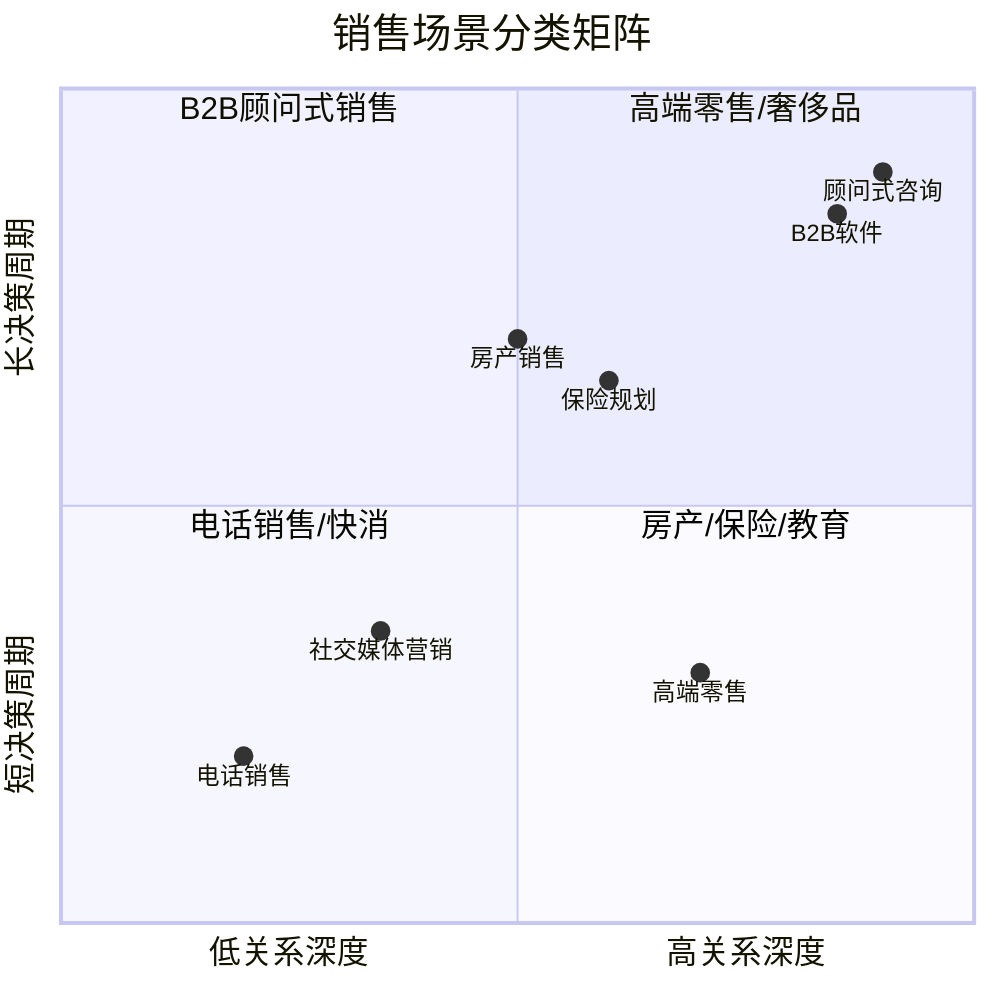
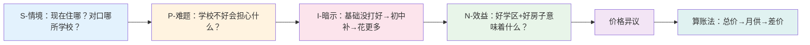
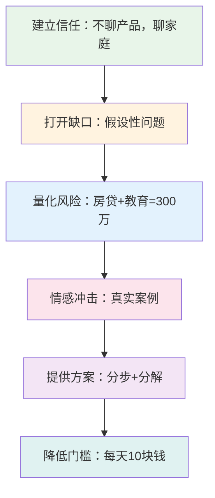
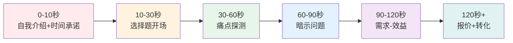
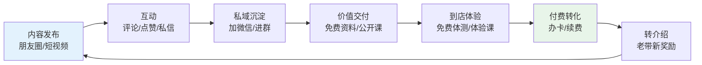
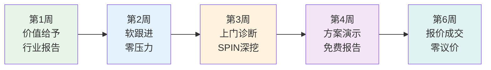

# 第十八章 销售与营销沟通 · 第三节 实战案例

理论和技巧的生命力在于实战。本节通过 **七大真实场景** 的完整对话实录与深度拆解，将前两节的 SPIN 提问法、异议处理、成交技巧等框架放进真实语境中检验。每个案例包含背景设定、对话实录、逐轮技巧标注、心理学机制分析，以及常见翻车点警示。最后以失败案例收尾，帮助你识别"看起来对、实际错"的沟通陷阱。

---

## 一、案例分类总览

在进入具体案例之前，先建立一个全局视角。销售与营销沟通的场景可以按 **决策周期** 和 **关系深度** 两个维度分类：

| 场景类型 | 决策周期 | 关系深度 | 核心挑战 | 对应案例 |
|----------|----------|----------|----------|----------|
| 电话销售 | 极短（1-3分钟） | 低 | 开场30秒抓住注意力 | 案例五 |
| 社交媒体营销 | 短（1-7天） | 中低 | 内容→私域→到店转化 | 案例六 |
| 高端零售 | 短-中（单次到店） | 中 | 体验感与身份认同 | 案例四 |
| 房产销售 | 中（1-4周） | 中 | 价格异议与价值重塑 | 案例一 |
| 保险规划 | 中-长（1-3月） | 中高 | 风险意识唤醒 | 案例三 |
| B2B软件 | 长（1-6月） | 高 | 多决策人、长链路 | 案例二 |
| 顾问式咨询 | 长（1-6月+） | 极高 | 信任建立与价值锚定 | 案例七 |

理解这个矩阵的意义在于：**不同场景需要不同的节奏和策略重心**。电话销售必须在30秒内制造吸引力，而顾问式销售可能需要6周才能完成第一次报价。用错节奏是新手最常见的错误——在该慢的场景里急躁推进，或在该快的场景里慢热铺垫。

---

## 二、案例一：房产销售——SPIN提问化解价格异议

### 背景设定

张先生夫妇，35岁左右，有一个5岁的孩子，看中了一套学区房，总价680万，比预算高出80万。这是典型的 **中长周期、中关系深度** 场景：客户有明确需求（学区），但价格是核心障碍。

### 完整对话实录

**销售顾问**：张先生、张太太，欢迎！今天咱们一起看看这套房子。不过在看房之前，我想先了解一下，您们现在住在哪里？主要是什么原因考虑换房呢？

> **技巧标注：开场不急于展示产品，先用开放式问题了解客户背景和动机。这是"先诊断、后开方"的原则。**

**张太太**：我们现在住在XX小区，主要是孩子明年要上小学了，想找个好学区。

**销售顾问**：明白了，为了孩子的教育，这个考虑非常重要。那您们对学区有什么具体的要求吗？

**张先生**：最好是XX小学的学区，听说教学质量很好。

**销售顾问**：（情境问题）XX小学确实是咱们区排名前三的学校。那您们现在住的小区对口的是哪所学校呢？

> **技巧标注：SPIN中的S（Situation）——确认现状，为后续的"难题问题"做铺垫。注意销售顾问没有直接介绍房子，而是继续深入了解。**

**张太太**：对口的是XX小学，教学质量一般。

**销售顾问**：（难题问题）那如果孩子去了不太理想的学校，您们会有什么担心？

> **技巧标注：SPIN中的P（Problem）——引导客户自己说出痛点。关键在于"如果……会有什么担心"这个假设句式，它让客户主动表达担忧，而不是销售顾问强加焦虑。**

**张先生**：主要是怕教学质量和学习氛围跟不上，现在竞争这么激烈。

**销售顾问**：（暗示问题）确实，小学阶段的学习习惯和环境对孩子影响很大。如果小学基础没打好，到初中再想补回来，可能要花更多的时间和金钱。您觉得呢？

> **技巧标注：SPIN中的I（Implication）——将单点问题扩展为连锁影响。注意话术结构："如果A没做好→到B阶段再补→要花更多C"。这是暗示问题的标准模板：把小问题放大为系统性风险。**

**张太太**：是的，这也是我们下决心换房的原因。

**销售顾问**：（需求-效益问题）那如果有一套房子，既能让孩子进入XX小学，又能满足您们一家人的居住需求，这对您们来说意味着什么？

> **技巧标注：SPIN中的N（Need-payoff）——让客户自己说出解决方案的价值。注意问题的开放性："意味着什么"比"好不好"更能激发客户的情感共鸣。**

**张先生**：那当然好，就是价格超出预算了。

> **关键时刻：客户亮出价格异议。这是成交前的必经之路——当客户开始讨论价格而非犹豫要不要买时，说明购买意愿已经很强。**

**销售顾问**：我理解您的顾虑。不过咱们算一笔账——您现在的房子大概值多少？

**张先生**：大概500万左右。

**销售顾问**：那置换的话，您需要额外承担180万。按现在的贷款利率，月供大概在8000左右。而XX学区的房租大概在6000-7000。也就是说，您每月只需多付出1000-2000元，就能让孩子进入最好的学区，同时拥有自己的房子。从长期来看，学区房的保值增值能力也是最强的。您觉得这个投入产出比怎么样？

> **技巧标注：价格异议处理的"算账法"——将总价拆解为月供，再与租房成本做对比，将180万的"巨额支出"转化为每月1000-2000元的"小额差价"。这同时运用了三个心理学原理：①锚定效应（用租房价格做参考点）；②框架效应（从"多花80万"变成"每月多付1000元"）；③损失厌恶（不买的话，孩子错过好学校的机会成本）。**

**张先生**：（思考）你这么一算，确实合理多了。

### 深度复盘

**SPIN提问的完整路径**：

**关键成功要素**：

1. **需求锚定在孩子教育而非房子本身**。整个对话中，销售顾问从未介绍房子的面积、户型、装修——因为对这对夫妇来说，房子只是实现教育目标的载体。如果销售顾问一上来就介绍"这套房子三室两厅、南北通透"，客户的第一反应就是"好是好，但太贵了"。

2. **让客户自己说出价值**。SPIN的核心不是销售顾问说服客户，而是通过提问引导客户自己得出结论。张太太说"这也是我们下决心换房的原因"——这句话是她自己说的，比销售顾问说十遍都管用。

3. **价格异议不回避，用数学化解**。很多销售在客户说"太贵了"时会慌张打折或转移话题。正确的做法是承认顾虑，然后用具体数据帮助客户重新计算投入产出比。

**常见翻车点**：

- 在S阶段问太多封闭式问题，让客户感觉被审问
- 在I阶段过度渲染焦虑，让客户感觉被恐吓
- 在N阶段自己替客户说出答案，而不是引导客户表达
- 价格异议时立即降价，暗示"原价虚高"

---

## 三、案例二：B2B软件销售——SPIN提问穿透组织决策

### 背景设定

某SaaS公司的销售经理李明拜访一家制造企业的IT总监王总，推荐一套智能制造管理系统。B2B场景的核心难点在于：**决策者不是使用者，使用者不是付费者**，需要同时满足技术价值和商业价值的论证。

### 完整对话实录

**李明**：王总，感谢您抽出时间。在今天的沟通之前，我先简单了解一下——您目前在生产管理方面，主要使用哪些系统？

> **技巧标注：B2B场景的开局必须展示专业性。"在今天的沟通之前"暗示做了功课，"主要使用哪些系统"是行业标准的开放式问题，既收集信息又不显得外行。**

**王总**：我们有一套ERP，还有一套MES，但说实话，两套系统之间的数据经常对不上。

> **关键信号：客户主动暴露了痛点。这是B2B销售中最宝贵的时刻——客户不是在回答问题，而是在倾诉困扰。此时销售顾问需要立刻跟进，而不是跳到产品介绍。**

**李明**：（难题问题）数据对不上，这个问题存在多久了？对您的团队造成了什么影响？

> **技巧标注：连续两个问题——"多久"量化时间成本，"什么影响"量化业务后果。B2B场景中，必须将技术问题翻译为商业影响：时间、人力、金钱、风险。**

**王总**：快一年了。每次做月度报告，我的团队都要花两三天手动核对数据，还经常出错。

**李明**：（暗示问题）两三天的人工核对，加上出错的风险……如果这些时间能省下来，您的团队可以做些什么更有价值的事情？

> **技巧标注：暗示问题的高级用法——不仅指出损失，还暗示机会成本。"更有价值的事情"让客户自己思考被浪费的潜力，比直接说"你们在浪费时间"高明得多。**

**王总**：说实话，他们本来应该在做数据分析和流程优化，但被这些琐事占满了。

**李明**：也就是说，如果数据整合的问题解决了，您的团队就能从"数据搬运工"变成真正的"数据分析师"？

> **技巧标注：修辞性总结（paraphrase）——用一个生动的比喻重新包装客户的话。"数据搬运工→数据分析师"这个转化极具画面感，让客户产生身份认同的共鸣。在B2B场景中，决策者往往关心的不只是效率提升，还有团队价值感和职业成就感。**

**王总**：（笑）说得太对了。

> **关键时刻：客户笑了。在B2B销售中，客户的笑声意味着情感共鸣——你触及了他内心真正关心的事情，而不仅仅是表面的业务需求。**

**李明**：（需求-效益问题）如果有一套系统能实现ERP和MES的实时数据同步，报表自动生成，核对时间从3天缩短到30分钟，这对您的部门意味着什么？

> **技巧标注：需求-效益问题要包含具体量化指标。"3天→30分钟"比"大幅提升效率"有力一百倍。注意措辞是"对您的部门意味着什么"而不是"您觉得怎么样"——将个人感受上升为部门价值，符合B2B的决策语境。**

**王总**：那我能省下至少两个人的工作量，还能提高数据准确性。

> **关键时刻：客户自己算出了ROI。当他亲口说出"省两个人的工作量"时，这个数字就从你的报价变成了他的认知。后续报价时，他会自己用这个数字来衡量值不值。**

**李明**：我来给您展示一下我们的方案。我们帮XX汽车零部件公司实施了类似方案，他们的数据核对时间减少了95%，报表错误率从8%降到了0.3%。这是他们的ROI分析报告，您看这个数据……

> **技巧标注：社会认同+具体数据。"XX汽车零部件公司"是同行业客户，天然具有参照价值。"95%""0.3%"精确到小数点的数字比"大幅降低"更有可信度。最后用"您看这个数据"将话语权交还给客户，避免单方面灌输。**

### 深度复盘

**B2B销售与B2C的核心差异**：

| 维度 | B2C（如房产） | B2B（如软件） |
|------|---------------|---------------|
| 决策人数 | 1-2人（夫妻） | 3-10人（技术、业务、采购、管理层） |
| 决策依据 | 情感+理性 | ROI+风险 |
| 决策周期 | 天-周 | 周-月 |
| 关键话术 | "这对您家庭意味着什么" | "这对您的部门/KPI意味着什么" |
| 异议类型 | 价格、时机 | 预算审批、技术兼容、组织变革 |
| 成交标志 | "多少钱" | "什么时候可以POC" |

**本案例的三层需求挖掘**：

1. **表面需求**：需要一套智能制造系统（客户自己可能都不知道）
2. **业务需求**：解决ERP和MES数据不一致的问题
3. **深层需求**：让团队从低价值的重复劳动中解放出来，做真正有战略意义的数据分析

优秀的B2B销售顾问能够穿透三层需求，直达决策者内心真正关心的事情。王总真正关心的不是"数据同步"这个技术功能，而是"我的团队能不能创造更大价值"这个管理命题。

**常见翻车点**：

- 一上来就介绍产品功能，而不是先了解客户现状
- 只和技术人员沟通，不接触业务决策者
- 用技术语言（API、ETL）而不是商业语言（ROI、效率）说话
- 没有同行业案例，缺乏社会认同支撑

---

## 四、案例三：保险销售——风险意识唤醒与信任建立

### 背景设定

保险顾问陈姐与35岁的刘先生沟通家庭保障方案。保险销售的特殊性在于：**客户买的不是当下的享受，而是对未来不确定性的防御**。这意味着销售顾问必须唤醒客户的风险意识，但又不能制造过度焦虑。

### 完整对话实录

**陈姐**：刘先生，今天咱们不聊产品，先聊聊您家庭的情况。您和太太的工作分别是什么？孩子多大了？

> **技巧标注："不聊产品"是保险销售的黄金开场。它传递两个信号：①我不是来推销的，你可以放松；②我关心的是你的实际情况，而不是卖东西。这在高抵触行业（保险、理财）中尤其重要。**

**刘先生**：我在一家互联网公司做技术总监，太太是全职妈妈，孩子3岁。

> **关键信息：单一经济支柱+全职太太+幼儿。这是保险需求最强的家庭结构——一旦经济支柱出问题，全家没有缓冲。**

**陈姐**：那您是家里唯一的经济支柱了。我问个可能有点直接的问题——如果有一天您因为健康原因不能继续工作了，家里的经济状况会怎样？

> **技巧标注：假设性问题（Hypothetical Question）的运用。"如果有一天"不是恐吓，而是帮助客户进行一次安全的思想实验。注意措辞的分寸："因为健康原因不能继续工作"比"如果您去世了"温和得多，但传递的信息是一样的。**

**刘先生**：（停顿）这个……我还真没认真想过。

> **关键时刻：停顿说明客户被触动了。"没认真想过"不是抗拒，而是信息缺口——他从未面对过这个问题，现在被销售顾问打开了一个思考的窗口。**

**陈姐**：房贷还有多少？每月大概多少？

> **技巧标注：从情感冲击回到具体数字。这是保险销售的节奏控制——先用假设性问题制造情感震动，再立刻用具体问题将情感转化为可量化的风险敞口。如果一直停留在情感层面，客户会觉得你在恐吓；如果一直停留在数字层面，客户会觉得你在算计。**

**刘先生**：还有200多万，月供1.5万左右。

**陈姐**：孩子从幼儿园到大学毕业，教育费用大概需要多少，您估算过吗？

**刘先生**：现在这个行情，少说也要100万吧。

**陈姐**：也就是说，如果发生极端情况，您的家庭至少需要300多万的保障。而实际上，很多家庭在面临这种变故时，因为没有足够的保障，不得不卖房、降低生活标准。我见过太多这样的案例了。

> **技巧标注：风险量化的三步法——①房贷（200万）②教育（100万）③合计（300万+）。将抽象的"风险"转化为具体的数字，让客户有明确的参照物。"我见过太多这样的案例"是社会认同的变体——用第三方的真实经历增强可信度，同时避免"你也会这样"的直接威胁感。**

**刘先生**：那您建议怎么规划？

> **关键时刻：客户主动询问方案。从"没认真想过"到"怎么规划"，只用了4轮对话。这就是SPIN提问法的威力——不是说服客户，而是帮客户自己发现需求。**

**陈姐**：根据您的情况，我建议分三步走。第一步，先建立基础保障，保额300万的定期寿险，年缴保费大概在3000元左右——相当于每天不到10块钱，但能让您太太和孩子的未来有一份确定的保障。您觉得这个投入可以接受吗？

> **技巧标注：三个关键技巧的叠加——①分步方案（"分三步走"降低决策压力，客户只需要同意第一步）；②价格分解（3000元/年→10元/天，用最小单位降低心理门槛）；③确定性语言（"一份确定的保障"呼应前景理论中的确定性效应）。**

**刘先生**：每天10块钱，确实不多。

### 深度复盘

**保险销售的心理博弈模型**：

**损失厌恶的正确运用**：保险销售天然适合运用损失厌恶原理，但分寸感至关重要。正确的做法是帮助客户**看见**风险（用数据和案例），而不是**制造**恐惧（用夸大和恐吓）。陈姐的手法是"温柔的直面"——她不回避残酷的可能性，但用专业和关怀包裹它。

**常见翻车点**：

- 一上来就介绍产品条款，客户完全听不懂
- 过度渲染恐惧，让客户产生防御心理
- 只讲保障不讲成本，客户觉得"又要花钱"
- 没有分步方案，一次性推太多产品让客户无法决策
- 忽略家庭结构分析，推荐不适合的产品组合

---

## 五、案例四：高端零售——体验式销售与身份认同

### 背景设定

一家高端手表专卖店，销售顾问接待一位中年男性顾客。高端零售的核心不是"卖产品"，而是**卖体验和身份认同**。客户买的不是一块表，而是"戴这块表的那个人"的形象。

### 完整对话实录

**销售顾问**：（微笑迎接）欢迎光临。先生，今天是给自己选一块表，还是送人呢？

> **技巧标注：二选一的开场问题，无论客户怎么回答，都能为后续推荐提供方向。"给自己"暗示自我犒赏，"送人"暗示关系维护——两种需求对应不同的推荐策略。**

**顾客**：随便看看。

> **经典抗拒："随便看看"是高端零售中最常见的开场白。它的真实含义可能是：①我有购买意向但不想被推销；②我还没想好要什么；③我在试探你的服务水平。此时最忌讳的是紧跟不放或立刻推荐产品。**

**销售顾问**：好的，您慢慢看。这块是我们今年的新款，很多客人第一次看到都会多看两眼。请问先生平时的着装风格偏商务还是休闲？

> **技巧标注："您慢慢看"给客户空间感，同时"新款""很多客人多看两眼"轻描淡写地制造了好奇心。紧接着用着装风格问题了解客户的生活场景，为后续"气质匹配"做铺垫。整个过程不急不躁，节奏感极强。**

**顾客**：主要是商务场合。

**销售顾问**：那您来对地方了。这块表的设计灵感来自……（轻声介绍，不紧不慢）

> **技巧标注：高端销售的"低音量法则"——轻声介绍营造私密感和专属感。如果大声吆喝，客户会觉得身处菜市场。"不紧不慢"传递的信号是：我不急于成交，我有耐心为您服务。**

**顾客**：（试戴后）还不错，多少钱？

> **关键时刻：客户主动试戴并询问价格，购买信号已经非常明显。**

**销售顾问**：这块表是XX万。它是限量款，全球只有500只。您看这个表背上的编号——每一只有独立的编号和证书。很多我们的VIP客户都说，戴它参加商务场合，不用说什么，对方就能感受到您的品味。

> **技巧标注：报价后的价值塑造用了三层结构——①稀缺性（"全球只有500只"）②独特性（"独立编号和证书"）③社交价值（"不用说什么，对方就能感受到"）。注意第三层不是在说表的功能，而是在描绘一个场景：商务会议上，对方注意到您的表，无声的品味认同。这才是高端客户真正购买的东西。**

**顾客**：价格还是有点高。

**销售顾问**：理解。其实这块表不只是看时间的工具，更是身份和品味的象征。您刚才试戴的时候，我注意到它跟您的气质特别搭。而且限量款一旦售完就不会再有了。您看，是今天就定下来，还是我帮您留三天？

> **技巧标注：异议处理用了三个叠加策略——①重新定义产品价值（"不只是工具，是身份象征"）②个人化赞美（"跟您的气质特别搭"——将产品价值嫁接到客户个人形象上）③稀缺性+二选一成交法（"今天定还是留三天"——无论选哪个都是在向成交推进，区别只是今天还是三天后）。**

### 深度复盘

**高端零售的四层价值金字塔**：

| 层级 | 价值类型 | 手表案例 | 销售话术重心 |
|------|----------|----------|--------------|
| 第一层 | 功能价值 | 看时间 | 轻描淡写，一笔带过 |
| 第二层 | 品质价值 | 瑞士机芯、防水 | 适度介绍，建立专业感 |
| 第三层 | 情感价值 | 限量编号、证书 | 重点渲染，制造专属感 |
| 第四层 | 社交价值 | 商务场合的身份认同 | 核心卖点，描绘场景 |

**高端客户的核心购买动机不是"需要"而是"值得"**。他们不需要一块XX万的手表来看时间，但他们值得拥有一块与自己身份匹配的手表。销售顾问的工作不是说服客户"这个表好"，而是帮助客户确认"我值得拥有它"。

**常见翻车点**：

- 紧跟客户，让客户感觉被监视
- 过度介绍技术参数，高端客户不关心机芯型号
- 客户说"太贵了"时立刻打折，暗示"原价虚高"
- 用"性价比"这类大众消费词汇与高端客户沟通
- 急于成交，破坏"从容不迫"的服务气质

---

## 六、案例五：电话销售——30秒生死线与痛点放大

### 背景设定

某财税服务公司的电话销售小赵，向一家初创企业的创始人推荐代理记账服务。电话销售是所有销售场景中**难度最高**的一种：你没有表情、没有肢体语言、没有环境氛围，只有声音。而且客户的挂断成本极低——一个按键就结束了。

### 完整对话实录

**小赵**：李总您好，我是XX财税的小赵。打扰您一分钟，请问您公司目前的记账是自己做还是委托外面的会计公司？

> **技巧标注：电话开场的"一分钟承诺+选择题"策略。"打扰您一分钟"设定时间预期，降低客户的防御心理。"自己做还是委托外面"是封闭式选择题，无论客户怎么回答，都比"您需要代理记账吗"更容易接话。注意小赵没有说"我们是做什么什么的公司"——客户不在乎你是谁，只在乎你能不能解决他的问题。**

**李总**：我们有兼职会计。

> **关键信号：客户没有挂断，而且给出了实质性回答。电话销售的第一关过了。**

**小赵**：好的。那请问您的兼职会计一般多久给您做一次账？税务申报这些都正常吗？

> **技巧标注：从"现状确认"到"问题探测"的自然过渡。"多久做一次账""正常吗"——这两个问题的潜台词是：兼职会计可能不可靠。但小赵没有直接说，而是让客户自己去想。**

**李总**：说实话，有时候不太及时，上个月还差点逾期。

> **关键时刻：客户主动暴露了痛点。"差点逾期"是一个极好的切入点——它说明问题已经发生过，而不仅仅是可能。**

**小赵**：（难题问题）这种情况其实挺常见的。我好奇问一下——如果申报逾期了，对您公司会有什么影响？

> **技巧标注："挺常见的"先正常化客户的处境（不让他觉得自己管理不善），然后用"好奇问一下"的软语气引出后果追问。注意"如果"二字——小赵没有说"申报逾期了会怎样"，而是"如果逾期了会怎样"，保持假设语气，避免让客户觉得自己在被指责。**

**李总**：应该会有罚款吧？

**小赵**：是的，逾期申报不仅有罚款，还会影响公司的纳税信用评级。信用评级一旦降低，后续申请贷款、投标项目都会受到影响。这对您公司未来的发展可能会是一个隐患。

> **技巧标注：暗示问题的三层递进——①直接后果（罚款）②间接后果（信用评级降低）③长期影响（贷款、投标受限）。从"罚款"这个显性损失扩展到"发展隐患"这个隐性风险，让客户意识到问题的严重性远超他的想象。注意用词的克制——"可能会是一个隐患"而不是"会毁了你的公司"，保持专业度。**

**李总**：这么严重？

**小赵**：（需求-效益问题）如果有一家专业的财税公司，确保每个月准时准确地完成申报，还能帮您做税务筹划合理节税，这对您来说有帮助吗？

> **技巧标注：需求-效益问题叠加了两个价值点——①准时申报（解决问题）②合理节税（创造额外价值）。这比只说"我们能帮你记账"有力得多——它不仅解决了客户已知的痛点，还提供了一个客户没想到的收益。**

**李总**：那倒是不错，你们怎么收费？

> **关键时刻：客户问价格，说明购买意向已经形成。在电话销售中，从开场到价格询问，如果控制在2分钟以内，成功率最高。**

**小赵**：根据您的企业规模，基础记账服务每月只要XX元，算下来每天不到XX元。而且我们有专业的注册会计师团队，每个客户都有专属的会计对接。要不我先帮您做一个免费的税务健康检查？不花您一分钱，也能帮您看看目前有没有可以优化的空间。

> **技巧标注：报价+价值证明+低门槛切入的三连击——①价格分解到每天（降低心理门槛）②专业团队+专属对接（差异化价值）③免费税务健康检查（零风险的下一步）。最后的"免费检查"是电话销售中最有效的转化手段——它将"买不买"的决策降级为"要不要免费服务"的决策，大幅降低客户的心理防线。**

**李总**：行，那安排一下吧。

### 深度复盘

**电话销售的时间窗口模型**：

红色区域（前10秒）是死亡区——客户随时可能挂断。小赵的做法是用"打扰您一分钟"设置时间预期，用选择题降低回答成本，成功穿越了这个危险区域。

**电话销售与面销的核心差异**：

| 维度 | 面对面销售 | 电话销售 |
|------|-----------|----------|
| 挂断成本 | 高（需要礼貌离开） | 极低（一个按键） |
| 信息通道 | 语言+表情+肢体 | 纯语音 |
| 节奏控制 | 可以停顿、观察 | 必须紧凑、连贯 |
| 信任建立 | 环境+形象+气场 | 声音+专业度+案例 |
| 首要目标 | 了解需求 | 不被挂断 |

**常见翻车点**：

- 开场自我介绍太长，客户还没听完就挂了
- 用"请问您有时间吗"开场，客户99%说"没有"
- 语气像念稿，缺乏对话感
- 客户说"不需要"就放弃，没有尝试追问一次
- 没有设置"下一步"，电话结束即失联

---

## 七、案例六：社交媒体营销——内容-私域-到店全链路

### 背景设定

一家健身工作室的运营负责人通过微信朋友圈和短视频平台获客。社交媒体营销的本质是**内容即销售**——你不需要主动找客户，而是让客户被你的内容吸引，主动来找你。

### 朋友圈发布策略

**发布时机**：周三晚8点（工作日晚间是朋友圈浏览高峰）

**内容全文**：

> 今天帮会员小李做了一次体测，3个月前她刚来的时候体脂率32%，今天测是24%。
> 
> 小李说："以前觉得减肥就是少吃多动，来了才知道，科学的方法比盲目努力重要100倍。"
> 
> 其实很多来咨询的朋友都有类似的经历——不是不够努力，而是方法不对。
> 
> 这周五晚上7点，我们有一场免费的"减脂误区"公开课，名额限15人。想要参加的朋友扣1，我帮你预留位置。

**逐句拆解**：

| 句子 | 策略分析 |
|------|----------|
| "今天帮会员小李做了一次体测" | 真实场景开场，不是广告口吻，而是日常分享 |
| "体脂率32%→24%" | 具体数据比"瘦了很多"有说服力100倍 |
| "小李说……" | 客户证言（社会认同），比自夸可信 |
| "不是不够努力，而是方法不对" | 精准命中目标客户的心理——我也很努力但效果不好 |
| "免费公开课，名额限15人" | 免费降低门槛+稀缺性制造紧迫感 |
| "扣1帮你预留" | 极低门槛的互动指令，降低参与成本 |

### 矩阵：朋友圈内容策略

一篇朋友圈不够，需要系统化的内容矩阵：

| 内容类型 | 发布频率 | 目的 | 示例 |
|----------|----------|------|------|
| 会员成果 | 每周2-3次 | 社会认同 | 体测数据对比、会员感言 |
| 专业知识 | 每周2次 | 建立权威 | "减脂误区""蛋白质摄入指南" |
| 日常花絮 | 每周1-2次 | 人格化 | 教练的训练日常、团队聚餐 |
| 活动预告 | 按需 | 获客转化 | 公开课、体验课、节日活动 |
| 限时优惠 | 每月1-2次 | 促转化 | 季卡折扣、推荐有礼 |

### 短矩阵：短视频脚本设计

**15秒脚本**：

> 画面：教练展示一个常见的错误动作（如深蹲膝盖内扣），然后纠正为正确动作
> 文案："90%的人做这个动作都是错的，你呢？评论区告诉我"
> 评论区引导：置顶评论"想要完整的动作纠正指南？私信'纠正'领取"

**脚本设计的AIDA模型**：

| 阶段 | 时间 | 手法 | 对应内容 |
|------|------|------|----------|
| Attention（注意） | 0-3秒 | 常见错误动作 | "90%的人做错" |
| Interest（兴趣） | 3-8秒 | 正确动作对比 | 视觉差异冲击 |
| Desire（欲望） | 8-12秒 | "你呢？" | 自我代入 |
| Action（行动） | 12-15秒 | 评论区引导 | 互动+私域入口 |

### 全链路转化路径

**关键数据参考**：

| 环节 | 行业平均转化率 | 优化后目标 |
|------|---------------|-----------|
| 内容浏览→互动 | 2-5% | 8-12% |
| 互动→加微信 | 15-25% | 30-40% |
| 加微信→到店 | 10-20% | 25-35% |
| 到店→付费 | 20-30% | 40-50% |
| 付费→转介绍 | 5-10% | 15-25% |

### 常见翻车点

- 朋友圈全是广告，没有生活内容，被人屏蔽
- 只发"效果对比图"，不讲故事，缺乏情感连接
- 短视频追求"爆款"而忽略精准性，吸引来的不是目标客户
- 私域加了微信后不维护，变成死粉
- 免费体验没有设计转化节点，白送了体验但没转化

---

## 八、案例七：顾问式销售——从信任到不可替代

### 背景设定

某企业管理咨询公司的高级顾问赵明，通过顾问式销售方法，成功签下一家中型制造企业的数字化转型咨询项目，合同金额120万。这是所有案例中**决策周期最长、关系深度最深**的场景——从第一次接触到签约用了6周。

### 五个关键接触节点

**第一次接触（行业峰会）**：

赵明没有推销任何产品，而是在会后主动分享了一份《2024制造业数字化转型趋势报告》给几位潜在客户，其中就包括这家企业的COO陈总。

> **节点分析：先给价值，不求回报。这份报告的成本很低（公司本来就要做行业研究），但传递的信号很强——"我是这个领域的专家，我愿意免费分享我的知识"。这在心理学上叫做"互惠原则"的启动：当你免费给予价值时，对方会产生回报的义务感。**

**第二次接触（一周后）**：

赵明通过微信联系陈总，询问对报告的看法。陈总表示很受启发，主动提出想了解更多。

> **节点分析：软跟进。注意赵明没有说"您考虑得怎么样了"或"我们能不能安排一次演示"——他只是询问对报告的看法。这种跟进方式零压力，但能有效筛选出真正有兴趣的潜在客户。陈总"主动提出想了解更多"是高质量的兴趣信号。**

**第三次接触（上门拜访）**：

赵明用SPIN方法深入了解了企业的现状和痛点：
- 发现企业在库存管理、生产排程、质量追溯三个环节存在严重的信息孤岛
- 通过暗示问题让陈总意识到，信息孤岛每年造成的隐性损失超过500万

> **节点分析：这是整个销售过程的核心环节。赵明没有带着PPT来"介绍方案"，而是带着问题来"诊断现状"。这种"医生模式"vs"推销员模式"的差异，决定了客户对你专业度的认知。当赵明说出"隐性损失超过500万"时，120万的咨询费就从"成本"变成了"投资"。**

**第四次接触（方案演示）**：

赵明没有直接报价，而是先做了一份免费的诊断报告，清晰地展示了问题的全貌和改善的路径。陈总看完后说："你们比我更了解我的企业。"

> **节点分析：这句话是顾问式销售的最高赞誉。"比我更了解我的企业"意味着赵明不是在推销标准化方案，而是在提供定制化的洞察。当客户说出这句话时，他已经从"考虑买不买"变成了"只考虑跟谁买"。**

**第五次接触（报价与成交）**：

赵明报价120万，陈总没有还价——因为他已经深刻理解了问题的严重性和解决方案的价值。

> **节点分析：没有还价不是因为120万便宜，而是因为500万的隐性损失让120万的ROI显而易见。这就是"价值锚定价格"的终极体现——当客户心里的天平上，一边是500万的损失，另一边是120万的投入，决策几乎是本能的。**

### 顾问式销售的信任建立曲线

### 顾问式销售 vs 传统销售

| 维度 | 传统销售 | 顾问式销售 |
|------|----------|-----------|
| 开场方式 | "让我给您介绍一下我们的产品" | "让我先了解一下您的情况" |
| 价值传递 | 产品功能和价格 | 行业洞察和解决方案 |
| 客户角色 | 被动听众 | 主动参与者 |
| 信任来源 | 公司品牌 | 个人专业度 |
| 异议处理 | 针对具体反对意见回应 | 通过前期诊断预防异议 |
| 报价策略 | 基于成本+利润 | 基于客户感知的价值 |
| 适用场景 | 标准化产品、短周期 | 定制化服务、长周期 |

---

## 九、失败案例复盘——从错误中学习

成功的案例告诉你"应该怎么做"，失败的案例告诉你"不能怎么做"。以下是三个典型的销售沟通失败场景，每个都对应一个可复用的教训。

### 失败案例一：过度推销导致客户流失

**场景**：某CRM软件的销售代表小王，在客户明确表示"目前没有更换系统的计划"后，仍然连续发送了5封产品介绍邮件，并在两周内打了3次电话。

**结果**：客户将小王的电话和邮箱都加入了黑名单，并在行业群里吐槽了这家公司的"骚扰式销售"。

**错误分析**：

| 错误行为 | 正确做法 |
|----------|----------|
| 忽视客户的拒绝信号 | 尊重拒绝，转换为长期培育模式 |
| 高频跟进制造压力 | 设置合理的跟进间隔（至少1-2周） |
| 只推产品不给价值 | 分享行业报告、案例研究等免费价值 |
| 不考虑客户的决策周期 | 了解客户的采购计划时间线 |

**核心教训**：**"不"也是一种回答**。当客户说"不"时，正确的回应不是加大推销力度，而是优雅退场，保持联系，等待时机。销售不是单次博弈，而是长期关系。今天说"不"的客户，明年可能会主动找你——前提是你的离开方式让他感到被尊重。

### 失败案例二：价格战中的价值崩塌

**场景**：一家装修公司的销售顾问接待了一位比价客户。客户说"别家报价比你们低20%"，销售顾问立刻回应"那我们也给您打个八折"。

**结果**：客户认为"原来你们的报价水分这么大"，不但没有成交，还在业主群里说这家公司"虚高定价"。

**错误分析**：

| 错误行为 | 正确做法 |
|----------|----------|
| 立即降价应对比价 | 先了解"别家"的具体方案和材料 |
| 没有解释价格差异的原因 | 拆解报价明细，展示差异所在 |
| 降价暗示原价虚高 | 坚持价值定位，说明溢价的理由 |
| 没有区分价格和价值 | 引导客户关注总拥有成本而非初始报价 |

**核心教训**：**价格异议的本质是价值异议**。当客户说"太贵了"时，他真正在说的是"我不确定你值这个价"。正确的应对不是降价，而是增加价值的可见度。如果你无法让客户理解为什么你更贵，降价只是在延缓问题——他会继续用同样的逻辑来压你的折扣。

### 失败案例三：错判决策链的B2B惨案

**场景**：某企业服务公司的销售代表花了3个月与一家企业的IT经理建立了很好的关系，IT经理多次表示"方案很好，我很支持"。但在最终报价环节，IT经理说"这个需要我们CFO审批"，而CFO以"预算不足"为由否决了项目。

**结果**：3个月的努力付诸东流。

**错误分析**：

| 错误行为 | 正确做法 |
|----------|----------|
| 只与一个对接人沟通 | 在早期就了解完整的决策链 |
| 假设对接人有决策权 | 直接询问"这个决策还需要哪些人参与" |
| 没有接触财务决策者 | 在方案阶段就邀请CFO参与讨论 |
| 没有提前了解预算周期 | 在接触初期就确认预算和时间线 |

**核心教训**：**在B2B销售中，搞定一个人不等于搞定一个单**。企业的采购决策是一条链，链条上每一环都有否决权。销售代表必须在早期就绘制出完整的决策地图（Decision Map），识别出所有关键角色：使用者、影响者、决策者、审批者、把关者。只与使用者建立关系而忽视决策者，是最昂贵的时间浪费。

---

## 十、跨场景通用法则

回顾七个成功案例和三个失败案例，可以提炼出以下 **跨场景通用法则**：

### 法则一：先诊断，后开方

无论是房产、保险、软件还是咨询，所有成功的销售对话都有一个共同起点：**先了解客户的情况，再提出解决方案**。SPIN提问法的本质就是一种结构化的诊断流程——情境→难题→暗示→效益。就像医生不会在不了解病情的情况下开药，优秀的销售顾问不会在不了解需求的情况下推荐产品。

### 法则二：让客户自己说出价值

七个案例中，每一个成交时刻都有一个共同特征：**客户自己说出了购买的理由**。

- 张太太："这也是我们下决心换房的原因"
- 王总："那我能省下至少两个人的工作量"
- 刘先生："每天10块钱，确实不多"
- 李总："那倒是不错，你们怎么收费"
- 陈总："你们比我更了解我的企业"

当客户自己说出这些话时，销售就从"我在说服你"变成了"你在说服自己"。这是所有销售技巧的终极目标。

### 法则三：价值锚定价格

价格异议的正确应对不是降价，而是**重新建立价值参照系**：

| 场景 | 价格异议 | 价值锚定策略 |
|------|----------|-------------|
| 房产 | 超预算80万 | 月供差价仅1000-2000元 |
| B2B软件 | 120万咨询费 | 隐性损失500万/年 |
| 保险 | 每年3000元 | 每天不到10块钱 |
| 高端手表 | XX万元 | 全球限量500只 |

### 法则四：节奏匹配场景

不同场景需要不同的沟通节奏。用错节奏是新手最常犯的错误：

- **电话销售**：必须在30秒内制造吸引力，慢热=被挂断
- **房产/保险**：需要2-4轮SPIN对话，急推=被拒绝
- **B2B软件**：需要数月的关系培育，急于报价=丢单
- **顾问式销售**：需要先给予价值再谈合作，急功近利=失去信任

### 法则五：设计"下一步"

每个成功的销售对话都以一个明确的"下一步"结束：

- 房产：安排看房
- B2B：安排POC（概念验证）
- 保险：制定详细方案
- 电话销售：安排免费税务检查
- 顾问式：提交诊断报告

没有"下一步"的对话是无效对话——即使客户表达了兴趣，如果没有下一步的具体行动，兴趣会在48小时内衰减为零。

---

> **本节小结**：实战案例的价值不在于"背诵"对话，而在于理解每个决策背后的逻辑。SPIN提问法、异议处理、成交技巧都不是孤立的工具，而是一个有机的沟通系统。当你能够在真实场景中灵活组合这些元素，根据客户的反应实时调整策略时，你就从"学技巧"进入了"用直觉"的阶段——而这个直觉，来自于对沟通原理的深刻理解和大量实战的反复锤炼。
