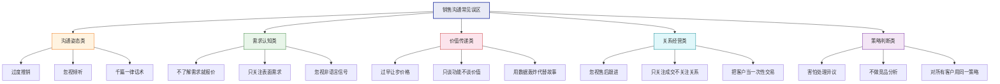
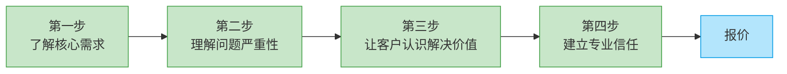
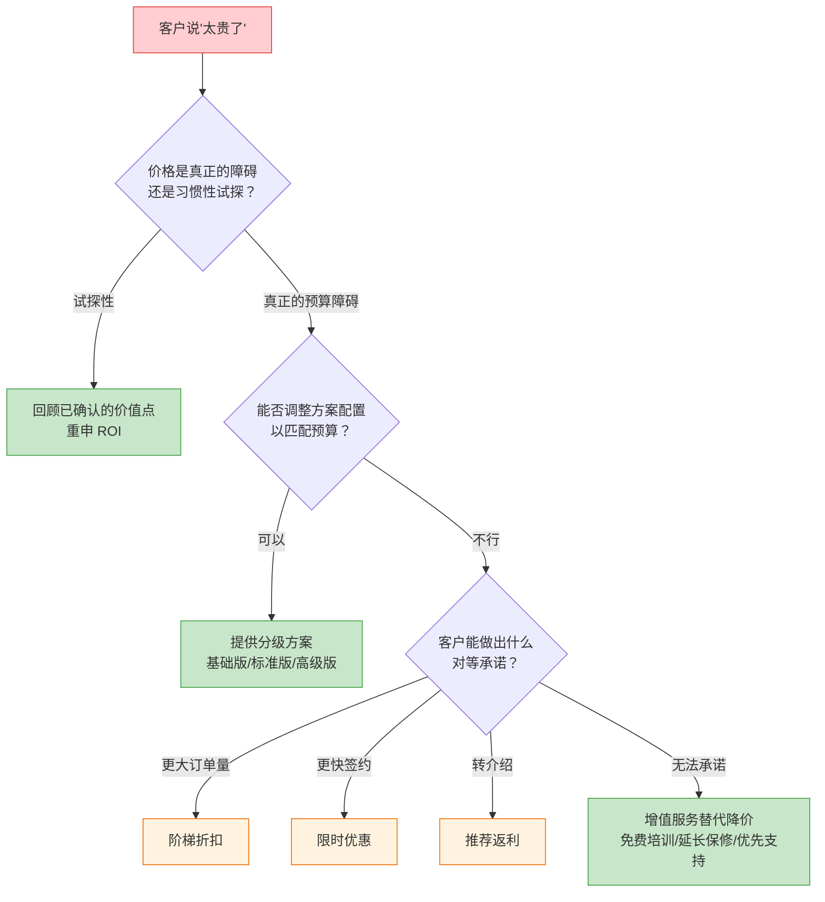
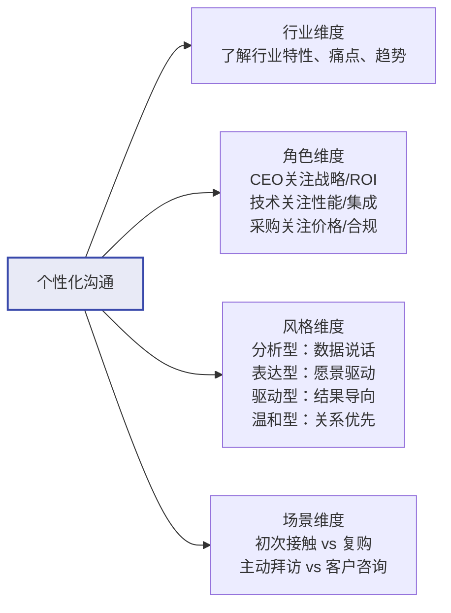
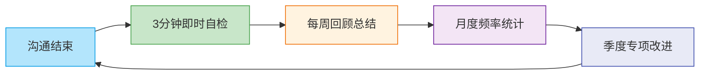

# 第十八章 销售与营销沟通 · 第四节 常见误区

销售沟通是一门需要持续精进的技艺。即便是经验丰富的销售老手，也常常陷入某些根深蒂固的行为模式中而不自知。这些误区之所以危险，恰恰因为它们"看起来合理"——直觉告诉我们应该这样做，但数据和心理学研究却指向相反的方向。

本节系统梳理了销售沟通中最常见的十五大误区，每一个都从**心理机制**、**实际危害**、**典型场景**和**纠正方法**四个维度展开深度解析。最后提供一套可操作的自检工具，帮助你在每次沟通后快速诊断自身状态。

> Neil Rackham 在对 35,000 次销售拜访的跟踪研究中发现：**失败的销售对话中，83% 存在至少三个以上本节所列的误区行为**。识别并纠正这些误区，是突破业绩瓶颈最直接的路径。

---

## 误区一：过度推销

### 表现

一见到客户就迫不及待地开始介绍产品，全程不停地说，从功能特性讲到公司荣誉，从技术参数讲到客户案例，不给客户任何插话的机会。销售人员回到家往往觉得"今天聊得挺好的"，但客户的感觉却是"被轰炸了"。

### 心理机制

过度推销的根源是一种**"信息补偿心理"**——销售人员认为成交的关键是"让客户知道得更多"，于是不断输出信息。但哈佛商学院的研究表明，人类的短期工作记忆一次只能处理 4±1 个信息块（Miller's Law），过多的信息输入不仅不会增加说服力，反而会导致**认知过载**，使客户进入防御状态。

更深层的原因是**控制焦虑**。当销售人员对自身产品价值不够自信、或对客户需求判断不明时，会本能地用"多说"来填补不确定性带来的不安。这就像演讲时紧张的人会不自觉地加快语速一样。

### 数据支撑

- Gong.io 对 25,000+ 销售对话的分析显示：**成交率最高的销售人员，说话时间占比仅为 43%**，而丢单率最高的销售人员说话时间占比高达 72%
- HubSpot 调研数据：**69% 的买家认为"不理解我的需求就开始推荐产品"是最令人反感的销售行为**
- 心理学中的"说话者-倾听者错位"（Speaker-Listener Gap）：说话者认为自己表达清楚的程度，平均比倾听者实际理解的程度高出 50%

### 典型场景

| 场景 | 过度推销的表现 | 客户的真实感受 |
|------|---------------|---------------|
| 初次电话拜访 | 开场 30 秒就开始介绍产品功能 | "这个人根本不在乎我是谁" |
| 客户询价 | 立刻报出全系列方案并逐一讲解 | "我只是想了解一下价格，不是要上一堂课" |
| 展会交流 | 对每个路过的人都发放资料并讲解 | "我又没停下来，为什么要听你说" |
| 售后回访 | 借回访之名推销新产品 | "原来回访只是个幌子" |

### 纠正方法

**核心原则：遵循"二八法则"——让客户说 80%，你说 20%。**

你的时间分配应该是：
- 40% 用于**提问**——发现需求
- 30% 用于**倾听**——理解需求
- 20% 用于**回应**——匹配方案
- 10% 用于**确认**——达成共识

**具体话术转换：**

> ❌ **反面案例**："我们的产品功能强大，有 A 功能、B 功能、C 功能……"
> ✅ **正面案例**："在介绍产品之前，我想先了解一下：您目前遇到的最大挑战是什么？如果这个问题不解决，会对业务产生什么影响？"

**自我检测信号：** 如果在一次对话中你连续说了超过 90 秒而没有提问或邀请客户发言，你就已经进入了过度推销状态。养成"每说 60 秒就问一个问题"的节奏习惯。

---

## 误区二：忽视倾听

### 表现

表面上在听客户说话，实际上大脑在高速运转准备下一段话术；或者客户话说到一半就急于打断，给出自认为正确的解决方案；或者听完客户陈述后不确认理解是否正确，直接跳到自己的观点。

### 心理机制

忽视倾听的根源是**"回应焦虑"**——害怕沉默，觉得客户说完后自己必须立刻接话，否则会显得不够专业。这在心理学上叫做**"对话间隙恐惧"**（Conversational Gap Anxiety）。实际上，1-2 秒的停顿在客户看来恰恰是"你认真思考了我的话"的信号，而不是"你不知道该说什么"。

另一个原因是**"确认偏差"**——销售人员在倾听时会不自觉地筛选符合自己预设的信息，忽略不符合的部分。当客户说"我们目前的系统也能用，就是效率不太高"时，急于推销的销售只听到"效率不太高"就立刻切入产品介绍，却忽略了"也能用"——这意味着客户并没有强烈的更换意愿，需要更深层次的痛点挖掘。

### 数据支撑

- Salesforce《State of Sales》报告：**高绩效销售人员的倾听能力是普通销售的 2.3 倍**——这是区分优秀与平庸的最大能力差异
- 国际倾听协会（International Listening Association）研究：普通人只能有效记住所听到信息的 25%-50%，但在积极倾听状态下可以提升到 75% 以上
- MIT 人类动力学实验室的研究：**在团队协作中，最优秀的倾听者不是"说得最少的人"，而是"回应最精准的人"**

### 典型场景

| 场景 | 忽视倾听的表现 | 后果 |
|------|---------------|------|
| 客户表达顾虑 | 急于辩解："这个问题其实不用担心……" | 客户感到被否定，关闭沟通 |
| 客户分享背景 | 心里想着下一个话术点，只听关键词 | 错过隐含的重要需求信号 |
| 客户提出需求 | 还没听完就给出方案 | 方案不对症，浪费双方时间 |
| 客户犹豫不决 | 反复强调产品优势 | 未触及客户真正的顾虑点 |

### 纠正方法

**核心原则：先听完，再回应；先确认，再建议。**

**三步倾听法：**

1. **全神贯注（Focus）**：放下手机、关掉电脑通知、保持眼神接触。用肢体语言表示你在听——轻微点头、身体前倾、保持开放姿态
2. **停顿确认（Pause）**：客户说完后，停顿 1-2 秒。这个短暂的停顿有三个作用：给客户一个"补充"的机会；给自己一个整理信息的时间；向客户传递"我认真在听"的信号
3. **复述验证（Paraphrase）**：用你自己的语言复述客户的核心意思，确认理解是否正确

**实用话术模板：**

"您刚才提到了 [核心内容]，我的理解是 [你的解读]，
对吗？如果理解正确的话，我想再深入了解一下 [追问点]。"

> **进阶技巧——情绪标注**：心理学家 Daniel Goleman 提出的"情绪标注"（Affect Labeling）技术——直接说出客户可能的情绪状态，可以显著降低对方的防御心理。例如："听起来您对目前供应商的服务质量有些失望，是这样吗？"

---

## 误区三：不了解客户需求就报价

### 表现

客户一问价格就立刻报价；或者在还没有充分了解需求时就急于展示方案和报价；或者因为害怕"问太多客户会烦"而跳过需求诊断环节直接进入方案呈现。

### 心理机制

这个误区的根源是**"价格锚定顺序错误"**。行为经济学家 Kahneman 和 Tversky 的研究表明，人类对价值的判断高度依赖"参照点"。如果客户先听到价格（通常是较高的数字），这个数字就会成为心理锚点，后续你传递的所有价值信息都会在这个锚点的阴影下被评估——客户的认知模式会自动切换为"这个东西值不值这么多钱"的质疑模式。

反之，如果客户先理解了问题的严重性、解决后的收益，你传递的每一个价值点都在抬高客户的心理预期价位。此时再报价，客户的感觉是"嗯，确实值这个钱"。

**这就是"先诊断后开方"原则的心理学基础——价值必须先于价格。**

### 数据支撑

- Corporate Visions 研究：**在价值传递充分后再报价的场景中，价格异议率降低 52%**
- 价格谈判中的"锚定效应"实验：先报价的一方，最终成交价平均偏向先报价方 15%-20%——但前提是报价要有合理的价值支撑
- B2B 销售中的"需求诊断阶段"数据：在 B2B 复杂销售中，需求诊断阶段投入时间占总销售周期 30% 以上的项目，成交率比投入不足 15% 的项目高出 2.8 倍

### 典型场景

| 场景 | 错误做法 | 正确做法 |
|------|---------|---------|
| 客户首次询价 | 直接报价"基础版 9800/年" | "我很乐意给您一个准确的报价。为了确保方案匹配您的实际需求，能先了解一下您目前的使用场景和团队规模吗？" |
| 展会上客户问价格 | 立即报出标准价 | "价格根据具体配置有所不同。您主要关注哪些功能？我帮您匹配最适合的方案和对应的价格。" |
| 客户说"发个报价单" | 照搬标准报价单 | "好的，为了给您最准确的报价，我需要确认几个关键信息……" |

### 纠正方法

**核心原则：永远先诊断，后开方。报价前确保完成"四步诊断"。**

1. **了解核心需求**：客户到底要解决什么问题？是表面需求还是深层需求？
2. **理解问题严重性**：这个问题如果继续存在，会带来什么后果？（SPIN 中的暗示问题）
3. **让客户认识到解决的价值**：解决这个问题后，能带来什么具体改善？（SPIN 中的需求-效益问题）
4. **建立专业信任**：你是否展现出足够的行业知识和问题诊断能力？

当这四步完成后，客户对你的报价会有一个"合理预期"，价格异议将大幅减少。如果客户坚持要先看报价，可以提供一个**价格区间**而非精确数字："根据不同的配置和需求，我们的方案通常在 X 到 Y 之间。具体的价格需要根据您的实际情况来确定——方便的话我先了解一下？"

---

## 误区四：害怕处理异议

### 表现

客户一提出异议就紧张——心跳加速、语速加快、思路混乱。行为上表现为三种典型错误：**回避**（假装没听到，继续讲自己的）；**辩解**（急于反驳客户观点）；**投降**（立刻降价或给出额外优惠）。这三种反应都在告诉客户"你的顾虑是对的，我确实没什么底气"。

### 心理机制

销售人员害怕异议的根源是**将异议等同于拒绝**。心理学上这叫做**"评价恐惧"**（Evaluation Apprehension）——害怕被负面评价，从而触发回避反应。

但事实上，**异议是购买信号，不是拒绝信号**。客户如果完全不感兴趣，根本不会花时间和精力提出异议。提出异议说明他在认真考虑，只是还存在某些顾虑需要消除。哈佛商学院的 John Gattorna 在研究中发现：**提出 3 个以上异议的客户，最终成交率比没有提出异议的客户高出 40%**。

还有一个被忽视的心理学原理——**"投入递增效应"**（Escalation of Commitment）。当客户在异议处理过程中投入了时间和精力参与讨论，他会倾向于"推进到下一步"，因为放弃意味着之前的努力都白费了。

### 数据支撑

- 销售管理协会（Sales Management Association）：**60% 的客户说"不"四次后才会说"是"，但 92% 的销售人员在第四次拒绝前就放弃了**
- Gong.io 分析：**高绩效销售人员在面对异议时的反应时间比普通销售慢 0.5-1 秒**——这 1 秒的停顿让他们的回应更有针对性
- LSCPA 框架的实际应用数据：采用系统化异议处理方法的销售团队，异议解决率比随意应对的团队高出 65%

### 纠正方法

**核心原则：异议是成交的前奏，处理异议是推进成交的最佳机会。**

**LSCPA 异议处理五步法：**

| 步骤 | 动作 | 话术模板 |
|------|------|---------|
| **L**isten（倾听） | 完整听完，不打断 | 点头、记录，让客户充分表达 |
| **S**hare（认同） | 认可客户的感受，不等于认同其观点 | "我完全理解您的顾虑，很多客户在初次了解时也有同样的感受。" |
| **C**larify（澄清） | 确认异议的具体内容 | "您说的'太贵了'，是指绝对价格预算的问题，还是相对于目前方案的性价比有疑虑？" |
| **P**resent（提出方案） | 用事实、案例、数据回应 | "关于价格，我分享一个类似的案例：XX公司在初期也有类似顾虑，但实施后第一年就实现了 3 倍的投资回报。" |
| **A**sk（请求行动） | 推进到下一步 | "基于刚才的讨论，如果价格在合理范围内，您是否愿意进一步了解实施方案？" |

**常见异议的应对框架：**

| 异议类型 | 客户原话 | LSCPA 应对 |
|---------|---------|-----------|
| 价格异议 | "太贵了" | 认同→澄清是预算问题还是价值认知→用 ROI 数据呈现→试探推进 |
| 时间异议 | "我再考虑考虑" | 认同→澄清具体顾虑点→提供补充信息→约定下次沟通时间 |
| 竞品异议 | "XX 公司更便宜" | 认同选择多→澄清对比维度→差异化价值呈现→用案例佐证 |
| 权力异议 | "我需要和领导商量" | 认同决策流程→了解领导关注点→提供可转发的决策材料→约定三方沟通 |
| 信任异议 | "你们公司我之前没听过" | 认同选择慎重→提供行业资质、客户案例、试用方案→降低感知风险 |

---

## 误区五：过早让步价格

### 表现

客户一说"太贵了"就立刻给出折扣；在价值还没有充分传递时就主动降价；或者为了快速成交，直接给出最低价。有些销售人员甚至把"打折权限"当作维护客户关系的筹码。

### 心理机制

过早降价背后有两层心理机制在起作用：

**第一层："成交焦虑"驱动的自我安慰**——销售人员潜意识里认为"只要价格足够低，客户一定会买"，降价成为缓解"客户可能不买"这种焦虑的最快方式。但这种方式跳过了最关键的价值传递环节。

**第二层：损失厌恶的反向作用**——Kahneman 的前景理论指出，人们对损失的敏感度是收益的 2.5 倍。当你轻易降价时，客户的心理反应不是"占了便宜"，而是"原来的价格水分很大"——他们"损失"了对产品价值的信任。

更严重的后果是**"价格期待的恶性循环"**：每次你都轻易让步，客户学到的经验是"只要坚持不买，价格就会降"。这会在未来的每一次交易中复制。

### 数据支撑

- 贝恩咨询（Bain & Company）：**价格每降低 1%，利润率平均下降 8%**（对于利润率 10% 的企业，降价 1% 意味着利润减少 10%）
- PricingBrew 研究：**B2B 销售中，73% 的价格让步是不必要的**——客户在后续访谈中表示，即使没有折扣他们也会购买
- Harvard Business Review：**愿意支付全价的客户比例远高于销售人员的预期**——销售团队通常低估客户的价格接受度 15%-25%

### 纠正方法

**核心原则：降价是最后的手段，不是第一反应。在降价之前，先做四件事。**

**价格让步决策树：**

**四个原则：**

1. **先确认是真正的障碍**：80% 的"太贵了"只是习惯性试探。用提问确认："您说的'贵'，是指超出了预算范围，还是对性价比有疑问？"
2. **降价前回顾价值**：在让步之前，先回顾所有已确认的价值点。"您之前确认过这三个核心需求是我们能满足的——如果都能解决，这个投资回报率您觉得怎么样？"
3. **要求对等承诺**：如果必须让步，绝不能白让。"如果我在价格上做一些调整，您能否在 [签约时间/订单量/付款方式] 上做一些配合？"
4. **用增值服务替代**：免费培训、延长保修期、优先技术支持、定制化配置——这些增值服务对你的成本远低于直接降价，但对客户的价值感知却很高

---

## 误区六：忽视售后跟进

### 表现

成交后就"消失"了——不回访、不关心使用情况、不主动提供帮助。直到续费期临近或者有新产品要推销时才突然出现。销售人员把精力全部放在"开发新客户"上，却忽略了"维护老客户"的战略价值。

### 心理机制

**"峰终定律"（Peak-End Rule）**告诉我们，人们对一段体验的记忆主要取决于**高峰时刻**和**结束时刻**。成交是高峰，但售后体验才是真正的"结束时刻"。如果售后是一片空白，客户对整个合作体验的记忆会逐渐淡化甚至转为负面。

另一个被忽视的心理学原理是**"互惠原则"（Reciprocity）的持续性**。Cialdini 的研究表明，当一个人收到帮助时，会产生"回报"的心理压力。售后阶段的主动关怀，不仅增强客户满意度，更在客户心中种下"回报"的种子——而最自然的回报方式就是转介绍和复购。

### 数据支撑

- Harvard Business Review：**获取新客户的成本是维护老客户的 5-25 倍**
- Frederick Reichheld（Bain & Company）：**客户留存率提高 5%，利润可增加 25%-95%**
- 老客户的推荐转化率比陌生开发高 3-5 倍
- 在售后阶段进行定期跟进的企业，续费率平均比不跟进的企业高出 38%

### 典型场景

| 阶段 | 错误做法 | 正确做法 |
|------|---------|---------|
| 成交后 24 小时 | 无任何行动 | 发送感谢信息 + 预期使用指南 |
| 成交后第一周 | 消失 | 主动确认产品/服务交付是否顺利 |
| 使用过程中 | 等客户找你 | 定期主动回访，分享实用资源 |
| 续费前一个月 | 突然联系，催续费 | 提前 3 个月开始提供价值提醒 |
| 客户遇到问题 | 推给客服 | 主动跟进解决进度 |

### 纠正方法

**核心原则：成交是关系的开始，不是结束。建立系统化的售后跟进机制。**

**售后跟进 SOP（标准操作流程）：**

| 时间节点 | 动作 | 目的 |
|---------|------|------|
| 成交后 24 小时 | 发送感谢 + 使用指南 + 预期效果时间线 | 建立专业形象，减少"买家后悔" |
| 第 3 天 | 电话回访，确认交付/安装/开通是否顺利 | 及时解决初期问题 |
| 第 1 周 | 发送 1-2 个与客户行业相关的实用资源 | 持续提供价值，强化信任 |
| 第 2 周 | 检查使用情况，解答使用疑问 | 确保客户获得预期效果 |
| 第 1 个月 | 效果评估沟通：实际收益 vs. 预期收益 | 收集成功案例，处理遗留问题 |
| 每季度 | 行业趋势分享 + 产品更新预告 | 保持持续触达，展现行业洞察 |
| 续费前 3 个月 | 价值回顾 + 新功能体验 + 续费方案 | 平滑续费流程，减少流失 |

---

## 误区七：使用千篇一律的话术

### 表现

对所有客户使用完全相同的话术脚本，不管对方是 CEO 还是技术主管，不管对方是制造业还是互联网公司，不管对方是急性子还是慢性子，都用同一套开场白、同一套产品介绍、同一套异议应对。

### 心理机制

千篇一律的话术之所以失效，涉及到心理学中的**"独特性需求"（Need for Uniqueness）**。每个人都有被当作独立个体对待的需求。当客户感觉到你在"走流程"而不是"为我服务"时，心理上的信任连接就断裂了。

更深层地，这涉及到**"镜像神经元"（Mirror Neurons）**的工作机制。当你用标准化的话术与客户交流时，你没有在"镜像"客户的沟通风格和情绪状态——客户会下意识地感觉到"不在同一个频道上"。

### 数据支撑

- Epsilon 研究：**80% 的消费者更愿意购买提供个性化体验的品牌**
- McKinsey：**个性化沟通可以将销售额提升 10%-15%，将营销效率提升 20%-30%**
- Salesforce：**72% 的 B2B 买家期望供应商理解他们的独特需求，并提供定制化的解决方案**

### 纠正方法

**核心原则：话术框架可以标准化，但具体内容必须个性化。**

**个性化沟通四维度：**

**话术个性化对照表：**

| 维度 | 千篇一律 ❌ | 个性化 ✅ |
|------|-----------|----------|
| 行业 | "我们的产品能帮您提升效率" | "在制造业的排程优化场景中，我们的方案帮助XX工厂将排程效率提升了40%" |
| 角色（对 CEO） | 讲解技术架构和功能细节 | "这个方案的战略价值在于：它能让您在三年内将运营成本降低 15%，释放出来的人力可以投入创新业务" |
| 角色（对技术主管） | 讲解商业价值和战略意义 | "我们的 API 与您现有的 ERP 系统无缝集成，部署周期 2 周，不需要改变现有工作流程" |
| 沟通风格（分析型） | 讲故事和愿景 | 准备详细的数据对比表、ROI 计算模型、技术参数文档 |
| 沟通风格（驱动型） | 慢慢铺垫、层层递进 | 开门见山："三个关键收益，预计节省XX万元，实施周期XX周" |

---

## 误区八：只关注成交不关注关系

### 表现

所有沟通行为都指向"今天就要签单"，缺乏长期关系的经营思维。当客户表示"还需要时间考虑"时，不是感到焦虑就是失去兴趣，甚至在客户明确表示"暂时不需要"后就完全断了联系。

### 心理机制

这种误区源于**"即时满足偏差"（Present Bias）**——人类天然倾向于追求即时回报，而低估长期收益。在销售中，这表现为"今天成交"的紧迫感压过了"建立长期关系"的战略思维。

但 Daniel Pink 在《Drive》中指出，**真正持久的行为动力来自于"自主性、胜任感和归属感"**——客户需要感觉自己是"主动做出决策"的，而不是被"推进"的。那些愿意退一步、给客户空间的销售人员，反而更容易赢得客户的长期忠诚。

### 数据支撑

- Bain & Company：**在 B2B 销售中，客户的决策周期平均为 6-12 个月**——急于在这个周期内完成交易是不现实的
- "准客户培育"（Lead Nurturing）数据显示：**在首次接触后 6-12 个月内持续提供价值的销售，最终成交率比"快速跟进然后放弃"的销售高出 47%**
- Edelman Trust Barometer：**81% 的客户表示，信任是他们做出购买决策的关键因素**——而信任需要时间来建立

### 纠正方法

**核心原则：有时候"今天不卖"反而是最好的销售策略。**

> ✅ **示范话术**："我理解您现在还需要时间考虑。我这边先帮您整理一份详细的方案对比表，您方便的时候可以参考，不着急。"

这种态度反而会让客户更信任你，下次有需求时第一个想到你。

**长期关系经营框架：**

| 阶段 | 你的角色 | 核心动作 |
|------|---------|---------|
| 认知阶段 | 行业思想领袖 | 分享行业洞察、趋势报告、原创内容 |
| 考虑阶段 | 可信赖的顾问 | 提供方案建议、行业案例、免费咨询 |
| 决策阶段 | 专业的合作伙伴 | 透明报价、灵活方案、风险保障 |
| 售后阶段 | 持续的价值创造者 | 定期回访、问题预警、升级建议 |
| 推荐阶段 | 值得推荐的品牌大使 | 感谢推荐、分享成功、保持高质量服务 |

---

## 误区九：忽视非语言信号

### 表现

只关注客户说了什么，不关注客户的表情、肢体语言、语气变化、语速改变等非语言信息。当客户嘴上说"挺好的"但身体已经在收拾东西时，你还在滔滔不绝地介绍功能。

### 心理机制

Albert Mehrabian 的经典研究（常被引用但常被误读）揭示了一个关键事实：在情感和态度的传递中，**语言内容只占 7%，语音语调占 38%，面部表情和肢体语言占 55%**。虽然这个比例在不同场景下有所变化，但核心结论是确定的——**非语言信号传递的信息量远超语言本身**。

在销售场景中，客户的非语言信号往往比语言更"诚实"。因为语言是可以有意识控制的（"我再考虑考虑"可能是礼貌性的推辞），而肢体语言更多是无意识的反应（双臂交叉、身体后倾等防御姿态很难伪装）。

### 关键非语言信号解读

**积极购买信号（可以考虑推进成交）：**

| 信号 | 含义 | 你的应对 |
|------|------|---------|
| 身体前倾 | 对内容产生兴趣，想要了解更多 | 加大信息量，深入细节 |
| 频频点头 | 认同你表达的观点 | 确认认同点，推进到下一步 |
| 仔细翻看资料/合同 | 在认真评估方案细节 | 提供解读帮助，解答疑问 |
| 提出细节问题（交付时间、售后条款等） | 已经在考虑"买后"的事情 | 直接回答，暗示"如果确认的话" |
| 开始和同伴商量 | 内部决策正在发生 | 给空间，准备回答双方可能的问题 |
| 手指轻敲桌面、搓手 | 期待和兴奋 | 可以试探性提出行动建议 |

**消极抗拒信号（需要回退，重新建立价值）：**

| 信号 | 含义 | 你的应对 |
|------|------|---------|
| 双臂交叉 | 防御或不认同 | 换一个话题角度，或直接询问顾虑 |
| 频繁看手机/手表 | 不耐烦或有其他安排 | 压缩内容，聚焦最关键的信息点 |
| 回答越来越简短（"嗯""好的""行"） | 兴趣下降或在敷衍 | 用一个有力的问题重新激活对话 |
| 身体后倾/靠在椅背上 | 心理距离在拉大 | 改变沟通节奏，用故事或提问重新吸引 |
| 避免眼神接触 | 不舒服或在回避某个话题 | 注意你是否触及了敏感话题 |
| 摸鼻子、揉眼睛 | 潜意识的"不想看到/不想听到"信号 | 客户可能在撒谎或对某部分内容不适 |

### 纠正方法

**核心原则：用"第三只眼"观察客户——不仅要听他说什么，更要看他做什么。**

**实操技巧：**

1. **建立"扫描"习惯**：每 2-3 分钟，快速扫描一次客户的面部表情和上半身姿态
2. **对比语言和非语言**：当客户说"挺好的"但表情犹豫时，直接询问："我注意到您似乎有些顾虑，方便说一下吗？"
3. **镜像客户的状态**：如果客户后倾，你也后倾；如果客户放松，你也放松。镜像可以建立潜意识的亲近感
4. **线上场景的替代信号**：在视频会议中，关注摄像头开关状态、回应速度、文字聊天区的活跃度、是否开麦参与讨论

---

## 误区十：不做竞品分析

### 表现

不了解竞争对手的产品、价格、优劣势，在客户提到竞品时一脸茫然或者下意识地贬低对手。当客户说"XX 公司的产品也不错"时，只能苍白地说"我们比他们好"，却说不出具体好在哪里。

### 心理机制

不做竞品分析的根源是**"鸵鸟效应"**——潜意识中回避竞争压力，假装竞争对手不存在。但客户在做购买决策时，几乎一定会做横向比较。如果你不主动提供比较框架，客户就会自己去找——而你无法控制他们找到的信息。

另一个心理陷阱是**"贬低对手效应"**（Competitor Bashing Backfire）。研究表明，当销售人员贬低竞争对手时，客户会对销售人员的可信度产生质疑——"如果他自己够自信，为什么要贬低别人？" 贬低对手不仅不会提升你的形象，反而会拉低你的格调。

### 数据支撑

- Crayon《State of Competitive Intelligence》报告：**90% 的企业在销售过程中会面临竞品比较**
- 做好竞品分析的销售团队，**赢单率比不做竞品分析的团队高出 25%-30%**
- **客户对竞品的了解程度比销售人员预期的要深**——72% 的 B2B 买家在联系销售之前已经完成了大量的独立调研

### 纠正方法

**核心原则：知己知彼，用客观分析替代主观贬低。**

**竞品分析三步法：**

1. **平时做好功课**：深入了解主要竞品的特点、价格、市场定位、客户评价、最新动态
2. **建立"竞品对比话术库"**：针对每个主要竞品，准备好客观、公正的差异化话术
3. **聚焦差异化价值**：不要试图全面比较，聚焦在你的核心优势与客户最关心的维度上

**竞品对比话术模板：**

> ✅ "和 XX 产品相比，我们在 [维度 A] 上有明显优势，这在您的场景下意味着 [具体价值]。当然，XX 在 [维度 B] 上确实做得不错，如果 [维度 B] 是您的首要考虑因素，他们可能更适合。不过从您刚才提到的需求来看，[维度 A] 对您更重要。"

**竞品对比表框架：**

| 对比维度 | 我们的产品 | 竞品 A | 竞品 B | 对您的意义 |
|---------|-----------|--------|--------|-----------|
| 核心功能匹配度 | ⭐⭐⭐⭐⭐ | ⭐⭐⭐⭐ | ⭐⭐⭐ | 直接影响问题解决效率 |
| 集成难度 | 低（原生 API） | 中（需定制） | 高 | 影响实施周期和成本 |
| 售后响应 | 7×24 专属顾问 | 工作日工单 | 工作日工单 | 影响业务连续性 |
| 价格 | $$ | $$ | $ | 综合 TCO 最优 |

**承认竞品的优点**：适当的客观性反而增强你的可信度。"XX 确实在品牌知名度上比我们强，但我们在 [核心维度] 上的专业度是他们无法比拟的。"

---

## 误区十一：只谈功能不谈价值

### 表现

详细介绍产品的技术参数、功能列表、系统架构，但不解释这些功能对客户意味着什么。"我们有 128 位加密、分布式架构、实时数据分析引擎"——客户听完后的感觉是"听起来很厉害，但跟我有什么关系？"

### 心理机制

**"知识诅咒"（Curse of Knowledge）**是最常见的原因——当你对产品非常了解时，很难想象别人不知道这些功能意味着什么。你以为"分布式架构"这个表述已经说明了一切，但客户听到的是一个抽象的技术名词。

这就是 FABE 法则存在的意义——从 Feature（特征）到 Advantage（优势）到 Benefit（利益）到 Evidence（证据），每一层都是在把"技术语言"翻译成"客户语言"。

### 纠正方法

**核心原则：每说一个功能，就要回答"所以呢？（So What?）"——这对客户有什么具体好处？**

**FABE 转换示例：**

| 层级 | 内容 | 示例 |
|------|------|------|
| Feature（特征） | 产品的客观属性 | "我们的系统采用分布式架构" |
| Advantage（优势） | 相比其他方案的优势 | "这意味着系统在高并发场景下不会宕机" |
| Benefit（利益） | 对客户的实际好处 | "您在促销高峰期就不会因为系统崩溃而损失订单，去年XX品牌因此损失了 300 万" |
| Evidence（证据） | 证明好处的真实案例 | "XX 商城在双十一期间用我们的系统支撑了 50 万笔订单，零宕机" |

**永远记住：客户买的不是功能，是功能带来的改变。**

---

## 误区十二：用数据轰炸代替讲故事

### 表现

在产品介绍和方案呈现中大量堆砌数据、图表、报告，认为"数据越多越有说服力"。PPT 做了 50 页，每页都是密密麻麻的数字，但客户在第 10 页就走神了。

### 心理机制

斯坦福大学 Jennifer Aaker 教授的研究证实：**故事的记忆效果是纯数据的 22 倍**。人脑天生偏爱叙事结构——有角色、有冲突、有转折的故事比孤立的数据点更容易被编码到长期记忆中。

神经科学研究进一步表明，当人们听到故事时，大脑中负责**情感共鸣**和**运动模拟**的区域会被激活——听众不仅在"听"故事，他们的大脑在"体验"故事。这是纯数据无法做到的。

### 纠正方法

**核心原则：数据支撑故事，故事承载数据。两者结合才是最佳说服力。**

**数据-故事结合公式：**

[一个具体的客户故事/场景] + [关键数据点] + [对当前客户的启示]

> ✅ **示范**："XX 公司的张总，在去年也面临着和您一模一样的库存管理问题。他们当时每个月因为库存积压损失大约 50 万。引入我们的方案后，第一个月就将库存周转率提升了 35%，相当于每月释放了近 18 万的流动资金。如果您的情况类似，这可能意味着……"

**数据呈现三原则：**
1. **一次只讲一个关键数据**：人类工作记忆的容量有限，一个有力的数字比十个平庸的数字更有效
2. **数据必须有锚点**："提升了 35%"没有感觉，"每月多赚 18 万"才有感觉——用客户能感知的具体价值来"锚定"数据
3. **数据必须有来源**：标注数据来源增强可信度，"根据 Gartner 2024 年报告"比"研究表明"有力 10 倍

---

## 误区十三：对所有客户用同一策略

### 表现

不区分客户类型、购买阶段和决策角色，对每个潜在客户都采用相同的跟进频率、相同的话术套路、相同的价值主张。对刚接触的新客户和已经进入决策期的老客户用同样的"逼单"策略。

### 心理机制

这涉及到**"框架效应"（Framing Effect）**——同一个信息用不同的框架呈现，会产生截然不同的效果。对于认知阶段的客户，框架应该是"为什么这个问题值得你关注"；对于决策阶段的客户，框架应该是"选择我们是最安全、回报最高的决定"。用错框架就像给感冒的人开治骨折的药——方向错了，越努力越糟糕。

### 纠正方法

**核心原则：根据客户所处的决策阶段，匹配不同的沟通策略。**

**客户阶段匹配策略：**

| 决策阶段 | 客户心理状态 | 你的核心目标 | 沟通策略 | 常见错误 |
|---------|------------|------------|---------|---------|
| 认知阶段 | "我好像有这个问题" | 唤醒问题意识 | 分享行业洞察、趋势报告、案例故事 | 直接推销产品 |
| 兴趣阶段 | "这可能值得了解一下" | 激发探索兴趣 | 提供方案概览、初步诊断、免费资源 | 过早报价 |
| 评估阶段 | "我需要比较几个选项" | 展示差异化价值 | 竞品对比、详细方案、客户证言 | 贬低对手 |
| 决策阶段 | "我准备做决定了" | 降低决策风险 | 试用方案、ROI 计算、风险保障 | 犹豫不决地等待 |
| 行动阶段 | "我要确认细节" | 简化购买流程 | 清晰的合同条款、实施计划、支持方案 | 放松服务标准 |

---

## 误区十四：忽视数字沟通的特殊性

### 表现

在微信、邮件、即时通讯等数字化沟通渠道中，使用与面对面沟通完全相同的方式——大段文字、密集信息、缺乏结构。或者在不合适的时间发送消息，或者用错沟通渠道（紧急事项用邮件、正式文件用微信）。

### 心理机制

数字沟通缺乏面对面交流中的**"反馈循环"**——你看不到客户的表情，听不到语气变化，无法根据实时反应调整内容。这导致两个问题：**信息过载**（因为无法判断客户是否感兴趣，所以倾向于"多说一点"）和**情绪误读**（文字信息中的语气容易被误解，中性语句可能被解读为冷漠或不满）。

### 纠正方法

**核心原则：数字沟通需要更高的结构化和更精准的信息密度。**

**数字沟通最佳实践：**

| 渠道 | 适用场景 | 最佳实践 | 避免事项 |
|------|---------|---------|---------|
| 微信/即时通讯 | 日常跟进、简单问题 | 一次只问一件事；善用语音（复杂话题）；消息不超过 3 屏 | 群发营销信息；在非工作时间发消息；发大段无结构文字 |
| 邮件 | 正式方案、报价、总结 | 主题行要明确；正文分段有标题；附件命名规范；底部有明确的下一步 | 邮件正文写成小说；不写主题行；同时抄送太多人 |
| 视频会议 | 方案演示、深度讨论 | 提前发送议程；控制时长 30-45 分钟；主动邀请发言 | 全程只有你在讲；不检查音视频设备；不录屏不纪要 |
| 电话 | 紧急事项、关系建立 | 提前告知通话目的和预计时长；通话后发总结 | 没有预约就突然打电话；通话超过 20 分钟没有进展 |

**微信消息结构化模板：**

[称呼]
[一句话说明目的]
[分点列出关键内容（最多 3 点）]
[明确的下一步行动建议]

示例：
王总好，关于昨天讨论的方案，我整理了两个关键信息：
1. 针对您提到的库存问题，我们提供了两种配置方案
2. 详细对比表在附件中，建议重点看第三页的 ROI 分析
方便的话，明天下午 2-3 点我们可以电话讨论一下？

---

## 误区十五：把客户当一次性交易

### 表现

成交后完全不关心客户的使用体验和长期满意度。客户遇到问题推给客服，不再主动联系。把客户视为"完成业绩的数字"而非"可以长期合作的伙伴"。甚至在内部会议上把客户称为"这个单子"而不是"这个人"。

### 心理机制

**"交易思维"的本质是"零和博弈"**——我把产品卖给你，你的钱进了我的口袋，交易完成。但真正的商业关系是**"正和博弈"**——客户因为使用你的产品获得了价值，你因为客户的成功获得了利润和口碑，双方都受益。

一个被忽视的数据：**客户终身价值（CLV）通常是首次交易金额的 3-10 倍**。把注意力全部放在"首单成交"上，等于放弃了 70%-90% 的潜在收入。

### 数据支撑

- Bain & Company：**客户留存率提高 5%，利润增加 25%-95%**
- 获客成本（CAC）数据：**获取新客户的成本是维护老客户的 5-25 倍**
- 转介绍数据：**老客户的推荐转化率比陌生开发高 3-5 倍**
- 维持与老客户的成本远低于开发新客户，而且老客户的客单价通常比新客户高 67%（BIA/Kelsey）

### 纠正方法

**核心原则：每个客户都是一个"关系资产"，而非一个"交易数字"。**

**客户关系价值公式：**

客户终身价值 = 首单金额 + 复购总额 + 推荐价值 + 案例价值

示例：
- 首单：10 万
- 3 年复购（含升级）：30 万
- 带来 2 个转介绍客户：20 万
- 成功案例用于营销的间接价值：难以量化但巨大
- 总价值：60 万+ vs. 首单 10 万

**建立"客户成功"思维：**
1. 把每个客户的成功当作你的成功——主动帮助客户用好产品、获得预期效果
2. 建立客户健康度评估机制——定期评估客户的使用深度、满意度和流失风险
3. 让"客户成功案例"成为你最好的营销素材——一个真实的成功故事比十个销售话术更有效

---

## 综合自检清单

在每次销售沟通后，对照以下清单进行系统化的自我诊断。建议将此清单打印出来贴在办公桌旁，或者保存在手机中随时查看。

### 沟通质量自检

| # | 检查项 | ✅ | 具体证据/记录 |
|---|--------|---|--------------|
| 1 | 我是否给了客户足够的表达时间？（说话比例 ≤40%） | ☐ | 记录实际说话比例 |
| 2 | 我是否在客户说完后停顿确认？ | ☐ | 记录停顿次数 |
| 3 | 我是否真正理解了客户的核心需求（而非表面需求）？ | ☐ | 能否用自己的话复述 |
| 4 | 我是否在报价前充分建立了价值？ | ☐ | 客户是否表达了认同 |
| 5 | 我的话术是否针对该客户做了个性化调整？ | ☐ | 是否提到了客户的具体情况 |
| 6 | 我是否观察了客户的非语言信号并做出回应？ | ☐ | 记录观察到的信号及应对 |
| 7 | 我是否有效处理了客户的异议（而非回避或投降）？ | ☐ | 记录异议及处理方式 |
| 8 | 我是否聚焦了价值而非功能？ | ☐ | 是否回答了"So What" |

### 关系经营自检

| # | 检查项 | ✅ | 具体证据/记录 |
|---|--------|---|--------------|
| 9 | 我是否展现了长期合作的意愿（而非急于成交）？ | ☐ | 是否给客户留了空间 |
| 10 | 我是否为后续关系维护做好了规划？ | ☐ | 约定了下次沟通时间和内容 |
| 11 | 我是否了解了客户所处的决策阶段？ | ☐ | 沟通策略是否匹配阶段 |
| 12 | 我是否使用了正确的沟通渠道和节奏？ | ☐ | 渠道选择是否合适 |

### 专业能力自检

| # | 检查项 | ✅ | 具体证据/记录 |
|---|--------|---|--------------|
| 13 | 我是否做好了竞品分析准备？ | ☐ | 能否清晰说出差异化优势 |
| 14 | 我是否用故事和案例而非纯数据来呈现价值？ | ☐ | 记录使用的故事/案例 |
| 15 | 我是否避免了所有上述误区？ | ☐ | 逐一对照排查 |

### 使用方法

1. **即时记录**：每次重要沟通后，立即花 3 分钟填写自检表
2. **每周回顾**：每周五下午，回顾本周所有自检记录，找出反复出现的问题
3. **月度总结**：每月统计各类误区的出现频率，绘制趋势图
4. **季度复盘**：每个季度选择一个最突出的问题进行专项改进，结合第五节的练习方法

> **最后的提醒**：识别误区只是第一步，真正的改变来自于**有意识的实践**。每次销售沟通前，花 30 秒回想一下本节的内容，问自己"今天最容易犯的错误是什么？"——这种简单的"预设提醒"已经被心理学研究证明可以将犯错率降低 40% 以上。

***
