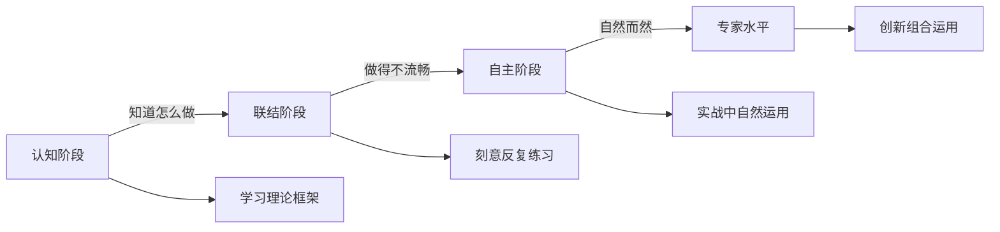
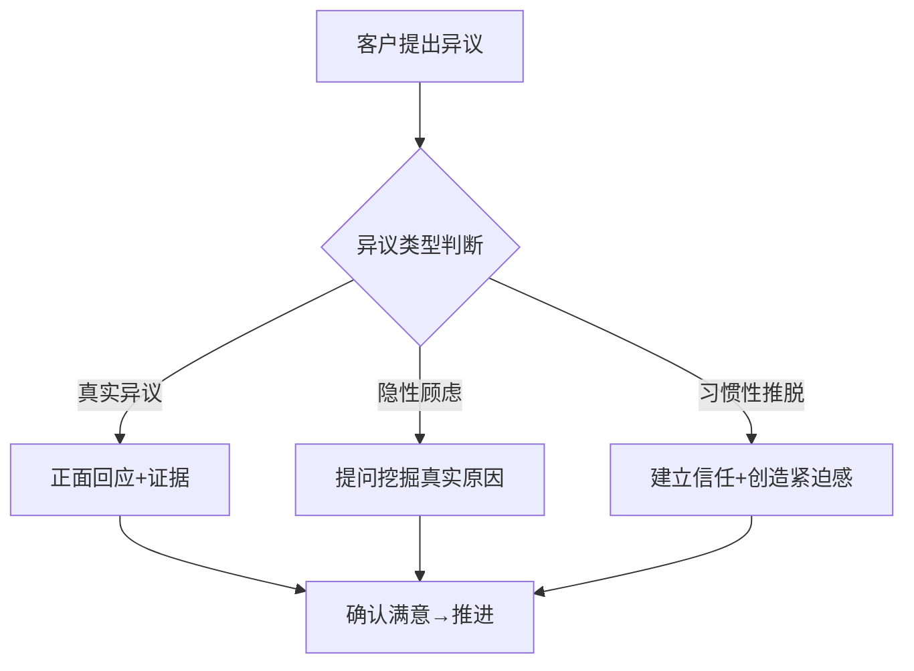
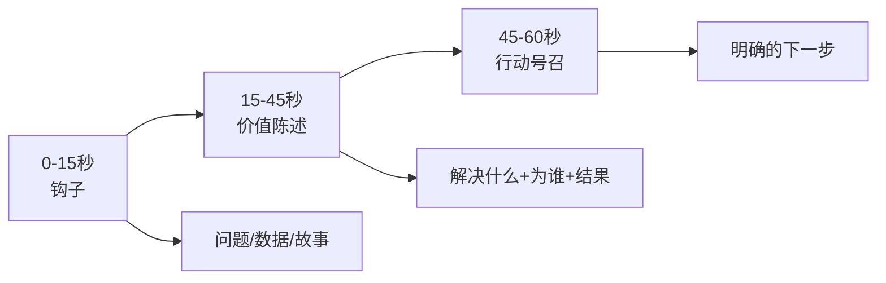
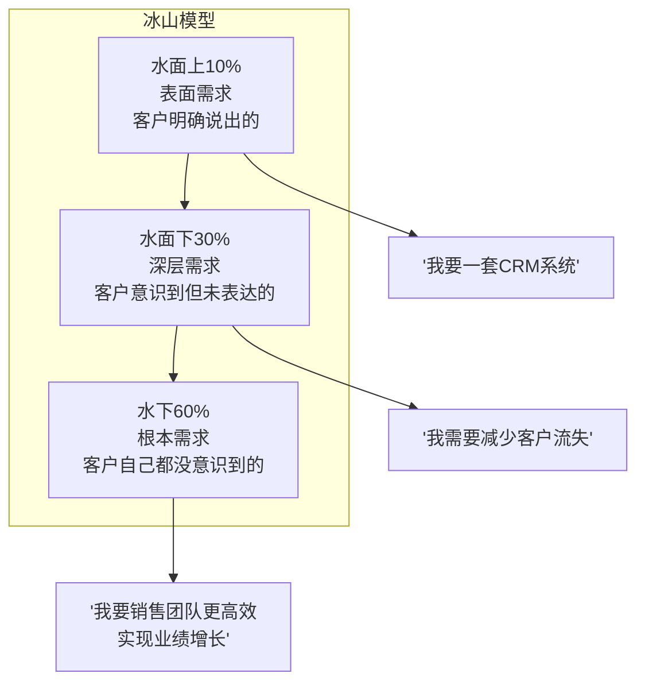

# 第十八章 销售与营销沟通 · 第五节 练习方法

> 知道不等于会，会不等于精。销售沟通能力的提升没有捷径，唯一的路径是"刻意练习"——在反馈循环中反复锤炼每一个技能点，直到它成为你的本能反应。

## 为什么"练"比"学"更重要

大多数销售人员花了80%的时间学习话术和技巧，却只用20%的时间去练习。这恰恰是本末倒置的。神经科学研究表明，一个新的行为模式要变成"自动化反应"，需要至少66天的重复练习（伦敦大学学院Phillippa Lally研究，2009年）。销售沟通中的提问、倾听、异议处理、故事讲述，每一项都需要经过"认知→刻意练习→自动化"三个阶段。

**练习的三大原则：**

1. **即时反馈**：每次练习后必须有反馈——来自搭档、录音、或旁观者。没有反馈的练习只是重复错误
2. **难度递增**：从简单场景到复杂场景，从准备充分到即兴发挥，循序渐进
3. **刻意聚焦**：每次练习只聚焦1-2个技能点，而非试图同时提升所有方面

---

## 一、SPIN提问模拟练习

### 1.1 为什么SPIN需要专门练习

SPIN提问法（情境Situation→难题Problem→暗示Implication→需求-效益Need-Payoff）是尼尔·雷克汉姆在《SPIN Selling》中基于35,000次销售拜访研究总结出的方法论。研究发现，顶尖销售人员在大订单销售中使用暗示问题和需求-效益问题的频率是普通销售人员的10倍以上。

但SPIN最大的挑战不在于"知道这四类问题是什么"，而在于：

- **情境问题不能问太多**——客户会感到被审问（研究建议不超过4-5个）
- **难题问题要自然引出**——而非直接问"你有什么问题？"
- **暗示问题最难掌握**——需要你对客户的业务有足够深的理解
- **需求-效益问题要让客户自己说出价值**——而非你去推销

这四层能力，只有通过反复模拟练习才能内化。

### 1.2 分阶练习设计

#### 第一阶段：脚本化练习（第1-2天）

**目的**：熟悉四类问题的结构和节奏

**操作方法**：

1. 选择你最熟悉的一个产品/服务
2. 设计一个典型客户画像（行业、规模、职位、痛点）
3. 按照SPIN顺序，写出完整的提问链：

【情境问题】（建立背景，不超过5个）
- "您目前的销售团队有多少人？"
- "现在用什么工具管理客户信息？"
- "客户跟进的流程是怎样的？"
- "销售数据多久复盘一次？"

【难题问题】（引出痛点，3-4个）
- "在客户信息管理上，有没有遇到什么让您觉得不顺畅的地方？"
- "销售数据复盘的时候，数据的准确性和及时性够用吗？"
- "团队成员之间的客户信息共享方便吗？"

【暗示问题】（放大痛点影响，3-5个）
- "如果客户信息不同步，会不会导致两个销售同时跟同一个客户？"
- "这种情况发生过的话，客户那边是什么反应？"
- "如果一个大客户因为跟进不及时被竞争对手抢走，大概损失有多大？"
- "这个问题如果不解决，对未来一年的业绩目标会有什么影响？"

【需求-效益问题】（让客户自己描述价值）
- "如果有一个系统能让你随时看到每个客户的所有跟进记录，对你的管理会有什么帮助？"
- "如果客户跟进及时率从60%提升到95%，对你的业绩意味着什么？"

4. 对着镜子朗读3遍，确保语气自然、不像在念稿

#### 第二阶段：互动练习（第3-5天）

**目的**：在对话中自然运用SPIN

**操作方法**：

1. 两人一组，A扮演销售，B扮演客户
2. B拿到一张"客户信息卡"（包含公司背景、痛点、预算、决策方式），A不知道具体内容
3. A只能通过提问来了解客户信息，不能主动介绍产品
4. 每轮练习15分钟，其中前10分钟纯提问，后5分钟做简要的方案呈现
5. 练习结束后，双方用评分表打分

**客户信息卡示例**：

【你是张总，某中型制造企业的VP Sales】
- 公司年营收2亿，销售团队35人
- 目前用Excel管理客户，最近丢了两个大单
- 痛点：销售各自为战，信息不共享，管理层看不到真实数据
- 预算：年费不超过20万
- 决策：需要和CEO、IT总监一起拍板
- 性格：务实，不喜欢花哨的演示，看重实际案例
- 你不会主动说痛点，需要销售问出来
- 如果销售问太多基础信息（公司多少人、做什么业务），你会不耐烦

#### 第三阶段：即兴练习（第6-10天）

**目的**：脱离脚本，灵活运用

**操作方法**：

1. 不准备任何问题清单，即兴进行SPIN对话
2. "客户"在对话中途随机抛出异议（如"价格太贵""我们自己能做""现在没预算"），销售处理后继续SPIN流程
3. 将SPIN与其他技巧结合——比如用一个客户案例故事来引出暗示问题
4. 录像回放，重点观察自己的提问节奏和过渡是否自然

### 1.3 SPIN评分量表

| 维度 | 1分（需改进） | 3分（合格） | 5分（优秀） |
|------|-------------|-----------|-----------|
| 问题层次感 | 四类问题混杂，没有递进逻辑 | 基本按S→P→I→N顺序推进 | 层层深入，每类问题为下一层铺垫，过渡自然 |
| 问题自然度 | 像审问，连续发问无停顿 | 大部分问题自然，偶有生硬 | 像朋友聊天，客户主动展开话题 |
| 暗示问题深度 | 只触及表面影响 | 能挖到2-3层连锁影响 | 能让客户意识到"不解决会很严重" |
| 需求-效益引导力 | 销售自己在说价值 | 客户能点头认同 | 客户自己说出"我需要这个" |
| 倾听与跟进 | 忽略客户的回答，直接问下一个 | 能根据回答调整问题 | 深度追问客户的关键词，展现专业理解 |
| 整体节奏 | 过快或过慢 | 基本流畅 | 有张有弛，关键时刻懂得停顿让客户思考 |

### 1.4 常见错误与纠正

| 错误 | 表现 | 纠正方法 |
|------|------|---------|
| 情境问题过多 | 连问7-8个基础问题，客户开始看手机 | 事先做功课，情境问题控制在3-5个，其余通过背景研究获取 |
| 难题问题太直接 | "你们有什么问题？"客户防御性回答"挺好的" | 用间接方式引出，比如"大多数企业在X方面都遇到过挑战，您这边呢？" |
| 暗示问题蜻蜓点水 | 只问"这会影响效率吗？"就跳到下一步 | 追问至少3层：影响→连锁影响→如果不解决会怎样 |
| 需求-效益变成推销 | "我们的产品能帮你节省30%时间，你觉得怎么样？" | 改为"如果能节省30%的时间，您会用来做什么？"让客户自己描述价值 |
| 忽略客户信号 | 客户已经透露了关键痛点，销售还在按脚本继续问 | 训练"听关键词"能力，客户提到痛点时立刻追问 |

---

## 二、异议处理角色扮演

### 2.1 异议的本质

客户异议不是拒绝，而是**信息请求**。当客户说"太贵了"，他真正说的是"我还没有看到足够的价值来匹配这个价格"。当客户说"我再想想"，他真正说的是"我还有顾虑没有被解决"。

理解这个本质是有效处理异议的前提。你要做的不是"消灭"异议，而是**把异议转化为对话**。

### 2.2 异议处理四步法：LSCPA

比Feel-Felt-Found更系统的方法是LSCPA框架：

| 步骤 | 含义 | 示例 |
|------|------|------|
| **L**isten | 值听完整，不打断 | 让客户说完所有顾虑，点头示意在听 |
| **S**hare | 共情认可 | "我完全理解您的顾虑，很多客户第一次了解时也有同样的感受" |
| **C**larify | 确认真正的问题 | "您说的贵，是指一次性投入超出预算，还是担心投入产出比不确定？" |
| **P**resent | 针对性回应 | "我给您看一个和您规模差不多的企业，他们投入了X，半年内ROI达到了Y" |
| **A**sk | 确认解决 | "这样解释有没有帮您打消一些顾虑？" |

### 2.3 八大常见异议的处理模板

#### 异议一："太贵了"

【错误回应】
"我们的价格已经很优惠了。" / "那您预算是多少？"

【正确处理】
第一步（共情）："价格确实是一个重要的考量因素，我特别理解。"
第二步（澄清）："您说的贵，是和什么做比较呢？是和某个竞品比，还是整体预算有压力？"
第三步（价值重构）："我帮您算一笔账——这套系统一年的费用是15万，但您现在每个月因为客户跟进不及时丢失的商机大约是3-5个，按您平均客单价20万算，一年下来损失至少700万。15万换回700万，您觉得这个投入产出比怎么样？"
第四步（灵活方案）："如果一次性付清有压力，我们也有按季度付款的方案。"

#### 异议二："我再考虑考虑"

【错误回应】
"好的，那您考虑好了联系我。"（这是最糟糕的回应——等于放弃）

【正确处理】
第一步（共情）："完全理解，这么重要的决定确实需要慎重考虑。"
第二步（澄清）："方便问一下，您主要在考虑哪些方面？是产品功能、价格预算、还是需要和其他部门商量？"
第三步（降低风险）："其实您不需要现在就做最终决定。我们可以先安排一次产品演示，让您和团队实际看看效果，这样考虑起来也更有依据。您看下周二方便吗？"

#### 异议三："我们已经有供应商了"

【正确处理】
第一步（认可）："这说明您很重视这块业务，已经建立了合作体系。"
第二步（挖掘）："方便了解一下，您对现有供应商最满意的是什么？有没有觉得还可以做得更好的地方？"
第三步（差异化）："我理解您不是要换供应商，但多了解一个选择总没有坏处。我们的差异化在于X，很多客户是把我们作为备选供应商来培养的，一旦主力供应商出问题，可以无缝切换。"

#### 异议四至八速查表

| 异议 | 共情话术 | 澄清问题 | 回应策略 |
|------|---------|---------|---------|
| "不需要" | "很多企业一开始也这么觉得" | "您目前是怎么处理X问题的？" | 通过提问让客户自己发现现有方案的不足 |
| "我要请示领导" | "理解，这是个团队决策" | "领导最关心哪些方面？我可以准备针对性的材料" | 提供"弹药"帮助客户内部推动，争取面见决策者 |
| "效果不好说" | "您有这样的顾虑很合理" | "如果要您定义'效果好'，具体是什么指标？" | 用同行业ROI案例+可量化的承诺降低不确定性 |
| "你们公司太小了" | "规模确实是一个考量因素" | "您最担心的是哪方面？是稳定性、服务能力还是持续性？" | 展示核心团队背景、客户案例、服务承诺 |
| "等等再说" | "理解，时机很重要" | "是什么让您觉得现在不是合适的时机？" | 展示等待的成本，或提供低风险的试点方案 |

### 2.4 角色扮演练习流程

**准备阶段**（15分钟）：

1. 准备20张异议卡片，每张写一个常见异议
2. 准备5张"场景卡"，设定行业、客户类型、沟通阶段
3. 双方熟悉LSCPA框架

**练习阶段**（每轮10分钟）：

1. A从异议卡片中随机抽取一张，结合场景卡扮演客户
2. B在30秒内做出回应（严格计时——真实销售中客户不会等你想太久）
3. A根据B的回应质量，选择"接受""继续追问"或"提出新异议"
4. 一轮结束后，双方用5分钟复盘

**复盘要点**：

- B的回应是否遵循了LSCPA的顺序？
- 共情是否真诚，还是套路化的"我理解"？
- 澄清问题是否找到了异议的真正根源？
- 回应是否有具体的数据和案例支撑？
- 整体语气是"防守"还是"自信地对话"？

### 2.5 进阶练习：连环异议

真实场景中，客户不会只提一个异议就结束。进阶练习模拟客户连续抛出3-5个异议的场景：

客户："价格太贵了。"
销售：（处理价格异议）
客户："就算价格能接受，我们已经有供应商了。"
销售：（处理供应商异议）
客户："换了供应商万一出了问题怎么办？"
销售：（处理风险顾虑）
客户："我还要和团队商量。"
销售：（推动下一步行动）

这个练习考验的是：在压力下保持冷静、灵活切换策略、以及始终不忘记推动销售进程向前的能力。

---

## 三、电梯销售演练（Elevator Pitch）

### 3.1 为什么电梯销售如此重要

你可能只有60秒——在电梯里、在会场走廊、在偶遇潜在客户的任何场合。研究表明，人们在前7秒内就会形成对你的第一印象，而在60秒内决定是否值得继续听下去。

电梯销售不是"快速推销"，而是**快速建立兴趣**。目标不是在这60秒里成交，而是让对方说出"有意思，详细说说"。

### 3.2 60秒结构分解

**第一段：钩子（0-15秒）**

三种有效的开场方式：

| 类型 | 示例 | 适用场景 |
|------|------|---------|
| 数据钩子 | "70%的企业数字化转型以失败告终" | 面向数据驱动型决策者 |
| 问题钩子 | "您有没有遇到过销售团队信息不同步的情况？" | 面向有明确痛点的客户 |
| 故事钩子 | "上周我们一个客户跟我说了一句话：'早知道有这个，我三年前就该用'" | 面向关系型客户 |

**第二段：价值陈述（15-45秒）**

用这个公式：**我们帮助[目标客户]通过[核心方法]实现[具体成果]**

三个要素缺一不可：
- **目标客户**：不是"所有人"，而是明确的客户画像
- **核心方法**：不是"我们的技术很先进"，而是独特的解决思路
- **具体成果**：不是"提升效率"，而是"平均提升40%"——数字比形容词有力100倍

**第三段：行动号召（45-60秒）**

必须给出一个**低门槛、高价值**的下一步：
- ✅ "我们可以先做一次免费诊断，30分钟出结果"
- ✅ "我把刚才提到的案例发给您看看？"
- ❌ "您考虑一下"（太模糊，等于没说）
- ❌ "我们约个时间详细谈吧"（门槛太高）

### 3.3 不同场景的电梯销售变体

| 场景 | 时长 | 重点调整 |
|------|------|---------|
| 偶遇（电梯/走廊） | 30秒 | 极简版，只保留钩子+一句价值+联系方式 |
| 展会/社交活动 | 60秒 | 完整版，强调差异化和社交证明 |
| 电话开场 | 45秒 | 多一个"占用您一分钟"的礼貌框架 |
| 邮件/微信第一句话 | 20秒 | 纯文字，每句话都是钩子 |
| 投资人/合作方 | 90秒 | 增加市场规模和商业模式要素 |

### 3.4 练习方法

**练习一：镜前演练**

1. 写好60秒脚本
2. 对着手机录像，完整说一遍
3. 回放检查：
   - 语速是否适中？（理想语速：每分钟150-170字）
   - 眼神是否坚定？有没有频繁看天花板或低头？
   - 手势是否自然？有没有无意识的小动作？
   - 最后有没有给出明确的行动号召？
4. 修改脚本，再录，重复3次

**练习二：极限压缩**

1. 先用60秒完整表达
2. 压缩到30秒——保留最核心的信息
3. 压缩到15秒——只留钩子和行动号召
4. 这个练习帮你分清什么是"必须说的"和什么是"锦上添花的"

**练习三：随机应变**

1. 同伴随机给你一个身份标签（"我是CFO""我是技术负责人""我是竞争对手的客户"）
2. 你需要在15秒内调整钩子和价值陈述的重点，使其对这个身份有吸引力
3. 这个练习锻炼你"因人而异"的应变能力

### 3.5 完整示例与分析

**示例一：B2B SaaS**

> "您知道吗？70%的企业在数字化转型中投入超过百万，却因为员工不会用而失败了。（钩子：数据引发共鸣，15秒）
>
> 我们是一家专注于数字化落地的咨询公司。我们不做技术方案，而是帮助企业解决'人'的问题——通过定制化的培训和变革管理，确保每一个数字化工具都被真正用起来。过去3年，我们帮助50多家企业实现了数字化转型的成功落地，员工使用率平均达到85%以上。（价值陈述：目标客户+方法+数据佐证，30秒）
>
> 如果您的企业也在推进数字化，我们可以先做一次免费的落地诊断，30分钟就能帮您找出最关键的1-2个卡点。方便加个微信吗？（行动号召：低门槛+具体时间承诺，15秒）"

**示例二：个人职业场景**

> "上个月，我帮一个创业团队用3万块预算做到了100万的曝光量。（钩子：结果前置，引发好奇）
>
> 我是做品牌营销的，专注帮初创企业用最小预算建立品牌认知。核心方法是内容营销+KOC矩阵，不砸广告费，靠优质内容撬动自然传播。（价值陈述：身份+方法+差异化）
>
> 如果您正在为品牌推广发愁，我可以花20分钟帮您诊断一下当前的传播策略，至少能找出3个零成本的优化点。您的微信是？（行动号召：免费诊断+具体成果预期）"

---

## 四、客户需求深度挖掘练习

### 4.1 需求的冰山模型

客户的表达只是冰山一角。一个说"我需要CRM系统"的客户，表面需求是软件工具，深层需求是减少客户流失，根本需求是提升销售团队效能以实现业绩增长。如果你只满足表面需求，你只是一个"供应商"；如果你能挖掘到根本需求，你就是一个"顾问"。

### 4.2 需求挖掘的三层追问法

| 层级 | 追问方向 | 示例问题 |
|------|---------|---------|
| 第一层：事实 | 了解现状 | "您目前是怎么管理客户信息的？" |
| 第二层：感受 | 了解痛点 | "这个过程中，最让您头疼的是什么？" |
| 第三层：影响 | 了解后果 | "如果这个问题持续下去，对您今年的目标会有什么影响？" |
| 第四层：愿景 | 了解期望 | "如果这个问题完美解决了，您理想中的状态是什么样的？" |

### 4.3 练习步骤

**第一步：选择真实案例**

找一个你最近正在跟进的客户（或流失的客户），填入以下分析模板：

【客户基本信息】
公司/行业：
规模/营收：
联系人/职位：
决策角色：决策者 / 影响者 / 使用者 / 把关人

【表面需求分析】
客户明确表达的需求：
客户期望的产品/服务：
客户给出的时间要求：

【深层需求分析】
客户面临的核心痛点（2-3个）：
痛点对业务的具体影响：
客户目前的替代方案是什么：
替代方案的不足在哪里：

【根本需求分析】
客户的年度/季度业务目标是什么：
这个目标背后的战略意图是什么：
如果实现了根本需求，客户的工作/生活会发生什么变化：

【需求-产品映射】
我方产品/服务的哪个功能 → 解决哪个层次的需求：
最具说服力的价值点是什么：
最有力的客户案例/数据是什么：

**第二步：同伴验证**

1. 和同事分别独立填写同一个客户的需求分析
2. 对比两人的分析，找出差异
3. 讨论：哪些需求你遗漏了？哪些你判断错了？

**第三步：客户验证**

在下一次和客户沟通时，用以下问题验证你的分析：

- "我理解您的核心诉求是X，对吗？"（确认表面需求）
- "除了X之外，还有什么是您比较在意的？"（挖掘更多需求）
- "如果X问题解决了，对您团队最大的改变会是什么？"（触及根本需求）

### 4.4 不同行业的需求层次示例

| 行业 | 表面需求 | 深层需求 | 根本需求 |
|------|---------|---------|---------|
| 制造业 | "要一套ERP系统" | "减少库存积压和生产延误" | "提升供应链韧性，支撑业务扩张" |
| 教育培训 | "需要招生方案" | "提高转化率和续费率" | "建立口碑，实现长期增长" |
| 电商 | "要做直播带货" | "提升品牌曝光和销量" | "降低获客成本，建立私域流量池" |
| 医疗健康 | "需要患者管理系统" | "提高患者满意度和复诊率" | "打造品牌，获得更多转介绍" |

---

## 五、销售话术从功能到价值的转化练习

### 5.1 为什么功能不等于价值

客户不买你的产品功能，他们买的是功能带来的**改变**。"支持多渠道数据整合"是功能；"你再也不用手动汇总5个平台的数据了，每周节省8小时"是价值。

心理学研究表明，人们对"避免损失"的敏感度是"获得收益"的2.2倍（卡尼曼前景理论）。因此，**"帮你解决这个问题"比"帮你获得这个好处"更有说服力**。

### 5.2 功能→价值转化公式

功能（Feature）→ 优势（Advantage）→ 利益（Benefit）→ 证据（Proof）

| 要素 | 定义 | 示例 |
|------|------|------|
| 功能 | 产品有什么 | "AI自动分配销售线索" |
| 优势 | 这个功能比别的方案好在哪 | "比人工分配快10倍，且不会遗漏" |
| 利益 | 对客户意味着什么 | "新线索30秒内到达销售手中，响应速度提升让转化率平均提高25%" |
| 证据 | 凭什么相信你 | "XX公司上线后第一个月，转化率从12%提升到16%" |

### 5.3 话术改写练习

**练习方法**：

1. 收集你目前使用的所有销售话术（产品介绍、方案陈述、微信话术等）
2. 逐一用以下检查清单审视：

□ 是否以"我们/我们的产品"开头？→ 改为以"您/您的需求"开头
□ 是否在说功能？→ 用FABP公式转化为价值
□ 是否有具体数据支撑？→ 补充数据和案例
□ 是否有行动号召？→ 添加明确的下一步
□ 是否有客户视角的语言？→ 用客户的行业术语而非产品术语

3. 将原文和改写版并列对比，标注每个改进点

**改写示例对比**：

| 维度 | 原文（功能导向） | 改写（价值导向） |
|------|----------------|----------------|
| 开头 | "我们的软件功能强大，支持客户管理、数据分析、自动化营销等多个模块" | "很多跟您类似的团队都面临客户信息分散、跟进不及时的问题" |
| 功能 | "支持客户管理" | "所有客户信息集中在一个平台上，销售主管能实时看到每个客户的跟进状态" |
| 价值 | （缺失） | "确保没有商机被遗漏，客户跟进及时率从60%提升到95%" |
| 证据 | （缺失） | "XX公司使用6个月后，年营收增长了23%——主要归功于客户流失率降低了40%" |
| 行动 | （缺失） | "我们可以先用您的真实数据做一次模拟分析，看看能带来多大的改善。您方便提供一份脱敏的客户数据吗？" |

### 5.4 "价值计算器"练习

为你的产品建立一个"价值计算器"——帮客户量化使用你的产品后能获得的具体收益：

【输入变量】
- 客户当前的月均客户流失数：___
- 客户的平均客单价：___
- 客户销售团队的人数：___
- 客户销售每人每天花在XX上的时间：___

【计算公式】
年度损失 = 月均流失数 × 客单价 × 12
时间节省 = 团队人数 × 每天浪费时间 × 250（工作日）
总价值 = 年度损失减少 + 时间节省 × 人力成本

【输出示例】
"按照您刚才告诉我的数据，您每年因为客户流失损失约X万元，
团队在手动整理数据上每年浪费Y小时（折合Z万元人力成本）。
如果我们的系统能把流失率降低30%、每天为每人节省1小时，
一年的总收益大约是W万元，而我们的年费是V万元。"

这个计算器在和客户面谈时非常实用——客户给你输入数据，你现场帮他算出价值，这比任何话术都有说服力。

---

## 六、录音复盘法——最被低估的自我提升工具

### 6.1 为什么录音复盘如此有效

大多数人对自己的沟通方式有一个"想象中的版本"和一个"真实的版本"，两者之间差距巨大。你觉得自己说话清晰有力，录音可能告诉你：你平均每句话有3.2个"嗯""啊"；你以为自己在倾听，录音可能告诉你：你打断了客户7次。

录音是**最客观的镜子**。它不会美化你的表现，也不会遗漏你的盲点。

### 6.2 录音操作规范

**法律与伦理**：
- 电话录音必须征得对方同意（"为了确保服务质量，本次通话可能会被录音，请问可以吗？"）
- 线下面谈同样需要征得同意
- 录音文件仅用于个人学习，不得外传或用于其他目的

**技术准备**：
- 电话录音：使用手机自带录音功能或专业通话录音App
- 面谈录音：手机放置在桌面，确保能清晰录到双方声音
- 微信语音/视频：使用电脑端录屏软件

### 6.3 六维分析框架

回听录音时，用以下六个维度系统分析：

| 维度 | 关注指标 | 理想标准 | 自评（1-5分） |
|------|---------|---------|-------------|
| **说话比例** | 你和客户的说话时间比 | 40:60（你少客户多） | |
| **提问数量与质量** | 问题数量、层次覆盖 | 15分钟对话至少5个有效问题，覆盖SPIN至少3层 | |
| **倾听质量** | 是否打断、是否确认复述 | 零打断，至少3次有效复述（"您刚才说的X，我的理解是……"） | |
| **话术质量** | 价值导向vs功能导向 | 80%以上的陈述使用客户视角语言 | |
| **节奏把控** | 停顿、语速、留白 | 关键信息后停顿2-3秒让客户消化 | |
| **情绪管理** | 异议时的语气、自信度 | 异议出现时语气平稳，不急不慢地回应 | |

### 6.4 录音复盘操作流程

**第一步：完整听一遍（不做笔记）**

第一遍不做任何分析，只是完整听一遍，感受整体对话的"氛围"和"节奏"。问自己：如果我是客户，这次沟通的感受如何？

**第二步：逐段分析（做标记）**

1. 把录音按对话段落分段（开场→需求挖掘→方案呈现→异议处理→收尾）
2. 在每个段落中，用六维分析框架打分
3. 标记以下关键事件：

【标记符号】
★ 亮点时刻：处理得特别好的地方
△ 改进时刻：做得不够好的地方
○ 遗漏时刻：客户说了什么你没有接住的
⚡ 转折时刻：对话走向发生变化的关键节点

**第三步：提炼1-2个改进点**

每次复盘只提炼1-2个具体的改进点（不要贪多），写入"沟通改进日志"：

【沟通改进日志】
日期：
客户/场景：
录音时长：

分析发现：
1. 亮点：___
2. 改进点1：___
   具体表现：___
   下次改进方法：___
3. 改进点2：___
   具体表现：___
   下次改进方法：___

行动计划：
下次沟通前，我要特别注意：___

**第四步：月度对比**

每月底，回听本月第一次和最后一次的录音，对比：
- 提问数量是否增加？
- 说话比例是否更合理？
- 处理异议是否更从容？
- 客户的参与度是否更高？

### 6.5 常见发现与应对

| 常见发现 | 原因分析 | 改进方法 |
|---------|---------|---------|
| 说话比例70:30（自己说得太多） | 害怕冷场，或觉得必须展示专业 | 强制自己每次说完一个点后问一个问题 |
| 频繁使用"嗯""对""就是" | 思考时的口头禅 | 练习用"停顿"代替口头禅 |
| 打断客户 | 急于回应或展示理解 | 训练"客户说完后默数3秒再开口" |
| 开场过长（3分钟还在介绍自己） | 准备不足，不知道该说什么 | 提前写好60秒开场，严格控制时长 |
| 异议时语气变急 | 紧张，觉得被挑战 | 把异议视为对话机会，先深呼吸再回应 |
| 没有行动号召就结束 | 不知道怎么"要" | 每次通话前在纸上写下本次的目标行动 |

---

## 七、客户画像练习

### 7.1 为什么客户画像是一切沟通的起点

没有客户画像的销售沟通是"盲打"——你不知道对方是谁、关心什么、怎么决策，只能说一套标准话术碰运气。有了精准的客户画像，你的每一句话都能击中要害。

### 7.2 客户画像完整模板

═══════════════════════════════════════
【客户画像卡片】
═══════════════════════════════════════

■ 基本信息
姓名/公司：
行业/细分领域：
公司规模（营收/人数）：
联系人职位：
决策角色：□决策者 □影响者 □使用者 □把关人

■ 业务背景
公司当前阶段：□初创 □成长 □成熟 □转型
最近的重大事件（融资/换帅/新产品/危机）：
行业当前面临的主要挑战：
竞争对手情况：

■ 需求分析
表面需求（客户明确说的）：
深层需求（客户意识到但未表达的）：
根本需求（客户自己可能没意识到的）：
核心痛点排序（最重要的排第一）：
  1.
  2.
  3.
期望成果：
成功标准（客户如何衡量"好"）：

■ 沟通偏好
沟通风格：□分析型（重数据）□驱动型（重结果）□表现型（重感觉）□亲和型（重关系）
信息接收偏好：□数据报告 □案例故事 □产品演示 □现场参观
决策方式：□快速决断 □需要多方比较 □需要请示上级 □需要团队共识
沟通渠道偏好：□电话 □微信 □邮件 □面谈
最佳联系时间：

■ 购买行为
预算范围：
价格敏感度：□高 □中 □低
决策周期：
关注重点（排序）：□价格 □质量 □服务 □品牌 □关系 □创新
过往购买经验：

■ 竞争情报
目前在用的竞品/方案：
对竞品的满意度：
竞品的弱点：
我们的差异化优势：

■ 异议预判
最可能的3个异议：
  1.  → 真实顾虑：  → 应对策略：
  2.  → 真实顾虑：  → 应对策略：
  3.  → 真实顾虑：  → 应对策略：

■ 关系建设
共同话题/兴趣点：
可利用的人脉关系：
下一步行动计划：
期望的关系发展目标：

### 7.3 四种沟通风格的识别与应对

| 风格特征 | 分析型 | 驱动型 | 表现型 | 亲和型 |
|---------|--------|--------|--------|--------|
| **关键词** | 数据、逻辑、证据 | 结果、效率、目标 | 创意、认可、影响力 | 信任、和谐、合作 |
| **决策方式** | 需要大量数据支撑 | 快速，看结果 | 跟感觉走，看谁推荐 | 参考他人意见 |
| **说话风格** | 精确、有条理 | 直接、不废话 | 热情、爱聊天 | 温和、重关系 |
| **厌恶什么** | 模糊的承诺 | 浪费时间 | 冷冰冰的公事公办 | 太激进的推销 |
| **应对策略** | 提供详细数据和对比分析 | 直奔主题，展示ROI | 讲故事，展示愿景 | 先建信任，慢慢推进 |
| **开场话术** | "我给您看一组数据" | "3分钟帮您看到一个机会" | "您听说过XX公司的故事吗？" | "上次您提到的XX，我一直在想" |

### 7.4 画像练习步骤

**第一步：选择3-5个真实客户**

选择有代表性的客户，包括：
- 1-2个已成交的客户（分析成功原因）
- 1-2个流失的客户（分析流失原因）
- 1个正在跟进的客户（优化后续策略）

**第二步：独立填写画像卡**

不要查任何资料，凭你的记忆和直觉填写画像卡。记录下你的"猜测"。

**第三步：验证与修正**

通过以下方式验证你的画像是否准确：
- 查看CRM中的历史记录
- 和接手过这个客户的同事交流
- 在下次沟通中，用问题验证你的判断

**第四步：归纳客户类型**

分析所有画像卡的共性，归纳出3-5种"客户类型"，为每种类型制定标准沟通策略：

【客户类型A：数据型技术负责人】
特征：注重细节，决策谨慎，需要大量技术资料
沟通策略：提前准备详细的技术文档和对比数据
话术重点：用数据说话，避免模糊表述
常见异议："你们的性能指标具体是多少？"
应对方式：直接给出数据，附带第三方测试报告

【客户类型B：效率型业务负责人】
特征：时间紧张，关注结果，不喜欢长篇大论
沟通策略：30秒内说明核心价值，提供一页纸的方案摘要
话术重点：结果导向，ROI前置
常见异议："我没时间看详细方案"
应对方式：一页纸摘要+15分钟快速演示

---

## 八、故事化销售沟通练习

### 8.1 为什么故事比数据更有力

神经科学研究发现，当人们听到数据时，只有大脑的语言处理区域被激活；当人们听到故事时，大脑的语言区、感觉区、运动区、情感区同时被激活——大脑在"体验"故事，而非仅仅"接收"信息。

在销售沟通中，故事的作用是：**让客户在你的故事中看到自己的影子**。

### 8.2 销售故事的STAR结构

| 要素 | 含义 | 示例 |
|------|------|------|
| **S**ituation（情境） | 客户是谁，面临什么情况 | "去年，一家年营收3亿的制造企业找到我们，他们有200个销售，但客户信息全在Excel里" |
| **T**rouble（困境） | 核心痛点和挑战 | "他们的销售总监每个月花3天时间手动汇总数据，还不准确。最痛的一次，两个销售同时跟一个大客户，报价差了20%，客户直接终止了合作" |
| **A**ction（行动） | 你们怎么解决的 | "我们帮他们部署了CRM系统，花了一个月时间梳理流程，又花了两个月做全员培训。不是简单地上系统，而是从销售流程上重新设计" |
| **R**esult（结果） | 量化的成果 | "上线6个月后，客户跟进及时率从60%提升到95%，销售总监再也不用手动汇总数据了。那一年他们的营收增长了23%——销售团队说，最大的变化是终于能把时间花在客户身上，而不是Excel上" |

### 8.3 故事练习方法

**第一步：收集素材库**

从你的经验中收集以下素材：
- 成功案例：你帮助客户解决了什么问题？
- 失败案例：你犯过什么错，学到了什么？
- 行业故事：你见过的行业典型场景
- 个人故事：你为什么进入这个行业，你的专业信念是什么

**第二步：用STAR结构打磨3-5个核心故事**

每个故事控制在60-90秒（口述约200-300字），确保：
- 情境有具体细节（公司规模、行业、人名可以用化名）
- 困境能让目标客户产生共鸣
- 行动展示了你的专业能力
- 结果有具体数字

**第三步：练习故事的"灵活调用"**

同一个故事，根据对话需要可以从不同角度切入：
- 如果客户关注价格 → 重点讲ROI
- 如果客户关注效果 → 重点讲具体成果
- 如果客户关注风险 → 重点讲困难时怎么解决的
- 如果客户关注服务 → 重点讲实施过程中的支持

---

## 九、综合练习计划

### 9.1 八周训练路线图

| 周次 | 重点技能 | 练习内容 | 频率 | 成功标准 |
|------|---------|---------|------|---------|
| 第1周 | SPIN提问 + 客户画像 | 脚本化SPIN练习 + 填写3张画像卡 | 每天30分钟 | 能写出完整的SPIN问题链 |
| 第2周 | SPIN提问 + 需求挖掘 | 互动式SPIN角色扮演 + 冰山分析练习 | 每天30分钟 | 异议处理后能自然回到SPIN流程 |
| 第3周 | 异议处理 | LSCPA框架练习 + 八大异议模板背诵 | 每天30分钟 | 30秒内对任何异议做出结构化回应 |
| 第4周 | 话术优化 + 电梯销售 | 话术改写练习 + 60秒电梯销售演练 | 每天30分钟 | 所有话术从功能导向转为价值导向 |
| 第5周 | 录音复盘 + 故事化销售 | 实战录音分析 + STAR故事打磨 | 每周3次，每次45分钟 | 录音说话比例接近40:60 |
| 第6周 | 综合演练 | 模拟完整销售流程：开场→挖掘→呈现→异议→收尾 | 每周2次，每次60分钟 | 15分钟内完成一个完整的销售对话 |
| 第7周 | 高压挑战 | 连环异议、即兴场景、限时压力练习 | 每周2次 | 在压力下保持结构化表达 |
| 第8周 | 实战检验 | 真实客户沟通+录音复盘 | 每次沟通后复盘 | 提问数量增加50%，说话比例改善 |

### 9.2 每日练习打卡模板

【销售沟通练习日志】

日期：___
练习项目：___
练习时长：___分钟

今日练习内容：
1.
2.

自评打分（1-5）：
- 流畅度：
- 自然度：
- 专业度：

今日收获：
今日待改进：
明日重点：

### 9.3 练习中的常见误区

| 误区 | 表现 | 正确做法 |
|------|------|---------|
| 只学不练 | 看了10本书但一次模拟都没做过 | 学一个技巧就立刻练一个，练习量是学习量的3倍 |
| 练习不复盘 | 做了角色扮演但没有打分和反馈 | 每次练习后花10分钟复盘，记录具体改进点 |
| 追求完美 | 觉得自己练得不够好就不出去实战 | 70分就去实战——实战是最好的练习场 |
| 一个套路打天下 | 所有客户用同一套话术 | 为不同客户类型准备不同策略 |
| 只练自己强项 | SPIN练得很好但从不练异议处理 | 重点练自己的短板，短板提升的收益最大 |
| 忽视非语言因素 | 只关注话术，不关注语气、表情、肢体语言 | 录像练习，关注整体表现 |

### 9.4 从练习到实战的过渡

阶段一：准备充分的练习环境
  → 脚本、评分表、搭档都准备好

阶段二：半实战练习
  → 只给一个大概的场景描述，其余即兴发挥

阶段三：真实客户的小场景练习
  → 在电话回访、售后跟进等低风险场景中实践

阶段四：核心场景实战
  → 在关键客户面谈、方案演示中运用

阶段五：复盘优化
  → 每次实战后用录音复盘法分析，持续迭代

**关键原则**：不要等到"准备好了"才去实战。能力是在实战中长出来的，不是在练习室里长出来的。练习室是安全的试错空间，实战是真正的成长场域。

---

> **本节小结**：销售沟通能力的提升是一个"输入→练习→反馈→优化"的循环过程。七个核心练习方法分别对应销售沟通的七个关键能力：SPIN提问、异议处理、电梯销售、需求挖掘、话术优化、录音复盘、客户画像。八周训练计划将这些能力串联成一个循序渐进的成长路径。记住：知道不等于会，会不等于精——持续的刻意练习才是通往专家水平的唯一道路。
