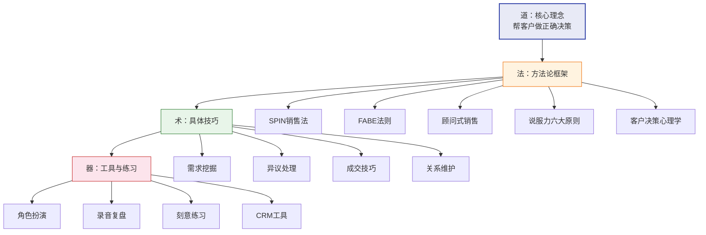
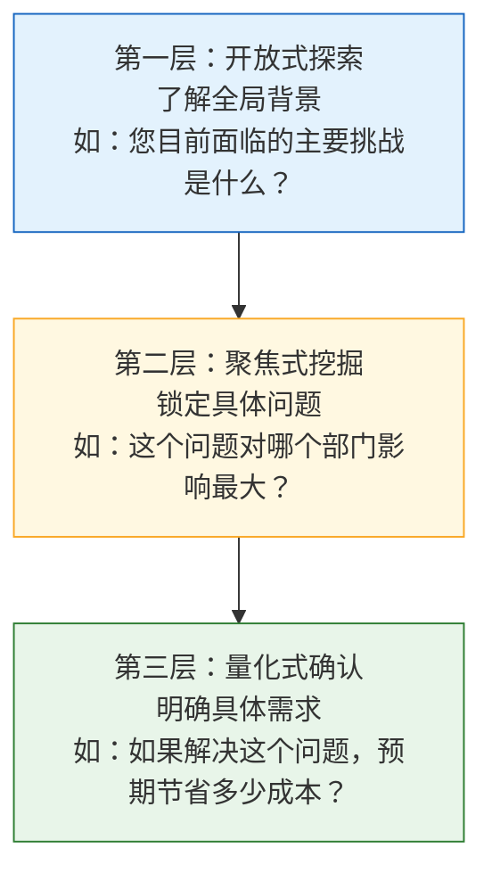
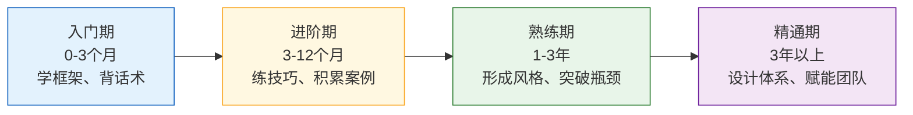

# 第十八章 销售与营销沟通 · 本章小结

## 一、全章知识体系总览

本章围绕一个核心命题展开：**销售沟通的本质是帮助客户做出正确决策，而非推销。**

这句话不是口号，而是一条分水岭——它把销售沟通从"话术堆砌"提升到"系统工程"的层次。基于这一命题，我们从道、法、术、器四个层面搭建了完整的知识体系：

下面逐一回顾每一层的核心要点。

---

## 二、理论基石回顾（道）

### 2.1 SPIN销售法——提问的科学

SPIN不是"四种问题"那么简单，它是一个完整的**需求发现引擎**。尼尔·雷克汉姆基于35,000次真实销售拜访的实证研究发现：高绩效销售人员与普通销售人员的核心差异，不在于"怎么说"，而在于"怎么问"。

| 层级 | 问题类型 | 核心功能 | 典型提问示例 |
|------|----------|----------|-------------|
| S-情境 | 了解现状 | 收集背景信息，建立对话基础 | "您目前用什么方案处理这个问题？" |
| P-难题 | 发现痛点 | 让客户主动表达不满和困扰 | "这个方案在哪些方面让您觉得不够满意？" |
| I-暗示 | 放大影响 | 让客户意识到问题的严重性和紧迫性 | "如果不解决，对团队效率的影响有多大？" |
| N-需求效益 | 引导价值 | 让客户自己说出解决方案的价值 | "如果能把这个问题解决，对您意味着什么？" |

SPIN的精髓在于：你不是在"推销"，而是在**引导客户自己完成从发现问题到渴望解决的完整思维链**。当客户亲口说出"我需要这个"的时候，成交就是水到渠成的事。

### 2.2 FABE法则——价值翻译器

FABE解决的是另一个关键问题：**如何把产品参数翻译成客户能感知的价值**。

- **F（Feature）特征**：产品的客观属性——"这款笔记本重量1.2公斤"
- **A（Advantage）优势**：这个属性带来的功能性好处——"比同类产品轻30%"
- **B（Benefit）利益**：对客户的具体价值——"每天通勤背着不累，出差也不用托运"
- **E（Evidence）证据**：支撑以上说法的可信依据——"这是第三方评测机构的对比数据"

很多销售人员停留在F和A的层面，罗列参数和优势，却忽略了B——客户真正关心的是"这对我有什么好处"。FABE的本质是一个**从产品语言到客户语言的翻译器**。

### 2.3 顾问式销售——角色的重构

顾问式销售不是一种"技巧"，而是一种**身份认同**。传统销售把自己定位为"产品推销者"，顾问式销售把自己定位为"问题解决者"。这个身份转变带来了行为上的根本变化：

| 维度 | 推销者心态 | 顾问心态 |
|------|-----------|---------|
| 关注焦点 | 产品功能 | 客户问题 |
| 沟通方式 | 陈述为主 | 提问为主 |
| 成交逻辑 | 说服客户购买 | 帮客户做出决策 |
| 关系定位 | 一次性交易 | 长期合作伙伴 |
| 成功标准 | 本次成交金额 | 客户问题是否被解决 |

### 2.4 说服力六大原则——人性的杠杆

西奥迪尼的六大影响力原则，本质上是**人类决策的六个心理快捷通道**：

1. **互惠**：先给予，再索取。免费试用、有价值的咨询、主动分享行业洞察——这些都是在"存款"，取款时客户自然不会拒绝。
2. **承诺与一致**：人倾向于与自己之前的承诺保持一致。让客户先做出小的认同（"您同意这个问题很紧迫吗？"），后续的大决策就更容易。
3. **社会认同**：人在不确定时会参考他人的行为。客户案例、行业数据、用户评价——这些不是"锦上添花"，而是降低决策风险的关键证据。
4. **喜好**：人们更容易被自己喜欢的人说服。真诚、专业、找到共同点——这不是"讨好"，而是建立有效沟通的前提。
5. **权威**：专业资质、行业认证、媒体报道——权威背书能大幅降低客户的信任成本。
6. **稀缺**：适度的紧迫感和稀缺性可以推动犹豫不决的客户做出决策。但必须基于真实情况，虚假的"限量"只会损害信任。

### 2.5 客户决策心理学——看不见的手

行为经济学揭示了人类决策中大量"非理性"的模式，理解这些模式能让销售沟通更精准：

- **损失厌恶**：人们对损失的敏感度是获得的2倍。"不解决这个问题，每个月会多浪费10小时"比"解决这个问题，每个月能节省10小时"更有说服力。
- **锚定效应**：人们会过度依赖最先接收到的信息。先展示高价值方案，再展示目标方案，后者的价格会显得更合理。
- **决策疲劳**：选项越多，决策越困难。给客户2-3个精选方案，远比给10个选项更有效。
- **框架效应**：同一信息用不同方式表达，会产生不同的决策影响。"90%的客户续费了"和"10%的客户没有续费"——数据相同，感受不同。

---

## 三、核心技能体系回顾（法与术）

### 3.1 需求挖掘——销售沟通的起点

需求挖掘是整个销售沟通的地基。如果需求诊断错误，后面所有的价值呈现、异议处理、成交技巧都建立在错误的前提上。

**漏斗式提问法**是需求挖掘的核心方法，分三层逐级收窄：

**5W2H框架**确保你不遗漏任何关键维度：Who（谁使用）、What（什么问题）、When（什么时候发生）、Where（在哪里）、Why（为什么会出现）、How（目前怎么处理）、How much（成本/影响多大）。

**反向提问**是一种高级技巧——不是问客户"你需要什么"，而是问"如果这个问题不解决，一年后会怎样"。这种提问方式激活了客户的损失厌恶心理，让需求从"可有可无"变成"必须解决"。

### 3.2 倾听与反馈——被低估的核心能力

倾听不是被动的"不说话"，而是一种**主动的信息收集和情感连接行为**。三个层次的倾听：

| 倾听层次 | 关注点 | 实操方法 |
|----------|--------|---------|
| 内容倾听 | 客户说了什么 | 记录关键信息，复述确认 |
| 情感倾听 | 客户的感受是什么 | 注意语气、语速、停顿的变化 |
| 意图倾听 | 客户真正想表达什么 | 读懂"话外音"，识别未说出口的顾虑 |

Salesforce的调研数据证实：高绩效销售的倾听能力是普通销售的2.3倍。这不是天赋，是可以训练的技能。

### 3.3 价值呈现——让客户"看到"未来

价值呈现的核心不是"说产品有多好"，而是**帮客户构建一幅"使用产品后的美好画面"**。

三种高效的呈现方式：

- **故事化呈现**：用同行业客户的真实案例，讲一个"从问题到解决"的完整故事。故事比数据更有感染力，因为大脑处理故事的方式和处理抽象信息的方式完全不同。
- **对比呈现**：用"Before vs After"的对比，让客户直观看到差异。对比越具体，感知越强烈——"从平均3天缩短到4小时"比"大幅提升效率"有力10倍。
- **成本量化**：把产品价值翻译成具体的金额。"每年节省50万人工成本"比"提高效率"更容易让决策者拍板。

### 3.4 异议处理——把阻力变成推力

客户提出异议不是拒绝，而是在说：**"我还需要更多信息才能做出决定。"**

**LSCPA框架**是处理异议的标准流程：

1. **Listen（倾听）**：完整听完客户的异议，不打断
2. **Share（认同）**：表示理解——"我完全理解您的顾虑"
3. **Clarify（澄清）**：确认真正的问题——"您说的贵，是跟哪个方案比较？"
4. **Present（提出方案）**：针对性地回应——提供证据、案例或替代方案
5. **Ask（请求行动）**：推动下一步——"如果这个问题解决了，我们是不是可以继续？"

**预防式异议管理**更高级：在客户提出异议之前就主动解决。比如，你已经知道价格是常见异议，那就在价值呈现阶段就把投入产出比算清楚，让价格异议没有萌生的土壤。

### 3.5 成交技巧——临门一脚的艺术

成交不是"逼客户做决定"，而是**在客户已经准备好时，给一个轻轻的推力**。

识别成交信号是前提——当客户开始问细节问题（"保修期多久""能不能分期"）、主动比较竞品、或反复确认某些条件时，说明他已经进入了决策阶段。

常用的成交方法包括：

- **假设成交法**：不问"要不要买"，而是问"您希望什么时候开始使用"——把对话框架从"是否购买"切换到"如何购买"。
- **选择成交法**：提供两个选项，都是"买"——"您选基础版还是专业版？"
- **总结成交法**：把之前讨论的所有价值点总结一遍，然后自然过渡到成交——"我们今天确认了A、B、C三个需求都能解决，接下来我们看看合同细节？"
- **紧迫感成交法**：基于真实的稀缺性或时间节点——"这个优惠本月底截止"或"目前库存只剩最后一批"。

每种方法都有适用场景，没有"万能成交法"。关键是根据客户类型、沟通阶段和具体情境灵活选择。

### 3.6 关系维护——从一次交易到终身客户

成交不是终点，而是长期关系的起点。客户生命周期价值（CLV）的概念告诉我们：一个老客户的长期贡献远超一次成交的金额。

**售后跟进节奏**：
- 成交后24小时内：感谢+确认使用情况
- 第7天：主动询问使用体验，解决问题
- 第30天：分享相关资源或行业资讯
- 第90天：深度回访，探索新的合作机会

**客户分层管理**：不是所有客户都值得同样的投入。按照购买频次、金额和推荐意愿，将客户分为A/B/C/D四级，差异化分配维护资源。

**转介绍培养**：满意的客户是最好的销售渠道。但转介绍不会自动发生——你需要在合适的时机、用合适的方式引导。最佳时机是客户刚刚表达了满意之情的时候。

---

## 四、实战场景回顾

本章通过六大行业的完整案例，将理论和技巧落地到了具体场景中：

| 行业场景 | 核心挑战 | 关键方法 |
|----------|---------|---------|
| 房产销售 | 高价值、长决策周期、家庭决策 | SPIN需求诊断+场景化带看+家庭决策者管理 |
| B2B软件 | 多决策者、技术门槛、ROI论证 | MEDDIC资格审查+价值量化+多层级沟通 |
| 保险行业 | 信任门槛高、产品抽象、情感因素 | 损失厌恶引导+故事化呈现+长期关系经营 |
| 高端零售 | 体验驱动、品牌溢价、个性化需求 | 顾问式服务+稀缺性管理+VIP关系维护 |
| 电话销售 | 时间极短、信任为零、拒绝率高 | 开场白设计+快速价值锚定+异议预防 |
| 社交媒体营销 | 注意力分散、互动性强、内容为王 | 内容营销+社群运营+私域转化 |

每个案例都展示了同一个原理在不同场景下的灵活应用：**先理解需求，再呈现价值，最后推动决策**。场景会变，底层逻辑不变。

---

## 五、十大误区速查表

在实战中，以下十个误区最容易出现。将此表打印出来，放在工位旁边，随时自检：

| 编号 | 误区名称 | 典型表现 | 纠正方法 |
|------|---------|---------|---------|
| 1 | 过度推销 | 全程不停地说，不给客户表达机会 | 遵循二八法则：客户说80%，你说20% |
| 2 | 忽视倾听 | 表面在听，实际在想下一句说什么 | 客户说完后停顿1-2秒，先复述再回应 |
| 3 | 急于报价 | 客户一问价就立刻报价 | 先建立价值，再谈价格 |
| 4 | 只谈功能不谈价值 | 罗列产品参数，不翻译成客户利益 | 用FABE法则将每个功能转化为客户价值 |
| 5 | 忽视决策链 | 只和对接人沟通，不了解真正的决策者 | 画出客户组织的决策地图 |
| 6 | 害怕异议 | 客户一提异议就紧张退缩 | 异议=兴趣信号，用LSCPA框架处理 |
| 7 | 过早成交 | 还没建立充分信任就急于推进 | 先确认客户处于决策阶段，再使用成交技巧 |
| 8 | 忽视售后 | 成交后就消失，不再跟进 | 建立系统化的售后跟进节奏 |
| 9 | 千篇一律 | 对所有客户用同一套话术 | 根据客户画像和决策风格个性化沟通 |
| 10 | 不做复盘 | 每次沟通后不总结、不反思 | 每次沟通后用自检清单做5分钟复盘 |

---

## 六、能力自评与进阶路径

### 6.1 你现在在哪里？

完成本章学习后，用以下标准给自己打分。每项1-5分，诚实评估：

| 能力维度 | 1分（薄弱） | 3分（合格） | 5分（精通） |
|----------|------------|------------|------------|
| 需求挖掘 | 不知道该问什么 | 能用SPIN框架提问 | 能根据客户反应灵活调整提问策略 |
| 倾听能力 | 经常打断客户 | 能完整听完并复述 | 能听出客户未说出口的深层需求 |
| 价值呈现 | 照搬产品手册 | 能用FABE翻译价值 | 能用故事和案例让客户"看到"未来 |
| 异议处理 | 一遇到异议就慌 | 能用LSCPA处理常见异议 | 能预防异议，并将异议转化为推力 |
| 成交能力 | 不知道何时成交 | 能识别信号并选择方法 | 能根据情境灵活组合多种成交法 |
| 关系维护 | 成交后不跟进 | 有固定的跟进节奏 | 能系统化管理客户生命周期 |

**总分对照**：
- 6-12分：入门阶段，重点精读理论基础和核心技巧
- 13-20分：进阶阶段，重点练习实战案例和录音复盘
- 21-25分：熟练阶段，重点突破误区和深度拓展
- 26-30分：精通阶段，重点是将个人能力复制给团队

### 6.2 从入门到精通的四阶路径

**入门期（0-3个月）**：目标是"知道怎么做"。重点掌握SPIN和FABE两个基础框架，能在模拟练习中完整运用。每天花30分钟练习提问设计，每周做一次角色扮演。

**进阶期（3-12个月）**：目标是"做得像样"。将框架应用到真实场景中，通过录音复盘不断优化。积累10个以上成功案例，建立自己的"最佳实践库"。

**熟练期（1-3年）**：目标是"形成风格"。不再依赖固定框架，而是根据情境灵活运用。能处理复杂的多决策者场景，成交率稳定在行业平均水平以上。

**精通期（3年以上）**：目标是"赋能他人"。能将自己的经验提炼为可复制的方法论，训练和辅导团队成员。关注销售体系设计、销售赋能（Sales Enablement）和AI辅助销售等前沿方向。

---

## 七、21天行动计划

理论不落地等于零。以下是一个分三阶段的行动计划，帮你把本章知识转化为真实能力。

### 第一周：认知升级——重新审视自己的销售方式

| 天数 | 行动项 | 具体做法 | 完成标志 |
|------|--------|---------|---------|
| Day 1 | 自我诊断 | 对照"十大误区"逐项自评，找出最突出的3个 | 写下3个最需要改进的误区 |
| Day 2 | 客户画像 | 用客户画像模板分析你最重要的3个客户 | 完成3份客户画像卡 |
| Day 3 | 话术重写 | 选3段你常用的产品介绍，用FABE法则重新改写 | 改写前后对比文档 |
| Day 4 | 问题设计 | 为你最重要的产品设计完整的SPIN问题链 | 每个层级至少5个问题 |
| Day 5 | 录音收集 | 回听2次过去的销售沟通录音 | 标注3个做得好的地方和3个待改进的地方 |
| Day 6 | 案例学习 | 精读本章中与你行业最接近的实战案例 | 提取5个可借鉴的技巧 |
| Day 7 | 周复盘 | 总结本周收获，调整下周计划 | 写下"本周最大洞察" |

### 第二周：技能训练——把框架变成肌肉记忆

| 天数 | 行动项 | 具体做法 | 完成标志 |
|------|--------|---------|---------|
| Day 8 | SPIN模拟 | 与同事做一次完整的SPIN提问模拟 | 录音并评分 |
| Day 9 | 倾听练习 | 在一次真实对话中，刻意练习"听完再回应" | 记录练习感受 |
| Day 10 | 异议处理 | 列出5个最常见的客户异议，用LSCPA写出手稿 | 完成5份异议处理脚本 |
| Day 11 | 成交练习 | 准备3种成交方法的话术，对镜演练 | 每种至少练习3遍 |
| Day 12 | 电梯演讲 | 准备并演练你的60秒价值陈述 | 控制在60秒以内，能自然表达 |
| Day 13 | 对比练习 | 用"Before vs After"的方式呈现产品价值 | 完成3组对比话术 |
| Day 14 | 周复盘 | 回听本周的模拟和真实录音 | 对比上周，标注进步 |

### 第三周：实战应用——在真实场景中验证

| 天数 | 行动项 | 具体做法 | 完成标志 |
|------|--------|---------|---------|
| Day 15 | SPIN实战 | 在真实销售沟通中有意识地运用SPIN提问 | 记录实际效果 |
| Day 16 | 录音复盘 | 录制并回听一次完整销售沟通 | 用自检清单打分 |
| Day 17 | 异议实战 | 在真实场景中用LSCPA处理一次异议 | 记录客户反应 |
| Day 18 | 价值呈现 | 用故事化方式呈现一次产品价值 | 记录客户反应 |
| Day 19 | 成交尝试 | 识别一次成交信号，选择合适的成交方法 | 记录结果 |
| Day 20 | 关系维护 | 给3个老客户发送有价值的跟进信息 | 记录回复情况 |
| Day 21 | 终极复盘 | 全面回顾21天的收获和成长 | 写下"最大的3个改变" |

### 持续习惯：把学习变成日常

21天只是起点，以下习惯需要长期坚持：

- **每次销售沟通后**：用"自检清单"做5分钟复盘——今天用了哪些框架？哪些做得好？哪些可以改进？
- **每周**：回听1-2次销售录音，标注改进点
- **每月**：更新客户画像和竞品分析，刷新话术库
- **每季度**：回顾并优化你的销售方法论，看看有没有新的工具或技巧可以整合

---

## 八、核心方法论速查卡

将以下内容做成卡片，放在手机备忘录或打印出来随身携带：

### SPIN提问速查

S-情境：你现在用什么方案？团队规模多大？预算范围？
P-难题：哪些方面不够满意？最大的困扰是什么？
I-暗示：如果不解决，对业绩/效率/成本的影响？
N-需求效益：如果解决了，对你的价值是什么？

### FABE价值陈述速查

F-特征：我们的产品具有______
A-优势：这意味着______
B-利益：对您来说，具体的好处是______
E-证据：已经有______（客户/数据/案例）验证了这一点

### LSCPA异议处理速查

L-倾听：完整听完，不打断
S-认同："我完全理解您的顾虑"
C-澄清："您说的______，能具体说说是跟什么比较吗？"
P-方案："针对这个问题，我的建议是______"
A-行动："如果这个解决了，我们是不是可以______？"

### 成交信号识别

□ 客户开始问细节（保修、付款方式、交付时间）
□ 客户主动比较竞品
□ 客户反复确认某些条件
□ 客户的语气从"如果"变成"当我们"
□ 客户开始和内部人员讨论实施方案

---

## 九、推荐阅读与学习资源

### 必读书目

| 书名 | 作者 | 核心价值 | 适合阶段 |
|------|------|---------|---------|
| 《SPIN销售法》 | 尼尔·雷克汉姆 | 销售提问的奠基之作，基于35,000次销售拜访的实证研究 | 入门-进阶 |
| 《影响力》 | 罗伯特·西奥迪尼 | 理解说服力六大原则的经典之作，读懂人性才能影响决策 | 入门-精通 |
| 《挑战式销售》 | 马修·迪克森 | 打破传统销售认知，揭示高绩效销售人员的核心特质是"挑战"客户思维 | 进阶-熟练 |
| 《销售的革命》 | 尼尔·雷克汉姆 | 顾问式销售的系统方法论，从理论到实践的完整路径 | 进阶-精通 |

### 进阶书目

| 书名 | 作者 | 核心价值 | 适合阶段 |
|------|------|---------|---------|
| 《影响力2》 | 帕特森等 | 将影响力原则从个人层面扩展到组织变革和团队管理 | 熟练-精通 |
| 《绝对成交》 | 罗杰·道森 | 谈判与成交技巧的实战指南，10种成交法的深度应用 | 进阶-熟练 |
| 《客户说》 | 杰夫·吉托默 | 从客户视角重新理解销售，打破"销售员视角"的局限 | 进阶-熟练 |
| 《定位》 | 杰克·特劳特 | 理解营销沟通中的心智占领策略，从销售思维升级到品牌思维 | 熟练-精通 |
| 《销售巨人》 | 尼尔·雷克汉姆 | SPIN的进阶版，针对大订单销售的完整方法论 | 熟练-精通 |
| 《新战略销售》 | 米勒·黑曼 | 复杂销售中的策略规划，多决策者的博弈分析 | 精通 |

### 学习资源

**播客与音频**：
- 《销售与管理》——国内销售领域的头部播客，覆盖实战技巧和行业趋势
- 《混沌学园》中关于销售沟通的专题——从更宏观的商业视角理解销售

**在线课程**：
- 各大平台搜索"顾问式销售""SPIN销售法"相关课程，选择有实战案例的
- LinkedIn Learning 上的 Sales Foundations 系列——英文资源，质量稳定

**实践社群**：
- 加入销售从业者社群，与同行交流经验和案例
- 参加行业交流会和销售沙龙，在真实互动中检验所学

---

## 十、最后的话

> "优秀的销售不是让客户买他不需要的东西，而是帮助客户发现他真正需要的东西。"

销售沟通是一门需要持续修炼的技艺。理论给你方向，练习给你能力，实践给你智慧。没有人在读完一本书后就成为销售高手，但每一个认真阅读、用心练习、持续复盘的人，都在通往高手的路上。

请永远记住本章最重要的三句话：

1. **先诊断，后开方**——永远先理解需求，再推荐方案。跳过诊断直接开方的医生你会信吗？销售也一样。
2. **先价值，后价格**——在价值建立之前，价格永远显得太贵。客户不是嫌贵，是觉得"不值"。
3. **先关系，后成交**——信任是一切成交的基础。没有信任的成交是一锤子买卖，有信任的成交是长期合作的开始。

祝你在销售沟通的路上，不仅收获业绩，更收获客户真诚的信任和长久的伙伴关系。

***
