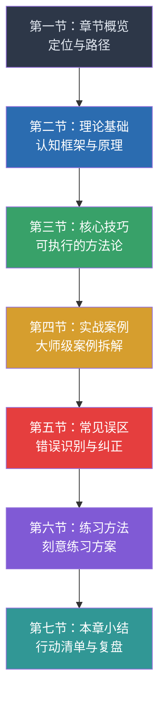

# 第十九章 公开演讲进阶

## 引言

公开演讲是人类文明中最古老、最具杠杆效应的沟通形式。古希腊的伯里克利用一篇葬礼演说塑造了雅典民主的精神内核；丘吉尔的"我们将在海滩上战斗"在1940年将一个濒临投降的国家拉回了战争；马丁·路德·金的"我有一个梦想"推动了整个民权运动的进程。在当代商业世界中，乔布斯2007年iPhone发布会上的120分钟演讲，直接为苹果创造了超过数十亿美元的品牌价值；埃隆·马斯克的每一次产品发布会都能直接影响特斯拉的股价波动。

然而，公开演讲也是现代社会中最大的恐惧来源之一。美国心理学会（APA）的调查显示，约73%的成年人对公开演讲存在不同程度的焦虑，这一比例甚至超过了对死亡的恐惧（盖洛普调查数据）。更值得关注的是，这种恐惧并非来自演讲本身的技术难度，而是源于人类大脑对"社交评价威胁"的本能反应——当我们站在一群人面前时，大脑的杏仁核会将这种场景编码为生存威胁，触发"战或逃"反应。

**这就是为什么"进阶"如此重要。** 初级演讲者关注的是"如何不紧张"和"如何把话说完"；而进阶演讲者关注的是"如何让思想产生影响力"。本章的核心命题是：**公开演讲不是天赋，而是一套可以系统习得的认知-行为技能体系。** 每一位世界级演讲者的背后，都不是天生的口才，而是对演讲原理的深刻理解和数千小时的刻意练习。

本章将带你跨越从"能讲"到"讲得好"再到"讲得有影响力"的鸿沟。我们将深入剖析TED演讲的设计方法论、即兴演讲的认知框架、故事讲述的神经科学原理、舞台表现力的系统构建、声音与肢体的精细控制、视觉辅助的专业设计、观众互动的心理学机制，以及演讲焦虑的认知行为干预策略。无论你的目标是在公司年会上自信发言、在行业峰会上分享洞见，还是成为一名职业演讲者，本章都为你提供从理论到实操的完整路线图。

***

## 章节结构

本章共七个部分，按照"理论→技巧→实战→纠偏→练习"的逻辑递进，每个部分都包含丰富的案例、工具和练习方法：

| 部分 | 主题 | 核心内容 | 适用人群 |
|------|------|----------|----------|
| 第一节 | 章节概览 | 学习路径、自我评估、知识地图 | 所有读者 |
| 第二节 | 理论基础 | 亚里士多德说服三要素、TED设计原理、即兴演讲认知框架、故事神经科学、演讲焦虑机制 | 希望理解"为什么"的读者 |
| 第三节 | 核心技巧 | 演讲结构设计、声音控制、肢体语言、视觉辅助设计、观众互动策略、焦虑管理 | 所有读者，重点参考 |
| 第四节 | 实战案例 | TED经典演讲拆解、商业发布会分析、政治演说解读、学术报告优化 | 希望从案例中学习的读者 |
| 第五节 | 常见误区 | 十大演讲陷阱、不同场景的典型错误、纠错方法 | 有演讲经验但遇到瓶颈的读者 |
| 第六节 | 练习方法 | 30天训练计划、刻意练习框架、反馈收集系统、进阶训练 | 希望系统提升的读者 |
| 第七节 | 本章小结 | 核心要点回顾、行动清单、推荐阅读 | 所有读者 |

***

## 学习目标

完成本章学习后，你将掌握以下九项核心能力。每项目标都对应具体的可衡量成果：

### 一、理解TED演讲的设计原理

掌握克里斯·安德森提出的"值得传播的思想"（Ideas Worth Spreading）核心理念，理解TED演讲从选题、结构、故事到呈现的完整设计方法论。你将能够分析任何TED演讲的设计逻辑，并将这些原理应用到自己的演讲设计中。

**可衡量成果：** 能够在30分钟内完成一份TED演讲的结构分析报告，识别其说服策略和情感路径。

### 二、运用即兴演讲框架

掌握PREP（观点-理由-例证-重述）、STAR（情境-任务-行动-结果）、PRS（问题-原因-方案）等即兴演讲框架，能够在无准备或低准备情况下进行有条理、有说服力的发言。

**可衡量成果：** 收到任意话题后，能在15秒内构思出清晰的发言框架，60秒内完成一段结构完整的即兴演讲。

### 三、讲述引人入胜的故事

理解故事讲述的神经科学基础——当听众听到故事时，大脑会释放催产素（增强信任感）和多巴胺（增强注意力），镜像神经元会被激活（产生共情体验）。掌握英雄之旅、三幕结构、起承转合等故事框架，能够将抽象概念转化为具有情感冲击力的叙事。

**可衡量成果：** 能够为任意主题设计一个包含冲突、转折、高潮的故事，使听众的情感投入度提升50%以上。

### 四、展现强大的舞台表现力

学会运用舞台空间（空间锚定法）、身体姿态（力量姿势）、眼神交流（3-5秒法则）等元素，建立权威感和亲和力。理解舞台表现力不是"表演"，而是将内在自信外化的自然过程。

**可衡量成果：** 能够在舞台上自如移动、与全场观众建立眼神连接，肢体语言与语言内容协调一致。

### 五、控制声音的表达力

掌握音量变化、语速控制（正常语速150-160字/分钟，强调时放慢到100字/分钟）、语调起伏、战略性停顿等声音技巧。理解声音是演讲者最强大的工具——同一个句子，用不同的声音处理可以传达截然不同的含义。

**可衡量成果：** 能够有意识地运用至少四种声音变化技巧，使听众的注意力保持率提升30%以上。

### 六、运用肢体语言增强表达

掌握手势的语义功能（指示性手势、描述性手势、节奏性手势、情感性手势）、站姿的权威效应、移动的叙事功能等非语言沟通技巧。研究表明，在面对面沟通中，肢体语言传递的信息量占总信息量的55%（梅拉比安沟通法则）。

**可衡量成果：** 演讲中肢体语言的使用频率和自然度达到中等以上水平，观众能够仅通过观看无声视频理解演讲的大致意图。

### 七、设计有效的视觉辅助

掌握视觉辅助的核心原则：视觉辅助是"辅助"而非"主角"。学会设计简洁、有力、服务演讲内容的幻灯片。理解认知负荷理论——观众的工作记忆只能同时处理4±1个信息单元，因此每张幻灯片的信息量必须严格控制。

**可衡量成果：** 能够设计出图文比例7:3、每张幻灯片传达一个核心信息的演讲辅助材料。

### 八、与观众建立深度连接

学会运用"提问-等待-回应"的互动循环、破冰技巧、共情确认、幽默管理等策略，将观众从被动的信息接收者转变为主动的参与者。理解"演讲是对话的放大版"这一核心理念。

**可衡量成果：** 能够在演讲中设计至少三个互动节点，使观众的参与度和满意度显著提升。

### 九、管理演讲焦虑

掌握演讲焦虑的认知行为干预策略，包括认知重构（将"我会失败"转化为"我有准备"）、系统脱敏（从小场景到大场景逐步暴露）、呼吸调节（4-7-8呼吸法）、充分准备（熟悉场地、预演、准备应急方案）等方法。理解适度焦虑（肾上腺素水平提升）实际上可以提升演讲表现。

**可衡量成果：** 能够将演讲前的焦虑水平控制在可管理范围内（自评焦虑量表6分以下/10分），并能够将焦虑转化为积极的能量。

***

## 前置知识自评

在开始本章学习之前，请先评估自己的当前水平。这将帮助你选择最合适的学习路径：

| 评估维度 | 入门级（0-2分） | 进阶级（3-5分） | 精通级（6-8分） |
|----------|-----------------|-----------------|-----------------|
| **演讲经历** | 仅在小范围内发言，少于5次公开演讲 | 有10次以上公开演讲经验，在百人以下场合感到自在 | 有百人以上场合的演讲经验，或已进行过付费演讲 |
| **演讲设计** | 从网上找模板，直接填内容 | 能独立设计结构，但缺乏系统方法论 | 理解多种设计框架，能灵活组合运用 |
| **故事讲述** | 讲事实为主，很少用故事 | 偶尔用故事，但不系统 | 能为任何主题设计引人入胜的故事 |
| **声音控制** | 语调平缓，容易紧张加速 | 有意识地控制语速和音量 | 能自如运用声音变化技巧，声音本身就有感染力 |
| **肢体语言** | 站着不动或来回踱步，手势较少 | 有基本的肢体语言意识 | 肢体语言自然、有力，与内容协调一致 |
| **观众互动** | 单向输出，很少与观众互动 | 偶尔提问，有基本互动意识 | 能灵活运用多种互动策略，掌控全场气氛 |
| **焦虑管理** | 演讲前严重焦虑，影响睡眠 | 有焦虑但能应对，不影响正常表现 | 将焦虑视为正常反应，能有效转化 |

**评分说明：** 每个维度选择最符合你情况的等级，对应的分数即为你在该维度的水平。总分0-18分为入门级，19-38分为进阶级，39-56分为精通级。

**自评结果与学习路径：**

- **入门级（0-18分）：** 从第二节理论基础开始，建立系统认知框架。重点学习第三节中的基础技巧，配合第六节的入门练习方案。不要急于上台实战，先在安全环境中建立信心。
- **进阶级（19-38分）：** 直接从第三节核心技巧开始，针对薄弱环节重点突破。通过第四节实战案例进行深入学习，结合第五节纠正常见误区。可以同步开始第六节的进阶练习。
- **精通级（39-56分）：** 重点关注第二节中的高级理论（如说服心理学、神经科学原理），第三节中的高级技巧（如即兴演讲、危机演讲），以及第四节中的大师级案例分析。你可以跳过基础内容，直接进入深度学习。

***

## 学习路径指南

### 初学者路径：建立基础（建议用时：2周）

**第一周：理论认知**

1. 阅读本节（章节概览），完成自评，明确学习目标
2. 精读第二节（理论基础），重点理解演讲学的核心框架
3. 阅读第三节（核心技巧）中的基础部分，记录关键要点

**第二周：技能入门**

1. 学习第三节中的声音控制和肢体语言基础技巧
2. 观看第四节中的基础案例分析，模仿优秀演讲者的基本要素
3. 开始第六节中的入门练习，每天15分钟基础训练

**关键里程碑：** 能够在5人以下的小范围内，进行3分钟的结构化发言，声音清晰、肢体自然。

### 有经验者路径：突破瓶颈（建议用时：3周）

**第一周：技巧精进**

1. 完成自评，找到最薄弱的2-3个维度
2. 重点学习第三节中对应维度的高级技巧
3. 阅读第五节，识别并纠正常见误区

**第二周：案例研习**

1. 深入分析第四节中的3-5个经典案例
2. 尝试拆解自己过往的演讲视频（如果有），对照案例找差距
3. 学习第三节中的视觉辅助设计和观众互动技巧

**第三周：实战演练**

1. 完整设计一场10分钟的演讲，应用所学技巧
2. 进行至少3次完整排练，录像回看
3. 开始第六节中的进阶练习方案

**关键里程碑：** 能够在50人以下的场合，自信地进行15分钟以上的演讲，有明确的结构、故事和互动设计。

### 进阶者路径：达到专业（建议用时：4周）

**第一周：理论深化**

1. 深入学习第二节中的高级理论，特别是说服心理学和神经科学原理
2. 阅读第四节中的大师级案例分析，理解顶级演讲者的深层策略
3. 研究跨文化演讲的差异和适应策略

**第二周：技巧融合**

1. 整合声音、肢体、视觉、互动等多种技巧，形成个人风格
2. 练习即兴演讲的高级技巧
3. 学习危机演讲、高压场景等特殊情境的应对策略

**第三周：实战打磨**

1. 设计一场20分钟以上的专业演讲
2. 在小范围观众面前进行完整演练，收集反馈
3. 根据反馈迭代优化

**第四周：建立体系**

1. 形成个人的演讲设计流程和方法论
2. 建立演讲练习和反馈收集的长期机制
3. 制定未来3个月的演讲提升计划

**关键里程碑：** 能够在任意场合自信地进行高质量演讲，有清晰的个人风格，能够应对各种突发情况。

### 实践导向路径（适用于所有水平）

无论你的水平如何，以下原则都适用：

1. **阅读后立即实践：** 每学完一个技巧，当天就找机会练习。可以是对着镜子、录视频、或在小范围内尝试。
2. **建立练习习惯：** 每天至少15分钟的刻意练习。可以是声音训练、肢体练习、故事设计或即兴演讲。
3. **录像回看：** 每周至少录一次完整的演讲练习，回看并分析改进点。
4. **收集反馈：** 找一位信任的观众或导师，定期听取反馈。
5. **实战检验：** 每月至少参加一次公开演讲活动，将所学技巧应用到真实场景中。

**记住：** 公开演讲是一项实践性极强的技能。阅读本书可以帮助你理解原理和方法，但真正的提升只能来自大量的练习和实战。理论是地图，实践是旅程。

***

## 本章关键词

以下关键词贯穿本章始终，理解它们是掌握本章内容的基础：

| 关键词 | 定义 | 核心要点 |
|--------|------|----------|
| **TED演讲** | Technology, Entertainment, Design的缩写，指以"值得传播的思想"为核心理念的演讲形式 | 强调简洁、故事驱动、视觉辅助、18分钟限制 |
| **即兴演讲** | 在没有准备或低准备情况下进行的演讲 | 依赖框架（PREP/STAR/PRS）而非记忆，核心是快速组织思维 |
| **故事讲述** | 通过叙事结构传递信息、引发情感共鸣的技巧 | 神经科学基础：催产素、多巴胺、镜像神经元激活 |
| **舞台表现力** | 演讲者在舞台上展现的自信、权威和亲和力 | 包括空间运用、姿态管理、眼神交流、移动策略 |
| **声音控制** | 对音量、语速、语调、停顿等声音要素的有意识调控 | 正常语速150-160字/分钟，停顿是最高级的声音技巧 |
| **肢体语言** | 通过手势、站姿、移动等非语言元素传递信息 | 梅拉比安法则：非语言占沟通信息量的55% |
| **视觉辅助** | 幻灯片、道具、白板等服务演讲内容的视觉元素 | 认知负荷理论：每张幻灯片只传达一个核心信息 |
| **观众互动** | 通过提问、回应、参与等方式与观众建立双向连接 | "演讲是对话的放大版"，互动提升参与度和记忆率 |
| **演讲焦虑** | 演讲前后的紧张、恐惧、不安等情绪反应 | 适度焦虑提升表现，认知行为干预是最有效的应对策略 |
| **说服力** | 通过演讲改变他人观点、态度或行为的能力 | 亚里士多德三要素：Ethos（品格）、Pathos（情感）、Logos（逻辑） |
| **PREP框架** | Point（观点）-Reason（理由）-Example（例证）-Point（重述） | 即兴演讲最常用的结构化框架 |
| **英雄之旅** | 约瑟夫·坎贝尔提出的叙事原型，包含12个阶段 | 故事讲述的核心框架，适用于几乎所有类型的叙事 |

***

## 核心理念：演讲是思想的放大器

在深入学习具体技巧之前，请先理解这个核心理念：**演讲的本质不是表演，而是思想的传播。** 一位优秀的演讲者不是"会说话的人"，而是"有思想并能有效传递思想的人"。

TED演讲策展人克里斯·安德森在《演讲的力量》中写道："演讲的核心是思想。如果演讲没有传递任何有价值的思想，那么再华丽的技巧也只是空壳。"这句话揭示了演讲的本质——**内容为王，技巧为臣。**

这引出了进阶演讲者的第一个关键认知转变：**从关注"如何讲"转向关注"讲什么"和"为什么讲"。** 初级演讲者花80%的时间准备幻灯片和背稿，而世界级演讲者花80%的时间思考思想本身——这个思想值得传播吗？它能改变什么？它与听众有什么关系？

当你理解了这一点，本章的所有技巧就有了根基：故事讲述是为了让思想更易理解和记忆；声音和肢体控制是为了让思想更有感染力；观众互动是为了让思想真正触达每一个人；焦虑管理是为了让你能自如地传递思想。

带着这个核心理念，让我们开始本章的学习之旅。
