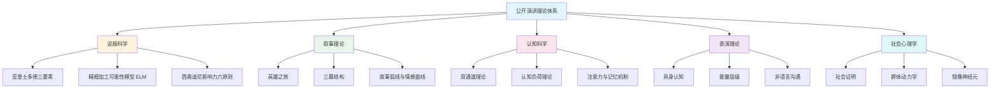
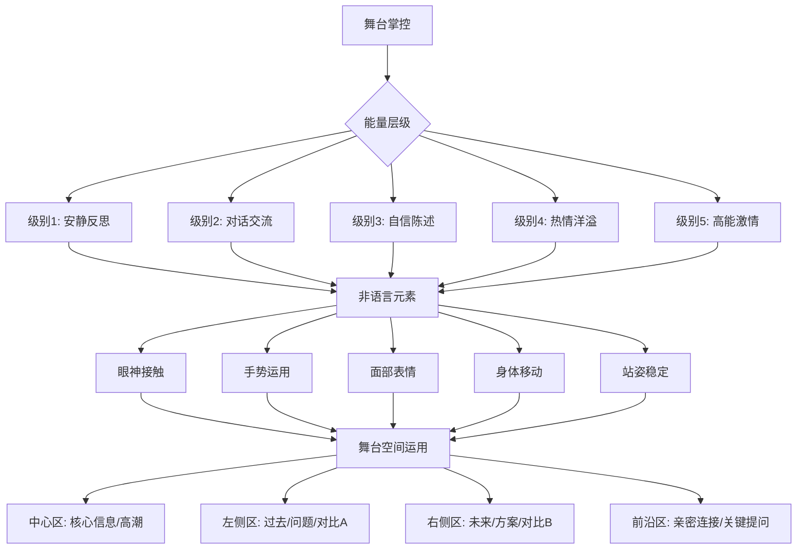
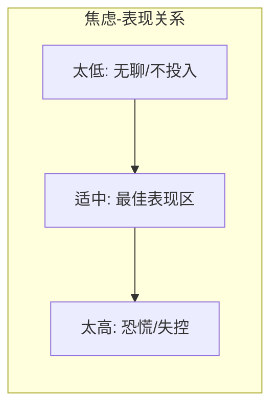

# 第十九章 公开演讲进阶 — 理论基础

公开演讲是一门融合了修辞学、认知科学、神经科学、心理学和表演艺术的综合学科。本章从理论根基出发，系统梳理支撑现代公开演讲的核心知识体系——从两千多年前亚里士多德的修辞三要素，到当代认知科学对注意力、记忆和情感加工的最新发现，为后续章节的技巧与实操提供坚实的理论支撑。

### 演讲技巧知识体系全景图

---

## 一、亚里士多德的说服三要素

公开演讲的理论根基可以追溯到公元前4世纪。亚里士多德在《修辞学》（*Rhetoric*）中系统论述了说服的三个核心要素：**Ethos（品格）、Pathos（情感）、Logos（逻辑）**。这三个要素构成了理解一切公开演讲的基础框架，至今仍是哈佛大学、斯坦福大学等顶级院校传播学课程的核心内容。

亚里士多德认为，修辞术不是"说服任意对象关于任意事物的技艺"，而是"在每一种情形中发现可用的说服手段的能力"。这一定义本身就揭示了演讲的本质：**说服不是操控，而是在特定情境中找到最有效沟通路径的能力**。

### 1.1 Ethos（品格/可信度）

Ethos 指的是演讲者在观众心中建立的品格形象和可信度。亚里士多德将 Ethos 称为说服中"最有效的手段"——因为如果观众不信任你，再好的逻辑和情感都无法打动他们。

**Ethos 的三个来源：**

- **实践智慧（Phronesis）**：你在该领域的专业知识和判断力。观众需要相信你"知道自己在说什么"
- **美德（Arete）**：你表现出的道德品格和正直。观众需要相信你"不会误导他们"
- **善意（Eunoia）**：你对观众利益的真诚关切。观众需要相信你"是站在他们这一边的"

**为什么前30秒至关重要：**

心理学中的"首因效应"（Primacy Effect）表明，人们对信息的第一印象会显著影响后续信息的解读。普林斯顿大学的研究发现，人们在看到面孔的100毫秒内就会形成关于可信度的判断。在演讲场景中，观众在开场30秒内就会对演讲者形成相对稳定的认知框架，后续的所有信息都会在这个框架内被解读。

**建立 Ethos 的六种策略：**

1. **展示相关经验**：简要提及你的背景和实践经历，但要避免自夸。说"我在XX领域工作了15年，见过无数团队在这个问题上栽跟头"比"我是行业顶尖专家"更有效
2. **引用权威**：引用专家观点、学术研究或行业数据来支持你的论点，让观众看到你的论点有坚实的学术或实践基础
3. **承认局限**：坦诚地承认你不知道的或不确定的，反而能增加可信度。心理学中的"瑕疵效应"（Pratfall Effect）表明，适度展示缺点会让有能力的人更受喜爱
4. **展现真诚**：真实地分享你的经历和感受，包括失败和挫折。虚假的完美远不如真实的不完美有说服力
5. **使用专业术语的恰当翻译**：展示你既懂专业又能让外行理解的能力
6. **第三方背书**：在开场时提及观众信任的第三方对你的认可

### 1.2 Pathos（情感/共鸣）

Pathos 指的是通过情感来打动观众的能力。亚里士多德指出，"人们在快乐和友爱的状态下更容易做出肯定判断，在痛苦和敌意的状态下更容易做出否定判断。"这意味着**情感不仅是说服的手段，更是判断的心理背景色**。

**为什么情感比逻辑更有说服力：**

安东尼奥·达马西奥（Antonio Damasio）在《笛卡尔的错误》中通过脑损伤患者的研究证明：失去情感能力的人不仅不会变得更理性，反而连最简单的决策都无法做出。这颠覆了"理性与情感对立"的传统观点——**情感不是理性的敌人，而是决策的必要条件**。

丹尼尔·卡尼曼在《思考，快与慢》中提出的双系统理论进一步解释了这一机制：

| 系统 | 特征 | 演讲中的应用 |
|------|------|------------|
| 系统1（快思考） | 自动化、直觉、情感驱动、低能耗 | 故事、比喻、画面感——快速打动观众 |
| 系统2（慢思考） | 刻意、理性、逻辑驱动、高能耗 | 数据、论证、推理——深度说服观众 |

高效演讲的秘诀在于：**用系统1打开通道，用系统2巩固信念**。先用故事或画面激发情感共鸣，再用数据和逻辑提供理性支撑。

**运用 Pathos 的五种方法：**

1. **讲故事**：故事是最强大的情感工具，能够让抽象概念变得具体、生动、可感知。具体的方法见本章第四节
2. **使用感官语言**：不说"环境很差"，而说"空气里弥漫着刺鼻的化学气味，脚下是黏糊糊的黑色淤泥"——调动观众的视觉、听觉、嗅觉、触觉和味觉
3. **分享个人经历**：真诚地分享你自己的故事，建立情感连接。但要注意：分享的目的不是自我表达，而是让观众在你的故事中看到自己
4. **创造对比和冲突**：情感的强度来自于对比——光明与黑暗、希望与绝望、过去与现在。没有对比就没有戏剧张力
5. **关注观众的需求**：将你的信息与观众的痛点、渴望和关切联系起来。观众不关心你想说什么，他们关心你所说的与他们有什么关系

### 1.3 Logos（逻辑/理性）

Logos 指的是通过逻辑和证据来说服观众的能力。虽然情感能够打动人心，但没有逻辑支撑的演讲就像没有骨架的身体——无法站立。

**增强 Logos 的五种策略：**

1. **使用数据和事实**：用具体的数据来支持你的观点。但要注意：数据本身不会说话，你需要为观众解读数据的含义。"用户流失率从15%降到了3%"远不如"用户流失率从15%降到了3%——这意味着我们每年多留住了12万用户，价值约2.4亿"
2. **建立清晰的逻辑链条**：让观众能够跟随你的思路。使用"因为……所以……"、"如果……那么……"等逻辑连接词
3. **使用类比和隐喻**：将陌生的概念映射到观众熟悉的事物上。"机器学习就像教小孩认猫——你不需要告诉它猫有几根胡须，你只需要给它看足够多的猫"
4. **预判反驳**：提前考虑可能的反对意见并做出回应。这不仅增强了你的论证，也展示了你的思考深度
5. **结构化呈现**：使用"三个理由"、"五个步骤"等结构化框架，帮助观众跟随和记忆

### 1.4 三要素的协同运用

真正有说服力的演讲需要同时运用三个要素。单靠任何一个都不够：

| 只有 Ethos | 只有 Pathos | 只有 Logos |
|-----------|------------|-----------|
| 有威望但空洞 | 有感染力但不可信 | 有道理但不动人 |
| "相信我，因为我是专家" | "让我们一起哭/笑" | "数据证明我是对的" |
| 观众尊重但不行动 | 观众感动但不持久 | 观众理解但不在乎 |

**最佳组合**是：先用 Ethos 建立信任，再用 Pathos 打开心门，最后用 Logos 巩固信念。这与"先让人喜欢你，再让人被你打动，最后让人认同你"的人际说服逻辑完全一致。

---

## 二、精细加工可能性模型（ELM）与说服路径

亚里士多德的三要素回答了"用什么说服"，而心理学家理查德·佩蒂（Richard Petty）和约翰·卡乔波（John Cacioppo）在1986年提出的**精细加工可能性模型**（Elaboration Likelihood Model, ELM）则回答了"观众在什么条件下会被说服"。

### 2.1 中心路径与边缘路径

ELM 提出了两条说服路径：

**中心路径（Central Route）**：
- 观众主动、深入地加工信息
- 关注论点的质量和逻辑
- 态度改变持久、稳定
- **触发条件**：观众有动机（主题与他们相关）且有能力（知识水平足够、没有干扰）

**边缘路径（Peripheral Route）**：
- 观众被动、浅层地加工信息
- 关注表面线索（演讲者的外表、自信程度、情感感染力）
- 态度改变短暂、不稳定
- **触发条件**：观众缺乏动机或能力

**对演讲者的启示：**

| 场景 | 推荐路径 | 策略 |
|------|---------|------|
| 学术/专业会议 | 中心路径 | 强化 Logos，提供充分证据和推理 |
| 公司全员大会 | 混合路径 | 先用 Pathos 吸引注意，再用 Logos 深入 |
| 激励演讲/动员 | 边缘路径 | 强化 Pathos 和 Ethos，情感驱动 |
| TED/科普演讲 | 以中心为主 | 用故事（Pathos）降低理解门槛，但核心是信息质量 |

### 2.2 认知需求差异

不同观众对深度信息加工的需求不同。高认知需求（Need for Cognition）的观众更喜欢中心路径，低认知需求的观众更容易被边缘线索打动。优秀的演讲者会**在同一场演讲中同时铺设两条路径**——用故事和情感吸引所有观众，用逻辑和证据满足高需求观众。

---

## 三、TED演讲的设计哲学

TED（Technology, Entertainment, Design）大会自1984年创立、2006年上线免费视频以来，已经成为全球最具影响力的演讲平台。TED演讲的累计观看量超过数十亿次，其设计哲学深刻影响了现代公开演讲的实践标准。

### 3.1 "值得传播的思想"

TED 的核心理念是"Ideas Worth Spreading"（值得传播的思想）。TED策展人克里斯·安德森（Chris Anderson）在《TED演讲的秘密》中强调：**一场好的演讲应该像一座桥梁，连接演讲者的内心世界和观众的内心世界，而这座桥梁就是那个核心思想**。

**如何提炼核心思想：**

1. 问自己：如果观众走出会场后只能向朋友转述一句话，你希望那句话是什么？
2. 用一句话概括，不超过15个字
3. 确保这个思想满足三个条件：**原创**（不是老生常谈）、**有启发性**（改变观众的认知）、**可共鸣**（与观众的生活经验相关）

**反面案例**：主题是"人工智能很重要"——这是共识，不是思想。正面案例：主题是"人工智能正在学习理解幽默，而幽默的不可预测性恰恰是人类智能的核心特征"——这才是一个值得传播的思想。

### 3.2 18分钟的魔力

TED演讲的标准时长是18分钟。这个时长的选择有三层科学依据：

- **注意力窗口**：神经科学研究表明，成人持续注意力的自然周期约为15-20分钟。超过这个时间，大脑需要"重置"——这就是为什么课堂会设课间休息
- **工作记忆容量**：米勒的"7±2"法则表明，人的工作记忆一次只能处理有限的信息块。18分钟的信息量恰好接近这一容量的上限
- **传播效率**：18分钟的视频长度适合在线观看——足够长以传递深度内容，足够短以保持完播率

克里斯·安德森说："18分钟足够长，可以严肃地探讨一个主题；也足够短，可以保持观众的注意力。更短的时间约束迫使你精炼思想，去除冗余。"

### 3.3 演讲的五种风格模型

根据TED的实践总结，成功的演讲通常可以归入以下五种风格之一。理解这些风格有助于你为自己的内容选择最合适的呈现方式：

**（1）个人故事型（The Personal Story）**
- 以个人经历为核心载体
- 适合分享人生转折、挫折成长、独特经历
- 关键技巧：情感真实、细节具体、与观众的生活建立连接
- 典型案例：布琳·布朗（Brené Brown）关于脆弱的力量的演讲

**（2）解释说明型（The Explanatory Talk）**
- 以解释一个概念、过程或发现为核心
- 适合教育类、科普类、技术类内容
- 关键技巧：从已知到未知、善用类比、循序渐进
- 典型案例：汉斯·罗斯林（Hans Rosling）用数据可视化解释全球发展趋势

**（3）展示演示型（The Demonstration Talk）**
- 以现场展示一项技术、产品或创意为核心
- 适合科技、创新、设计类内容
- 关键技巧：视觉冲击、"见证时刻"（wow moment）、让观众看到可能性
- 典型案例：史蒂夫·乔布斯的产品发布会

**（4）说服倡导型（The Persuasive Talk）**
- 以改变观众的观点或行为为核心
- 适合社会议题、商业提案、变革倡导
- 关键技巧：先破后立、建立紧迫感、提供可行的行动方案
- 典型案例：肯·罗宾逊（Ken Robinson）关于教育改革的演讲

**（5）表演体验型（The Performance Talk）**
- 以带领观众进入一个世界或体验为核心
- 适合艺术、哲学、跨学科融合内容
- 关键技巧：感官沉浸、节奏控制、打破常规结构
- 典型案例：阿曼达·帕尔默（Amanda Palmer）关于请求的艺术的演讲

---

## 四、叙事理论与故事讲述的心理学

人类是天生的故事讲述者。从远古部落的篝火旁，到今天的社交媒体信息流，故事一直是人类传递信息、建立连接、影响他人的最有效方式。理解叙事理论，是掌握高级演讲技巧的核心能力。

### 4.1 故事为什么有效：神经科学的解释

保罗·扎克（Paul Zak）的研究发现了一个令人震惊的现象：当人们听到一个结构良好、引人入胜的故事时，大脑会释放**催产素**（oxytocin）。催产素通常被称为"信任荷尔蒙"或"拥抱化学物质"——它与信任、共情和社交连接直接相关。

**故事影响大脑的具体机制：**

1. **神经耦合（Neural Coupling）**：普林斯顿大学的尤里·哈森（Uri Hasson）发现，当演讲者讲述一个故事时，听众的大脑活动模式会与演讲者的大脑活动模式趋于同步——这被称为"脑对脑耦合"。换句话说，好的故事能让演讲者和听众"想到一起去"
2. **镜像神经元激活**：当观众听到关于动作的描述时，大脑中负责执行该动作的镜像神经元也会被激活。这意味着观众不仅在"听"故事，更在"体验"故事
3. **多脑区协同激活**：故事能够同时激活大脑的多个区域——语言处理区、视觉想象区、情感处理区、运动规划区。相比之下，纯数据只激活语言处理区的有限区域

**从认知心理学的角度看故事的四个功能：**

| 功能 | 机制 | 演讲应用 |
|------|------|---------|
| 框架功能 | 为信息提供有意义的结构 | 用故事包裹抽象概念 |
| 具象功能 | 将抽象概念转化为具体画面 | 用场景代替定义 |
| 情感功能 | 触发情感反应，增强记忆编码 | 用冲突和转折制造情感张力 |
| 社交功能 | 激活共情和归属感 | 用"我"和"我们"拉近距离 |

### 4.2 叙事传输理论（Narrative Transportation Theory）

心理学家梅勒妮·格林（Melanie Green）和蒂莫西·布洛克（Timothy Brock）在2000年提出了"叙事传输"理论：当人们被一个故事深深吸引时，他们会"进入"故事的世界，暂时忘记现实——这种状态被称为"叙事传输"（narrative transportation）。

**叙事传输的特征：**
- 情感投入：观众与故事中的人物产生情感连接
- 注意力聚焦：外界干扰被自动屏蔽
- 信念可塑性：在传输状态下，观众对故事中隐含的观点和信念的抵抗力显著降低

**对演讲者的启示：** 当观众被你的故事"传输"时，他们的批判性思维暂时退居幕后，对你的核心信息的接受度大大提高。这就是为什么"先讲故事，再讲道理"比"先讲道理，再讲故事"更有效。

### 4.3 英雄之旅（Hero's Journey）

约瑟夫·坎贝尔（Joseph Campbell）在《千面英雄》中提出的"英雄之旅"模型，是人类叙事的原型结构。从《星球大战》到《哈利·波特》，从《西游记》到《老人与海》，无数经典故事都遵循这一结构。

**英雄之旅的12个阶段及其在演讲中的映射：**

| 阶段 | 原型情节 | 演讲中的对应 |
|------|---------|------------|
| 1. 平凡世界 | 英雄的日常生活 | 介绍观众熟悉的现状 |
| 2. 冒险召唤 | 英雄收到改变的召唤 | 抛出一个挑战现状的问题或发现 |
| 3. 拒绝召唤 | 英雄最初的犹豫 | 承认改变的困难和不确定性 |
| 4. 遇见导师 | 英雄遇到指引者 | 引入新的观点、方法或证据 |
| 5. 跨越门槛 | 英雄进入新世界 | 展示你的核心发现或方法 |
| 6. 考验与盟友 | 英雄面对挑战 | 展示过程中的困难和突破 |
| 7. 接近最深洞穴 | 准备面对最大挑战 | 引出最关键的论点 |
| 8. 磨难 | 英雄面对核心挑战 | 展示最关键的证据或转折 |
| 9. 奖赏 | 英雄获得回报 | 展示成果和价值 |
| 10. 归途 | 英雄开始返回 | 将洞察带回观众的现实世界 |
| 11. 复活 | 英雄经历最终转变 | 呼吁观众的认知或行为改变 |
| 12. 带着万灵药归来 | 英雄分享收获 | 给出行动建议和核心信息 |

**演讲中的简化版英雄之旅（实用三步法）：**

不必每次都用完整的12阶段结构。对于大多数演讲，三步法就够了：
1. **困境**（过去）：我/我们/世界曾经面临的困境是什么？
2. **转折**（现在）：什么改变了一切？核心发现或经历是什么？
3. **新生**（未来）：这个发现如何改变我们的行动和未来？

### 4.4 三幕结构（Three-Act Structure）

三幕结构是戏剧和电影中最经典的叙事结构，同样适用于演讲：

**第一幕：设置（Setup）——占比约25%**
- 介绍背景、人物和情境
- 建立观众对"正常世界"的认知
- 引入冲突或问题——"钩子"（Hook），让观众产生"然后呢？"的好奇
- **关键技巧**：在第一幕结束时制造一个"转折点"，将故事推向不可逆转的方向

**第二幕：对抗（Confrontation）——占比约50%**
- 展开冲突和挑战，逐步增加紧张感和复杂性
- 展示主角的挣扎、失败和成长
- 设置多个"节拍"（beats）——小的转折和进展，维持观众的注意力
- **关键技巧**：第二幕的中点通常是故事的"假胜利"或"假失败"——一个表面的成功或失败，为第三幕的真正高潮做铺垫

**第三幕：解决（Resolution）——占比约25%**
- 冲突达到最高潮
- 问题得到解决（或以一种意想不到的方式被重新定义）
- 传达核心信息，留下深刻印象
- **关键技巧**：结尾应回应开头的"钩子"，形成闭合感——"你还记得开头的那个问题吗？现在你知道答案了。"

### 4.5 故事的六个核心元素

一个完整的故事包含以下元素，每个元素都有其不可替代的功能：

1. **人物**：观众需要一个可以认同和关心的人物。这个人物不需要是英雄——一个普通人面对非凡挑战的故事，往往比超级英雄的故事更有共鸣
2. **欲望**：人物想要什么？明确的欲望为故事提供了方向和动力
3. **冲突**：什么阻碍了人物实现欲望？没有冲突就没有故事——冲突可以来自外部（对手、环境）或内部（恐惧、犹豫、道德困境）
4. **场景**：故事发生的具体环境。具体的场景（"2019年冬天，北京中关村一家创业公司的地下室里"）比模糊的场景（"有一天"）更有画面感
5. **行动**：人物为克服冲突所采取的具体行动。行动展示性格——一个人在压力下做什么，比他说什么更能说明他是谁
6. **意义**：故事传达的核心信息或启示。好的意义不是硬加上去的"道理"，而是从故事中自然生长出来的洞察

---

## 五、舞台表现力的理论基础

舞台表现力不仅仅是"表演技巧"——它是演讲者内在状态的外在呈现。理解舞台表现力背后的科学原理，能够帮助你更有意识地运用身体语言来增强演讲效果。

### 舞台空间运用图

### 5.1 具身认知（Embodied Cognition）

具身认知理论是21世纪认知科学最重要的范式转变之一。传统观点认为大脑是一台独立的信息处理器，而具身认知理论认为：**我们的身体状态深刻影响着我们的思维、情感和决策**。

哈佛商学院教授艾米·卡迪（Amy Cuddy）的著名研究发现，保持"权力姿势"（双手叉腰、挺胸抬头）仅2分钟，就能使睾酮（与自信相关）上升20%，皮质醇（与压力相关）下降25%。虽然这项研究后来引发了方法论争议，但具身认知的核心发现已经被大量研究证实。

**具身认知在演讲中的应用：**

- **姿态影响心态**：开放、扩展的姿态不仅让观众觉得你更自信，实际上也会让你自己感觉更自信。在上台前做2分钟扩展性姿态，可以有效降低焦虑
- **动作增强记忆**：在讲述关键信息时配合手势动作，能够增强你和观众的记忆编码。这被称为"手势锚定效应"
- **空间影响认知**：你在舞台上的位置可以被赋予意义——左侧代表"过去/问题"，右侧代表"未来/方案"，中间代表"核心观点"。通过空间移动来暗示话题的转换
- **面部表情反馈环**：面部表情不仅传达情感给观众，也反馈给自己的大脑。微笑（即使是刻意的微笑）能够改善情绪状态

### 5.2 非语言沟通的力量

阿尔伯特·梅拉比安（Albert Mehrabian）在1967年的研究提出了著名的"7-38-55法则"：在涉及情感和态度的面对面沟通中，信息传递的影响力分布为——语言内容7%、声音语调38%、肢体语言55%。

**重要澄清**：这个比例经常被误用。它仅适用于"情感态度"的传递场景（如"我说我喜欢你，但我的语气和表情说的是另一回事"），**并非所有沟通场景都适用**。在传递事实性信息（如科学报告）时，语言内容的权重会高得多。但即便如此，这项研究揭示了一个重要事实：**在公开演讲中，你说什么和你怎么说一样重要，甚至你怎么说更重要**。

**舞台非语言元素详解：**

| 元素 | 功能 | 常见问题 | 改善方向 |
|------|------|---------|---------|
| 眼神接触 | 建立信任和连接，传递自信 | 看PPT、看地板、扫视太快 | 每次看一个人3-5秒，自然转换 |
| 手势 | 强调要点、可视化概念、展现能量 | 手插口袋、无意义的重复动作 | 用手势"画"出你的概念 |
| 面部表情 | 传递情感和态度 | 表情僵硬、与内容不匹配 | 让表情追随内容的情感 |
| 身体移动 | 管理注意力、标记话题转换 | 来回踱步、原地不动 | 有目的地移动，停顿后说话 |
| 站姿 | 展现自信和稳定 | 靠桌子、重心不稳、驼背 | 双脚与肩同宽，重心均匀分布 |

### 5.3 能量层级理论

优秀的演讲者能够根据内容需要，灵活调整自己的能量层级——就像音乐家调节音量旋钮一样。

**能量层级的五个级别：**

- **级别1：安静反思** — 适合分享深刻的洞察、个人脆弱时刻、沉重的话题。特征：低音量、慢语速、较长停顿、身体动作极少
- **级别2：对话交流** — 适合与观众建立连接、提问、分享轶事。特征：正常音量、自然语速、适度手势、眼神交流
- **级别3：自信陈述** — 适合传递重要信息和观点、引用数据。特征：清晰发音、稳定节奏、明确手势、目光坚定
- **级别4：热情洋溢** — 适合激发观众热情、分享愿景。特征：较高音量、较快语速、大幅度手势、面部表情丰富
- **级别5：高能激情** — 适合推动行动、呼吁变革、高潮时刻。特征：最大音量、最快语速、全身运动、强烈情感

**关键原则：能量的对比产生影响力**。如果你全程保持在同一能量级别，观众会逐渐适应并忽略你的能量。但如果你从级别2突然跳到级别5，那个时刻会被观众深深记住。就像音乐中的"弱强对比"（piano-forte contrast），能量的变化比能量的绝对值更重要。

---

## 六、声音控制的科学

声音是演讲中最基本也最强大的工具。一个经过训练的声音可以传递情感、强调重点、制造悬念、建立信任。理解声音的科学原理，能帮助你有意识地控制和运用这一工具。

### 6.1 声音的五个物理维度

| 维度 | 定义 | 决定因素 | 演讲中的功能 |
|------|------|---------|------------|
| 音高（Pitch） | 声音的高低 | 声带振动频率 | 传递情感状态，区分陈述和提问 |
| 音量（Volume） | 声音的强弱 | 声带振幅和气流压力 | 吸引注意力，强调重点 |
| 语速（Pace） | 说话的速度 | 每分钟字数（中文约200-300字/分钟） | 控制信息密度，调节情感节奏 |
| 音色（Timbre） | 声音的质感 | 声带和共鸣腔特性 | 增加表现力，传递个人风格 |
| 停顿（Pause） | 说话中的沉默 | 有意识的控制 | 强调重点，制造悬念，给观众思考时间 |

**停顿是声音控制中最被低估的技巧**。马丁·路德·金在"I Have a Dream"演讲中，关键句之间的停顿长达3-5秒——这些沉默比任何词语都更有力。停顿的功能包括：
- **强调功能**：在关键信息前停顿，告诉观众"注意，下面这句话很重要"
- **消化功能**：在复杂信息后停顿，给观众时间理解和消化
- **悬念功能**：在转折前停顿，制造"然后呢？"的好奇
- **权威功能**：不害怕沉默的人展现的是自信和从容

### 6.2 呼吸与发声的生理基础

**腹式呼吸**（又称膈肌呼吸）是演讲发声的生理基础。与日常的胸式呼吸相比，腹式呼吸的优势在于：

| 对比维度 | 胸式呼吸 | 腹式呼吸 |
|---------|---------|---------|
| 气流稳定性 | 不稳定，容易断 | 稳定、持续 |
| 支持长度 | 短句为主 | 可支持长句 |
| 声音紧张感 | 容易紧张、颤抖 | 放松、自然 |
| 共鸣效果 | 浅、薄 | 深沉、有穿透力 |
| 焦虑关联 | 与紧张呼吸模式一致 | 激活副交感神经，降低焦虑 |

**腹式呼吸练习方法：**

1. **基础感知**：平躺，将一本书放在腹部。吸气时让书上升，呼气时让书下降。感受腹部的起伏
2. **站立练习**：站直，双脚与肩同宽。一只手放在胸口，一只手放在腹部。吸气时腹部的手应该上升，胸口的手基本不动
3. **发声连接**：深吸一口气（腹部膨胀），然后用稳定、均匀的气息说一句长句，目标是用一口气完整地说完
4. **日常整合**：在日常说话中有意识地使用腹式呼吸，直到它变成自动模式

### 6.3 声音的情感表达矩阵

声音是情感最直接的载体。不同的情感状态对应不同的声音参数组合：

| 情感 | 音量 | 语速 | 音高 | 音色 | 停顿 |
|------|------|------|------|------|------|
| 热情/兴奋 | 高 | 快 | 高 | 明亮、饱满 | 短而少 |
| 严肃/庄重 | 中低 | 慢 | 低 | 深沉、厚实 | 长而多 |
| 紧张/焦虑 | 不稳定 | 快且不均匀 | 高 | 尖、薄 | 短促、不自然 |
| 自信/坚定 | 中高 | 适中 | 中 | 清晰、稳定 | 有意识、有力 |
| 温柔/共情 | 低 | 慢 | 中 | 柔和、温暖 | 长、舒适 |
| 愤怒/紧迫 | 高 | 快 | 高 | 锐利 | 极短 |

---

## 七、视觉辅助的设计理论

在现代演讲中，视觉辅助（幻灯片、道具、演示）是不可或缺的工具。但一个令人痛心的事实是：**绝大多数演讲者不是在用视觉辅助增强演讲，而是在用它替代演讲**——把PPT当提词器，把数据堆在幻灯片上让观众自己读。理解视觉辅助背后的设计理论，能够帮你扭转这一局面。

### 7.1 双通道理论（Dual Coding Theory）

艾伦·佩维奥（Allan Paivio）在1971年提出的双通道理论是多媒体学习研究的基石。该理论认为，人类的认知系统有两个独立但相互关联的信息加工通道：

- **语言通道**：加工文字和语音信息
- **视觉通道**：加工图像和空间信息

当信息同时通过两个通道传递时，会产生**协同效应**——记忆和理解的效果远超单一通道。具体来说，带有配图的信息比纯文字信息的记忆保持率高约65%（Mayer, 2009）。

**但有一个关键前提**：两个通道的信息必须是**互补的**，而非**重复的**。如果幻灯片上写的和你说的完全一样，观众会面临一个两难选择——是听你说还是读幻灯片？这被称为"冗余效应"（Redundancy Effect），反而会降低理解效果。

**正确的做法**：你说的和幻灯片展示的各承担一部分信息传递任务。比如，你口述数据的趋势和含义，幻灯片展示图表的视觉形态——两者互补，共同构建完整的理解。

### 7.2 认知负荷理论（Cognitive Load Theory）

约翰·斯威勒（John Sweller）在1988年提出的认知负荷理论指出，人的工作记忆容量是有限的。当输入信息超过工作记忆的处理能力时，学习效果会急剧下降。

**三种认知负荷：**

| 类型 | 定义 | 设计启示 |
|------|------|---------|
| 内在负荷 | 内容本身的复杂度 | 无法消除，但可以通过分步呈现来管理 |
| 外在负荷 | 由不当设计造成的额外负荷 | 必须消除——这是"设计问题" |
| 相关负荷 | 由深度加工产生的有益负荷 | 应该最大化——引导观众深度思考 |

**减少外在负荷的视觉设计原则：**

1. **一致性原则**：字体、颜色、布局在整个演示中保持一致。不一致会强迫观众花精力适应变化
2. **邻近原则**：相关的文字和图像在空间上靠近放置。分散放置会强迫观众在视觉上"搜索"
3. **通道原则**：用图像+旁白呈现信息，而非图像+屏幕文字。利用两个通道而非挤在一个通道
4. **简洁原则**：去除一切装饰性的、与核心信息无关的视觉元素。每多一个无关元素，就是多一份外在负荷
5. **信号原则**：用颜色、大小、位置等视觉信号引导注意力，让观众知道"看这里"

### 7.3 加尔滕·雷诺兹的演示禅（Presentation Zen）

加尔滕·雷诺兹（Garr Reynolds）在《演说之禅》中将禅宗美学引入了演示设计，提出了四个核心原则：

- **简约（Simplicity）**：少即是多。去除所有不必要的元素，只保留最核心的信息。如果你需要在幻灯片上放很多字，说明你还没有想清楚自己要说什么
- **自然（Naturalness）**：使用自然、真实的图像，避免过度设计的商业图片。一张真实的照片比一百张精美的插画更有说服力
- **留白（Empty Space）**：给予视觉元素足够的呼吸空间。留白不是浪费，而是强调——它告诉观众"这个元素很重要，请注意它"
- **故事（Story）**：每一张幻灯片都应服务于演讲的故事线。如果你说不清楚一张幻灯片在故事中扮演什么角色，删掉它

---

## 八、观众互动的社会心理学

演讲不是单向的信息传递，而是演讲者与观众之间的双向能量交换。理解群体心理的运作机制，能够帮助你从"对着一群人说话"升级为"和一群人对话"。

### 8.1 西奥迪尼的影响力六原则

罗伯特·西奥迪尼（Robert Cialdini）在《影响力》中提出的六大影响力原则，在演讲场景中有直接的应用：

| 原则 | 含义 | 演讲中的应用 |
|------|------|------------|
| 互惠 | 给予会激发回报的义务感 | 先提供有价值的信息/故事/情感体验，观众会以注意力和认同回报 |
| 承诺与一致 | 人们倾向于与先前的承诺保持一致 | 开场时让观众做一个小承诺（举手、点头），后续互动会更容易 |
| 社会认同 | 人们参考他人行为来决定自己的行为 | "在座有多少人遇到过这种情况？"——举手的人越多，其他人越愿意认同 |
| 喜好 | 人们更容易被自己喜欢的人说服 | 展示幽默、共同点、真诚——让观众喜欢你 |
| 权威 | 人们倾向于服从权威 | 展示专业资质、引用权威来源、使用专业但可理解的语言 |
| 稀缺 | 稀缺性增加感知价值 | "这个方法我很少分享"、"今天在座的各位是第一批听到这个发现的人" |

### 8.2 群体动力学

当个体聚集为群体时，会产生一些独特的心理效应：

**情绪传染（Emotional Contagion）**：情绪在人群中像病毒一样传播。一个人打哈欠，周围的人也会跟着打哈欠；一个人笑，旁边的人也会忍不住笑。这意味着你的情绪状态会直接影响全场观众的情绪。如果你紧张，观众会感受到紧张；如果你兴奋，观众也会被感染。

**去个体化（Deindividuation）**：在群体中，个体的自我意识会降低，更倾向于跟随群体行为。这解释了为什么在大型演讲中，观众更容易鼓掌、欢呼、大笑——因为"大家都在这么做"。聪明的演讲者会利用这一点，通过引发少数人的反应来带动全场。

**社会促进效应（Social Facilitation）**：有他人在场时，简单任务的表现会提升，复杂任务的表现会下降。对于观众来说，简单的互动（举手、鼓掌）会因为群体效应而更容易发生；但对于需要深度思考的问题，群体环境反而不利于回答。

### 8.3 注意力管理的科学

观众的注意力不是一条直线，而是一条波浪线。约翰·梅迪纳（John Medina）在《大脑规则》中指出，大脑无法长时间保持对单一刺激的注意。他提出了"10分钟法则"：大约每10分钟，注意力就会出现一次明显的下降。

**注意力的波浪模式：**

注意力水平
  │
高│   ●                          ●
  │  / \                        / \
  │ /   \        ●            /   \
中│/     \      / \          /     \
  │       \    /   \        /
  │        \  /     \      /
低│         \/       \    /
  │                   \  /
  └──────────────────────────→ 时间
  开场   10min   20min   30min  结尾

**重新吸引注意力的五种方法：**

1. **故事切换**：在信息密度高的段落后插入一个故事或案例——大脑对故事的处理机制不同于信息处理，相当于一次"认知重置"
2. **互动激活**：提问、举手投票、配对讨论——身体的参与会重新激活注意力
3. **感官变化**：切换视觉辅助、播放音频、展示实物——新的感官刺激能重新吸引注意力
4. **能量跳变**：突然改变音量、语速或情感基调——能量的对比能打破习惯化
5. **悬念制造**：提出一个观众想知道答案的问题，然后说"我等一会儿再回答这个问题"——好奇心是注意力的终极引擎

---

## 九、演讲焦虑的心理学

演讲焦虑（Glossophobia）是人类最常见的恐惧之一，通常排在前三名，有时甚至超过对死亡的恐惧。喜剧演员杰瑞·宋飞（Jerry Seinfeld）曾开玩笑说："这意味着在葬礼上，大多数人宁愿躺在棺材里，也不愿上去致悼词。"

但焦虑并不一定是敌人。理解焦虑的心理和生理机制，能帮助你将焦虑从障碍转化为助力。

### 9.1 焦虑的进化本质

从进化的角度看，站在众人面前是一种高度"被评判"的情境。在人类漫长的进化史中，被群体评判意味着可能被驱逐——而被驱逐在远古环境中等同于死亡。因此，我们的大脑进化出了一套威胁检测系统，将"公开暴露"自动标记为高风险情境。

当这套系统被激活时，杏仁核（amygdala）会触发"战斗-逃跑-冻结"（Fight-Flight-Freeze）反应，释放肾上腺素和皮质醇，引发一系列生理变化：

| 生理反应 | 进化目的 | 在演讲中的表现 |
|---------|---------|-------------|
| 心跳加速 | 为肌肉提供更多血液 | 感觉心脏要跳出来 |
| 呼吸加快 | 增加氧气供应 | 感觉喘不上气 |
| 手心出汗 | 增加抓握摩擦力 | 手湿、拿着话筒打滑 |
| 肌肉紧张 | 准备战斗或逃跑 | 肩膀僵硬、动作不自然 |
| 口干 | 消化系统暂停以节约能量 | 说话卡顿、频繁喝水 |
| 视野变窄 | 聚焦威胁源 | 看不到观众，只看到前方 |

**关键认知**：这些反应不是你的身体在"出故障"，而是你的身体在**全力以赴帮助你**。心跳加速是在为你的大脑和肌肉供血，呼吸加快是在增加氧气供应——你的身体认为你即将面临一场"战斗"，它在为你的表现做准备。

### 9.2 认知评价理论（Cognitive Appraisal Theory）

理查德·拉扎勒斯（Richard Lazarus）的认知评价理论是理解焦虑管理的理论基础。该理论认为：**焦虑的程度不取决于外部情境本身，而取决于你对情境的主观评价**。

**两种评价过程：**

- **初级评价**：这个情境对我意味着什么？是威胁（Threat）还是挑战（Challenge）？
  - **威胁评价**："如果我搞砸了，大家会笑话我，我的声誉会毁掉。"→ 焦虑加剧
  - **挑战评价**："这是一个展示自己、成长进步的机会。"→ 焦虑转化为兴奋

- **次级评价**：我有足够的资源来应对吗？
  - **资源不足**："我没有准备好，我没有这个能力。"→ 焦虑加剧
  - **资源充足**："我准备充分，我有经验，我能做到。"→ 焦虑降低

**认知重评策略（Cognitive Reappraisal）**：

1. **重新标注情绪**：当心跳加速、手心出汗时，不要想"我太紧张了"，而要想"我的身体在给我充电"。哈佛大学的研究发现，将焦虑重新标注为"兴奋"的人，实际表现优于试图"冷静下来"的人
2. **改变叙事**：将"我要在500人面前演讲，如果搞砸了就完了"改写为"我要和500个人分享一个有价值的想法，即使不完美也是真诚的"
3. **聚焦于给予**：将注意力从"他们怎么看我"转移到"我能给他们什么"。当你关注的是观众的需求而非自己的表现时，焦虑会显著降低

### 9.3 耶克斯-多德森定律（Yerkes-Dodson Law）

1908年，心理学家罗伯特·耶克斯和约翰·多德森发现了一个关于焦虑与表现的重要规律：**焦虑水平和表现之间呈倒U型曲线关系**。

- **焦虑太低**：缺乏动力和能量，表现平淡、缺乏感染力。"不紧张"不一定是好事——完全不紧张可能意味着你不够在乎
- **焦虑适中**：精力充沛，注意力集中，思维敏锐，表现最佳。这个状态被称为"心流区"（Flow Zone）
- **焦虑太高**：过度紧张，思维混乱，记忆空白，身体失控。这时焦虑从助力变成了阻力

**重要推论**：我们的目标不是消除焦虑，而是将焦虑调控到最佳水平。适度的焦虑是你的盟友——它给你能量、提升注意力、增强表现。

### 9.4 演讲焦虑的系统化管理

将焦虑管理分为三个阶段，对应不同的策略：

**上台前（预防阶段）：**
- 充分准备——"准备是最好的抗焦虑药"。你对内容越熟悉，"资源不足"的评价就越不容易出现
- 暴露训练——反复让自己处于轻度不适的社交/表达场景中，逐渐提高耐受阈值
- 身体准备——提前30分钟到场，做腹式呼吸和身体伸展，降低基线焦虑水平
- 视觉化练习——闭眼想象自己成功完成演讲的全过程，包括观众的积极反应

**台上时（应对阶段）：**
- 接地技术（Grounding）——感受双脚踩在地面上的触感，将注意力从内在焦虑转移到外在感官
- 呼吸控制——在演讲开始前做3次深长的腹式呼吸（4秒吸-7秒持-8秒呼）
- 与友善面孔建立连接——找到观众中面带微笑或点头的人，先和他们进行眼神交流
- 允许不完美——接受自己可能会紧张、可能会说错，这不是失败，这是真实

**下台后（复盘阶段）：**
- 客观评估——不要只关注"哪里做得不好"，也记录"哪里做得好"
- 渐进式改进——每次演讲专注改善一两个具体方面，而非试图一次变成完美的演讲者
- 庆祝进步——每一次站上讲台本身就是勇气的体现

---

## 十、演讲的科学准备与排练

优秀的演讲不是临场发挥的产物，而是精心准备的结果。温斯顿·丘吉尔是公认的20世纪最伟大的演说家之一，但很少有人知道，他为了准备一场国会演讲，平均要花6-8小时——包括研究、撰写、修改和排练。

### 10.1 演讲准备的四个阶段

**阶段一：研究与构思（占总准备时间的30%）**
- 明确演讲的目的（告知？说服？激励？娱乐？）和受众（他们知道什么？在乎什么？期待什么？）
- 收集和整理相关资料——数据、案例、故事、专家观点
- 确定核心信息（"如果观众只能记住一句话……"）和故事线（信息的展开顺序）
- **常见错误**：跳过这个阶段直接开始做PPT。结果是PPT变成了"信息堆砌"而非"信息传达"

**阶段二：结构与设计（占总准备时间的25%）**
- 设计演讲的整体结构——使用本章介绍的叙事框架（三幕结构、英雄之旅等）
- 编写演讲大纲——不是逐字稿，而是每个部分的核心要点和过渡语
- 设计视觉辅助——确保每张幻灯片都服务于故事线
- **常见错误**：写完大纲就开始排练。应该先大声读一遍大纲，检查逻辑是否通畅、过渡是否自然

**阶段三：排练与调整（占总准备时间的35%）**
- 进行多次完整排练（详见10.2节）
- 录像回放分析——你会发现自己不知道的习惯性动作和口头禅
- 根据反馈调整内容、节奏和表现
- **常见错误**：只在脑子里"想"一遍就算排练了。大脑中的完美演练和实际开口说话之间有巨大的鸿沟

**阶段四：现场准备（占总准备时间的10%）**
- 提前到达演讲场地——熟悉环境、灯光、音响、投影
- 检查所有设备——麦克风、翻页器、连接线
- 进行声音和身体热身——腹式呼吸、唇舌操、身体伸展
- 与早到的观众建立连接——这能降低"面对陌生人"的威胁感

### 10.2 科学排练方法

**排练的五层递进法：**

1. **独白排练**：独自大声朗读/讲述，熟悉内容和语言。这是最低层次的排练，但也是最基础的——如果你连独自讲述都不流畅，面对观众时只会更糟
2. **录音排练**：录下自己的排练，回放听。关注语言流畅度、口头禅、语速和音量变化
3. **录像排练**：录下自己的排练，回放看。关注肢体语言、眼神方向、手势使用、空间移动
4. **观众排练**：找1-3个信任的人观看你的排练并提供反馈。关注他们的注意力是否持续、是否理解你的逻辑、是否有情感反应
5. **模拟排练**：尽可能模拟真实的演讲环境——同样的场地（或类似的）、同样的设备、同样的着装、同样的时间限制

**排练中的常见错误：**

| 错误 | 后果 | 正确做法 |
|------|------|---------|
| 只默读不出声 | 实际开口时发现语言不流畅 | 必须大声说出来 |
| 每次从头排练 | 开头排练了20遍，结尾只排练了2遍 | 分段排练+完整排练结合 |
| 排练太完美 | 实际演讲时任何小失误都会造成心理冲击 | 故意在排练中制造失误，练习恢复 |
| 只排练内容 | 忽略了视觉辅助的配合 | 带着PPT一起排练 |
| 在舒适区排练 | 实际演讲的紧张感会打破排练节奏 | 在陌生人面前、在不熟悉的环境中排练 |

### 10.3 记忆与忘词的应对

**四种记忆策略：**

1. **理解记忆**：理解内容之间的逻辑关系，而非死记硬背。当你理解了"为什么A导致B导致C"，记住这个链条比记住三个独立的要点容易得多
2. **图像记忆**：将抽象信息转化为具体的视觉画面。将你的演讲想象成一部电影，每个部分是一个场景
3. **关键词记忆**：记住每个部分的1-2个关键词作为"锚点"，而非逐字逐句。关键词会触发你对整个段落的记忆
4. **动作记忆**：将内容与特定的舞台位置或手势绑定。当你走到舞台左侧时，自然想起"问题"部分；走到右侧时，想起"方案"部分

**忘词时的五种恢复策略：**

1. **复述上一句话**：用略有不同的话重复上一句，给自己几秒钟的回忆时间。观众通常不会注意到你在"拖时间"
2. **跳到下一个锚点**：如果你记得下一个部分的关键词，直接跳过去。没有人知道你原本还打算说什么
3. **与观众互动**：问观众一个问题——"你们觉得接下来会发生什么？"——给自己几十秒的缓冲时间
4. **坦诚面对**：微笑说"让我想一下"或"这个点很重要，我确保说得准确"。坦诚的暂停比慌乱的胡说更有说服力
5. **看提纲**：如果你准备了简要提纲（建议准备），自然地看一眼。这不是"作弊"，这是专业

---

## 十一、演讲的认知科学前沿

本节介绍几个对演讲设计有重要启示的认知科学研究，帮助你站在科学前沿来思考演讲。

### 11.1 峰终定律（Peak-End Rule）

诺贝尔奖得主丹尼尔·卡尼曼发现，人们对一段经历的记忆不是基于"总体验的平均值"，而是基于**体验的峰值（最高点或最低点）和结尾时刻**。这被称为"峰终定律"。

**对演讲的启示：**
- **打造一个"巅峰时刻"**：每场演讲都应该有一个让观众印象最深的瞬间——可以是一个震撼的数据、一个感人的故事、一个颠覆性的观点、或一个精彩的演示。这个巅峰时刻不需要放在最后，但必须足够强烈
- **精心设计结尾**：结尾的体验对观众的整体记忆影响巨大。不要以"嗯，我的演讲就到这里"或"谢谢大家"草草收场。结尾应该有力、简洁、有回味
- **中间的平淡可以被原谅**：即使演讲中间有一些不够精彩的部分，只要巅峰时刻足够强、结尾足够好，观众的整体记忆就是积极的

### 11.2 史丹佛说服技术实验室的发现

BJ·福格（BJ Fogg）的行为模型指出，一个人要采取行动需要三个要素同时具备：**动机（Motivation）、能力（Ability）和触发器（Trigger）**。

在演讲中应用这个模型：
- **提升动机**：通过故事和情感让观众"想要"行动
- **降低能力门槛**：让行动变得简单——"你只需要做这一步"
- **设置触发器**：给出明确的行动指令——"今天回去后，打开手机，做这件事"

如果你的演讲结束后观众没有行动，不是因为他们不同意你，而是因为三个要素中至少缺了一个。

### 11.3 间隔效应与重复

赫尔曼·艾宾浩斯的遗忘曲线表明，信息在学习后如果不复习，会在短时间内被大量遗忘。但"间隔重复"——在不同的时间点重复呈现信息——能够显著增强长期记忆。

**在演讲中应用间隔重复：**
- **开场预告**：告诉观众你将讲什么（第一次呈现）
- **正文展开**：详细讲解核心内容（第二次呈现）
- **结尾回顾**：总结核心要点（第三次呈现）
- **关键信息至少重复三次**：用不同的方式、在不同的时间点重复你的核心信息。这不是啰嗦，这是科学

---

## 本节小结

公开演讲的理论基础横跨修辞学、认知科学、神经科学、心理学和社会学等多个学科。本节建立的理论框架为后续章节的技巧和实操提供了科学支撑：

**理论框架总结：**

| 理论领域 | 核心理论 | 对演讲的核心启示 |
|---------|---------|----------------|
| 说服科学 | 亚里士多德三要素 + ELM | 综合运用 Ethos/Pathos/Logos，根据观众选择说服路径 |
| 叙事理论 | 英雄之旅 + 三幕结构 + 叙事传输 | 用故事框架组织信息，让观众在"传输"中接受观点 |
| 认知科学 | 双通道理论 + 认知负荷 | 视觉辅助与口述互补，减少外在负荷 |
| 表演理论 | 具身认知 + 能量层级 | 身体影响心理，能量对比产生影响力 |
| 社会心理学 | 影响力六原则 + 群体动力学 | 利用社会心理机制增强互动效果 |
| 焦虑管理 | 认知评价 + 耶克斯-多德森 | 焦虑是盟友，认知重评是关键策略 |
| 记忆科学 | 峰终定律 + 间隔重复 | 打造巅峰时刻，核心信息至少重复三次 |

在下一节中，我们将把这些理论转化为具体的、可操作的技巧和工具，帮助你在实践中将知识转化为能力。
