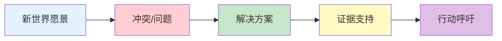
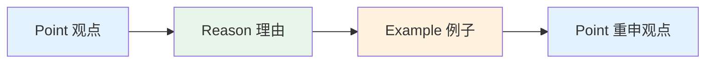
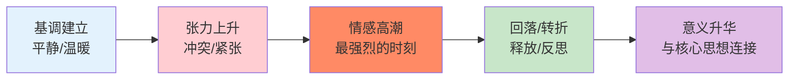

# 第十九章 公开演讲进阶 — 核心技巧

核心技巧是公开演讲从"能讲"到"讲好"的分水岭。本节从演讲设计、即兴表达、故事讲述、舞台表现、声音控制、视觉辅助、观众互动、焦虑管理八个维度，系统拆解进阶演讲者必须掌握的技法。每一个技巧都遵循"原理→方法→实操→练习"的结构，确保你不仅能理解，更能用出来。

```mermaid
graph TD
    A[公开演讲核心技巧] --> B[TED演讲设计]
    A --> C[即兴演讲框架]
    A --> D[故事讲述]
    A --> E[舞台表现力]
    A --> F[声音控制]
    A --> G[视觉辅助设计]
    A --> H[观众互动]
    A --> I[演讲焦虑管理]
    B --> B1[核心思想提炼]
    B --> B2[黄金30秒开场]
    B --> B3[情感弧线构建]
    B --> B4[数据故事化]
    C --> C1[PREP框架]
    C --> C2[STAR框架]
    C --> C3[问题-解决方案]
    C --> C4[时间线/三点框架]
    D --> D1[素材挖掘]
    D --> D2[感官描写]
    D --> D3[Show Don't Tell]
    D --> D4[情感节奏]
    E --> E1[空间运用]
    E --> E2[眼神接触]
    E --> E3[手势系统]
    E --> E4[站姿管理]
    F --> F1[音量控制]
    F --> F2[语速控制]
    F --> F3[语调变化]
    F --> F4[停顿艺术]
    style A fill:#e1f5fe
    style B fill:#fff3e0
    style C fill:#fff3e0
    style D fill:#fff3e0
    style E fill:#e8f5e9
    style F fill:#e8f5e9
    style G fill:#fce4ec
    style H fill:#fce4ec
    style I fill:#f3e5f5
```

---

## 一、TED演讲的设计技巧

TED演讲之所以成为全球最具影响力的演讲平台，不是因为舞台华丽或演讲者有名，而是因为TED建立了一套经过验证的演讲设计方法论。克里斯·安德森（Chris Anderson）在《演讲的力量》中总结了这套方法的核心：**每一个伟大的演讲，都始于一个值得传播的想法。**

### 1. 找到你的核心思想

核心思想（Throughline）是整场演讲的脊椎骨——所有内容都围绕它展开，所有例子都为它服务。没有核心思想的演讲就像没有主干的树，枝叶散落一地。

**核心思想的四个检验标准：**

| 标准 | 含义 | 反面案例 |
|------|------|----------|
| 清晰性 | 能用一句话说清楚 | "我想谈谈人工智能、区块链和元宇宙"——这不是一个思想，是三个话题 |
| 原创性 | 有独特的角度或见解 | "健康很重要"——观众早就知道了 |
| 启发性 | 能引发观众重新思考 | "每天喝八杯水"——缺乏新认知 |
| 可传播性 | 观众会主动向别人转述 | 过于专业或个人化的主题难以传播 |

**提炼核心思想的五步法：**

**步骤一：自由联想。** 拿出一张白纸，用10分钟写下所有与你主题相关的想法、故事、数据、观点。不要筛选，不要评判，只是写。

**步骤二：找到交集。** 看看你写下的所有内容，哪些想法反复出现？哪些故事最能打动你自己？这些交集点就是核心思想的候选。

**步骤三：一句话测试。** 用一句话概括你的核心信息。如果这句话超过20个字，说明你还没有想清楚。

**步骤四：四标准检验。** 对照上面的四个标准逐一检验。如果有任何一个标准不满足，回去修改。

**步骤五：反向验证。** 问自己："如果删掉这个核心思想，我的演讲还有意义吗？"如果答案是"有"，说明这个思想还不够核心。

**案例对比：**

| 普通主题 | 核心思想 | 为什么好 |
|----------|----------|----------|
| 人工智能的发展 | "人工智能正在重新定义'工作'的含义——不是消灭工作，而是消灭无聊的工作" | 有观点、有反转、可传播 |
| 健康饮食 | "你不需要完美的饮食计划，你只需要每一次选择时好一点点" | 降低门槛、可执行、有启发 |
| 领导力 | "最好的领导者不是站在最前面的人，而是让每个人都觉得自己站在最前面的人" | 有悖论、有画面、引思考 |
| 时间管理 | "时间管理的真正敌人不是忙碌，而是不知道自己在忙什么" | 戳痛点、引发共鸣 |

### 2. 设计演讲的"开头黄金30秒"

认知心理学研究表明，人类的注意力在前30秒内达到峰值，随后快速衰减。诺贝尔经济学奖得主丹尼尔·卡尼曼（Daniel Kahneman）在《思考，快与慢》中指出，人的"系统1"（快速思维）会在极短时间内形成第一印象，这个印象会强烈影响后续信息的加工方式。换句话说，**你的开场不仅决定观众是否继续听，还决定了他们如何理解后面的内容。**

**七种经过验证的开场方式：**

**（1）提问开场——激活观众的内在对话**

提问的威力在于它能让观众从被动接收变为主动思考。好的问题会让观众不自觉地在脑海中搜索答案，这个搜索过程就是注意力聚焦的过程。

> "在座的各位，有多少人曾经在半夜醒来，担心自己做了一个错误的决定？（停顿）如果你举手了，恭喜你——你是一个正常人。今天我要告诉你，这种担心可能是你做出更好决策的秘密武器。"

**操作要点：**
- 举手式问题效果最好——它让观众产生身体参与感
- 问题必须与观众相关，不要问"你知道量子力学吗"
- 问完后必须停顿3-5秒，给观众思考和回应的时间
- 问题的答案应该引出你的核心思想

**（2）故事开场——建立情感连接**

故事是人类大脑最自然的信息处理方式。神经科学研究发现，听故事时大脑会释放催产素（增强信任和共情），而听数据时大脑只有语言处理区域被激活。

> "三年前的一个雨夜，我站在医院的走廊里，手机屏幕上显示着一条消息——那是我人生中最长的30秒。在那30秒里，我突然明白了一件事：我们以为重要的是时间的长度，但真正重要的是时间的密度。"

**操作要点：**
- 第一句话必须建立场景（时间+地点+感官细节）
- 故事必须与核心思想有明确关联
- 不要讲太长的故事开场——控制在60秒内
- 在故事的关键处制造悬念，然后转场到主题

**（3）数据开场——用震撼感抓住注意力**

数据本身不吸引人，但当数据揭示了一个观众不知道的事实，它就产生了冲击力。关键不是数据本身，而是数据背后隐藏的真相。

> "每天，全球有3000亿封电子邮件被发送。但根据我们的研究，其中97%的邮件在发出后永远没有被回复。我们正在用历史上最高效的通信工具，创造人类历史上最大的信息噪音。"

**操作要点：**
- 数据必须足够大或足够小，才能产生冲击感
- 用对比让数据变得可感知（"相当于每秒XX"）
- 数据之后必须接解读——不要让观众自己猜含义
- 最多用两个数据开场，多了会变成统计课

**（4）引用开场——借用权威的说服力**

引用名人名言可以快速建立可信度，但要注意：引用的目的是引入你的观点，而不是用别人的话代替你的思考。

> "爱因斯坦说过：'如果你不能简单地解释它，说明你还没有足够地理解它。'今天，我要用最简单的语言，告诉你为什么大多数人的学习方法是完全错误的。"

**操作要点：**
- 引用必须与你的主题直接相关
- 引用后必须有自己的解读和延伸
- 避免过度使用——一场演讲最多引用2-3次
- 引用来源要准确，不要"据说"、"有人说"

**（5）悬念开场——制造信息缺口**

心理学家乔治·洛温斯坦（George Loewenstein）提出的"信息缺口理论"指出：当人们意识到自己"知道一些但不完全知道"时，会产生强烈的求知欲。悬念开场就是人为制造这种信息缺口。

> "今天我要告诉你们一个秘密——一个能够让你在任何场合都自信演讲的秘密。这个秘密不是什么新技巧，你其实一直都知道，只是从来没有意识到。"

**操作要点：**
- 悬念必须在演讲中被解答——不要开空头支票
- 暗示你知道观众不知道的事，但不要炫耀
- 悬念的解答必须足够有价值，否则观众会觉得被耍了

**（6）对比开场——用反差制造张力**

对比能瞬间建立时间轴和变化感，让观众产生"发生了什么"的好奇心。

> "十年前，我是一个害怕在三人面前说话的人。今天，我站在这里，面对着3000人。这中间到底发生了什么？不是天赋的觉醒，不是性格的改变，而是我发现了一个被大多数人忽视的简单事实。"

**操作要点：**
- 对比的两端必须足够极端，才能产生张力
- 对比后必须给出"转折点"——观众想知道的是那个转折
- 可以用时间对比、身份对比、认知对比

**（7）行动开场——用行为打破预期**

行动开场是最冒险但也最有力的方式——它打破了"演讲者站着说，观众坐着听"的默认模式，瞬间抓住注意力。

> （演讲者走上台，沉默5秒，然后突然把手中的水杯摔在地上）"刚才那5秒，你们都在想什么？你们的注意力完全集中在我身上。这就是今天要讲的主题——注意力是21世纪最稀缺的资源。"

**操作要点：**
- 行为必须与主题相关，不是为了猎奇
- 要确保安全和适当性
- 行为后必须迅速连接到主题，不要让观众困惑
- 适用于小型、氛围轻松的场合；正式场合慎用

### 3. 构建演讲的"情感弧线"

安迪·拉斯金（Andy Raskin）在分析了数百场成功的TED演讲后发现，最高评价的演讲都遵循一个共同的叙事结构。这个结构与好莱坞编剧大师罗伯特·麦基（Robert McKee）提出的故事理论高度一致：**好的故事本质上是一个从旧世界到新世界的旅程，而冲突是推动这个旅程的引擎。**

**情感弧线的五个阶段：**

**阶段一：描述一个引人入胜的"新世界"**

这不是讲你的产品或方案，而是描绘一个观众向往的未来图景。好的愿景能让观众产生"我想去那里"的冲动。

> 示例："想象一下这样的世界：每个人都能在5分钟内找到自己真正擅长的事情，不再在不适合自己的工作中浪费生命。这不是乌托邦，这是我们可以实现的。"

**阶段二：引入"冲突"或"问题"**

有了愿景之后，必须让观众意识到现实与愿景之间的差距。这个差距就是冲突——它制造了紧张感和紧迫感。罗伯特·麦基说："故事的能量来自期望与现实之间的落差。"

> 示例："但现实是什么？根据盖洛普的调查，全球只有15%的人对自己的工作感到满意。85%的人每天在做着自己不喜欢的事情。为什么？因为我们选择职业的方式从一开始就错了。"

**阶段三：展示"解决方案"**

在观众感受到足够强烈的"痛"之后，给出你的方案。此时观众的心理状态是"请告诉我怎么办"——他们已经准备好了接受你的方案。

> 示例："问题不在于我们不够努力，而在于我们用错了方法。过去20年，我和团队研究了10000个职业转型案例，发现了一个反复出现的模式……"

**阶段四：提供"证据"**

方案提出后，观众的理性思维会启动："凭什么你说的是对的？"这时你需要用数据、案例、逻辑来支撑你的方案。

> 示例："在我们的实验中，使用这个方法的人，有78%在6个月内找到了更满意的工作。而对照组只有12%。这不是运气，这是系统的力量。"

**阶段五：呼吁"行动"**

最后一步是告诉观众"你现在可以做什么"。没有行动呼吁的演讲，观众走出门就会忘记。

> 示例："今天回去后，我请你们做一件事：拿出纸和笔，写下你最近一次感到'时间飞逝'的时刻。那就是你真正擅长的事情的线索。从这一个线索开始。"

**完整案例——西蒙·斯涅克的"从为什么开始"：**

| 阶段 | 斯涅克的实际内容 |
|------|------------------|
| 新世界 | "苹果公司为什么能成功？他们和竞争对手用同样的人才、同样的技术……" |
| 冲突 | "但大多数公司只知道'做什么'和'怎么做'，却不知道'为什么做'" |
| 方案 | "伟大的领导者和组织都从'为什么'开始——先有信念，再有产品" |
| 证据 | "苹果、马丁·路德·金、莱特兄弟……他们都用了同样的模式" |
| 行动 | "找到你的'为什么'，然后从那里开始" |

### 4. 使用"数据故事化"技巧

数据是演讲中最有力的说服工具，但裸露的数据也是最无聊的。认知心理学家杰罗姆·布鲁纳（Jerome Bruner）的研究表明：**信息以故事形式呈现时，记忆保留率比纯数据高22倍。** 数据故事化的本质是让数据从"理性语言"翻译成"情感语言"。

**数据故事化的四步法：**

**步骤一：选择关键数据点。** 不要堆砌数据——一场演讲中真正有冲击力的数据不超过3个。选择标准：与核心思想直接相关、有足够冲击力、能被观众理解。

**步骤二：建立人与数据的连接。** 数据是抽象的，人是具体的。把数据转化为一个具体的人的故事。

**步骤三：用场景还原数据的含义。** 让观众在脑海中"看到"这个数据代表什么。

**步骤四：在故事高潮处揭示数据。** 数据不是开场就亮出来的，而是在情感铺垫充分后作为"证据"出现，冲击力最大。

**对比案例：**

| 裸数据 | 数据故事化 |
|--------|-----------|
| "全球有8.2亿人面临饥饿" | "想象一下，你所在的这个城市，每一个人——包括你隔壁的邻居、楼下的便利店老板、公园里玩耍的孩子——都面临饥饿。这还不到8.2亿的百分之一。" |
| "中国每年新增癌症患者457万" | "此时此刻，在这个会场里的15分钟里，中国已经有13个人被确诊为癌症。等你走出这扇门，这个数字还会继续增长。" |
| "90%的创业公司在5年内失败" | "如果你今天创办一家公司，你大概率会在5年内失去它。但最残酷的不是失败本身——而是你永远不会知道，你的公司是死于产品、市场，还是你自己。" |

**常用的数据故事化模板：**

- **缩小比例法**：把大数字缩小到观众能感知的范围（"如果地球是一个篮球，那XX就相当于一个乒乓球"）
- **时间压缩法**：把长时间压缩到短时间（"每3秒就有一个人XX"）
- **空间转移法**：把抽象数字转化为空间场景（"如果把所有XX首尾相连，可以绕地球XX圈"）
- **人物代入法**：把统计数据变成一个人的故事（"在8.2亿人中，有这样一位母亲……"）

### 5. TED演讲的"18分钟法则"

TED规定所有演讲不超过18分钟，这不是随意设定的。神经科学研究表明，人的注意力集中周期约为10-20分钟，超过这个时间，信息吸收率急剧下降。18分钟刚好在这个窗口的上限——足够深入，又不至于让观众疲劳。

**如何在有限时间内做到"少即是多"：**

- **砍掉一切不直接服务于核心思想的内容。** 如果一个故事、一个数据、一个例子不能强化你的核心思想，果断删除。
- **用深度换广度。** 不要试图在18分钟内覆盖所有相关内容，而是选择一个最有力的角度深入挖掘。
- **留白。** 不要把每一秒都填满——留出观众思考的空间。最好的演讲不是信息密度最高的，而是信息-思考比例最合理的。

**时间分配参考：**

| 环节 | 时间占比 | 18分钟演讲 |
|------|----------|-----------|
| 开场（抓注意力） | 10-15% | 2-3分钟 |
| 核心内容（3个支撑论点） | 60-70% | 11-13分钟 |
| 案例/故事 | 穿插在核心内容中 | — |
| 收尾（行动呼吁） | 15-20% | 3分钟 |

---

## 二、即兴演讲的实用框架

即兴演讲不是"随便说说"，而是在短时间内用结构化框架组织语言的能力。下面五个框架覆盖了即兴演讲中最常见的场景。

### 1. PREP框架——观点表达的万能公式

PREP是最基础也最实用的即兴表达框架，适用于任何需要表达观点的场景：会议发言、面试回答、社交讨论。

**PREP的结构：**

- **P（Point）**：开门见山亮出你的核心观点。不要铺垫，不要"这个问题我觉得吧……"，直接说。
- **R（Reason）**：给出1-2个支撑理由。理由要有逻辑性，不要只是重复观点。
- **E（Example）**：用一个具体的例子让理由落地。例子越具体、越个人化，说服力越强。
- **P（Point）**：重申观点，形成闭环。这不是简单的重复，而是在例子之后的"升华"。

**完整示例：**

题目："你认为远程工作会成为未来的趋势吗？"

> **Point**："是的，我认为远程工作将成为未来的主流工作模式。"
>
> **Reason**："原因有二：第一，技术基础设施已经成熟——5G、云计算、协作工具让远程协作的体验几乎等同于面对面；第二，新一代劳动力的价值观在改变——90后和00后把工作灵活性看得比薪资更重要。"
>
> **Example**："以我们公司为例，2022年全面推行远程工作后，员工满意度提升了35%，离职率下降了22%。而更有趣的是，人均产出反而提高了18%——因为没有人打扰你了。"
>
> **Point**："所以，远程工作不是疫情的临时产物，而是技术发展和人性需求的必然交汇。那些还在犹豫的公司，不是在保护效率，而是在保护一种过时的管理幻觉。"

**PREP的变体——用于不同场景：**

| 场景 | 调整方式 |
|------|----------|
| 说服型 | Reason用逻辑+数据，Example用案例 |
| 共鸣型 | Reason用情感诉求，Example用个人故事 |
| 教学型 | Reason用原理，Example用操作演示 |
| 争议型 | 先承认对方观点，再用PREP展开自己的 |

### 2. STAR框架——讲述经历的标准模板

STAR框架是面试和汇报中最常用的叙事框架，它强制你把经历结构化，避免"流水账"式的叙述。

- **S（Situation）**：设定情境——时间、地点、背景。用2-3句话建立场景。
- **T（Task）**：明确任务——你面对的挑战或需要达成的目标。这是故事的"冲突"。
- **A（Action）**：描述行动——你具体做了什么。这是STAR的核心部分，应该最详细。
- **R（Result）**：呈现结果——用数据量化成果，用故事展示影响。

**完整示例：**

题目："请分享一次你成功解决问题的经历。"

> **Situation**："去年Q3，我们团队负责一个重要客户的系统迁移项目。原定计划是4周完成，但在第2周时，客户突然提出要新增12个功能需求。"
>
> **Task**："作为项目负责人，我需要在不延期、不超预算的前提下，满足客户的新需求，同时保证系统稳定性。"
>
> **Action**："我做了四件事。第一，我把12个新需求按优先级分成了'必须做'、'应该做'、'可以等'三类，和客户逐一确认。第二，我向公司申请了2名高级工程师的临时支援。第三，我把原有的测试流程从'全部完成后测试'改成了'每完成一个功能立即测试'，大幅减少了后期返工。第四，每天晚上8点给客户发进度简报，让客户始终有掌控感。"
>
> **Result**："最终，我们在原定时间内完成了所有'必须做'和'应该做'的功能，系统上线后零故障运行。客户非常满意，追加了明年全年的运维合同，总价值280万。"

**STAR的注意事项：**

- **Situation不要超过3句话**——观众只需要知道足够的背景，不需要看你的PPT。
- **Action是重点**——面试官和听众想看的是你的思考过程和执行力，不是公司背景。
- **Result必须量化**——"效果很好"不如"客户满意度从72%提升到94%"。
- **选择有波折的经历**——一帆风顺的故事没有张力，有挫折有转折的故事才吸引人。

### 3. 问题-解决方案框架——提案和建议的标准格式

当你需要在会议中提出改进建议、在汇报中展示解决方案时，这个框架最有说服力。它的逻辑是：先让观众认同"这是一个问题"，再让他们接受"这是解决方案"。

**五步结构：**

1. **问题描述**：用具体的数据和场景说明问题的存在
2. **影响分析**：量化问题带来的损失（时间、金钱、效率、士气）
3. **根因分析**：说明问题为什么存在（不要只停在表面）
4. **解决方案**：提出具体的方案，说明方案的原理
5. **实施路径**：给出时间表、资源需求、关键里程碑

**完整示例：**

> "我们公司目前面临一个关键问题：新员工的90天离职率高达30%。这意味着每招聘10个人，有3个会在3个月内离开。按照每人招聘成本2.5万元计算，仅去年一年，我们就在离职上浪费了225万元。
>
> 通过分析离职面谈数据，我发现根本原因不是薪资，不是工作强度，而是'入职体验'——73%的离职员工表示'入职前三个月不知道该找谁帮忙'。
>
> 因此，我建议实施'新员工伙伴计划'：为每位入职员工指配一位同部门的资深员工作为'入职伙伴'，提供为期90天的一对一陪伴。伙伴的职责包括：第一周每天15分钟的check-in，前两个月每周一次的午餐交流，以及随时可用的即时沟通渠道。
>
> 参考字节跳动和阿里的类似项目数据，这个计划预计可以将90天离职率降低50%以上，每年为公司节省超过100万元的招聘成本。项目启动只需要HR团队投入2周的准备时间，不需要额外预算。"

### 4. 时间线框架——讲述发展历程或未来愿景

时间线框架利用了人类对时间流逝的天然感知，适用于回顾历史、展望未来、讲述变化。

**过去→现在→未来 三段式：**

> "三年前，我们团队只有5个人，挤在一间20平米的办公室里，每天工作14个小时，但产品日活只有200人。（过去→低谷）
>
> 今天，我们有50人的团队，搬进了自己的办公楼，产品覆盖了300万用户。（现在→成就）
>
> 但我最兴奋的不是这些数字——而是明年我们要做的事情。我们正在开发的AI功能，将让每个普通人都能用自然语言完成原本需要专业技能才能做的工作。（未来→愿景）"

**时间线框架的高级用法——制造反转：**

> "如果我告诉你，5年前的我是一个在工厂流水线上拧螺丝的工人，你可能会觉得这是一碗鸡汤。但如果我告诉你，正是那3年拧螺丝的经历，让我理解了'系统思维'——每一个零件的位置、每一个动作的顺序，都是系统设计的结果。这个认知后来成为我创业的核心理念。"

### 5. 三点框架——人类大脑最偏爱的结构

为什么是"三点"而不是两点或四点？认知心理学的研究给出了答案：

- **两点**：感觉不够充分，像"一方面……另一方面"的二元对立
- **三点**：形成完整的三角结构，给人"全面"和"完整"的感觉
- **四点及以上**：超出工作记忆容量（7±2法则的下限），观众记不住

三点框架的权威性来自古希腊修辞学——亚里士多德提出的"三段论"就是三点结构。从"我来、我见、我征服"到"民有、民治、民享"，历史上最有力量的表达几乎都是三点。

**使用方式：**

> "关于人工智能对就业的影响，我有三个判断：第一，50%的现有岗位会被重新定义——不是消失，而是工作内容改变；第二，会涌现出大量我们现在想象不到的新岗位；第三，也是最重要的——适应变化的能力将比任何具体技能都重要。"

**三点框架的组合变体：**

| 变体 | 格式 | 示例 |
|------|------|------|
| 递进式 | A → 更A → 最A | "好 → 更好 → 最好" |
| 转折式 | A → 但是B → 所以C | "过去 → 但是问题 → 所以新方法" |
| 并列式 | A、B、C（三个同等重要的点） | "效率、体验、安全" |
| 对比式 | A vs B vs C | "旧方法 vs 过渡方案 vs 最优解" |

### 6. 其他实用即兴框架

**SCQA框架（麦肯锡咨询师最爱）：**
- **S**ituation（情境）：大家都知道的背景事实
- **C**omplication（冲突）：但是出现了问题
- **Q**uestion（问题）：那么我们应该怎么办？
- **A**nswer（答案）：你的方案

> **S**："我们的线上教育平台用户量持续增长。" **C**："但课程完成率只有23%，远低于行业平均的45%。" **Q**："如何在不增加用户负担的前提下提高完课率？" **A**："核心方案是'微学习+游戏化'——把30分钟的课程拆成5个6分钟的模块，每个模块完成后给予即时反馈和积分奖励。"

**OHER框架（适合汇报工作）：**
- **O**bjective（目标）：我们想要达成什么
- **H**ighlight（亮点）：做得好的地方
- **E**vidence（证据）：用数据证明
- **R**ecommendation（建议）：下一步怎么做

---

## 三、故事讲述的技巧

沃伦·巴菲特说过："如果你不能讲一个好故事，你就无法卖出任何东西。"在演讲中，故事不是调味品，而是主菜——它是让观众从"听到"变成"记住"的唯一途径。

### 1. 挖掘你的故事素材

每个人都有丰富的故事素材，但大多数人都觉得自己"没什么好讲的"。这不是因为你的经历不够精彩，而是因为你还没有学会用"故事眼光"看待自己的经历。

**故事素材的四大来源：**

**（1）个人经历——你最强大的素材库**
- 成功经历：你是如何克服困难取得成果的？（适合展示能力和方法）
- 失败经历：你是如何跌倒的？从中学到了什么？（适合建立信任和共鸣）
- 转折点：什么事件改变了你的认知或人生方向？（适合传递核心思想）
- 尴尬时刻：你的"社死"经历？（适合破冰和幽默）

**（2）他人故事——拓展你的故事边界**
- 采访对象的故事（如果你做过访谈）
- 朋友/同事分享的经历（记得获得许可）
- 历史人物的故事（确保事实准确）

**（3）历史事件——赋予故事厚度**
- 商业案例：苹果、特斯拉、华为的故事
- 科学发现：青霉素的偶然发现、DNA双螺旋的竞争
- 社会运动：民权运动、环保运动

**（4）日常观察——最接地气的素材**
- 地铁上的一个场景
- 超市里的一次经历
- 和孩子的一段对话

**故事素材挖掘的日常练习：**

每天花10分钟做"故事日记"：
1. 今天发生了什么让你印象深刻的事？
2. 这个经历中有什么冲突或张力？
3. 你从中学到了什么？
4. 这个经历如何能够启发他人？
5. 如果要在演讲中用这个故事，核心思想是什么？

坚持30天，你就会拥有一个丰富的故事素材库。

### 2. 让故事生动的四大技巧

好的演讲故事不是"发生了什么"的流水账，而是让观众"身临其境"的沉浸体验。以下四个技巧是专业演讲教练反复验证的核心技法。

**技巧一：感官描写——激活观众的大脑**

神经科学研究发现，当人听到"粗糙的砂纸"时，大脑的触觉皮层会被激活；听到"酸涩的柠檬"时，味觉皮层会被激活。这就是"具身认知"——感官描写不只是修辞手法，它能让观众的大脑产生"亲历"的错觉。

> ❌ "那天下午我坐在办公桌前，写了一封辞职信。"
>
> ✅ "那天下午，阳光透过百叶窗的缝隙照进来，在键盘上投下一道道平行的光影。我盯着屏幕上那个闪烁的光标，指尖悬在键盘上方，微微发抖。办公室里弥漫着打印机碳粉的味道，隔壁工位的同事在打电话，声音忽远忽近。我深吸一口气，按下了第一个字母。"

**感官描写检查清单：**
- 视觉：光线、颜色、形状、动作
- 听觉：环境音、对话、内心独白
- 触觉：温度、质感、身体感受
- 嗅觉：环境气味、食物、自然气息
- 味觉：（如果有）食物、饮料、嘴里的情绪感

**技巧二：创造"电影场景"——把叙述变成画面**

好的演讲故事应该像一部微型电影——有具体的场景、有动作、有对话、有镜头切换。如果你的故事里只有"我觉得"、"我认为"、"我决定"，那它是叙述，不是场景。

**场景化转换模板：**

| 叙述（Tell） | 场景化（Show） |
|-------------|---------------|
| "我和老板谈了一次" | "我站在老板办公室门口，手心攥着那份报告，犹豫了30秒，才敲了门" |
| "团队士气很低" | "周一早会，会议室里没有人说话，每个人的眼睛都盯着手机，咖啡杯里的咖啡凉了也没人喝" |
| "产品终于上线了" | "凌晨3点17分，我按下了'发布'按钮。屏幕转了5秒钟的圈，然后跳出一行绿色的字：'部署成功'。我转过头，看到趴在桌上睡着的小王，和角落里堆成山的外卖盒" |

**技巧三：Show, Don't Tell——用细节代替评价**

这是写作和演讲中最核心的原则之一。"Tell"是告诉观众结论，"Show"是让观众自己得出结论。自己得出的结论，比被告知的结论，影响力大10倍。

| Tell（告诉） | Show（展示） |
|-------------|-------------|
| "我当时很紧张" | "我的手在发抖，手心全是汗，嘴唇干得说不出话来" |
| "他非常愤怒" | "他把文件往桌上一摔，站起来，椅子'砰'地撞在后面的墙上" |
| "那是一个很美的地方" | "湖水清澈得能看到水底的石头，远处的雪山倒映在湖面上，风吹过来的时候，我闻到了松木的味道" |
| "她很坚强" | "她接过诊断报告，看了整整一分钟，没有说话。然后她把报告折好放进口袋，抬起头说：'医生，接下来的治疗方案是什么？'" |

**技巧四：对话——让故事有声音**

对话是最高效的场景化工具——它同时建立了场景、展示了人物性格、推进了情节。一段好的对话比三段描述都有效。

> "面试官看着我的简历，沉默了很久，然后抬头说：'你之前的工作经验和这个岗位完全不相关。你为什么觉得自己能胜任？'
>
> 我当时脑子里一片空白。但不知道为什么，我脱口而出：'正因为不相关，所以我不会带着偏见来工作。'
>
> 面试官愣了一下，然后笑了。'有意思，'他说，'那就从这个'不相关'开始聊聊吧。'"

**对话的注意事项：**
- 不要写太长的对话——3-5句最有冲击力
- 对话要反映人物的性格和情绪
- 不要所有对话都"他说""她说"——用动作和表情来替代
- 紧张的对话用短句，轻松的对话可以稍长

### 3. 故事的情感节奏设计

好的演讲故事不是一条直线，而是一条波浪线——有起有伏，有紧张有释放。单调的情感曲线会让观众昏睡，而合理的情感节奏会让观众全程跟着你走。

**经典五段式情感节奏：**

**实例解析——一个关于"失败"的故事的情感节奏：**

| 阶段 | 内容 | 情感状态 |
|------|------|----------|
| 基调建立 | "大学毕业那年，我拿到了一家知名公司的offer，所有人都觉得我的人生开了挂。" | 平静、乐观 |
| 张力上升 | "入职后我发现，我负责的第一个项目就遇到了技术瓶颈，连续三周没有进展。每次周会，我都编造进度。" | 紧张、焦虑 |
| 情感高潮 | "第四周，CTO把我叫进办公室，把我的代码review投影在大屏幕上。整个团队20多个人，看着屏幕上的红色批注，沉默得可怕。" | 羞耻、绝望 |
| 回落/转折 | "CTO没有骂我。他只说了一句话：'代码可以重写，但信任不能。你需要学会的第一件事，不是编程，而是承认自己不会。'" | 释放、顿悟 |
| 意义升华 | "那一天我明白了一个道理：暴露脆弱不是软弱，是勇气。从那以后，我再也没有不懂装懂过——而恰恰是这个改变，让我后来成为团队里最值得信赖的人。" | 温暖、力量 |

### 4. 将抽象概念故事化

在演讲中，你经常需要解释抽象的概念（如"机会成本"、"网络效应"、"认知偏差"）。裸讲概念会让观众昏昏欲睡，但把它变成一个故事，观众不仅理解，还会记住。

**四步故事化法：**

1. **确定概念的本质**：用一句话说清楚这个概念是什么
2. **找到一个生活场景**：在日常生活中找到这个概念的"原型"
3. **构建一个具体故事**：用人和场景来展示这个概念
4. **故事结尾揭示概念**：让观众恍然大悟

**示例：**

| 抽象概念 | 故事化表达 |
|----------|-----------|
| 机会成本 | "想象你站在十字路口，左边平坦大路，右边崎岖小路。你选了大路，走得轻松。但你不知道的是，小路尽头是一片花海。你选大路所放弃的那片花海，就是'机会成本'——每一个选择的真正代价，不是你付出了什么，而是你放弃了什么。" |
| 幸存者偏差 | "二战时，军方想给飞机加装甲。工程师统计了返航飞机上的弹孔分布——机翼和机身最多。于是决定在这些地方加装甲。但统计学家亚伯拉罕·瓦尔德说：'你们看到的只是飞回来的飞机。那些引擎和驾驶舱中弹的飞机，根本没能飞回来。'所以应该加装甲的地方，恰恰是弹孔最少的地方。" |
| 沉没成本 | "你花200块买了一张电影票，看了30分钟发现电影烂透了。你会继续看完还是走？大多数人选择看完——'都花了200了'。但那200块已经花了，无论你看不看都回不来了。继续坐在那里，你只是在浪费另一个更宝贵的资源——你的时间。" |

---

## 四、舞台表现力的技巧

舞台表现力是演讲的"非语言层"——研究显示，在面对面沟通中，非语言信息占信息传递总量的55%-93%（阿尔伯特·梅拉比安的研究）。你的身体在说话，而且比你的嘴说得更多。

### 1. 空间运用——用位置讲故事

专业演讲者不会随机走动——每一次移动都是有目的的。空间运用的核心原理来自戏剧表演：**不同的舞台位置传递不同的信息含义。**

**舞台的三个功能区域：**

| 区域 | 位置 | 适合的内容 | 心理含义 |
|------|------|-----------|----------|
| 中心区域 | 舞台正中 | 核心观点、重要信息 | 权威、自信 |
| 左侧区域 | 观众的左手边 | 讲述过去、展示问题 | 回顾、审视 |
| 右侧区域 | 观众的右手边 | 展望未来、展示方案 | 前进、希望 |

**移动的三条原则：**

**原则一：有目的的移动。** 每次移动都应该与内容变化同步。讲完一个要点，走到新的位置，暗示"现在进入下一个要点"。漫无目的的来回走动会让观众分心。

**原则二：先停后走。** 重要观点说完后，先停顿2-3秒，再移动。移动中的语言会被观众忽略——大脑在处理位置变化时，语言理解能力会下降。

**原则三：面向观众移动。** 需要走动时，保持面向或侧向观众。背对观众走动是舞台大忌——它切断了你与观众的连接。

**高级技巧——建立空间联想：**

如果你的演讲有三个要点，可以分别在舞台的左、中、右三个位置讲述。之后每次提到某个要点时，走回对应的位置。这样观众会无意识地将位置与内容关联起来，增强记忆。

### 2. 眼神接触——建立信任的桥梁

眼神接触是建立信任最直接的方式。神经科学研究发现，眼神接触会激活大脑的"社会脑网络"，增强共情和信任感。在演讲中，缺乏眼神接触会让观众觉得你缺乏自信或不真诚。

**三种眼神技巧及适用场景：**

**（1）"灯塔"技巧——适合大场面**

将观众席分为5-7个区域，像灯塔一样缓慢扫视，每个区域停留3-5秒。这让你看起来在与每个人交流，同时避免了盯着某个人看的尴尬。

操作步骤：
1. 在心里把观众席分成5-7个扇形区域
2. 每个区域选择一个"代表"——一个看起来友善的面孔
3. 与这个"代表"进行3-5秒的眼神接触
4. 缓慢移动到下一个区域
5. 不要按固定顺序——随机切换显得更自然

**（2）"个人对话"技巧——适合关键信息**

在讲述核心观点或情感故事时，选择一位观众进行持续5-10秒的眼神接触，就像在与他/她进行一对一的对话。这种技巧能让被选中的观众产生强烈的"被重视"感，周围的人也会觉得你非常真诚。

**（3）"三角"技巧——适合紧张时的快速切换**

如果直视观众让你紧张，可以看观众的额头或眉心——从观众的角度看，这与直视眼睛几乎没有区别。

**必须避免的眼神习惯：**

| 错误习惯 | 为什么不好 | 正确做法 |
|----------|-----------|----------|
| 只盯PPT或讲台 | 传递"我不自信"的信号 | 把提示词放在你能自然看到的地方 |
| 快速扫视全场 | 像扫描仪一样扫视会让人不安 | 每次至少看一个区域3秒 |
| 只看前排 | 后排观众会觉得被忽视 | 灯塔技巧覆盖全场 |
| 看天花板或地板 | 传递"我在回忆"而不是"我在交流" | 提前充分准备，不需要回忆 |

### 3. 手势系统——用双手增强表达

手势是演讲中最容易被忽视也最容易提升的表现力元素。好的手势不是"设计"出来的，而是"释放"出来的——当你的身体足够放松时，手势会自然配合你的语言。

**手势的"黄金三角"区域：**

手势应该在腰部到肩膀之间的区域进行——这个区域传递自信和开放。低于腰部的手势显得犹豫，高于肩膀的手势显得夸张（除非你刻意追求戏剧效果）。

**五种核心手势类型：**

| 手势类型 | 用法 | 示例 |
|----------|------|------|
| 列举手势 | 用手指数数，强调"第一、第二、第三" | 伸出手指，每说一个要点伸一根 |
| 比较手势 | 双手分别代表两个概念 | 左手说"传统方法"，右手说"新方法"，然后双手靠近表示"对比" |
| 大小手势 | 用手表示大小、程度 | 双手拉开表示"很大的差距"，双手收拢表示"很小的改善" |
| 方向手势 | 用手指示方向或概念空间 | 手指向后代表"过去"，手指向前代表"未来" |
| 情感手势 | 用手表达情绪 | 手捂胸口表示"真心"，双手摊开表示"无奈" |

**必须避免的手势习惯：**

- **双手插兜**：除非是刻意的"随意风格"，否则显得不尊重
- **双臂交叉**：传递防御和封闭的信号
- **无意识的小动作**：转笔、摸头发、搓手——暴露紧张
- **手势过小**：小幅度的手势在大舞台上看不到
- **手势过密**：每句话都有手势会让观众眼花缭乱——手势是强调，不是默认状态

**手势练习法：**

1. 录一段自己演讲的视频
2. 把声音关掉，只看画面
3. 问自己："我的手势在传递什么信息？是自信、紧张、还是无所谓？"
4. 针对问题手势进行专项练习

### 4. 站姿与姿态管理

站姿是舞台表现力的"地基"——如果站姿不对，所有其他技巧都会大打折扣。

**自信站姿的五个要素：**

1. **双脚与肩同宽**：提供稳定的支撑基础，不要并脚也不要分太开
2. **重心均匀分布**：不要偏向一侧或前后晃动——晃动是最常见的紧张信号
3. **肩膀放松下沉**：耸肩是紧张的生理反应，有意识地放松肩膀
4. **下巴微收**：下巴过高显得傲慢，过低显得不自信
5. **核心收紧**：腹部微微收紧，这会让你的姿态更挺拔，也支持更好的发声

**需要避免的八种姿态：**

| 姿态 | 传递的信号 | 纠正方法 |
|------|-----------|----------|
| 倚靠讲台 | "我很累/我很害怕离开这个安全区" | 双手轻放在讲台边缘，身体保持直立 |
| 频繁换脚 | "我紧张得站不住" | 双脚固定，重心均匀分布 |
| 前后晃动 | "我不确定自己在说什么" | 核心收紧，想象头顶有根线拉着你 |
| 双手背后 | "我在军训" | 手放在身体两侧或"黄金三角"内 |
| 双手交叉在前面 | "我在保护自己" | 一只手自然下垂，另一只手做手势 |
| 驼背 | "我缺乏自信" | 扩胸，肩膀向后向下沉 |
| 身体侧对观众 | "我想逃跑" | 始终保持身体正面或大角度侧向观众 |
| 踮脚 | "我很兴奋但控制不住" | 脚掌完全踩实地面 |

---

## 五、声音控制的技巧

你的声音是一件乐器——它有音量、音调、节奏和音色四个维度。大多数演讲者只用到了这件乐器30%的功能。掌握声音控制，就是释放这件乐器另外70%的潜力。

### 1. 音量控制——用大小说话

音量不只是"大声"和"小声"两个档位。专业演讲者的音量控制像交响乐一样有层次：有渐强、有渐弱、有突强、有突弱。

**四种音量变化技巧及使用场景：**

| 技巧 | 操作 | 效果 | 使用场景 |
|------|------|------|----------|
| 渐强 | 逐渐增加音量 | 营造紧迫感、力量感 | 陈述观点、呼吁行动 |
| 渐弱 | 逐渐降低音量 | 营造亲密感、悬念感 | 讲故事、揭示秘密 |
| 突强 | 突然提高音量 | 打破预期、唤醒注意力 | 强调关键点、打破沉闷 |
| 突弱 | 突然降低音量 | 制造对比、引发好奇 | 引出转折、制造反差 |

**音量控制的日常练习：**

- **气球练习**：想象你面前有一个气球。用不同的音量"吹"它——轻声吹（低声）、正常吹（中等音量）、用力吹（大声）。感受气息和音量的关系。
- **远近练习**：想象你的观众在不同距离——第一排（低声）、中间排（中等）、最后一排（大声）。学会根据场地调整音量。
- **音量曲线练习**：朗读一段话，用 ↗ 和 ↘ 标记音量变化。每个重要词语用不同音量读出来。

### 2. 语速控制——用快慢说话

语速是影响信息传递效率的关键变量。太快观众跟不上，太慢观众会走神。专业演讲者的语速不是恒定的，而是随内容动态变化的。

**语速参考标准：**

| 场景 | 语速（中文） | 特点 |
|------|-------------|------|
| 正常叙述 | 130-170字/分钟 | 舒适、自然 |
| 强调重点 | 100-120字/分钟 | 严肃、有力 |
| 激情叙述 | 180-200字/分钟 | 兴奋、有能量 |
| 悬念/期待 | 80-100字/分钟 | 紧张、引人注目 |
| 复杂概念 | 100-130字/分钟 | 清晰、耐心 |

**语速变化的技巧：**

**加速——用速度传递紧迫感。** 在列举、排比、描述快速发展的事件时加快语速。快速的语速会让观众感到"信息量很大、内容很丰富"。

> "从2007年到2023年，智能手机的用户从零增长到68亿——68亿，这意味着地球上85%的人都有一部智能手机。"

**减速——用慢速强调重要性。** 在关键观点前后放慢语速。慢速会向观众的潜意识发出信号："注意，这很重要。"

> "而这个方法的核心，只有三个字……（停顿1秒）……不……要……放……弃。"

**停顿——最强的声音工具。** 停顿不是"没话说了"，而是"让观众想一想"。停顿甚至比语言更有力——它创造了一个信息真空，观众会不由自主地填充这个真空。

**停顿的三种类型及使用方法：**

| 停顿类型 | 时长 | 使用场景 | 效果 |
|----------|------|----------|------|
| 语法停顿 | 0.5-1秒 | 标点符号处、句子之间 | 自然呼吸节奏 |
| 强调停顿 | 2-3秒 | 重要观点之前或之后 | "注意，这是重点" |
| 戏剧停顿 | 4-5秒 | 悬念、反转、高潮之前 | 制造期待、增强冲击力 |

**经典的停顿位置：**

- 在说出关键数据之前（"去年我们的利润增长了……（停顿）……300%。"）
- 在提出问题之后（"你们知道吗？（停顿3秒）"）
- 在讲完一个故事之后（让观众消化）
- 在笑点之前（铺垫笑点需要时间）
- 在演讲开头的第一句话之后（建立权威感）

### 3. 语调控制——用升降说话

语调是声音的"表情"——它传递的不是信息本身，而是信息背后的情绪和态度。

**四种基本语调模式：**

| 语调 | 传递的含义 | 使用场景 |
|------|-----------|----------|
| 升调 ↗ | 不确定、提问、列举未完 | 问句、"第一……第二……第三？" |
| 降调 ↘ | 确定、权威、结束 | 陈述句、结论、强调 |
| 平调 → | 中性、过渡、客观 | 过渡语、背景介绍 |
| 曲折调 ↗↘ | 复杂情感、讽刺、反问 | 表达惊讶、讽刺、深意 |

**语调的常见错误：**

- **每句话末尾升调**：这是最普遍的语调问题——它让每句话都听起来像疑问句，传递"我不确定"的信号。
- **全程一个语调**：单调的语调是观众犯困的主要原因。
- **语调与内容不匹配**：讲悲伤的故事时用兴奋的语调，或讲好消息时用平淡的语调。

**语调练习法——"情绪朗读法"：**

选同一段文字，分别用以下情绪朗读：
1. 兴奋的语气
2. 严肃的语气
3. 悲伤的语气
4. 愤怒的语气
5. 神秘的语气

感受每种情绪下语调的变化。然后在演讲中，根据内容选择合适的"情绪基调"。

### 4. 声音热身——演讲前的五步准备

就像运动员在比赛前需要热身一样，演讲者在开口前也需要让声带和呼吸系统进入最佳状态。不做热身直接上台，声音会僵硬、气息会不稳，前5分钟的表现会大打折扣。

**五步声音热身流程（10-15分钟）：**

**第一步：腹式呼吸（3分钟）**
- 坐直或站直，双手放在腹部
- 吸气4秒——腹部向外扩张（不是胸部）
- 屏息4秒——感受气息的支撑
- 呼气6秒——腹部缓慢收回
- 重复6-8次

腹式呼吸是所有发声技巧的基础——它提供稳定的气息支撑，让声音不颤抖、不费力。

**第二步：唇颤音（2分钟）**
- 双唇放松合拢
- 用气息吹动嘴唇，发出"嘟嘟嘟"的声音
- 从低音开始，逐渐升高
- 再从高音逐渐降低

唇颤音能放松嘴唇和面部肌肉，让发音更清晰。

**第三步：音阶练习（2分钟）**
- 用"ma-ma-ma"从低音到高音，再从高音到低音
- 用"la-la-la"重复
- 用"na-na-na"重复

音阶练习扩展你的音域，让你的声音有更大的变化空间。

**第四步：绕口令（2分钟）**
- 选择2-3个绕口令，从慢速开始，逐渐加速
- 推荐："八百标兵奔北坡"、"四是四，十是十"、"黑化肥发灰，灰化肥发黑"

绕口令活动舌头和嘴唇，让发音更精准。

**第五步：试讲开头（3分钟）**
- 朗读或默讲你演讲的前3分钟
- 注意音量、语速、语调
- 进入状态

### 5. 进阶：共鸣与音色

大多数演讲者用"喉咙"发声——声音单薄、费力、容易疲劳。专业演讲者用"共鸣"发声——声音浑厚、有力、持久。

**三个共鸣腔体：**

| 共鸣腔 | 位置 | 效果 | 调整方法 |
|--------|------|------|----------|
| 胸腔 | 胸部 | 低沉、权威、稳重 | 发"hum"（嗯），感受胸部振动 |
| 口腔 | 口腔 | 清晰、饱满、有力度 | 张大嘴巴说"啊"，感受口腔打开 |
| 头腔 | 鼻腔/眉心 | 明亮、穿透力强 | 发"mimimi"，感受眉心振动 |

**练习方法——"共鸣扫描"：**

1. 发一个长长的"嗯——"（闭口哼鸣）
2. 从低音开始，逐渐升高
3. 感受振动从胸腔→口腔→头腔的移动
4. 在不同音高上感受振动位置的变化
5. 尝试在不同的共鸣位置说同一句话，感受声音的质感变化

---

## 六、视觉辅助设计的技巧

视觉辅助（PPT/幻灯片）是演讲中最被滥用的工具。大多数人把PPT当成了"演讲稿的投屏"——密密麻麻的文字、复杂的图表、五颜六色的动画。这不是辅助，这是干扰。

### 1. 幻灯片设计的四条铁律

**铁律一：一页一信息**

每张幻灯片只传递一个核心信息。如果你需要传递五个信息，就用五张幻灯片。这不是浪费——这是清晰。

判断标准：如果观众需要花超过3秒理解这张幻灯片在说什么，信息就太多了。

**铁律二：视觉优先，文字为辅**

人脑处理图像的速度是文字的6万倍（3M公司研究）。优先使用图片、图表、图标等视觉元素。如果必须用文字，每张幻灯片不超过20个字。

**反面案例→正面案例：**

| 反面 | 正面 |
|------|------|
| 一张幻灯片上列出8个要点，每个要点一句话 | 8张幻灯片，每张只有一个关键词+一张相关图片 |
| 复杂的数据表格 | 一个简洁的柱状图+一个高亮的关键数据 |
| 一段500字的文字说明 | 一张图片+一行标题 |

**铁律三：去除一切不必要的元素**

包括：多余的装饰线、花哨的动画、无关的剪贴画、公司logo（每页都放）、页码（观众不需要）、"谢谢"页（用你的语言说谢谢）。

**铁律四：建立一致的视觉系统**

- 颜色：选择2-3种主色，不要超过3种
- 字体：中文用思源黑体/阿里巴巴普惠体，英文用Helvetica/Arial，全场统一
- 布局：标题位置、正文位置、图片位置保持一致
- 风格：要么全部扁平化，要么全部写实，不要混搭

### 2. 选择正确的图表类型

| 你想展示的 | 用什么图表 | 为什么 |
|-----------|-----------|--------|
| 不同类别的数据对比 | 柱状图 | 高度差异直观可比 |
| 数据随时间的变化趋势 | 折线图 | 上升/下降/波动一目了然 |
| 各部分占总体的比例 | 饼图（不超过5块） | 比例关系直观 |
| 两个变量之间的关系 | 散点图 | 相关性/分布一目了然 |
| 多个维度的综合比较 | 雷达图 | 多维度对比清晰 |
| 流程和步骤 | 流程图/箭头图 | 逻辑关系清晰 |

**图表设计的注意事项：**
- 突出关键数据点（用颜色、大小、标签强调）
- 不要使用3D图表——它会扭曲数据感知
- 饼图最多5个分类，超过5个就用柱状图
- 坐标轴从0开始——否则会误导观众
- 数据标签直接放在图表上，不要让观众去对图例

### 3. 现代演讲工具推荐

| 工具 | 特点 | 适用场景 |
|------|------|----------|
| Keynote | 苹果生态，动画流畅，设计感强 | Mac用户，追求视觉效果 |
| Google Slides | 云端协作，免费，模板丰富 | 团队协作，在线演讲 |
| Canva | 模板海量，设计门槛低 | 快速制作，设计小白 |
| Prezi | 非线性展示，缩放效果独特 | 需要展示全局与局部关系 |
| Figma | 精确控制，适合设计师 | 高度定制化的幻灯片 |
| Miro | 在线白板，互动性强 | 工作坊、互动式演讲 |
| Mentimeter | 实时投票、词云、问答 | 需要观众实时互动 |

### 4. 演讲者与幻灯片的关系

**核心原则：你才是主角，幻灯片只是背景音乐。**

幻灯片的角色是"增强"而非"替代"。如果你的幻灯片拿掉之后观众就听不懂了，说明你的演讲过度依赖幻灯片了。

**三个实操原则：**

- **不要背对观众读幻灯片。** 你应该比观众更了解幻灯片上的内容——所以你不需要看它，观众需要。
- **在关键信息处关闭幻灯片。** 当你要讲最重要的一段话时，按"B"键让屏幕变黑。所有注意力回到你身上。
- **幻灯片跟随你，而不是你跟随幻灯片。** 你的演讲节奏决定什么时候翻页，而不是幻灯片决定你什么时候说什么。

---

## 七、观众互动的技巧

单向的演讲是信息传递，双向的互动才是影响力。互动不是"玩花样"——它有深层的心理学机制：参与感会提升所有权感（IKEA效应），身体参与会增强认知投入（具身认知理论），社交互动会提升群体凝聚力。

### 1. 提问技巧——最基础也最有效的互动

**四种提问类型及使用场景：**

| 提问类型 | 定义 | 效果 | 使用场景 |
|----------|------|------|----------|
| 封闭式 | 答案是"是/否"或选择 | 快速获得认同或共识 | "你们有没有遇到过这种情况？" |
| 开放式 | 需要详细回答 | 引发深度思考 | "你们觉得造成这个问题的根本原因是什么？" |
| 反问式 | 不需要观众回答 | 引发内心思考 | "难道我们真的愿意接受这样的结果吗？" |
| 举手式 | 请观众举手 | 身体参与+可视化共识 | "有多少人同意这个观点？请举手。" |

**提问的四个黄金时机：**

1. **开场提问**：打破"演讲者-观众"的隔阂，建立对话感
2. **过渡提问**：在两个部分之间提问，帮助观众从一个主题过渡到另一个
3. **困境提问**：在提出问题后提问，让观众先自己思考，再给出答案
4. **结尾提问**：用一个开放性问题结束，让观众带着思考离开

**提问后的处理技巧：**

- 提问后必须停顿——至少3-5秒。大多数演讲者在提问后立即自己回答，观众根本没有思考的时间。
- 如果观众回答了，认真倾听并回应——"非常好的观点"、"这是一个有趣的角度"。
- 如果没有人回答，不要尴尬——可以说"让我换个方式问"，然后用举手式或封闭式提问。

### 2. 互动活动——让观众从观众变成参与者

**五种经过验证的互动活动：**

| 活动 | 操作 | 适用场景 | 时间 |
|------|------|----------|------|
| 配对讨论 | "请和旁边的人用2分钟讨论这个问题" | 需要深度思考的话题 | 2-3分钟 |
| 快速投票 | 举手/在线工具/站立投票 | 需要了解观众观点 | 30秒 |
| 填空互动 | "我说上半句，你们说下半句" | 需要观众记住的内容 | 10秒 |
| 想象练习 | "请闭上眼睛，想象一下……" | 故事开场、情感共鸣 | 1-2分钟 |
| 实操演示 | "请拿出手机，现在就打开……" | 教学型演讲 | 2-5分钟 |

**在线演讲的互动技巧：**

- 使用聊天框提问（"请在聊天框里输入你的答案"）
- 使用投票工具（Mentimeter、Slido、腾讯投票）
- 使用"表情反应"功能
- 每5-7分钟设置一个互动点，防止观众走神

### 3. 处理观众反应的应变能力

**应对笑声：**
- 在观众笑的时候暂停——不要在笑声中继续说话，因为没有人听得见
- 微笑，享受这个时刻
- 等笑声减弱到60%时再继续——不要等完全安静

**应对沉默：**
- 不要急于填补沉默——沉默是观众在思考
- 可以说"让我给大家几秒钟思考一下"——这把沉默变成了你的工具
- 如果沉默超过10秒，换一个更简单的提问方式

**应对冷场：**
- 保持冷静和自信——你的情绪会传染给观众
- 使用备选的互动方式（准备好2-3种不同类型的互动）
- 调整你的能量——如果你的音量和语速降低了，观众的参与度也会降低

**应对"杠精"：**
- 不要与个别观众争论——这会让其他观众厌烦
- 先认可对方："这是一个很好的问题/观点"
- 然后引导到你的框架："让我从另一个角度来看这个问题"
- 如果对方持续纠缠："这个问题我们可以会后单独讨论，现在让我回到主题"

### 4. 问答环节的设计与控制

问答环节是整场演讲的"收尾"——它决定了观众最后的印象。糟糕的问答环节会毁掉一场精彩的演讲。

**问答环节的准备清单：**

1. **预测问题**：列出10个最可能被问到的问题，准备好答案
2. **准备"万能回答"**：对于不确定的问题，准备几个通用回答框架
3. **设定时间**：明确告知观众"我们有10分钟的问答时间"
4. **准备"种子问题"**：如果冷场，安排1-2个人先提问

**回答问题的五步法：**

1. **倾听完整的问题**：不要急于打断——打断提问者会让所有观众觉得你不尊重人
2. **重复或复述问题**：确保全场观众都听到了问题，也给自己几秒钟的思考时间
3. **简短回答**：每个回答控制在60-90秒内——问答环节不是第二场演讲
4. **诚实回答**：如果不知道，诚实地说"这个我不确定，但我可以会后查一下"——这比胡说八道强100倍
5. **转回主题**：回答后加一句"这也是为什么我认为……"，把回答与你的核心思想连接

**万能回答模板：**

- "这个问题很好。简单来说……（用一句话回答）如果你想要更详细的资料，我很乐意会后分享。"
- "坦白说，我对这个具体细节不是100%确定。但我可以确定的是……（转向你知道的部分）"
- "这个问题的答案取决于……（把问题拆分，回答你最有把握的部分）"

---

## 八、演讲焦虑管理的技巧

演讲焦虑（Glossophobia）是人类最常见的恐惧之一——多项调查显示，公众对演讲的恐惧甚至超过对死亡的恐惧。但焦虑不是敌人——适度的焦虑能提升表现。心理学中的"耶克斯-多德森定律"表明，表现与焦虑呈倒U型关系：完全没有焦虑会导致表现平淡，过度焦虑会导致表现崩溃，而适度焦虑能让表现达到峰值。

### 1. 认知重构——改变你对焦虑的定义

哈佛商学院教授艾莉森·伍德·布鲁克斯（Alison Wood Brooks）的研究发现：**将焦虑重新标签为兴奋，能显著提升演讲表现。** 这不是自我欺骗——焦虑和兴奋的生理反应几乎相同（心跳加速、手心出汗、肾上腺素分泌），区别只在于大脑的解读。

**三种认知重构方法：**

**方法一：重新标签**
- ❌ "我好紧张" → ✅ "我好兴奋"
- ❌ "我的心跳太快了" → ✅ "我的身体正在给我提供额外的能量"
- ❌ "我可能会搞砸" → ✅ "这说明我在做一件重要的事"

**方法二：重新框架**
- ❌ "观众在评判我" → ✅ "观众希望我成功——他们花了时间来这里，他们想获得有价值的内容"
- ❌ "我必须完美" → ✅ "观众要的是真实和有价值，不是完美"
- ❌ "如果忘词了怎么办" → ✅ "没有人知道我的原定内容，忘词了就用自己的话继续"

**方法三：重新定位**
- ❌ "我在被审视" → ✅ "我在给予——我正在把有价值的知识分享给需要的人"
- ❌ "我是一个演讲者" → ✅ "我是一个和朋友分享经验的人"

### 2. 充分准备——焦虑的最大解药

准备的"冰山理论"说得好：观众看到的只是冰山一角（你的演讲），但冰山的大部分（你的准备）是在水面下的。准备越充分，冰山越大，你就越不容易"翻船"。

**四维准备清单：**

| 维度 | 准备内容 | 检查标准 |
|------|----------|----------|
| 内容准备 | 演讲稿、要点提纲、过渡语 | 能脱稿讲完整场演讲的80%以上 |
| 技术准备 | 电脑、翻页笔、麦克风、投影 | 每件设备都实际测试过 |
| 场地准备 | 舞台大小、灯光、音响、观众席布局 | 提前到场实际走台 |
| 应急准备 | 备用方案、备用设备、应急话术 | 为最坏的情况准备了Plan B |

**应急话术模板：**

| 突发情况 | 应急话术 |
|----------|----------|
| 忘词了 | "让我换一个角度来看这个问题……" |
| PPT出问题了 | "看来技术想给我们一个互动的机会。让我直接和大家聊……" |
| 麦克风坏了 | （提高音量）"既然麦克风想休息一下，那我们用最原始的方式——" |
| 观众迟到 | "没关系，请随意入座。我先给大家讲一个和今天主题相关的小故事……" |
| 时间被压缩 | "因为时间关系，我重点讲三个最核心的点……" |

### 3. 身体放松技巧——从身体入手解决心理问题

焦虑不只是心理状态——它是身心一体的反应。当你的心跳加速、手心出汗、肌肉紧张时，这些身体信号会反过来加剧心理焦虑。反过来，如果你能放松身体，心理焦虑也会随之降低。

**三种即时放松技术：**

**技术一：4-7-8呼吸法（安德鲁·韦尔博士推荐）**
1. 用鼻子吸气4秒
2. 屏住呼吸7秒
3. 用嘴缓慢呼气8秒
4. 重复4-6次

这个方法能快速激活副交感神经系统，降低心率和血压。建议在上台前5分钟做。

**技术二：渐进式肌肉放松**
1. 从脚趾开始，用力收紧肌肉5秒
2. 突然放松，感受松弛的感觉10秒
3. 逐渐向上——小腿、大腿、腹部、胸部、手臂、肩膀、面部
4. 每个部位重复一次

这个方法通过"先紧后松"的对比，让身体学会识别和释放紧张。适合在候场时做。

**技术三：力量姿势（Power Pose）**

哈佛商学院教授艾米·卡迪（Amy Cuddy）的研究表明，保持开放、扩展的姿势2分钟，能提高睾酮水平（自信激素）并降低皮质醇水平（压力激素）。

推荐姿势：
- 双手叉腰，双脚分开与肩同宽（"超人姿势"）
- 双手举过头顶，形成V字形（"胜利姿势"）
- 坐在椅子上，双手放在脑后，双脚翘在桌上（如果环境允许）

**注意：** 后续研究对力量姿势的激素效果存在争议，但它对主观自信感的提升是被反复验证的。即使激素变化有限，"做自信的动作→感觉更自信"的心理效应是真实存在的。

### 4. 建立个人的"演讲前程序"

仪式感是焦虑管理中最被低估的工具。建立一套固定的"演讲前程序"，能让你的大脑进入"表演模式"——就像运动员在比赛前的固定动作一样。

**参考程序（演讲前30分钟）：**

| 时间 | 动作 | 目的 |
|------|------|------|
| -30分钟 | 到达场地，检查设备 | 建立掌控感 |
| -20分钟 | 熟悉场地，走台 | 消除陌生感 |
| -15分钟 | 声音热身 | 让声带进入状态 |
| -10分钟 | 4-7-8呼吸法 | 降低生理焦虑 |
| -5分钟 | 力量姿势 | 提升主观自信 |
| -3分钟 | 回顾前3分钟的开场 | 确保开场流畅 |
| -1分钟 | 告诉自己"我准备好了" | 认知确认 |

**你可以根据自己的习惯调整这个程序——关键是固定下来，每次都执行同样的流程。** 重复会让这个程序成为条件反射，每次执行时身体会自动进入最佳状态。

### 5. 接受不完美——焦虑管理的终极心法

完美主义是演讲焦虑最深层的来源。你不是害怕演讲本身——你害怕的是"讲不好"。但"好"的标准是什么？是你自己设定的，而且通常高得不切实际。

**三个认知转变：**

1. **观众不知道你的"脚本"。** 如果你忘了一段内容，只有你自己知道——观众不知道你原本打算说什么。
2. **失误让人更真实。** 适度的失误和自我纠正，反而让观众觉得你是一个真实的人，而不是一个念稿的机器。
3. **最差的情况没有你想象的那么差。** 即使你真的搞砸了——忘词、口误、PPT崩溃——太阳明天还是会升起，你的职业生涯也不会因此结束。

**实用的"不完美"应对策略：**

| 情况 | 应对方法 |
|------|----------|
| 说错了 | 不要道歉，自然地纠正："更准确地说……" |
| 忘记内容 | 不要停顿太久，用你记得的内容继续。可以用"让我回到刚才的重点"来过渡 |
| 技术故障 | 保持冷静，用你的专业能力应对。观众会因为你的从容而更加信任你 |
| 口误/说反了 | 自嘲一下："看来我的嘴巴比我的大脑快"——幽默能化解尴尬 |
| 超时了 | 果断收尾，不要慌张地加速。"因为时间关系，我用一句话总结……" |

### 6. 长期焦虑管理——从根源解决

以上都是"即时"的焦虑管理技巧。如果你想从根源降低演讲焦虑，需要长期的系统训练：

**暴露疗法——循序渐进地增加"剂量"：**

| 阶段 | 练习 | 目标 |
|------|------|------|
| 1 | 对着镜子自己讲 | 习惯"有人在看"的感觉 |
| 2 | 对着1-2个朋友讲 | 习惯"有观众"的感觉 |
| 3 | 在小组会议中主动发言 | 习惯"被关注"的感觉 |
| 4 | 在公司内部做分享 | 习惯"正式场合"的感觉 |
| 5 | 在外部活动中演讲 | 习惯"陌生观众"的感觉 |

**认知行为疗法（CBT）核心练习：**

1. **识别自动负面思维**：在演讲前，记录你脑海中出现的负面想法（"我会搞砸"、"他们会觉得我很蠢"）
2. **挑战这些想法**：问自己"有什么证据支持这个想法？有什么证据反对？"
3. **用理性想法替代**："我已经准备了很长时间"、"上次演讲后有3个人来和我说他们很喜欢"

---

## 九、线上演讲的特殊技巧

后疫情时代，线上演讲已经成为常态。但线上演讲与线下有本质区别——观众的注意力更短、互动更难、技术风险更高。

### 1. 线上演讲的三大挑战与对策

| 挑战 | 原因 | 对策 |
|------|------|------|
| 注意力更短 | 观众在电脑前有无数诱惑（微信、邮件、网页） | 每3-5分钟设置一个互动点 |
| 互动更难 | 看不到观众的表情和身体反应 | 主动提问、使用投票工具、要求开摄像头 |
| 技术风险高 | 网络、设备、软件随时可能出问题 | 提前测试、准备备用方案、安排技术支持 |

### 2. 线上演讲的五条实操建议

1. **看摄像头，而不是屏幕。** 看摄像头 = 看观众的眼睛。看屏幕 = 看观众的脚。
2. **灯光打在脸上。** 光源在你的正面，不要逆光。便宜的环形灯就能让画质提升一个档次。
3. **背景简洁干净。** 书架、纯色墙面都可以。不要让观众看到你的床或厨房。
4. **说话时加大手势幅度。** 线上缩小了你的身体，手势也需要相应放大才能被看到。
5. **准备一张"互动时间表"。** 标记好每5-7分钟的互动点，确保不会变成独角戏。

---

## 本节小结

公开演讲的八大核心技巧构成了一个完整的技能体系：

| 技巧领域 | 核心要义 | 关键心法 |
|----------|----------|----------|
| TED演讲设计 | 一个核心思想 + 情感弧线 | 少即是多，深度换广度 |
| 即兴演讲框架 | PREP/STAR/SCQA等结构化框架 | 有框架就不会慌 |
| 故事讲述 | Show Don't Tell + 感官描写 | 让观众"看到"而不是"听到" |
| 舞台表现力 | 空间+眼神+手势+站姿 | 身体在说话，说得比嘴多 |
| 声音控制 | 音量+语速+语调+停顿 | 停顿是最强的声音工具 |
| 视觉辅助 | 一页一信息+视觉优先 | 你是主角，PPT是配角 |
| 观众互动 | 提问+活动+应变 | 双向才是影响力 |
| 焦虑管理 | 认知重构+充分准备+接受不完美 | 焦虑是能量，不是敌人 |

掌握这些技巧不需要天赋——需要的是刻意练习。从今天开始，选一个你最薄弱的技巧，每天练习15分钟，30天后你会看到明显的变化。在下一节中，我们将通过实战案例来具体分析这些技巧的综合应用。
