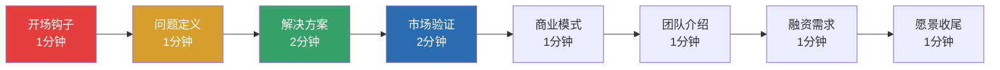

# 第十九章 公开演讲进阶 — 实战案例

本节通过大量真实案例，将前文的理论基础和核心技巧转化为可感知、可模仿、可迁移的实战能力。每个案例不仅展示"做了什么"，更深入拆解"为什么有效"以及"如何复制"。案例覆盖TED经典演讲、商业路演、危机沟通、即兴发言、故事讲述、声音控制、视觉设计、观众互动、线上演讲和失败复盘十大场景，力求让读者在任何演讲情境中都能找到可参照的范本。

---

## 一、TED经典演讲深度拆解

TED演讲之所以成为全球演讲标杆，不仅因为内容优质，更因为其背后有精密的设计方法论。以下三个案例的拆解聚焦于**结构设计、技巧运用和神经科学原理的落地**，而非泛泛的"成功要素"罗列。

### 案例一：肯·罗宾逊《学校扼杀创造力》

**背景：** 2006年TED大会，时长19分24秒，累计观看超过7,000万次，是TED历史上观看量最高的演讲之一。

**逐层拆解：**

**1. 核心思想的提炼**

罗宾逊的核心思想可以用一句话概括：**当前教育系统过度崇拜学术能力，系统性地扼杀了孩子的创造力，而创造力与读写能力同等重要。** 这个思想之所以有传播力，因为它同时满足三个条件：

- **普遍性**：几乎每个人都在教育系统中经历过某种压抑
- **反直觉**：将"教育"与"扼杀"并列，制造认知冲突
- **可行动**：暗示存在更好的替代方案

**2. 结构设计：螺旋上升的情感弧线**

罗宾逊没有采用线性论证（论点→论据→结论），而是使用了**螺旋上升**结构——每一圈都回到"创造力被扼杀"这个核心，但每一圈的情感烈度都更高：

| 段落 | 内容 | 情感能量 | 功能 |
|------|------|----------|------|
| 开场（0-2分钟） | 幽默调侃，建立亲和力 | 中等 | 降低防御，建立信任 |
| 第一圈（2-6分钟） | 教育系统的荒谬性，用幽默包裹批评 | 中高 | 引入核心论点 |
| 第二圈（6-12分钟） | 吉莉安·林恩的故事 | 高 | 用情感证明论点 |
| 第三圈（12-17分钟） | 深入分析教育系统的结构性问题 | 非常高 | 升级为系统性批判 |
| 收尾（17-19分钟） | 呼吁行动 | 最高 | 将思想转化为行动召唤 |

**3. 关键技巧拆解**

**幽默的精确运用：** 罗宾逊的幽默不是随机的笑话，而是服务于论点的修辞工具。他在演讲中使用了至少12处幽默，每一处都紧跟着一个严肃的论点。这种"幽默→论点→幽默→论点"的节奏让观众在放松的状态下接收信息，降低了认知防御。

**吉莉安·林恩故事的叙事结构：** 这个故事完美运用了三幕结构——

- **第一幕（设置）**：6岁女孩被贴上"学习障碍"标签（冲突引入）
- **第二幕（对抗）**：母亲带她看专家，专家的观察方式（悬念维持）
- **第三幕（解决）**：专家的诊断——"她是一个舞蹈家"（反转高潮）

故事的关键在于**反转**——观众预期专家会确认"学习障碍"，但专家给出了完全不同的诊断。这种预期违背创造了情感冲击力，让核心论点（每个人都有独特天赋）深深印入观众记忆。

**"回调"（Callback）技巧：** 罗宾逊在演讲后期多次回调开头的幽默元素，形成首尾呼应。例如，开头提到的"失控"主题在结尾处被重新激活，给观众一种"圆满"的感觉。

**4. 可迁移的设计原则**

| 原则 | 具体做法 | 适用场景 |
|------|----------|----------|
| 一个核心思想 | 用一句话概括你的演讲 | 所有演讲 |
| 幽默包裹论点 | 每个严肃论点前用幽默降低防御 | 说服性演讲 |
| 故事证明论点 | 选择一个有反转的故事 | 教育/倡导类演讲 |
| 螺旋上升结构 | 每一圈回到核心但情感递进 | 长篇演讲（15分钟以上） |

---

### 案例二：布琳·布朗《脆弱的力量》

**背景：** 2010年TEDxHouston，时长20分19秒，累计观看超过6,000万次，让布朗从默默无闻的研究者一跃成为全球思想领袖。

**逐层拆解：**

**1. "自我暴露"策略的精确运用**

布朗的开场是演讲史上最高明的自我暴露之一。她没有说"我很紧张"或"我不完美"这种泛泛之词，而是分享了一个**具体的、尴尬的、与主题直接矛盾的**事实——她被邀请做关于"脆弱"的演讲，但她在博客上写过"我讨厌脆弱"。

这种自我暴露之所以有效，是因为它同时实现了三个功能：

- **建立信任**：观众看到了一个真实的人，而非一个"专家面具"
- **制造矛盾**：矛盾创造好奇心——一个讨厌脆弱的人如何谈论脆弱的力量？
- **身体力行**：她在演讲中展示脆弱，本身就是对论点的证明

**2. 研究数据与个人故事的交织**

布朗采用了一种独特的"双线叙事"结构：

个人故事线：崩溃经历 → 寻求治疗 → 重新认识脆弱
研究数据线：1,200个故事 → 发现模式 → 提出理论

两条线交替推进，每切换一次都产生新的信息增量。观众既被个人故事打动，又被研究数据说服。这种结构同时激活了情感系统（Pathos）和逻辑系统（Logos），比单一路径的说服力强得多。

**3. 关键转折点的设计**

布朗在演讲中段设计了一个关键转折——她从"研究者"身份切换到"普通人"身份。她说："我不得不面对自己的数据，不得不承认脆弱不是我需要克服的东西。"这个转折让观众意识到：**研究的结论也被研究者自己验证了**，可信度由此大幅上升。

**4. 可迁移的设计原则**

| 原则 | 具体做法 | 适用场景 |
|------|----------|----------|
| 与主题矛盾的自我暴露 | 分享你与演讲主题相关的失败或困惑 | 说服性/教育性演讲 |
| 双线叙事 | 个人经历线 + 专业/研究线交替推进 | 学术/专业分享 |
| 身份切换 | 从专家切换到普通人，或反过来 | 建立多层次信任 |
| 数据背书 | 用具体数字（1,200个故事、6年研究）增强可信度 | 所有需要说服力的场景 |

---

### 案例三：西蒙·斯涅克《伟大的领袖如何激励行动》

**背景：** 2009年TEDxPugetSound，时长18分4秒，是TED历史上被引用最多的商业演讲之一。斯涅克提出了"黄金圈"（Golden Circle）理论——Why → How → What。

**逐层拆解：**

**1. 模型的可视化呈现**

斯涅克的核心贡献是"黄金圈"模型——三个同心圆，从内到外依次是Why（为什么）、How（怎么做）、What（做什么）。他在演讲中**手绘了这个模型**，而不是使用PPT。这个选择本身就是一种技巧：

- **降低距离感**：手绘显得即兴、真实、不像预先设计的
- **增强记忆**：观众看到模型在眼前"生长"，比静态图片更容易记住
- **控制节奏**：边画边讲，自然地控制了信息释放的速度

**2. 案例的递进排列**

斯涅克使用了三个递进的案例来支撑他的理论：

| 案例 | 作用 | 递进逻辑 |
|------|------|----------|
| 苹果公司 | 商业领域的证明 | 最容易理解的例子，先建立信任 |
| 马丁·路德·金 | 领导力领域的证明 | 从商业扩展到社会运动 |
| 莱特兄弟 | 创新领域的证明 | 从成功者扩展到"资源少但成功"的案例 |

每个案例都用"黄金圈"框架重新解读，反复强化核心模型。到第三个案例时，观众已经能够自己预判斯涅克的分析逻辑——这意味着他们已经内化了这个框架。

**3. 重复的力量**

斯涅克在演讲中反复使用"人们不买你做的什么，而是买你为什么这样做"这句话的变体。这种重复不是冗余，而是**刻意的信息锚定**。心理学研究表明，一个信息被重复3次以上，接受度会显著提升。

**4. 可迁移的设计原则**

| 原则 | 具体做法 | 适用场景 |
|------|----------|----------|
| 自创模型 | 将复杂理论浓缩为一个可视化模型 | 教学/培训类演讲 |
| 手绘呈现 | 用手绘代替PPT增强真实感 | 小型分享/工作坊 |
| 案例递进 | 从易到难、从具体到抽象排列案例 | 说服性演讲 |
| 关键句重复 | 核心论点至少用3种方式表达3次 | 所有演讲 |

***

## 二、商业发布会与产品路演

商业演讲的核心挑战是：**在有限时间内，让听众从"不知道"变成"愿意行动"。** 以下案例展示了不同商业场景下的演讲设计策略。

### 案例一：乔布斯2007年iPhone发布会（结构拆解）

**背景：** 2007年1月9日，Macworld大会，时长约100分钟。这场发布会被公认为商业演讲的巅峰之作，直接推动了iPhone首年销售超过600万台。

**核心结构设计：**

乔布斯使用了一种独特的"三幕式悬念"结构：

**第一幕（0-8分钟）：重新定义行业**
> "今天，我们将推出三款革命性产品。第一款是一个大屏幕iPod，第二款是一台革命性的手机，第三款是一个突破性的互联网设备。"

观众欢呼三次。然后乔布斯说：

> "这不是三个独立的设备，这是一个设备。"

这句话是整场发布会的"引爆点"——它将三个看似无关的承诺合并为一个超出预期的现实。

**第二幕（8-70分钟）：逐层展示**
乔布斯按照"问题→现有方案→iPhone方案"的循环，逐个功能展示。每个功能都先让观众感受"痛点"，再给出"惊喜"。

**第三幕（70-100分钟）：价格与上市**
在所有功能展示完毕后才公布价格，因为此时观众已经被说服，价格成为"购买决策"而非"是否值得"的判断。

**关键技巧：**

**"现实扭曲力场"的构建：** 乔布斯不是在介绍一款手机，而是在**重新定义"手机"这个概念**。他通过语言选择（"革命性""神奇""前所未见"）和展示方式（现场演示而非PPT截图），构建了一个"新现实"——在这个新现实中，所有旧手机都变成了"功能机"。

**现场演示的魔力：** 乔布斯坚持在发布会现场进行真实设备演示，而非播放录制视频。这增加了风险（设备可能出错），但也大幅增加了可信度和戏剧性。当Google地图在iPhone上流畅运行时，观众的反应是自发的惊叹——因为他们在**实时见证**一个新事物的诞生。

**可迁移策略：**

| 策略 | 做法 | 适用场景 |
|------|------|----------|
| 悬念合并 | 先给出多个承诺，再合并为一个超预期的交付 | 产品发布会 |
| 痛点→惊喜循环 | 每个功能都先制造痛点感，再给出解决方案 | 功能演示/方案介绍 |
| 现场演示 | 用真实设备而非录屏 | 产品演示 |
| 延迟定价 | 先建立价值感知，最后才提价格 | 销售/路演 |

---

### 案例二：公司年会发言——从平淡到精彩

**场景：** 某科技公司年会，项目经理需要代表团队进行5分钟发言。

**原始版本（问题版本）：**

> "大家好，我是李明，来自产品部。今年我们团队完成了三个项目，分别是A项目、B项目和C项目。A项目我们在3月份完成了，B项目在6月份完成了，C项目在9月份完成了。我们的KPI都达到了，客户满意度也不错。明年我们会继续努力。谢谢。"

**问题诊断：**

| 问题 | 具体表现 | 根本原因 |
|------|----------|----------|
| 信息罗列而非叙事 | "A项目3月完成，B项目6月完成" | 缺乏故事线，只有时间线 |
| 没有情感钩子 | 开场即数据，无悬念无共鸣 | 未考虑观众的注意力状态 |
| 缺乏与观众的连接 | 全程"我们团队"，观众旁观 | 没有让观众感受到"与我有关" |
| 结尾无力 | "继续努力"是套话 | 没有设计记忆点 |

**改进版本：**

> "各位同事，大家好。
>
> 一年前的今天，我站在这里的时候，心里其实很忐忑。那时候，我们刚刚失去了一个重要的客户，团队士气低落，我自己也在想：我们还能不能做好？
>
> 但今天，我很高兴地站在这里，告诉大家：我们做到了。
>
> 让我给你们讲一个故事。今年三月的一个深夜，我们的A项目遇到了一个关键技术难题。整个团队加班到凌晨三点，咖啡喝了无数杯，代码改了无数遍。就在大家快要放弃的时候，我们的工程师小王突然说：'等等，我有一个想法。'他提出了一个全新的解决方案，不仅解决了问题，还让产品的性能提升了30%。
>
> 那一刻，我明白了：真正的团队不是一群完美的人，而是一群在困难面前不放弃的人。
>
> 今年，我们不仅完成了三个项目，更重要的是，我们找回了信心，找回了那种'我们可以做到'的信念。
>
> 明年，我们将面临更大的挑战。但我相信，只要我们保持这种精神，没有什么是我们做不到的。
>
> 谢谢大家。"

**改进分析：**

| 技巧 | 改进前 | 改进后 |
|------|--------|--------|
| 开场 | 直接报数据 | 设置悬念（一年前的忐忑） |
| 叙事方式 | 项目罗列 | 一个深夜故事（场景感） |
| 核心信息 | "KPI达标" | "真正的团队是不放弃的人" |
| 情感弧线 | 平坦 | 低谷→奋斗→胜利 |
| 结尾 | "继续努力" | 激励性宣言 |

---

### 案例三：投资人路演的黄金结构

**场景：** 创业者需要向投资人进行10分钟项目路演。

**路演结构设计：**

**各环节设计要点：**

**开场（1分钟）——从投资人自己的生活切入：**

> "各位投资人，我想问你们一个问题：你们有多少次在餐厅点餐时，不知道该点什么？（等待回应）我相信很多人都有这种经历。现在，想象一下，如果有一个应用，能够根据你的口味、健康状况、甚至心情，为你推荐最合适的菜品。这就是我们正在做的事情。"

**设计原理：** 不从产品出发，而从**投资人自己经历过的问题**出发。这立即建立了"这个问题与你有关"的连接，同时用反问和等待制造了互动。

**问题定义（1分钟）——用数字量化痛点：**

> "目前，餐饮推荐存在三个主要问题：第一，信息过载，用户面对海量菜单无从选择；第二，推荐不精准，大多数推荐系统只考虑历史偏好，忽略了实时因素；第三，缺乏个性化，无法满足用户的健康和饮食需求。"

**设计原理：** 使用"三"这个数字——人的工作记忆最容易处理3个信息单元。每个问题都用一句话概括，不留模糊空间。

**市场验证（2分钟）——投资人最关心的环节：**

> "我们已经在三个城市进行了试点，服务了超过10万用户。数据显示，用户使用我们的应用后，点餐满意度提升了45%，复购率提升了60%。更重要的是，我们获得了85%的用户推荐率。"

**设计原理：** 投资人最关心的是"你的想法是否已经被验证"。使用具体数字（10万用户、45%满意度、85%推荐率）而非模糊描述。数字的排列遵循**递进逻辑**——从用户规模到满意度到推荐率，每一步都比前一步更有说服力。

**常见路演错误与纠正：**

| 常见错误 | 为什么是错的 | 纠正方法 |
|----------|-------------|----------|
| 开场就介绍产品 | 投资人还不知道问题是什么 | 先讲问题，再讲方案 |
| 堆砌技术细节 | 投资人关心商业而非技术 | 用一句话概括技术优势 |
| 只说"市场很大" | 没有具体路径的大市场毫无意义 | 用TAM/SAM/SOM缩小到可执行 |
| 团队介绍太长 | 投资人只关心"为什么是你们" | 只介绍与项目直接相关的经历 |
| 没有明确的融资需求 | "看情况"会让投资人失去兴趣 | 说清楚融多少、怎么花、预期效果 |

***

## 三、危机沟通与高压演讲

危机时刻的演讲是压力最大的演讲场景之一。此时观众带着焦虑、愤怒或恐惧而来，任何不当的措辞都可能加剧危机。以下案例展示了危机沟通的核心原则和具体策略。

### 案例一：产品安全事故后的公开回应

**场景：** 某食品企业被曝产品存在质量安全隐患，CEO需要在新闻发布会上公开回应。

**失败版本（反面教材）：**

> "经过我们内部调查，我们认为个别批次可能存在一些问题，但总体上我们的产品是安全的。我们已经采取了一些措施，希望大家理性看待。"

**问题分析：**

| 问题 | 具体表现 | 后果 |
|------|----------|------|
| 推卸责任 | "个别批次""可能存在" | 公众感觉不诚恳 |
| 没有具体行动 | "一些措施" | 没有重建信任的基础 |
| 指责公众 | "理性看待" | 暗示公众不理性，激化矛盾 |

**改进版本：**

> "各位消费者、各位媒体朋友：
>
> 首先，我代表公司向所有受到影响的消费者诚挚道歉。（停顿）你们的信任是我们存在的基础，而我们辜负了这份信任。
>
> 我要明确说明三件事：
>
> 第一，事实。我们的XX批次产品确实存在XX问题。我们已经委托第三方权威机构进行检测，检测报告将在48小时内向公众公开。
>
> 第二，行动。从今天起，我们采取以下措施：（1）立即召回所有受影响批次的产品；（2）全面停产，直到问题彻底解决；（3）建立消费者赔偿通道，所有受影响的消费者将获得全额退款和补偿。
>
> 第三，根因。我们已经启动内部调查，将在两周内公布调查结果和整改措施。调查将由外部独立机构主导，确保公正透明。
>
> 最后，我想对每一位消费者说：你们的批评是对的。我们会用行动证明，我们值得你们再次信任。谢谢。"

**改进分析：**

| 技巧 | 运用 | 原理 |
|------|------|------|
| 先道歉，不辩解 | 第一句话就是道歉 | 危机中公众要的是态度，不是解释 |
| 承认事实 | "确实存在XX问题" | 回避事实会摧毁所有后续信誉 |
| 结构化回应 | "三件事"框架 | 在混乱中提供清晰的结构感 |
| 具体行动 | 召回、停产、赔偿，有时间表 | 模糊的承诺无法重建信任 |
| 外部独立调查 | "外部独立机构主导" | 自查自纠缺乏可信度 |

### 案例二：团队危机时刻的内部讲话

**场景：** 公司面临重大裁员，团队负责人需要向留下的员工说明情况并稳定军心。

**关键设计原则：**

**1. 信息透明原则：** 员工最恐惧的不是坏消息，而是未知。明确说明"发生了什么""为什么发生""接下来会怎样"。

**2. 情感承认原则：** 不要试图用"正面思维"覆盖负面情绪。承认大家的愤怒、失望和不安是合理的。

**3. 未来锚定原则：** 在承认困难之后，必须给出一个清晰的未来方向，让员工知道"我们要去哪里"。

**参考话术：**

> "我知道今天的会议让大家很难受。我自己也很难受。（停顿）
>
> 我不想用任何漂亮话来粉饰事实：公司确实面临了严重的经营困难，我们不得不做出艰难的决定，减少部分岗位。这不怪任何人，这是我需要承担责任的决策失误。
>
> 但我想告诉你们三件事：
>
> 第一，你们留下来，是因为公司需要你们。不是因为你们比较便宜，而是因为你们的能力和经验是公司度过难关的核心力量。
>
> 第二，我已经和管理层制定了明确的转型计划。接下来三个月，我们的核心目标是XX。这个目标是可衡量的，我会每周向大家同步进展。
>
> 第三，我承诺：在公司状况稳定之前，管理层将首先降薪，不会在员工之前拿奖金。
>
> 你们有权愤怒，有权质疑。我只请求一件事：给我们三个月时间，用行动证明留下是正确的选择。"

***

## 四、即兴演讲实战

即兴演讲的核心不是"临场发挥"，而是**在极短时间内调用预装框架**。以下案例展示了不同框架在真实场景中的应用。

### 框架一：PREP（观点-理由-例证-重述）

**场景：** 部门会议上，领导突然问："小李，你对这个方案有什么看法？"

**完整回应：**

> **P（观点）：** "我认为这个方案整体方向是正确的，但有一个关键风险需要我们重视。"
>
> **R（理由）：** "方案中提到的时间表非常紧凑，考虑到我们目前的资源状况和项目复杂度，按照这个时间表执行可能会导致质量下降。"
>
> **E（例证）：** "去年我们执行类似项目时也遇到了时间压力。当时我们压缩了测试时间，结果上线后出现了多个bug，最终花了比原计划多50%的时间来修复。"
>
> **P（重述）：** "所以，我建议调整时间表，给测试环节留出更多时间。虽然可能推迟上线，但从长远看会节省更多时间和成本。"

**技巧拆解：**

- **观点要单数**：只说"一个关键风险"，不说"几个问题"。单数观点更容易被记住
- **例证要具体**："多50%的时间"比"花了更多时间"有力得多
- **重述要变化**：重述不是重复，而是从不同角度重新表述同一个观点

### 框架二：STAR（情境-任务-行动-结果）

**场景：** 获得行业奖项，需要上台进行2分钟即兴感谢。

**完整回应：**

> **S（情境）：** "三年前，当我刚开始进入这个行业的时候，我几乎什么都不懂。我曾经在一次重要的客户演示中犯了一个严重的错误，差点让公司失去了一个重要的客户。"
>
> **T（任务）：** "从那以后，我给自己定了一个目标：不仅要弥补那次失误，还要成为这个领域的专家。"
>
> **A（行动）：** "我投入了大量时间学习和实践。我参加了专业培训，阅读了行业内的经典著作，更重要的是，我在每一次实践中总结和改进。"
>
> **R（结果）：** "今天能够站在这里获得这个奖项，我感到非常荣幸。但这个奖项不仅仅属于我一个人，它属于所有帮助过我的人——我的团队、我的导师、我的家人。没有你们的支持，我不可能走到今天。谢谢你们。"

**技巧拆解：**

- **情境要有冲突**：开场的"严重错误"制造了戏剧性，比"我很努力"更有记忆点
- **结果要归功于人**：获奖感言的核心不是自我表扬，而是建立社会连接

### 框架三：问题-原因-方案（PRS）

**场景：** 面试官问："请分享一次你面对失败的经历。"

**完整回应：**

> **P（问题）：** "在我之前的工作中，我负责一个重要产品的市场推广。我们投入了大量的资源，但最终的市场反应远低于预期。"
>
> **R（原因）：** "我分析了失败的原因：首先，我们的市场调研不够深入，没有真正理解目标用户的需求；其次，我们的推广策略过于传统，没有充分利用新媒体渠道。"
>
> **S（方案）：** "为了解决这些问题，我做了两件事：第一，重新设计了市场调研流程，加入了深度访谈和用户行为分析；第二，学习了数字营销的最新方法并在下一个项目中应用。结果，下一个项目的传播效果提升了3倍。"

**即兴框架速查表：**

| 框架 | 结构 | 适用场景 | 核心优势 |
|------|------|----------|----------|
| PREP | 观点→理由→例证→重述 | 表达立场/建议 | 逻辑清晰，说服力强 |
| STAR | 情境→任务→行动→结果 | 描述经历/案例 | 有故事感，易记忆 |
| PRS | 问题→原因→方案 | 分析问题/展示能力 | 展示分析思维 |
| What-So What-Now What | 事实→意义→行动 | 会议总结/行动号召 | 快速导向行动 |
| Past-Present-Future | 过去→现在→未来 | 愿景演讲/战略分享 | 时间线清晰 |

***

## 五、故事讲述实战

故事是演讲中最强大的工具。以下案例展示了如何将平淡的信息转化为引人入胜的叙事，以及不同故事结构的具体运用。

### 案例一：创业故事的两个版本

**平淡版：**

> "我们公司成立于2018年，最初只有三个人。我们开发了一款教育产品，经过几年的发展，现在已经成为行业的领先者。"

**生动版：**

> "2018年的一个冬天，我和两个朋友坐在一间不到20平米的出租屋里。外面下着雪，屋里没有暖气，我们裹着被子，盯着电脑屏幕。
>
> 那时候，我们刚刚辞去了稳定的工作，决定做一件我们认为很重要的事情：让每个孩子都能获得优质的教育资源。
>
> 我们的第一笔资金只有5万块钱，是我们的全部积蓄。为了省钱，我们自己做饭，自己打扫卫生，甚至自己修电脑。
>
> 有一次，我们的服务器突然崩溃了，所有的用户数据都面临着丢失的风险。我们三个人连续工作了48小时，终于在数据完全丢失之前恢复了系统。那一刻，我们抱在一起，又哭又笑。
>
> 现在，五年过去了，我们从三个人变成了三百人，从一间出租屋变成了一栋办公楼。但有一件事没有变：我们的初心——让每个孩子都能获得优质的教育资源。"

**对比拆解：**

| 维度 | 平淡版 | 生动版 | 差异原理 |
|------|--------|--------|----------|
| 时间锚点 | "2018年" | "2018年冬天，下着雪" | 具体的感官细节激活镜像神经元 |
| 空间感 | 无 | "20平米出租屋，没有暖气" | 让观众"看到"场景 |
| 人物状态 | 无 | "裹着被子，盯着电脑" | 具体动作比形容词更有力 |
| 冲突 | 无 | "服务器崩溃，48小时抢救" | 冲突是故事的核心动力 |
| 情感 | 无 | "又哭又笑" | 情感让故事产生共鸣 |
| 对比 | "三个人→领先者" | "三个人→三百人，出租屋→办公楼" | 对比创造戏剧感 |

**故事讲述的五感法则：**

要让故事生动，必须激活观众的感官。以下是一个检查清单：

| 感官 | 检查问题 | 示例 |
|------|----------|------|
| 视觉 | 观众能"看到"什么画面？ | "20平米的出租屋" |
| 听觉 | 有什么声音？ | "服务器崩溃时的警报声" |
| 触觉 | 有什么触感？ | "裹着被子" |
| 嗅觉 | 有什么气味？ | "泡面的味道弥漫在房间里" |
| 味觉 | 有什么味道？ | "凌晨三点的苦咖啡" |

不需要每个故事都激活全部五感，但至少要有**2-3个感官细节**。

### 案例二：个人成长故事的结构化设计

**场景：** 分享会上讲述个人成长故事。

**结构拆解：**

背景（10%）→ 转折点（15%）→ 挑战（30%）→ 高潮（25%）→ 结果（10%）→ 启示（10%）

**完整示例：**

> **背景：** "五年前，我是一个极度内向的人。我害怕在公众场合说话，甚至害怕在会议上发言。每次需要发言的时候，我的心跳就会加速，手心出汗，脑子一片空白。"
>
> **转折点：** "有一天，我的领导找到我说：'下个月的客户会议，你来做主讲。'我当时吓坏了，想要拒绝。但领导说：'我相信你能做到。'这五个字改变了我的人生轨迹。"
>
> **挑战：** "为了准备那次演讲，我花了整整一个月的时间。我写了逐字稿，反复练习了上百次。我对着镜子练习，对着家人练习，甚至对着我家的狗练习。（笑）我家的狗可能是我最忠实的观众。"
>
> **高潮：** "演讲那天，我站在会议室里，面对着20多位客户。我的腿在发抖，声音在颤抖。但当我开始讲述我们的产品时，我突然忘记了紧张。我专注于我要传递的信息，专注于帮助客户解决问题。"
>
> **结果：** "那次演讲非常成功，客户当场签下了合同。更重要的是，我发现了自己对演讲的热爱。"
>
> **启示：** "这个经历告诉我：成长往往发生在你的舒适区之外。当你面对恐惧，而不是逃避恐惧时，你才能发现自己的潜力。"

**技巧拆解：**

- **转折点要具体**："我相信你能做到"这五个字比"领导鼓励了我"有力100倍
- **挑战要有细节**："对着狗练习"既真实又幽默，降低了紧张感
- **高潮要有感官**："腿在发抖，声音在颤抖"让观众感受到现场
- **启示要短而有力**：一句话的启示比一段话更容易被记住

***

## 六、声音与肢体控制实战

声音和肢体是演讲者最直接的表达工具。以下案例展示了同一段内容在不同声音和肢体处理下的截然不同效果。

### 案例一：同一段话的三种声音演绎

**文本：** "今天，我要告诉你们一个改变我人生的秘密。"

**演绎一：平淡版**
- 语速：正常（约150字/分钟）
- 音量：正常
- 语调：平直，无起伏
- 停顿：无
- **效果**：观众无反应，信息被忽略

**演绎二：悬念版**
- 语速：前半句正常，后半句放慢（约100字/分钟）
- 音量："今天"正常，"秘密"压低
- 语调："今天"升调，"秘密"降调
- 停顿："今天"后短停0.5秒，"秘密"后长停2秒
- **效果**：观众抬头，注意力集中，产生好奇

**演绎三：激情版**
- 语速：逐渐加快
- 音量：逐渐增强
- 语调：逐渐升高
- 停顿：无（用速度和音量制造冲击力）
- **效果**：观众被感染，情绪被调动

**声音技巧速查表：**

| 技巧 | 作用 | 使用时机 | 具体做法 |
|------|------|----------|----------|
| 长停顿（2-3秒） | 制造悬念，强调重点 | 关键信息前 | 说完引导句后停顿，让观众产生期待 |
| 压低音量 | 吸引注意力，制造亲密感 | 分享秘密或感悟时 | 刻意降低音量，迫使观众集中注意力 |
| 加快语速 | 制造紧迫感和激情 | 描述行动/高潮时 | 语速提升20-30% |
| 放慢语速 | 强调重要信息 | 核心论点/金句时 | 语速降低30-40%，逐字清晰发音 |
| 音量渐强 | 逐层递进，积累能量 | 排比句/呼吁行动时 | 每一句比前一句音量高一点 |
| 音量突降 | 制造反差，强调重点 | 在高能量之后突然降低 | 前面用高音量铺垫，关键句突然压低 |

### 案例二：肢体语言的舞台空间运用

**空间锚定法：**

优秀的演讲者会将舞台的不同区域"绑定"到不同的内容类型。这种空间锚定帮助观众通过演讲者的位置变化来理解内容的逻辑关系。

**具体做法：**

| 舞台区域 | 绑定内容 | 示例 |
|----------|----------|------|
| 中央（面对观众） | 核心论点、重要声明 | "我们的核心理念是……" |
| 左侧（观众的左边） | 过去、问题、现状 | "过去我们的做法是……" |
| 右侧（观众的右边） | 未来、方案、愿景 | "未来我们应该……" |
| 向前走一步 | 强调、亲密、提问 | "我想问你们一个问题" |
| 向后退一步 | 反思、过渡、总结 | "让我们退一步想想" |

**常见肢体语言错误与纠正：**

| 错误 | 表现 | 纠正方法 |
|------|------|----------|
| 僵直站立 | 双脚并拢，身体不动 | 双脚与肩同宽，重心微前倾 |
| 来回踱步 | 无目的地在台上走动 | 每次移动都要有目的（空间锚定） |
| 手插口袋 | 紧张时不自觉地插口袋 | 手自然下垂或做手势 |
| 双臂交叉 | 防御性姿态，疏远观众 | 手臂自然开放，手势配合内容 |
| 频繁摸脸/头发 | 紧张的无意识动作 | 录像回看，识别并有意识地控制 |
| 眼神飘忽 | 不看观众或只看一个方向 | 使用"3-5秒法则"：每3-5秒换一个眼神交流对象 |

### 案例三：手势的语义功能

手势不是装饰，而是语言的延伸。以下四种手势类型各有其功能：

**1. 指示性手势——引导注意力**
- 用途：指向PPT、指向观众、指向某个方向
- 示例："这个问题（手指向PPT上的图表）需要我们重点关注"

**2. 描述性手势——创造画面**
- 用途：描述大小、形状、方向、数量
- 示例："我们的用户增长曲线是这样的"（手从低到高画弧线）

**3. 节奏性手势——强调节奏**
- 用途：配合排比句、列举要点
- 示例："第一（伸出食指），我们需要……；第二（伸出两根手指）……；第三（伸出三根手指）……"

**4. 情感性手势——传达情绪**
- 用途：表达热情、愤怒、无奈、惊喜等
- 示例："这让我非常激动"（双手握拳，身体微前倾）

**手势使用的黄金规则：**

- **腰部以上**：手势保持在腰部以上，低于腰部显得不确定
- **不要超过肩膀宽度**：太大的手势显得夸张，太小的手势看不到
- **与语言同步**：手势要和语言内容在时间上精确同步
- **果断执行**：手势要做到位，不要半途收回

***

## 七、视觉辅助设计实战

视觉辅助（PPT/幻灯片）是演讲中最容易出错的环节。以下案例展示了从"灾难级"到"专业级"的设计对比。

### 案例：年度业绩汇报的PPT设计

**灾难级设计：**
- 一页PPT包含所有数据（营收、利润、用户增长、市场份额……）
- 大量文字说明，字号小于14号
- 使用默认图表样式，颜色混乱
- 包含公司logo、页码、日期等装饰元素
- 动画效果：文字飞入、旋转、闪烁

**问题诊断：**

| 问题 | 后果 | 原理 |
|------|------|------|
| 信息过载 | 观众无法抓住重点 | 认知负荷理论：工作记忆容量有限 |
| 文字太多 | 观众在读PPT，不听演讲 | 双通道竞争：视觉通道被文字占用 |
| 装饰元素多 | 分散注意力 | 米勒定律：无关信息占用认知资源 |
| 动画花哨 | 显得不专业 | 动画应服务于内容，而非炫耀技巧 |

**专业级设计：**

**第一页：标题页**
- 大标题："2023年度业绩回顾"
- 副标题："突破与创新"
- 全屏背景图：团队庆祝的照片
- 设计原则：一张图片传达情绪，标题传达信息

**第二页：核心数据**
- 大字体显示："营收增长35%"
- 简洁的上升箭头图表
- 背景：简洁的渐变色
- 设计原则：一页一个核心信息，数字冲击力

**第三页：产品线表现**
- 三个产品用图标表示
- 每个产品下面显示增长率
- 使用颜色区分不同产品
- 设计原则：对比产生洞察

**第四页：客户反馈**
- 一句客户评价，大字体显示
- 客户头像和公司名称
- 设计原则：用他人的声音增强可信度

**第五页：未来展望**
- 三个关键目标
- 每个目标配一个图标
- 设计原则：行动导向，简洁明了

**视觉辅助设计检查清单：**

| 检查项 | 标准 | 检查方法 |
|--------|------|----------|
| 信息密度 | 每页不超过1个核心信息 | 把PPT打印成6页/张缩略图，能否一眼看出每页主题？ |
| 文字量 | 不超过40字/页 | 能否在3秒内读完一页的文字？ |
| 字号 | 标题≥36号，正文≥24号 | 站在教室最后一排能否看清？ |
| 颜色 | 全局不超过3种主色 | 去掉颜色后，内容是否仍然清晰？ |
| 图文比 | 图片≥70%，文字≤30% | 文字是否多到需要观众"阅读"？ |
| 动画 | 仅用于分步呈现信息 | 去掉动画后，内容是否完整？ |

***

## 八、观众互动与控场实战

观众互动不是"锦上添花"，而是提升演讲效果的**核心策略**。研究表明，有互动环节的演讲，观众的信息记忆率比纯单向演讲高出40%。

### 案例一：开场互动的设计

**场景：** 一场关于时间管理的演讲，观众约100人。

**互动设计：**

> "在我们开始之前，我想先做一个小调查。请各位拿出手机，打开你的日历应用。（等待10秒）现在，请看看你今天的日程——有多少人今天的日程是排满的？请举手。"
>
> "好，我看到很多人举手了。请放下手。现在，第二个问题：有多少人觉得今天的日程中，至少有一项是可以不做或交给别人的？请举手。"
>
> "嗯，还是很多人举手。好，请放下。"
>
> "这就是我们今天要讨论的问题——时间管理。你们刚才的反应告诉我，我们中的大多数人，都在用有限的时间做着无限的事情。今天，我要和你们分享一个方法，帮助你们从'忙碌'走向'高效'。"

**设计原理拆解：**

| 设计要素 | 做法 | 原理 |
|----------|------|------|
| 低门槛参与 | 只需要举手 | 参与门槛越低，响应率越高 |
| 两个问题递进 | 第一个引出话题，第二个引出痛点 | 逐步升级参与深度 |
| 自我诊断 | 让观众"发现"自己的问题 | 人更相信自己得出的结论 |
| 等待时间 | 明确等待10秒 | 给观众时间反应，不要催促 |
| 自然过渡 | 从互动结果自然引出主题 | 互动不是独立环节，而是演讲的一部分 |

### 案例二：应对冷场和挑战性提问

**冷场应对策略：**

| 冷场类型 | 原因 | 应对方法 |
|----------|------|----------|
| 提问后无人回应 | 问题太宽泛/太难/观众害羞 | 换成二选一问题，或指定区域 |
| 观众注意力分散 | 内容疲劳 | 插入互动、故事或幽默 |
| 技术故障 | 设备问题 | 提前准备离线版本，用故事过渡 |

**挑战性提问应对框架——ADR法：**

1. **Acknowledge（承认）**："这是一个很好的问题。"
2. **Direct（引导）**：将问题引导到你有准备的方向
3. **Respond（回应）**：给出有实质内容的回答

**示例：**

> 观众："你们的产品和竞争对手X相比有什么优势？你是不是在回避这个问题？"
>
> 回应："谢谢你的直接提问，这正是我想讨论的。（承认）关于竞争格局，我认为核心的差异化在于三个方面。（引导）第一，我们的技术架构是……（回应）"

**如果不知道答案：**

> "这个问题很好，但我不确定我能给出准确的答案。我会在演讲结束后查证，并通过邮件回复你。你能留下联系方式吗？"

**原则：永远不要编造答案。** 承认不知道比胡编答案更能维护你的可信度。

***

## 九、线上演讲与混合场景实战

后疫情时代，线上演讲已成为常态。但大多数演讲者仍然用"线下思维"做线上演讲，导致效果大打折扣。

### 案例一：线上演讲的设备与环境设置

**硬件设置清单：**

| 设备 | 要求 | 预算参考 | 为什么重要 |
|------|------|----------|----------|
| 摄像头 | 1080p以上，帧率30fps | 200-500元 | 画质是第一印象 |
| 麦克风 | 独立电容麦或领夹麦 | 100-300元 | 音质比画质更重要 |
| 灯光 | 面部正前方45度，色温5000K | 50-150元（环形灯） | 消除阴影，提升专业感 |
| 背景 | 整洁、简洁、无干扰 | 0元（整理即可） | 背景分散注意力 |
| 网络 | 有线连接，上行≥10Mbps | — | 无线网络不稳定 |

**环境设置图示：**

        [摄像头]
           |
    [环形灯/柔光灯]
           |
       [演讲者]
           |
   [简洁背景墙/书架]

### 案例二：线上演讲的互动设计

**线上互动的特殊挑战：** 观众可以随时关闭摄像头、切换窗口、查看手机。注意力竞争比线下更激烈。

**每5分钟一个互动点：**

| 时间段 | 互动方式 | 工具 |
|--------|----------|------|
| 0-5分钟 | 投票："你对这个话题的熟悉程度是？" | 平台投票功能 |
| 5-10分钟 | 聊天区提问："用一个词描述你最大的挑战" | 聊天区 |
| 10-15分钟 | 小组讨论（2分钟） | 分组房间 |
| 15-20分钟 | Q&A环节 | 举手功能 |
| 20-25分钟 | 实操练习 | 屏幕共享+反馈 |
| 25-30分钟 | 总结投票："你学到的最重要的一点是？" | 平台投票功能 |

**线上演讲的语速和节奏调整：**

| 调整项 | 线下 | 线上 | 原因 |
|--------|------|------|------|
| 语速 | 150字/分钟 | 130字/分钟 | 线上信息传递效率更低 |
| 停顿 | 1-2秒 | 2-3秒 | 网络延迟需要更多缓冲时间 |
| 内容密度 | 较高 | 降低20% | 线上注意力窗口更短 |
| 互动频率 | 每10-15分钟 | 每5分钟 | 线上更容易分心 |

***

## 十、演讲焦虑管理实战

演讲焦虑不是需要"克服"的敌人，而是需要"管理"的能量。以下案例展示了从极度恐惧到自信表达的完整转变路径。

### 案例：从恐惧到自信的五阶段转变

**人物背景：** 王芳，35岁，某公司中层管理者，曾经对公开演讲极度恐惧（自评焦虑量表9/10分）。

**阶段一：认知重构（第1-2周）**

> "我意识到，我的演讲焦虑来自两个方面：一是害怕犯错，二是害怕被评判。我问自己：'最坏的结果是什么？'答案是：说错话，被人笑话。但这个后果真的是灾难性的吗？不是。"

**认知重构练习：**

| 焦虑想法 | 重构后的想法 | 证据 |
|----------|-------------|------|
| "我会忘词" | "忘词了可以看提纲，没人期望完美" | 回忆别人忘词时你的真实反应 |
| "大家会笑话我" | "大多数人希望我成功，不会故意嘲笑" | 回忆你听别人演讲时的心态 |
| "我会紧张到说不出话" | "适度紧张是正常的，它给我能量" | 回忆紧张时你仍然完成了演讲的经历 |

**阶段二：重新定义成功（第2-3周）**

> "我重新定义了演讲的成功标准。成功不是'完美无缺'，而是'真实地传递信息，与观众建立连接'。这个认知转变让我的压力大大减轻。"

**练习：** 写下你对"成功演讲"的定义，然后对比以下两种定义：

| 完美主义定义（高焦虑） | 现实主义定义（低焦虑） |
|----------------------|----------------------|
| 一字不差地背完稿 | 核心信息传达清楚 |
| 零紧张 | 紧张但在可控范围 |
| 所有人都喜欢 | 大部分人有收获 |
| 不犯任何错误 | 犯错后能自然补救 |

**阶段三：系统准备（第3-4周）**

> "我开始为每一场演讲做充分的准备。我不再依赖即兴发挥，而是认真地准备内容、排练、模拟。准备越充分，我就越自信。"

**准备清单：**

| 准备项目 | 具体内容 | 完成标记 |
|----------|----------|----------|
| 内容准备 | 演讲大纲、逐字稿、故事素材 | □ |
| 视觉辅助 | PPT设计、排版、动画测试 | □ |
| 排练 | 完整排练3次以上，录像回看 | □ |
| 场地 | 提前到场地熟悉环境、测试设备 | □ |
| 预案 | 准备Q&A的应对、技术故障的备份方案 | □ |
| 身体 | 充足睡眠、适度运动、避免空腹 | □ |

**阶段四：渐进暴露（第4-8周）**

> "我从小组分享开始，逐渐增加演讲的规模。从5人小组，到20人部门会议，到100人公司大会，再到500人行业峰会。每一次成功的经验都增强了我的信心。"

**暴露等级表：**

| 等级 | 场景 | 焦虑水平 | 练习频率 |
|------|------|----------|----------|
| 1 | 对着镜子练习 | 1-2/10 | 每天 |
| 2 | 对着1-2个信任的人 | 2-3/10 | 每周2-3次 |
| 3 | 小组会议发言（5-10人） | 3-4/10 | 每周1次 |
| 4 | 部门会议分享（20-30人） | 4-5/10 | 每两周1次 |
| 5 | 公司大会发言（50-100人） | 5-6/10 | 每月1次 |
| 6 | 行业会议演讲（100+人） | 6-7/10 | 每季度1次 |
| 7 | 大型峰会/付费演讲 | 7-8/10 | 机会出现时 |

**关键原则：** 每次暴露后必须有成功的体验，才能建立正向循环。如果某一级别焦虑过高，退回上一级别巩固后再尝试。

**阶段五：接受不完美（持续）**

> "我学会了接受不完美。有一次，我在演讲中突然忘记了下一句话。以前的我会惊慌失措，但那次我微笑着说：'看来我需要喝口水了。'观众笑了，我也笑了。那一刻，我意识到：不完美没关系，真实更重要。"

**"救场"话术库：**

| 意外情况 | 救场话术 | 效果 |
|----------|----------|------|
| 忘词 | "让我重新整理一下思路"（停顿，看提纲） | 显得从容而非慌张 |
| PPT出错 | "看来技术也想给大家一个惊喜" | 用幽默化解尴尬 |
| 观众走神 | "我想问大家一个问题" | 用互动重新拉回注意力 |
| 时间不够 | "由于时间关系，我直接说最重要的部分" | 显得有控制力 |
| 设备故障 | "没关系，我直接讲"（走到观众中间） | 展示专业素养 |

**演讲前的即时减压技术：**

| 技术 | 做法 | 时间 | 原理 |
|------|------|------|------|
| 4-7-8呼吸法 | 吸气4秒，屏气7秒，呼气8秒 | 2-3分钟 | 激活副交感神经，降低心率 |
| 力量姿势 | 双手叉腰站立，或双手举过头顶 | 2分钟 | 提升睾酮，降低皮质醇 |
| 渐进式放松 | 从脚趾到头部，逐个部位紧张→放松 | 5分钟 | 释放肌肉紧张 |
| 积极自我对话 | "我准备充分，我能做到" | 1分钟 | 替换消极的认知模式 |
| 熟悉场地 | 提前到演讲场地，站在舞台上 | 10-15分钟 | 降低陌生感引发的焦虑 |

***

## 十一、失败案例复盘与纠错

从失败中学习往往比从成功中学习更深刻。以下案例展示了真实演讲中常见的失败模式及其根因分析。

### 案例一：信息过载导致的"什么都说了，什么都没记住"

**失败场景：** 某技术大会上，一位工程师进行30分钟的技术分享，试图涵盖5个技术要点、3个案例、2个demo和1个未来展望。

**结果：** 会后调查显示，观众能记住的内容不超过1个要点。

**根因分析：**

| 根因 | 表现 | 理论依据 |
|------|------|----------|
| 信息密度过高 | 30分钟塞入了60分钟的内容 | 认知负荷理论：工作记忆容量有限 |
| 缺乏结构标识 | 要点之间没有清晰的过渡 | 组块理论：人脑通过"组块"处理信息 |
| 没有重复 | 每个要点只说了一遍 | 艾宾浩斯遗忘曲线：无重复的信息20分钟后遗忘80% |
| 没有故事 | 全程技术描述，无叙事 | 故事比数据的记忆率高22倍（斯坦福研究） |

**纠正方案：**

| 改进前 | 改进后 |
|--------|--------|
| 5个技术要点 | 1个核心论点 + 3个支撑点 |
| 3个案例 | 1个深入的故事案例 |
| 2个demo | 1个精选demo（最能说明核心论点的那个） |
| 平铺直叙 | "问题→方案→证明→呼吁"的叙事结构 |

### 案例二：缺乏观众连接导致的"自说自话"

**失败场景：** 某创业大赛中，创始人进行了10分钟路演，全程聚焦于技术细节和产品功能，没有提及市场需求和用户痛点。

**结果：** 评委评分低于平均水平，反馈为"不了解市场"。

**根因分析：**

| 根因 | 表现 | 纠正方法 |
|------|------|----------|
| 从产品出发而非从问题出发 | 开场就介绍技术架构 | 先讲用户痛点，再讲解决方案 |
| 使用专业术语 | 评委听不懂的技术细节 | 用类比和比喻解释技术 |
| 没有情感连接 | 全程数据和功能，无故事 | 加入用户故事或创始故事 |
| 忽视观众角色 | 没有考虑评委关心什么 | 提前了解评委背景和关注点 |

### 案例三：过度依赖PPT导致的"读稿机器"

**失败场景：** 某公司内部培训中，培训师全程照着PPT念，每张PPT都是密密麻麻的文字，培训师的视线几乎没有离开过屏幕。

**结果：** 观众注意力在5分钟后开始涣散，10分钟后大多数人开始看手机。

**根因分析：**

| 根因 | 表现 | 纠正方法 |
|------|------|----------|
| PPT替代了演讲 | PPT包含完整内容，演讲者只需"读" | PPT只放关键词，详细内容靠口述 |
| 缺乏排练 | 不熟悉内容，必须看稿 | 至少完整排练3次 |
| 眼神没有连接 | 全程看屏幕 | 使用"三角法"：屏幕→观众→屏幕 |
| 节奏单一 | 匀速读稿，无变化 | 制造节奏变化：快→慢→停顿 |

**"一页PPT"原则：**

一张PPT上只应该有一个核心信息。检验方法：把PPT缩小到邮票大小，如果你仍然能一眼看出它在说什么，说明设计合格。如果看不清，说明信息过多。

***

## 本节小结

通过以上十一个板块的实战案例拆解，我们可以提炼出以下核心规律：

**1. 所有优秀演讲都遵循"一个核心思想"原则。** 无论是19分钟的TED演讲还是5分钟的年会发言，有效的演讲只传达一个核心信息，其他一切都是为这个信息服务的。

**2. 结构是演讲的骨架。** PREP、STAR、PRS等框架不是"套路"，而是人类认知的自然结构。使用框架不是限制创造力，而是在压力下保持思路清晰的保障。

**3. 故事是演讲的灵魂。** 数据让人理解，故事让人感受。最有效的演讲永远是"数据+故事"的组合——数据建立可信度，故事创造共鸣。

**4. 声音和肢体是演讲的放大器。** 同一段文字，不同的声音处理和肢体表达可以传达截然不同的含义。这些技巧需要通过刻意练习内化为本能。

**5. 互动是演讲的催化剂。** 单向输出的信息传递效率最低，有互动的演讲能让观众从"被动接收"变成"主动参与"。

**6. 失败是最好的老师。** 分析失败案例比分析成功案例更有价值，因为失败暴露了具体的错误模式，而成功往往掩盖了背后的偶然因素。

在下一节中，我们将分析公开演讲中的常见误区，帮助你系统性地识别和纠正错误。
