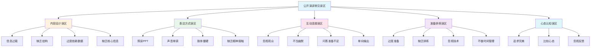
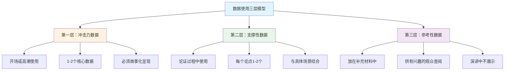
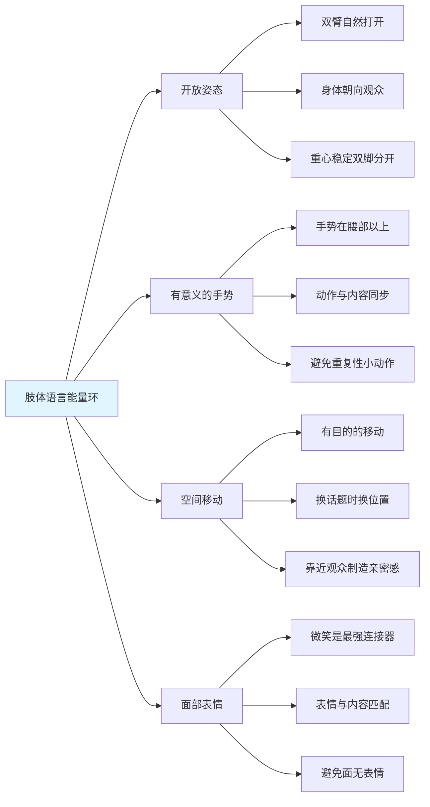
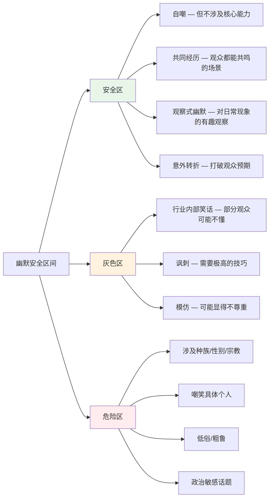
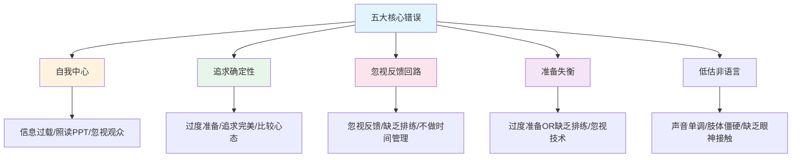

# 第十九章 公开演讲进阶 — 常见误区

公开演讲是一门实践性极强的技能，而误区是阻碍成长的最大障碍。许多演讲者不是缺乏天赋，而是在错误的方向上反复练习，把错误打磨成了习惯。本节系统梳理公开演讲中最常见的17个误区，按内容设计、表达方式、互动连接、准备排练、心态认知五个维度分类，逐一剖析其心理机制、典型表现和纠正路径。

### 📊 常见误区全景图

---

## 一、内容设计的误区

内容是演讲的根基。结构混乱、重点模糊的演讲，即使表演技巧再好，也不过是一场华丽的空洞。内容设计的误区往往源于一个根本性的认知偏差——**把"我想说什么"当作"观众需要听什么"**。

### 误区一：信息过载

**典型表现：**

- 20分钟的演讲试图覆盖20个要点，每个要点平均分配不到1分钟
- PPT每页密密麻麻排满文字，字号缩小到14号甚至12号
- 演讲结束时观众眼神涣散，提问环节无人举手
- 演讲者自己也记不清到底讲了几个重点

**心理机制：**

认知心理学家George Miller在1956年提出的"神奇数字7±2"揭示了人类工作记忆的容量限制——大多数人一次只能处理5-9个信息单元。但这个数字在信息已经被高度组织的前提下才能达到。在演讲这种被动接收场景中，观众的有效记忆容量通常只有3-4个核心要点。

更关键的是**认知负荷理论（Cognitive Load Theory）**：当信息输入速度超过大脑处理速度时，多余的信息不仅不会被记住，还会干扰已有信息的编码，导致整体记忆效果下降。这就是为什么信息越多，观众记住的反而越少。

**真实案例：**

某科技公司的产品发布会上，产品经理在30分钟内展示了47张PPT，涵盖了产品架构、技术细节、市场分析、竞品对比、用户反馈、路线图等全部内容。会后调查显示，85%的观众只记住了"这是一款新产品"，连产品名称都没记住。而同一产品的第二次发布会，将内容精简为3个核心卖点，用15分钟讲述一个用户故事，会后产品试用申请量增长了340%。

**纠正方法：**

1. **倒推法确定内容量**：先确定演讲时间和观众能记住的最大要点数（通常3个），再围绕这些要点组织内容
2. **"电梯测试"**：如果你不能在30秒内说清楚演讲的核心内容，说明你还没想清楚
3. **分层传递法**：将信息分为"必须知道""应该知道""可以知道"三层，只在演讲中传递第一层，第二三层放在补充材料中
4. **一页一个要点**：每张PPT只承载一个核心信息，用视觉元素而非文字来呈现
5. **口诀化记忆**：把核心内容压缩成一句容易记住的口诀，如"一个中心、两个基本点、三个关键步骤"

**检查标准：**

| 演讲时长 | 建议核心要点数 | 每个要点建议时长 | 辅助案例/数据数 |
|---------|-------------|---------------|--------------|
| 5分钟 | 1个 | 5分钟 | 1-2个 |
| 15分钟 | 2-3个 | 4-5分钟 | 2-3个/点 |
| 30分钟 | 3-4个 | 6-8分钟 | 3-4个/点 |
| 60分钟 | 4-5个 | 10-12分钟 | 3-5个/点 |

---

### 误区二：缺乏结构

**典型表现：**

- 演讲像意识流，想到哪说到哪
- 观众在中途才意识到"原来他在讲这个"
- 不同观点之间缺乏过渡，跳跃感强
- 结尾草草收场，没有总结或升华

**心理机制：**

人脑是"模式识别机器"——我们天然地寻找信息中的结构和模式。当信息缺乏结构时，大脑需要额外消耗认知资源来自行组织信息，这会导致两个后果：认知负荷增加（记不住）和焦虑感上升（不确定接下来会讲什么）。

心理学中的**"首因效应"和"近因效应"**也说明了结构的重要性：观众最容易记住开头和结尾的内容，中间部分的记忆效果最差。好的结构能创造多个"开头"和"结尾"，增加观众的记忆锚点。

**经典结构框架：**

| 结构类型 | 适用场景 | 框架 | 示例 |
|---------|---------|------|------|
| 问题-方案-收益 | 产品发布、方案汇报 | 痛点→解决方案→价值 | "用户面临X问题→我们的方案是Y→这将带来Z收益" |
| 时间线 | 项目汇报、个人故事 | 过去→现在→未来 | "曾经→现在→愿景" |
| 金字塔 | 信息传递、培训 | 结论→论据→细节 | "核心观点→3个支撑论据→每个论据的案例" |
| SCQA | 商业演讲、案例分析 | 情境→冲突→问题→答案 | "背景是A→出现了B矛盾→那么如何解决？→答案是C" |
| Monroe五步 | 说服性演讲 | 注意→需要→满足→可视化→行动 | "请注意→你有X需要→Y可以满足→想象一下→现在就行动" |

**纠正方法：**

1. **先画结构图，再写内容**：用思维导图或大纲工具先搭建骨架
2. **路标语言**：在每个部分开头和结尾使用明确的过渡语——"以上是问题分析，接下来我们看解决方案"
3. **预览法**：在演讲开头告诉观众整体结构——"今天我会从三个维度来分析这个问题"
4. **回顾法**：在每个大部分结束后，用一句话总结，然后引出下一部分
5. **首尾呼应**：结尾重新提及开头的故事或问题，形成闭环

---

### 误区三：过度依赖数据

**典型表现：**

- 一页PPT上出现5个以上的统计数字
- 数据来源标注混乱，观众无法追踪
- 用数据堆砌代替逻辑论证
- "根据某某报告，X指标增长了Y%"这类句式反复出现
- 观众对数据已经麻木，无法区分哪些数据重要

**心理机制：**

数据本身不具有说服力——**数据+语境+情感**才构成说服力。神经科学研究表明，纯粹的数据激活的是大脑的语言处理区域（布罗卡区），而故事和情感激活的是更深层的边缘系统。当两者结合时，信息的记忆留存率可以提高22倍（Stanford University研究）。

这就是为什么"每60秒就有一名儿童死于疟疾"远比"全球每年有52.7万人死于疟疾"更有冲击力——前者将抽象数字转化为具体场景，激活了观众的情感反应。

**数据使用的"三层模型"：**

**纠正方法：**

1. **数据故事化**：每个数据背后都要有一个故事。不要说"用户满意度提升了30%"，要说"上个月我们收到一封来自张阿姨的感谢信，她是我们第1000位满意的用户。像她这样的用户，今年增加了30%"
2. **数据对比化**：孤立的数字没有意义，对比才能凸显价值。"我们的响应时间是200毫秒"——快还是慢？"比行业平均快了5倍"——现在有感觉了
3. **数据视觉化**：用图表、图标、对比图来呈现数据，而非纯文字
4. **控制数量**：整场演讲中，需要观众记住的数据不超过3个
5. **提供信源**：每个关键数据标注来源，增强可信度

---

### 误区四：缺乏核心信息

**典型表现：**

- 演讲结束后，观众说不清楚"他到底想说什么"
- 演讲覆盖了很多话题，但彼此之间缺乏关联
- 演讲者自己也难以用一句话概括演讲主旨
- 观众提问时，演讲者的回答与前面的内容自相矛盾

**心理机制：**

TED演讲教练Chris Anderson将核心信息称为"Throughline（贯穿线）"——它是整场演讲的灵魂，所有内容都围绕它展开。没有贯穿线的演讲就像没有脊椎的身体，看似丰富，实则松散无力。

从传播学角度看，**信息的传播效率与信息的聚焦程度成正比**。一个聚焦的信息比十个分散的信息更容易被记住和传播。这也是为什么病毒式传播的短视频通常只有一个核心点。

**核心信息的提炼公式：**

我希望观众在走出会场后，用一句话告诉朋友：
"今天那个演讲说的是 ________"

**纠正方法：**

1. **"一句话测试"**：用不超过15个字概括你的核心信息。如果说不出来，说明你还没找到
2. **逆向设计法**：从你希望观众采取的行动倒推——要让他们行动，需要他们相信什么？要让他们相信，需要哪些关键论据？
3. **"删除测试"**：对演讲中的每个部分问"如果删掉这部分，核心信息是否受损？"如果答案是否，就应该删除
4. **"所以呢？"测试**：对每个论点追问"所以呢？这与核心信息有什么关系？"
5. **三次重复法则**：在演讲的开头、中间和结尾各明确重申一次核心信息

---

## 二、表达方式的误区

好的内容需要好的表达来传递。表达方式的误区往往导致"好内容被烂表演毁掉"的悲剧。表达不仅仅是"说话"，它是声音、肢体、视觉辅助和空间运用的综合系统。

### 误区五：照读PPT

**典型表现：**

- 演讲者背对观众，逐字逐句朗读PPT上的文字
- PPT设计成Word文档的样子，密密麻麻全是字
- 演讲者成为PPT的"人肉朗读器"
- 观众的阅读速度通常快于演讲者的朗读速度，导致注意力分裂

**心理机制：**

**冗余效应（Redundancy Effect）**——当观众同时接收相同内容的视觉和听觉信息时（即看到文字+听到朗读），认知处理效率反而下降。因为大脑需要同时处理两条通道的相同信息，造成认知资源的浪费。

更严重的是**注意力分割问题**：观众的阅读速度通常比演讲者的语速快2-3倍。当PPT上有大量文字时，观众要么在阅读（忽略演讲者），要么在听讲（忽略PPT），无法两全。

**PPT设计的"10-20-30法则"（Guy Kawasaki）：**

| 参数 | 规则 | 说明 |
|------|------|------|
| 页数 | 不超过10页 | 强迫你精简内容 |
| 时长 | 不超过20分钟 | 留出互动和讨论时间 |
| 字号 | 不小于30号 | 强迫你减少每页文字量 |

**纠正方法：**

1. **PPT是给观众看的，不是给演讲者用的**：PPT上放的是视觉提示，不是演讲稿
2. **关键词+图片**：每页PPT只放关键词（不超过6个）或一张高质量图片
3. **分离演讲稿和PPT**：用提词器、卡片或iPad查看自己的演讲要点
4. **"黑屏法"**：在讲重要故事或关键观点时，按B键黑屏，让所有注意力回到你身上
5. **渐进揭示**：使用动画逐步展示要点，避免观众提前阅读

---

### 误区六：单调的声音

**典型表现：**

- 从头到尾同一个语速、同一个音量、同一个语调
- 像念课文一样平铺直叙
- 关键信息和过渡信息用同样的语气表达
- 观众开始看手机、打瞌睡

**心理机制：**

人脑对**变化**敏感，对**恒定**适应。这是进化赋予我们的生存本能——恒定的声音意味着"没有新情况"，大脑会将其归类为背景噪音并降低注意力。这就是为什么你听不到空调的嗡嗡声（适应），但突然的敲门声会立刻引起注意（变化）。

从神经科学角度看，**声音的变化激活大脑的"新奇检测系统"（Novelty Detection System）**，释放多巴胺，维持注意力。TED演讲者平均在每分钟内变化语速3-4次、音量2-3次。

**声音的四个维度及其作用：**

| 维度 | 变化方式 | 心理效果 | 使用场景 |
|------|---------|---------|---------|
| **音量** | 提高/降低 | 传递情感强度、制造紧迫感 | 重要观点提高音量；亲密分享降低音量 |
| **语速** | 加快/放慢 | 制造节奏感、突出重点 | 兴奋描述加快；关键结论放慢 |
| **语调** | 上扬/下沉 | 传递态度、制造悬念 | 提问时上扬；结论时下沉 |
| **停顿** | 插入静默 | 制造悬念、强调重点 | 关键观点前后停顿2-3秒 |

**纠正方法：**

1. **标记演讲稿**：用不同颜色标注需要变化音量、语速、语调的位置
2. **"过山车"练习**：有意识地在演讲中制造声音的起伏，就像过山车一样有高潮有低谷
3. **停顿的力量**：在关键观点前后停顿2-3秒。停顿不是"忘词了"，而是"让观众消化"
4. **录音回听**：每周录一次自己的演讲练习，回听时标注"这里太单调了"
5. **模仿学习**：选择3位你欣赏的演讲者，逐句模仿他们的声音变化模式

---

### 误区七：不自然的肢体语言

**典型表现：**

- 双手无处安放：插兜、背后、交叉胸前、不停搓手
- 像钟摆一样左右摇晃，或者原地踏步
- 使用生硬的、刻意排练的手势，看起来像机器人
- 站姿僵硬，身体重心完全不动

**心理机制：**

Albert Mehrabian的沟通模型（虽然常被误读）揭示了一个重要事实：**当语言信息与非语言信息矛盾时，人们更倾向于相信非语言信息**。也就是说，如果你说"我很自信"但身体在发抖，观众会相信你的身体而不是你的话。

肢体语言的"自然感"来自于**动作与内容的同步性**。优秀的演讲者的手势不是装饰，而是内容的视觉化表达——说到"增长"时手掌向上，说到"两个选择"时伸出两根手指，说到"核心"时双手向中心收拢。

**肢体语言的"能量环"模型：**

**纠正方法：**

1. **"脱稿手势"练习**：不看稿子，只用肢体语言表达一个概念（如"增长""危机""突破"），录像回看
2. **三点站立法**：双脚与肩同宽，重心均匀分布，像三脚架一样稳定
3. **手势归位法**：每个手势做完后，双手自然回到身体两侧或身前，避免手足无措
4. **录像分析法**：至少录3次完整的演讲练习，每次标注不自然的动作
5. **"能量校准"**：在镜子前练习，确保手势的幅度与场地大小匹配——大场地需要大手势，小场地需要小手势

---

### 误区八：缺乏眼神接触

**典型表现：**

- 全程盯着PPT或笔记本电脑屏幕
- 只看前排中间的几个观众
- 眼神快速扫过全场，像扫描仪一样没有焦点
- 紧张时盯着天花板或地板

**心理机制：**

眼神接触是人类建立信任和连接的最原始方式之一。神经科学研究发现，眼神接触会激活大脑中的**"社会脑网络"（Social Brain Network）**，释放催产素（信任激素），增强双方的情感连接。

缺乏眼神接触的演讲者，在观众眼中等同于"这个人不想跟我交流"或"这个人对自己说的没有信心"。即使内容再好，缺乏眼神接触也会严重削弱说服力。

**眼神接触的"三角分区法"：**

将观众席分为左、中、右三个区域，像灯塔一样轮流与每个区域的观众进行3-5秒的眼神接触。具体操作：

1. **左区3-5秒** → 选择一位观众，看着他讲完一个完整的句子
2. **中区3-5秒** → 转移到中间区域，选择另一位观众
3. **右区3-5秒** → 再转移到右边
4. **循环往复** → 整个演讲过程中持续循环

**纠正方法：**

1. **"空椅子"练习**：在练习时摆放几把空椅子，假装它们是真实的观众，练习与每把椅子进行眼神接触
2. **"3秒规则"**：与每位观众保持至少3秒的眼神接触（大约一个完整句子的长度）
3. **"微笑三角"**：看向观众时保持微笑，眼神在三角区域内自然移动
4. **提前到场**：在观众入场时就开始与他们进行眼神接触和微笑，建立初步连接
5. **近视观众的解决方案**：如果视力不好，提前佩戴隐形眼镜，或选择在PPT上放大提示文字

---

## 三、互动与连接的误区

演讲不是独白，而是对话。即使观众没有开口说话，他们的注意力、表情和身体语言都在"回应"你。忽视这种隐性互动的演讲者，等于放弃了演讲中最强大的连接工具。

### 误区九：忽视观众反应

**典型表现：**

- 观众已经开始走神，演讲者浑然不觉
- 观众表情困惑，但演讲者继续按计划推进
- 没有任何互动环节，全程单向输出
- 不根据现场氛围调整内容或节奏

**心理机制：**

有效沟通的本质是**"共同注意力"（Joint Attention）**——演讲者和观众同时关注同一事物。当观众的注意力流失时，共同注意力就断裂了。此时继续推进内容，就像对着空房间演讲。

**"读场"能力**是区分优秀演讲者和普通演讲者的关键技能。它指的是实时感知观众状态并做出调整的能力。Tony Robbins每场演讲都有一个"读场团队"，通过观察观众的肢体语言和表情来实时调整演讲节奏。

**观众状态的信号解读：**

| 观众信号 | 可能含义 | 应对策略 |
|---------|---------|---------|
| 身体前倾、点头 | 感兴趣、认同 | 加强这个方向的内容 |
| 看手机、交头接耳 | 走神、不感兴趣 | 插入互动或切换话题 |
| 皱眉、摇头 | 困惑或不同意 | 暂停，询问是否有疑问 |
| 靠后仰、交叉双臂 | 防御、不信任 | 用故事或数据重建信任 |
| 微笑、大笑 | 享受、共鸣 | 保持当前节奏 |
| 频繁看表 | 时间焦虑 | 加速或暗示即将结束 |

**纠正方法：**

1. **每5-7分钟设置一个"互动点"**：提问、举手投票、简短讨论
2. **学会"暂停"**：当发现观众注意力下降时，停下来问"到这里有问题吗？"
3. **"温度检查"**：在演讲中段问"大家跟得上吗？需要我放慢速度吗？"
4. **准备"降档"内容**：如果观众明显疲惫，准备一些轻松的故事或互动来重新激活注意力
5. **练习"分心注意"**：在日常对话中练习同时关注对方的表情和话语

---

### 误区十：不当的幽默

**典型表现：**

- 使用涉及性别、种族、宗教、身体特征的"笑话"
- 讲了一个笑话后全场沉默，演讲者自己尴尬地笑
- 幽默与演讲主题完全无关，像硬塞进去的
- 过度使用自嘲，显得不自信

**心理机制：**

幽默的本质是**"预期违背"（Incongruity Theory）**——大脑构建了一个预期，然后被出乎意料的转折打破，这种认知上的"小惊喜"引发愉悦感。但如果违背的方向不对（冒犯、低俗、突兀），就不会产生愉悦感，反而产生不适。

自嘲式幽默之所以有效，是因为它展现了**脆弱性（Vulnerability）**——心理学研究表明，适度展现脆弱性可以增强他人对你的信任和好感。但过度自嘲会适得其反，让人质疑你的能力。

**幽默的安全区间：**

**纠正方法：**

1. **"三次测试"**：一个笑话至少在3个不同场合、3个不同人群中测试过，确认有效再用
2. **幽默服务于内容**：每个幽默都应该是为了说明一个观点，而不是为了搞笑
3. **"安全网"准备**：如果笑话没响，准备好自然的过渡——"好吧，这个笑话只有我自己觉得好笑。说正经的……"
4. **观察式幽默最安全**：对现场环境、共同经历的幽默观察，风险最低
5. **不确定就不用**：宁可不幽默，也不要冒犯

---

### 误区十一：忽视问答环节

**典型表现：**

- 问答环节临时抱佛脚，完全没有准备
- 回答冗长啰嗦，5分钟才能回答一个问题
- 遇到刁钻问题时慌张、防御或回避
- 问答环节结束后草草收场，没有做任何总结

**心理机制：**

观众对演讲者的整体印象，**很大程度上取决于最后的印象**（近因效应）。如果问答环节表现糟糕，即使前面的演讲再精彩，整体评价也会被拉低。

更深层的问题是：**问答环节是演讲者真实水平的"照妖镜"**。演讲稿可以反复打磨，但问答是即时反应，最能暴露演讲者的真实知识深度和应变能力。

**问答环节的"PREP"框架：**

| 步骤 | 内容 | 示例 |
|------|------|------|
| **P**oint（观点） | 直接回答问题 | "我认为AI不会完全取代程序员" |
| **R**eason（原因） | 解释为什么 | "因为编程的核心是问题分解和抽象思维" |
| **E**xample（例子） | 用具体案例支撑 | "比如在我们的项目中……" |
| **P**oint（重申） | 回到核心观点 | "所以AI更可能是程序员的工具而非替代者" |

**纠正方法：**

1. **"问题风暴"**：提前预测20-30个可能的问题，准备简洁的回答
2. **"桥接法"**：当遇到不想回答的问题时，用"这是一个好问题，但更重要的是……"来转移到自己的核心信息
3. **"坦诚法"**：遇到确实不知道的问题，坦诚说"这个问题我现在没有准确的答案，我会在X时间内跟进回复你"
4. **控制时间**：每个回答控制在60-90秒内，避免长篇大论
5. **收尾总结**：问答结束后，用2-3句话重新强调核心信息——"感谢大家的问题。回到今天最核心的观点……"

---

### 误区十二：单向输出，缺乏双向沟通

**典型表现：**

- 演讲者从头讲到尾，中间没有任何停顿或互动
- 不给观众思考的时间，信息密度极高
- 观众被动接收，没有参与感
- 演讲结束后没有任何行动号召

**心理机制：**

学习科学中的**"生成效应"（Generation Effect）**表明：当学习者主动参与信息处理（如回答问题、做选择、进行联想）时，记忆效果显著优于被动接收。单纯听讲的信息留存率约为5%-10%，而参与讨论的留存率可达50%-75%。

此外，**"宜家效应"（IKEA Effect）**在演讲中也适用——当观众参与了观点的"构建"过程（而不是被告知结论），他们会更认同这个观点。

**互动设计的节奏图：**

时间轴: |----5min----|----5min----|----5min----|----5min----|
内容:    开场+观点1    故事+互动     观点2+案例    总结+行动号召
互动:     提问         举手投票       小组讨论       承诺卡
能量:     ↑高          ↓中           ↑高            ↑↑最高

**纠正方法：**

1. **在演讲中嵌入2-3个互动点**：可以是提问、投票、小练习或讨论
2. **"思考一下"暂停**：在重要观点后说"给大家10秒钟想一下这个问题"
3. **"转身讨论"**：让观众与邻座用1分钟讨论一个问题，然后请人分享
4. **行动号召（Call to Action）**：演讲结束时，明确告诉观众"接下来你可以做的一件事"
5. **"填空法"**：在演讲中留出关键词的空白，让观众来填——"我们刚才讲的核心原则是____"

---

## 四、准备与排练的误区

准备和排练是演讲成功的基础保障。这个维度的误区在于两个极端——要么过度准备导致僵化，要么准备不足导致失控。

### 误区十三：过度准备

**典型表现：**

- 写了逐字稿，逐字逐句地背诵
- 排练了20遍以上，演讲听起来像录音机播放
- 对每一个可能的小细节都做了过度规划
- 一旦忘词就彻底卡壳，因为没有"备选路径"
- 演讲缺乏灵活性，无法根据现场情况调整

**心理机制：**

过度准备的根本问题是**"记忆依赖"**——当演讲者将安全感建立在逐字记忆上时，一旦某个环节出错（忘词、被打断、设备故障），整个系统就会崩溃。这是因为过度准备建立的是**线性记忆路径**，而非**网状知识结构**。

对比之下，基于理解和内化的演讲建立的是**"节点网络"**——即使某个节点出了问题，你可以从任何一个节点重新出发。这就是为什么真正的大师可以"即兴"演讲——不是因为他们没有准备，而是因为他们的准备已经内化为直觉。

**"准备光谱"模型：**

完全即兴 ←————————————→ 过度背诵
   ↑                         ↑
  风险高                   风险高
  灵活性强                 灵活性差

         ↑ 最佳区间 ↑
      基于大纲的半即兴
      核心句固定，其余灵活

**纠正方法：**

1. **大纲法替代逐字稿**：只写下关键要点和过渡句，其余用自己的话表达
2. **"三版本"策略**：对同一个观点准备简短版、标准版和详细版，根据时间灵活选择
3. **"恢复点"设计**：在演讲中设置3-4个"恢复点"，即使忘词也可以从这些点重新开始
4. **练习即兴发挥**：在排练时故意打乱顺序，练习从任意一点开始讲
5. **"80%准备法"**：准备到80%就停，留20%的空间给现场发挥

---

### 误区十四：缺乏排练

**典型表现：**

- "我内容很熟了，不需要排练"的心态
- 第一次完整讲是在真实演讲现场
- 时间控制完全失控，要么严重超时要么提前结束
- 演讲过程中频繁出现"嗯""啊""这个"等口头禅
- PPT翻页与演讲内容不同步

**心理机制：**

"熟悉内容"和"能流畅表达"是两件完全不同的事。**程序性记忆（Procedural Memory）**需要通过重复练习才能形成——就像骑自行车，你"知道"怎么骑和你"能"骑是两回事。演讲中的语速控制、停顿时机、PPT配合、走位移动，都需要通过排练转化为程序性记忆。

研究表明，**至少3次完整排练**才能让演讲者从"内容记忆"阶段进入"表演记忆"阶段。第一次排练关注内容准确性，第二次排练关注时间控制，第三次排练关注表达流畅度。

**排练的"四轮法"：**

| 轮次 | 关注重点 | 环境要求 | 回放分析 |
|------|---------|---------|---------|
| 第1轮 | 内容完整性和准确性 | 独自一人 | 核对内容是否遗漏 |
| 第2轮 | 时间控制和节奏 | 独自一人 | 标记超时/过快的部分 |
| 第3轮 | 表达和肢体语言 | 录像 | 分析声音、手势、表情 |
| 第4轮 | 模拟真实环境 | 找1-3个听众 | 收集反馈并微调 |

**纠正方法：**

1. **至少排练3次完整版本**：每次关注不同的维度
2. **录像回看**：第3次排练一定要录像，回看时用"观众视角"评估
3. **模拟真实环境**：最后一次排练在类似的环境中进行，穿着正式的演讲服装
4. **计时器**：每次排练都用计时器，确保在规定时间内完成
5. **"最差情况"排练**：故意练习忘词、设备故障、观众提问等突发情况的应对

---

### 误区十五：忽视技术准备

**典型表现：**

- 演讲开始时发现PPT版本不对、字体丢失、视频无法播放
- 不会使用翻页笔或麦克风
- 没有测试过场地的投影设备和音响系统
- 没有任何备份方案

**心理机制：**

技术故障造成的不仅是时间浪费，更是**心理资源的巨大消耗**。当演讲者在开场时遇到技术问题，其焦虑水平会急剧上升，而焦虑会占用工作记忆的容量——这意味着留给演讲内容的认知资源减少了。

更严重的是，**首因效应**会将技术故障与演讲者的整体印象绑定。如果开场的5分钟都在处理技术问题，观众对整场演讲的评价都会被拉低。

**技术准备清单：**

| 类别 | 检查项目 | 备份方案 |
|------|---------|---------|
| **文件** | PPT版本、字体、视频、动画 | U盘+云端+邮件自送 |
| **设备** | 翻页笔电池、麦克风、笔记本电量 | 带备用翻页笔、充电线 |
| **场地** | 投影接口、音响效果、灯光 | 提前30分钟到场测试 |
| **网络** | WiFi密码、离线版本 | 确保所有内容可离线展示 |
| **应急** | 不用PPT的版本 | 准备纯口头演讲版本 |

**纠正方法：**

1. **提前到场**：至少提前30分钟到达场地，测试所有设备
2. **"三备份"原则**：文件至少有三个副本——U盘、云端、邮件
3. **"离线版本"**：所有内容都要能在没有网络的情况下展示
4. **"应急版本"**：准备一个不需要任何设备的纯口头演讲版本
5. **"故障预演"**：在排练时故意模拟技术故障，练习如何优雅地应对

---

### 误区十六：不做时间管理

**典型表现：**

- 演讲严重超时，最后草草收场
- 前半部分讲得太慢，后半部分疯狂赶进度
- 没有为互动和问答预留时间
- 在某个细节上过度展开，导致整体失衡

**心理机制：**

演讲者对时间的感知与观众截然不同。演讲者因为深度投入内容，往往感觉"才讲了一会儿"，而观众因为被动接收，感觉"已经很久了"。这种**时间感知差异**是超时的根本原因。

研究表明，观众的注意力曲线呈**"倒U型"**：前5分钟注意力上升，5-15分钟达到峰值，15分钟后开始下降。如果演讲超过20分钟且没有任何互动，注意力会急剧下降。

**时间分配模板：**

30分钟演讲的时间分配：
├── 开场（3分钟）：10% — 钩子+自我介绍+预览
├── 第一个要点（7分钟）：23% — 理论+案例
├── 互动/过渡（2分钟）：7% — 提问或小练习
├── 第二个要点（7分钟）：23% — 理论+案例
├── 互动/过渡（2分钟）：7% — 提问或小练习
├── 第三个要点（5分钟）：17% — 理论+案例
├── 总结+行动号召（2分钟）：7% — 重申核心+下一步
└── 问答（2分钟）：7% — 预留缓冲

**纠正方法：**

1. **排练时严格计时**：记录每个部分的实际用时，标注超时的部分
2. **"切割法"**：将演讲时间分为若干块，每块有明确的时间限制
3. **"缓冲时间"**：总时长的10%作为缓冲，应对突发情况
4. **"倒计时提醒"**：在PPT备注中标注每个节点的目标时间，或让助手用纸牌提醒
5. **"可删减内容"**：标记哪些内容是"必须讲"的，哪些是"可以省略"的

---

## 五、心态与认知的误区

心态决定了你能走多远。技术可以学，内容可以练，但如果心态出了问题，一切努力都会事倍功半。心态误区往往是最隐蔽的，因为它们藏在潜意识里，影响着你的每一个决策。

### 误区十七：追求完美

**典型表现：**

- 为一个开场白反复修改20遍
- 演讲中说错一个字就陷入自责，影响后续表现
- 因为"还没准备好"而拒绝演讲机会
- 对自己的要求远高于观众对你的期望

**心理机制：**

完美主义的本质是**对失败的恐惧**。心理学家Carol Dweck将其与**"固定型心态"（Fixed Mindset）**联系在一起——认为能力是固定的，所以失败意味着"我不行"。与之相对的是**"成长型心态"（Growth Mindset）**——认为能力是可以通过努力提升的，所以失败是学习的机会。

TED演讲教练Chris Anderson说过一句深刻的话："**观众不是来审判你的，他们是来收获价值的。**"你的一个小口误，在观众眼中可能根本没有注意到；但你因为口误而慌张的表现，观众一定注意到了。

**"完美陷阱"的认知扭曲：**

| 认知扭曲 | 典型想法 | 理性回应 |
|---------|---------|---------|
| 全或无思维 | "这个演讲必须完美，否则就是失败" | "90%的好演讲比100%的完美演讲更有价值" |
| 灾难化 | "如果我忘词了，一切都完了" | "观众不会因为一个忘词否定整场演讲" |
| 读心术 | "观众一定觉得我很差" | "你不知道观众在想什么，别替他们下结论" |
| 过度概括 | "上次演讲忘词了，我不适合演讲" | "一次失误不代表整体能力" |

**纠正方法：**

1. **"够好就行"原则**：追求"足够好"而非"完美"。80分的演讲按时完成，远好于100分的演讲永远无法完成
2. **"失败预演"**：在排练时故意犯错，练习如何优雅地恢复
3. **"关注观众"转移法**：把注意力从"我表现得怎么样"转移到"观众收获了什么"
4. **"进步日记"**：每次演讲后记录3个做得好的地方和1个可以改进的地方
5. **"最小可演讲单元"**：如果还没准备好完整的演讲，先做一个5分钟的版本

---

## 六、误区的底层逻辑：五大核心错误

所有17个误区，归根结底是五个核心错误的变体。理解底层逻辑，才能从根本上避免误区。

1. **自我中心**：一切从"我想说什么"出发，而非"观众需要听什么"。这是最常见的误区根源。
2. **追求确定性**：想要控制每一个变量，结果反而失去了灵活性和真实感。
3. **忽视反馈回路**：只关注输出，不关注接收效果，导致问题累积。
4. **准备失衡**：在某些方面过度准备（如逐字稿），在其他方面准备不足（如技术、时间管理）。
5. **低估非语言**：认为"内容好就行"，忽略了声音、肢体、眼神等非语言因素的决定性作用。

---

## 七、误区自检清单

在准备和进行演讲时，使用以下清单进行系统性自检。建议在演讲前一周、前三天和当天各检查一次。

### 内容设计自检

- [ ] 能否用一句话（不超过15个字）概括核心信息？
- [ ] 核心要点是否不超过4个？
- [ ] 每个要点是否有至少一个具体案例或故事支撑？
- [ ] 数据是否已经故事化、对比化处理？
- [ ] 演讲是否有清晰的开头（钩子）、中间（论证）和结尾（行动号召）？
- [ ] 各部分之间的过渡是否自然流畅？
- [ ] 是否经过"删除测试"——有没有可以删掉而不影响核心信息的内容？

### 表达方式自检

- [ ] PPT每页文字是否不超过30个字？
- [ ] 声音的音量、语速、语调是否有意识地变化？
- [ ] 是否在关键观点前后安排了停顿？
- [ ] 肢体语言是否自然开放（没有交叉双臂、插兜等封闭姿态）？
- [ ] 手势是否与内容同步（而非机械地挥舞）？
- [ ] 眼神是否覆盖了左、中、右三个区域？
- [ ] 面部表情是否与内容匹配？

### 互动连接自检

- [ ] 是否设计了至少2个互动点？
- [ ] 是否准备了"读场"策略（如何感知和回应观众状态）？
- [ ] 幽默是否经过"三次测试"且不冒犯任何人？
- [ ] 问答环节是否预测了至少10个可能的问题？
- [ ] 是否有明确的行动号召（Call to Action）？

### 准备排练自检

- [ ] 是否进行了至少3次完整排练？
- [ ] 排练是否录像并回看分析？
- [ ] 时间是否控制在规定范围内（留10%缓冲）？
- [ ] 是否提前到场测试所有设备？
- [ ] 是否准备了文件备份（U盘+云端）？
- [ ] 是否有不用设备的"应急版本"？

### 心态认知自检

- [ ] 是否接受了"足够好"而非追求"完美"？
- [ ] 是否将关注点放在"观众收获"而非"自我表现"？
- [ ] 是否准备好了应对突发状况的"恢复策略"？

---

## 本节小结

本节系统梳理了公开演讲中的17个常见误区，涵盖内容设计、表达方式、互动连接、准备排练和心态认知五个维度，并揭示了所有误区背后的五大核心错误。

避免误区的根本方法是建立三个意识：

1. **观众意识**：演讲的一切都是为观众服务的。从观众的角度设计内容、选择表达方式、安排互动环节，而不是从自我表达的角度出发。
2. **系统意识**：演讲是一个由内容、表达、互动、准备、心态五个子系统构成的有机整体。任何一个子系统的短板都会拖累整体效果。
3. **迭代意识**：演讲能力的提升是一个持续迭代的过程。每次演讲后收集反馈、分析录像、总结经验，然后在下一次演讲中改进。

记住：**误区不可怕，可怕的是在误区里待太久**。识别误区是改变的第一步，而改变从下一次演讲开始。

在下一节中，我们将提供系统的练习方法，帮助你从新手逐步成长为优秀的演讲者。
