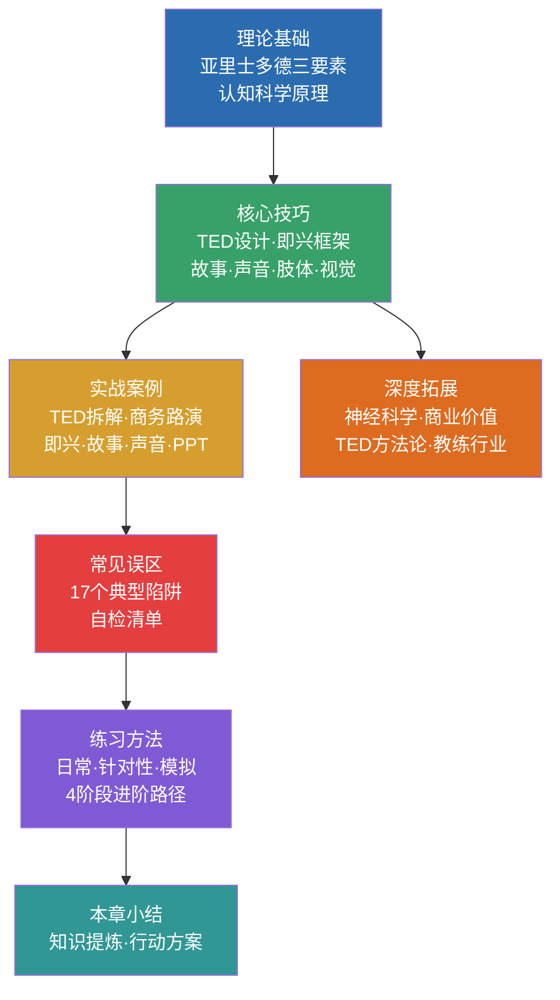
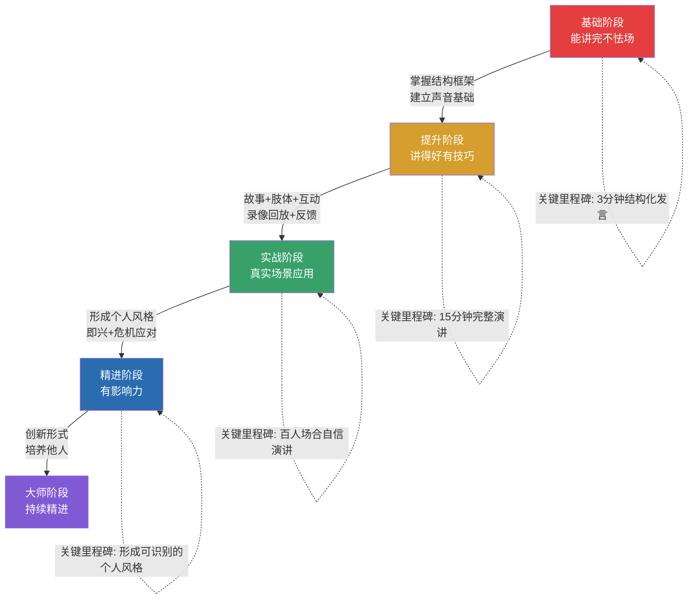

# 第十九章 公开演讲进阶 — 本章小结

本章从理论基础到实战应用，系统构建了公开演讲的完整知识体系。本节不是简单的内容复述，而是对全章核心洞见的深度提炼、跨模块的知识串联，以及面向不同阶段读者的可操作行动方案。读完本节后，你应该能够：清晰回忆本章的关键框架和方法论，识别自己当前的水平和下一步突破方向，并拥有一份可立即执行的训练计划。

***

## 一、知识架构总览

本章共涵盖七大模块，按照"认知→设计→表达→互动→纠偏→训练"的逻辑递进。下图展示了各模块之间的依赖关系和知识流向：

| 模块 | 核心命题 | 关键框架/工具 | 解决的核心问题 |
|------|----------|---------------|----------------|
| 理论基础 | 演讲为什么有效 | Ethos-Pathos-Logos、认知负荷理论、耶克斯-多德森定律 | 理解"为什么"，建立底层认知 |
| 核心技巧 | 如何设计和呈现一场好演讲 | PREP/STAR框架、情感弧线、黄金三角手势、4-7-8呼吸法 | 掌握"怎么做"，获得可执行方法 |
| 实战案例 | 大师和普通人差在哪里 | 案例拆解对比法（原始版 vs 改进版） | 建立直觉判断力，识别优劣 |
| 常见误区 | 什么会毁掉一场好演讲 | 17个误区清单、五维自检表 | 避免踩坑，少走弯路 |
| 练习方法 | 如何从新手到高手 | 30天训练计划、刻意练习四阶段 | 建立持续进步的训练系统 |
| 深度拓展 | 演讲的底层科学和商业价值 | 神经耦合理论、镜像神经元、记忆编码机制 | 深化理解，拓展视野 |

***

## 二、核心框架速查表

以下是本章涉及的所有关键框架和方法论的快速参考。建议收藏本表，在准备演讲时逐一对照。

### 2.1 演讲设计框架

| 框架名称 | 适用场景 | 结构 | 核心要点 |
|----------|----------|------|----------|
| **TED五阶段** | 正式演讲设计 | 新世界愿景 → 冲突/问题 → 解决方案 → 证据支持 → 行动呼吁 | 先让观众看到理想状态，再揭示现实差距，最后给出路径 |
| **PREP** | 即兴观点表达 | Point → Reason → Example → Point | 最快能在15秒内组织出一段结构完整的发言 |
| **STAR** | 经历/案例讲述 | Situation → Task → Action → Result | 面试、汇报、述职的万能框架 |
| **问题-解决方案** | 提案/建议 | 问题描述 → 影响分析 → 解决方案 → 实施步骤 → 预期效果 | 适合需要说服他人接受方案的场景 |
| **时间线** | 发展历程/愿景 | 过去 → 现在 → 未来 | 天然具有叙事张力，适合激励性演讲 |
| **三点框架** | 任意即兴场景 | 第一……第二……第三…… | 人脑天然偏好"三"这个数字，最简洁有效的万能框架 |
| **英雄之旅** | 长篇叙事/个人故事 | 12阶段：平凡世界→冒险召唤→拒绝→导师→门槛→考验→磨难→奖赏→归途→复活→归来 | 适合10分钟以上的深度故事讲述 |
| **三幕结构** | 通用叙事 | 设置（Setup）→ 对抗（Confrontation）→ 解决（Resolution） | 戏剧和电影的经典结构，也是演讲故事的骨架 |

### 2.2 声音与肢体控制参数

| 维度 | 正常范围 | 强调/变化范围 | 效果说明 |
|------|----------|---------------|----------|
| **语速** | 130-170字/分钟 | 强调时100-120字/分钟，激昂时180-200字/分钟 | 放慢=重要，加快=紧迫/兴奋 |
| **停顿** | 语法停顿1秒 | 强调停顿2-3秒，戏剧停顿4-5秒 | 停顿是最高级的声音技巧——它比任何词语都更有力 |
| **音量** | 让全场清晰听到 | 渐强（强调）、渐弱（亲密）、突变（抓注意力） | 音量变化是维持注意力的最直接手段 |
| **语调** | 自然起伏 | 升调（提问/列举）、降调（陈述/强调）、曲折调（复杂情感） | 单调语调是观众走神的头号原因 |
| **手势区域** | 黄金三角（腰-肩） | 向上=积极/增长，向下=严肃/沉稳，向外=开放/包容 | 手势在三角区外会显得散乱，低于腰部则不可见 |
| **眼神接触** | 3-5秒/人 | 灯塔法（轮流扫视）、个人对话法（关键信息时聚焦一人） | 快速扫视=紧张，长时间盯一人=压迫感 |

### 2.3 焦虑管理工具箱

| 工具 | 操作方法 | 生理机制 | 适用时机 |
|------|----------|----------|----------|
| **认知重构** | "我不是紧张，我是兴奋" | 焦虑与兴奋的生理反应相同（心跳加速、肾上腺素分泌），仅认知标签不同 | 演讲前5-10分钟 |
| **4-7-8呼吸法** | 吸气4秒→屏息7秒→呼气8秒，重复4-6次 | 激活副交感神经系统，降低心率和皮质醇水平 | 演讲前、候场时 |
| **渐进式肌肉放松** | 从脚趾到头部，依次收紧5秒→放松10秒 | 通过肌肉张力释放反向调节神经系统 | 演讲前15-30分钟 |
| **力量姿势** | 双手叉腰或双臂展开，保持2分钟 | 提升睾酮水平（自信）、降低皮质醇水平（压力） | 演讲前2-5分钟，私密空间 |
| **渐进暴露** | 5人小组→20人部门→100人公司→500人峰会 | 系统脱敏原理：逐步暴露于恐惧刺激，降低敏感度 | 长期训练策略 |
| **准备清单** | 内容→技术→场地→应急，四维准备 | 充分准备降低不确定性，而不确定性是焦虑的主要来源 | 演讲前1-7天 |

***

## 三、核心洞见提炼

以下是本章最重要的认知突破点，每一项都代表了从"知道"到"做到"的关键跨越。

### 3.1 内容为王，技巧为臣

> 演讲的本质不是表演，而是思想的传播。——克里斯·安德森

初级演讲者花80%的时间准备幻灯片和背稿，世界级演讲者花80%的时间思考思想本身。这个比例的逆转，是从"能讲"到"讲得好"的第一道分水岭。

**检验标准：** 如果你不能用一句话说清楚你的核心思想，说明你还没有准备好开始设计演讲。

### 3.2 停顿是最被低估的技巧

大多数演讲者害怕沉默，总觉得需要用声音填满每一秒。但研究表明，适时的停顿比任何修辞技巧都更有力。奥巴马的标志性停顿、乔布斯在产品揭晓前的刻意沉默，都是停顿艺术的典范。

**操作规则：**
- 短停顿（1秒）：用于语法断句和过渡
- 中停顿（2-3秒）：用于强调重要观点，给观众消化时间
- 长停顿（4-5秒）：用于制造戏剧效果，通常配合关键揭示

### 3.3 故事的神经科学优势

当信息以故事形式呈现时，其记忆保留率比纯数据呈现高出约22倍（斯坦福大学研究）。这不是修辞夸张，而是有坚实的神经科学基础：

- **催产素释放**：故事触发大脑释放催产素，增强信任和共情（保罗·扎克研究）
- **多脑区激活**：故事同时激活视觉、听觉、运动等多个脑区，提供更多的"记忆钩子"
- **镜像神经元**：观众的大脑会"模拟"故事中人物的经历，产生"感同身受"的体验
- **神经耦合**：有效的叙事使观众大脑活动与演讲者高度同步（尤里·哈森研究）

### 3.4 焦虑是盟友，不是敌人

耶克斯-多德森定律揭示了一个反直觉的真相：**适度焦虑提升表现**。肾上腺素水平的适度升高能够增强注意力、提高反应速度、增加能量。问题不在于焦虑本身，而在于你如何解读它。

**认知重构的核心操作：** 当你感到心跳加速、手心出汗时，不要对自己说"我好紧张"，而是说"我的身体正在为我提供额外的能量，准备全力以赴"。研究表明，这种简单的认知标签替换能够显著提升演讲表现。

### 3.5 观众是你最大的盟友

一个经常被忽视的事实是：**观众希望你成功**。他们坐在那里，是希望从你的演讲中获得价值，而不是等着看你出丑。当你理解了这一点，演讲就不再是"被评判"的恐惧场景，而是"为他人提供价值"的机会。

### 3.6 "展示而非叙述"（Show, Don't Tell）

这是从好演讲到伟大演讲的关键技巧差异：

| 叙述（弱） | 展示（强） |
|------------|------------|
| "我当时很紧张" | "我的手在发抖，手心全是汗，嘴唇干得说不出话来" |
| "这个产品很受欢迎" | "上线第一天，服务器崩溃了三次——因为用户太多了" |
| "我们的团队很努力" | "那周我们连续工作了48小时，终于在数据丢失前恢复了系统" |
| "这是一个巨大的市场" | "每天，全球有2.5亿封邮件被发送，但只有不到1%能改变一个人的想法" |

展示之所以更有力，是因为它激活了观众大脑的镜像神经元系统，让他们"看到"、"听到"、"感受到"你描述的场景，而不是仅仅"知道"一个结论。

***

## 四、常见误区速查

本章第五节详细分析了17个常见误区。以下是按严重程度排序的核心误区速查表，帮助你在准备演讲时快速自检：

| 误区 | 严重程度 | 核心问题 | 一句话纠正 |
|------|----------|----------|------------|
| 信息过载 | ★★★★★ | 观众什么也记不住 | 一个核心思想+三个支撑点，足够 |
| 没有核心信息 | ★★★★★ | 演讲没有灵魂 | 先用一句话概括核心思想，再开始设计 |
| 照读PPT | ★★★★☆ | 你成了PPT的旁白 | PPT是视觉辅助，你才是主角 |
| 单调声音 | ★★★★☆ | 催眠效果 | 每30秒至少一次声音变化（语速/音量/语调） |
| 缺乏排练 | ★★★★☆ | 临场发挥的代价 | 至少3次完整排练，至少1次录像回放 |
| 过度准备/背稿 | ★★★☆☆ | 机械不自然 | 准备大纲而非逐字稿，记住关键句而非每个词 |
| 追求完美 | ★★★☆☆ | 焦虑放大器 | 观众期待真实，不期待完美 |
| 忽视观众 | ★★★☆☆ | 单向输出=无效 | 每5-8分钟设计一个互动节点 |
| 不当幽默 | ★★☆☆☆ | 适得其反 | 不确定是否合适，就不要用 |
| 比较心态 | ★★☆☆☆ | 自信心杀手 | 关注自己的进步，而非与他人的差距 |

***

## 五、能力自评与突破路径

完成本章学习后，请用以下自评表重新评估自己的水平。对比学习前的自评，识别进步和仍需突破的维度。

### 5.1 七维能力自评

| 能力维度 | 入门级（1-2分） | 进阶级（3-5分） | 精通级（6-8分） | 自评分数 |
|----------|-----------------|-----------------|-----------------|----------|
| **演讲设计** | 模仿模板，缺乏原创 | 能独立设计结构，有方法论意识 | 灵活组合多种框架，根据情境定制 | ____ |
| **故事讲述** | 以事实罗列为主 | 偶尔使用故事，有基本技巧 | 能为任何主题设计有冲突、有转折、有高潮的故事 | ____ |
| **声音控制** | 语调平缓，紧张时加速 | 有意识控制语速和音量 | 自如运用四维变化（音量/语速/语调/停顿） | ____ |
| **肢体语言** | 站着不动或来回踱步 | 有基本的肢体意识 | 肢体语言自然有力，与内容高度同步 | ____ |
| **视觉辅助** | 文字堆满幻灯片 | 每页一个核心信息，有基本设计感 | 图文比7:3，视觉风格统一，服务于叙事 | ____ |
| **观众互动** | 全程单向输出 | 偶尔提问，有互动意识 | 灵活运用多种互动策略，掌控全场气氛 | ____ |
| **焦虑管理** | 严重影响表现 | 有焦虑但能应对 | 将焦虑转化为能量，视为正常反应 | ____ |

**总分解读：**
- **7-16分**：基础阶段——重点学习理论基础和核心技巧，从5人小组开始练习
- **17-35分**：提升阶段——针对薄弱维度重点突破，通过实战案例建立直觉
- **36-56分**：精进阶段——深度拓展理论，形成个人风格，探索演讲的商业价值

### 5.2 突破路径图

| 阶段 | 时间跨度 | 核心任务 | 每日投入 | 关键里程碑 |
|------|----------|----------|----------|------------|
| 基础阶段 | 第1-4周 | 掌握PREP/STAR框架，建立腹式呼吸和声音热身习惯，完成第一次录像回放 | 30分钟 | 能用PREP框架进行2分钟即兴演讲 |
| 提升阶段 | 第5-8周 | 故事讲述、肢体语言、视觉辅助设计，加入练习小组 | 45分钟 | 肢体语言自然配合内容，能设计简洁PPT |
| 实战阶段 | 第9-12周 | 真实场景演讲，主动收集反馈，处理问答环节 | 60分钟+实战 | 真实场景完成3次以上演讲，获得正面反馈 |
| 精进阶段 | 第13周起 | 探索个人风格，学习即兴和危机应对，加入Toastmasters | 持续 | 形成可识别的个人风格，获得行业认可 |

***

## 六、核心数据与研究支撑

本章引用了多项权威研究，以下是关键数据的汇总，可用于你自己的演讲中引用：

| 研究发现 | 来源 | 应用场景 |
|----------|------|----------|
| 约73%的成年人对公开演讲存在焦虑 | 美国心理学会（APA） | 说明演讲焦虑是普遍现象，不必羞耻 |
| 面对面沟通中55%信息来自肢体语言，38%来自语调，7%来自语言内容 | 梅拉比安（Mehrabian） | 强调非语言沟通的重要性（注意：此数据在不同情境下有变化） |
| 信息以故事形式呈现时记忆保留率高出约22倍 | 斯坦福大学研究 | 说明故事化表达的巨大优势 |
| 观众注意力在演讲开始后约10分钟显著下降 | 约翰·梅迪纳（John Medina） | 支撑18分钟法则，提醒在10分钟处设置互动或转折 |
| 故事触发催产素释放，增强信任和共情 | 保罗·扎克（Paul Zak） | 神经科学层面解释故事的力量 |
| 有效演讲使观众大脑活动与演讲者高度同步 | 尤里·哈森（Uri Hasson，普林斯顿） | 演讲者实际上在"引导观众的大脑状态" |
| 适度焦虑提升表现，过度焦虑降低表现 | 耶克斯-多德森定律 | 认知重构的科学基础 |
| 将焦虑重新定义为兴奋能显著提升表现 | 哈佛商学院研究 | 支撑"我不是紧张，我是兴奋"的认知策略 |
| CEO沟通能力与公司分析师评级正相关（约15%差距） | 哈佛商学院 | 演讲能力的商业价值 |
| 85%的企业高管认为公开演讲是职业成功的关键因素 | 针对500名高管的调查 | 演讲能力的职业价值 |

***

## 七、行动清单

### 立即行动（今天）

- [ ] 用一句话写下你最想分享的一个核心思想（不超过20个字）
- [ ] 进行5分钟的声音热身：腹式呼吸→唇颤音→绕口令→朗读
- [ ] 录制一段1分钟的自我介绍视频，不回放，先录下来

### 本周行动

- [ ] 完整观看一场TED演讲（推荐：肯·罗宾逊《学校扼杀创造力》或布琳·布朗《脆弱的力量》），用表格分析其结构（开场方式、核心思想、故事使用、情感弧线、互动设计）
- [ ] 准备一个3分钟的个人故事，包含至少两处感官描写和一处对话
- [ ] 用PREP框架对任意话题进行一次2分钟的即兴演讲，录音回放
- [ ] 回看本周录制的自我介绍视频，记录3个改进点

### 本月行动

- [ ] 完成至少3次录像回放练习，每次记录"做得好的3点+需改进的3点"
- [ ] 组建或加入一个3-5人的演讲练习小组，每周至少一次互练
- [ ] 设计一份5页以内的PPT，每页只传达一个核心信息，图文比7:3
- [ ] 在真实场景中完成至少1次演讲（可以是部门会议、小组分享、社区活动）
- [ ] 用本节的七维自评表给自己打分，记录基线数据

### 持续行动（长期习惯）

- [ ] **每日15分钟**：声音热身（5min）+ 故事素材记录（5min）+ 即兴演讲练习（5min）
- [ ] **每周1次**：完整演讲排练 + 录像回放 + 反馈收集
- [ ] **每月1次**：寻找真实演讲机会，完成一次"舒适区之外"的挑战
- [ ] **每季度1次**：重新用七维自评表评估，对比进步，调整训练重点

***

## 八、关键公式与记忆锚点

以下是帮助你快速回忆本章核心内容的记忆锚点：

**一个核心理念：** 演讲的本质是思想的传播，不是表演。

**两个关键转变：**
- 从"关注如何讲"转向"关注讲什么和为什么讲"
- 从"追求完美"转向"追求真实"

**三个说服要素（亚里士多德）：**
- Ethos（品格/可信度）—— 让观众信任你
- Pathos（情感/共鸣）—— 让观众感受你
- Logos（逻辑/理性）—— 让观众信服你

**四个声音维度：**
- 音量（Volume）—— 声音的强弱
- 语速（Pace）—— 说话的快慢
- 语调（Intonation）—— 声音的高低起伏
- 停顿（Pause）—— 最高级的声音技巧

**五种TED演讲风格：**
- 小型演讲（个人故事）、说明性演讲（概念解释）、展示性演讲（技术演示）、说服性演讲（观点改变）、沉浸式演讲（体验引导）

**六个故事元素：**
- 人物、冲突、场景、行动、结果、意义

**七个能力维度：**
- 演讲设计、故事讲述、声音控制、肢体语言、视觉辅助、观众互动、焦虑管理

**八个核心技巧模块：**
- TED设计、即兴框架、故事讲述、舞台表现、声音控制、视觉辅助、观众互动、焦虑管理

**十二个英雄之旅阶段：**
- 平凡世界→冒险召唤→拒绝召唤→遇见导师→跨越门槛→考验盟友敌人→接近最深洞穴→磨难→奖赏→归途→复活→带着万灵药归来

***

## 九、延伸阅读

### 本章关联章节

- **第二十章 商务沟通** — 将本章的演讲技巧应用到商务场景：会议发言、项目路演、客户演示、全员大会
- **第二十一章 咨询与辅导沟通** — 学习如何通过沟通帮助他人成长，将演讲能力转化为辅导和教练能力

### 推荐书籍

| 书名 | 作者 | 核心价值 |
|------|------|----------|
| 《TED演讲的秘密》 | 克里斯·安德森 | TED掌门人的演讲设计方法论 |
| 《演说之禅》 | 加尔滕·雷诺兹 | 视觉辅助设计的经典之作 |
| 《故事的力量》 | 安妮特·西蒙斯 | 故事讲述的系统方法论 |
| 《高效演讲》 | 彼得·迈尔斯 | 实用的演讲技巧指南 |
| 《思考，快与慢》 | 丹尼尔·卡尼曼 | 理解观众认知系统的底层原理 |
| 《千面英雄》 | 约瑟夫·坎贝尔 | 英雄之旅叙事原型的源头 |

### 推荐实践平台

- **TED官网**（ted.com）—— 观摩世界级演讲，学习设计和呈现技巧
- **Toastmasters** —— 全球最大的演讲练习组织，提供系统的训练和反馈机制
- **TEDx活动** —— 本地化的TED风格活动，提供真实的演讲舞台

***

## 最后的话

公开演讲是一项可以通过系统学习和刻意练习掌握的技能。这不是鸡汤——本章引用的每一项研究、每一个案例都在证明这一点。肯·罗宾逊的幽默不是天生的，布琳·布朗的真诚是经过设计的，乔布斯的舞台魅力背后是数百小时的排练。

你不需要成为另一个人。你需要的是：一个值得传播的思想，一套可执行的框架，以及持续练习的耐心。

从今天开始，写下你的核心思想，进行你的第一次声音热身，录下你的第一段演讲。30天后回看，你会惊讶于自己的进步。

**你的声音值得被听到，你的思想值得被传播。**

***

**本章完**
