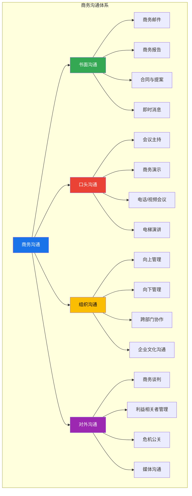
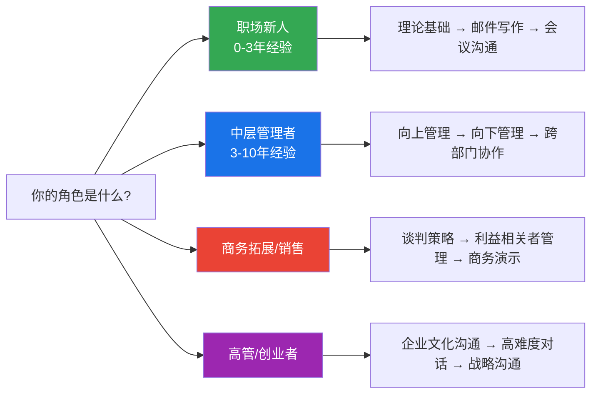
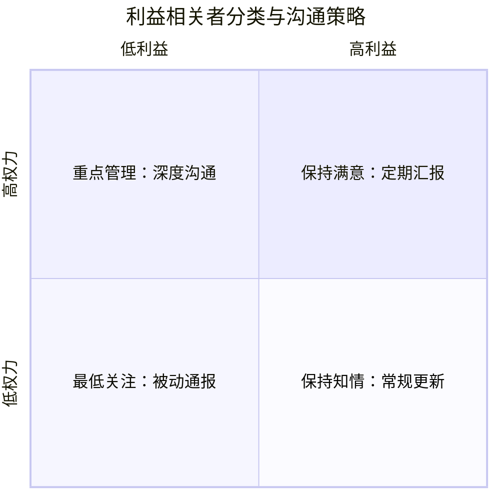

# 第二十章 商务沟通

## 一、为什么商务沟通值得单独成章

在所有沟通类型中，商务沟通的独特之处在于：**它直接绑定经济利益和组织效能**。一次糟糕的商务邮件可能导致合同丢失；一场失控的会议可能浪费整个团队一周的工作量；一次失败的向上汇报可能让你错失晋升机会。

根据 Holmes Report 的研究，**企业因沟通不畅造成的平均损失高达每人每年 12,506 美元**。而在项目管理领域，PMI（项目管理协会）的调查显示，**项目失败的原因中有 29% 归因于沟通不足**。这不是"软技能"——这是直接影响营收和组织存亡的硬能力。

商务沟通与日常沟通的核心区别：

| 维度 | 日常沟通 | 商务沟通 |
|------|----------|----------|
| **目的** | 情感交流、信息分享 | 达成商业目标、推动决策 |
| **约束** | 相对自由 | 受组织层级、合规、时效约束 |
| **责任** | 个人层面 | 组织层面，可能涉及法律责任 |
| **记录** | 通常无需留痕 | 往往需要书面记录和存档 |
| **受众** | 朋友、家人（同质化） | 上级、下属、客户、合作方（高度异质化） |
| **评估标准** | 是否愉快 | 是否有效推动业务进展 |

---

## 二、商务沟通知识全景图

本章聚焦上图中的核心模块。其中**商务邮件、商务谈判、跨部门协作、向上管理、向下管理、利益相关者管理、会议主持、商务演示、企业文化沟通**是本章重点覆盖的九大领域。

---

## 三、本章内容地图

### 第一节：章节概览（本节）

你正在阅读的内容。提供全章的知识框架、学习路径和自我评估工具，帮助你在正式学习前建立全局视野。

### 第二节：理论基础

理论不是空谈——它是你理解"为什么这样做有效"的基础。本节覆盖四大理论板块：

- **沟通模型理论**：从香农-韦弗线性模型到施拉姆互动模型，理解信息如何在商务场景中流动、失真、被重新诠释
- **组织沟通理论**：正式沟通网络（链式、轮式、全通道式）与非正式沟通网络（葡萄藤效应），理解信息在组织中如何真实流动
- **谈判理论**：哈佛谈判法、BATNA（最佳替代方案）、ZOPA（协议区间）——这些不是概念游戏，而是决定你谈判桌上生死存亡的分析工具
- **利益相关者理论**：权力-利益矩阵、影响力-关注矩阵——帮你精准分配沟通资源，不在不重要的人身上浪费精力，也不忽略关键决策者

### 第三节：核心技巧

从理论到实操的桥梁。本节提供九大场景的可执行技巧：

| 场景 | 核心技巧 | 关键工具/框架 |
|------|----------|---------------|
| **商务邮件** | 结构化写作、语气管理、跟进策略 | SCQA框架、BLUF原则 |
| **商务谈判** | 准备清单、让步策略、僵局突破 | BATNA分析、哈佛四原则 |
| **跨部门协作** | 利益对齐、非职权影响力、冲突化解 | RACI矩阵、利益地图 |
| **向上管理** | 汇报结构、预期管理、时机选择 | 金字塔原理、Minto框架 |
| **向下管理** | 授权、激励、反馈、绩效面谈 | SBI反馈模型、情境领导 |
| **利益相关者** | 识别、分类、沟通计划制定 | 权力-利益矩阵 |
| **会议主持** | 议程设计、时间控制、决策推进 | DACI决策框架 |
| **商务演示** | 结构设计、故事线、视觉呈现 | 金字塔原理、STAR法 |
| **企业文化沟通** | 文化诊断、变革沟通、价值观落地 | 文化网络模型 |

### 第四节：实战案例

理论和技巧要落地，必须经过真实场景的检验。本节提供覆盖以下场景的完整案例分析：

- 跨国商务谈判（文化差异 + 利益博弈）
- 产品危机公关沟通（速度 + 真诚 + 策略）
- 组织变革沟通（阻力管理 + 信息控制）
- 跨部门项目推进（利益冲突 + 信任建立）
- 向上争取资源（数据支撑 + 利益对齐）

每个案例都会用"背景→挑战→策略→执行→结果→复盘"的结构拆解，让你看到每一步决策背后的沟通逻辑。

### 第五节：常见误区

知道什么不能做，和知道什么该做同样重要。本节汇总商务沟通中最常见的 18 个认知误区和行为陷阱，包括：

- "邮件写得越长越专业" → 实际上是缺乏信息压缩能力
- "谈判就是讨价还价" → 实际上是利益创造和价值分配
- "向上管理就是拍马屁" → 实际上是降低信息不对称、提高协作效率
- "会议越多说明越重视" → 实际上是组织效能低下的症状
- "跨部门协调靠关系就行" → 实际上需要制度化的协作机制

### 第六节：练习方法

知道 ≠ 做到。本节提供 30 天、60 天、90 天三个层级的系统练习方案，涵盖：

- 邮件写作刻意练习（从模仿到创造）
- 谈判模拟训练（角色扮演 + 录像复盘）
- 会议主持实战（从小型会议到跨部门会议）
- 演示能力阶梯训练（从 5 人到 500 人）

### 第七节：本章小结

核心要点回顾 + 可直接使用的行动清单 + 推荐阅读书单。

### 第八节：深度拓展

为追求卓越的读者准备的进阶内容：跨文化商务沟通、数字化时代的沟通变革、AI 对商务沟通的影响、高难度对话框架。

---

## 四、学习前自我评估

在开始学习前，花 5 分钟完成以下自评，帮助你找到最需要投入精力的方向：

### 商务沟通能力自评表

对每个问题诚实打分（1=完全不行，5=非常擅长）：

**书面沟通能力：**
1. 我能在 15 分钟内写出一封结构清晰、语气得当的商务邮件 —— 得分：____
2. 我能根据不同受众调整邮件的正式程度和详细程度 —— 得分：____
3. 我的邮件很少需要二次解释或补充 —— 得分：____

**谈判与影响力：**
4. 我能在谈判前系统准备 BATNA 和目标区间 —— 得分：____
5. 我能在利益冲突中找到双赢方案 —— 得分：____
6. 我能在不依赖职权的情况下影响他人 —— 得分：____

**组织沟通能力：**
7. 我能高效向上汇报，让上级快速理解关键信息并做出决策 —— 得分：____
8. 我能清晰分配任务并跟踪执行，不需要反复催促 —— 得分：____
9. 我能跨越部门边界，推动跨团队协作 —— 得分：____

**会议与演示：**
10. 我主持的会议有明确议程、时间控制和决策输出 —— 得分：____
11. 我能进行 30 分以上、逻辑清晰、有说服力的商务演示 —— 得分：____
12. 我能在会议中引导讨论走向共识而非分裂 —— 得分：____

**评分解读：**

| 总分区间 | 水平评估 | 建议 |
|----------|----------|------|
| 12-24 分 | 入门阶段 | 从理论基础开始，打好底层框架 |
| 25-36 分 | 进阶阶段 | 重点突破短板领域，加强实战练习 |
| 37-48 分 | 高级阶段 | 深度拓展，关注跨文化和战略沟通 |

---

## 四、不同角色的学习路径

### 路径一：职场新人（0-3 年经验）

**你的核心痛点：** 不知道"规矩"——邮件怎么写才专业？会议上怎么发言才不尴尬？和上级汇报什么格式？

**推荐阅读顺序：**
1. 第二节 理论基础（跳过谈判理论，先看沟通模型和组织沟通）
2. 第三节 → 商务邮件写作 + 会议沟通 + 向上管理
3. 第五节 → 避免常见新手错误
4. 第六节 → 30 天练习计划

**预期收获：** 3 个月内建立专业的商务沟通习惯，邮件返工率降低 80%，会议参与感显著提升。

### 路径二：中层管理者（3-10 年经验）

**你的核心痛点：** 上下夹击——既要管理好团队，又要向上争取资源，还要协调其他部门。

**推荐阅读顺序：**
1. 第二节 → 重点看谈判理论和利益相关者理论
2. 第三节 → 向上管理 + 向下管理 + 跨部门协作 + 会议主持
3. 第四节 → 组织变革沟通案例
4. 第五节 → 管理者常见沟通误区
5. 第六节 → 60 天系统提升计划

**预期收获：** 团队沟通效率提升，跨部门项目推进阻力减少，向上汇报得到更多支持。

### 路径三：商务拓展/销售人员

**你的核心痛点：** 谈判桌上怎么不吃亏？客户关系怎么维护？大单怎么拿下？

**推荐阅读顺序：**
1. 第二节 → 谈判理论（BATNA、ZOPA、哈佛谈判法）
2. 第三节 → 商务谈判 + 利益相关者管理 + 商务演示
3. 第四节 → 跨国谈判案例 + 大客户沟通案例
4. 第六节 → 谈判模拟训练

**预期收获：** 谈判更有章法，客户关系管理更系统，商务演示转化率提升。

### 路径四：高管/创业者

**你的核心痛点：** 要在组织层面塑造沟通文化，要对外代表公司形象，要在高风险场景中做出沟通决策。

**推荐阅读顺序：**
1. 第二节 → 全部理论（尤其是利益相关者理论和组织沟通理论）
2. 第三节 → 企业文化沟通 + 高难度对话
3. 第四节 → 危机公关案例
4. 第八节 → 深度拓展（跨文化沟通、AI 与沟通变革）

**预期收获：** 建立组织级沟通体系，在危机中做出冷静、专业的沟通决策。

---

## 五、本章核心框架预览

学完本章，你将掌握以下五个可直接复用的框架：

### 框架 1：商务沟通准备清单（适用于所有场景）

□ 明确沟通目标：我希望这次沟通达成什么结果？
□ 分析受众：对方是谁？关心什么？决策风格是什么？
□ 选择渠道：面对面 / 视频 / 电话 / 邮件 / 即时消息？
□ 准备核心信息：如果只能说三点，是哪三点？
□ 预判反对意见：对方可能的顾虑和反对是什么？
□ 设计应对方案：针对每种反对意见准备回应
□ 确认行动项：沟通结束后，谁做什么，什么时候完成？

### 框架 2：邮件写作 SCQA 结构

| 要素 | 含义 | 示例 |
|------|------|------|
| **S**ituation（情景） | 背景说明 | "上季度我们的客户投诉率上升了15%" |
| **C**omplication（冲突） | 问题/矛盾 | "主要原因是售后响应时间过长" |
| **Q**uestion（问题） | 核心议题 | "如何将响应时间缩短到24小时以内？" |
| **A**nswer（答案） | 你的方案 | "建议增配2名售后专员并引入工单系统" |

### 框架 3：向上汇报金字塔结构

         ┌─────────────┐
         │   结论/建议   │  ← 先说结论
         └──────┬──────┘
        ┌───────┼───────┐
   ┌────┴────┐ ┌┴───────┐ ┌────┴────┐
   │ 论据 1  │ │ 论据 2  │ │ 论据 3  │  ← 三个支撑论据
   └─────────┘ └─────────┘ └─────────┘
        │           │           │
   ┌────┴────┐ ┌────┴────┐ ┌────┴────┐
   │ 数据/案例│ │ 数据/案例│ │ 数据/案例│  ← 用事实和数据支撑
   └─────────┘ └─────────┘ └─────────┘

### 框架 4：谈判 BATNA 分析模板

我的 BATNA（最佳替代方案）：_______________
对方的 BATNA（推测）：_______________
我的目标区间：理想目标 ___/ 可接受底线 ___
推测对方目标区间：理想目标 ___/ 可接受底线 ___
ZOPA（协议可能区间）：___ 到 ___
如果谈判破裂，我的退路是：_______________

### 框架 5：利益相关者沟通矩阵

- **高权力 + 高利益**（重点管理）：密切沟通，定期一对一，重大决策前必须咨询
- **高权力 + 低利益**（保持满意）：定期汇报进展，不制造意外
- **低权力 + 高利益**（保持知情）：定期通报，争取他们的支持
- **低权力 + 低利益**（最低关注）：按需沟通，不过度投入

---

## 六、本章关键词速查

| 关键词 | 含义 | 首次出现 |
|--------|------|----------|
| BATNA | Best Alternative To Negotiated Agreement，谈判破裂时的最佳替代方案 | 第二节 |
| ZOPA | Zone Of Possible Agreement，双方都能接受的协议区间 | 第二节 |
| SCQA | Situation-Complication-Question-Answer，结构化表达框架 | 第三节 |
| BLUF | Bottom Line Up Front，结论先行的邮件/汇报原则 | 第三节 |
| RACI | Responsible-Accountable-Consulted-Informed，跨部门职责分配矩阵 | 第三节 |
| SBI | Situation-Behavior-Impact，结构化反馈模型 | 第三节 |
| DACI | Driver-Approver-Contributor-Informed，会议决策框架 | 第三节 |
| Minto | 金字塔原理的提出者，结构化思维和表达的核心方法 | 第三节 |
| 利益相关者 | 任何受项目影响或能影响项目的人或组织 | 第二节 |
| 向上管理 | 主动管理与上级的关系、信息流和期望 | 第三节 |
| 非职权影响力 | 不依赖职位权力，通过专业能力、人际关系和说服力影响他人 | 第三节 |

---

## 七、阅读建议

**不要跳过理论基础。** 很多人急于学"技巧"，觉得理论是浪费时间。但没有理论支撑的技巧是脆弱的——你只会在固定场景下机械执行，一旦环境变化就束手无策。理论帮你建立"底层操作系统"，让你能在任何新场景中快速推导出正确的沟通策略。

**结合实际场景学习。** 每读完一个小节，问自己：这个知识点在我当前的工作中能用在哪里？然后在一周内至少尝试应用一次。知识只有在使用中才会真正内化。

**带着问题读。** 在开始阅读前，列出 3-5 个你在商务沟通中遇到的具体问题。在阅读过程中寻找答案。这种"问题驱动"的学习方式，效率远高于"从头到尾通读"。

**不要试图一次学完。** 本章内容丰富，建议分 4-7 天完成学习。每天聚焦 1-2 个小节，消化吸收后在实践中应用。

---

> "沟通中最重要的事情是听到对方没有说出来的话。"  
> —— 彼得·德鲁克（Peter Drucker）
