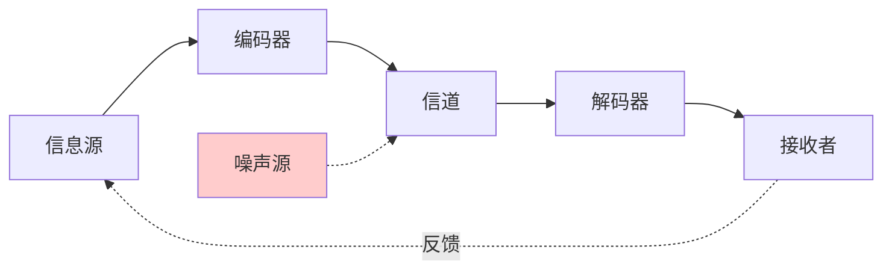
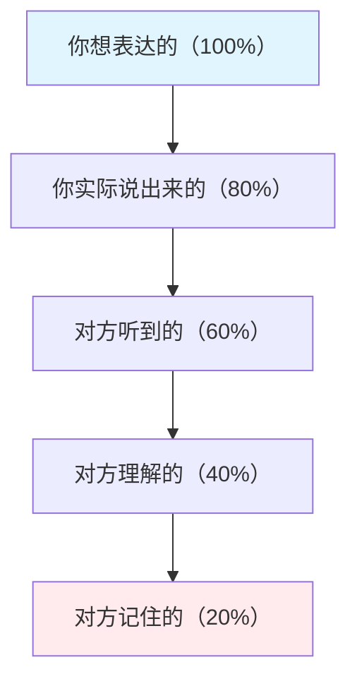
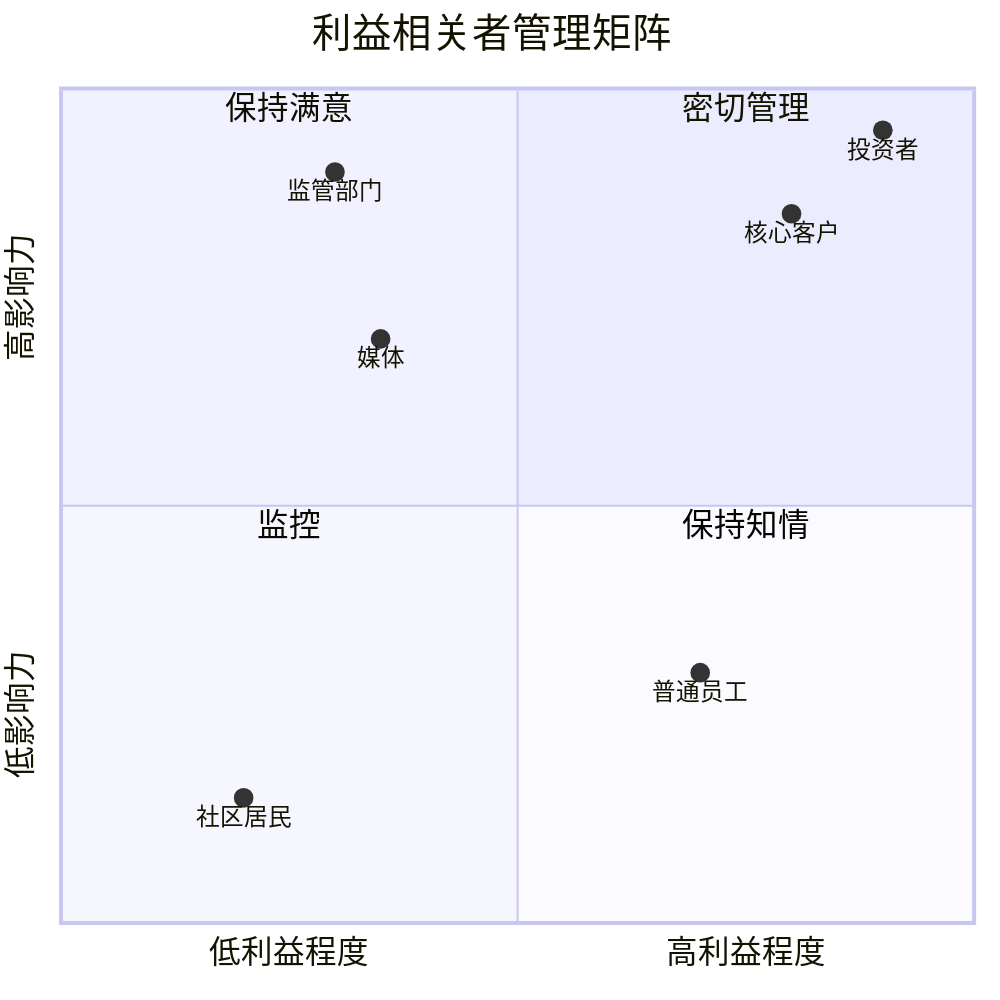
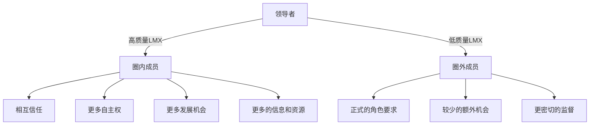
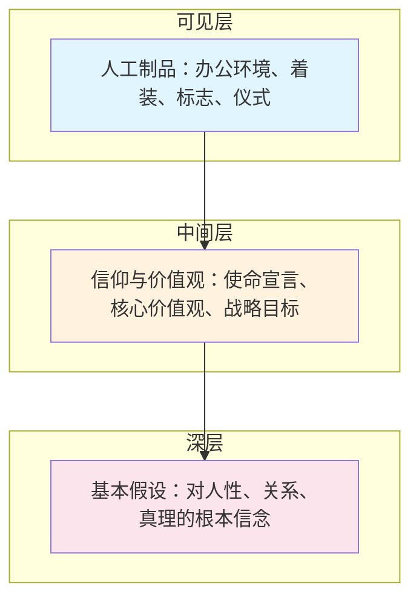

# 第二十章 商务沟通 — 理论基础

商务沟通不是"会说话就行"——它是一门建立在心理学、社会学、组织行为学和博弈论之上的系统学科。理解底层理论的价值在于：当你面对全新的沟通场景时，理论让你能够推导出有效的策略，而不是只能照搬经验。

本章梳理商务沟通的九大理论板块，从最基础的沟通模型出发，逐步深入谈判理论、组织协作、上下级管理、权力与影响、会议沟通、商务演示、企业文化与跨文化沟通，构建一个完整的知识框架。

## 一、沟通的基本模型

### 1. 香农-韦弗模型：理解信息传递的底层机制

1948年，克劳德·香农（Claude Shannon）在贝尔实验室发表论文《通信的数学理论》，原本是为了解决电话线路的信号传输问题，却意外成为人类理解"沟通"这件事的第一个科学模型。沃伦·韦弗（Warren Weaver）随后将其推广到一般沟通场景。

**模型结构：**

模型的五个核心要素及其在商务场景中的对应关系：

| 要素 | 定义 | 商务场景示例 |
|------|------|-------------|
| 信息源 | 产生信息的主体 | 你需要向客户传达价格调整方案 |
| 编码器 | 将意图转化为符号 | 你选择用邮件还是PPT，用数据还是故事 |
| 信道 | 信息传递的介质 | 邮件、微信、电话、面对面会议、视频 |
| 解码器 | 将符号还原为意义 | 客户如何理解你的措辞和语气 |
| 接收者 | 信息的目标对象 | 客户、上级、团队成员 |

**噪声的三种类型及应对：**

噪声是这个模型最有实践价值的概念。香农定义的"噪声"涵盖了一切干扰信息准确传递的因素：

- **物理噪声**：环境嘈杂、网络不稳定、打印模糊。应对：选择安静的会议室、使用高质量的通信工具、文件用PDF格式而非Word（避免格式错乱）。
- **心理噪声**：偏见、情绪波动、注意力分散、刻板印象。应对：在关键沟通前确认对方的状态，避免在对方情绪激动时传递坏消息，用数据而非情绪说话。
- **语义噪声**：专业术语、多义词、文化差异导致的理解偏差。应对：技术团队向业务部门汇报时，避免使用"幂等""解耦"等术语；跨文化沟通中避免使用俚语和双关语。

**这个模型的核心启示是**：沟通的责任在发送者，而非接收者。如果对方没有理解你的意思，问题出在你的编码或信道选择上，而不是"对方理解能力差"。

### 2. 交互式模型：沟通是双向博弈

香农模型的致命缺陷是把沟通当作单向传输。现实中，接收者同时也在发送信息——一个眼神、一句"嗯"、一封回复邮件都是反馈。

交互式模型（也称施拉姆模型）引入了三个关键概念：

- **反馈环路**：接收者的反应直接影响发送者下一步的行为。商务谈判中，对方皱眉的瞬间你就知道报价过高了，这就是反馈在实时修正你的沟通策略。
- **共享意义场**：双方的个人经验、知识背景和文化框架存在交集，只有在交集区域内，沟通才真正有效。一个程序员说"架构"和一个建筑设计师说"架构"，指向完全不同的概念。
- **情境语境**：同一句话在不同情境下含义截然不同。老板说"你最近表现不错"——如果是绩效评估前，可能暗示要给你加薪；如果是刚犯了错误之后，可能是在敲打你。

### 3. 组织沟通的四个象限

把组织沟通按"内部/外部"和"正式/非正式"两个维度交叉，形成四个象限，每个象限的规则和策略完全不同：

| | 正式渠道 | 非正式渠道 |
|---|---------|-----------|
| **内部** | 公司公告、会议纪要、正式报告、制度文件 | 茶水间闲聊、内部IM群、午餐交流 |
| **外部** | 新闻发布会、年度报告、合同协议、官方邮件 | 行业聚会、社交媒体互动、私下关系 |

**正式沟通的特点**：可追溯、有记录、决策效力强，但速度慢、灵活性差。
**非正式沟通的特点**：速度快、灵活性高、能传递情绪和态度，但容易失真、缺乏约束力。

**实践中的关键认知**：研究表明，组织中约70%的信息通过非正式渠道流动。管理者如果只依赖正式渠道，会严重低估组织的真实状态。但决策和承诺必须通过正式渠道确认——口头同意不算数，邮件确认才算数。

### 4. 沟通的"漏斗效应"

人类大脑处理信息的能力有限。沟通中存在一个残酷的现实：

这意味着，如果你只说一次，对方可能只记住了20%的内容。应对策略：
- **关键信息重复三次**：开场说一次，中间强调一次，结尾总结一次。
- **多通道传递**：口头说了之后，再用文字确认（邮件/消息）。
- **让对方复述**：不是问"明白了吗？"（对方一定会说"明白了"），而是说"你理解的方案是什么？我们对一下。"

***

## 二、商务谈判的理论基础

谈判是商务沟通中最具博弈性质的场景。理解底层理论，才能在复杂谈判中保持主动。

### 1. 哈佛谈判法：原则性谈判的四个基石

哈佛谈判法由罗杰·费舍尔（Roger Fisher）和威廉·尤里（William Ury）在1981年出版的《谈判力》（Getting to Yes）中提出，至今仍是全球商学院谈判课程的核心教材。该方法的核心理念是：**谈判不是战争，而是共同解决问题的过程。**

**原则一：把人和问题分开（Separate the People from the Problem）**

谈判中存在两类问题：实质问题（价格、条款、交付时间）和关系问题（信任、面子、情绪）。当这两者纠缠在一起时，谈判就会失控。

具体操作方法：
- **对人温和，对事强硬**。你可以说"这个价格方案无法满足我们的成本要求"，但不要说"你们的报价太离谱了"。前者是对事的评判，后者是对人的攻击。
- **主动倾听对方的情绪**。当对方表现出不满时，先回应情绪："我理解这个结果让你失望"，再讨论实质问题。
- **避免"归因偏差"**：自己的问题归因于环境（"我迟到是因为堵车"），对方的问题归因于人品（"他迟到是因为不尊重我们"）。意识到这个偏差，才能客观看待问题。
- **建立私人关系**。谈判前的寒暄不是浪费时间——共同吃一顿饭、聊聊共同兴趣，能显著降低后续谈判中的对抗性。

**原则二：关注利益，而非立场（Focus on Interests, Not Positions）**

立场是你声称要什么，利益是你为什么想要。一个经典的例子：

> 两个人争一个橙子。如果按立场分，只能一人一半。但如果探究利益——一个人要橙子皮做蛋糕，一个人要橙子汁喝——两个人都能得到全部想要的东西。

操作步骤：
1. **列出自己的利益清单**：不只是价格，还有时间、风险、声誉、关系、长期合作等维度。
2. **推测对方的利益**：通过提问而非猜测。"这个时间节点对你们为什么重要？""除了价格，还有哪些因素影响你的决策？"
3. **寻找利益交集**：双方的利益不总是对立的——买方要低价，卖方要利润，但双方可能都想要长期合作关系和低交易成本。

**原则三：创造双赢选项（Invent Options for Mutual Gain）**

在谈判桌上临时想方案是低效的。费舍尔建议在谈判前进行"头脑风暴会议"——把方案的发明和方案的评估分开。先列出所有可能的方案（不评判），然后再逐一评估可行性。

扩大蛋糕的常见策略：
- **扩大议题范围**：把价格谈判扩展为"价格+付款周期+独家代理权+培训支持"的综合协议。
- **引入新的利益维度**：如果你在价格上无法让步，可以在交付时间、售后服务、定制化等方面提供额外价值。
- **差异化方案设计**：给对方多个选择（A方案/B方案/C方案），而不是一个"要或不要"的最后通牒。

**原则四：坚持使用客观标准（Insist on Using Objective Criteria）**

当双方各执己见时，"谁的意志力更强"不应该是决定因素。费舍尔建议引入外部客观标准来化解分歧：

- **市场价格**：同类产品/服务的市场行情。
- **行业标准**：行业惯例、技术标准、质量认证。
- **法律和法规**：合同法、劳动法、反垄断法等。
- **专家意见**：第三方评估、审计报告、技术鉴定。
- **先例**：过去类似交易的条件。

使用客观标准的关键是**双方共同认可标准的选择**。在谈判开始时就约定"我们用什么标准来评判"，比在具体条款上争执要高效得多。

### 2. BATNA：你的谈判底牌

BATNA（Best Alternative to a Negotiated Agreement，谈判协议的最佳替代方案）是哈佛谈判法中最实用的概念。它回答一个核心问题：**如果你谈崩了，你能得到什么？**

**BATNA为什么是谈判中最重要的变量？**

因为它直接决定了你的"底线"——你不会接受比BATNA更差的协议。BATNA越强，你能承受"谈崩"的代价就越低，你的谈判力就越强。

**案例：供应商谈判**

假设你在和供应商A谈原材料采购：
- 供应商A的报价：每吨5000元
- 供应商B的报价：每吨5200元
- 供应商C的报价：每吨5500元

你的BATNA是"转向供应商B，以5200元采购"。因此，你的底线是5200元——如果供应商A不降到5200以下，你就会转向B。

反过来，如果你没有其他供应商可选，你的BATNA是"不采购导致停产"，你就几乎没有谈判筹码。

**强化BATNA的策略：**
1. **谈判前多方询价**：至少获取3个替代方案。
2. **让对方知道你有替代方案**（但不要透露细节）：一句"我们也在和其他几家接触"就足够了。
3. **不要暴露你的BATNA有多弱**：如果你的BATNA很差，装也要装出"我无所谓"的姿态。
4. **持续改善BATNA**：在谈判进行中，继续推进替代方案的谈判，让BATNA越来越强。

### 3. ZOPA：谈判能否达成的数学判据

ZOPA（Zone of Possible Agreement，可能达成协议的空间）是一个简单但有力的分析工具。

**数学定义：**

设买方愿意支付的最高价为 P_buyer，卖方愿意接受的最低价为 P_seller：
- 如果 P_buyer ≥ P_seller，则 ZOPA = [P_seller, P_buyer]，谈判有可能达成协议。
- 如果 P_buyer < P_seller，则不存在ZOPA，谈判必然破裂。

**案例：房产谈判**

| 参与方 | 心理价位 | 说明 |
|--------|---------|------|
| 买方最高出价 | 300万元 | 超过这个价格买不起 |
| 卖方最低要价 | 280万元 | 低于这个价格不愿意卖 |
| ZOPA | 280万~300万元 | 20万元的议价空间 |

在这个ZOPA中，最终成交价取决于双方的谈判技巧和BATNA。买方希望尽量接近280万，卖方希望尽量接近300万。

**ZOPA的实践陷阱：**
- **信息不对称**：你不知道对方的真实底线，对方也不知道你的。整个谈判过程本质上是在试探对方的底线。
- **虚假底线**：对方说"最低290万，一分都不能少"——这可能是真实底线，也可能是谈判策略。
- **多维ZOPA**：现实中谈判不是单一变量。价格、付款周期、交付时间、质量标准等共同构成一个多维空间，可以在某些维度让步以换取其他维度的利益。

### 4. 整合型谈判 vs 分配型谈判

谈判理论中有一个根本性的分类：

| 维度 | 分配型谈判（零和） | 整合型谈判（双赢） |
|------|-------------------|-------------------|
| 核心假设 | 蛋糕固定，你多我少 | 蛋糕可以做大 |
| 信息策略 | 隐藏信息，试探底线 | 适度共享信息，寻找共创空间 |
| 典型场景 | 一次性交易、地摊议价 | 长期合作关系、战略联盟 |
| 关系导向 | 对抗性 | 合作性 |
| 结果特征 | 一方赢一方输，或妥协 | 双方都获得超出预期的价值 |
| 信任水平 | 低 | 高 |

**现实中的谈判往往是混合型的**：大框架上是整合型（做大蛋糕），具体条款上是分配型（分配蛋糕）。高手能够在两者之间灵活切换——先用整合型思维找到创造性方案，再在分配环节坚守自己的利益底线。

### 5. 谈判中的锚定效应

行为经济学中的"锚定效应"在谈判中影响巨大：**先出价的一方会设定一个"锚点"，后续的讨论会围绕这个锚点展开。**

经典实验：特沃斯基和卡尼曼让受试者转一个随机数字轮盘（0~100），然后问"联合国中非洲国家的百分比是多少？"。转到10的人平均回答25%，转到65的人平均回答45%。一个完全不相关的随机数就能显著影响判断。

**在谈判中的应用：**
- **如果你对市场行情更了解，先出价**：设定一个对你有利的锚点。供应商报价后，你只能在对方的框架里讨价还价。
- **如果必须回应对方的极端报价**：不要在对方的锚点附近调整，而是直接忽略它，重新设定自己的锚点。"我理解你的报价，但根据市场行情，我们认为合理区间是X。"
- **开价要大胆但合理**：太离谱的锚点会失去可信度。研究表明，激进但有依据的开价比保守开价能获得更好的结果。

***

## 三、跨部门协作的理论

### 1. 组织边界理论：为什么跨部门这么难

劳伦斯和洛尔施（Lawrence & Lorsch）在1967年的经典研究中发现：**组织越是分化（专业化），整合（协作）就越困难。** 这是组织设计中最根本的张力。

企业中存在四种边界：

| 边界类型 | 描述 | 跨越障碍 | 典型场景 |
|----------|------|----------|---------|
| 垂直边界 | 不同层级之间的壁垒 | 信息过滤、权力差异 | 基层信息传不到高层 |
| 水平边界 | 不同部门之间的壁垒 | 目标冲突、术语差异 | 销售部和研发部互相甩锅 |
| 外部边界 | 组织与外部环境的壁垒 | 信息不对称、利益分歧 | 客户需求传不进组织 |
| 地理边界 | 不同区域之间的壁垒 | 时差、文化、信息延迟 | 总部与海外分部的协调 |

**跨部门协作失败的四大根源：**

**根源一：目标冲突。** 销售部的KPI是签单量，研发部的KPI是产品稳定性。销售为了签单承诺客户定制功能，研发为了稳定拒绝做定制。这不是人品问题，是激励机制设计的问题。

**根源二：信息孤岛。** 市场部掌握客户反馈数据，产品部掌握技术架构信息，两者不共享就无法做出好产品。解决方案是建立跨部门的信息共享机制——定期同步会、共享文档库、联合看板。

**根源三：语言差异。** 财务部说"ROI"，技术部说"SLA"，市场部说"CTR"。每个部门都有自己的"方言"。跨部门沟通时，需要一个"翻译"角色——通常是项目经理或产品经理。

**根源四：文化差异。** 销售部习惯了快速决策和灵活应变，研发部习惯了严谨论证和充分测试。这两种文化没有优劣之分，但在协作中经常产生摩擦。

### 2. 社会网络理论：非正式关系的力量

格兰诺维特（Mark Granovetter）在1973年的论文《弱连接的力量》中提出了一个反直觉的发现：**对你最有价值的信息，往往来自关系较远的人，而非亲密朋友。**

原因很简单：你的亲密朋友和你处于同一个社交圈子，接触到的信息和你的高度重叠。而关系较远的人处于不同的圈子，能带来全新的信息和机会。

**在跨部门协作中的应用：**

- **弱连接的价值**：主动认识其他部门的人——不是为了马上办事，而是建立一条信息通道。当你需要跨部门资源时，"认识人"比"走流程"快得多。
- **结构洞（Structural Hole）**：博特（Ronald Burt）发现，连接两个不相干群体的人拥有信息优势和控制优势。在企业中，能够连接技术和业务两个世界的人，往往是最有影响力的。
- **网络中心性**：在组织信息网络中处于中心位置的人，信息获取速度快、控制力强。但中心位置也有风险——信息过载和成为瓶颈。

**实操建议**：
1. 每周至少和一个其他部门的人吃一次午饭。
2. 主动参加跨部门的项目和活动。
3. 在内部社交平台上分享有价值的信息，建立"信息枢纽"的形象。

### 3. 利益相关者管理理论

爱德华·弗里曼（Edward Freeman）1984年提出的利益相关者理论，核心观点是：**企业的目标不是单一的"股东利益最大化"，而是平衡所有利益相关者的需求。**

**利益相关者矩阵：**

根据"影响力"和"利益程度"两个维度，将利益相关者分为四类：

**四类利益相关者的沟通策略：**

| 类型 | 特征 | 策略 | 沟通频率 |
|------|------|------|---------|
| 高影响力+高利益 | 核心决策者、主要客户、大股东 | 密切管理：深度参与、频繁沟通、共同决策 | 每周甚至每天 |
| 高影响力+低利益 | 监管部门、行业权威 | 保持满意：定期汇报、确保合规、不制造麻烦 | 每月 |
| 低影响力+高利益 | 普通员工、终端用户 | 保持知情：定期更新、征求意见、给予参与感 | 每两周 |
| 低影响力+低利益 | 社区居民、一般公众 | 监控：关注变化、有事再沟通 | 按需 |

***

## 四、向上管理的理论

向上管理不是"拍马屁"，而是**主动管理你和上级之间的关系、期望和信息流，以实现更好的工作成果。** 德鲁克说："你不必喜欢或崇拜你的上司，但你必须管理他。"

### 1. 领导-成员交换理论（LMX Theory）

LMX理论（Leader-Member Exchange Theory）由格雷恩（George Graen）和同事在20世纪70年代提出，核心发现是：**领导者不会对所有下属一视同仁，而是会与不同的下属建立不同质量的交换关系。**

**圈内成员（高LMX）** 获得更多信任、信息、资源和发展机会，同时也承担更多责任和期望。**圈外成员（低LMX）** 只获得正式角色要求的基本对待。

**如何建立高质量LMX关系：**

1. **展示能力**：用结果说话。完成任务的质量和速度是建立信任的基础。
2. **主动承担**：在领导需要帮助时主动站出来，而不是等着被指派。
3. **理解领导的压力**：你的上级也有上级。理解他的KPI、他的压力、他的目标，帮助他成功。
4. **保持透明**：坏消息要尽早传达。领导最怕的不是问题本身，而是"出了问题你瞒着我"。
5. **匹配沟通风格**：有的领导喜欢详细的书面报告，有的喜欢三句话口头汇报。观察并适应。

**LMX的陷阱**：过度依赖与领导的私人关系而忽视实际能力，是危险的。领导换了，关系就归零。能力才是硬通货。

### 2. 向上管理的四步法

**步骤一：理解上级**

这是所有向上管理的基础。你需要了解：
- **上级的目标和KPI**：他的绩效考核指标是什么？你做的事情如何支撑他的目标？
- **上级的工作风格**：是细节控还是宏观型？是快速决策型还是深思熟虑型？
- **上级的压力来源**：来自他的上级？来自其他部门？来自市场？
- **上级的决策偏好**：喜欢看数据还是听故事？喜欢一次性给结论还是逐步讨论？

**步骤二：调整自己**

根据对上级的理解，调整你的工作方式和沟通策略。这不是"失去自我"，而是"降低沟通成本"。如果上级是数据驱动型，你就用数据说话；如果上级是直觉型，你就用案例和故事说话。

**步骤三：建立信任**

信任 = 能力 × 可靠性 × 亲密度 ÷ 自我导向

- **能力**：你能把事情做好。
- **可靠性**：说到做到，按时交付。
- **亲密度**：关系的紧密程度。
- **自我导向**：你表现得越自私，别人对你的信任越低。

**步骤四：创造价值**

向上管理的终极目标是成为上级的"战略资产"：
- **主动提供解决方案**：不只是报告问题，而是带着方案来。"这里有个问题，我建议的解决方案是A或B，各自的利弊是……"
- **补位**：在上级不擅长的领域补位。如果上级不善于数据分析，你主动承担数据方面的工作。
- **管理期望**：不要过度承诺。承诺80分、交付90分，比承诺100分、交付90分好得多。

***

## 五、向下管理的理论

### 1. 情境领导理论

赫塞（Paul Hersey）和布兰查德（Ken Blanchard）提出的情境领导理论的核心观点是：**没有一种"最好的"领导风格，最有效的领导风格取决于下属的成熟度（能力+意愿）。**

| 领导风格 | 任务行为 | 关系行为 | 适用下属 | 具体表现 |
|----------|---------|---------|---------|---------|
| S1 指令型 | 高 | 低 | R1：能力低、意愿低 | 明确告诉做什么、怎么做、何时做 |
| S2 教练型 | 高 | 高 | R2：能力低、意愿高 | 解释决策原因，鼓励提问，手把手教 |
| S3 支持型 | 低 | 高 | R3：能力高、意愿低 | 倾听、鼓励、共同决策，激发信心 |
| S4 授权型 | 低 | 低 | R4：能力高、意愿高 | 授权自主决策，只关注结果 |

**常见错误**：管理者往往只用一种风格——要么事无巨细地管（对所有人用S1），要么完全放任（对所有人用S4）。正确的做法是对不同下属用不同风格，甚至对同一个下属在不同任务上用不同风格。

**案例**：一个新入职的程序员（R1），对项目不熟悉，你需要用S1风格，给出详细的任务分解和代码规范。三个月后他熟悉了技术栈但对业务还不了解（R2），你切换到S2，解释业务背景，鼓励他提问。半年后他能力很强但最近因为项目方向调整而士气低落（R3），你用S3，倾听他的顾虑，让他参与决策。一年后他成为团队骨干（R4），你用S4，给他大方向，让他自己决定实现方式。

### 2. 激励理论

**马斯洛需求层次理论的管理启示：**

马斯洛的五层需求在工作场景中的对应：

| 需求层次 | 工作场景对应 | 管理者行动 |
|----------|-------------|-----------|
| 生理需求 | 薪资能维持基本生活 | 确保薪酬不低于行业底线 |
| 安全需求 | 工作稳定性、福利保障 | 提供劳动合同、社保、稳定预期 |
| 社交需求 | 团队归属感、同事关系 | 组织团建、建立协作文化 |
| 尊重需求 | 被认可、有发言权 | 公开表扬、征求建议、给决策权 |
| 自我实现 | 职业成长、有挑战的工作 | 提供发展机会、轮岗、有挑战性的项目 |

**关键洞察**：低层次需求被满足后，就不再是有效的激励手段。给一个已经高薪的员工再加10%的薪水，远不如给他一个有挑战性的项目更能激发热情。

**赫茨伯格双因素理论的管理启示：**

赫茨伯格（Frederick Herzberg）将影响工作满意度的因素分为两类：

- **保健因素**（Hygiene Factors）：薪酬、工作环境、公司政策、管理方式、人际关系。这些因素**不满足会导致不满**，但**满足了也不会带来满意**——它们是"防不满"因素。
- **激励因素**（Motivators）：成就感、认可、工作本身的趣味性、责任感、成长和晋升机会。这些因素**能够带来真正的满意和动力**。

**实践要点**：
- 先确保保健因素不出问题（薪酬公平、环境舒适、政策合理），消除不满。
- 然后重点投资激励因素（给挑战、给认可、给成长），创造动力。
- 常见错误：管理者以为"加薪就能解决一切"。实际上，加薪只消除不满，不能创造热情。

### 3. 变革型领导理论

伯恩斯（James Burns）1978年提出、巴斯（Bernard Bass）随后发展的变革型领导理论，描述了四种能够激发下属超越自我利益的领导行为：

- **理想化影响（Idealized Influence）**：领导者以身作则，成为下属的榜样。不是说"你要加班"，而是自己带头冲锋。不是说"质量很重要"，而是自己对细节一丝不苟。
- **鼓舞性激励（Inspirational Motivation）**：传达令人信服的愿景。"我们要做行业的标杆"比"这个季度多卖10%的产品"更能激发热情。关键是要把愿景和日常工作连接起来。
- **智力激发（Intellectual Stimulation）**：鼓励下属挑战现状、创新思考。不是所有事都要按老方法做。领导者要创造一个"可以犯错"的环境，鼓励实验和创新。
- **个性化关怀（Individualized Consideration）**：关注每个下属的个人发展。不是"我对所有人一视同仁"，而是"我知道你的特长和短板，我会帮你发挥所长、弥补不足"。

**与情境领导的结合**：变革型领导在下属能力较高时效果最好——愿景和挑战能够激发高能力下属的潜力，但对低能力下属来说可能只是空话。

***

## 六、商务沟通中的权力与影响

### 1. 权力的五种来源

弗伦奇（John French）和雷文（Bertram Raven）在1959年提出的权力基础理论，至今仍是理解组织影响力的经典框架：

| 权力类型 | 来源 | 示例 | 特点 |
|----------|------|------|------|
| 合法权力 | 职位和角色 | 总监有权审批预算 | 离开职位就消失 |
| 奖赏权力 | 给予奖励的能力 | 经理决定奖金分配 | 受限于可分配资源 |
| 强制权力 | 惩罚的能力 | 经理可以处分下属 | 副作用大，容易破坏关系 |
| 专家权力 | 专业知识和技能 | 技术专家在架构评审中的发言权 | 最稳固，不依赖职位 |
| 参照权力 | 个人魅力和关系 | 受人尊敬的团队核心人物 | 最持久，最难建立 |

**关键洞察**：在现代组织中，专家权力和参照权力比职位权力更有效。一个没有管理职位的技术专家，可能比总监更有影响力。职场新人最容易犯的错误是过度依赖合法权力（"因为我是经理所以你得听我的"），而忽视了专家权力（用专业能力赢得认同）和参照权力（用人格魅力赢得追随）。

**权力的"信息权"维度**——第六种常被忽视的权力：控制信息的能力。谁掌握了关键信息，谁就有影响力。这解释了为什么"信息枢纽"在组织中如此重要。

### 2. 影响策略矩阵

向上和平行的影响策略与向下的策略有本质区别——你没有"合法权力"来强制对方，必须通过其他方式：

**向上影响策略（影响上级）：**

| 策略 | 操作方式 | 适用场景 |
|------|---------|---------|
| 理性说服 | 用数据和逻辑展示方案的可行性 | 上级是分析型人格 |
| 向上咨询 | 先征求上级的意见再行动 | 上级喜欢参与决策过程 |
| 联盟策略 | 找到支持你的同事一起提方案 | 重大提案需要多方支持 |
| 交换策略 | "我帮你解决X，你支持我做Y" | 你有上级需要的资源或能力 |
| 印象管理 | 持续展示能力和可靠性 | 建立长期信任关系 |

**向下影响策略（影响下属）：**

| 策略 | 操作方式 | 适用场景 |
|------|---------|---------|
| 参与决策 | 让下属参与方案讨论 | 需要下属的承诺和投入 |
| 理性说明 | 解释决策背后的逻辑和原因 | 下属是高能力型 |
| 鼓励激励 | 描绘愿景，激发内在动力 | 需要下属超越基本要求 |
| 指示命令 | 直接下达指令 | 紧急情况或下属能力不足 |

**平行影响策略（影响同级）：**

平行影响是最难的——没有权力优势，对方完全可以拒绝。有效的策略包括：
- **互惠**：先帮对方一个忙，再提出你的请求。
- **共同目标**：找到你们共同关心的KPI或项目。
- **专家影响力**：用你的专业能力证明你的方案更优。
- **关系投资**：平时建立好关系，关键时刻才能调动资源。

***

## 七、会议沟通的理论

### 1. 会议的经济学

哈佛商学院的研究表明，高管平均每周花23小时在会议上。按此计算，一个年薪100万的高管，每年有57.5万元的时间成本花在会议上。如果这些会议中有一半是低效的，那就是28.75万元的浪费。

**会议的四种功能：**

| 功能 | 目的 | 最佳形式 | 时间控制 |
|------|------|---------|---------|
| 信息分享 | 同步信息，确保一致 | 站会、邮件摘要 | 15-30分钟 |
| 问题解决 | 讨论具体问题的方案 | 工作坊、头脑风暴 | 60-90分钟 |
| 决策制定 | 评估选项，做出决定 | 决策会议 | 30-60分钟 |
| 团队建设 | 增强凝聚力和信任 | 团建活动、非正式交流 | 灵活 |

**判断一个会议是否应该召开的三个标准**：
1. 这个决策需要多个人的输入吗？（如果一个人能决定，不需要开会）
2. 这个议题需要同步讨论吗？（如果可以异步解决，用文档）
3. 开会的成本（人×时间）小于不开会的损失吗？（如果不开会也能推进，不开）

### 2. 群体决策的心理学陷阱

**群体思维（Groupthink）**

贾尼斯（Irving Janis）在分析猪湾事件等决策失败案例后提出了"群体思维"概念：**高度凝聚的群体为了维持和谐，会压制不同意见，导致决策质量下降。**

群体思维的八个症状：
1. **无懈可击的错觉**：过于乐观，忽视风险。
2. **集体合理化**：为已做出的决定找理由。
3. **坚信群体道德**：认为群体的决定必然是正确的。
4. **对外部群体的刻板印象**：认为对手愚蠢或软弱。
5. **对异议者的直接压力**：压制不同意见。
6. **自我审查**：成员主动隐藏疑虑。
7. **全体一致的错觉**：沉默被当作同意。
8. **自封的"思想警卫"**：某些成员主动阻止不利信息传入。

**打破群体思维的制度设计**：
- **指定"魔鬼代言人"**：每次会议指定一个人专门提出反对意见。这不是个人性格，而是制度角色。
- **匿名投票**：在关键决策上使用匿名方式收集意见，避免"看领导脸色表态"。
- **领导者最后发言**：如果你是会议主持者，先让所有人发表意见，最后再给出自己的看法。
- **引入外部视角**：邀请不直接参与项目的同事或外部专家参与讨论。
- **设立"红队"**：专门负责找出方案的漏洞和风险。

### 3. 会议引导技术

**罗伯特议事规则（Robert's Rules of Order）** 是最广泛使用的会议程序框架。其核心原则包括：
- 一次只讨论一个议题
- 每个参与者有平等的发言权
- 动议需要附议才能讨论
- 表决遵循明确的多数规则

**敏捷站会（Daily Standup）** 模式适合团队日常同步：
- 每天固定时间，不超过15分钟
- 每人回答三个问题：昨天做了什么？今天要做什么？遇到什么阻碍？
- 站着开（物理上限制时长）

***

## 八、商务演示的理论

### 1. 说服的双路径模型

佩蒂（Richard Petty）和卡乔波（John Cacioppo）的精加工可能性模型（Elaboration Likelihood Model, ELM）揭示了一个关键洞察：**人们被说服的方式有两种，取决于他们处理信息的动机和能力。**

| 路径 | 触发条件 | 处理方式 | 说服效果 | 商务应用 |
|------|---------|---------|---------|---------|
| 中心路径 | 高动机+高能力 | 深度思考论据质量 | 持久、抗反驳 | 董事会汇报、技术评审 |
| 外周路径 | 低动机或低能力 | 依赖线索和直觉 | 短暂、易改变 | 电梯演讲、广告、社交媒体 |

**中心路径的条件**：受众有动机（决策与他们密切相关）且有能力（有时间和专业知识来理解）。此时你需要：扎实的数据、严密的逻辑、完整的证据链。

**外周路径的条件**：受众缺乏动机（这件事与他们关系不大）或缺乏能力（太复杂或时间太紧）。此时你需要：权威背书（"行业专家推荐"）、社会认同（"80%的客户选择了这个方案"）、简洁有力的结论。

**实践中的策略**：对同一个演示，不同的受众可能走不同的路径。CEO可能走中心路径（深度分析），而忙碌的运营总监可能走外周路径（只看结论和行动建议）。因此，一份好的演示应该**兼顾两种路径**——核心结论简洁有力（外周路径），支撑论据详实充分（中心路径）。

### 2. 金字塔原理

芭芭拉·明托（Barbara Minto）在麦肯锡工作期间开发的金字塔原理，是商务写作和演示的黄金框架。它解决了两个问题：如何组织思想，以及如何让受众快速理解。

**四个核心原则：**

**原则一：结论先行。** 人类的短期记忆容量有限（米勒定律：7±2个信息单元）。先给结论，让受众知道你在说什么，再展开论述。

**原则二：以上统下。** 每一层的论点都是下一层论据的总结。如果某一层的论点无法由下一层的论据推导出来，要么论点有问题，要么论据不充分。

**原则三：归类分组。** 将同类信息归为一组。大脑处理分组信息比处理散乱信息高效得多。分组遵循MECE原则（Mutually Exclusive, Collectively Exhaustive）——相互独立，完全穷尽。

**原则四：逻辑递进。** 每一组内的论据按逻辑顺序排列：时间顺序（第一步、第二步、第三步）、结构顺序（按部门、按区域）、重要性顺序（最重要的先说）。

**金字塔结构示例：**

           核心结论
          /    |    \
     论点1   论点2   论点3
     /  \    /  \    /  \
   证据 证据 证据 证据 证据 证据

**实战模板：电梯演讲的金字塔**

核心结论：我们应该进入东南亚市场
├── 论点1：市场规模足够大
│   ├── 东南亚电商市场年增长30%
│   ├── 目标国人口3亿，中产阶级快速增长
│   └── 竞争对手尚未形成垄断
├── 论点2：我们有独特优势
│   ├── 产品已有英文和多语言版本
│   ├── 供应链距离优势
│   └── 核心团队有东南亚经验
└── 论点3：投资回报可观
    ├── 预计18个月收回投资
    ├── 首年目标GMV 5000万美元
    └── 可复制国内成功模式

### 3. 演示的"钩子-内容-行动"结构

所有成功的商务演示都遵循一个三段式结构：

1. **钩子（Hook）**：开场30秒抓住注意力。可以用一个惊人的数据、一个反直觉的结论、一个与受众相关的问题、或一个简短的故事。
2. **内容（Content）**：用金字塔结构展开论述。每10-15分钟插入一个互动点（提问、投票、案例讨论），保持受众的注意力。
3. **行动（Call to Action）**：结尾明确告知受众需要做什么。不要说"这就是我的报告"，而是说"我需要你们批准X预算，在Y日期之前"。

***

## 九、企业文化与跨文化沟通

### 1. 组织文化的三层次模型

沙因（Edgar Schein）将组织文化比喻为一座冰山——水面上可见的只是很小的一部分。

**层次一：人工制品（Artifacts）**——看得见但难以解读。
走进一个公司的办公室，你能看到开放还是封闭的工位、墙上挂什么标语、员工穿什么衣服、有没有乒乓球桌。这些都是文化的人工制品，但你很难仅凭这些判断文化的本质——谷歌有乒乓球桌不代表每个有乒乓球桌的公司都像谷歌。

**层次二：信仰与价值观（Espoused Values）**——公司说它信什么。
使命宣言、核心价值观、行为准则。问题是：很多公司的"说"和"做"是脱节的。一家宣称"客户第一"的公司，可能在实际操作中把利润放在第一位。判断一个公司的真正价值观，不要看它怎么说，要看它怎么做——尤其是面临利益冲突时怎么做。

**层次三：基本假设（Basic Assumptions）**——无意识的底层信念。
这是文化最深、最稳定的层次。比如：这家公司是相信"人之初性本善"还是"人之初性本懒"？是鼓励冒险还是规避风险？是推崇竞争还是合作？这些基本假设决定了员工的日常行为，但大多数人说不出来——就像鱼意识不到水的存在。

**对商务沟通的启示**：在不同文化的企业中，同一种沟通方式可能产生截然不同的效果。在扁平化文化中越级汇报可能被看作"有担当"，在等级文化中则被视为"不懂规矩"。进入新的组织或与新的合作伙伴打交道时，先观察和理解对方的文化层次，再调整你的沟通策略。

### 2. 跨文化沟通的理论框架

**霍夫斯泰德文化维度理论**

霍夫斯泰德（Geert Hofstede）通过对IBM全球员工的大规模调查，识别出影响工作价值观的六个文化维度。这些维度可以帮助你理解不同文化背景的人在沟通中的行为差异：

| 维度 | 低分文化特征 | 高分文化特征 | 商务沟通影响 |
|------|-------------|-------------|-------------|
| 权力距离 | 平等主义，可以挑战权威 | 等级分明，尊重权威 | 向上沟通方式完全不同 |
| 个人主义vs集体主义 | 个人成就优先 | 团队和谐优先 | 决策方式和责任归属 |
| 不确定性规避 | 容忍模糊，喜欢灵活 | 追求确定，喜欢规则 | 合同细节和执行方式 |
| 男性化vs女性化 | 竞争导向，追求卓越 | 合作导向，追求共识 | 谈判风格和冲突处理 |
| 长期导向vs短期导向 | 注重当下结果 | 注重长期发展 | 战略规划和关系投资 |
| 放纵vs克制 | 表达情感，享受生活 | 控制欲望，遵守规范 | 商务社交和关系建立 |

**案例：中美商务沟通的典型差异**

中国属于高权力距离、集体主义、长期导向的文化；美国属于低权力距离、个人主义、短期导向的文化。这些差异在实际沟通中的体现：

- **会议发言**：在中国的商务会议中，低级别成员通常等高级别成员先表态；在美国会议中，任何人都可以直接表达意见。
- **决策速度**：中国式决策倾向于先建立关系和共识，然后快速执行；美式决策倾向于快速做出决定，但执行中可能不断调整。
- **冲突处理**：中国人倾向于间接处理冲突（"面子"很重要），美国人倾向于直接面对冲突（"有问题就说出来"）。
- **"是"的含义**：在中国文化中，"是"可能只是表示"我在听"或"我理解了"，而非"我同意"。

**爱德华·霍尔的高语境与低语境理论：**

霍尔（Edward Hall）将文化分为高语境和低语境两种：

- **高语境文化**（中国、日本、阿拉伯）：信息大量依赖语境——说话者的身份、双方的关系、场合、语气、身体语言。话不需要说透，"你懂的"。
- **低语境文化**（美国、德国、北欧）：信息主要依赖语言本身——说什么就是什么，字面意思就是真实意思。

**实践影响**：高语境文化的人觉得低语境文化的人"太直接、不礼貌"；低语境文化的人觉得高语境文化的人"绕弯子、不清晰"。在跨文化商务沟通中，**对低语境文化的人，把话说明白；对高语境文化的人，学会"听话听音"。**

### 3. GLOBE研究项目

GLOBE（Global Leadership and Organizational Behavior Effectiveness）研究是霍夫斯泰德理论的扩展和更新，由豪斯（Robert House）领导，覆盖62个国家。GLOBE在霍夫斯泰德六个维度的基础上增加了三个维度：

- **性别平等主义**：社会在多大程度上最小化性别角色差异。
- **绩效导向**：社会在多大程度上奖励创新和绩效。
- **人文导向**：社会在多大程度上鼓励公平、利他和关怀。

GLOBE的一个重要贡献是区分了"文化实践"（as is）和"文化价值观"（should be）——一个社会实际上怎么做，和它认为应该怎么做，可能是不同的。这对跨文化沟通非常重要：了解一个文化的实际行为模式比了解它的价值观宣言更实用。

***

## 十、商务沟通中的认知偏差

理解心理学中的认知偏差，是提升商务沟通质量的关键。以下列出在商务场景中最常见、影响最大的认知偏差：

### 1. 决策偏差

| 偏差 | 定义 | 商务影响 | 应对策略 |
|------|------|---------|---------|
| 锚定效应 | 过度依赖第一个接收到的信息 | 谈判中的先出价优势 | 主动设定有利锚点 |
| 确认偏差 | 只关注支持自己观点的信息 | 项目评估过于乐观 | 指定魔鬼代言人 |
| 沉没成本谬误 | 因为已投入而不愿放弃 | 继续投资失败项目 | 关注未来收益而非过去投入 |
| 过度自信 | 高估自己的判断准确性 | 项目预算和时间估计偏低 | 参考基准率和历史数据 |
| 框架效应 | 信息的呈现方式影响决策 | "90%存活率"vs"10%死亡率" | 用多种框架审视同一信息 |

### 2. 社交偏差

| 偏差 | 定义 | 商务影响 | 应对策略 |
|------|------|---------|---------|
| 基本归因错误 | 把别人的问题归因于人品 | 跨部门协作中的指责文化 | 考虑情境因素 |
| 光环效应 | 一个优点影响整体评价 | 面试中以貌取人 | 使用结构化评估标准 |
| 近因偏差 | 过度看重最近发生的事 | 绩效评估受最近表现影响 | 记录全周期表现 |
| 自利偏差 | 成功归因自己，失败归因外部 | 团队协作中的功劳归属争议 | 建立客观的绩效评估机制 |

***

## 本节小结

商务沟通的理论基础构成了一个从微观到宏观的完整知识体系：

| 层级 | 理论板块 | 核心问题 |
|------|---------|---------|
| 基础层 | 沟通模型 | 信息如何从A到B？ |
| 博弈层 | 谈判理论 | 如何在利益冲突中达成共识？ |
| 组织层 | 跨部门协作 | 如何打破部门墙？ |
| 关系层 | 上下级管理 | 如何与不同权力关系的人有效沟通？ |
| 影响层 | 权力与影响 | 如何在没有权力的情况下影响他人？ |
| 效率层 | 会议沟通 | 如何让会议创造价值？ |
| 表达层 | 商务演示 | 如何用结构化的方式说服人？ |
| 文化层 | 企业文化与跨文化 | 如何在不同文化背景下沟通？ |
| 认知层 | 认知偏差 | 如何避免心理陷阱？ |

理解理论的价值不在于背诵概念，而在于**建立思维框架**——当你面对一个新的沟通场景时，能够快速识别问题的本质，并选择合适的策略。在下一节中，我们将把这些理论转化为具体的、可执行的沟通技巧。
