# 第二十章 商务沟通 — 核心技巧

商务沟通的核心技巧是将理论转化为行动的桥梁。上一节我们建立了沟通模型、谈判理论、组织行为学等理论基础，本节将聚焦于"怎么做"——从邮件写作到谈判桌，从跨部门协作到向上管理，从商务演示到冲突调解，每一个技巧都将提供完整的方法论、可执行的模板、真实的案例和常见的错误。

本节覆盖十二大核心场景，按照"日常沟通→书面表达→组织管理→对外协作→正式场合"的逻辑递进排列：

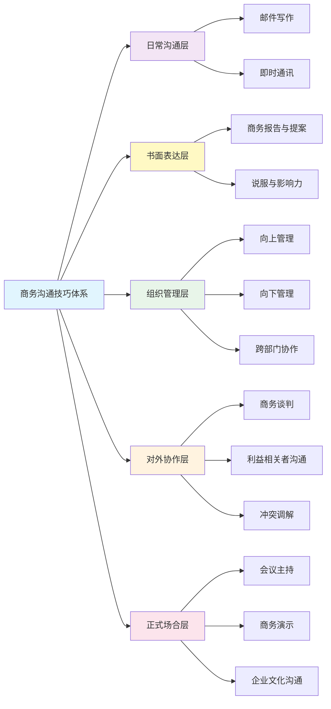

这五个层次的关系是递进且交织的：日常沟通能力是基础（邮件和即时通讯的写作水平直接影响你在同事和客户心中的专业形象），书面表达能力是杠杆（一份好的报告或提案能以一当十地传递信息，说服与影响力技巧则是沟通的"灵魂"），组织管理能力是核心（向上管理决定你的资源获取能力，向下管理决定你的团队产出，跨部门协作决定你的项目推进速度），对外协作能力是放大器（谈判、利益相关者管理和冲突调解决定了你能争取到多大的利益空间），正式场合能力是高光时刻（会议主持和商务演示决定了你的影响力辐射范围）。

在进入具体技巧之前，先建立一个关键认知：**不同场景需要不同的沟通渠道**。选错渠道是商务沟通中最常见却最容易被忽视的错误。

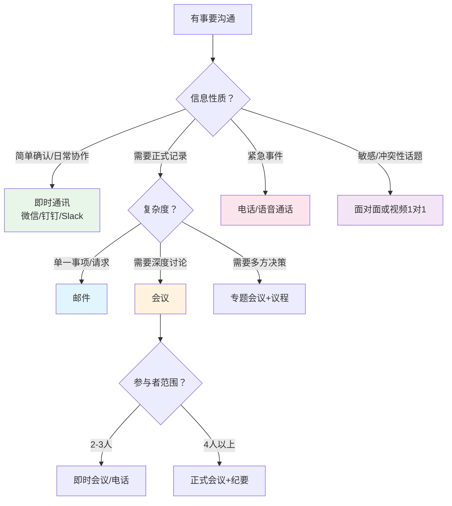

| 场景 | 推荐渠道 | 原因 |
|------|---------|------|
| 请同事确认一个小数据 | 即时通讯 | 即时通讯响应快，适合短平快的确认 |
| 向领导申请50万预算 | 邮件 + 附件方案 | 需要正式记录、完整论证、便于审批流转 |
| 项目延期需要讨论方案 | 会议 | 需要多方输入、实时讨论、当场决策 |
| 客户投诉产品质量 | 电话 → 面谈 | 先电话稳住情绪，再面谈解决实质问题 |
| 通知全员新制度 | 邮件 + 公告 | 需要全员可查证、可追溯 |
| 跨部门协调资源 | 邮件请求 → 会议对齐 | 先书面明确需求，再会议达成共识 |
| 给下属做绩效反馈 | 面对面1对1 | 敏感话题需要观察表情、传达温度 |
| 跟进一个未回复的请求 | 即时通讯（轻量）→ 邮件（正式） | 先轻量提醒，无果再升级到正式渠道 |
| 向客户提交项目提案 | 正式提案文档 + 演示会议 | 需要完整的论证体系和现场说服 |
| 处理部门间的利益冲突 | 面对面调解会 | 冲突需要面对面的共情和即时反馈 |

> **经验法则**：信息越重要、越复杂、越敏感，渠道就应该越"正式"、越"同步"。即时通讯适合信息传递，邮件适合记录留痕，会议适合深度讨论，面谈适合情感交流，提案文档适合系统性说服。

---

## 一、商务邮件写作技巧

邮件是商务沟通中最常用的正式渠道。据 Radicati Group 统计，2024 年全球每天发送约 3610 亿封商务邮件，平均每位职场人每天收到 121 封邮件。在这样的信息洪流中，一封结构清晰、表达精准的邮件能够显著提升沟通效率，而一封含糊不清的邮件可能导致反复确认、延误决策甚至引发误解。

### 1. 商务邮件的黄金结构

一封专业的商务邮件由六个要素组成，每个要素都有明确的功能和写作规范。

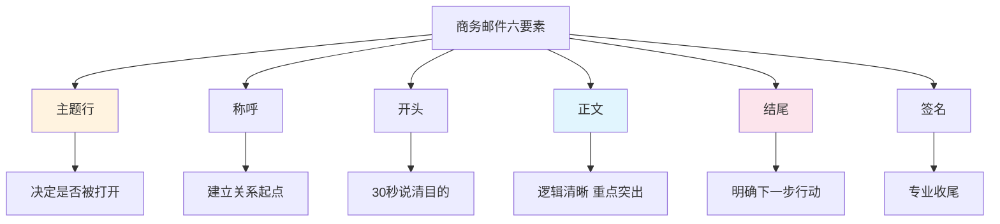

**（1）主题行（Subject Line）——决定邮件是否被打开**

主题行是邮件的"门面"，它决定了收件人是否打开邮件、何时打开邮件、以及以什么心态打开邮件。研究表明，47% 的收件人仅根据主题行决定是否打开邮件。

主题行的写作公式：**[标签/类型] + 核心内容 + [行动要求/截止时间]**

| 类型 | 好的主题行 | 差的主题行 | 改进要点 |
|------|-----------|-----------|---------|
| 请求类 | 【请审批】Q3市场预算方案（50万）— 本周五前 | 预算方案 | 加标签+金额+截止时间 |
| 汇报类 | 【周报】研发部6/16-6/20进展：支付模块上线 | 本周进展 | 加部门+日期+关键成果 |
| 通知类 | 【通知】7月1日起实行弹性工时制—全员 | 重要通知 | 加具体事项+生效日期 |
| 会议类 | 【会议邀请】Q3产品规划会 6/28 14:00 3楼A会议室 | 开会 | 加时间+地点 |
| 跟进类 | 【跟进】合同审批进度（距截止还剩3天） | 合同的事 | 加紧迫感+具体事项 |
| 介绍类 | 【介绍】新供应商XX公司资料 — 请评估 | 新供应商 | 加目的+期望行动 |
| 道歉类 | 【致歉】XX项目交付延迟 — 补救方案附后 | 抱歉 | 加补救措施+诚意 |
| 致谢类 | 【感谢】XX项目合作圆满收官 — 复盘报告 | 谢谢 | 加具体事由+后续 |
| 提案类 | 【提案】客户管理系统升级方案 — 预算30万/ROI 200% | 系统升级 | 加关键数据和价值 |

**主题行的五个原则：**
- **具体化**：用数字和日期替代模糊表述（"Q3预算50万"而非"预算方案"）
- **标签化**：用【】标注邮件类型，便于收件人快速分类处理
- **行动化**：如果需要对方行动，在主题中注明（"请审批""请回复""请确认"）
- **简洁化**：控制在 50 个字符以内（移动端通常只显示前 30-40 个字符）
- **避免垃圾邮件特征**：不用全部大写、不用过多感叹号、不使用"紧急""免费"等敏感词

> **进阶技巧：主题行的"续接"管理。** 当一封邮件经过多轮回复后，主题行可能已经和当前讨论内容脱节。此时应修改主题行以反映当前议题（如"【续】XX项目 — 已进入测试阶段"），而不是继续沿用老主题。这能帮助所有参与者快速定位当前状态。

**（2）称呼（Greeting）——建立关系的起点**

称呼的选择取决于你与收件人的关系、邮件的正式程度和企业文化。

关系层级与称呼对照：

高度正式（首次联系/外部客户/高管）：
  → 尊敬的王总/尊敬的李女士/尊敬的张董事长

中等正式（内部同事/合作伙伴/日常业务）：
  → 王总/李经理/张主任/各位领导

半正式（熟悉的同事/经常合作的伙伴）：
  → 王哥/李姐/老张/Hi David

非正式（团队内部/关系密切的同事）：
  → 小王/Hey David/各位

群发邮件：
  → 各位同事/各位领导/团队各位/All

**称呼的注意事项：**
- 不确定对方职位时，用"姓+先生/女士"是最安全的选择
- 对方有明确的职级偏好时（如对方签名写"VP"），按其偏好称呼
- 群发邮件中不要遗漏关键人物——如果邮件CC了某位高管，在正文中要提及
- 外贸邮件中，注意文化差异：英语环境直呼其名是正常的，日语环境需要加敬称（如"田中様"）
- 不要使用"亲""宝贝"等电商客服风格的称呼——商务邮件不是网购
- 多人邮件中，称呼的排序应遵循职级从高到低的顺序

**（3）开头（Opening）——30秒内说清目的**

开头段落的功能是让收件人在 30 秒内明白这封邮件要干什么。根据麦肯锡的调研，高效的商务人士平均花 11 秒阅读一封邮件，因此开头必须直接切入主题。

开头的三种模式：

**模式一：直接切入型（最常用）**
关于[事项]，[结论/请求]。

示例：
关于Q3市场预算方案，我已完成审阅，总体认可，
但有三处需要调整。（详见下方第三段）

**模式二：回复感谢型（用于回复邮件）**
感谢您的来信 / 感谢您关于[事项]的反馈。

示例：
感谢您6月20日关于供应商评估标准的邮件，
您提出的质量权重调整建议非常有价值。

**模式三：背景交代型（用于复杂事项的首次沟通）**
[背景/原因]，因此[行动/请求]。

示例：
由于近期原材料价格上涨15%，
我们需要重新评估Q3的成本预算。
附件是调整后的方案，请您审阅。

> **注意：** 中国商务邮件中常见的寒暄（"您好，近来工作顺利吗？"）在内部邮件中可以省略，但在外部客户邮件或初次联系中仍然必要。关键原则是：寒暄不超过一句，且与正文有逻辑衔接（"近来工作顺利吗？借此机会同步一下XX项目进展……"），而非空洞的客套。

**（4）正文（Body）——逻辑清晰，重点突出**

正文是邮件的核心，要做到"扫一眼就能抓到重点"。以下是正文组织的关键原则：

**原则一：金字塔结构**
- 结论/请求放在最前面
- 用论据和细节支撑结论
- 每段一个主题，段落间有逻辑递进

**原则二：视觉层次**
- 用编号列表呈现并列信息（而非用段落堆砌）
- 用加粗标注关键词和数字
- 用分隔线区分不同主题
- 正文不超过 5 段、500 字（超过则应考虑面谈或电话）

**原则三：一次邮件一个主题**
- 如果涉及多个不相关的事项，分开发送
- 如果必须在同一封邮件中涵盖多个事项，用清晰的分段标识

**正文写作的反面案例与改进：**

反面案例（信息混杂，重点模糊）：
王总您好，上周说的那个项目的事情，我觉得可能需要
跟技术部确认一下，另外上次开会讨论的价格问题您看
怎么定，还有小李说他那边的进度可能要延期，您看是
不是安排个会讨论一下？

改进版本（结构清晰，诉求明确）：
王总您好，有三个事项需要您的关注：

一、项目技术方案确认
  上周讨论的方案A，需技术部确认接口兼容性。
  → 我已约技术部老张明天沟通，会后同步结论。

二、产品定价决策
  上次会议讨论的两个价格方案：
  - 方案A：定价299元，预计月销5000件
  - 方案B：定价399元，预计月销3000件
  → 建议选方案A（利润更高），请您决策。

三、交付进度风险
  小李反馈测试环节可能延期1周。
  → 建议安排15分钟会议讨论应急方案。
  您本周四下午3点是否方便？

**（5）结尾（Closing）——明确下一步行动**

结尾的功能是：明确"谁在什么时候做什么"。一封没有明确行动要求的邮件，等于白发。

**结尾的标准模板：**
[总结行动项]
1. [谁] 需要在 [什么时候] 完成 [什么事]
2. [谁] 需要在 [什么时候] 完成 [什么事]

如有疑问，请随时联系我。
[签名]

**结尾的反面案例与改进：**

反面案例：
以上就是我的想法，希望您能考虑一下。

改进版本：
请您在6月28日（周五）前确认是否同意上述方案。
如有修改意见，我可以当天调整后重新提交。

如需当面讨论，我的日程在周三、周四下午均有空档。

**（6）签名（Signature）——专业的收尾**

签名应包含姓名、职位、公司、联系方式（电话+邮箱），可选加公司地址和官网。签名不宜过长，控制在 4-6 行以内。企业统一签名格式是最好的。

--
张明 | 产品总监
ABC科技有限公司
手机：138-xxxx-xxxx
邮箱：zhangming@abc.com
地址：北京市朝阳区XX大厦12层

### 2. 商务邮件的语气与措辞

**正式程度的三级标尺：**

| 级别 | 适用场景 | 语气特征 | 典型用词 |
|------|---------|---------|---------|
| 高度正式 | 高管/外部客户/法律文件/正式通知 | 庄重、严谨、避免口语化 | "敬请""烦请""特此函告""顺颂商祺" |
| 中等正式 | 同事/合作伙伴/日常业务 | 专业但不僵硬、友好但不随意 | "请""谢谢""建议""期待您的反馈" |
| 低度正式 | 熟悉同事/团队内部 | 轻松、直接、效率优先 | "Hi""帮忙""确认下""OK" |

**措辞升级对照表：**

| 口语化表达 | 专业化表达 | 为什么更好 |
|-----------|-----------|-----------|
| 你赶紧把这个弄完 | 请在本周五前完成此项工作 | 明确截止时间，语气尊重 |
| 这个方案不行 | 此方案在成本控制方面存在较大风险 | 指出具体问题而非全盘否定 |
| 我不知道 | 我需要确认后回复您 / 此事项需咨询XX部门 | 表示积极处理而非推卸 |
| 你搞错了 | 此处数据与原始报表有出入，请核实 | 对事不对人 |
| 随便你 | 我尊重您的决定 / 建议方案A，您看如何 | 表达态度但不消极 |
| 尽快 | 请在XX日前 / 请于今日下班前 | 给出具体时间 |
| OK/收到/好的 | 已确认，将按计划执行 / 收到，我会在XX前反馈 | 明确后续行动 |
| 这个东西太烂了 | 该方案在用户体验方面有较大改进空间 | 专业化批评而非情绪化否定 |
| 你自己看着办吧 | 请您根据实际情况判断决策 / 建议XX，请您定夺 | 保留尊重和建设性 |

**软化负面信息的缓冲技巧：**

在商务邮件中传递负面信息（拒绝、批评、催促）时，直接表达容易引发对方抵触。使用缓冲语可以降低对抗性。

直接表达 → 缓冲表达

"我拒绝这个方案。" 
→ "感谢您提出这个方案。经过评估，考虑到[原因]，
   我们建议探索另一种思路……"

"你的报告有错误。"
→ "报告整体框架清晰，数据详实。其中有两处数据
   建议核实（见附件标注），确认后即可定稿。"

"你还没交报告。"
→ "温馨提醒：Q2报告的提交截止日期是本周五。
   如有困难请提前沟通，我可以协调支持。"

"这个价格我们不能接受。"
→ "感谢贵方的报价。经过内部评估，我们在预算方面
   有一定约束，希望能探讨在XX方面调整的可能性。"

"你的想法不切实际。"
→ "这个方向很有创意。从落地可行性角度来看，
   我们可能需要考虑XX限制因素……"

> **缓冲技巧的核心逻辑**：肯定 → 指出 → 建议。先认可对方的努力或出发点（肯定），再客观描述问题而非攻击人（指出），最后给出建设性方向（建议）。这个三步框架几乎适用于所有负面信息的传递。

### 3. 商务邮件的高频模板

以下模板覆盖日常 80% 的邮件场景。每个模板都标注了适用情境和填写要点。

**模板一：请求协助邮件**

主题：【请求协助】[事项名称] — 请于[日期]前回复

[称呼]您好，

我正在推进[事项]，在[具体环节]需要您的支持。
具体需求如下：
1. [需求1]（用途说明：用于……）
2. [需求2]（用途说明：用于……）

背景信息：[简要说明为什么需要这些信息/支持]

如果您能在[日期]前提供，将不胜感激。
如有任何疑问，请随时与我联系。

谢谢！

[签名]

**模板二：进度汇报邮件**

主题：【周报】[项目名称]进展 — [日期范围]

[称呼]您好，

以下是[项目名称]本周进展：

一、已完成事项
✅ [事项1]（负责人：XX，完成日期：XX）
✅ [事项2]（负责人：XX，完成日期：XX）

二、进行中事项
🔄 [事项3]（负责人：XX，预计完成：XX，进度：70%）
🔄 [事项4]（负责人：XX，预计完成：XX，进度：40%）

三、风险与问题
⚠️ [风险描述]（影响：XX，应对措施：XX）
❓ [需协调事项]（需要XX部门支持，请XX协助协调）

四、下周计划
📋 [计划1]
📋 [计划2]

如有问题请随时联系我。

[签名]

**模板三：正式通知邮件**

主题：【通知】[事项名称] — [生效日期]起执行

各位同事，

根据[依据/背景]，现就[事项]通知如下：

一、[要点1]
[具体内容]

二、[要点2]
[具体内容]

三、[要点3]
[具体内容]

请各位知悉并遵照执行。如有疑问，请联系[负责人/部门]。

[签名]

**模板四：催办跟进邮件**

主题：【跟进】[事项名称] — [状态/紧迫程度]

[称呼]您好，

关于[事项]，此前已于[日期]发送邮件沟通（见下方原文），
目前尚未收到您的回复，特此跟进。

当前状态：[简要说明]
影响：[如果不处理会怎样]
需要您：[具体行动]
截止时间：[日期]

如有任何问题或需要调整，请告知。

[签名]

**模板五：跨部门协作邮件**

主题：【协作请求】[项目名称]需要[部门]支持 — [时间范围]

[称呼]您好，

我是[部门]的[姓名]。我们正在推进[项目名称]，
在[具体环节]需要贵部门的协助。

背景：[项目背景，1-2句话]
需求：[具体需求]
时间：[需要的时间范围]
价值：[对对方部门的价值/对公司整体的价值]

我已附上相关资料（见附件），方便您了解详情。
如果方便，希望能安排15分钟的电话或面谈，
当面沟通具体细节。

[签名]

**模板六：项目复盘/致谢邮件**

主题：【致谢/复盘】[项目名称]圆满收官 — 关键成果与经验总结

各位，

[项目名称]已于[日期]正式上线/完成，感谢大家的付出。

一、关键成果
- [指标1]：达成XX（目标XX，超额XX%）
- [指标2]：达成XX（目标XX，符合预期）

二、亮点
- [团队或个人的突出贡献，具体到谁做了什么]

三、经验教训
- 做得好的：[具体做法]，建议后续项目沿用
- 可改进的：[具体问题]，建议后续项目在XX方面优化

四、致谢
特别感谢[XX部门]的XX在XX方面的支持，
以及[XX]在XX问题上的及时响应。

再次感谢所有参与者的努力！

[签名]

**模板七：商务道歉邮件**

主题：【致歉】[事项名称] — 原因说明及补救方案

[称呼]您好，

非常抱歉就[具体事项]给贵方带来的不便。

一、发生了什么
[客观描述事实，不推卸、不含糊]

二、原因分析
[简要说明根本原因，不找借口]

三、补救措施
1. [已采取的措施]
2. [将要采取的措施]
3. [防止再发的机制]

四、时间表
[预计解决时间/进展节点]

再次为给您带来的不便深表歉意。
如您有任何进一步的要求，请随时与我联系。

[签名]

> **模板使用的黄金原则**：模板是起点，不是终点。每次使用模板前，根据具体情境调整内容——确保每个方括号里的内容都是针对当前情况的具体信息，而非模板的占位符原文。照抄模板的痕迹一眼就能看出来，反而降低专业度。

**模板使用的常见陷阱：**

| 陷阱 | 表现 | 正确做法 |
|------|------|---------|
| 机械套用 | 把模板原文直接发出，方括号都没替换 | 每个方括号都是针对当前情境的具体信息 |
| 语气不匹配 | 给熟悉同事发高度正式的模板邮件 | 根据关系亲疏调整语气级别 |
| 过度模板化 | 所有邮件都用一个模板，千篇一律 | 根据具体情境微调结构和用词 |
| 忽略上下文 | 不引用之前的沟通历史 | 跟进邮件要引用之前的邮件，让对方快速回忆 |
| 行动项模糊 | "请尽快回复"而非具体日期 | 每个行动项必须有明确的"谁+什么时候+做什么" |

> **进阶技巧：邮件的"可操作性"检验。** 发送前问自己：如果收件人只读这一封邮件（不读之前的往来），能否独立理解背景、知道该做什么、知道什么时候做？如果答案是"不能"，就需要补充上下文。这就是为什么跟进邮件要引用原文、跨部门邮件要交代项目背景。

### 4. 邮件写作的常见错误

| 错误类型 | 具体表现 | 正确做法 |
|---------|---------|---------|
| 主题缺失/模糊 | "你好""帮忙看看" | 用[标签]+核心内容+时间的公式 |
| CC滥用 | CC所有人表示"我通知了" | 只CC需要知情的人，避免"CC政治" |
| 回复全部滥用 | 感谢类回复不需要所有人看到 | 只回复发件人，除非确需所有人知晓 |
| 附件遗漏 | 正文说"见附件"但没附 | 发送前检查附件，养成"先附件后正文"习惯 |
| 语气过激 | 用感叹号、全大写表达不满 | 控制情绪，写完后放10分钟再发 |
| 长篇大论 | 正文超过1000字 | 超过500字考虑面谈或电话，邮件只做摘要 |
| 行动不明确 | "希望您考虑一下" | "请在XX日前确认是否同意" |
| 时间错乱 | 周五下班前发紧急邮件 | 急事用电话/IM，邮件留到工作时间发 |
| 群发误用 | 把只该给一个人的消息群发 | 发送前确认收件人列表，敏感信息单独发 |
| 无称呼无落款 | 正文直入主题没有称呼 | 即使简短邮件也加上称呼和签名 |
| 嵌套回复过多 | 经过10轮回复后邮件体积极大 | 在新邮件中摘录关键信息，而非转发整串 |
| 隐藏收件人 | 用密送（BCC）操控信息流 | BCC仅用于保护隐私（如群发不暴露邮箱列表），不应用于操控 |

### 5. 跟进邮件的节奏策略

很多时候，一封邮件并不能解决问题。你需要一个系统性的跟进策略，而不是盲目地"催一下"。

邮件跟进的"三段式"节奏：

第一次发送（Day 0）：
  → 正常语气发送，明确截止时间和行动要求

第一次跟进（Day 3-5，如无回复）：
  → 轻量提醒，引用原文
  → 主题行加【跟进】标签
  → "关于我X月X日发送的关于[事项]的邮件，想确认您是否收到。
      简要说明：[1句话总结需求]。
      如需更多信息，随时联系我。"

第二次跟进（Day 7-10，如仍无回复）：
  → 语气升级，强调影响
  → "温馨提醒：[事项]的截止日期是[日期]，目前还需要您确认[具体内容]。
      如果届时未能确认，可能会影响[具体影响]。
      如您正在处理其他优先事项，请告知预计回复时间。"

第三次跟进（Day 14+，如仍无回复）：
  → 升级渠道（电话/面谈/抄送上级）
  → 不要继续发邮件——换一个沟通渠道
  → "关于[事项]，我已通过邮件联系多次（附历史记录），
      为不影响项目进度，我将在今天下午电话联系您确认。"

> **跟进的核心原则**：每次跟进都提供新的价值或信息，而不是简单重复"你看了吗"。可以补充新数据、新进展、或对方可能关心的信息，让跟进邮件本身也值得阅读。

---

## 二、即时通讯商务沟通技巧

即时通讯工具（微信、钉钉、Slack、飞书等）已经成为商务沟通的主要渠道。与邮件不同，即时通讯的特点是"实时性高、信息碎片化、边界模糊"——既是工作工具，也是社交工具，这种双重属性带来了很多沟通陷阱。

### 1. 即时通讯的沟通边界

适合用即时通讯的场景：
  ✅ 快速确认简单事项（"明天的会议几点？"）
  ✅ 日常协作中的简短沟通（"文件已发你，请查收"）
  ✅ 紧急事项的初步通知（"系统出问题了，正在排查"）
  ✅ 团队内部的日常信息同步
  ✅ 非正式的意见交流和头脑风暴

不适合用即时通讯的场景：
  ❌ 正式请求或审批（应该用邮件）
  ❌ 复杂问题的深度讨论（应该开会）
  ❌ 敏感话题（绩效、薪资、冲突）（应该面谈）
  ❌ 需要留痕的重要决策（应该邮件确认）
  ❌ 跨部门的正式协作请求（应该邮件+会议）
  ❌ 传递负面信息（批评、拒绝）（应该面谈或电话）

### 2. 即时通讯的商务礼仪

| 场景 | 错误做法 | 正确做法 |
|------|---------|---------|
| 发送长消息 | 连发10条短消息轰炸 | 整理后发一条完整消息，用分段和列表 |
| 发送语音消息 | 给上级/客户发60秒语音 | 仅限关系密切的同事；正式场合用文字 |
| 工作时间外发消息 | 深夜发消息期待立刻回复 | 标注"不急，明天处理"或使用定时发送 |
| 群聊中的沟通 | 在群里讨论敏感话题 | 敏感话题私聊，群里只讨论公开事项 |
| 回复速度 | 秒回每一条消息 | 设定"专注时间"，批量处理消息 |
| 表情包使用 | 给客户/上级发搞笑表情包 | 内部群可用适度表情；正式场合用文字 |
| "收到"回复 | 每条消息都回"收到" | 有行动项时回复具体承诺，无行动项不需要回复 |
| @所有人 | 频繁@所有人发通知 | 只在真正紧急时@所有人，日常通知@具体人 |
| 转发聊天记录 | 直接转发大段截图给第三方 | 用文字总结关键信息，标注来源和背景 |
| 消息撤回 | 频繁撤回消息引起猜疑 | 发送前检查，撤回后简要说明原因 |

### 3. 不同即时通讯工具的商务使用规范

不同工具的设计理念不同，使用方式也应有差异：

| 工具 | 特性 | 商务使用要点 |
|------|------|-------------|
| 微信 | 社交属性强，边界模糊 | 用群聊区分项目/部门；重要决定用邮件二次确认；避免在朋友圈讨论工作 |
| 钉钉 | 有已读/未读、DING功能 | 已读不回≠不尊重；DING功能慎用（类似催命铃）；善用日程和任务功能 |
| 飞书 | 文档协作集成度高 | 善用飞书文档代替长消息；用话题群管理多项目；妙记功能自动生成会议纪要 |
| Slack | 频道化组织、线程回复 | 用频道（#channel）分类话题；用线程（thread）保持主频道整洁；善用集成机器人 |
| 企业微信 | 与微信互通但隔离 | 用于外部客户沟通（客户朋友圈、客户群）；内部沟通仍建议用专业工具 |

> **工具选择原则**：信息密度越高、需要协作的内容越多，越应该使用集成度高的工具（飞书/Slack）。纯信息传递类沟通，微信/钉钉足够。面向外部客户，企业微信是首选。

### 4. 即时通讯中的"坑"

**坑一：截图代替文字。** 发送一段截图而非文字，对方无法搜索、无法复制、无法转发。在需要对方执行的场景中，文字远优于截图。

**坑二：消息"已读"压力。** 钉钉/飞书有"已读"功能，这让收件人感到压力——"我看到了但没时间回复"变成了一种焦虑。作为发件人，不要因为对方"已读"就立刻追问；作为收件人，如果暂时无法回复，可以先发一个"收到，稍后回复"。

**坑三：群聊信息过载。** 加入太多工作群，每天被几百条消息淹没。解决方案：关闭非核心群的通知，每天固定2-3个时段集中处理群消息，重要群置顶。

**坑四：工作与生活的边界模糊。** 微信既是工作工具也是社交工具，导致"下班后还在回工作消息"。建议：使用不同的工具区分工作和生活（如工作用钉钉/飞书，生活用微信），或在工作群昵称中标注"工作微信"以设定预期。

**坑五：群聊中的"隐形决策"。** 在群聊中做出的决定容易被遗忘——群消息刷新太快，三天后谁也找不到当时说了什么。关键决策确认后，应通过邮件或文档做正式记录。

**坑六：跨群信息碎片化。** 同一个项目的信息散落在多个群里（项目群、技术群、管理层群），导致信息不对称。解决方案：指定一个"主群"作为信息中枢，关键信息同步到主群。

> **进阶技巧：即时通讯的"可追溯性"。** 即时通讯中的重要决定容易被聊天记录淹没。关键事项确认后，应通过邮件或文档做一次正式记录——"刚才我们在微信中确认了XX，我整理一下发邮件给大家"。这样既保持了即时通讯的效率，又获得了正式渠道的可追溯性。

---

## 三、商务报告与提案写作

商务报告和提案是书面表达的高级形式——它们不只是传递信息，更是系统性地说服读者接受你的分析、建议或方案。与邮件不同，报告和提案需要更强的逻辑结构、更完整的论证体系和更专业的呈现方式。

### 1. 商务报告的类型与结构

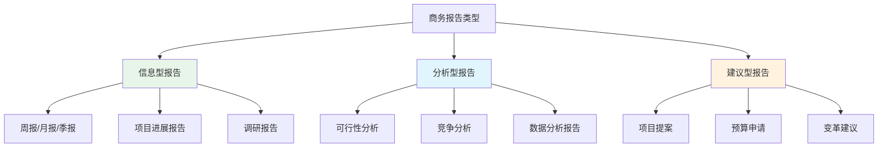

**通用报告结构（适用于大多数商务报告）：**

1. 执行摘要（Executive Summary）
   - 一页纸说清：背景、核心发现、关键建议、预期收益
   - 这是给忙碌的高管看的——他们可能只读这一部分
   - 字数控制在300-500字

2. 背景与目的
   - 为什么写这份报告？
   - 要解决什么问题？
   - 覆盖范围和时间框架

3. 方法论（分析型报告必须有）
   - 数据来源是什么？
   - 分析方法是什么？
   - 有什么局限性？

4. 核心发现/分析
   - 用数据和事实支撑
   - 每个发现独立成段
   - 用图表增强可读性

5. 建议与方案
   - 每个建议对应一个发现
   - 说明预期收益和风险
   - 给出实施路径和时间表

6. 附录
   - 详细数据、补充材料、参考文献

### 2. 商务提案的写作框架

商务提案的目标是说服对方接受你的方案。它比一般报告更具"推销"性质，需要更强的说服力。

**提案的"问题-方案-价值"框架：**

第一部分：理解对方的问题（让对方觉得"你懂我"）
  - 你面临的问题/挑战是什么？（引用对方的话或数据）
  - 这个问题如果不解决，会有什么后果？
  - 目前的解决方案为什么不够好？

第二部分：呈现你的方案（让对方觉得"这能行"）
  - 我们的方案是什么？（一句话概括）
  - 方案的核心逻辑是什么？（为什么这个方案能解决问题）
  - 具体怎么做？（实施步骤和时间表）
  - 需要什么资源？（人力、预算、时间）

第三部分：证明方案的价值（让对方觉得"值"）
  - 预期收益是什么？（量化：节省XX万/提升XX%/缩短XX天）
  - ROI分析（投入产出比）
  - 风险和应对措施（主动暴露风险比被动被质疑好）
  - 成功案例（同行或类似场景的验证）

第四部分：降低行动门槛（让对方觉得"现在就该做"）
  - 分阶段实施方案（降低一次性投入的压力）
  - 试点方案（小范围验证，降低风险）
  - 明确的下一步（"我们建议在XX日前完成XX"）

**提案中的数据呈现技巧：**

| 呈现方式 | 适用场景 | 示例 |
|---------|---------|------|
| 对比数据 | 证明现状与目标的差距 | "当前流失率40%，优化后预计降至15%" |
| 趋势数据 | 说明问题的紧迫性 | "过去6个月，获客成本每月上涨8%" |
| ROI计算 | 证明投资回报 | "投入30万，预计12个月收回，年化ROI 200%" |
| 行业基准 | 证明方案的合理性 | "行业平均响应时间为2秒，我们的目标是1.5秒" |
| 案例数据 | 增强可信度 | "XX公司采用类似方案后，3个月内效率提升35%" |

> **提案写作的核心心法**：不要写"我想做什么"，而要写"你需要什么"。整份提案的视角应该是对方的需求和利益，而非你的能力和产品。把"我们公司拥有先进的技术"改成"这项技术能帮您降低30%的运营成本"。

### 3. 报告与提案的常见错误

| 错误 | 表现 | 改进 |
|------|------|------|
| 数据堆砌 | 列了20页数据但没有结论 | 数据服务于论点，先说结论再用数据支撑 |
| 结论模糊 | "总体来看还是不错的" | 给出明确的判断："建议采用方案A，因为……" |
| 缺乏可操作性 | "应该加强管理" | "建议每周增加一次进度检查会，由XX负责主持" |
| 忽视读者 | 用技术术语写给业务决策者 | 根据读者调整语言和详略程度 |
| 报喜不报忧 | 只展示正面数据 | 主动暴露风险和局限性，增强可信度 |
| 格式混乱 | 不同章节风格不统一 | 使用统一的模板和样式规范 |

---

## 四、说服与影响力技巧

说服是商务沟通的"灵魂"——无论是写邮件、做演示、谈判还是管理团队，本质上都是在影响他人的认知和决策。罗伯特·西奥迪尼在《影响力》中总结了六大说服原则，这些原则在商务场景中有广泛的应用。

### 1. 影响力的六大原则及其商务应用

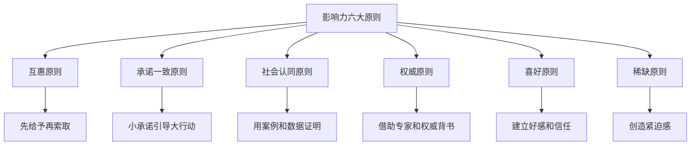

**原则一：互惠原则——先给予，再索取**

在要求对方做什么之前，先为对方提供价值。人类有强烈的"回报"本能——你帮了我，我也愿意帮你。

商务应用示例：

场景：需要技术部配合你的项目
  ❌ "我们的项目需要你们配合，下周能给结果吗？"
  ✅ "上次你们项目紧急时，我们团队加班帮你们完成了数据迁移。
      这次我们有个项目也遇到了类似的时间压力，
      能否在下周支持一下？具体需求是……"

场景：向客户推销方案
  ❌ 一上来就介绍产品功能
  ✅ 先提供一份免费的行业分析报告或诊断服务，
      建立价值感后再引出你的方案

**原则二：承诺一致原则——小步引导，逐步升级**

人们倾向于保持自己言行的一旦做出承诺（即使是小承诺），就更容易做出一致的大行动。

商务应用示例：

场景：推动跨部门项目
  第一步：邀请对方参加一个30分钟的项目介绍会（小承诺）
  第二步：请对方提供一份简单的数据支持（中等承诺）
  第三步：邀请对方加入项目组成为核心成员（大承诺）

场景：销售谈判
  第一步：让客户认同问题的存在（"您是否认同当前流程效率有待提升？"）
  第二步：让客户认同方案的方向（"这个方向是否符合您的预期？"）
  第三步：让客户确认具体的合作方式

**原则三：社会认同原则——用他人的选择来证明**

人们倾向于参考他人的行为来做决策，尤其是在不确定的情况下。

商务应用示例：

场景：推动新工具/方法的采用
  ✅ "XX部门和YY部门已经在使用这个工具，效率提升了30%。
      这是他们的使用数据和反馈。"

场景：提案说服
  ✅ "与我们同行业的3家头部企业（A、B、C）都采用了类似方案，
      其中A企业的ROI达到了180%。"

**原则四：权威原则——借助专业和权威背书**

人们倾向于服从权威——专家意见、权威数据、行业认证都能增强说服力。

商务应用示例：

场景：技术方案论证
  ✅ "这个架构方案参考了Google SRE团队的最佳实践，
      并通过了我们架构委员会的评审。"

场景：预算申请
  ✅ "根据Gartner的最新报告，行业平均IT投入占营收的4.2%，
      而我们目前仅为2.8%，存在投入不足的风险。"

**原则五：喜好原则——人们更愿意被喜欢的人说服**

建立好感和信任是说服的前提。共同点、真诚的赞美、良好的倾听都能增加好感度。

商务应用示例：

场景：跨部门协作
  - 在谈正事之前，花2分钟聊聊共同关心的话题
  - 真诚地认可对方部门的专业能力
  - 在公开场合给予对方部门应有的认可

场景：客户沟通
  - 找到与客户的共同背景（校友、同乡、共同认识的人）
  - 真诚地赞美客户公司做得好的方面
  - 记住客户的偏好和重要日期

**原则六：稀缺原则——越稀缺越有价值**

人们对"即将失去"的东西比"可能得到"的东西更加敏感。

商务应用示例：

场景：推动决策
  ✅ "这个优惠价格的有效期到本月底，下个月将恢复原价。"
  ✅ "这个方案需要在Q3启动才能赶上明年的市场窗口，
      如果推迟到Q4，预计效果会降低40%。"

场景：资源争取
  ✅ "目前团队只有2名工程师有空余，如果本周不锁定，
      下周他们将被分配到XX项目。"

### 2. 说服的逻辑框架

除了情感层面的影响原则，说服还需要严密的逻辑支撑。以下是三种常用的说服逻辑框架：

**框架一：SCQA（情境-冲突-问题-答案）**

S（Situation）情境：描述当前的背景状态
  "我们的客户管理系统已经运行了5年，目前管理着10万+客户数据。"

C（Complication）冲突：指出当前状态面临的问题
  "但随着客户量增长3倍，系统响应速度下降了60%，
   客户投诉率上升了25%。"

Q（Question）问题：自然引出需要解决的问题
  "如何在不中断业务的情况下升级系统？"

A（Answer）答案：给出你的方案
  "我们建议采用分阶段迁移方案，预计3个月完成……"

**框架二：FAB（特征-优势-利益）**

F（Feature）特征：你的方案/产品有什么特点
  "这个方案采用了分布式微服务架构。"

A（Advantage）优势：与替代方案相比有什么优势
  "相比单体架构，它支持独立扩展每个模块，
   不需要因为一个模块的负载增加而扩展整个系统。"

B（Benefit）利益：这给对方带来什么具体好处
  "这意味着您的IT成本可以降低40%，
   同时系统可用性从99%提升到99.9%。"

**框架三：正反合论证**

正面论证：说明采纳方案的好处
  "采用方案A可以降低30%的运营成本，提升50%的处理效率。"

反面论证：说明不采纳的后果
  "如果不升级，按照目前的增长速度，12个月后系统将无法支撑业务量，
   可能导致服务中断，预估损失为200万/天。"

综合结论：给出明确建议
  "综合利弊分析，建议在Q3启动方案A的实施，
   预计投入30万，6个月收回投资。"

> **说服的核心公式**：说服力 = 逻辑（让对方"认同"） × 情感（让对方"愿意"） × 利益（让对方"行动"）。三者缺一不可——逻辑严密但缺乏情感，对方会认同但不行动；情感充沛但逻辑薄弱，对方会感动但不信任；利益清晰但缺少逻辑和情感，对方会算计但不投入。

### 3. 说服中的常见错误

| 错误 | 表现 | 改进 |
|------|------|------|
| 只讲好处不讲风险 | "这个方案完美无缺" | 主动暴露风险并说明应对措施，增强可信度 |
| 用数据代替故事 | 列了10页表格但没有一个案例 | 数据+案例结合，让对方既"知道"又"感受到" |
| 自说自话 | "我们的技术很先进" | 转换视角："这项技术能为您解决XX问题" |
| 过度施压 | "今天不签就没机会了" | 创造合理紧迫感，但保留对方的决策空间 |
| 忽视反对意见 | 对方的顾虑视而不见 | 提前预判反对意见，准备回应方案 |
| 只有一个方案 | "只能这样做" | 提供2-3个选项，让对方有选择感 |

---

## 五、商务谈判策略

商务谈判是利益博弈的艺术。与日常沟通不同，谈判具有明确的目标导向性——你需要在有限的时间和资源约束下，争取最大化的利益。本部分将谈判拆解为"准备→执行→收尾"三个阶段，每个阶段提供可操作的策略和工具。

### 1. 谈判前的准备——80%的胜率在桌下决定

谈判的成败往往在坐到谈判桌之前就已经决定了。哈佛商学院的研究表明，谈判结果的 80% 取决于准备工作。

**准备清单（逐项完成，打勾确认）：**

□ 明确目标
  - 理想结果是什么？（乐观目标）
  - 可接受结果是什么？（满意目标）
  - 底线是什么？（Walk-away Point）

□ 了解对方
  - 对方的核心需求和利益是什么？
  - 对方的决策流程和决策人是谁？
  - 对方的BATNA（最佳替代方案）是什么？
  - 对方可能的让步空间在哪里？

□ 确定己方BATNA
  - 如果谈判失败，我的替代方案是什么？
  - 替代方案的可行性和吸引力如何？
  - 如何在谈判前改善我的BATNA？

□ 评估ZOPA（协议空间）
  - 我的底线：________
  - 对方可能的底线：________
  - 是否存在重叠空间？□ 是 □ 否

□ 准备方案库
  - 主方案（我的首选提案）
  - 备选方案1（如果对方不接受主方案）
  - 备选方案2（创造性方案）
  - 交换条件清单（我可以让步的/我想争取的）

□ 数据与证据
  - 市场数据/行业基准
  - 竞品报价/历史数据
  - 专家意见/第三方报告

□ 预判与应对
  - 对方可能提出的反对意见：________
  - 我的回应策略：________
  - 对方可能使用的谈判策略：________
  - 我的应对方案：________

□ 后勤安排
  - 谈判时间：________
  - 谈判地点：________
  - 己方团队及角色分工：________
  - 座位安排（并排坐减少对抗感，面对面适合正式谈判）

**BATNA的构建方法：**

BATNA（Best Alternative to a Negotiated Agreement）是你在谈判中的"底气来源"。BATNA越强，你在谈判中越主动。

构建BATNA的四个步骤：

第一步：头脑风暴
  列出所有可能的替代方案，不急于评判可行性。
  例：采购谈判中——
  - 寻找其他供应商
  - 自主生产
  - 替代材料/技术
  - 暂时搁置该项目

第二步：评估可行性
  对每个方案从成本、时间、质量三个维度打分（1-5分）。
  
  方案        | 成本 | 时间 | 质量 | 总分
  其他供应商A  |  4   |  3   |  4   |  11
  其他供应商B  |  3   |  4   |  3   |  10
  自主生产     |  2   |  1   |  5   |   8
  替代材料     |  3   |  2   |  3   |   8

第三步：完善最佳方案
  对排名最高的方案进行深化——获取报价、签订意向书、
  完成技术验证等，使其成为真正的"可执行方案"。

第四步：保密
  BATNA是你的核心筹码，不要让对方知道你的BATNA有多强（或多弱）。
  可以暗示你有其他选择，但不要透露细节。

**ZOPA的可视化分析：**

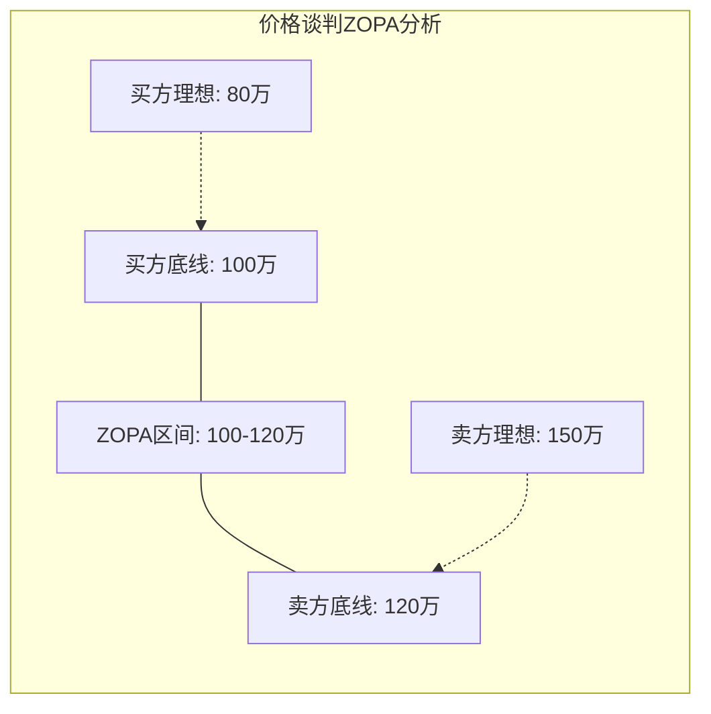

当买方底线 ≥ 卖方底线时，ZOPA存在。如果不存在ZOPA，需要创造性地改变谈判维度（加入非价格条件、改变交付方式等）来创造空间。

### 2. 谈判的核心理论框架

在进入具体策略之前，先建立谈判的理论根基。哈佛谈判项目（Harvard Negotiation Project）提出的"原则性谈判"（Principled Negotiation）是当今最被广泛接受的谈判框架，其核心由四个原则构成：

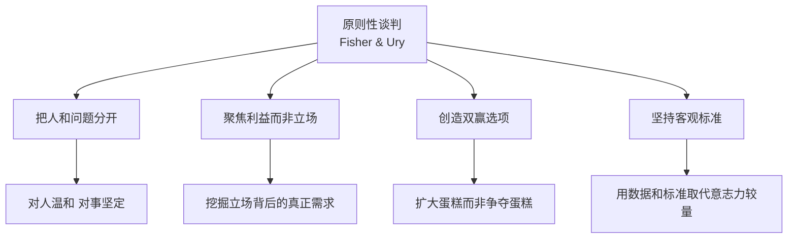

**原则一：把人和问题分开。** 谈判桌上的人有情绪、有面子需求、有自尊心。如果你的提议让对方觉得"被打败了"，即使方案客观合理，对方也可能拒绝。正确做法是：对人保持温和、尊重、倾听；对事保持坚定、客观、专业。

**原则二：聚焦利益而非立场。** 立场是"我要什么"，利益是"我为什么想要"。两个人争一个橘子（立场对立），但一个人要果肉做蛋糕，一个人要果皮做调料——这就是利益互补。谈判中要不断追问"为什么"来挖掘对方的真实利益。

**原则三：创造双赢选项。** 大多数谈判不是零和博弈。扩大议题范围、引入新的交换条件、分阶段实施，都能创造更多"蛋糕"。

**原则四：坚持客观标准。** 当双方意见不一时，用市场数据、行业标准、法律法规等客观标准来裁判，而非比拼意志力。

**Thomas-Kilmann冲突模式：五种谈判风格**

不同的人在谈判中有不同的默认风格，了解自己的和对方的风格有助于选择最佳策略：

| 风格 | 特征 | 适用场景 | 风险 |
|------|------|---------|------|
| 竞争型（Competing） | 坚持己方利益，不退让 | 时间紧迫、底线问题、对方在试探 | 破坏关系 |
| 协作型（Collaborating） | 寻找双方都满意的方案 | 长期合作关系、复杂议题 | 耗时长 |
| 妥协型（Compromising） | 双方各让一步 | 时间压力大、议题可分割 | 可能错失最优解 |
| 回避型（Avoiding） | 暂时搁置争议 | 问题不重要、需要更多信息 | 问题积累 |
| 顺应型（Accommodating） | 满足对方需求 | 对方利益更重要、维护关系 | 被利用 |

> **关键认知**：没有"最好的"风格，只有"最合适的"风格。优秀的谈判者能够根据情境灵活切换——在核心利益上竞争，在非核心议题上顺应，在长期关系中协作。

### 3. 谈判中的核心策略

**策略一：锚定效应（Anchoring）**

锚定效应是指人们在做决策时会过度依赖第一个接收到的信息。在谈判中，先出价的一方往往能将谈判的"锚点"设定在对自己有利的位置。

锚定策略的操作要点：

1. 出价时机
   - 如果你对市场行情更了解：先出价，设定锚点
   - 如果你对市场行情不确定：让对方先出价，避免锚定自己

2. 锚点设定
   - 锚点应"合理但对你有利"
   - 过高会失去可信度（"这人不靠谱"）
   - 过低会丧失空间（锚点一旦设定很难拉高）
   - 经验法则：在你的理想目标基础上上浮15%-25%

3. 应对对方的锚定
   - 不要被对方的初始报价吓到或限制
   - 用客观数据重新设定锚点
   - 明确指出对方报价与市场行情的差距
   - "我们理解贵方的期望，但根据市场数据/行业基准……"

**策略二：利益交换（Logrolling）**

利益交换是指在多个议题上进行交叉让步——在你不太在意的议题上让步，换取在你在意的议题上的收获。

利益交换的操作框架：

第一步：识别双方的优先级
  议题        | 我方优先级 | 对方优先级
  价格        |    高      |    中
  交付时间     |    中      |    高
  付款方式     |    低      |    高
  售后服务     |    中      |    低
  合同期限     |    低      |    中

第二步：找到"互补优先级"
  - 交付时间：对方在意（高），我方一般（中）→ 我方让步空间
  - 价格：我方在意（高），对方一般（中）→ 争取空间
  - 付款方式：对方在意（高），我方不在意（低）→ 绝佳让步筹码

第三步：打包交换
  "如果贵方能在价格上做出5%的让步，
   我们可以接受分3期付款，并将交付时间提前2周。"

**策略三：利用客观标准**

当谈判陷入僵局时，引入客观标准可以打破意志力的对抗。

常用的客观标准：
- 市场价格：同类产品/服务的市场价格
- 行业标准：行业协会制定的标准和规范
- 历史数据：双方之前的合作价格或条件
- 第三方评估：独立机构的评估报告
- 法律法规：相关法律法规的规定
- 竞品报价：竞争对手的报价（适当引用）

使用话术：
"我们理解贵方的立场。为了找到一个公平的基础，
我们参考了[客观标准]，该标准显示[数据/结论]。
我们可以以此为基准来讨论。"

**策略四：处理僵局的五种方法**

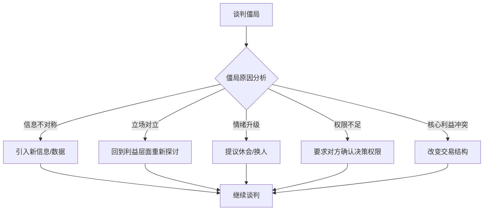

- **引入新信息**：分享之前未提及的数据、市场变化、技术进展等
- **回到利益层**：问"您最关心的是什么？"将讨论从立场拉回到利益
- **休会冷却**：当情绪升温时，提议休息15-30分钟
- **升维或降维**：引入更高层级的决策者，或将大议题拆分为小议题
- **改变结构**：调整合同条款、付款方式、交付模式等结构性条件

**策略五：应对对方的谈判"诡计"**

谈判中，对方可能使用一些不道德或操纵性的策略。识别这些策略并有效应对，是高级谈判者的必备技能。

| 对方策略 | 识别信号 | 应对方法 |
|---------|---------|---------|
| 最后通牒 | "这是我们最终报价，不接受就拉倒" | 不要恐慌。质疑其合理性："我理解这是您的立场，能否解释一下这个价格的依据？"同时展示你的BATNA |
| 好警察坏警察 | 一人唱红脸一人唱白脸 | 直接点破（幽默地）："我感觉你们一个唱红脸一个唱白脸"——策略一旦被识破就失效 |
| 低球策略 | 先报极低价吸引你，后续加码 | 坚持"总体成本"评估："我们评估的是总拥有成本，包括XX、XX和XX" |
| 拖延战术 | 反复推迟决定，消耗你的耐心 | 设定截止日期："我们理解需要时间评估，但这个报价有效期到X月X日" |
| 情绪施压 | 发脾气、摔门、大声争论 | 保持冷静，降低音量："我理解这很重要，我们冷静下来讨论会更有效" |
| 蚕食策略 | 大框架达成后不断追加小要求 | 开始就明确"包含内容清单"，超出范围的单独讨论 |
| 信息操纵 | 提供虚假或误导性数据 | 坚持验证："这个数据很有参考价值，能否提供来源？我们也会做交叉验证" |

> **核心原则**：不要以牙还牙。当对方使用不道德策略时，最好的回应是：识别它、命名它、回到事实和原则上来。"我注意到我们在用不同的方式讨论这个问题，不如我们回到双方的核心需求上看看？"

**实战案例：一次供应商价格谈判的完整复盘**

背景：某制造企业需要采购一批关键零部件，年采购额约800万元。
供应商A是现有合作方，供应商B和C是备选。

准备阶段：
  - 己方BATNA：供应商B的报价比A低5%，但交付周期长2周
  - 对方BATNA：A方也面临订单压力，失去这个客户会影响其产能利用率
  - ZOPA分析：己方底线800万（现有价格），理想目标720万（降10%）
                A方底线约720万（成本线），理想850万

谈判过程：
  第1轮：A方报价850万（涨价6%），理由是原材料上涨
  → 己方应对：用客观标准（行业价格指数显示原材料仅涨3%）
     重新设定锚点，报价720万
  → 结果：双方暂定在780万附近

  第2轮：僵局——A方坚持不低于790万
  → 己方策略：引入利益交换（Logrolling）
     "如果价格能降到770万，我们可以：
      ① 将合同期从1年延长到2年（A方在意的稳定性）
      ② 将付款周期从60天缩短到30天（A方的现金流需求）
      ③ 提前锁定下季度订单量（A方的产能规划需求）"
  → 结果：A方同意775万+2年合同+30天付款

  第3轮：收尾确认
  → 逐条确认谈判结果，会后24小时发出书面确认函
  → 合同中加入价格调整条款（原材料涨幅超5%时双方各承担50%）

最终结果：
  - 价格从850万→775万（降低8.8%，节省75万/年）
  - 合同期从1年→2年（A方获得稳定性）
  - 付款周期从60天→30天（A方改善现金流）
  - 双方都觉得自己"赢了"——这就是利益交换的力量

复盘要点：
  - 锚定策略成功：用行业数据反驳了A方的涨价理由
  - 利益交换是突破僵局的关键：找到了A方在意的非价格条件
  - 客观标准（行业价格指数）比"我觉得贵"更有说服力
  - 书面确认避免了后续扯皮

### 4. 谈判中的沟通技巧

**倾听的艺术：**

谈判中，说得越少，知道得越多。优秀的谈判者用 70% 的时间倾听，30% 的时间说话。

三层倾听法：

第一层：听事实
  对方说了什么具体的信息、数据、要求？
  例："我们的预算上限是200万。"

第二层：听情绪
  对方的情绪状态是什么？急切、犹豫、不满、焦虑？
  例：对方反复强调"时间很紧"→ 说明交付时间是痛点

第三层：听利益
  对方的真正需求是什么？立场背后的利益是什么？
  例：对方坚持"必须30天付款"→ 可能是现金流压力，
  而非原则性问题 → 可以讨论分期付款方案

**提问的技巧：**

| 提问类型 | 示例 | 用途 |
|---------|------|------|
| 开放式提问 | "您对这个方案有什么看法？" | 获取信息，了解对方想法 |
| 探究式提问 | "您能详细说说为什么这个条件很重要吗？" | 深入了解对方利益 |
| 假设式提问 | "如果我们能在价格上让步5%，您能否在交付时间上配合？" | 试探对方的让步空间 |
| 引导式提问 | "您是否同意，质量比价格更重要？" | 引导对方接受你的逻辑 |
| 确认式提问 | "所以您的意思是，如果X，那么Y？" | 确认理解，避免误解 |
| 打包式提问 | "除了价格之外，还有哪些方面您希望调整？" | 发现更多交换空间 |

**表达立场的框架——XYZ陈述法：**

"当你做了X的时候（客观事实），
 我感到Y（你的感受/影响），
 我希望Z（具体期望）。"

示例：
"当交付时间从合同约定的30天推迟到45天时，
我们的生产线被迫停工2周，造成约50万元的损失。
我们希望贵方能提供一个明确的补偿方案。"

### 5. 谈判的收尾与后续

谈判不是"签了字就结束了"。好的收尾能巩固成果，坏的收尾可能让之前的成果付之东流。

谈判收尾的检查清单：

□ 总结确认
  "让我确认一下我们达成的共识：[逐条列出]"
  → 口头确认后，会后24小时内发出书面总结

□ 处理"赢家的遗憾"
  对方可能会在签字后感到"亏了"
  → 在总结中强调双赢面："这个方案对双方来说都解决了XX问题"

□ 文字化
  所有口头承诺必须书面化
  → 合同/协议/会议纪要/邮件确认
  → 关键条款不能有歧义

□ 关系维护
  谈判结束后的第一周，主动联系对方
  → 确认执行进展、表达合作意愿
  → 建立长期关系而非一次性交易

□ 复盘
  谈判团队内部复盘
  → 哪些策略有效？哪些可以改进？
  → 对方的风格和偏好是什么？（为下次谈判积累情报）

---

## 六、跨部门协作技巧

跨部门协作是组织效率的最大瓶颈之一。根据 PMI（项目管理协会）的调查，跨部门项目中约 30% 的时间浪费在沟通协调上，其中最常见的问题是目标冲突、信息不对称和责任模糊。

### 1. 跨部门协作的三大障碍

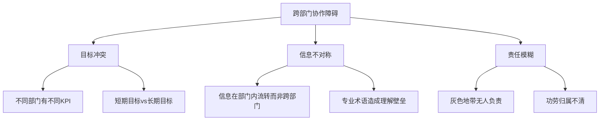

**障碍一：目标冲突。** 销售部追求营收增长（不惜打折促销），产品部追求用户体验（不愿过度商业化），技术部追求系统稳定性（不愿频繁上线）——三个部门各有各的道理，但放在一起就是互相打架。本质原因是各部门KPI之间没有联动。

**障碍二：信息不对称。** 每个部门都知道自己领域的"全貌"，但只看到其他部门的"冰山一角"。技术部不知道业务部面临的具体压力，业务部不知道技术部正在处理的技术债。更糟的是，各部门内部使用大量"行话"，让跨部门沟通变得更难。

**障碍三：责任模糊。** "灰色地带"——那些不明确属于哪个部门的事项，往往成为推诿的温床。更微妙的是"功劳归属"问题：项目成功了，谁来领功？如果功劳归了一方，下次另一方就不会积极配合。

### 2. 建立跨部门关系的策略

**策略一：主动投资关系**

跨部门关系不能等到需要协作时才建立。平时的关系投资决定了关键时刻的协作效率。

日常关系投资清单：

每周：
  □ 与其他部门的对接人进行一次非正式交流（午餐、茶歇）
  □ 主动分享一条对对方有价值的信息

每月：
  □ 参加一次跨部门的分享会或活动
  □ 了解其他部门当前的重点工作和挑战

每季度：
  □ 与其他部门负责人进行一次1对1沟通
  □ 主动提供一次帮助或支持

**策略二：翻译"部门语言"**

每个部门都有自己的"方言"——术语、缩写、关注点。跨部门沟通的关键是用对方能理解的语言。

"翻译"示例：

技术人员 → 业务人员：
  ❌ "API接口的响应延迟超过了SLA的P99指标"
  ✅ "系统在高峰期的响应速度可能让用户多等2-3秒"

业务人员 → 财务人员：
  ❌ "这个项目能帮我们占领市场"
  ✅ "这个项目预计12个月内收回投资，ROI约35%"

市场人员 → 技术人员：
  ❌ "我们需要一个更有温度的产品体验"
  ✅ "用户在注册流程的第3步流失率达到40%，
      希望能简化填写字段，从12个减到5个"

技术人员 → 高管：
  ❌ "我们需要重构微服务架构"
  ✅ "当前系统架构已经限制了业务增长速度，
      重构后预计支撑3倍的业务量，投入约3个月。"

> **翻译的核心公式**：用对方关注的指标重新表述你的诉求。技术人员关注技术指标，业务人员关注营收/用户数，财务人员关注成本/ROI，高管关注战略价值。同一件事，对不同人讲不同的"翻译版本"。

**策略三：建立共同目标**

当各部门有独立的KPI时，需要找到一个"超级目标"将大家绑定在一起。

建立共同目标的框架：

第一步：识别各部门的独立目标
  销售部：完成500万营收
  产品部：上线3个新功能
  技术部：系统可用性达99.9%

第二步：找到交叉点
  共同目标：Q3新产品的成功上市
  - 销售部的500万营收依赖新产品
  - 产品部的3个新功能是新产品核心
  - 技术部的系统稳定性是新产品基础

第三步：建立共享指标
  新产品首月营收100万（销售+产品+技术共同承担）
  新产品首月用户满意度>4.5分（产品+技术共同承担）

### 3. 跨部门项目的协作框架

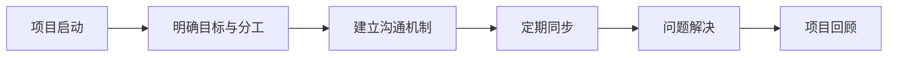

**项目启动会的关键议程：**

跨部门项目启动会议程（建议1-2小时）

1. 项目背景与目标（10分钟）
   - 为什么做这个项目？
   - 成功标准是什么？

2. 各部门角色与职责（20分钟）
   - RACI矩阵确认：
     R=执行者  A=负责人  C=被咨询者  I=被通知者
   
   任务        | 销售 | 产品 | 技术 | 财务
   需求收集     |  A   |  R   |  C   |  I
   方案设计     |  C   |  R   |  A   |  I
   开发实施     |  I   |  C   |  A   |  I
   测试验收     |  C   |  A   |  R   |  I
   上线发布     |  A   |  R   |  R   |  I

3. 沟通机制（10分钟）
   - 周会：每周一10:00，30分钟
   - 日报：每日17:00前在群内同步
   - 问题升级：超24小时未解决的问题升级至项目发起人

4. 风险识别（15分钟）
   - 各部门列出当前的已知风险
   - 每个风险指定负责人

5. Q&A（剩余时间）

> **RACI矩阵的常见陷阱**：(1) 每行有且只有一个A（不能有两个负责人，也不能没有负责人）；(2) R和A可以是同一人，但最佳实践是分开（执行者和审批者分离）；(3) I不要太多——通知太多等于没人看；(4) 定期更新RACI，项目不同阶段的分工可能变化。

### 4. 处理跨部门冲突

跨部门冲突的根源通常不是个人恩怨，而是结构性问题——资源竞争、目标差异、流程缺陷。

跨部门冲突处理四步法：

第一步：定义问题（对事不对人）
  ❌ "你们技术部总是拖延！"
  ✅ "项目比计划延期了2周，导致市场推广时间被压缩。
      我们需要一起找到解决方案。"

第二步：理解对方的约束
  技术部延期的真正原因是什么？
  - 人手不足？→ 能否从其他项目调配或外包？
  - 需求变更？→ 以后如何减少变更？
  - 技术难点？→ 能否调整方案降低复杂度？

第三步：寻找双赢方案
  - 缩减功能范围，确保核心功能按时上线
  - 分阶段交付：先上线MVP，再迭代完善
  - 市场部先做预热，产品稍晚上线

第四步：建立预防机制
  - 项目计划中预留buffer（建议15-20%）
  - 需求变更需走正式评审流程
  - 关键节点设置里程碑检查

**心理安全感在跨部门协作中的作用：**

谷歌"亚里士多德项目"（Project Aristotle）的研究表明，高绩效团队最重要的特征是**心理安全感**——成员可以放心地提出不同意见、承认错误、寻求帮助。跨部门协作中，心理安全感更加关键：如果你怕"说出来会得罪别的部门"，问题就会被隐藏直到无法挽回。

如何建立跨部门的心理安全感：
- 项目启动时明确"我们可以坦诚讨论任何问题"
- 领导者率先承认自己的不确定性（"这个方案我也不是100%确定，大家怎么看？"）
- 对提出问题的人表示感谢而非惩罚
- 将"复盘会"的重点放在流程改进而非追责上

---

## 七、向上管理技巧

向上管理不是"拍马屁"或"政治手腕"，而是与上级建立高效的工作关系，帮助上级成功的同时也实现自己的职业目标。彼得·德鲁克说过："你不必喜欢或崇拜你的上司，但你必须管理他，让他成为你达成目标、取得成就的资源。"

### 1. 理解你的上级

向上管理的第一步是深入理解上级的工作风格、目标和压力。

**上级画像分析框架：**

一、沟通偏好
  □ 信息接收方式：□ 书面报告 □ 口头汇报 □ 数据图表
  □ 沟通频率偏好：□ 每天 □ 每周 □ 有事才汇报
  □ 细节程度：□ 要看所有细节 □ 只看结论和关键数据
  □ 沟通时间偏好：□ 早上 □ 下午 □ 不固定

二、决策风格
  □ 速度：□ 快速决策 □ 需要时间思考 □ 需要多人意见
  □ 风险态度：□ 保守稳健 □ 适度冒险 □ 积极进取
  □ 信息需求：□ 要大量数据支撑 □ 信任直觉和经验
  □ 决策方式：□ 独立决策 □ 征求意见后决策 □ 集体决策

三、工作关注点
  □ 最关心的KPI是什么？
  □ 当前面临的最大压力/挑战是什么？
  □ 上级的上级对TA的期望是什么？
  □ TA在组织中的政治处境如何？

四、个人风格
  □ 是任务导向还是关系导向？
  □ 是宏观思维还是注重细节？
  □ 喜欢什么样的下属？主动型还是执行型？
  □ 有哪些沟通禁忌/雷区？

> **一个容易被忽视的维度**：你的上级也有上级。理解"你的上级面临的压力"比"你的上级喜欢什么"更重要。如果上级的上级正在追问XX指标，你就应该在汇报中优先展示这个指标的进展——这不只是"拍马屁"，而是帮助组织信息高效流动。

### 2. 汇报工作的金字塔法则

向上汇报是向上管理最核心的场景。上级的时间是最稀缺的资源，你的汇报必须在最短时间内传递最大价值。

**金字塔汇报结构：**

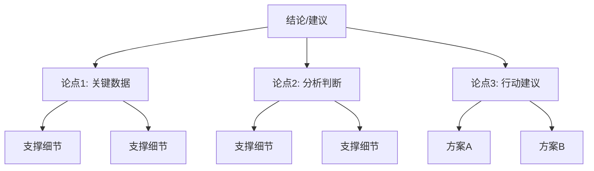

**汇报的五种场景及模板：**

**场景一：请求决策**
框架：结论 → 选项 → 建议 → 理由 → 请求

"王总，关于XX项目的供应商选择，建议选择供应商A。

我评估了三个方案：
- 供应商A：价格中等，质量最高，交付准时率95%
- 供应商B：价格最低，质量一般，交付准时率80%
- 供应商C：价格最高，质量高，交付准时率90%

选A的原因：质量是我们的核心要求，且A的综合性价比最优。
请您确认，我今天就可以启动合同流程。"

**场景二：汇报进展**
框架：结果 → 关键进展 → 风险 → 需要的支持

"王总，本周项目进展顺利，核心指标达成：
- 用户增长15%，超出预期的10%
- 系统稳定运行，零故障

有一个风险需要您关注：
- 第三方数据接口下周可能调整，技术部已准备了
  备用方案，但需要额外2万元预算。

需要您的支持：确认是否批准这笔预算。"

**场景三：汇报问题**
框架：问题 → 影响 → 原因 → 解决方案 → 需要的资源

"王总，有个问题需要同步：XX项目可能延期1周。
原因是XX供应商的原材料交付延迟了3天。

影响：上线时间从7月15日推迟到7月22日，
对市场推广计划的影响可控（已通知市场部调整排期）。

解决方案：我已经和供应商确认了加急方案，
但需要多付5000元运费。您看是否可以批准？"

**场景四：提出建议**
框架：机会/问题 → 建议 → 预期收益 → 风险 → 行动计划

"王总，我发现一个提升用户留存的机会。
数据显示用户在注册后第3天的流失率高达40%。

建议在第2天增加一条推送提醒，引导用户完成核心操作。
预期收益：留存率提升5-8%，相当于每月多保留约2000名用户。
风险：推送频率增加可能引起部分用户反感，
可通过A/B测试控制。
行动计划：下周完成方案设计，下下周上线测试。"

**场景五：接受任务后的确认**
框架：确认理解 → 拆解任务 → 明确资源 → 确认时间

"王总，确认一下我对这个任务的理解：
目标是在7月底前完成XX系统的升级，
核心指标是将处理速度提升50%。

我会拆解为三个阶段：
1. 方案设计（本周完成）
2. 开发实施（7月15日前完成）
3. 测试上线（7月25日前完成）

需要的资源：2名后端工程师+1名测试工程师，
以及XX部门在接口方面的配合。
整体计划我明天发邮件给您确认。"

### 3. 管理上级期望的技巧

**期望校准的三个关键时点：**

| 时点 | 做什么 | 为什么重要 |
|------|--------|-----------|
| 接受任务时 | 确认目标、标准、时间、资源 | 避免理解偏差导致返工 |
| 执行过程中 | 定期同步进展和风险 | 让上级有掌控感，及时调整方向 |
| 完成交付时 | 确认是否达到期望 | 及时弥补差距，积累信任 |

**"承诺少，交付多"原则：**

错误做法：
  评估需要3天 → 告诉上级"3天搞定" → 实际用了4天 → 信任受损

正确做法：
  评估需要3天 → 告诉上级"4-5天完成" → 3天完成 → 信任加分

关键点：
- 留出20-30%的缓冲时间
- 遇到风险提前告知，不要等到截止日才说"来不及"
- 宁可早说做不了，也不要答应了做不到

### 4. 与不同类型上级的相处之道

| 上级类型 | 特征 | 沟通策略 | 注意事项 |
|---------|------|---------|---------|
| 细节型 | 关注每个细节，经常追问 | 主动提供详细数据，事事有回应 | 不要嫌烦，TA的细节追问可能发现了你忽略的问题 |
| 放手型 | 给方向不给细节，信任下属 | 主动汇报进展，不要等TA来问 | 放手≠不关心，定期同步防止"惊喜" |
| 急躁型 | 讨厌冗长汇报，要快速结论 | 先说结论，30秒内说清核心 | 准备好详细材料备查，但不要一上来就铺垫 |
| 犹豫型 | 难以决策，反复权衡 | 提供明确建议和对比表，帮TA做决定 | 给予决策的"台阶"（"大多数情况下建议选A"） |
| 微观管理型 | 事事过问，控制欲强 | 先按TA的方式做，逐步用可靠的结果赢得信任 | 不要正面冲突，用"授权请求"而非"反抗" |
| 战略型 | 关注大方向，不关心执行细节 | 用高层视角汇报（趋势、风险、机会），减少细节 | 在TA关注的维度上深入，其他维度一句话带过 |

> **万能法则**：无论上级是什么类型，"不给上级惊喜"是铁律。好消息可以说慢一点，坏消息必须说快一点。上级最怕的不是你犯错，而是"我从别人那里才知道这件事"。

### 5. 向上管理的常见误区

| 误区 | 正确认知 |
|------|---------|
| "上级应该主动了解我的工作" | 主动汇报是你的责任，不是上级的义务 |
| "有问题自己扛，不要给上级添麻烦" | 上级需要知情权，隐藏问题比报告问题更危险 |
| "上级说的就是对的，执行就好" | 适当提出专业意见是你的价值所在 |
| "和上级走得太近是拍马屁" | 建立专业的工作关系不等于拍马屁 |
| "只要把活干好就行" | 干得好+汇报好+关系好=真正的职业成功 |
| "反对上级的意见会被穿小鞋" | 用数据和方案反对，而非用情绪反对；私下提出而非公开对抗 |

---

## 八、向下管理技巧

向下管理的核心是"通过他人完成任务"。你不再是个人贡献者，而是团队的赋能者。你的成功不再取决于你自己的产出，而取决于你团队的整体产出。

### 1. 有效授权——管理者的首要能力

**授权的决策矩阵：**

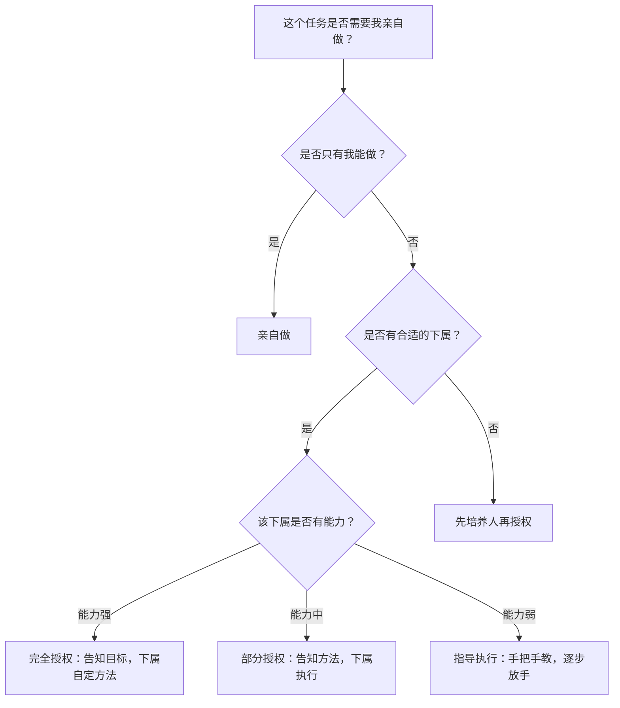

**授权的七个级别（由低到高）：**

| 级别 | 描述 | 适用场景 |
|------|------|---------|
| 1 | "去调查一下，回来告诉我所有情况" | 初步了解阶段 |
| 2 | "调查一下，告诉我有哪些选择" | 信息收集阶段 |
| 3 | "调查一下，给我一个建议" | 方案推荐阶段 |
| 4 | "给我一个方案，我批准后你执行" | 需要审批的方案 |
| 5 | "给我一个方案，如果我不反对，你就执行" | 默认授权 |
| 6 | "去做吧，事后告诉我结果" | 成熟下属执行常规任务 |
| 7 | "去做吧，不用汇报" | 完全信任，高度授权 |

**授权的常见错误：**

- **假授权**：名义上授权，实际上事事过问、处处干预
- **弃权**：授权后完全不管，不做检查不给反馈
- **错授**：把超出下属能力的任务授权出去，导致失败
- **只授责不授权**：给了责任但没给相应的权力和资源

### 2. 一对一会议（1-on-1）——管理者的最强工具

一对一会议是向下管理中最被低估的沟通机制。安迪·格鲁夫（英特尔前CEO）说："一对一会议是管理者最重要的管理工具。"

一对一会议框架（建议30-60分钟，每1-2周一次）

议程模板：
1. 下属主导（前15-20分钟）
   - "你最近在忙什么？有什么想聊的？"
   - "有什么困难或障碍需要我帮忙的？"
   - "对团队/项目/公司有什么想法？"

2. 管理者主导（中间10-20分钟）
   - 同步组织/团队层面的最新信息
   - 给予具体的反馈（正面和建设性）
   - 讨论发展计划和成长目标

3. 行动项确认（最后5分钟）
   - 双方各有什么行动项？
   - 下次一对一的时间？

注意事项：
  ✅ 保持私密性——不要在开放区域进行
  ✅ 以对方为重心——你的角色是倾听和辅导
  ✅ 不要把它变成"任务检查会"
  ✅ 记录关键承诺，下次回顾
  ✅ 不要轻易取消——取消1-on-1等于告诉下属"你不重要"

> **一对一会议的真正价值**：不是汇报进度（进度可以用邮件/看板同步），而是建立信任、发现隐患、辅导成长。很多团队的致命问题，都是在一对一中被早期发现的——如果管理者不做一对一，这些问题就会积累到爆发。

### 3. 激励下属——从"推"到"拉"

**赫茨伯格双因素理论的应用：**

保健因素（必须做到，否则不满）：
  ✅ 合理的薪酬
  ✅ 良好的工作环境
  ✅ 公平的制度流程
  ✅ 合理的工作量
  ✅ 清晰的职责边界
  
  → 做好了不会带来满意，但做不到一定会导致不满

激励因素（做到能带来真正的满意和动力）：
  ⭐ 成就感：让下属看到自己工作的成果和影响
  ⭐ 认可：及时、具体、真诚地表扬
  ⭐ 成长：提供学习和晋升的机会
  ⭐ 自主权：给予适当的决策权
  ⭐ 意义感：让下属理解工作的价值和意义

**个性化激励方案：**

不同类型的下属需要不同的激励方式。一刀切的激励是低效的。

下属类型与激励方式对照：

成就驱动型：
  特征：追求卓越，喜欢挑战
  激励：给有挑战性的任务、公开认可成绩、提供晋升通道
  
关系驱动型：
  特征：重视团队氛围，喜欢协作
  激励：营造良好的团队氛围、提供协作机会、给予情感认可

安全驱动型：
  特征：求稳，不喜欢变化和风险
  激励：提供稳定的工作环境、清晰的规则、可预期的发展路径

成长驱动型：
  特征：渴望学习新技能，关注个人发展
  激励：提供培训机会、轮岗机会、导师指导、新领域的探索机会

### 4. 给予反馈——管理者最被低估的技能

**正面反馈的SBI模型：**

S（Situation）：情境 — 在什么情况下
B（Behavior）：行为 — 你做了什么
I（Impact）：影响 — 带来了什么结果

示例：
"在上周的客户提案中（S），
你主动准备了竞品对比分析报告（B），
这让客户对我们的方案更有信心，当场签了意向书（I）。
做得非常好，继续保持！"

**负面反馈的SBI-I模型（加一个I：期望）：**

S（Situation）：情境
B（Behavior）：行为
I（Impact）：影响
I（Invitation/Intention）：期望/改进方向

示例：
"在昨天的项目评审会上（S），
你的演示文稿中有3处数据引用错误（B），
这让技术部的同事对报告的准确性产生了质疑（I）。

以后在提交演示文稿前，建议做一次交叉校验，
特别是数据类的内容。你对此有什么想法？（I）"

**反馈的黄金时间窗口：**

正面反馈：越快越好，最好在行为发生后24小时内
  → 延迟的正面反馈会失去激励效果

负面反馈：
  - 小问题：当天内私下反馈
  - 重大问题：先冷静24小时，确保情绪平稳后再谈
  - 永远不要在公开场合批评下属

**反馈的常见陷阱：**

| 陷阱 | 表现 | 正确做法 |
|------|------|---------|
| 三明治反馈 | 表扬→批评→表扬（对方只记得表扬，或者识破你的"套路"） | 正面和负面分开谈，各自完整 |
| 模糊反馈 | "你做得不错""还需要改进" | 具体到行为和数据："你在XX环节做了XX，导致了XX" |
| 秋后算账 | 平时不说，绩效评估时一次性说一堆 | 日常及时反馈，绩效评估不应有"意外" |
| 对人不对事 | "你这个人就是不细心" | "这份报告的第3页有两处数据错误" |
| 当众批评 | 在会议上点名批评 | 私下反馈，公开表扬 |

### 5. 处理困难对话

管理者需要处理的困难对话包括：绩效改进谈话、薪资谈判、裁员谈话、冲突调解等。

**困难对话的PREP框架：**

P（Purpose）：明确目的
  "今天和你聊一下关于XX的问题，目的是找到改进的方向。"

R（Reality）：摆出事实
  "最近3个月，你的代码返工率从5%上升到了15%，
   有2个项目因为质量问题延期。"

E（Explore）：探讨原因
  "我想了解，是什么导致了这个变化？
   是工作量太大？还是遇到了什么困难？"

P（Plan）：制定计划
  "我们一起制定一个改进计划：
   1. 每周和我做一次代码审查
   2. 参加下周的XX技术培训
   3. 一个月后我们再次评估。"

**困难对话的注意事项：**

- 选择私密、安静的场所，避免被打断
- 不要在周五下午进行（对方带着负面情绪过周末）
- 准备好事实和数据，不要凭印象和感觉
- 给对方充分的表达机会，不要变成单方面训话
- 结束时明确下一步的行动和时间点
- 如果对方情绪激动，暂停谈话，约定改天再谈

---

## 九、利益相关者沟通技巧

在复杂的组织环境中，一个项目或决策往往涉及多个利益相关者。有效的利益相关者沟通能够减少阻力、争取支持、降低项目风险。

### 1. 利益相关者分析矩阵

**权力-利益矩阵：**

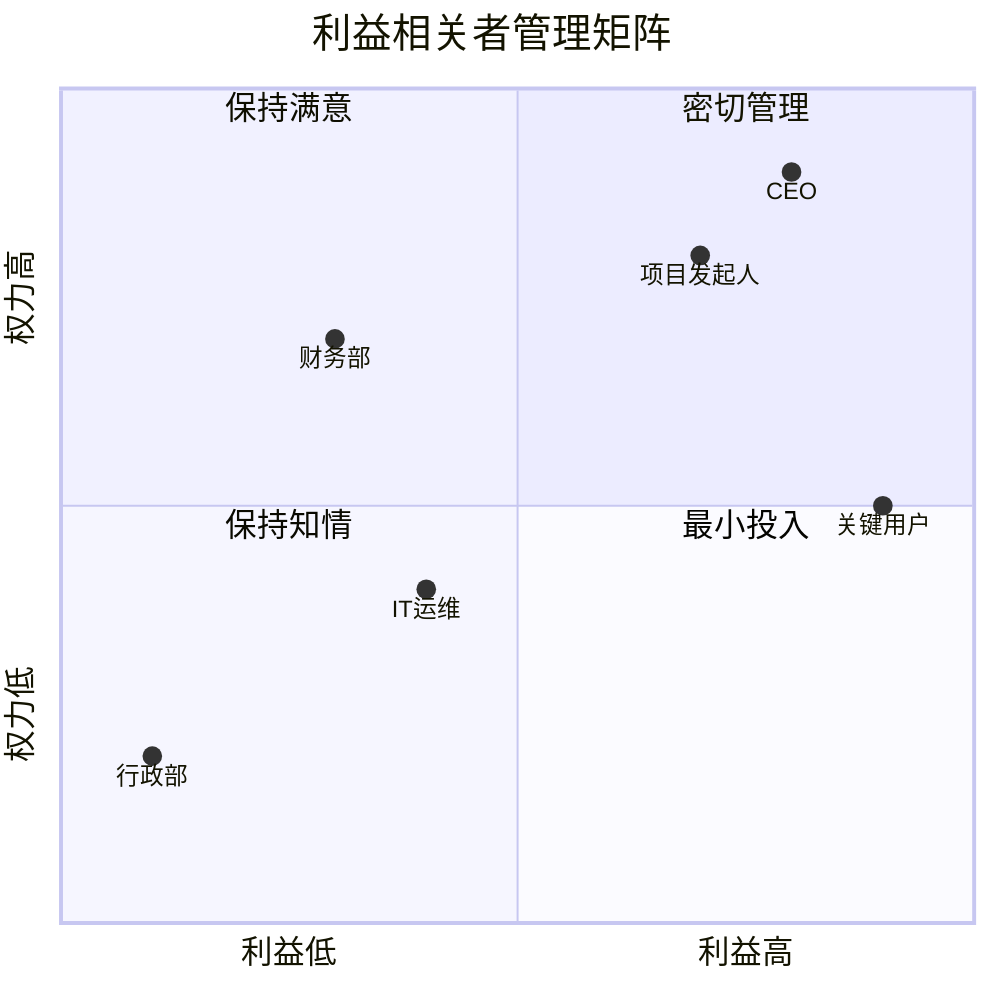

| 象限 | 特征 | 沟通策略 | 沟通频率 |
|------|------|---------|---------|
| 高权力高利益 | 能影响决策，直接利益相关 | 密切管理：定期1对1沟通，深度参与 | 每周 |
| 高权力低利益 | 能影响决策，但不直接参与 | 保持满意：定期汇报，不给意外 | 每两周 |
| 低权力高利益 | 受影响大，但决策权有限 | 保持知情：及时通知，收集反馈 | 每周/按需 |
| 低权力低利益 | 影响小，关注低 | 最小投入：群发通知即可 | 每月/按需 |

> **进阶工具：利益相关者显著性模型（Salience Model）**。除了权力和利益，还可以加入第三个维度"紧迫性"（Urgency）。同时具有权力、利益和紧迫性的利益相关者是"确定型"（Definitive），需要最高优先级关注。只有权力但无利益和紧迫性的是"休眠型"（Dormant），暂时不需投入但不可忽视。

### 2. 利益相关者的沟通策略

**对支持者——巩固和利用：**

目标：保持热情，让他们成为你的"代言人"
策略：
  - 定期同步进展，让他们感到被尊重
  - 邀请他们在关键场合发言支持
  - 给予可见的角色和贡献
  - 及时表达感谢和认可
话术：
  "张总一直非常支持这个项目，他在XX方面有丰富的经验，
   让他来介绍一下这个方案的背景……"

**对中立者——争取转化：**

目标：了解顾虑，争取支持
策略：
  - 1对1沟通，了解他们的真实想法
  - 针对性地提供信息和数据
  - 找到与他们利益相关的切入点
  - 邀请他们参与方案设计，增加"主人翁感"
话术：
  "我知道您对这个项目有一些顾虑，我很想听听您的想法。
   这个项目如果成功，对您部门的XX指标也会有帮助……"

**对反对者——化解阻力：**

目标：理解反对原因，化解或中和阻力
策略：
  - 先倾听，不要急于反驳
  - 理解反对的真正原因（利益受损？信息不足？历史矛盾？）
  - 如果反对有道理，纳入方案改进
  - 如果是误解，用数据和事实澄清
  - 如果是利益冲突，寻找补偿方案
  - 如果无法转化，最小化其影响力
话术：
  "我理解您的担忧，这确实是一个需要认真对待的问题。
   您提到的XX点很有道理，我们可以在方案中加入XX措施
   来缓解这个风险。您觉得这样是否可行？"

**对"隐形"利益相关者——主动识别：**

容易被忽视的利益相关者：
- IT/运维：他们负责系统落地，不提前沟通可能导致技术方案不可行
- 法务/合规：合同和流程可能涉及合规问题
- HR：涉及人员调整或组织变化时必须提前沟通
- 财务：预算审批和成本核算需要提前介入
- 终端用户/客户：他们的声音往往被"代言人"过滤
- 离职员工/前团队：他们带走的隐性知识可能影响项目

识别方法：
- 问自己："这个项目如果失败，最可能的原因是什么？"
- 然后问："谁能导致这个原因发生？"
- 那个人就是你需要管理的利益相关者

### 3. 利益相关者沟通计划模板

利益相关者沟通计划

项目名称：________
制定日期：________

一、利益相关者清单
| 姓名/部门 | 角色 | 权力 | 利益 | 态度 | 象限 |
|-----------|------|------|------|------|------|
| 张总 | 项目发起人 | 高 | 高 | 支持 | 密切管理 |
| 李经理 | 技术负责人 | 中 | 高 | 中立 | 保持知情 |
| 财务部 | 预算审批 | 高 | 低 | 谨慎 | 保持满意 |
| 终端用户 | 使用者 | 低 | 高 | 未知 | 保持知情 |

二、沟通策略
| 对象 | 沟通方式 | 频率 | 负责人 | 关键信息 |
|------|---------|------|--------|---------|
| 张总 | 1对1会议 | 每周 | PM | 进展+风险+需要的支持 |
| 李经理 | 项目群+周会 | 每周 | PM | 技术方案+进度 |
| 财务部 | 月度报告 | 每月 | PM | 预算执行+ROI |
| 终端用户 | 产品简报 | 双周 | 产品经理 | 功能更新+使用指南 |

三、关键沟通事件
| 时间 | 事件 | 对象 | 目的 |
|------|------|------|------|
| 项目启动 | 启动会 | 全体 | 对齐目标和分工 |
| 每月末 | 月度汇报 | 管理层 | 展示进展和价值 |
| 里程碑节点 | 阶段评审 | 核心成员 | 确认方向和调整 |
| 项目结束 | 复盘会 | 全体 | 总结经验和改进 |

---

## 十、冲突调解技巧

冲突是组织中不可避免的现象。根据CPP Global的调查，美国员工平均每周花2.8小时处理冲突。冲突本身不是坏事——建设性的冲突能带来更好的决策和创新；但破坏性的冲突会消耗团队能量、损害关系、降低效率。关键在于如何将破坏性冲突转化为建设性对话。

### 1. 冲突的类型与根源

```mermaid
graph TD
    A[冲突类型] --> B[任务冲突]
    A --> C[关系冲突]
    A --> D[流程冲突]
    B --> B1[对"做什么"的分歧]
    C --> C1[人际间的摩擦和敌意]
    D --> D1[对"怎么做"的分歧]
    B --> B2[建设性：可带来更好方案]
    C --> C2[破坏性：损害信任和合作]
    D --> D2[中性：可通过制度解决]
```

| 冲突类型 | 表现 | 根源 | 处理方向 |
|---------|------|------|---------|
| 任务冲突 | 对方案、目标、优先级的分歧 | 信息不对称、价值观差异 | 用数据和讨论解决 |
| 关系冲突 | 人身攻击、背后议论、冷暴力 | 信任缺失、历史积怨、性格不合 | 先修复关系再解决问题 |
| 流程冲突 | 对分工、权限、流程的分歧 | 制度不清、权责不明 | 用制度和流程解决 |
| 资源冲突 | 对预算、人力、时间的争夺 | 资源有限、分配不均 | 用优先级和交换解决 |

### 2. 冲突调解的五步法

第一步：冷静期
  - 当事人情绪激动时，不急于调解
  - 给各方15-30分钟的冷静时间
  - 如果冲突严重，推迟到第二天

第二步：分别倾听
  - 单独与每一方交谈
  - 使用"积极倾听"技巧：
    * 复述对方的观点（"你的意思是……"）
    * 确认对方的感受（"你觉得很不公平"）
    * 不做评判，不站队
  - 了解每一方的核心诉求和底线

第三步：定义共同问题
  - 将各方的诉求转化为共同的问题
  - ❌ "你们俩谁对谁错"
  - ✅ "我们需要找到一个方案，既满足XX的需求，又不影响YY的工作"

第四步：寻找解决方案
  - 引导各方提出方案（而非调解者给方案）
  - 评估每个方案对各方的影响
  - 寻找双赢或至少"双方都能接受"的方案
  - 必要时引入客观标准（制度、数据、第三方意见）

第五步：达成协议并跟进
  - 明确写出协议内容（谁、什么时候、做什么）
  - 各方签字确认
  - 安排后续跟进（1-2周后检查执行情况）
  - 预防类似冲突再次发生的机制

### 3. 作为调解者的沟通技巧

调解者的"六要六不要"：

六要：
  ✅ 要保持中立——不偏袒任何一方
  ✅ 要积极倾听——让每方感到被理解
  ✅ 要聚焦利益——而非立场
  ✅ 要引导思考——"你觉得怎样才能解决？"
  ✅ 要确认共识——"你们是否同意XX？"
  ✅ 要书面记录——口头协议容易被遗忘

六不要：
  ❌ 不要急于评判谁对谁错
  ❌ 不要替当事人做决定
  ❌ 不要公开讨论各方的私下表态
  ❌ 不要忽视情绪——情绪不处理，问题解决不了
  ❌ 不要追求"完美的公平"——有时候"双方都不满意"恰好是公平的
  ❌ 不要一次解决所有问题——分步骤、逐个击破

### 4. 自己卷入冲突时的处理

当你自己是冲突的一方时，处理方式需要调整：

当你是冲突当事人时：

第一步：自我觉察
  - 我现在的情绪是什么？愤怒？委屈？焦虑？
  - 我的核心诉求是什么？（区分"想要"和"需要"）
  - 对方可能的感受和诉求是什么？

第二步：选择沟通方式
  - 小冲突：直接找对方1对1沟通
  - 中等冲突：请一个双方都信任的第三方在场
  - 严重冲突：通过正式渠道（HR/上级）调解

第三步：使用"我"陈述而非"你"陈述
  ❌ "你总是不配合我的工作！"（指责）
  ✅ "当项目进度受影响时，我感到很焦虑。
      我希望能找到一个让我们的工作更好地配合的方式。"（表达感受+诉求）

第四步：寻求解决方案而非追究责任
  ❌ "上次就是你导致的延期！"
  ✅ "不管之前发生了什么，我们一起想想接下来怎么做能赶上进度。"

---

## 十一、会议主持技巧

会议是组织中最大的时间消耗之一。据 Atlassian 研究，普通员工每周花 31 小时在会议上，其中约 50% 被认为是浪费时间。高效主持会议是一项核心管理技能。

### 1. 会前——决定会议成败的关键

**会议必要性检查（开会前先问自己）：**

这个会议真的有必要吗？

□ 这个议题能否通过邮件/即时消息解决？
□ 这个议题能否通过1对1沟通解决？
□ 我能否在5分钟内向参会者说清会议目的？

如果以上三个问题有任何一个答案是"能"，就不需要开会。

**不同会议类型的特点与最佳实践：**

| 会议类型 | 时长 | 核心目的 | 关键原则 |
|---------|------|---------|---------|
| 站会/日会 | 15分钟 | 同步进展、暴露障碍 | 每人60秒，只说"昨天/今天/阻碍" |
| 周例会 | 30-60分钟 | 复盘进展、调整计划 | 围绕数据和指标，不做深度讨论 |
| 项目评审会 | 60-90分钟 | 评估成果、决策方向 | 提前发材料，会上只讨论争议点 |
| 头脑风暴会 | 60分钟 | 产生创意和方案 | 不批评、追求数量、先发散后收敛 |
| 1对1会议 | 30-60分钟 | 辅导、反馈、建立信任 | 下属主导议程，管理者倾听 |
| 全员大会 | 30-60分钟 | 战略方向、文化传递 | CEO主讲，控制在3个核心信息 |
| 复盘会 | 60-90分钟 | 总结经验教训 | 对事不对人，聚焦流程改进 |
| 决策会 | 30-60分钟 | 对特定事项做出决策 | 明确决策方式，确保有决策权的人在场 |

**高效议程模板：**

会议名称：[名称]
时间：[日期] [时间] - [结束时间]（总计XX分钟）
地点：[会议室/线上链接]
参会者：[名单]
主持人：[姓名]
记录人：[姓名]

议程：
1. 开场与目标说明（2分钟）
   主持人：XX

2. 议题一：[名称]（XX分钟）
   汇报人：XX
   目的：□通知 □讨论 □决策
   背景材料：[链接/附件]

3. 议题二：[名称]（XX分钟）
   汇报人：XX
   目的：□通知 □讨论 □决策
   背景材料：[链接/附件]

4. 讨论与决策（XX分钟）

5. 行动项确认（5分钟）

会前准备：
- 请参会者在会前阅读[材料]
- 请XX准备[数据/报告]

### 2. 会中——引导讨论的艺术

**会议主持的核心法则：**

法则一：准时开始，准时结束
  - 不等迟到者，准时开始
  - 如果议题未讨论完，约定下次会议而非拖延
  - 准时结束是对参会者时间的尊重

法则二：控制发言权
  - 确保每个人都有发言机会（"小王，你对这个问题怎么看？"）
  - 控制"话霸"的发言时间（"谢谢你的观点，我们也听听其他人的想法"）
  - 沉默不代表同意（"大家没有反对意见？有没有什么补充？"）

法则三：保持聚焦
  - 跑题时及时拉回："这个话题很重要，但我们先回到今天的议题，
    可以在会后单独讨论。"
  - 区分"停车场"问题：重要但不在本次讨论范围内的问题记录下来，
    后续跟进

法则四：推动决策
  - 每个议题结束时总结结论
  - 明确决策方式：共识/投票/领导决定
  - 如果无法当场决策，明确下一步和截止时间

**处理会议中的困难行为：**

| 行为 | 处理方式 |
|------|---------|
| 话霸（一个人不停说） | "感谢你的分享，我们来听听XX的看法" |
| 沉默者（从不发言） | "XX，你在这个领域有经验，你怎么看？" |
| 跑题者（偏离主题） | "这个点很好，我们先记下来，会后单独讨论" |
| 负面者（否定一切） | "你提到了风险，那你觉得怎么解决这个问题？" |
| 手机族（一直看手机） | 约定会议规则（手机朝下/静音），以身作则 |
| 权威者（压制讨论） | "感谢张总的意见。在张总的基础上，其他人有什么补充？" |

**会议中的决策方式选择：**

| 决策方式 | 适用场景 | 优点 | 缺点 |
|---------|---------|------|------|
| 共识决策 | 重大事项，需要全员支持 | 买入度高，执行阻力小 | 耗时长，可能折中到平庸 |
| 多数投票 | 选项清晰，分歧不大 | 快速，民主 | 少数派可能不满 |
| 领导决定 | 紧急事项、或团队无法达成一致 | 快速，方向明确 | 可能有执行阻力 |
| 咨询式决策 | 领导有倾向但希望听取意见 | 兼顾效率和参与感 | 要真的听取意见，而非走过场 |

> **关键提醒**：会议开始时就应该明确"这个议题的决策方式是什么"。很多会议浪费时间，就是因为大家不知道这是"讨论收集意见"还是"当场做决定"——两种模式的讨论方式完全不同。

### 3. 线上会议的特殊技巧

远程/混合办公时代，线上会议的质量直接影响团队效率。

线上会议最佳实践：

技术准备（会前5分钟检查）：
  □ 测试摄像头和麦克风
  □ 确认网络连接稳定
  □ 准备好屏幕分享的材料
  □ 关闭无关通知和弹窗

参与规则：
  ✅ 不发言时静音（减少噪音干扰）
  ✅ 发言时打开摄像头（增强信任和注意力）
  ✅ 使用"举手"功能而非直接打断
  ✅ 用聊天窗口补充信息或提问
  ✅ 每10-15分钟做一次互动（提问/投票/快速确认）

主持人额外职责：
  - 更主动地点名邀请发言（线上更难观察谁想说）
  - 更频繁地总结和确认（线上信息丢失率更高）
  - 控制会议时长——线上会议疲劳度更高，建议≤45分钟
  - 会后发送录屏+纪要（弥补线上信息遗漏）

常见线上会议问题及解决：
  问题：参会者"隐身"（不开摄像头、不发言）
  → 解决：会议开始时要求全员开摄像头，轮流发言

  问题：网络卡顿影响讨论
  → 解决：提前发送材料，会上只讨论关键问题；卡顿时切换到语音

  问题：时区差异导致部分人不方便
  → 解决：轮流牺牲，或异步会议（录屏+文字讨论）

### 4. 会后——让会议成果落地

**会议纪要的标准格式：**

会议纪要

会议名称：XX项目周会
时间：2026年6月25日 14:00-15:00
参会人：张三、李四、王五、赵六
缺席人：孙七（已请假）

一、主要讨论内容
  1. 议题一：XX方案评审
     讨论要点：[简要记录]
     结论：通过方案A，否决方案B
     理由：[简要说明]

  2. 议题二：进度风险评估
     讨论要点：[简要记录]
     结论：延期风险可控，但需加强监控

二、决策事项
  D1：采用方案A，由技术部在6月30日前完成实施计划
  D2：增加每周三的进度检查会

三、行动项
  | 编号 | 事项 | 负责人 | 截止日期 | 状态 |
  |------|------|--------|---------|------|
  | A1   | 完成方案A的详细设计 | 张三 | 6/28 | 进行中 |
  | A2   | 协调测试资源 | 李四 | 6/27 | 待开始 |
  | A3   | 更新项目计划 | 王五 | 6/26 | 待开始 |

四、"停车场"问题（本次未讨论，需后续跟进）
  - XX问题待XX确认后下次讨论

五、下次会议
  时间：2026年7月2日 14:00-15:00
  议题：方案A设计评审

发送时间：会后24小时内
发送范围：全体参会人 + 需要知情的相关人员

> **会议纪要的"灵魂"不在记录，在于跟踪。** 写了行动项但没人跟踪，等于没写。建议指定专人负责行动项跟踪，在下次会议开始时先过一遍上次的行动项状态。

---

## 十二、商务演示技巧

商务演示是将你的方案、分析或建议"卖"给听众的过程。一场成功的演示不仅需要好的内容，更需要好的表达——同样的内容，不同的演示方式可能导致截然不同的结果。

### 1. 演示前的准备

**听众分析清单：**

□ 听众是谁？
  - 人数：________
  - 角色构成：决策者（___人）/ 执行者（___人）/ 影响者（___人）
  - 知识水平：□ 专家 □ 了解 □ 不了解

□ 听众关心什么？
  - 他们面临的问题/挑战是什么？
  - 他们最关心的指标是什么？（成本？效率？风险？增长？）
  - 他们对这个议题的预设立场是什么？（支持/反对/中立）

□ 听众的决策标准是什么？
  - 他们需要看到什么才会"买单"？
  - 他们的决策流程是什么？
  - 谁是最终决策者？

**演示结构的金字塔设计：**

        ┌─────────────────┐
        │  一句话核心结论   │  ← 第1分钟说出
        └────────┬────────┘
     ┌───────────┼───────────┐
  ┌──┴──┐    ┌──┴──┐    ┌──┴──┐
  │论点1│    │论点2│    │论点3│  ← 每个论点3-5分钟
  └──┬──┘    └──┬──┘    └──┬──┘
  ┌──┴──┐    ┌──┴──┐    ┌──┴──┐
  │数据/ │    │数据/ │    │数据/ │  ← 支撑论点
  │案例 │    │案例 │    │案例 │
  └─────┘    └─────┘    └─────┘
        ┌─────────────────┐
        │ 行动建议+下一步  │  ← 最后2分钟
        └─────────────────┘

### 2. 演示中的表达技巧

**开场的三种方式：**

方式一：问题切入
  "在座的各位，你们知道用户注册流程的流失率是多少吗？
   答案是60%。这意味着每10个有意愿的用户，
   有6个在注册环节就离开了。今天我要分享的方案，
   能将这个数字降到30%以下。"

方式二：故事切入
  "上个月，我接到了一个客户的电话。
   他说：'你们的产品很好，但你们的交付速度让我很为难。'
   这个反馈不是个例。数据显示……"

方式三：数据切入
  "过去6个月，我们的客户获取成本上升了40%，
   但客户终身价值只增长了5%。
   如果不改变这个趋势，12个月后我们的获客成本
   将超过客户终身价值。今天我要提出的方案是……"

**讲故事的STAR框架（适用于商务演示中的案例讲述）：**

S（Situation）：背景 — "去年Q3，我们面临XX问题……"
T（Task）：任务 — "我们的目标是……"
A（Action）：行动 — "我们采取了XX措施……"
R（Result）：结果 — "最终实现了XX成果……"

为什么讲故事比列数据更有效：
- 故事激活大脑的"镜像神经元"，让听众产生代入感
- 数据让人"知道"，故事让人"感受到"
- 好的故事结构：冲突→挣扎→突破，天然吸引注意力
- 一个好案例的说服力 > 10页数据表

**讲解的节奏控制：**

每5-7分钟设置一个"注意力锚点"：
  - 一个数据图表
  - 一个真实案例
  - 一个互动提问
  - 一个切换话题的过渡语

时间分配参考（30分钟演示）：
  开场：3分钟（吸引注意力，说清目的）
  主体：22分钟（3个核心论点，每个7分钟）
  结尾：5分钟（总结+行动建议+Q&A）

**肢体语言和声音控制：**

肢体语言：
  ✅ 目光：在不同区域的听众间移动，每人停留3-5秒
  ✅ 手势：用开放式手势（掌心朝上/展开），避免交叉双臂
  ✅ 站位：面向听众，不要背对屏幕
  ✅ 移动：适当在台上移动，但不要来回踱步

声音控制：
  ✅ 语速：正常语速约150字/分钟，关键信息放慢到120字/分钟
  ✅ 音量：比正常说话稍大，关键句提高音量
  ✅ 停顿：在重要观点前后停顿2-3秒，让信息"落地"
  ✅ 语调：避免全程平淡，通过语调变化传递情绪和重点

**幻灯片设计原则：**

"10-20-30法则"（盖伊·川崎）：
  - 不超过10页核心幻灯片
  - 不超过20分钟演示（留时间给讨论）
  - 不小于24号字体（PPT中实际建议≥20号）

每页幻灯片的黄金法则：
  ✅ 一个页面一个核心信息（不要贪多）
  ✅ 文字≤30个字，其余用图表/图片表达
  ✅ 用数据可视化替代数据罗列（饼图>数字表）
  ✅ 配色统一，不超过3种主色
  ✅ 动画适度——用来引导注意力，不要用来炫技

常见错误：
  ❌ 把Word的内容搬到PPT上
  ❌ 字太小，后排看不清
  ❌ 信息过载，一页塞10个要点
  ❌ 全是文字，没有视觉元素
  ❌ 照着PPT念——PPT应该是提纲，不是讲稿

### 3. 处理提问

**回答问题的PREP框架：**

P（Point）：直接回答
  "是的，我认为我们应该选择方案A。"

R（Reason）：给出理由
  "因为方案A的ROI最高，预计18个月收回投资。"

E（Example）：举例说明
  "同行XX公司去年采用了类似的方案，
   他们的投资回报周期是16个月。"

P（Point）：重申结论
  "所以，方案A是最优选择。"

**应对不会的问题：**

诚实但不示弱：
  ❌ "这个问题我不太清楚"（示弱，失去专业性）
  ✅ "这是一个很好的问题。具体的数据我需要会后核实，
      我在明天下午前给您回复。"（诚实+行动承诺）

将问题引导到自己的优势领域：
  "关于这个技术细节，我会后和团队确认后回复您。
   不过从整体方案的角度来看……"

如果问题带有挑战性：
  "我理解您的疑虑。事实上我们在方案设计时也考虑了
   这个风险，具体措施是……"

**应对不同类型提问者的策略：**

| 提问者类型 | 行为特征 | 应对方法 |
|-----------|---------|---------|
| 细节控 | 追问每个数据的来源和计算方法 | 准备好附录材料，会后单独提供详细数据 |
| 挑战者 | 公开质疑方案的可行性 | 用数据和案例回应，不要情绪化；承认风险同时展示应对方案 |
| 偏题者 | 问与主题无关的问题 | "这个问题很重要，会后我单独和您讨论" |
| 沉默的决策者 | 一直不说话，最后才表态 | 演示中主动与TA互动，"张总，这个方向您觉得如何？" |
| 支持者 | 主动帮你说话 | 感谢但不要过度依赖，保持自己的专业性 |

**演示中的"救场"技巧：**

场景一：设备故障（PPT打不开/投影仪坏了）
  → 不要慌张，先说"看来技术给我们一个机会做个脱稿演示"
  → 用白板画出核心框架，边画边讲
  → 提前在手机/平板上备份一份PPT

场景二：时间被压缩（原定30分钟变成10分钟）
  → 直接跳到结论和行动建议
  → "由于时间关系，我直接说结论和关键数据，
      详细分析会后发给大家"
  → 平时就练习"电梯演讲"版本（3分钟说完核心）

场景三：听众明显不感兴趣（看手机、交头接耳）
  → 抛出一个冲击性数据或问题
  → "在座的各位，如果我告诉你们这个方案能
      每年节省200万，你们还会觉得无聊吗？"
  → 改变讲法：从"我要讲什么"变成"你们关心什么"

场景四：有人中途打断提出反对意见
  → 不要无视，也不要中断自己的节奏
  → "这个观点很有价值，我稍后会专门回应这一点"
  → 在后续内容中自然地回应这个反对意见

---

## 十三、企业文化沟通技巧

企业文化是组织中"看不见的规则"——它不写在制度里，却深刻影响着每个人的行为和沟通方式。理解并适应企业文化，是职场生存和发展的必备技能。

### 1. 解码企业文化

**企业文化的三个层次（沙因模型）：**

表层：人工制品（最容易观察）
  - 办公环境：开放式/封闭式？有没有休闲区？
  - 着装规范：西装革履/商务休闲/随意穿着？
  - 仪式惯例：晨会/周会/团建/年会的形式？
  - 沟通方式：邮件/即时通讯/面对面？

中层：价值观念（需要深入了解）
  - 公司宣称的核心价值观是什么？
  - 实际奖励什么样的行为？
  - 领导者经常强调什么？
  - 什么行为会受到批评或惩罚？

深层：基本假设（最难察觉）
  - 对人性的基本假设：信任还是控制？
  - 对风险的态度：鼓励创新还是规避风险？
  - 对时间的观念：长期主义还是短期导向？
  - 对权力的看法：集中还是分散？

**快速解码企业文化的观察清单：**

入职第一个月，观察以下细节：

□ 决策方式
  - 重大决策是怎么做出的？谁说了算？
  - 中层管理者有多少自主权？
  - 基层员工的意见能否影响决策？

□ 沟通方式
  - 沟通是直接的还是含蓄的？
  - 坏消息是如何传递的？
  - 跨层级沟通是否被鼓励？

□ 对待失败
  - 失败是被惩罚还是被视为学习机会？
  - 员工是否敢于提出不同意见？
  - 创新尝试是否被鼓励？

□ 权力结构
  - 正式的组织架构和实际的权力结构是否一致？
  - 谁是非正式的意见领袖？
  - 信息是如何流动的？通过正式渠道还是非正式网络？

□ 激励机制
  - 什么样的人被提拔？业绩好的还是关系好的？
  - 晋升是公开透明的还是"暗箱操作"？
  - 加班文化是自愿的还是被期望的？

### 2. 在不同文化类型中的沟通策略

| 文化类型 | 核心特征 | 沟通策略 |
|---------|---------|---------|
| 层级型文化 | 等级森严，流程规范 | 尊重层级，通过正式渠道，遵循流程，先请示后行动 |
| 市场型文化 | 结果导向，竞争激烈 | 用数据说话，关注结果而非过程，直接高效 |
| 创新型文化 | 鼓励创新，容忍失败 | 提出创意，接受不确定性，跨边界协作 |
| 家族型文化 | 重视关系，忠诚导向 | 建立关系，展示忠诚，尊重"老人"，融入圈子 |

**在层级型文化中的沟通要点：**
✅ 按照组织层级逐级汇报，不越级
✅ 使用正式的沟通渠道（邮件、会议）
✅ 尊重头衔和资历
✅ 重大决策前先私下沟通，获得上级支持
✅ 注意"面子"，公开场合不直接反驳上级

**在创新型文化中的沟通要点：**
✅ 敢于提出不同想法和新方案
✅ 用数据和实验结果支持你的观点
✅ 积极参与跨部门讨论和头脑风暴
✅ 接受快速迭代和"试错"的工作方式
✅ 直接沟通，不需要过多的"政治正确"

**在家族型文化中的沟通要点：**
✅ 重视与核心圈子的关系建设
✅ 展示忠诚和长期承诺
✅ 尊重"元老"和非正式权威
✅ 融入公司的社交活动（聚餐、团建等）
✅ 决策时考虑人情因素，不只讲"制度"

**在市场型文化中的沟通要点：**
✅ 用数据和结果说话，少讲过程
✅ 直奔主题，不要铺垫太多
✅ 展示竞争力和专业能力
✅ 敢于争取资源和机会
✅ 接受优胜劣汰的文化

### 3. 新人融入企业文化的行动指南

第一个月：观察与学习
  □ 观察公司的日常运作方式
  □ 学习公司的术语和"行话"
  □ 找到一个"文化导师"（资深同事）
  □ 了解公司的"潜规则"和禁忌

第二个月：适应与调整
  □ 调整自己的沟通风格
  □ 尝试按公司的方式做事
  □ 建立基本的人际关系
  □ 理解决策流程和权力结构

第三个月：参与与贡献
  □ 主动参与团队和跨部门活动
  □ 开始提出自己的想法和建议
  □ 找到自己在团队中的角色和定位
  □ 展示与公司文化一致的价值观

### 4. 文化冲突的处理

当你个人的价值观与企业文化发生冲突时，需要做出判断：

可适应的差异（调整自己）：
  - 沟通风格不同（直接vs含蓄）→ 学习切换
  - 工作节奏不同（快vs慢）→ 调整预期
  - 社交要求不同（多vs少）→ 适度参与

不可妥协的底线（坚守原则）：
  - 违反法律法规的要求
  - 严重损害个人尊严的行为
  - 与核心价值观严重冲突的文化

灰色地带（需要权衡）：
  - 加班文化（程度是否合理？是否自愿？）
  - 隐性规则（是否只是不便但无害？还是真的有害？）
  - 关系网络（是否必须参与？能否找到替代方式？）

> **核心原则**：适应文化不等于丧失自我。最理想的状态是找到"文化契合度高"的组织——面试和入职初期就是你的观察期。如果发现文化严重不合，及时止损比长期煎熬更明智。

### 5. 跨文化商务沟通

在全球化商务环境中，跨文化沟通能力越来越重要。不同文化背景下的沟通方式、决策逻辑、时间观念都有显著差异，不了解这些差异就可能在不知不觉中冒犯对方或错失机会。

**霍夫斯泰德文化维度在商务沟通中的应用：**

| 文化维度 | 低分文化特征 | 高分文化特征 | 沟通启示 |
|---------|------------|------------|---------|
| 权力距离 | 平等导向（北欧、以色列） | 等级导向（中国、印度、日本） | 高权力距离文化中，不要越级汇报，尊重头衔 |
| 个人主义 | 集体决策（中国、日本） | 个人决策（美国、英国） | 集体主义文化中，决策需要共识，不要逼迫个人表态 |
| 不确定性规避 | 接受模糊（美国、英国） | 需要确定性（日本、德国） | 高规避文化中，提供详细的计划和流程 |
| 长期导向 | 短期结果（美国） | 长期关系（中国、日本） | 长期导向文化中，先建立关系再谈业务 |
| 高/低语境 | 低语境：直接明确（德国、美国） | 高语境：含蓄暗示（中国、日本） | 高语境文化中，注意"话外之音" |

**主要商务文化的沟通要点：**

与美国商务伙伴沟通：
  ✅ 直奔主题，少寒暄，"时间就是金钱"
  ✅ 用数据和事实说话，强调ROI和效率
  ✅ 合同至上，所有承诺必须书面化
  ✅ 直接说"不"是可以接受的
  ✅ 准时是基本尊重，会议准时开始准时结束
  ❌ 不要过度铺垫，美国人不喜欢"绕弯子"
  ❌ 不要期待长期关系建设再谈业务

与日本商务伙伴沟通：
  ✅ 先建立关系（名刺交换、社交活动），再谈业务
  ✅ 尊重层级，注意座次和称呼
  ✅ 使用间接表达，避免直接拒绝
  ✅ 准备详细的方案和数据（日本人的细致要求）
  ✅ "读空气"（空気を読む）——理解言外之意
  ❌ 不要公开让日本人"丢面子"
  ❌ 不要期望当场决策——日本决策流程需要时间

与德国商务伙伴沟通：
  ✅ 准时、精确、有条理
  ✅ 用详细的数据和技术方案说话
  ✅ 尊重流程和规则
  ✅ 直接沟通，不需要过多客套
  ❌ 不要迟到——德国人对准时的要求是"分钟级"的
  ❌ 不要模糊表述——"大概""可能"会让德国人不安

与中东商务伙伴沟通：
  ✅ 重视关系建设，先喝茶聊天再谈正事
  ✅ 尊重宗教习俗（避开祷告时间、斋月安排）
  ✅ 谈判要有耐心，节奏比西方慢得多
  ✅ 用手吃饭或用右手递东西（文化禁忌意识）
  ❌ 不要催促决策——催促被视为不尊重
  ❌ 不要在公开场合批评或让人丢面子

与东南亚商务伙伴沟通：
  ✅ 尊重当地宗教和文化习俗
  ✅ 建立个人关系是商业合作的前提
  ✅ 注意"面子"文化，避免公开让人尴尬
  ✅ 谈判节奏较慢，需要耐心
  ❌ 不要急于推进——关系没建好之前谈业务是冒犯

---

## 本节小结

本节系统介绍了商务沟通的十三大核心技巧，从日常邮件到正式演示，从对内管理到对外协作，从说服影响到冲突调解。以下是每个技巧的"一句话精华"：

| 技巧 | 核心要点 | 最常见的错误 |
|------|---------|-------------|
| 邮件写作 | 结构清晰+行动明确 | 主题模糊、行动项缺失 |
| 即时通讯 | 分清边界+留痕意识 | 用截图代替文字、深夜发消息催回复 |
| 报告与提案 | 问题导向+数据支撑+价值证明 | 数据堆砌无结论、只讲好处不讲风险 |
| 说服与影响力 | 逻辑×情感×利益三者兼备 | 只用数据不用故事、自说自话不换位 |
| 商务谈判 | 准备充分+关注利益 | 只关注立场、忽略BATNA |
| 跨部门协作 | 翻译语言+建立共同目标 | 用自己的"方言"沟通 |
| 向上管理 | 结论先行+管理期望 | 只带问题不带方案 |
| 向下管理 | 有效授权+及时反馈 | 假授权或弃权 |
| 利益相关者 | 分析矩阵+差异化策略 | 一刀切的沟通方式 |
| 冲突调解 | 冷静倾听+聚焦利益+寻求双赢 | 情绪化对抗、急于评判对错 |
| 会议主持 | 议程清晰+推动决策 | 没有议程、没有跟进 |
| 商务演示 | 听众导向+金字塔结构 | 自说自话、不关注听众 |
| 企业文化 | 观察解码+适应融入 | 按自己的习惯而非公司文化行事 |

**沟通能力的修炼路径：**

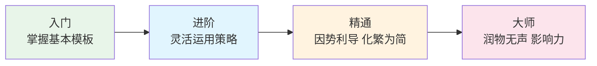

**下一步行动建议：**

1. 选择你日常工作中最常用的 2-3 个场景，优先练习
2. 从模板开始，逐步形成自己的风格
3. 每周回顾一次自己的沟通效果，持续改进
4. 观察身边沟通高手的做法，学习借鉴
5. 每次重要沟通后做3分钟复盘：什么有效？什么可以改进？

**推荐进阶阅读：**

| 书名 | 作者 | 核心价值 |
|------|------|---------|
| 《谈判力》 | Fisher & Ury | 原则性谈判的奠基之作 |
| 《金字塔原理》 | 芭芭拉·明托 | 结构化表达和思维的经典方法论 |
| 《关键对话》 | Patterson等 | 高风险场景下的沟通框架 |
| 《非暴力沟通》 | 马歇尔·卢森堡 | 以同理心为基础的沟通方法 |
| 《高效能人士的七个习惯》 | 史蒂芬·柯维 | 第4-6个习惯（双赢、知彼解己、统合综效）直接关联沟通 |
| 《管理的实践》 | 彼得·德鲁克 | 向上管理和向下管理的理论根基 |
| 《影响力》 | 罗伯特·西奥迪尼 | 理解说服心理学的六大原则 |
| 《Crucial Confrontations》 | Patterson等 | 冲突调解和困难对话的系统方法 |

在下一节中，我们将通过实战案例来具体分析这些技巧的应用。
