# 第二十章 商务沟通 — 实战案例

> 理论是骨架，案例是血肉。本节通过12个真实商务场景的深度拆解，将前两节建立的理论基础和核心技巧转化为可复制、可迁移的实战能力。每个案例都遵循统一的分析框架——从场景还原到策略推演，从逐回合拆解到复盘提炼——帮助你不只是"看懂"，而是"学会"。

## 案例分析方法论

在进入具体案例之前，先掌握一套通用的案例分析框架。面对任何商务沟通场景，都可以用以下五步法拆解：

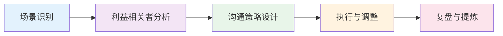

| 步骤 | 核心问题 | 输出物 | 常用工具 |
|------|---------|--------|---------|
| 场景识别 | 这是什么类型的沟通？目标是什么？ | 场景画像 | 沟通类型矩阵 |
| 利益相关者分析 | 各方的核心利益、立场、BATNA是什么？ | 利益地图 | 权力-利益矩阵 |
| 沟通策略设计 | 用什么渠道、什么节奏、什么话术？ | 沟通方案 | SCQA/SBI/金字塔原理 |
| 执行与调整 | 现场反应如何？如何灵活应变？ | 实操记录 | 实时观察笔记 |
| 复盘与提炼 | 哪些做法有效？哪些需要改进？ | 经验清单 | AAR（行动后复盘） |

**如何高效使用本节的案例：**

1. **先看场景**：代入自己——如果是我面对这个场景，我会怎么做？
2. **再看分析**：对照原文的问题分析，检查自己是否发现了这些问题
3. **重点看技巧**：每个案例的"技巧分析"部分是核心——它解释了"为什么这样做有效"
4. **最后套用**：把案例中的模板和话术替换为自己的实际场景，形成个人版本

掌握这个框架后，下面每个案例都会标注它运用了哪些核心理论，方便你建立"理论→实践"的连接。

### 本章涉及的核心理论速查

| 理论名称 | 核心思想 | 适用场景 | 来源 |
|---------|---------|---------|------|
| 金字塔原理 | 结论先行，以上统下，归类分组，逻辑递进 | 邮件、演示、汇报 | 芭芭拉·明托《金字塔原理》 |
| SCQA框架 | 情境→冲突→问题→答案 | 向上汇报、提案 | 麦肯锡咨询方法论 |
| SBI模型 | 情境→行为→影响 | 绩效反馈、问题沟通 | CCL（创新领导力中心） |
| 哈佛谈判法 | 关注利益而非立场，创造双赢选项 | 商务谈判、薪资谈判 | 哈佛谈判项目 |
| BATNA | 最佳替代方案，决定你的谈判底线 | 谈判准备 | 罗杰·费希尔《谈判力》 |
| RACI矩阵 | 负责/审批/咨询/知会四角色 | 跨部门协作 | 项目管理知识体系 |
| LASER模型 | 倾听→确认→建议→执行→总结 | 电话投诉处理 | 客户服务方法论 |
| 媒体丰富度理论 | 不同沟通渠道传递信息的能力不同 | 选择沟通渠道 | Lengel & Daft |

***

## 一、商务邮件实战案例

商务邮件是职场中使用频率最高的正式沟通渠道。据Radicati Group统计，2024年全球每天发送约3610亿封商务邮件，平均每位职场人每天收到121封。在这封信息洪流中，一封结构清晰、表达精准的邮件能显著提升沟通效率，而一封含糊不清的邮件可能导致反复确认、延误决策甚至引发误解。

### 邮件写作的通用原则

在进入具体案例前，先建立邮件写作的基本认知：

| 原则 | 具体要求 | 违反后果 |
|------|---------|---------|
| 主题行即摘要 | 包含【标签】+ 内容 + 关键信息（截止日期/紧急程度） | 被忽略、延迟打开、无法判断优先级 |
| 结论先行 | 第一段给出核心信息和行动需求 | 收件人需要读完全文才知道你要什么 |
| 结构化呈现 | 用编号、分段、表格组织信息 | 大段文字导致关键信息被淹没 |
| 附件齐全 | 需求文档、参考资料、对接文档一次性提供 | 反复沟通增加轮次，对方烦躁 |
| 明确行动项 | 写清"谁、做什么、什么时候" | "帮忙看看"这种模糊请求无法执行 |

### 案例一：跨部门协作邮件

**场景：** 市场部的李明需要研发部的张伟协助完成一个新产品推广页面的开发项目。双方此前没有直接合作经历，且研发部当前排期紧张。

**原始版本（问题版本）：**

```text
主题：帮忙

张伟，

我们需要你们帮忙做个项目，挺急的，能尽快处理吗？

李明
```

**问题逐项分析：**

| 维度 | 问题 | 影响 | 改进方向 |
|------|------|------|---------|
| 主题行 | "帮忙"——无法判断内容、优先级、部门 | 可能被忽略或延迟打开 | 用[标签]+具体事项+截止日期 |
| 需求描述 | 完全没有说明做什么 | 对方无法评估工作量和排期 | 结构化列出具体需求 |
| 时间要求 | "挺急的"是主观感受，不是客观日期 | 对方无法做优先级排序 | 给出明确的时间节点 |
| 语气 | 过于随意，缺乏对对方时间的尊重 | 容易引起反感，降低配合意愿 | 正式但友善的语气 |
| 缺失要素 | 没有附件、没有联系方式、没有后续安排 | 对方需要额外沟通才能启动 | 附件齐全、主动约沟通 |

**改进版本：**

```text
主题：【协作请求】新产品推广页面开发 - 需于6月30日前完成

张伟您好，

我是市场部的李明，负责新产品推广线。我们正在筹备新产品的线上推广活动，
需要研发部的支持开发推广页面，特此邮件沟通。

【项目背景】
新产品计划7月中旬上线，推广页面需在6月30日前完成部署，以便预留测试和
优化时间。

【具体需求】
1. 产品介绍主页面 + 4个子页面（功能详情、用户案例、价格方案、FAQ）
2. 用户注册表单 + 信息收集功能（与现有CRM系统对接）
3. 移动端适配（响应式设计）

【时间节点】
- 6月12日：设计稿确认（附件中已包含初版设计稿）
- 6月20日：前端开发完成
- 6月25日：后端联调完成
- 6月30日：测试通过并上线

【附件】
1. 需求文档v1.2（含页面结构、功能清单、数据字段）
2. 设计稿（Figma链接）
3. CRM对接接口文档

如果需求有任何不清楚的地方，或者时间节点需要调整，我们可以约时间当面
沟通。您看这周三下午3点方便吗？我可以在你们工位附近找个会议室。

感谢支持！

李明
市场部 | 产品经理
电话：138-xxxx-xxxx
邮箱：liming@company.com
```

**改进要点拆解：**

1. **主题行动作化**：包含【协作请求】标签 + 具体内容 + 截止日期，收件人一眼判断优先级
2. **背景先行**：先说"为什么要做"，再列"做什么"——这是金字塔原理的应用，让对方理解紧迫性的来源
3. **需求结构化**：用编号列表拆解为可评估的独立任务，对方可以逐条确认工作量
4. **时间可视化**：用时间线替代模糊的"尽快"，对方可以对照自己的排期
5. **附件齐全**：减少来回沟通的轮次，体现专业性和对对方时间的尊重
6. **主动提供沟通机会**：给出具体时间建议，降低对方的决策成本

**适用理论：** 金字塔原理（结论先行）、换位思考（从收件人视角设计邮件结构）

**进阶技巧——邮件跟进策略：**

如果发出邮件后48小时未收到回复，不要再次发送相同的邮件。有效的跟进策略是：

| 跟进次数 | 时间间隔 | 方式 | 话术模板 |
|---------|---------|------|---------|
| 第一次 | 48小时后 | 邮件回复自己 | "Hi张伟，补充一个信息：设计稿已更新到v1.3，链接如下。之前的需求邮件方便确认下排期吗？" |
| 第二次 | 再过24小时 | 即时通讯/电话 | "张伟，之前发了一封关于推广页面的协作邮件，不知道你看到没有？想确认一下排期是否可行。" |
| 第三次 | 再过24小时 | 升级 | 通过双方共同上级协调，但先告知对方"我会请XX总帮忙协调一下资源" |

跟进的核心原则：**每次跟进都要提供新的信息或价值**，而不是简单地催促。

**跨部门协作邮件的常见陷阱：**

| 陷阱 | 表现 | 后果 | 预防措施 |
|------|------|------|---------|
| 需求模糊 | "做一个漂亮的页面" | 交付物不符合预期，反复返工 | 用编号列表+参考示例明确需求 |
| 时间假设 | "应该很快吧" | 严重低估开发工作量 | 先询问对方评估，再定时间 |
| 跳过确认 | 发完邮件就当对方已同意 | 临到截止日才发现没有排期 | 必须收到对方的明确确认 |
| 缺少跟进 | 发完等回复，一周后才发现没人看 | 项目延期 | 48小时无回复启动跟进流程 |
| 抄送施压 | 一开始就抄送对方领导 | 破坏信任关系 | 先直接沟通，无果后再通过正式渠道协调 |

***

### 案例二：向上汇报邮件

**场景：** 项目经理王芳需要向总监汇报XX项目6月份的进展，同时需要协调市场部和IT部门的资源。

**改进版本：**

```text
主题：【月报】XX项目6月进展 | 完成度75% | 需协调2项资源

总监您好，

以下是XX项目6月份的进展汇报，请您审阅。

━━━ 一、总体进展 ━━━
项目整体完成度75%，符合预期进度。本月重点完成了核心功能开发和首轮用户
测试，用户满意度达92%。

━━━ 二、关键成果 ━━━
| 事项 | 状态 | 完成度 | 备注 |
|------|------|--------|------|
| 核心功能开发 | ✅ 已完成 | 100% | 通过代码审查 |
| 第一轮用户测试 | ✅ 已完成 | 100% | 满意度92% |
| 供应商合作协议 | ✅ 已签署 | 100% | 详见附件 |

━━━ 三、下月计划 ━━━
| 事项 | 目标日期 | 负责人 | 风险等级 |
|------|---------|--------|---------|
| 剩余功能开发 | 7月15日 | 研发组 | 🟢 低 |
| 第二轮用户测试 | 7月20日 | 产品组 | 🟡 中 |
| 上线部署 | 7月25日 | 运维组 | 🟡 中 |

━━━ 四、需要您协调的事项 ━━━
1. **市场部配合**：上线宣传材料需在7月20日前准备完成。已与赵经理初步沟通，
   需要您帮忙确认资源分配。
2. **IT部门配合**：服务器扩容需要在7月18日前完成。已提交工单，需要您帮忙
   推动优先级。

━━━ 五、风险提示 ━━━
供应商交付时间存在延迟风险（已与对方确认，延迟概率约30%）。应对方案：
已联系备选供应商B，可在48小时内切换，成本增加约5%。

如有任何问题，我可以安排一次30分钟的详细汇报会议，您看本周四上午方便吗？

王芳
项目管理部 | 高级项目经理
```

**向上汇报的结构化设计原理：**

这封邮件运用了**SCQA框架**（Situation情境 -> Complication冲突 -> Question问题 -> Answer答案）的变体：

- **情境**：项目完成度75%，符合预期
- **冲突/关注点**：需要协调两个部门的资源 + 供应商延迟风险
- **答案**：明确列出需要领导做什么（确认资源分配、推动优先级）

关键设计原则：**上级最关心三件事——进展是否正常、有没有风险、需要我做什么**。把这三件事放在最显眼的位置，其他细节用表格承载，让领导可以在30秒内抓住重点。

**向上汇报的"漏斗模型"：**

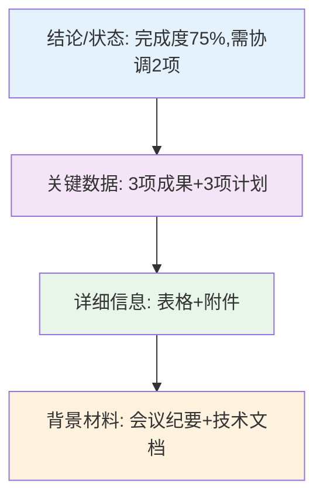

层级越高的人，越需要的是上层的"结论"而非下层的"细节"。邮件正文应该覆盖前两层，第三层用附件承载，第四层作为补充备查。

**向上汇报邮件的频率与深度对照表：**

| 汇报类型 | 频率 | 时长/篇幅 | 重点内容 | 适用场景 |
|---------|------|----------|---------|---------|
| 日报 | 每天 | 3-5条要点 | 今日完成/明日计划/阻碍 | 敏捷开发、紧急项目 |
| 周报 | 每周五 | 200-400字 | 本周成果/下周计划/风险 | 常规项目运营 |
| 月报 | 每月初 | 500-1000字 | 数据总结/趋势分析/资源需求 | 管理层汇报 |
| 季度报告 | 每季度 | 1000-2000字+附件 | 战略层面分析/ROI/方向建议 | 高层决策 |

**向上汇报邮件的常见错误与纠正：**

| 错误做法 | 为什么错 | 正确做法 |
|---------|---------|---------|
| 事无巨细全部罗列 | 上级没时间看细节，关键信息被淹没 | 用"总-分"结构，先结论后详情 |
| 只报喜不报忧 | 问题积累到无法解决时才暴露，信任崩塌 | 每次汇报都包含风险提示+应对方案 |
| 只提问题不给方案 | 把决策压力全部推给上级 | 每个问题附带2-3个可选方案+建议 |
| 缺少数据支撑 | 主观感受无法让上级做决策 | 用具体数字（完成度%、金额、日期） |
| 汇报频率混乱 | 上级无法建立信息预期 | 固定频率+突发重大事项即时汇报 |
| 用模糊形容词替代数据 | "进展顺利"不如"完成度75%"有说服力 | 数据是向上沟通的通用货币 |

***

### 案例三：客户投诉回复邮件

**场景：** 客户因产品交付延迟3天而投诉，客户关系经理需要回复邮件安抚情绪并给出解决方案。

```text
主题：【致歉+解决方案】关于订单#20240615-0083交付延迟

尊敬的王总：

首先，对于订单#20240615-0083的交付延迟，我代表公司向您诚挚致歉。
我理解延迟给贵公司的生产计划带来了不便，这是我们的责任。

【延迟原因】
本次延迟是由于物流环节中转站临时关闭导致的，我们已于第一时间与物流
供应商沟通，确认后续不会再出现同类问题。

【补偿方案】
为表歉意，我们提供以下补偿：
1. 本次订单运费全额退还（￥3,200）
2. 下一订单享受5%的价格优惠
3. 后续订单优先安排发货

【后续保障】
我们已将贵公司列入VIP客户名单，后续所有订单将由专属客服全程跟踪，
确保准时交付。

如您对上述方案有任何意见或建议，请随时联系我。我也可以安排一次电话
沟通，详细讨论后续合作事宜。

再次致歉，感谢您的理解与支持。

李华
客户关系部 | 高级客户经理
电话：139-xxxx-xxxx（24小时可联系）
```

**投诉回复的四步法：**

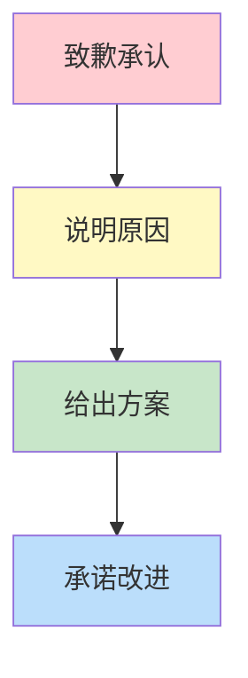

核心原则：**先处理情绪，再处理事情**。致歉必须具体（说明为哪件事道歉），不能泛泛地说"给您带来不便"。补偿方案要有诚意（不能只是口头承诺），且要超出客户预期。

**投诉邮件的补偿设计逻辑：**

补偿不是"花钱消灾"，而是"用诚意修复信任"。好的补偿方案遵循三个原则：

1. **直接相关性**：补偿应该与损失相关——运费延迟就补偿运费，产品缺陷就换货+额外补偿
2. **超出预期**：客户预期你补偿运费，你补偿运费+下一单折扣+VIP服务——超出预期才能转化为正面口碑
3. **可执行**：不要承诺做不到的事情，每个补偿条款都要有明确的执行路径和时间点

**不同投诉级别的应对策略：**

| 投诉级别 | 典型场景 | 响应时间 | 沟通渠道 | 补偿幅度 |
|---------|---------|---------|---------|---------|
| 一级（轻微） | 包装破损、说明书缺失 | 24小时内 | 邮件 | 补发+小礼品 |
| 二级（中度） | 交付延迟、规格偏差 | 12小时内 | 电话+邮件 | 退款/折扣+升级服务 |
| 三级（严重） | 产品缺陷导致损失 | 4小时内 | 上门拜访+书面函 | 全额赔偿+高层致歉 |
| 四级（危机） | 安全事故、批量缺陷 | 2小时内 | CEO声明+媒体回应 | 全额赔偿+召回+整改 |

**投诉邮件的措辞对照：**

| 避免说 | 应该说 | 原因 |
|--------|--------|------|
| "给您带来不便，深表歉意" | "对订单#xxx的交付延迟3天，我代表公司诚挚致歉" | 泛泛致歉缺乏诚意，具体致歉表明你在认真对待 |
| "这是物流公司的责任" | "这是我们在物流环节的疏忽" | 甩锅给第三方会让客户觉得你在推卸责任 |
| "我们会尽快处理" | "我们将在48小时内完成退款到账" | 模糊承诺无法建立信任，具体时间点才能建立预期 |
| "希望您能理解" | "感谢您的耐心和理解" | "希望"带有施压感，"感谢"表达尊重 |
| "这种情况很少发生" | "我们已采取措施确保不再发生" | 辩解不如解决问题有说服力 |

**投诉处理的后续跟进模板：**

投诉回复不是终点，后续跟进决定了客户是否真正恢复信任：

| 时间节点 | 跟进动作 | 沟通方式 | 话术要点 |
|---------|---------|---------|---------|
| 解决方案执行后24小时 | 确认方案执行情况 | 电话/邮件 | "退款/补发已处理，确认您已收到" |
| 一周后 | 满意度回访 | 邮件/问卷 | "您对我们的处理结果是否满意？" |
| 一个月后 | 关系修复 | 邮件+小礼品 | "感谢您的信任，附上一份小心意" |
| 下次合作时 | VIP待遇兑现 | 电话 | "王总，您的订单已优先安排发货" |

**投诉升级的处理策略：**

当一封邮件无法平息客户情绪时，需要升级处理方式：

| 客户反应 | 升级策略 | 话术模板 |
|---------|---------|---------|
| 邮件回复不满 | 电话沟通 | "王总，看到您的回复，我希望能亲自跟您沟通一下，方便现在通话吗？" |
| 电话中情绪激动 | 安排上门拜访 | "我理解您的不满，我希望能当面向您说明情况。您看明天上午方便吗？" |
| 威胁媒体曝光 | 高层介入 | "我已经将情况汇报给公司高层，VP希望亲自跟您沟通，您看什么时间方便？" |
| 提出法律诉求 | 法务对接 | "您的诉求我们非常重视，我们的法务团队会与您联系，确保妥善处理。" |

***

## 二、商务谈判实战案例

谈判是商务沟通中利益博弈最集中的场景。哈佛谈判法的核心理念是"关注利益而非立场"——不要在价格上死磕，而要找到双方利益的交集。下面通过三个不同类型的谈判案例，展示这一理念的实战应用。

### 谈判准备的通用框架

进入具体案例前，先建立谈判准备的系统方法：

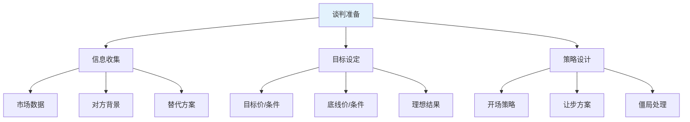

| 准备项 | 我方需要明确 | 对方需要预估 | 信息来源 |
|-------|------------|------------|---------|
| 目标/底线 | 我的目标值和底线值 | 对方的目标值和底线值 | 市场数据、历史交易、行业报告 |
| BATNA | 我的替代方案是什么 | 对方的替代方案是什么 | 替代供应商报价、竞品offer |
| ZOPA | 双方的协议区间在哪里 | — | 对比双方的底线 |
| 时间压力 | 我的时间紧迫程度 | 对方的时间紧迫程度 | 项目deadline、库存情况 |
| 关系价值 | 这段关系的长期价值 | 这段关系对对方的价值 | 合作历史、未来预期 |

### 案例一：供应商价格谈判

**场景：** 采购经理陈刚需要与供应商谈判下一年度的原材料采购价格。当前市场价格下行，但供应商声称原材料成本上涨。

**谈判准备——信息就是力量：**

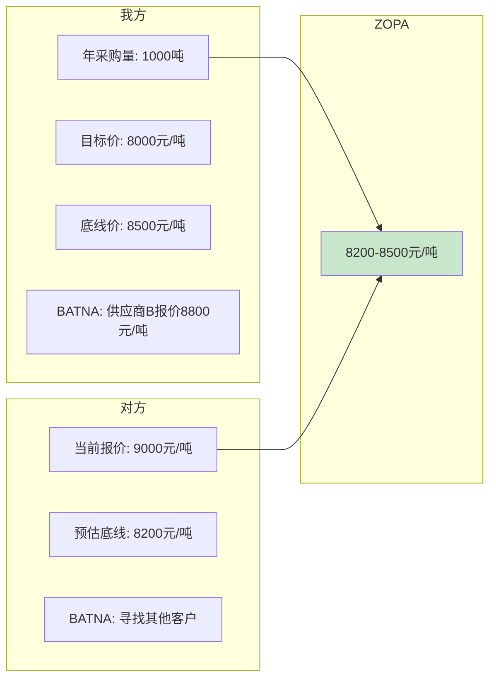

| 准备项目 | 我方数据 | 对方数据（预估） | 信息来源 |
|---------|---------|-----------------|---------|
| 市场价格 | 同行采购价8100-8400元 | 成本构成：原材料60%+人工20%+利润20% | 行业报告、公开财报 |
| 替代方案 | 供应商B报价8800元 | 对方产能利用率约70% | 供应商B报价单、行业传闻 |
| 关系历史 | 3年合作，年采购额800万 | 我方占其收入约15% | 内部采购记录 |
| 时间压力 | 我方库存可支撑2个月 | 对方需要稳定订单维持产线 | 仓储数据 |

**谈判准备的核心框架——BATNA分析：**

在进入谈判之前，必须清楚以下四个要素：
- **BATNA（最佳替代方案）**：如果谈判失败，你的退路是什么？陈刚的BATNA是供应商B报价8800元
- **ZOPA（协议区间）**：双方底线之间的重叠区域。我方底线8500，对方预估底线8200，ZOPA为8200-8500
- **锚定点**：第一个出价将成为谈判的参照点，应该设在对我方有利的位置
- **让步策略**：每次让步幅度递减，营造"接近底线"的信号

**谈判过程逐回合拆解：**

**第一回合：开场定调**

> 陈刚："王总，感谢您今天的会面。我们一直很重视与贵公司三年来的合作关系，今天希望就下一年的采购价格和合作模式进行深入讨论。"

技巧分析：先强调"三年合作关系"和"深入讨论"，定调为合作而非对抗。使用"合作模式"而非"降价"，避免一开始就触发对方的防御心理。

**第二回合：锚定效应**

> 陈刚："根据我们对市场的持续跟踪和成本分析，我们希望将下一年的采购价格定在7800元/吨。"

> 王总："陈经理，7800元/吨的价格我们无法接受。考虑到原材料成本的上涨，我们的最低价格是8800元/吨。"

技巧分析：我方锚定7800（低于目标价8000），对方锚定8800（高于报价9000）。双方都在极端位置开场，为后续让步留出空间。这是经典的**锚定效应**应用——第一个出价会成为后续谈判的参照点。

**第三回合：创造价值（扩大蛋糕）**

> 陈刚："我理解成本上涨的压力。不过我也想和您探讨一个对我们双方都有利的方案。如果我们把年采购量从1000吨增加到1500吨，并且签订三年的长期合同，您能提供什么样的价格？"

技巧分析：这是哈佛谈判法的核心——**关注利益而非立场**。对方的立场是"不能降价"，但利益是"稳定的订单量和收入"。通过增加采购量和合同期限，创造了新的价值，让降价成为可能。

> 王总："如果采购量增加到1500吨，并且签订三年合同，我们可以考虑8400元/吨。"

**第四回合：多维度协商**

> 陈刚："8400元/吨是一个我们可以讨论的基础。考虑到我们提供的长期合作和稳定订单，我们希望价格能够进一步调整到8200元/吨。同时，我们可以在付款周期上做出调整，从30天改为15天。"

技巧分析：引入**付款周期**作为新的谈判变量。对供应商来说，更快的回款意味着更好的现金流，这是一个高价值低成本的让步。这就是"多维度协商"——当价格谈不拢时，引入其他变量来创造交换空间。

**最终协议：**

| 条款 | 最终结果 | 对比初始立场 |
|------|---------|------------|
| 价格 | 8300元/吨 | 我方目标8000，对方报价9000 |
| 采购量 | 1500吨/年 | 我方初始1000吨 |
| 合同期限 | 3年 | 我方初始1年 |
| 付款周期 | 15天 | 我方初始30天 |

**结果分析：** 价格落在ZOPA区间（8200-8500），双方都获得了满意的结果。我方获得了低于目标的价格（8300 < 8500底线），对方获得了更大的订单量和更好的现金流。

**谈判中的让步策略：**

让步不是简单的"你降一点，我让一点"，而是一门信号传递的艺术。好的让步策略遵循三个原则：

1. **递减原则**：每次让步幅度应该递减（第一次让500，第二次让300，第三次让100），这传递出"快要到底了"的信号。如果递增让步，对方会觉得你还有很大的让步空间。
2. **有条件原则**：每次让步都要有条件——"如果贵方能将付款周期缩短到15天，我们可以接受8400元的价格"。无条件让步会让对方觉得你的底线还很远。
3. **有记录原则**：每次让步都要记录并确认——"刚才我们讨论了价格调整到8400元，加上15天付款周期，您确认这个方案可以接受吗？"这防止对方事后反悔。

**谈判中常见的错误应对：**

| 错误做法 | 为什么错 | 正确做法 |
|---------|---------|---------|
| 一开始就亮出底线 | 失去让步空间，对方会继续压价 | 从极端位置开始锚定，逐步让步 |
| 只关注价格一个变量 | 零和博弈，必然有一方不满意 | 引入付款周期、合同期限、服务等级等多维度 |
| 说"这已经是最低了" | 无法验证，对方会认为是虚张声势 | 用成本数据和市场比较来支撑报价 |
| 当场做出重大让步 | 对方会认为还有更多空间 | 每次让步幅度递减，营造"接近底线"的信号 |
| 威胁"找其他供应商" | 破坏关系，且对方可能不怕 | 用"我们也在评估其他方案"暗示，保留关系 |

***

### 案例二：薪资谈判

**场景：** 求职者刘洋拿到了一家心仪公司的offer，正在进行薪资谈判。他同时持有另一家公司的offer作为备选。

**谈判准备：**

| 维度 | 刘洋的数据 | 市场数据 |
|------|----------|---------|
| 当前薪资 | 月薪20,000元 | — |
| 目标薪资 | 月薪25,000元 | 同岗位市场中位数24,000元 |
| 底线薪资 | 月薪23,000元 | — |
| BATNA | 另一家offer 22,000元 | — |
| 独特价值 | 3年相关经验+行业资源 | 同等经验候选人稀缺 |

**谈判过程：**

**HR提问：** "刘洋，您对薪资有什么期望？"

**刘洋回应（先给范围，再讲价值）：**

> "基于我对市场行情的了解，以及我在相关领域的三年经验和带过来的行业资源，我期望的薪资范围是月薪25,000-28,000元。当然，薪资只是我考虑的一个因素，我同样看重贵公司的发展平台和成长机会。"

技巧分析：
- **给范围而非精确数字**：25,000-28,000元，锚定在目标之上，给对方"砍价"的空间，最终落在目标附近
- **价值前置**：先说"三年经验+行业资源"，让对方理解薪资要求的合理性
- **非薪资因素表态**：显示灵活性，但不是示弱——暗示"我有选择，但我优先考虑你们"

**HR回应：** "我们对您的能力和经验非常认可。不过，根据我们的薪资体系，这个岗位的薪资范围是月薪20,000-23,000元。"

**刘洋回应（转向全面薪酬）：**

> "我理解贵公司有薪资体系的限制。我想请教一下，除了基本薪资之外，贵公司是否有其他的激励方式？比如绩效奖金、股票期权、培训预算、弹性工作等？我更看重的是整体的回报包。"

技巧分析：当基本薪资遇到天花板时，**转向全面薪酬（Total Compensation）谈判**。绩效奖金、股票期权、培训预算、弹性工作等都是有价值的谈判筹码，而且对公司来说成本可能更低。

**最终协议：**

| 项目 | 结果 | 备注 |
|------|------|------|
| 基本薪资 | 月薪23,000元 | 在公司体系上限 |
| 绩效奖金 | 季度奖金，最高月薪的30% | 约6,900元/季度 |
| 培训预算 | 每年10,000元 | 覆盖专业认证和课程 |
| 弹性工作 | 每周1天远程办公 | 非货币福利 |
| 薪资复核 | 试用期后重新评估 | 约定明确时间点 |

**综合年收入计算：** 23,000 x 12 + 6,900 x 4（最高绩效）+ 10,000 = 313,600元/年，折合月薪约26,133元，超过目标薪资。

**薪资谈判的常见误区：**

| 误区 | 为什么是错的 | 正确做法 |
|------|------------|---------|
| 第一个报出精确数字（如"我要26,500"） | 精确数字没有谈判空间，且显得不够灵活 | 给一个范围，锚定在目标以上 |
| 报出当前薪资（被要求时） | 会被当作锚点，限制涨幅 | "我更关注的是这个岗位的市场价值" |
| 表现得"给多少都行" | 失去议价权，对方会给你最低档 | 明确表达期望，同时展示灵活性 |
| 只谈基本薪资 | 放弃了绩效奖金、股权、福利等谈判空间 | 用全面薪酬（TC）思维，多维度协商 |
| 当场接受第一个offer | 失去协商机会，入职后容易后悔 | "谢谢offer，我需要1-2天考虑，有几个细节想确认" |
| 用"我有房贷/家庭开支"作为加薪理由 | 公司按岗位价值付薪，不按个人开支 | 用市场数据、个人能力、创造的价值来支撑 |

**薪资谈判的时机选择：**

| 时机 | 策略 | 说明 |
|------|------|------|
| 收到offer后 | 正式谈判的黄金窗口 | 公司已决定录用你，此时你的议价权最强 |
| 试用期转正时 | 第二个窗口 | 已证明能力，可以提出调整 |
| 年度绩效评估后 | 基于成果的谈判 | 用具体数据和业绩支撑加薪请求 |
| 承担更大职责时 | 基于价值的谈判 | 职责增加了，薪资应该匹配 |

***

### 案例三：跨文化商务谈判

**场景：** 中国制造商需要与德国采购商谈判一笔出口订单。双方在沟通风格、决策方式、时间观念上存在显著差异。

**文化差异对照表：**

| 维度 | 中国风格 | 德国风格 | 应对策略 |
|------|---------|---------|---------|
| 沟通方式 | 高语境，含蓄委婉 | 低语境，直接明确 | 用数据和事实说话，减少模糊表述 |
| 决策流程 | 自上而下，需要领导拍板 | 基于技术和数据，团队决策 | 准备详细的技术文档和数据报告 |
| 时间观念 | 灵活，关系优先 | 严格，按计划执行 | 准时参会，按议程推进 |
| 关系建设 | 先建关系，再谈生意 | 先谈生意，关系其次 | 先简短寒暄，快速进入正题 |
| 合同态度 | 合作框架，灵活调整 | 详尽条款，严格遵守 | 准备详细的合同条款，标注灵活性区间 |

**跨文化谈判的"文化智商"模型：**

跨文化沟通能力（CQ）由三个维度组成：

1. **认知CQ**：了解对方文化的基本规则和价值观（如德国人重视精确和准时）
2. **动机CQ**：愿意适应对方文化的沟通方式，而不是坚持自己的习惯
3. **行为CQ**：能够灵活调整自己的语言、语调、节奏来适配对方

三者缺一不可——只有知识没有动机是"知道但不做"，只有动机没有行为是"想做但不会"。

**谈判实战过程：**

**德方开场：** "我们对贵公司的产品很感兴趣。根据我们的评估，你们的报价比市场均价高12%。我们希望了解价格构成，并探讨降低成本的可能性。"

**中方回应（适配德方风格）：**

> "感谢您对我们产品的认可。关于价格，我准备了一份详细的成本分析报告（递上文件）。价格构成如下：原材料占45%，人工占15%，质量检测占12%，物流占8%，管理费用占10%，利润占10%。其中，质量检测的比例高于行业平均，这是因为我们执行的是DIN标准检测流程。"

技巧分析：面对德国谈判方，**用数据和文档替代口头解释**。德方重视技术细节和质量标准，所以主动展示质量检测的投入，将"高价"转化为"高质"的价值叙事。

**德方追问：** "如果我们将订单量从一个集装箱增加到三个集装箱，价格能调整多少？"

**中方回应：**

> "基于三个集装箱的订单量，我们可以提供以下方案：单价降低8%，同时我们承担海运保险费用。这是详细的报价对比表（递上表格）。另外，我们可以提供样品供贵方进行独立质量验证。"

技巧分析：**用结构化的报价方案替代口头讨价还价**。德方喜欢看到清晰的对比和可验证的数据，所以主动提出提供样品供独立验证，建立信任。

**关键教训：** 跨文化谈判的核心不是改变自己的风格，而是**理解对方的决策逻辑和信任建立方式**，调整自己的沟通方式来适配。

**主要商务文化类型速查表：**

| 文化类型 | 代表国家 | 信任建立方式 | 决策风格 | 谈判节奏 | 关键注意事项 |
|---------|---------|------------|---------|---------|------------|
| 关系导向型 | 中国、日本、韩国 | 饭局、礼尚往来、长期互动 | 集体决策，层级审批 | 慢启动，后期加速 | 不要催促，重视面子 |
| 任务导向型 | 德国、北欧 | 专业能力、数据、准时 | 技术驱动，团队共识 | 按议程，节奏稳定 | 准备充分的技术资料 |
| 交易导向型 | 美国、英国 | 专业表现、快速结果 | 个人授权，快速决策 | 直奔主题，高效推进 | 不要过多寒暄 |
| 混合型 | 法国、意大利 | 专业+社交并重 | 上层决策，顾问影响 | 灵活，看关系深浅 | 重视社交场合的非正式沟通 |

**跨文化谈判的常见陷阱：**

| 陷阱 | 表现 | 后果 | 规避方法 |
|------|------|------|---------|
| 文化刻板印象 | "所有德国人都很直接" | 忽视个体差异，判断失误 | 以个人观察为准，文化知识作参考而非公式 |
| 过度适应 | 为了迎合对方完全改变自己的风格 | 显得不真诚，失去专业性 | 在核心原则上保持一致，只调整表达方式 |
| 忽视非语言信号 | 不了解对方的肢体语言含义 | 误解对方的真实态度 | 提前学习目标文化的基本非语言信号 |
| 翻译依赖 | 以为翻译能解决所有问题 | 翻译无法传递语气和文化隐含意义 | 重要沟通安排双语人士，而非依赖翻译软件 |

***

## 三、跨部门协作实战案例

跨部门协作是企业管理中最常见的难题之一。根本原因不是"人不行"，而是**机制缺失**——当各部门的KPI不一致、信息不透明、责任不明确时，协作必然困难。

### 案例：新产品上市项目

**场景：** 公司要推出一款新产品，需要市场部、研发部、销售部、客服部四个部门协作。各部门有不同的KPI体系和优先级，历史上的跨部门项目经常出现推诿和延期。

**挑战深层分析：**

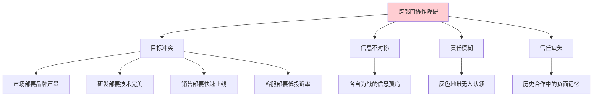

**解决方案四步走：**

**第一步：建立项目治理结构**

```text
项目发起人（VP级）
    └── 项目负责人（PM）
        ├── 市场组代表（负责推广方案）
        ├── 研发组代表（负责产品开发）
        ├── 销售组代表（负责渠道准备）
        └── 客服组代表（负责支持体系）
```

关键动作：
- 项目发起人必须是VP级别以上，确保跨部门资源调配的权威性
- 各部门代表必须有决策权（不能只是"传话筒"）
- 明确每个角色的**RACI矩阵**（Responsible负责、Accountable审批、Consulted咨询、Informed知会）

**RACI矩阵示例：**

| 任务 | 市场部 | 研发部 | 销售部 | 客服部 |
|------|--------|--------|--------|--------|
| 产品定位 | R | C | C | I |
| 产品开发 | C | R | I | I |
| 定价策略 | R | I | R | I |
| 推广方案 | R | C | C | I |
| 渠道准备 | C | I | R | I |
| 客服培训 | I | C | I | R |
| 上线发布 | A | R | R | R |

**RACI矩阵的使用要点：**

- 每个任务必须且只能有一个R（负责人），如果有两个R，就会出现"三个和尚没水喝"
- A（审批者）对结果负最终责任，通常由项目发起人或PM担任
- C（咨询者）在决策前需要征询意见，但不参与执行
- I（知会者）需要了解进展，但不需要参与决策

**第二步：统一目标和激励机制**

| 原有KPI | 项目统一KPI | 挂钩方式 |
|---------|-----------|---------|
| 市场部：品牌曝光量 | 新产品首月销售额 | 推广效果按转化率考核 |
| 研发部：代码质量 | 产品按时上线率 | 延期天数影响绩效系数 |
| 销售部：个人业绩 | 新产品首月铺货率 | 团队目标达成后个人KPI加倍 |
| 客服部：投诉率 | 新产品客户满意度 | 满意度>90%触发团队奖金 |

核心原理：**当各部门的个人利益与项目目标一致时，协作阻力会大幅降低**。这不是要求大家"顾全大局"，而是设计机制让"顾全大局"成为每个人的最佳选择。

**第三步：建立信息透明机制**

- **项目看板**：使用Jira/飞书项目等工具，所有任务状态实时可见
- **每日站会**：15分钟，每人回答三个问题——昨天做了什么、今天要做什么、有什么阻碍
- **周报机制**：每周五发送项目进展邮件，抄送项目发起人
- **共享文档库**：所有需求文档、设计稿、会议纪要统一存储，权限开放

信息透明的核心价值是**消除信息不对称带来的猜疑**。当市场部能看到研发部的工作进度，销售部能看到客服部收集的客户反馈，各部门就不再是"信息孤岛"，而是真正的"协作团队"。

**第四步：冲突处理协议**

当出现分歧时，按以下流程处理：

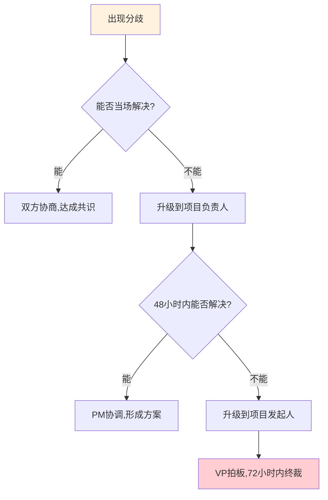

冲突处理的关键原则：
1. **不回避**：冲突本身不是问题，回避冲突才是问题
2. **有规则**：按预设的流程升级，而不是谁声音大谁赢
3. **有时限**：每个层级都有明确的处理时限，防止问题无限期拖延
4. **有记录**：每次冲突的结论都要记录，形成"决策日志"，避免同一个问题反复讨论

**结果：** 新产品按时上市，首月销售额超出预期30%。更重要的是，建立了可复用的跨部门协作模板——后续两个新产品项目都沿用了这套机制，协作效率提升了40%。

**跨部门协作的常见失败模式：**

| 失败模式 | 表现 | 根因 | 对策 |
|---------|------|------|------|
| 责任稀释 | "这是大家的事"变成"没人管的事" | 没有明确的唯一责任人 | 每个任务指定唯一的R（负责人） |
| 信息囤积 | 各部门只在自己的工具里更新进度 | 没有统一的信息平台 | 强制使用统一的项目看板 |
| 优先级冲突 | 各部门把本部门KPI排在项目之前 | 没有统一的项目级激励机制 | 设计与项目目标挂钩的联合KPI |
| 会议无果 | 讨论热烈但没有行动项 | 缺乏会议纪律和闭环机制 | 每个议题必须产出"谁+做什么+什么时候" |
| 历史包袱 | "上次合作他们就拖了两周" | 缺乏信任修复机制 | 项目启动时坦诚讨论历史问题，建立新的合作规则 |

***

## 四、向上管理实战案例

向上管理不是"拍马屁"，而是**管理你与上级之间的工作关系**——让上级了解你的工作进展、信任你的判断、支持你的决策。向上管理的核心公式是：

```text
成功的向上沟通 = 理解上级的关注点 x 用数据替代观点 x 预判并回应担忧 x 提供可执行方案
```

### 案例：提出创新方案

**场景：** 产品经理赵丽发现了一个新的市场机会——企业级SaaS市场。她需要说服总监批准一个试点项目，但这需要调配5人团队和6个月的开发资源。

**准备阶段——知己知彼：**

| 分析维度 | 具体内容 |
|---------|---------|
| 总监的核心关注 | 公司收入增长（年度目标+20%）、市场份额扩大 |
| 总监的风险偏好 | 偏保守，倾向于"先验证再投入" |
| 总监的决策风格 | 数据驱动，需要看到ROI分析 |
| 潜在反对意见 | "资源不够"、"风险太大"、"现有业务还没做好" |
| 我方的筹码 | 详细的市场数据、竞品分析、财务模型 |

**向上沟通的"电梯演讲"准备：**

在正式沟通前，先用30秒的"电梯演讲"测试自己的方案是否足够清晰：

> "我发现了一个年增长30%的细分市场，竞争对手尚未进入，我们有技术和客户优势，预计两年内增加2000万收入。需要5人团队和6个月时间，分阶段投入，第一阶段仅需2人和2个月做验证。"

如果你不能在30秒内说清楚"是什么、为什么、怎么做、要什么"，说明你的方案还不够清晰。

**沟通过程——SCQA框架实战：**

**赵丽（用数据开场，建立注意力）：**

> "总监，我最近做了一个市场分析，发现了一个年增长率30%的细分市场，目前我们的竞争对手还没有进入。如果我们现在布局，预计两年内可以增加2000万收入，市场份额提升5%。"

技巧分析：**第一句话就给出利益数字**，这是向上沟通的黄金法则。上级每天接收大量信息，你必须在30秒内让他产生"值得听下去"的判断。

**总监（典型的风险评估问题）：**

> "听起来有意思。风险呢？需要投入多少？"

**赵丽（预判并回应每个担忧）：**

> "我预判了三个核心问题，逐一给您汇报：
>
> **第一，市场风险。** 我做了竞品分析，目前这个细分市场前5名的总份额不到40%，市场格局未定。我们有技术和客户基础的优势，进入窗口期大约是12-18个月。
>
> **第二，资源投入。** 需要一个5人团队和6个月时间。我的建议是不要抽调现有核心项目的人，而是从内部竞聘+外部招聘组建新团队，不影响现有业务。
>
> **第三，失败成本。** 我设计了一个分阶段投入方案：第一阶段（2个月）做市场验证，投入只需要2人；验证通过后才进入第二阶段全面开发。如果第一阶段验证不通过，沉没成本控制在20万以内。"

**总监（追问可行性）：** "第一阶段具体验证什么？"

**赵丽（给出具体可执行方案）：**

> "第一阶段做三件事：1）访谈20家目标客户，验证需求真实性；2）开发一个MVP（最小可行产品），测试用户付费意愿；3）与3家意向客户签订试用协议。两个月后，我们用数据来决定是否进入第二阶段。"

**结果：** 总监批准了第一阶段试点，并承诺如果验证数据达标，优先调配资源进入第二阶段。

**向上沟通的时机选择：**

| 时机 | 适合沟通的内容 | 不适合沟通的内容 |
|------|-------------|----------------|
| 领导刚到办公室（9:00-9:30） | 简短的进展更新、好消息 | 需要深入讨论的复杂问题 |
| 上午精力充沛时段（10:00-11:30） | 重要提案、需要决策的事项 | 闲聊、非紧急事务 |
| 午饭后（13:00-14:00） | 轻松的汇报、好消息 | 复杂决策、负面消息 |
| 下午（14:00-16:00） | 讨论类、需要思考的议题 | 紧急但不重要的事项 |
| 临近下班（17:00后） | 仅限紧急事项 | 需要领导深思的提案 |

**向上管理的常见误区：**

| 误区 | 表现 | 为什么是错的 | 正确做法 |
|------|------|------------|---------|
| 只在出问题时找领导 | 领导一看到你来找就紧张 | 建立了负面关联 | 定期分享进展和好消息 |
| 报喜不报忧 | 隐藏问题，希望自行解决 | 领导最怕"突然的坏消息" | 提前暴露风险，让领导有时间应对 |
| 越级汇报 | 跳过直接上级找更高层 | 破坏信任，被上级视为威胁 | 除非直接上级失职，否则永远先沟通 |
| 带着问题去 | "领导，这个问题怎么办？" | 把决策负担推给领导 | 带着方案去："领导，我建议这样处理，您看如何？" |
| 用"我觉得"替代数据 | "我觉得这个方向很有前景" | 主观判断无法支撑决策 | "数据显示这个市场年增长30%" |

***

## 五、向下管理实战案例

向下管理的核心不是"管控"，而是**赋能**——帮助下属成长、激发团队潜能、建立信任关系。好的管理者不是"做得最好的人"，而是"让团队做得更好的人"。

### 案例一：处理下属的绩效问题

**场景：** 部门经理孙强发现下属小周最近两个月的项目交付时间延长了30%，客户满意度从95%下降到85%。需要进行一次绩效沟通。

**沟通前准备清单：**

- [x] 收集具体数据：交付延迟的项目名称、延迟天数、客户反馈原文
- [x] 准备具体例子：XX项目延迟一周、YY项目出现质量返工
- [x] 了解背景信息：小周最近是否有生活/工作上的变化
- [x] 选择合适场所：私密会议室（不在开放工位或咖啡厅）
- [x] 选择合适时间：周二到周四的上午（避免周一的忙乱和周五的松懈）
- [x] 设定沟通目标：找到原因 → 制定改进方案 → 保持信任关系

**沟通过程——SBI反馈模型：**

SBI模型是绩效沟通的黄金框架：**Situation（情境）→ Behavior（行为）→ Impact（影响）**

**开场（建立安全感）：**

> "小周，谢谢你今天的会面。我一直很看重你在团队中的贡献，今天想和你聊聊最近的工作情况，一起看看有什么可以调整的。"

**用SBI说明问题（对事不对人）：**

> "我注意到最近两个月（Situation情境），XX项目的交付延迟了一周，YY项目的客户反馈了3个质量问题（Behavior行为）。这导致客户满意度从95%下降到了85%，有两个客户提出了投诉（Impact影响）。"

关键：**不说"你最近状态不好"（对人），而说"项目交付延迟了一周"（对事）**。

**倾听（给对方解释的机会）：**

> "我想了解一下，是不是遇到了什么困难？"

**小周：** "孙经理，最近确实遇到了一些挑战。我父亲生病住院了，我需要照顾他，精力有些分散。"

**表达理解（共情但不越界）：**

> "我理解你的处境，家人的健康是最重要的。我很抱歉之前没有了解到这个情况。"

**共同制定解决方案（让对方参与决策）：**

> "我们可以一起想办法，看看怎么调整工作安排，让你能够兼顾工作和家庭。你觉得以下哪些方案对你有帮助？"

提供选项而非指令：
1. 将XX项目的截止日期延长一周
2. 将YY项目移交给其他同事，小周专注于2个核心项目
3. 调整工作时间，允许弹性上下班
4. 每周一次简短沟通，及时发现和解决问题

**结果：** 小周选择了方案1和2，后续一个月内逐步恢复了工作状态，客户满意度回升到93%。

**后续跟进（不能谈完就结束）：**

- 第一周：每天简短问候，了解情况
- 第二周起：每周一次15分钟的工作沟通
- 一个月后：正式评估改进效果，调整方案

**绩效沟通中的常见错误：**

| 错误做法 | 为什么错 | 正确做法 |
|---------|---------|---------|
| "你最近态度有问题" | 对人不对事，引发防御 | 用SBI模型描述具体行为和影响 |
| 在公开场合批评 | 伤害自尊，破坏信任 | 选择私密空间一对一沟通 |
| 只说问题不说方案 | 让下属感到无助和焦虑 | 提供具体可选的改进方案 |
| 谈完就不管了 | 问题可能反复，下属感到被忽视 | 建立定期跟进机制 |
| 用"总是""从来"等绝对词 | 不准确，让对方觉得被冤枉 | 用具体的时间、项目、数据 |

***

### 案例二：新员工入职辅导

**场景：** 团队新入职了一位应届毕业生小林，孙强需要帮助他快速融入团队并产出工作成果。

**30-60-90天辅导计划：**

| 阶段 | 目标 | 具体动作 | 检查标准 |
|------|------|---------|---------|
| 第1-30天 | 融入团队，了解业务 | 安排导师、参加团队会议、阅读业务文档 | 能独立说出团队的核心业务和流程 |
| 第31-60天 | 独立完成基础任务 | 分配渐进式任务、每周复盘 | 能独立完成标准任务，错误率<5% |
| 第61-90天 | 承担核心工作 | 分配核心项目模块、参与方案讨论 | 能独立负责一个完整模块 |

**第一周的关键动作：**

1. **第一天**：带领认识团队成员、介绍办公环境、发放入职资料包
2. **第二天**：安排一位资深同事作为导师（mentor），建立日常答疑关系
3. **第三天**：一对一沟通，了解小林的学习风格、职业期望、担忧
4. **第四天**：分配第一个小任务（有明确的完成标准和参考范例）
5. **第五天**：复盘第一个任务，给出具体反馈

**反馈的"三明治"改进版：**

传统的"表扬-批评-表扬"三明治反馈法已经被证明效果不佳（表扬变成了批评的前奏，员工学会了"听到表扬就知道要挨批了"）。改进版是**"观察-影响-期望"**：

> "我看了你写的这份报告（观察），数据部分很详细，分析逻辑也清晰。不过结论部分只有两段，没有给出具体的行动建议（影响：阅读者需要自己去想下一步做什么）。下次可以加上'建议采取以下行动'的部分，列出2-3条具体建议（期望）。你觉得这个方向可以吗？"

**新员工常见的"隐形困难"及识别信号：**

| 隐形困难 | 表现信号 | 管理者应对 |
|---------|---------|-----------|
| 不敢提问（怕被认为笨） | 遇到问题沉默很久才完成任务 | 主动问"有什么不确定的地方吗"，营造安全的提问氛围 |
| 不了解隐性规则 | 做事方式与团队习惯不同 | 明确告知"我们团队的惯例是…",不要等他犯错 |
| 缺乏归属感 | 午饭一个人吃，不参加团建 | 安排导师带他融入，邀请参加非正式活动 |
| 目标不清晰 | 不知道做到什么程度算"好" | 给出具体的完成标准和参考范例 |
| 反馈饥渴 | 频繁问"这样做对吗" | 前两周每天给一次简短反馈，之后逐步减少频率 |

***

## 六、会议主持实战案例

会议是商务沟通中成本最高的形式——6个人开1小时会议，实际消耗6人时的生产力。好的会议主持者能让每分钟都有价值，差的主持者会让所有人的时间白白浪费。

### 会议主持的"成本意识"

在主持会议前，先算一笔账：假设参会者平均时薪200元，6人开1小时会议 = 1200元的直接成本。加上机会成本（这些人本可以做其他工作），实际成本可能翻倍。这意味着：**你主持的每一次会议，都在消耗公司的真金白银**。

### 案例：跨部门项目协调会

**场景：** 项目经理需要主持一次跨部门项目协调会，解决项目中的三个关键问题：供应商交付延迟、技术方案需要调整、推广计划需要更新。

**会前准备清单：**

| 准备项 | 具体内容 | 完成标准 |
|--------|---------|---------|
| 会议目的 | 解决3个关键问题 | 每个问题有明确的决策或行动项 |
| 会议议程 | 按优先级排列3个议题 | 每个议题有时间分配和负责人 |
| 参会人 | 各部门决策者 | 确认参会人有决策权 |
| 预读材料 | 问题描述+数据+初步方案 | 会前48小时发送 |
| 会议室 | 投影、白板、网络 | 提前15分钟检查设备 |

**会前判断：这个会真的需要开吗？**

| 情况 | 是否需要开会 | 替代方式 |
|------|------------|---------|
| 只需要通知信息 | 不需要 | 发邮件或消息 |
| 需要单方面收集意见 | 不需要 | 发问卷或一对一沟通 |
| 需要多方讨论并达成共识 | 需要 | — |
| 需要处理紧急问题 | 需要 | — |
| 需要创意碰撞 | 需要 | — |

**会议议程模板：**

```text
会议：XX项目协调会
时间：2024年6月20日 14:00-15:00（60分钟）
地点：3楼会议室A
主持：项目经理

14:00-14:05  开场与议程确认（5分钟）
14:05-14:25  议题一：供应商交付延迟（20分钟）
14:25-14:45  议题二：技术方案调整（20分钟）
14:45-14:55  议题三：推广计划更新（10分钟）
14:55-15:00  总结与行动项确认（5分钟）
```

**会议过程实战：**

**开场（5分钟）—— 设定规则：**

> "各位好，感谢大家今天的参与。今天的会议目的是解决XX项目中的三个关键问题，预计会议时间1小时。为了高效利用时间，请各位将手机调至静音，讨论时一次一个人发言。如果某个议题超时，我们记录下来会后单独讨论。现在开始。"

**议题一讨论（20分钟）—— 引导技巧：**

> "第一个问题是供应商交付延迟。请采购部的李经理用3分钟介绍情况。"

（李经理介绍：供应商因产能问题延迟交付一周，影响项目整体进度）

> "感谢李经理。现在请大家用5分钟提出解决方案的建议。"

（讨论：备选供应商方案、协商部分交付、调整项目计划）

> "时间到。总结一下讨论结果，我们有两个可选方案：A方案是与供应商协商分批交付，B方案是启动备选供应商。考虑到时间紧迫，我建议先执行A方案，同时启动B方案作为备选。李经理，你能在本周五前给出A方案的执行结果吗？"

> "好，议题一达成共识：李经理本周五前与供应商确认分批交付方案，同时联系备选供应商。如果A方案不可行，下周一自动启动B方案。"

**议题二和三（类似流程）—— 关键技巧：**

- 每个议题先听情况，再讨论方案，最后明确行动
- 每个行动项必须有**负责人 + 截止日期 + 完成标准**
- 如果讨论偏离主题，用"这个话题很重要，我们可以会后单独讨论，现在先回到当前议题"来引导

**总结（5分钟）—— 会议纪要：**

> "总结今天的会议，我们形成了以下行动项：
> 1. 采购部与供应商确认分批交付方案 | 负责人：李经理 | 截止：本周五
> 2. 研发部调整技术方案并输出文档 | 负责人：王工 | 截止：下周三
> 3. 市场部更新推广计划和时间表 | 负责人：赵经理 | 截止：下周五
>
> 我会在今天下班前发送会议纪要，包含以上行动项和各议题的讨论记录。各位如果有补充，请在收到纪要后24小时内回复。感谢各位的参与！"

**会议效率检查表：**

| 检查项 | 本次会议 | 改进方向 |
|--------|---------|---------|
| 是否准时开始和结束 | 准时60分钟 | — |
| 每个议题是否有明确结论 | 3个议题均有行动项 | — |
| 行动项是否有负责人和截止日期 | 全部明确 | — |
| 是否有跑题或超时 | 议题一超时3分钟 | 下次提前收窄讨论范围 |
| 参会人是否都有发言机会 | 客服部未发言 | 下次主动邀请沉默者发言 |

**不同会议类型的主持策略：**

| 会议类型 | 时长 | 核心技巧 | 常见陷阱 |
|---------|------|---------|---------|
| 头脑风暴 | 60-90分钟 | 不评判，先发散后收敛 | 过早否定想法，变成领导一言堂 |
| 决策会 | 30-60分钟 | 明确决策规则（共识/多数/领导拍板） | 讨论没有终点，议而不决 |
| 信息同步会 | 15-30分钟 | 只说关键信息，不做深度讨论 | 会中引发深度讨论，严重超时 |
| 问题解决会 | 60-90分钟 | 先定义问题，再分析根因，最后讨论方案 | 跳过根因分析，直接讨论方案 |
| 评审会 | 60-120分钟 | 提前发材料，会上只讨论异议 | 没有预读，会上花大量时间介绍背景 |

***

## 七、商务演示实战案例

演示（Presentation）不是"念PPT"，而是**用视觉辅助来增强说服力**。好的演示应该让听众在20分钟内记住3个关键信息，差的演示会让听众在5分钟后就开始看手机。

### 演示设计的核心原则

| 原则 | 具体要求 | 原因 |
|------|---------|------|
| 金字塔结构 | 结论先行，论据支撑 | 听众注意力有限，必须先给最重要的信息 |
| 10-20-30法则 | 10页PPT、20分钟、30号字体 | 超出这个范围，听众的记忆和注意力都会下降 |
| 故事化 | 用案例、对比、类比来承载数据 | 数据容易忘记，故事容易记住 |
| 互动性 | 每5-7分钟制造一次互动点 | 人的注意力周期约10分钟，需要"唤醒" |

### 案例：季度业绩汇报演示

**场景：** 销售总监需要向CEO和管理层进行Q2季度业绩汇报，同时提出Q3工作计划和资源需求。

**演示结构设计——金字塔结构：**

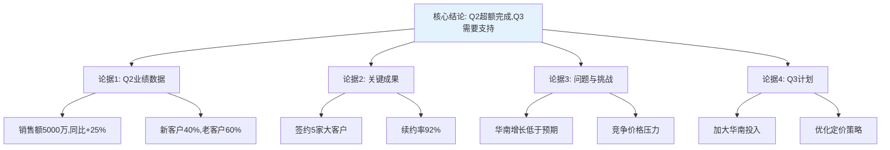

**演示时间分配：**

| 环节 | 时长 | 关键信息 | 视觉辅助 |
|------|------|---------|---------|
| 开场 | 2分钟 | 议程预告 | 标题页 |
| 总体业绩 | 3分钟 | 5000万/同比+25% | 趋势图 |
| 关键成果 | 5分钟 | 3个关键成果 | 数据卡片 |
| 问题与挑战 | 3分钟 | 3个核心挑战 | 问题清单 |
| Q3计划 | 5分钟 | 3个重点方向 | 路线图 |
| 资源需求 | 2分钟 | 3项具体需求 | 清单 |
| 结尾 | 1分钟 | 核心结论重申 | 总结页 |

**演示实战——逐环节拆解：**

**开场（2分钟）—— 设定期望：**

> "CEO，各位领导，今天我将汇报三个内容：Q2的销售业绩、我们面临的关键挑战、以及Q3的工作计划和资源需求。预计时间20分钟。"

技巧：**先给结构，让听众知道接下来要听什么**，降低认知负担。

**总体业绩（3分钟）—— 先给结论：**

> "Q2我们实现了5000万的销售额，同比增长25%，超额完成了季度目标110%。（停顿，让数字沉淀）其中，新客户贡献了40%的收入，老客户贡献了60%，客户结构健康。"

技巧：**结论先行，数据紧跟**。不要从过程讲起，直接给出结果。

**关键成果（5分钟）—— 用故事承载数据：**

> "Q2有三个关键成果值得特别说明。
>
> 第一，成功签约了5家大型企业客户。其中最具代表性的是XX集团——这是我们花了6个月跟进的客户，从最初的拒绝到最终签约，合同金额800万。这个案例证明了我们的大客户攻坚能力。
>
> 第二，客户续约率从85%提升到92%。这意味着我们的客户留存能力在增强，预计Q3将带来约300万的续约收入。
>
> 第三，销售团队的人均产能提升了30%。这得益于我们Q1引入的新CRM系统和销售培训项目。"

技巧：**数据+故事**的组合比单纯的数据更有说服力。每个数据点配一个具体案例或因果解释。

**问题与挑战（3分钟）—— 诚实但有方案：**

> "当然，我们也面临三个挑战：
>
> 第一，华南市场的增长低于预期，仅完成了目标的70%。主要原因是竞品在该区域发起了价格战。
>
> 第二，部分新入职销售人员的能力还需要提升，平均成单周期比资深销售长40%。
>
> 第三，竞争对手的整体价格下调了8-12%，对我们的中端产品线形成了压力。"

技巧：**问题要说，但要控制在三个以内**，并且每个问题都要有对应的解决方案在后面的Q3计划中体现。不要让问题成为听众记住的唯一内容。

**Q3计划（5分钟）—— 每个挑战对应一个方案：**

> "针对以上三个挑战，Q3我们重点做好三件事：
>
> 第一，加大华南市场投入。增派2名资深销售人员，投入50万市场预算，重点攻克3家目标大客户。预计Q3华南收入提升40%。
>
> 第二，启动销售能力提升计划。包括每周案例复盘会、月度模拟演练、以及与TOP销售的一对一跟访。目标是将新人成单周期缩短20%。
>
> 第三，优化产品定价策略。我们建议将中端产品线价格下调5%，同时推出增值服务包来提升客单价。预计净影响：收入+3%，利润率持平。"

**资源需求（2分钟）—— 具体可执行：**

> "为了实现以上计划，我们需要三项支持：
>
> 1. 增加20万的华南市场预算——ROI预计3:1
> 2. 人力资源部配合招聘2名资深销售——需要在7月底前到岗
> 3. 产品部配合在7月中旬前完成定价策略调整
>
> 以上就是我的汇报，核心结论是：Q2超额完成目标，Q3通过加大华南投入、提升团队能力、优化定价策略，争取实现更高的目标。感谢各位的支持！"

**演示后的常见提问及应对：**

| 可能的提问 | 应对策略 |
|-----------|---------|
| "华南为什么没完成？" | 先承认事实，再给原因和方案 |
| "20万预算的ROI怎么算的？" | 准备详细的ROI计算模型 |
| "降价会不会影响品牌？" | 用数据说明竞品影响+增值服务保利润 |
| "新人培训多久见效？" | 给出阶段性里程碑和评估节点 |

**演示中的肢体语言与表达技巧：**

| 技巧 | 具体做法 | 常见错误 |
|------|---------|---------|
| 眼神接触 | 轮流看向每位听众（尤其是决策者） | 只看屏幕或只看领导 |
| 手势 | 用开放手势强调重点，指向屏幕数据 | 双手交叉抱胸、插口袋 |
| 语速变化 | 关键数字放慢，过渡内容加快 | 全程匀速，催眠效果 |
| 停顿 | 给出关键数字后停顿2-3秒 | 急着说下一句，不给听众消化时间 |
| 站位 | 站在屏幕侧面，面向听众 | 站在屏幕前挡住内容 |
| 翻页 | 背熟内容，减少回头看屏幕 | 一页页读PPT上的文字 |

***

## 八、数字沟通实战案例

数字沟通是现代商务中占比最大的沟通形式。不同于面对面交流，数字沟通缺少语气、表情、肢体语言等非语言线索，更容易产生误解。研究表明，纯文字沟通中约有50%的情绪信息会丢失——你写的"好的"可能被理解为"好的！"，也可能被理解为"好的（不情愿）"。

### 数字沟通的"媒体选择矩阵"

不同场景适合不同的数字沟通渠道，选择错误的渠道会导致效率低下或信息失真：

| 场景 | 推荐渠道 | 原因 |
|------|---------|------|
| 简单确认（是/否、收到） | 即时消息 | 快速，不需要邮件 |
| 需要讨论的事项（3轮以内能解决） | 即时消息+话题标签 | 高效，可追溯 |
| 复杂讨论（需要多方参与、涉及决策） | 会议或语音 | 文字讨论效率低、容易误解 |
| 需要存档的重要信息 | 邮件 | 即时消息不好搜索和归档 |
| 紧急但不重要的事情 | 即时消息（标注"非紧急"） | 不打电话打扰，但确保对方看到 |
| 涉及敏感信息（薪资、人事） | 电话或面谈 | 文字留痕可能带来风险 |

### 案例一：即时消息协作

**场景：** 产品经理需要通过飞书/Slack协调设计和开发团队完成一个紧急的功能上线。

**问题版本：**

```text
李明 14:23
@所有人 那个新功能下周能上吗？

张伟 14:25
哪个新功能？

李明 14:26
就是那个会员系统的

张伟 14:28
哦那个啊，需求还没确认呢

李明 14:29
啊？不是说了很急吗？赶紧排一下

张伟 14:30
[无语]
```

**问题分析：**

| 问题 | 具体表现 | 后果 |
|------|---------|------|
| 信息模糊 | "那个新功能"——谁知道是哪个 | 需要额外一轮沟通才能确认对象 |
| 缺少上下文 | 没说明优先级、截止日期、影响范围 | 收件人无法判断轻重缓急 |
| @所有人 | 打扰不相关的人 | 团队噪音增加，重要消息被淹没 |
| 情绪化表达 | "啊？不是说了很急吗" | 传递焦虑和指责，对方产生抵触 |
| 缺乏行动项 | "赶紧排一下"——谁排、排什么、什么时候完成 | 没有明确的执行路径 |

**改进版本：**

```text
李明 14:23
@张伟 @王设计

关于「会员等级系统-前端页面」（飞书文档链接），需要确认一下排期：

背景：
- 产品评审已通过（6/15），设计方案v2已确认（6/18）
- 上线截止：6/30（运营活动需要）

需要你们确认：
1. 前端开发需要几天？能否在6/26前完成？
2. 设计稿是否有需要修改的地方？

如果排期有困难，我这边可以调整需求范围，请告知具体阻碍。
```

**改进要点：**
- **精确@人**：只@相关的人，减少噪音
- **链接到文档**：提供完整上下文，对方可以自行查看
- **明确截止日期和原因**："6/30（运营活动需要）"——让对方理解紧迫性
- **提出具体问题**：需要对方回答什么，而不是模糊的"排一下"
- **提供退路**："如果排期有困难，可以调整范围"——降低对方的压力

**即时消息的异步沟通规范：**

在远程和混合办公场景下，即时消息的"异步沟通"能力变得越来越重要。异步沟通的核心是：**发送者提供完整信息，接收者在方便时回复，不需要双方同时在线**。

| 原则 | 具体做法 | 违反后果 |
|------|---------|---------|
| 一条消息说完 | 把背景、需求、截止日期写在一条消息里，不要分成5条发 | 对方看到第1条时不知道你要说什么 |
| 标注是否紧急 | 用"[紧急]"或"[非紧急]"开头 | 对方无法判断是否需要立即处理 |
| 给出回复时间预期 | "方便时回复即可"或"今天下班前需要确认" | 对方不知道你的期望，可能拖延 |
| 避免"在吗？" | 直接说事情，不要先问"在吗"等对方回复 | 浪费一轮沟通，对方可能几小时后才看到 |
| 线程回复 | 用话题线程回复，不要在主频道发散 | 信息混乱，后续无法追溯 |

**"在吗？"的正确替代方案：**

| 错误写法 | 正确写法 |
|---------|---------|
| "在吗？" | "张伟，关于推广页面的排期，有一个问题想确认：前端开发能在6/26前完成吗？方便时回复。" |
| "在吗？有空吗？" | "王设计，需要你帮看一下设计稿的配色方案（链接），有两个选项不确定选哪个。不急，今天回复就行。" |
| "忙不忙？" | "李经理，关于供应商的报价方案，我有一个想法想讨论。方便的话今天下午聊5分钟？" |

**消息中的语气管理：**

数字沟通中，你的语气完全由文字决定。以下是一些容易被误解的表达：

| 你的本意 | 你写的 | 对方的理解 | 改进写法 |
|---------|--------|-----------|---------|
| 简洁高效 | "知道了" | 冷漠、不耐烦 | "收到，谢谢！" |
| 确认收到 | "嗯" | 敷衍、不重视 | "嗯嗯，明白了"或"收到" |
| 提醒对方 | "这个还没做完？" | 质疑、施压 | "这个进展怎么样了？有什么阻碍吗？" |
| 表达担忧 | "这样不太好吧" | 否定、不支持 | "这个方案我有一些顾虑，我们可以聊聊吗？" |
| 开玩笑 | "你可真行啊" | 讽刺、挖苦 | 加上表情符号，或改为"哈哈，厉害" |

**表情符号在商务沟通中的使用指南：**

| 表情 | 适用场景 | 避免场景 |
|------|---------|---------|
| 竖拇指 | 确认收到、表示同意 | 正式讨论中的唯一回复 |
| 微笑 | 表达友善、感谢 | 对上级的正式汇报 |
| 捂脸 | 自嘲、化解尴尬 | 对客户的投诉回复 |
| 庆祝 | 庆祝成果、欢迎新人 | 讨论问题时 |
| 时钟 | 提醒截止日期 | 催促同事时单独使用（加上说明文字） |

***

### 案例二：视频会议沟通

**场景：** 远程团队需要进行一次产品评审会议，参与者分布在三个城市。

**视频会议的独特挑战：**

| 挑战 | 具体表现 | 解决方案 |
|------|---------|---------|
| 网络延迟 | 发言重叠、断断续续 | 举手发言机制、主持人引导 |
| 注意力分散 | 参会者同时做其他事 | 要求开摄像头、随机提问 |
| 屏幕疲劳 | 连续会议导致精力下降 | 每45分钟休息5分钟 |
| 技术故障 | 共享屏幕失败、音频问题 | 提前10分钟测试设备 |
| 时区差异 | 跨时区团队的时间协调 | 轮流牺牲时区公平性 |

**视频会议的最佳实践清单：**

```text
会前：
- 测试摄像头、麦克风、屏幕共享
- 关闭无关的浏览器标签和通知
- 准备好要展示的材料，提前打开
- 确认参会人都能加入（时区、权限）

会中：
- 开场前2分钟等待迟到者，同时聊几句
- 开场说明议程和预计时长
- 发言时看着摄像头（不是屏幕）
- 共享屏幕时关闭个人通知
- 每个议题结束后做小结
- 主动邀请沉默者发言："XX，你的看法呢？"

会后：
- 24小时内发送会议纪要
- 行动项写明负责人和截止日期
- 录制的会议分享给未参会者
```

**视频会议中的常见问题及应对：**

| 问题 | 应对方式 |
|------|---------|
| 有人总打断别人 | "XX的观点很好，让YY先把话说完" |
| 讨论跑题 | "这个话题很重要，我们单独安排时间讨论，现在先回到…" |
| 有人全程不发言 | "XX，这个部分你最熟悉，给大家分享一下？" |
| 技术问题导致卡顿 | "XX的音频不太好，可以先打字说，我们稍后确认" |
| 会议超时 | "我们已经超时10分钟，剩下的议题我会记录下来，安排下次讨论" |

***

### 案例三：电话沟通

**场景：** 客户服务经理需要通过电话处理一个紧急的客户投诉，客户情绪激动。

**电话沟通的独特性：** 没有视觉线索，你的语气、语速、停顿就是全部的"肢体语言"。研究显示，在电话沟通中，**语气占信息传递效果的40%，内容仅占7%**（其余是语速、音量等副语言特征）。这意味着"你怎么说"比"你说什么"更重要。

**电话投诉处理的LASER模型：**

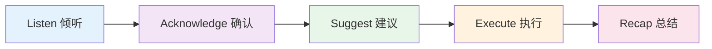

**实战过程：**

**客户（情绪激动）：** "你们的产品质量太差了！用了不到一个月就坏了！我要退货！"

**Listen（倾听，不打断）：**
让客户说完，不要急于解释。用"嗯""我理解""请继续"等简短回应表示在听。

**Acknowledge（确认理解和情绪）：**

> "张先生，我完全理解您的感受。产品在使用不到一个月就出现故障，这确实不应该发生。我代表公司向您道歉。"

技巧：**先确认情绪（"完全理解您的感受"），再确认事实（"不到一个月就出现故障"）**。不要说"您先冷静一下"——这会火上浇油。

**Suggest（提供方案）：**

> "针对您的情况，我可以提供两个解决方案：
> 第一，我们免费更换一台全新的产品，明天就能发货。
> 第二，如果您更希望退货，我们可以全额退款，3个工作日内到账。
> 您觉得哪个方案更合适？"

技巧：**给出具体方案而非空泛承诺**，让客户做选择而非等待。

**Execute（执行）：**

> "好的，我现在就为您办理退货退款。退款将在3个工作日内原路返回。我会在今天下午5点前把退货流程的详细说明发到您的邮箱。"

**Recap（总结确认）：**

> "张先生，跟您确认一下：我们办理全额退款，3个工作日内到账；退货流程说明今天下午发到您的邮箱。请问还有什么需要帮忙的吗？"

**电话沟通的语气控制技巧：**

| 技巧 | 具体做法 | 效果 |
|------|---------|------|
| 微笑说话 | 即使对方看不到，微笑会改变声调 | 声音更温暖友善 |
| 放慢语速 | 比正常语速慢10-15% | 表达更清晰，显示沉稳 |
| 适当停顿 | 重要信息后停顿1-2秒 | 给对方消化时间 |
| 降低音调 | 紧张时声音会变尖 | 低音调更权威和可信 |
| 复述确认 | "让我确认一下，您说的是…" | 避免信息传递错误 |
| 做笔记 | 记录关键信息和承诺 | 后续跟进有据可查 |

***

## 九、企业文化沟通实战案例

企业文化决定了"这里的人怎么沟通"。从一家公司跳槽到另一家公司，如果不能快速适应新的沟通文化，即使你的专业能力再强，也可能被边缘化。

### 案例：适应不同的企业文化

**场景：** 张华从一家层级分明的传统制造业企业（5000人，成立20年）跳槽到一家扁平化的互联网公司（500人，成立5年）。入职后发现沟通方式完全不同。

**文化差异全景对比：**

| 维度 | 传统企业（原公司） | 互联网公司（新公司） | 张华的适应策略 |
|------|-----------------|-------------------|--------------|
| 沟通渠道 | 正式邮件+电话 | 飞书/Slack即时消息 | 第一周学会新工具，减少邮件使用 |
| 汇报方式 | 层层汇报，逐级审批 | 直接找负责人，扁平沟通 | 观察谁是实际决策者，直接沟通 |
| 决策流程 | 详细方案→层层审批→执行 | 快速讨论→小范围验证→迭代 | 学会"先做80分，再迭代"的思维 |
| 会议文化 | 正式会议室，PPT汇报 | 白板讨论，随时站会 | 减少PPT准备，增加现场讨论能力 |
| 反馈方式 | 年度考核，正式反馈 | 随时反馈，直接指出 | 学会接受和给予即时反馈 |
| 时间观念 | 准时但流程长 | 快速响应，当天闭环 | 提高响应速度，减少等待指令 |

**三周适应过程详解：**

**第一周：观察期（多看多听少说）**

关键动作：
- 观察同事的沟通方式：用什么工具、什么语气、什么节奏
- 学习公司的工具栈：飞书文档、项目看板、代码仓库
- 了解非正式的权力结构：谁说话有分量、谁是意见领袖
- 记录每天的"文化发现"：哪些做法和原公司不同

张华的笔记示例：
```text
Day 1: 发现大家在飞书群里直接@领导讨论问题，不用先发邮件申请
Day 2: 会议没有PPT，直接在白板上画，边讨论边修改
Day 3: 午饭时了解到，公司的决策很多时候是在茶水间非正式讨论中形成的
Day 4: 学会了用飞书文档的评论功能做协同，比邮件高效很多
Day 5: 第一次在群里直接回复了领导的问题，感觉很不习惯但收到了正面反馈
```

**第二周：适应期（小步尝试）**

关键动作：
- 尝试用即时通讯工具进行日常沟通
- 尝试直接找相关部门负责人沟通，而非通过邮件
- 在会议中主动发言，分享自己的观点
- 接受同事的即时反馈，不将其视为批评

遇到的困难和应对：

| 困难 | 原因 | 应对 |
|------|------|------|
| 发了邮件没人回 | 大家习惯看飞书消息 | 改用飞书沟通 |
| 等领导审批等了两天 | 扁平组织不需要逐级审批 | 直接找负责人确认 |
| 被同事当面指出方案问题 | 即时反馈是文化常态 | 理解这是高效沟通，不是人身攻击 |

**第三周：融入期（建立信任）**

关键动作：
- 主动在飞书群里分享自己的工作进展
- 在会议中提出建设性意见
- 与关键同事建立一对一的信任关系
- 开始享受快速决策和高效沟通带来的好处

**经验提炼——文化适应四原则：**

1. **观察优先**：至少花一周时间观察，不要急于改变自己或评判他人
2. **模仿高手**：找到团队中沟通最好的人，观察并模仿他的方式
3. **小步试错**：每次尝试一个新的沟通方式，观察反馈，有效则保留
4. **保持内核**：调整沟通方式，但不改变核心价值观和专业判断

**不同企业类型的沟通文化速查：**

| 企业类型 | 典型特征 | 沟通偏好 | 入职适应重点 |
|---------|---------|---------|------------|
| 传统大型企业 | 层级分明、流程规范 | 邮件+正式会议 | 学会走流程、逐级汇报 |
| 互联网公司 | 扁平化、快速迭代 | 即时通讯+站会 | 提高速度、接受即时反馈 |
| 外企 | 制度完善、多元文化 | 英文邮件+视频会议 | 提升英文沟通、跨文化意识 |
| 创业公司 | 一人多岗、灵活机动 | 面对面+即时通讯 | 适应模糊边界、主动承担 |
| 国企/政府 | 层级严格、用语规范 | 正式文件+会议 | 注意措辞、遵守程序 |

***

## 十、危机沟通实战案例

危机沟通是商务沟通中最考验功力的场景——时间紧迫、信息不全、情绪高涨、容错率极低。好的危机沟通能将危机转化为信任重建的机会，差的危机沟通则会让问题雪上加霜。

### 危机沟通的五大原则

| 原则 | 具体要求 | 违反后果 |
|------|---------|---------|
| 速度第一 | 6小时内发布初步回应，24小时内发布详细声明 | 信息真空会被谣言和猜测填充 |
| 事实为王 | 用数据、检测报告、第三方证据说话 | 口头承诺无法建立信任 |
| 态度诚恳 | 承认问题、表达歉意、说明措施 | 推诿和掩盖会引发更大的信任危机 |
| 统一口径 | 所有对外信息由一个发言人发布 | 内部说法矛盾会加剧混乱 |
| 持续跟进 | 定期更新直到问题完全解决 | 一次声明后沉默会让公众认为你在逃避 |

### 案例一：产品质量危机

**场景：** 某食品公司的一批产品被检测出微量超标成分，虽然不构成健康风险，但媒体报道已经开始发酵，社交媒体上出现了消费者恐慌。

**危机沟通时间线：**

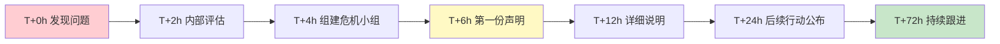

**危机小组构成：**

| 角色 | 人员 | 职责 |
|------|------|------|
| 总指挥 | CEO/VP | 最终决策权 |
| 发言人 | 公关总监 | 统一对媒体口径 |
| 技术顾问 | 质量总监 | 提供技术事实 |
| 法务顾问 | 法务总监 | 评估法律风险 |
| 客服协调 | 客服总监 | 处理消费者咨询 |
| 舆情监控 | 市场部 | 跟踪社交媒体动态 |

**第一份声明（T+6小时）——黄金时间窗口内发布：**

```text
关于XX产品检测情况的声明

尊敬的消费者：

我们注意到有关XX产品检测结果的报道，现就相关情况说明如下：

1. 我们已第一时间启动内部调查，对相关批次产品进行全面复检。
2. 根据初步检测，该批次产品的XX成分含量为XXmg/kg，国家标准
   限值为XXmg/kg。虽然超出内控标准，但仍低于国家标准限值。
3. 作为预防措施，我们已主动下架该批次产品，并开通了消费者退换
   货通道。
4. 我们将在24小时内公布详细的检测报告和后续处理方案。

消费者安全是我们的第一要务。我们将持续更新调查进展。

客服热线：400-xxx-xxxx（24小时）
退换货通道：www.xxx.com/return

XX公司
2024年6月20日
```

**声明设计要点：**

| 要素 | 做法 | 原因 |
|------|------|------|
| 时间 | 6小时内发布 | 超过24小时未回应，舆论会失控 |
| 态度 | 诚恳、透明、不推诿 | 掩盖和推诿会引发更大的信任危机 |
| 事实 | 给出具体数据 | 用数据替代模糊表述，降低恐慌 |
| 行动 | 说明已采取的措施 | 消费者需要看到"有人在处理" |
| 后续 | 承诺更新时间 | 建立预期，避免信息真空 |

**后续72小时行动计划：**

| 时间 | 行动 | 沟通对象 |
|------|------|---------|
| T+12h | 公布详细检测报告 | 媒体+消费者 |
| T+24h | CEO视频声明，公布整改方案 | 全公众 |
| T+48h | 开通消费者一对一咨询通道 | 投诉消费者 |
| T+72h | 公布第三方权威机构复检结果 | 媒体+行业 |

**社交媒体危机管理的特殊策略：**

在微博、微信等社交媒体时代，危机传播速度远超传统媒体。以下是针对社交媒体的特殊应对：

| 平台 | 传播特点 | 应对策略 |
|------|---------|---------|
| 微博 | 公开传播，速度快，容易形成热搜 | 第一时间在官方微博发布声明，关闭评论区不可取（会被截图为"心虚"），应正面回应 |
| 微信 | 半封闭传播，朋友圈+群聊扩散 | 通过公众号发布官方声明，准备"转发话术"方便员工和合作伙伴传播 |
| 抖音/快手 | 视频传播，情绪感染力强 | 准备短视频回应，CEO出镜比文字更有诚意 |
| 知乎 | 深度讨论，容易形成"定性" | 安排技术人员在知乎做专业回答，用数据说话 |

**危机沟通中的常见错误：**

| 错误做法 | 为什么错 | 正确做法 |
|---------|---------|---------|
| 沉默等待舆情降温 | 信息真空会被谣言填充 | 6小时内发布初步回应 |
| "这是个别事件" | 轻描淡写会让消费者觉得你不重视 | 承认问题的严重性，说明影响范围 |
| 只发文字声明 | 文字缺乏温度和诚意 | 关键节点使用CEO视频声明 |
| 删除负面评论 | 会被截图传播，引发更大的愤怒 | 正面回应，展示处理态度 |
| 一次性声明后沉默 | 公众会认为你在逃避 | 持续更新，直到问题完全解决 |
| 用"深表遗憾"替代"道歉" | "遗憾"是旁观者立场，"道歉"是责任人立场 | 直接说"我们道歉"，不要用"遗憾" |

***

### 案例二：内部危机沟通

**场景：** 公司因业务调整需要裁员20%，HR部门需要设计内部沟通方案，最大限度减少恐慌和负面影响。

**裁员沟通的核心原则：** 尊重先于效率。被裁员工的尊严和感受是第一位的，留下来的员工的信心和信任同样重要。

**沟通时间线设计：**

| 时间 | 行动 | 沟通对象 | 沟通方式 |
|------|------|---------|---------|
| D-7天 | 高管层对齐口径和方案 | 高管团队 | 封闭会议 |
| D-3天 | 中层管理者通气会 | 部门经理/总监 | 小型会议+FAQ手册 |
| D-1天 | 准备所有书面材料和流程 | HR | 内部准备 |
| D-Day上午 | 一对一通知被裁员工 | 被裁员工 | 一对一面谈 |
| D-Day下午 | 全员邮件+部门会议 | 全体员工 | 邮件+会议 |
| D+1天 | 留任员工一对一沟通 | 留任员工 | 一对一面谈 |
| D+7天 | 员工情绪调查和跟进 | 全体员工 | 匿名问卷 |

**一对一通知的脚本模板：**

> "小李，感谢你今天的时间。我需要告诉你一个非常困难的决定。由于公司业务调整，我们不得不对团队进行缩减，你的岗位在调整范围内。这个决定与你的个人能力无关，是公司层面的战略调整。
>
> 公司会提供以下支持：
> 1. N+1的经济补偿金
> 2. 额外3个月的社保缴纳
> 3. 专业的职业规划咨询服务
> 4. 公司的推荐信
>
> 我理解这个消息对你来说很突然，有任何问题都可以现在问，也可以之后随时联系我。"

**关键禁忌：**

| 禁忌 | 为什么不行 | 正确做法 |
|------|-----------|---------|
| 用邮件/消息通知裁员 | 极度不尊重，留下法律风险 | 必须一对一面谈 |
| 在周五下午通知 | 员工整个周末都在焦虑，无法寻求支持 | 选择周二到周四上午 |
| 说"这是为了公司好" | 对被裁员工来说是侮辱 | 承认决定的困难性，表达歉意 |
| 当天就收回电脑和权限 | 让员工感到被当作小偷 | 给予合理的交接时间（通常当天或次日） |
| 对留任员工说"你们是幸运的" | 让留任员工感到不安和内疚 | 承认不确定性，说明公司未来计划 |

**对留任员工的沟通要点：**

裁员后，留下来的员工往往比被裁的人更焦虑——他们会担心"下一次是不是轮到我"。对留任员工的沟通同样重要：

| 沟通要点 | 具体做法 |
|---------|---------|
| 承认困难 | "这是一个非常艰难的决定，我们理解这给大家带来了不安" |
| 说明原因 | 用数据解释为什么需要裁员，而不是模糊的"业务调整" |
| 展望未来 | 说明公司接下来的战略方向和重点 |
| 一对一沟通 | 每个留任员工都应该有机会与直属领导单独交流 |
| 持续关注 | 裁员后一个月内定期关注员工情绪和工作状态 |

***

## 十一、商务宴请与社交实战案例

商务宴请是中外商业文化中普遍存在的社交形式。它不是简单的"请客吃饭"，而是一种以餐饮为载体的商务沟通场景。在中国商业环境中，据中国烹饪协会统计，商务宴请占餐饮消费总额的约20%。一次得体的商务宴请可以加速信任建立，而一次失礼的宴请可能毁掉数月的业务努力。

### 案例：招待重要客户的商务晚宴

**场景：** 销售总监陈明需要招待一家大型企业客户的采购决策人王总及其团队（共4人），希望在轻松的氛围中深化合作关系，为即将签订的年度框架协议做最后的确认。

**宴请全流程规划：**

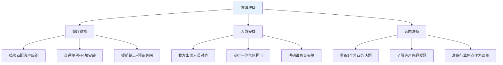

**宴前准备清单：**

| 准备项 | 具体内容 | 注意事项 |
|--------|---------|---------|
| 餐厅选择 | 中高档中餐厅，有独立包间 | 提前确认是否有客户忌口或宗教饮食要求 |
| 座次安排 | 主宾坐在面向门口的位置，主陪坐在对面 | 了解中国商务座次礼仪 |
| 酒水准备 | 白酒+红酒+无酒精饮料各备 | 提前了解客户饮酒偏好，绝不劝酒 |
| 话题准备 | 行业趋势、体育赛事、旅游见闻 | 避免政治、宗教、个人隐私话题 |
| 买单安排 | 提前和服务员说好，买单时不要当着客户的面 | 可以借口去洗手间时买单 |

**中式商务宴请座次安排：**

```text
        ┌──────────────────────┐
        │      门 口            │
        └──────────────────────┘

   主陪(陈明)            副主陪
        ┌──────────────────────┐
   三宾 │                      │ 副主宾
        │        桌 面          │
   四宾 │                      │ 主宾(王总)
        └──────────────────────┘

主宾：面向门口的尊位（客户决策人王总）
主陪：坐在主宾对面（我方最高级别陈明）
副主宾：坐在主宾右侧
副主陪：坐在主陪右侧
```

**宴请过程中的沟通节奏：**

| 阶段 | 时间占比 | 沟通内容 | 注意事项 |
|------|---------|---------|---------|
| 寒暄入座 | 前15分钟 | 轻松话题、感谢光临 | 不谈业务，营造舒适感 |
| 点菜环节 | 5分钟 | 先请客户点，尊重偏好 | 注意荤素搭配、口味平衡 |
| 酒过三巡 | 30分钟 | 行业八卦、趣事分享 | 观察客户状态，适度饮酒 |
| 话题深入 | 20分钟 | 自然过渡到合作话题 | 不是正式谈判，而是试探意向 |
| 告别致谢 | 最后10分钟 | 感谢、后续安排 | 安排代驾或出租车 |

**商务宴请的核心原则：**

| 原则 | 具体做法 | 违反后果 |
|------|---------|---------|
| 适度原则 | 饮酒适量，不劝酒不灌酒 | 客户反感，甚至影响合作关系 |
| 尊重原则 | 尊重客户的饮食习惯、文化禁忌 | 冒犯客户，损害公司形象 |
| 自然原则 | 不要过于殷勤，保持自然的交流节奏 | 让客户感到被"套路" |
| 边界原则 | 不涉及敏感话题，不过度打探隐私 | 引起不适，破坏信任 |
| 收尾原则 | 宴请后24小时内发感谢信息，跟进约定事项 | 宴请效果减半 |

***

## 十二、商务出差与跨城协作实战案例

商务出差是将线上沟通转化为面对面交流的关键机会。一次高效的出差不仅是"去见面"，更是"带着目标去，带着结果回"的系统化行动。

### 案例：跨城市客户拜访

**场景：** 华东区销售经理刘洋需要出差到深圳拜访两家重要客户：一家是续约谈判（客户A），一家是新客户首次拜访（客户B）。出差时间2天。

**出差前准备清单：**

| 准备项 | 客户A（续约） | 客户B（新客户） |
|--------|-------------|---------------|
| 客户背景 | 上年度合作数据、续约条款草案 | 公司官网、行业报告、LinkedIn资料 |
| 沟通目标 | 确认续约意向、讨论涨价幅度 | 了解需求、建立关系、留下好印象 |
| 携带材料 | 合作数据报告、续约合同草案 | 公司介绍PPT、产品案例手册、名片 |
| 伴手礼 | 本地特产（轻量、不贵重） | 本地特产（轻量、不贵重） |
| 时间安排 | 上午拜访，充分讨论 | 下午拜访，建立初步关系 |

**出差日程安排模板：**

```text
━━━━━━━━━━━━━━━━━━━━━━━━━━━━━━━━━━━━━━━━━━━
出差人：刘洋 | 目的地：深圳 | 时间：6/20-6/21
━━━━━━━━━━━━━━━━━━━━━━━━━━━━━━━━━━━━━━━━━━━

Day 1（6/20 周四）
08:00  航班出发
11:00  抵达深圳，入住酒店
14:00  拜访客户A（续约谈判）
       - 地点：客户A会议室
       - 我方出席：刘洋、技术支持王工
       - 对方出席：采购总监李总、采购经理
       - 预计时长：2小时
17:00  返回酒店，整理当日笔记
19:00  与客户A团队晚餐（已约定）

Day 2（6/21 周五）
09:00  拜访客户B（首次拜访）
       - 地点：客户B办公室
       - 我方出席：刘洋
       - 对方出席：技术总监张总
       - 预计时长：1.5小时
11:00  返回酒店，撰写出差报告
14:00  航班返回

━━━━━━━━━━━━━━━━━━━━━━━━━━━━━━━━━━━━━━━━━━━
```

**拜访客户后的跟进模板：**

| 时间 | 动作 | 内容 |
|------|------|------|
| 离开客户公司后1小时内 | 发感谢消息 | "王总，感谢您今天的宝贵时间，关于XX事项我会在下周一前给您回复。" |
| 24小时内 | 发送会议纪要 | 包含讨论要点、双方承诺、下一步计划 |
| 48小时内 | 内部同步 | 将客户拜访结果同步给相关同事和上级 |
| 约定时间前1天 | 履行承诺 | 在承诺的时间节点前完成约定事项 |

**出差报告模板：**

```text
━━━ 出差报告 ━━━
出差人：刘洋
时间：2024年6月20-21日
地点：深圳

━━━ 客户A拜访结果 ━━━
拜访目的：年度续约谈判
参与人员：我方2人，对方2人
核心结论：
1. 客户确认续约意向，合同金额预计增长15%
2. 客户提出增加XX服务需求，需产品部评估
3. 约定7月5日前发送修订版合同

下一步行动：
- [ ] 6/25前：产品部评估XX服务可行性（负责人：王工）
- [ ] 7/5前：发送修订版合同（负责人：刘洋）
- [ ] 7/10前：安排线上签约仪式（负责人：刘洋）

━━━ 客户B拜访结果 ━━━
拜访目的：首次拜访，建立关系
参与人员：我方1人，对方1人
核心结论：
1. 客户对我们的XX产品有明确需求
2. 预算范围在50-80万之间，决策周期约2个月
3. 竞争对手已在接触，需加快节奏

下一步行动：
- [ ] 6/25前：发送定制化方案（负责人：刘洋）
- [ ] 7/1前：安排技术演示（负责人：刘洋+王工）
```

***

## 本节小结

### 商务沟通实战案例全景图

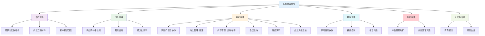

### 每类场景的核心方法论

| 场景类型 | 核心方法论 | 关键原则 |
|---------|-----------|---------|
| 商务邮件 | 金字塔原理 + 结构化模板 | 结论先行、信息完整、语气得当 |
| 商务谈判 | 哈佛谈判法 + BATNA/ZOPA分析 | 关注利益、创造价值、多维协商 |
| 跨部门协作 | RACI矩阵 + 激励机制设计 | 目标统一、责任明确、信息透明 |
| 向上管理 | SCQA框架 + 风险预判 | 数据说话、方案具体、降低风险感知 |
| 向下管理 | SBI反馈模型 + 渐进式辅导 | 对事不对人、共同决策、持续跟进 |
| 会议主持 | 议程驱动 + 行动项闭环 | 时间控制、结论明确、责任到人 |
| 商务演示 | 金字塔结构 + 数据故事化 | 结论先行、挑战有限、方案具体 |
| 数字沟通 | 结构化消息 + 语气管理 | 信息完整、语气友善、减少误解 |
| 文化适应 | 观察-模仿-试错-融入 | 小步快跑、保持内核、主动学习 |
| 危机沟通 | 黄金时间窗口 + 统一口径 | 速度第一、事实为王、持续跟进 |
| 商务宴请 | 尊重+自然+适度 | 不劝酒、不殷勤、保持边界 |
| 商务出差 | 目标导向+全程闭环 | 带着目标去，带着结果回 |

### 自我评估：你的商务沟通能力到了哪个阶段？

| 阶段 | 特征 | 你能做到的 | 下一步行动 |
|------|------|-----------|-----------|
| 入门 | 知道有这些沟通场景 | 能识别"什么是好的沟通" | 开始收集和分析自己的沟通案例 |
| 初级 | 掌握基本框架 | 写邮件会用结构化模板，开会能控制时间 | 在每次沟通后做5分钟的自我复盘 |
| 中级 | 灵活运用方法论 | 能根据场景选择合适的框架和话术 | 建立个人模板库，积累场景化经验 |
| 高级 | 形成个人风格 | 能即兴应对突发情况，沟通效果稳定 | 指导他人，将经验沉淀为团队方法论 |
| 专家 | 无招胜有招 | 沟通成为本能，能在复杂场景中找到最优解 | 持续学习，保持对新场景和新工具的敏感度 |

### 从案例到能力的转化路径

读完这些案例，不要止步于"了解了"。真正的学习闭环是：

1. **提取模式**：每个案例背后的通用模式是什么？（如邮件的金字塔结构、谈判的BATNA分析）
2. **套用自己的场景**：下次写邮件、开会、谈判时，套用对应的模式
3. **复盘优化**：每次实践后问自己——哪里做得好？哪里可以改进？
4. **建立个人模板库**：把有效的做法沉淀为自己的模板和清单

**推荐的个人模板库清单：**

| 模板类型 | 应包含内容 | 更新频率 |
|---------|-----------|---------|
| 邮件模板库 | 协作请求、汇报、投诉回复、催促等 | 每月更新 |
| 谈判准备清单 | 信息收集表、BATNA分析表、让步策略表 | 每次谈判前更新 |
| 会议模板 | 议程模板、纪要模板、行动项跟踪表 | 每季度优化 |
| 反馈话术库 | SBI模型示例、不同场景的开场白 | 持续积累 |
| 危机应对手册 | 声明模板、时间线模板、媒体应对话术 | 每半年演练一次 |

在下一节中，我们将分析商务沟通中的常见误区，帮助你避开那些"看起来对、实际上错"的做法。
