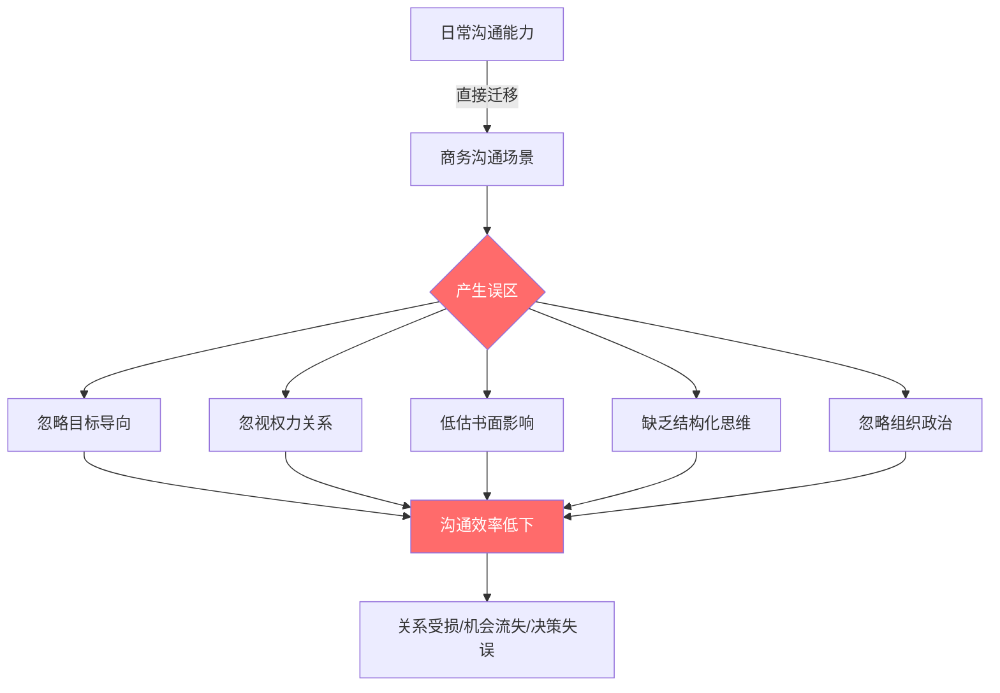
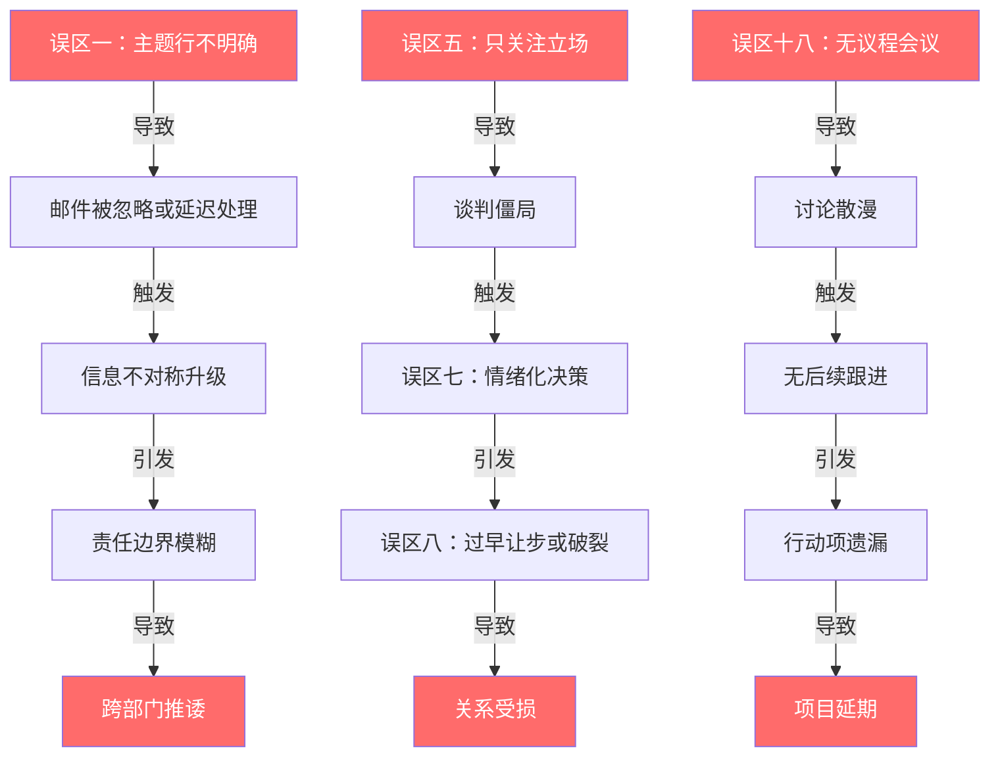
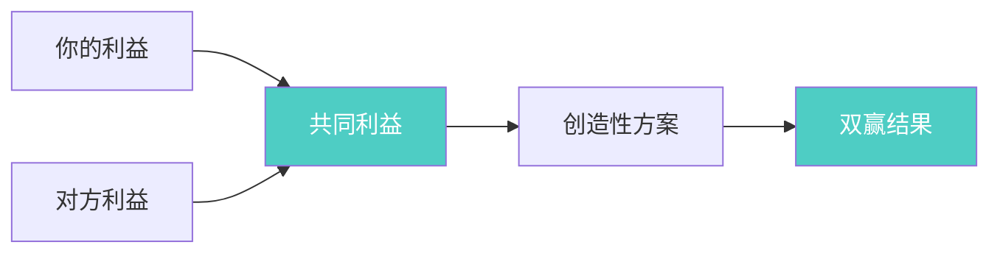
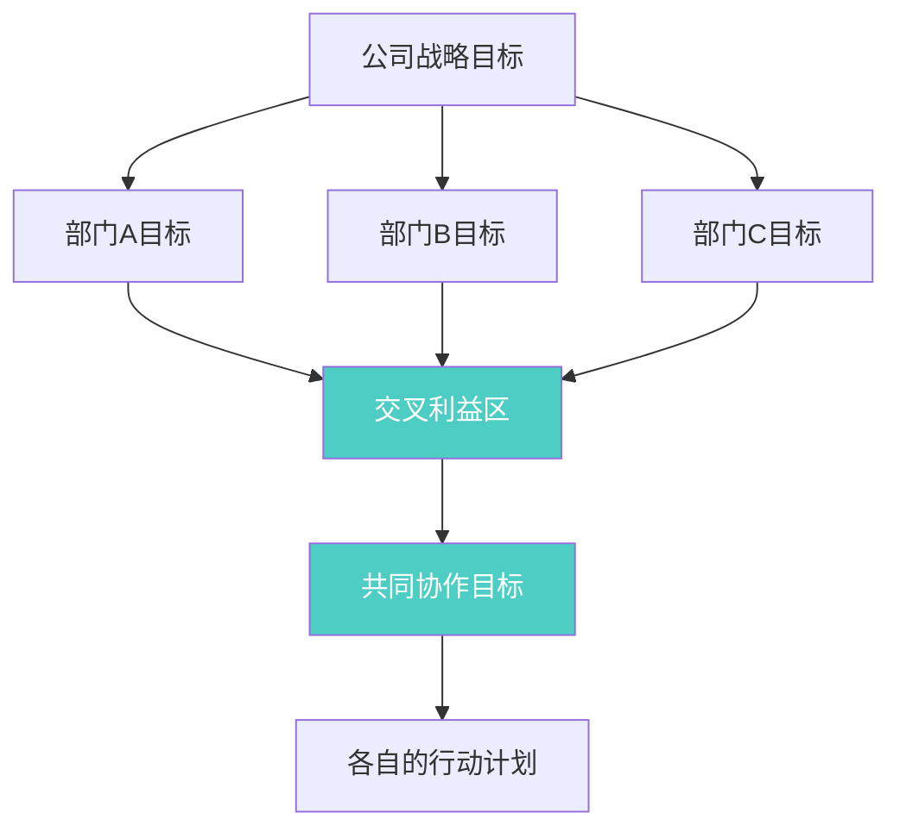
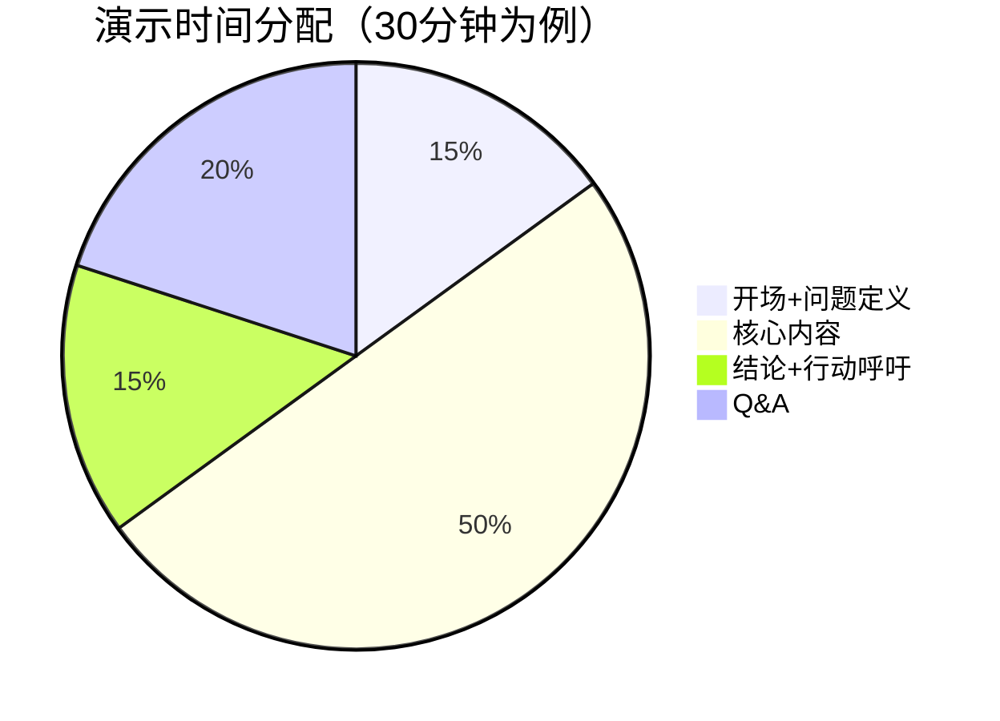
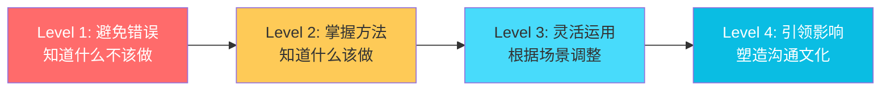

# 第二十章 商务沟通 — 常见误区

> 商务沟通中的错误往往不是因为"不知道正确做法"，而是因为**认知盲区**——我们根本没意识到自己正在犯错。本章系统梳理商务沟通七大领域中最常见的26个误区，每个误区都从"为什么会犯→具体表现→真实后果→纠正方法→进阶技巧"五个维度展开，帮助你建立全面的纠错能力。

## 误区产生的底层逻辑

在逐一分析具体误区之前，有必要理解为什么即使是经验丰富的职场人也会反复踩坑。认知心理学和组织行为学的研究揭示了几条规律：

### 认知偏差的系统性影响

人类大脑在处理信息时存在大量"快捷方式"（启发式），这些快捷方式在远古环境中帮助我们快速做判断，但在现代商务场景中却频频制造误判。Daniel Kahneman 在《思考，快与慢》中将这种机制称为"系统1"——自动、快速、无意识的思维模式。商务沟通中的大多数误区，本质上都是"系统1"在不该启动的场景中抢占了"系统2"（理性、有意识的分析）的工作。

根据康奈尔大学的研究，人类每天做出的决策中约有95%是由"系统1"驱动的——这意味着在绝大多数商务沟通场景中，我们的第一反应往往是直觉而非理性。更值得警惕的是，**越是经验丰富的人，越容易对自己的判断过度自信**，从而更难觉察自己正在犯错。这是"能力陷阱"（Competency Trap）在沟通领域的体现：过去的成功经验固化了你的沟通模式，当环境变化时，你依然用旧模式应对新场景。

| 偏差类型 | 在商务沟通中的表现 | 典型误区 | 心理机制 |
|---------|------------------|---------|---------|
| 确认偏误 | 只关注支持自己观点的信息 | 谈判中只听自己想听的 | 大脑倾向于寻找"证据"来验证已有信念，而非客观评估 |
| 达克效应 | 低估沟通任务的复杂度 | 认为"写个邮件有什么难的" | 能力不足者往往意识不到自己能力不足 |
| 锚定效应 | 被第一印象或先入信息主导 | 邮件主题行误导收件人判断 | 后续判断会不自觉地向"锚点"靠拢 |
| 虚假共识 | 假设别人和自己想法一致 | 跨部门协作中"以为他们知道" | 高估他人与自己观点一致的程度 |
| 损失厌恶 | 害怕失去而做出非理性决策 | 谈判中过早让步以求"保住"关系 | 同等金额的损失带来的痛苦是收益带来的快乐的2-2.5倍 |
| 近因效应 | 被最近发生的信息过度影响 | 因为最近一次失败而否定整个方案 | 最近的记忆对判断的影响远大于更早的信息 |
| 光环效应 | 因为某人的某个优点而全面高估他 | 被"大厂背景"蒙蔽而忽略实际能力 | 一个正面特征会"辐射"到对整体的评价 |
| 沉没成本 | 因为已经投入太多而不愿放弃 | 谈判僵局中不愿改变策略 | 过去的投入不应该影响未来的决策，但人类很难做到 |

### 组织环境的结构性压力

职场中的沟通失误不只是个人能力问题，还受到组织结构的影响：

- **层级压力**：下属不敢向上汇报坏消息（误区十二），上级忙到没时间给反馈（误区十六）。哈佛商学院 Amy Edmondson 的"心理安全"研究表明，在层级分明的组织中，基层员工传递负面信息的概率比扁平组织低60%。
- **部门墙**：不同部门有不同的KPI、语言体系和优先级，天然存在沟通障碍（误区九、十、十一）。麦肯锡2023年的调研显示，大型企业中跨部门信息传递的损耗率高达40%。
- **时间压力**：紧急事务挤占了沟通的准备时间，导致邮件仓促、会议无议程（误区一、十八）。
- **信息不对称**：每个人掌握的信息不同，但往往假设别人也知道自己知道的事。这是"知识的诅咒"（Curse of Knowledge）在组织层面的放大。
- **绩效导向的副作用**：当KPI只考核个人产出时，帮助他人沟通变成了"不产出"的行为。组织设计在无形中惩罚了协作。

### 技能迁移的失败

很多人在日常社交中沟通能力不错，但到了商务场景就频频出错。原因是商务沟通有其独特的规则体系——它不是"聊天的正式版"，而是一套有明确目标、利益关系和组织约束的专业技能。

这种迁移失败的根源在于"框架效应"（Framing Effect）——我们在社交场景中形成的沟通"框架"会被不自觉地带入商务场景。例如，在朋友之间，"随便啦"是一种轻松友好的表达；但在商务邮件中，"随便"会被解读为不重视、不专业。同一个词，换了场景，含义天差地别。美国管理协会（AMA）的调研显示，**新晋管理者中有多达67%的人在上任第一年因为沟通方式未能从"同事模式"切换到"管理角色模式"而遭遇团队信任危机**。

**日常沟通 vs 商务沟通的核心差异：**

| 维度 | 日常沟通 | 商务沟通 |
|------|---------|---------|
| 目标 | 社交、情感连接 | 达成特定业务目标 |
| 记录 | 通常不保存 | 往往有书面记录，可追溯 |
| 关系 | 平等、自由选择 | 存在权力结构和利益关系 |
| 后果 | 误会可以当面澄清 | 误可能导致合同纠纷、信任危机 |
| 受众 | 熟悉你的表达习惯 | 可能完全不了解你的背景 |
| 语言 | 可以随意、省略 | 需要精确、完整、无歧义 |
| 时间 | 没有截止日期 | 往往有明确的时间约束 |
| 反馈 | 即时、双向 | 延迟、单向，甚至无反馈 |

理解了这些底层原因，接下来逐一拆解每个误区时，你会更容易理解"为什么明明知道却还是会犯"。

### 误区之间的关联效应

值得注意的是，这26个误区并非独立存在——它们往往相互触发、层层叠加，形成"误区连锁反应"。理解这些关联，才能从根本上避免系统性的沟通失败。

**典型的"误区连锁"场景：**

| 起始误区 | 连锁路径 | 最终后果 | 修复成本 |
|---------|---------|---------|---------|
| 邮件主题模糊（误区一） | 被忽略 → 关键信息缺失 → 任务遗漏 | 项目延期1-2周 | 重新协调+补救 |
| 只关注立场（误区五） | 谈判僵局 → 情绪化 → 过早让步 | 损失5-15%谈判价值 | 关系修复需数月 |
| 只报喜不报忧（误区十二） | 上级误判 → 资源分配错误 → 问题恶化 | 项目失败/重大损失 | 可能不可逆 |
| 无议程会议（误区十八） | 讨论散漫 → 无结论 → 无跟进 | 每周浪费10+人时 | 持续累积 |
| 抄送武器化（误区四） | 信任破裂 → 防备心态 → 沟通降级 | 协作效率断崖式下降 | 需长期修复 |
| 忽视书面记录（误区二十六） | 口头共识 → 理解偏差 → 执行分歧 | 合同纠纷/返工 | 法律风险+金钱损失 |

**打破连锁反应的关键干预点：** 如果只能改善一个环节，选择"信息传递的准确性"——它是大多数误区连锁的共同源头。确保邮件主题清晰、会议有纪要、口头沟通有书面确认，就能切断至少60%的误区连锁路径。

---

## 一、商务邮件的误区

邮件是商务沟通中使用频率最高的工具，也是最容易被轻视的工具。Radicati Group 的统计显示，职场人平均每天收到121封邮件，每周花在邮件上的时间超过5小时。一封写得差的邮件不只是"不专业"——它会浪费收件人的时间、造成信息遗漏、甚至引发不必要的冲突。

### 误区一：主题行不明确

**为什么会犯这个错：**

发件人在写邮件时，脑子里已经清楚这封邮件要说什么，因此觉得主题行随便写写就行。但收件人面对的是一个塞满未读邮件的收件箱，需要在几秒内判断这封邮件是否需要立即处理。主题行就是这扇门。更深层的原因是"知识的诅咒"——你知道邮件内容，所以觉得主题行的含义是"显而易见的"。

**具体表现：**
- 主题行空白或过于简单（如"你好"、"请查收"、"一个问题"、"帮忙看看"）
- 主题行没有概括邮件的核心内容
- 同一个邮件线程中主题与内容脱节（主题是"会议"，内容变成了"预算审批"）
- 使用模糊的时间词（如"关于下周的事"——下周几？哪件事？）
- 连续使用"Re: Re: Re:"回复链，主题行失去信息价值
- 在主题行中使用过多缩写或内部术语，外部收件人无法理解

**真实后果：**

一封主题行模糊的邮件在收件人打开之前就输了。微软研究院的一项实验表明，收件人平均花3-5秒扫视收件箱来决定优先级。主题行不明确的邮件被延迟处理的概率是主题明确邮件的4.7倍，而延迟处理意味着：关键决策被拖延、机会窗口关闭、甚至被直接忽略。在搜索历史邮件时，模糊的主题行让信息检索变成大海捞针。

**纠正方法：**

遵循 **"动作+对象+关键信息"** 公式：

| 差的主题行 | 好的主题行 | 改进点 |
|-----------|-----------|--------|
| "请查收" | "【审批】Q3市场预算方案 - 请于6/30前批复" | 明确动作(审批)、对象(Q3预算)、截止日期 |
| "会议" | "【会议邀请】产品评审会 7/2 14:00-15:30 B301" | 包含时间、地点、会议类型 |
| "一个问题" | "【求助】客户XX投诉退款流程卡在财务部" | 明确紧急程度、具体问题 |
| "Re: Re: Re: 项目进展" | "【更新】XX项目里程碑3提前完成 - 附验收报告" | 脱离无效的回复链，重新定义主题 |
| "你好" | "【咨询】贵司定制开发服务报价周期及付款条件" | 明确邮件目的和需要的信息 |

**进阶技巧：**
- 使用统一的标签体系（如【审批】【通知】【请求】【FYI】【紧急】【确认】），让收件人一眼分类
- 如果邮件需要对方在特定时间前回复，在主题行注明"请于X月X日前回复"
- 对于定期发送的报告类邮件，保持主题格式一致，方便收件人设置过滤规则
- 当邮件线程的主题发生变化时，主动修改主题行或开启新邮件
- 对于紧急邮件，在主题行使用标记但要克制——频繁使用【紧急】等于"狼来了"
- 跨时区邮件在主题行标注时区：【请于6/30 18:00 CST前回复】避免时区混淆
- 转发邮件时重新撰写主题行，而非保留原主题——原主题可能与转发目的无关
- 主题行长度控制在6-10个词之间（约50个字符），过长会在移动端被截断

### 误区二：邮件正文缺乏结构

**为什么会犯这个错：**

很多人写邮件的方式和写微信消息一样——想到什么写什么，不做结构规划。但邮件和即时消息的根本区别在于：邮件是异步沟通，收件人可能在忙碌中打开你的邮件，如果不能在30秒内抓住重点，这封邮件的效果就大打折扣。另一个原因是缺乏"读者意识"——写作者从自己的角度组织信息，而不是从读者需要的角度。

**具体表现：**
- 邮件内容冗长，包含大量不必要的背景信息
- 重要信息被淹没在大段文字中，收件人需要反复阅读才能找到关键点
- 一封邮件讨论多个不相关的主题
- 没有明确的行动请求（Call to Action），收件人读完不知道要做什么
- 使用大段落叙述，没有列表、粗体等视觉组织手段

**真实后果：**

某科技公司的项目经理曾做过统计：一封结构混乱的邮件平均需要收件人花4.2分钟阅读和理解，而一封结构清晰的邮件只需要1.5分钟。如果一个团队每人每天收到10封这样的邮件，一个20人的团队每周就会浪费约17.5小时——相当于2个全职人力。更严重的是，结构混乱的邮件导致的"信息遗漏"会引发连锁反应：遗漏的行动项导致项目延期、关键条件被忽略导致合同纠纷、模糊的请求导致"每个人理解不同"的执行偏差。

**纠正方法：**

采用 **"金字塔邮件结构"**（源自Barbara Minto的金字塔原理）：

第一层（前2行）：核心结论/请求 + 为什么这封邮件发给你
  ↓ 读者决定是否需要继续读
第二层（中间段）：支撑信息，用编号列表组织（3-5条为佳）
  ↓ 提供足够的信息让读者做判断
第三层（末尾）：明确的行动项 + 截止时间
  ↓ 告诉读者"接下来你需要做什么"
第四层（附件）：详细资料放在附件中
  ↓ 需要深入了解的人可以自行查看

**实际模板示例：**

主题：【审批】市场部Q3预算方案调整 - 请于6/30前批复

王总，

附件是调整后的Q3市场预算方案（较原方案减少12%），
需要您在6月30日前批复，以便7月初启动采购流程。

主要调整如下：
1. 线下活动预算削减40%，转投线上精准投放
2. 新增KOL合作预算15万（ROI预估1:5）
3. 品牌物料预算维持不变

详细数据见附件PPT第3-7页。

行动项：
- 请您在6/30前批复附件方案
- 如需讨论，我可以安排明天下午的30分钟会议

谢谢！
李明
市场部

**进阶技巧：**
- 每封邮件只讨论一个主题。如果需要讨论多个主题，分开发送或使用编号分隔
- 使用粗体标注关键数字、日期和人名
- 行动请求用独立的一段呈现，不要藏在正文中间
- 如果邮件超过一屏长度（约300字正文），考虑是否应该改为会议或电话
- 使用"TL;DR"（太长不看）摘要：在长邮件开头用一句话概括核心信息
- 附件命名要清晰："Q3预算方案_v2_0625.pptx"比"方案.pptx"好100倍
- 如果邮件需要多人分别执行不同任务，在末尾用表格列出每个人的行动项，避免"我以为那个不是我做"的遗漏

### 误区三：语气把控失当

**为什么会犯这个错：**

文字沟通丢失了93%的信息（根据Albert Mehrabian的研究，语调占38%，肢体语言占55%，语言内容仅占7%）。写邮件时我们脑子里有语气，但收件人读到的只是冰冷的文字。同一个句子"好的，我知道了"，可以是积极的确认，也可以是冷漠的敷衍——邮件里没有"读法"。更隐蔽的问题是"情绪泄露"——我们在情绪波动时写的邮件，会不自觉地带上攻击性或消极语气，而自己完全意识不到。

**具体表现：**
- 过于随意：在正式邮件中使用"嘿"、"哈喽"、"亲"、emoji表情
- 过于强硬：大量使用"必须"、"立刻"、"不允许"，缺乏缓冲语
- 被动攻击：用"如前所述"、"再次提醒"、"不知道你是否看到了我上一封邮件"暗示对方不配合
- 语气不一致：同一封邮件前半段很正式，后半段突然口语化
- 讽刺或挖苦：用"当然，如果你有时间的话"来表达不满
- 过度使用感叹号和问号："这个方案到底能不能做？！"

**真实后果：**
- 过于随意会让客户或上级觉得你不专业
- 过于强硬会让对方产生抵触心理，影响合作关系
- 被动攻击是最危险的——它不会立刻爆发，但会慢慢侵蚀信任关系
- 语气问题往往不会被直接指出，你可能永远不知道对方因为一封邮件改变了对你的看法
- Glassdoor 的调查显示，62%的职场人承认曾因一封邮件的语气问题而与同事产生隔阂

**纠正方法：**

建立 **"语气校准三步法"**：

**第一步：明确关系定位**

| 对象 | 推荐语气 | 称呼示例 | 用词注意 | 典型句式 |
|------|---------|---------|---------|---------|
| 上级/客户 | 正式、尊重、简洁 | "X总"、"X老师" | 用"请问"、"麻烦"、"建议" | "烦请您审阅""不知您意下如何" |
| 平级同事 | 专业、友好、直接 | 名字或"X哥/姐" | 可以稍微轻松，但保持专业 | "看看这样行不行""辛苦确认下" |
| 下属/实习生 | 清晰、鼓励、明确 | 名字 | 避免命令式，多用"请"、"能否" | "能否在X前完成""辛苦了" |
| 外部合作伙伴 | 正式、专业、礼貌 | "X总"、"X老师" | 避免内部术语和缩写 | "期待合作""如有疑问随时沟通" |
| 初次联系的人 | 正式、清晰、有礼貌 | "X总/老师" | 自我介绍要完整 | "冒昧打扰""感谢您的时间" |

**第二步：发送前做"语气审计"**
- 读一遍邮件，想象自己是收件人，第一反应是什么
- 检查是否有任何可能被误解为负面情绪的措辞
- 确认礼貌用语（请、谢谢、麻烦）的比例合理
- 使用工具：把邮件粘贴到文字转语音工具中"听"一遍，语气问题会立刻暴露
- "冷却法"：情绪激动时写的邮件，保存为草稿，隔1-2小时再看

**第三步：使用"三明治反馈法"处理敏感话题**
肯定/理解 → 问题/请求 → 感谢/期待

示例：
"感谢你在这个项目上的投入（肯定），
不过目前的进度落后了计划两周，我们需要调整时间线（问题）。
能否今天下午我们讨论一下可行的方案？（请求）
谢谢你的配合！（感谢）"

**被动攻击措辞的替换清单：**

| ❌ 被动攻击措辞 | ✅ 直接而礼貌的替代 |
|----------------|-------------------|
| "如前所述..." | "我想补充一下之前提到的..." |
| "再次提醒..." | "跟进一下：..." |
| "不知道你是否看到了我上一封邮件" | "方便时请查看我X日发的邮件，有问题随时沟通" |
| "我以为这一点已经很清楚了" | "这一点可能需要进一步说明..." |
| "希望你能理解" | "如果有什么不清楚的地方，请告诉我" |
| "我已经抄送了你的领导" | "已同步X总以便项目推进" |
| "这个之前已经说过了" | "之前提到的XX，我想确认一下是否已落实" |

### 误区四：抄送和密送使用不当

**为什么会犯这个错：**

抄送（CC）和密送（BCC）是邮件中最容易被忽视但影响最大的功能。很多人把抄送当作"广而告之"的工具，把密送当作"留证据"的手段，这些用法都会损害职场关系。更深层的原因是：抄送和密送涉及"信息权力"——决定谁能看到什么，本身就是一种权力行为。

**具体表现：**
- **抄送过度**：把所有人都抄送进去，导致收件箱爆炸，重要的人反而被淹没
- **抄送遗漏**：该知会的人没有抄送，事后被追问"为什么我不知道这件事"
- **抄送武器化**：故意抄送对方的上级来施压（"我已经抄送了你的领导"）
- **密送滥用**：把同事密送给外部邮件，让他们"悄悄"看到往来内容
- **"回复全部"灾难**：本该只回复发件人的邮件，点了"回复全部"，把个人意见广播给所有人

**真实后果：**

抄送过度会导致"抄送疲劳"——人们开始忽略所有CC的邮件，真正重要的抄送信息也被错过。根据 McKinsey 的数据，职场人平均每天花28%的时间处理邮件，其中约30%的邮件是不必要的抄送。而"抄送武器化"是职场中最常见的隐性攻击之一，它直接破坏信任关系——被"武器化抄送"过的同事，以后与你合作时会充满防备。

**真实案例：** 某公司两位部门经理长期合作不顺畅。A经理每次遇到分歧就抄送双方的VP，意图用"上级看到"来施压。B经理感到被针对，开始也抄送VP来自保。结果两位VP的收件箱被大量CC邮件淹没，开始忽略所有抄送邮件。三个月后，一个真正需要VP关注的关键项目风险被埋在了抄送洪流中，导致VP在最后一刻才发现问题，不得不紧急叫停项目——损失了两周的开发时间。

**纠正方法：**

建立清晰的 **抄送分类原则**：

| 字段 | 使用对象 | 目的 | 示例 | 注意事项 |
|------|---------|------|------|---------|
| 收件人（To） | 需要行动/回复的人 | 明确责任人 | 项目的直接执行者 | 每封邮件的To不宜超过5人 |
| 抄送（CC） | 需要知悉但不需要行动的人 | 信息同步 | 上级、协作部门负责人 | 抄送过多=信息噪音 |
| 密送（BCC） | 大规模通知、保护隐私 | 避免泄露收件人列表 | 全员通知、外部群发 | 不应用于"偷偷监视" |

**进阶技巧：**
- 如果你不确定是否需要抄送某人，宁可抄送——"知情过度"比"知情不足"的代价小
- 抄送上级时，在邮件正文中说明"已抄送X总以便知悉"，让所有人都知道
- 回复抄送邮件时，如果不需要所有人看到，只回复发件人
- 大规模群发时使用BCC，保护收件人隐私，同时避免"回复全部"灾难
- 当邮件线程不再需要某些抄送者知悉时，在回复中移除他们
- 设置邮件规则：自动将CC的邮件标记为低优先级，To的邮件标记为高优先级，避免抄送洪流淹没关键邮件

---

## 二、数字平台的特殊误区

在数字化办公时代，即时通讯工具（企业微信、飞书、钉钉、Slack）已成为商务沟通的重要战场。这些平台带来了全新的误区类型，传统的邮件误区分析无法覆盖。即时通讯工具的核心矛盾在于：**它暗示"即时响应"，但深度工作需要"不被打断"**。加州大学欧文分校 Gloria Mark 教授的研究表明，每次被打断后，平均需要23分钟才能恢复到之前的专注状态。

| 平台特有行为 | 为什么是误区 | 正确做法 | 影响程度 |
|------------|-----------|---------|---------|
| 群聊中@所有人发送非紧急信息 | 消耗所有人注意力，制造"狼来了"效应 | 只@相关人，非紧急信息用普通消息 | 高——降低通知敏感度 |
| 用语音消息传递复杂信息（超过3条） | 接收方无法快速检索、转发、存档 | 复杂信息用文字+结构化格式，语音只用于简单通知 | 高——信息失真率上升40% |
| 深夜/周末发工作消息（非紧急） | 制造隐性加班压力，模糊工作边界 | 用定时发送功能，或标注"不急，工作日处理即可" | 中——影响团队心理健康 |
| 在群聊中讨论需要决策的复杂问题 | 信息碎片化，难以追踪结论 | 复杂议题转为会议或协作文档 | 高——决策质量下降 |
| 频繁撤回消息 | 引发猜测和不信任 | 发送前检查，减少撤回频率 | 中——损害专业形象 |
| 截图代替文字描述问题 | 无法搜索、无法被辅助工具处理、信息丢失 | 文字描述为主，截图作为补充 | 中——降低协作效率 |
| 状态签名长期显示"忙碌/会议中" | 失去信号价值，同事无法判断你的真实状态 | 及时更新状态，不用时清除 | 低——但累积影响团队协作节奏 |
| 群聊中用长语音讨论技术方案 | 无法回溯、无法引用、无法存档 | 技术方案必须文字化，语音只做补充 | 高——技术决策缺乏记录 |

**即时通讯的"响应时间陷阱"：** 不同于邮件的异步预期，即时通讯工具天然暗示"即时响应"。正确做法是：设置"专注时间"（如每天上午9-11点不回复即时消息），在状态中注明，让同事知道何时可以找到你。团队层面可以约定"响应时间SLA"——非紧急消息4小时内回复，紧急消息30分钟内回复，真正紧急的事打电话。

**数字沟通的"信息碎片化"问题：** 一个重要的项目决策被分散在50条群聊消息中，3天后没人能完整还原当时的讨论过程。解决方案：群聊中讨论后，将结论整理到协作文档中（Notion/语雀/飞书文档），附上讨论日期和参与人，让信息有"归宿"。

---

## 三、商务谈判的误区

谈判是商务沟通中利益冲突最直接的场景。哈佛商学院的研究表明，超过70%的商务谈判未能达到双方都满意的结果——不是因为利益真的不可调和，而是因为参与者陷入了认知和行为的误区。谈判专家William Ury指出："谈判桌上最大的敌人不是对方，而是你自己的假设和情绪。"

### 误区五：只关注立场，不关注利益

**为什么会犯这个错：**

立场（Position）是"我要什么"，利益（Interest）是"我为什么要这个"。人们本能地从立场出发谈判，因为立场比利益更容易表达——说"我要降价10%"比解释"我需要控制本季度的成本"简单得多。但坚守立场往往导致谈判僵局。哈佛谈判项目（Harvard Negotiation Project）的核心发现就是：立场之争是谈判失败的首要原因。

**具体表现：**
- 坚持自己的立场不愿让步，把谈判变成"看谁先眨眼"的拉锯战
- 将谈判视为零和游戏——"我赢你就要输"
- 忽略对方的真实需求，只看对方的表面要求
- 被面子问题绑架，即使发现更好的方案也不愿改变立场
- 用"要么接受要么拉倒"的方式回应对方的提案

**真实案例：**

两个部门争抢一间朝南的会议室。A部门需要朝南是因为需要自然光做设计评审，B部门需要这间会议室是因为离他们的工位近。如果只看立场，这是一场零和博弈。但如果深挖利益：A部门真正需要的是自然光（可以换任何有自然光的会议室），B部门真正需要的是距离近（任何隔壁的会议室都行）。最终的方案是给A部门另一间朝南的会议室，这间给了B部门——双方都赢了。

**纠正方法：**

运用 **"利益挖掘四步法"**（源自《Getting to Yes》）：

这四步法源自哈佛谈判项目的Roger Fisher和William Ury，经过全球数千场谈判验证。核心洞察是：**当双方从"立场对抗"转向"利益合作"时，创造性方案出现的概率提升3倍以上**（来源：哈佛谈判项目纵向追踪研究）。

**第一步：准备阶段——列出自己的利益清单**

不要只写"我要什么"，要写"我为什么需要这个"。通常一个立场背后有多个利益：

立场：要求供应商降价10%
├── 利益1：本季度预算超支，需要控制成本
├── 利益2：向财务部证明采购谈判能力
└── 利益3：为明年续约争取更好的基准价格

**第二步：提问阶段——理解对方的利益**

使用开放式问题挖掘对方的真实需求：
- "这个条件对你来说最重要的是什么？"
- "如果这个问题解决了，对你有什么帮助？"
- "你能告诉我你最担心的是什么吗？"
- "如果不降价，有什么其他方式可以帮你解决成本问题？"

**第三步：重构阶段——找到共同利益**

将双方的利益清单放在一起，寻找交集和互补点：

**第四步：创造阶段——设计满足多方利益的方案**

- 将议题拆分：不同议题上可以有不同方向的让步
- 引入新资源：有没有可以一起做大的蛋糕？
- 交换偏好：你更在意价格，对方更在意交付时间——交换
- 时间维度：短期让步换长期利益，或反过来

### 误区六：没有准备BATNA

**为什么会犯这个错：**

BATNA（Best Alternative to a Negotiated Agreement，最佳替代方案）是谈判中最重要但最容易被忽略的概念。很多人带着"一定要达成协议"的心态上谈判桌，结果在谈判中处于被动，因为"没有退路"。BATNA的本质是"你不需要这笔交易"——当你真的不需要时，你在谈判中的议价能力会完全不同。

**具体表现：**
- 没有准备替代方案，离开谈判桌就无路可走
- 在谈判中因为害怕"谈崩"而不断让步
- 容易接受明显不利于自己的条件
- 低估自己的议价能力，高估对方的议价能力
- 把"对方说了算"当成事实，而不是去创造更多选择

**真实案例：**

某创业公司在融资谈判中，因为只和一家投资机构谈，没有准备替代方案，被对方压低了估值30%。后来复盘发现，如果同期接触2-3家投资机构，不仅估值不会被压低，还可能获得更好的条款。这个教训的价值是数百万。另一个反面案例：某供应商在续约谈判中以为客户"别无选择"（对方已经深度集成了自己的产品），结果客户悄悄引入了竞品POC，在续约时拿着竞品的报价来压价——供应商措手不及，不得不做出大幅让步。

**BATNA的常见认知误区：**

| 误区 | 真相 | 后果 |
|------|------|------|
| "我没有BATNA" | 每个人都有BATNA，只是你没有系统地思考它 | 被动接受不利条件 |
| "我的BATNA很弱所以不值得准备" | 即使弱BATNA，量化它也能帮你设定底线 | 底线模糊，谈判中迷失 |
| "BATNA越强越好，可以直接摊牌" | BATNA是内在筹码，不是用来威胁的武器 | 破坏关系，对方可能做出非理性反应 |
| "BATNA准备一次就够了" | BATNA是动态的，谈判过程中持续变化 | 用过时的BATNA做判断 |

**纠正方法：**

**谈判前的BATNA准备清单：**

1. 明确你的BATNA是什么
   - 如果这次谈判没有达成协议，你的备选方案是什么？
   - 这个备选方案的实际可行性有多高？
   - 你的BATNA是否需要额外的时间/成本才能实现？

2. 评估你的BATNA的价值
   - 用具体数字衡量BATNA能给你带来什么
   - 这就是你的"底线"——低于这个价值就不值得谈
   - 量化BATNA的隐性成本（时间、关系、机会）

3. 尽可能改善你的BATNA
   - 接触更多的潜在合作伙伴
   - 准备更多的替代方案
   - BATNA越强，你在谈判中的议价能力越大
   - 关键策略：同时推进多个选项，让每个选项都更具体

4. 评估对方的BATNA
   - 对方的替代方案是什么？
   - 对方离开谈判桌会怎样？
   - 对方的时间压力是什么？
   - 对方在此次谈判中的决策权限有多大？

5. 设定你的"底线"和"理想目标"
   - 底线 = BATNA的价值（低于此不成交）
   - 理想目标 = 对你最有利的结果
   - 目标区间 = 从底线到理想目标之间的范围
   - 准备"如果对方低于底线"的退出话术

**进阶技巧：**
- BATNA不是静态的——在谈判过程中，持续改善你的BATNA
- 不要暴露你的BATNA有多弱（或有多强）
- 如果你的BATNA很强，可以在适当时候暗示对方，但不要威胁
- 如果你的BATNA很弱，把精力放在理解对方的利益上，寻找创造性方案
- "沉默的力量"：当对方抛出一个你不喜欢的条件时，不回应比立刻反驳更有力量——让沉默传递"这个条件不够好"的信号

### 误区七：情绪化决策

**为什么会犯这个错：**

谈判桌上的压力会触发人类的"战或逃"反应——杏仁核劫持了前额叶皮层，理性思考能力急剧下降。神经科学研究表明，当人处于强烈情绪状态时，前额叶皮层（负责理性决策）的活动会降低30-40%。当对方使用激进策略（如最后通牒、人身攻击、虚假截止日期）时，这种情绪反应尤其强烈。

**具体表现：**
- 在谈判中发怒或沮丧，做出冲动的让步或对抗
- 把对方的战术攻击当成个人冒犯
- 因为"咽不下这口气"而拒绝合理的方案
- 在情绪激动时做出承诺，事后后悔
- 用"以其人之道还治其人之身"的方式回应对方的激进策略，导致谈判破裂

**真实后果：**

心理学研究表明，情绪激动时做出的决策，事后满意度比理性决策低40%以上。更严重的是，一次情绪化的谈判可能毁掉多年的商业关系。在实际案例中，某公司采购总监因为在价格谈判中被供应商激怒，当场摔门而出，结果不仅失去了该供应商的合作（对方选择不再续约），还在行业内留下了"难合作"的口碑，影响了与其他供应商的谈判。

**纠正方法：**

**情绪管理的"STOP"技术：**

| 步骤 | 动作 | 谈判中的应用 | 生理基础 |
|------|------|------------|---------|
| **S** - Stop（暂停） | 意识到情绪正在上升 | "我注意到我开始紧张了" | 激活前额叶的觉察能力 |
| **T** - Take a breath（呼吸） | 做3次深呼吸（4秒吸-7秒呼） | 利用喝水、翻笔记的间隙 | 激活副交感神经系统，降低心率 |
| **O** - Observe（观察） | 观察自己的想法和感受 | "我现在想反击，但这是理性的吗？" | 创造"刺激"和"反应"之间的空间 |
| **P** - Proceed（继续） | 基于理性而非情绪行动 | "让我们回到议题本身" | 由前额叶而非杏仁核驱动决策 |

**实用的谈判冷静技巧：**
- 要求休息："我需要5分钟整理一下思路，我们10分钟后继续？"——这不是示弱，而是专业
- 转移注意力：在笔记上写下你听到的事实，而不是你的反应
- 把"人"和"问题"分开：对方的策略不等于对方这个人
- 提前演练：在谈判前模拟对方可能使用的激进策略，做好心理准备
- 设定"情绪触发器"清单：识别哪些话题/行为最容易让你情绪化，提前准备应对方案
- 随身携带"提醒卡"：写下你的底线和核心利益，情绪上来时看一眼
- 安排一个"冷静搭档"：重要谈判带上一个同事，当你情绪上头时由他来接手发言

### 误区八：过早让步

**为什么会犯这个错：**

让步是谈判的必要组成部分，但"何时让步"和"如何让步"比"是否让步"更重要。过早让步通常源于两种心理：一是急于达成协议（时间压力或关系压力），二是低估了自己的议价能力。行为经济学中的"锚定效应"也在此起作用——如果你先做出了大幅让步，对方会以此为"锚点"，期待你做更多让步。

**具体表现：**
- 在谈判初期就做出大的让步，"一上来就亮底牌"
- 让步没有换取对方的回报，变成单方面的"赠予"
- 让步幅度递减不明显（先让10万，再让8万，给对方的信号是"还能再让"）
- 多次小幅让步加起来超过了一次大幅让步
- 让步速度过快，没有给对方"消化"的时间

**真实案例：** 某公司在采购谈判中，采购经理因为急于完成季度KPI，在第一次报价时就给了供应商"目标价"（本来应该是底线价）。供应商一看还有空间，继续压价。最终成交价比预算多花了15%。如果采购经理按照"初始报价高出目标15-20%"的策略开价，完全可以在预算内完成采购。

**纠正方法：**

**让步的"四要四不要"原则：**

四要：
1. 要渐进式让步——每次让步幅度递减，暗示"空间越来越小"
2. 要交换式让步——"如果你能在X上做出调整，我可以在Y上考虑"
3. 要有条件让步——"如果订单量增加到XX，我可以给到XX价格"
4. 要有节奏——给对方消化和回应的时间

四不要：
1. 不要第一次报价就让步——这会让对方觉得你的报价"水分很大"
2. 不要在没有获得回报的情况下让步——每次让步都要换取对等价值
3. 不要让步太快——速度会泄露你的底线
4. 不要一次性让出所有空间——保留未来谈判的筹码

**让步节奏示例：**

假设你的价格底线是100万，初始报价是120万：
- 第一次让步：120万 → 116万（让4万）
- 第二次让步：116万 → 113万（让3万）
- 第三次让步：113万 → 111万（让2万）
- 第四次让步：111万 → 110万（让1万，接近底线）

每次让步幅度递减，信号是"空间越来越小"，而不是"还能继续让"。

**进阶让步策略——"打包式让步"：**

不要在单一议题上来回拉锯，而是把多个议题打包讨论：

议题1：价格（你让步）
议题2：付款条件（对方让步）
议题3：交货时间（你让步）
议题4：售后服务（对方让步）

打包方案："如果贵方能接受预付50%+到货50%的付款方式，
并在7月底前完成交货，我可以给到112万的价格并赠送一年延保。"

打包式让步的好处：双方都在某些议题上赢了，都在另一些议题上让了步——这才是谈判的正常节奏。

---

## 四、跨部门协作的误区

跨部门协作是现代企业中最普遍也最头疼的沟通场景。麦肯锡的研究显示，跨部门项目中有72%存在沟通障碍，而这些障碍中有65%源于"假设对方理解自己的需求"。组织行为学将这种现象称为"筒仓效应"（Silo Effect）——每个部门像一个独立的筒仓，内部信息高度集中，但与外部的信息交换极其有限。

**筒仓效应的深层机制：** 筒仓不只是组织结构问题，更是认知问题。每个部门有自己的"专业语言"——产品部说"用户故事"，工程部说"技术债"，市场部说"漏斗转化"，财务部说"ROI"。当这些语言体系没有被翻译时，同一个词在不同部门的含义完全不同。例如"优先级"：对产品部意味着"用户价值最高"，对工程部意味着"技术依赖最强"，对市场部意味着"时间节点最紧"。**如果不主动翻译，每个部门都在用自己的语言和别人对话，看似在沟通，实则各说各话。**

### 误区九：只关注自己的目标

**为什么会犯这个错：**

每个部门都有自己的KPI、考核周期和优先级。市场部要品牌曝光，销售部要短期转化，产品部要技术完美，财务部要控制成本。这些目标天然存在张力。当每个人只从自己的目标出发时，跨部门协作就变成了"各说各话"。更根本的原因是：部门KPI的设定方式往往在制度层面强化了"各扫门前雪"的行为——你只对自己的KPI负责，帮助其他部门不会计入你的绩效。

**具体表现：**
- 只关注自己部门的KPI，将其他部门的需求视为干扰
- 将跨部门协作视为"额外的负担"而非"共同的任务"
- 在资源分配时优先考虑自己的需求
- 用自己部门的语言和标准要求其他部门
- 对其他部门的困难缺乏同理心："这跟我们有什么关系？"

**真实案例：**

某公司的市场部和产品部因为"用户画像"的标准不同，浪费了3个月的时间。市场部按消费频次分类用户，产品部按使用时长分类用户，两组数据完全对不上。直到一次跨部门对齐会上才发现这个问题，但3个月的数据分析工作已经白费了。根本原因是两个部门从未坐下来对齐过"用户"这个基础定义——各自在自己的系统中埋头苦干，直到数据无法对接才发现问题。

**纠正方法：**

**建立"共同目标地图"：**

**具体步骤：**

1. **了解对方的KPI和压力**：主动了解其他部门的考核指标和当前面临的主要挑战。花15分钟和对方部门的负责人聊一聊"你们这个季度最头疼的事是什么"，比任何协作工具都有效。

2. **找到交叉利益区**：列出你的目标和对方的目标，找到重叠部分。例如：市场部要品牌曝光（目标A），销售部要销售线索（目标B），交叉区是"高质量内容营销"——既能建立品牌，又能吸引潜在客户。

3. **用对方的语言沟通**：和财务部谈ROI，和产品部谈用户体验，和销售部谈转化率。每个部门有自己的"货币"，用对方听得懂的语言表达你的需求。

4. **主动提供帮助**：在不影响自己核心目标的前提下，主动为其他部门提供支持。互惠原则（Robert Cialdini）表明，你帮助过的人更愿意在未来回报你。

### 误区十：信息沟通不充分

**为什么会犯这个错：**

这是跨部门协作中最致命的误区，因为它往往发生在"无意识"的状态下。我们对自己领域的知识太熟悉，以至于忘记了其他人并不知道这些信息。心理学上称之为"知识的诅咒"（Curse of Knowledge）。斯坦福大学的Elizabeth Newton通过一个实验验证了这一点：当一个人"敲"一首歌的节奏时，他预测听众能猜对的概率是50%，但实际猜对率只有2.5%——因为敲击者脑子里有旋律，而听众只有一串无意义的敲击声。

**具体表现：**
- 假设其他部门了解你的需求和进度
- 没有及时分享关键信息（如项目计划变更、客户反馈、技术限制）
- 信息传递链条过长，导致信息失真（"传话游戏"效应）
- 使用专业术语，导致跨部门理解困难
- 只分享"结论"不分享"背景"，导致对方无法独立判断

**纠正方法：**

**建立"信息同步四机制"：**

| 机制 | 频率 | 内容 | 工具 | 参与者 |
|------|------|------|------|--------|
| 站会同步 | 每日/每周 | 本周进展、阻塞问题、需要的支持 | 飞书/企微群 | 核心成员 |
| 里程碑对齐 | 按项目阶段 | 关键决策点、风险评估、资源需求 | 文档+会议 | 部门负责人 |
| 状态看板 | 实时更新 | 各模块状态、负责人、截止日期 | Notion/Jira/飞书多维表格 | 全体成员 |
| 复盘会 | 项目结束后 | 做得好的、需要改进的、经验教训 | 文档归档 | 全体成员 |

**信息传递的"五要素"检查法：**

每次传递跨部门信息时，确保包含：
1. **What**：发生了什么/需要什么——清晰的事实描述
2. **Why**：为什么重要/为什么要这么做——让对方理解优先级
3. **When**：时间节点/截止日期——明确时间预期
4. **Who**：谁负责/谁需要参与——明确责任人
5. **How**：下一步行动是什么——具体的执行路径

**破除"知识诅咒"的实用技巧：**
- 用"外行人能听懂吗"来检验你的表达——找一个不参与项目的同事帮你看邮件
- 在邮件开头用一句话概括背景："如果你是第一次听说这个项目..."
- 附上术语表，特别是跨技术/业务边界时
- 分享"为什么"而不只是"什么"——背景信息让对方能独立判断
- 使用"新人测试"：把你的需求文档给一个刚入职的同事看，如果他能理解，文档就合格了

### 误区十一：责任边界不清晰

**为什么会犯这个错：**

跨部门项目中，很多事情"好像应该A部门做"又"好像B部门也沾边"。当责任不清晰时，要么出现"三个和尚没水喝"——都指望对方做，要么出现"三个和尚抢水喝"——都在做同一件事。心理学中的"责任扩散效应"（Diffusion of Responsibility）在此发挥作用：当责任可以归于多人时，每个人承担的责任感都会降低。

**具体表现：**
- 没有在项目开始时明确各部门的角色和责任
- 出现问题时互相推诿，"这不是我们部门的事"
- 工作重叠（两组人做了同样的事）或遗漏（关键环节没人做）
- 会议中达成的共识没有明确的跟进人
- "灰色地带"的工作无人认领

**真实案例：** 某电商平台的"双十一"备战中，运营部和技术部都没有明确负责"大促应急预案"的编写。运营部认为"技术故障归技术部管"，技术部认为"业务场景归运营部定义"。结果大促当晚服务器过载，两边都没有准备好的应急预案，手忙脚乱地临时应对，影响了2小时的交易——直接损失超过200万元。事后复盘，一份10页的应急预案只需要3天就能完成，但因为责任不清，谁都没做。

**纠正方法：**

使用 **RACI矩阵** 明确责任（RACI是项目管理中广泛使用的责任分配工具）：

| RACI | 含义 | 适用场景 | 关键规则 |
|------|------|---------|---------|
| **R** - Responsible | 负责执行的人 | 实际做事的人 | 可以有多人，但需明确分工 |
| **A** - Accountable | 最终负责的人 | 拍板决策的人 | 每个任务只能有一个A |
| **C** - Consulted | 需要咨询的人 | 提供专业意见的人 | 有双向沟通，需要被征求意见 |
| **I** - Informed | 需要知会的人 | 了解进展但不参与决策 | 单向通知，不需要反馈 |

**RACI矩阵示例（新产品发布项目）：**

| 任务 | 产品部 | 市场部 | 技术部 | 销售部 | 客服部 |
|------|--------|--------|--------|--------|--------|
| 产品定义 | **R/A** | C | C | I | I |
| 技术开发 | C | I | **R/A** | I | I |
| 营销方案 | C | **R/A** | I | C | I |
| 销售培训 | C | C | I | **R/A** | I |
| 客服准备 | I | I | C | I | **R/A** |
| 上线协调 | **R/A** | C | C | C | C |

**注意事项：**
- 每个任务有且只有一个A（最终负责人），避免"集体负责=没人负责"
- R可以有多个，但必须明确分工（如"产品部负责功能定义，技术部负责技术可行性评估"）
- 项目启动时就完成RACI矩阵，而不是出了问题才来追溯
- 定期回顾RACI——随着项目进展，角色可能需要调整
- 将RACI矩阵以书面形式发给所有参与者确认
- 为"灰色地带"设置一个兜底角色——通常由项目经理或协调人承担

---

## 五、向上管理的误区

向上管理不是"拍马屁"，而是主动管理与上级的工作关系，确保信息流通顺畅、工作方向一致、资源获得支持。彼得·德鲁克说："你不必喜欢或崇拜你的上司，但你必须管理他，让他成为你达成目标、取得成就的资源。"向上管理的本质是一种"双向沟通的责任"——你比上级更了解一线情况，有责任确保关键信息不被遗漏。

### 误区十二：只报喜不报忧

**为什么会犯这个错：**

人类天生倾向于回避负面信息的传递——心理学上称之为"负面信息回避"（Negative Information Avoidance）。汇报坏消息意味着暴露问题，而暴露问题可能让自己显得能力不足。但这种"保护自己"的行为，在上级眼中恰恰是"不可靠"的表现。组织行为学的研究进一步发现，坏消息在组织层级中传递时会逐级"衰减"——每一层都会下意识地弱化问题的严重性，直到到达决策层时，问题已经被"美化"得面目全非。

**具体表现：**
- 只汇报好消息，对问题避而不谈
- 问题积累到无法掩盖时才汇报——此时往往已经错过了最佳解决时机
- 汇报时过度美化进度，让上级对真实情况产生误判
- 使用模糊语言回避问题（"有一些小挑战"实际上意味着"项目严重延期"）
- 只说"没问题"而不主动同步进展，让上级处于信息真空

**真实后果：**

2019年波音737 MAX事故的事后调查发现，工程师们在项目早期就发现了MCAS系统的安全隐患，但由于组织文化的压力，负面信息没有被有效传递到决策层。这不是个例——在企业中，"坏消息层层过滤"是导致重大决策失误的常见原因。在更日常的场景中，某项目经理因为不敢告诉上级"项目会延期两周"，直到上线前3天才汇报，结果整个营销计划、发布会安排、客户承诺全部打乱——如果提前2周汇报，团队完全有时间调整方案。

**纠正方法：**

**建立"红黄绿"汇报机制：**

这个机制的核心价值在于：它让上级对团队状态有**稳定的预期**。当所有信息都是"绿色"时，突然出现的"红色"会被认真对待；如果平时就不汇报，突然说"出问题了"，上级的第一反应往往是"为什么不早说"。

🟢 绿色：进展顺利，按计划推进
   → 定期同步进展，不需要额外行动

🟡 黄色：有风险或偏差，但可控，已采取措施
   → 主动告知上级风险存在，说明应对措施
   → 需要上级关注但不需要立即介入

🔴 红色：严重问题，可能影响关键里程碑，需要上级介入
   → 立即汇报，带着问题+影响分析+解决方案选项
   → 明确需要上级做的决策是什么

**坏消息汇报的"三步法"：**

第一步：陈述事实（不夸大、不缩小）
  "XX项目的开发进度落后原计划两周"

第二步：分析原因和影响
  "主要原因是第三方API的响应时间超出预期2倍，
   如果不调整方案，可能影响7月15日的上线时间"

第三步：提出解决方案（至少两个选项）
  "我建议两个方案：
   方案A：优化API调用逻辑，预计需要额外3天开发时间，但不改变上线日期
   方案B：先上线核心功能，非核心功能延后到7月底
   我倾向方案A，您觉得呢？"

**关键原则：**
- 早报比晚报好——问题越早暴露，解决成本越低（每延迟一周，解决成本增加约30%）
- 带着方案报问题——不只是"有问题"，而是"有问题+我的解决方案+需要你决策的点"
- 定期汇报而非等问题出现才汇报——建立固定的汇报节奏（如每周一封进展邮件）
- "坏消息"本身不丢人，"藏着坏消息"才丢人
- 建立"无惩罚汇报"文化：如果你是管理者，确保下属汇报坏消息时不会被追责，否则你收到的永远是"好消息"

### 误区十三：越级汇报

**为什么会犯这个错：**

越级汇报通常发生在三种情况下：一是觉得直接上级"不行"，想通过更高层推动事情；二是与更高层有私人关系，觉得"走捷径"更高效；三是事情紧急，来不及走正常流程。无论哪种情况，越级汇报的副作用往往超过收益。组织管理理论将越级汇报视为"组织信任的破坏者"——它绕过了正常的信息通道，暗示对直接上级的不信任。

**具体表现：**
- 绕过直接上级，向更高层汇报工作或问题
- 在更高层面前表达对直接上级的不满
- 利用与更高层的关系获取资源或特权
- 不告知直接上级就参加更高层的会议
- 通过邮件抄送来"悄悄"让更高层看到自己的工作

**真实后果：**

越级汇报的直接后果是失去直接上级的信任。你的上级会认为你不尊重他/她的权威，甚至怀疑你在"背后捅刀"。即使更高层采纳了你的意见，你的直接上级也会在后续工作中给你穿小鞋。更重要的是，这种行为会被同事看在眼里——没有人愿意和一个"爱打小报告"的人合作。从长远看，越级汇报会让你成为组织中的"孤岛"——虽然高层知道你，但中层和同级都排斥你。

**纠正方法：**

**越级汇报的"安全协议"：**

原则：能不越级就不越级

必须越级的情况（仅限以下场景）：
1. 直接上级的行为涉及违法违规
2. 直接上级明确表示不关心某个严重问题
3. 直接上级不可联系（如长期出差、生病）且事情紧急
4. 有制度化的越级通道（如公司设有"总裁信箱"）

越级前的必要步骤：
1. 先与直接上级沟通，告知你的意图
2. 如果直接上级不同意，记录沟通内容
3. 越级时，同时抄送直接上级（透明化）
4. 越级汇报后，主动告知直接上级汇报内容
5. 越级汇报的内容只涉及"事"，不涉及对"人"的评价

**更好的替代方案：**
- 与直接上级建立定期的1:1沟通机制，把问题在正常渠道内解决
- 如果直接上级确实不作为，先通过书面邮件留下记录
- 寻求HR或其他中立方的帮助，而不是直接跳到更高层
- 学习"向上影响"的技巧——让上级"主动"采纳你的想法，而不是你越过他

### 误区十四：被动等待指示

**为什么会犯这个错：**

很多职场人把"执行力强"理解为"领导说什么我就做什么"。但真正高效的执行者是"主动思考+主动行动"的。被动等待指示意味着你只是领导的"手"，而不是领导的"脑"。在快速变化的商业环境中，等指示的代价往往是错失机会。更深层的原因是对"犯错"的恐惧——"我不做就不会做错"是一种安全但消极的策略。

**具体表现：**
- 只在被要求时才行动，从不主动发现问题
- 遇到问题就上报，不带解决方案
- 不主动汇报工作进展，领导不问就不说
- 对超出职责范围的事情"视而不见"
- 把"等通知"当作正常工作节奏

**真实案例：** 某公司的两个产品经理，A和B，能力相当。A每天等领导分配任务，完成就交差；B每周主动发一封"本周洞察"邮件，包含竞品动态、用户反馈趋势、产品改进建议。半年后晋升评估时，B被提拔为高级产品经理——不是因为B做了更多的事，而是因为B展现了"战略视野"和"主人翁意识"。领导的评价是："A是一个好的执行者，B是一个可以独当一面的人。"

**纠正方法：**

**从"被动执行者"到"主动贡献者"的升级路径：**

| 层级 | 行为模式 | 上级的感受 | 示例 | 晋升信号 |
|------|---------|-----------|------|---------|
| Level 1 | 等待指令 | "这个人事事都要我说" | "领导，这个事怎么办？" | 执行力尚可，但缺乏独立思考 |
| Level 2 | 请示+带方案 | "这个人能帮我分担一些" | "领导，这个问题我建议A或B方案，您看哪个好？" | 开始展现分析能力 |
| Level 3 | 先行动再汇报 | "这个人很靠谱" | "领导，XX问题我已经解决了，向您汇报一下" | 具备独立处理能力 |
| Level 4 | 预判+预防 | "这个人可以独当一面" | "领导，我注意到XX风险，已经提前做了预防措施" | 有战略视野，值得提拔 |

**主动性的具体表现：**
- 每周主动发送工作周报（不等领导要）
- 发现潜在问题时主动提出预警和建议
- 了解领导的优先级，在领导关注的领域主动推进
- 对行业动态和竞品信息保持敏感，定期整理分享
- 主动承担模糊地带的工作——"没人管的事"是展现能力的最佳机会
- 在领导做决策前，主动准备好他需要的数据和选项

---

## 六、向下管理的误区

管理不是控制，而是赋能。向下管理的核心目标是让团队成员在你的带领下，能力持续成长、产出持续提升。管理大师Ken Blanchard说："最好的领导者是那些能培养出更多领导者的人。"以下是向下管理中最常见的三个误区。

**向下管理的核心矛盾：** 管理者面临一个永恒的张力——**短期产出 vs 长期发展**。如果你只关注短期产出，你会倾向于微观管理（确保每件事都按你的方式做）；如果你只关注长期发展，你会倾向于放养（给下属太多自由，可能产出不达标）。最好的管理者能够在两者之间找到动态平衡——在下属能力不足时多指导，在下属能力成熟时多授权。这种平衡不是一劳永逸的，而是需要根据每个下属的状态持续调整。

### 误区十五：微观管理

**为什么会犯这个错：**

微观管理的根源通常是三种心理：一是不信任下属的能力（"他做不好"），二是追求完美（"只有我才能做到标准"），三是缺乏安全感（"如果我不控制，出了问题怎么办"）。讽刺的是，微观管理恰恰会导致它试图避免的问题——下属因为不被信任而变得更加依赖和被动，形成恶性循环。

**具体表现：**
- 对下属的每个决策都要过问和批准
- 要求下属按照自己的方式执行任务，不允许任何偏差
- 关注过程中的每个细节，而不是最终结果
- 下属已经完成的工作，还要亲自修改
- 经常在非工作时间给下属发消息询问进展
- 对下属的工作方法指手画脚，即使结果达标

**真实后果：**
- 管理者成为团队的瓶颈——所有事情都要经过他，团队效率急剧下降
- 下属失去成长空间——没有试错的机会，就永远学不会独立决策
- 下属士气低落——不被信任的感觉会让人丧失工作热情
- 管理者自己精疲力竭——什么都管等于什么都管不好
- Gallup的调查显示，微观管理是员工离职的第三大原因，仅次于薪酬和职业发展

**真实案例：** 某互联网公司的技术主管习惯审查团队每一行代码，甚至要求下属按照他个人的代码风格来写。结果团队产出从每周交付3个功能下降到1个，两名核心工程师在3个月内离职。离职面谈中，他们的共同反馈是："没有成长空间，每件事都要按他的方式做。"这位主管后来被调离管理岗位——他个人的技术能力没问题，但他把"自己做得好"和"团队做得好"混为一谈了。

**纠正方法：**

**授权的"情境领导"模型**（源自Paul Hersey和Ken Blanchard）：

根据下属的能力和意愿水平，采用不同的管理方式：

| 下属状态 | 管理方式 | 管理者行为 | 沟通频率 | 典型对话 |
|---------|---------|-----------|---------|---------|
| 新人/能力弱+意愿高 | 指导型 | 明确告知怎么做，手把手教 | 高频、详细 | "先做A，再做B，遇到问题找我" |
| 有能力但信心不足 | 教练型 | 提问引导，鼓励尝试 | 中频、支持 | "你觉得可以怎么做？我支持你的决定" |
| 有能力但意愿低 | 支持型 | 了解原因，激励为主 | 中频、倾听 | "最近有什么困难？我能帮你什么？" |
| 能力强+意愿高 | 授权型 | 只看结果，给足空间 | 低频、信任 | "这个项目交给你，有问题随时找我" |

**授权的"三步走"：**
1. **明确目标和标准**：告诉下属"要做什么"和"做到什么程度算合格"，而不是"怎么做"
2. **给资源和支持**：确保下属有完成任务所需的权限、信息和工具
3. **定期检查点**：在关键节点检查进度，而不是每天盯细节

**管理者自检：** 如果你一天中超过50%的时间在审查下属的工作，你很可能在微观管理。目标应该是逐渐把时间从"审查"转向"战略思考"和"团队发展"。

### 误区十六：忽视反馈

**为什么会犯这个错：**

很多管理者觉得"没有消息就是好消息"——如果下属没有出错，就不需要特别说什么。但研究表明，员工最需要的不是"没有批评"，而是"明确的反馈"。不知道自己做得好不好，比知道做得不好更让人焦虑。Gallup的调查显示，只有26%的员工认为自己收到的反馈能有效帮助他们改进工作——这意味着74%的反馈要么缺失，要么质量不够。

**具体表现：**
- 整年不给反馈，只在年终考核时才"一次性"评价
- 只在出现问题时才给予反馈（负反馈），从不表达认可（正反馈）
- 反馈过于笼统（"做得不错"、"还需要努力"），缺乏具体信息
- 反馈不及时——问题发生一个月后才提，效果大打折扣
- 反馈只关注结果，不关注行为和过程

**真实案例：** 某公司的年终考核中，一位员工收到了"需要提升沟通能力"的评价。她非常困惑——全年没有人提过这个问题。追问后才知道，半年前的一次客户会议上，她的一封邮件让客户不满，但当时没有人告诉她。如果半年前就收到反馈，她有充足的时间改进；但半年后才被告知，她已经失去了6个月的成长机会。更糟糕的是，她开始质疑：还有多少问题是我做了但没人告诉我的？

**纠正方法：**

**反馈的"SBI模型"（Situation-Behavior-Impact）：**

| 要素 | 含义 | 正面反馈示例 | 改进反馈示例 |
|------|------|------------|------------|
| **S** - Situation（情境） | 具体的时间和场景 | "昨天下午的客户会议上..." | "本周的周报中..." |
| **B** - Behavior（行为） | 你观察到的具体行为 | "你在客户质疑价格时，先承认了客户的顾虑，然后用数据说明了性价比..." | "有三个数据的来源没有标注，客户可能质疑可信度..." |
| **I** - Impact（影响） | 这个行为产生的影响 | "这让客户的态度从对抗转为了合作，最终顺利签约" | "如果客户追问数据来源，我们可能需要额外时间准备" |

**反馈的"黄金比例"：**

研究建议，正反馈和负反馈的比例应为 **3:1 到 5:1**。也就是说，每指出一个问题之前，应该先认可3-5个做得好的地方。这不是"和稀泥"——正反馈建立信任基础，有了信任基础，负反馈才能被接受。

**定期反馈的"1:1会议"模板：**
每周/每两周一次，15-30分钟

1. 开场（2分钟）：最近感觉怎么样？有什么想聊的？
   → 建立安全感，了解下属的心理状态

2. 工作进展（5分钟）：本周最重要的成果是什么？遇到什么困难？
   → 了解工作状态，识别需要支持的地方

3. 反馈（10分钟）：最近做得好的地方 + 需要改进的地方
   → 使用SBI模型，具体而非笼统

4. 发展（5分钟）：有什么想学习的？需要什么支持？
   → 关注长期成长，而不只是当前产出

5. 总结（3分钟）：下周的重点是什么？有什么需要我帮忙的？
   → 明确下一步，结束时双方都有清晰的预期

### 误区十七：一刀切的管理方式

**为什么会犯这个错：**

管理是一种需要"因人而异"的技能，但很多管理者倾向于用同一种方式对待所有下属——要么都是"放养型"，要么都是"事无巨细型"。这种做法忽略了每个人在能力、动机、性格和职业阶段上的差异。心理学中的"相似性偏差"在此起作用——我们倾向于认为别人和自己一样，用自己喜欢的被管理方式去管理所有人。

**具体表现：**
- 对所有下属使用相同的管理风格
- 用同一套激励方式对待所有人（有人看重成长机会，有人看重稳定收入）
- 不了解下属的职业目标和个人需求
- 在分配任务时不考虑每个人的特长和发展需求
- 用"公平"的名义做"平均"的事——给每个人同样的任务量，不管能力和兴趣

**真实案例：** 某团队经理习惯用"放养式"管理，给下属充分自由。这对他团队中能力强、自驱力高的老员工非常有效，但对刚入职的新人却是灾难——新人缺乏方向指引，前三个月几乎没有任何产出，最终在试用期离职。另一个极端：某经理事无巨细地管控团队中的每一个人，包括一个有10年经验的高级工程师。这位工程师感觉自己不被信任，3个月后跳槽去了竞争对手。两种管理方式本身没有对错，错在用同一种方式对待不同的人。

**纠正方法：**

**了解下属的"四维画像"：**

维度一：能力水平 → 他/她能做什么？（当前技能+学习能力）
维度二：动机驱动 → 什么能激励他/她？（成就/权力/归属/自主/金钱）
维度三：工作风格 → 他/她喜欢怎样的沟通方式？（详细vs简洁，文字vs口头）
维度四：职业目标 → 他/她想去哪里？（管理路线/专家路线/创业/转行）

**个性化管理的实操建议：**
- 每个季度和每位下属做一次"职业发展对话"，了解他们的目标和需求
- 根据每个人的特长分配任务，让"对的人做对的事"
- 对于高潜力员工，主动提供挑战性任务和成长机会
- 对于需要稳定的员工，提供清晰的预期和稳定的工作环境
- 建立"下属档案"——记录每个人的特点、偏好和发展计划
- 注意"隐性激励"：有些人需要公开表扬，有些人更喜欢私下认可
- 对内向型员工，用书面沟通代替频繁的面对面交流；对外向型员工，多安排讨论和brainstorming

---

## 七、会议的误区

会议是商务沟通中最昂贵的形式。假设一个10人会议开了1小时，每人时薪200元，这次会议的成本就是2000元。如果会议低效，这2000元就打了水漂。更糟糕的是，低效会议不只是浪费时间——它会消磨团队士气、延误决策、制造不必要的冲突。Atlassian的研究显示，职场人平均每周花31小时在会议上，其中50%被认为是浪费时间。

**会议成本的精确计算：** 很多组织没有意识到会议的真实成本。除了直接的时间成本，还有隐性的"上下文切换成本"——每个参会者从工作中抽离后重新进入专注状态需要额外15-23分钟。假设一个10人会议持续1小时，实际成本计算如下：

直接成本：10人 × 1小时 × 200元/小时 = 2,000元
上下文切换成本：10人 × 23分钟 × 200元/60 = 767元
准备时间成本（议程阅读+材料准备）：10人 × 15分钟 × 200元/60 = 500元
跟进成本（纪要整理+行动项追踪）：1人 × 30分钟 × 200元/60 = 100元
────────────────────────────────
单次会议总成本：约3,367元

一个每周开3次低效会议的20人团队，一年的会议浪费成本超过50万元。这还不包括因决策延迟导致的机会成本。

### 误区十八：没有议程的会议

**为什么会犯这个错：**

很多管理者把会议当作"万能工具"——遇到问题就开会，但不提前思考"这个会要解决什么问题"。没有议程的会议就像没有目的地的旅行——大家上了车，但不知道要去哪里，最终谁都不满意。另一个原因是"议程焦虑"——写议程需要提前思考，而不写议程可以"自由发挥"，后者在心理上更轻松。

**具体表现：**
- 会议没有明确的议程，或者议程过于笼统（如"讨论Q3计划"）
- 讨论漫无目的，一个话题跳到另一个话题
- 会议时间过长，但没有产出任何结论
- 有些人主导讨论，其他人全程沉默
- 会议中途才发现"这个问题不需要开会"

**真实案例：** 某公司每周一的"全员例会"持续1.5小时，但参与者反馈"大部分时间跟自己无关"。经过分析发现，会议中只有20%的内容需要全员参与，其余80%可以按部门分组讨论。重新设计后：全员会缩短到20分钟（只同步全局信息），部门会各自30分钟。每周节省的总人时超过40小时——相当于一个全职员工一周的工作量。

**纠正方法：**

**有效议程的标准模板：**

会议名称：Q3市场策略对齐会
日期时间：2026年7月2日 14:00-15:30
地点/链接：B301会议室 / 飞书会议链接
会议目标：确定Q3市场策略方向并分配执行责任

议程：
1. [10分钟] Q2市场数据回顾（汇报人：李明）
   → 目标：确保所有人基于同一数据做判断
2. [20分钟] Q3市场策略方案A讨论（全员）
   → 目标：评估方案A的可行性
3. [20分钟] Q3市场策略方案B讨论（全员）
   → 目标：评估方案B的可行性
4. [15分钟] 方案投票和决策（决策人：王总）
   → 目标：确定最终方案
5. [10分钟] 行动项分配和时间表确认
   → 目标：明确"谁在什么时候做什么"
6. [5分钟] 总结和下次会议安排

会前准备：
- 请在会前阅读附件中的Q2数据报告和两个方案提案
- 请准备好你对两个方案的意见和建议

**议程的"五个必须"：**
1. 必须有明确的目标——这次会议要达成什么？（不是"讨论"，而是"决定"）
2. 必须有时间分配——每个议题花多长时间？
3. 必须有负责人——谁负责汇报/引导每个议题？
4. 必须提前发送——至少提前24小时发给参会者
5. 必须有会前准备——参会者需要提前看什么材料？

### 误区十九：邀请不必要的人

**为什么会犯这个错：**

邀请过多的人参加会议，通常出于三种心理：一是"怕遗漏"——怕有人没被邀请会不高兴；二是"广撒网"——不确定谁需要参与，干脆都叫上；三是"政治考量"——邀请高层参会是为了"撑场面"或"表示重视"。

**具体表现：**
- 会议邀请了20个人，实际需要参与决策的只有5个
- 有些人全程在做自己的事，只是"挂着"
- 人太多导致讨论效率低下——每个人都要发言，但不是每个人都有有价值的观点
- 真正需要参与的人因为"会议太多"而缺席关键会议
- Amazon的"两个披萨规则"被广泛忽略——如果两个披萨喂不饱参会人数，人就太多了

**纠正方法：**

**参会者筛选的"三问法"：**

对于每个被邀请的人，问自己三个问题：
1. **决策者？** 这个人需要在会上做决策吗？→ 如果是，必须参加
2. **贡献者？** 这个人能提供关键的信息或专业意见吗？→ 如果是，建议参加
3. **执行者？** 这个人需要直接了解讨论内容来执行后续工作吗？→ 如果是，考虑参加

如果三个问题的答案都是"否"，这个人不需要参会——会后发会议纪要即可。

**参会人数参考：**
- 决策会：3-5人（超过7人效率急剧下降——社会惰化效应）
- 头脑风暴会：5-8人（太少缺乏多样性，太多难以管理）
- 信息同步会：不限人数，但建议控制在15人以内
- 全员会：只在必要时召开，提前准备充分的材料
- Amazon的做法：超过6人的会议需要特别审批

**进阶技巧：**
- 区分"必须出席"和"可选出席"，在邀请中标注，让时间紧张的人可以有选择地参加
- 对于大型会议，设置"核心决策组"和"旁听组"，旁听组可以在讨论环节结束后退出
- 定期审查团队的会议数量——如果每人每天超过4个会议，说明会议制度需要优化

### 误区二十：没有后续跟进

**为什么会犯这个错：**

会议结束时大家达成了"共识"，但走出会议室后，每个人对"共识"的理解可能完全不同。没有跟进的会议，就像没有落地的计划——做了等于没做。心理学中的"遗忘曲线"（Ebbinghaus）也在此起作用：如果不及时巩固，会议中讨论的内容在48小时后会遗忘60%以上。

**具体表现：**
- 会议做出了决定，但没有明确的执行人和截止日期
- 没有会议纪要，或者纪要过于简略（只记录"讨论了XX"，不记录结论和行动项）
- 问题在下次会议上重复出现，因为上次的行动项没有被执行
- 没有人追踪行动项的进展
- 下次会议开头不回顾上次的行动项，形成"会议断层"

**真实案例：** 某产品团队每周开一次"需求评审会"，每次都讨论得很热烈，但每次开会都要花15分钟"回忆一下上次说了什么"。三个月后复盘发现，会上讨论过的23个行动项中，只有8个被真正执行——完成率不到35%。原因很简单：没有人负责追踪，也没有人定期回顾。

**纠正方法：**

**会议纪要的标准格式：**

会议名称：Q3市场策略对齐会
日期：2026年7月2日 14:00-15:30
参会人：王总、李明、张华、赵丽、陈伟

一、关键决策
1. 确定Q3采用方案A（线上精准投放为主）
2. KOL合作预算批准15万
3. 线下活动预算削减40%

二、行动项
| 序号 | 行动项 | 负责人 | 截止日期 | 状态 |
|------|--------|--------|---------|------|
| 1 | 完成KOL筛选名单 | 张华 | 7月9日 | 进行中 |
| 2 | 制定线上投放方案 | 李明 | 7月12日 | 待开始 |
| 3 | 预算审批流程发起 | 赵丽 | 7月5日 | 已完成 |

三、待讨论事项（下次会议）
- 线上投放的平台选择
- KOL合作的合同模板

下次会议：2026年7月9日 14:00

**跟进机制：**
- 会议结束后24小时内发送会议纪要
- 行动项负责人收到纪要后确认截止日期
- 会议开始前先回顾上次行动项的进展
- 对于延期的行动项，分析原因并调整计划
- 使用协作工具（如飞书任务、Jira、Notion）跟踪行动项状态
- 建立"行动项看板"，所有人可见
- 设置"行动项催办人"角色——通常由会议组织者或项目经理担任

---

## 八、商务演示的误区

商务演示不是"把内容放到PPT上然后念一遍"。一场好的演示是一场精心设计的沟通——它有明确的目标、清晰的逻辑、引人入胜的节奏和令人印象深刻的收尾。演示大师Nancy Duarte指出："演示不是信息的搬运，而是想法的传递和情感的连接。"

**演示的本质是"说服"而非"告知"：** 很多人把演示当成"信息分享"，但真正有效的演示是"说服行动"。无论你是向CEO汇报、向客户提案、还是向团队传达方向，你的目标都不是"让他们知道"，而是"让他们行动"。这意味着每一页PPT、每一句话都应该服务于一个核心问题："这如何推动我的目标？"当你从"信息搬运"转变为"行动说服"时，你的演示质量会有一个质的飞跃。

### 误区二十一：PPT信息过载

**为什么会犯这个错：**

PPT过载的根源是"把PPT当文档用"。很多人习惯把所有信息都放在PPT上，觉得"不放上去就忘了说"或"放上去显得内容丰富"。但PPT是视觉辅助工具，不是阅读材料。认知心理学中的"双重编码理论"（Allan Paivio）表明：当视觉信息和口头信息冲突时（PPT上的文字和你说的话不同），大脑会处理不过来，反而降低理解效果。

更深层的原因是"安全感依赖"——把内容全写在PPT上相当于带了一份"提词稿"，减少了忘词的焦虑。但这种做法把演讲者降格为"朗读者"，观众会想："我自己看就行了，为什么要听你念？"微软PowerPoint团队的用户研究显示，观众对"满屏文字"PPT的注意力平均只能维持8秒，之后就会转向手机或其他干扰源。相反，当PPT以视觉化方式呈现核心信息时，观众的信息留存率可以提升42%（来源：Brain Rules, John Medina）。

**具体表现：**
- 每页PPT密密麻麻全是文字，字号小到看不清
- 一个页面包含多个数据图表，没有重点
- 演示变成了"读PPT"——演讲者照着念，观众自己看
- PPT页数过多（超过30页的演示通常意味着需要精简）
- 使用复杂的动画效果，分散观众注意力

**纠正方法：**

**PPT设计的"10-20-30法则"（Guy Kawasaki）：**
- **10页**：核心演示控制在10页左右
- **20分钟**：演示时间控制在20分钟以内（留时间给讨论）
- **30号字**：最小字号不小于30号（迫使你精简文字）

**每页PPT的"一个核心信息"原则：**

观众在3秒内扫一眼你的PPT，应该能抓住一个关键信息。如果需要超过3秒才能理解，这页PPT就需要修改。

| 差的PPT | 好的PPT | 设计原则 |
|---------|---------|---------|
| 一页放5个图表 | 一页放1个图表，下一页放另1个 | 每页一个焦点 |
| 满页文字描述方案 | 关键数字用大字突出，细节口头补充 | PPT是视觉辅助，不是讲稿 |
| 复杂的流程图 | 分步骤展示，每步一页 | 逐步呈现，控制信息节奏 |
| 6号字的免责声明 | 关键页用大字，详细条款放附录 | 分层呈现信息 |
| 花哨的背景和配色 | 简洁的白色/深色背景，高对比度文字 | 减少视觉噪音 |

**视觉化技巧：**
- 用图表替代文字：趋势用折线图，比较用柱状图，占比用饼图
- 用图片替代描述：一张好图胜过一段文字
- 用动画控制信息节奏：不要一次性展示所有内容，逐步呈现
- 留白：页面上至少有30%的空白区域
- 使用"英雄数字"——把最关键的数字放大到占据半页，冲击力最强

**信息密度的"3秒测试"：**

把你的PPT给一个从未见过这个项目的人看，让他看3秒后合上。如果他能说出这页的核心信息，PPT就合格了。如果说不出来，这页需要重新设计。

**PPT制作的常见工具对比：**

| 工具 | 用途 | 适用场景 | 注意事项 |
|------|------|---------|---------|
| iSlide | PPT模板和素材库 | 需要快速产出高质量PPT | 模板需要二次调整，不要直接套用 |
| Canva | 在线设计工具 | 非设计师制作视觉化PPT | 导出格式需注意兼容性 |
| Beautiful.ai | AI辅助PPT设计 | 自动排版和美化 | 适合标准化内容，创意内容仍需手动 |
| 思维导图（XMind等） | 先梳理逻辑再做PPT | 内容复杂、结构需要推敲 | 先逻辑后视觉，避免边做边想 |
| 数据图表（ECharts/Flourish） | 数据可视化 | 数据密集型演示 | 一个图表对应一个结论 |

**PPT演讲者备注的最佳实践：**

不要把逐字稿放在备注栏——那会让你忍不住念。正确做法是：每页只写3-5个关键词提示，以及一个"过渡句"（引导到下一页的衔接语）。这样你既能保持自然的表达，又不会遗漏关键点。

### 误区二十二：不针对观众调整内容

**为什么会犯这个错：**

很多人用同一份PPT面对不同的观众——给技术团队讲的和给CEO讲的用同一套内容。但不同观众关心的点完全不同：技术人员关心"怎么实现"，管理层关心"值不值得做"，客户关心"对我有什么好处"。用同一份内容面对所有人，结果是所有人都觉得"不太对"。

**具体表现：**
- 对技术人员大谈商业模式，对管理层大谈技术细节
- 使用了大量专业术语，观众一脸茫然
- 没有考虑观众的知识水平，内容太浅或太深
- 演示的"卖点"和观众的需求不匹配
- 用同样的开场白面对不同观众

**纠正方法：**

**观众分析的"四维框架"：**

| 维度 | 分析内容 | 调整方向 | 自问清单 |
|------|---------|---------|---------|
| 知识水平 | 他们对这个主题了解多少？ | 决定技术深度和背景介绍比例 | "他们需要多少背景介绍？" |
| 关注重点 | 他们最关心什么？ | 决定内容权重和数据选择 | "他们来这里想带走什么？" |
| 决策角色 | 他们是决策者还是影响者？ | 决定结论和建议的明确程度 | "他们能拍板吗？" |
| 时间预期 | 他们期望多长时间？ | 决定内容详略和节奏 | "我有多少时间？" |

**针对不同观众的演示策略：**
- **给CEO**：结论先行，5分钟讲完核心价值，附详细数据备查。CEO的时间是最贵的——如果前5分钟没有打动他，后面再精彩也没用。
- **给技术团队**：技术方案为主，讨论可行性，准备回答细节问题。技术人员最讨厌"只说结论不说原理"。
- **给客户**：痛点→方案→价值→案例，全程以客户的利益为中心。客户只关心"你能帮我解决什么问题"。
- **给投资方**：市场规模→竞争格局→商业模式→团队→融资需求。投资方关心的是"这个值不值得投"。

**真实案例——"给CEO讲技术细节"的惨痛教训：**

某AI创业公司的CTO在B轮融资演示中，花了20分钟详细讲解模型架构、训练策略和优化算法（全是技术细节）。CEO投资人在第10分钟开始看手机，第15分钟打断说："所以你到底需要多少钱，能创造多少价值？"最终融资失败，不是因为技术不够好，而是因为没有回答投资人最关心的问题。如果同一份演示给技术投资人，这些技术细节恰恰是核心卖点。

**观众分析的实操工具——演示前10分钟"热身"：**

在正式演示开始前，花10分钟快速了解观众：
1. **提前到达现场**，观察参会者之间的互动方式和话题
2. **与前排观众简单寒暄**，了解他们的背景和关注点
3. **准备两种版本**的开场白和核心内容，根据现场氛围切换
4. **在开头设置互动环节**，通过提问摸清观众的知识水平和兴趣点

**给CEO演示的"5/15/30框架"：**
- **5页关键PPT**：问题→方案→竞争优势→商业模式→融资需求
- **15分钟完成**核心演示（CEO的时间是最贵的）
- **30页附录备查**：对CEO来讲，演示后的深度阅读材料比演示中的细节更重要

### 误区二十三：时间控制不当

**为什么会犯这个错：**

时间控制不当通常有两个原因：一是准备不足，不知道每个部分要花多长时间；二是"内容贪心"——想在有限时间内塞入太多内容。结果就是前面讲得太慢，后面被压缩，最重要的结论和呼吁行动草草带过。TED演讲教练Chris Anderson总结过："演讲者最常犯的错误不是讲得不好，而是讲得太多。"

**具体表现：**
- 演示时间过长，观众开始看手机、回消息
- 前松后紧，开场花了太多时间在背景介绍上
- 没有留时间给提问和讨论
- 回答问题时长篇大论，偏离主题
- 超时后匆匆跳过核心结论

**纠正方法：**

**时间分配的"三段式"：**

**时间控制的实操技巧：**
- **提前排练**：至少完整排练2次，记录每部分的实际用时。排练时用手机计时，不排练的演示是"赌博"。
- **设置"时间锚点"**：在关键页面标注"到这里应该用了X分钟"。在PPT备注中写上每个部分的截止时间。
- **准备"可裁剪"的内容**：标记哪些内容"必须讲"，哪些"有时间再讲"。通常至少准备20%的"可裁剪"内容。
- **处理超时的预案**：如果发现超时，果断跳过非核心内容，直接进入结论。结论永远不能跳过——没有结论的演示等于没讲。
- **控制Q&A**：每个问题的回答控制在2分钟以内，复杂问题会后单独讨论。用"这是个好问题，我们可以会后详细讨论"来礼貌地控制时间。

**超时的紧急处理话术：**

| 场景 | 话术 | 效果 |
|------|------|------|
| 还有3分钟但内容没讲完 | "时间关系，让我直接说结论：[核心观点]。详细数据在附件中，欢迎会后查阅" | 保住核心信息 |
| Q&A拖得太长 | "这个问题很重要，我想给你一个负责任的回答。会后我单独找你详细讨论，好吗？" | 礼貌地转移 |
| 观众开始分心 | "我注意到大家可能想讨论。让我停在这里，留10分钟给讨论" | 把被动变主动 |
| 被打断提问 | "这是个好问题，我在后面的[具体内容]部分会详细讲。如果我漏掉了，你再提醒我" | 维持节奏 |

**不同场景的时间管理策略：**

| 演示类型 | 推荐时间分配 | 关键控制点 |
|---------|------------|-----------|
| 电梯演讲（1分钟） | 前10秒抛出核心价值，最后10秒留行动呼吁 | 练习到精确计时 |
| 路演（5分钟） | 问题30秒→方案2分钟→数据1分钟→团队30秒→需求1分钟 | 反复排练，绝不超时 |
| 正式演示（30分钟） | 开场5分钟→核心15分钟→结论5分钟→Q&A 5分钟 | 每10分钟检查一次时间 |
| 工作坊（2小时） | 每45分钟设一个break，每个模块独立计时 | 准备互动环节填充碎片时间 |

---

## 九、跨领域的共性误区

除了上述七个领域的特定误区外，还有一些贯穿所有商务沟通场景的共性误区。这些误区的危险之处在于它们"普遍存在"——你可能在邮件、谈判、会议、演示中同时犯这些错误，但因为习惯了而浑然不觉。

**共性误区的隐蔽性：** 与特定领域的误区不同，共性误区不会在某一次沟通中造成明显失败，而是像"慢性病"一样持续侵蚀你的沟通效能。你可能不会因为一次非语言信号失误而丢掉客户，但长期的非语言信号失当会让你在不知不觉中失去信任。这就是为什么共性误区往往被忽视——它们的后果是渐进的、累积的，当你意识到问题时，往往已经积累了大量的"隐性债务"。

### 误区二十四：忽视非语言信号

即使在文字沟通中，非语言信号也很重要——邮件的发送时间、回复速度、用词选择，都在传递"弦外之音"。在面对面沟通中，非语言信号的影响更大：研究表明（Mehrabian，1971），沟通效果的55%来自肢体语言，38%来自语调，只有7%来自语言内容本身。

> **重要说明**：Mehrabian的55/38/7比例严格来说只适用于"情感态度"的传递场景（如表达喜欢或不喜欢），而非所有沟通类型。但在商务沟通中，情感态度确实是信任和关系建立的关键因素，因此这个框架仍有参考价值。

**具体表现：**
- 面对面沟通时眼神飘忽，传递出不自信或不尊重的信号
- 视频会议中不开摄像头，让对方感到"不被重视"
- 邮件只在深夜发送，给对方"这个公司工作强度不正常"的印象
- 微信/企微消息已读不回，被解读为"不重视"
- 口头表达时语速过快，传递紧张感

**关键的非语言信号：**
- **眼神接触**：过少表示不自信，过多表示攻击性，自然的目光交流最有效（60-70%的时间注视对方）
- **身体姿态**：前倾表示关注，后仰表示疏远，交叉双臂表示防御，身体微斜15度表示开放
- **语速和音量**：紧张时语速加快，不确定时音量降低，有意识地控制。平均每分钟150-160字是舒适语速
- **停顿**：适当的停顿比填满每个沉默更有力量——它传递自信和深思。在关键观点前后各停顿1-2秒
- **手势**：适度的手势增强表达力，过多的手势分散注意力。手势应在"能量区"（胸部到腰部之间）

**文字沟通中的"隐性非语言信号"：**

| 信号 | 正面解读 | 负面解读 | 建议做法 |
|------|---------|---------|---------|
| 秒回消息 | 高效、重视 | 随意、没认真看 | 重要消息花1-2分钟组织语言再回复 |
| 长时间不回复 | 在认真处理 | 不重视、拖延 | 至少先回复"收到，稍后详细回复" |
| 使用语音消息 | 方便、高效 | 不尊重对方时间 | 重要沟通用文字，简单通知用语音 |
| 邮件深夜发送 | 努力工作 | 公司文化不健康 | 用定时发送功能控制发送时间 |
| 回复只有一个"嗯" | 确认收到 | 敷衍、不耐烦 | 至少加上"收到，谢谢"或具体内容 |
| 连续发多条短消息 | 兴奋、有话说 | 碎片化、不专业 | 重要信息合并成一条发送 |
| 突然切换为正式用词 | — | 可能在生气或不满 | 留意语气变化，及时沟通确认 |

**远程/视频会议中的非语言信号：**

随着远程办公的普及，视频会议成为新的沟通主战场。但屏幕过滤掉了大量非语言信号，导致误解率上升。研究表明，视频会议中的"Zoom疲劳"（Zoom Fatigue）部分源于大脑需要更努力地解读被压缩的非语言信号。

**视频会议中的非语言优化：**

| 维度 | 不良表现 | 优化做法 | 原因 |
|------|---------|---------|------|
| 眼神 | 看屏幕上的人脸 | 看摄像头位置 | 对方感受到的是你在看"他" |
| 背景 | 杂乱/虚拟背景 | 整洁真实的背景或简约虚拟背景 | 背景传递职业形象 |
| 光源 | 逆光/脸部阴影 | 正面柔光 | 好的光线让表情更清晰 |
| 摄像头角度 | 仰拍/俯拍 | 平视或微微俯视 | 最自然、最专业的角度 |
| 麦克风 | 开着但不说话，背景噪音 | 不发言时静音 | 尊重其他人的注意力 |
| 屏幕共享 | 分享时还在看共享内容 | 共享时看观众反应 | 保持互动感 |
| 表情管理 | 无表情（"Zoom脸"） | 适度点头、微笑 | 传递参与感和尊重 |

### 误区二十五：忽视文化差异

在跨文化商务沟通中，对"常识"的假设是最危险的。人类学家Edward T. Hall提出的"高语境-低语境"理论是理解文化差异的关键框架：西方文化倾向于直接沟通（"有话直说"），东方文化倾向于间接沟通（"听话听音"）。高语境文化（如中国、日本、韩国）依赖共享的背景知识和暗示，低语境文化（如美国、德国、北欧）依赖明确的文字表达。

**具体表现：**
- 用本国文化的沟通方式与外国客户/同事交流
- 对"沉默"的误解（在一些文化中沉默是尊重，在另一些文化中是冷漠）
- 对"是"的理解差异（日本的"是"可能只是"我在听"，而不是"我同意"）
- 忽视商务礼仪差异（如称呼、名片交换、用餐习惯）
- 在邮件/演示中使用本地化的幽默或隐喻，对方完全不理解

**常见的跨文化沟通陷阱：**

| 行为 | 在A文化中的含义 | 在B文化中的含义 | 应对策略 |
|------|---------------|---------------|---------|
| 沉默 | 思考中，表示尊重 | 不同意，或不感兴趣 | 观察上下文，必要时主动询问 |
| 直接拒绝 | 效率高，尊重时间 | 粗鲁，不顾面子 | 根据对方文化调整拒绝方式 |
| 频繁点头 | 认同 | 只是在听，不一定认同 | 用语言确认"是否同意" |
| 先谈关系再谈生意 | 浪费时间 | 建立信任的必要过程 | 入乡随俗，调整沟通节奏 |
| 眼神直视 | 诚实、自信 | 挑衅、不尊重 | 了解对方文化的"眼神规则" |
| 直呼其名 | 亲切、平等 | 不尊重、太随便 | 初次交流使用正式称谓 |

**跨文化沟通的"黄金法则"：**
1. **提前研究**：与不同文化背景的人开会前，花10分钟了解对方文化的沟通禁忌
2. **观察模仿**：注意对方的沟通风格，适度调整自己的方式
3. **确认理解**：重要事项用书面形式确认，避免语言和文化导致的理解偏差
4. **保持谦逊**：不确定时宁可过于正式，也不要过于随意
5. **建立文化联络人**：在对方文化中有信任的人帮你"翻译"文化差异

**具体文化对的沟通指南：**

| 文化对 | 核心差异 | 常见冲突 | 实用建议 |
|-------|---------|---------|---------|
| 中国↔美国 | 高语境vs低语境 | 美国人觉得中国同事"不直接"；中国人觉得美国同事"不给面子" | 中方多用明确的书面确认；美方注意"读空气"，不要当众否定 |
| 中国↔日本 | 都是高语境但等级不同 | 日本的"是"="我在听"不等于同意；中国的"考虑一下"可能是拒绝 | 关键决策务必书面确认，不要依赖口头暗示 |
| 中国↔德国 | 关系导向vs任务导向 | 德国人觉得"先吃饭再谈事"浪费时间；中国人觉得"直奔主题"太冷漠 | 德国：先建立专业信任；中国：适度寒暄后进入正题 |
| 中国↔中东 | 都重关系但宗教禁忌不同 | 饮食禁忌、时间观念差异（中东商务节奏更慢） | 尊重宗教节日，不催促，准备好耐心 |
| 美国↔日本 | 低语境vs超高语境 | 美国人的"yes"="我同意"；日本人的"是"="我听到了" | 对日本：用开放式问题确认；对美国：直接表达意见 |
| 美国↔德国 | 都低语境但风格不同 | 美国偏positive feedback，德国偏direct criticism | 德国人的直接不等于敌意，美国人的夸奖不等于同意 |

**数字沟通中的文化差异：**

| 行为 | 美国/北欧 | 中国 | 日本 | 中东 |
|------|----------|------|------|------|
| 邮件开头寒暄 | 1-2句即可 | 需要适当寒暄 | 正式问候+感谢 | 关系建立后再谈事 |
| 使用emoji | 工作邮件中少用 | 年轻人常用 | 通常不用 | 注意宗教敏感 |
| 回复速度预期 | 24小时内 | 尽快，即时通讯更常见 | 24-48小时，更看重质量 | 关系好的优先回复 |
| 语音消息 | 不常用 | 非常普遍 | 较少 | 较常见 |
| 称呼方式 | 名字即可 | "X总""X老师" | "XX様" | 考虑宗教称谓 |

### 误区二十六：忽视书面记录的重要性

"口头承诺"在商务沟通中几乎等于"没有承诺"。很多人在会议上达成了共识，但没有书面记录，结果各方对"共识"的理解完全不同。法律和商业实践中有一条铁律："没有记录的事情，等于没有发生过。"

**书面记录的法律价值：** 在商业纠纷中，书面记录是最有力的证据。中国《合同法》第10条规定，当事人订立合同可以采用书面形式、口头形式或其他形式。但当口头约定发生争议时，举证责任在主张方——你需要证明"对方确实说过这句话"。而一封确认邮件就能解决这个问题。在劳动纠纷、供应商争议、客户投诉等场景中，缺乏书面记录的企业败诉率高达70%以上。这不是"多此一举"，而是"自我保护"。

**具体表现：**
- 会议中做了重要决定，但没有会议纪要
- 电话沟通的内容没有事后书面确认
- 口头答应的条件没有写入合同
- 变更管理缺乏书面审批
- "我记得你说过..."但对方完全不记得

**真实案例：**

某供应商与客户在电话中达成了一项"口头协议"：以优惠价格供货，但需要提前30天下单。半年后供应商要求涨价，客户声称当初谈的是"固定价格一年"。由于没有书面记录，双方各执一词，最终合作破裂。如果当时发一封确认邮件，这个问题根本不会发生。在另一个案例中，某项目组在茶水间讨论后决定修改产品方案，但因为没有书面记录，技术团队按原方案开发了两周才发现方向不对——两周的工作量白费。

**必须书面记录的场景：**
- 任何涉及金额、截止日期、责任人的重要决定
- 跨部门协作的分工和接口定义
- 客户的需求确认和变更
- 与供应商的合同条款讨论
- 口头承诺或约定（无论多小）
- 项目范围的变更

**口头沟通后的"三步书面化"：**
1. **当场做笔记**（关键词+行动项）——用手机或笔记本快速记录要点
2. **会后整理成正式文档**（邮件/协作文档）——24小时内完成，越早越好
3. **请对方确认**（"以上是我理解的本次讨论要点，请确认是否有遗漏"）——让对方明确确认，留有记录

**书面记录的"WHY原则"：**
- **W**hat：决定了什么/讨论了什么
- **H**ow：如何执行/下一步是什么
- **Y**es：请对方确认（回复"确认"或提出修改）

**口头沟通后确认邮件的万能模板：**

主题：【确认】XX会议/通话讨论要点 - 请确认

XX你好，

感谢今天XX时间的沟通，以下是我理解的本次讨论要点，
请确认是否有遗漏或需要补充。

一、讨论结论
1. [结论1]
2. [结论2]

二、行动项
| 行动项 | 负责人 | 截止日期 |
|--------|--------|---------|
| [具体任务] | [姓名] | [日期] |
| [具体任务] | [姓名] | [日期] |

三、待确认事项
- [如有需要对方确认的事项]

如以上理解有误，请回复指出，我会及时更正。
如无异议，请回复"确认"即可。

谢谢！
[你的名字]

**书面记录的工具选择：**

| 场景 | 推荐工具 | 优势 | 注意事项 |
|------|---------|------|---------|
| 会议记录 | 飞书妙记/讯飞听见 | AI自动转录+摘要 | 敏感会议需确认是否允许录音 |
| 电话沟通 | 挂机后立即发邮件 | 最快、最正式 | 不要等到第二天 |
| 临时讨论 | 飞书/企微群消息 | 留痕、可追溯 | 要@对方确认 |
| 正式决策 | 协作文档（Notion/语雀） | 多人可编辑、版本管理 | 设置权限，防止误改 |
| 法律相关 | 邮件+合同附件 | 法律效力最强 | 抄送法务 |

**书面记录的时效性要求：**

| 沟通类型 | 书面确认的时间窗口 | 为什么 |
|---------|------------------|--------|
| 紧急决策 | 1小时内 | 记忆最清晰，且对方可能马上行动 |
| 正常会议 | 24小时内 | 行动项已开始执行前必须确认 |
| 谈判/商务条款 | 当天 | 避免对方"不记得"或"记错了" |
| 非正式讨论 | 48小时内 | 虽然不紧急，但拖久了细节会模糊 |

---

## 十、从误区到精通：进阶框架

避免误区只是"及格线"，真正的目标是建立系统的商务沟通能力。以下是一个从"纠错"到"精通"的进阶框架，帮助你把本章的26个误区转化为长期能力。

### 沟通能力的四级模型

这四个层级不是"选一个"，而是"逐级攀升"。大多数人停留在Level 1-2之间——知道什么不该做，偶尔能做好。真正的高手在Level 3-4——他们不只避免错误，还能根据情境灵活应变，甚至影响整个组织的沟通文化。

**Level 1（本章重点）：识别和避免常见误区**

你已经知道哪些行为会带来负面后果。这是"纠错阶段"——核心能力是"觉察"。你需要在每次沟通前/后，快速扫描自己是否踩了某个误区。这个阶段的目标不是"完美"，而是"不再无意识地犯错"。

**关键练习：** 建立"沟通错题本"，每次踩坑后记录：发生了什么→犯了哪个误区→下次怎么避免。

**Level 2：掌握每种沟通场景的标准方法论**

邮件、谈判、演示、会议都有成熟的方法论。这个阶段的重点是"内化"——把方法论从"需要刻意想"变成"自然而然"。

**关键方法论清单：**
- 邮件：金字塔结构 + 动作-对象-信息主题行
- 谈判：利益挖掘 + BATNA准备 + 让步策略
- 会议：议程模板 + RACI矩阵 + 行动项追踪
- 演示：10-20-30法则 + 观众分析 + 三段式时间分配
- 向上管理：红黄绿汇报 + 三步法坏消息汇报
- 向下管理：情境领导 + SBI反馈模型

**Level 3：根据具体情境灵活运用**

不教条地执行方法论，而是根据人、事、时、地做出最优判断。这是"自由阶段"——方法论是你的基础，但你知道什么时候该打破规则。

**灵活运用的例子：**
- "金字塔结构"要求结论先行，但如果对方情绪激动，先共情再给结论更有效
- "三明治反馈法"适合日常，但严重问题需要直接指出，不要"包裹"
- "10-20-30法则"是好建议，但如果你的数据真的需要20页PPT来讲清楚，就用20页

**Level 4：在组织层面塑造沟通文化**

不只是自己做得好，还能影响团队和组织的沟通方式。这是"影响力阶段"——你成为组织沟通文化的塑造者。

**塑造文化的具体方式：**
- 在团队中推广统一的邮件标签体系、会议模板、RACI矩阵
- 为新员工制定"沟通指南"
- 在团队复盘会上讨论"沟通改进点"
- 建立"反馈文化"——让定期反馈成为团队习惯
- 做团队的"沟通榜样"——你的沟通方式会被团队模仿

### 持续精进的"三练法"

**1. 日常练习（每天）**
- 写每封邮件前，花10秒想一想主题行是否清晰
- 每次会议后，快速回顾"这次会议哪些地方可以做得更好"
- 在每次沟通前，花30秒想一想"对方的需求是什么"
- 发出重要邮件前，做一次"语气审计"

**2. 刻意练习（每周）**
- 选择一个本章中的误区，本周重点避免
- 录音或录像自己的演示，回放分析改进点
- 主动请求反馈："我这次的沟通/演示做得怎么样？有什么建议？"
- 阅读一篇关于沟通技巧的文章或书籍章节

**3. 复盘练习（每月）**
- 回顾本月的重要沟通事件，分析成功和失败的原因
- 更新自己的"沟通错题本"——记录犯过的错误和学到的教训
- 设定下个月的沟通改进目标
- 找一个"沟通导师"互相反馈

---

## 十一、自检清单

以下自检清单覆盖了本章提到的所有26个误区。建议在重要沟通（如关键邮件、谈判、演示、会议）前快速过一遍。把这份清单保存到你的常用工具中，需要时快速查阅。

### 商务邮件自检（误区一~四）

- [ ] 主题行是否包含"动作+对象+关键信息"？（误区一）
- [ ] 是否使用了统一的标签体系（如【审批】【通知】【FYI】）？（误区一）
- [ ] 邮件正文是否遵循"金字塔结构"（结论先行）？（误区二）
- [ ] 邮件是否控制在一屏以内（约300字正文）？超过是否应该改为会议？（误区二）
- [ ] 是否有明确的行动请求和截止日期？（误区二）
- [ ] 语气是否匹配收件人的身份和关系？（误区三）
- [ ] 是否做了"语气审计"——读一遍，想象自己是收件人？（误区三）
- [ ] 是否检查了可能被误解的措辞（被动攻击、讽刺）？（误区三）
- [ ] 是否使用了"三明治反馈法"处理敏感话题？（误区三）
- [ ] 抄送列表是否合理（To:行动者，CC:知会者，BCC:隐私保护）？（误区四）
- [ ] 是否避免了"抄送武器化"？（误区四）
- [ ] 附件是否已添加且格式正确、命名清晰？（误区二）

### 数字平台自检

- [ ] 是否避免了@所有人发送非紧急信息？
- [ ] 复杂信息是否用文字而非长语音传递？
- [ ] 是否设置了"专注时间"避免被即时消息打断？
- [ ] 群聊中的重要讨论结论是否同步到了协作文档？

### 商务谈判自检（误区五~八）

- [ ] 是否列出了自己的利益清单（不只是立场）？（误区五）
- [ ] 是否用开放式问题挖掘了对方的真实利益？（误区五）
- [ ] 是否找到了双方的利益交集和互补点？（误区五）
- [ ] 是否准备了BATNA，并量化了其价值？（误区六）
- [ ] 是否评估了对方的BATNA和时间压力？（误区六）
- [ ] 是否设定了底线（BATNA价值）和理想目标？（误区六）
- [ ] 是否准备了情绪管理策略（STOP技术）？（误区七）
- [ ] 是否识别了自己的"情绪触发器"并准备了应对方案？（误区七）
- [ ] 是否准备了让步计划（幅度递减、条件交换）？（误区八）
- [ ] 是否准备了"打包式让步"方案（多议题联动）？（误区八）
- [ ] 是否准备了应对激进策略的预案？

### 跨部门协作自检（误区九~十一）

- [ ] 是否了解了其他部门的KPI和当前挑战？（误区九）
- [ ] 是否找到了交叉利益区并制定了共同目标？（误区九）
- [ ] 是否使用了对方能理解的语言（而不是专业术语）？（误区九）
- [ ] 是否建立了有效的信息同步机制（站会/里程碑/看板/复盘）？（误区十）
- [ ] 信息传递是否包含五要素（What/Why/When/Who/How）？（误区十）
- [ ] 是否用"外行人能听懂吗"检验了表达？（误区十）
- [ ] 是否用RACI矩阵明确了各方责任？（误区十一）
- [ ] 每个任务是否都有且只有一个A（最终负责人）？（误区十一）
- [ ] 是否有定期的进展回顾和风险预警？

### 向上管理自检（误区十二~十四）

- [ ] 是否使用了"红黄绿"汇报机制？（误区十二）
- [ ] 是否及时上报了风险和问题（带解决方案）？（误区十二）
- [ ] 汇报是否遵循了"事实→影响→方案"的结构？（误区十二）
- [ ] 是否避免了越级汇报？如必须越级，是否遵循了"安全协议"？（误区十三）
- [ ] 是否了解了领导的优先级和关注点？（误区十四）
- [ ] 是否展示了主动性——从"等指令"升级到"预判+预防"？（误区十四）
- [ ] 是否建立了定期1:1沟通机制？

### 向下管理自检（误区十五~十七）

- [ ] 是否根据下属的能力和意愿调整了管理方式（情境领导）？（误区十五）
- [ ] 是否给予了足够的授权——每天审查下属工作的时间是否超过50%？（误区十五）
- [ ] 是否给予了及时、具体、可操作的反馈（SBI模型）？（误区十六）
- [ ] 正反馈和负反馈的比例是否在3:1到5:1之间？（误区十六）
- [ ] 是否定期召开1:1会议并关注下属的职业发展？（误区十六）
- [ ] 是否了解每个下属的"四维画像"（能力/动机/风格/目标）？（误区十七）
- [ ] 是否根据个人特点分配任务，而不是"一刀切"？（误区十七）

### 会议自检（误区十八~二十）

- [ ] 是否有明确的议程（目标+时间分配+负责人）？（误区十八）
- [ ] 议程是否提前24小时发送给参会者？是否包含会前准备要求？（误区十八）
- [ ] 参会者筛选是否经过"三问法"（决策者？贡献者？执行者）？（误区十九）
- [ ] 参会人数是否合理（决策会3-5人，头脑风暴5-8人）？（误区十九）
- [ ] 是否有明确的行动项、负责人和截止日期？（误区二十）
- [ ] 会议纪要是否在24小时内发送？（误区二十）
- [ ] 上次会议的行动项是否被追踪和回顾？（误区二十）

### 商务演示自检（误区二十一~二十三）

- [ ] 每页PPT是否只有一个核心信息？能否通过"3秒测试"？（误区二十一）
- [ ] 字号是否大于等于30号？是否留有足够的空白（30%以上）？（误区二十一）
- [ ] 是否用图表/图片替代了大段文字？（误区二十一）
- [ ] 是否针对观众的知识水平和关注点进行了调整？（误区二十二）
- [ ] 是否为不同观众（CEO/技术/客户/投资方）准备了不同版本？（误区二十二）
- [ ] 是否排练过至少2次并控制了时间？（误区二十三）
- [ ] 是否为每个部分标记了"必须讲"和"有时间再讲"？（误区二十三）
- [ ] 是否留了足够的时间给Q&A？（误区二十三）
- [ ] 是否准备了超时的紧急处理话术？（误区二十三）

### 跨领域共性自检（误区二十四~二十六）

- [ ] 面对面沟通时，眼神接触是否保持在60-70%的时间？（误区二十四）
- [ ] 视频会议时，是否看着摄像头而不是屏幕？（误区二十四）
- [ ] 语速是否控制在每分钟150-160字？（误区二十四）
- [ ] 是否在关键观点前后使用了停顿？（误区二十四）
- [ ] 文字沟通中的隐性信号是否得当（回复速度、语气、格式）？（误区二十四）
- [ ] 是否考虑了文化差异（高/低语境、称呼、时间观念）？（误区二十五）
- [ ] 是否提前研究了对方文化的沟通禁忌？（误区二十五）
- [ ] 重要的口头沟通是否有书面记录和确认？（误区二十六）
- [ ] 书面确认是否在24小时内发出？（误区二十六）
- [ ] 是否使用了"WHY原则"（What/How/Yes）？（误区二十六）

---

## 本节小结

本节系统梳理了商务沟通中的26个常见误区，涵盖邮件、数字平台、谈判、跨部门协作、向上管理、向下管理、会议、演示八大领域，以及跨领域的共性问题。

### 误区的代价：一个量化视角

这些误区不是抽象的理论，它们每天都在真实地消耗资源。以下是一组保守估算：

| 误区类型 | 直接代价 | 间接代价 | 影响周期 |
|---------|---------|---------|---------|
| 邮件误区（4个） | 每人每周浪费3-5小时 | 信息遗漏导致决策延迟 | 持续性，累积效应 |
| 数字平台误区 | 每人每天被打断23分钟 | 深度工作时间减少40% | 持续性 |
| 谈判误区（4个） | 每次谈判损失5-15%的价值 | 关系破裂、信任流失 | 长期，可能不可逆 |
| 跨部门误区（3个） | 项目延期20-40% | 团队士气下降、内耗 | 中期，需要系统性修复 |
| 向上管理误区（3个） | 晋升机会减少、资源流失 | 职业发展受限 | 长期，影响职业轨迹 |
| 向下管理误区（3个） | 团队产出下降、离职率上升 | 招聘和培训的替代成本 | 中长期 |
| 会议误区（3个） | 每人每周浪费10+小时 | 决策质量下降 | 持续性 |
| 演示误区（3个） | 商机流失、项目失败 | 个人品牌和信誉受损 | 单次但影响深远 |
| 共性误区（3个） | 所有场景的效率下降 | 沟通成本指数级上升 | 持续性，系统性 |

**一个简单的计算**：如果一个20人的团队，每人每周因为沟通误区浪费5小时（非常保守的估计），每人时薪200元，那么一年的浪费就是：20人 × 5小时 × 50周 × 200元 = **100万元**。这还不包括决策失误、客户流失、项目延期等间接损失。

### 核心启示

误区的本质不是"不知道正确做法"，而是**认知盲区和习惯惯性**。认知心理学告诉我们，人类大脑倾向于走捷径——用最小的认知成本做判断。这些捷径在日常生活中是高效的，但在商务沟通中却频频制造误判。

避免误区的关键不在于记住26条规则，而在于建立三个核心习惯：

1. **以对方为中心**：每次沟通前问自己"对方需要什么"，而不是"我要说什么"。这是所有误区的通用解药——当你真正站在对方的角度思考时，大多数误区会自动消失。
2. **主动而非被动**：主动汇报、主动同步、主动预防，而不是等问题找上门。被动是沟通中最大的风险——你不沟通，不代表问题不存在。
3. **持续复盘改进**：把每次沟通都当作学习机会，定期回顾和改进。建立"沟通错题本"，让每一次失误都变成成长的养分。

### 从26个误区到一个习惯

如果你觉得26个误区太多记不住，那只需要记住一个习惯：

**每次重要沟通前，花30秒问自己三个问题：**
1. 对方需要什么信息？（以对方为中心）
2. 我的沟通方式会让对方产生什么感受？（语气和非语言信号）
3. 沟通结束后，对方需要做什么？（明确行动项）

如果你能在这30秒内想清楚这三个问题，本章80%的误区都会自动避开。

从误区到精通不是一蹴而就的过程，但每一次有意识的改进，都会让你离"高效沟通者"更近一步。记住：**沟通能力的本质不是"会说话"，而是"能让对方准确理解你的意图并采取正确的行动"**。当你把注意力从"我要表达什么"转移到"对方会如何理解和行动"时，你就已经跨过了从Level 1到Level 2的门槛。

在下一节中，我们将提供系统的练习方法，帮助你将这些知识转化为实际能力。
