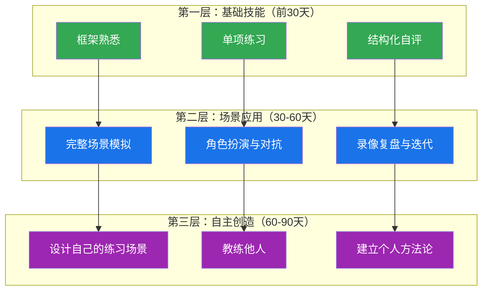

# 练习方法：商务沟通能力系统训练手册

## 一、练习前的认知准备

### 1. 为什么"知道"不等于"做到"

你在前几节学到了SCQA邮件框架、PREP汇报结构、BATNA谈判分析、RACI跨部门协作矩阵——这些工具在读的时候觉得"我懂了"，但一周后遇到真实场景，你大概率会退回到旧习惯。

这不是因为你不够聪明。认知科学的研究表明，**从"理解一个概念"到"在压力下自动运用"，需要经历四个阶段**：

| 阶段 | 状态 | 典型表现 |
|------|------|----------|
| 无意识无能力 | 不知道自己不会 | "邮件不就是写清楚就行嘛" |
| 有意识无能力 | 知道自己不会 | "我知道要用SCQA，但写的时候脑子一片空白" |
| 有意识有能力 | 会但需要刻意努力 | "我写邮件时会逐条检查SCQA结构" |
| 无意识有能力 | 自动化执行 | "不用想，邮件结构自然就是清晰的" |

大多数人（约70%）在第二阶段就放弃了——"这个方法不适合我"。实际上，你只是还没练习到足够的次数。**刻意练习的核心不是重复，而是在每次练习中针对具体弱点进行修正**。安德斯·艾利克森（Anders Ericsson）在其对专家表现的长期研究中发现，顶尖表现者与普通人的核心区别不是天赋或经验年限，而是刻意练习的质量和累计时长——专业小提琴手在20岁时已积累了约10,000小时的刻意练习，而普通演奏者仅有4,000小时。

神经科学的解释是：反复练习会在大脑中形成"髓鞘化"（myelination）——神经纤维被髓鞘包裹后，信号传导速度提升100倍。这就是为什么钢琴家的手指"不用想"就能找到正确的琴键。商务沟通技能的习得遵循同样的机制：你需要在足够多的真实场景中反复使用框架，直到它成为你的"神经高速公路"。

### 2. 刻意练习的五个原则

在开始本节的任何练习之前，请先理解以下原则，它们决定了你能否从"照着做"进化到"真会用"：

**原则一：明确目标——每次练习只攻克一个技能点**

不要试图在一次练习中同时提升邮件写作、谈判技巧和会议主持。认知心理学中的"工作记忆容量限制"（Miller's Law）表明，人脑同时处理的新信息项不超过7±2个。当你同时学习多个新技能时，每个技能分配到的认知资源都不足以形成稳固的记忆痕迹。每次练习只选一个技能点，集中火力攻克。

**原则二：即时反馈——不等一周后才知道对错**

练习后如果没有及时反馈，错误会被反复强化，形成"错误的肌肉记忆"——这比不练习更糟糕，因为你需要额外的时间来"去学习"错误模式。理想的反馈来源按优先级排列：专业教练 > 有经验的同事 > 录像回放自评 > 结构化自检清单。如果前三者都不可得，至少用清单自检——本节每个练习都提供了评估标准。

**原则三：超出舒适区——刻意选择让你不舒服的场景**

心理学家Lev Vygotsky的"最近发展区"理论指出，最有效的学习发生在"你当前能力的边缘"——比你已会的难一点，但不至于完全做不到。如果你已经擅长写普通商务邮件，就去练习写投诉处理邮件、拒绝请求邮件、跨文化沟通邮件。总是待在舒适区里重复已经会的东西，不会带来任何提升。

**原则四：大量重复——直到肌肉记忆形成**

一个框架至少要在不同场景中使用10次以上，才能形成初步的自动化。认知心理学将此称为"过度学习"（overlearning）——在已经达到基本掌握之后继续练习，可以将技能保持时间延长2-3倍。不要觉得"我用PREP结构汇报过一次了，下次不用再练了"。你需要在不同场景（好消息、坏消息、紧急情况、常规汇报）中反复使用，直到它成为你的"第二本能"。

**原则五：建立复盘习惯——每次练习后花5分钟反思**

三个必答问题：（1）这次练习中我做得最好的一点是什么？（2）最大的一个改进点是什么？（3）下次练习我要刻意注意什么？写下来，不要只在脑子里过一遍。研究表明，"书写反思"的效果是"脑内反思"的3倍——因为书写迫使你将模糊的感觉转化为具体的语言，这个过程本身就是深度加工。

### 3. 学习科学视角：为什么练习计划需要分层

哈佛商学院的研究显示，**技能习得遵循"螺旋上升"模式**：基础技能→场景应用→压力测试→自主创造。跳过任何一层都会导致"空中楼阁"——你可能在培训课上表现很好，但回到真实工作中就打回原形。

本节的练习设计遵循三个层级的递进逻辑：

### 4. 如何判断你处于哪个阶段

在开始练习之前，先做一个快速自测，确定你的起点。以下自测覆盖本章涉及的六大核心技能，每个技能有3个递进描述，勾选最符合你当前状态的那一项：

邮件写作：
  □ 初级：写邮件时没有固定结构，想到什么写什么
  □ 中级：知道应该结构化，但经常忘记或在压力下退回旧习惯
  □ 高级：几乎每次都能自然地写出结构清晰的邮件

汇报表达：
  □ 初级：汇报时按时间顺序叙述，领导经常问"所以你的结论是什么"
  □ 中级：知道"结论先行"，但执行不稳定
  □ 高级：能在3分钟内完成有数据支撑的结构化汇报

会议主持：
  □ 初级：开会没有议程，讨论随意发散
  □ 中级：有议程但控制力不够，经常被带跑
  □ 高级：能有效引导讨论、控制时间、总结决议

跨部门协作：
  □ 初级：跨部门沟通经常碰壁，对方"不配合"
  □ 中级：知道要换位思考，但实际操作时还是用自己部门的语言
  □ 高级：能用对方的利益框架推动协作

商务谈判：
  □ 初级：谈判就是讨价还价，谁嘴硬谁赢
  □ 中级：了解BATNA等概念，但实际谈判中还是回到立场博弈
  □ 高级：能在谈判中关注利益、创造方案、维护关系

书面报告：
  □ 初级：报告就是把数据堆上去
  □ 中级：有结构意识，但论证不够充分
  □ 高级：能写出有洞察力、有数据支撑、有可操作建议的报告

**自测结果解读**：
- 全部选"初级"：从阶段一（基础技能期）开始，重点关注框架理解和单项练习
- 大部分选"中级"：可以从阶段二（场景应用期）开始，重点在模拟场景中强化
- 大部分选"高级"：直接进入阶段三（自主创造期），重点在教练他人和方法论提炼
- 混合状态：从你最弱的技能对应的阶段开始，其他技能的练习可以适当加速

---

## 二、系统训练路径：30天/60天/90天计划

### 阶段一：基础技能期（第1-30天）

**目标**：掌握核心框架，建立基本的结构化表达习惯。

**每日时间投入**：30-45分钟

| 周次 | 重点技能 | 每日练习 | 周末验收 |
|------|----------|----------|----------|
| 第1周 | 邮件写作 | 每天重写一封真实邮件，用SCQA和BLUF结构 | 对比重写前后版本，自评改进幅度 |
| 第2周 | 汇报表达 | 每天用PREP结构对一个工作话题做3分钟口头练习（录音） | 回听录音，检查是否做到"结论先行" |
| 第3周 | 会议沟通 | 每天观摩一个真实会议（或线上会议录像），记录主持人的结构化方法 | 自己主持一次15分钟团队会议 |
| 第4周 | 综合回顾 | 将前三周练习中遇到的问题分类整理，针对最弱的1-2项做集中练习 | 完成自评量表，对比学习前的自评 |

**第一周详细计划：邮件写作刻意练习**

每天选取一封你最近收到或发出的真实商务邮件（隐去敏感信息），按照以下步骤练习：

1. **分析原邮件**（5分钟）：标注主题行、开头、正文结构、结尾、行动指引，判断是否符合SCQA/BLUF
2. **诊断问题**（5分钟）：列出至少三个具体问题（不能是"不够好"这样的模糊描述）
3. **重写邮件**（15分钟）：用正确结构重写，注意语气和受众适配
4. **自检清单**（5分钟）：逐条检查下方清单

**邮件自检清单：**

□ 主题行是否在10个字以内概括了核心内容？
□ 开头第一句话是否说明了邮件目的？
□ 正文是否遵循"结论→理由→证据→重申"的结构？
□ 每个段落是否只讨论一个主题？
□ 是否明确了"谁在什么时间前做什么"？
□ 语气是否与收件人关系匹配（正式/半正式/非正式）？
□ 长度是否控制在适中范围（除非必要不超过300字）？
□ 是否检查了错别字和格式问题？

### 阶段二：场景应用期（第31-60天）

**目标**：在模拟真实场景中运用技能，学会在压力下保持结构化表达。

**每日时间投入**：45-60分钟

| 周次 | 重点场景 | 练习方式 | 周末验收 |
|------|----------|----------|----------|
| 第5周 | 向上汇报 | 每天模拟一次3分钟向上汇报，录音并回听 | 请同事扮演上级，进行一次完整汇报并接受反馈 |
| 第6周 | 跨部门协商 | 两人一组模拟跨部门沟通场景，角色互换 | 记录协商过程中的关键转折点，分析沟通策略 |
| 第7周 | 商务谈判 | 四人一组进行谈判模拟，两两对抗 | 录像回放，评估BATNA运用和让步策略 |
| 第8周 | 综合压力测试 | 设计一个包含多个沟通任务的模拟工作日 | 完成全部任务后复盘，识别在压力下最容易退化的技能点 |

**第五周详细计划：向上汇报阶梯训练**

汇报练习按难度递进，每天切换一个场景：

| 天 | 场景 | 难度 | 汇报内容 | 考验重点 |
|----|------|------|----------|----------|
| 周一 | 常规进度更新 | ★★☆ | 项目进展顺利，按计划推进 | 信息筛选——去掉什么比加上什么更重要 |
| 周二 | 坏消息汇报 | ★★★★ | 项目延期两周，需要追加预算 | 结论先行+主动提出解决方案 |
| 周三 | 资源争取 | ★★★★★ | 为新项目争取额外人员和预算 | 数据支撑+利益对齐+预判反对意见 |
| 周四 | 敏感话题 | ★★★★ | 团队成员绩效问题需要上级介入 | 事实陈述+避免主观判断+提出建议 |
| 周五 | 综合汇报 | ★★★☆ | 季度工作总结和下季度计划 | 信息分层+时间控制+重点突出 |

**向上汇报评估评分表：**

| 评估维度 | 权重 | 5分（优秀） | 3分（及格） | 1分（需改进） |
|----------|------|------------|------------|--------------|
| 结论先行 | 25% | 第一句话就是结论和建议 | 前三句话内给出结论 | 花超过30秒才说到重点 |
| 数据支撑 | 20% | 每个论点有具体数据佐证 | 部分论点有数据 | 全部是定性描述，无数据 |
| 解决方案 | 20% | 主动提出2-3个可选方案 | 提出1个方案 | 只汇报问题不提方案 |
| 时间控制 | 15% | 控制在3分钟±15秒 | 3-5分钟 | 超过5分钟 |
| 语气姿态 | 10% | 自信、沉稳、有条理 | 基本自信但偶有犹豫 | 紧张、语速过快或过慢 |
| 预判准备 | 10% | 预判了上级可能的追问并准备了回应 | 对部分追问有准备 | 被追问时措手不及 |

### 阶段三：自主创造期（第61-90天）

**目标**：能自主设计练习场景、教练他人、形成个人沟通方法论。

**每日时间投入**：30分钟练习 + 随时在工作中应用

| 周次 | 重点任务 | 成果标志 |
|------|----------|----------|
| 第9周 | 教练他人 | 能清晰地向同事解释PREP/SCQA等框架，并指导他们使用 |
| 第10周 | 创建个人案例库 | 收集并优化至少10个自己写过的邮件/汇报/会议纪要 |
| 第11周 | 设计复杂场景 | 能设计包含利益冲突、信息不对称、时间压力的综合模拟场景 |
| 第12周 | 形成方法论 | 能用一段话清晰描述自己的商务沟通方法论 |

---

## 三、核心练习项目

### 练习一：商务邮件写作——从诊断到重写

#### 练习目的

通过分析和重写有问题的商务邮件，掌握专业邮件的写作规范，建立"先诊断后开方"的邮件写作习惯。邮件是商务沟通中使用频率最高的载体，据麦肯锡统计，**普通白领每周花费28%的工作时间处理邮件**，但大多数人的邮件存在结构混乱、信息缺失、语气不当等问题。一封写得差的邮件不只是"不好看"——它会导致信息遗漏、决策延迟、甚至引发误解和冲突。Radicati Group的研究显示，企业中因邮件沟通不当导致的返工和澄清，平均每月消耗每个员工6.5小时。

#### 练习步骤

**第一步：阅读"糟糕邮件"示例**

> 主题：急！！！
>
> 李总你好，上次说的那个事你考虑得怎么样了？我们这边催得很紧，领导天天问。另外还有一个事想问你，上次开会说的那个方案能不能改一下？我觉得不太好。还有就是下周的会能不能推迟一下？我有事。尽快回复哈，谢谢！
>
> 小王

**第二步：结构化诊断**

不要凭感觉说"写得不好"，用以下六个维度逐一诊断：

| 诊断维度 | 问题 | 分析 | 正确做法 |
|----------|------|------|----------|
| **主题行** | "急！！！"三个感叹号 | 主题行不描述内容，只传达情绪。感叹号在商务邮件中等于"喊叫"，三个感叹号更是失态 | 用10个字以内概括核心内容，如"关于XX项目方案的反馈请求" |
| **结构** | 三个不相关事项塞在一封邮件中 | 一封邮件只应讨论一个主题。多主题混杂会让收件人无法分类处理、无法转发给相关人、无法追踪进度 | 拆分为三封独立邮件，每封聚焦一个事项 |
| **语气** | "催得很紧""领导天天问""我有事" | 将内部压力转嫁给对方，将自己的事务当成对对方的要求。这在心理学上称为"压力投射"——你把自己的焦虑转化为对他人的催促，收件人会感到被冒犯 | 去掉压力转嫁，聚焦事项本身，说明客观原因而非主观焦虑 |
| **信息完整性** | "那个事""那个方案" | 大量指代不明的用语。收件人可能不知道"那个事"指的是什么，尤其是邮件往来较多时 | 具体说明事项名称、背景、当前状态 |
| **行动指引** | "尽快回复" | 没有明确截止时间，没有说明需要回复什么内容。"尽快"对每个人意味着不同的时间范围——对你来说是今天，对对方来说可能是一周内 | 明确"请在X月X日前回复是否同意调整方案" |
| **称呼结尾** | "李总""小王" | 称呼尚可，但自称"小王"在正式邮件中不够专业，应使用全名 | 签名使用全名+职位+联系方式 |

**第三步：拆分重写**

将原邮件拆分为两封独立邮件（第三个事项——会议推迟——性质不同，应单独处理），每封遵循SCQA结构：

**邮件一——项目合作方案反馈：**

主题：XX项目合作方案反馈 - 请于6月30日前回复

李总，您好。

关于XX项目合作方案（上周三会议讨论的版本），目前方案已进入最终确认阶段。

我们内部评估后提出以下调整建议：
1. 第二阶段时间线从Q3调整为Q4，原因是供应链交付周期延长
2. 预算总额上调8%，主要是原材料成本变化

附件为修改后的方案对比表（红色标注变更部分）。

请您在6月30日前确认是否同意上述调整。如有疑问，我可以安排一次电话沟通。

此致
王XX | 项目负责人 | 138-XXXX-XXXX

**邮件二——会议时间调整：**

主题：7月2日项目例会时间调整请求

李总，您好。

因7月2日我需出席客户现场评审（已提前安排），原定当天下午的项目例会能否调整至7月3日同一时间？

如果7月3日不方便，7月4日上午也可以。请您回复确认。

此致
王XX | 项目负责人 | 138-XXXX-XXXX

**第四步：互评与讨论**

两人一组交换重写后的邮件，按以下评分表打分：

| 维度 | 权重 | 评分标准 |
|------|------|----------|
| 主题行质量 | 15% | 是否清晰、简洁、包含关键信息 |
| 结构完整性 | 20% | 是否有背景→请求→截止时间的完整结构 |
| 信息充分性 | 20% | 收件人是否无需追问就能理解全部信息 |
| 语气专业度 | 20% | 是否礼貌得体、无情绪化表达 |
| 行动指引 | 15% | 是否明确了"谁做什么、什么时候做" |
| 格式规范 | 10% | 称呼、签名、段落分隔是否规范 |

#### 高难度邮件场景练习

在掌握基础邮件写作后，进阶到以下高难度场景——这些才是真实工作中让你头疼的邮件类型：

**场景一：拒绝邮件——如何说"不"而不伤关系**

> 背景：合作了三年的供应商提出涨价15%，你需要拒绝或压到5%以内。对方负责人老赵跟你私交不错。

反面示例（直接拒绝）：
"赵总，15%的涨幅太高了，我们没法接受。希望你们重新考虑。"

问题：只有立场没有理由，只有拒绝没有方案，对方会觉得你在"端架子"。

正确示例（结构化拒绝+替代方案）：
主题：关于贵司2024年度价格调整方案的回复

赵总，您好。

感谢贵司发来的新年度价格方案。我们非常重视与贵司三年来的合作关系，
这也是我们首选的供应商伙伴关系。

关于15%的调价幅度，我坦诚地说，这超出了我们的预算承受范围。我们内部
做了成本测算，能接受的最大调幅为5%，理由如下：
1. 今年我们自身的终端售价涨幅预计在3%以内
2. 原材料（钢材）的市场均价同比上涨约6%
3. 我们希望保持双方的长期合作稳定性

我建议以下替代方案：
- 方案A：今年调价5%，明年根据实际原材料涨幅再议
- 方案B：今年调价8%，但贵方将付款周期从30天延长至45天
- 方案C：维持现价不变，但我们将年度采购量提升20%

如果方便，我希望本周能安排一次电话会议，当面沟通细节。

此致
王XX | 采购总监

**场景二：跨文化商务邮件——英语邮件的中国职场人常见误区**

反面示例（中式英语邮件）：
Subject: Need your help

Dear Mr. Smith,
I am writing this email to ask for your help. Our project is very important
and we need your support. Please kindly help us to finish the report by Friday.
Thank you very much for your kind help.

Best regards,
Wang

问题：过度礼貌导致模糊（"kindly help"）、没有说明具体需要什么帮助、
没有提供背景信息让对方判断优先级。

正确示例：
Subject: Q2 Sales Report Input Needed by Friday June 28

Dear Mr. Smith,

I'm working on the Q2 regional sales analysis report, due to the board on July 3.
Your input is critical because the APAC segment represents 35% of total revenue.

Specifically, I need from you by Friday June 28:
1. Updated APAC sales figures for May-June (original estimate was $2.4M)
2. Any revised forecasts for Q3

I've attached the current draft so you can see where your data fits in.
If Friday is tight, please let me know your earliest possible date.

Thank you,
Wang Wei | Sales Analytics | +86-138-XXXX-XXXX

**场景三：向上管理邮件——如何用邮件"管理"你的上级**

当你的上级拖延决策，你需要用邮件温和地推动，而不是直接催促。技巧是"提供选项而非等待指令"：

主题：智能客服项目供应商选择 - 需您周三前确认

张总，您好。

智能客服项目的供应商评估已完成，三家候选方案如下：

| 供应商 | 报价 | 交付周期 | 技术评分 | 我的建议 |
|--------|------|----------|----------|----------|
| A公司 | 28万 | 6周 | 92分 | ★推荐 |
| B公司 | 22万 | 8周 | 85分 | |
| C公司 | 35万 | 4周 | 88分 | |

如果本周三前能确认，项目可在8月底上线。如需更详细的对比资料，
我可以准备一份完整评估报告。

王XX

这种写法的妙处在于：你已经帮上级做了90%的工作（分析、排序、建议），他只需要做一个简单的选择题——大大降低了决策成本，也提高了你获得及时回复的概率。

#### 进阶练习：真实邮件诊断库

收集你近期收到的20封真实商务邮件（隐去敏感信息），按以下分类建立诊断库：

| 问题类型 | 典型表现 | 对应纠正框架 | 收集数量 |
|----------|----------|------------|----------|
| 主题行模糊 | "关于那个事""请看附件" | BLUF原则 | 3-5封 |
| 结构混乱 | 多主题混杂、逻辑跳跃 | SCQA框架 | 3-5封 |
| 信息缺失 | 没有截止时间、没有具体要求 | 5W1H检查 | 3-5封 |
| 语气不当 | 过于随意或过于强硬 | 语气梯度表 | 3-5封 |
| 冗长啰嗦 | 超过500字但核心信息不超过3句 | 金字塔压缩法 | 3-5封 |

从每个分类中选出一封最典型的，重写后保存为个人模板库。

***

### 练习二：会议主持角色扮演

#### 练习目的

提升会议组织和主持能力。根据Atlassian的研究，**员工平均每月参加62次会议，其中一半被认为是浪费时间**。会议主持能力直接决定了会议的投入产出比——一次60分钟的7人会议消耗7个人小时，如果会议低效，这7个人小时就全部浪费了。按中国一线城市平均时薪150元计算，一次低效的60分钟会议直接成本就是1,050元。

#### 练习设置

- **参与人数**：五到七人
- **角色分配**：一名主持人，一名观察员（记录员），其余为参会者
- **模拟场景**：公司季度业绩回顾会议，需要讨论业绩下滑原因并制定改进方案
- **时间限制**：二十分钟
- **材料准备**：为每位参与者准备角色卡（见下方），为主持人准备议程模板

#### 角色卡设计

**主持人角色卡**：

你的任务是在20分钟内完成以下议程：
1. **开场**（2分钟）：明确会议目标、议程安排、时间要求
2. **信息同步**（5分钟）：听取各角色的业绩数据汇报
3. **原因分析**（5分钟）：引导讨论业绩下滑的根因
4. **方案制定**（5分钟）：推动形成具体改进方案
5. **总结**（3分钟）：确认决议事项、责任人、时间节点

你的挑战：现场有"强势发言者"主导讨论、"沉默参会者"不说话、"跑题者"不断偏题。你需要在不伤害任何人感受的前提下，有效引导讨论。

**主持人引导话术参考**：

| 场景 | 话术示例 | 技巧原理 |
|------|----------|----------|
| 强势者打断别人 | "老张的观点很重要，我记下来了。小李你刚才说到一半，请继续。" | 先肯定打断者，再把话语权还给被打断者 |
| 沉默者不发言 | "小王，你在数据分析方面最有经验，关于客户留存率的变化你怎么看？" | 用具体问题邀请，而非笼统的"你有什么想法" |
| 讨论跑题 | "这个话题值得单独讨论，我先记下来，会后我们单独聊。现在回到今天的主题——" | 肯定价值+记录+拉回，而非直接打断 |
| 双方僵持 | "我听到两种观点：A认为应该…B认为应该…两方的核心考量分别是什么？" | 将立场之争转化为利益分析 |
| 时间不够 | "我们还有5分钟，现在最重要的不是讨论细节，而是确认三件事——" | 压缩到最关键的决议项 |

**"强势发言者"角色卡**：

- 你认为业绩下滑的主要原因是市场竞争加剧，你应该反复强调这一点
- 你的性格特点：喜欢主导讨论，经常在别人说话时打断
- 你需要至少打断其他发言者3次
- 你有一个固定观点："我认为主要就是市场竞争的问题，其他都是次要的"
- 如果主持人让你等别人说完，你可以配合但表现出不耐烦

**"沉默参会者"角色卡**：

- 你其实有一个重要的洞察：业绩下滑与内部流程效率低下有关（你手上有数据支撑）
- 你的性格特点：不太敢在会上主动发言，尤其是当有人很强势的时候
- 你需要等到被主持人直接邀请时才发言
- 一旦发言，你的观点是有深度的，能提供数据支持
- 你的数据：客户投诉响应时间从平均4小时延长到12小时，客户满意度从4.2降到3.6

**"跑题者"角色卡**：

- 你容易把话题引向不相关的内容
- 你需要至少跑题2次，例如：
  - 聊到某个客户的个人故事
  - 提起上个月团建的事情
  - 讨论公司食堂的午餐质量
- 如果被主持人拉回来，你可以配合，但过一会儿又跑题

**"数据控"角色卡**：

- 你是一个凡事都要用数据说话的人
- 你会不断要求"有没有数据支撑这个观点"
- 当别人提出定性判断时，你会追问"具体数字是多少"
- 你有一个关键数据：客户留存率从85%下降到72%（在适当时机抛出）

**观察员评估表**：

| 评估维度 | 优秀表现（5分） | 及格表现（3分） | 需改进（1分） | 实际得分 |
|----------|----------------|----------------|--------------|----------|
| 议程管理 | 清晰开场、逐项推进、按议程完成 | 有议程但中途偏离 | 无明确议程、随意讨论 | ___ |
| 时间控制 | 各环节时间分配合理，准时结束 | 部分环节超时但整体可控 | 严重超时或提前结束 | ___ |
| 参与引导 | 主动邀请沉默者、控制强势者 | 关注了参与均衡但效果一般 | 只关注活跃发言者 | ___ |
| 跑题管理 | 温和但坚定地拉回主题 | 偶尔被带跑但能回正 | 完全被跑题者牵着走 | ___ |
| 冲突处理 | 化解分歧、引导到方案层面 | 回避了冲突但没有激化 | 回避冲突或激化矛盾 | ___ |
| 总结归纳 | 清晰总结决议、责任人、时间点 | 总结了要点但缺少行动项 | 会议结束无明确结论 | ___ |

#### 线上会议主持补充练习

在远程办公时代，线上会议有独特的挑战。以下练习专门针对线上场景：

| 挑战 | 模拟方法 | 应对话术 |
|------|----------|----------|
| 参会者静音后"消失" | 安排1-2人故意不回应 | "小王，你那边有什么补充吗？我点名是因为你对这个模块最熟悉" |
| 多人同时开口 | 安排2人同时发言 | "两位都想发言，老张你先说，小李我第二个请你" |
| 网络卡顿导致信息丢失 | 有人故意说"刚才没听清" | "我总结一下刚才的要点：第一…第二…大家确认是否一致" |
| 屏幕共享时讨论偏题 | 观察员抛出与共享内容无关的问题 | "这个问题很好，我会后单独回复你。现在我们先聚焦PPT第三页的数据" |
| 会议疲劳（超过40分钟） | 设置45分钟的会议 | "已经开了40分钟，我花2分钟总结一下决议，剩余问题我们下次讨论" |

#### 复盘讨论要点（10分钟）

1. 主持人自评：最满意的一点？最需要改进的一点？
2. 各角色反馈：作为被引导者，什么引导方式让你感觉最好？
3. 观察员反馈：全场最有效的一个引导技巧是什么？最大的一个失误是什么？
4. 集体讨论：如果重来一次，主持人会在哪个环节用不同的策略？

***

### 练习三：向上汇报模拟

#### 练习目的

练习向领导进行结构化汇报。向上汇报是职场中"投入产出比最高"的沟通技能——**一个能用3分钟说清楚事情的员工，在领导心中的可信度远高于用15分钟说不清楚的员工**。掌握"结论先行"的汇报逻辑，不仅能提升你的职场能见度，更能直接影响你的资源获取能力和晋升速度。

向上汇报的本质不是"告知信息"，而是"管理决策"。你的上级每天要做几十个决策，你汇报的目的是让他快速理解情况、做出你期望的决策。这意味着你需要：替他做好信息筛选、替他分析利弊、替他准备好选项。

#### 场景设定

你负责的"智能客服系统"项目出现了延期风险。你需要向分管副总裁进行3分钟的汇报，争取支持。

**背景信息卡片**：

| 信息类别 | 具体内容 |
|----------|----------|
| 项目目标 | 智能客服系统上线，目标降低人工客服工作量30% |
| 原计划 | 3个月完成，目前进度：已完成2个月 |
| 当前完成度 | 40%（预期应达到60%） |
| 延期原因一 | 核心NLP模型准确率仅78%，未达到90%的目标。需要额外2周进行模型调优 |
| 延期原因二 | 核心开发人员张工于上周离职，新人到岗需要1个月 |
| 已采取措施 | ①已联系百度AI团队进行技术咨询（报价8万） ②HR已启动招聘，预计2周内到岗 |
| 需要的支持 | ①追加10万预算（技术咨询8万+临时外包2万） ②延期2周，新上线日期从7月15日调整为7月29日 |
| 对公司的价值 | 上线后预计每月节省人工成本15万，3个月即可收回全部追加投入 |

#### 运用PREP结构

**P（Point）——结论先行**

> "我建议智能客服项目延期两周并追加10万预算。原因是遇到技术难题和人员变动，但这两个问题都有明确的解决方案。追加投入3个月即可回本。"

**R（Reason）——原因支撑**

> "延期有两个原因：第一，NLP模型准确率当前为78%，距离90%的目标还有差距，需要额外2周做模型调优——这是技术上必须的周期，压缩不了。第二，核心开发人员张工上周离职，影响了约15%的开发进度。"

**E（Example/Evidence）——数据证据**

> "我已经采取了两个措施并拿到了报价：百度AI团队的技术咨询服务报价8万元，可将模型调优周期从4周压缩到2周。同时HR已在招聘，预计2周内到岗。追加的10万预算（技术咨询8万+临时外包2万），按上线后每月节省15万人工成本计算，3个月即可回本。"

**P（Point）——重申结论**

> "所以我的建议是：批准延期两周和10万追加预算。我会在下周一前完成技术咨询合同签署，确保项目在7月29日前上线。请您审批。"

#### 失败汇报对比

以下是同一场景的"失败版"汇报，用于对比学习：

反面示例：

"张总，跟您汇报一下智能客服项目的进展。嗯，这个项目目前遇到了一些问题，
进度可能要延期。主要原因是……嗯，技术上有些难度，我们的NLP模型准确率
一直上不去，然后张工上周离职了，团队人手不太够。我们已经联系了百度的
团队，他们报价8万可以帮我们做技术咨询。另外HR也在招人了。所以我需要
追加10万的预算，然后延期两周。那个……您觉得可以吗？"

失败原因分析：
1. 没有结论先行——领导在前30秒听到的全是"问题"，没有"建议"
2. 数据不准确——"一直上不去"是模糊表述，应给出具体数字
3. 只汇报问题，没有主动说"我已经采取了什么措施"
4. 用"您觉得可以吗"收尾，是把决策压力推给上级
5. 语气犹豫（"嗯""那个"），降低可信度

#### 汇报评分卡

| 评分维度 | 优秀（5分） | 及格（3分） | 不及格（1分） |
|----------|-----------|-----------|-------------|
| 结论先行 | 第一句话就是结论和请求 | 前30秒内给出结论 | 超过30秒还没说到重点 |
| 逻辑结构 | PREP结构清晰，层层递进 | 有结构但部分环节缺失 | 无结构，想到什么说什么 |
| 数据支撑 | 每个论点都有具体数据 | 部分论点有数据 | 全部是定性描述 |
| 方案主动 | 主动提出解决方案和时间表 | 提到了解决方案但不够具体 | 只汇报问题不提方案 |
| 预判追问 | 预判了上级可能的追问并有准备 | 对部分追问有准备 | 被追问时措手不及 |
| 时间控制 | 3分钟±15秒 | 3-5分钟 | 超过5分钟 |
| 语气姿态 | 自信沉稳、不卑不亢 | 基本自信但偶有犹豫 | 过于紧张或过于随意 |

**常见追问预判与应对**：

| 上级可能的追问 | 应对策略 |
|---------------|----------|
| "延期会影响其他项目吗？" | 提前评估下游影响，给出说明："延期2周不影响Q3整体计划，因为下游对接工作在8月才开始" |
| "能不能不延期只加人？" | 解释技术瓶颈："模型调优有最小时间周期，加人不能压缩这个周期，但可以防止进一步延期" |
| "8万的技术咨询费值不值？" | 对比自研成本："自研需要额外4周+2名算法工程师，综合成本超过15万" |
| "张工离职是什么原因？" | 简要说明+聚焦解决方案："个人原因，已启动招聘且有备选候选人" |
| "为什么之前没报告风险？" | 承认+改进："项目周报中已标注NLP准确率为风险项，但评估不足。后续我会在风险升级时第一时间汇报" |

***

### 练习四：跨部门协作情景模拟

#### 练习目的

体验跨部门沟通中的常见障碍。跨部门协作失败的根源往往不是"态度问题"，而是**目标不对齐、语言不通、信任不足**。麦肯锡的研究发现，跨部门项目失败的原因中，目标冲突占42%，沟通障碍占31%，信任缺失占27%。本练习让你切身体验这三个障碍，并学会用结构化方法突破它们。

#### 情景设定

你（市场部）需要技术部配合在两周内完成一个线上活动页面的开发。技术部当前排期已满，对你的需求优先级存在异议。如果无法按期完成，公司将错过与竞品争夺市场份额的关键窗口。

**背景补充信息（双方都可看到）**：

| 信息 | 内容 |
|------|------|
| 活动背景 | 618大促预热活动，公司最大竞争对手上周已上线类似活动页面 |
| 时间窗口 | 活动页面需在两周内上线，晚于这个时间则大促流量被竞品截流 |
| 预期收益 | 去年类似活动页面带来了200万GMV，今年预期300万 |
| 技术部现状 | 当前排期已满，正在做支付系统升级（影响全平台交易稳定性） |

**市场部专属信息**：

- 活动页面的技术需求：商品展示+倒计时+一键领券+分享裂变
- 你可以接受的底线：两周内上线核心功能（商品展示+领券），分享裂变功能可延后
- 你的筹码：市场部有3万元外包预算可以使用，但需要技术部提供接口文档

**技术部专属信息**：

- 当前排期：支付系统升级（影响全平台，预计还需1周完成）+ 历史遗留Bug修复（2人×3天）
- 你可以接受的底线：支付系统升级不能中断，但Bug修复可以延期
- 你的筹码：有1名前端开发在支付升级完成后（1周后）有3天空闲期
- 你的顾虑：市场部的需求经常变更，上个月的活动页面返工了3次

#### 沟通流程（共25分钟）

| 阶段 | 时间 | 任务 | 关键技巧 |
|------|------|------|----------|
| 需求说明 | 5分钟 | 市场部说明需求和商业价值 | 用商业语言而非技术语言，强调"为什么重要"而非"需要什么功能" |
| 排期反馈 | 5分钟 | 技术部反馈资源约束和风险 | 说明约束背后的原因，避免简单说"不行" |
| 协商谈判 | 10分钟 | 双方寻找共赢方案 | 用RACI矩阵明确分工，分阶段交付，探索MVP方案 |
| 达成共识 | 5分钟 | 明确最终方案、时间节点和责任人 | 形成书面备忘录，双方签字确认 |

**协商谈判中的关键话术**：

| 场景 | 失败话术 | 成功话术 |
|------|----------|----------|
| 需求被拒绝 | "你们技术部总是这样，什么事都说做不了" | "我理解你们排期很满。我们来看看有没有双赢的方案" |
| 时间不够 | "那两周来不及就没办法了" | "如果两周只能做核心功能，我们先上线商品展示+领券，分享裂变第二期做" |
| 信任不足 | "我们这次不会改需求了" | "我把需求文档定稿，双方签字确认。后续任何变更走正式变更流程" |
| 资源冲突 | "你们的Bug修复比我们的活动重要吗？" | "Bug修复可以延期一周，但活动页面的时间窗口不能延。这个调整对你们的排期影响大吗？" |

#### 反思讨论框架（15分钟）

讨论按以下结构进行，每人必须发言：

1. **障碍识别**：沟通中最大的障碍是什么？是目标不对齐、语言不通，还是信任不足？
2. **策略复盘**：你用了什么策略来突破障碍？效果如何？
3. **角色互换**：如果换成对方的角色，你会怎么回应自己刚才的诉求？
4. **改进方案**：下次遇到类似跨部门协作需求，你的第一步应该做什么？

**RACI协作矩阵模板（协商阶段使用）**：

| 任务项 | 市场部（R/A） | 技术部（R/A） | 设计部（C） | 运营部（I） |
|--------|-------------|-------------|-----------|-----------|
| 活动页面UI设计 | A | C | R | I |
| 前端开发（核心功能） | I | R/A | C | I |
| 后端接口开发 | I | R/A | - | C |
| 活动页面测试 | A | R | C | R |
| 活动上线运营 | R/A | I | - | R |

（R=执行者, A=负责人, C=被咨询者, I=被通知者）

***

### 练习五：商务谈判模拟

#### 练习目的

练习商务谈判中的核心策略——不是"讨价还价的技巧"，而是**利益分析、方案创造、关系维护的系统能力**。哈佛谈判项目的长期跟踪研究表明，采用原则性谈判方法的谈判者，其达成协议的比率比传统"硬式"谈判者高出40%，且协议的执行率高出25%。谈判的目标不是"赢"，而是"找到双方都能接受的最优解"。

#### 场景设计

A公司（供应商，工业零部件制造商）与B公司（采购方，家电制造商）就2024年度采购合同进行谈判。双方已合作3年，今年是合同续签。

**A公司（供应商）角色信息**：

| 维度 | 内容 |
|------|------|
| 理想目标 | 单价130元/件，最低起订量1000件，付款周期30天 |
| 可接受底线 | 单价不低于115元/件，起订量不低于500件，付款周期不超过45天 |
| BATNA | 另有两家潜在客户在洽谈中，但都还在早期阶段，短期内无法替代B公司的订单量 |
| 隐含利益 | B公司是最大的稳定客户，失去这个客户会影响产能利用率（当前80%，失去后降至55%） |
| 可让步筹码 | 可以提供免费的技术支持和产品质量追溯服务；可以接受阶梯定价（量大价优） |

**B公司（采购方）角色信息**：

| 维度 | 内容 |
|------|------|
| 理想目标 | 单价100元/件，起订量500件，付款周期60天 |
| 可接受底线 | 单价不超过125元/件，起订量不超过800件 |
| BATNA | 有一家备选供应商可以提供同等质量产品，单价110元/件，但从未合作过，质量风险未知 |
| 隐含利益 | 今年推出了高端产品线，需要供应商提供更高精度的零部件，A公司是唯一能达标的供应商 |
| 可让步筹码 | 可以签订2年长期合同（而非每年续签）；可以提供销售预测数据帮助A公司排产 |

**ZOPA分析提示**：

价格区间：A公司的底线115元 ←→ B公司的底线125元 = ZOPA为115-125元
起订量区间：A公司的底线500件 ←→ B公司的底线800件 = ZOPA为500-800件
付款周期：A公司底线45天 ←→ B公司理想60天 = 需要创造性方案

最佳协议可能在：
- 单价118-120元
- 起订量600-700件
- 付款周期45天
- 附加：阶梯定价、技术支持、2年合同

#### 谈判技巧练习清单

每个谈判参与者在谈判前必须完成以下准备工作：

□ 完成BATNA分析：我的最佳替代方案是什么？对方的推测BATNA是什么？
□ 确定目标区间：理想目标___/可接受底线___
□ 评估ZOPA：双方可能的协议区间在___到___之间
□ 识别隐含利益：除了价格/数量/账期，双方还有什么深层需求？
□ 准备创造方案：我能提出哪些满足双方利益的创新方案？
□ 设计让步策略：我准备在哪个议题上让步？每次让步要换取什么？
□ 预判僵局场景：如果对方在___议题上不让步，我怎么应对？

**谈判进行中的五个关键策略**：

| 策略 | 具体做法 | 反面做法 |
|------|----------|----------|
| 关注利益而非立场 | 问"为什么需要60天账期"而不是争"30天还是60天" | 在数字上死磕，不探究背后原因 |
| 创造性方案 | 提出阶梯定价：500件125元、800件118元、1000件112元 | 只在单价一个维度上拉锯 |
| 锚定效应 | 先报价时设置在理想目标（而非可接受底线），留出让步空间 | 一开始就报底线价，没有谈判余地 |
| 沉默的力量 | 报价后保持沉默，给对方思考和回应的空间 | 报完价立刻解释、道歉、自我说服 |
| 打包交易 | 将多个议题打包："如果贵方接受800件起订量，我们可以提供45天账期" | 逐个议题独立谈判，无法做利益交换 |

#### 僵局处理专项练习

谈判中最考验功力的时刻是出现僵局时。以下练习专门训练僵局突破能力：

**僵局场景卡**（随机抽取一张练习）：

| 场景编号 | 僵局描述 | 对方心理 | 破局策略参考 |
|----------|----------|----------|-------------|
| 1 | 对方坚持"130元不降价"，否则终止谈判 | 担心被"杀价"，试探你的底线 | 暂搁价格，谈价值——"如果我们在质量追溯、技术响应速度上提供额外服务，是否影响你的价格考量？" |
| 2 | 对方威胁"你们不接受我们就换供应商" | 施加压力，实际BATNA不强 | 冷静回应——"我们当然尊重你的选择。不过在做决定之前，可以聊聊你们对新供应商质量风险的评估吗？" |
| 3 | 对方在所有议题上都不让步 | 新手谈判者，怕"吃亏" | 降低对抗性——"我理解你的立场。如果我们能在议题A上满足你的要求，你是否可以在议题B上考虑一下？" |
| 4 | 对方情绪激动，指责你们"不讲诚信" | 可能之前有过不愉快的合作经历 | 先处理情绪——"我理解你对之前的事情有不满，我们今天的目标是确保这次合作对双方都公平。" |

#### 谈判复盘评分表

| 评估维度 | 权重 | 评分标准 |
|----------|------|----------|
| 准备充分度 | 20% | 是否完成了BATNA分析、ZOPA评估、让步策略设计 |
| 利益挖掘 | 20% | 是否发现了对方的隐含利益？是否用"为什么"而非"是什么"提问？ |
| 方案创造性 | 20% | 是否提出了超越"立场折中"的创新方案？ |
| 让步策略 | 15% | 让步是否有节奏？每次让步是否换取了对等让步？ |
| 情绪管理 | 10% | 在僵局中是否保持冷静？是否将人和问题分开？ |
| 关系维护 | 15% | 谈判结束后双方关系是否良好？是否为后续合作留下了空间？ |

***

### 练习六：电梯演讲

#### 练习目的

在60秒内清晰、有说服力地传达核心信息。电梯演讲的真正价值不在于"60秒的完美表达"——而在于**训练你对核心信息的压缩能力**。如果你不能用60秒说清楚一件事，你可能用60分钟也说不清楚。

这种压缩能力在真实工作中的应用场景比你想象的多得多：走廊里偶遇CEO时、会议前的寒暄中、面试中的自我介绍、客户打来电话时的第一印象——这些都是需要你在极短时间内传达核心价值的"电梯时刻"。

#### 通用结构框架

结构模板：
[抓住注意力 - 10秒] 一个数据/问题/场景
  ↓
[说明价值 - 20秒] 我们在做什么，解决什么问题
  ↓
[差异化优势 - 15秒] 我们的方案为什么有效
  ↓
[行动号召 - 15秒] 我希望得到什么支持

#### 三个场景练习

**场景一：项目价值汇报**

向偶遇的公司高管介绍你正在推进的项目及其价值。高管可能从未听说过你的项目。

**示例**：
> "张总好。我们上个月做了一个统计——客服团队每天要处理800条重复咨询，占总工作量的60%。我们正在开发智能客服系统，用AI自动处理这些重复问题。目前模型准确率已经到78%，上线后预计每月节省15万人工成本。项目预计7月底上线，如果能在本周确认一笔8万的技术咨询预算，可以确保按期交付。"

**场景二：产品推介**

向潜在客户推介你的产品或服务。对方对你的产品一无所知，你只有60秒引起他的兴趣。

假设你是一家SaaS公司的销售，产品是"企业级项目管理工具"，目标客户是一家200人的科技公司。

**示例**：
> "王总好。我注意到贵公司最近在扩展新业务线——这种情况下项目延期率通常会飙升30%以上。我们做了一个AI驱动的项目管理平台，帮企业在项目早期识别延期风险，提前干预。目前服务的30家科技公司，项目按时交付率从平均62%提升到了89%。如果方便，我想约15分钟给您看一组真实客户的对比数据。"

**反面示例（常见错误）**：
> "王总好。我们公司做项目管理软件的，功能很全面，有任务分配、进度追踪、团队协作、报表分析……很多公司都在用我们的产品，您可以了解一下。"

失败原因分析：
1. 没有抓住注意力——"做项目管理软件的"这种开场白毫无记忆点
2. 列了一堆功能但没有价值——客户不关心功能，关心"解决我什么问题"
3. 没有差异化——"很多公司在用"不构成购买理由
4. 没有行动号召——"您可以了解一下"是被动邀请，不推动下一步

**场景三：自我介绍**

在行业交流会上向潜在合作伙伴介绍自己和公司。你需要让对方记住你，并愿意后续联系。

假设你是一家数据分析咨询公司的合伙人。

**示例**：
> "你好，我叫陈明，是数智咨询的合伙人。我们专门帮零售企业用数据做决策——说具体点，就是帮他们从海量的销售数据里找到'下个月该多备什么货'、'哪些门店该调整陈列'这类问题的答案。上个季度帮一家连锁超市优化了选品策略，单店月销售额提升了18%。你们公司是做供应链的对吧？我很好奇你们在需求预测这块是怎么做的——可以加个微信聊聊吗？"

**反面示例**：
> "你好，我是数智咨询的陈明，我们是一家数据分析公司，提供各种数据分析服务，包括数据建模、BI看板、数据治理什么的。我们的客户有XX、XX、XX。"

失败原因分析：
1. 自我介绍变成了"公司介绍"——对方记住的是公司名，不是你这个人
2. "各种数据分析服务"太笼统——什么都做等于什么都不是
3. 列客户名字是"掉名字"策略，容易让人反感
4. 没有引发对方的兴趣——没有问对方的问题，是单向输出

#### 练习进阶路径

| 阶段 | 时间 | 方法 | 验收标准 |
|------|------|------|----------|
| 写稿 | 第1天 | 写出三个场景的完整稿子 | 每篇不超过150字 |
| 对镜练习 | 第2-3天 | 对着镜子念稿，注意表情和手势 | 能脱稿完成，目光接触"观众" |
| 录音回放 | 第4-5天 | 录音回放，检查语速（目标：每分钟160-180字） | 无"嗯""那个"等填充词 |
| 压缩训练 | 第6-7天 | 从60秒压缩到45秒，删掉所有非必要信息 | 45秒版本仍然包含完整结构 |
| 即兴练习 | 第2周 | 请同伴随机给场景，60秒内即兴完成 | 不用稿子也能完成结构完整的演讲 |

**听众反馈表**：

| 问题 | 评分（1-5） | 具体反馈 |
|------|-----------|----------|
| 你听懂了我在说什么吗？ | ___ | |
| 你对这个项目/产品/我本人产生兴趣了吗？ | ___ | |
| 一天后你还能记住关键信息吗？ | ___ | |
| 语速是否合适（不快不慢）？ | ___ | |
| 整体印象是否专业自信？ | ___ | |

***

### 练习七：360度沟通反馈

#### 练习目的

通过多角度的反馈，全面了解自己的沟通风格、优势和盲区。自我评估的准确性通常只有30%-40%——**你以为自己表达清晰，但在别人眼里可能完全不是这么回事**。360度反馈帮你看到自己的"沟通盲区"。

心理学中的"达克效应"（Dunning-Kruger Effect）解释了为什么我们很难准确评估自己的沟通能力：沟通能力弱的人往往高估自己的水平（因为他们不知道"好的沟通"是什么样的），而沟通能力强的人反而倾向于低估自己（因为他们对标的是更高水平的参照对象）。

#### 实施步骤

**第一步：设计反馈问卷**

向你的上级（1-2人）、同事（2-3人）、下属（2-3人）发放匿名问卷。问卷包含以下问题：

| 编号 | 问题 | 回答方式 |
|------|------|----------|
| Q1 | 在与我的沟通中，你觉得我做得最好的一点是什么？ | 开放式 |
| Q2 | 在与我的沟通中，你觉得最需要改进的一点是什么？ | 开放式 |
| Q3 | 当我给你布置任务/汇报工作/发邮件时，你的感受是？ | 开放式 |
| Q4 | 如果用三个词形容我的沟通风格，你会选哪三个？ | 填空 |
| Q5 | 在以下沟通场景中，你给我打几分（1-5）？（a）邮件沟通（b）会议发言（c）一对一沟通（d）冲突处理 | 评分 |
| Q6 | 给我一条改善沟通的具体建议 | 开放式 |

**问卷发放要点**：
- 使用匿名工具（腾讯问卷、金山表单等），消除汇报层级带来的顾虑
- 说明目的："我在系统提升沟通能力，希望获得真实的反馈"
- 给予3-5天的填写时间
- 不要只发给和你关系好的人——要覆盖不同类型的关系

**第二步：反馈分析**

收到反馈后，按以下框架整理：

共性优势（2人以上提到）：
  1. _______________
  2. _______________

共性待改进（2人以上提到）：
  1. _______________
  2. _______________

惊喜发现（你没想到的反馈）：
  1. _______________

风格标签（出现频率最高的三个词）：
  ________ / ________ / ________

**第三步：制定30天改进计划**

从反馈中选出最需要改进的1-2个点，制定具体、可衡量的改进计划：

| 改进点 | 具体行为目标 | 每周练习 | 衡量方式 |
|--------|-------------|----------|----------|
| 例：会议发言不够简洁 | 每次发言控制在2分钟以内 | 每次会议前准备3个关键词作为发言框架 | 请同事在会后给出发言时长反馈 |
| 例：邮件缺乏行动指引 | 每封邮件必须包含"谁在什么时候做什么" | 发送前用自检清单逐条检查 | 统计一个月内收到"请问具体需要我做什么"的追问次数 |

**第四步：30天后再收集反馈**

30天后向同一批人再次发放简化版问卷（只问改进点相关的问题），评估改进效果。

#### 注意事项

- **接受反馈的心态**：反馈是礼物，即使是批评性的。你的第一反应可能是"他们不理解我"——这个反应是正常的，但不要让它阻碍你的行动。心理学家建议在收到负面反馈后等待24小时再做回应，让情绪自然消退。
- **区分行为和人格**：反馈关注的是具体行为（"你开会时经常打断别人"），而非人格评价（"你太强势"）。如果收到的反馈是人格层面的，追问具体场景。
- **关注模式而非单次事件**：如果只有一个人提到某个问题，可能是偶发情况；如果三个人都提到了，那就是你需要认真对待的行为模式。

***

### 练习八：商务写作模板实战

#### 练习目的

掌握四大核心商务文体的写作规范。商务写作不是"文学创作"——它的目标是**在最短时间内传递最准确的信息，推动最高效的行动**。

#### 会议纪要写作

**练习素材**：根据以下会议录音摘要，撰写一份标准的会议纪要。

> 会议讨论了Q3营销方案。张经理提出线下活动预算从50万增加到70万，因为竞品在加大线下投入。李总监认为预算可以增加但需要先看ROI测算。王总最终同意增加到60万，条件是活动后一周内提交效果评估报告。另外决定7月15日前完成活动方案定稿，由张经理牵头，市场部和设计部配合。

**标准会议纪要模板**：

会议纪要
━━━━━━━━━━━━━━━━━━━━━━━━━━━━
会议名称：Q3营销方案讨论会
时间：2024年X月X日 14:00-15:00
地点：3楼会议室A
参会人：王总、李总监、张经理、市场部小刘、设计部小陈
主持人：李总监
记录人：小刘

一、讨论要点
1. 张经理提出Q3线下活动预算从50万增至70万
   理由：竞品XX公司Q2线下投入同比增长40%，我司需匹配竞争力度
2. 李总监对预算增加持审慎态度
   意见：支持增加但需要先提交ROI测算报告

二、决议事项
1. Q3线下活动预算调整为60万（在原50万基础上增加10万）
   前提条件：活动结束后一周内提交效果评估报告
2. 活动方案定稿截止日期：7月15日

三、待办事项清单
┌──────────────────────────────────────────────────────────┐
│ 序号 │ 任务内容         │ 责任人   │ 完成时间 │ 状态  │
│  1   │ 完成Q3活动方案    │ 张经理   │ 7月15日  │ 进行中│
│  2   │ 设计部配合出视觉方案│ 小陈    │ 7月10日  │ 待启动│
│  3   │ 提交ROI测算报告   │ 张经理   │ 7月8日   │ 待启动│
│  4   │ 活动效果评估报告  │ 张经理   │ 活动后7天│ 待启动│
└──────────────────────────────────────────────────────────┘

下次会议时间：7月8日（审阅ROI报告）
━━━━━━━━━━━━━━━━━━━━━━━━━━━━

**会议纪要写作的三个常见错误**：

| 错误类型 | 错误示例 | 正确做法 |
|----------|----------|----------|
| 流水账式记录 | "张经理说了…李总监说了…王总说了…" | 只记录结论和决议，不记录讨论过程 |
| 缺少行动项 | "大家一致同意增加预算" | 明确"谁、做什么、什么时候完成" |
| 信息遗漏 | 只记了最终决议，没记前提条件 | 记录决议的附加条件（如"前提是提交ROI报告"） |

#### 商务报告写作

**练习任务**：撰写一份Q2销售分析报告的框架（不需要真实数据，用模拟数据）。

**报告结构模板**：

1. 执行摘要（200字以内）
   - Q2整体业绩概述
   - 核心结论（3个以内）

2. 数据概览
   - 关键指标对比表（Q2 vs Q1 vs 目标）
   - 趋势图说明

3. 分项分析
   3.1 按产品线分析
   3.2 按区域分析
   3.3 按客户类型分析

4. 问题与机会
   - 下滑指标的原因分析
   - 增长指标的可持续性评估

5. 建议与行动计划
   - 短期行动（本月内）
   - 中期策略（本季度）

6. 附录
   - 详细数据表
   - 方法论说明

**商务报告写作的核心原则——"金字塔结构"**：

                 ┌─────────────┐
                 │  核心结论    │  ← 先说结论
                 └──────┬──────┘
            ┌───────────┼───────────┐
       ┌────┴────┐ ┌────┴────┐ ┌────┴────┐
       │ 论据1   │ │ 论据2   │ │ 论据3   │  ← 再给支撑
       └────┬────┘ └────┬────┘ └────┬────┘
       ┌────┴────┐ ┌────┴────┐ ┌────┴────┐
       │  数据   │ │  数据   │ │  数据   │  ← 最后是证据
       └─────────┘ └─────────┘ └─────────┘

错误的报告结构是"侦探小说式"——从数据开始，层层推理，最后才给出结论。领导没有时间玩推理游戏，他们需要在第一段就知道你的结论。

#### 商务函件写作

三个情景练习：

| 情景 | 写作要点 | 语气把握 |
|------|----------|----------|
| 向合作伙伴发出合作邀请 | 突出双赢价值、具体合作方式、对方收益 | 诚恳、专业、有吸引力 |
| 就产品质量问题向供应商提出正式投诉 | 事实陈述、影响量化、明确要求、规定回复时限 | 严肃、坚定但不攻击性 |
| 回复客户的售后服务请求 | 表达歉意、解释原因、提供方案、补偿措施 | 温暖、负责、有行动力 |

#### 评估标准

| 维度 | 权重 | 优秀标准 | 及格标准 |
|------|------|----------|----------|
| 格式规范 | 15% | 完全符合行业标准格式 | 基本格式正确但细节有缺 |
| 信息完整 | 25% | 所有必要信息无遗漏 | 核心信息完整但细节缺失 |
| 逻辑清晰 | 25% | 结构合理，论证有力，数据支撑 | 有结构但论证不够充分 |
| 语言专业 | 20% | 用词准确，语气得体，无错别字 | 基本专业但偶有口语化表达 |
| 可操作性 | 15% | 行动项具体到人、到时间、到标准 | 有行动项但不够具体 |

***

### 练习九：高难度对话——冲突场景专项训练

#### 练习目的

前面的练习覆盖了"正常状态"下的沟通技能，但真实工作中最考验沟通能力的是**高难度对话**——当你需要拒绝上级、处理团队冲突、传达坏消息、进行绩效面谈时。哈佛商学院的研究显示，**85%的管理者承认自己会回避高难度对话**，而回避导致的后果（问题恶化、团队士气下降、决策延迟）远比直面对话更严重。

本练习训练你在情绪压力下保持结构化沟通的能力。

#### 场景一：绩效面谈——传达负面反馈

**背景**：你的下属小刘工作态度积极，但连续三个月交付质量不达标。你需要进行一次绩效面谈。

**角色卡（面谈者）**：

你必须完成以下目标：
1. 让小刘清楚认识到自己的问题
2. 不打击他的工作积极性
3. 共同制定改进计划
4. 保持双方的尊重和信任

**"三明治反馈法"实操**：

第一层（肯定）：
"小刘，你这三个月在客户对接方面做得很好，上周李总还专门表扬了你
处理客户投诉的方式。"

第二层（指出问题，用具体事实）：
"但在交付质量方面，我需要和你坦诚地聊一下。过去三个月的项目，
有三次出现了数据错误——分别是4月的报表数据小数点错位、5月的方案
遗漏了竞品分析章节、6月的PPT有三页数据与原始数据不一致。
这些错误导致了客户的两次返工要求。"

第三层（共同制定方案）：
"我想和你一起看看，这些错误背后的原因是什么？是时间不够、
还是检查流程有缺？我们能不能建立一个交付前的自查清单，
确保类似问题不再发生？"

**高难度对话的通用结构——DESC模型**：

| 步骤 | 含义 | 示例 |
|------|------|------|
| D - Describe（描述事实） | 客观描述发生了什么，不加评价 | "过去三个月有三次交付出现数据错误" |
| E - Express（表达影响） | 说明这些行为的影响 | "导致客户返工，影响了团队信誉" |
| S - Specify（明确期望） | 清楚说明你希望看到什么改变 | "我希望未来的交付物在提交前完成自查清单" |
| C - Consequence（说明后果） | 说明改变/不改变的后果 | "如果质量持续改善，Q4可以考虑给你更多独立负责项目的机会" |

**常见错误与纠正**：

| 错误做法 | 后果 | 正确做法 |
|----------|------|----------|
| "你总是不认真" | 对方感到被攻击，进入防御模式 | "过去三个月有三次数据错误"（只说事实） |
| "我觉得你态度有问题" | 评价人格而非行为，引发对立 | "我注意到交付前的检查步骤有时被跳过"（说行为） |
| 一直说不给对方回应 | 对方感到不被尊重 | 每说完一个问题，问"你怎么看？" |
| 在公开场合批评 | 伤害自尊，破坏信任 | 选择私密环境，一对一沟通 |

#### 场景二：向上说"不"——拒绝不合理需求

**背景**：你的上级要求你在一周内完成一个正常需要三周的市场调研报告。你知道赶工会严重影响质量。

**对话框架（BATNA+替代方案法）**：

第一步：确认理解（不要一上来就说"不行"）
"张总，我理解您希望在下周五前拿到市场调研报告，用于下周的战略会议。"

第二步：说明约束（用事实而非感受）
"但按照标准流程，一份高质量的市场调研报告需要：
- 行业数据收集和验证：5天
- 竞品分析和用户访谈：5天
- 撰写和评审：5天
如果压缩到一周，我能做到的是：只覆盖前两个竞品的分析、
跳过用户访谈、不做交叉验证。这样的报告数据可靠性会降低约40%。"

第三步：提供替代方案（给选择题而非判断题）
"我建议两个方案：
方案A：下周五前提交精简版报告（覆盖核心数据，但只有2个竞品），
完整版在两周后补交。
方案B：我这周集中做数据收集，您安排一位同事协助竞品分析，
两人并行可以在10天内完成。"

第四步：让对方选择
"您觉得哪个方案更合适？或者您有其他建议？"

#### 场景三：跨部门冲突调解

**背景**：销售部和技术部因为一个客户定制需求起了冲突。销售部承诺客户两周内交付定制功能，技术部认为至少需要六周。

**调解者话术框架**：

第一步：分别倾听（不要急于给结论）
对销售部："请你说一下，为什么两周的承诺是必要的？"
对技术部："请你说一下，为什么六周是最低要求？"

第二步：还原事实（把立场之争变成事实之争）
"我总结一下：
- 销售部承诺两周，因为客户说了两周内不定就走
- 技术部需要六周，因为定制功能涉及底层架构改动
这两个信息都是客观事实，问题在于承诺之前缺少了技术评估环节。"

第三步：寻找共同目标
"我们共同的目标是：留住这个客户，同时不损害产品稳定性。
对吗？"

第四步：共创方案
"我们来想想：有没有办法在两周内给客户一个'可用版本'，
六周内交付'完整版本'？比如第一期先做一个前端展示层的定制，
后端逻辑在后续迭代中完善？"

第五步：建立机制防止再犯
"为了防止类似情况再次发生，我建议：以后涉及定制需求的承诺，
销售部需要先走技术部的可行性评估流程。我来起草一个简单的
流程规范，明天发给大家确认。"

***

### 练习十：数字化沟通——IM/钉钉/飞书协作

#### 练习目的

在数字化办公时代，大量的商务沟通发生在即时通讯工具（微信企业版、钉钉、飞书、Slack等）上。IM沟通有独特的规则：信息碎片化、多线程并行、缺少语气和表情线索、容易被忽略。掌握IM沟通的规范，可以显著减少信息遗漏和沟通误解。

#### IM沟通自检清单

发送前检查：
□ 消息是否太长？（超过3行请分段或改为文档/邮件）
□ 是否一次只说一件事？（多件事分条发送）
□ 是否明确了行动项？（谁、做什么、什么时候）
□ 是否@了需要回应的人？
□ 是否避免了深夜/周末发非紧急消息？
□ 语气是否会被误读？（缺少语气时，加一个"请"或表情可以软化）
□ 敏感内容是否应该转为电话/面谈？

#### IM沟通场景练习

**场景一：项目群消息——如何有效同步进度**

反面示例：
"大家好，项目进展跟大家同步一下，目前整体还行，前端差不多了，
后端还在做，测试还没开始，设计那边有些地方需要改。大家有问题
随时说哈。"

问题：太模糊，每个人看完都不知道自己要做什么。

正确示例：
"【项目周报·第12周】
✅ 前端开发：100%完成（@小李 确认）
🔄 后端开发：75%完成（@小王 预计周五完成API对接）
⏸️ 测试：待后端完成后启动（@小赵 下周一启动）
⚠️ 设计变更：首页布局需要调整（@小陈 请周三前提供新版设计稿）

本周重点：
1. 后端API对接（影响全链路联调，最高优先级）
2. 新版设计稿确认（周三前）

有问题请在本条消息下回复，避免刷屏。"

**场景二：请求协助——如何让对方愿意帮你**

反面示例：
"在吗？"
（等待回复后）
"能帮我查个数据吗？"
（等待回复后）
"就是上个月的销售数据"

问题：三次消息才说清楚需求，浪费双方时间。而且"在吗"是IM沟通的大忌。

正确示例：
"@小李 你好，我需要一个数据支持：
📋 需要什么：上个月（5月）各区域的销售数据对比表
📅 什么时候需要：本周三下班前
🎯 用途：周四是季度汇报，需要这个数据做区域分析部分

如果周三来不及，提前告诉我，我可以调整汇报结构。感谢！"

**场景三：处理负面反馈——IM上的"灭火"技巧**

当客户或同事在群聊中表达不满时，IM上的公开回复需要格外谨慎：

反面示例：
客户："你们这个系统又出bug了，第三次了！每次都说修好了！"
你："不好意思，我们马上看看。"

问题：太敷衍，而且公开道歉不解决实质问题。

正确示例：
"收到，非常抱歉给您带来不便。我现在就联系技术团队排查。

为了更快定位问题，请提供以下信息：
1. 出问题的具体页面/操作步骤
2. 出现时间
3. 截图（如有）

同时，我安排技术负责人10分钟内直接联系您处理。
后续进展我会在这里同步。"

（然后私聊技术负责人，不要在客户群讨论内部排查过程）

***

## 四、练习中的常见陷阱

在长期的沟通技能训练中，以下陷阱最容易让练习者半途而废或事倍功半：

### 陷阱一：只练擅长的，回避短板

**表现**：你擅长写邮件，就反复练习邮件写作，但回避谈判和向上汇报的练习。

**后果**：你的强项从90分提升到95分，但短板从30分仍然停在30分。整体沟通能力提升有限。根据"木桶理论"，决定你沟通能力上限的不是最强的技能，而是最弱的那块板。

**纠正方法**：每周的练习时间中，至少50%用于你最弱的技能项。用"痛苦指数"来选择练习内容——让你最不舒服的那个练习，通常是你最需要的。

### 陷阱二：追求完美，不开始

**表现**：觉得"我还没准备好"，等看完所有理论、收集完所有模板、想好完美方案之后再开始练习。

**后果**：永远在准备，从未真正开始。心理学称之为"完美主义拖延"——用"追求完美"来合理化"不行动"。

**纠正方法**：采用"70分启动法"——觉得自己准备到70%就开始，边做边调整。一次70分的练习，胜过十次100分的计划。

### 陷阱三：练习和工作脱节

**表现**：在练习中能很好地运用PREP结构，但回到工作中写邮件、做汇报时又回到了旧习惯。

**后果**：练习成果无法迁移到真实场景。认知科学称之为"情境依赖性"——技能在练习情境中有效，但换一个情境就失效。

**纠正方法**：每次练习必须使用你当前工作中的真实素材。练习邮件用你昨天收到的真实邮件，练习汇报用你下周要做的真实汇报。**练习的终极目标不是"做练习"，而是"改变工作中的行为"**。

### 陷阱四：忽略复盘环节

**表现**：做完练习就结束了，不录音、不自评、不寻求反馈。

**后果**：重复错误，练习变成"重复错误的习惯"而非"修正错误的机会"。

**纠正方法**：每次练习后强制执行"3分钟复盘"——用手机录音，回听时问自己：如果我是听众/收件人，我满意吗？哪里可以更好？

### 陷阱五：一个人闷头练

**表现**：所有练习都自己一个人做，不找练习伙伴，不寻求外部反馈。

**后果**：你只能看到自己视角内的问题，大量的盲区无法被发现。

**纠正方法**：至少找一个练习伙伴，每周交换一次练习成果互评。如果没有合适的人，用录像回放替代——你会惊讶地发现，自己看录像时注意到的问题，远多于练习时意识到的。

### 陷阱六：只练"说"不练"听"

**表现**：所有的练习都聚焦于"如何表达"，忽略了"如何倾听"。

**后果**：你能说得很漂亮，但听不到对方的真实需求，导致沟通变成"单向广播"。

**纠正方法**：在每次模拟练习中加入"倾听评估"——练习结束后，复述对方的核心观点和隐含需求。如果你能准确复述80%以上，说明你在"听"；如果低于60%，你需要先练倾听。

---

## 五、练习工具箱

### 自评工具：沟通能力雷达图

每月完成一次自评，追踪能力变化趋势。在每个维度上打1-5分，画出雷达图对比上月结果。

| 维度 | 自评问题 | 上月得分 | 本月得分 |
|------|----------|----------|----------|
| 邮件写作 | 我能在15分钟内写出结构清晰、语气得当的商务邮件吗？ | ___ | ___ |
| 汇报表达 | 我能用3分钟完成一次结论先行、数据支撑的向上汇报吗？ | ___ | ___ |
| 会议主持 | 我主持的会议有议程、有控制、有结论吗？ | ___ | ___ |
| 谈判能力 | 我能在谈判中做到关注利益、创造方案、控制情绪吗？ | ___ | ___ |
| 跨部门协作 | 我能用对方听得懂的语言推动跨部门合作吗？ | ___ | ___ |
| 书面报告 | 我写的报告结构清晰、数据充分、建议可行吗？ | ___ | ___ |
| 即兴表达 | 我能在60秒内清晰传达核心信息吗？ | ___ | ___ |
| 反馈接受 | 我能开放地接受反馈并转化为改进行动吗？ | ___ | ___ |

### 练习进度追踪表

用以下表格追踪你的90天练习进度。每天完成后打勾，每周日回顾本周完成率。

第1周（邮件写作）：
周日 ___  周一 ___  周二 ___  周三 ___  周四 ___  周五 ___  周六 ___
完成率：___/7  本周最大收获：_______________

第2周（汇报表达）：
周日 ___  周一 ___  周二 ___  周三 ___  周四 ___  周五 ___  周六 ___
完成率：___/7  本周最大收获：_______________

第3周（会议沟通）：
周日 ___  周一 ___  周二 ___  周三 ___  周四 ___  周五 ___  周六 ___
完成率：___/7  本周最大收获：_______________

第4周（综合回顾）：
周日 ___  周一 ___  周二 ___  周三 ___  周四 ___  周五 ___  周六 ___
完成率：___/7  本月总评：_______________

（第5-12周格式相同，此处省略）

**进度追踪的"中断恢复"策略**：

如果某天中断了练习（出差、加班、生病），不要试图"补课"——研究显示"补课"的心理压力会导致更大的中断。正确做法：
1. 接受中断是正常的（平均每个人在90天计划中会中断12-15天）
2. 中断后第一天只做最小练习量（比如只做10分钟的邮件自检）
3. 用"两天规则"——永远不要连续中断两天

### 录音/录像回放检查清单

回听自己的汇报录音或会议录像时，关注以下信号：

正面信号（继续保持）：
  □ 语速适中（每分钟160-180字）
  □ 无"嗯""那个""就是说"等填充词
  □ 结构清晰——听者能预测你接下来要说什么
  □ 关键数据准确无误
  □ 语气自信但不傲慢

负面信号（需要修正）：
  □ 语速过快（紧张信号）或过慢（不确定信号）
  □ 频繁使用填充词（准备不充分信号）
  □ 逻辑跳跃——听者跟不上你的思路
  □ 长时间偏离主题
  □ 结尾仓促——没有总结和行动号召

### 推荐练习资源

| 资源类型 | 推荐内容 | 用途 |
|----------|----------|------|
| 书籍 | 《金字塔原理》芭芭拉·明托 | 结构化思维和表达的底层框架 |
| 书籍 | 《谈判力》费舍尔&尤里 | 原则性谈判的经典教材 |
| 书籍 | 《关键对话》帕特森等 | 高风险场景下的沟通方法论 |
| 书籍 | 《刻意练习》安德斯·艾利克森 | 理解技能习得的科学原理 |
| 书籍 | 《非暴力沟通》马歇尔·卢森堡 | 冲突场景中保持建设性对话 |
| 在线课程 | Coursera "Business English"系列 | 英语商务沟通的系统训练 |
| 工具 | 录音笔/手机录音功能 | 汇报练习的回放自评 |
| 工具 | 腾讯会议/Zoom录制功能 | 会议主持练习的录像回放 |
| 社群 | Toastmasters国际演讲会 | 系统的公众表达训练社群 |

---

## 本节小结

商务沟通能力的提升没有捷径，但有科学的路径。核心要点回顾：

1. **练习前先理解刻意练习的五个原则**——明确目标、即时反馈、超出舒适区、大量重复、复盘反思
2. **30天建立基础**——聚焦邮件写作、汇报表达、会议沟通三个核心技能
3. **60天场景应用**——在角色扮演和模拟对抗中学会在压力下运用技能
4. **90天自主创造**——能教练他人、设计场景、形成个人方法论
5. **十个核心练习**——涵盖邮件、会议、汇报、协作、谈判、演讲、反馈、写作、冲突、IM沟通
6. **避开六个常见陷阱**——回避短板、追求完美、脱节工作、忽略复盘、闷头独练、忽略倾听
7. **建立持续反馈机制**——自评雷达图、录音回放、360度反馈，确保你在正确的方向上进步

> "我们不是因为优秀才开始练习，而是因为练习才变得优秀。"
