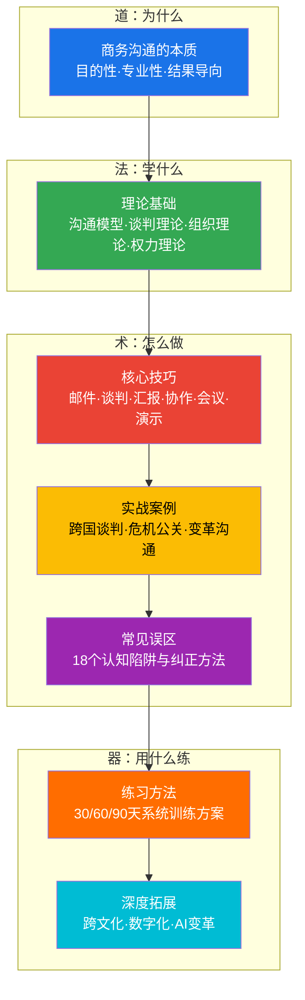
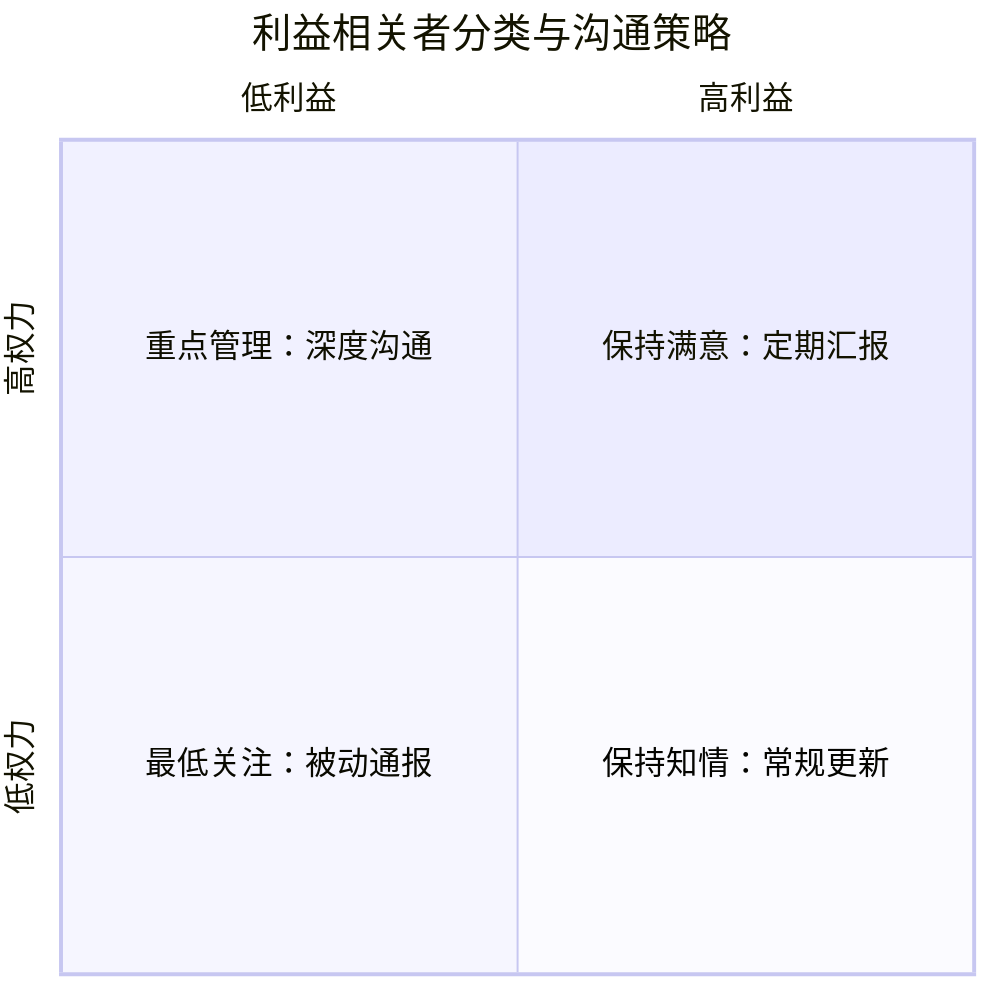

# 本章小结

本章从理论根基到实战技巧，从常见陷阱到系统训练，完成了商务沟通知识体系的完整构建。作为全章的收束，本节将做三件事：**提炼全章核心脉络**，让你看到知识之间的连接；**给出可执行的行动方案**，让你离开页面就能开始改变；**提供进阶路径**，让你知道下一步该往哪里走。

---

## 一、全章知识脉络回顾

### 1.1 本章的逻辑架构

本章遵循"道→法→术→器"的递进逻辑展开：

这个架构的含义是：**先理解"为什么这样做"（理论），再学习"具体怎么做"（技巧），然后通过案例和误区深化理解，最后用系统练习将知识转化为能力。** 跳过任何一层都会导致能力不稳固——只学理论不练技巧是纸上谈兵，只学技巧不懂理论则遇到新场景就束手无策。

### 1.2 贯穿全章的五大核心原则

回顾全章内容，有五条主线贯穿始终，它们是商务沟通的"底层操作系统"：

**原则一：以终为始——目标导向**

每一次商务沟通都必须有明确的目标。这不是一句口号，而是一个可操作的判断标准：在动笔或开口之前，你能用一句话说清"我希望这次沟通达成什么结果"吗？如果不能，说明你还没有准备好。邮件写作中的"BLUF原则"（Bottom Line Up Front，结论先行）、向上汇报中的"金字塔结构"、谈判中的"目标区间设定"，都是这一原则在不同场景中的具体体现。

**原则二：换位思考——受众分析**

商务沟通的受众高度异质化：上级、下属、客户、合作方、监管部门，每种受众的信息偏好、决策风格和关注点都不同。理论基础部分介绍的"利益相关者矩阵"帮你识别谁是关键受众；核心技巧部分教你针对不同受众调整表达方式——给上级汇报用结论先行、给客户提案用利益驱动、给团队分配任务用明确指令。

**原则三：结构化表达——信息压缩**

商务场景中信息密度高、时间有限。结构化表达不是为了让内容"看起来专业"，而是为了让接收者用最短时间获取最多有效信息。SCQA框架（情景-冲突-问题-答案）用于邮件和报告，PREP结构（观点-理由-例证-重述）用于口头汇报，STAR法（情景-任务-行动-结果）用于案例展示——这些工具的共同本质都是"信息压缩与重组"。

**原则四：数据驱动——事实为基**

"我觉得"在商务沟通中没有说服力，"数据显示"才有。向上汇报时，用数据支撑你的结论；谈判时，用市场数据锚定你的报价；跨部门协作时，用共同的KPI数据对齐目标。理论部分介绍的"客观标准原则"和"理性说服策略"，核心都指向同一件事：用事实取代感觉。

**原则五：关系维护——长期主义**

商务沟通不是一次博弈，而是长期关系的经营。谈判中追求双赢而非零和、跨部门协作中建立信任而非单纯利用职权、向上管理中持续兑现承诺而非只在需要资源时才出现——这些都是"关系维护"原则的体现。社会网络理论告诉我们，弱连接带来的信息价值往往超过强连接，所以要主动拓展沟通网络。

### 1.3 各节核心要点速览

| 节次 | 核心主题 | 一句话总结 | 关键框架/工具 |
|------|----------|-----------|---------------|
| **第一节** 章节概览 | 全景认知 | 建立商务沟通的知识地图和学习路径 | 能力自评表、学习路径图 |
| **第二节** 理论基础 | 底层逻辑 | 掌握"为什么这样做有效"的原理 | 香农-韦弗模型、哈佛谈判法、BATNA/ZOPA、LMX理论、情境领导、权力五来源、ELM说服模型 |
| **第三节** 核心技巧 | 实操方法 | 九大场景的可执行技巧 | SCQA、BLUF、PREP、RACI、SBI、DACI、金字塔原理 |
| **第四节** 实战案例 | 场景验证 | 真实案例中的策略拆解 | 跨国谈判、危机公关、变革沟通、资源争取 |
| **第五节** 常见误区 | 避坑指南 | 18个认知陷阱的识别与纠正 | 邮件误区、谈判误区、汇报误区、会议误区、协作误区 |
| **第六节** 练习方法 | 能力转化 | 从知道到做到的系统训练方案 | 30/60/90天计划、刻意练习四步法 |
| **第七节** 本章小结 | 全章收束 | 知识整合与行动指南 | 本文件 |
| **第八节** 深度拓展 | 进阶方向 | 超越基础的战略沟通能力 | 跨文化沟通、数字化变革、AI影响、高难度对话 |

---

## 二、九大场景核心要点提炼

### 2.1 商务邮件

商务邮件是职场中最高频的书面沟通形式，也是最容易被低估的技能。一封糟糕的邮件可能让你丢失客户、延误项目、损害专业形象。

**核心要点：**

- **结构标准化**：主题行（一句话说清事由+行动要求）→ 称呼 → 开场（背景/目的）→ 正文（SCQA结构）→ 结尾（明确行动项+截止时间）→ 签名
- **BLUF原则**：把最重要的信息放在最前面。不要让读者翻到第三段才知道你要说什么
- **语气管理**：同一内容，对上级、对平级、对客户的措辞和正式程度完全不同。测试方法：把邮件大声读出来，看是否符合你当面和对方说话的语气
- **一次一事**：一封邮件只讨论一个主题。如果需要讨论多个事项，分开发。混杂多主题的邮件会导致部分议题被忽略
- **跟进策略**：48小时未回复→礼貌跟进；一周未回复→换个渠道（电话/当面）；两周未回复→升级处理

**常见错误**：主题行写"关于XX的事情"而非"XX方案确认-请于周五前反馈"；邮件正文第一段写背景写了200字还没说目的；把"请查收附件"当成有效沟通。

### 2.2 会议沟通

会议是组织中最大的时间消耗黑洞。Harvard Business Review的研究显示，高管平均每周花23小时在会议中，其中超过三分之一被认为是低效的。

**核心要点：**

- **没有议程不开会**：议程应在会前24小时发出，包含议题、每个议题的时间分配、负责人和期望产出
- **角色明确**：每个会议必须有主持人（控场）、记录员（纪要）和计时员（节奏）
- **决策机制前置**：在讨论开始前明确这个议题是需要"共识决策"、"多数表决"还是"负责人决策"
- **会后跟进闭环**：会议纪要在24小时内发出，包含决议、行动项、负责人和截止时间。下次会议开始时先回顾上次的行动项完成情况
- **站着开会**：15分钟以内的同步会，站着开能将会议时间缩短34%（华盛顿大学研究数据）

**主持人核心技巧**：开场30秒说清会议目标和产出→控制每个议题的时间→引导沉默者发言、打断跑题者→每15分钟做一次小结→最后5分钟确认行动项。

### 2.3 向上汇报

向上汇报不是"通知上级你做了什么"，而是"帮助上级做出决策"。

**核心要点：**

- **金字塔结构**：结论→支撑论据→数据/案例。先说"我建议选方案A"，再说"原因有三"，最后用数据支撑
- **PREP框架**：Point（观点）→ Reason（理由）→ Example（例证）→ Point（重述观点）。这是一个万能的说服结构
- **带方案汇报问题**：永远不要只带问题去见上级。"我发现了一个问题，我有三个解决方案，推荐方案B，原因是……"这才是专业的汇报方式
- **了解上级的决策风格**：有的上级喜欢看数据（给他Excel和图表），有的上级喜欢听故事（给他场景和案例），有的上级只关心结论（一句话说完就走）。定制化你的汇报方式
- **管理预期**：不要等到deadline才暴露风险。进度有偏差时及时预警，比最后交不出结果好一百倍

**关键误区**："向上管理就是拍马屁"——这是最大的误解。向上管理的本质是降低信息不对称，让上级能在充分信息的基础上做出正确决策，同时确保你的工作得到合理的资源支持和认可。

### 2.4 跨部门协作

跨部门协作是组织效率的最大瓶颈之一。PMI的调查显示，跨部门项目失败率比部门内项目高出40%。

**核心要点：**

- **用对方的语言沟通**：和销售说话讲客户价值和收入影响，和研发说话讲技术可行性和排期，和财务说话讲ROI和预算。同一件事，换三种说法
- **理解对方的KPI**：对方部门的考核指标是什么？你的需求对他们的KPI有帮助还是有冲突？如果对方帮你做这件事会影响他们的本职工作，你该如何补偿？
- **RACI矩阵**：每个任务明确谁负责执行（R）、谁最终拍板（A）、需要咨询谁（C）、需要通知谁（I）。模糊的职责边界是跨部门冲突的第一大来源
- **非职权影响力**：你没有权力命令其他部门配合你，你需要通过专业能力、互惠交换和人际关系来施加影响
- **建立信任账户**：每次兑现承诺都是存款，每次食言都是取款。长期信任比短期利益更重要

**实操建议**：项目启动时召开跨部门对齐会，明确各方的目标、关切和边界；建立固定的沟通节奏（如每周同步会）；用共享文档而非邮件链来管理跨部门信息。

### 2.5 商务谈判

谈判不是讨价还价，而是价值创造与分配的过程。

**核心要点：**

- **BATNA准备**：谈判前必须清楚自己的最佳替代方案是什么，对方的替代方案是什么。BATNA越强，你的议价能力越强。永远在谈判前花80%的时间准备，而非临场发挥
- **ZOPA分析**：买方最高价和卖方最低价之间的重叠区域就是ZOPA。如果不存在ZOPA，不要浪费时间谈判——要么调整预期，要么扩大议题范围
- **哈佛谈判法四原则**：把人和问题分开、关注利益而非立场、创造双赢选项、坚持使用客观标准
- **让步策略**：每次让步的幅度应该递减（让对方感觉已接近底线），让步时要求对方给予对等回报（"我可以把交货期提前两周，但需要你把预付比例从30%提到50%"）
- **善用沉默**：提出报价或关键要求后，闭嘴。沉默会制造压力，让对方先打破沉默往往对你有利

**高级技巧**：锚定效应——先出价的人往往能设定谈判的参考点。如果你对市场行情有充分了解，大胆先出价；如果不确定，让对方先出价。

### 2.6 商务写作

商务写作的核心不是"写得好"，而是"写得准"——准确传达信息、准确指导行动。

**核心要点：**

- **会议纪要**：记录决议而非讨论过程。格式：日期→参会人→议题→决议→行动项（负责人+截止时间）
- **项目提案**：用SCQA结构组织：现状是什么→问题是什么→解决方案是什么→需要什么资源。附上预算、时间表和风险评估
- **商务报告**：执行摘要放在最前面（给只看一分钟的人），详细分析放在后面（给需要深挖的人）
- **商务函件**：正式、简洁、无歧义。每句话只表达一个意思，避免口语化和模糊表达

**质量标准**：写完后自问三个问题——读者看完知道要做什么吗？读者能在30秒内找到关键信息吗？如果读者只转发给第三方，信息完整吗？

### 2.7 向下管理

向下管理不是"分配任务+检查进度"，而是"激发团队潜力+培养人才"。

**核心要点：**

- **情境领导**：对新人用指令型（告诉他怎么做），对有一定经验的人用教练型（指导+支持），对熟练者用支持型（鼓励+资源），对专家用授权型（放手+信任）
- **SBI反馈模型**：Situation（在什么场景下）→ Behavior（你做了什么）→ Impact（产生了什么影响）。无论是表扬还是批评，都用这个结构，让反馈具体而非空泛
- **授权而非甩手**：授权是"这件事交给你，我相信你能做好，遇到问题随时找我"；甩手是"这件事交给你了"然后不管了。两者的区别在于是否有支持和跟进
- **一对一沟通**：每周或每两周与每个直接下属进行15-30分钟的一对一沟通，了解他们的工作进展、困难和职业发展诉求。这是发现问题最有效的方式

### 2.8 利益相关者管理

不是所有人都需要同等关注。利益相关者管理的核心是**精准分配沟通资源**。

**核心要点：**

- **权力-利益矩阵**：高权力+高利益→重点管理（深度沟通）；高权力+低利益→保持满意（定期汇报）；低权力+高利益→保持知情（常规更新）；低权力+低利益→最低关注（被动通报）
- **识别隐性利益相关者**：有些人的影响力不在组织架构图上——老板的秘书、技术团队的意见领袖、老员工。忽略他们可能比忽略正式的决策者更危险
- **沟通计划**：为每个关键利益相关者制定个性化的沟通计划，包括沟通频率、渠道、内容和目标

### 2.9 商务演示

商务演示不是"把PPT念一遍"，而是"用20分钟改变听众的想法或行为"。

**核心要点：**

- **金字塔结构**：开场就给出核心结论，然后用三个支撑论据展开，每个论据用数据或案例佐证
- **故事线设计**：好的演示有一条清晰的故事线——现状→问题→解决方案→收益→行动号召。让听众跟着你的逻辑走，而非在信息海洋中迷失
- **视觉原则**：每页PPT只传达一个核心信息；用图表替代文字；关键数据放大高亮；避免花哨的动画
- **应对Q&A**：提前准备10个最可能被问到的问题及回答。如果遇到不会的问题，诚实说"这个我需要确认后回复你"，比胡编一个答案好一万倍

---

## 三、常见误区速查表

本章第五节详细分析了18个常见误区，以下提炼出最具破坏力的10个，作为速查参考：

| # | 误区 | 真相 | 后果 | 纠正方法 |
|---|------|------|------|----------|
| 1 | 邮件写得越长越专业 | 长度≠专业度，信息密度才是关键 | 对方根本不读 | 用BLUF原则，先写结论再写背景 |
| 2 | 谈判就是讨价还价 | 谈判是价值创造与分配 | 错失双赢机会 | 关注利益而非立场，扩大蛋糕再分 |
| 3 | 向上管理是拍马屁 | 向上管理是降低信息不对称 | 资源不足、被误解 | 主动汇报进展、带方案汇报问题 |
| 4 | 会议越多说明越重视 | 过多会议是组织效率低下的症状 | 团队时间被吞噬 | 没有议程不开会，能邮件解决的不开会 |
| 5 | 跨部门协调靠关系就行 | 关系是润滑剂，机制才是保障 | 推诿、扯皮、效率低 | 建立RACI矩阵和定期同步机制 |
| 6 | 只要内容好，形式不重要 | 形式影响内容的接收效率 | 好内容被糟糕的形式埋没 | 投入时间打磨结构、排版和视觉呈现 |
| 7 | 一次沟通就能解决问题 | 复杂议题需要多轮沟通 | 期望落差、执行偏差 | 设置合理的沟通预期和跟进节奏 |
| 8 | 沟通能力是天生的 | 沟通是可习得的技能 | 放弃提升的机会 | 通过刻意练习系统提升 |
| 9 | 用专业术语显示水平 | 对方听不懂等于白说 | 信息传递失败 | 用对方能理解的语言沟通 |
| 10 | 冲突是坏事需要避免 | 建设性冲突能提升决策质量 | 群体思维、低质量决策 | 鼓励不同意见，区分建设性冲突和破坏性冲突 |

---

## 四、核心框架工具箱

以下是本章介绍的所有可复用框架的汇总，方便你随时查阅：

### 4.1 书面沟通框架

**SCQA结构**（适用于邮件、报告、提案）

| 要素 | 含义 | 操作指引 |
|------|------|----------|
| S（Situation） | 情景描述 | 用1-2句话描述当前状态或背景 |
| C（Complication） | 冲突/问题 | 指出当前状态中出现的问题或挑战 |
| Q（Question） | 核心议题 | 将问题转化为一个需要回答的核心问题 |
| A（Answer） | 解决方案 | 给出你的回答/建议/方案 |

**BLUF原则**（Bottom Line Up Front）

❌ 错误示范：
"关于上季度客户投诉率上升的问题，我们分析了过去三个月的数据，
发现主要原因是售后响应时间过长。在对比了行业平均水平后……
（此处省略300字）……因此建议增配2名售后专员。"

✅ 正确示范：
"建议增配2名售后专员并引入工单系统。
原因：上季度投诉率↑15%，主因是售后响应超48h（行业标准24h）。
预计投入：年薪成本约30万，工单系统10万。
预期效果：响应时间降至24h内，投诉率下降60%。"

### 4.2 口头沟通框架

**PREP结构**（适用于汇报、说服、即兴发言）

P → Point：我的观点是……
R → Reason：因为……
E → Example：举个例子/具体来说……
P → Point（重述）：所以，我的观点是……

**STAR法**（适用于案例展示、面试、绩效沟通）

S → Situation：当时的情况是……
T → Task：我需要完成的任务是……
A → Action：我采取的行动是……
R → Result：最终的结果是……

### 4.3 组织协作框架

**RACI矩阵**（适用于跨部门项目分工）

| 任务 | 负责执行(R) | 最终拍板(A) | 需咨询(C) | 需通知(I) |
|------|------------|------------|----------|----------|
| 需求确认 | 产品经理 | 业务总监 | 技术负责人 | 全体成员 |
| 方案设计 | 技术负责人 | 产品经理 | 业务总监 | 测试团队 |
| 开发执行 | 开发团队 | 技术负责人 | 产品经理 | 测试团队 |
| 验收上线 | 测试团队 | 产品经理 | 技术负责人 | 运营团队 |

**SBI反馈模型**（适用于绩效面谈、日常反馈）

S → Situation：上周三的客户演示会上……
B → Behavior：你在客户质疑价格时，主动用ROI数据做了详细回应……
I → Impact：这让客户当场表示认可方案价值，推动了后续合作。

### 4.4 谈判分析工具

**BATNA分析模板**

┌─────────────────────────────────────────┐
│  我的BATNA（最佳替代方案）：              │
│  ________________________________________│
│                                          │
│  对方的BATNA（推测）：                    │
│  ________________________________________│
│                                          │
│  我的目标区间：理想___/底线___            │
│  推测对方目标区间：理想___/底线___        │
│                                          │
│  ZOPA（协议可能区间）：___ 到 ___         │
│                                          │
│  如果谈判破裂，我的退路：                │
│  ________________________________________│
└─────────────────────────────────────────┘

### 4.5 利益相关者沟通矩阵

- **高权力+高利益**（重点管理）：密切沟通，定期一对一，重大决策前必须咨询
- **高权力+低利益**（保持满意）：定期汇报进展，不制造意外，不占用过多时间
- **低权力+高利益**（保持知情）：定期通报，争取支持，利用他们的影响力
- **低权力+低利益**（最低关注）：按需沟通，不过度投入精力

---

## 五、行动清单

### 5.1 立即行动（本周）

- [ ] **邮件审计**：审视最近发出的10封邮件，按照BLUF原则逐一评估，找出3个可以立即改进的地方。具体做法：打印出来，用红笔标出"这封邮件的结论在哪里"，如果结论不在第一句，重写它
- [ ] **会议减负**：查看下周的会议日历，问自己"哪些会议可以取消、哪些可以缩短、哪些可以用邮件替代"。目标：本周至少取消或缩短2个低效会议
- [ ] **准备电梯演讲**：用PREP结构准备3个不同场景的60秒版本——自我介绍、介绍项目、请求资源。对着镜子练习，计时，录像

### 5.2 短期行动（本月）

- [ ] **模板库建设**：建立个人的商务写作模板库，至少包含以下模板：会议纪要模板、项目周报模板、商务邮件模板（请求/感谢/催促/拒绝各一种）、提案大纲模板
- [ ] **360度反馈**：向上级、同事和下属各收集一次对你沟通能力的反馈。用一个简单的问卷："在沟通方面，你觉得我做得最好的一点是什么？最需要改进的一点是什么？"
- [ ] **会议主持实战**：在下一次团队会议中主动担任主持人，应用本章学到的主持技巧——会前发议程、会中控时间、会后出纪要
- [ ] **利益相关者地图**：画出你当前最重要的项目中所有利益相关者的权力-利益矩阵，为每个关键利益相关者制定沟通计划

### 5.3 中期行动（本季度）

- [ ] **谈判模拟训练**：找一个同事，用真实的商务场景进行谈判角色扮演。一方扮演买方，一方扮演卖方。结束后互相复盘，讨论策略得失。录像是最有效的复盘工具
- [ ] **向上汇报升级**：连续3次向上汇报使用金字塔结构，记录上级的反馈和反应。比较与之前汇报方式的效果差异
- [ ] **跨部门项目实战**：如果有机会参与跨部门项目，主动申请协调角色。在实践中运用RACI矩阵和非职权影响力技巧
- [ ] **沟通改进计划回顾**：回顾过去三个月的沟通改进进展，评估哪些技巧已经内化、哪些还需要加强，调整下一阶段的练习重点

### 5.4 持续行动（长期习惯）

- [ ] **沟通前5分钟准备**：每次重要商务沟通前，花5分钟回答三个问题——①这次沟通的目标是什么？②对方关心什么？③如果只能说三点，是哪三点？
- [ ] **谈判复盘**：每次商务谈判后做一次简短复盘——哪些策略奏效了？哪些判断失误了？对方的BATNA和我预估的一致吗？
- [ ] **刻意观察**：注意观察身边沟通高手的行为——他们怎么开头、怎么控场、怎么处理异议、怎么收尾。每周至少记录一个值得学习的沟通技巧
- [ ] **阅读持续**：每季度至少读一本沟通相关的经典书籍（推荐书单见下方），并尝试将其中一个核心概念应用到实际工作中

---

## 六、能力提升路线图

商务沟通能力的提升不是一次性学习，而是一个持续精进的过程。以下是基于本章内容设计的进阶路线图：

```mermaid
graph LR
    subgraph "第一阶段：建立基础（0-3个月）"
        A1[掌握邮件写作规范] --> A2[学会结构化表达]
        A2 --> A3[理解基本谈判概念]
        A3 --> A4[能主持简单会议]
    end

    subgraph "第二阶段：场景应用（3-6个月）"
        B1[邮件零返工] --> B2[能独立向上汇报]
        B2 --> B3[完成首次谈判实战]
        B3 --> B4[能推动跨部门协作]
    end

    subgraph "第三阶段：策略思维（6-12个月）"
        C1[建立个人影响力] --> C2[能处理高难度对话]
        C2 --> C3[掌握战略谈判技巧]
        C3 --> C4[能进行危机沟通]
    end

    subgraph "第四阶段：组织影响（12个月+）"
        D1[塑造沟通文化] --> D2[培养团队沟通能力]
        D2 --> D3[组织级沟通体系建设]
    end

    A4 --> B1
    B4 --> C1
    C4 --> D1

    style A1 fill:#34a853,color:#fff
    style B1 fill:#1a73e8,color:#fff
    style C1 fill:#ea4335,color:#fff
    style D1 fill:#9c27b0,color:#fff
```

**各阶段的能力检验标准：**

| 阶段 | 时间 | 能力检验标准 |
|------|------|-------------|
| 第一阶段 | 0-3个月 | 邮件一次写对率≥80%；能在会议中做2分钟有条理的发言；知道BATNA是什么并能在谈判前准备 |
| 第二阶段 | 3-6个月 | 向上汇报不再紧张且上级反馈正面；独立完成过至少一次跨部门协调；能主持有议程的会议并产出决议 |
| 第三阶段 | 6-12个月 | 能处理利益冲突场景而不失控；在谈判中能灵活运用多种策略；能应对突发的沟通危机 |
| 第四阶段 | 12个月+ | 团队成员主动向你学习沟通技巧；你主导的会议和汇报被视为标杆；能在组织层面推动沟通规范的建立 |

---

## 七、延伸阅读与资源

### 7.1 必读书单（按优先级排序）

| 书名 | 作者 | 核心价值 | 适合人群 | 阅读建议 |
|------|------|----------|----------|----------|
| **《金字塔原理》** | 芭芭拉·明托 | 结构化思维与表达的底层方法论 | 所有人 | 第一优先级。读完后所有商务写作和汇报的质量都会提升 |
| **《关键对话》** | 科里·帕特森等 | 高风险、高情绪场景的沟通策略 | 管理者、需要处理冲突的人 | 重点读第3-7章，每章都有可立即应用的技巧 |
| **《非暴力沟通》** | 马歇尔·卢森堡 | 用同理心和尊重的方式表达需求 | 所有人 | 薄书，2-3天可读完，但需要反复实践才能内化 |
| **《优势谈判》** | 罗杰·道森 | 商务谈判的系统策略和实战技巧 | 销售、BD、采购 | 适合快速翻阅，挑和你工作场景相关的章节重点读 |
| **《学会提问》** | 尼尔·布朗 | 批判性思维和论证分析能力 | 所有人 | 提升分析问题和评估他人论点的能力 |
| **《沟通的艺术》** | 罗纳德·阿德勒 | 全面系统的沟通学教材 | 想系统学习的人 | 大部头，适合当参考书翻阅，不必从头读到尾 |
| **《影响力》** | 罗伯特·西奥迪尼 | 说服心理学的六大原则 | 需要影响他人的人 | 理解互惠、承诺、社会认同等原则在商务场景中的应用 |
| **《高难度谈话》** | 道格拉斯·斯通等 | 处理棘手对话的系统方法 | 管理者、HR | 当你需要传达坏消息、处理投诉或进行绩效面谈时的救命手册 |

### 7.2 在线学习资源

- **Coursera/edX**：搜索"Business Communication"和"Negotiation"，斯坦福和耶鲁的谈判课程质量最高
- **LinkedIn Learning**：商务写作和演讲课程，适合碎片化学习
- **TED演讲**：推荐搜索"communication skills"和"negotiation"，每周末看1-2个15分钟的演讲
- **哈佛商学院案例库**：真实的商业沟通案例分析，适合进阶学习者
- **Toastmasters（头马俱乐部）**：全球最大的演讲训练组织，几乎所有城市都有分会，是练口才的最佳场所

### 7.3 实践社群建议

- **加入Toastmasters**：每周一次的演讲训练，从即兴演讲到正式演示，循序渐进
- **组建读书会**：和3-5个同事组成沟通技能读书会，每两周讨论一本书的一个章节
- **找一位导师**：找到组织中公认的沟通高手，每月约一次30分钟的咖啡时间，请教具体问题
- **跨行业社交**：参加行业交流活动，和不同背景的人交流，拓展沟通的舒适区

---

## 八、从知识到能力：最后的话

商务沟通能力的提升遵循一个简单的公式：

能力 = 知识 × 刻意练习 × 反思

**知识**是你已经通过本章获得的——理论框架、实操技巧、常见误区、系统训练方法。但知识本身不等于能力。你不会因为读了一本游泳教材就会游泳，同样，你不会因为读完这一章就变成了沟通高手。

**刻意练习**是把知识转化为能力的唯一途径。这意味着不是"多说话"就行，而是有目标、有反馈、有改进的练习。每次商务沟通前做5分钟准备，每次结束后花3分钟复盘——这个简单的习惯，坚持三个月，效果远超读十本书。

**反思**是刻意练习的放大器。没有反思的练习只是重复，有反思的练习才是进步。记录你的沟通日志：哪些场景处理得好？哪些场景卡壳了？如果重来一次，你会怎么做？

> **学习提示**：将本章的核心框架打印出来放在工位上。每次写重要邮件前看一眼SCQA和BLUF，每次准备汇报前看一眼金字塔结构，每次谈判前填一遍BATNA模板。工具只有在使用中才会变成能力。不必等到"完全准备好"才开始行动——在游泳中学会游泳，在沟通中学会沟通。
