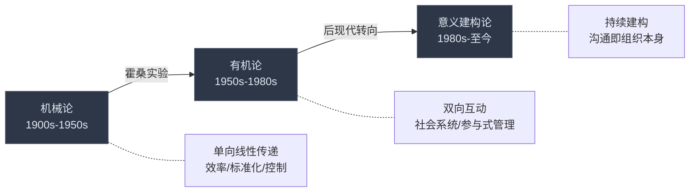
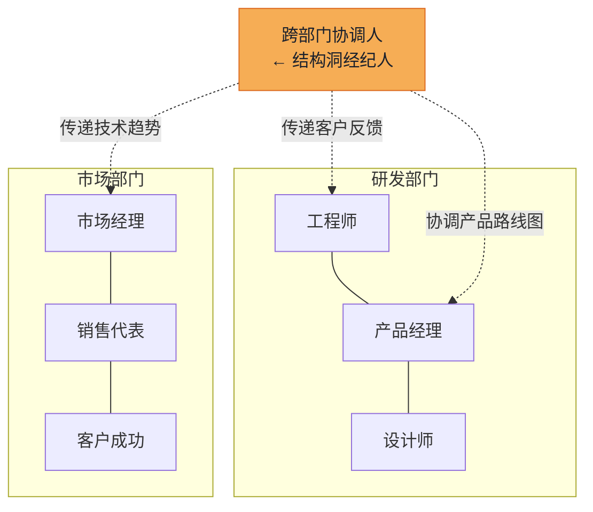
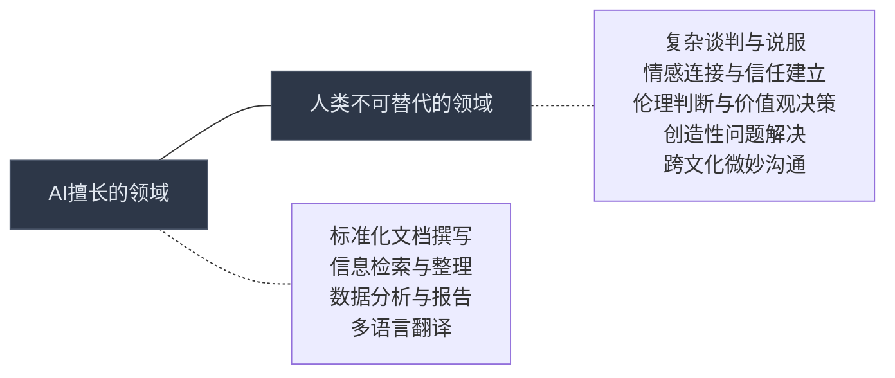

# 第二十章 商务沟通 · 深度拓展

> 本章从组织行为学、跨文化管理、数字化变革、商业伦理和危机管理五个维度，对商务沟通进行系统性的深度拓展。每个维度均遵循"理论→方法→实操→工具"的道法术器逻辑，帮助读者建立从认知到行动的完整能力链。

***

## 一、组织行为学中的沟通理论

### 1.1 组织沟通的理论演进

组织沟通理论经历了从"机械论"到"有机论"再到"意义建构论"的三次范式转移。理解这一演进脉络，有助于我们在不同组织情境中选择合适的沟通策略。

**机械论阶段（1900s-1950s）**：以弗雷德里克·泰勒（Frederick Taylor）的科学管理理论为代表，组织被视为精密的机器，沟通是信息的单向、线性传递。管理者的任务是确保指令清晰、准确地从上层传递到下层。这一时期的沟通模型强调效率、标准化和控制。典型的沟通形式是"命令-执行"链条：高层制定政策，中层传达指令，基层执行任务。这种模式在大规模制造业中曾发挥过巨大作用，例如福特汽车的流水线管理就是机械论沟通的典型实践。但其局限性也很明显——它忽视了人的主观能动性、情感需求和非正式沟通网络的存在。

**有机论阶段（1950s-1980s）**：埃尔顿·梅奥（Elton Mayo）的霍桑实验是这一转向的标志性事件。实验发现，工人的生产效率不仅取决于物质条件，更取决于被关注的感觉和社会关系——这就是著名的"霍桑效应"。切斯特·巴纳德（Chester Barnard）在《经理人员的职能》中提出"合作系统理论"，明确指出沟通是组织存在的三个基本要素之一（另外两个是共同目标和协作意愿）。赫伯特·西蒙（Herbert Simon）的"有限理性"（Bounded Rationality）理论进一步说明，管理者不是全知全能的决策者，而是受限于信息处理能力的"满意型"决策者——他们不追求最优解，而是寻找"足够好"的解。这一理论直接说明了沟通质量对决策质量的决定性影响：信息不完整或传递失真，就会导致决策偏差。

**意义建构论阶段（1980s至今）**：卡尔·韦克（Karl Weick）的"意义建构理论"（Sensemaking Theory）代表了组织沟通理论的最新范式。韦克在1979年出版的《组织的社会心理学》中提出一个颠覆性观点：组织不是预先存在的实体，而是通过成员之间的持续沟通和互动不断被"建构"出来的。换言之，**沟通不是组织中的活动，而是组织本身**。这一理论对管理实践的启示是：管理者不能仅仅关注"传递信息"，更要关注"共同创造意义"——通过对话、叙事和集体反思，帮助组织成员形成对现实的共同理解。

### 1.2 结构洞理论与组织网络

罗纳德·伯特（Ronald Burt）的"结构洞"（Structural Holes）理论为理解组织内部沟通网络提供了强大的分析工具。该理论的核心思想可以用一句话概括：**连接不同群体的人，比深入一个群体的人更有价值**。

**什么是结构洞？** 结构洞是指社会网络中两个群体之间缺乏直接连接的"空隙"。想象一个公司里，研发部门和市场部门的同事很少直接交流——这个"缝隙"就是一个结构洞。能够跨越这个缝隙、连接两个群体的人，被称为"经纪人"（broker）。

**经纪人的三大优势：**

| 优势类型 | 含义 | 实际表现 |
|---------|------|---------|
| 信息优势 | 更早获得多样化信息 | 在产品研发早期就了解市场需求变化 |
| 控制优势 | 控制信息流动的方向和时机 | 决定哪些信息传递给哪个部门 |
| 创新优势 | 整合不同领域的知识产生新想法 | 将技术可能性与市场机会创造性地结合 |

**实操：如何识别和利用结构洞**

第一步，绘制组织网络图。可以使用问卷调查（"你经常和谁讨论工作问题？"）或分析邮件/聊天记录来识别实际的沟通网络。

第二步，识别结构洞。在网络图中寻找连接稀疏的区域——两个群体之间几乎没有直接连线。

第三步，主动桥接。如果你处于结构洞位置，有意识地在不同群体之间传递有价值的信息。如果你不在结构洞位置，主动建立跨群体的人脉关系。

第四步，避免陷阱。结构洞的经纪人角色也有风险——如果被某一方认为"两边讨好"或"信息泄露"，会丧失信任。关键原则是：传递趋势和洞察，不传递隐私和细节。

### 1.3 组织沉默与员工发声

组织沉默（Organizational Silence）是一个被严重低估的组织问题。伊丽莎白·莫里森（Elizabeth Morrison）和弗朗西斯·米利肯（Frances Milliken）在2000年的开创性论文中指出，许多组织中存在系统性的沉默现象——员工拥有改善组织的重要信息和想法，但**选择不表达**。

**组织沉默的四层根源分析：**

| 层级 | 根源 | 表现 | 典型场景 |
|------|------|------|---------|
| 管理层 | 管理者恐惧负面反馈 | 无意识创造抑制发声的氛围 | 领导问"有意见吗？"但每次提意见都被反驳 |
| 员工层 | 自我保护心理 | 担心表达异议带来负面影响 | "说了也没用，还会得罪人" |
| 文化层 | 强调服从和一致性 | 多样化观点被压制 | "在咱们公司，听话比能力重要" |
| 制度层 | 程序公正缺失 | 员工认为表达不会被认真对待 | 建议箱形同虚设，从无反馈 |

**打破沉默的系统性方案：**

在**个人层面**，管理者需要练习两个关键技能：
- **主动倾听**（Active Listening）：不是被动地等对方说完，而是通过复述、提问和情感回应来展示"我真的在听"。具体做法：在员工发言后，先用自己的话复述要点（"你的意思是……"），再回应。
- **开放性提问**（Open-Ended Questions）：用"你怎么看？""你觉得什么方案更好？"替代"你同意吗？"——前者邀请思考，后者暗示期望的答案。

在**团队层面**，艾米·艾德蒙森（Amy Edmondson）的研究表明，建立"心理安全感"（Psychological Safety）是打破沉默的关键。心理安全感不是"一团和气"，而是成员确信"表达不同意见不会受到惩罚"。谷歌的"亚里士多德项目"（Project Aristotle）通过对180个团队的研究发现，心理安全感是高效团队最重要的特征——没有之一。

建立心理安全感的四个实操方法：
1. **领导者先示弱**：主动分享自己的错误和不确定性，"我在这个问题上也没有完全想清楚，需要大家一起讨论"
2. **惩罚沉默而非异议**：在绩效评估中纳入"建设性反对"的维度，奖励敢于提出不同意见的人
3. **分离观点和人**：讨论时明确区分"对事"和"对人"，"这个方案有风险"≠"提出这个方案的人不行"
4. **事后复盘而非事后追责**：项目结束后做"教训总结"而非"责任追究"

在**组织层面**，需要建立正式的反馈渠道：匿名意见平台、定期的"Town Hall"全员会议、直接向高层汇报的"越级通道"（skip-level meeting）。关键不是渠道本身，而是**每一次反馈都有可见的回应**——哪怕是否决，也要说明理由。

***

## 二、商务沟通的全球化挑战

### 2.1 跨文化沟通的理论框架

全球化使得跨文化商务沟通从"可选技能"变成了"基本功"。以下是理解文化差异的两个核心理论框架。

**霍夫斯泰德文化维度理论**

吉尔特·霍夫斯泰德（Geert Hofstede）通过对IBM全球员工的大规模调查，识别了六个关键的文化维度。以下表格列出了各维度对商务沟通的直接影响：

| 文化维度 | 低分端特征 | 高分端特征 | 沟通启示 |
|---------|-----------|-----------|---------|
| 权力距离 | 平等主义（北欧） | 等级分明（马来西亚、菲律宾） | 高权力距离文化中，不能越级汇报；低权力距离文化中，直呼上司名字是常态 |
| 个人主义/集体主义 | 集体利益优先（中国、日本） | 个人成就优先（美国、英国） | 集体主义文化中强调"我们"，个人主义文化中可以突出"你" |
| 男性化/女性化 | 注重生活质量（瑞典、挪威） | 注重竞争成就（日本、匈牙利） | 男性化文化中可以用竞争框架，女性化文化中强调合作和关怀 |
| 不确定性规避 | 容忍模糊（新加坡、丹麦） | 追求确定（希腊、葡萄牙） | 高不确定性规避的文化需要详细的合同和流程文档 |
| 长期导向/短期导向 | 关注即时回报（美国、尼日利亚） | 关注长远利益（中国、日本） | 长期导向文化愿意接受短期亏损换取长期关系 |
| 放纵/克制 | 允许自由享乐（墨西哥、哥伦比亚） | 强调节制自律（中国、俄罗斯） | 放纵文化中商务社交更轻松，克制文化中更正式 |

**爱德华·霍尔的高语境与低语境理论**

这是理解沟通风格差异最实用的框架之一。爱德华·霍尔（Edward T. Hall）的核心洞察是：**信息的含义，有多少藏在"话里"，有多少藏在"话外"**。

| 对比维度 | 高语境文化 | 低语境文化 |
|---------|-----------|-----------|
| 代表国家 | 中国、日本、韩国、阿拉伯国家 | 美国、德国、北欧、澳大利亚 |
| 信息载体 | 非语言信号、关系历史、社会地位、场合 | 明确的文字和语言表达 |
| 沟通风格 | 间接、含蓄、暗示、留白 | 直接、明确、直截了当 |
| "不"的表达 | "这个方案很有意思，我们再考虑考虑" | "这个方案不行，原因是A、B、C" |
| 合同观念 | 合同是关系的起点，可以灵活调整 | 合同是最终承诺，必须严格遵守 |
| 会议风格 | 会前已通过非正式渠道达成共识，会议是走形式 | 会议上公开辩论，现场决策 |

**实操案例：中德商务沟通的典型冲突**

一家中国设备制造商与德国客户谈判。中方销售在会议上说："这个交货期我们可以再商量商量。"德方理解为"有商量余地"，回去后等待中方进一步方案。中方实际上已经给出了"做不到"的暗示，等待德方主动降低要求。三周后双方才发现彼此理解完全不同——这就是高语境与低语境碰撞的典型场景。

**解决方案**：在跨文化沟通中，主动提高信息的"显性化"程度——用书面形式确认口头讨论的要点，明确列出"我们同意的事项"和"需要进一步讨论的事项"。

### 2.2 全球化商务谈判的复杂性

跨文化商务谈判是全球化商务沟通中最具挑战性的领域。不同文化背景的谈判者在目标、节奏、策略和礼仪方面存在系统性差异。

**关系导向 vs. 交易导向**

在关系导向文化（中国、中东、拉丁美洲）中，"先做朋友，再做生意"是基本原则。在中国，商务宴请（饭局）不是"浪费时间"，而是建立信任的核心环节。在中东，商务谈判可能从长达一小时的茶叙开始，直接谈生意被视为不礼貌。在拉丁美洲，关系网络（"compadre"系统）是商业运作的基础设施。

在交易导向文化（美国、北欧、德国）中，"时间就是金钱"，谈判者希望尽快进入正题。冗长的寒暄被视为效率低下。

**时间观念的差异**

人类学家爱德华·霍尔将时间观念分为两种模式：

| 模式 | 特征 | 代表文化 | 谈判影响 |
|------|------|---------|---------|
| 单线时间（Monochronic） | 一次做一件事，严格遵守时间表 | 美国、德国、瑞士 | 会议准时开始和结束，议程固定 |
| 多线时间（Polychronic） | 同时处理多件事，时间灵活 | 中东、非洲、拉美、南欧 | 会议可能延迟开始，中途被打断是常态 |

当单线时间文化与多线时间文化碰撞时，常见的冲突是：德国谈判者觉得巴西伙伴"不守时、不专业"，而巴西谈判者觉得德国人"太机械、没有人情味"。

**实操建议**：在跨文化谈判前，做一份"文化预习备忘录"，至少包含以下内容：
1. 对方文化在六大维度上的大致位置
2. 对方的谈判礼仪和禁忌
3. 对方对时间、关系和合同的文化态度
4. 适当的社交礼节（名片交换、餐桌礼仪、礼物文化）

### 2.3 虚拟全球化团队的沟通

疫情加速了虚拟全球化团队的普及，但虚拟环境放大了跨文化沟通中的每一个摩擦点。

**时区协调的实操策略**

当团队跨越6个以上时区时，"找一个大家都方便的时间"几乎不可能。有效的策略是"轮换制"——每次会议的时间对不同地区轮流有利，而不是总是牺牲同一个地区的成员。另一个策略是建立"核心重叠时间"——每天固定2-3小时所有人都在线，用于需要实时沟通的事务，其余时间使用异步工具。

**信任建立的三阶段模型**

1. **认知信任**（Cognitive Trust）：基于能力和可靠性的信任。在虚拟团队中，通过按时交付、专业表现来建立
2. **情感信任**（Affective Trust）：基于情感连接和关怀的信任。在虚拟团队中，通过非工作交流（虚拟咖啡时间、在线团建活动）来培养
3. **快速信任**（Swift Trust）：在临时项目团队中，信任没有时间慢慢建立。研究发现，早期的可靠表现和积极的社交互动能有效促进快速信任的形成

***

## 三、数字化转型中的沟通变革

### 3.1 数字化工具对商务沟通的影响

数字化转型不只是工具替换，更是沟通范式的根本重构。

**即时通讯与协作平台的双刃剑效应**

Slack、Microsoft Teams、钉钉、飞书等平台已经成为现代企业的核心沟通基础设施。它们整合了即时消息、文件共享、视频会议、项目管理等多种功能，创造了统一的数字化工作空间。研究表明，使用协作平台的企业内部沟通效率平均提高约25%，项目交付时间缩短约20%。

但过度依赖即时通讯带来了新的问题：

| 问题 | 表现 | 数据支撑 |
|------|------|---------|
| 信息过载 | 员工每天接收数百条消息 | RescueTime研究：平均每天切换应用1,200次 |
| 通知疲劳 | 无法区分紧急和重要的信息 | Udemy研究：75%的员工认为通知影响专注力 |
| 浅层沟通 | 重要讨论淹没在碎片消息中 | Slack内部数据：70%的消息在5分钟内被新消息覆盖 |
| 数字鸿沟 | 年龄和职级差异导致工具使用不平等 | 微软调研：41%的员工认为公司没有提供充分的数字工具培训 |

**应对策略**：
1. 建立"消息分级制度"：紧急（@所有人+电话）、重要（@某人）、一般（频道消息）、参考（文档链接）
2. 推行"无会议日"和"免打扰时段"：每周至少一天不开会，每天至少2小时不被打扰
3. 用文档替代频繁讨论：重要决策用文档记录和异步评论，而非在聊天群中反复讨论

### 3.2 远程工作的沟通挑战

Buffer的《2024年远程工作状态报告》显示，远程工作者最常报告的三大挑战是：沟通困难（20%）、孤独感（20%）和协作困难（15%）。

**"Zoom疲劳"的科学解释与应对**

斯坦福大学虚拟人类互动实验室的杰里米·拜伦森（Jeremy Bailenson）教授在2021年的研究中，识别了Zoom疲劳的四大成因：

1. **过度的眼神接触**：在视频会议中，所有人"盯着你看"的时间远超面对面会议——你成了一个"被注视"的对象
2. **看到自己的实时画面**：想象你参加一个线下会议，面前摆着一面镜子，你会一直关注自己在镜子中的样子——这正是视频会议中的体验
3. **身体活动受限**：视频会议要求你固定在摄像头范围内，大幅减少了身体活动
4. **认知负荷增加**：你需要在发送和接收语言信息的同时，额外处理非语言线索（表情、手势）的数字化呈现

**应对Zoom疲劳的实操方法**：
- 切换到"演讲者视图"而非"网格视图"，减少同时看到的人数
- 关闭"自我视图"（Self-View），避免持续看到自己
- 将视频窗口缩小到只占屏幕的一小部分，减少"大脸"效应
- 用电话会议替代非必要的视频会议——不是所有会议都需要"面对面"
- 每25分钟站起来活动一下，遵循"番茄钟"节奏

**非正式沟通的数字化替代**

办公室中的"茶水间对话"——走廊偶遇、午餐闲聊、咖啡休息——在传统组织中发挥着信息传递和关系维护的重要功能。远程工作模式中，这些渠道的缺失需要主动替代：

| 替代方式 | 说明 | 实践案例 |
|---------|------|---------|
| 虚拟咖啡时间 | 随机配对两人进行15分钟非工作聊天 | Donut（Slack插件）自动配对 |
| 非工作频道 | 创建"宠物""美食""运动"等话题频道 | GitLab有超过50个非工作兴趣频道 |
| 异步视频更新 | 用Loom录制个人近况和工作分享 | Buffer全员每天发一条Loom视频 |
| 定期线下聚会 | 每季度或半年组织全员线下聚会 | Automattic（WordPress母公司）每年全员聚会一次 |

### 3.3 人工智能对商务沟通的影响

AI正在从三个层面重塑商务沟通的生态。

**第一层：自动化内容生成**

ChatGPT、Claude等大语言模型能够自动生成邮件、报告、提案等商务文档。麦肯锡2023年的研究显示，使用AI辅助写作的企业文档生产效率提高约40%。但AI生成内容的核心风险是"幻觉"（hallucination）——AI可能生成看似合理但事实错误的内容。最佳实践是将AI定位为"初稿撰写者"和"编辑助手"，所有输出都需要人工审核和验证。

**第二层：智能会议助手**

AI驱动的会议助手（如Otter.ai、Fireflies.ai、飞书妙记）能够自动记录会议内容、提取关键决策和行动项、生成会议摘要。这些工具的应用场景包括：
- 会后自动发送会议纪要和待办事项
- 为缺席会议的成员提供内容摘要
- 跨语言会议的实时翻译和字幕
- 会议录音的全文检索

**第三层：情感分析与沟通优化**

AI情感分析工具能够实时分析邮件、聊天消息和社交媒体帖子中的情感倾向，帮助管理者了解团队士气和客户满意度。但这类工具面临两个核心挑战：一是**准确性**——AI对讽刺、反语和文化特定表达的理解仍然有限；二是**隐私**——监控员工情感引发了严重的伦理争议（详见第四节）。

**AI时代商务沟通能力的转型方向**

随着AI承担越来越多的"信息传递"功能，人类商务沟通者的不可替代价值正在向以下方向转移：

***

## 四、商务沟通中的伦理问题

### 4.1 商务沟通伦理的三大理论视角

商务沟通伦理不是一个单一的"对错"问题，而是需要在多个道德视角之间权衡的复杂判断。

**功利主义视角（Utilitarianism）**：功利主义的创始人边沁（Jeremy Bentham）和密尔（John Stuart Mill）主张，行为的道德性取决于其后果——"最大多数人的最大幸福"。在商务沟通中，这意味着信息传递应以促进所有利益相关者的最大利益为目标。例如，一家制药公司发现某药物有微小的副作用风险。从功利主义视角看，公司需要权衡：公开信息可能导致大量患者恐慌而停药（更大的伤害），还是隐瞒信息可能让少数患者承受风险（较小的伤害）？功利主义的挑战在于如何界定"利益"以及如何衡量不同群体之间的利益权衡。

**义务论视角（Deontology）**：康德（Immanuel Kant）的义务论强调道德原则的绝对性。其核心原则包括：（1）人是目的而非手段，不能把他人仅仅当作工具；（2）行为准则应能普遍化——如果你不愿意所有人都这样做，你就不应该这样做。从义务论视角看，商务沟通中的欺骗、操纵和隐瞒是不可接受的，无论其后果如何。即使说谎能带来更大的利润，义务论也认为诚实是不可妥协的底线。

**美德伦理学视角（Virtue Ethics）**：亚里士多德的美德伦理学关注的不是"什么行为是对的"，而是"什么样的人是好人"。这一视角强调沟通者的品格特质——诚实、公正、勇气、节制——而非仅仅关注行为规则或后果。在商务沟通中，这意味着培养"沟通美德"比遵守规则更为根本。一个具有沟通美德的人，在面对模糊的伦理困境时，更可能做出正确的判断。

**三种视角的对比应用：**

| 场景 | 功利主义判断 | 义务论判断 | 美德伦理学判断 |
|------|------------|-----------|--------------|
| 销售时隐瞒产品的次要缺陷 | 如果不影响使用，可以接受 | 隐瞒即欺骗，不可接受 | 诚实的人会主动说明 |
| 裁员时用模糊语言避免直接告知 | 如果减少痛苦，有合理性 | 应直接告知，尊重知情权 | 勇敢而有同理心的人会给明确答复 |
| 竞争对手的商业机密意外泄露给你 | 如果利用能增加股东价值，可用 | 不应利用他人的机密 | 正直的人会通知对方 |

### 4.2 数字时代的隐私与透明

数字技术为商务沟通创造了前所未有的伦理挑战。

**员工监控的伦理光谱**

员工监控不是"全有或全无"的选择，而是一个光谱。从最低侵入性到最高侵入性，监控手段包括：

| 监控级别 | 手段 | 企业理由 | 伦理风险 |
|---------|------|---------|---------|
| 低 | 公司设备的上网记录 | 安全合规 | 影响较小，员工通常知情 |
| 中 | 工作邮件和聊天记录审计 | 法律合规、内部调查 | 侵犯沟通隐私，抑制坦诚表达 |
| 高 | 屏幕录制、键盘记录 | 生产力监控 | 严重侵犯隐私，制造恐惧氛围 |
| 极高 | 摄像头监控、情绪识别 | 安全或"情绪管理" | 触及人格尊严底线 |

**伦理判断原则**：
1. **透明原则**：员工应被告知监控的存在和范围
2. **比例原则**：监控范围应与合法目的相称
3. **目的限定**：收集的数据只能用于声明的目的
4. **最小必要**：只收集实现目的所必需的最少数据

### 4.3 商务沟通中的欺骗与操纵

商务沟通中的不诚实行为涵盖了一个广泛的光谱，从"社交润滑剂"式的白色谎言到违法的欺诈。

**合法与非法的边界：**

| 行为 | 例子 | 法律评价 | 伦理评价 |
|------|------|---------|---------|
| 合理的营销修辞 | "我们的产品让生活更美好" | 合法 | 可接受 |
| 夸大但不虚假的宣传 | "行业领先"（无明确标准） | 灰色地带 | 有争议 |
| 选择性披露 | 只说产品的优点，不提缺点 | 合法（但证券法有例外） | 功利主义可接受，义务论不可接受 |
| 虚假陈述 | 虚构客户案例或数据 | 违法 | 不可接受 |
| 战略性模糊 | 故意使用模糊语言以保留灵活性 | 合法 | 可能跨越伦理边界 |

**战略性模糊的伦理边界**：战略性模糊在商务沟通中很常见——在谈判中使用"我们原则上同意"（但"原则上"可以有一百种解释），在合同中使用弹性条款（"尽最大努力"而非"保证"）。这些做法在一定范围内是合法的商务策略，但当战略性模糊导致对方做出错误决策、造成实际损失时，就跨越了伦理边界。

**判断标准**：问自己一个问题——"如果对方完全理解了我的真实意图，他还会做出同样的决策吗？"如果答案是"不会"，你的沟通方式可能已经越界了。

***

## 五、危机中的商务沟通

### 5.1 危机沟通的理论模型

危机沟通是商务沟通中最具挑战性的领域——在压力最大、时间最紧、关注度最高的时刻做出正确的沟通决策。

**情境危机沟通理论（SCCT）**

蒂莫西·库姆斯（W. Timothy Coombs）提出的情境危机沟通理论是危机沟通领域最具影响力的理论框架。SCCT的核心思想是：**没有放之四海而皆准的危机回应策略，回应策略应匹配危机类型**。

| 危机类型 | 定义 | 例子 | 组织责任程度 | 推荐策略 |
|---------|------|------|------------|---------|
| 受害者型 | 组织也是危机的受害者 | 自然灾害、谣言攻击、产品被篡改 | 低 | 强调自身也是受害者，提供援助信息 |
| 意外型 | 不可预见的系统故障或人为错误 | 技术故障导致数据泄露、操作失误 | 中 | 表达歉意，提供补偿，说明改进措施 |
| 可预防型 | 组织的不当行为或疏忽 | 已知缺陷未修复导致事故、财务造假 | 高 | 深度道歉、全面补偿、系统性改进 |

**选择回应策略的关键变量**：除了危机类型，还需要考虑"危机历史"——如果组织之前发生过类似危机，利益相关者会认为"屡教不改"，需要更强的回应力度。库姆斯称之为"危机声誉资本"——有良好声誉的组织在危机中拥有更大的"容错空间"。

**形象修复理论（Image Repair Theory）**

威廉·贝诺伊特（William Benoit）的形象修复理论提出了五种危机回应策略，从最"防御性"到最"负责性"排列：

| 策略 | 含义 | 适用场景 | 风险 |
|------|------|---------|------|
| 否认 | 否认危机发生或与组织有关联 | 明确被冤枉时 | 如果被证伪，信誉崩塌 |
| 逃避责任 | 归因于外部因素或不可控力 | 确实是外部原因时 | 可能被视为推卸责任 |
| 降低负面形象 | 强调积极行为来平衡负面影响 | 需要时间调查时 | 可能被视为转移注意力 |
| 纠正行为 | 承诺解决问题并防止再次发生 | 确实需要改进时 | 如果不兑现承诺，后果更严重 |
| 忏悔 | 公开承认错误并请求原谅 | 确实是组织的过错时 | 可能带来法律责任 |

**策略选择的黄金法则**：在信息高度透明的数字时代，否认和逃避责任的风险远高于过去——社交媒体上的"民间侦探"会在数小时内挖掘出矛盾证据。最安全的策略往往是"承认问题 + 展示同理心 + 公布行动计划"。

### 5.2 数字时代的危机传播动力学

社交媒体时代彻底改变了危机传播的速度和范围。

**从"涟漪模式"到"爆炸模式"**

传统媒体时代的危机传播像水面上的涟漪——从核心事件向外缓慢扩散，媒体有时间核实信息，组织有时间准备回应。社交媒体时代的危机传播像爆炸——信息在数分钟内触达全球受众，任何人都可以成为"记者"和"评论员"。

**危机传播的时间窗口变化：**

| 时代 | 黄金回应时间 | 传播速度 | 信息控制力 |
|------|------------|---------|-----------|
| 传统媒体时代 | 24-48小时 | 小时级 | 较高（通过媒体关系） |
| 社交媒体早期 | 4-6小时 | 分钟级 | 中等（可以引导话题） |
| 当前短视频时代 | 1小时甚至更短 | 秒级 | 极低（UGC无法控制） |

研究发现，在危机发生后第一小时内做出回应的企业，其声誉损失比延迟回应的企业低约50%。但"快"不等于"乱"——回应需要快，但内容需要准。最佳实践是"2-1-0法则"：**2小时内发布初始声明**（承认事件、表达关注、承诺跟进），**1天内发布详细回应**（调查结果、具体措施），**持续发布更新**直到问题解决。

**负面信息的"六倍效应"**

研究表明，负面品牌信息在社交媒体上的传播速度约是正面信息的六倍。一项对Twitter数据的分析发现，带有愤怒情绪的推文被转发的概率是带有喜悦情绪推文的三倍。这意味着危机管理的重点不是"灭火"，而是"防火"——预防危机比应对危机更重要。

### 5.3 高管在危机中的沟通角色

高管在危机中的沟通表现直接影响危机的走向和组织的命运。危机领导力不是一种天赋，而是一组可以学习和训练的沟通技能。

**危机沟通的三个核心原则：**

1. **可见性**（Visibility）：危机中高管的沉默会被解读为"逃避"或"不关心"。波音公司在两起737 MAX空难后的危机处理中，CEO丹尼斯·米伦伯格（Dennis Muilenburg）的迟缓回应和低可见度被广泛批评为加剧了危机。
2. **真实性**（Authenticity）：在信息高度透明的时代，任何试图掩盖或美化的行为都可能适得其反。2010年BP墨西哥湾漏油事故中，CEO托尼·海沃德（Tony Hayward）说"我想找回我的生活"（I'd like my life back），这句话暴露了他对受害者的漠视，成为危机沟通中的经典反面案例。
3. **行动导向**（Action-Oriented）：危机中的沟通不仅要传递信息，更要传递行动——"我们正在做什么"比"我们怎么看"更重要。

**危机声明的核心结构（CANPA模型）：**

C - Concern（关切）：对受影响者表达真诚的关切
A - Action（行动）：说明正在采取的具体行动
N - Next Steps（后续）：说明下一步计划和时间表
P - Prevention（预防）：说明如何防止类似事件再次发生
A - Accountability（责任）：明确责任承担，不推卸

### 5.4 危机后的声誉修复

危机过后的声誉修复是一个长期的系统工程。研究表明，组织从重大危机中恢复声誉的平均时间约为三到五年。

**声誉修复的四阶段模型：**

| 阶段 | 时间范围 | 核心任务 | 沟通重点 |
|------|---------|---------|---------|
| 止血期 | 危机后1-4周 | 控制损害、稳定局势 | 透明、频繁、一致的信息发布 |
| 恢复期 | 危机后1-6个月 | 履行承诺、展示改进 | 定期发布改进进展报告 |
| 重建期 | 危机后6-24个月 | 重建信任、恢复关系 | 正面叙事 + 第三方背书 |
| 超越期 | 危机后2-5年 | 转化危机为竞争优势 | "浴火重生"的品牌故事 |

**正面叙事重建的策略**：
- **展示学习和成长**："这次危机让我们认识到了X问题，我们因此建立了Y机制"
- **用行动而非语言证明改变**：投资新系统、聘请独立审计、成立新的合规部门
- **邀请外部验证**：让行业权威、独立机构对你的改进进行评估和背书
- **将危机教训制度化**：将危机中获得的经验写入公司制度和培训体系

***

## 六、常见误区与纠正

### 6.1 组织沟通的五个常见误区

| 误区 | 为什么是错的 | 正确做法 |
|------|------------|---------|
| "沟通就是开会" | 会议是沟通的一种形式，但大量信息通过非正式渠道流动 | 建立多渠道沟通体系：文档+即时通讯+会议+非正式交流 |
| "发了邮件就等于沟通了" | 发送≠接收，接收≠理解，理解≠同意 | 关键信息用"发送→确认→复述"三步法 |
| "文化差异没那么重要" | 忽视文化差异是跨文化沟通失败的首要原因 | 在重要沟通前做文化预习，了解对方的文化偏好 |
| "危机中少说为妙" | 在社交媒体时代，沉默会被解读为逃避或不关心 | 2小时内发出初始声明，持续更新进展 |
| "AI可以替代人的沟通" | AI擅长信息传递，但无法替代信任建立、情感连接和伦理判断 | 用AI提升效率，用人类维护关系和做关键判断 |

### 6.2 跨文化沟通的常见失误

| 失误 | 具体表现 | 后果 |
|------|---------|------|
| 假设"他们和我们一样" | 用自己的文化框架解读对方的行为 | 严重的误解和冲突 |
| 过度依赖翻译 | 只翻译文字，不翻译文化 | "字面正确、意思错误" |
| 忽视非语言信号 | 只关注说了什么，不关注怎么说的 | 错过大量隐含信息 |
| 一刀切的沟通策略 | 对所有文化使用同一种沟通方式 | 在某些文化中效果适得其反 |
| 文化刻板印象 | 把个体等同于文化群体 | 忽视个体差异，产生偏见 |

***

## 本章小结

商务沟通是一个涉及组织行为学、文化研究、技术变革、伦理学和危机管理等多领域的复合学科。本章从五个维度进行了深度拓展：

1. **组织行为学视角**：沟通不仅是组织中的活动，更是组织本身。结构洞理论揭示了沟通网络的战略价值，组织沉默研究提醒我们"没说出口的话"可能比"说出口的话"更重要。
2. **全球化视角**：文化差异是商务沟通中最容易被低估的变量。高语境与低语境、关系导向与交易导向、单线时间与多线时间——理解这些差异不是"软技能"，而是"生存技能"。
3. **数字化视角**：技术重塑了沟通的速度、范围和方式，但也带来了信息过载、Zoom疲劳和数字鸿沟等新问题。AI正在替代信息传递功能，人类沟通者需要转向更高价值的领域。
4. **伦理视角**：商务沟通中的伦理不是一个简单的"对错"问题，而是在多个道德视角之间权衡的复杂判断。数字时代放大了隐私、监控和数据伦理的挑战。
5. **危机管理视角**：社交媒体时代，危机传播的速度从"小时级"变成了"秒级"，组织的回应窗口从"24小时"缩短到了"1小时"。危机沟通不是天赋，而是可以训练的技能组合。

在快速变化的商业环境中，商务沟通能力已经成为企业核心竞争力的重要组成部分。未来的商务沟通专业人士需要具备跨文化敏感度、数字素养、伦理意识和危机管理能力，才能有效应对日益复杂的沟通挑战。
