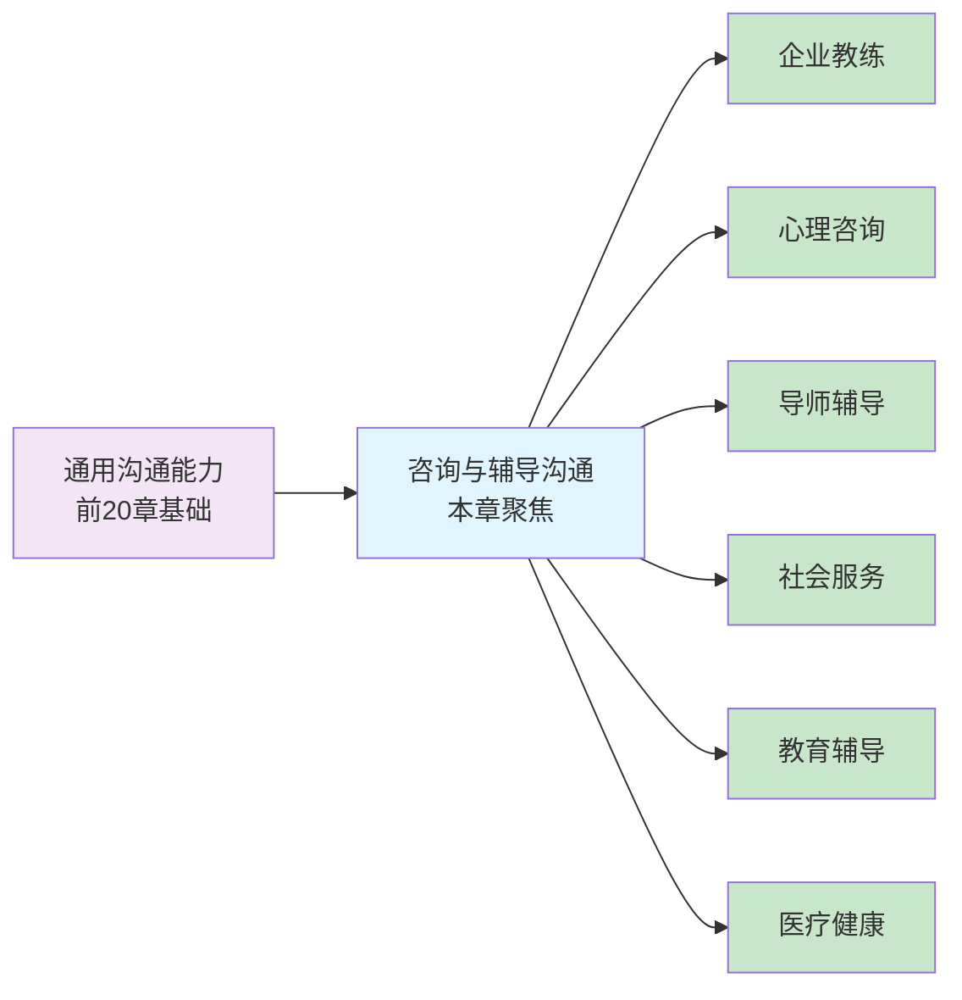
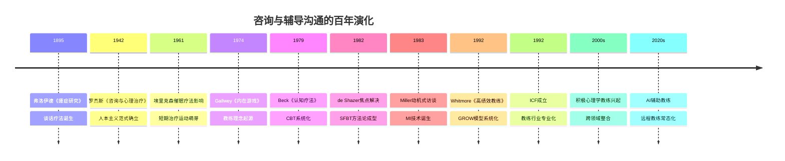
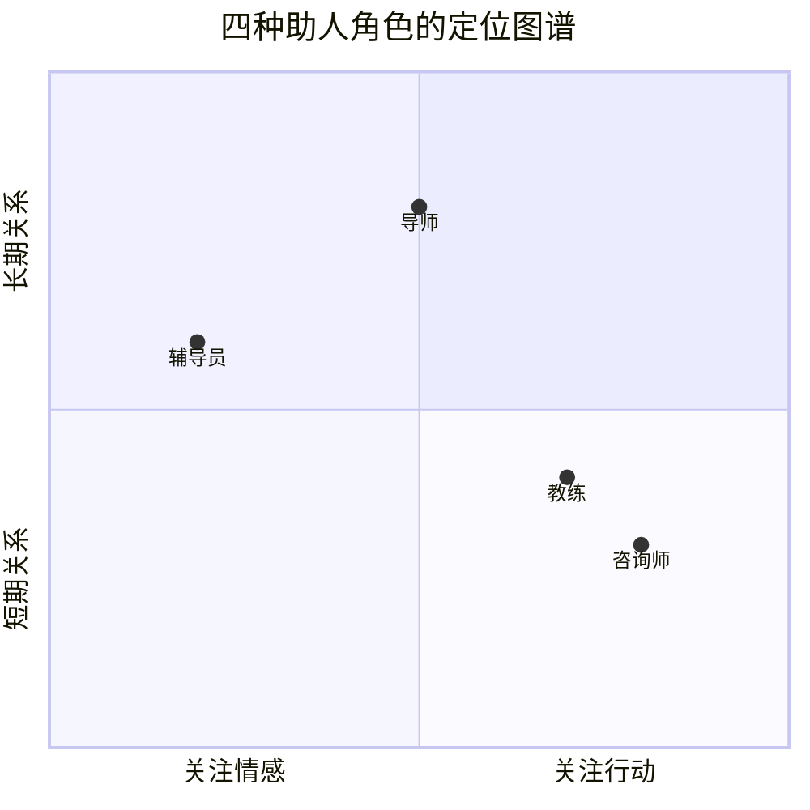
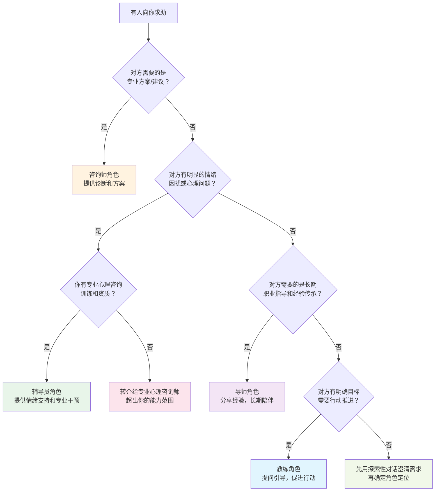
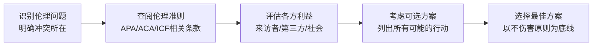
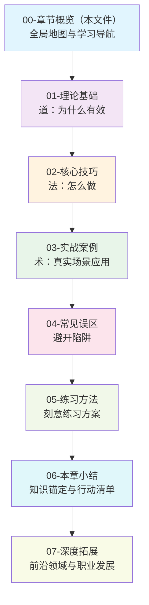

# 第二十一章 咨询与辅导沟通

## 章节概览

在当今复杂多变的社会环境中，咨询与辅导沟通已成为专业助人工作的核心技能。无论是企业管理、心理咨询、教育辅导还是职业发展，有效的咨询与辅导沟通都能帮助个体和组织突破困境、实现成长。本章将系统介绍咨询与辅导沟通的理论基础、核心技巧和实践应用。

本章定位为全书从"一般沟通技巧"向"专业助人沟通"的过渡枢纽。前面章节已经建立了倾听、提问、反馈等通用沟通能力，本章将这些能力整合到专业助人框架中，赋予它们更明确的理论根基和更严格的操作规范。如果你已经熟练掌握了前面章节的倾听三层次、非暴力沟通四步法、反馈的SBI模型等技术，那么本章将教你如何把这些散点技能串联成一套完整的助人对话体系。

---

## 咨询与辅导沟通的历史脉络

理解一个领域的现在，必须理解它的过去。咨询与辅导沟通并非凭空出现，而是经历了百余年的理论积累和实践演化。

### 从弗洛伊德到罗杰斯：谈话疗法的诞生（1890s-1950s）

1895年，弗洛伊德与布罗伊尔合著的《癔症研究》出版，标志着"谈话疗法"（talking cure）的诞生。弗洛伊德的精神分析将对话从日常社交工具提升为治疗手段——通过自由联想和释梦，让潜意识内容浮现到意识层面。这一阶段的核心贡献是确立了一个基本原则：**语言本身就是改变的工具**。

1942年，卡尔·罗杰斯出版《咨询与心理治疗》，提出了"非指导性咨询"，彻底改变了助人对话的范式。罗杰斯认为，治疗师不需要是分析潜意识的专家，只需要提供三个核心条件——真诚一致、无条件积极关注、共情理解——来访者就能自发走向成长。这一发现影响深远，至今仍是所有助人沟通的底层基石。

### 从治疗室到董事会：教练行业的崛起（1970s-2000s）

1974年，Timothy Gallwey 在《网球的内在游戏》中发现了一个关键洞察：选手的最大障碍往往不是技术不足，而是内心的自我干扰（self-interference）。他由此发展出"内在游戏"教练法，将心理辅导技术从治疗领域迁移到了绩效提升领域。

1992年，John Whitmore 出版《高绩效教练》，将GROW模型系统化，正式奠定了商业教练的方法论基础。同年，国际教练联合会（ICF）成立，标志着教练作为一个独立专业的正式诞生。ICF 2023年全球教练研究显示，全球教练从业者已超过10万人，86%的企业表示教练投资带来了正向ROI，平均回报率为7倍教练费用。

### 整合与分化：当代多元发展（2000s至今）

21世纪以来，咨询与辅导领域呈现出两个看似矛盾的趋势：

**整合趋势**——不同流派之间的边界日益模糊。认知行为疗法（CBT）吸收了正念技术，发展出"正念认知疗法"（MBCT）；教练行业借鉴心理咨询的深度倾听和动机式访谈技术；导师制开始引入结构化的教练对话框架。

**分化趋势**——专业细分持续深化。出现了积极心理学教练、叙事教练、系统性团队教练等新分支；远程教练（telecoaching）和AI辅助教练成为新的研究和实践前沿。

---

## 咨询与辅导沟通的定义与范畴

咨询与辅导沟通是指专业助人者通过特定的沟通技术和方法，帮助来访者（客户）澄清问题、探索解决方案、促进个人成长和发展的专业沟通过程。这一过程强调建立信任关系、运用专业技术、遵循伦理规范，并以促进来访者的自主性和潜能发展为目标。

这个定义包含四个核心要素，缺一不可：

1. **专业性**——不是随意聊天，而是有理论支撑、有技术规范的结构化对话
2. **关系性**——改变发生在关系中，信任关系是所有技术生效的前提条件
3. **目标性**——以促进来访者的改变、成长或问题解决为明确导向
4. **伦理性**——遵循保密、知情同意、不伤害等专业伦理原则

### 与日常沟通的本质区别

与日常沟通相比，咨询与辅导沟通有六个维度的根本差异：

| 维度 | 日常沟通 | 咨询与辅导沟通 |
|------|----------|----------------|
| 目的 | 信息交换、社交维系 | 促进改变、解决问题、个人成长 |
| 关系 | 平等社交关系 | 专业助人关系，有明确角色和边界 |
| 技术 | 自发、无结构 | 有意识运用专业技术，有结构化流程 |
| 伦理 | 一般社交礼仪 | 严格的伦理规范（保密、知情同意、不伤害） |
| 责任 | 双向对等 | 助人者承担专业责任，来访者拥有自主权 |
| 评估 | 通常无 | 有明确的评估和效果追踪机制 |

一个常见的误解是把"善于聊天"等同于"善于辅导"。事实上，日常沟通中许多有效策略在咨询与辅导中是反效果的。例如：

- **日常沟通**："我也遇到过这种情况，我是这么处理的……"（分享经验建立共鸣）
- **咨询辅导**：这种回应会将焦点从来访者转移到助人者身上，剥夺了来访者自主探索的机会。正确的做法是用开放式提问引导来访者深入思考："你当时是怎么考虑的？"

理解这个区别，是从"自然沟通者"转变为"专业助人者"的第一步。

---

## 六大核心能力框架

咨询与辅导沟通需要哪些能力？不同的专业组织给出了各自的框架。国际教练联合会（ICF）定义了8项核心教练能力，美国心理咨询协会（ACA）定义了咨询师能力标准，欧洲指导与教练委员会（EMCC）提出了能力框架，美国心理学会（APA）也定义了心理学家的competency benchmark。

综合这些框架，有效的咨询与辅导沟通需要具备以下六大核心能力：

### 1. 关系建立能力（Rapport Building）

**为什么重要**：研究一致表明，治疗联盟（therapeutic alliance）是预测咨询效果的最强单一因素，其影响力甚至超过具体流派技术的差异。Horvath等人（2011）的元分析发现，治疗联盟质量与治疗效果之间的相关系数为0.28——这意味着关系质量解释了约8%的结果变异，这在心理咨询研究中是一个非常大的效应量。

**核心要素**：
- **情感协调**（emotional attunement）：准确感知对方的情绪状态，并做出适当回应
- **安全感营造**：通过物理环境、语言选择和行为一致来建立安全空间
- **边界设定**：明确专业关系的性质、保密范围和时间框架
- **文化敏感性**：尊重来访者的文化背景、价值观和信仰体系

**与其他章节的关联**：第四章的信任建立技术、第八章的非语言沟通，是关系建立能力的直接基础。

### 2. 深度倾听能力（Deep Listening）

**为什么重要**：普通对话中的倾听是为了回应，咨询与辅导中的倾听是为了理解。这种理解不仅是认知层面的"听懂了"，更是情感层面的"感受到了"，以及意义层面的"理解了这对来访者意味着什么"。

**三个层次**（源自Ivey的微咨询技术）：
- **内容倾听**（content listening）：准确接收事实信息，不遗漏、不扭曲
- **情感倾听**（emotional listening）：识别言语背后的情绪信号，包括语调、节奏、停顿等副语言线索
- **意义倾听**（meaning listening）：理解事件对来访者的个人意义，包括价值观、信念和未言明的需求

**与其他章节的关联**：第五章的积极倾听技术是基础，本章将把它提升到专业助人的深度和精度。

### 3. 结构化对话能力（Structured Dialogue）

**为什么重要**：没有结构的对话容易陷入漫无目的的闲聊或情绪宣泄。结构化对话能力是指在保持灵活的同时，运用框架引导对话方向，平衡自由探索与目标导向。好的结构是"隐形的脚手架"——来访者感受到的是自然流动的对话，但实际上对话有清晰的方向和节奏。

**关键要素**：
- 开场：建立合约、明确目标、设定议程
- 展开：引导探索、深化理解、激发洞察
- 收束：总结要点、确认行动、预约跟进

### 4. 适时挑战能力（Constructive Challenge）

**为什么重要**：只有温暖和支持的对话可以让人感觉良好，但不一定能促进改变。适时挑战是在信任基础上温和但坚定地指出盲点、矛盾和自我设限。William Miller（动机式访谈创始人）指出："如果只是一味接纳，来访者可能会感到被理解，但不会改变。"

**挑战的类型**：
- **矛盾揭示**：帮助来访者看到言行不一致或价值观冲突
- **假设检验**：质疑来访者视为理所当然的信念
- **视角拓展**：引入来访者未曾考虑的角度
- **舒适区推展**：温和地鼓励来访者面对回避的问题

**时机原则**：挑战必须建立在充分的关系基础之上。一般来说，前30%的时间用于建立关系和理解，后70%才能引入挑战。过早挑战会让来访者感到被评判，破坏信任。

### 5. 伦理判断能力（Ethical Judgment）

**为什么重要**：咨询与辅导涉及人的脆弱性和信任，伦理失误的后果远比日常沟通严重。一个不当的建议可能影响来访者的人生决策，一次无意的保密泄露可能造成持久伤害。

**核心伦理原则**（综合APA、ACA、ICF的伦理准则）：

| 原则 | 含义 | 典型困境示例 |
|------|------|-------------|
| 自主性 | 尊重来访者的自我决定权 | 来访者做出你认为错误的选择 |
| 善行 | 以来访者最大利益为行动标准 | 来访者的利益与公司利益冲突 |
| 不伤害 | 避免对来访者造成伤害 | 面质可能引起短期痛苦但促进长期成长 |
| 忠诚 | 遵守承诺和专业约定 | 来访者要求你对第三方保密 |
| 公正 | 公平对待所有来访者 | 资源有限时如何分配注意力 |
| 诚信 | 诚实透明地沟通 | 承认自己的专业局限性 |

**保密原则的边界**：保密是咨询关系的基石，但保密不是绝对的。以下情况需要突破保密：来访者有自杀或伤害他人的即时风险、涉及未成年人虐待、法院依法调取等。这些例外必须在首次会谈时向来访者明确说明。

### 6. 自我觉察能力（Self-Awareness）

**为什么重要**：助人者不是中性的工具，而是带着自己的经历、偏见和情绪反应进入对话的。如果缺乏自我觉察，助人者可能将自己的议题投射到来访者身上——例如，一个经历过婚姻危机的咨询师可能过度认同同样经历的来访者，失去专业客观性。

**自我觉察的三个层面**：
- **偏见觉察**：认识到自己对特定人群、话题或行为的预设判断
- **情绪觉察**：识别对话中自己被触发的情绪反应（countertransference）
- **局限觉察**：明确自己能力的边界，知道何时需要转介

**实践方法**：定期接受专业督导（supervision）、坚持写反思日志、参与同行案例讨论。

---

## 四种主要助人角色的区别

在专业助人领域，教练、咨询师、导师和辅导员是最常见的四种角色。虽然它们在实践中经常交叉，但每种角色都有独特的定位、方法论和适用场景。理解这些区别对于选择正确的助人方式至关重要。

### 教练（Coach）

教练角色主要聚焦于目标达成和绩效提升。教练通过提问、反馈和挑战，帮助客户识别目标、制定行动计划并克服障碍。教练通常不提供直接建议，而是引导客户自主发现解决方案。在企业环境中，高管教练、团队教练和职业教练都是常见的应用形式。

教练的核心信念是：客户本身拥有解决问题的资源和智慧，教练的角色是通过结构化的对话帮助客户释放这些潜能。这一理念源于 Timothy Gallwey 的"内在游戏"（Inner Game）理论——他在网球教练实践中发现，选手的最大障碍往往不是技术不足，而是内心的自我干扰。

**教练的典型工作场景**：
- 新任管理者适应领导角色
- 高管提升战略决策能力
- 团队改善协作效率
- 个人职业转型和规划
- 提升演讲、谈判等特定技能

**教练的关键限制**：教练不处理心理疾病、不诊断心理问题、不提供临床建议。当教练发现客户可能存在心理健康问题时，应当转介给专业心理咨询师或心理治疗师。

### 咨询师（Consultant）

咨询师角色强调专业知识和解决方案的提供。咨询师基于其专业领域的知识和经验，为客户提供诊断分析、策略建议和实施方案。在管理咨询、技术咨询和专业咨询领域，咨询师通常扮演专家角色，直接提供专业意见和解决方案。

与教练不同，咨询师的核心价值在于"我知道你不知道的东西"。咨询师需要具备深厚的领域专业知识，能够快速诊断问题并提供经过验证的解决方案。

**咨询师的典型工作场景**：
- 企业战略规划和组织变革
- 技术选型和系统架构设计
- 市场进入策略和竞争分析
- 流程优化和效率提升
- 专业法规和合规咨询

**咨询师的关键限制**：咨询师提供的方案如果失败，可能承担商业责任。咨询师需要明确区分"基于专业经验的建议"和"需要来访者自行决策的选择"，避免越界承担不属于自己的决策责任。

### 导师（Mentor）

导师角色侧重于长期关系中的知识传授、经验分享和职业指导。导师通常是在特定领域有丰富经验的专业人士，通过分享个人经历、提供指导和建立人脉网络，帮助被指导者（mentee）成长发展。导师关系往往跨越较长时间，强调信任和相互尊重。

导师制（Mentoring）的历史可以追溯到古希腊——荷马史诗《奥德赛》中，奥德修斯出征特洛伊前将儿子忒勒马科斯托付给好友 Mentor 教导。这个典故奠定了导师制的核心内涵：经验丰富的长者通过长期陪伴和指导，帮助年轻人成长。

**导师的典型工作场景**：
- 新员工入职适应和文化融入
- 年轻专业人士的职业发展
- 学术研究方向的引导
- 行业人脉和资源的引荐
- 领导力潜质的长期培养

**导师制的两种模式**：
- **传统导师制**（Traditional Mentoring）：一对一、非结构化、以导师经验为主导。优势是关系深度大，劣势是质量高度依赖导师个人能力。
- **结构化导师制**（Structured Mentoring）：有明确的目标设定、定期会面、进展评估等机制。优势是质量可控、可规模化，劣势是可能牺牲关系的自然性。

### 辅导员（Counselor）

辅导员角色专注于情绪支持、问题解决和个人成长。辅导员运用专业的心理咨询技术，帮助来访者处理情绪困扰、改善人际关系、提升自我认知。辅导员通常在心理健康、教育或社会服务领域工作，强调保密性、无条件积极关注和专业伦理。

辅导员与心理咨询师的区别在于：辅导员通常处理发展性问题（如学业困难、职业迷茫、人际适应），而心理咨询师处理更深层的心理问题（如焦虑症、抑郁症、创伤后应激）。但在实践中，两者的边界常常模糊。

**辅导员的典型工作场景**：
- 学生学业压力和情绪管理
- 员工职场心理健康支持
- 家庭关系和亲子沟通
- 危机干预和哀伤辅导
- 个人成长和自我探索

**辅导员需要特别注意的"能力边界"**：当来访者的问题超出发展性范畴，呈现明显的心理障碍症状（如持续两周以上的情绪低落、严重的睡眠障碍、幻觉妄想等），辅导员应及时转介至精神科医师或临床心理学家。辅导员不是心理治疗师，混淆两者的边界可能延误治疗、造成伤害。

### 四种角色的系统对比

| 维度 | 教练 Coach | 咨询师 Consultant | 导师 Mentor | 辅导员 Counselor |
|------|-----------|-------------------|------------|-----------------|
| 核心焦点 | 目标达成与绩效 | 问题诊断与方案 | 知识传承与成长 | 情绪支持与改变 |
| 专业知识 | 对话引导技术 | 领域专业知识 | 行业经验积累 | 心理咨询技术 |
| 对话风格 | 提问引导为主 | 分析建议为主 | 分享指导为主 | 倾听共情为主 |
| 关系特征 | 短期目标导向 | 项目制合作 | 长期深度信任 | 治疗性关系 |
| 信息流向 | 双向探索 | 单向传授为主 | 经验分享为主 | 来访者为中心 |
| 适用人群 | 有明确目标的行动者 | 需要专业方案的组织 | 寻求职业指导的新人 | 有情绪困扰的个体 |
| 伦理要求 | 中等（合同关系） | 中等（商业伦理） | 较低（非正式） | 严格（专业伦理） |
| 效果衡量 | 目标达成度 | 方案执行效果 | 职业发展轨迹 | 症状改善程度 |
| 典型认证 | ICF、EMCC | 行业协会认证 | 通常无正式认证 | ACA、BACP、CPS |
| 典型时长 | 3-12个月 | 项目周期（1-6月） | 1-5年 | 数周到数年 |

### 如何选择合适的角色？决策流程图

面对一个具体的助人需求，如何判断自己应该扮演哪个角色？以下决策流程可以帮助你：

### 角色切换与整合

在实际工作中，专业助人者经常需要在不同角色之间灵活切换。例如：

- **教练+咨询师**：敏捷教练既引导团队自组织（教练），也提供敏捷方法论的专业指导（咨询师）
- **导师+教练**：资深管理者在指导新人时，既分享行业经验（导师），也用教练技术帮助对方自主思考
- **辅导员+教练**：EAP（员工援助计划）顾问先处理情绪问题（辅导员），再转向目标设定和行动计划（教练）
- **咨询师+教练**：管理咨询师在交付方案后，用教练技术帮助客户团队自主实施变革

关键原则是：**明确告知来访者你正在扮演哪个角色，并在切换时取得对方同意**。角色混淆是咨询与辅导中最常见的伦理风险之一。例如，一个管理者以"教练"名义与下属对话，实际上却在做绩效评估和指令传达——这会让下属在"坦诚开放"和"自我保护"之间陷入矛盾，严重损害信任关系。

---

## 咨询与辅导沟通的应用领域全景

除了上述四种核心角色，咨询与辅导沟通在以下领域也有广泛应用。

### 企业管理领域

企业是咨询与教练技术应用最成熟的市场。ICF 2023年全球教练研究数据显示，全球企业教练市场规模已超过150亿美元，年增长率约12%。

- **高管教练**：针对C-level和VP级别的高管，帮助他们应对战略决策、组织政治和领导力挑战。86%的受访企业表示教练投资带来了正向ROI，平均回报率为7倍教练费用
- **团队教练**：帮助团队建立心理安全感、改善协作模式、处理冲突。谷歌的"亚里士多德项目"（Project Aristotle）发现，心理安全感是高效团队的第一要素，而团队教练是建立心理安全感的有效手段
- **变革管理沟通**：在组织变革中帮助员工理解、适应和参与变革。Kotter的八步变革模型中，"创造紧迫感"和"赋能行动"两个步骤高度依赖教练式沟通
- **绩效辅导**：管理者运用教练技术提升下属绩效，替代传统的"告知-指令"式管理。Gallup研究显示，管理者的教练能力是员工敬业度的最强预测因子

### 心理健康领域

心理健康是咨询与辅导技术的"本源"领域。世界卫生组织数据显示，全球约有9.7亿人受到精神健康问题影响，但大多数中低收入国家每10万人中精神卫生专业人员不足2人，心理健康服务缺口巨大。

- **个体心理咨询**：处理焦虑、抑郁、人际关系问题等。CBT对焦虑和抑郁的治疗效果已被超过300项随机对照试验验证，是循证实践的"金标准"
- **团体辅导**：在安全的小组环境中促进成员互助和成长。Yalom的团体治疗因素模型识别了11个治疗性因素，其中"普遍性"（发现他人有类似困扰）和"利他主义"（帮助他人的同时帮助自己）是团体治疗独特的优势
- **危机干预**：在自杀、创伤等紧急情境中提供即时支持。世界卫生组织建议采用"心理急救"（PFA）框架：观察、倾听、联系
- **心理热线服务**：通过电话或网络提供远程心理支持。中国的心理援助热线（如12320-5）和北京心理危机研究与干预中心（010-82951332）提供了7×24小时服务

### 教育领域

教育领域的辅导工作覆盖面最广——从小学到研究生院，从学业辅导到生涯规划。

- **学业辅导**：帮助学生提升学习策略和自我管理能力。Zimmerman的自我调节学习理论指出，学业成功的关键不是智商，而是学习策略的自我监控和调整能力
- **生涯辅导**：帮助学生探索职业兴趣、规划职业路径。Holland的职业兴趣理论和Super的生涯发展理论是该领域的基础框架
- **教师督导**：帮助教师反思教学实践、提升专业能力。教学督导中的"临床督导"（clinical supervision）模式，通过"观察-分析-反馈"循环帮助教师改进教学
- **家长辅导**：帮助家长改善亲子沟通和教育方式。Gordon的"父母效能训练"（PET）将人本主义沟通技术应用于亲子关系

### 医疗健康领域

医疗健康领域的辅导沟通关注的是"全人"——不仅治疗疾病，更关注患者的心理状态、生活质量和自我管理能力。

- **健康教练**：帮助患者管理慢性疾病、建立健康生活方式。国际教练联合会将健康教练定义为"帮助客户在健康和保健领域实现自我设定的目标"
- **医患沟通**：帮助医生更好地传达诊断信息、理解患者需求。Calgary-Cambridge沟通模型是医患沟通培训中最广泛使用的框架
- **康复辅导**：在身体康复过程中提供心理支持和动机增强。动机式访谈在帮助患者坚持康复训练方面有显著效果
- **临终关怀**：为临终患者及其家属提供情感支持。Kübler-Ross的悲伤五阶段模型（否认-愤怒-讨价还价-抑郁-接受）虽然简化了复杂的临终心理过程，但为关怀者提供了理解患者情绪的基本框架

### 社会服务领域

社会服务领域的辅导工作面向最脆弱的群体，对伦理敏感性和文化能力的要求最高。

- **社区辅导**：为社区居民提供生活适应、家庭关系等方面的支持
- **戒瘾辅导**：帮助物质成瘾者探索改变动机、建立新的生活方式。动机式访谈最初就是为解决酗酒问题而发展的，其在成瘾治疗中的效果有大量循证支持
- **法律调解**：在纠纷调解中运用沟通技术促进各方对话。调解中的"利益导向谈判"（interest-based negotiation）与教练技术中的"探索深层需求"高度一致
- **难民和移民支持**：帮助文化适应和社会融入。跨文化咨询中的"文化谦逊"（cultural humility）态度比"文化能力"（cultural competence）更为重要——因为没有人能完全理解另一种文化，保持学习和好奇的姿态才是正道

---

## 伦理基础框架

伦理是咨询与辅导沟通的生命线。不同于其他章节只涉及"怎么做得更好"，伦理章节关乎"什么能做、什么不能做"。

### 伦理决策的五步模型

当面临伦理困境时，可以采用以下结构化决策流程：

### 常见伦理困境

| 困境类型 | 具体场景 | 推荐处理方式 |
|---------|---------|-------------|
| 双重关系 | 来访者同时是同事的朋友 | 明确角色边界，必要时转介 |
| 保密例外 | 来访者表达自杀意念 | 评估风险等级，按机构协议处理 |
| 价值冲突 | 来访者的选择与你的价值观冲突 | 尊重来访者自主权，反思自身偏见 |
| 能力边界 | 来访者的问题超出你的专长 | 坦诚告知，推荐合适的专业资源 |
| 社交媒体 | 来访者请求添加私人社交账号 | 解释专业边界，保持专业关系渠道 |

详细的伦理讨论将在本章第七部分"深度拓展"中展开，包括跨文化伦理困境、远程咨询的伦理挑战、以及AI辅助咨询的伦理前沿。

---

## 本章学习目标

通过本章的学习，读者将能够：

1. **理解咨询与辅导沟通的核心理论**：掌握GROW模型、动机式访谈、焦点解决短期治疗、人本主义咨询理论和认知行为疗法中的沟通技术，理解每个理论背后的心理学原理和适用场景
2. **掌握关键沟通技巧**：熟练运用积极倾听、开放式提问、SBI反馈模型、重构技巧、沉默运用和面质技术，能够在不同情境中灵活选择和组合使用
3. **识别不同应用场景**：了解企业教练、心理咨询、导师辅导等不同情境下的沟通特点，能够根据来访者的需求和情境特征选择合适的助人方式
4. **避免常见误区**：认识并避免咨询与辅导沟通中的典型错误，如给建议代替引导、过度共情失去客观性、忽视保密原则等
5. **提升实践能力**：通过模拟对话、角色扮演和案例分析，建立咨询与辅导沟通的实操能力
6. **建立伦理意识**：理解咨询与辅导沟通中的伦理规范，能够在复杂情境中做出符合专业标准的判断

---

## 自我评估：你在咨询与辅导沟通中的位置？

在开始本章学习之前，请用以下评估表定位自己的起点。诚实地给自己打分（1-5分），这将帮助你选择合适的学习路径。

**评分标准**：1=完全没有经验，2=偶尔使用，3=基本掌握，4=熟练运用，5=精通并能教授他人

| 能力项 | 自评分(1-5) | 具体说明 |
|--------|:-----------:|----------|
| 关系建立 | ___ | 快速与陌生人建立信任的能力 |
| 深度倾听 | ___ | 听出对方话语背后的情感和需求 |
| 开放式提问 | ___ | 用提问引导对方深入思考而非给答案 |
| 反馈给予 | ___ | 给出具体、可操作、不伤害关系的反馈 |
| 结构化对话 | ___ | 有框架地引导对话走向目标 |
| 适时挑战 | ___ | 在关系足够安全时指出对方的盲点 |
| 情感反映 | ___ | 准确识别并表达对方的情绪 |
| 伦理意识 | ___ | 了解保密、边界等专业伦理要求 |
| 自我觉察 | ___ | 识别自己的偏见、情绪反应和局限 |
| 角色切换 | ___ | 在教练/咨询/导师/辅导员角色间灵活转换 |

**总分解读**：
- **10-20分**：入门阶段——建议从01-理论基础开始，按顺序学习
- **21-35分**：进阶阶段——可以快速浏览理论部分，重点关注核心技巧和实战案例
- **36-50分**：高级阶段——重点放在深度拓展和练习方法上，反思个人实践中的盲点

---

## 章节结构安排

本章共分为八个部分，按照"道法术器"的逻辑层层递进：

**第一部分：理论基础**（01-理论基础.md）

详细介绍咨询与辅导沟通的核心理论，为实践技巧奠定理论根基。包含七个理论框架：
- **GROW模型**：教练对话的结构化框架，由约翰·惠特莫尔（John Whitmore）在《高绩效教练》中系统提出
- **动机式访谈（MI）**：由威廉·米勒和斯蒂芬·罗尔尼克发展的以客户为中心的引导式沟通方法
- **焦点解决短期治疗（SFBT）**：由史蒂夫·德·沙泽尔和茵素·金·伯格发展的短期治疗方法
- **人本主义咨询理论**：卡尔·罗杰斯（Carl Rogers）的来访者中心疗法
- **认知行为疗法（CBT）**：亚伦·贝克发展的认知-情绪-行为互动框架
- **教练心理学**：积极心理学和自我决定理论在教练中的应用
- **变革理论与系统性思维**：变革阶段模型、家庭系统理论和生态系统视角

**第二部分：核心技巧**（02-核心技巧.md）

系统讲解咨询与辅导沟通中的关键技术，包括理论原理、应用方法和实践示例：
- **积极倾听**：内容倾听、情感倾听、意义倾听三个层次，以及身体语言、言语回应等技术要素
- **开放式提问**：探索性、反思性、未来导向和假设性四类问题的运用
- **SBI反馈模型**：情境-行为-影响的结构化反馈方法
- **重构技巧**：帮助客户从不同角度看问题
- **沉默运用**：促进反思和深化探索
- **情感反映**：识别和表达情绪
- **面质技巧**：帮助客户看到不一致和盲点
- **SMART目标设定**：具体、可衡量、可实现、相关、时限
- **合约建立**：明确角色、期望和界限

**第三部分：实战案例**（03-实战案例.md）

通过八个典型应用场景的案例分析，展示咨询与辅导沟通技巧在不同情境下的实际运用：
1. 企业教练对话：帮助产品总监提升团队领导力
2. 心理咨询对话：处理焦虑情绪和人际关系困扰
3. 导师辅导对话：指导新入职员工的职业发展
4. 绩效辅导对话：管理者与下属的绩效改进对话
5. 团队教练对话：改善团队协作和沟通
6. 职业转型对话：帮助职业迷茫者探索方向
7. 冲突调解对话：在团队冲突中促进对话
8. 危机干预对话：处理紧急情绪危机

**第四部分：常见误区**（04-常见误区.md）

分析咨询与辅导沟通中的典型错误，帮助读者识别并避免：
- 给建议代替引导——剥夺客户自主思考的机会
- 过度共情失去客观性——丧失专业距离和判断力
- 忽视保密原则——破坏信任基础
- 跳过建立关系直接解决问题——忽视关系是改变的载体
- 用自己的经验替代客户体验——忽略个体差异
- 忽视文化差异——用单一文化视角理解多元背景
- 不做评估就干预——缺乏诊断基础的盲目行动

**第五部分：练习方法**（05-练习方法.md）

提供系统的练习方案，包括模拟对话、角色扮演、案例督导等，帮助读者通过实践提升咨询与辅导沟通能力。练习按照难度递进设计，从基础技能的单项练习到综合场景的完整对话。

**第六部分：本章小结**（06-本章小结.md）

总结本章核心要点，提供行动清单和进一步学习资源，帮助读者巩固学习成果并规划后续发展。

**第七部分：深度拓展**（07-深度拓展.md）

面向希望深入专业领域的读者，探讨教练行业的职业发展路径、心理咨询的伦理框架、跨文化咨询沟通、数字化时代的远程教练技术、以及AI辅助咨询等前沿领域。

---

## 学习建议与时间规划

### 入门读者（零基础）

预计总学习时间：15-20小时

1. **先读概览再读理论**：通读本文件（约1小时）建立全局认知，再按顺序学习各节
2. **重点关注核心技巧**：02-核心技巧.md 是最实用的部分，建议精读并做笔记（4-5小时）
3. **从一个模型开始练习**：选择GROW模型作为起点，在日常对话中刻意练习（每天15分钟，持续2周）
4. **配合案例理解**：每学完一个理论或技巧，立即阅读03-实战案例.md中对应的案例

### 进阶读者（有基础）

预计总学习时间：10-15小时

1. **理论整合优先**：重点关注01-理论基础.md中的"理论整合与实践应用"部分（3-4小时）
2. **挑战误区认知**：认真审视04-常见误区.md中的每一个误区，反思自己是否中招（2小时）
3. **系统练习**：按照05-练习方法.md中的方案进行刻意练习，特别关注角色扮演和案例督导（4-6小时）
4. **跨场景迁移**：尝试将教练技术应用到管理场景，将咨询技术应用到日常沟通

### 高级读者（有实践经验）

预计总学习时间：8-12小时

1. **深度拓展**：精读07-深度拓展.md，关注行业前沿和职业发展路径（3-4小时）
2. **建立督导意识**：反思自己的助人实践，识别个人盲点和成长空间
3. **理论深度**：回到01-理论基础.md，深入研究每个理论的原始文献
4. **贡献社区**：通过案例督导和同行交流，将个人经验转化为可分享的知识

### 通用学习原则

1. **理论与实践结合**：在学习理论知识的同时，积极参与案例分析和模拟练习。每学完一个理论，至少做一次对应的模拟练习
2. **循序渐进**：从基础技巧开始，逐步掌握复杂的沟通技术和策略。不要跳过基础直接学习高级技术
3. **反思性实践**：定期反思自己的沟通实践，识别优势和改进空间。建议每次重要对话后花5分钟写反思笔记
4. **专业督导**：在可能的情况下，寻求专业督导者的指导和反馈。督导不是评价，而是帮助你看到自己的盲区
5. **持续学习**：咨询与辅导沟通是持续发展的专业领域，保持学习和更新知识
6. **阅读原始文献**：本章引用的核心著作（见下方推荐书单）值得精读

### 推荐阅读书单

| 书名 | 作者 | 关联内容 | 适合读者 |
|------|------|----------|----------|
| 《高绩效教练》 | John Whitmore | GROW模型 | 入门+进阶 |
| 《动机式访谈》 | Miller & Rollnick | MI技术 | 进阶+高级 |
| 《焦点解决短期治疗》 | de Shazer & Berg | SFBT方法 | 进阶+高级 |
| 《成为一个人》 | Carl Rogers | 人本主义理论 | 所有层级 |
| 《认知疗法：基础与应用》 | Judith Beck | CBT技术 | 进阶+高级 |
| 《Coaching for Performance》 | John Whitmore | 教练实践 | 入门+进阶 |
| 《The Heart of Coaching》 | Thomas Crane | 教练关系 | 进阶 |
| 《心理咨询的技巧和策略》 | Ivey等 | 微咨询技术 | 所有层级 |
| 《团体心理治疗》 | Irvin Yalom | 团体辅导 | 进阶+高级 |
| 《给心理治疗师的礼物》 | Irvin Yalom | 治疗关系 | 所有层级 |

---

通过本章的系统学习，读者将建立坚实的咨询与辅导沟通基础，为在专业助人工作中有效运用沟通技术奠定基础。无论你的目标是成为专业教练、心理咨询师，还是仅仅是想在日常管理中更好地辅导下属，本章提供的理论框架和技术工具都将成为你的核心能力资产。接下来，我们将深入探讨咨询与辅导沟通的理论基础。
