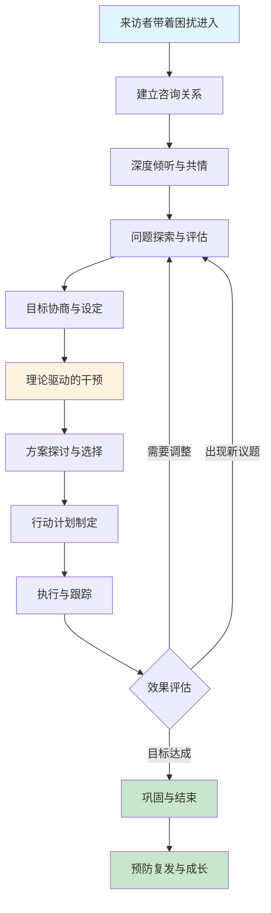
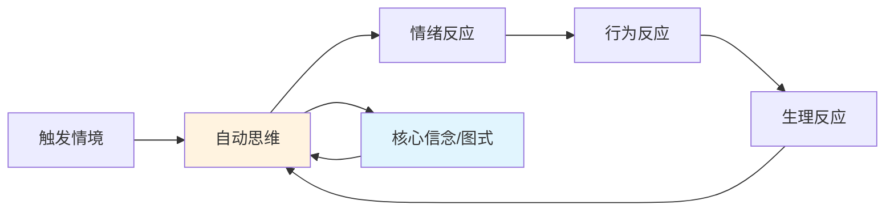
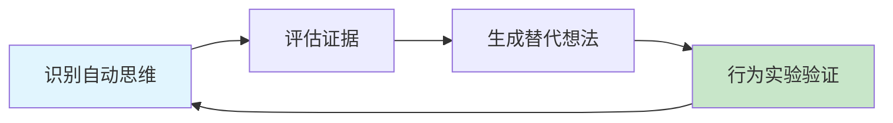
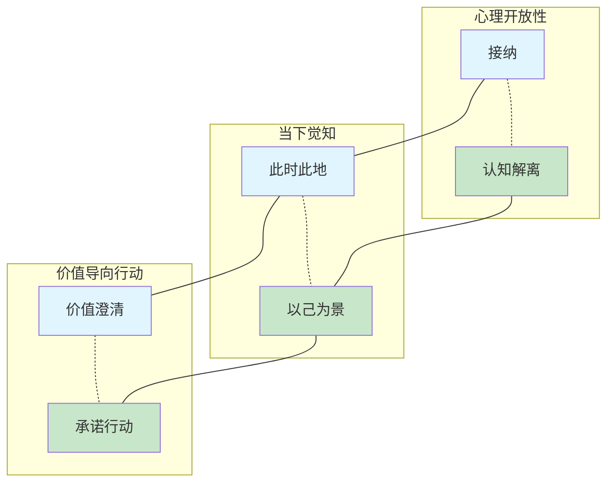
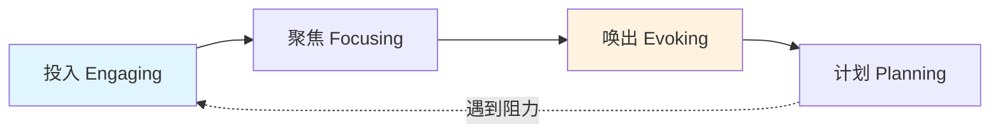
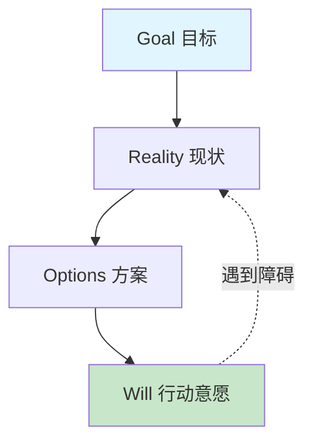
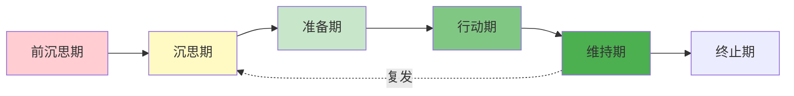
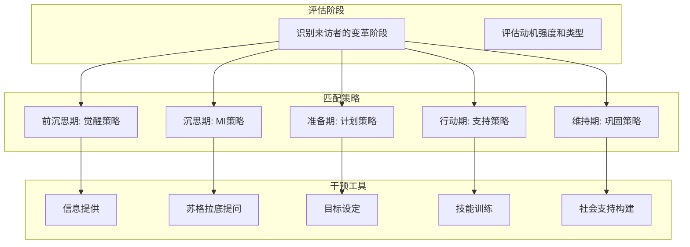
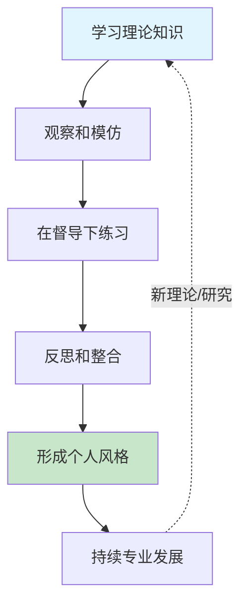

# 第二十一章 咨询与辅导沟通 - 理论基础

## 本章导览

咨询与辅导沟通不是"聊天"，而是一门建立在坚实理论根基上的专业技术。理论决定了你如何理解来访者的困境、如何选择干预策略、如何评估改变是否真正发生。没有理论指导的咨询就像没有地图的航行——也许能到达某处，但你不知道为什么到达那里，也不知道如何复制这一过程。

本章将系统梳理支撑咨询与辅导沟通的核心理论，从经典流派到当代整合模型，从心理学原理到实操框架，帮助读者建立完整的理论认知体系。

### 咨询对话全景流程图

> 这个流程不是线性的——实际咨询中常有回溯和循环。理论的作用是在每个节点帮助你做出有依据的判断，而不是机械地执行步骤。

---

## 一、人本主义咨询理论：关系即治愈

### 1.1 罗杰斯的来访者中心疗法

卡尔·罗杰斯（Carl Rogers，1902-1987）的人本主义咨询理论是现代心理咨询的基石之一。罗杰斯提出了一个在当时极具颠覆性的观点：**治疗关系的质量本身就是改变的核心机制**，而非咨询师的技术或理论取向。

这一观点得到了大量实证研究的支持。美国心理学会（APA）的元分析研究表明，咨询关系的质量对治疗效果的贡献率达到约30%，超过了特定技术方法的贡献（Norcross & Lambert, 2018）。

#### 三个核心条件

罗杰斯提出，有效的咨询关系需要三个充分必要条件：

**1. 无条件积极关注（Unconditional Positive Regard）**

无条件积极关注意味着咨询师对来访者的接纳不附加任何前提条件。这不是说咨询师赞同来访者的所有行为，而是说来访者作为一个人的内在价值得到完全的尊重。

| 维度 | 无条件积极关注 | 有条件关注 |
|------|--------------|-----------|
| 对来访者的态度 | "无论你说什么，你在这里都是被欢迎的" | "你做了正确的决定，我很高兴" |
| 接纳的范围 | 接纳整个人，包括矛盾和不完美 | 只接纳符合期望的部分 |
| 来访者的感受 | 安全感，可以自由探索 | 需要"表现好"才能被接纳 |
| 对改变的影响 | 降低防御，促进真实自我探索 | 强化面具，阻碍深层改变 |

**2. 共情理解（Empathic Understanding）**

共情不是简单的"我理解你"，而是一种持续的、精确的对来访者内心世界的感知过程。罗杰斯区分了两个层次的共情：

- **初级共情**：准确反映来访者表达的情感和内容（"听起来你对这件事感到很失望"）
- **高级共情**：触及来访者尚未完全意识到的深层感受和意义（"也许在这种失望背后，还有一种被忽视的伤痛？"）

高级共情需要咨询师有足够的人际敏感度和自我觉察能力。使用不当可能让来访者感到被"读心"而产生不适，因此需要在信任关系建立后逐步使用。

**3. 真诚一致（Congruence）**

真诚一致要求咨询师的内在体验、外在表达和专业角色三者保持一致。这意味着咨询师不应戴"专家面具"，而应在适当时机以适当方式展现真实的人性。

示例——当来访者讲述一个极其悲伤的故事时：
- 缺乏真诚："我理解你的感受"（语调平淡，公式化回应）
- 真诚一致："听到这些，我自己也感到一阵沉重。我想在这里陪着你。"

#### 来访者中心疗法的核心信念

1. **来访者是自己问题的专家**——没有人比来访者更了解自己的内心世界
2. **治疗关系本身就是改变的媒介**——安全的关系为自我探索创造条件
3. **咨询师的角色是促进而非指导**——催化来访者内在的成长力量
4. **重点是来访者的主观体验**——客观事实不如主观感受重要
5. **人具有自我实现的倾向**——在适当条件下，人会自然朝向成长

### 1.2 存在主义咨询视角

存在主义咨询关注人类存在的根本议题：自由、责任、意义、孤独和死亡。代表人物包括罗洛·梅（Rollo May）、欧文·亚隆（Irvin Yalom）和维克多·弗兰克尔（Viktor Frankl）。

**亚隆的四个存在终极关怀：**

| 终极关怀 | 核心问题 | 在咨询中的表现 |
|---------|---------|--------------|
| 死亡 | 生命终将结束，如何面对？ | 焦虑、无意义感、紧迫感 |
| 自由 | 我们必须为自己的选择负责 | 逃避决策、拖延、依赖他人 |
| 存在性孤独 | 没有人能完全理解另一个人 | 人际疏离、过度依赖、讨好行为 |
| 无意义 | 生命本身没有预设意义 | 空虚感、无聊、价值感缺失 |

在咨询沟通中，存在主义取向强调**此时此地**的体验、对选择和责任的探索、以及帮助来访者创造属于自己的生命意义。

---

## 二、认知行为疗法中的沟通技术

### 2.1 CBT的核心模型

认知行为疗法（CBT）由亚伦·贝克（Aaron Beck）在20世纪60年代发展，基于一个核心假设：**人的情绪和行为不是由事件本身决定的，而是由对事件的解释和评价决定的**。

#### 认知三角

CBT关注三个相互关联的层面：

- **认知（想法）**：自动思维、中间信念、核心信念
- **情绪（感受）**：与想法相伴的情感体验
- **行为（行动）**：基于想法和感受的行为反应

#### 认知扭曲的常见类型

在咨询沟通中，识别来访者的认知扭曲是关键技能：

| 认知扭曲 | 定义 | 典型表述 | 挑战提问 |
|---------|------|---------|---------|
| 全或无思维 | 非黑即白的极端评价 | "如果做不到完美，那就是失败" | "在完美和失败之间，还有什么可能性？" |
| 过度概括 | 从单一事件推断普遍规律 | "我总是搞砸一切" | "你能回忆一些你没有搞砸的事情吗？" |
| 心理过滤 | 只关注负面信息，忽略正面 | "虽然客户很满意，但有一个投诉" | "如果把所有信息放在一起看，整体画面是什么？" |
| 读心术 | 假设自己知道别人在想什么 | "他们肯定觉得我很蠢" | "你有什么具体证据支持这个判断？" |
| 灾难化 | 预期最坏的结果 | "如果这次面试失败，我的人生就完了" | "最坏的情况是什么？你能承受吗？" |
| 情绪推理 | 把感受当作事实 | "我感到焦虑，所以一定有危险" | "感受能作为事实的可靠证据吗？" |
| 贴标签 | 用极端词语定义自己或他人 | "我是一个失败者" | "'失败者'能定义你的全部吗？" |
| 个人化 | 把无关事件归因于自己 | "团队失败一定是我的错" | "还有哪些因素可能影响了结果？" |

### 2.2 苏格拉底式提问

苏格拉底式提问是CBT中最核心的沟通技术。它不是直接告诉来访者"你的想法是错的"，而是通过精心设计的问题引导来访者自己检视和修正思维。

**苏格拉底式提问的五层结构：**

1. **澄清问题**："你说的'搞砸了'具体指什么？"
2. **探索证据**："支持这个想法的证据是什么？反对的证据呢？"
3. **考察视角**："如果你的好朋友遇到同样的情况，你会怎么看？"
4. **评估影响**："持有这个想法对你有什么影响？"
5. **生成替代**："有没有其他方式来理解这件事？"

**实操示例：**

> 来访者："我在会上说错了一句话，所有人肯定都觉得我是白痴。"
>
> 咨询师："你提到'所有人'——你能回忆一下当时在场的具体反应吗？有人说了什么或做了什么让你这么觉得？"（澄清 + 探索证据）
>
> 来访者："嗯……其实没人说什么，但我觉得他们心里在想。"
>
> 咨询师："你意识到了一个重要的区别——这是你的推测还是观察到的事实？如果我们暂时把推测放一边，只看事实，画面上还剩下什么？"（区分事实与推测）
>
> 来访者："事实是……没有人表示不满。但我说错话这个事实本身让我很难受。"
>
> 咨询师："说错话确实会让人不舒服。但'说错话'和'所有人觉得我是白痴'之间，差距有多大？"（量化评估）

### 2.3 认知重构的完整流程

认知重构不是简单地"想开点"，而是一个系统化的四步流程：

**第一步：识别自动思维**
- 记录触发情境（发生了什么？）
- 记录自动思维（脑海里闪过什么想法？）
- 记录情绪及强度（0-100%评分）
- 使用思维记录表（Thought Record）作为工具

**第二步：评估证据**
- 支持这个想法的客观证据
- 反对这个想法的客观证据
- 这个想法的逻辑是否成立
- 是否存在认知扭曲

**第三步：生成替代想法**
- 更平衡、更全面的解读
- 替代想法不需要"正面"，只需"更准确"
- 评估替代想法后的新的情绪强度

**第四步：行为实验**
- 设计一个实验来检验想法的真实性
- 预测会发生什么
- 执行实验并记录实际结果
- 根据结果修正认知

### 2.4 行为激活沟通

CBT的行为激活技术在咨询沟通中体现为帮助来访者识别和打破"回避-低落"的恶性循环：

1. **活动监控**：记录每日活动和对应的情绪评分
2. **活动安排**：规划愉快和有掌控感的活动
3. **分级任务**：将令人畏惧的大任务分解为小步骤
4. **暴露练习**：逐步面对回避的情境，从低焦虑开始

---

## 三、接纳承诺疗法（ACT）的沟通框架

### 3.1 ACT的核心理念

接纳承诺疗法（ACT，读作"act"）由史蒂文·海耶斯（Steven Hayes）在20世纪80年代发展，属于"第三浪潮"认知行为疗法。ACT的核心假设是：**痛苦不是问题本身，对痛苦的回避和纠缠才是问题**。

ACT的治疗目标不是消除不愉快的想法和感受，而是帮助来访者发展"心理灵活性"——即使在困难的想法和感受存在的情况下，仍然能够朝着有价值的方向行动。

### 3.2 ACT的六大核心过程

**（1）接纳（Acceptance）**
不是被动忍受，而是主动为困难的想法和感受腾出空间。咨询沟通中帮助来访者放弃与内心体验的无效斗争。

**（2）认知解离（Cognitive Defusion）**
改变与想法的关系——不是"我是个失败者"，而是"我注意到我有一个'我是失败者'的想法"。

常用技术：
- 给想法加上前缀："我注意到我正在想……"
- 用怪异的声音重复令你困扰的词语（削弱其情绪力量）
- 把想法想象成天空中飘过的云朵

**（3）此时此地（Present Moment）**
培养有意识地、非评判地觉察当前体验的能力。

**（4）以己为景（Self-as-Context）**
区分"思考的自我"和"被观察的自我"——你不等于你的想法。

**（5）价值澄清（Values）**
帮助来访者识别生活中最重要的方向——不是目标（可以达成），而是方向（持续前进）。

**（6）承诺行动（Committed Action）**
在价值指引下制定具体、可执行的行为计划，并持续付诸行动。

### 3.3 ACT在咨询沟通中的特色语言

| 传统CBT语言 | ACT语言 | 区别 |
|------------|---------|------|
| "这个想法是不合理的" | "这个想法对你有帮助吗？" | 从真假判断转向功能评估 |
| "消除焦虑" | "带着焦虑去做对你重要的事" | 从消除症状转向接纳体验 |
| "挑战负性思维" | "你和这个想法之间的关系是什么？" | 从内容改变转向关系改变 |
| "改变想法" | "想法只是一个想法，不是事实" | 从修正认知转向解离认知 |

---

## 四、辩证行为疗法（DBT）的沟通技术

### 4.1 DBT的辩证哲学

辩证行为疗法（DBT）由玛莎·莱恩汉（Marsha Linehan）在20世纪80年代末发展，最初用于治疗边缘型人格障碍中的慢性自杀倾向，后来扩展到情绪调节困难的广泛领域。

DBT的核心辩证观是：**接纳与改变并不矛盾，而是相辅相成的**。这个理念对咨询沟通有深刻影响——你需要同时传递"我完全接纳现在的你"和"我相信你可以改变"两个信息。

### 4.2 DBT人际效能技巧

DBT系统化的人际沟通技巧对咨询与辅导沟通有直接的参考价值：

**DEAR MAN（获得你想要的）：**

| 字母 | 英文 | 技巧 | 示例 |
|------|------|------|------|
| D | Describe | 客观描述情境 | "上周你三次在截止日期后提交报告" |
| E | Express | 表达感受 | "这让我对项目的进度感到担忧" |
| A | Assert | 明确表达需求 | "我需要你在截止日期前完成报告" |
| R | Reinforce | 说明正面后果 | "这能帮助整个团队更顺利地推进" |
| M | Mindful | 保持专注，不偏离主题 | 不被对方的岔题带跑 |
| A | Appear confident | 表现自信 | 保持眼神接触，语调坚定 |
| N | Negotiate | 愿意协商 | "如果时间不够，我们可以讨论调整" |

**GIVE（维护关系）：**
- **G**entle：温和，不攻击、不评判、不威胁
- **I**nterested：表现出对他人的兴趣，积极倾听
- **V**alidate：确认他人的感受和处境的合理性
- **E**asy manner：保持轻松态度，适度幽默

**FAST（维护自尊）：**
- **F**air：对自己和他人都公平
- **A**pologies (no unnecessary)：不过度道歉
- **S**tick to values：坚守自己的价值观
- **T**ruthful：诚实，不夸大、不编造

### 4.3 验证技术

DBT的验证技术是咨询沟通中最实用的技术之一。验证不是"同意"，而是传达"你的感受在这个情境下是有道理的"。

**验证的六个层次：**

1. **专注倾听**：全身心在场，不打断，不预判
2. **准确反映**：精确复述对方说的内容和感受
3. **读出未说的**：捕捉言语背后没有表达出来的感受
4. **用过去经历理解**："考虑到你童年的经历，你有这样的反应完全可以理解"
5. **用当前情境理解**："在这样的压力下，任何人都会感到焦虑"
6. **真诚对待**：在关系中保持完全的真实

---

## 五、动机式访谈（Motivational Interviewing）

### 5.1 MI的本质与原则

动机式访谈（MI）由威廉·米勒（William Miller）和斯蒂芬·罗尔尼克（Stephen Rollnick）在20世纪80年代初发展，最初用于成瘾行为治疗，后广泛应用于健康行为改变、教育、司法等领域。

MI的最新定义（Rollnick & Miller, 2023更新）：
> "动机式访谈是一种协作性的对话风格，旨在通过唤起来访者自身的动机和对改变的承诺，来加强其个人改变的理由。"

**MI的四个过程：**

1. **投入（Engaging）**：建立信任和合作关系，确保来访者感到被理解和尊重
2. **聚焦（Focusing）**：确定对话方向，明确需要改变的具体行为领域
3. **唤出（Evoking）**：引出来访者自己的改变理由，而非由助人者强加
4. **计划（Planning）**：制定具体改变计划，增强自我效能感

### 5.2 MI的核心技术（OARS）

**开放式问题（Open Questions）**

开放式问题鼓励来访者深入思考和详细表达，而非简单的"是/否"回答。

| 封闭式问题（避免） | 开放式问题（使用） |
|------------------|-----------------|
| "你想戒烟吗？" | "你对吸烟这件事有什么想法？" |
| "你觉得自己有压力吗？" | "能描述一下你最近的状态吗？" |
| "你会按时完成吗？" | "你打算怎么安排这件事？" |

**肯定（Affirmations）**

肯定不是空洞的表扬，而是对来访者的努力、优势和积极品质的具体认可。

- 表面肯定："你做得很好！"（缺乏实质）
- 深层肯定："你能在这么大的压力下还坚持每天运动，这说明你有很强的自律能力。"（具体、有观察依据）

**反映性倾听（Reflective Listening）**

反映性倾听是MI中最核心的技术，分为四个层次：

1. **简单反映**：复述或重述来访者的话
2. **深层反映**：捕捉来访者话语中的深层含义和未说出口的部分
3. **战略性反映**：选择性地反映变化谈话（倾向于改变的表述）
4. **双面反映**：同时反映矛盾的两面（"一方面你觉得目前的工作很安稳，另一方面你也感到缺乏成长空间"）

**总结（Summaries）**

总结帮助来访者看到更大的图景，整合讨论内容：
- **收集式总结**：把之前讨论的多个要点串联起来
- **衔接式总结**：在一个话题结束后自然过渡到下一个
- **确认式总结**：在做出决定前，确认双方理解一致

### 5.3 变化谈话与持续谈话

MI特别关注两种类型的谈话，它们是评估来访者改变动机的窗口：

**变化谈话（Change Talk）的四种类型——DARN：**

| 类型 | 英文 | 含义 | 示例 |
|------|------|------|------|
| 渴望 | Desire | 表达想要改变 | "我希望我能更好地管理时间" |
| 能力 | Ability | 表达对改变能力的信心 | "上次考试前我也做到了集中注意力" |
| 理由 | Reason | 给出改变的具体原因 | "如果睡眠改善了，我工作效率会高很多" |
| 需要 | Need | 感到改变的必要性 | "我必须改变了，不能再这样下去" |

**持续谈话（Sustain Talk）**：来访者表达维持现状的理由、对改变的犹豫和抗拒。

MI的策略不是对抗持续谈话，而是：
- 承认和验证来访者的感受
- 选择性地反映变化谈话
- 放大矛盾心理中的改变一面
- 用双面反映连接改变和维持的两面

### 5.4 MI的治疗性姿态

MI强调一种特定的对话态度——**PARTS**：

- **P**artnership（伙伴关系）：平等协作，而非居高临下
- **A**cceptance（接纳）：绝对价值、准确共情、自主支持、肯定
- **R**evulsion of compassion（慈悲心）：出于真诚关怀而非控制
- **T**ruthful invitation（真诚邀请）：以尊重的方式引发改变
- **S**uppressing the "righting reflex"（压制"纠正冲动"）：不急于告诉来访者什么是对的

---

## 六、焦点解决短期治疗（SFBT）

### 6.1 SFBT的哲学立场

焦点解决短期治疗（SFBT）由史蒂夫·德·沙泽尔（Steve de Shazer）和茵素·金·伯格（Insoo Kim Berg）在20世纪80年代于美国威斯康星州短期家庭治疗中心（BFTC）发展。

SFBT基于几个根本性假设：
- **解决方案和问题不是同一回事**——解决了问题的原因不等于找到了解决方案
- **来访者是自己问题的专家**——咨询师是对话过程的专家，而非来访者生活的专家
- **小的改变会带来大的改变**——不需要一步到位，微小的转变就能打破僵局
- **未来是可以创造和协商的**——过去不能决定未来

### 6.2 SFBT的核心技术

**奇迹问题（Miracle Question）**

这是SFBT最标志性的技术，完整版本如下：

> "我想问你一个有些特别的问题。假设今晚你睡着后，在你不知情的情况下，一个奇迹发生了，你带到咨询中来的这个问题解决了。但因为你睡着了，你不知道奇迹已经发生了。那么明天早上醒来，你会首先注意到什么不同的地方，让你意识到'咦，奇迹好像发生了'？"

奇迹问题的功能：
- 跳过问题的纠缠，直接指向期望的未来
- 帮助来访者具体化他们的目标
- 发现来访者生活中已有的资源和优势

**尺度问题（Scaling Questions）**

尺度问题将抽象的感受转化为可操作的数字：

10 ┤ ●━━━━━━━━━━━━ 目标状态
 9 ┤
 8 ┤
 7 ┤          ● 当前位置
 6 ┤
 5 ┤
 4 ┤
 3 ┤
 2 ┤
 1 ┤
 0 ┤ 最糟糕的情况

使用方式：
- "在0到10的尺度上，10代表你希望达到的状态，0代表最糟糕的情况，你现在觉得自己在哪里？"（假设回答是7）
- "是什么让你在7而不是更低？"（发现已有优势）
- "从7到8，你需要做的最小的一步是什么？"（具体化下一步行动）
- "你从什么时候开始在7的？之前在哪里？"（识别进步）

**例外问题（Exception Questions）**

例外问题基于一个假设：问题不是每时每刻都存在的，总有例外的时候。找到例外，就找到了解决方案的线索。

- "有没有什么时候这个问题没有发生，或者不那么严重？"
- "那时候有什么不同？你做了什么不同的事？"
- "那个例外是怎么发生的？"
- "你能做些什么来让这个例外更频繁地发生？"

### 6.3 SFBT的反馈结构

每次SFBT会谈的最后，咨询师会给出结构化的反馈：

1. **赞美（Compliments）**：具体指出来访者的努力、优势和进步
2. **桥梁（Bridges）**：从赞美过渡到建议
3. **建议（Suggestions）**：给出一个具体的、可执行的建议，通常与"更多地做已经有效的事"或"尝试一个小小的实验"有关

---

## 七、GROW模型：教练对话的结构化框架

### 7.1 GROW模型概述

GROW模型是教练领域最广泛使用的对话框架，由约翰·惠特莫尔（John Whitmore）在《高绩效教练》（Coaching for Performance）一书中系统提出。GROW代表四个阶段：Goal（目标）、Reality（现状）、Options（方案）、Will（行动意愿）。

### 7.2 四阶段详解

**Goal（目标设定）**

目标设定需要遵循SMART原则，但在教练对话中，更关键的是帮助被教练者找到真正"属于自己的"目标。

关键问题：
- "你希望在这次对话结束时达成什么？"
- "这个目标对你个人而言为什么重要？"
- "实现这个目标会给你带来什么样的改变？"
- "你怎么知道自己已经达到了？"

**Reality（现状分析）**

这一阶段帮助被教练者客观评估当前情况，关键是**区分事实和解读**。

关键问题：
- "目前的实际状况是怎样的？"
- "你已经尝试过哪些方法？效果如何？"
- "有哪些资源你已经拥有了？"
- "存在哪些主要障碍？哪些是真实的、哪些是想象的？"

**Options（方案探索）**

方案探索阶段鼓励创造性思考，教练要克制给出建议的冲动。

关键问题：
- "你还有哪些其他选择？"
- "如果没有任何限制，你会怎么做？"
- "你的同事/朋友遇到类似情况会怎么做？"
- "如果你的恐惧成真了，你会怎么做？"（反向思考）

**Will（行动计划）**

将讨论转化为具体承诺，关键是在"想做"和"会做"之间架起桥梁。

关键问题：
- "你决定采取哪些行动？"
- "你将在什么时候开始第一步？"
- "你需要什么支持？"
- "可能遇到什么障碍？你会怎么应对？"
- "在0到10的尺度上，你有多大把握会执行这个计划？"

### 7.3 GROW模型的进阶使用

**GROW的灵活变体：**

- **GROWA**：加一个Awareness（觉察），在Reality之后探索深层认知
- **TGROW**：加一个Topic（话题），在Goal之前先确定讨论主题
- **GROW+C**：加一个Check（检查），定期回溯和确认

**GROW在不同场景中的应用：**

| 场景 | Goal重点 | Reality重点 | Options重点 | Will重点 |
|------|---------|------------|------------|---------|
| 职业发展 | 长期愿景 | 技能差距 | 成长路径 | 学习计划 |
| 绩效改进 | 具体指标 | 当前表现 | 行为改变 | 督导机制 |
| 团队管理 | 团队目标 | 团队现状 | 协作方案 | 分工执行 |
| 个人成长 | 理想自我 | 当前自我 | 成长策略 | 习惯养成 |

---

## 八、叙事疗法的沟通视角

### 8.1 叙事疗法的核心理念

叙事疗法由迈克尔·怀特（Michael White）和大卫·艾普斯顿（David Epston）在20世纪80年代发展。叙事疗法认为：**人不是问题，问题才是问题**。人们通过故事来组织和理解自己的经验，当主导叙事限制了一个人的可能性时，就需要"重新编辑"这个故事。

### 8.2 外化技术

外化是叙事疗法最核心的沟通技术，将问题从人身上"分离"出来。

| 内化语言 | 外化语言 |
|---------|---------|
| "我是一个焦虑的人" | "焦虑是如何影响你的生活的？" |
| "我太懒了" | "懒惰是怎么让你停止行动的？" |
| "我性格有问题" | "这个问题是怎么进入你的生活的？" |
| "我有抑郁症" | "抑郁让你失去了什么？" |

外化对话的典型流程：
1. **命名问题**："如果给这个困扰起个名字，你会叫它什么？"
2. **探索影响**："这个'恐惧先生'是怎么影响你的日常生活的？"
3. **评估影响**："你对'恐惧先生'这样控制你的生活怎么看？"
4. **发现例外**："有没有一些时候'恐惧先生'没有得逞？那时候发生了什么？"
5. **重新作者**："你希望用什么样的新故事来替代这个旧故事？"

### 8.3 重新作者对话

重新作者对话帮助来访者发现被忽视的"独特结果"（unique outcomes），即不符合问题故事的例外经验，然后用这些例外编织新的、更丰富的人生故事。

**双层故事图示：**

问题故事（表面）：  失败 → 退缩 → 自我怀疑 → 更多失败
                    ↓
独特结果（深层）：  那次鼓起勇气 → 小小的成功 → 一丝希望 → ？
                    ↓
替代故事（重建）：  勇气 → 尝试 → 学习 → 成长 → 新的可能性

---

## 九、教练心理学与积极心理学

### 9.1 积极心理学的六大美德和24种优势

马丁·塞利格曼（Martin Seligman）和克里斯托弗·彼得森（Christopher Peterson）通过对跨文化研究的系统分析，提出了人类的六大核心美德和24种品格优势（Character Strengths）。

**六大美德：**

| 美德 | 核心内涵 | 对应的品格优势 |
|------|---------|--------------|
| 智慧 | 获取和运用知识的能力 | 创造力、好奇心、开放思维、热爱学习、洞察力 |
| 勇气 | 面对内外阻力坚持目标 | 勇敢、毅力、诚实、热情 |
| 人道 | 关心和善待他人 | 爱、善良、社交智力 |
| 正义 | 健康的社区生活基础 | 团队精神、公平、领导力 |
| 节制 | 防止过度的品质 | 宽恕、谦虚、审慎、自我调节 |
| 超越 | 与更大的存在建立联系 | 对美的欣赏、感恩、希望、幽默、灵性 |

在教练和咨询沟通中，识别和发挥来访者的**标志性优势**（signature strengths）是促进改变的有效策略。

### 9.2 自我决定理论（SDT）

爱德华·德西（Edward Deci）和理查德·瑞安（Richard Ryan）的自我决定理论认为，人有三种基本心理需求，满足这些需求是内在动机和心理健康的基础：

**三种基本心理需求：**

| 需求 | 含义 | 在咨询中的满足方式 |
|------|------|------------------|
| 自主性（Autonomy） | 感到行为是自我选择的 | 提供选择，不强制，尊重来访者的节奏 |
| 胜任感（Competence） | 感到有能力应对挑战 | 设置适当难度的任务，及时反馈进步 |
| 关联性（Relatedness） | 感到与他人有温暖的连接 | 建立真诚的咨询关系，创造归属感 |

当三种需求得到满足时，来访者更可能产生内在动机，自主地投入改变过程。

### 9.3 心理韧性（Resilience）培养

心理韧性不是一种固定特质，而是一组可以培养的能力。在咨询沟通中，可以通过以下方式增强来访者的韧性：

1. **认知灵活性**：帮助来访者从多个角度看问题
2. **情绪调节**：教授识别和管理情绪的技巧
3. **社会支持**：鼓励建立和维护支持性关系
4. **意义建构**：帮助来访者在困难中找到意义
5. **自我效能**：通过小的成功积累信心

---

## 十、变革理论：理解改变的过程

### 10.1 跨理论模型（TTM）：变革阶段

普罗查斯卡（Prochaska）和迪克莱门特（DiClemente）的跨理论模型（又称变革阶段模型）是理解行为改变过程最有影响力的框架之一。

| 阶段 | 来访者特征 | 咨询策略 | 常见错误 |
|------|-----------|---------|---------|
| 前沉思期 | 没有改变意图，不认为有问题 | 提高觉察，播下种子，不施压 | 急于劝说改变 |
| 沉思期 | 知道有问题，犹豫不决 | 探索矛盾心理，权衡利弊 | 催促做出决定 |
| 准备期 | 打算在一个月内行动 | 协助制定具体计划 | 给出不切实际的方案 |
| 行动期 | 已经开始改变行为 | 支持、鼓励、解决问题 | 缺乏支持和跟踪 |
| 维持期 | 改变已持续6个月以上 | 预防复发，巩固成果 | 过早结束支持 |
| 终止期 | 不再有复发风险 | 庆祝成长，正式结束 | - |

### 10.2 动态平衡理论

动态平衡理论认为，人的心理和行为系统倾向于维持一个稳定的"设定点"。当外部力量试图改变这个系统时，系统会产生抵抗。

在咨询沟通中的应用：
- **理解抗拒**：来访者的"抗拒"不是对抗咨询师，而是系统维持平衡的自然反应
- **创造松动**：通过提问、反思和新信息，松动现有的平衡
- **支持新平衡**：帮助来访者在新的行为模式中找到稳定感

### 10.3 动机与改变的整合模型

将变革阶段模型与动机式访谈结合，可以形成一个完整的干预框架：

---

## 十一、系统性思维在咨询中的应用

### 11.1 家庭系统理论

家庭系统理论（鲍温理论，Bowen Theory）将家庭视为一个情感单元，强调个体问题往往是系统互动模式的反映。

**核心概念：**

- **自我分化（Differentiation of Self）**：在情感系统中保持独立思考和自我立场的能力。分化程度低的人容易被他人的情绪"感染"，在压力下要么顺从要么对抗。

- **三角化（Triangulation）**：当两人之间的紧张关系无法直接处理时，将第三方拉入以减轻焦虑。例如，夫妻关系紧张时，一方转向与孩子建立过度紧密的关系。

- **情感隔断（Emotional Cutoff）**：通过物理或情感上的距离来避免与家庭成员的冲突。看似解决了问题，实际上只是把未解决的情感问题转移到其他关系中。

- **多代传递过程（Multigenerational Transmission Process）**：家庭中的功能模式和情感反应会跨代传递。理解代际模式有助于来访者看到当前困境的深层根源。

### 11.2 组织系统视角

在组织咨询中，系统性思维关注：

**组织文化的四个层次（埃德加·沙因模型）：**

| 层次 | 内容 | 举例 |
|------|------|------|
| 人工制品 | 可观察到的组织现象 | 办公环境、着装规范、仪式 |
| 信仰和价值观 | 公开倡导的理念 | "客户第一"、"创新驱动" |
| 基本假设 | 不自觉的核心信念 | "失败是不可接受的"、"等级决定话语权" |
| 深层假设 | 最基本的存在性假设 | 对人性、时间、空间的根本假设 |

组织咨询师在沟通中需要同时在这四个层次上工作——表面的价值观可能与深层假设相矛盾，而真正影响行为的往往是深层假设。

### 11.3 生态系统理论

布朗芬布伦纳（Bronfenbrenner）的生态系统理论强调个体发展受多层次系统的影响：

| 系统层次 | 含义 | 对咨询的影响 |
|---------|------|------------|
| 微观系统 | 个体直接参与的环境（家庭、学校、工作单位） | 最直接的干预目标 |
| 中观系统 | 微观系统之间的联系（家庭-学校、家庭-工作） | 关注角色之间的冲突和协调 |
| 外围系统 | 间接影响个体的环境（父母的工作环境、社区资源） | 评估可用的外部资源 |
| 宏观系统 | 文化价值观、社会制度、经济环境 | 理解来访者问题的社会文化背景 |
| 时间系统 | 个体生命历程中的变化（历史事件、生命转折） | 理解问题的时间维度 |

---

## 十二、跨文化咨询沟通

### 12.1 文化敏感性的必要性

文化不仅影响来访者如何表达痛苦，还影响他们如何理解痛苦的原因和寻求帮助的方式。缺乏文化敏感性的咨询可能无意中将主流文化的价值观强加给来访者。

**文化对咨询沟通的影响维度：**

| 维度 | 差异表现 | 对咨询的影响 |
|------|---------|------------|
| 个人主义 vs 集体主义 | 谁来做决定？个人需求还是群体和谐？ | 目标设定要尊重来访者的文化框架 |
| 权力距离 | 对权威的态度 | 高权力距离文化中，来访者可能更期待指导 |
| 情感表达 | 公开表达 vs 克制 | 不能将情感克制等同于回避或阻抗 |
| 时间观念 | 线性 vs 循环 | 改变的预期时间框架可能不同 |
| 身体症状 vs 心理症状 | 躯体化 vs 心理化 | 不同文化用不同方式表达心理痛苦 |
| 求助行为 | 先找家人还是先找专家 | 影响来访者对咨询的预期 |

### 12.2 文化谦逊的态度

文化谦逊（Cultural Humility）强调：
- 承认自己的文化盲点
- 对来访者的文化背景保持好奇和开放
- 不假设自己了解对方的文化
- 让来访者成为自己文化经验的老师

---

## 十三、咨询沟通中的伦理框架

### 13.1 伦理决策的基本原则

| 原则 | 含义 | 在咨询沟通中的应用 |
|------|------|------------------|
| 善行（Beneficence） | 以来访者的利益为最高目标 | 所有沟通策略应以促进来访者福祉为导向 |
| 不伤害（Non-maleficence） | 避免对来访者造成伤害 | 注意言语可能造成的二次伤害 |
| 自主性（Autonomy） | 尊重来访者的自我决定权 | 提供信息和选择，但不替来访者做决定 |
| 公正（Justice） | 公平对待所有来访者 | 不因来访者的身份背景而区别对待 |
| 忠诚（Fidelity） | 遵守承诺，维护信任 | 保密、守时、言行一致 |

### 13.2 知情同意

知情同意是咨询关系的法律和伦理基础。完整的知情同意应包括：

1. **咨询过程的说明**：咨询如何进行、预期多长时间
2. **保密及其限制**：什么信息会被保密、什么情况下可以突破保密
3. **来访者的权利**：可以随时终止、可以拒绝回答任何问题
4. **费用和安排**：收费标准、取消政策
5. **投诉渠道**：如果不满意可以向谁反映

### 13.3 保密的例外

在以下情况下，咨询师有义务突破保密原则：

- 来访者有明确的自杀或他杀风险
- 涉及儿童、老人或残障人士的虐待
- 法律强制要求的报告义务
- 来访者签署书面授权的信息共享

突破保密前应尽可能告知来访者，并只透露最低限度的必要信息。

---

## 十四、理论整合与实践应用

### 14.1 为什么需要理论整合

单一理论往往不足以应对咨询实践中的复杂情况。一位来访者可能同时存在认知扭曲（需要CBT）、动机不足（需要MI）、意义缺失（需要存在主义探索）和家庭关系问题（需要系统视角）。

理论整合不是"什么都会一点"，而是建立一个有层次的、灵活的理论框架。

### 14.2 常见的整合模式

| 整合模式 | 定义 | 优势 | 挑战 |
|---------|------|------|------|
| 技术折衷主义 | 根据来访者需要选择不同理论的技术 | 灵活实用 | 可能缺乏理论一致性 |
| 理论整合 | 融合不同理论的核心概念，形成新的框架 | 有理论深度 | 需要深入理解多个理论 |
| 共同因素模型 | 关注跨理论的有效因素（如关系、期望） | 有研究支持 | 可能忽略特定技术的价值 |
| 阶段匹配模型 | 根据来访者的改变阶段匹配理论和技术 | 系统化 | 需要准确评估来访者阶段 |

### 14.3 理论选择的决策框架

当面对一位新的来访者时，可以按以下框架选择理论：

**第一步：评估来访者的需求**
- 主诉是什么？（症状/问题类型）
- 改变动机如何？（前沉思期到行动期）
- 文化背景如何？（个人主义/集体主义）
- 是否有系统因素？（家庭/组织）

**第二步：匹配理论**

| 来访者特征 | 优先考虑的理论 | 原因 |
|-----------|--------------|------|
| 有明确的认知扭曲 | CBT | 最有效的认知干预方法 |
| 改变动机不足 | MI | 专门处理矛盾心理 |
| 缺乏方向感/意义感 | 存在主义/ACT | 聚焦价值和意义 |
| 问题聚焦在关系模式 | 系统理论/叙事疗法 | 理解关系动力 |
| 需要具体行动方案 | GROW教练/SFBT | 结构化的行动导向 |
| 严重情绪调节困难 | DBT | 系统化的情绪调节技能 |
| 创伤相关问题 | 叙事疗法/创伤知情方法 | 安全的外化和重新建构 |

**第三步：持续评估和调整**
- 观察来访者的反应
- 定期评估进展
- 根据反馈调整理论方向

### 14.4 常见误区与纠正

| 误区 | 问题 | 纠正方法 |
|------|------|---------|
| "我只用一种理论" | 限制了应对复杂情况的能力 | 以一个理论为主，兼学其他理论的精华技术 |
| "理论不重要，关键是经验" | 缺乏理论指导的经验可能只是重复错误 | 经验需要理论框架来组织和验证 |
| "先学技术，理论以后再说" | 技术脱离理论就变成了机械操作 | 理解"为什么这样做"比"怎么做"更重要 |
| "来访者应该配合我的理论" | 本末倒置，理论应服务于来访者 | 从来访者的需要出发选择理论和方法 |
| "了解理论就够了" | 知识和技能之间有巨大的鸿沟 | 通过刻意练习、督导和同伴反馈将知识转化为技能 |

### 14.5 从理论到实践的成长路径

1. **学习理论知识**：系统学习至少两个主要理论流派
2. **观察和模仿**：观看高质量的咨询示范录像
3. **在督导下练习**：在有经验的咨询师指导下进行实践
4. **反思和整合**：通过写作、讨论和督导深化理解
5. **形成个人风格**：发展出独特的、理论一致的工作方式
6. **持续专业发展**：跟进最新研究，参加继续教育

---

## 十五、理论对比总览

下表汇总本章涉及的主要理论，便于快速对照和参考：

| 理论 | 创始人 | 核心关注 | 主要技术 | 适用场景 | 循证支持 |
|------|--------|---------|---------|---------|---------|
| 人本主义 | 罗杰斯 | 关系质量 | 无条件积极关注、共情、真诚 | 所有咨询关系的基础 | 强（关系因素研究） |
| CBT | 贝克 | 认知模式 | 苏格拉底提问、认知重构 | 焦虑、抑郁、认知扭曲 | 极强（大量RCT） |
| ACT | 海耶斯 | 心理灵活性 | 认知解离、价值澄清 | 慢性痛苦、价值迷失 | 强（第三浪潮研究） |
| DBT | 莱恩汉 | 情绪调节 | 验证、DEAR MAN | 情绪失调、人际困难 | 强（边缘型人格研究） |
| MI | 米勒、罗尔尼克 | 改变动机 | OARS、变化谈话识别 | 行为改变、成瘾 | 极强（元分析支持） |
| SFBT | 德·沙泽尔、伯格 | 解决方案 | 奇迹问题、尺度问题 | 短程咨询、问题导向 | 中等（部分研究支持） |
| GROW | 惠特莫尔 | 目标达成 | 四阶段提问 | 教练、绩效改进 | 中等（实践验证） |
| 叙事疗法 | 怀特、艾普斯顿 | 生命故事 | 外化、重新作者 | 身份认同、创伤叙事 | 中等（质性研究） |
| 系统理论 | 鲍温等 | 关系模式 | 家庭图、三角化识别 | 家庭和组织问题 | 中等（家庭治疗研究） |

> **关键提醒**：没有"最好的"理论，只有"最适合当前来访者"的理论。理论选择应基于来访者的需求、证据支持和咨询师的能力，而非个人偏好。
