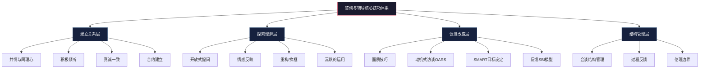
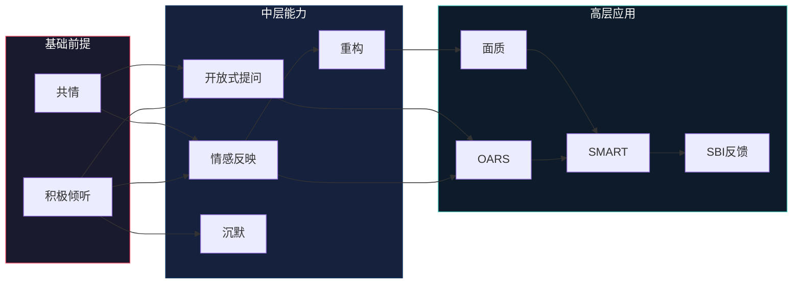

# 第二十一章 咨询与辅导沟通 - 核心技巧

## 总论：核心技巧的理论根基与能力模型

咨询与辅导沟通的核心技巧并非孤立的操作手法，而是植根于人本主义心理学、情绪聚焦理论和认知行为理论的系统化能力体系。卡尔·罗杰斯（Carl Rogers）在1957年提出的"促进性条件"理论奠定了现代咨询沟通的基石——真诚一致（Congruence）、无条件积极关注（Unconditional Positive Regard）和共情性理解（Empathic Understanding）三大核心条件，至今仍是所有咨询流派公认的治疗性关系基础。

### 技巧体系全景图

### 技巧层次与学习路径

| 层次 | 技巧类型 | 核心能力 | 学习周期 | 能力标志 |
|------|---------|---------|---------|---------|
| 基础层 | 倾听与共情 | 建立信任关系 | 1-3个月 | 来访者愿意深入表达 |
| 进阶层 | 提问与反映 | 引导深度探索 | 3-6个月 | 能准确捕捉隐含信息 |
| 高级层 | 面质与重构 | 促进认知转变 | 6-12个月 | 来访者自发产生新视角 |
| 整合层 | 灵活组合运用 | 全程流畅引导 | 1-3年 | 无痕切换，自然如对话 |

### 技巧间的联动关系

核心技巧不是线性排列的工具包，而是一个有机的生态系统。每一种技巧的存在都以其他技巧为前提：

**关键联动规则**：

- **共情是面质的通行证**——没有充分共情的面质就是攻击
- **倾听是提问的先决条件**——不听就问等于审讯
- **情感反映是重构的跳板**——先准确反映情感，来访者才愿意接受新视角
- **沉默是所有技巧的放大器**——适时的沉默让每一句话更有力量
- **合约是全程的结构性保障**——没有合约的技巧运用是"凭感觉"的冒险

***

## 共情与同理心：一切技巧的基石

共情不是简单的"我理解你"，而是咨询师暂时放下自己的参照框架，进入来访者的主观世界，以来访者的方式感受和理解其体验的能力。罗杰斯将共情定义为"感知另一个人的内在世界，仿佛（as if）就是自己的世界，但绝不失去'仿佛'的品质"。

### 共情的三个维度

**认知共情（Cognitive Empathy）**：理解对方的想法、观点和推理过程。这是"头脑层面"的共情，能够准确把握对方的认知框架。例如，理解一个员工为什么认为新的绩效考核制度不公平——不是因为制度本身有问题，而是因为他的参照标准与管理层不同。

**情感共情（Emotional Empathy）**：感受到对方的情绪状态，产生情感共鸣。这是"心灵层面"的共情，咨询师在感知来访者悲伤时，自己也会体验到一种被触动的感觉。需要注意的是，情感共情不等于情绪感染——共情是"感受到"对方的痛苦，情绪感染是"被对方的痛苦淹没"。

**关怀性回应（Empathic Concern）**：在理解与感受的基础上，产生帮助对方的温暖关怀。这是"行动层面"的共情，驱动咨询师提供恰当的支持和引导。

三个维度的关系并非层级递进，而是同时运作的平行系统。初学者往往只发展认知共情——"我知道你不开心"，但缺乏情感共情——"我没有真正感受到你的不开心"。完整共情需要三个维度的协同：

| 维度 | 内在体验 | 外在表达 | 缺失后果 |
|------|---------|---------|---------|
| 认知共情 | "我理解你的处境" | 准确的意译和总结 | 表面理解，遗漏深层含义 |
| 情感共情 | "我被你的经历触动" | 情感反映和身体觉察 | 冰冷的技术操作，缺乏温度 |
| 关怀性回应 | "我真心希望你好" | 适当的支持和引导 | 过度旁观，失去助人的动力 |

### 共情表达的技术要素

**初级共情**——反映表面情感和内容：

> 来访者："这周加了四天班，周末还要开会。"
> 咨询师："听起来这周的工作量让你感到疲惫。"

**高级共情**——反映深层情感和未表达的含义：

> 来访者："这周加了四天班，周末还要开会。"
> 咨询师："你提到这些的时候，我感受到的不仅是疲惫，还有一种不被尊重的感觉——好像你的个人时间不被重视。"

高级共情要求咨询师能够听到话语背后的"音乐"——来访者没有直接说出来，但通过语气、停顿和措辞暗示的情绪和需求。

**共情校验的关键动作**——高级共情是试探，不是诊断。说完之后必须邀请来访者确认：

> 咨询师："我感觉到的可能不准确——你告诉我，这更接近疲惫，还是更接近不被尊重？"
> 来访者："其实...两者都有。但更准确地说，是一种无力感——我没办法拒绝。"

这个校验动作是区分"好共情"和"投射"的关键。新手常犯的错误是给出高级共情后不校验，直接当作事实继续探索——这实际上是在和自己投射出来的人物对话，而非和真实的来访者对话。

### 共情的常见陷阱

| 陷阱 | 表现 | 纠正方法 |
|------|------|---------|
| 同情替代共情 | "你太可怜了" | 保持平等视角，不居高临下 |
| 评判性共情 | "你那样做确实不对，但我理解" | 先共情，暂缓评判 |
| 过度认同 | "我完全知道你的感受，我也经历过" | 保持"仿佛"的距离，不以己度人 |
| 急于解决 | "我理解你的感受，你应该..." | 先充分共情，再考虑行动 |
| 情绪感染 | 被来访者情绪淹没，失去客观性 | 觉察自身情绪，必要时寻求督导 |
| 文化错位 | 用西方直接风格对待含蓄的来访者 | 观察对方的表达风格并匹配 |

### 共情能力的自我训练方法

**情绪词汇扩展练习**：每天记录3个自己或他人的情绪状态，尝试用精确的词汇描述。从基本六情绪（高兴、悲伤、愤怒、恐惧、惊讶、厌恶）扩展到复杂情绪（如：委屈、无力感、被辜负、怀旧、惆怅）。坚持30天后，你会发现自己的情感分辨率显著提升。

**视角切换练习**：在日常对话中，刻意练习"如果我是对方，在对方的处境和经历下，我会怎么想、怎么感受"。这种日常练习能提升自动化的共情反应能力。

**身体感知练习**：共情不仅是认知活动，也是身体体验。注意来访者描述某段经历时自己身体的微妙反应——胸口发紧、呼吸变浅、肩膀僵硬——这些身体信号常常是共情的直觉来源。

**影视练习法**：选择一部剧情丰富的电影，在关键场景处暂停，问自己三个问题：（1）这个角色此刻在感受什么？（2）他没有说出来的深层需求是什么？（3）如果我是他的咨询师，我会如何回应？这个练习能在安全的环境中反复训练共情精度。

***

## 积极倾听技巧

积极倾听是咨询与辅导沟通中最基本也是最重要的技术。它不仅仅是听到对方说了什么，更是理解对方话语背后的感受、需求和意义。心理学家Thomas Gordon提出的"积极倾听"模型强调，倾听是一种主动的信息处理过程，而非被动的声音接收。

### 积极倾听的四个层次

- **第一层：听而不闻**——身体在场，心不在场，这是日常生活中最常见的倾听状态
- **第二层：选择性倾听**——只听自己感兴趣或认同的部分，过滤掉不符合预期的信息
- **第三层：专注性倾听**——全神贯注于对方的话语，理解内容层面的信息
- **第四层：共情性倾听**——不仅理解内容，还感知情感、需求和未说出口的信息，这是咨询沟通的目标层次

大多数人日常停留在第一层和第二层之间。咨询师需要将第四层变成默认工作模式——不是"偶尔达到"，而是"每次会谈都在"。

### 积极倾听的技术要素

**身体语言**：

- 保持适当的眼神接触——在中国文化语境中，持续直视可能造成压迫感，建议采用"三角区注视法"（双眼与鼻尖形成的三角区域），每3-5秒自然移开一次
- 身体微微前倾15-20度，表示关注但不构成压迫
- 开放的身体姿态：双臂自然放置，避免交叉（防御信号）、双手抱头（优越信号）、后仰（不感兴趣信号）
- 适当的点头：缓慢点头表示理解和鼓励继续，快速点头可能暗示催促
- 面部表情与来访者的情绪基调保持协调——对方讲述悲伤经历时面带微笑是严重的共情失败

**言语回应**：

- 简短的鼓励语："嗯"、"是的"、"我明白"、"继续"——这些最小鼓励语（minimal encouragers）是维持对话流动的基本工具
- 复述关键词：重复对方话语中的关键词或短语，引导对方继续展开。例如对方说"最近压力很大"，回应"压力很大..."，对方通常会自动解释具体原因
- 意译（Paraphrasing）：用自己的话复述对方的核心意思，确认理解的准确性。"所以你的意思是..."、"让我确认一下我理解对了..."
- 情感反映（Reflection of Feeling）：识别并表达对方的情绪，这个技巧将在后续专节展开
- 总结（Summarizing）：在对话的节点处，将对方表达的多个要点整合为一个连贯的概述

### 积极倾听中必须避免的十大障碍

| 障碍 | 具体表现 | 为什么有害 | 替代行为 |
|------|---------|-----------|---------|
| 打断 | 在对方未说完时插话 | 切断思路，传递"我的话更重要" | 等对方停顿3秒再回应 |
| 过早建议 | "你应该..." | 忽视情感需求，剥夺自主探索机会 | 先充分倾听和共情 |
| 评判批评 | "你不应该那样想" | 关闭信任通道，来访者转为防御 | 接纳感受，暂缓评判 |
| 最小化 | "没什么大不了的" | 否定对方的体验，造成孤立感 | 承认对方感受的真实性 |
| 比较 | "我的情况比你更糟" | 转移焦点，不尊重对方的独特体验 | 聚焦于对方的经历 |
| 读心术 | "我知道你在想什么" | 假设代替探索，可能严重偏离 | 用提问来验证假设 |
| 说教 | "生活本来就不容易" | 居高临下，切断情感连接 | 以平等的姿态对话 |
| 过度自我暴露 | "我当年比你还惨" | 抢夺对话焦点 | 有限度地使用自我暴露 |
| 分心 | 看手机、看表、走神 | 传递"你不够重要" | 关闭设备，全神贯注 |
| 急于安慰 | "别担心，会好的" | 跳过情感处理，可能适得其反 | 允许对方充分表达情绪 |

### 积极倾听的完整实践示例

**情境**：一位中层管理者表达团队管理压力

**低效对话**：

> 来访者："最近团队事情太多了，我感觉自己快撑不住了。"
> 咨询师："你应该学会授权，把工作分配给下属。"（过早建议）
> 来访者："我试过了，但他们做得不好。"
> 咨询师："那你需要培训他们啊。"（继续建议，未倾听）
> 来访者："培训也需要时间，我没时间。"
> 咨询师："那你只能硬撑了。"（问题未被理解，对话陷入僵局）

**高效对话**：

> 来访者："最近团队事情太多了，我感觉自己快撑不住了。"
> 咨询师："撑不住了——这个词听起来分量很重。能具体说说最近是什么情况吗？"（复述关键词+开放式提问）
> 来访者："上个月同时开了三个项目，人手不够，我既要管进度，又要处理各种突发问题。"
> 咨询师："同时三个项目，人手还不足，你在多个角色之间来回切换。"（意译+情感反映）
> 来访者："对，而且我觉得我做得不够好，每个项目都没做到我满意的程度。"
> 咨询师："听起来除了事务上的压力，你对自己还有很高的期待，现在这种'无法做到最好'的状态让你感到挫败。"（高级共情——捕捉到表面压力背后的自我要求）
> 来访者："是的...我从来不允许自己敷衍，但现在我真的分身乏术。"
> 咨询师："你是一个对自己有高标准的人，而现在的处境让你不得不面对一个困难的现实——精力是有限的。"（深层共情——触及核心冲突）

这个高效对话展示了倾听如何层层深入：从事实层面（三个项目、人手不足）→ 情感层面（挫败感）→ 核心层面（高标准与有限精力的冲突）。只有充分倾听后，后续的目标设定和策略讨论才有意义。

***

## 开放式提问技术

开放式提问是引导客户深入探索、扩展思考的重要技术。与封闭式问题不同，开放式问题鼓励详细的回答，促进自我反思和洞察。精神分析传统中的"自由联想"、认知行为治疗中的"苏格拉底式提问"、焦点解决短期治疗中的"奇迹提问"，本质上都是开放式提问的不同运用形式。

### 开放式问题与封闭式问题的本质区别

| 维度 | 封闭式问题 | 开放式问题 |
|------|----------|----------|
| 回答范围 | 窄——是/否、选择、具体事实 | 宽——描述、感受、想法、计划 |
| 信息量 | 低，只能确认或否认 | 高，能获得丰富信息 |
| 控制权 | 在提问者手中 | 在回答者手中 |
| 适用场景 | 确认事实、聚焦方向 | 探索情感、深入理解 |
| 对话效果 | 适合快速确认 | 适合建立关系和深度探索 |
| 潜在风险 | 可能导致审讯式对话 | 可能让对话过于发散 |

### 开放式问题的七大类型与应用场景

**1. 探索性问题**——收集信息，了解情况

- "能告诉我更多关于...的情况吗？"
- "当时具体发生了什么？"
- "你对此有什么感受？"
- **适用阶段**：对话初期，建立对来访者处境的全面了解

**2. 反思性问题**——促进自我觉察

- "你从这次经历中学到了什么？"
- "如果重新来过，你会有什么不同的做法？"
- "这对现在的你意味着什么？"
- **适用阶段**：当来访者叙述完一段经历后，引导其从中提取意义

**3. 未来导向问题**——导向目标和行动

- "你希望未来会怎样？"
- "你需要采取什么步骤来实现这个目标？"
- "成功会是什么样子？能描述一下那个场景吗？"
- **适用阶段**：当来访者陷入对过去的反刍时，转向未来

**4. 假设性问题**——打破思维限制

- "如果没有任何限制，你会怎么做？"
- "假设你知道答案，那会是什么？"
- "如果发生在你最好的朋友身上，你会给他什么建议？"
- **适用阶段**：来访者觉得"没有出路"时，通过假设解除限制性信念

**5. 量化问题**——将模糊感受具体化

- "如果0到10分，你对目前工作的满意度打几分？"
- "你说压力很大，用1到10衡量的话，大概是几分？"
- "你觉得自己在这件事上的信心程度如何？"
- **适用阶段**：来访者的感受表述模糊时，帮助其精确定位

**6. 例外提问**——发现资源和优势

- "有没有哪个时刻，这个问题没有那么严重？那时候有什么不同？"
- "在你的生活中，有没有人给过你类似的建议？结果怎样？"
- "你曾经成功处理过类似的情况吗？那时候你做了什么？"
- **适用阶段**：来访者认为问题"无解"时，帮助其看到已有的资源

**7. 奇迹提问**——焦点解决短期治疗的核心技术

- "假设今晚你睡着后，奇迹发生了，你的问题完全解决了。但你不知道奇迹发生了。明天早上醒来，你会注意到什么不同的信号，让你意识到问题已经解决了？"
- **适用阶段**：来访者专注于问题本身而非解决方案时

### 开放式提问的五个应用原则

**原则一：循序渐进，由浅入深**

不要一开始就问"你最大的人生恐惧是什么"。从一般性问题开始，逐步深入。先问事实（"发生了什么"），再问感受（"你的感受如何"），最后问意义（"这对你意味着什么"）。

**原则二：一次一问，留出空间**

"连珠炮式提问"是新手最常见的错误——连续问三四个问题，来访者不知道该回答哪个。一次只问一个问题，然后等待。如果来访者沉默，那正是他们在思考的信号，不要急于填补空白。

**原则三：跟随而非引导**

好的开放式问题跟随来访者的话语，而不是将他们引向咨询师预设的方向。例如来访者在谈工作压力，不要突然问"你和家人的关系如何"——这会让来访者感到被操控。

**原则四：避免嵌套和复合问题**

"你对这个决定的感受如何？你是否觉得应该更早做出这个决定？如果重来你会怎么做？"——这是一个包含了三个问题的复合提问，来访者只会回答最容易的那个。每次只提一个焦点清晰的问题。

**原则五：注意语气和时机**

同样的问题，不同的语气会产生截然不同的效果。"你为什么不试试其他方法？"可以是好奇的探索，也可以是隐含的指责。语气应温和、好奇、不带评判。"为什么"开头的问题在中国文化中容易被感知为质问，可以用"是什么让你..."替代。

### 提问转换实战对照表

| 封闭式提问 | 问题所在 | 开放式提问 | 效果提升 |
|-----------|---------|-----------|---------|
| 你对工作满意吗？ | 只能回答是/否 | 你对工作有什么感受？ | 允许全面表达 |
| 你和同事相处得好吗？ | 隐含"应该好"的期待 | 能描述一下你和同事的日常互动吗？ | 获得真实描述 |
| 你想换工作吗？ | 可能引发防御 | 你对未来职业发展有什么想法？ | 开放探索空间 |
| 你是不是很生气？ | 引导性暗示 | 当时你的内心体验是什么？ | 避免引导 |
| 这件事让你伤心了吗？ | 将情绪标签强加于人 | 你对这件事有什么感受？ | 尊重来访者的定义 |

### 提问练习作业

**练习一：封闭转开放**——将以下封闭式问题转换为开放式问题：
1. "你害怕失败吗？"
2. "你和父母的关系好不好？"
3. "你喜欢现在的工作吗？"
4. "你是不是对同事有意见？"

**练习二：提问链设计**——针对"一位来访者因为和上司发生冲突而焦虑"这一情境，设计一条5步提问链，从探索事实逐步深入到核心情感。

***

## 反馈的SBI模型（Situation-Behavior-Impact）

SBI模型是提供结构化反馈的有效工具，由创意领导力中心（Center for Creative Leadership, CCL）开发。CCL在对数千名领导者的跟踪研究中发现，模糊的、人格化的反馈是导致关系恶化和行为停滞的主要原因之一。SBI模型通过将反馈分解为"情境-行为-影响"三个客观化要素，解决了"我觉得你这个人有问题"式的破坏性反馈。

### SBI模型的三个核心要素

**情境（Situation）**——给反馈一个具体的"舞台"：

- 精确描述行为发生的时间、地点和场景
- 提供足够的背景信息，让接收者能够回忆起具体情境
- 关键原则：客观陈述事实，不添加解释或评价
- 错误示范："你最近总是迟到"（"总是"是笼统判断）
- 正确示范："这周的三次团队会议中，你分别在周二、周三和周四迟到了5到15分钟"

**行为（Behavior）**——描述可观察的行动，而非猜测意图：

- 聚焦于"我看到了什么/听到了什么"，而非"你心里在想什么"
- 使用视频回放式的描述——如果行为被摄像机录下来，画面上显示的是什么
- 避免使用评判性词汇，如"不专业"、"不负责任"、"不用心"——这些是对人格的判断，不是对行为的描述
- 错误示范："你在演示中表现得很不专业"（评判性）
- 正确示范："在演示过程中，你连续使用了五次行业缩略语，客户三次要求解释"（描述性）

**影响（Impact）**——说明行为的实际后果：

- 描述行为对你、他人、团队或组织的具体影响
- 包括情感层面的影响（"这让我感到担忧"）和实际层面的影响（"项目进度延迟了两天"）
- 关键原则：影响描述应诚实且具体，避免夸大或淡化

### SBI模型的完整应用示例

**正面反馈示例**：

> **情境**："在上周五的跨部门协调会上，当产品团队和研发团队在技术方案上出现分歧时..."
> **行为**："你主动引导双方回到共同目标上，用一张白板画出了两个方案的对比图，并帮助大家找到了一个整合了两个方案优势的折中方案。"
> **影响**："这不仅化解了僵局，还让两个团队都觉得自己的意见被听到了。会议在预定时间内结束，双方都对最终方案表示认可。这个方案后来在实施中效果很好。"

**建设性反馈示例**：

> **情境**："在今天下午的客户提案中，当客户提出关于定价的疑虑时..."
> **行为**："你花了大约十分钟解释定价的技术依据，使用了很多成本核算的细节数据。"
> **影响**："我注意到客户的表情从困惑变成了不耐烦。会后客户的采购经理私下问我，能不能给一个更简单的对比说明。我担心这可能影响到我们拿下这个合同。"

**完整对话示范——SBI反馈后的双向交流**：

> 咨询师/教练："我想和你分享一个观察。在今天下午的项目汇报中（S），当副总裁问你技术方案的风险时，你用了大约八分钟解释技术细节，中间副总裁两次试图插话但没有成功（B）。汇报结束后，副总裁没有追问也没有表示认可，直接转向了下一个议题（I）。"
>
> 被反馈者："嗯...我当时太紧张了，想把所有信息都说完。"
>
> 咨询师/教练："紧张让你想要'说完整'——这完全可以理解。你当时是怎么感觉到副总裁想要插话的？"
>
> 被反馈者："他身体前倾了两次，好像想说什么。"
>
> 咨询师/教练："你注意到了这个信号，但当时没有停下来。你觉得下次遇到类似情况，什么样的回应方式可能会更好？"

这段对话展示了SBI反馈后如何通过开放式提问引导对方自己发现改进方向，而不是直接给建议。SBI是"说事实"，后续的对话才是"促改变"。

### SBI模型的扩展版本

**SBIR模型**——在SBI基础上增加请求（Request）：

> "在今天的项目评审中（S），当你提前结束会议时（B），还有三位团队成员没有机会发言，他们事后向我表达了失望（I）。下次遇到类似情况，你能否提前5分钟告知大家会议将缩短，或者预留一个快速发言环节？（R）"

**SBI-I模型**——在SBI基础上增加邀请回应（Invitation）：

> "在今天的项目评审中（S），当你提前结束会议时（B），还有三位团队成员没有机会发言（I）。我想听听你当时是怎么考虑的？（I）"

**SBI-I-R完整模型**——SBI + 邀请回应 + 请求，形成完整的反馈对话：

> S → B → I → "你怎么看？"（邀请对方回应） → 共同讨论 → "我们下次可以怎么做？"（请求行动）

### 使用SBI模型的七项原则

1. **及时性**：行为发生后24-48小时内提供反馈。超过一周的延迟会让情境记忆模糊，反馈效果大打折扣
2. **具体性**：细节越具体，反馈越可信。"你上次在会上说的那些话"vs"你在周二的预算讨论中对李经理说的那句'这个方案不切实际'"
3. **平衡性**：正面反馈与建设性反馈的理想比例约为3:1到5:1。不要只在出问题时才给反馈
4. **双向性**：反馈是对话，不是单向输出。用"你怎么看？"邀请回应
5. **私密性**：建设性反馈必须在私下进行。公开批评造成的羞耻感会彻底破坏信任
6. **聚焦行为**：永远描述行为，不评价人格。"你这个报告的第三部分数据不完整"vs"你这个人太粗心了"
7. **文化敏感性**：在中国文化语境中，直接的建设性反馈需要更多铺垫。先肯定对方的意图和努力，再指出具体行为的改进空间

### 反馈效果评估矩阵

| 反馈质量维度 | 低质量表现 | 高质量表现 |
|------------|----------|----------|
| 具体性 | "你做得不好" | "在X情境中，你做了Y，导致了Z" |
| 及时性 | 三周后的年终总结才提 | 行为发生后两天内 |
| 平衡性 | 只在出错时给反馈 | 日常有正面反馈的习惯 |
| 双向性 | 单方面告知 | 邀请对方回应和讨论 |
| 关注点 | 评价人格特质 | 描述具体行为 |
| 情绪基调 | 愤怒、失望、指责 | 好奇、支持、信任 |

***

## 共情性重构技巧（Reframing）

重构（也称"换框"）源于认知治疗和策略性家庭治疗传统。其核心原理是：问题本身不一定是问题，对问题的解释方式才是问题。Albert Ellis的理性情绪行为疗法（REBT）中的"非理性信念"工作、Aaron Beck的认知重构、Milton Erickson的催眠语言模式，都运用了重构的原理。

通过改变对情境的解释和看法，重构可以帮助来访者看到新的可能性、资源和解决方案。需要注意的是，重构不是粉饰现实或"正能量洗脑"，而是帮助来访者看到一个同样真实但更有建设性的视角。

### 重构的三种类型

**内容重构**——改变对事件或行为的解释：

| 原始视角 | 重构后视角 | 重构逻辑 |
|---------|----------|---------|
| "他总是批评我。" | "他花时间给你具体的反馈，说明他在关注你的成长。" | 将"批评"重新定义为"关注" |
| "我太优柔寡断了。" | "你是一个深思熟虑的人，不会轻率做决定。" | 将"缺陷"重新定义为"特质" |
| "我总是把事情搞砸。" | "你在用'搞砸'来描述自己，但你愿意告诉我具体是哪些事情吗？" | 挑战笼统化 |

**情境重构**——改变对问题发生情境的看法：

| 原始视角 | 重构后视角 | 重构逻辑 |
|---------|----------|---------|
| "这个项目太难了。" | "这个项目是展示和提升你能力的高价值机会。" | 将"威胁"重新定义为"挑战" |
| "公司裁员让我很恐惧。" | "这是一个重新审视职业方向的契机。" | 将"危机"重新定义为"转折点" |
| "领导从来不听我的意见。" | "你有表达意见的意愿，也许我们可以探索更有效的表达方式。" | 转移可控焦点 |

**意义重构**——改变对事件意义的理解：

| 原始视角 | 重构后视角 | 重构逻辑 |
|---------|----------|---------|
| "我失败了。" | "这次经历让你获得了哪些别人没有的洞察？" | 将"终点"重新定义为"学习" |
| "我浪费了三年时间。" | "这三年的经历让你现在更清楚自己不想要什么。" | 将"损失"重新定义为"澄清" |
| "没人认可我的贡献。" | "你在寻找外部认可，这说明你内心其实知道自己的价值。" | 将"缺失"重新定义为"确认" |

### 重构的完整对话示范

以下对话展示了重构如何在真实咨询中自然运用：

> 来访者："我在公司干了五年，比我晚来两年的小王都升职了，我还在原地踏步。我觉得自己就是个失败者。"
>
> 咨询师："五年没有升职，看到比你晚来的人先上去了，这确实让人不好受。你刚才用了'失败者'来形容自己。（共情+复述关键词）我想更清楚地理解——在你看来，升职意味着什么？"
>
> 来访者："意味着我的努力被认可了，意味着我是有价值的。"
>
> 咨询师："所以升职对你来说不只是一个职位，它代表的是你的价值被看到。（深层情感反映）你觉得自己是'失败者'——我想和你分享一个我注意到的事情。你在一个岗位上坚持了五年，这本身需要很大的毅力和稳定性。同时你对'被认可'有很强的需求，这说明你内心对自己的价值是有标准的。（温和重构：将'原地踏步'重构为'坚持'，将'需要认可'重构为'有内在标准'）你怎么看？"
>
> 来访者："我确实一直很努力...但我从来没觉得这算什么。"
>
> 咨询师："你从来没觉得自己的努力'算什么'——这个想法是很有意思的。你对自己的努力视而不见，但同时又期待别人看到你的价值。你觉得这里有什么联系吗？（面质——在重构基础上引入新的觉察）"

这段对话展示了：共情→情感反映→重构→邀请评估→面质的自然流变。重构不是一次性动作，而是在对话中逐步展开的过程。

### 重构的五步实施流程

1. **倾听理解**：完整、准确地理解来访者的观点和感受。不要急着"找角度"——如果重构没有回应来访者的真实体验，它听起来就是敷衍
2. **确认验证**：先用共情确认你理解正确。"我听到你说的是...，我的理解对吗？"这一步是重构的前提，跳过它直接重构会让来访者觉得你在否定他们的感受
3. **寻找替代**：在内心思考其他可能的解释或看法。好的重构应该是真实的、有逻辑的、不牵强的。如果你自己都不信，不要说出来
4. **提出重构**：以试探性的方式提出新的视角。语气至关重要——用好奇和邀请，而非教训和纠正
5. **邀请评估**：邀请来访者评估新视角的价值。"你觉得这个角度有道理吗？"来访者有权拒绝重构，这本身也是有价值的信息

### 重构的语言模式库

**试探性引入**：
- "我听到了你描述的困难，同时我好奇的是..."
- "从另一个角度来看..."
- "我不确定这是否适用，但有没有可能..."
- "你提到...，让我想到的是..."

**框架转换**：
- "你把这个看作...，但如果把它看作...呢？"
- "你刚才说的让我意识到，你其实是一个...的人"
- "你觉得自己在...方面不足，但我听到的是你对...有很高的标准"

### 重构的伦理边界

重构是强大的工具，但有明确的使用边界：

- **不能否认真实的痛苦**：面对严重的不公正、创伤或丧失，重构不应被用来淡化痛苦。"你被裁员正好可以休息一下"在对方刚失业时是残忍的，不是专业的
- **不能成为回避问题的工具**：如果来访者面临真实的系统性问题（如职场霸凌），重构不应该被用来让来访者"换个角度想"，而应帮助他们直面问题并制定应对策略
- **不能强加**：来访者有权拒绝重构。如果他们说"你说的有道理，但我现在不想从这个角度看"，应尊重这个选择
- **不能过早使用**：在共情和信任建立之前就重构，会让来访者觉得你在否定他们的感受

***

## 沉默的运用

沉默是咨询与辅导沟通中强大但常被技术手册忽视的工具。在大多数社交场景中，沉默被视为尴尬的、需要被填补的空白。但在咨询情境中，沉默可能是整个对话中最有力量的时刻——来访者在沉默中整合感受、做出决定、触碰真实。

存在主义治疗传统特别重视沉默的价值。Irvin Yalom在他的临床著作中多次提到，治疗中最有突破性的时刻往往发生在沉默之中。

### 沉默的五种功能

**1. 促进反思性加工**：来访者刚说出一个重要信息或产生一个新的觉察，沉默给予其时间让这个信息在内心中"沉淀"。如果咨询师立即回应，来访者可能停留在表面认知，无法进行深层加工。

**2. 深化情感探索**：当来访者触碰到一个强烈的情感点时，沉默创造了安全的空间，让情感自然流淌而不被打断。很多时候，来访者在沉默之后会说出比之前更深层、更真实的话。

**3. 尊重自主性**：沉默传递的信息是"我信任你有能力找到自己的答案"。这对培养来访者的自我效能感至关重要。

**4. 增强语言的力量**：在一句重要的话之后停顿，比紧接着说下一句话更有力。咨询师说"你值得被好好对待"之后的沉默，让这句话有时间被真正听到和感受到。

**5. 提供非言语陪伴**：有时候不需要任何语言，只需要一个安静地陪伴在身边的人。沉默中的陪伴本身就是一种强大的治疗力量。

### 沉默的三种类型与应对策略

| 类型 | 来源 | 来访者可能的状态 | 咨询师的恰当回应 |
|------|------|----------------|----------------|
| 思考性沉默 | 来访者在整理思绪 | 认真思考中，眼神聚焦、表情专注 | 保持安静，不打扰，可以轻微点头表示"我在等待" |
| 情感性沉默 | 来访者经历强烈情绪 | 可能流泪、呼吸变化、表情痛苦 | 保持平静、温暖的临在，递纸巾，不急于开口 |
| 抗拒性沉默 | 来访者在回避某个话题 | 回避眼神、身体后倾、表情紧绷 | 温和指出："我注意到你可能在想一些不太容易谈的事情" |

### 沉默的时长经验值

| 时长 | 来访者状态 | 咨询师行动 |
|------|----------|----------|
| 5-15秒 | 正常思考中 | 保持安静，轻柔的面部表情 |
| 15-30秒 | 可能在经历深层情感 | 维持临在，观察非语言信号 |
| 30-60秒 | 触碰到重要议题，需要时间 | 不主动打破，但准备语言如果需要 |
| 1-2分钟 | 深度反思或情感处理中 | 保持在场，可在来访者抬头时温柔地回应 |
| 2分钟以上 | 可能陷入僵住或不知所措 | 用开放式问题温和引入："你现在的内心在发生什么？" |

### 何时使用沉默

- 在提出重要问题后——给来访者充分的思考时间
- 当来访者表达强烈情绪时——不要用语言打断情感的流动
- 当来访者正在深入思考或犹豫时——给他们安全的空间
- 在对话的关键转折点——给双方消化刚才内容的时间
- 在咨询师说完一句重要的反映或重构之后——让这句话有被听见的空间

### 何时打破沉默

- 沉默持续超过2-3分钟且来访者看起来越来越不适
- 来访者的非语言信号显示焦虑升级（如坐立不安、呼吸急促）
- 沉默的氛围从"沉思"转变为"僵住"
- 咨询的时间限制不允许更长的沉默

打破沉默的方式："我注意到我们都在安静地思考。你现在的内心在发生什么？"

### 新手咨询师对沉默的恐惧与应对

绝大多数新手咨询师对沉默感到难以忍受，这是完全正常的。以下策略可以帮助你逐步习惯沉默：

1. **认知重构**：把沉默从"对话失败"重新定义为"对话的一部分"
2. **身体锚定**：沉默中感到焦虑时，感受自己的脚踏在地面上，缓慢呼吸
3. **内部计时**：心中默数到10，通常你会发现来访者会在你数到10之前开口
4. **观察来访者**：把注意力从"我该说什么"转移到"来访者正在经历什么"
5. **与督导讨论**：在督导中探索你对沉默的焦虑来源——它往往与你个人的被认可需求有关

**沉默耐受力训练**：从30秒开始练习。在日常对话中（非咨询场合），当对方说完话后，刻意等待30秒再回应。记录你的不适程度（1-10分）。每周增加15秒。这个简单的练习能显著提升你对沉默的耐受力。

***

## 情感反映技术

情感反映（Reflection of Feeling）是罗杰斯人本主义治疗的核心技术之一。它帮助来访者识别、理解和表达情绪。很多时候，来访者"知道"自己的处境（事实层面），但没有充分"感受到"自己的情绪（情感层面）。情感反映桥接了这个差距。

Daniel Goleman在情绪智力理论中指出，准确识别和命名情绪的能力（情绪粒度，Emotional Granularity）与心理健康高度相关。能够区分"失望"和"沮丧"、"焦虑"和"恐惧"的人，拥有更多的自我调节资源。

### 情感反映的三个层次

**初级情感反映**——识别和命名表面情绪：

> 来访者："这个月第三次被退回方案了。"
> 咨询师："这让你感到沮丧。"

初级情感反映是基础技术，适用于对话初期建立连接。准确但相对简单。

**高级情感反映**——识别复杂情绪和情感矛盾：

> 来访者："终于通过了，但我一点都高兴不起来。"
> 咨询师："听起来你既松了一口气，又觉得这个过程消耗了太多，成功带来的喜悦被疲惫冲淡了。"

高级情感反映能够处理混合情绪、矛盾情感和情绪的细微层次。

**深层情感反映**——识别情感背后的核心需求和意义：

> 来访者："我总是最后一个离开办公室的人，但领导从来不说什么。"
> 咨询师："你的付出没有被看见，这让你感到委屈。你渴望的可能不只是言语上的认可，而是你的努力被真正'看到'和'珍视'。"

深层情感反映触碰到来访者的核心需求——被看见、被重视、被接纳——这些往往是表面情绪之下的真正议题。

### 情感反映的完整对话示范

> 来访者："我爸妈又打电话催我结婚了。我都28了，在他们眼里好像不结婚就是有问题。"
>
> 咨询师（初级情感反映）："被催婚让你感到烦。"
>
> 来访者："是挺烦的。但其实不只是烦..."
>
> 咨询师："不只是烦——还有别的什么？"
>
> 来访者："我觉得...好像我不结婚，我就对不起他们。他们一辈子为了我辛苦，我连这个最基本的事都做不到。"
>
> 咨询师（高级情感反映）："在'烦'的底下，我听到的是一种沉重的愧疚感——你觉得你欠父母的，而结婚在他们看来是最重要的'回报'。"
>
> 来访者："（沉默15秒）...是的。但我也很清楚，我如果现在随便找个人结婚，我不会幸福的。"
>
> 咨询师（深层情感反映）："你同时被两个力量拉扯：一边是对父母的爱和愧疚，另一边是对自己人生的诚实。你不想辜负他们，也不想辜负自己。这种'两边都不能放弃'的感觉，比单纯的催婚压力要沉重得多。"
>
> 来访者："（流泪）...从来没有人这样说过。我身边所有人都说'赶紧找一个算了'。"

这段对话展示了情感反映如何层层深入：烦→愧疚→双重忠诚的拉扯。每一层反映都邀请来访者走得更深一步，直到触碰到真正的核心冲突。

### 常用情绪词汇分级表

| 级别 | 情绪类别 | 词汇示例 |
|------|---------|---------|
| 基本情绪 | 快乐 | 高兴、愉快、开心、满足 |
| | 悲伤 | 伤心、难过、哀伤、失落 |
| | 愤怒 | 生气、恼火、愤怒、暴怒 |
| | 恐惧 | 害怕、紧张、焦虑、恐惧 |
| | 惊讶 | 惊讶、意外、震惊 |
| | 厌恶 | 反感、厌烦、排斥 |
| 复杂情绪 | 社交情绪 | 尴尬、羞耻、内疚、嫉妒 |
| | 自我评价 | 自豪、自卑、挫败、自信 |
| | 关系情绪 | 被背叛、被抛弃、信任、亲近 |
| | 存在性情绪 | 空虚、孤独、迷茫、使命感 |
| 微妙情绪 | 矛盾情感 | 既期待又害怕、又爱又恨 |
| | 混合状态 | 矛盾、纠结、五味杂陈 |
| | 躯体化情绪 | 堵得慌、透不过气、心沉沉的 |

### 情感反映的常用句式

**命名式**："你感到..."、"你觉得..."
**试探式**："听起来你..."、"我感觉到你..."
**深层式**："你感到...，可能是因为..."、"在...的背后，你似乎在经历..."
**躯体式**："你说胸口发闷，这可能是某种情绪在身体上的表达——你觉得那是什么？"

### 情感反映的五项原则

1. **准确性优先**：宁可模糊也不要错误命名。说"你似乎有一些不舒服的感受"比说错"你很愤怒"要好。错误的情绪命名会让来访者觉得"你根本不理解我"
2. **试探性表达**：使用"似乎"、"也许"、"听起来"等缓冲词，邀请来访者确认或纠正
3. **深度匹配**：反映的情感深度应与来访者当前的表达层次一致。来访者还在谈事实层面，你突然做深层反映，会让对话脱节
4. **文化敏感**：在中国文化语境中，直接谈论情绪可能不自在。可以用"心里不太舒服"代替"你感到悲伤"，用"有点堵"代替"你感到压抑"
5. **不急于解读**：情感反映是邀请，不是诊断。来访者有权说"不是这样的"或"我还不确定"

***

## 面质技巧

面质（Confrontation）是帮助来访者看到自身不一致、矛盾或盲点的技术。这个术语在中文语境中容易被误解为"对抗"或"指责"，但专业意义上的面质是一种温和的、以好奇心为基础的觉察邀请。

格式塔治疗的创始人Fritz Perls大量使用面质技术，他的经典格言是"觉察本身就是改变"——当来访者清晰地看到自己的不一致时，改变就已经开始了。

### 面质的四种类型

**言语与行为的矛盾**：
- "你说你很想提升团队凝聚力，但在过去三个月里，你取消了四次团队活动。"
- 这类面质帮助来访者意识到意图与行动之间的差距

**言语与非言语的矛盾**：
- "你说你没事，但说这句话的时候你的声音在发抖。"
- 这类面质帮助来访者觉察到自己可能在压抑真实感受

**价值观与行为的矛盾**：
- "你说家庭是最重要的，但你的日程表显示你平均每周花60小时在工作上，和家人在一起的时间不到10小时。"
- 这类面质帮助来访者审视自己的生活是否与内心价值观一致

**目标与行动的矛盾**：
- "你说你想升职到管理层，但当领导给你带项目的机会时，你两次都婉拒了。"
- 这类面质帮助来访者看到恐惧或自我设限

### 面质的实施前提

面质是高风险、高回报的技术。错误的面质会摧毁信任关系。以下是安全使用面质的四个前提条件：

1. **信任关系已建立**：至少有3-5次会谈的积累，来访者对你有基本的信任。绝对不要在第一次会谈中使用面质
2. **共情基础已夯实**：来访者已经充分感受到被理解和接纳。在共情不足的情况下使用面质，来访者会觉得你在攻击他们
3. **面质是为了来访者**：不是为了展示你的洞察力，也不是因为你不耐烦。面质的动机必须是帮助来访者获得自我觉察
4. **来访者有心理弹性**：评估来访者当前的心理状态。处于严重焦虑、抑郁或危机中的来访者暂时不具备面对面质的能力

### 面质的四步实施流程

1. **描述观察**：客观描述你观察到的不一致，像照镜子一样——"我注意到..."、"一方面...另一方面..."
2. **邀请探索**：以好奇心邀请来访者理解这种不一致——"我很好奇这背后是什么？"
3. **保持开放**：接受来访者的任何回应——他们可能有合理的解释，也可能否认，也可能产生顿悟
4. **共同整合**：帮助来访者将面质带来的觉察转化为有意义的理解或行动计划

### 面质的完整对话示范

> 来访者："我一直想学编程转行做开发，但三年了还是在原来的岗位。"
>
> 咨询师："学编程转行——这是你三年来一直想做的事。你觉得自己为什么还没有行动？"（先用开放式提问，不直接面质）
>
> 来访者："太忙了，没时间学。而且万一学了找不到工作呢。"
>
> 咨询师："你提到两个因素：时间和恐惧。我很好奇——你每周有多少时间花在短视频和社交媒体上？"（温和的事实面质——用数据而非评价）
>
> 来访者："...可能每天两三个小时吧。"
>
> 咨询师："两三个小时，一周就是14-21个小时。你说没有时间学编程，但这14-21个小时花在了其他地方。你觉得这之间有什么联系吗？"（描述不一致+邀请探索）
>
> 来访者："（长时间沉默）...你说到点上了。可能不是没时间，是我在逃避。"
>
> 咨询师："你用了一个很有力量的词——'逃避'。逃避什么？"（抓住关键语词，深入探索）
>
> 来访者："逃避失败。我怕学了之后还是不行，那就连借口都没了。"
>
> 咨询师："所以不行动反而是一种'保护'——只要不试，就不会失败。这个逻辑你是怎么理解的？"（重构+面质：将"拖延"重构为"自我保护"，同时面质这个保护策略的代价）

这段对话展示了面质如何从共情中自然生长出来——不是攻击性的"你明明有时间"，而是引导式的"我注意到这些数据，你怎么看"。

### 面质的语言模式库

**温和引入**：
- "我注意到一件事，想和你分享一下..."
- "我可能观察错了，但..."
- "你介意我分享一个观察吗？"

**描述不一致**：
- "一方面...，另一方面..."
- "你说...，但我观察到..."
- "你刚才提到...，但之前你说过..."
- "我注意到你嘴上说...，但你的身体似乎在说..."

**邀请探索**：
- "你觉得这其中有什么联系吗？"
- "我好奇这是怎么回事..."
- "你有没有注意到这个模式？"

### 面质的文化适配

在中国文化语境中，面质需要额外的技巧：

- **先给面子**：在面质之前先肯定来访者的意图和努力。"我看得出你真的想把这件事做好，同时..."
- **用"我们"代替"你"**："我注意到我们讨论的和实际做的之间好像有些差距"比"你说的和做的不一样"更容易被接受
- **留退路**：给来访者台阶下。"也许是我理解错了，但如果..."
- **间接面质**：可以用类比、故事或"我之前遇到过一个类似的情况"来进行间接面质

***

## 动机式访谈（Motivational Interviewing）的OARS技术

动机式访谈（MI）由William Miller和Stephen Rollnick于1983年发展出来，最初用于成瘾治疗，现已广泛应用于健康行为改变、司法矫正、教育辅导等领域。其核心理念是：来访者自己拥有改变的资源和动机，咨询师的工作是帮助他们发现和放大这些内在动力。

### OARS四大核心技术

**O — 开放式问题（Open-ended Questions）**：

开放式问题在MI中的运用不同于一般咨询——其目的是帮助来访者自己说出改变的理由。

- "对你来说，做出这个改变最重要的是什么？"
- "如果你决定这样做，你觉得最好的结果会是什么？"
- "你目前的做法给你带来了什么好处？又有什么代价？"

**A — 肯定（Affirmations）**：

肯定不同于赞美。赞美是外部评价（"你做得很好"），肯定是对来访者内在品质和努力的真诚认可。

- **肯定努力**："你今天来到这里讨论这个问题，本身就需要勇气。"
- **肯定品质**："你能在这么困难的情况下坚持，说明你是一个有韧性的人。"
- **肯定觉察**："你能意识到这个模式，这本身就是重要的一步。"
- **肯定意图**："你想要改变的这个愿望，说明你对自己有更高的期待。"

肯定的频率和时机很重要——过多的肯定会显得虚伪，过少会让来访者觉得你不欣赏他们。在来访者说出改变意愿或展现勇气的时刻，真诚的肯定最为有力。

**R — 反映（Reflective Listening）**：

MI中的反映比一般倾听更加战略性——咨询师有选择地反映来访者话语中与改变相关的内容。

- **简单反映**："你觉得自己需要做出改变。"
- **复杂反映**："你享受目前的状态，但同时你也看到如果不改变，未来可能会付出更大的代价。"
- **双面反映**（特别重要）："一方面你享受现在的自由，另一方面你担心继续下去的后果。"

双面反映帮助来访者听到自己内心两个声音的对话，促进其自己做出权衡。

**S — 总结（Summarizing）**：

总结在MI中有特殊的功能——通过整合来访者自己说过的话，帮助他们听到自己表达的改变意愿。

- **收集式总结**：将来访者在对话中散落的改变理由整合在一起。"让我总结一下你刚才提到的：你说了你希望改善健康状况，你还提到想有更多精力陪伴孩子，你也注意到最近体力明显下降。听起来这些加在一起，改变对你来说越来越重要了。"
- **过渡式总结**：在对话从探索阶段过渡到计划阶段时使用。"听起来你已经考虑清楚了利弊，你准备好了吗？我们来讨论一下具体怎么做。"

### OARS完整对话示范

以下对话展示OARS在一次关于戒烟的会谈中如何自然整合运用：

> 咨询师："你对吸烟这件事现在是怎么看的？"（O：开放式问题）
>
> 来访者："我知道不好，抽了十几年了，也想戒，但就是戒不了。"
>
> 咨询师："十几年的习惯，你还保持着想要改变的意愿——这本身说明你没有放弃对自己的要求。"（A：肯定意图）
>
> 来访者："说说而已...我试过三次了，最长坚持了两个月。"
>
> 咨询师："你试过三次，最长坚持了两个月。两个月不是'说说而已'——那是60天的坚持。"（A：肯定努力+R：挑战来访者的自我否定）
>
> 来访者："两个月之后应酬一多，又抽回来了。"
>
> 咨询师："应酬是一个高风险场景——你在那个环境中很难抵挡诱惑。"（R：简单反映）
>
> 来访者："是啊，客户递烟你不接，感觉不给人家面子。"
>
> 咨询师："对你来说，拒绝客户的烟不只是一个健康选择，还涉及到人际关系的顾虑——你不想因为戒烟而影响和客户的关系。"（R：复杂反映）
>
> 来访者："对，关系对我来说很重要。但我也知道，身体也很重要。"
>
> 咨询师："一方面关系很重要，不想因为戒烟得罪客户；另一方面身体也很重要，你知道继续抽下去的代价。这两种需求目前在打架。"（R：双面反映）
>
> 来访者："（沉默）...是的。我儿子上次说'爸爸你能不能不抽烟了，烟味好臭'，我当时挺难受的。"
>
> 咨询师："你儿子的话触动了你。你提到关系很重要——和儿子的关系对你来说意味着什么？"（O：抓住关键时刻深入提问）
>
> 来访者："他是我最重要的人。我希望他长大后记得我是一个健康的爸爸，不是一个满身烟味的爸爸。"
>
> 咨询师："让我总结一下今天你提到的：你知道吸烟不好，试过三次戒烟，最长坚持了两个月；应酬是你最大的挑战，关系对你很重要；你儿子的话深深触动了你，你希望为了他成为一个更健康的自己。这些加在一起，我感受到改变对你来说不是'说说而已'，而是一件你真正关心的事。"（S：收集式总结——整合来访者自己的改变理由）

这段对话展示了OARS如何帮助来访者自己说出改变的理由，而不是由咨询师来"说服"。

### 变化谈话（Change Talk）的识别与放大

MI的核心目标之一是帮助来访者说出"变化谈话"——表达改变意愿的语言。变化谈话分为两类：

**持续变化谈话（Sustain Talk）**——表达维持现状的意愿：
- "现在的情况还可以接受"
- "改变太难了"
- "我不知道该怎么改"

**改变变化谈话（Change Talk）**——表达改变的动机、能力、理由或需求：
- DARN（必要条件）：渴望（Desire）、能力（Ability）、理由（Reason）、需要（Need）
- CATs（充分条件）：承诺（Commitment）、行动（Activation）、采取步骤（Taking Steps）

当来访者说出改变变化谈话时，咨询师应该：
1. 立即给予反映——"你说你想改变"
2. 深化探索——"能多说说你为什么想改变吗？"
3. 记录积累——帮助来访者听到他们自己反复表达的改变意愿

***

## 目标设定SMART原则在辅导中的应用

SMART原则由George Doran在1981年发表于《Management Review》的论文中首次提出，后经无数管理学和心理学文献发展完善。在辅导中应用SMART原则可以帮助来访者将模糊的愿望转化为可执行的行动计划。

### SMART原则详解

**具体性（Specific）**：

目标应清晰明确，回答"什么、谁、在哪里、怎么做"。

- 模糊目标："我想提高沟通能力"——"沟通能力"太大、太泛
- SMART目标："我想在团队会议中更自信地表达观点——具体来说，每次会议至少主动发言一次，发言内容聚焦于我的专业领域"
- 检验标准：一个不了解背景的人听到这个目标后，能明确知道你要做什么

**可衡量性（Measurable）**：

目标应有可量化的评估标准，回答"怎么知道做到了"。

- 不可衡量："我想改善客户关系"——怎样算"改善"？
- SMART目标："在接下来的一个季度中，将客户满意度评分从当前的3.5分提升到4.0分（5分制），并获得至少两个客户的书面正面反馈"
- 检验标准：目标达成后，有明确的数据或证据可以验证

**可实现性（Achievable）**：

目标应具有挑战性但在能力范围内，回答"这现实吗"。

- 不切实际："一个月内从实习生升到部门经理"——违背组织规则
- 过于保守："这周准时上班五天"——如果已经在做到，不是目标
- 恰到好处："在六个月内，通过承担至少两个跨部门项目，展现项目管理能力，为下一次晋升评审积累案例"
- 检验标准：目标在当前资源和能力基础上+20%-30%的挑战

**相关性（Relevant）**：

目标应与整体愿景和价值观一致，回答"这真的重要吗"。

- 偏离方向："我想考一个财务证书"（但来访者的职业规划是技术路线）
- 紧密相关："我想深入学习系统架构设计，因为我未来三年的目标是成为技术负责人"
- 检验标准：实现这个目标后，它能推动你朝更大的目标迈进

**时限性（Time-bound）**：

目标应有明确的完成期限和阶段性里程碑，回答"什么时候做到"。

- 无期限："我终有一天要学会英语"——"终有一天"意味着永远不会
- SMART目标："在接下来的6个月内，通过每天30分钟的学习，将英语口语水平从CEFR A2提升到B1，并在第3个月和第6个月分别进行一次线上口语测评"
- 检验标准：有明确的截止日期和中间检查点

### SMART目标设定的对话示例

**完整的目标澄清过程**：

> 教练："你希望通过我们的合作达成什么？"
> 客户："我想提升领导力。"
> 教练："'领导力'包含很多方面，对你来说，具体是指哪些方面？"（具体化）
> 客户："我希望更好地激励团队。"
> 教练："你如何衡量'更好地激励团队'？当团队被激励时，你会看到什么具体变化？"（可衡量化）
> 客户："团队成员的工作积极性更高，主动提出改进建议，离职率降低。"
> 教练："你目前的团队离职率是多少？你觉得一个合理的目标是多少？"（具体数据）
> 客户："目前年离职率是20%，我觉得降到10%是合理的。"
> 教练："在什么时间内？"（时限性）
> 客户："一年内。"
> 教练："你觉得你目前有什么资源可以帮助你实现这个目标？又有哪些障碍需要克服？"（可实现性评估）

### 目标分解工作表

| 维度 | 问题 | 示例填写 |
|------|------|---------|
| 愿景 | 你最终想达到什么状态？ | 团队高度自主、积极创新 |
| 总目标 | 用SMART原则定义主目标 | 12个月内将团队年离职率从20%降至10% |
| 阶段目标 | 分成3-4个阶段 | Q1:诊断原因；Q2:实施措施；Q3:观察反馈；Q4:评估调整 |
| 行动步骤 | 每个阶段的具体行动 | Q1:一对一谈话+匿名问卷+数据收集 |
| 所需资源 | 需要什么支持？ | 领导支持、预算、培训资源 |
| 潜在障碍 | 可能遇到什么困难？ | 团队信任不足、变革阻力 |
| 成功指标 | 怎么知道做到了？ | 离职率数据+满意度调研+留任面谈 |

***

## 合约建立

合约建立是咨询与辅导关系的结构性基础。它不仅仅是行政性的"走流程"，更是治疗关系中权力和责任的第一次协商。好的合约建立过程本身就是示范——它展示了咨询师如何清晰地沟通、如何尊重对方的选择、如何平衡结构与灵活性。

### 合约的八大要素

**1. 目标澄清**——明确"我们为什么在一起"

目标应该由来访者主导设定，咨询师协助将其具体化和现实化。初始目标可能模糊，随着咨询推进会逐步清晰，这是正常的。

**2. 角色定义**——明确"我们各自做什么"

- 来访者的角色：主动参与、完成约定的练习、诚实表达
- 咨询师的角色：倾听、提问、反映、挑战、维护安全的对话空间
- 明确"咨询师不是什么"：不是朋友、不是老师、不是裁判、不是人生导师

**3. 过程说明**——明确"我们怎么做"

简要介绍咨询的流程和方法，降低来访者对未知的焦虑。"我们的会谈通常以你分享近期的体验和思考开始，我会通过提问和反映帮助你深入探索，最后我们总结关键收获并规划下一步。"

**4. 时间安排**——明确"频率、时长和持续时间"

- 频率：通常每周一次，具体根据来访者的需求和资源调整
- 时长：标准个体咨询为50分钟（咨询小时），团体咨询可延长至90分钟
- 持续时间：视目标复杂度而定。短程咨询6-12次，中程咨询12-24次，长程咨询超过24次
- 起止时间：明确每次会谈的起止时间，并遵守

**5. 保密原则**——明确"什么会被保密，什么不会"

保密是咨询关系的基石。必须明确说明：
- 所有对话内容保密
- 保密的例外：来访者有自我伤害或伤害他人的明确计划、涉及未成年人或弱势群体的虐待、法律要求的披露
- 如果需要督导或案例讨论，将匿名化处理
- 记录的保存方式和访问权限

**6. 取消政策**——明确"如果需要取消或改期"

- 提前多少时间通知（通常24-48小时）
- 未通知缺席是否收费
- 紧急情况的处理方式
- 连续多次取消的处理

**7. 费用说明**——如适用

- 单次费用和支付方式
- 是否有经济困难的减免政策
- 取消费用

**8. 评估方式**——明确"我们怎么知道进展如何"

- 每4-6次会谈进行一次进展回顾
- 来访者用什么标准评估变化
- 是否使用标准化评估工具
- 何时讨论结束咨询

### 合约建立的完整对话示例

> 咨询师："在我们正式开始之前，我想花几分钟时间谈谈我们的合作方式，确保我们有一个清晰的共识。首先，你希望通过我们的对话达成什么？"
> 来访者："我想更好地处理工作压力。"
> 咨询师："好的。'更好地处理工作压力'是一个很好的起点，随着我们的对话推进，我们会一起把这个目标具体化。接下来让我介绍一下我们的工作方式：我会主要通过提问和倾听来帮助你探索压力的来源和应对方式，我不会直接告诉你应该怎么做——我相信你有能力找到最适合自己的答案。我们的对话内容是保密的，除非涉及你或他人的安全，这是我的专业伦理要求。我们计划每周见面一次，每次50分钟。你觉得这样的安排怎么样？"
> 来访者："听起来可以接受。"
> 咨询师："很好。在开始之前，你还有什么问题或顾虑吗？"
> 来访者："如果你觉得我做的事情不对，你会直接告诉我吗？"
> 咨询师："我会和你分享我的观察——包括我注意到的任何不一致或可能的盲点。但我不会评判对错，因为最终的决定权始终在你。我的角色是帮助你看清更多可能性，然后由你来选择。"

### 合约的灵活性与维护

合约不是一成不变的文件，而是一个"活的协议"：

- **阶段性回顾**：每4-6次会谈回顾一次合约，评估目标是否需要调整
- **主动更新**：当来访者的处境或需求发生变化时，主动提议更新合约
- **终止规划**：从合约建立之初就应该有"结束"的概念——咨询是有目标的、有期限的专业关系，不是无限期的

***

## 过程反馈与会谈结构管理

### 过程反馈

过程反馈（Process Feedback）是咨询师在会谈中或会谈之间，就"我们的对话进行得如何"向来访者收集反馈的做法。研究显示，定期收集过程反馈的咨询师，其来访者的改善率比不收集反馈的咨询师高出约20%-30%（Duncan等人的研究）。

**常用的过程反馈问题**：

- "到目前为止，我们的对话对你有帮助吗？"
- "你觉得我说的哪些对你有帮助？哪些没有？"
- "有什么你希望我做但我还没做的吗？"
- "你对我们的合作方式有什么感受？"

**会谈后反馈工具**（OR Scales简化版）：

每次会谈最后5分钟，可以询问：
1. "今天的会谈对你有帮助吗？"（0-10分）
2. "你和我的关系感觉如何？有什么不舒服的地方吗？"（0-10分）

如果评分低于6分，应立即探索原因并调整。

### 会谈结构管理

一次完整的咨询会谈通常遵循以下结构：

| 阶段 | 时间占比 | 核心任务 | 关键技术 |
|------|---------|---------|---------|
| 开场连接 | 前5-10分钟 | 建立连接、了解近况 | 积极倾听、简短总结 |
| 探索深化 | 20-30分钟 | 深入探索当前议题 | 开放式提问、情感反映、重构 |
| 整合聚焦 | 5-10分钟 | 整合发现、聚焦关键点 | 总结、面质 |
| 行动规划 | 5-10分钟 | 制定下一步行动 | SMART目标、具体化 |
| 收尾确认 | 最后5分钟 | 确认收获、过程反馈 | 总结、过程反馈 |

### 过程反馈的系统化实施

仅仅口头询问"有帮助吗"远远不够。系统化的过程反馈需要结构化的工具和流程。

**Session Rating Scale（SRS）简化版**：每次会谈最后3分钟，让来访者在四个维度上标记位置（左端=不满意，右端=满意）：

1. **关系维度**：你今天感觉被倾听和理解吗？
2. **目标与话题维度**：我们今天讨论的是你最关心的话题吗？
3. **方法维度**：今天的对话方式适合你吗？
4. **整体评价**：总体而言，今天的会谈对你有帮助吗？

任何一个维度低于6分（10分制）都值得立即温和探索。"我注意到你在'方法'这一项打了5分，你希望我在哪些方面做出调整？"

**反馈时机的选择**：

| 时机 | 优势 | 注意事项 |
|------|------|---------|
| 会谈中期 | 可以即时调整 | 需要自然过渡，不打断深度探索 |
| 会谈末尾 | 整体回顾，信息更完整 | 来访者可能急于结束，反馈流于表面 |
| 会谈开始（上次反馈回顾） | 展示持续关注 | 需要简洁，避免占用会谈核心时间 |
| 第4-6次会谈后 | 评估关系和方向 | 频率不宜过高，避免"调查疲劳" |

**反馈信息的三种处理方式**：

1. **即时调整**：来访者表示"你今天问的问题太多了，我没机会说完"——下一段立即减少提问，增加沉默和反映
2. **趋势跟踪**：将每次SRS评分记录在案，如果连续两次"关系维度"下降，说明关系出现隐患，需要专门讨论
3. **会谈外反思**：来访者的反馈如果涉及咨询师的盲点，应在督导中深入探讨

### 会谈记录与档案管理

高质量的会谈记录不仅满足行政和法律要求，更是咨询师自我反思和督导的工具。

**SOAP记录法**（结构化记录标准框架）：

| 维度 | 含义 | 记录示例 |
|------|------|---------|
| S（Subjective） | 来访者主诉——原话摘要 | "来访者表示'最近总是睡不好，脑子里不停转'" |
| O（Objective） | 可观察的事实——行为、外貌、情绪表现 | "来访者语速偏快，眼圈发黑，中间两次搓手" |
| A（Assessment） | 咨询师的专业判断 | "焦虑情绪明显，可能与近期工作变动有关" |
| P（Plan） | 下一步计划 | "下次探索工作变动的具体影响，练习呼吸放松技术" |

**记录的三个核心原则**：

1. **保护性原则**：记录中不包含来访者真实姓名，使用编号或化名。电子记录需要加密存储，纸质记录需要锁柜保存
2. **客观性原则**：S和O部分严格记录事实，A部分标注为咨询师专业判断而非事实定性
3. **时效性原则**：会谈结束后24小时内完成记录，此时记忆最准确

**中国情境下的特殊考量**：在企事业单位的EAP（员工援助计划）咨询中，来访者常常担心"记录会不会被领导看到"。合约建立时必须明确记录的存放、访问和销毁规则。

***

## 数字化咨询中的核心技巧适配

随着远程办公和在线服务的普及，越来越多的咨询与辅导通过视频会议、电话和文字消息进行。数字化场景对核心技巧提出了独特的适配要求——所有技巧的基本原理不变，但表达方式需要根据媒介特性进行调整。

### 视频咨询的技巧调整

**共情与倾听的调整**：

| 传统咨询 | 视频咨询适配 | 原因 |
|---------|------------|------|
| 全身肢体语言观察 | 上半身和面部表情更聚焦 | 摄像头视野有限，面部微表情成为主要非言语线索 |
| 自然的眼神接触 | 注视摄像头方向（非屏幕） | 直视屏幕时来访者感知到你在看别处，制造注意力断裂 |
| 物理空间的陪伴感 | 背景整洁、光线充足、无干扰 | 环境信号传递专业度和尊重 |
| 靠近递纸巾 | 语言层面更主动表达关怀 | 无法提供物理支持，需要通过言语弥补 |

**视频咨询中的独有优势**也有值得注意之处：来访者在自己的空间中，可能感到更安全、更放松，有时反而更容易打开心扉。有些来访者也更容易选择退出——这既是风险（脱落率更高），也是对来访者自主权的尊重。

**视频咨询的实操清单**：

1. **技术测试**：会谈前5分钟确认音视频、网络、灯光正常
2. **隐私保障**：双方确认当前空间不会被打扰。咨询师需要提醒来访者"你现在的私密性足够吗"
3. **注意力管理**：关闭所有无关软件的通知，手机静音，告知同事/家人不要打扰
4. **应急方案**：提前约定"如果网络中断，我将在5分钟内拨回电话继续"
5. **休息节奏**：视频疲劳是真实的——每45分钟建议安排5分钟屏幕休息

### 电话咨询的技巧调整

电话咨询丧失了所有视觉信息，这对咨询师的倾听能力提出了更高要求。声音的音调、语速、停顿、呼吸变化成为仅有的非言语信息来源。

**电话咨询的核心技术强化**：

- **加强言语反馈**：没有视觉点头，需要用更频繁的"嗯"、"我听到了"、"继续"来保持连接
- **声音觉察训练**：学会从声音变化中识别情绪——语速加快可能意味着焦虑，声音变低可能意味着悲伤或羞耻，突然的沉默可能意味着犹豫或触动
- **结构化确认**：没有面部表情来确认理解是否正确，需要更频繁地用意译和总结来检验理解
- **环境意识**：来访者可能在通勤、办公室等非私密空间，需要主动评估并选择合适话题深度

### 文字咨询的技巧调整

即时消息咨询（微信、企业微信、专业平台）正在成为新兴的咨询媒介，它有独特的挑战和优势。

**优势**：
- 来访者有更多时间组织语言，对社恐或表达困难的来访者更友好
- 文字记录天然留存，便于回顾
- 异步沟通允许双方在准备好时才回应
- "隐身感"降低了羞耻和防御

**挑战与应对**：

| 挑战 | 影响 | 应对策略 |
|------|------|---------|
| 无语音信息 | 丧失音调、语速、停顿等重要线索 | 更关注措辞选择、回复速度、表情符号的使用 |
| 情感传递延迟 | 共情回应可能被误解为敷衍 | 使用更长的回应，明确表达理解和关心 |
| 危机风险评估困难 | 无法通过面部表情判断危险信号 | 建立更主动的风险评估流程，约定紧急联系方式 |
| 边界模糊 | 消息随时可达，容易变成24/7在线 | 合约中明确响应时间窗口（如"工作日9:00-18:00"） |
| 表达能力差异 | 打字慢或文字表达弱的来访者处于劣势 | 允许语音消息，或结合视频与文字 |

**文字咨询中情感反映的特殊句式**：

- "你刚才打了一大段话，最后删掉了——这让我感受到你有很多想说的，同时也有些犹豫。"
- "你用了很多省略号，我能感受到你话没有说完。你想继续说说吗？"
- "你发了一个'微笑'的表情，但你刚才表达的内容似乎不太轻松。"

***

## 危机干预中的沟通技巧

危机干预是咨询与辅导沟通中最高风险、最考验基本功的场景。来访者可能处于自伤或伤他风险中，情绪高度失调，认知功能受限。在这种极端情境下，所有基础技巧——倾听、共情、提问、沉默——都需要在高压下精准运作。

### 危机识别的沟通线索

咨询师需要敏锐识别以下语言和行为线索：

**语言线索**（从低风险到高风险）：

| 风险等级 | 语言线索 | 咨询师行动 |
|---------|---------|-----------|
| 低风险 | "活着真没意思"、"太累了" | 表达关心，进一步探索 |
| 中风险 | "如果没有我，大家会过得更好"、"我不想再撑了" | 直接评估——"你有想过结束自己的生命吗？" |
| 高风险 | "我准备好了"、"我已经把东西都安排好了"、"我不会再痛苦了" | 立即启动危机评估和安全计划 |
| 紧急 | 具体描述计划、方法、时间 | 立即联系危机热线或紧急服务 |

**行为线索**：

| 线索类型 | 具体表现 | 风险解读 |
|---------|---------|---------|
| 社交退缩 | 突然与所有人断联、退出社交活动 | 可能在"准备告别" |
| 物品处置 | 将珍贵物品送人、整理遗物 | 高风险——已在安排"后事" |
| 情绪突变 | 从极度低落突然变得平静甚至愉快 | 高风险——可能已做出"决定"，获得了"解脱感" |
| 物质滥用 | 突然增加饮酒或药物使用 | 可能在用物质麻痹痛苦，自伤风险升高 |

### 危机沟通的CAMP模型

**C — Calm（保持冷静）**：

- 来访者情绪崩溃时，咨询师的平稳声调和从容节奏本身就是稳定化力量
- 降低语速、降低音量、放缓节奏——这些声音层面的调整比说什么内容更能帮助来访者从过度激活状态中恢复
- "我在这里。我不会离开。"——简单的承诺句比复杂的问题更能传递安全感

**A — Assess（评估）**：

直接询问自杀意念不会增加风险，这是经过大量实证研究反复验证的事实。回避询问反而可能错失干预时机。

- 使用渐进式评估："你提到很累，有多累？" → "有没有想过不想活了？" → "有没有想过具体怎么做？" → "你准备了什么吗？"
- 每一步都根据回答决定是否继续深入

**M — Make safe（安全化）**：

- 移除致死工具（如果来访者提到具体方式，询问"你手边有这些东西吗？能否暂时交给可信任的人保管"）
- 联系支持网络："你身边有可以陪伴你的人吗？"
- 制定短期安全计划：未来24小时、未来一周的应对方案

**P — Plan（转介与跟进）**：

- 评估完成后，如果风险超出咨询师能力范围，应立即转介至精神科或危机干预热线
- 转介不是"抛弃"来访者——"我会把你转介给更专业的团队，同时我会持续跟进你的状况"
- 中国的危机热线资源：全国心理援助热线400-161-9995，北京心理危机研究与干预中心010-82951332，生命热线400-821-1215

### 危机沟通中必须避免的错误

| 错误 | 为什么有害 | 正确做法 |
|------|-----------|---------|
| "你不会真的想死的" | 否定来访者的感受，关闭沟通通道 | "我听到你非常痛苦，我想更好地理解你的感受" |
| "想想你的家人" | 增加内疚感，可能加重痛苦 | "你现在最重要的是自己——你当下的感受最重要" |
| "这有什么好想不开的" | 评判和最小化 | 保持沉默，给予陪伴 |
| 承诺"我不会告诉任何人" | 保密义务有安全例外 | "你的安全是我最优先考虑的，如果我需要联系其他人帮助你，我会先告诉你" |
| 过度保证"一切都会好的" | 虚假安慰会损害信任 | "我不知道未来会怎样，但我会陪你在这一刻" |

### 来访者情绪崩溃时的稳定化沟通

当来访者情绪极度激动（大哭、呼吸急促、无法说话）时，立即深入探索是无效的。需要先帮助来访者回到可沟通的状态：

1. **接地技术**（Grounding）："你能不能感觉一下你的脚踩在地面上？看看你能看到的五样东西？"
2. **呼吸引导**："让我们一起做三次深呼吸。吸气——1、2、3、4，呼气——1、2、3、4、5、6。再来一次。"
3. **简单肯定**："你在这里。你是安全的。我在你身边。"
4. **感官锚定**："你能告诉我，你现在听到了什么声音？"

这些技术不是在"解决问题"，而是在帮助来访者从情绪的海啸中找到一块可以站立的礁石。只有情绪回到可承受范围后，深层的对话才有可能发生。

***

## 十大常见误区与阻抗处理

### 十大常见误区

| 误区 | 具体表现 | 为什么是错的 | 正确做法 |
|------|---------|------------|---------|
| 急于解决问题 | 来访者刚说出问题，就给出"你应该..." | 跳过了理解问题的过程，剥夺来访者的自主探索权 | 先充分倾听和共情，再讨论策略 |
| 技巧机械套用 | 每句话都刻意使用某个技术 | 对话变得生硬、不自然，来访者感到被"操作" | 技巧内化后自然运用，如呼吸般自然 |
| 忽视文化差异 | 用西方的直接表达方式处理中国来访者 | 可能造成不适和抵抗 | 根据文化背景调整表达方式 |
| 共情不足就面质 | 关系尚未稳固就开始挑战来访者 | 被来访者体验为攻击和评判 | 先夯实信任基础，再适度面质 |
| 沉默恐惧症 | 无法忍受沉默，急于填满每个空白 | 打断来访者的反思过程，错失深度探索机会 | 练习忍受沉默，区分"舒适沉默"和"僵住" |
| 评估替代倾听 | "根据你的情况，你有xx倾向" | 将咨询变成心理测评，忽视来访者的主观体验 | 评估工具是辅助，倾听永远是核心 |
| 理论先行 | 将理论框架强加于来访者的经历 | 每个来访者都是独特的，不能用理论削足适履 | 从来访者的实际经历出发，理论作为理解的工具 |
| 只关注正面 | 刻意回避负面情绪，鼓励"正能量" | 否定来访者的真实感受，切断信任通道 | 允许并接纳所有情绪，负面情绪是重要的信息 |
| 边界模糊 | 与来访者发展社交关系 | 违反伦理，损害专业性和来访者利益 | 维护清晰的专业边界 |
| 忽视自身状态 | 在自己疲惫、情绪低落时照常咨询 | 咨询师的身心状态直接影响咨询质量 | 觉察自身状态，必要时调整或寻求督导 |

### 阻抗与抗拒的处理技巧

在咨询过程中，来访者的"阻抗"（Resistance）几乎不可避免。许多新手咨询师将阻抗视为"不配合"或"态度问题"，这是极大的误解。从动机式访谈的视角看，阻抗不是来访者的问题，而是咨询师与来访者互动模式的信号——它往往说明咨询师的节奏超过了来访者的准备程度。

**阻抗的四种表现形式**：

| 表现形式 | 典型语言 | 来访者的内在状态 | 应对策略 |
|---------|---------|----------------|---------|
| 辩驳 | "不是那样的"、"你不了解情况" | 感到被误解或被批评 | 放弃当前方向，回到倾听和好奇 |
| 挑衅 | "你说的没用"、"你根本不专业" | 感到不安全或不信任 | 承认来访者的感受，不要为自己辩护 |
| 退缩 | "我不知道"、沉默、话题转移 | 可能触碰到了敏感领域 | 降低强度，允许回避，尊重边界 |
| 不作为 | 反复答应但不执行行动 | 可能目标不够吸引人，或有未探索的障碍 | 重新评估目标的可行性和吸引力 |

**处理阻抗的核心原则——"顺水推舟"**：

1. **接纳，而非对抗**：当来访者说"我不想谈这个"，正确的回应是"好，我们不谈这个。你想聊什么？"——而非"但这个很重要"。阻抗就像河流中的石头，你不需要搬开它，水会自然绕过去
2. **放大矛盾（温和地）**：来访者说"我觉得现状也还行"，可以回应"现状也还行——但你今天来这里，说明有什么东西让你觉得不太够。那个东西是什么？"——不是争论，而是帮助来访者听到自己的声音
3. **给予选择权**："我们今天可以继续探讨上次的话题，也可以聊聊你最近更关心的事情。你觉得呢？"——选择权本身就是降低阻抗的力量
4. **反思互动模式**：如果阻抗反复出现，咨询师需要反思——是否在某个方向上推得太用力？是否忽略了来访者的某个信号？是否来访者对咨询本身有未表达的疑虑？

**阻抗处理的高级策略——双面反映**：

当来访者在改变和维持之间摇摆时，双面反映是最有效的方式：

> 来访者："我知道我应该运动，但就是迈不出那一步。"
> 咨询师："你很清楚运动对你有好处——这是一个有自我觉察的人才会说的话。同时，'迈不出那一步'也是真实的。也许值得好奇的是，那一步真正挡在你面前的是什么？"

这种回应既没有否定来访者的改变意愿，也没有否定他们的困难，而是邀请他们去探索阻力的来源。

***

## 咨询师的伦理框架与专业边界

伦理不是外在的规则约束，而是咨询关系中来访者安全的保障。所有的核心技巧——倾听、共情、面质、重构——都必须在伦理框架内运用。脱离伦理的技巧是危险的。

### 伦理的五大核心原则

**1. 善行（Beneficence）——以来访者的利益为最高准则**

咨询师的首要义务是促进来访者的福祉。这意味着：
- 每次提问、每次回应，都应以"这对来访者有帮助吗"为标准
- 当咨询师的个人利益（如留住客户、维护形象）与来访者利益冲突时，来访者利益优先
- 如果咨询师无法有效帮助来访者，有义务推荐更适合的资源

**2. 不伤害（Non-maleficence）——"首先，不要造成伤害"**

希波克拉底誓言的核心在咨询中同样适用：
- 不使用超出能力范围的技术
- 不让来访者处于不必要的情绪痛苦中
- 识别自己可能造成的伤害：过度依赖、边界违反、能力不足

**3. 自主性（Autonomy）——尊重来访者的选择权**

- 来访者有权决定谈什么、不谈什么
- 来访者有权拒绝咨询师的建议、重构或面质
- 咨询师不得操纵或胁迫来访者做出特定选择
- 知情同意：来访者有权了解咨询过程、保密限制和自己的权利

**4. 公正（Justice）——平等对待每一位来访者**

- 不因来访者的性别、年龄、经济状况、文化背景而区别对待
- 警惕自身的偏见和刻板印象——每个来访者都是独特的个体
- 确保服务的可及性，不因个人喜好而选择性接收来访者

**5. 忠诚（Fidelity）——信守承诺，维护信任**

- 遵守约定的时间、频率和保密承诺
- 不做超出角色范围的承诺（如"我保证你能解决这个问题"）
- 专业关系的维护需要持续的可靠性和一致性

### 专业边界的类型与维护

| 边界类型 | 具体内容 | 灰色地带示例 | 违反后果 |
|---------|---------|------------|---------|
| 时间边界 | 每次50分钟，准时开始结束 | 偶尔超时5分钟 | 破坏结构感，制造不公平 |
| 角色边界 | 咨询师不是朋友、裁判、家长 | 咨询结束后变为朋友 | 损害专业性和客观性 |
| 物理边界 | 不发生身体接触（特定文化中握手除外） | 在来访者哭泣时拥抱 | 产生情感依赖或误解 |
| 信息边界 | 来访者信息保密 | 在社交媒体上"匿名"分享案例 | 泄露隐私，违反信任 |
| 情感边界 | 咨询师不向来访者寻求情感支持 | "我也很需要人聊天" | 角色倒置，伤害来访者 |

### 保密的例外——何时必须打破保密

以下情况咨询师有义务（而非选择）打破保密，这是伦理和法律的共同要求：

1. **自伤风险**：来访者有明确的自杀计划和实施能力
2. **伤他风险**：来访者有明确的伤害他人的计划和意图
3. **未成年人/弱势群体保护**：涉及儿童、老人或残障人士的虐待
4. **法律要求**：法院传票等法律程序要求提供信息

打破保密的正确流程：
1. 提前在合约中说明保密例外
2. 当情况发生时，告知来访者你将采取的行动
3. 只披露必要信息给必要的人
4. 完整记录打破保密的原因和过程

### 双重关系的风险管理

双重关系（Dual Relationships）是指咨询师与来访者之间存在咨询关系以外的其他关系。在中国文化语境中，双重关系特别常见——你可能在社区、学校、单位中与来访者有其他交集。

**风险等级分类**：

| 风险等级 | 情境 | 处理方式 |
|---------|------|---------|
| 低风险 | 来访者是同事的朋友 | 告知来访者，评估是否影响客观性，必要时转介 |
| 中风险 | 来访者是领导的亲属 | 明确告知潜在利益冲突，征得来访者同意后继续，或建议转介 |
| 高风险 | 来访者是你投资项目的合伙人 | 立即转介，不得继续咨询关系 |
| 禁止 | 与来访者发展恋爱/性关系 | 伦理红线，在任何情况下都不可跨越 |

***

## 咨询师的自我觉察与可持续发展

咨询师不是机器，而是整个咨询过程中最关键的"工具"。这个"工具"的状态直接影响每一次会谈的质量。自我觉察和自我照顾不是奢侈品，而是专业能力的核心组成部分。

### 反移情（Countertransference）的觉察与管理

反移情是指咨询师对来访者产生的情绪反应。早期精神分析将反移情视为"需要克服的障碍"，当代观点则认为反移情是重要的信息来源——它可以帮助咨询师理解来访者的互动模式。

**反移情的四种表现**：

| 类型 | 表现 | 可能的含义 | 处理方式 |
|------|------|-----------|---------|
| 拯救者反应 | "我要帮助这个人"、"只有我能帮他" | 来访者可能在无意识中邀请别人"拯救"自己 | 觉察自己的拯救冲动，将力量交还给来访者 |
| 厌烦/回避反应 | 对某位来访者感到疲惫、想缩短会谈 | 来访者可能在使用回避策略 | 在督导中探讨，理解回避背后的需求 |
| 过度认同 | "这个人就是我"、"我完全理解他的处境" | 咨询师可能在来访者身上看到自己 | 保持"仿佛"的距离，寻求督导 |
| 愤怒反应 | 对来访者的某些行为感到恼火 | 来访者可能在使用攻击性互动模式 | 觉察情绪，不在会谈中表达愤怒 |

### 咨询师的自我照顾策略

| 维度 | 具体策略 | 频率 |
|------|---------|------|
| 身体 | 规律运动、充足睡眠、健康饮食 | 每日 |
| 情绪 | 写情绪日记、与信任的人倾诉、允许自己有"不完美"的感觉 | 每日 |
| 社交 | 维护咨询关系之外的人际关系，避免将所有精力投入工作 | 每周 |
| 专业 | 接受个人体验（作为来访者接受咨询）、参加督导 | 每月 |
| 精神 | 保持个人兴趣、冥想、接触自然 | 每周 |
| 认知 | 阅读非专业书籍、拓展视野、保持好奇心 | 每日 |

**倦怠的早期信号**：

- 对来访者的困难感到麻木或不耐烦
- 开始机械地使用技巧，而不是真正倾听
- 在咨询外持续想着来访者的问题，难以"放下"
- 对自己的工作价值产生怀疑
- 身体症状：慢性疲劳、失眠、头痛、免疫力下降

如果出现以上信号，立即行动：减少咨询量、寻求督导、增加自我照顾活动。倦怠不是一个可以"撑过去"的阶段，它需要系统性的干预。

### 中国文化语境下的咨询师特殊挑战

中国文化中有一些独特的社会规范会影响咨询关系和技巧运用：

**面子文化**：来访者可能因为"面子"而不愿表达真实感受，或者将咨询本身视为"丢脸"的事。咨询师需要在合约建立时正常化求助行为，并在会谈中注意保护来访者的面子——面质时尤其需要"先给面子再指出问题"。

**集体主义与个人主义的张力**：中国文化强调"以和为贵"、"顾全大局"，来访者可能压抑个人需求以维护关系和谐。咨询师需要帮助来访者在"做自己"和"合群"之间找到平衡，而非简单地推崇"做自己"。

**代际差异**：年长来访者可能对心理咨询有更多偏见（"心理咨询是给疯子看的"），年轻来访者则可能过度依赖咨询师。针对不同年龄段的来访者，建立关系的方式和技巧选择需要灵活调整。

**含蓄表达**：中国文化中情绪的表达方式往往更含蓄。"还行吧"可能意味着"很差但我不想说"，"没什么大事"可能意味着"事情很大但我不确定能不能信任你"。咨询师需要对含蓄表达保持高度敏感，通过反映和提问来帮助来访者逐步表达。

**关系导向的决策模式**：中国来访者的很多困惑来自于关系——"我该听我妈的还是听我自己的"、"领导对我好所以我不好意思拒绝"。咨询师需要理解关系在中国文化中的核心地位，不简单地用"你自己的感受最重要"来覆盖关系因素。

***

## 进阶内容：技巧的整合与艺术化运用

### 从技术到艺术的进阶之路

技巧的掌握是一个从"有意识的不胜任"到"无意识的胜任"的过程：

| 阶段 | 内在体验 | 外在表现 | 关键任务 |
|------|---------|---------|---------|
| 初学者阶段 | "我应该用什么技巧？" | 技巧痕迹明显，节奏生硬 | 大量刻意练习单个技巧，关注"对不对" |
| 熟练阶段 | "这个技巧我用得还不错" | 能流畅切换多种技巧，但仍有"表演感" | 在真实对话中反复运用，关注"自不自然" |
| 整合阶段 | "我不再想技巧了" | 技巧内化为本能反应，来访者感受不到技术存在 | 放下对技巧的关注，信任自己的能力 |
| 艺术阶段 | "我在陪伴一个灵魂" | 咨询师如清澈的镜子，来访者在其中看到更完整的自己 | 发展独特的个人风格，从"做"到"在" |

Dreyfus技能习得模型（Dreyfus & Dreyfus, 1986）精确描述了这一过程：从依赖规则（rule-based）到依赖经验（experience-based）再到依赖直觉（intuition-based）的转化。顶级咨询师不是"不用技巧"，而是技巧已经融合为存在方式的一部分。

### 技巧整合的实践模型

在一次完整的咨询会谈中，技巧的运用并非线性排列，而是如水般流动。以下是一个自然的整合示例：

> 来访者："我不知道该怎么说...（沉默10秒）...我觉得自己一直在演戏。"
>
> 【沉默运用】咨询师保持安静，轻轻点头——给予空间
>
> 来访者："在家里我表现得很坚强，对同事也说'没问题'，但其实我每天晚上都失眠。"
>
> 【情感反映】咨询师："听起来你一直在撑着一个'我很好'的形象，但真实的你已经很疲惫了。"
>
> 来访者："是的...（流泪）...我怕别人看到我脆弱的样子。"
>
> 【共情+开放式提问】咨询师："你流泪了，这本身就需要勇气。'怕别人看到脆弱'——能告诉我更多关于这个恐惧吗？"
>
> 来访者："从小我爸就告诉我'男儿有泪不轻弹'，哭是软弱的表现。"
>
> 【重构】咨询师："你父亲给了你一个关于坚强的定义。我好奇的是，你今晚在我面前流泪——你觉得这是软弱，还是一种不同的坚强？"
>
> 来访者："（长时间沉默）...我从来没有这样想过。"
>
> 【面质】咨询师："你说自己一直在演戏，但你今晚来到这里，愿意说出失眠的事，愿意流泪。这和'演戏'似乎不太一致。你怎么看？"
>
> 来访者："也许...也许来这里本身就是我想停止演戏的一个信号。"
>
> 【肯定+总结】咨询师："这是一个非常重要的觉察。你不仅意识到了自己在'演戏'，你还采取了行动——来到这里，说出真相，甚至流泪。这些都是你真实自我的表达。"

这段对话展示了所有核心技巧的自然整合：沉默给予空间→情感反映建立连接→共情性提问深化探索→重构打开新视角→面质促进觉察→肯定强化改变。没有任何一个技巧是"被使用"的——它们如呼吸般自然地从对话中生长出来。

### 不同来访者群体的技巧调整

核心技巧的基础原理适用于所有来访者，但不同群体需要针对性调整：

**青少年来访者（12-18岁）**：

- 青少年的防御机制与成人不同——他们可能用"无所谓"来掩饰脆弱，用沉默来表达不满
- 共情需要更多"语言验证"——"你的感受是真实的，成年人有时会忽略你们的痛苦"
- 避免说教式提问（"你有没有想过后果"），改用好奇式提问（"当时你是怎么想的"）
- 善用隐喻、游戏、艺术等非语言方式——不是每个青少年都愿意坐在沙发上"谈感受"
- 保密的边界更复杂：需要在"保护青少年"和"尊重其信任"之间平衡

**老年来访者（60岁以上）**：

- 倾听的节奏需要更慢，给予更多思考时间
- 回忆和生命回顾是重要的治疗资源——"回顾您这一生，最让您骄傲的是什么？"
- 身体状况可能影响会谈质量（听力、疲劳），灵活调整时长和频率
- 尊重代际价值观，不将当代心理观念强加于人
- 丧失和孤独是常见议题，需要咨询师能承受沉重的情感

**职场教练场景**：

- 来访者通常是"被安排来的"（非自愿），初始阻抗更高
- 目标需要与组织目标对齐，同时保护来访者的个人发展需求
- SBI反馈和SMART目标在这类场景中使用频率更高
- 时间更有限（通常3-6次），需要更聚焦和高效
- 注意组织政治敏感性——你可能需要与来访者的上级沟通，但来访者的信息必须保密

**跨文化咨询场景**：

- 来访者的文化背景可能与咨询师完全不同——西方背景的来访者可能更直接表达情绪，东方背景的来访者可能更含蓄
- 共情需要在"文化的透镜"下进行——同样一个行为，在不同文化中可能有完全不同的意义
- 沉默的文化含义不同：在某些文化中沉默是尊重，在另一些文化中可能是不信任
- 避免将自己的文化价值观投射到来访者身上——"你应该为自己发声"不是普世真理

### 督导与持续发展

核心技巧的学习是一个终身发展的过程。即使是最资深的咨询师也需要持续的督导和个人体验。

**督导的三种形式**：

| 形式 | 描述 | 核心价值 | 建议频率 |
|------|------|---------|---------|
| 同伴督导 | 与同行定期讨论案例 | 获得不同视角，减少专业孤立 | 每月1-2次 |
| 专业督导 | 与资深督导定期工作 | 审视自己的盲点，提升技术 | 每月1-4次 |
| 个人体验 | 作为来访者接受咨询 | 深入理解来访者的体验 | 持续或阶段性 |

**录像回顾**：在获得书面同意的情况下录制会谈并回顾，是提升技巧最有效的方法之一。具体做法：
1. 每月选择2-3次会谈录音/录像
2. 自我回顾：注意自己的语言、沉默、情感反映是否准确
3. 督导回顾：请督导点评关键对话片段
4. 记录"关键时刻"：那些你做出的选择和你可能做出的不同选择

**持续学习资源**：
- 阅读经典文献：罗杰斯《成为一个人》、Yalom《给心理治疗师的礼物》、Miller & Rollnick《动机式访谈》
- 参加工作坊：特别是需要"做中学"的体验式培训
- 参与案例研讨：从同行的案例中学习
- 保持跨领域学习：哲学、文学、艺术都能丰富咨询师的人文视野

### 核心技巧的自我评估量表

以下自评量表帮助你了解自己在各项核心技巧上的发展水平。请诚实评估（1=尚未掌握，5=熟练运用）：

| 技巧 | 1 | 2 | 3 | 4 | 5 | 我的评分 |
|------|---|---|---|---|---|---------|
| 能准确识别来访者的情绪层次 | 不会识别 | 能识别基本情绪 | 能识别复杂情绪 | 能捕捉情绪矛盾 | 能感知深层需求 | ___ |
| 能在沉默中保持舒适 | 极度不适 | 短暂沉默可以 | 1分钟内没问题 | 2-3分钟自在 | 能跟随来访者节奏 | ___ |
| 能做到不打断来访者 | 经常打断 | 偶尔打断 | 大部分时候不打断 | 几乎不打断 | 完全跟随来访者节奏 | ___ |
| 能使用开放式提问 | 全是封闭式 | 偶尔使用 | 大部分是开放式 | 灵活切换 | 自然且精准 | ___ |
| 能准确使用SBI反馈 | 不会使用 | 能但生硬 | 偶尔使用且自然 | 大部分时候使用 | 完全融入对话 | ___ |
| 能在适当时候面质 | 不敢面质 | 太早面质 | 能在信任后面质 | 面质时机恰当 | 面质自然如对话 | ___ |
| 能识别和管理反移情 | 不了解反移情 | 偶尔觉察 | 能识别主要模式 | 能管理并利用 | 反移情成为信息源 | ___ |

评分3分以下的项目是你的重点发展方向。将此量表每3个月重新评估一次，追踪自己的成长轨迹。

***

## 本章小结

咨询与辅导沟通的核心技巧构成了一个从"建立关系"到"促进改变"的完整能力体系。这些技巧不是孤立的工具，而是相互支撑、有机组合的系统。

### 技巧体系的层次结构

**基础层——关系建立**：
- **共情与倾听**建立安全的信任基础
- **沉默与合约**提供结构性与空间性的平衡

**探索层——深度理解**：
- **开放式提问与情感反映**引导深层探索
- **重构**帮助来访者看到新的可能性

**改变层——促进转变**：
- **面质**帮助来访者看到盲点和不一致
- **OARS与SMART**支持动机激发和行动计划
- **SBI反馈与过程反馈**确保质量和持续改进

**保障层——专业底线**：
- **伦理框架与专业边界**保护来访者安全
- **自我觉察与反移情管理**维护咨询师专业状态
- **危机干预技能**应对高风险情境

**适配层——情境适应**：
- **数字化咨询适配**应对视频、电话、文字等新媒介
- **文化适配**尊重不同文化背景的来访者
- **群体适配**调整技巧以适应青少年、职场、跨文化等场景

### 贯穿始终的道法术器

| 层次 | 内涵 | 核心技巧中的体现 |
|------|------|----------------|
| 道 | 咨询的本质是"人与人的相遇" | 罗杰斯的三大条件：真诚、接纳、共情 |
| 法 | 系统化的方法论和流程 | 合约建立→探索→整合→行动的会谈结构 |
| 术 | 具体可操作的技术 | SBI、SMART、OARS、重构、面质等 |
| 器 | 支撑技术的工具和载体 | 数字化平台、记录工具、评估量表 |

最终，所有技巧都将内化为咨询师的"第二种本能"——在那一刻，你不再是在"使用技巧"，而是在"成为"一个有效的助人者。这正是罗杰斯所说的核心真理：咨询关系中最重要的"工具"，不是任何技术，而是咨询师这个人本身。

从初学者到艺术大师的道路上，最重要的是保持对人的真诚好奇。技巧可以学习，框架可以掌握，但"愿意真正理解另一个人"的意愿——这是任何技术都无法替代的起点。
