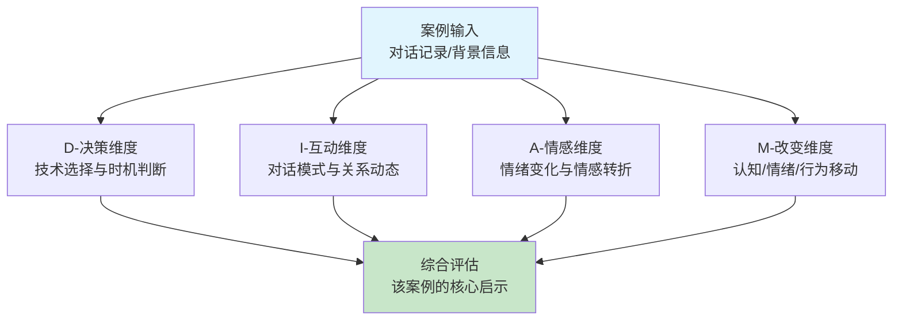
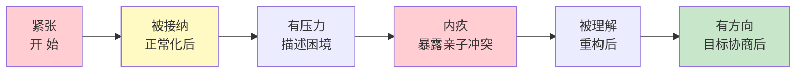
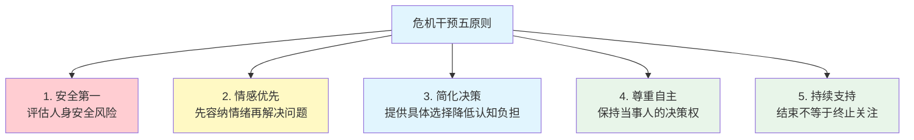
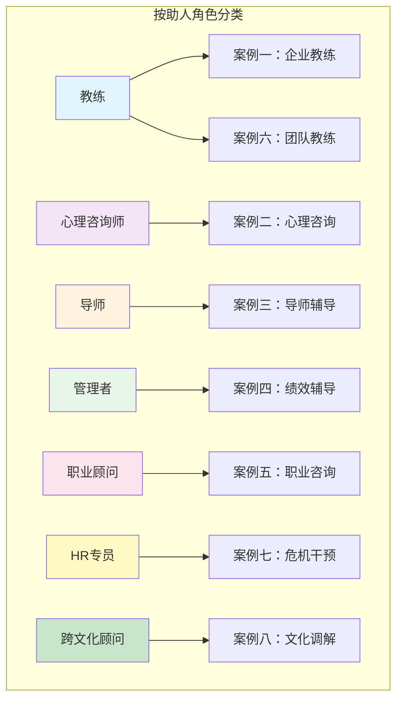

# 第二十一章 咨询与辅导沟通 - 实战案例

> **本章概览**：本章通过八个系统设计的实战案例，覆盖咨询与辅导沟通中最常见的应用场景。每个案例均采用「场景定位→完整对话→逐句技术解析→D-I-A-M四维分析」的统一结构，确保读者不仅看到"怎么说话"，更理解"为什么这样说"。案例选取遵循三条覆盖逻辑：（1）角色维度——从教练、心理咨询师、导师到管理者、HR、跨文化顾问，覆盖职场中所有可能的助人角色；（2）难度维度——从低情绪强度的教练对话到极端情绪下的危机干预；（3）理论维度——每个案例锚定一个核心理论模型（GROW、人本主义、SBI、动机式访谈等），实现理论与实操的无缝对接。建议先通读全部案例建立全局认知，再选择与自身工作场景最相关的案例深度分析——每个案例至少读三遍：第一遍理解情境，第二遍解构技巧，第三遍思考"如果是我会怎么做"。

## 案例分析方法论

在深入具体案例之前，我们先建立一套系统的案例分析框架。这不是"看故事"，而是带着专业眼光解构每一个咨询对话中的关键决策点、技术运用和效果评估。

### D-I-A-M 专业案例分析框架

分析任何一段咨询或辅导对话，都可以从四个维度切入：

| 维度 | 英文 | 核心问题 | 分析工具 |
|------|------|----------|----------|
| **D - 决策维度** | Decision | 咨询师为什么在这个时机选择这个干预？ | 理论映射、技术选择矩阵 |
| **I - 互动维度** | Interaction | 双方的互动模式如何演变？谁在引导？ | 对话回合分析、权力动态图 |
| **A - 情感维度** | Affect | 情绪曲线如何变化？转折点在哪里？ | 情绪温度计（0-10）、情感词汇识别 |
| **M - 改变维度** | Movement | 对话前后，来访者的认知/情绪/行为有何移动？ | 改变量尺、具体行为指标 |

### 如何使用 D-I-A-M 框架

D-I-A-M 框架不仅用于分析本章的案例，更是一种可以在日常工作中反复使用的**自我复盘工具**。无论你是管理者、HR、教练还是任何需要与人深度对话的角色，每次重要的咨询/辅导对话结束后，都可以用以下四个问题快速复盘：

1. **决策复盘**（D）：我在对话中做了哪些关键选择？选择的依据是什么？有没有更好的时机或方式？
2. **互动复盘**（I）：对话中谁在引导？我的提问和陈述的比例是多少？对方的参与度如何？
3. **情感复盘**（A）：对方的情绪经历了怎样的变化？我在哪个节点感受到了转折？我的情绪状态是否影响了对话质量？
4. **改变复盘**（M）：对话前后，对方的认知、情绪或行为发生了什么移动？这些移动是否朝着预期方向？

将这四个维度形成习惯后，你的专业成长速度会显著加快——因为**有框架的反思**比随机的"感觉还行"或"好像不太对"有效得多。

### 案例选取的覆盖逻辑

本节的八个案例按照以下维度系统覆盖：

| 案例 | 助人角色 | 应用场景 | 对应理论 | 对应技巧 |
|------|----------|----------|----------|----------|
| 案例一 | 教练 | 企业领导力 | GROW模型 | 开放式提问、尺度问题 |
| 案例二 | 心理咨询师 | 个人情绪困扰 | 人本主义理论 | 共情、情感反映 |
| 案例三 | 导师 | 新人入职适应 | — | 合约建立、反馈方式 |
| 案例四 | 管理者教练 | 绩效改进 | SBI模型、SMART目标 | 结构化反馈、行动计划 |
| 案例五 | 职业咨询师 | 职业转型 | 动机式访谈 | 优势探索、价值观澄清 |
| 案例六 | 团队教练 | 团队协作 | 团队发展理论 | 尺度问题、自主生成方案 |
| 案例七 | HR辅导员 | 危机干预 | 危机干预理论 | 即时共情、资源协调 |
| 案例八 | 跨文化顾问 | 文化冲突调解 | 跨文化理论 | 中立引导、共识构建 |

> **学习建议**：先通读所有案例获得全局视角，再选择与自己工作场景最相关的案例深入分析。每个案例建议读三遍——第一遍理解情境，第二遍分析技巧，第三遍思考"如果是我，会怎么做"。

---

## 案例一：企业教练对话——从团队低效到自主协作

### 场景定位

这是一段典型的**企业高管教练对话**，对应前面理论基础中的 **GROW模型**（约翰·惠特莫尔）。GROW模型将教练对话分为四个阶段：目标（Goal）→ 现状（Reality）→ 选择（Options）→ 意愿（Will）。理解这个框架是分析本案例的关键。

### 背景

张经理是某科技公司的产品总监，最近接手了一个重要项目，但团队成员之间存在沟通障碍，项目进展缓慢。公司聘请了专业教练李教练来帮助张经理提升领导力。这已经是第三次教练会谈，前两次已经建立了信任关系和教练合约。

### 完整对话与逐句分析

**第一阶段：目标澄清（Goal）**

> **李教练**："张经理，你希望我们的教练对话帮助你达成什么目标？"

**技术解析**：这是一个**成果导向的开放式提问**。教练没有问"你的问题是什么"（问题导向），而是问"你希望达成什么"（成果导向）。这种措辞选择来自焦点解决短期治疗（SFBT）的理念——关注解决方案而非问题本身，帮助来访者从一开始就建立积极的思维框架。

> **张经理**："我想让团队更高效地合作，项目能按时交付。"

> **李教练**："具体来说，你希望团队在哪些方面有所改进？"

**技术解析**：追问"具体"是教练的基本功。模糊的目标（"高效合作"）无法衡量、无法行动。教练通过追问将模糊目标转化为具体行为指标，这在目标设定理论中被称为**操作化**（operationalization）。

> **张经理**："团队成员之间缺乏信任，沟通经常有误解。"

> **李教练**："在0到10的尺度上，10代表理想的团队合作状态，0代表最糟糕的情况，你认为现在的团队在哪里？"

**技术解析**：这是**尺度问题**（Scaling Question），源自焦点解决短期治疗（SFBT）。尺度问题的价值不在于数字本身，而在于它创造了一个"安全的抽象空间"——用数字量化难以言说的感受，同时为后续的探索提供了锚点。这是评估现状最高效的技术之一。

> **张经理**："大概在4分。"

> **李教练**："是什么让你觉得是4分而不是更低？"

**技术解析**：这是尺度问题的**经典追问策略**。注意教练没有问"为什么只有4分"（聚焦不足），而是问"是什么让你觉得不是更低"（聚焦已有资源和优势）。这个微妙的措辞差异来自SFBT的核心信念：**即使在困境中，来访者也已经做了很多正确的事**。通过识别这些"微小的成功"，可以帮助来访者看到自己已有的能力和资源，从而增强信心。

**第二阶段：现状探索（Reality）**

> **张经理**："大家还是愿意把工作做好的，只是沟通方式有问题。"

**自我洞察信号**：张经理已经区分了"意愿"（愿意做好）和"能力"（沟通方式），说明他有一定的分析能力。教练可以在此基础上深化。

> **李教练**："你提到沟通有误解，能举一个最近的例子吗？"

**技术解析**：**要求具体案例**是教练的重要技术。抽象描述（"沟通有问题"）难以干预，具体案例可以暴露真正的问题模式。教练在这里引导张经理从概括性描述走向具体行为分析。

> **张经理**："上周的技术评审会上，开发和测试对需求理解不一致，导致返工。"

> **李教练**："在这种情况下，你通常会怎么做？"

**技术解析**：这个问题探索张经理的**默认行为模式**。教练注意到张经理是"产品总监"——团队的最高负责人。了解他的默认干预方式，才能评估这种干预模式是否有效、是否需要改变。

> **张经理**："我会介入调解，明确需求。"

> **李教练**："你希望达到什么程度？"

**技术解析**：简短而精准的追问。教练没有评价"介入调解"是好是坏，而是继续探索张经理自己的期望标准。这是教练与咨询师的关键区别——**教练不评判行为对错，而是帮助客户看到行为与目标之间的差距**。

**第三阶段：选择探索（Options）**

> **张经理**："我希望团队能自己解决这类问题，不需要我每次都介入。"

**目标进化信号**：张经理从"让团队高效合作"进化为"让团队自主解决冲突"——这是领导力层面的目标升级。教练可以抓住这个信号进一步推动。

> **李教练**："如果团队能够自己解决这些问题，会是什么样子？"

**技术解析**：这是SFBT中的**奇迹提问**（Miracle Question）的变体。通过描绘"问题已经解决"的画面，帮助来访者从困境思维转向解决方案思维，同时为行动方案提供具体的愿景参照。

> **张经理**："他们会主动沟通，澄清疑问，而不是等到问题爆发。"

> **李教练**："你认为需要采取什么步骤来实现这一点？"

**技术解析**：将愿景转化为行动步骤。注意教练问的是"你认为"而不是"我建议"——**维护客户的自主性**是教练伦理的核心原则之一。

> **张经理**："可能需要建立更好的沟通机制，比如每日站会。"

> **李教练**："还有什么其他可能性？"

**技术解析**：**"还有呢？"效应**（And What Else?）是教练技术中最简单也最有效的提问之一。迈克尔·邦吉·斯坦尼尔（Michael Bungay Stanier）在《超级教练》中指出，人们第一个想到的方案往往不是最好的。通过追问"还有什么"，可以激发更多创造性思考。

> **张经理**："也许可以组织一些团队建设活动，增进了解。"

**第四阶段：意愿确认（Will）**

> **李教练**："你决定从哪个开始？"

**技术解析**：选择而非施加。教练将决策权完全交给张经理。这不仅尊重了客户的自主性，也提高了执行承诺——人们对自己选择的方案有更强的行动力（自我决定理论，Deci & Ryan）。

> **张经理**："先从每日站会开始，下周实施。"

### D-I-A-M 分析

**决策维度（Decision）**：李教练严格遵循GROW模型的四个阶段，从目标→现状→选择→意愿依次推进。在每个阶段的技术选择都与当前阶段的任务匹配：目标阶段用尺度问题量化，现状阶段用具体案例深化，选择阶段用"还有呢"扩展，意愿阶段用选择确认承诺。

**互动维度（Interaction）**：对话共15个回合，其中12个是教练的提问或简短回应，3个是张经理的长回答。教练话语权占比很低（以问题为主），说明教练成功地将对话的主导权交给了客户。这是"引导式对话"而非"指导式对话"的典型模式。

**情感维度（Affect）**：张经理的情绪从最初的焦虑（"团队缺乏信任"）逐渐转向信心（"先从每日站会开始"）。情绪转折点出现在教练问"是什么让你觉得不是更低"时——这个问题帮助张经理看到团队的积极面，打破了"一切都是问题"的负向思维循环。

**改变维度（Movement）**：
- **认知改变**：从"团队有问题"到"团队有意愿，需要机制支持"
- **行为改变**：从习惯性"介入调解"到计划"建立沟通机制"
- **承诺改变**：从模糊的"想改变"到具体的"下周实施每日站会"

### 教练在此案例中刻意避免的做法

| 避免的做法 | 原因 | 可能的负面后果 |
|------------|------|----------------|
| 建议"你应该做站会" | 剥夺客户自主决策权 | 客户缺乏执行动力，归因于"教练让我做的" |
| 分析"团队信任问题的根源" | 超出教练角色，进入咨询领域 | 讨论陷入理论分析，缺乏行动推动 |
| 追问"为什么你的团队不信任你" | 指向性的"为什么"问题容易引发防御 | 客户感到被评判，关闭探索意愿 |
| 直接制定详细行动计划 | 教练是引导者而非计划制定者 | 客户对计划缺乏所有权感 |

---

## 案例二：心理咨询初次访谈——在安全感中打开脆弱

### 场景定位

这是一个典型的**心理咨询初次访谈**，核心目标不是"解决问题"，而是**建立治疗关系**和**进行初步评估**。本案例集中体现了前面理论基础中卡尔·罗杰斯（Carl Rogers）人本主义咨询理论的三个核心条件：无条件积极关注、共情理解和真诚一致。

### 背景

王女士，35岁，因工作压力和家庭矛盾寻求心理咨询。这是她第一次接受心理咨询，感到紧张和不确定。预约时她反复确认了三次保密原则，说明信任是她最核心的顾虑。

### 完整对话与逐句分析

**第一阶段：安全框架建立**

> **咨询师**："王女士，欢迎来到咨询室。在开始之前，我想简单介绍一下咨询的保密原则。我们今天讨论的内容是保密的，除非涉及你或他人的安全。你有什么问题吗？"

**技术解析**：咨询师在对话的第一句话就主动提及保密原则，这不是例行公事，而是基于对来访者状态的敏锐判断——预约时反复确认保密原则的行为已经暗示，安全感是这位来访者的核心需求。罗杰斯理论中的"治疗条件"第一步就是**创造安全的物理和心理空间**。保密原则的说明是这个安全空间的法律和伦理基础。

> **王女士**："我有点紧张，不知道该说什么。"

**来访者信号**：这是初次咨询中极为常见的反应，表达了两个信息——（1）情绪状态（紧张），（2）对咨询过程的不确定（不知道说什么）。

> **咨询师**："这是完全正常的。很多人第一次来咨询都会有类似的感觉。我们可以从你今天想谈的话题开始。"

**技术解析**：咨询师同时做了三件事：
1. **正常化**（normalization）：「这是完全正常的」——降低来访者的羞耻感和孤独感
2. **普遍化**（universalization）：「很多人第一次都有类似感觉」——让来访者感到自己不是"异类"
3. **赋权**（empowerment）：「我们可以从你想谈的开始」——将主导权交给来访者

这三步组合拳在30秒内完成了"安全→正常→我有控制权"的心理建设。正常化技术在认知行为疗法（CBT）和接纳承诺疗法（ACT）中都被广泛应用。

**第二阶段：问题呈现与情绪映射**

> **王女士**："我最近压力很大，工作家庭都处理不好。"

**关键信息**：来访者用"处理不好"描述自己的状态——这是一个典型的**自我批评框架**（"是我的问题"）。咨询师需要在后续工作中帮助她区分"事实"和"对事实的诠释"。

> **咨询师**："听起来你最近承受了很大的压力。能多告诉我一些关于这些压力的情况吗？"

**技术解析**：咨询师先做了**情感反映**（"听起来你最近承受了很大的压力"），再用**开放式提问**邀请展开。顺序很重要——先共情再提问，让来访者感到被理解后才愿意进一步敞开心扉。如果直接提问"什么让你觉得处理不好"，来访者可能感到被审视而产生防御。

> **王女士**："工作上有个重要项目，经常加班。家里孩子还小，丈夫又出差多。"

**自我评估信号**：来访者已经呈现了压力的两个来源——工作（项目、加班）和家庭（孩子小、丈夫不在）。注意她的表述方式："孩子还小"和"丈夫出差多"都是外部因素，暗示她可能将压力归因于环境而非自身。

> **咨询师**："你同时在应对工作和家庭的双重压力。这一定很不容易。"

**技术解析**：这是**高级共情**的运用。来访者说的是"工作和家庭"两个词，咨询师将其提炼为"双重压力"——这个概括帮助来访者看到自己的困境是"被理解的结构"，而不是散乱的碎片。"这一定很不容易"是一种**验证**（validation），肯定来访者的感受是合理的，而非"小题大做"。

> **王女士**："是的，我经常感到疲惫和焦虑。"

**情绪标签出现**："疲惫"（生理反应）和"焦虑"（情绪反应）——这两个关键词是后续工作的焦点。

> **咨询师**："你感到疲惫和焦虑。这些情绪是什么时候开始的？"

**技术解析**：精确复述来访者的情感词汇，再用时间线提问建立评估信息。**情感反映**（emotional reflection）是罗杰斯治疗的核心技术之一——当来访者的情绪被准确命名和反映时，他们感到"被看见"，这本身就具有治疗作用。神经科学研究表明，准确的情绪标签化可以降低杏仁核的激活水平，从而减轻情绪强度（Lieberman et al., 2007）。

**第三阶段：应对模式探索**

> **王女士**："大概三个月前开始的。"

> **咨询师**："在这三个月里，你是如何应对这些压力的？"

**技术解析**：咨询师没有问"为什么三个月前开始"（追溯原因），而是问"你是如何应对的"（关注应对策略）。这个选择反映了咨询师的理论取向——**资源取向**而非缺陷取向。了解来访者已经使用了哪些策略，才能评估哪些有效、哪些需要调整，而不是假设来访者"什么都没做"。

> **王女士**："我尽量坚持，但有时候会忍不住对孩子发脾气。"

**深层信息**：来访者暴露了一个关键的行为模式——压力外溢到亲子关系。"忍不住"暗示她对自己的行为有内疚感。这是后续深入探索的重要线索。

> **咨询师**："你提到对孩子发脾气，这让你有什么感受？"

**技术解析**：咨询师没有评价"对孩子发脾气不好"，而是关注这个行为对来访者的**情感影响**。这是罗杰斯理论中"无条件积极关注"的具体体现——咨询师接纳来访者的全部，包括她认为"不好"的部分，并邀请她在这个安全空间中探索这些感受。

> **王女士**："我很内疚，觉得自己不是个好妈妈。"

**核心信念浮现**："不是个好妈妈"——这是一个**核心自我评价**，可能与更深层的自我价值感相关。在CBT框架中，这可能涉及"我不够好"的核心信念。但在初次访谈中，咨询师不急于深入挖掘，而是先验证和反映。

> **咨询师**："你对自己有很高的期望。当无法达到这些期望时，你会感到内疚。"

**技术解析**：这是一次精准的**重构**（reframing）。来访者说"我不好"，咨询师将其重构为"你有很高的期望"——从"我不够好"的自我攻击，转向"期望与现实之间的差距"的客观描述。这种重构：
1. 不否定来访者的感受（承认内疚是真实的）
2. 提供一个不同的理解框架（高期望而非个人缺陷）
3. 为后续认知工作埋下伏笔（探索期望是否合理）

> **王女士**："是的，我总是觉得自己做得不够好。"

**"总是"关键词**：这是认知扭曲的信号——过度概括化（overgeneralization）。CBT中会将此视为核心干预点，但在初次访谈中，咨询师选择先建立关系，不急于纠正认知。

**第四阶段：方向协商**

> **咨询师**："在我们继续探索之前，我想确认一下，你希望通过咨询达成什么？"

**技术解析**：在收集了足够信息后，咨询师主动暂停问题探索，转向**目标协商**。这个转折体现了咨询师对咨询过程的掌控——不是无限制地听来访者倾诉，而是在合适时机引入方向感。"继续探索之前"暗示这只是一个暂停，不是结束，降低了来访者"时间不够"的焦虑。

> **王女士**："我想学会更好地管理压力，改善家庭关系。"

> **咨询师**："好的。我们可以一起探索压力的来源，学习应对策略。你觉得这样的方向如何？"

**技术解析**：咨询师用自己的语言重述了来访者的目标，并加入了专业框架（"压力来源"和"应对策略"），然后征求来访者的确认。这是**知情同意**在咨询方向层面的体现——来访者不是被动接受治疗的"患者"，而是与咨询师共同决定方向的"合作者"。

### D-I-A-M 分析

**决策维度**：咨询师在初次访谈中做出了几个关键决策——（1）优先建立安全关系而非急于干预；（2）选择反映式倾听而非分析式提问；（3）在关系稳固后才转向目标协商。这些决策完美体现了罗杰斯的核心主张："关系本身就是治愈"。

**互动维度**：对话的引导权微妙地转移——开始时咨询师主导（保密说明、正常化），中段来访者主导（描述压力和应对），结束时回到协商状态（共同确认方向）。这种"引导→跟随→协商"的节奏是成熟咨询师的标志。

**情感维度**：

**改变维度**：
- **情绪改变**：从紧张不安到感到被理解和有方向
- **认知改变**：从"我不好"到"我有高期望"（重构的初步影响）
- **信任改变**：从不确定咨询是否有用到愿意继续探索

### 此案例中咨询师刻意保持的边界

咨询师在本案例中没有做的事情同样重要：

1. **没有追问"丈夫出差多"的细节**——初次访谈以建立关系为主，过度挖掘婚姻问题可能让来访者感到被"挖隐私"
2. **没有建议"你需要和丈夫谈谈"**——咨询师不是生活顾问，不直接提供行动建议
3. **没有急于纠正"不是好妈妈"的认知**——认知重构需要在安全的治疗关系基础上进行，初次访谈过早挑战核心信念可能适得其反
4. **没有设定过于具体的咨询计划**——初次访谈的目标是建立方向感，不是制定完整方案

---

## 案例三：导师辅导关系建立——双向契约的力量

### 场景定位

导师辅导（Mentoring）是一种以长期关系为基础、以经验传递和职业发展为核心的助人方式。与教练不同，导师可以分享个人经验并提供直接建议；与心理咨询不同，导师关系更注重职业成长而非情绪处理。本案例展示了**辅导关系建立阶段**的关键对话。

### 背景

李工程师是某制造公司的高级工程师，在公司工作12年，技术扎实且为人谦和。公司安排他担任新入职的赵工程师（应届毕业生）的导师。这是他们第一次正式会面。

### 完整对话与逐句分析

> **李工程师**："赵工，欢迎加入公司。作为你的导师，我希望能帮助你更好地适应和发展。首先，我想了解一下你的期望。"

**技术解析**：李工程师在开场中完成了三个任务：（1）欢迎（情感连接），（2）说明角色定位（"帮助你适应和发展"），（3）询问期望（将被指导者放在对话中心）。这个开场白简洁而全面。注意"你的期望"——导师不是单向传授，而是从被指导者的需求出发。

> **赵工程师**："谢谢李工。我希望能尽快熟悉工作流程，提升技术能力。"

> **李工程师**："很好的目标。具体来说，你希望在哪些方面得到指导？"

**技术解析**：肯定对方的目标后，追问"具体"——与案例一中教练的做法相同。"很好的目标"是一个**微小的认可**，可以增强新员工的信心和被接纳感。

> **赵工程师**："我对公司的技术标准还不熟悉，希望有人指导。"

> **李工程师**："我可以帮助你了解这些标准。除了技术方面，你还希望在哪些方面发展？"

**技术解析**：导师在这里做了一个重要的**扩展性提问**——从技术层面延伸到更广泛的维度。一个成熟的导师知道，新人的挑战很少只在技术层面；人际关系、文化适应、职业方向同样是关键议题。通过主动拓宽话题，导师展示了对新人全面发展的关注。

> **赵工程师**："我也想学习如何更好地与团队合作。"

> **李工程师**："团队合作确实很重要。我们可以定期见面，讨论你遇到的问题和进展。你觉得多久见一次面比较合适？"

**技术解析**：李工程师提出了**辅导节奏**的话题，并将频率选择权交给赵工程师。这是辅导合约建立的第一步——**时间边界**。明确的节奏有助于建立稳定预期，避免"想起来才约"的随意状态。

> **赵工程师**："每周一次如何？"

> **李工程师**："可以。我们每周三下午花一个小时讨论。我会分享我的经验，也会给你一些反馈。你希望我以什么方式提供反馈？"

**技术解析**：李工程师做了三件事：（1）确认时间安排，（2）说明导师会分享经验+给反馈（明确自己的角色），（3）**询问反馈偏好**。最后一点极为关键——不同人对反馈的接受方式差异很大。有些人喜欢直接了当，有些人需要"三明治法"（正面-改进-正面），有些人需要私下场合。提前沟通反馈偏好可以避免后续的误解和冲突。

> **赵工程师**："希望您能直接指出我的问题，这样我能更快改进。"

> **李工程师**："好的。我也会注意平衡正面反馈和建设性反馈。在开始之前，你还有什么问题或期望吗？"

**技术解析**：赵工程师要求"直接"，李工程师确认了这个偏好，同时补充"也会注意平衡正面和建设性"——这不是推翻赵工程师的偏好，而是**丰富**它。一个只会批评的导师和一个只会表扬的导师同样有害。最后的"还有什么问题或期望"是**开放式收尾**，为未被提及的隐性需求提供表达空间。

> **赵工程师**："暂时没有。我很期待向您学习。"

> **李工程师**："我也期待与你合作。记住，导师关系是双向的，我也可以从你身上学到新东西。"

**技术解析**：最后一句话是**双向关系定位**。这句话的价值在于：（1）降低赵工程师的等级感（"我不是只是被教导的人"），（2）建立平等互惠的关系基调，（3）暗示导师也需要学习和成长——这对塑造一个开放而非权威式的辅导氛围至关重要。

### 辅导合约建立清单

从这段对话中，我们可以提取出导师辅导关系建立时需要明确的关键要素：

| 合约要素 | 本案对话中的体现 | 未提及但建议补充的 |
|----------|------------------|---------------------|
| 角色定位 | "帮助你适应和发展" | 区分导师能做的和不能做的 |
| 辅导目标 | 熟悉流程、提升技术、团队合作 | 3个月和6个月的里程碑 |
| 触及频率 | 每周三下午一小时 | 紧急问题的联系方式 |
| 反馈方式 | 直接指出问题+平衡正面反馈 | 反馈的具体案例格式 |
| 保密范围 | 未提及 | 辅导内容是否向主管汇报 |
| 结束条件 | 未提及 | 辅导关系何时自然结束或评估 |
| 互惠承诺 | "双向学习" | 被指导者可以为导师提供什么 |

### 常见的导师辅导关系陷阱

| 陷阱类型 | 具体表现 | 如何避免 |
|----------|----------|----------|
| 替代父母 | 导师过度保护，不让新人犯错 | 明确"安全犯错"的空间，允许从错误中学习 |
| 权威投射 | 新人过度依赖导师判断，丧失独立性 | 定期要求新人先独立思考再讨论 |
| 情感卷入 | 导师和新人发展出超越职业的私人关系 | 保持适度的专业边界 |
| 义务感膨胀 | 导师感到"必须"投入大量时间而产生倦怠 | 明确时间边界，允许说"不" |

---

## 案例四：绩效辅导面谈——SBI模型在冲突性对话中的应用

### 场景定位

绩效辅导面谈是管理者最常用的教练式沟通场景。与纯教练对话不同，绩效辅导有一个特殊挑战——**管理者需要传达可能让对方感到不舒服的信息**。如何在直接反馈与维护关系之间取得平衡，是这个案例的核心议题。本案例运用了前面核心技巧中的 **SBI反馈模型**（Situation情境-Behavior行为-Impact影响）和 **SMART目标设定**。

### 背景

刘主管需要与下属小王进行绩效辅导面谈。小王入职两年，潜力不错，但最近三个月工作表现明显下滑——项目报告频繁出错，两次错过了截止日期。刘主管需要找出原因并制定改进计划。这是正式绩效面谈前的非正式沟通。

### 完整对话与逐句分析

**第一阶段：开放探索（避免审判式开场）**

> **刘主管**："小王，感谢你来参加这次面谈。我想讨论一下你最近的工作表现，并一起制定改进计划。首先，你对自己最近的表现有什么看法？"

**技术解析**：刘主管的开场有几个精妙之处：（1）"感谢你来"——表达尊重而非权力压迫；（2）"讨论一下你最近的工作表现"——使用"讨论"而非"评估"或"谈话"，降低对抗感；（3）"一起制定改进计划"——暗示这是共同行动而非单向批评；（4）**先问对方的自我评估**——这是关键决策。如果管理者先指出问题，下属会产生防御；让下属先自我评价，往往能获得更坦诚的对话基础。

> **小王**："我知道最近表现不好，项目有几个地方出了问题。"

**积极信号**：小王主动承认了问题，说明他有自我觉察能力，也没有进入防御模式。这让刘主管的后续工作容易很多。

> **刘主管**："你意识到了问题，这很好。能具体说说哪些方面需要改进吗？"

**技术解析**：肯定对方的自我觉察（"这很好"），然后追问具体化。让小王自己说出需要改进的方面，比管理者直接指出更有接受度。

> **小王**："主要是时间管理，经常拖延到最后一刻。"

**第二阶段：SBI结构化反馈**

> **刘主管**："在昨天的项目汇报中（**情境**），你提交的报告有几处数据错误（**行为**），这让客户对我们的专业性产生了疑虑（**影响**）。你怎么看？"

**技术解析**：这是一个教科书级的 **SBI反馈**：

- **S - Situation（情境）**：「在昨天的项目汇报中」——具体的时间地点，而非模糊的"最近"
- **B - Behavior（行为）**：「报告有几处数据错误」——客观描述行为，不涉及人格判断（没有说"你粗心"）
- **I - Impact（影响）**：「客户对我们的专业性产生了疑虑」——说明行为的具体后果，且影响是客观的（客户的感受）而非主观的（"我觉得你不够认真"）

最后的"你怎么看"将对话权交回小王，邀请他参与分析而非被动接受批评。

> **小王**："我很抱歉，最近确实太赶了。"

> **刘主管**："我理解工作压力大。你认为是什么原因导致了时间管理问题？"

**技术解析**：先共情（"我理解"），再引导自我分析。注意刘主管问的是"什么原因"——这是在帮助小王建立**因果分析能力**，而不是直接给出诊断。

> **小王**："我有时候会低估任务所需时间，也容易分心。"

**深度自我认知**：小王识别了两个关键因素——时间估算偏差和注意力管理。这两个都是可以通过具体技术改善的问题。

> **刘主管**："你已经识别了两个关键因素：时间估算和专注力。你希望在这方面达到什么目标？"

**技术解析**：刘主管做了一个**精确概括**——将小王的表述提炼为"时间估算"和"专注力"两个专业术语。这种概括既肯定了小王的分析能力（"你已经识别了"），又为后续的目标设定提供了清晰的靶心。

**第三阶段：SMART目标设定**

> **小王**："我想提高工作效率，减少错误。"

> **刘主管**："具体来说，你希望在什么时间内实现什么改进？"

**技术解析**：将模糊目标（"提高效率"）推向SMART化——追问时间和具体指标。

> **小王**："希望在接下来一个月内，项目报告的准确率提高到95%以上。"

**SMART检验**：

| SMART维度 | 是否符合 | 分析 |
|-----------|----------|------|
| S - Specific（具体） | ✅ | "项目报告的准确率"是明确指标 |
| M - Measurable（可衡量） | ✅ | "95%以上"是量化标准 |
| A - Achievable（可达成） | ⚠️ | 需要验证当前水平和改进空间 |
| R - Relevant（相关） | ✅ | 直接针对识别出的问题 |
| T - Time-bound（有时限） | ✅ | "一个月内" |

> **刘主管**："这是一个很好的SMART目标。你认为需要采取什么措施来实现这个目标？"

**第四阶段：行动计划与支持系统**

> **小王**："我需要学习时间管理技巧，也许可以使用任务管理工具。"

> **刘主管**："我可以推荐一些工具和方法。你愿意尝试什么？"

**技术解析**：刘主管在小王提出需求后才提供支持，而不是主动塞建议。"你愿意尝试什么"保持了小王的自主选择权。

> **小王**："我愿意尝试任何能帮助我改进的方法。"

> **刘主管**："好的。我们一起制定一个具体的行动计划。你还需要什么支持？"

> **小王**："希望您能定期检查我的进展，给我反馈。"

> **刘主管**："当然。我们每周花15分钟回顾进展。你觉得这样的安排如何？"

**技术解析**：刘主管将"定期检查"具体化为"每周15分钟"——将模糊承诺转化为可执行的约定。15分钟的时间框也很精妙：足够覆盖关键信息，不会成为额外负担。

### D-I-A-M 分析

**决策维度**：刘主管最核心的决策是**使用SBI模型而非直接批评**。在绩效辅导中，管理者最大的诱惑是"直接告诉对方哪里不好"——这虽然高效，但容易让对方感到被攻击而进入防御模式。SBI模型通过"情境→行为→影响"的结构化描述，将主观评价转化为客观观察。

**互动维度**：整个对话遵循了"探索→反馈→目标→行动"的节奏，与GROW模型有异曲同工之妙。值得注意的是，刘主管的提问次数远多于陈述次数——这在管理沟通中极为难得。大多数管理者的默认模式是"我来说问题，你来听"，而刘主管选择了"你来分析，我们一起找方案"。

**情感维度**：

对话进程  开场 → 自评 → SBI反馈 → 原因分析 → 目标设定 → 行动计划
情绪状态  中性   开放    感到被理解   积极分析    有信心     有动力
防御指数  低      低      低          低          低         低

注意防御指数全程保持在低位——这是绩效辅导最理想的状态。

**改变维度**：
- 认知：从"我表现不好"（模糊）到"我需要改善时间估算和专注力"（具体）
- 承诺：从"想改进"到"一个月内准确率95%"（可衡量）
- 行动：从"需要学习"到"每周15分钟回顾"（可执行）

---

## 案例五：职业发展咨询——价值观驱动的职业转型

### 场景定位

职业咨询是介于教练和心理咨询之间的专业领域。它既需要教练式的行动引导（制定探索计划），也需要咨询式的深度探索（价值观澄清、身份认同）。本案例综合运用了**动机式访谈**（MI）中的探索技术和**自我决定理论**（SDT）的价值观澄清方法。

### 背景

陈女士在一家公司工作了8年，目前担任部门经理。她最近一次晋升是在三年前，此后一直处于"稳定但停滞"的状态。她感到职业发展遇到瓶颈，考虑是否应该转换职业方向。在接受职业咨询前，她已经纠结了将近一年。

### 完整对话与逐句分析

**第一阶段：探索职业倦怠的深层结构**

> **咨询师**："陈女士，你提到感到职业发展遇到瓶颈，能具体描述一下这种感觉吗？"

**技术解析**：咨询师没有问"你想换什么工作"，而是问"这种感觉"——关注内在体验而非外部行动。这是动机式访谈的核心策略之一：**在引导行动之前，先充分理解对方的内在体验**。职业决策不仅是理性分析，更涉及自我认同和价值观，需要从感受层面切入。

> **陈女士**："我觉得现在的工作没有挑战性，每天重复同样的事情。"

> **咨询师**："你渴望新的挑战和成长机会。你理想中的职业状态是什么样的？"

**技术解析**：先精确反映（"渴望新的挑战和成长机会"），再用**愿景提问**将对话从抱怨模式转向探索模式。"理想中的职业状态"比"你想做什么工作"更深层——它邀请来访者描绘完整的职业图景，包括工作内容、工作方式、成就感来源等。

> **陈女士**："我希望做更有创造性、能影响更多人的工作。"

**核心价值观浮现**：创造性 + 影响力——这是两个重要的职业价值观。后续的所有讨论都应该围绕这两个锚点展开。

**第二阶段：选择探索与现实检验**

> **咨询师**："你重视创造性和影响力。你考虑过哪些可能的方向？"

**技术解析**：将价值观词汇反馈给来访者（"你重视创造性和影响力"），强化她对自己核心需求的认知。然后引导到具体方向。

> **陈女士**："我考虑过创业，也想过转行到咨询行业。"

> **咨询师**："这两个方向都很有趣。你对它们有什么了解？"

**技术解析**：咨询师没有说"这两个方向都不错"或"你适合哪个"，而是用中性的问题探索来访者的认知深度。这是MI中的**探索性提问**——了解对方对选择的认知程度，才能判断是"深思熟虑后的选择"还是"一厢情愿的幻想"。

> **陈女士**："我对创业有些想法，但不确定是否可行。咨询行业看起来很有吸引力，但我不确定自己是否适合。"

**矛盾信号**：来访者对两个选择都有兴趣但都有顾虑——这是**决策性矛盾**（decisional ambivalence）的典型表现。MI理论认为，此时不应该急于帮对方做选择，而是帮助她充分探索矛盾的两面。

> **咨询师**："你既看到可能性，也有顾虑。让我们先探索一下你的优势和兴趣。你认为自己最大的优势是什么？"

**技术解析**：面对矛盾，咨询师没有说"让我们列个优缺点表"（理性分析法），而是转向**优势探索**。这是基于积极心理学的干预——让来访者从"我能不能做"的自我怀疑转向"我已经拥有什么"的资源盘点。自我效能感是职业决策中最关键的心理变量之一（Bandura, 1997）。

> **陈女士**："我擅长分析问题，沟通能力也不错。"

> **咨询师**："这些优势在创业和咨询中都很有用。你更享受工作中的哪些方面？"

**技术解析**：肯定优势后，进一步探索**内在动机**——什么让她感到享受？这是自我决定理论（SDT）的应用：当人们的行为与内在动机一致时，他们更持久、更投入。

> **陈女士**："我喜欢解决复杂问题，也喜欢帮助他人成长。"

**价值观深化**：除了"创造性"和"影响力"，现在又出现了"解决问题"和"帮助他人成长"。咨询师可以利用这些信息帮助来访者看清哪个方向更贴合其价值观全貌。

> **咨询师**："听起来咨询工作可能更符合你的兴趣。你对咨询行业有什么具体的疑问？"

**技术解析**：咨询师在此做了一个温和的**方向引导**——"听起来咨询工作可能更符合你的兴趣"。这不是替来访者做决定，而是基于她自己表达的价值观提供一面镜子。注意措辞中的"可能"和"更"——保持了探索的开放性，而非确定性。

**第三阶段：行动化探索**

> **陈女士**："我不确定如何进入这个行业，也不知道是否需要额外的资质。"

> **咨询师**："我们可以一起探索这些信息。你希望在什么时间内做出决定？"

**技术解析**：将不确定性转化为探索计划，并引入时间框架。

> **陈女士**："希望在六个月内有明确方向。"

> **咨询师**："好的。我们可以制定一个探索计划，包括信息收集、技能评估和尝试性体验。你愿意从哪一步开始？"

**技术解析**：咨询师设计了三阶段探索计划：
1. **信息收集**——了解行业真实面貌
2. **技能评估**——盘点已有能力和需要补充的能力
3. **尝试性体验**——通过实习、兼职或信息访谈获得直接体验

"你愿意从哪一步开始"将选择权交回来访者。

> **陈女士**："我想先了解咨询行业的要求和机会。"

> **咨询师**："我可以帮你联系一些咨询行业的专业人士进行信息访谈。你觉得如何？"

**技术解析**：信息访谈（informational interview）是职业探索中最有效的工具之一——它让来访者通过真实对话了解目标行业，而非仅凭想象和网上信息做判断。咨询师不仅提供方法，还主动提供资源（"帮你联系"），体现了助人者在行动层面的支持。

### D-I-A-M 分析

**决策维度**：咨询师在面对"创业还是转行"的选择时，没有走理性分析路线（SWOT分析、利弊列表），而是走**价值观驱动路线**——先澄清核心价值观，再用价值观作为筛选器。这个决策反映了咨询师对职业决策本质的深刻理解：**人们最持久的职业满意度来自于工作与核心价值观的一致性**。

**互动维度**：对话遵循"探索兴趣→盘点资源→识别方向→制定计划"的自然逻辑，每一步都建立在前一步的基础上。咨询师的引导是**顺势而为**——不是强加框架，而是跟随来访者的思路，在关键节点提供视角和资源。

**改变维度**：
- 认知：从"纠结要不要换"到"明确了创造性和影响力是核心需求"
- 信息：从"不了解咨询行业"到"有了具体的信息收集计划"
- 行动：从"想了一年没有行动"到"决定从信息访谈开始"

---

## 案例六：团队教练工作坊——从各自为战到共识对齐

### 场景定位

团队教练（Team Coaching）与个体教练最大的区别在于：**团队是一个动态系统**，改变一个人的行为不一定改变团队，需要在系统层面推动变革。本案例展示了团队教练工作坊中的关键环节——**集体评估与自主方案生成**。

### 背景

某公司市场部团队（8人）需要提升协作效率。团队成立半年，成员背景各异——有公司老员工，有新招聘的社招人员，还有两个校招新人。团队教练设计了一个半天的工作坊来改善团队沟通和合作。以下是工作坊核心环节的对话记录。

### 完整对话与逐句分析

**第一阶段：集体情绪映射**

> **教练**："欢迎大家参加今天的团队教练工作坊。首先，我想请大家用一句话描述你对团队现状的感受。"

**技术解析**：开场不是PPT讲解，而是**直接邀请感受表达**。"一句话"的限制降低了表达门槛（不会让任何人感到长篇大论的压力），同时创造了心理安全——当每个人都在分享真实感受时，工作坊的"真实对话"基调就建立了。

> **成员A**："我觉得沟通不够顺畅。"
> **成员B**："有时候不知道其他人在做什么。"
> **成员C**："我们各自为战，缺乏协同。"

**模式浮现**：三位成员的反馈指向同一个主题——**信息不对称和协同缺失**。教练需要在后续环节中验证这个模式是否代表整个团队。

**第二阶段：量化评估与分歧探索**

> **教练**："谢谢大家的分享。听起来沟通和协同是大家共同关注的问题。在0到10的尺度上，10代表理想的团队协作状态，你们会给现在的团队打几分？"

**技术解析**：将个体的感受量化为可比较的数字。注意教练在提问前先做了总结（"沟通和协同是共同关注的问题"），确认了之前的模式发现。

> **成员A**："5分。"
> **成员B**："4分。"
> **成员C**："6分。"

**重要发现**：虽然都指向"沟通和协同"的问题，但分数有差异（4-6）。这意味着每个人对问题严重程度的感知不同。教练需要探索这些差异。

> **教练**："分数有所不同。让我们听听每个人的理由。成员A，为什么是5分？"

**技术解析**：教练没有假设"分数最高的人最乐观"或"分数最低的人最不满"，而是**探索每个数字背后的理由**。这是尺度问题的深层用法——数字不是答案，数字背后的思考才是。

> **成员A**："我们有能力，但经常因为沟通问题导致重复工作。"
> **成员B**："我觉得我们缺乏共同目标，各自优先考虑自己的任务。"
> **成员C**："虽然有问题，但大家还是愿意合作的。"

**三重视角**：
- A关注**行为层面**：重复工作（可观察的效率问题）
- B关注**目标层面**：缺乏共同方向（更深层的结构性问题）
- C关注**意愿层面**：愿意合作（积极面，是改变的基础）

> **教练**："很好。我们识别了三个关键点：沟通效率、共同目标和协作意愿。让我们分组讨论，每个小组提出一个改进方案。"

**技术解析**：教练做了三个关键动作：（1）**精确概括**三人的观点为三个关键词，（2）将个人观点**结构化为系统问题**，（3）**将分析权和方案生成权交给团队**。第三点最重要——团队教练的核心原则是：**解决方案必须由团队自己生成，而非教练提供**。自己生成的方案才有所有权感和执行力。

**第三阶段：方案汇聚与共识构建**

（小组讨论后）

> **教练**："请各组分享你们的方案。"

> **小组1**："我们建议建立每日15分钟的站会，同步进展和问题。"
> **小组2**："我们建议每月举行一次团队回顾会，庆祝成功和总结经验。"
> **小组3**："我们建议使用协作工具，让工作进度透明化。"

**方案分析**：

| 方案 | 对应问题层 | 理论依据 | 预期效果 |
|------|------------|----------|----------|
| 每日站会 | 行为层（重复工作） | 敏捷方法论、每日同步 | 减少信息不对称，降低重复工作 |
| 月度回顾会 | 意愿层（愿意合作） | 团队发展理论、仪式感 | 建立正向反馈循环，强化归属感 |
| 协作工具 | 目标层（共同目标） | 信息可视化、透明管理 | 让工作进度可见，促进目标对齐 |

> **教练**："这些都是很好的建议。让我们评估每个方案的可行性和影响，然后制定实施计划。"

**技术解析**：教练没有替团队评估方案的优劣，而是引导团队自主评估。"可行性"和"影响"是两个评估维度——前者关注"能不能做"，后者关注"做了会怎样"。团队自己讨论的结果比教练的判断更有执行力。

### D-I-A-M 分析

**决策维度**：团队教练最关键的决策是**何时从"促进表达"转向"推动行动"**。教练在识别了三个关键点后立即转向方案生成，既没有在感受层面过多停留（避免变成"吐槽大会"），也没有急于给出解决方案（保持团队自主性）。

**互动维度**：团队教练中的互动模式比个体教练复杂得多——不是A和B的二元对话，而是教练与团队、成员与成员之间的多维互动。教练的角色从"对话引导者"转变为"系统催化者"——推动整个团队进入创造性对话状态。

**改变维度**：
- 共识：从个体零散的感受（"沟通不好""不知道别人在做什么"）到结构化的共同问题认知
- 承诺：从各自为战的状态到共同提出改进方案
- 行动：从抽象的"需要改变"到具体的三个方案

---

## 案例七：危机干预沟通——在极端情绪中做安全网

### 场景定位

危机干预是咨询与辅导沟通中最具挑战性的场景。与常规咨询不同，危机干预具有四个特殊属性：**时间紧迫**（不能慢慢来）、**情绪极端**（崩溃、恐惧、绝望）、**目标明确**（首先是安全，其次是稳定）、**边界特殊**（保密原则可能被突破）。本案例展示了**工作场所情绪危机**的干预过程。

### 背景

某员工小张因父亲突发重病住院，情绪崩溃，在办公室哭泣。同事发现后通知了HR。HR专员小林（接受过EAP基础培训）前来提供支持。小张独居，没有亲属在身边，最近一周已经因为焦虑失眠了三天。

### 完整对话与逐句分析

**第一阶段：建立安全连接**

> **小林**："小张，我听说你遇到了一些困难。我想提供一些支持。你现在感觉怎么样？"

**技术解析**：小林的开场经过了精心设计——（1）"你遇到了困难"而非"你情绪失控了"——**去标签化**，避免让小张感到被定义为"问题员工"；（2）"我想提供一些支持"——**声明意图**，让小张知道来者不是来评判的；（3）"你现在感觉怎么样"——**关注当下状态**，而非追问原因。

> **小张**："（哭泣）我...我不知道该怎么办..."

**危机信号**：小张的回应包含两个重要信息——（1）持续哭泣说明情绪处于高度激活状态，（2）"不知道该怎么办"暗示了**无助感**（helplessness），这是危机干预中需要立即回应的核心情绪。

> **小林**："你看起来非常难过。慢慢来，我在这里陪你。"

**技术解析**：小林做了三件关键的事：（1）**情感命名**（"非常难过"）——帮助小张的情绪被看见和确认；（2）**节奏指示**（"慢慢来"）——在对方感到失控时，提供一个外部节奏锚点；（3）**陪伴声明**（"我在这里陪你"）——在无助感弥漫时，"有人在"是最基本也是最有力的安全信号。

注意小林没有说"别哭了"或"冷静一下"——这些话语虽然是常见的安慰方式，但在危机情境中实际上是在要求对方控制情绪，可能让对方感到自己的情绪反应是"不合适的"。

**第二阶段：信息收集与情感容纳**

> **小张**："我父亲突然住院了，医生说情况很严重..."

> **小林**："听到父亲病重的消息，你一定非常担心和害怕。"

**技术解析**：小林用**情感反映**回应了小张的陈述。"担心"和"害怕"是两种不同的情感——担心指向不确定的结果（"会不会好起来"），害怕指向可能的丧失（"可能失去父亲"）。小林同时命名了两种情感，精准覆盖了小张可能的内心体验。

> **小张**："是的，我不知道该怎么处理工作和家庭..."

**第三阶段：从情感转向实际需求**

> **小林**："你现在面临着巨大的压力。首先，我想确保你得到必要的支持。你需要请假去医院吗？"

**技术解析**：小林在情感容纳后，**主动转向实际需求**。这不是"跳过情绪"——而是判断情感已经得到足够的容纳，现在需要解决实际问题。"你需要请假去医院吗"是一个**具体的选择题**，比"你需要什么帮助"更易于回答。在情绪极端时，开放式问题可能增加认知负担，封闭式或选择式问题更实用。

> **小张**："我想去，但项目很紧张..."

> **小林**："我理解你的顾虑。你的健康和家庭是最重要的。我们可以一起看看如何安排工作。你希望我如何帮助你？"

**技术解析**：小林在回应中做了两件关键的事：（1）**价值排序声明**（"健康和家庭是最重要的"）——在小张纠结于工作和家庭时，小林提供了一个清晰的价值排序，这有助于缓解内疚感；（2）**邀请合作**（"你希望我如何帮助你"）——在帮助的同时保持小张的自主性。

> **小张**："我需要请几天假，但不知道如何安排工作..."

> **小林**："我可以帮你协调工作安排。首先，让我们联系你的主管，说明情况。然后，我们可以看看哪些任务可以委托给同事。你觉得这样的安排如何？"

**技术解析**：小林将抽象的"安排工作"拆解为两个具体步骤：（1）联系主管说明情况，（2）评估任务委托可能性。在危机情境中，**将大任务拆解为小步骤**可以降低对方的认知负担。

**第四阶段：实际支持与后续跟进**

> **小林**："我马上帮你处理。在你离开之前，还有什么我可以做的吗？"

> **小张**："暂时没有了，谢谢你的理解。"

> **小林**："照顾好自己和家人。如果需要任何帮助，随时联系我们。"

**技术解析**：最后的回应既表达了关心（"照顾好自己"），又提供了**持续支持的承诺**（"随时联系我们"）。在危机干预中，"结束"不意味着"不再关注"——后续的跟进同样重要。

### 危机干预的核心原则

从本案例可以提炼出危机干预的五项核心原则：

### 危机干预中必须避免的做法

| 避免的做法 | 为什么有害 | 正确替代 |
|------------|------------|----------|
| "别哭了，冷静一下" | 否定情绪表达，增加羞耻感 | "你看起来很难过，慢慢来" |
| "一切都会好的" | 空洞安慰，可能让对方感到不被理解 | "我不知道结果会怎样，但我会陪着你" |
| "你应该早点告诉我的" | 事后批评，增加内疚感 | "谢谢你现在告诉我" |
| "我理解你的感受"（如果你没有类似经历） | 可能让对方感到被敷衍 | "我可能无法完全理解你的感受，但我想尽力支持你" |
| 在未经允许的情况下通知更多人 | 侵犯隐私，破坏信任 | 只在当事人同意或法律要求时才通知他人 |

---

> **案例衔接说明**：案例七展示了在极端情绪下的危机干预——核心是"做安全网"。接下来的案例八则进入一个完全不同的领域——跨文化冲突调解。危机干预的挑战在于情绪的强度，跨文化调解的挑战在于认知框架的差异。两者都需要咨询师保持**中立**和**不评判**的态度，但"中立"在这两个场景中的含义截然不同：案例七的中立是"不评判情绪反应的对错"，案例八的中立是"不偏袒任何一种文化立场"。这种对同一原则在不同场景中的差异化理解，正是专业能力成熟的标志。

## 案例八：跨文化咨询调解——在差异中寻找共识

### 场景定位

跨文化咨询是全球化时代日益重要的专业领域。当不同文化背景的团队合作时，表面的"沟通问题"往往根植于深层的**文化价值观差异**——对时间、层级、直接性、决策方式的不同理解。本案例展示了跨文化咨询师如何帮助两个团队从**文化冲突**走向**相互理解**和**协同工作**。

### 背景

某跨国公司中国区团队（6人）与美国总部团队（4人）合作开发一个全球产品。合作三个月来，双方频繁产生摩擦：美方认为中方响应太慢、不敢表达反对意见；中方认为美方朝令夕改、不尊重计划。矛盾在一次关键里程碑延误后爆发，管理层聘请跨文化咨询师介入调解。

### 完整对话与逐句分析

**第一阶段：各述立场**

> **咨询师**："感谢大家参加这次会议。我了解到中美团队在合作中遇到了一些挑战。让我们先听听各方的感受。中国团队代表，你们有什么想分享的？"

**技术解析**：咨询师的开场选择了"各述立场"的结构，而非"一起讨论"。在冲突情境中，让双方先分别表达可以避免直接对抗，同时也让每方感到自己的声音被优先听到。"有什么想分享的"比"你们觉得哪里有问题"更中性——前者是邀请表达，后者可能被理解为预设"有问题"。

> **中国代表**："我们觉得美国团队不够尊重我们的工作方式，经常在最后一刻提出修改要求。"

**文化维度解析**：中方的表述揭示了两个文化价值点——（1）"尊重我们的工作方式"——涉及**面子文化**和**权力距离**（Hofstede文化维度理论），中方期望其专业判断被同等对待；（2）"最后一刻提出修改"——涉及**时间观念**，中方习惯提前规划，对突击变化感到不适。

> **咨询师**："你们感到不被尊重，特别是关于时间安排的问题。美国团队代表，你们有什么看法？"

**技术解析**：咨询师先**准确反映**中方的核心感受（"不被尊重"），再邀请美方回应。注意咨询师没有说"中方觉得你们不尊重他们"——这种转述可能激化矛盾。咨询师用的是中性的"你们有什么看法"。

> **美国代表**："我们只是想确保项目质量，没想到会给中国团队带来压力。"

**文化维度解析**：美方的表述体现了**任务导向**（以项目质量为最高优先级）和**低语境沟通**（"只是想确保"——直接、就事论事）。美方可能没有意识到，在高语境文化中，"最后一刻改需求"不仅是效率问题，更是关系层面的"不被尊重"信号。

**第二阶段：文化框架引入**

> **咨询师**："你们关注质量，但可能没有意识到时间安排对中方的影响。让我们探讨一下文化差异。在中国文化中，提前计划和避免最后一刻的变更是很重要的。在美国文化中，迭代和调整可能被视为正常的工作方式。"

**技术解析**：咨询师做了一件极其关键的事——**将冲突从"人的问题"重构为"文化差异"**。这个重构有三个深远影响：（1）去人格化——"不是你不尊重我，而是我们的时间观念不同"，降低了敌意；（2）双向理解——不仅指出了美方的行为模式，也解释了中方的反应逻辑；（3）中立立场——咨询师没有说谁对谁错，而是呈现差异。

这个重构基于爱德华·霍尔（Edward Hall）的时间文化理论：
- **单线性时间文化**（Monochronic）：倾向于按计划做事，时间是线性的、可安排的——中国团队更偏向此模式
- **多线性时间文化**（Polychronic）：倾向于灵活调整，可以同时处理多件事——美国团队更偏向此模式

**第三阶段：从理解到行动**

> **中国代表**："是的，我们希望有更多准备时间。"
> **美国代表**："我们理解了。但有时候市场需求变化很快，需要灵活应对。"

**积极信号**：双方都在对方的立场上看到了合理性。中方承认"希望有更多准备时间"（而非"你们不该改"），美方承认"理解了"（而非"我们是对的"）。

> **咨询师**："这是一个很好的观点。让我们寻找一个平衡点。你们认为如何既能保持灵活性，又能给中方足够的准备时间？"

**技术解析**：咨询师用"平衡点"这个词定义了问题的本质——不是"谁让步"，而是"如何兼容两种需求"。这个框架将对话从零和博弈（一方赢另一方输）转向**正和博弈**（双方都得到部分满足）。

> **中国代表**："也许可以提前沟通可能的变更，让我们有心理准备。"
> **美国代表**："我们可以尽量提前预警，但希望中方也能理解有时候变化是不可避免的。"

> **咨询师**："这是一个很好的共识。让我们制定一个沟通协议，明确双方的期望和流程。"

### 跨文化沟通的关键原则

从本案例提炼出跨文化沟通的四项核心原则：

| 原则 | 含义 | 本案例的体现 |
|------|------|--------------|
| **去人格化** | 将冲突归因于文化差异而非个人恶意 | "不是不尊重，而是时间观念不同" |
| **双向教育** | 同时向双方解释对方的文化逻辑 | 向美方解释中国的计划文化，向中方解释美国的迭代文化 |
| **行为协议** | 在理解差异的基础上制定具体的行为协议 | "提前预警变更"的具体协议 |
| **持续调整** | 跨文化合作需要持续的适应和校准 | "制定沟通协议"意味着这不是一次性的 |

### Hofstede 文化维度对照

为了帮助读者理解本案例中的文化冲突根源，以下是中国和美国在相关文化维度上的对比：

| 文化维度 | 中国得分 | 美国得分 | 本案例中的表现 |
|----------|----------|----------|----------------|
| 权力距离 | 高（80） | 低（40） | 中方期望被尊重权威，美方更平等直接 |
| 个人主义vs集体主义 | 集体（20） | 个人（91） | 中方关注团队和谐，美方关注任务效率 |
| 不确定性规避 | 中（30） | 低（46） | 中方对变化感到不适，美方更能接受模糊性 |
| 长期导向 | 高（87） | 低（26） | 中方注重计划和稳定，美方注重快速适应 |

> **注意**：文化维度数据来源于Hofstede Insights的国家平均分，不代表每个个体都符合这些模式。在实际跨文化工作中，应以个体的具体表现为准，避免刻板印象。

---

## 案例对比与综合分析

### 八个案例的系统对照

| 对比维度 | 案例一 | 案例二 | 案例三 | 案例四 | 案例五 | 案例六 | 案例七 | 案例八 |
|----------|--------|--------|--------|--------|--------|--------|--------|--------|
| **情绪强度** | 低 | 中高 | 低 | 低-中 | 低 | 低 | 极高 | 中 |
| **关系基础** | 已建立 | 初次 | 初次 | 已建立 | 初次 | 初次 | 紧急 | 紧急 |
| **引导风格** | 纯引导 | 反映为主 | 指导+引导 | 反馈+引导 | 引导为主 | 系统催化 | 情感容纳 | 中立调解 |
| **核心挑战** | 从现状到目标 | 建立信任 | 设定边界 | 传达不舒服的信息 | 处理矛盾 | 系统干预 | 情绪崩溃 | 文化差异 |
| **典型时长** | 60分钟 | 50分钟 | 45分钟 | 30-45分钟 | 60分钟 | 半天工作坊 | 15-30分钟 | 2-3小时 |
| **后续跟进** | 每月一次 | 每周一次 | 每周一次 | 每周15分钟 | 每两周一次 | 月度回顾 | 三天后跟进 | 每月一次 |

### 技术使用频率分析

在八个案例中，以下技术的使用频率如下：

| 技术 | 使用次数 | 典型应用案例 |
|------|----------|--------------|
| **开放式提问** | 8/8 | 每个案例都以开放式提问为核心技术 |
| **情感反映** | 6/8 | 案例二（最密集）、案例四、案例七（最关键） |
| **精确概括** | 7/8 | 除案例七外，每个案例都有精确概括 |
| **尺度问题** | 2/8 | 案例一（个人评估）、案例六（团队评估） |
| **SBI反馈** | 1/8 | 案例四（绩效辅导的专属技术） |
| **正常化** | 2/8 | 案例二（初次来访）、案例七（情绪崩溃） |
| **重构** | 3/8 | 案例二、案例五、案例八 |
| **沉默** | 0/8 | 本案例集未展示（详见练习方法章节） |
| **面质** | 0/8 | 本案例集未展示（详见练习方法章节） |

> **关于沉默和面质**：这两种技术在实际咨询中非常重要，但在本案例集中未充分展示。沉默的运用将在练习方法章节中通过角色扮演来体验；面质技巧需要更高的专业训练水平，建议在督导下练习。

---

## 实践中的常见误区

在学习了八个系统案例之后，有必要指出新手咨询师/教练在实际操作中最容易犯的错误。这些误区不是"理论上可能出错"，而是在大量实践中反复出现的高频问题：

| 误区 | 典型表现 | 为什么是误区 | 纠正方法 |
|------|----------|--------------|----------|
| **过早给建议** | 听了两三句就说"你应该……" | 跳过了理解阶段，建议可能不切中要害，且剥夺了来访者的自主思考 | 至少完成"探索现状"阶段后再考虑建议，且优先用提问引导对方自己找到答案 |
| **虚假共情** | 机械地说"我理解你的感受"，但语调平淡、眼神游离 | 来访者能敏锐感知到敷衍，信任会瞬间崩塌 | 如果无法真正共情，诚实地说"我可能无法完全理解，但我想尽力支持你" |
| **过度结构化** | 严格按照GROW/SBI的步骤推进，不允许对话有自然流动 | 咨询/辅导对话不是流水线，过度结构化会让来访者感到被"处理" | 将模型作为内在导航仪而非外部检查清单——知道自己的位置，但跟随对话的自然节奏 |
| **忽略非语言信号** | 只关注对方说了什么，忽视语调、表情、肢体动作的变化 | 60%以上的情感信息通过非语言渠道传递（Mehrabian, 1971） | 每次对话后回忆对方的非语言变化，逐步训练观察力 |
| **回避沉默** | 对方一停顿就马上提问或填补空白 | 沉默是来访者思考和整合的时间，打断沉默等于打断思考 | 练习在对方停顿后默数3秒再回应，观察沉默后的发言质量 |
| **情绪感染** | 来访者焦虑，咨询师也开始焦虑；来访者愤怒，咨询师被激怒 | 咨询师失去了"容器"功能，无法帮助来访者容纳情绪 | 定期觉察自己的情绪状态，必要时在督导中处理自己的反移情 |
| **边界模糊** | 把咨询/辅导关系发展为私人友谊，或在对话中分享过多个人经历 | 边界模糊会损害专业判断力，也可能对来访者造成隐性伤害 | 明确角色边界，分享个人经历时始终以"服务来访者"为目的而非自我表达 |
| **追求"完美对话"** | 对自己的每句话都反复推敲，导致对话不自然 | 来访者需要的是真实的、有人味的互动，不是精心雕琢的表演 | 接受"足够好"比"完美"更重要——罗杰斯的"真诚一致"本身就包含不完美 |

> **特别提醒**：上述误区中最危险的是"虚假共情"——因为它的表面效果（来访者可能配合地回应"谢谢"）会误导咨询师以为自己做得很好，而实际的信任裂缝在来访者内心已经形成。真实的专业能力不在于"说对的话"，而在于"在场的质量"。

---

## 核心启示与实践指南

### 跨案例的七个核心原则

**原则一：关系先于技术**

无论哪种助人角色，无论使用什么理论模型，关系永远是第一位的。案例二（心理咨询）中咨询师用前三个回合建立安全感，案例三（导师辅导）中导师花整个第一次会面讨论期望和合约。没有信任关系的技术是空洞的。

**原则二：提问优于陈述**

在八个案例中，专业助人者的提问数量远多于陈述。这不是偶然——提问维护了来访者的自主性，激发了来访者的思考，避免了依赖关系。案例一（企业教练）中教练的12个问题推动了整个对话进程。

**原则三：具体化是万能钥匙**

模糊的描述（"沟通有问题""工作没挑战性"）无法干预，具体化的信息（"上周技术评审会上开发和测试对需求理解不一致"）才能指向行动。追问"具体来说"是最简单也最有效的教练技术之一。

**原则四：情感反映是信任的催化剂**

当来访者的情感被准确命名和反映时，他们感到"被看见"——这是信任建立最快的方式。案例七（危机干预）中，小林三次精准的情感反映让情绪崩溃的小张逐渐恢复了对话能力。

**原则五：来访者拥有解决方案**

教练的核心信念是"客户本身拥有解决问题的资源"。案例一（企业教练）中教练始终没有提出建议，而是引导张经理自己找到"每日站会"的方案。案例六（团队教练）中教练将方案生成权完全交给团队。自己找到的方案比被给予的方案有更强的执行力。

**原则六：中立不代表没有立场**

案例八（跨文化调解）中咨询师保持中立，但不是"什么都可以"的中立——他在关键节点引入了文化差异的框架，帮助双方从"你对我错"转向"我们不同"。中立意味着不偏袒任何一方，但可以引入有助于理解的框架和视角。

**原则七：结构化框架创造安全感**

GROW模型、SBI模型、SMART目标——这些结构化框架不是"死板的流程"，而是为来访者提供可预期的对话结构。可预期性降低焦虑，框架降低认知负担。案例四（绩效辅导）中SBI的"情境→行为→影响"结构让"传达不舒服的信息"变得不那么令人畏惧。

### 从案例到实践的迁移路径

    观察案例 → 理解技术 → 模拟练习 → 低风险实践 → 督导反思 → 自如运用

1. **观察案例**（当前阶段）：理解每个对话中的技术运用和决策逻辑
2. **理解技术**：对照核心技巧章节，理解每种技术背后的原理
3. **模拟练习**：用练习方法章节的方案进行角色扮演
4. **低风险实践**：在日常对话中尝试一种技术（如开放式提问或情感反映）
5. **督导反思**：录音回听或请同事反馈，识别改进空间
6. **自如运用**：技术内化为本能，能够灵活选择和组合使用

### 每日微练习清单

将大目标拆解为每日可执行的小练习，坚持30天即可看到明显变化：

| 周次 | 每日练习（5-10分钟） | 目标 |
|------|---------------------|------|
| 第1周 | 在任何对话中，用一个开放式问题替代一个封闭式问题 | 养成提问习惯 |
| 第2周 | 在对话中尝试准确命名对方的一种情绪（"你看起来有些……"） | 提升情绪识别力 |
| 第3周 | 在对话中有意识地做一次精确概括（"所以你的意思是……"） | 训练倾听和提炼能力 |
| 第4周 | 用D-I-A-M框架复盘一次自己的重要对话 | 建立结构化反思习惯 |

> **进阶建议**：当你能在日常对话中自如运用开放式提问和情感反映时，可以开始尝试更高阶的技巧——沉默的运用、面质的时机、以及在冲突性对话中保持中立的能力。这些技巧需要更长时间的练习和督导支持，建议在完成基础练习后再进入。

### 本章小结

本章通过八个实战案例，系统展示了咨询与辅导沟通在不同场景中的应用。从企业教练的GROW对话到危机干预的即时响应，从跨文化调解的中立引导到团队教练的系统催化——表面上看，这些场景差异巨大，但底层的沟通逻辑是共通的：**关系先于技术，提问优于陈述，具体化是万能钥匙，情感反映是信任的催化剂**。

如果你只记住一个原则，那就是：**来访者本身拥有解决问题的资源，你的角色不是给答案，而是帮他们找到自己的答案**。这不是一句鸡汤——从案例一中张经理自己找到"每日站会"的方案，到案例五中陈女士通过价值观澄清明确了职业方向，再到案例六中团队自主生成了三个改进方案——每一个案例都在证明同一个事实：**被引导出来的解决方案，比被给予的解决方案，拥有十倍的执行力**。

带着这些案例中的洞察进入你的下一次重要对话——无论是绩效面谈、新人辅导还是冲突调解——你会发现，当你真正学会了"如何听"和"如何问"，"如何说"反而变得没那么重要了。
