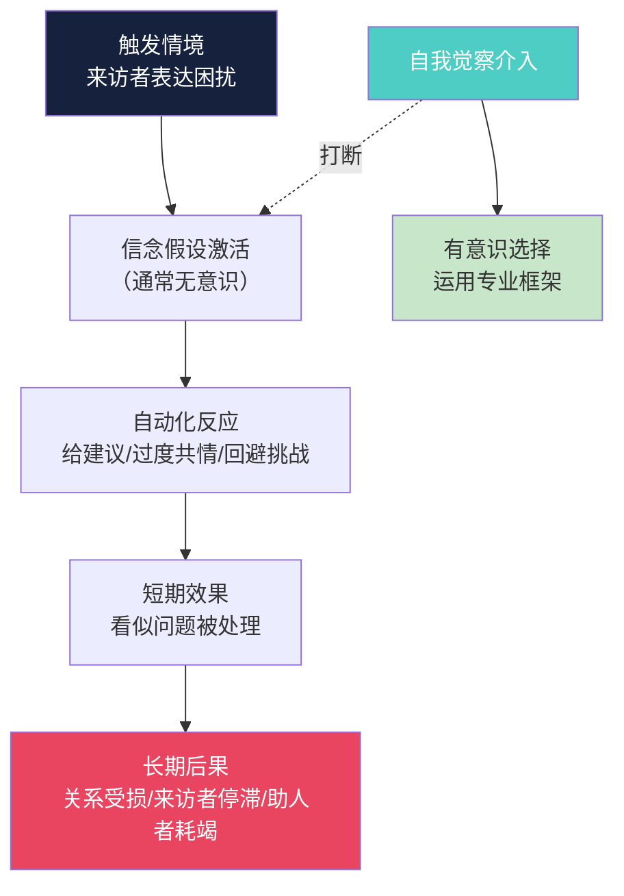
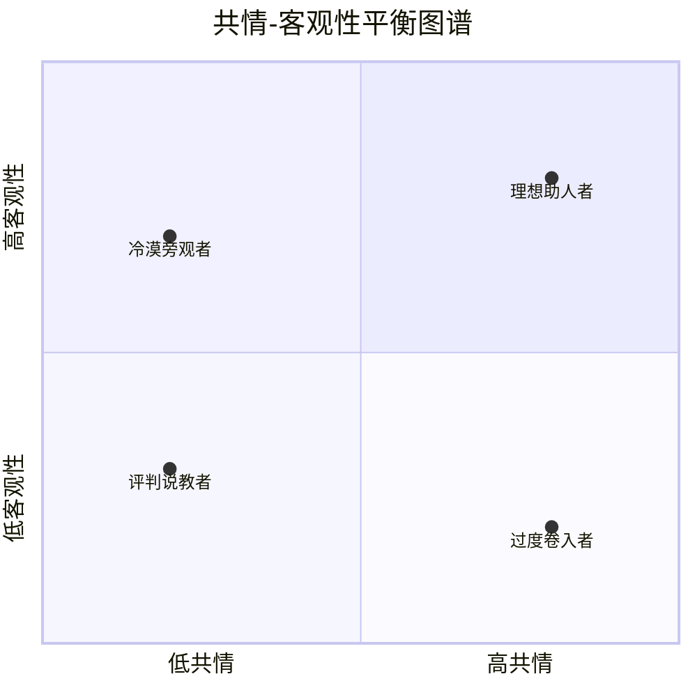
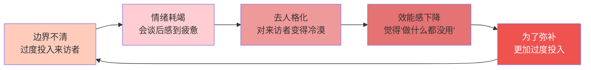
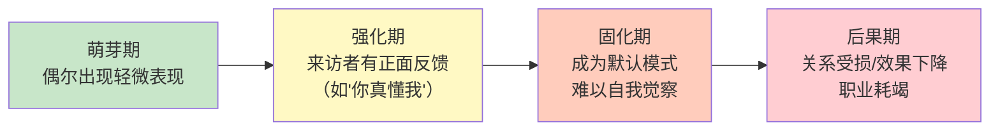
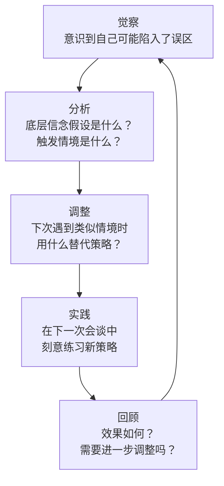

# 第二十一章 咨询与辅导沟通 - 常见误区

## 总论：误区的本质与识别框架

咨询与辅导沟通中的误区不是简单的"技术失误"，而是**认知框架偏差**的外在表现。一个助人者之所以反复陷入误区，往往不是因为"不知道正确的做法"，而是因为内心深处持有一个有偏差的信念假设。例如：

- 反复给建议的人，内心假设是"我比来访者更知道什么对他好"
- 过度共情的人，内心假设是"让来访者感到舒服是我的首要责任"
- 跳过关系建设直接解决问题的人，内心假设是"效率比关系更重要"

因此，纠正误区的真正路径不是记住"应该怎么做"，而是**觉察并修正底层的信念假设**。

### 误区发生的心理机制

这个流程图揭示了一个关键洞见：**误区的根节点是无意识的信念假设，而非意识层面的知识缺乏**。这就是为什么"知道"正确的做法和"做到"之间存在巨大鸿沟——旧的信念假设会在压力和疲劳时自动激活，覆盖理性认知。

### 八大误区的分类体系

按照误区发生的阶段，可以将常见误区分为三类：

| 阶段 | 误区类型 | 具体误区 | 核心偏差 |
|------|---------|---------|---------|
| **关系建立阶段** | 关系性误区 | 跳过建立关系直接解决问题、边界不清 | 低估关系在改变中的作用 |
| **对话进行阶段** | 技术性误区 | 给建议代替引导、过度共情失去客观性、用自己的经验替代来访者体验 | 对助人角色的误解 |
| **贯穿全程** | 规范性误区 | 忽视保密原则、忽视文化差异、不做评估就干预 | 专业伦理意识薄弱 |

### 误区的叠加效应

实际工作中，误区很少单独出现——它们往往相互强化，形成恶性循环。以下是最常见的误区组合：

| 误区组合 | 典型连锁反应 | 后果升级 |
|---------|------------|---------|
| 给建议 + 跳过关系 | 不建立信任就急于"解决问题"，建议不被采纳，挫败后更加给建议 | 助人者变成"说教者"，来访者脱落 |
| 过度共情 + 边界不清 | 在共情中模糊了角色，发展出朋友关系，丧失客观性 | 双重关系导致咨询失效，助人者耗竭 |
| 不做评估 + 忽视文化 | 跳过评估导致误解来访者的问题本质，加上文化盲区更是雪上加霜 | 严重误诊，甚至造成二次伤害 |
| 以己度人 + 给建议 | 用自己的经历当标准，然后基于"自己经验"给建议 | 建议完全偏离来访者的真实需求 |
| 过度共情 + 回避挑战 | 怕伤害来访者而不敢指出问题，来访者感到舒服但不改变 | 来访者长期停滞，"温水煮青蛙" |

认识到误区的叠加效应非常重要——它解释了为什么有时候"纠正了一个问题但整体效果并没有改善"。**纠错需要系统性，而非零敲碎打。**

下面逐一深入剖析每个误区，包括其表现形式、心理学根源、真实后果、纠正方法、以及已经陷入误区后的恢复策略。

---

## 误区一：给建议代替引导

### 行为光谱

"给建议"不是一个二元行为——它有程度之分。以下是从轻到重的五个层级：

| 层级 | 表现 | 来访者感受 | 干预程度 |
|------|------|-----------|---------|
| 1. 信息提供 | "关于这个问题，有一种方法叫XX" | 获取了新信息 | 最低 |
| 2. 经验分享 | "我之前遇到类似情况时，试过XX" | 感到被理解，但可能觉得不适用 | 轻度 |
| 3. 建议暗示 | "有些人发现XX很有效" | 隐约感到被引导 | 中度 |
| 4. 直接建议 | "你应该尝试XX" | 感到被指导，自主性受挫 | 重度 |
| 5. 替代决策 | "你必须这样做" | 感到被控制，可能产生抗拒 | 最重 |

关键点在于：**层级1和2在特定情境下是合理的**——例如心理咨询师提供心理教育信息、导师分享行业经验、咨询师提供专业方案。问题出在层级4和5：当助人者以"给建议"替代"引导探索"作为默认模式时，就构成了误区。

### 为什么这是误区：四个心理学机制

**1. 自我决定理论（Self-Determination Theory）的视角**

Deci和Ryan（1985, 2000）的研究表明，人类有三个基本心理需求：自主性（Autonomy）、胜任感（Competence）和归属感（Relatedness）。当助人者直接给建议时，来访者的自主性需求被侵犯——"你告诉我该怎么做"隐含的信息是"你自己想不出来"。即使建议是正确的，来访者的执行动力也会降低，因为他们不是这个方案的"作者"。

**2. 归因理论的视角**

如果来访者按照助人者的建议行动，成功了会归因于"你的建议好"，失败了会归因于"你的建议不好"。无论哪种结果，来访者都不会建立自我效能感。而如果是自己想出的方案，成功了会增强"我能解决问题"的信念，即使失败了也能从中学到"这个方法不适合我"。

**3. 认知加工深度的视角**

心理学家Craik和Lockhart（1972）的加工层次理论指出，信息被深度加工时，记忆和理解更加持久。当来访者通过自己的思考得出结论时，这个结论经过了深度加工；当直接听到建议时，信息停留在浅层加工，很难转化为真正的行为改变。

**4. 投射偏差的视角**

Kahneman（2011）指出，人们倾向于假设他人的心理状态与自己相同（投射偏差）。助人者给出的建议往往基于自己的经验框架、价值观和问题解决模式，而非来访者的独特处境。即使助人者经验丰富，这种"自我参照"式的建议也经常偏离来访者的真实需求。

### 真实场景案例

**场景**：一位职业教练与客户的对话

**误区版本：**

> 客户："我不知道该不该跳槽到那家创业公司。"
> 教练："创业公司风险太大了，我建议你留在现在的公司，争取内部转岗到你感兴趣的部门。"
> 客户："但是我觉得现在的公司晋升空间有限……"
> 教练："那你先拿到那边的offer再走，不要裸辞。"
> 客户："嗯……好吧。"（内心：他根本不理解我的处境。）

**后果分析**：
- 客户感觉自己被"教训"了，后续不再分享真实想法
- 教练给出的建议基于自己的风险偏好，而非客户的价值观（客户可能更看重成长机会而非稳定性）
- 客户即使接受建议，执行时也会感到"这不是我想要的"，动力不足
- 下次会面时，客户可能编造"进展顺利"来回避教练的判断

**引导版本：**

> 客户："我不知道该不该跳槽到那家创业公司。"
> 教练："你对这个机会最吸引你的是什么？最让你犹豫的又是什么？"
> 客户："吸引我的是能从零开始搭建一个产品线，犹豫的是收入可能不稳定。"
> 教练："听起来这是一个'成长机会'和'安全感'之间的权衡。在你的人生优先级中，这两者通常怎么排？"
> 客户："我一直把成长放在第一位……其实我已经有答案了。"

**效果对比**：引导版本中，客户通过自己的思考做出了决定，教练没有给出任何建议，但客户获得了更大的清晰感和行动动力。

### 动机式访谈：替代"给建议"的系统方法

动机式访谈（Motivational Interviewing, MI）是Miller和Rollnick（1983, 2013）开发的一种协作性对话风格，专门用于激发来访者自身的改变动机，是"引导"代替"给建议"的最佳系统化方法。MI的核心精神可以用四条原则概括：

**1. 共情性倾听（Express Empathy）**

不是"我理解你"这句话，而是通过准确反映（reflecting）来展示理解。关键是反映来访者话语背后的情感和意义，而非简单复述：

> 来访者："我知道应该戒烟，但就是做不到。"
> 低级反映："你说你知道该戒烟但做不到。"（鹦鹉学舌）
> 高级反映："你在理智和习惯之间被撕扯——你的头脑说'要戒'，但你的身体说'放不下'。"（抓住背后的意义和张力）

**2. 发展矛盾（Develop Discrepancy）**

帮助来访者看到"现状"与"期望的自我"之间的差距。不是助人者指出矛盾，而是让来访者自己发现：

> 教练："你希望三年后成为一个什么样的人？"
> 客户："我希望成为一个能独立带团队的技术领导者。"
> 教练："那你觉得现在的工作方式，有哪些方面在朝这个方向走，哪些在背离？"
> 客户："嗯……我花了太多时间在写代码上，没有主动承担带人的机会……"

注意：教练没有说"你应该多带人"——矛盾是客户自己看到的。

**3. 顺应阻力（Roll with Resistance）**

当来访者表现出抗拒时（"但是"、"你不懂"、"这个行不通"），MI不正面硬刚，而是将抗拒转化为探索的机会：

> 来访者："运动减压？我每天忙得连觉都不够睡，哪有时间运动？"
> 给建议者的反应："哪怕10分钟也行，你可以试试……"（继续推销建议）
> MI的反应："你说的很实际——时间确实是一个真实的约束。在你目前的生活中，有什么缝隙是可以利用的吗？还是说时间问题只是一个表面，背后还有其他的阻力？"

**4. 支持自我效能（Support Self-Efficacy）**

强化来访者已有的能力和过往的成功经验，而非暗示"你不行，我来帮你"：

> "你之前成功度过了那个困难时期，当时你是怎么做到的？"
> "你说自己'做不到'，但我听你描述的时候发现，你其实已经做了很多准备工作——这说明你比你以为的更有行动力。"

**MI的核心技巧——OARS：**

| 技巧 | 英文 | 具体操作 | 示例 |
|------|------|---------|------|
| 开放式提问 | Open-ended Questions | 用"什么/如何/能否描述"提问，避免是/否问题 | "什么让你觉得这个改变是必要的？" |
| 肯定 | Affirmations | 认可来访者的努力、优势和意愿 | "你能正视这个问题，本身就需要勇气。" |
| 反映式倾听 | Reflective Listening | 用比来访者的话语稍深一层的方式反映 | "所以这不只是一个工作问题，更是一个关于你人生方向的困惑。" |
| 总结 | Summarizing | 将来访者的表达串联成连贯的叙述 | "让我确认一下我理解对了——你面临的核心矛盾是……" |

### 何时给建议是合理的

给建议本身不是错误，关键在于**时机和前提条件**：

| 条件 | 是否可以给建议 | 理由 |
|------|:------------:|------|
| 来访者明确要求信息/建议 | ✅ | 尊重来访者的自主选择 |
| 已经充分探索了来访者的想法 | ✅ | 来访者的思考已经先行 |
| 涉及安全/法律/伦理的紧急事项 | ✅ | 不伤害原则优先 |
| 来访者卡在某个技术性问题上 | ✅ | 提供专业信息而非代替决策 |
| 来访者还没有充分表达 | ❌ | 信息不足就给建议大概率不适用 |
| 来访者正在情绪高涨/低落时 | ❌ | 情绪状态影响判断，建议容易被误用 |
| 助人者自己有强烈情绪反应 | ❌ | 可能是投射而非专业判断 |

### 已经陷入误区后如何恢复

如果你意识到自己一直在给建议，以下步骤可以逐步纠偏：

1. **坦诚承认**："我注意到刚才我一直在给建议，这可能不是最有帮助的方式。我们换一个角度——你自己觉得可以怎么做？"
2. **归还主动权**："让我先听听你的想法，我来帮你一起梳理。"
3. **改变提问习惯**：将"你应该……"句式替换为"你考虑过……吗？"、"你觉得……怎么样？"、"如果……你会怎么想？"
4. **设置提醒**：在会谈笔记的顶部写上"问，别说"，作为视觉提醒
5. **录音自检**：回听自己的会谈录音，计算"我说的话"和"来访者说的话"的比例。理想的助人对话中，来访者的发言量应占60%-70%以上。如果你的发言量超过50%，很可能正在给过多建议

---

## 误区二：过度共情失去客观性

### 共情-客观性平衡模型

共情和客观性不是对立关系，而是需要动态平衡的两个维度。以下模型展示了四种状态：

**冷漠旁观者**：保持了客观性，但缺乏共情连接。来访者感到"这个人不理解我"，不会敞开心扉。

**评判说教者**：既缺乏共情又缺乏客观性——所谓的"客观"其实是个人偏见的包装。来访者感到"被批判"。

**过度卷入者**：有共情但失去了客观性。这是本误区讨论的核心。来访者感到"你站在我这边"，短期内很舒服，但长期缺乏促进改变的挑战和新视角。

**理想助人者**：同时具备高共情和高客观性。来访者感到"这个人既理解我，又能给我新的视角"。这是修炼的目标。

### 过度共情的五种具体表现

**1. 站队效应**：在来访者描述人际冲突时，自动站到来访者一边，附和"他太过分了"、"你不应该承受这些"。这会强化来访者的受害者身份，阻碍他们看到自己在冲突中的责任。

**2. 情绪共振**：来访者哭你也想哭，来访者愤怒你也感到愤怒。这种情绪感染（emotional contagion）说明你没有保持"仿佛"的距离——罗杰斯强调的"as if"品质。

**3. 回避挑战**：因为"怕伤害来访者的感受"而不敢指出矛盾和盲点。William Miller（动机式访谈创始人）明确指出："如果只是一味接纳，来访者可能会感到被理解，但不会改变。"

**4. 过度保护**：当来访者表达要面对某个困难时，助人者过于急切地提供安慰和保护，剥夺了来访者在挑战中成长的机会。

**5. 反移情失控**：来访者的经历触发了助人者自身的未完成议题，助人者开始在来访者身上处理自己的问题。

### 过度共情的神经科学解释

神经科学研究（Singer & Klimecki, 2014）区分了两种神经机制：

- **共情性痛苦（Empathic Distress）**：看到他人痛苦时，自己的痛苦矩阵（前脑岛、前扣带回）被激活，产生"我也很痛"的体验。这是情绪感染，会导致回避或过度卷入。
- **慈悲性关怀（Compassionate Concern）**：在理解他人痛苦的同时，激活温暖关怀和帮助动机（腹侧纹状体、眶额叶皮层）。这是建设性的共情。

过度共情的本质是**从慈悲性关怀滑向了共情性痛苦**——助人者不再是"旁观的关怀者"，而变成了"参与者"。

好消息是，研究还发现慈悲性关怀可以通过训练增强。Klimecki等人（2013）的研究表明，仅一天的慈悲冥想训练就能显著改变大脑的激活模式——从痛苦矩阵转向关怀回路。这意味着**过度共情不是一个固定特质，而是可以通过练习修正的模式**。

### 反移情的系统识别

反移情（countertransference）是过度共情中最隐蔽也最危险的形式。以下是六种常见的反移情类型及其识别信号：

| 反移情类型 | 表现 | 内在动力 | 识别信号 |
|-----------|------|---------|---------|
| **过度保护型** | 总想"拯救"来访者，不愿看到来访者痛苦 | 触发了助人者自己未被照顾的记忆 | "只有我能帮TA" |
| **认同型** | 对来访者产生"我们一样"的感觉 | 来访者的经历与助人者相似 | "TA说的就是我的故事" |
| **厌恶型** | 对某些来访者产生莫名的不耐烦或排斥 | 来访者的行为触发了助人者不愿面对的自身特质 | "这个人让我特别烦" |
| **情欲型** | 对来访者产生超出专业关系的情感吸引 | 来访者的某些特质满足了助人者的情感需求 | 期待见某个来访者 |
| **内疚型** | 过度满足来访者的要求，不忍心设定界限 | 助人者对来访者的处境感到"我做得不够" | "TA已经够苦了，我不能再拒绝TA" |
| **教导型** | 以"教"来访者为乐，享受"专家"地位 | 助人者需要被崇拜或认可的感觉 | "TA很需要我的指导" |

**反移情不是"坏"的标志**——它是有价值的信息来源。你对来访者的情绪反应可能在告诉你：这个来访者的议题恰好与助人者的个人议题有共鸣点。关键不在于"消灭"反移情，而在于**识别它、理解它、并确保它不干扰专业判断**。

### 自我检查清单

在每次会谈后，用以下问题进行自我反思：

| 检查项 | 信号 | 如果"是" |
|--------|------|---------|
| 我是否对来访者的冲突对方产生了强烈的负面情绪？ | 站队效应 | 可能已经失去客观性 |
| 我是否在会谈后感到特别疲惫或情绪低落？ | 情绪感染 | 需要检查自己的情绪边界 |
| 我是否刻意回避了某些可能让来访者不舒服的话题？ | 回避挑战 | 检查关系中是否有"讨好"模式 |
| 我是否觉得"只有我能理解这个来访者"？ | 反移情 | 立即寻求督导 |
| 我是否在会谈中想到自己的类似经历？ | 自我参照 | 需要区分自己的议题和来访者的议题 |
| 我是否对来访者的进步感到"比自己进步还高兴"？ | 过度投入 | 可能已经模糊了专业边界 |

### 纠正方法

**1. 建立"双重意识"**

成熟的助人者在会谈中同时维持两个频道：一个是"参与频道"——全身心投入来访者的世界；另一个是"观察频道"——像一个站在旁边的第三方，观察着这段对话的动态。后者的存在确保你不会完全被卷入。

训练方法：在日常生活中练习。例如，与朋友聊天时，有意识地观察"我现在的情绪是什么？对方的情绪是什么？我在多大程度上被带入了？"这种日常练习会增强你在专业会谈中保持双重意识的能力。

**2. 规律督导**

定期接受专业督导（supervision），让督导者帮你识别你对特定来访者的情绪反应模式。很多时候，过度共情的信号只有旁观者才能看到。

**督导中讨论反移情的有效方法——呈报框架**：

> "我在和这个来访者工作时，注意到自己有一种[具体情绪反应]。这种感觉让我在会谈中[具体行为变化]。我猜这可能与我自己的[个人议题]有关。我想听听你的观察——你看到我在会谈中的哪些反应可能是反移情？"

这种呈报方式的好处：它既展示了自我觉察，又开放地邀请督导的观察，而非防御性地等待督导"指责"。

**3. 会谈后的"卸载仪式"**

建立一套会谈后的情绪处理程序：
- 3分钟深呼吸或正念冥想，将注意力从来访者身上回到自己
- 简短写下"这个会谈中我被触发了什么"
- 物理性地"离开"会谈空间——起身走动、喝杯水
- 提醒自己："这是来访者的旅程，不是我的"

**4. 支持与挑战的黄金比例**

研究表明（Kluger & DeNisi, 1996），有效的助人关系中，支持性回应与挑战性回应的比例约为3:1到5:1。如果你发现自己在连续多次会谈中完全没有挑战，可能是过度共情的信号。

一个实用的自我检测方法：在会谈笔记的右侧留一栏，每次做出"支持性回应"画一个"+"，"挑战性回应"画一个"-"。会谈结束后数一数——如果全是"+"，说明你可能在过度共情。

---

## 误区三：忽视保密原则

### 为什么保密是咨询关系的基石

保密不仅仅是"伦理规范中的一个条款"，它有深层的心理学功能：

**1. 信任的先决条件**：来访者之所以愿意暴露自己最脆弱的部分（羞耻、恐惧、秘密），前提是确信这些内容不会被泄露。如果保密被破坏一次，信任就不可逆转地受损——正如谚语所说，"信任像一张纸，一旦皱了，即使抚平也恢复不了原样"。

**2. 安全空间的基础**：心理咨询室被设计为一个"安全容器"（safe container），保密是这个容器的围墙。没有围墙的容器无法盛装任何东西。

**3. 治疗效果的保障**：大量研究（如Barnett & Shale, 2012）表明，来访者对保密性的感知直接影响其自我暴露的深度，而自我暴露的深度是预测治疗效果的重要因素。

### 保密的法律和伦理框架

不同国家和地区对保密的法律规定不同，但以下原则是普遍适用的：

| 保密原则 | 说明 | 典型例外 |
|---------|------|---------|
| 默认保密 | 所有咨询内容默认保密 | 有明确例外时可以突破 |
| 知情同意 | 首次会谈时必须说明保密范围和例外 | 必须用来访者能理解的语言 |
| 最小披露 | 突破保密时只披露必要的最小信息 | 不能"顺便"分享无关内容 |
| 记录安全 | 咨询记录必须妥善保管 | 电子记录需要加密 |
| 督导讨论 | 在督导中讨论案例时隐去可识别信息 | 使用化名或编号 |

### 保密例外的五种情况

以下情况需要突破保密原则，但必须遵循"最小披露"原则——只向必要的人员透露必要的信息：

**1. 即时自杀风险**：来访者有明确的自杀计划、手段和意图。需要评估风险等级——有自杀意念但无计划不需要突破保密，但有计划和手段时必须采取行动。

**2. 即时他杀风险**：来访者表达了对特定人员的伤害意图。在美国，这被称为"Tarasoff义务"（源于1976年加州Tarasoff案），助人者有义务警告被威胁的人。

**3. 儿童/老人/残障人士虐待**：大多数地区有强制报告法律，助人者有义务向相关机构报告疑似虐待。

**4. 法院依法调取**：法院发出传票要求提供咨询记录。

**5. 来访者书面同意**：来访者自愿签署同意书，允许将信息分享给指定人员（如医生、家人）。

### 首次会谈中如何说明保密原则

以下是标准化的保密说明话术模板：

> "在我们开始之前，我想说明一下保密原则。今天以及之后我们所有的对话内容都是保密的，我不会向任何人透露你在这里分享的内容。但有几种例外情况需要你知道：
>
> 第一，如果你表达了伤害自己的具体计划，我有责任采取措施确保你的安全，这可能包括联系你的紧急联系人或医疗机构。
>
> 第二，如果你表达了伤害特定他人的意图，我有义务提醒可能受到伤害的人。
>
> 第三，如果涉及到未成年人的虐待或忽视，我需要按照法律要求向相关机构报告。
>
> 第四，如果法院依法要求，我可能需要提供相关信息。
>
> 除此之外，你在这里说的一切都是保密的。你对这些有什么疑问吗？"

**说明技巧**：
- 使用"你"而非"来访者"，让说明更具个人相关性
- 用清晰简单的语言，避免专业术语
- 说完后留出提问空间，确认来访者理解
- 不要急于跳过这个环节——对于信任敏感的来访者，这可能是决定他们是否愿意继续的关键

### 保密在督导和团队讨论中的处理

当在督导或案例讨论中谈论来访者时：

- 使用化名或编号，不使用真名
- 删除所有可识别的个人信息（公司名、部门、具体日期等）
- 只讨论与专业议题相关的内容
- 确保讨论环境安全（如不在公共场合讨论案例）

### 数字时代的保密挑战

在线咨询、数字化记录和社交媒体的普及，给保密带来了前所未有的新挑战：

**1. 在线咨询的平台安全**

视频会议平台是否端对端加密？录制的会谈存储在哪里？谁有权访问？许多助人者使用Zoom、腾讯会议等通用平台进行在线咨询，但这些平台的数据安全措施可能不满足咨询保密的专业标准。

**检查清单**：
- 咨询平台是否端对端加密？
- 会谈录制文件的存储位置和访问权限？
- 是否在知情同意中说明了在线沟通的技术限制？
- 备用方案是什么（如网络中断时的联系方式）？

**2. 电子记录的安全**

电子病历系统、邮件通信、即时消息记录——每一个数字触点都可能成为保密漏洞。助人者需要确保：
- 咨询记录存储在加密的系统中
- 不通过普通邮件发送含有来访者信息的内容
- 手机中的来访者联系方式需要有独立的密码保护
- 咨询笔记不存储在云同步的笔记本（如印象笔记、Notion）中，除非确认有专业级加密

**3. 社交媒体的边界**

来访者可能在社交媒体上搜索助人者的个人信息，助人者也可能无意中暴露来访者的信息。一个常见的疏忽是在朋友圈或微博上分享"今天有个来访者的故事让我很触动"——即使没有指名道姓，当来访者看到时仍可能感到被侵犯。

**4. 紧急情况下的保密突破**

当来访者在非工作时间（如深夜）通过微信发来自杀信息，助人者面临一个两难：回复可能模糊边界，不回复可能忽视风险。处理原则是：
- 在首次会谈中就说明："如果你在非工作时间发来紧急信息，我会在看到后尽快回复。如果涉及人身安全，我可能需要联系你的紧急联系人。"
- 保存紧急联系人信息，并定期更新

---

## 误区四：跳过建立关系直接解决问题

### 治疗联盟的力量：研究证据

为什么"关系"如此重要？不是因为它听起来温暖，而是因为**研究反复证明，治疗联盟（therapeutic alliance）是预测咨询效果的最强单一因素**。

- Horvath等人（2011）的元分析（覆盖200多项研究）发现，治疗联盟质量与效果之间的相关系数为0.28——解释了约8%的结果变异，在心理咨询研究中属于"大效应量"
- Wampold（2015）的分析表明，治疗联盟对效果的贡献超过了具体流派技术的差异——也就是说，一个关系良好的"非特异性"治疗可能比一个关系不佳的"金标准"治疗更有效
- Norcross和Lambert（2018）在《心理治疗关系》一书中的综合分析确认，关系因素占治疗效果变异的12%，远超具体技术因素的1%
- Flückiger等人（2018）的最新元分析（涉及超过30,000名来访者）进一步确认：联盟质量每提升一个标准差，效果量提升约d=0.57，这一效果在不同流派中高度一致

**更关键的发现是关于"联盟破裂"的研究**：Safran和Muran（2000）的研究表明，超过50%的咨询关系会出现联盟破裂（alliance rupture）——表现为来访者退缩、配合假象、直接对抗或突然脱落。但**成功修复的破裂比从未破裂的关系更能促进改变**，因为修复过程本身就是一个治愈性体验——来访者学会了"关系可以承受冲突"。

### 治疗联盟的四个维度

Bordin（1979）提出的治疗联盟模型包含三个核心维度，后被扩展为四个：

| 维度 | 定义 | 具体表现 |
|------|------|---------|
| **情感联结** | 来访者与助人者之间的信任和安全感 | 来访者愿意暴露脆弱，感到被接纳 |
| **目标一致** | 双方对咨询目标达成共识 | 来访者觉得"这就是我想解决的" |
| **任务认同** | 双方认同实现目标的方法 | 来访者觉得"这样做有意义" |
| **角色清晰** | 双方明确各自的角色和责任 | 来访者知道"我该做什么，你会做什么" |

### 没有关系基础就干预的后果

**来访者的内心独白**：
> "这个人一上来就问我有什么问题，然后就开始给我分析原因、提建议。他根本不知道我是谁，也不关心我——他只是在完成一个'咨询流程'。我不想告诉他真正的原因，反正说了他也不会理解。"

**具体后果**：
1. **信息封锁**：来访者只提供表面问题，不暴露核心议题
2. **配合假象**：来访者表面上同意建议，实际上不会执行
3. **提前脱落**：来访者在2-3次会谈后终止咨询，原因不明
4. **效果无法持续**：即使短期内有改善，长期来看缺乏维持改变的动力

### 联盟破裂的识别与修复

联盟破裂往往不易察觉——来访者很少直接说"我不信任你"或"你让我不舒服"。更常见的信号是：

| 破裂类型 | 来访者的外在表现 | 来访者的内在体验 |
|---------|---------------|----------------|
| **退缩型** | 回答变得简短、被动配合、"你说得对" | "说了也没用"、"TA不会理解" |
| **顺从型** | 过度配合、不质疑、"好的好的" | "不想得罪TA"、"快点结束吧" |
| **对抗型** | 挑战助人者的能力、质疑方法、迟到/取消 | "TA凭什么指导我" |
| **话题回避** | 反复聊安全话题、回避核心议题 | "这个话题不安全" |

**修复步骤**：

1. **觉察**：注意会谈氛围的微妙变化——来访者突然变得冷淡、配合过度、或者开始迟到
2. **邀请**：温和地邀请来访者表达感受："我注意到今天的对话有些不同，你对我们的会谈有什么感觉？"
3. **倾听**：全身心倾听来访者的反馈，不辩护、不解释
4. **承认**：如果你确实做了让来访者不舒服的事，坦诚承认："你说得对，我之前那样说可能让你感到被忽视了。"
5. **协商**：共同讨论如何调整："你希望我们接下来的对话方式有什么不同？"

**一个破裂修复的完整案例**：

> 教练（注意到来访者连续两次迟到，回答变得简短）："我注意到你最近两次来得比以前晚，而且今天的对话感觉有点不一样。我想直接问你——你对我们之间的工作方式有什么想法？"
>
> 来访者（犹豫）："嗯……我觉得上次你让我列优先级的练习……我不太确定对我有没有用。"
>
> 教练："谢谢你告诉我。你觉得那个练习哪里不太合适？"
>
> 来访者："我感觉你在告诉我应该先做什么……但我的问题不是不知道优先级，而是做不到。"
>
> 教练："我理解了——上次我聚焦在'知道'的层面，但你的挑战在'行动'的层面。这是我的失误。我们一起来看看，什么样的方式能更好地帮到你？"

这段对话成功修复了联盟，因为：教练注意到了信号、直接询问、不辩护、承认自己的失误、邀请共同协商。

### 关系建设的实操框架

**前三次会谈的关系建设重点：**

| 会谈次数 | 关系建设重点 | 具体行为 |
|---------|------------|---------|
| 第1次 | 安全感和信任 | 说明保密原则、表达无条件接纳、放慢节奏、不急于深入 |
| 第2次 | 理解和共情 | 准确反映来访者的情感、验证来访者经历的合理性、展示深度倾听 |
| 第3次 | 协作和方向 | 共同设定目标、协商工作方式、建立"我们是一起的"的感觉 |

### 快速建立关系的七种微技术

**1. 温度检查（Temperature Check）**：会谈开始时，花2分钟询问来访者当下的状态。"今天过得怎么样？来这里的路上顺利吗？"这些看似闲聊的问题实际上在传达："我关心你这个人，不只是你的问题。"

**2. 回忆连接**：记住并提及上次会谈中的细节。"你上次提到的那个项目进展怎么样了？"这种记忆力传递的信息是"你对我很重要，我认真对待你说的每一件事"。

**3. 姓名使用**：适当使用来访者的姓名（在中文语境中需要注意文化习惯），增加个人连接感。

**4. 同步非语言信号**：适度模仿来访者的语速、音量和身体姿态（镜像效应），这在潜意识层面建立亲近感。

**5. 共同点发现**：如果来访者提到你也有共鸣的经历，可以适度分享（但要控制篇幅，以来访者为中心）。

**6. 前期焦虑正常化**："第一次来咨询，很多人会觉得不知道该说什么，这完全正常。"正常化降低羞耻感。

**7. 赋权开场**："今天的对话，你最有发言权。你想从哪里开始？"赋权增加来访者的控制感和安全感。

---

## 误区五：用自己的经验替代来访者的体验

### 这个误区的认知心理学根源

**1. 锚定效应（Anchoring Effect）**

助人者一旦将自己的经历作为"参照锚点"，就会不自觉地用这个锚来评估来访者的处境。"我当年比你还难，挺一挺就过去了"——这句话背后是用助人者的"挺过去了"作为标准，而来访者的真实感受被边缘化。

**2. 可得性偏差（Availability Bias）**

助人者更容易回忆起自己经历过的、情感强度大的事件，并将其作为理解来访者的框架。但个体差异意味着，同一个事件对不同人的冲击可能完全不同。

**3. 虚假一致性效应（False Consensus Effect）**

人们倾向于假设他人在类似情境下会有和自己相似的反应。助人者可能假设"如果我遇到这种情况我会怎样"就等于"来访者应该怎样"，忽略了价值观、性格、环境等差异。

### 实时觉察："以己度人"的预警信号

这个误区特别难以自我觉察，因为它伪装成"共情"。以下是区分"真共情"和"以己度人"的关键信号：

| 表面看起来是共情 | 实际是以己度人 | 区分标准 |
|---------------|--------------|---------|
| "我完全理解你的感受" | 实际在用自己类似经历的感受替代 | 真共情会跟随来访者的节奏，而非假设已经知道 |
| "你当时一定很难过" | 按自己的反应方式推测对方 | 真共情会询问而非假设："你现在是什么感受？" |
| "如果是我，我也会……" | 以自己为参照系 | 真共情不引入自己的参照系 |
| "我以前也这样，后来……" | 认为相似经历=相同感受 | 真共情认识到个体差异 |
| "你应该感到骄傲" | 告诉来访者"应该"有什么感受 | 真共情接纳来访者的实际感受，包括"不应该"有的 |

**一个快速自检技巧**：在会谈中，如果你发现自己内心在说"我当年……"或"如果是我……"，这很可能就是以己度人的开始。此时立刻提醒自己："这是TA的故事，不是我的。"

### 自我暴露的正确使用方式

自我暴露不是完全禁止的——适度的自我暴露可以增强信任感和正常化来访者的体验。但有明确的使用规则：

| 条件 | 适度自我暴露 | 不当自我暴露 |
|------|------------|------------|
| **目的** | 服务于来访者的需要 | 服务于助人者的表达欲 |
| **篇幅** | 简短（1-2句话） | 长篇讲述自己的故事 |
| **时机** | 来访者需要正常化或希望知道"不是只有我这样" | 来访者正在表达自己的经历时 |
| **焦点** | 最终回到来访者身上 | 停留在助人者的经历上 |
| **频率** | 偶尔使用 | 频繁使用 |

**适度自我暴露的示例：**

> 来访者："我觉得自己很差劲，别人都比我强。"
> 咨询师："这种'不如别人'的感觉很普遍——我有时也会有类似的自我怀疑。不过重要的是，你现在愿意探索这种感受，这本身就需要勇气。能告诉我，'比别人差'这个想法通常在什么时候最强烈？"

**不当自我暴露的示例：**

> 来访者："我觉得自己很差劲，别人都比我强。"
> 咨询师："我理解你。我以前也是这样，刚入行的时候，看到同事一个个升职，我焦虑得失眠了半年。后来我开始跑步，每天早上五公里，慢慢就好了。你也可以试试运动。"

后者的问题：焦点转移到了咨询师身上，来访者变成了倾听者；直接给建议（"你可以试试运动"）；假设来访者的焦虑来源与咨询师相同。

### "以客户为专家"的核心理念

教练心理学的一个核心原则是"以客户为专家"（the client is the expert on their own life）。这句话不是客套，而是一个操作性原则：

- **你**了解咨询技术、理论框架和通用的人类心理规律
- **来访者**了解自己的具体处境、价值观、过往经历、现实约束和真实需求

两者的结合才能产生有效的干预。助人者的工作不是"替来访者想出答案"，而是"帮助来访者调动自己的智慧找到答案"。

---

## 误区六：忽视文化差异

### 文化差异的系统化理解框架

Hofstede（1980, 2001）的文化维度理论是理解文化差异最广泛使用的框架之一。在咨询与辅导中，以下维度的影响尤为关键：

| 文化维度 | 表现 | 对咨询的影响 |
|---------|------|------------|
| **个人主义 vs 集体主义** | 决策以个人利益还是群体和谐为标准 | 来访者的目标可能是"让家人满意"而非"追求个人梦想" |
| **权力距离** | 对权威和等级的接受程度 | 高权力距离文化中，来访者可能不会质疑助人者的建议 |
| **不确定性规避** | 对模糊和不确定的容忍度 | 高不确定性规避文化中，来访者可能更希望明确的指导 |
| **长期导向 vs 短期导向** | 关注即时结果还是长期积累 | 影响来访者对"改变速度"的预期 |
| **沟通风格** | 直接vs间接，高语境vs低语境 | 影响来访者表达需求和冲突的方式 |

### 中国文化语境中的特殊考量

在中国文化背景下做咨询与辅导，需要特别注意以下几点：

**1. 面子文化**：来访者可能因为"面子"而不愿暴露真实困境。直接问"你有什么问题"可能得到的是"我没什么大问题"的防御性回答。更有效的方式是通过一般性讨论（如"最近工作压力大吗"）逐渐引导。

**2. 关系取向**：中国来访者更倾向于在关系框架中理解问题——"我和领导的关系"、"我和孩子的关系"。咨询师需要理解，这种关系取向不是"缺乏独立性"，而是文化价值观的体现。

**3. 对权威的期待**：在中国文化中，来访者可能期待助人者扮演"专家"角色——给出明确建议和指导。完全的"非指导性"方法可能让来访者感到"这个咨询师什么都不会"。需要在引导与适度指导之间找到文化适配的平衡点。

**4. 情绪表达方式**：中国文化中情绪表达往往更含蓄、更间接。"还好"可能意味着"非常不好"，"有点烦"可能意味着"极度痛苦"。咨询师需要对语言的"高语境"特征保持敏感。

**5. 躯体化表达**：在一些中国文化背景下，心理困扰更容易通过身体症状表达——"胸口闷"、"头疼"、"睡不好"——而非直接说"我焦虑"或"我抑郁"。咨询师不应简单地将躯体症状归因于"心理问题"，而应同时尊重来访者的表达方式并温和地探索心理层面。

**6. 家庭系统的影响力**：在中国文化中，家庭系统的影响力远超西方个人主义文化。来访者的决策往往需要考虑父母、配偶、子女的感受和期望。"我想辞职创业"在中国文化语境中可能隐含"但父母不会同意"。咨询师需要将家庭系统纳入评估框架。

**7. "忍"的文化基因**：中国文化中有"忍一时风平浪静"的价值观。来访者可能把长期忍耐当作美德，对"表达不满"或"设定界限"有道德层面的抗拒。咨询师需要帮助来访者区分"健康的情绪调节"和"有害的情绪压抑"，而非简单地鼓励"勇敢表达"。

### 数字文化与代际差异

除了传统意义上的文化差异，**数字文化**也在塑造新的沟通模式：

**代际数字文化差异**：

| 维度 | 数字原住民（90后/00后） | 数字移民（70后/80前） | 对咨询的影响 |
|------|---------------------|-------------------|------------|
| **自我表达** | 习惯通过文字、表情包、弹幕表达情感 | 更习惯面对面语言表达 | 年轻来访者可能在线上更开放 |
| **注意力模式** | 碎片化、多媒体、快节奏 | 线性、深度、慢节奏 | 传统50分钟会谈对年轻人可能过长 |
| **权威观** | 更平等、更质疑权威 | 更尊重权威 | 年轻来访者可能更主动挑战助人者 |
| **求助方式** | 习惯搜索答案、看测评、看知乎 | 更信任"专家" | 年轻来访者可能带着网上搜到的"自诊"来 |
| **隐私观** | 习惯在社交媒体分享生活 | 更注重隐私 | 保密的敏感度不同 |

助人者需要意识到，代际差异不仅影响沟通方式，还影响对"什么是有帮助的"的定义——年轻来访者可能更看重"被理解"和"平等对话"，而非"权威指导"。

### 文化敏感性的自我提升路径

| 路径 | 具体方法 |
|------|---------|
| **知识积累** | 阅读跨文化心理学文献，了解不同文化群体的价值观和沟通习惯 |
| **经验接触** | 主动与不同文化背景的人交流，参加跨文化培训 |
| **自我反思** | 觉察自己的文化偏见——"我对这个行为的判断是否基于我的文化框架？" |
| **来访者教育** | 尊重来访者为"自己文化的专家"，直接询问"在你的文化/家庭中，人们通常怎么看这件事？" |
| **文化谦逊** | 保持学习和好奇的姿态，承认自己不可能完全理解另一种文化 |

---

## 误区七：不做评估就干预

### 评估为什么是第一步

想象一个医生在没有做任何检查的情况下就开药——这在医疗领域是不可接受的，在咨询与辅导中同样如此。评估是干预的前提，原因有三：

**1. 确定问题的本质**：来访者描述的"问题"可能只是冰山一角。一个说"最近心情不好"的人，可能面临的是轻度适应障碍，也可能是重度抑郁症甚至双相情感障碍。不同性质的问题需要完全不同的干预方式。

**2. 识别风险因素**：来访者可能没有主动提及自杀意念、自伤行为或虐待经历，但这些风险因素可能通过评估被发现。跳过评估可能遗漏致命的风险信号。

**3. 了解资源和限制**：有效的干预方案需要考虑来访者的内在资源（应对技能、自我效能感）、外在资源（社会支持、经济条件）和限制因素（身体状况、环境约束）。不了解这些，任何方案都是纸上谈兵。

### 不做评估的真实后果

**场景**：一位管理者找到教练，说"团队士气低落，我想学激励技巧"。

**不做评估直接干预的教练**：
> "好，我来教你几个激励团队的方法。首先是OKR目标管理法……其次是每周一对一面谈……还有就是定期团建……"
>
> 三个月后，管理者反馈："方法都用了，但团队情况没有改善。"

**问题分析**：教练没有评估团队士气低落的真正原因。实际上，团队士气低落的根本原因是公司最近裁员，员工感到不安全——在这种情况下，OKR和团建不仅无效，反而可能被员工视为"管理层在粉饰太平"。真正的干预方向是帮助管理者处理团队的信任危机。

**充分评估后干预的教练**：
> "你提到团队士气低落。在我们讨论方法之前，我想多了解一些情况。'士气低落'具体表现在哪些方面？是从什么时候开始的？当时发生了什么？你观察到哪些信号？团队成员有没有直接表达过什么？"
>
> （通过评估发现核心问题是信任危机）
>
> "我听到的是，团队的信任基础受到了动摇。在这种情况下，激励技巧可能不是最优先的——恢复信任才是。我们一起来看看，有哪些具体的行动可以帮助重建信任。"

### 全面评估的五个维度

| 评估维度 | 核心问题 | 评估方法 |
|---------|---------|---------|
| **问题评估** | 问题是什么？持续多久？严重程度？对生活的影响？ | 开放式提问、标准化量表（如PHQ-9、GAD-7） |
| **历史评估** | 类似问题的历史？以前的应对方式和效果？家族史？ | 时间线绘制、详细访谈 |
| **风险评估** | 自杀/自伤风险？他杀风险？虐待风险？ | Columbia自杀风险评估量表（C-SSRS）、直接询问 |
| **资源评估** | 支持系统？应对技能？经济条件？身体健康？ | 生态图绘制、优势清单 |
| **动机评估** | 改变的意愿和准备程度？对咨询的期望？ | 变化阶段模型评估、尺度问题 |

### 核心评估工具详解

**1. PHQ-9（患者健康问卷-9项）**

PHQ-9是最广泛使用的抑郁筛查工具，由9个条目组成，每个条目0-3分，总分0-27分。它不仅是筛查工具，还能帮助来访者"量化"自己的感受：

| 分数范围 | 抑郁程度 | 建议处理方式 |
|---------|---------|------------|
| 0-4 | 无或极轻微 | 关注和支持 |
| 5-9 | 轻度 | 观察和随访，考虑咨询 |
| 10-14 | 中度 | 建议心理咨询，考虑药物治疗 |
| 15-19 | 中重度 | 心理咨询+药物治疗 |
| 20-27 | 重度 | 转介精神科，药物治疗为主 |

**关键提醒**：PHQ-9是筛查工具，不是诊断工具。分数高不代表"确诊"，分数低也不代表"没问题"。它应该与临床访谈结合使用。

**2. GAD-7（广泛性焦虑量表-7项）**

GAD-7用于评估焦虑症状的严重程度，7个条目，每个0-3分，总分0-21分。0-4分为正常，5-9分为轻度焦虑，10-14分为中度，15-21分为重度。

**3. 变化阶段模型（Transtheoretical Model, TTM）**

Prochaska和DiClemente（1983）提出的六阶段模型，用于评估来访者的改变准备程度：

| 阶段 | 来访者的典型表达 | 适配的干预方式 |
|------|---------------|-------------|
| **前意向期** | "我没有问题" | 提高意识，不急于推动改变 |
| **意向期** | "我可能有点问题，但还没想好怎么办" | 探索矛盾，发展改变动机 |
| **准备期** | "我准备做些改变" | 协助制定具体计划 |
| **行动期** | "我正在改变" | 支持行动，处理障碍 |
| **维持期** | "我已经改变了，需要保持" | 预防复发，巩固成果 |
| **终止期** | "这已经不是问题了" | 回顾成长，处理其他议题 |

**如果跳过评估直接给"行动期"的干预，而来访者实际在"前意向期"，干预必然失败。**这就像对一个不觉得自己需要减肥的人说"你应该少吃多运动"——不仅无效，还会引发防御。

**4. 常用的快速评估问题**

当标准化量表不适用时（如教练场景），以下问题可以在5-10分钟内完成核心评估：

- **问题界定**："你来这里的最主要的原因是什么？用1-10分衡量，这个问题对你的影响有多大？"
- **时间线**："这个问题是什么时候开始的？在那之前发生了什么？"
- **尝试与效果**："你已经尝试过哪些方法？效果如何？"
- **支持系统**："在你的生活中，有哪些人知道你面临这个挑战？他们的反应是什么？"
- **风险筛查**："在你描述的这些困难中，有没有感到绝望或觉得活着没意思的时候？"
- **改变意愿**："如果10分代表'我完全准备好改变'，1分代表'我还没准备好'，你现在在几分？"

### 风险评估的具体操作

风险评估是所有评估中最关键也最容易被跳过的。以下是自杀风险评估的具体步骤：

**第一步：直接询问**

很多助人者担心直接问"你有没有想过自杀"会"暗示"来访者产生自杀念头。但研究表明（Gould et al., 2005），直接询问不仅不会增加自杀风险，反而会降低焦虑——因为来访者感到"终于有人愿意谈论这个话题了"。

**推荐话术**："在你描述的这些困难中，有些人会想到结束自己的生命。你有过这样的想法吗？"

**第二步：评估风险等级**

| 风险等级 | 表现 | 干预措施 |
|---------|------|---------|
| 低风险 | 有自杀意念，但无计划、无手段、无意图 | 持续关注，制定安全计划 |
| 中风险 | 有自杀意念，有模糊计划，但无确定手段 | 加强关注，考虑告知紧急联系人 |
| 高风险 | 有明确计划、手段、时间，且有即刻意图 | 立即采取保护措施，转介精神科 |

**第三步：制定安全计划**

安全计划（Safety Plan）是Stanley和Brown（2012）开发的结构化干预工具，包含六个步骤：
1. 识别预警信号（"什么想法/感受出现时，说明我可能陷入危机？"）
2. 内部应对策略（"我可以做什么让自己平静下来？"）
3. 分散注意力的社交场所和活动
4. 可以联系的人（朋友、家人）
5. 可以联系的专业资源（危机热线、急诊）
6. 环境安全化（移除致命手段）

---

## 误区八：边界不清

### 专业边界的功能

专业边界不是"冷漠"或"不够人性化"，它有三个核心功能：

**1. 保护来访者**：边界防止来访者被助人者的个人需求所利用。助人者-来访者关系中存在天然的权力不对称——来访者处于脆弱状态，对助人者有依赖性。如果边界模糊，这种不对称可能被（有意或无意地）滥用。

**2. 保护助人者**：边界防止助人者过度卷入导致耗竭。没有边界感的助人者容易把所有来访者的痛苦都扛在自己身上，最终走向职业倦怠。

**3. 保护专业关系**：边界确保咨询关系的"纯净性"——它存在的唯一目的是服务于来访者的福祉。当边界被打破（如发展出朋友关系或商业关系），这个唯一目的就会被其他利益稀释。

### 边界与职业倦怠的恶性循环

边界不清与职业倦怠之间存在一个危险的正反馈循环：

Maslach和Leiter（2016）的研究表明，**边界不清是导致助人行业职业倦怠的首要可预防因素**。一个每周工作50小时但边界清晰的助人者，比一个每周工作35小时但边界模糊的助人者更不容易倦怠。

**三个职业倦怠的预警信号**：

1. **身体信号**：慢性疲劳、失眠、频繁生病、肌肉紧张
2. **情绪信号**：会谈前感到烦躁、对来访者的痛苦感到麻木、"我不想再听到这些了"
3. **行为信号**：拖延会谈记录、频繁取消督导、开始在工作时间刷手机

当三个信号同时出现时，说明边界已经严重受损，需要立即采取行动。

### 六类边界及其处理

| 边界类型 | 危险信号 | 正确处理 |
|---------|---------|---------|
| **关系边界** | 来访者邀请你参加私人聚会、要求加微信 | 解释专业关系的性质，保持专业渠道沟通 |
| **时间边界** | 来访者经常超时、在非工作时间发消息 | 明确会谈时间框架，非紧急事务在下次会谈讨论 |
| **自我暴露边界** | 来访者频繁追问你的私人生活 | 简短回应后将焦点转回来访者："这让我好奇你为什么想了解这个？" |
| **身体接触边界** | 来访者想拥抱你、拍你的肩膀 | 温和设定界限，解释身体接触在专业关系中的含义 |
| **礼物边界** | 来访者送来贵重礼物 | 说明助人者接受礼物的政策，探讨礼物对来访者的意义 |
| **数字边界** | 来访者在社交媒体上关注你、评论你的动态 | 在首次会谈时说明社交媒体政策，建议不在社交平台互动 |

### 中国文化语境中的边界特殊挑战

在中国文化背景下，边界管理比西方语境更加复杂，因为许多在西方被视为"边界违反"的行为，在中国文化中是正常的社交礼仪：

**1. 礼物的文化含义**

在中国文化中，送礼是一种表达感谢和尊重的正常行为。如果助人者以西方标准"一律拒绝"，可能让来访者感到被拒绝甚至被羞辱。处理方法：

- 了解当地的职业规范和机构政策
- 如果礼物价值低且出于真诚感谢（如一盒水果），可以接受并表达感谢，同时探讨礼物的意义
- 如果礼物价值高或有"收买"嫌疑，温和地探讨："我收到你的礼物感到温暖。同时我想了解——你送这个礼物的时候，心里在想什么？"
- 在首次会谈中主动说明自己的礼物政策："有些人会带小礼物表达感谢，我理解这是你的心意。如果你送了礼物，我可能会和你聊聊它对你意味着什么。"

**2. 关系网络的渗透**

中国的"关系"文化意味着来访者和助人者之间可能存在多重关系——朋友的朋友、同一小区的邻居、孩子在同一所学校。完全避免多重关系在小城市几乎不可能。处理原则：

- 承认多重关系的存在，而非假装它不存在
- 在知情同意阶段主动讨论可能遇到的多重关系
- 明确区分"专业角色"和"社会角色"，让来访者知道"在这个房间里，我是你的咨询师；在其他场合，我们的互动方式可能不同"
- 当多重关系可能严重影响咨询效果时，转介给其他助人者

**3. 家长式关系期望**

一些来访者可能期待助人者扮演"长辈"或"权威"角色——"你比我有经验，你就告诉我怎么做吧"。完全拒绝这种期望可能让来访者失望，但完全接受又会模糊边界。平衡之道：

- 承认来访者的期望："我理解你希望得到明确的指导。"
- 温和地重新定义角色："同时，我更希望做的是帮你找到属于你自己的答案——因为你的答案才是最能持久的。"
- 在适当的时候提供适度的方向性指导，但始终将主动权交给来访者

### 多重关系的处理

多重关系（dual relationships）是边界问题中最复杂的——当来访者同时是你的同事、邻居、孩子的同学家长等。处理原则：

1. **预防优于处理**：如果可能，在知情同意阶段就识别潜在的多重关系，并讨论处理方式
2. **明确告知**：向来访者说明多重关系可能带来的影响（如保密的限制）
3. **转介评估**：评估多重关系是否会影响咨询效果，如果影响严重，应转介给其他助人者
4. **记录在案**：将多重关系及其处理方式记录在案，以便督导审查

### 边界维护的日常自检

每次会谈结束后，花2分钟回答以下问题：

- 今天的会谈中，我是否做了任何"如果被同事看到会觉得不合适"的事？
- 我是否和这个来访者建立了专业关系之外的联系？
- 我是否在利用专业关系满足自己的某种需求（被需要、被认可、被喜欢）？
- 如果这个会谈被全程录像，我会对自己的行为感到舒适吗？
- 我是否为了维护关系而放弃了应该做的挑战或反馈？

---

## 误区的动态识别与纠正系统

### 误区发展的时间轨迹

误区通常不是突然出现的，而是渐进发展的：

**关键干预点在萌芽期**——此时误区表现轻微，容易纠正。一旦进入固化期，改变需要更大的意志力和外部支持。

### 新手助人者的特有误区模式

新手助人者（从业1-3年）有一些独特的误区模式，与经验丰富者不同：

| 误区模式 | 表现 | 根源 | 纠正方向 |
|---------|------|------|---------|
| **理论先行** | 总想着"这个情况用哪个理论"，而非真正倾听 | 对自己能力的不自信，用理论作为"安全网" | 先放下理论，练习"纯粹的倾听" |
| **过度结构化** | 严格按照流程提问，失去自然对话感 | 对"犯错"的恐惧，用结构化来降低焦虑 | 接受"不完美"，练习灵活性 |
| **模仿师父** | 完全照搬督导/老师的风格 | 还没有找到自己的风格 | 探索自己的助人风格，整合而非模仿 |
| **完美主义** | 对每次会谈都感到"做得不够好" | 不切实际的自我期望 | 接受"足够好"而非"完美" |
| **角色困惑** | 不确定自己是"朋友"还是"专家" | 专业身份尚在建立中 | 通过督导明确自己的专业角色 |

新手助人者特别容易陷入"过度共情+回避挑战"的组合误区——因为建立信任对新手来说已经很有挑战性，所以更倾向于"讨好"来访者以维持关系，而非冒险做可能引起不适的挑战。**这不是能力问题，而是发展阶段的正常表现**——关键是有督导支持和刻意练习来突破。

### 综合自我反思框架

定期使用以下系统性反思问题，覆盖八大误区的每个维度：

**关系维度**（误区四、八）
- 我是否在每次会谈中都投入时间建立和维护关系？
- 我与来访者之间的边界是否清晰？

**技术维度**（误区一、二、五）
- 我是以引导为主还是以给建议为主？
- 我的共情是否保持了适当的客观性？
- 我是否尊重了来访者的独特体验？

**规范维度**（误区三、六、七）
- 我是否严格遵守了保密原则？
- 我是否考虑了文化因素的影响？
- 我是否在充分评估后才开始干预？

### 误区纠正的"三步反思循环"

### 寻求外部反馈的结构化方法

仅靠自我觉察难以发现所有盲点。结构化的外部反馈可以弥补这一缺陷：

| 反馈来源 | 反馈方式 | 频率 | 关注点 |
|---------|---------|------|--------|
| **专业督导** | 一对一督导，呈报案例录音或逐字稿 | 每周或每两周 | 整体专业表现、反移情、技术选择 |
| **同行督导** | 同辈小组案例讨论 | 每月 | 不同视角的解读、替代方案 |
| **来访者反馈** | 会谈结束时简短反馈问卷（如SRS量表） | 每次会谈 | 来访者对关系和方向的实时感知 |
| **录音回顾** | 回听自己的会谈录音 | 每月 | 无意识的行为模式、语言习惯 |

**来访者反馈系统的建立**：

Session Rating Scale (SRS) 是一个4题的快速反馈工具，每次会谈结束时花1分钟完成：

1. 在今天的会谈中，你感觉被理解的程度（0-10分标尺）
2. 我们讨论的话题与你关心的问题的相关程度（0-10分标尺）
3. 你喜欢今天会谈的方式/方法吗（0-10分标尺）
4. 总体来说，今天的会谈对你有多大的帮助（0-10分标尺）

如果总分低于某一阈值（如28分/40分满分），说明联盟可能出现了问题，需要在下一次会谈开始时主动探讨。

### 持续成长的终身学习路径

咨询与辅导是需要终身学习的专业领域。避免误区不是一次性目标，而是持续的修炼过程：

**短期（每月）**：
- 回顾1-2次会谈录音，识别自己的模式
- 阅读1篇相关文献或专业书籍章节
- 参加1次同行案例讨论

**中期（每季度）**：
- 参加1次工作坊或培训
- 完成1次全面的自我评估
- 与督导讨论自己的成长方向

**长期（每年）**：
- 参加1个系统性的专业发展课程
- 评估自己在八大误区上的变化
- 更新自己的理论框架和技术工具箱

---

## 误区总结与行动清单

### 八大误区速查表

| 误区 | 一句话识别信号 | 一句话纠正方向 |
|------|-------------|-------------|
| 给建议代替引导 | "你应该……" 说得比问得多 | 先问后说，引导来访者自主生成方案 |
| 过度共情失去客观性 | 你比来访者还激动/难受 | 保持"双重意识"：参与+观察 |
| 忽视保密原则 | 在公共场合讨论案例细节 | 保密是默认状态，例外需明确说明 |
| 跳过关系建设 | 第一次会谈就开始分析问题 | 前30%的时间用于关系建设 |
| 以己度人 | "我以前也这样，你应该……" | 以客户为专家，保持好奇和开放 |
| 忽视文化差异 | 用单一文化标准评判来访者行为 | 文化谦逊：保持学习和好奇 |
| 不做评估就干预 | 听完问题就给方案 | 先全面评估，再制定干预计划 |
| 边界不清 | 和来访者发展多重关系 | 清晰的专业边界保护双方 |

### 核心信念校准

纠正误区的根本路径是校准底层信念。以下是每个误区对应的信念修正：

| 误区 | 有偏差的信念 | 修正后的信念 |
|------|------------|------------|
| 给建议 | "我比来访者更知道什么对他好" | "来访者是自己问题的专家，我帮助他调动自己的智慧" |
| 过度共情 | "让来访者舒服是我的首要责任" | "真正的帮助有时需要不舒服的真相" |
| 忽视保密 | "这只是随便聊聊，不必那么严格" | "保密是信任的地基，一次泄露不可逆" |
| 跳过关系 | "效率比关系重要" | "关系本身就是最大的干预技术" |
| 以己度人 | "我们的经历差不多" | "每个人的世界都是独特的" |
| 忽视文化 | "大家都差不多" | "文化塑造了看待世界的透镜" |
| 不做评估 | "我听了五分钟就知道怎么回事了" | "表面之下永远有更多" |
| 边界不清 | "多关心一点没关系" | "清晰的边界是对双方最大的保护" |

记住，避免误区不仅是技术问题，更是**专业态度和价值观的体现**。每一次觉察到自己陷入了某个误区，都是一次成长的机会——因为觉察本身就意味着你已经开始了从"无意识不胜任"到"有意识不胜任"的转变，而这是通向"有意识胜任"的必经之路。
