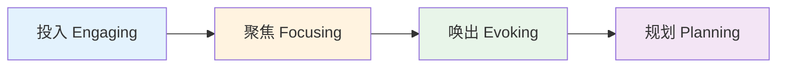
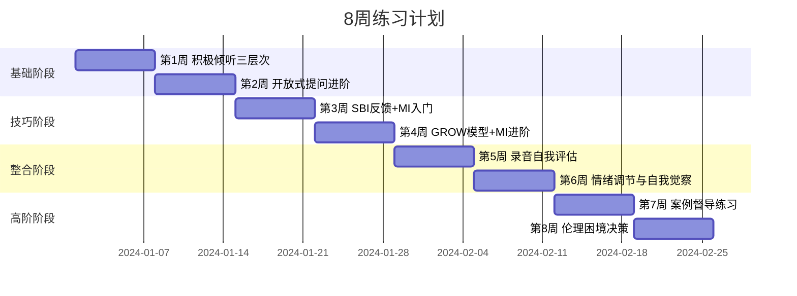

# 第二十一章 咨询与辅导沟通 - 练习方法

## 为什么练习方法本身需要方法论

咨询与辅导沟通是一项高阶复合技能——它同时调动倾听、提问、共情、反馈、结构控制等多种能力，并要求在高压的人际情境中实时协调。单纯"知道"技巧不等于"会用"，正如知道游泳的力学原理不等于能在水中自如行动。安德斯·艾利克森（K. Anders Ericsson）的刻意练习理论指出，专业能力的提升需要满足四个条件：**明确的目标**、**即时的反馈**、**在舒适区边缘挑战**、**大量的重复**。本章提供的练习方案严格遵循这四个原则，确保每一分钟的练习都转化为真实的能力增长。

### 技能习得的四个阶段

任何咨询沟通技能的成长都经历以下四个阶段，了解自己处于哪个阶段有助于选择合适的练习策略：

| 阶段 | 特征 | 典型表现 | 练习策略 |
|------|------|---------|---------|
| 无意识无能力 | 不知道某项技巧存在 | 用封闭式提问却不自知 | 观察优秀案例、阅读理论 |
| 有意识无能力 | 知道该怎么做但做不到 | 知道要共情但说出来像审讯 | 分解练习、单项突破 |
| 有意识有能力 | 刻意控制时能做到 | 专注时能用好GROW模型 | 模拟场景、录音回放 |
| 无意识有能力 | 自然流畅地运用 | 不用想就能做出恰当回应 | 真实实践、督导反思 |

大多数初学者在完成理论学习后处于"有意识无能力"阶段。以下练习的目标是推动你从这个阶段进入"有意识有能力"，最终在持续实践中达到"无意识有能力"。

### 刻意练习的核心原则

在开始具体练习之前，请牢记以下原则，它们决定了练习的质量上限：

1. **专注而非重复**：心不在焉地做100次不如全神贯注地做10次。每次练习都要有明确的关注焦点。
2. **反馈闭环**：没有反馈的练习是在固化错误。每次练习必须包含反馈环节——来自同伴、录音、或自我评估。
3. **舒适区边缘**：练习难度要略高于当前能力水平。太简单没有成长，太困难导致挫败。如果练习感觉"有点难但努力能做到"，就对了。
4. **即时复盘**：练习后立即回顾比隔天回顾效果好3倍以上（Ericsson, 1993）。趁记忆新鲜时记录感悟。
5. **刻意而非自然**：在"有意识有能力"阶段，你的表现可能比不刻意时更生硬，这是正常的。刻意控制是通往自然流畅的必经之路。

### 练习前自评：定位你的起点

在开始8周练习计划之前，花10分钟完成以下自评。这不是考试，而是帮你定位起点、追踪进步的基准线。诚实作答——自欺欺人只会浪费练习时间。

**自评量表**（1=完全不会，3=偶尔能做到，5=稳定做到）：

| 技能维度 | 自评(1-5) | 具体描述 |
|---------|----------|---------|
| **倾听专注** | | 在对方说话时，我能全程集中注意力，不走神想自己要说什么 |
| **准确复述** | | 对方说完后，我能用自己的话准确总结核心内容 |
| **情感识别** | | 我能听出对方话语中的情绪信号，不只是事实信息 |
| **情感反映** | | 我能用语言准确反映对方的情感状态，让对方感到被理解 |
| **开放式提问** | | 我习惯用开放式问题引导对话，而非用封闭式问题做确认 |
| **问题深度** | | 我的问题能引导对方从表面思考深入到价值观和信念层面 |
| **结构化对话** | | 我能用GROW等框架组织一次完整的教练对话 |
| **SBI反馈** | | 我能用具体情境-行为-影响的结构给出反馈 |
| **情绪觉察** | | 在对话中，我能觉察自己的情绪反应并管理它 |
| **沉默耐受** | | 对方沉默时，我能等待而不急于填补空白 |
| **伦理敏感** | | 我能识别对话中可能出现的伦理边界问题 |
| **自我反思** | | 我有定期回顾自己对话表现的习惯 |

**评分解读**：

- **12-24分（起步阶段）**：建议先完成每项练习的基础版本，放慢节奏，重质不重量
- **25-36分（成长阶段）**：基础已有，重点突破薄弱项，可按标准8周计划推进
- **37-48分（进阶阶段）**：基础扎实，重点放在复杂场景和高级变体，可适当加速
- **49-60分（精通阶段）**：已有丰富经验，重点放在督导他人和专业认证准备

**保存这份自评**，在第4周和第8周各做一次，对比进步。

---

## 练习一：GROW模型模拟对话

### 练习目的

GROW模型（Goal-Reality-Options-Will）是最经典的教练对话框架，由约翰·惠特莫尔（John Whitmore）在《高绩效教练》中系统化。本练习通过模拟对话掌握GROW模型的四个阶段，培养结构化教练对话的节奏感和问题链设计能力。

### 前置知识检验

开始练习前，确认你已理解以下概念（对应本章01-理论基础和02-核心技巧）：

- GROW四个字母分别代表什么
- 每个阶段的核心任务和常见陷阱
- 开放式提问与封闭式提问的区别
- 什么是"引导而非指导"

### 练习准备

- **人数**：两人一组，一人扮演教练（Coach），一人扮演客户（Coachee）
- **场景卡**：准备3-5个真实或模拟的挑战情境（见下方场景库）
- **计时器**：每轮对话15-20分钟，建议手机计时
- **评估表**：打印或准备GROW对话评估表（见下方模板）
- **录音设备**：可选但强烈建议

### 场景库

以下场景由易到难排列，初学者从简单场景开始，逐步过渡到复杂场景：

| 难度 | 场景名称 | 描述 |
|------|---------|------|
| ⭐ 入门 | 时间管理困扰 | 客户总是加班，想找到更好的工作节奏 |
| ⭐ 入门 | 学习新技能 | 客户想学习一门新技术但不知道从哪开始 |
| ⭐⭐ 进阶 | 职业转型犹豫 | 客户在当前岗位和新机会之间难以抉择 |
| ⭐⭐ 进阶 | 团队冲突调解 | 客户需要处理与同事的长期矛盾 |
| ⭐⭐⭐ 高阶 | 创业决策压力 | 客户在是否辞职创业的问题上反复纠结 |
| ⭐⭐⭐ 高阶 | 工作生活平衡 | 客户在家庭期望和职业追求之间严重撕裂 |

### 练习步骤

#### 第一阶段：目标设定（Goal）—— 5分钟

教练的任务是帮助客户将模糊的愿望转化为清晰、具体、可衡量的目标。关键不是替客户定义目标，而是通过提问让客户自己说出目标。

**核心问题链**（按顺序使用，根据客户回答灵活调整）：

1. "你希望在这次对话结束时带走什么？" —— 聚焦对话目标
2. "这个目标对你个人而言为什么重要？" —— 探索内在动机
3. "你用什么具体标准来判断目标是否达成？" —— 使目标可衡量
4. "这个目标是你可以控制的吗？" —— 检验目标的可控性
5. "如果我们用一句话概括你的目标，你会怎么说？" —— 锁定目标表述

**初学者常犯的错误**：

- ❌ 直接给建议："你应该设一个SMART目标" → 客户失去自主性
- ❌ 目标过于宏大："我想成为更好的人" → 无法衡量，无法行动
- ❌ 跳过动机探索直接进入现状分析 → 后续阶段缺乏动力支撑

**纠正方法**：如果客户给出模糊目标，用"具体来说是什么意思？"追问3次以上，直到目标足够清晰。

#### 第二阶段：现状分析（Reality）—— 5分钟

教练的任务是帮助客户客观、全面地审视当前处境，发现自己可能忽略的资源和障碍。这个阶段最容易变成"教练提问、客户汇报"的单向输出，要注意保持对话的互动性。

**核心问题链**：

1. "目前的情况具体是怎样的？如果用数字来描述，会是什么？" —— 量化现状
2. "你已经尝试过哪些方法？效果如何？" —— 了解已有努力，避免重复建议
3. "有哪些资源是你已经拥有但可能没有充分利用的？" —— 发现隐性资源
4. "什么因素在阻碍你？哪些是你能控制的，哪些不能？" —— 区分可控与不可控
5. "如果让你的同事/朋友描述你的现状，他们会怎么说？" —— 引入多视角

**进阶技巧——情感探测**：

在事实层面的信息收集得差不多时，加入情感层面的探索：

- "当你想到这个现状时，身体有什么感觉？"
- "这个情况中，最让你难受的是什么？"

情感信息往往比事实信息更能揭示真正的障碍和动机。

#### 第三阶段：方案探索（Options）—— 5分钟

教练的任务是激发客户的创造性思考，扩展选择空间。这个阶段的核心原则是**先发散后收敛**——先不评判地列出所有可能方案，再评估筛选。

**核心问题链**：

1. "你目前想到了哪些可能的做法？全部列出来，不管靠不靠谱。" —— 发散
2. "如果没有任何限制——钱、时间、能力都不是问题，你会怎么做？" —— 突破思维限制
3. "你认识的人中，谁遇到过类似情况？他们是怎么处理的？" —— 借鉴他人经验
4. "反过来想：哪些做法肯定行不通？为什么？" —— 逆向思维排除
5. "在这些方案中，哪一个你直觉上最想尝试？" —— 初步收敛

**关键陷阱**：

- ❌ 教练暗示自己的偏好："你有没有考虑过X方案？"（其实教练心中已有答案）
- ❌ 过早评判方案可行性："这个不太现实吧"（扼杀创造性）
- ❌ 只找到一个方案就开始讨论（缺乏比较基础）

**正确做法**：坚持列出至少3个方案后再进入评估。如果客户说"我想不到其他办法了"，用沉默等待15秒，或者问"如果你最好的朋友遇到这事，你会建议他怎么办？"

#### 第四阶段：行动计划（Will）—— 5分钟

教练的任务是帮助客户将选定的方案转化为具体、有时限、可追踪的行动步骤。这个阶段决定对话是否真正产生改变——没有行动承诺的对话只是一次愉快的聊天。

**核心问题链**：

1. "基于我们刚才的讨论，你决定采取什么行动？" —— 确认行动方案
2. "具体的第一步是什么？什么时候做？在哪里做？" —— 行动具体化
3. "你用什么方式衡量自己在推进？" —— 进度追踪机制
4. "可能遇到什么障碍？你提前想好怎么应对了吗？" —— 预设应对方案
5. "从0到10分，你对执行这个计划的信心有多少？如果不到8分，是什么在拉低信心？" —— 检验承诺度

**承诺度检验**：

如果客户的信心评分低于8分，不要急于推进。回到Options阶段重新探索，或者在Reality阶段寻找被忽略的障碍。低于8分的行动计划大概率不会被执行。

### 练习评估表

| 评估维度 | 评分（1-5） | 具体观察 |
|---------|------------|---------|
| **目标清晰度** | | 目标是否具体、可衡量、有时间框架？ |
| **现状全面性** | | 是否涵盖了事实、情感、资源、障碍四个层面？ |
| **方案多样性** | | 是否列出了3个以上方案？是否有创造性选项？ |
| **行动具体性** | | 行动步骤是否具体到"何时、何地、做什么"？ |
| **引导质量** | | 教练是在引导还是在指导？问题是否真正开放？ |
| **节奏控制** | | 四个阶段的时间分配是否合理？是否有阶段被跳过？ |
| **倾听质量** | | 教练是否基于客户的回答调整问题？还是机械照读清单？ |
| **总体评价** | | 对话是否产生了清晰的行动承诺？ |

### 练习变体

**变体一：三人模式（推荐）**

增加一名观察者。观察者使用评估表实时记录，对话结束后提供结构化反馈。三人轮换角色，每人都体验教练、客户和观察者。

**变体二：时间压缩版**

将总时长压缩到10分钟，每阶段仅2-3分钟。这迫使教练精练提问，提高问题效率。适用于进阶练习者。

**变体三：录音回放分析**

录音后逐句分析：标记每个问题属于GROW哪个阶段，统计各阶段的时间占比，识别"教练话多还是客户话多"（理想比例是客户占70%以上）。

**变体四：非线性GROW**

在实际对话中，客户经常在讨论Options时突然暴露新的Reality信息，或者在Will阶段发现目标需要修正。练习"在阶段之间灵活跳转"的能力——这比严格按顺序走完全程更接近真实场景。

**变体五：单人自练（无搭档时）**

当找不到练习搭档时，GROW模型仍然可以单独练习：

1. **自我教练**：选择自己面临的一个真实挑战，分别用教练和客户的角色自问自答。用手机录音，之后回听评估自己作为教练的表现
2. **视频分析**：在YouTube或B站搜索"coaching demonstration"或"教练对话示范"，观看专业教练的对话视频，在每个GROW阶段暂停，先写下自己的下一个问题，再对比教练实际问的问题
3. **书面GROW**：用笔记本完成一次完整的GROW对话，左边写客户可能的回答，右边写自己的教练问题。这种"慢动作"练习特别适合初学者建立问题意识
4. **AI模拟**：用AI对话工具（如ChatGPT）模拟客户角色。给AI一个场景设定和性格描述，然后用GROW框架与它对话。结束后让AI评估你的教练提问质量

---

## 练习二：积极倾听三层次练习

### 练习目的

积极倾听是咨询与辅导沟通的基石技能。罗杰斯将"准确的共情性理解"列为治疗性关系的三大核心条件之一。本练习系统训练三个层次的倾听能力：内容倾听（听到了什么）、情感倾听（感受到了什么）、意义倾听（这意味着什么）。

### 理论背景

倾听不是被动地接收声波，而是一个主动的认知-情感加工过程。美国心理学协会将倾听分为三个递进层次：

| 层次 | 关注对象 | 典型语言模式 | 深度 |
|------|---------|-------------|------|
| 内容倾听 | 事实、事件、数据 | "我听到你说的是……" | 表层 |
| 情感倾听 | 情绪状态、感受 | "听起来你感到……" | 中层 |
| 意义倾听 | 价值观、信念、深层需求 | "我感受到这对你意味着……" | 深层 |

大多数未经训练的倾听者停留在内容层次。真正的咨询与辅导需要在三个层次之间灵活切换，尤其不能忽略情感和意义层次。

### 练习准备

- **人数**：两人一组，一人分享，一人倾听
- **时间**：每轮5-10分钟，共3轮，总计20-30分钟
- **话题卡**：选择有情感厚度的话题（见下方）

**推荐话题**（选择分享者真正有感触的）：

- 最近工作中让你感到挫败的一件事
- 一个你做了很久但不确定是否正确的决定
- 与某人之间一直未能解决的矛盾
- 一件你引以为傲但很少有人真正理解的成就

### 练习步骤

#### 第一轮：内容倾听（5分钟）

**倾听者的任务**：只关注事实信息，练习准确复述和总结的能力。

**操作流程**：
1. 分享者讲述3-5分钟
2. 倾听者不打断，做简要关键词笔记
3. 分享结束后，倾听者说："让我确认一下我是否理解正确。你刚才说的是……"
4. 倾听者用自己的话复述核心内容（不逐字重复）
5. 分享者确认或纠正

**评估标准**：
- ✅ 关键事实是否遗漏
- ✅ 是否添加了分享者未说的内容
- ✅ 复述是否简洁（不超过原内容的30%长度）
- ❌ 是否过早加入评价或建议

#### 第二轮：情感倾听（5分钟）

**倾听者的任务**：关注分享者话语中的情感信号，练习情感反映能力。

**操作流程**：
1. 分享者重述同一话题（通常会说得更深入）
2. 倾听者关注：语调变化、语速变化、用词选择、停顿和犹豫
3. 分享结束后，倾听者说："我感受到你在这个事情中……"
4. 倾听者反映听到的情感，使用"情感词汇表"提升准确度

**情感词汇参考**：

| 基础情感 | 细化情感 | 身体信号 |
|---------|---------|---------|
| 愤怒 | 沮丧、恼火、愤慨、不满 | 皱眉、握拳、语速加快 |
| 悲伤 | 失落、惆怅、心酸、遗憾 | 声音低沉、语速变慢 |
| 恐惧 | 焦虑、不安、紧张、担忧 | 犹豫、反复确认 |
| 喜悦 | 满足、欣慰、兴奋、自豪 | 语速加快、声调升高 |
| 困惑 | 迷茫、纠结、矛盾 | 频繁使用"但是""可是" |

**常见错误**：
- ❌ 给情感贴标签而非反映："你不应该生气"（评判）
- ❌ 放大情感："你一定非常愤怒！"（过度解读）
- ❌ 弱化情感："没什么大不了的"（否定感受）

#### 第三轮：意义倾听（5-10分钟）

**倾听者的任务**：捕捉分享者话语背后的深层意义——价值观、信念、核心需求。

**操作流程**：
1. 分享者再次重述同一话题（此时往往会触及深层）
2. 倾听者关注：反复出现的主题、与身份相关的表述、隐含的价值判断
3. 分享结束后，倾听者说："我感受到这个事情对你来说，核心在于……"
4. 倾听者尝试反映深层意义

**意义倾听的提问辅助**：
- "这件事反复出现在你脑海中，你觉得它触动了你的什么？"
- "如果用一个词概括这件事对你的意义，会是什么？"
- "这和你一直以来在乎的什么东西有关？"

**评估要点**：意义倾听不需要100%准确——重要的是打开一扇门，让分享者自己去探索和确认。即使反映不完全准确，这个过程本身也帮助分享者深化了自我理解。

### 三轮练习的进阶整合

完成三轮分离练习后，进行整合练习：倾听者在同一次对话中自由切换三个层次，根据分享者的内容自然地从内容倾听过渡到情感倾听和意义倾听。这更接近真实咨询情境。

### 练习评估

对话结束后，分享者回答以下问题（倾听者不插话，认真记录）：

1. 哪个层次的倾听让你感觉"被真正听到了"？
2. 倾听者的反映中，哪些是准确的？哪些偏离了你的真实感受？
3. 在倾听过程中，有没有哪个瞬间你觉得"他/她真的懂我"？
4. 有没有什么你本来没打算说，但在倾听者的影响下说出来了？

### 单人倾听训练法

没有搭档时，可以通过以下方式单独训练倾听能力：

**播客/访谈分析法**：
1. 选择一档深度访谈节目（如《十三邀》《圆桌派》《TED访谈》）
2. 每隔5分钟暂停，写下三个层次的倾听回应：内容层（嘉宾说了什么）、情感层（嘉宾可能感受到什么）、意义层（这对嘉宾意味着什么）
3. 继续播放，对比嘉宾后续的自我揭示与你的判断
4. 每周分析2-3期节目，一个月后倾听敏锐度会显著提升

**日常对话觉察法**：
1. 在日常对话中（同事聊天、家人通话），有意识地在心里做三层倾听
2. 对话结束后，在手机备忘录中快速记录：对方说了什么事实？表达了什么情感？背后可能是什么需求？
3. 不需要告诉对方你在练习，这只是内在的觉察训练

**情绪日记法**：
每天晚上花5分钟回顾当天最重要的一个对话，用三层倾听框架分析对方的话语。长期坚持会建立"自动三层扫描"的倾听习惯。

---

## 练习三：SBI反馈模型练习

### 练习目的

SBI（Situation-Behavior-Impact）反馈模型由创意领导力中心（CCL）开发，是提供具体、客观、有建设性反馈的黄金标准。本练习通过大量重复，使SBI成为你提供反馈时的默认语言模式。

### 模型详解

| 要素 | 做法 | 避免 |
|------|------|------|
| S - 情境 | 具体到时间、地点、事件 | "上次""之前""经常" |
| B - 行为 | 描述可观察的动作和语言 | 猜测动机、评价人格 |
| I - 影响 | 陈述具体后果和你的感受 | "你总是……""你从不……" |
| N - 下一步 | 提出具体的期望改变 | 模糊的"改进"要求 |

### 练习准备

- **人数**：三人一组——反馈者（Giver）、接收者（Receiver）、观察者（Observer）
- **场景卡**：准备正面和建设性反馈各3个场景
- **SBI工作表**：每人在练习前填写SBI草稿

### 场景库

**正面反馈场景**：

1. 同事在项目截止日前主动加班完成了关键模块
2. 下属在客户会议上用清晰的数据图表展示了方案
3. 团队成员在讨论中主动邀请安静的同事发表意见

**建设性反馈场景**：

1. 同事在邮件中使用了过于直接的语气，引起了跨部门误解
2. 下属提交的报告中有3处数据错误
3. 团队成员在会议中频繁打断他人发言

### 练习步骤

#### 步骤一：SBI草稿撰写（5分钟）

反馈者选择一个场景，填写SBI工作表：

情境（S）：具体描述在什么时间、什么地点、什么情况下
____________________________________________________________

行为（B）：我观察到你做了什么/说了什么（只写可观察的行为）
____________________________________________________________

影响（I）：这个行为产生了什么具体影响（对人、对事、对结果）
____________________________________________________________

我的感受（可选）：这让我感到 ________________

下一步（N，可选）：我希望未来我们可以 ________________

#### 步骤二：面对面反馈（5分钟）

反馈者向接收者口头呈现SBI反馈。注意：

- 语气平和、尊重，不带指责
- 按S-B-I顺序呈现，不要先说影响再解释行为
- 给接收者消化的时间，不要一口气说完
- 如果是建设性反馈，说完后问："你怎么看？"

#### 步骤三：接收者回应（3分钟）

接收者回应反馈：
- 这个反馈是否清晰具体？
- 行为描述是否准确？
- 你是否感到被尊重？
- 你会如何回应这个反馈？

#### 步骤四：观察者点评（3分钟）

观察者从以下维度提供点评：

| 评估维度 | 评分（1-5） | 具体观察 |
|---------|------------|---------|
| 情境具体性 | | 是否有明确的时间、地点、事件？ |
| 行为客观性 | | 是否只描述了可观察行为？是否夹杂评判？ |
| 影响清晰度 | | 影响描述是否具体、可感知？ |
| 语气和态度 | | 是否尊重、不带攻击性？ |
| 平衡性 | | 正面和建设性要素是否平衡？ |

### SBI的高级用法

**SBI-I（增加意图 Intent）**：在描述行为后，加入对对方意图的询问而非猜测。
- ❌ "你故意不回复我的邮件"（猜测意图）
- ✅ "我注意到那封邮件没有收到回复。当时是什么情况？"（询问意图）

**SBI-T（增加期望 Tomorrow）**：在影响之后，明确表达对未来的期望。
- "在昨天的会议中（S），你提前15分钟到场并调试好了设备（B），这让整个会议顺利开始，没有浪费大家的时间（I）。希望以后的重要会议我们都能这样做（T）。"

**双向SBI**：不仅上级给下级反馈，也鼓励下级给上级、同事之间互相反馈。在练习中尝试双向场景。

**SBI用于自我反馈**：SBI同样适用于对自己的行为复盘。在录音回放时，用SBI框架描述自己的表现："在客户表达焦虑时（S），我立刻给出了建议（B），这让客户停止了自我探索（I）。下次我会先反映情感再提问（T）。"这种自我SBI比模糊的"我要做得更好"更有操作性。

### 常见错误与纠正

| 错误类型 | 错误示例 | 纠正方法 |
|---------|---------|---------|
| 评判代替描述 | "你的报告很粗糙" | "报告中有3处数据与源文件不一致" |
| 模糊情境 | "上次开会的时候" | "在上周三下午的产品评审会上" |
| 猜测动机 | "你就是不想配合" | "我注意到方案讨论中你没有提出意见，想了解一下你的想法" |
| 人身攻击 | "你这个人就是不靠谱" | "这次交付延迟了3天" |
| 夸大频率 | "你总是迟到" | "过去两周的晨会中，你有3次在9:05之后到达" |

---

## 练习四：开放式提问进阶练习

### 练习目的

开放式提问是咨询与辅导沟通中最频繁使用的工具。一个好问题可以打开思路、揭示盲区、激发行动力；一个差的问题则可能关闭对话、暗示评判、固化思维。本练习从识别、改写、创造三个维度系统提升提问能力。

### 理论基础：提问的层级

问题不是只有"开放"和"封闭"之分。根据认知深度，提问可以分为六个层级：

| 层级 | 类型 | 功能 | 示例 |
|------|------|------|------|
| 1 | 封闭式 | 获取确认/否认 | "项目完成了吗？" |
| 2 | 事实性开放 | 获取信息 | "项目进展如何？" |
| 3 | 反思性开放 | 促进思考 | "你从这个项目中学到了什么？" |
| 4 | 假设性开放 | 突破思维限制 | "如果资源无限，你会怎么做这个项目？" |
| 5 | 挑战性开放 | 面质矛盾 | "你说想成功，但你的行为似乎在回避风险，你怎么看？" |
| 6 | 转化性开放 | 引发认知转变 | "如果五年后的你回头看今天，他会建议你怎么做？" |

咨询与辅导沟通需要在六个层级之间灵活切换，而非只停留在1-2层。

### 练习准备

- **形式**：可个人练习，也可2-3人小组练习
- **工作表**：准备提问改写工作表
- **计时**：每轮10-15分钟

### 练习步骤

#### 步骤一：封闭式问题识别（5分钟）

判断以下问题属于哪种类型，并标注层级：

| 问题 | 类型判断 | 层级 |
|------|---------|------|
| "你对目前的工作满意吗？" | 封闭式 | 1 |
| "你和团队的关系怎么样？" | 事实性开放 | 2 |
| "这个决定反映了你什么样的价值观？" | 反思性开放 | 3 |
| "如果没有任何风险，你会选择什么？" | 假设性开放 | 4 |
| "你说想改变，但三个月来没有行动，你怎么解释？" | 挑战性开放 | 5 |
| "如果你的生命只剩一年，你还会做现在的工作吗？" | 转化性开放 | 6 |

#### 步骤二：层级升级改写（10分钟）

将每个低层级问题改写为更高层级的问题。要求：改写后的问题必须保持话题相关性，不能变成完全不同的话题。

**练习示例**：

原始问题（层级1）："你想换工作吗？"

| 目标层级 | 改写版本 |
|---------|---------|
| 层级2 | "你对目前工作的哪些方面感到满意，哪些不满意？" |
| 层级3 | "回顾你的职业选择，你发现自己的决策模式是什么？" |
| 层级4 | "如果经济完全不是问题，你会选择什么样的工作？" |
| 层级5 | "你一方面说现在的工作没有发展空间，另一方面又拒绝了两个面试机会，你觉得这中间发生了什么？" |
| 层级6 | "想象你退休那天回顾自己的职业生涯，你希望看到什么样的轨迹？" |

#### 步骤三：情境化提问创造（10分钟）

针对以下情境，分别为每个层级设计一个问题：

**情境一**：一位员工连续三个月绩效下滑，但之前一直是团队骨干

**情境二**：一对合作伙伴在战略方向上存在根本分歧

**情境三**：一位客户在是否接受晋升机会的问题上犹豫不决

#### 步骤四：提问链设计

单独的好问题不够，真正有力的咨询对话需要**问题链**——一系列环环相扣、逐层深入的问题。练习为以下目标设计3-5个问题的提问链：

1. **目标**：帮助客户发现自己真正的职业热情
2. **目标**：引导客户面对一个长期回避的问题
3. **目标**：帮助团队找到冲突的根源

### 提问的禁忌清单

以下问题在咨询与辅导中应严格避免：

| 禁忌类型 | 示例 | 问题所在 |
|---------|------|---------|
| 诱导性提问 | "你不觉得你应该更努力吗？" | 暗示了"正确"答案 |
| 多重提问 | "你对工作怎么看？有什么计划？需要帮助吗？" | 对方不知道先回答哪个 |
| 评判性提问 | "你为什么会做出这种决定？" | 隐含"这个决定是错的" |
| 假装提问 | "你不觉得这样做更好吗？" | 实际上是建议，不是提问 |
| 预设性提问 | "你什么时候开始不再关心这份工作的？" | 预设了"不关心"这个前提 |
| 追问轰炸 | 连续5个以上问题不给对方思考空间 | 像审讯而非对话 |

### 提问的节奏艺术

好的提问不只是内容好，节奏同样重要。以下是控制提问节奏的具体技巧：

**问题之间的沉默**：提出一个深度问题后，给对方5-10秒的思考时间。大多数人在沉默3秒后就会开始给出更深层的回答——前3秒的回答往往只是"热身"。

**追问的时机**：当对方的回答中出现关键词、情感词汇或犹豫时，这是追问的最佳时机。例如对方说"其实我也不知道为什么……"，追问"你说'其实'，是不是有一个你不太确定的原因在脑海里？"

**收放节奏**：不要一直问深度问题（会让对方感到压力），也不要一直停留在表面（缺乏深度）。理想的节奏是"2个表面问题→1个深度问题→1个轻松问题→1个深度问题"。

**收尾问题**：对话结束前的最后一个问题应该是赋能性的，例如："今天聊完之后，你最想记住的一句话是什么？"或"这次对话让你发现了什么新的东西？"

### 练习评估

| 评估维度 | 自评（1-5） | 同伴评分 |
|---------|------------|---------|
| 问题是否真正开放 | | |
| 问题是否引导深度思考 | | |
| 问题是否中立无诱导 | | |
| 问题链是否有逻辑递进 | | |
| 问题是否适合当前关系和情境 | | |

---

## 练习五：动机性访谈（MI）基础练习

### 练习目的

动机性访谈（Motivational Interviewing, MI）由威廉·米勒（William Miller）和斯蒂芬·罗尔尼克（Stephen Rollnick）创立，是一种以来访者为中心的引导式沟通方法，旨在帮助来访者探索和解决矛盾心理，激发内在改变动机。MI广泛应用于健康管理、成瘾治疗、教育辅导和组织发展等领域。本练习训练MI的四大核心技术——OARS，以及变化语言的识别与回应能力。

### 理论基础

MI的核心假设是：**改变的动机存在于来访者内部，咨询师的任务是唤出它，而非植入它**。当来访者自己说出"我需要改变"时，改变的可能性远大于咨询师说"你应该改变"。

MI的四个过程（按顺序推进，但可灵活回退）：

| 过程 | 核心任务 | 关键指标 |
|------|---------|---------|
| 投入 | 建立信任和工作联盟 | 来访者感到被理解和尊重 |
| 聚焦 | 确定对话方向和议题 | 双方对讨论主题达成共识 |
| 唤出 | 激发来访者自身的改变理由 | 来访者说出变化语言 |
| 规划 | 支持来访者制定行动计划 | 来访者对改变有具体承诺 |

### 练习准备

- **人数**：两人一组，一人扮演访谈者，一人扮演来访者
- **时间**：每轮15-20分钟，共2-3轮
- **场景卡**：选择涉及"矛盾心理"的场景（见下方）
- **录音设备**：强烈建议录音用于回放分析

### 场景库

| 难度 | 场景 | 矛盾心理特征 |
|------|------|-------------|
| ⭐ 入门 | 想减肥但管不住嘴 | 知道好处但缺乏行动力 |
| ⭐ 入门 | 想早睡但总刷手机 | 意愿存在但习惯阻碍 |
| ⭐⭐ 进阶 | 想跳槽但害怕不确定性 | 理性想走、情感想留 |
| ⭐⭐ 进阶 | 知道该运动但总找借口 | 价值认同与行为脱节 |
| ⭐⭐⭐ 高阶 | 想戒酒但社交压力大 | 多重障碍交织 |
| ⭐⭐⭐ 高阶 | 想修复婚姻但不愿先低头 | 自尊与关系的深层冲突 |

### 练习步骤：OARS四核心技术

#### 技术一：开放式问题（Open Questions）

开放式问题邀请来访者展开思考，而非用"是/否"结束对话。

**练习任务**：针对同一场景，分别用封闭式和开放式提问，感受差异。

| 封闭式（避免） | 开放式（使用） |
|--------------|--------------|
| "你想减肥吗？" | "你对目前的身体状况怎么看？" |
| "你试过运动吗？" | "你尝试过哪些方法？效果怎么样？" |
| "你觉得自己吃得太多吗？" | "你觉得自己和食物的关系是怎样的？" |

**进阶练习**：用"什么""如何""能告诉我更多吗"开头设计5个开放式问题，覆盖来访者的情感、认知、行为和环境层面。

#### 技术二：肯定（Affirmations）

肯定不是泛泛的表扬（"你很棒"），而是对来访者具体努力、优势和品质的真诚认可。肯定帮助来访者看到自己的能力和资源，增强自我效能感。

**肯定的三个层次**：

| 层次 | 示例 | 效果 |
|------|------|------|
| 表面肯定 | "你能来咨询，说明你很重视这件事" | 认可参与行为 |
| 能力肯定 | "你能在这么困难的情况下坚持工作，说明你有很强的韧性" | 认可内在品质 |
| 深层肯定 | "你愿意面对这个问题而不是逃避，这需要很大的勇气" | 认可价值观和选择 |

**练习任务**：来访者每说完一段话，访谈者练习用一个真诚的、具体的肯定回应。注意：肯定是"看到"而非"评判"——"我注意到你已经尝试了三种方法"比"你做得很好"更有力量。

**常见错误**：
- ❌ 虚假肯定："你一定会成功的！"（空洞，来访者感到不被理解）
- ❌ 否定式肯定："虽然你失败了，但你至少尝试了"（前半句否定了后半句）
- ❌ 过度肯定：每句话都肯定（失去分量，显得不真诚）

#### 技术三：反映性倾听（Reflective Listening）

反映性倾听是MI的核心引擎。它不只是"听"，而是通过反映（reflection）向来访者展示"我理解你"，同时引导来访者深化自我探索。

**反映的四个层次**（由浅到深）：

| 层次 | 做法 | 示例 |
|------|------|------|
| 简单反映 | 复述或稍作重组 | 来访者："我真的很累。" → "你感到非常疲惫。" |
| 复杂反映 | 加入推测，说出来访者未说出口的内容 | "你感到疲惫，可能还有些失望——毕竟你付出了很多。" |
| 双面反映 | 同时反映矛盾的两面 | "一方面你想改变现状，另一方面你又担心改变带来的风险。" |
| 战略性反映 | 选择性反映变化语言 | 来访者："也许我应该试试。" → "你心里有一个声音在说'试试看'。" |

**练习任务**：来访者讲一个有矛盾心理的话题，访谈者只用反映性倾听回应（不提问、不建议、不评判）。持续5分钟。

**评估标准**：
- 反映是否准确捕捉了来访者的核心意思？
- 是否有过度反映（添加了来访者没有表达的内容）？
- 是否有战略性地反映了变化语言？
- 来访者的回应是深化了还是回避了？

#### 技术四：总结（Summaries）

总结是将多个反映打包整合，帮助来访者看到全局。三种总结类型：

| 类型 | 使用时机 | 示例 |
|------|---------|------|
| 收集式总结 | 一段对话后，把来访者说的要点串起来 | "让我确认一下我听到的。你说了三件事：第一……第二……第三……" |
| 连接式总结 | 过渡到新话题时，衔接旧内容 | "你刚才谈到了工作压力，同时你也提到了家庭期望。这两者之间有什么联系吗？" |
| 过渡式总结 | 准备结束对话或转向行动 | "我们今天讨论了很多。你提到的最重要的几点是……接下来你想从哪里开始？" |

**练习任务**：在15分钟的对话中，访谈者至少使用3次不同类型的总结。观察总结后来访者的反应——好的总结应该让来访者点头说"对，就是这样"或补充遗漏的内容。

### 变化语言识别与回应

变化语言（Change Talk）是MI的核心目标——当来访者自己说出改变的理由、愿望、能力和承诺时，改变最有可能发生。

**变化语言的四种类型**：

| 类型 | 含义 | 示例 |
|------|------|------|
| 要求语言（DARN） | 改变的原材料 | |
| - 渴望 Desire | 想要改变 | "我希望自己能更有条理" |
| - 能力 Ability | 相信自己能改变 | "上次我确实坚持了两周" |
| - 理由 Reason | 有具体的改变理由 | "如果我不改，项目可能会延期" |
| - 需要 Need | 感到改变的紧迫性 | "我必须做出改变了" |
| 承诺语言（OATs） | 改变的信号 | |
| - 激活 Activation | 愿意尝试 | "我愿意试试看" |
| - 承诺 Commitment | 做出决定 | "我决定从明天开始" |
| - 采取行动 Taking Steps | 已经在做 | "我已经报名了健身课" |

**练习任务**：在对话中，访谈者练习识别变化语言，用以下方式回应：
1. **反映**：用自己的话反映来访者的变化语言
2. **深入**：用"能多说一些吗""为什么这对你重要"引导来访者深化
3. **强化**：用"你刚才说的非常重要"标记变化语言的价值

**反面语言（Sustain Talk）的处理**：来访者也会说"维持现状"的语言（"改变太难了""我不确定能做到"）。MI的回应不是反驳，而是用双面反映化解："一方面你觉得改变很难，另一方面你也看到了不改变的代价。"

### 练习评估表

| 评估维度 | 评分（1-5） | 具体观察 |
|---------|------------|---------|
| 开放式问题比例 | | OARS中O的使用质量 |
| 肯定的真诚度和具体性 | | 是否停留在表面还是触及能力/品质 |
| 反映的准确度和深度 | | 是否有复杂反映和双面反映 |
| 总结的整合效果 | | 来访者是否感到被完整理解 |
| 变化语言识别率 | | 是否抓住并强化了来访者的变化语言 |
| MI精神的体现 | | 是否做到了合作、唤出、尊重自主 |

### 练习变体

**变体一：MI vs 非MI对比**

同一场景，分别用"直接建议模式"和"MI模式"进行两轮对话。来访者感受两种模式的差异，并分享哪种让自己更有改变的动力。

**变体二：MI在日常对话中的应用**

选择一个非正式场景（如朋友抱怨工作、家人抗拒体检），用MI技术进行对话。体会MI不仅适用于"正式咨询"，也适用于日常人际关系。

**变体三：单人练习**

1. **视频分析**：观看MI教学视频（搜索"motivational interviewing demonstration"），在来访者说完后暂停，先写下自己的反映/问题，再对比专业访谈者的回应
2. **变化语言日记**：在日常对话中识别他人（或自己）的变化语言和反面语言，记录在笔记本中
3. **书面MI**：写一个10分钟的MI对话脚本，确保包含OARS四种技术和至少3处变化语言回应

---

## 练习六：案例督导练习

### 练习目的

案例督导（Clinical Supervision）是咨询与助人专业中最核心的学习方式之一。它将个人实践经验放在集体智慧的熔炉中淬炼，帮助从业者看到自己的盲区、拓展干预思路、提升伦理敏感度。本练习模拟专业督导的流程和规范。

### 督导的理论模型

常用的督导模型包括：

**发展性模型**（Stoltenberg & Delworth）：认为咨询师的成长经历三个阶段——依赖阶段（需要具体指导）、依赖-独立阶段（开始形成自己的风格）、独立阶段（能自主判断和决策）。督导方式应匹配受督者的发展阶段。

**反思性模型**（Rolfe et al.）：三个层次的反思——What?（发生了什么）、So What?（这意味着什么）、Now What?（接下来怎么做）。本练习的流程设计即基于此模型。

### 练习准备

- **人数**：3-5人小组
- **角色分配**：
  - 案例呈现者（Presenter）：1人，带真实或模拟案例
  - 督导者（Supervisor）：1人，经验相对丰富者
  - 小组成员（Group Members）：2-3人
- **时间**：45-60分钟
- **材料**：案例记录模板、督导伦理协议

### 案例记录模板

案例呈现者在练习前填写：

一、基本信息
- 客户（化名）：_____________
- 年龄/性别/职业：_____________
- 咨询/辅导次数：第_____

二、来访原因
- 主诉问题：_____________
- 持续时间：_____________
- 严重程度（1-10）：_____________

三、已使用的技术和方法
- _____________
- _____________
- _____________

四、进展和困难
- 已取得的进展：_____________
- 当前遇到的困难：_____________

五、希望获得督导的问题
1. _____________
2. _____________

### 练习步骤

#### 步骤一：案例呈现（10分钟）

案例呈现者按照模板介绍案例。注意：
- 使用化名，去除可识别信息
- 重点放在督导问题上，不必复述所有细节
- 呈现时如果感到不安，可以暂停——这本身就是有价值的临床数据

#### 步骤二：澄清性提问（5分钟）

小组成员提出澄清性问题（注意：是澄清而非建议）：
- "客户的家庭支持系统是怎样的？"
- "你和客户之间的治疗联盟建立得如何？"
- "客户对改变的动机水平如何？（0-10分）"
- "你有没有注意到自己在对话中的情绪反应？"
- "之前的评估中有没有排除某些诊断？"

**区分澄清性提问和建议性提问**：
- ✅ "客户是怎么描述这个困境的？"（澄清）
- ❌ "你有没有考虑用认知行为的方法？"（建议，留到讨论阶段）

#### 步骤三：小组讨论（15分钟）

小组自由讨论案例，从以下维度展开：

**概念化分析**：
- 如何理解这个案例？可能的理论框架是什么？
- 核心问题是什么？表面问题背后有没有更深层的议题？

**干预策略**：
- 有哪些可能的干预方向？
- 不同流派会如何处理这个案例？
- 最适合当前阶段的1-2个干预是什么？

**过程分析**：
- 咨询关系中发生了什么？有没有平行过程？
- 呈现者的情绪反应说明了什么？
- 反移情的信号是什么？

**伦理考量**：
- 有没有保密性相关的伦理问题？
- 是否存在双重关系或其他伦理边界问题？
- 客户的安全风险评估是否充分？

#### 步骤四：督导者整合反馈（10分钟）

督导者整合讨论内容，提供结构化反馈：

1. **概念化评价**：呈现者对案例的理解是否全面？有没有遗漏的维度？
2. **技术运用评价**：已使用的技术是否恰当？效果如何？
3. **关系质量评估**：治疗联盟是否稳固？如何加强？
4. **具体建议**：下一步可以尝试的具体干预（不超过2-3个）
5. **成长方向**：呈现者在哪些方面有成长？还需要发展什么能力？
6. **伦理提醒**：有没有需要特别注意的伦理问题？

#### 步骤五：呈现者反思与总结（5分钟）

呈现者分享：
- 讨论中最大的收获是什么？
- 哪些观点挑战了你原来的假设？
- 回去后你打算做什么不同的尝试？
- 还有什么悬而未决的问题？

### 示范案例

以下提供两个完整的案例示例，帮助初学者理解案例呈现的标准格式和深度要求：

**示范案例一：职场倦怠**

一、基本信息
- 客户（化名）：小林
- 年龄/性别/职业：32岁/男/互联网产品经理
- 咨询/辅导次数：第3次

二、来访原因
- 主诉问题：持续感到工作没有意义，每天上班前感到强烈的抗拒感，
  想辞职但又害怕失去收入。近一个月开始失眠。
- 持续时间：约4个月，从一次晋升失败后开始加重
- 严重程度：6/10（影响日常生活但尚能维持工作）

三、已使用的技术和方法
- 第1次：建立关系，使用开放式提问了解背景
- 第2次：使用GROW模型探索职业目标，但客户在Options阶段
  反复说"我想不到其他办法"
- 尝试过情感反映，客户回避了情感话题

四、进展和困难
- 进展：客户能较清晰地描述现状，对GROW框架有积极反馈
- 困难：(1) 客户回避情感探索，倾向于"理性分析"；
  (2) Options阶段卡住，客户似乎有某种看不见的限制信念；
  (3) 我发现自己在对话中有些着急，想"帮"他找到答案

五、希望获得督导的问题
1. 如何帮助一个习惯理性分析的客户进入情感层面？
2. 当客户在Options阶段卡住时，除了等待和追问还有什么方法？
3. 我的"着急"感来自哪里？如何管理这种反移情？

**示范案例二：人际关系困扰**

一、基本信息
- 客户（化名）：小陈
- 年龄/性别/职业：28岁/女/中学教师
- 咨询/辅导次数：第5次

二、来访原因
- 主诉问题：与母亲的关系长期紧张，每次通话都会争吵，
  挂电话后又极度内疚。最近开始影响到与同事的关系——
  对权威人物容易产生敌意。
- 持续时间：从青春期开始，近一年加重
- 严重程度：7/10（影响情绪稳定和人际关系）

三、已使用的技术和方法
- 建立关系阶段用了3次（比预期长，客户信任建立较慢）
- 使用SBI帮助客户分析具体冲突场景
- 引入"内在小孩"概念，客户有强烈情绪反应（哭泣5分钟）
- 尝试过认知重构，但客户说"道理我都懂，就是做不到"

四、进展和困难
- 进展：客户对"内在小孩"概念有共鸣，开始理解自己的反应模式
- 困难：(1) 情绪反应强烈时，客户会退缩并道歉（"对不起我不该哭"）；
  (2) "道理都懂但做不到"说明认知-情感-行为之间有断裂；
  (3) 我注意到自己对客户有过度保护的倾向

五、希望获得督导的问题
1. 当客户为自己的情绪道歉时，如何回应最恰当？
2. "认知-情感-行为"断裂如何打通？有什么针对性的技术？
3. 我的过度保护倾向是否在阻碍客户的自主成长？

### 督导伦理守则

在练习中必须严格遵守以下伦理规范：

| 原则 | 具体要求 |
|------|---------|
| **保密性** | 案例信息不得带出练习场景，讨论结束后销毁纸质材料 |
| **尊重** | 不质疑呈现者的专业能力和个人品质 |
| **支持性** | 反馈以"我注意到……""我好奇的是……"开头，而非"你不应该……" |
| **学习导向** | 目标是促进学习而非评判对错 |
| **安全** | 如果案例触发呈现者的情绪反应，优先处理情绪而非继续讨论案例 |
| **边界** | 不对客户做出诊断，不提供超出小组成员能力范围的建议 |

### 督导练习的常见陷阱

| 陷阱 | 表现 | 纠正 |
|------|------|------|
| 建议过载 | 每个人都在给建议，呈现者不知该听谁的 | 督导者整合，只保留最相关的2-3个建议 |
| 忽略情感 | 讨论聚焦技术而忽略呈现者的挫败感 | 督导者主动关注："你在这个案例中感觉怎么样？" |
| 过度诊断 | 小组成员热衷于"诊断"客户 | 回到呈现者的督导问题，不做超出能力范围的判断 |
| 批判氛围 | 讨论变成对呈现者的"审判" | 督导者及时介入，重建安全氛围 |

### 单人督导替代方案

如果暂时无法组建督导小组，可以通过以下方式获得类似的学习效果：

**书面案例分析**：从心理咨询教材或案例集中选择一个案例，用案例记录模板重新整理，然后用督导的五个维度（概念化、技术运用、关系质量、干预建议、伦理）逐一分析。把分析写下来比在脑中想想效果好得多——书写迫使你把模糊的直觉变成清晰的论证。

**录音自督导**：将自己的真实对话录音，以"督导者"的身份重新审视。关键技巧是**时间距离**——至少等3天再听，这样你能以更客观的视角看待自己的表现。如果觉得"当时怎么问了这个问题"，这正是督导的价值所在。

**在线督导社群**：加入专业的在线督导小组或学习社群（如心理咨询师成长小组、ICF教练社群），参与他人的案例讨论。即使只是旁听，也能获得大量间接学习经验。

---

## 练习七：录音自我评估

### 练习目的

录音回放是客观审视自身表现的最有效工具——它消除了回忆偏差和自我美化倾向。研究显示，咨询师对自己对话质量的主观评价与录音分析结果的相关性仅为0.3左右（Lambert et al., 2003），这意味着仅凭感觉评估会遗漏大量改进机会。

### 练习准备

- **录音设备**：手机、录音笔或电脑录音软件均可
- **知情同意**：必须获得对方明确同意才能录音
- **安静环境**：减少背景噪音，确保录音清晰
- **评估工作表**：见下方详细评估表
- **时间**：录音10-20分钟，分析30-45分钟

### 练习步骤

#### 步骤一：录音获取（实践场景中）

选择一段真实的咨询/辅导对话进行录音。如果没有真实场景，可以用模拟对话替代。注意：

- 录音前告知对方并获得书面或口头同意
- 选择内容丰富的对话（避免过于简短或表面的对话）
- 10-20分钟的片段最为理想（太短缺乏分析价值，太长容易疲劳）

#### 步骤二：整体回放（第一遍，10分钟）

第一遍通听全貌，不暂停，记录整体印象：

- 对话的整体节奏如何？快了还是慢了？
- 你的声音听起来是什么状态？（自信、犹豫、急躁、平和）
- 对方的参与度如何？是主动分享还是被动回答？
- 整体情感氛围是什么？
- 有没有"不对劲"的感觉？记下来，后面会具体分析。

#### 步骤三：逐段分析（第二遍，20-30分钟）

第二遍逐段暂停分析。使用以下评估表，每3-5分钟记录一次：

**倾听技巧评估**：

| 指标 | 评分（1-5） | 具体记录（引用原话） |
|------|------------|-------------------|
| 专注程度 | | 有没有走神的迹象？（重复提问、答非所问） |
| 准确复述 | | 复述是否准确？有没有遗漏关键信息？ |
| 情感反映 | | 是否反映了对方的情感？准确度如何？ |
| 打断频率 | | 全程打断了几次？每次在什么情况下？ |
| 沉默运用 | | 是否给了对方足够的思考时间？最长沉默多久？ |

**提问技巧评估**：

| 指标 | 评分（1-5） | 具体记录 |
|------|------------|---------|
| 开放性比例 | | 开放式问题占比多少？（目标>70%） |
| 问题链逻辑 | | 问题之间是否有逻辑关联？ |
| 避免诱导 | | 有没有引导性提问？ |
| 深度递进 | | 问题是否从表层逐步深入？ |
| 沉默后追问 | | 对方沉默时是耐心等待还是急于填补？ |

**反馈技巧评估**：

| 指标 | 评分（1-5） | 具体记录 |
|------|------------|---------|
| 具体性 | | 反馈是否基于具体行为而非笼统评价？ |
| 平衡性 | | 正面反馈和建设性反馈的比例是否合理？ |
| 时机 | | 反馈的时机是否恰当？ |
| 语言模式 | | 是否使用了SBI或类似结构？ |

**自我觉察评估**：

| 指标 | 评分（1-5） | 具体记录 |
|------|------------|---------|
| 情绪管理 | | 有没有被对方的内容触发情绪？ |
| 偏见识别 | | 有没有在某个话题上表现出明显的立场？ |
| 反移情信号 | | 有没有过度认同或过度疏远对方？ |
| 边界维护 | | 有没有越界（过度自我暴露、给出不当建议）？ |

#### 步骤四：模式识别

完成逐段分析后，退后一步看全局，识别反复出现的模式：

**优势模式**（继续保持）：
- 例："在对方表达情感时，我能自然地使用情感反映，这在第3分钟和第12分钟都有体现。"

**改进模式**（需要改变）：
- 例："我发现自己在对方说完后总是急于提问，平均等待时间不到2秒。这可能导致对方没有充分思考。"

**盲区模式**（之前未意识到）：
- 例："我一直以为自己很擅长共情，但录音显示我全程没有使用过'我感受到……'句式。"

#### 步骤五：制定改进计划

基于以上分析，制定针对性的改进计划：

改进计划

重点改进领域：_____________

具体目标（SMART）：
- 具体：我要 _______________
- 可衡量：通过 ___________ 指标来判断
- 可实现：在 ___________ 时间内
- 相关性：这将帮助我 ___________
- 时限：下次评估在 ___________

练习方法：
1. _______________
2. _______________

支持资源：
- _______________

评估时间：___________

### 录音分析的进阶方法

**逐字稿分析**：将录音转录为逐字稿（可使用语音转文字工具），然后：

- 用不同颜色标注：自己的话（蓝色）、对方的话（绿色）、沉默（灰色）
- 统计自己的话与对方的话的比例（理想：对方占65-75%）
- 标记所有提问，分析问题类型分布
- 标记情感反映的频率和准确度

**视频分析**（如有条件）：

- 关注自己的肢体语言：姿态是否开放、是否有合适的目光接触
- 观察对方的非语言信号：是否在某个时刻出现退缩、防御
- 注意空间动态：座位距离、角度是否适当

**同伴交叉评估**：

- 交换录音（获得对方同意后），相互评估
- 对比自我评估和同伴评估的差异——差异大的地方就是你的盲区
- 讨论评估差异的原因，这本身就是深度学习

### 录音评估中的心理挑战

面对自己的录音，大多数人会经历以下心理反应——这是正常的，重要的是如何应对：

| 心理反应 | 表现 | 应对策略 |
|---------|------|---------|
| 不适感 | "我的声音怎么这么奇怪" | 这是单纯的陌生感，与能力无关，多听几次就适应 |
| 自我批评 | "我怎么问了这么蠢的问题" | 转化视角：你已经看到了问题，这本身就是进步 |
| 防御心理 | "其实当时的情况是……" | 区分"解释"和"找借口"，录音展示的是对方的实际体验 |
| 挫败感 | "练了这么久还是这样" | 技能发展是非线性的，回顾3个月前的录音会看到明显进步 |

### 数字化工具推荐

以下工具可以显著提升录音分析的效率和质量：

| 工具类型 | 推荐工具 | 用途 | 注意事项 |
|---------|---------|------|---------|
| **语音转文字** | 飞书妙记、讯飞听见、Whisper（本地） | 将录音转为逐字稿，便于标注分析 | 转写准确率约85-95%，需人工校对 |
| **录音分析** | Otter.ai、通义听悟 | 自动识别说话人、提取关键词、生成摘要 | 适合快速回顾，不适合精细分析 |
| **笔记标注** | Notion、Obsidian、Logseq | 建立可搜索的练习记录库 | 建立统一的标签体系（#倾听 #提问 #GROW等） |
| **计时工具** | 手机计时器、番茄钟App | 控制练习节奏，统计各阶段时间占比 | 设置提醒而非依赖感觉 |
| **情绪追踪** | Daylio、Moodflow | 记录练习前后的情绪状态变化 | 长期数据可以发现情绪模式 |

**AI辅助分析进阶**：将逐字稿输入AI工具，请求分析以下维度：

1. 开放式与封闭式问题的比例
2. 教练/倾听者与客户的发言时间比
3. 情感反映的出现频率
4. 是否存在诱导性提问
5. 问题链的逻辑递进质量

这种AI分析不能替代人的判断，但可以提供一个快速的"第一遍扫描"，帮你锁定需要重点回顾的片段。

---

## 练习八：情绪调节与自我觉察练习

### 练习目的

咨询与辅导沟通中，咨询师自身的情绪状态直接影响对话质量。研究表明，咨询师的情绪调节能力是预测咨询效果的显著因素之一（Nissen-Lie et al., 2013）。本练习帮助你建立内在的情绪觉察和调节机制。

### 理论基础：反移情与平行过程

**反移情**（Countertransference）：咨询师对来访者产生的情绪反应，可能源于来访者的内容触发了咨询师的个人经历，也可能是来访者投射的结果。反移情不是需要消除的"问题"，而是有价值的临床信息——它往往揭示了来访者在人际关系中的模式。

**平行过程**（Parallel Process）：咨询中出现的互动模式会在咨询师-督导关系中重演。例如，来访者对咨询师感到愤怒→咨询师对督导感到愤怒。识别平行过程是督导中最有洞察力的发现之一。

**反移情的两种类型**：

| 类型 | 来源 | 表现 | 处理方式 |
|------|------|------|---------|
| 原发性反移情 | 咨询师个人经历被触发 | 对特定话题过度敏感、回避 | 个人体验和督导 |
| 继发性反移情 | 来访者投射的结果 | 来访者让你感到无能、愤怒、或过度保护 | 识别投射，维持边界 |

识别这些过程需要敏锐的自我觉察。以下练习帮助你培养这种觉察力。

### 练习步骤

#### 练习A：情绪日志（持续练习）

在每次咨询/辅导对话后，立即填写情绪日志：

对话日期：___________
来访者化名：___________

1. 对话前我的情绪状态（1-10分）：
   焦虑___  疲惫___  期待___  平静___

2. 对话中最强烈的3个情绪时刻：
   时刻1：当对方说到___________时，我感到___________
   时刻2：当对方说到___________时，我感到___________
   时刻3：当对方说到___________时，我感到___________

3. 我的情绪来源分析：
   □ 来访者的内容触发了我的个人经历
   □ 来访者的行为模式引发了我对某人的联想
   □ 我自身的生活状态影响了情绪
   □ 其他：___________

4. 情绪对我表现的影响：
   □ 没有明显影响
   □ 我因此回避了某些话题
   □ 我因此过度投入/过度疏远
   □ 我因此给出了不恰当的建议

5. 下次我会注意什么：
   _______________

#### 练习B：正念觉察练习（5分钟）

在对话前进行简短的正念练习，帮助你以"空杯"状态进入对话：

1. **身体扫描**（1分钟）：从头顶到脚趾，觉察身体的感觉。紧张的肩膀、紧握的双手——这些都是情绪的信号。
2. **呼吸锚定**（2分钟）：关注呼吸，不改变它，只是观察。呼吸是将注意力从思绪拉回当下的锚。
3. **意图设定**（1分钟）：默念"我带着好奇心和尊重来到这个对话中"或你自己的意图。
4. **边界设定**（1分钟）：默念"这是他的故事，不是我的故事。我在这里陪伴，但不背负。"

#### 练习C：角色扮演中的情绪触发

两人一组，设计故意触发咨询师情绪的场景：

| 触发类型 | 场景设计 | 练习重点 |
|---------|---------|---------|
| 价值观冲突 | 来访者表达与你截然相反的价值观 | 保持中立，不表达评判 |
| 情感触发 | 来访者描述的经历与你的创伤经历相似 | 觉察自身反应，维持专业边界 |
| 挑战权威 | 来访者质疑你的专业能力 | 不防御，好奇探索对方的反应 |
| 过度依赖 | 来访者要求你替他做决定 | 温和拒绝，保持赋能立场 |
| 情感操控 | 来访者用哭泣或愤怒试图控制对话方向 | 共情但不妥协，维持结构 |

练习后讨论：你的即时反应是什么？你想做但忍住没做的是什么？你的内心对话是什么？

### 情绪调节的实用工具箱

除了上述系统练习，以下是可以在对话中实时使用的情绪调节技术：

**即时调节技术**（对话中使用）：

| 技术 | 做法 | 适用场景 |
|------|------|---------|
| 呼吸微调 | 对方说话时，悄悄做一次深长的呼气 | 感到紧张或被触发时 |
| 脚踏实地 | 感受双脚踩在地面上的压力 | 感到被对方的情绪卷入时 |
| 内部标签 | 在心里默默命名自己的情绪："我现在感到焦虑" | 情绪升起但无法立刻处理时 |
| 角色提醒 | 内心默念"我是教练/咨询师，不是他的家人" | 过度认同对方的处境时 |
| 暂停请求 | "让我想一想你刚才说的"（给自己10秒缓冲） | 需要时间整理自己的反应时 |

**对话后处理技术**：

| 技术 | 做法 | 适用场景 |
|------|------|---------|
| 情绪卸载 | 与信任的同事简短分享（不泄露客户信息） | 经历了高强度的情感对话后 |
| 身体释放 | 做5分钟的拉伸或快走 | 身体积累了紧张感 |
| 边界仪式 | 换衣服、洗手、或特定的动作标记"工作结束" | 难以从工作状态切换到生活状态时 |
| 书写清理 | 快速写下脑中所有想法（不修饰、不保存） | 思绪混乱、无法停止反刍时 |

---

## 练习九：伦理困境决策练习

### 练习目的

伦理决策是咨询与辅导沟通中不可回避的挑战。本练习通过案例讨论，训练你在复杂伦理情境中的决策能力。

### 练习步骤

#### 伦理困境案例

**案例一：保密性冲突**

你的客户告诉你，他计划下周在公司投放匿名举报信，指控他的直属上司贪污。你的客户要求你保密。但你知道如果举报不实，可能毁掉一个人的职业生涯；如果属实，公司利益受损。

讨论：

- 保密义务的边界在哪里？
- 你会怎么做？依据什么伦理准则？
- 如果客户说的是"我要打他一顿"，你的决定会不同吗？

**案例二：双重关系**

你在社区活动中认识了一位朋友。三个月后，这位朋友预约了你的咨询服务，说有个人问题需要帮助。你的城市很小，拒绝他意味着没有其他选择。

讨论：

- 知情同意应包含哪些内容？
- 如何管理已有的社交关系对咨询的影响？
- 转介的标准是什么？

**案例三：能力边界**

一位客户在咨询中表露了严重的自杀意念。你没有接受过危机干预的专门训练。

讨论：

- 你的伦理义务是什么？
- 如何平衡"不伤害"原则和自身能力限制？
- 具体的行动步骤是什么？

**案例四：数字化时代的伦理**

你的客户在社交媒体上关注了你，并点赞了你发布的个人生活动态。客户在下一次咨询中提到："我看到你周末去爬山了，看起来很开心。"你感到有些不适。

讨论：

- 咨询师在社交媒体上的自我暴露边界在哪里？
- 如何在咨询中处理这个话题？
- 是否需要修改你的社交媒体使用策略？

**案例五：文化差异**

一位来自集体主义文化背景的客户，其家庭成员要求参与咨询过程。客户本人似乎也认同家人的参与，但你的专业训练强调保密性和个体自主。

讨论：

- 如何尊重文化差异而不违背专业伦理？
- 家庭参与的边界在哪里？
- 知情同意在跨文化情境中如何操作？

**案例六：AI辅助咨询的伦理**

你使用AI工具来辅助记录和分析客户对话。客户不知道你使用了AI，AI的数据存储在海外服务器上。

讨论：

- 使用AI辅助是否需要告知客户？
- 数据跨境存储涉及哪些伦理问题？
- AI分析结果的准确性由谁负责？

#### 决策框架

对每个案例，使用以下框架进行分析：

1. 识别伦理问题：核心冲突是什么？
2. 相关伦理准则：哪些伦理守则条文适用？
3. 利益相关方分析：谁会受到什么影响？
4. 可选方案：至少列出3种处理方式
5. 方案评估：每种方案的利弊是什么？
6. 最终决定：你的选择是什么？理由是什么？
7. 文档记录：如何记录这个决定？

### 伦理决策的常见误区

| 误区 | 表现 | 纠正 |
|------|------|------|
| 非黑即白 | "要么保密要么不保密" | 大多数伦理困境有中间地带，需要创造性思考 |
| 个人偏好代替原则 | "我觉得这样做对" | 回到伦理守则条文，用原则而非感觉做判断 |
| 回避决策 | "我再想想"然后不了了之 | 伦理问题需要及时处理，拖延本身就是一种决策 |
| 独自承担 | 不愿向同事或督导请教 | 伦理困境恰恰需要集体智慧，寻求督导是负责任的表现 |
| 忽视记录 | 做了决定但没有书面记录 | 伦理决策必须有文档，包括决策过程和理由 |

---

## 练习整合与进阶路线

### 8周练习计划

以下计划将9个练习整合为渐进式的8周训练方案。每周投入约2-3小时。练习五（动机性访谈）可穿插在第3-4周作为补充。

| 周次 | 主要练习 | 辅助练习 | 目标 |
|------|---------|---------|------|
| 第1周 | 积极倾听三层次 | 每日5分钟正念觉察 | 建立倾听的三层意识 |
| 第2周 | 开放式提问进阶 | 每日识别3个封闭式问题并改写 | 提问开放比例达到60%+ |
| 第3周 | SBI反馈模型 + MI-OARS入门 | 在日常对话中使用SBI和肯定 | SBI成为默认反馈模式 |
| 第4周 | GROW模型 + MI变化语言识别 | 回顾第1-3周的薄弱环节 | 完成3次完整的GROW对话 |
| 第5周 | 录音自我评估 | 分析1段自己的真实对话录音 | 识别3个具体的优势和3个改进点 |
| 第6周 | 情绪调节练习 | 每日填写情绪日志 | 建立自我觉察的习惯 |
| 第7周 | 案例督导 | 准备1个自己的真实案例 | 体验完整的督导流程 |
| 第8周 | 伦理困境决策 | 阅读相关伦理守则 | 建立伦理决策的思维框架 |

### 每日微练习（5-10分钟）

除了每周主练习外，以下微练习可以融入日常：

| 微练习 | 所需时间 | 做法 |
|--------|---------|------|
| 3:1倾听 | 5分钟 | 在日常对话中，每说1句话前先用3句话反映对方的意思 |
| 提问升级 | 3分钟 | 将今天听到的一个封闭式问题改写为开放式 |
| 情绪标签 | 2分钟 | 每天识别并命名3个自己的情绪（不只是"心情不好"，而是具体的焦虑/失望/委屈） |
| SBI一日一练 | 5分钟 | 每天用SBI格式给一个人提供一次反馈 |
| 沉默练习 | 2分钟 | 在对话中有意识地等待5秒再回应 |
| MI肯定练习 | 3分钟 | 每天给一个人一个真诚的、具体的肯定 |

### 练习进度追踪表

建议使用以下表格追踪每周练习的完成情况和质量：

| 周次 | 主练习完成 | 辅助练习天数 | 微练习天数 | 本周最大收获 | 本周最大挑战 | 下周调整 |
|------|-----------|------------|-----------|------------|------------|---------|
| 第1周 | □ | ___/7天 | ___/7天 | | | |
| 第2周 | □ | ___/7天 | ___/7天 | | | |
| 第3周 | □ | ___/7天 | ___/7天 | | | |
| 第4周 | □ | ___/7天 | ___/7天 | | | |
| 第5周 | □ | ___/7天 | ___/7天 | | | |
| 第6周 | □ | ___/7天 | ___/7天 | | | |
| 第7周 | □ | ___/7天 | ___/7天 | | | |
| 第8周 | □ | ___/7天 | ___/7天 | | | |

### 练习记录模板

建议使用以下模板记录每次练习：

日期：___________
练习类型：___________
持续时间：___________
练习形式：□单人  □双人  □三人  □小组

本次练习的重点：___________

做得好的3个点：
1. _______________
2. _______________
3. _______________

需要改进的1个点：
_______________

具体的改进计划（下次怎么做得更好）：
_______________

搭档/观察者的反馈摘要：
_______________

一句话感悟：
_______________

本次练习在自评量表上的变化（对比上次）：
倾听___  提问___  反馈___  自我觉察___

### 进阶发展路径

完成8周基础练习后，根据你的发展方向选择进阶路径：

| 发展方向 | 推荐练习 | 学习资源 | 核心认证 |
|---------|---------|---------|---------|
| 企业教练 | 教练对话实战、MI高级技术 | 《高绩效教练》《Co-Active Coaching》《动机性访谈》 | ICF ACC/PCC |
| 心理咨询 | 系统督导、流派培训 | 《心理咨询与治疗的理论及实践》 | 国家心理咨询师 |
| 导师辅导 | 长程辅导实践、案例督导 | 《The Mentor's Guide》 | ICF Mentor Coach |
| 教育辅导 | 学生辅导模拟、家长沟通 | 《Motivational Interviewing in Education》 | 学校心理咨询师 |
| 健康教练 | MI在健康管理中的应用 | 《Motivational Interviewing in Health Care》 | NBHWC |

### 寻求外部反馈

练习不能闭门造车。以下渠道可以获得专业反馈：

1. **同伴互助**：找到2-3个志同道合的练习伙伴，建立固定的学习小组，每周互相练习和反馈
2. **专业督导**：如果条件允许，定期接受专业督导——即使每月一次也远胜于完全没有
3. **培训课程**：参加结构化的培训工作坊，获得专业讲师的即时反馈
4. **客户反馈**：在真实工作场景中，适时征求客户的匿名反馈（使用标准化问卷）
5. **认证考核**：参加ICF、BCC等认证的考核，在准备过程中系统检验自己的能力水平

---

## 常见问题解答（FAQ）

**Q1：找不到练习搭档怎么办？**

9个练习中，练习二（积极倾听）、练习四（开放式提问）、练习五（MI基础）、练习七（录音自评）、练习八（情绪觉察）都可以单人完成。练习一（GROW）可以用自我教练或AI模拟替代。练习三（SBI）可以对着镜子练习或写下来。练习六（督导）可以用书面案例分析替代。练习九（伦理）本身就是案例讨论，单人即可完成。详见每个练习的"单人变体"部分。

**Q2：练习时感觉很不自然，是不是不适合做咨询？**

恰恰相反——感到不自然说明你正处于"有意识无能力"或"有意识有能力"阶段，这正是成长发生的区间。如果练习时感觉很自然，要么你已经在无意识有能力阶段（不需要练习了），要么你在舒适区内做重复（没有真正练习）。不适感是能力升级的信号。

**Q3：每次练习后没有明显进步，正常吗？**

完全正常。技能发展遵循"平台期→突破→平台期→突破"的非线性模式。研究表明，大多数人在练习初期看不到明显进步，但坚持6-8周后会经历一次"突然开窍"的突破。关键是保持练习的规律性，而非追求每次都有进步。

**Q4：录音分析时发现自己的问题太多，感到沮丧怎么办？**

这是最常见的反应之一。记住：发现问题是进步的前提。你看到的每一个问题，都是一个可以改进的具体方向。把"我有这么多问题"转化为"我有这么多可以变得更好的机会"。建议每次只聚焦1-2个最想改进的问题，而不是试图同时修正所有问题。

**Q5：练习中的反馈不准确或不专业怎么办？**

初学者的反馈质量确实有限，但即使是不完美的反馈也比没有反馈好。如果同伴的反馈让你感到不舒服，先区分是反馈内容不准确，还是反馈方式不恰当。前者可以通过录音回放来验证，后者可以通过给同伴提供"如何给反馈"的反馈来改善——这本身就是一个SBI练习的机会。

**Q6：如何判断自己已经"学会"了某项技能？**

三个判断标准：(1) 在不刻意思考的情况下能自然运用（无意识有能力）；(2) 在压力情境下仍然能保持质量；(3) 能向他人清晰地解释这项技能并指导他们练习。如果只满足第一个标准，可能只是在舒适区内的熟练，真正的掌握需要在挑战性情境中验证。

**Q7：练习多久能达到专业水平？**

Ericsson的研究显示，任何领域的专业水平大约需要10000小时的刻意练习。但咨询与辅导沟通的基础能力（能够胜任日常工作中的辅导对话）通常需要100-200小时的刻意练习，按每周3小时计算，大约需要9-12个月。8周计划是一个起点，不是终点。

**Q8：不同练习方法之间如何选择？什么时候用GROW，什么时候用MI？**

这取决于客户的"准备度"：

| 客户状态 | 推荐方法 | 原因 |
|---------|---------|------|
| 清楚自己要什么，需要行动计划 | GROW | 客户有动机，需要结构化引导 |
| 知道该改变但犹豫不决 | MI | 需要先唤出内在动机 |
| 情绪强烈，需要被理解 | 倾听三层次 | 先建立连接再谈行动 |
| 需要客观的行为反馈 | SBI | 提供具体、可操作的信息 |
| 深层心理议题 | 专业心理咨询转介 | 超出教练/辅导的能力范围 |

大多数实际对话需要在多种方法之间灵活切换，而非只用一种。

---

## 练习总结：从练习者到实践者

咨询与辅导沟通的练习不是一次性任务，而是贯穿整个职业生涯的持续过程。从刻意到自然，从生硬到流畅，从模仿到创新——这个过程需要时间、耐心和正确的练习方法。

核心原则回顾：

1. **明确焦点**：每次练习只关注1-2个具体技能，不贪多
2. **即时反馈**：录音、同伴、督导——用一切手段获得客观反馈
3. **渐进挑战**：从简单场景到复杂场景，从模拟到真实
4. **反思整合**：练习后的反思比练习本身更重要
5. **持续记录**：记录是自我觉察的工具，也是看见成长的证据

> "The art of practice is the art of discovering what you don't know." —— William Stafford

记住：每一次感到不自在的练习，都在重塑你的神经通路。每一次回听录音时的不适，都在消解你的盲区。每一次督导中的被挑战，都在拓展你的专业边界。坚持下去，量变终将引发质变。
