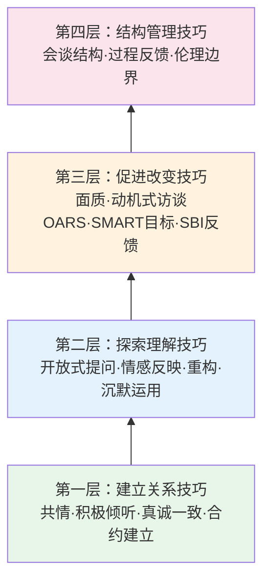

# 第二十一章 咨询与辅导沟通 - 本章小结

## 本章知识全景

本章从理论根基到实操落地，系统构建了咨询与辅导沟通的完整知识体系。作为全书从"通用沟通技巧"向"专业助人沟通"的过渡枢纽，本章将前20章积累的倾听、提问、反馈等散点技能整合到专业助人框架中，赋予它们更明确的理论根基和更严格的操作规范。

```mermaid
graph TD
    A[本章知识体系] --> B[理论基础层]
    A --> C[核心技巧层]
    A --> D[实战应用层]
    A --> E[误区防范层]
    A --> F[练习精进层]

    B --> B1[人本主义理论]
    B --> B2[认知行为疗法]
    B --> B3[动机式访谈]
    B --> B4[焦点解决短期治疗]
    B --> B5[GROW教练模型]

    C --> C1[建立关系技巧]
    C --> C2[探索理解技巧]
    C --> C3[促进改变技巧]
    C --> C4[结构管理技巧]

    D --> D1[企业教练对话]
    D --> D2[心理咨询场景]
    D --> D3[导师辅导场景]
    D --> D4[危机干预场景]

    E --> E1[给建议代替引导]
    E --> E2[过度共情失客观]
    E --> E3[忽视伦理边界]

    F --> F1[8周系统练习]
    F --> F2[刻意练习四阶段]
    F --> F3[督导与自我评估]

    style A fill:#1a1a2e,stroke:#e94560,color:#fff
    style B fill:#16213e,stroke:#0f3460,color:#fff
    style C fill:#16213e,stroke:#0f3460,color:#fff
    style D fill:#16213e,stroke:#0f3460,color:#fff
    style E fill:#16213e,stroke:#0f3460,color:#fff
    style F fill:#16213e,stroke:#0f3460,color:#fff
```

---

## 一、核心要点回顾

### 1.1 咨询与辅导沟通的本质

咨询与辅导沟通是专业助人者通过特定技术和方法，帮助来访者澄清问题、探索解决方案、促进个人成长的专业沟通过程。它与日常沟通有六个维度的根本差异：目的（促进改变 vs 信息交换）、关系（专业助人 vs 平等社交）、结构（有框架有阶段 vs 自由流动）、焦点（始终在来访者 vs 双向交流）、伦理（受专业伦理约束 vs 社交礼仪）、效果评估（有明确标准 vs 主观感受）。

理解这六个维度的差异是进入本章学习的前提——它帮助你在"以为自己懂了"和"真正掌握了"之间画出清晰的分界线。很多人在日常沟通中表现良好，但在需要专业助人时依然沿用社交习惯，结果要么给出不请自来的建议，要么在来访者需要挑战时过度迁就。本章的核心目标，就是帮你完成从"会聊天的人"到"能助人的专业沟通者"的跨越。

### 1.2 四种助人角色的本质区别

本章反复强调的一个关键区分是四种助人角色的边界。许多误区的根源正是角色混淆——用教练的方式做心理咨询，或用导师的方式做教练。

| 角色 | 核心定位 | 信息流向 | 典型对话特征 | 适用场景 |
|------|---------|---------|------------|---------|
| **教练（Coach）** | 引导者：通过提问帮助客户自主发现解决方案 | 以客户输出为主，教练极少提供信息 | 大量开放式提问、尺度问题、沉默等待 | 绩效提升、目标达成、行为改变 |
| **咨询师（Consultant）** | 专家：基于专业知识提供诊断和解决方案 | 以咨询师输出为主，提供专业判断 | 分析、建议、方案呈现、风险评估 | 专业技术问题、战略决策、诊断评估 |
| **导师（Mentor）** | 前辈：分享经验、传授知识、提供职业指导 | 双向交流，导师分享个人经验 | 故事分享、经验传授、人脉引荐 | 职业发展、新人成长、行业认知 |
| **辅导员（Counselor）** | 陪伴者：提供情绪支持、促进自我探索和成长 | 以来访者输出为主，辅导员主要反映和澄清 | 深度共情、情感反映、重构、沉默 | 情绪困扰、人际关系、自我认知、危机支持 |

判断自己当前应该扮演哪个角色，有一个简单的检验方法：**问自己"此刻对方最需要的是什么？"**——如果需要方向，做教练；如果需要答案，做咨询师；如果需要经验，做导师；如果需要被理解和接纳，做辅导员。现实中这四个角色常常在同一场对话中切换，关键是觉察自己此刻正在扮演什么角色，以及这个角色是否匹配对方当下的需要。

### 1.3 五大核心理论框架

本章梳理了支撑咨询与辅导沟通的五大理论框架。每个理论不是孤立存在的，而是在不同层面回答了同一个根本问题：**人如何发生改变？**

**（1）人本主义咨询理论——关系即治愈**

卡尔·罗杰斯提出的核心命题是：治疗关系的质量本身就是改变的核心机制。三个充分必要条件——无条件积极关注、共情理解、真诚一致——不是"锦上添花"的软技能，而是经过大量实证研究验证的改变引擎。APA元分析研究表明，咨询关系对治疗效果的贡献率约30%，超过任何特定技术方法。这意味着：无论你掌握多少高级技巧，如果关系没建好，技巧就是空中楼阁。

**（2）GROW模型——结构化教练对话框架**

GROW模型将教练对话分为四个阶段：目标（Goal）→ 现状（Reality）→ 选择（Options）→ 意愿（Will）。它的核心价值不是提供一个死板的流程，而是为教练对话提供了一个"导航系统"——在对话迷路时，你可以随时回到这四个坐标确认方向。GROW模型的精髓在于：每个阶段的核心任务都是提问而非告知，教练的角色是"思考伙伴"而非"答案提供者"。

**（3）动机式访谈（MI）——激发内在改变动力**

威廉·米勒和斯蒂芬·罗尔尼克开发的动机式访谈，解决了一个关键问题：当来访者知道该改变但做不到时怎么办？MI的核心假设是：改变的动力必须来自来访者内部，外部压力产生的改变往往短暂且脆弱。OARS技术（开放式提问、肯定、反映、总结）是MI的核心操作工具，通过探索矛盾心理来增强改变动机。

**（4）焦点解决短期治疗（SFBT）——关注解决方案而非问题**

史蒂夫·德·沙泽尔创立的SFBT提出了一个反直觉的观点：你不需要深入理解问题的本质也能解决问题。奇迹问句（"如果明天醒来问题奇迹般消失了，你的生活会有什么不同？"）、例外问句（"有没有什么时候这个问题没那么严重？那时发生了什么？"）和尺度问句（"从1到10，你现在在哪里？"）是SFBT的三大标志性技术。

**（5）认知行为疗法（CBT）——认知、情绪、行为的三角关系**

亚伦·贝克的认知行为疗法揭示了一个关键机制：引发情绪困扰的往往不是事件本身，而是我们对事件的解释（认知）。通过识别和修正不合理的认知模式，可以有效改变情绪和行为。CBT在咨询沟通中的应用价值在于：它提供了一个清晰的"问题地图"——帮助来访者看到想法、情绪和行为之间的因果链条，从而找到可以干预的节点。

### 1.4 四层核心技巧体系

本章将核心技巧分为四个层次，每个层次以前一个层次为基础：

**第一层：建立关系技巧**——这是所有技巧的地基。没有信任关系，任何技术都无法生效。积极倾听的三个层次（内容倾听、情感倾听、意义倾听）是建立关系的核心手段。本章强调：倾听不是一个被动行为，而是一个需要高度专注和主动加工的专业技能。

**第二层：探索理解技巧**——在信任关系建立后，通过开放式提问引导来访者深入探索，通过情感反映让来访者感到被理解，通过重构帮助来访者看到新的可能性，通过沉默给来访者留出反思和感受的空间。这一层的核心能力是"跟随"——跟随来访者的节奏和方向，而不是急于引导。

**第三层：促进改变技巧**——当来访者的探索足够深入后，适时引入挑战和推动。面质技巧帮助来访者看到不一致和盲点；SBI反馈模型（情境-行为-影响）提供具体客观的反馈；SMART目标设定帮助来访者将模糊的意愿转化为可执行的计划。

**第四层：结构管理技巧**——贯穿全程的框架性能力，包括会谈节奏的把控、过程反馈的运用、以及伦理边界的维护。这一层看似"幕后"，但它是前三层技巧得以流畅运作的基础设施。

### 1.5 八大常见误区的深层逻辑

本章梳理的八大误区不是孤立的"技术失误"，而是**认知框架偏差**的外在表现。反复给建议的人，内心假设是"我比来访者更知道什么对他好"；过度共情的人，内心假设是"让来访者感到舒服是我的首要责任"。纠正误区的真正路径不是记住"应该怎么做"，而是觉察并修正底层的信念假设。

| 阶段 | 误区 | 核心偏差 | 纠正方向 |
|------|------|---------|---------|
| 关系建立 | 跳过关系直接解决问题 | 低估关系在改变中的作用 | 先投入时间建立信任，再进入问题探索 |
| 关系建立 | 边界不清 | 混淆专业关系与私人关系 | 明确角色、设置和界限，定期自我检查 |
| 对话进行 | 给建议代替引导 | "我比来访者更知道什么对他好" | 将建议转化为提问，把答案的发现权还给来访者 |
| 对话进行 | 过度共情失去客观性 | "让来访者舒服是我的首要责任" | 共情是手段而非目的，保持专业观察者视角 |
| 对话进行 | 用自己的经验替代来访者体验 | "我的经历可以作为标准" | 来访者的体验是唯一的参照系，放下"过来人"心态 |
| 贯穿全程 | 忽视保密原则 | 专业伦理意识薄弱 | 牢记保密例外情况，建立信息管理习惯 |
| 贯穿全程 | 忽视文化差异 | 以单一文化视角理解所有来访者 | 保持文化谦逊，主动了解来访者的文化背景 |
| 贯穿全程 | 不做评估就干预 | 急于"做点什么"的焦虑 | 先评估后干预，评估本身就是干预的一部分 |

误区很少单独出现，它们往往相互强化形成恶性循环。例如"给建议 + 跳过关系"会导致助人者变成"说教者"，来访者脱落；"过度共情 + 边界不清"会导致双重关系，咨询失效。纠错需要系统性，而非零敲碎打。

---

## 二、本章关键能力检验

学完本章后，用以下问题检验自己的掌握程度。每个问题对应一个核心能力点，如果不能清晰回答，说明该领域需要复习。

### 2.1 理论理解检验

1. **角色区分**：一位同事来找你倾诉工作压力，你应该扮演教练、咨询师、导师还是辅导员？判断依据是什么？如果对话中途对方的需求发生变化，你如何觉察和切换？
2. **理论选择**：面对一位"知道该减肥但总是坚持不下来"的来访者，你会选择GROW模型、动机式访谈还是认知行为疗法？为什么？
3. **关系与技术的关系**：罗杰斯认为"关系本身就是治愈"，而CBT强调特定技术的有效性。这两种观点矛盾吗？在实践中如何调和？

### 2.2 技巧运用检验

4. **倾听层次**：以下来访者的话，分别应该用内容倾听、情感倾听还是意义倾听来回应？——"我这个月已经加了20天班了"；"我不知道这样做到底值不值得"；"领导说我的方案不行，让我重新做"。
5. **提问转换**：将以下封闭式提问转换为开放式提问——"你是不是对这份工作不满意？""你想不想换个环境？""这个问题解决了吗？"
6. **SBI反馈**：用SBI模型为以下场景构造反馈——你的下属在昨天的客户会议上（情境），提前离场去处理另一个紧急事务（行为），导致客户感到不被重视（影响）。

### 2.3 误区识别检验

7. **误区诊断**：阅读以下对话片段，识别其中的误区——来访者："我和老公总是吵架。" 助人者："我跟我老婆以前也这样，后来我学会了先道歉，你试试这个方法。"（至少识别出两个误区）
8. **纠正方案**：针对上述对话片段，重写一段符合专业标准的回应。

---

## 三、核心原则提炼

### 3.1 客户中心原则

始终以来访者为中心，尊重其自主性、独特性和内在智慧。助人者是促进者而非指导者——你的任务不是告诉来访者"正确答案"，而是创造一个安全的空间，让来访者自己找到答案。这个原则看似简单，实践中的挑战在于：当来访者反复陷入同样的困境时，当你"明明看到了出路"时，你能否忍住不给建议，而是继续用提问引导？

### 3.2 关系优先原则

信任关系是有效咨询与辅导的基础。投入足够的时间建立和维护关系，不要急于"解决问题"。研究表明，咨询联盟的质量是预测治疗效果的最强单一因素之一（Horvath et al., 2011）。关系建设不是"浪费时间"，而是最高效的投资——一旦关系到位，后续的探索和改变会顺畅得多。

### 3.3 伦理规范原则

严格遵守专业伦理是底线而非高标准。核心伦理要求包括：保密性（除自伤自杀风险、伤害他人风险、儿童虐待、法院命令等保密例外）、知情同意（来访者有权了解咨询的过程、风险和替代方案）、避免伤害（不超越自己的能力边界）、专业能力（持续学习和督导）。

### 3.4 文化敏感原则

考虑文化背景对沟通方式、价值观和求助行为的影响。在中国文化语境下，需要特别注意"面子"对表达的抑制作用、家庭集体主义与个人自主之间的张力、以及对心理咨询的污名化倾向。保持文化谦逊——不是假设你了解来访者的文化，而是带着好奇去询问和学习。

### 3.5 持续发展原则

咨询与辅导是需要终身学习的专业领域。持续发展包括三个维度：理论深化（持续阅读和学习新的理论和技术）、实践精进（通过大量实践积累经验）、反思督导（通过督导和同伴反馈发现盲区）。安德斯·艾利克森的刻意练习理论告诉我们：10000小时的练习如果不包含反馈和修正，只会固化错误模式。

---

## 四、行动清单

### 4.1 学习巩固阶段（第1-2周）

- [ ] 回顾本章理论基础部分，确保能用自己的话解释每个理论的核心假设和关键概念
- [ ] 制作"五大理论对比表"，从创始人、核心假设、改变机制、典型技术、适用场景五个维度进行横向对比
- [ ] 绘制"四层技巧体系"的个人版本，标注自己在每层的掌握程度（1-5分）
- [ ] 重新阅读实战案例部分，用D-I-A-M框架（决策、互动、情感、改变）独立分析至少两个案例
- [ ] 完成2.2节的技巧运用检验，对每个问题写出自己的回答，然后对照原文校准

### 4.2 技巧练习阶段（第3-6周）

- [ ] 每天进行10分钟"倾听专注力训练"——与他人对话时全程集中注意力，不走神想自己要说什么
- [ ] 每周练习3次"封闭式→开放式提问转换"，收集生活和工作中的封闭式提问，改写为开放式版本
- [ ] 每周进行1次SBI反馈练习——选择一个真实的反馈场景，用SBI结构组织语言
- [ ] 每周进行1次GROW模型模拟对话练习，找一位伙伴轮流扮演教练和客户
- [ ] 每周进行1次情感反映练习——在日常对话中，尝试识别对方的情绪并用语言反映出来
- [ ] 练习沉默运用——在对话中刻意留出3-5秒的沉默，观察对方的反应

### 4.3 实践应用阶段（第7-12周）

- [ ] 在实际工作中应用GROW模型进行至少3次完整的教练对话
- [ ] 尝试在一对一沟通中使用动机式访谈的OARS技术
- [ ] 进行录音自我评估——录下自己的助人对话，回放时关注：提问比例、倾听质量、建议频率、共情准确性
- [ ] 案例督导练习——选择一个自己的助人对话案例，用D-I-A-M框架进行自我督导
- [ ] 识别自己的误区模式——回顾过去的助人经历，找出反复出现的误区，并分析其底层信念假设

### 4.4 专业发展阶段（持续）

- [ ] 阅读推荐书籍中的至少3本，建立理论深度
- [ ] 寻找一位专业的督导或加入同伴督导小组
- [ ] 参加至少一次专业培训或工作坊
- [ ] 建立个人的"助人对话日志"，记录每次重要对话的反思
- [ ] 了解ICF、中国心理学会等专业组织的认证路径

---

## 五、推荐资源与学习路径

### 5.1 必读书籍

| 书名 | 作者 | 核心价值 | 适合阶段 |
|------|------|---------|---------|
| 《高绩效教练》 | 约翰·惠特莫尔 | GROW模型的经典著作，教练入门第一书 | 初学者 |
| 《动机式访谈》 | 威廉·米勒、斯蒂芬·罗尔尼克 | MI的权威指南，系统讲解OARS技术和改变对话 | 初学者-进阶 |
| 《成为一个人》 | 卡尔·罗杰斯 | 人本主义咨询理论的经典，理解"关系即治愈"的深层含义 | 所有阶段 |
| 《焦点解决短期治疗》 | 史蒂夫·德·沙泽尔 | SFBT的核心教材，掌握奇迹问句、例外问句等标志性技术 | 进阶 |
| 《认知行为疗法》 | 亚伦·贝克 | CBT的奠基之作，理解认知-情绪-行为的三角关系 | 进阶 |
| 《教练心理学》 | 安东尼·格兰特 | 教练心理学的综合视角，连接教练与心理学研究 | 进阶-专业 |
| 《咨询与心理治疗》 | 杰拉德·科里 | 11种主要咨询理论的横向比较，帮助建立整合视角 | 专业 |

### 5.2 培训与认证资源

- **国际教练联合会（ICF）**：全球最大的教练认证机构，提供ACC（助理认证教练）、PCC（专业认证教练）、MCC（大师认证教练）三级认证体系
- **中国心理学会**：提供心理咨询专业培训和注册系统，是国内心理咨询领域的权威认证
- **焦点解决短期治疗协会**：提供SFBT专业培训，包括基础课程和高级督导
- **认知行为治疗协会**：提供CBT系统培训，从基础理论到临床实践

### 5.3 在线学习资源

- **Coursera/edX**：搜索"coaching"或"counseling"可找到多所大学开设的相关课程，如耶鲁大学的"幸福科学"课程中包含动机式访谈内容
- **ICF官方资源库**：ICF网站提供免费的教练能力框架文档和案例研究
- **学术期刊**：《心理学报》《中国心理卫生杂志》《Journal of Counseling Psychology》等发表最新研究成果
- **专业播客**：如"Coaching for Leaders""The Art of Coaching"等英文播客提供持续学习的渠道

### 5.4 督导与同伴支持

- **专业督导**：通过ICF或中国心理学会寻找认证督导，定期获得专业反馈
- **同伴督导小组**：与3-5位同水平的学习者组成小组，每月进行一次案例讨论
- **个人体验**：接受个人咨询或教练体验，从"来访者"视角理解助人过程——这是最被低估的学习途径之一

---

## 六、分阶段学习路径

### 6.1 初学者阶段（0-6个月）：打好地基

**目标**：建立理论认知框架，掌握基础沟通技巧，完成从"无意识无能力"到"有意识无能力"的跨越。

**核心任务**：
1. 系统学习本章理论基础，理解五大理论框架的核心假设和关键概念
2. 掌握积极倾听和开放式提问两项基础技巧——这两项是一切高级技巧的前提
3. 进行大量的模拟练习，在安全环境中尝试各种技巧
4. 阅读《高绩效教练》和《成为一个人》，建立理论直觉
5. 开始觉察自己在日常沟通中的习惯模式，识别哪些是需要改变的

**里程碑标志**：能够在模拟对话中完成一次结构完整的GROW模型对话（即使不够流畅）。

### 6.2 进阶者阶段（6-18个月）：技巧整合

**目标**：深入学习专业理论和技术，完成从"有意识无能力"到"有意识有能力"的跨越。

**核心任务**：
1. 深入学习动机式访谈和焦点解决短期治疗的技术细节
2. 在实际工作中系统应用所学技巧，每周至少进行2次有意识的助人对话
3. 建立录音自我评估习惯，每月至少分析2段自己的对话录音
4. 寻找专业督导或加入同伴督导小组
5. 参加至少一次系统性培训或工作坊
6. 开始发展自己的助人风格和偏好

**里程碑标志**：能够在真实的助人对话中灵活切换不同技巧，来访者反馈感受到被理解和被帮助。

### 6.3 专业人士阶段（18个月以上）：风格形成

**目标**：整合不同理论和技术，发展个人风格，完成从"有意识有能力"到"无意识有能力"的跨越。

**核心任务**：
1. 建立整合性的理论框架，能够根据来访者的特点灵活选择和组合不同理论
2. 发展出独特的个人助人风格，而不是机械地套用某个模型
3. 处理复杂的助人情境（如多重议题、危机干预、长期辅导）
4. 开始指导新手，通过教学深化自己的理解
5. 考虑专业认证（ICF认证或心理咨询师注册）
6. 持续专业发展和继续教育

**里程碑标志**：能够在不做刻意准备的情况下，自然流畅地完成高质量的助人对话，并能清晰地解释自己每个决策背后的理论依据。

---

## 七、本章总结

咨询与辅导沟通是专业助人工作的核心技能。通过本章的学习，你应该能够：

1. **理解理论**：掌握人本主义、GROW模型、动机式访谈、焦点解决短期治疗、认知行为疗法五大理论框架，理解它们各自回答了"人如何发生改变"这个问题的哪个维度
2. **掌握技巧**：熟练运用积极倾听、开放式提问、情感反映、SBI反馈模型、面质、沉默等关键技术，并理解四层技巧体系之间的依存关系
3. **应用实践**：在企业教练、心理咨询、导师辅导、危机干预等不同情境下，能判断自己应扮演的角色并选择匹配的技术
4. **避免误区**：识别给建议代替引导、过度共情、忽视伦理等八大误区的底层信念假设，并建立系统性的纠错习惯
5. **持续发展**：通过刻意练习、督导反馈和持续学习，沿"无意识无能力→有意识无能力→有意识有能力→无意识有能力"四阶段路径持续精进

最后需要强调的是：有效的咨询与辅导沟通不仅是技术，更是艺术。技术可以在课堂上学习，但艺术只能在实践中领悟。理论给了你地图，技巧给了你工具，但真正让你成为优秀助人者的，是每一次真实的对话、每一次诚实的自我反思、以及对每一位来访者发自内心的尊重和好奇。

保持学习的热情，保持实践的勇气，保持反思的诚实——你将成为更有效的助人者，帮助更多人实现成长和改变。
