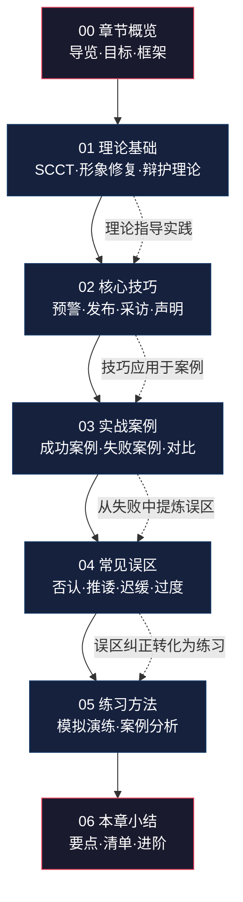
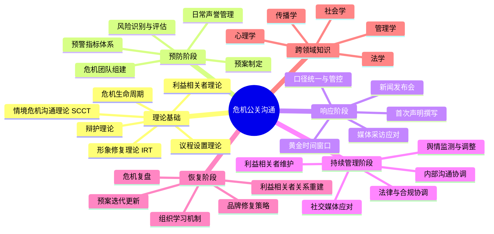

# 第二十二章 危机公关沟通

## 引言

在当今信息高度透明、传播速度极快的时代，任何一个组织或个人都可能在毫无预警的情况下遭遇危机。一条负面新闻、一次产品事故、一篇社交媒体帖子，都可能在数小时内引发舆论风暴，对品牌声誉造成严重损害。危机公关沟通，正是在这种极端情境下，组织与公众、媒体、利益相关者之间进行的信息传递与关系修复过程。

危机公关沟通不同于日常的公共关系工作。它要求沟通者在极短的时间内做出准确判断，以恰当的方式传递信息，同时平衡多方利益诉求。优秀的危机沟通不仅能化解当前的困境，更能将危机转化为展现组织价值观和社会责任感的契机。而失败的危机沟通则可能使事态进一步恶化，甚至导致组织的长期衰落。

本章将系统地探讨危机公关沟通的理论框架、核心技巧、实战策略和常见误区，帮助读者建立起完整的危机沟通知识体系。无论你是企业管理者、公关从业者，还是希望提升自身危机应对能力的普通人，本章的内容都将为你提供切实可行的指导。

### 一个直观的起点

2017年，美联航（United Airlines）因超售机票，强行将一名乘客拖下飞机。事件发生后，美联航CEO的第一份声明称公司"不得不重新安置乘客"，用词冷淡且推卸责任。这条声明在社交媒体上引发了全球性愤怒，美联航股价在两天内蒸发超过10亿美元市值。

对比之下，2008年三聚氰胺事件中，三鹿集团选择沉默和否认，最终导致企业破产；而同期的恒天然（Fonterra）虽然也受到波及，但因其主动披露、迅速召回和坦诚沟通，品牌在一年内基本恢复。

两个案例指向同一个结论：**危机中说什么、怎么说、什么时候说，往往比危机本身更能决定结局。**

---

## 章节结构

本章共分为七个部分，按照从理论到实践、从基础到进阶的逻辑顺序展开。下图展示了全章的知识脉络和各部分之间的关联关系：

### 各部分详细导览

**第一部分：章节概览（本文件）**

本文件是全章的导航地图。你正在阅读的这个部分将帮助你理解：
- 危机公关沟通为什么值得系统学习
- 本章涵盖哪些内容、各部分之间如何衔接
- 学完本章后你将获得哪些能力
- 学习前需要具备哪些基础知识
- 如何最高效地利用本章内容

建议在正式学习前通读本文件，建立全局认知后再逐节深入。

**第二部分：理论基础**

理论是实践的骨架。本部分将系统讲解三大经典理论：
- **情境危机沟通理论（SCCT）**：由明尼苏达大学学者Timothy Coombs提出，核心观点是"不同的危机类型需要不同的回应策略"。你将学会判断危机属于受害型、事故型还是可预防型，并据此选择否认、弱化、重建或强化策略。
- **形象修复理论（IRT）**：由William Benoit提出，提供五种形象修复策略——否认、逃避责任、减少冒犯、纠正行为、表达悔意。你将理解每种策略的适用场景和风险。
- **辩护理论（Ware & Linkugel）**：聚焦个人层面的形象维护，提供四种辩护维度——否认、强化、区分、超越。

此外，本部分还将讲解危机生命周期模型（潜伏期→爆发期→蔓延期→恢复期），让你理解危机的时间维度对沟通策略的影响。

**第三部分：核心技巧**

从理论到操作的桥梁。本部分提供六大可落地的技能模块：

| 技能模块 | 核心内容 | 适用场景 |
|----------|----------|----------|
| 危机预警与预案 | 建立监测体系、制定响应流程、组建危机团队 | 日常准备阶段 |
| 首次回应 | 黄金时间窗口把握、初步声明撰写、口径统一 | 危机爆发初期 |
| 新闻发布会 | 场地选择、议程设计、Q&A策略、发言人培训 | 需要正式对外沟通时 |
| 媒体采访应对 | 记者心理、应答技巧、"桥接"技术、陷阱规避 | 接受媒体采访时 |
| 道歉声明撰写 | 道歉的六个要素、措辞禁忌、发布渠道选择 | 需要公开致歉时 |
| 社交媒体危机管理 | 舆情监测、评论管理、KOL应对、话题引导 | 线上危机处理 |

每个模块都包含具体的操作步骤、模板示例和注意事项，学完即可直接应用。

**第四部分：实战案例**

理论和技巧需要在真实场景中验证。本部分精选了多个具有代表性的中外案例：

- **正面案例**：强生泰诺投毒事件（1982年危机沟通教科书级案例）、海底捞后厨事件（快速认错+公开整改）、NASA哥伦比亚号事故调查中的信息透明策略。
- **反面案例**：三星Note7电池爆炸事件（拖延与双重标准）、某航空公司暴力拖拽乘客事件（CEO声明失败）、长生生物疫苗造假事件（沉默与否认的代价）。
- **争议案例**：特斯拉自动驾驶事故（技术争议中的沟通困境）、某互联网企业数据泄露事件（信息公开与用户恐慌的平衡）。

每个案例都从背景还原→沟通行为梳理→策略分析→结果评估四个维度展开，帮助你建立"案例分析"的思维框架。

**第五部分：常见误区**

危机沟通中，很多看似合理的做法实际上会适得其反。本部分将逐一拆解十大常见误区：

1. **"先等等看"——反应迟缓的代价**：沉默不等于冷静，公众会将沉默解读为心虚或傲慢。
2. **"不是我们的错"——过早否认的风险**：在事实未明时否认，一旦反转将彻底丧失公信力。
3. **"我们深表歉意"——空洞道歉的反效果**：模板化道歉比不道歉更糟糕，因为它传递出"不走心"的信号。
4. **"甩锅给个人"——切割策略的局限**：将责任推给"临时工"或"个别员工"，公众不会买账。
5. **"删帖控评"——压制舆论的后遗症**：信息时代，删帖只会激发更大的反弹。
6. **"过度承诺"——无法兑现的保证**：危机中的承诺会被放大审视，做不到的不要说。
7. **"内部信息外泄"——口径管理失败**：危机中最怕"多个声音说话"。
8. **"法律优先"——忽视情感诉求**：法律上无责不等于公众能接受。
9. **"一次声明就够了"——缺乏持续沟通**：危机不是发一篇声明就能结束的。
10. **"危机过了就好了"——忽视复盘与修复**：不总结经验教训，同样的危机还会再来。

**第六部分：练习方法**

知道不等于做到。本部分提供三类练习方案：

- **个人练习**：危机声明写作练习、媒体采访模拟（可录像自评）、经典案例复盘报告撰写。
- **团队练习**：危机模拟桌面推演（Tabletop Exercise）、红蓝对抗演练、新闻发布会模拟。
- **组织练习**：全员危机意识培训流程、跨部门协调演练、危机预案压力测试。

每个练习都附有详细的操作指南、评估标准和常见问题解答。

**第七部分：本章小结**

全章的收束与升华。包含：
- 核心知识点总结（一页纸速查版）
- 危机沟通行动清单（可打印使用）
- 进阶学习资源推荐（书籍、论文、课程）
- 自我评估问卷（检验学习效果）

---

## 学习目标

完成本章学习后，你将能够：

### 知识层面

1. **理解危机公关沟通的基本概念、特征和重要性**：能够准确定义危机公关沟通，区分其与日常公关、应急管理的边界，理解危机沟通在组织管理体系中的位置。
2. **掌握情境危机沟通理论（SCCT）的核心框架和应用方法**：能够运用SCCT的危机分类矩阵（受害型/事故型/可预防型），判断具体危机的情境特征，并选择匹配的回应策略（否认/弱化/重建/强化）。
3. **了解危机的不同类型及其对沟通策略的影响**：熟悉至少六种常见危机类型（自然灾害、产品缺陷、财务丑闻、高管失言、数据泄露、员工不当行为）的特征和对应沟通要点。
4. **认识到利益相关者分析在危机沟通中的关键作用**：能够绘制利益相关者地图，识别每类群体的核心诉求和影响力权重，制定差异化的沟通策略。
5. **理解社交媒体时代危机传播的新特征和新规律**：掌握"病毒式传播""信息茧房""后真相"等概念对危机沟通的影响，理解算法推荐机制如何放大或抑制危机信息。

### 技能层面

1. **能够制定危机沟通预案**：能够独立编写一份完整的危机沟通预案文档，包含预警指标、响应流程、角色分工、口径模板、媒体清单等核心模块。
2. **能够撰写符合专业标准的道歉声明和危机回应文本**：掌握"六要素道歉法"（承认事实→表达歉意→解释原因→承诺改正→提出补偿→请求监督），能够针对不同危机场景撰写回应文本。
3. **能够有效组织新闻发布会**：能够完成从场地选择、议程设计、发言人准备、Q&A预演到现场执行的全流程管理。
4. **能够在社交媒体平台上进行有效的危机沟通**：掌握微博、微信公众号、抖音等主流平台的危机应对要点，能够制定社交媒体危机沟通计划。
5. **能够识别不同类型危机并选择适当的沟通策略**：面对一个新的危机事件，能在30分钟内完成初步判断并给出策略建议。

### 态度层面

1. **树立"预防为主、快速响应"的危机沟通意识**：理解"最好的危机沟通是危机不发生"，日常工作中主动维护声誉资产。
2. **培养在压力下保持冷静、理性沟通的心理素质**：通过模拟练习，体验危机情境下的心理压力，建立应对机制。
3. **建立以真诚、透明、负责任为核心的沟通价值观**：认识到技巧可以学习，但真诚无法伪装——公众能分辨出"表演式道歉"和"发自内心的回应"。
4. **认识到危机沟通不仅是技术，更是组织价值观的体现**：危机中的每一个决策都折射出组织的真实价值观，技术层面的"对"如果与价值观层面的"真"不一致，终将被识破。

---

## 前置知识与读者准备

### 你需要具备的基础

本章内容设计为中级难度，假设读者已具备以下基础知识：

| 知识领域 | 最低要求 | 期望水平 |
|----------|----------|----------|
| 沟通基础 | 了解基本沟通模型（发送者→信息→接收者） | 理解组织沟通、公众演讲基础 |
| 媒素养 | 知道主流媒体和社交平台的基本运作方式 | 了解舆情传播规律和算法推荐机制 |
| 组织管理 | 了解企业基本组织架构和决策流程 | 有实际的项目管理或团队协调经验 |
| 法律常识 | 知道基本的合同、侵权、消费者权益概念 | 了解广告法、食品安全法等相关法规 |

如果你对以上某些领域不太熟悉，建议先阅读本书相关章节进行补充，或者在学习过程中遇到不理解的概念时随时查阅。

### 自测：你的危机沟通基础水平

在正式学习前，试着回答以下问题（不需要查资料，凭直觉回答）：

1. 一家餐厅被曝使用过期食材，老板第一时间应该说什么？
2. "黄金4小时"和"黄金24小时"分别指什么？
3. 以下哪种做法最危险：A.沉默 B.否认 C.甩锅 D.过度承诺？
4. 道歉声明中"我们对造成的不便深表歉意"有什么问题？
5. 企业危机中，应该优先沟通的对象是谁：媒体、消费者、员工还是投资者？

如果你能清晰回答3个以上，说明你有一定基础，可以快速浏览本章并重点关注实战案例和练习部分。如果大部分问题答不上来，建议按顺序完整学习本章。

---

## 为什么危机公关沟通如此重要

### 一、信息时代的危机特征

在移动互联网和社交媒体高度普及的今天，危机呈现出几个显著特征：

**传播速度空前加快。** 一条微博或短视频可以在数分钟内获得百万级曝光。2023年某知名餐饮品牌食品安全事件，从消费者投诉到全网热搜仅用了不到两小时。TikTok和抖音等短视频平台进一步缩短了这个周期——一段15秒的现场视频比一篇长文报道传播速度快10倍以上。

具体来看，危机传播速度经历了三个时代的演变：

| 时代 | 典型渠道 | 爆发周期 | 可控性 |
|------|----------|----------|--------|
| 传统媒体时代（2000年前） | 报纸、电视、广播 | 24-72小时 | 较高，可通过媒体关系管控 |
| 门户/博客时代（2000-2012） | 新浪、天涯、博客 | 6-24小时 | 中等，需兼顾网络和传统媒体 |
| 社交媒体时代（2012至今） | 微博、微信、抖音、小红书 | 30分钟-2小时 | 较低，信息去中心化传播 |

**舆论场域极度复杂。** 传统媒体、自媒体、短视频平台、社交网络形成多维传播矩阵，信息在不同平台之间交叉传播，舆情走向难以预测。一个事件可能在微博引发讨论、在微信朋友圈深度发酵、在抖音形成视觉冲击、在知乎产生理性辩论——每个平台的传播逻辑和用户心态都不同，统一的沟通策略难以覆盖所有场景。

**公众期待显著提高。** 现代消费者不仅关注产品和服务质量，更关注企业的社会责任、价值观立场和危机应对态度。Edelman信任度调查显示，全球有64%的消费者是"信念驱动型买家"——他们会基于企业的社会立场决定是否购买。一次不当的危机回应可能引发抵制浪潮，而一次真诚的回应反而能增强品牌忠诚度。

**记忆周期延长且可检索。** 互联网的"记忆"能力使得危机事件被长期保存，即使危机已经平息，相关内容仍可能在搜索引擎中持续影响品牌形象。这意味着危机沟通不仅要解决当下的问题，还要考虑长期的搜索结果管理（Search Reputation Management）。一个负面词条如果长期占据搜索结果首页，对企业的影响可能持续数年。

**"次生危机"频发。** 现代危机的另一个特征是"处理危机的行为本身可能引发新的危机"。企业删帖会被截图传播、道歉声明的措辞会被逐字分析、内部邮件泄露会引发新一轮舆论。这种"危机中的危机"要求沟通者不仅要处理原始事件，还要预判每一个回应动作可能引发的连锁反应。

### 二、危机沟通的商业价值

危机沟通不是"花钱灭火"的成本中心，而是一种能够产生可衡量回报的投资。

**直接经济损失控制。** 哈佛商学院的研究发现，在重大危机事件中，采取积极沟通策略的企业，其股价恢复速度比消极应对的企业快30%以上。纽约大学的一项研究进一步指出，危机发生后72小时内的沟通质量，可以解释企业股价波动差异的40%-60%。

**品牌资产维护。** 品牌是企业最宝贵的无形资产之一。Interbrand的数据显示，全球Top 100品牌的品牌价值平均占企业总市值的20%以上。一次处理不当的危机可能在几天内摧毁数年积累的品牌价值。反之，出色的危机处理不仅能止损，甚至能"逆势增值"——强生公司在1982年泰诺投毒事件中果断召回3100万瓶产品、损失超过1亿美元，但其负责任的态度赢得了公众信任，泰诺品牌在一年内恢复了95%的市场份额。

**利益相关者关系巩固。** 危机时刻的沟通表现，往往是利益相关者评估企业可信度和合作价值的关键时刻。真诚、负责任的危机沟通能够增强投资者、合作伙伴和消费者的信心。相反，危机中的不当表现可能导致供应商收紧账期、银行调低信用评级、消费者转向竞品——这些隐性成本往往远超直接损失。

**组织韧性提升。** 通过危机沟通的实践，组织能够积累宝贵的经验，提升整体的风险管理能力和组织韧性。每一次危机都是一次"压力测试"，暴露组织在决策效率、信息流通、跨部门协作等方面的短板，为持续改进提供方向。

**法律风险的预防性管理。** 很多危机同时涉及法律和公关两个维度。专业的危机沟通能够在法律框架内最大化公关效果，避免因沟通不当而增加法律风险。例如，过度道歉可能被视为承认过错，但巧妙的"共情式回应"既能表达关怀又不构成法律承认——这种分寸感需要专业的危机沟通训练。

### 三、个人层面的危机沟通

危机公关不仅仅是企业和组织的课题。在社交媒体时代，个人同样面临危机场景：

- **职场危机**：被裁员、项目失败、与同事/上级发生冲突后如何沟通
- **公众人物危机**：公众人物的失言、隐私曝光、人设崩塌
- **网络暴力**：被网暴或被"挂"后的回应策略
- **家庭危机**：离婚、家暴曝光、子女教育问题中的对外沟通
- **职业声誉危机**：学术不端指控、职业资格争议、行业封杀

个人危机沟通与企业危机沟通的核心原则相通，但在资源、渠道和影响力方面存在显著差异。本章在讲解企业级案例的同时，也会穿插个人层面的场景分析，帮助你在任何身份下都能有效应对危机。

---

## 核心概念导览

在深入学习之前，让我们先了解本章将涉及的核心概念。以下表格涵盖本章最重要的15个概念，每个概念附带简要说明和首次出现的章节位置：

| 概念 | 简要说明 | 详解章节 |
|------|----------|----------|
| 情境危机沟通理论（SCCT） | 由Coombs提出，核心主张是危机类型决定回应策略。将危机分为受害型（谣言、自然灾害）、事故型（产品缺陷、技术故障）和可预防型（故意违规、隐瞒信息），每种类型对应不同的最优回应策略。 | 理论基础 |
| 形象修复理论（IRT） | 由Benoit提出，提供五种形象修复策略体系：否认（简单否认或转移指责）、逃避责任（ provocation/defeasibility/accident/good intentions）、减少冒犯性（bolstering/minimization/differentiation/transcendence/attack accuser/compensation）、纠正行为、表达悔意。 | 理论基础 |
| 辩护理论 | Ware & Linkugel提出的个人层面形象维护理论，通过否认、强化、区分、超越四个维度帮助个人在遭受攻击时维护形象。 | 理论基础 |
| 危机生命周期 | 危机从潜伏期（信号识别）→爆发期（快速响应）→蔓延期（持续管控）→恢复期（修复重建）的四阶段模型，每个阶段的沟通重点和策略不同。 | 理论基础 |
| 利益相关者分析 | 识别和评估受危机影响的各方群体（消费者、员工、投资者、政府、媒体、社区、供应商等），分析其影响力和利益诉求，制定差异化的沟通优先级和策略。 | 核心技巧 |
| 黄金时间窗口 | 危机发生后做出首次回应的最佳时间段。不同学派观点不一：传统PR理论强调"24小时法则"，社交媒体时代演化为"4小时法则"甚至"1小时法则"。核心不在于具体时间，而在于"在谣言填补信息真空之前"发布权威信息。 | 核心技巧 |
| 声誉资本 | 组织通过长期诚信经营、社会责任履行和利益相关者关系维护所积累的声誉资产。在危机中，声誉资本高的组织享有更大的"容错空间"——公众更愿意给予其信任和解释机会。 | 理论基础 |
| 社交媒体危机 | 在社交媒体平台上爆发或扩散的危机事件。特征包括：传播去中心化、用户生成内容主导、情绪化讨论占上风、算法推荐加速扩散、官方声音被淹没。 | 核心技巧 |
| 内部危机沟通 | 组织内部在危机期间的信息传递和协调管理。包括对员工的信息通报、口径统一、情绪安抚、行动协调等。内部沟通失败往往比外部沟通失败更致命——员工如果从新闻而非内部渠道获知危机，组织的凝聚力将迅速瓦解。 | 核心技巧 |
| 危机发言人 | 组织在危机中指定的对外沟通代表。理想的危机发言人应具备：权威性（能代表组织做决策）、可信度（公众信任度高）、表达力（能清晰、有感染力地传递信息）、抗压力（能在高压环境下保持冷静）。 | 核心技巧 |
| "桥接"技术 | 媒体采访中的高级应答技巧。当记者提出不利问题时，不直接回答（可能陷入陷阱），也不拒绝回答（显得不配合），而是"桥接"到自己想传递的关键信息。常用句式："这个问题很重要，但更重要的是……""我想补充的是……""从另一个角度看……"。 | 核心技巧 |
| 舆情监测 | 通过技术手段（关键词监测、情感分析、传播路径追踪）实时追踪公众对危机事件的态度和讨论走向。现代舆情监测通常借助AI工具实现自动化预警和分析。 | 核心技巧 |
| 危机复盘 | 危机平息后对整个事件的系统回顾和反思。包括：危机应对的时间线梳理、决策点分析、成功与失败因素识别、预案和流程改进建议。危机复盘是组织从危机中学习的关键机制。 | 本章小结 |
| "受害者-恶棍"叙事 | 公众在危机中倾向于将事件简化为"受害者 vs 恶棍"的二元叙事。企业如果被归入"恶棍"角色，任何解释都会被解读为狡辩。危机沟通的关键任务之一是避免被贴上"恶棍"标签，或在已被贴上后如何逐步撕掉它。 | 实战案例 |
| 次生危机 | 处理危机的行为本身引发的新危机。如删帖引发"心虚"质疑、道歉声明措辞不当引发二次舆论、内部处理方式泄露引发员工不满等。预防次生危机需要在每一个回应动作前评估其可能引发的连锁反应。 | 常见误区 |

这些概念将在后续各节中详细展开，每个概念都会配有理论讲解、应用示例和操作指南，帮助你不仅"知道"还能"用到"。

---

## 知识体系全景图

下图展示了危机公关沟通的核心知识体系，帮助你理解本章内容在整个学科版图中的位置：

---

## 学习路径建议

本章内容量较大，不同背景的读者可以采用不同的学习路径：

### 路径A：完整学习（推荐，约8-10小时）

适合：公关从业者、企业管理者、传播学学生

按顺序阅读所有章节，完成每个练习。重点投入在核心技巧和实战案例部分，建议边学边做笔记，每完成一节后用自测问题检验理解程度。

### 路径B：快速掌握（约3-4小时）

适合：已有一定基础、需要快速补充知识的读者

跳过理论基础部分（或快速浏览），重点学习核心技巧中的"首次回应"和"道歉声明撰写"模块，通读实战案例部分的正面和反面案例各2个，完成常见误区部分的阅读。

### 路径C：应急参考（约30分钟）

适合：正在经历危机、需要立即获得指导的读者

直接阅读：
1. 核心技巧→首次回应（获取当前危机的应对框架）
2. 核心技巧→道歉声明撰写（如需公开致歉）
3. 常见误区（避免在慌乱中犯低级错误）
4. 本章小结中的行动清单（获取操作checklist）

危机结束后，再回头进行完整学习。

---

## 本章核心原则

在深入各节内容之前，请牢记以下四条核心原则，它们贯穿全章所有内容：

**原则一：速度与准确性的平衡。** 快不等于草率。"第一时间回应"不等于"第一时间给出完整答案"。你可以先发一份简短声明表达关注和正在调查的态度，然后在掌握更多事实后发布详细回应。关键是不让信息真空被谣言和猜测填补。

**原则二：真诚是最大的技巧。** 所有的沟通技巧都建立在真诚的基础上。公众可以接受犯错，但不能接受欺骗和虚伪。一份发自内心的道歉比一份精心包装但缺乏诚意的声明有效得多。

**原则三：利益相关者优先级管理。** 危机中不可能对所有群体同时进行同等力度的沟通。你需要快速判断谁最需要优先沟通（通常是直接受影响者和核心员工），然后依次覆盖其他群体。

**原则四：言行一致是底线。** 承诺了就要做到。危机中的每一个公开承诺都会被放大审视，无法兑现的承诺比不承诺更糟糕。宁可少承诺、多行动，也不要为了平息舆论而做出无法兑现的保证。

---

## 结语

危机公关沟通是一门融合了传播学、心理学、管理学和法学等多个学科知识的综合性技能。它要求从业者既要有扎实的理论功底，又要有丰富的实践经验；既要能在压力下保持冷静，又要能展现出真诚的人文关怀。

在接下来的章节中，我们将深入探讨每一个核心主题，通过理论讲解、技巧传授、案例分析和实践练习，帮助你成为一名优秀的危机沟通者。记住，危机不可避免，但我们可以做好准备，在危机到来时展现出最好的沟通能力。

本章的最后一节将提供一份完整的"危机沟通行动清单"，你可以在日常工作中打印出来放在手边，或保存在手机中随时查阅。当危机真正来临时，这份清单将成为你最可靠的指南。

现在，让我们从理论基础开始，一步步构建你的危机公关沟通能力。
