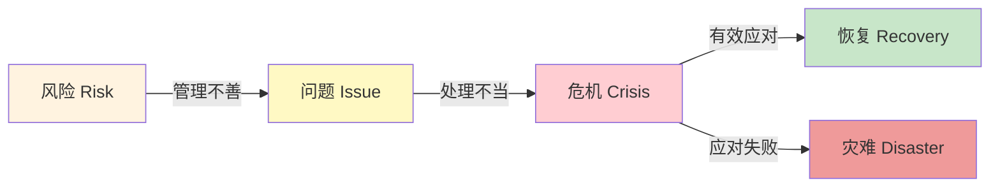
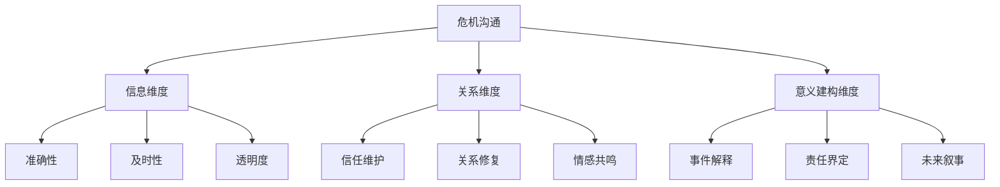
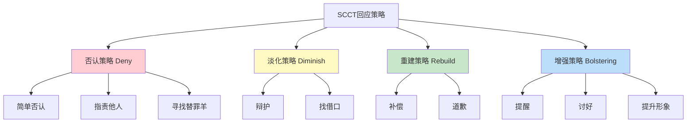
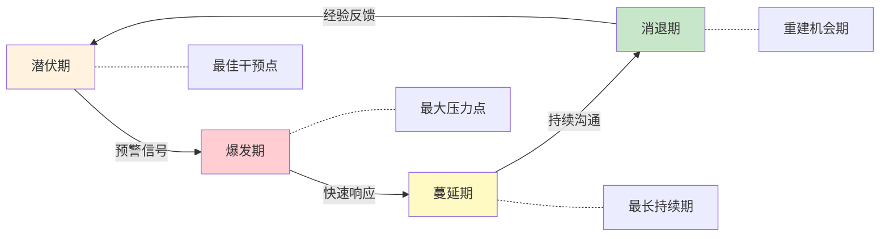
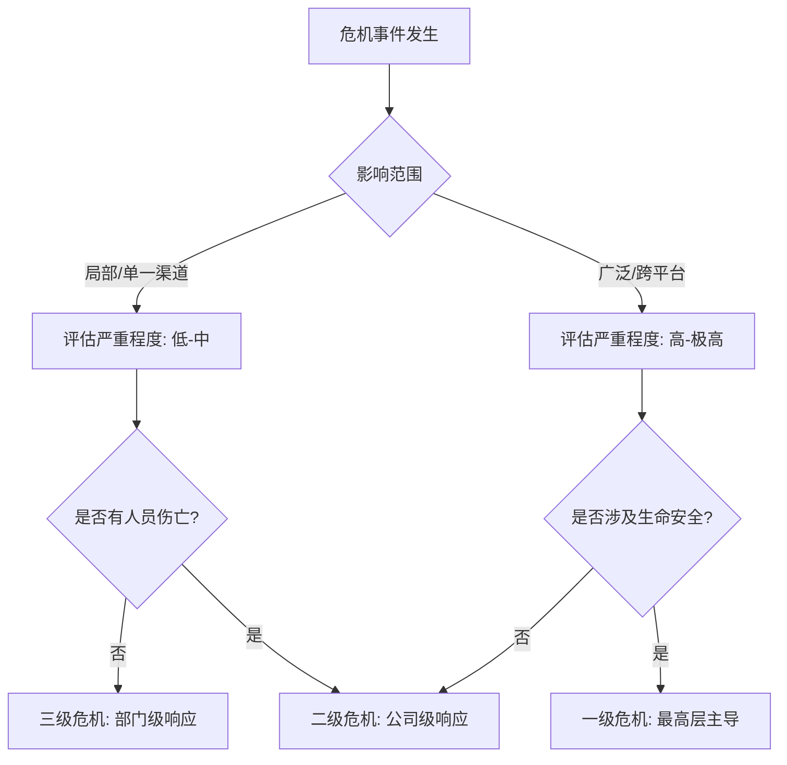
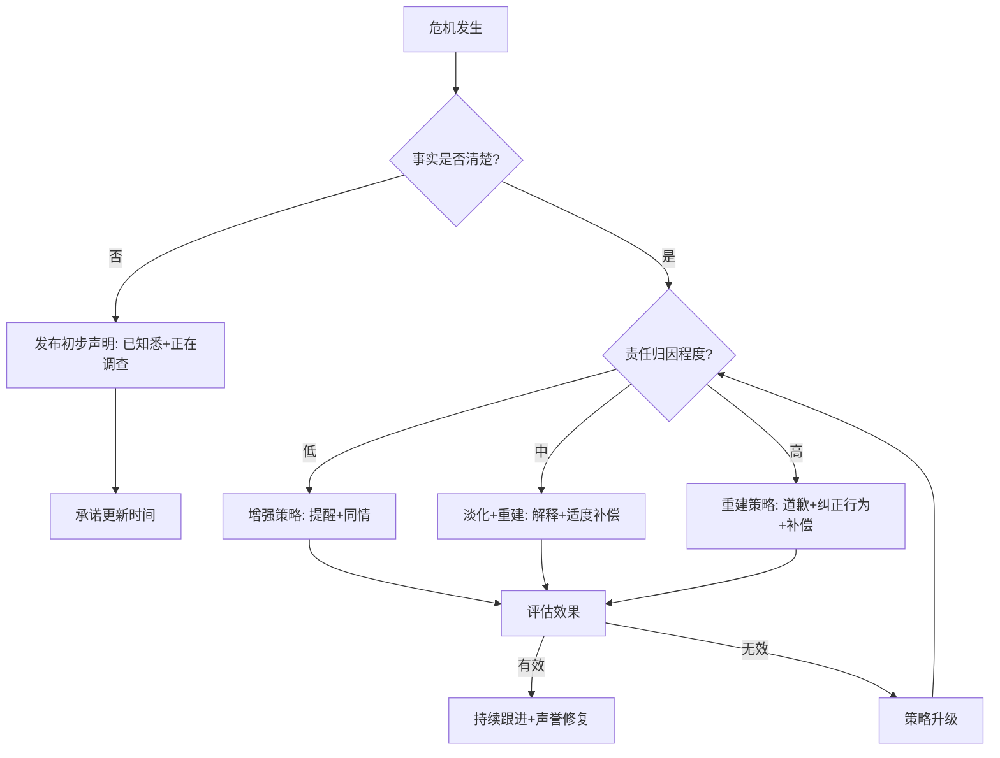
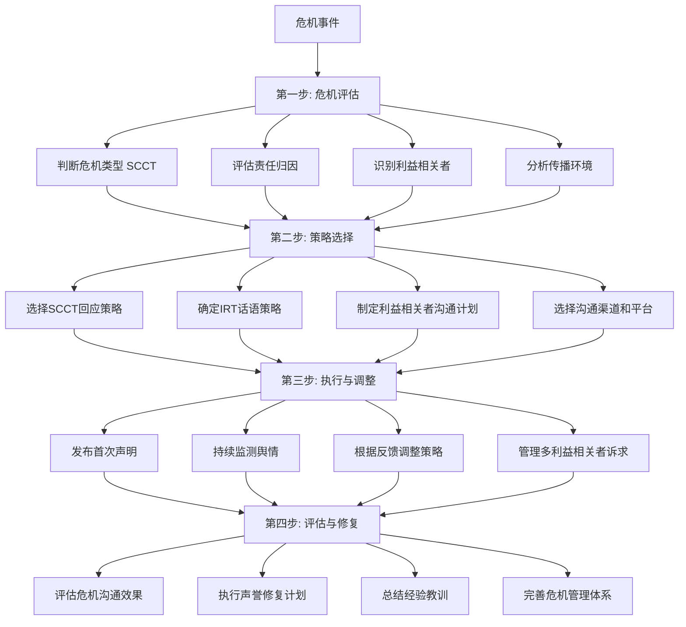

# 危机公关沟通——理论基础

## 一、危机沟通的基本概念

### 1.1 什么是危机

危机（Crisis）一词源于希腊语"krisis"，意为"决定"或"转折点"。在现代管理学和传播学中，危机被定义为一种对组织的正常运营、声誉或生存构成严重威胁的突发事件或情境。美国危机管理学者Steven Fink将危机描述为"一个决定性的时刻或转折点，一个不稳定的、至关重要的时间或状态，一个即将到来的变革的紧要关头"。

危机具有五大核心特征：

**突发性与意外性。** 危机往往在组织意料之外突然爆发，留给决策者的反应时间极为有限。尽管许多危机在事后回顾时可以发现预兆，但在爆发的瞬间，组织往往感到措手不及。例如，2018年某航空公司因乘客被拖拽事件引发全球舆论风暴，从事件发生到全球传播不到24小时。

**不确定性与模糊性。** 危机的起因、影响范围、发展走向往往不明确，决策者需要在信息不完整的情况下做出判断和选择。这种不确定性导致组织常常在"快速回应但可能说错"和"等待更多信息但可能错失时机"之间陷入两难。

**时间压力。** 危机的发展速度往往超出预期，决策者面临巨大的时间压力。在社交媒体时代，这种时间压力更加显著——研究表明，Twitter上危机相关话题的传播在最初2小时内达到峰值，公众期望组织在数小时甚至数分钟内做出回应。

**威胁性。** 危机对组织的核心利益（声誉、财务、运营、人员安全等）构成实质性威胁，可能导致严重后果。哈佛商学院的研究显示，约75%的组织在经历重大危机后，其市场价值在一年内出现显著下降。

**公众关注。** 危机事件通常会引起媒体和公众的广泛关注，组织的行为被置于聚光灯下审视。这种关注本身就是一种压力——组织的每一个动作都会被放大和解读。

### 1.2 危机与问题、风险的区别

理解危机的概念，需要将其与日常"问题"和"风险"加以区分。这三者构成一个动态递进的链路：

**问题（Issue）** 是需要管理但尚未升级为危机的情境。问题的特征是：影响范围有限、公众关注度低、有充足时间处理。例如，某产品收到少量投诉但尚未引发广泛关注、某员工的个人社交媒体言论引起内部讨论但未外传。

**风险（Risk）** 是可能导致危机的潜在因素。风险管理的核心是识别、评估和控制这些潜在因素。例如，食品安全管理中的薄弱环节、网络安全系统的已知漏洞、关键岗位的人才流失风险。

**危机（Crisis）** 是问题或风险升级到一定程度，对组织构成即时威胁并引发广泛公众关注的状态。危机的标志是：影响范围扩大、公众关注度急剧上升、时间压力骤增、需要高层介入。

| 维度 | 风险 | 问题 | 危机 |
|------|------|------|------|
| 时间压力 | 低 | 中 | 高 |
| 公众关注度 | 低 | 中低 | 高 |
| 决策层级 | 中层管理 | 高层参与 | 最高层主导 |
| 资源消耗 | 常规预算 | 预算外追加 | 大量资源调用 |
| 声誉影响 | 潜在 | 局部 | 显著 |
| 处理窗口 | 数月至数年 | 数周至数月 | 数小时至数天 |

这三者之间存在动态转化关系：风险管理不善可能导致问题出现，问题处理不当可能演变为危机。危机沟通的一个重要目标就是防止问题升级为危机。在危机管理实践中，约80%的危机在爆发前存在可识别的预警信号（"前兆信号"），但这些信号往往因为缺乏系统的监测机制而被忽视。

### 1.3 危机沟通的定义与本质

危机沟通（Crisis Communication）是指在危机发生前后，组织与各类利益相关者之间的信息传递、关系管理和意义建构过程。它贯穿危机管理的全生命周期：

**危机前沟通：** 预警信息传递、预案制定与演练、关系网络建立。这一阶段的目标是"防患于未然"——通过建立监测体系、制定应急预案、进行模拟演练，为可能到来的危机做好准备。

**危机中沟通：** 信息发布、媒体应对、利益相关者安抚、内部协调。这是危机沟通的核心阶段，要求组织在极短时间内做出准确判断并传递恰当信息。

**危机后沟通：** 声誉修复、关系重建、经验总结与改进。危机结束后，组织需要通过持续沟通修复受损的声誉和关系。

危机沟通的本质可以从三个维度理解：

**信息维度。** 危机沟通首先是信息的传递——将危机的真实情况、组织的应对措施、后续的发展计划等信息准确传达给利益相关者。信息的准确性、及时性和透明度是这一维度的核心要素。

**关系维度。** 危机沟通也是关系的管理——维护或修复组织与各利益相关者之间的信任关系。危机往往导致信任破裂，而有效的沟通是重建信任的关键途径。

**意义建构维度。** 危机沟通更是意义的建构——组织需要通过沟通为危机事件"赋予意义"，帮助公众理解"发生了什么"、"为什么会发生"、"意味着什么"。谁掌握了意义建构的主导权，谁就掌握了危机沟通的主动权。

***

## 二、情境危机沟通理论（SCCT）

### 2.1 SCCT的核心框架

情境危机沟通理论（Situational Crisis Communication Theory，简称SCCT）是由美国学者W. Timothy Coombs在2007年系统提出的危机沟通理论框架，其前身为1995年提出的形象修复理论的延伸研究。SCCT的核心主张是：有效的危机沟通策略应当根据危机的类型和组织的责任程度来选择，而非采用"一刀切"的方法。

SCCT建立在三个核心假设之上：

**假设一：危机类型决定组织责任程度。** 不同类型的危机，公众对组织责任的归因不同。社会心理学中的归因理论（Attribution Theory）指出，人们在面对负面事件时，会本能地寻找原因和责任方。当公众认为组织对危机负有更大责任时，组织面临更大的声誉威胁。Coombs通过大量实验证实，危机类型能够显著预测公众的责任归因程度。

**假设二：责任归因影响沟通策略选择。** 组织应当根据危机责任的高低，选择相应的回应策略——责任高时需要承担更多责任（如道歉、补偿），责任低时可以进行辩护（如否认、淡化）。这种匹配关系是SCCT的核心实践指导。

**假设三：声誉历史和先前关系影响公众归因。** 组织的声誉历史会影响公众对危机责任的判断。良好的声誉历史相当于"声誉资本"，可以在危机中起到缓冲作用——这就是所谓的"光环效应"（Halo Effect）。研究表明，拥有良好声誉的组织在面对同等程度的危机时，公众倾向于给予更多的"信任空间"。

### 2.2 SCCT的危机类型分类

SCCT将危机分为三大类，每类包含若干子类型。这个分类的关键在于理解每一类危机中公众对组织的责任归因程度：

**受害型危机（Victim Crises）——低责任归因：**

| 子类型 | 描述 | 典型案例 |
|--------|------|----------|
| 自然灾害 | 地震、洪水、台风等不可抗力导致的危机 | 2011年日本地震导致的供应链危机 |
| 工作场所暴力 | 员工或外部人员在组织场所内实施的暴力行为 | 美国校园枪击事件中的学校责任 |
| 产品被恶意篡改 | 产品在离开组织控制后被第三方恶意破坏 | 1982年泰诺投毒事件 |
| 恐怖主义袭击 | 组织成为恐怖袭击的目标 | 9/11事件中的航空公司 |

在这类危机中，组织的责任归因最低，公众通常同情组织。沟通策略上，组织可以以"受害者"身份发声，强调自身也是被伤害的一方，同时表达对受影响群体的关怀。

**事故型危机（Accidental Crises）——中等责任归因：**

| 子类型 | 描述 | 典型案例 |
|--------|------|----------|
| 技术错误导致的事故 | 设备故障、系统崩溃、技术参数偏差 | 2003年美国东北部大停电 |
| 技术缺陷导致的产品召回 | 零部件设计缺陷、材料缺陷 | 丰田"刹车门"事件 |
| 环境污染事故 | 非故意的环境污染事件 | BP墨西哥湾漏油事故（初期定性） |

在这类危机中，组织的责任归因为中等水平。公众认为组织虽然不是故意的，但本可以做得更好。沟通策略需要在"不是故意的"和"我们有责任改进"之间找到平衡。

**可预防型危机（Preventable Crises）——高责任归因：**

| 子类型 | 描述 | 典型案例 |
|--------|------|----------|
| 人为失误导致的产品安全问题 | 忽视安全标准、管理疏忽 | 三聚氰胺事件 |
| 组织故意的不当行为 | 财务欺诈、数据造假、偷工减料 | 安然事件、瑞幸咖啡财务造假 |
| 历史遗留危机 | 过去的行为导致的长期健康或环境问题 | 石棉产品导致的健康问题 |

在这类危机中，组织的责任归因最高，公众的愤怒和不满最为强烈。公众认为组织"明知故犯"，这种道德判断使得否认和淡化策略几乎完全失效，组织必须采取积极的重建策略。

### 2.3 SCCT的回应策略体系

SCCT提出了层次分明的回应策略体系，从"防守"到"进攻"依次递进：

**否认策略（Deny）** 适用于低责任归因的危机，包括三种具体策略：

- **简单否认：** 直接否认危机的存在或组织的参与。例如，"我公司产品与该事件无关。"这种策略风险较高，一旦被证伪将严重损害信誉。
- **指责他人：** 将责任推给第三方。例如，"这是供应商的问题，我公司也是受害者。"这种策略需要有明确的证据支持。
- **寻找替罪羊：** 将责任归咎于某个个体或部门。例如，"这是个别员工的违规行为，不代表公司立场。"这种策略短期内有效，但可能引发内部不满。

**淡化策略（Diminish）** 适用于中低责任归因的危机，包括两种具体策略：

- **辩护：** 强调危机并非如外界所想的那么严重。例如，"该问题仅影响极少数产品批次，绝大多数消费者不受影响。"这种策略需要提供可信的数据支撑。
- **找借口：** 强调组织无法控制危机的发生。例如，"在当时的极端天气条件下，任何企业都无法完全避免此类问题。"这种策略需要强调外部因素的真实性和决定性。

**重建策略（Rebuild）** 适用于中高责任归因的危机，包括两种具体策略：

- **补偿：** 向受害者提供物质补偿。例如，召回问题产品、退款、提供免费服务等。补偿的金额和方式需要与危机的严重程度匹配——过少显得敷衍，过多则可能被解读为"认罪"。
- **道歉：** 承认错误并表达歉意。道歉需要包含对错误的明确承认、对受害者感受的理解、以及改正措施的承诺。

**增强策略（Bolstering）** 通常作为辅助策略配合其他策略使用，包括三种具体策略：

- **提醒：** 提醒公众组织过去的良好表现。例如，"在过去的20年中，我公司从未发生过类似事件。"这种策略利用"光环效应"缓冲声誉损失。
- **讨好：** 表达对利益相关者的同情和关怀。例如，"我们对受影响的家庭深感痛心。"这种策略旨在建立情感连接。
- **提升形象：** 强调组织的正面特质和价值观。例如，"我公司始终将消费者安全放在首位。"这种策略需要有具体行动支撑，否则会被视为"空话"。

### 2.4 SCCT的策略匹配矩阵

SCCT的核心价值在于提供了一个"危机类型—策略匹配"的决策框架：

| 危机类型 | 责任归因 | 推荐策略 | 不推荐策略 |
|----------|----------|----------|------------|
| 受害型 | 低 | 增强 + 淡化 | 道歉（过度道歉反而不自然） |
| 事故型 | 中 | 淡化 + 重建（适度） | 否认（已有中等证据） |
| 可预防型 | 高 | 重建（道歉 + 补偿）+ 增强 | 否认、淡化（适得其反） |

**原则一：匹配原则。** 回应策略应当与危机类型和责任程度相匹配。对于可预防型危机，组织应当采取重建策略（如道歉、补偿），而非否认或淡化。研究表明，当高责任归因的危机中组织采取否认策略时，公众的愤怒会显著增加，导致声誉损失扩大2-3倍。

**原则二：充分原则。** 对于责任程度较高的危机，仅使用否认或淡化策略是不够的，还需要配合重建策略来修复声誉。例如，在产品安全危机中，仅道歉而不召回问题产品，公众会认为组织"光说不做"。

**原则三：一致性原则。** 沟通策略应保持一致，避免在不同场合传递矛盾的信息。不一致的沟通会被公众解读为"缺乏诚意"或"隐瞒真相"。例如，在新闻发布会上道歉但在社交媒体上暗示"错不在我们"，这种矛盾会迅速被发现并放大。

**原则四：适度原则。** 过度道歉或过度补偿可能被视为"认罪"，反而强化公众对组织责任的归因。在低责任归因的危机中，过度道歉会显得不自然，甚至引发公众的怀疑——"如果他们这么诚恳地道歉，那一定是有更大的问题"。

### 2.5 SCCT的理论局限与批评

SCCT虽然是危机沟通领域最有影响力的理论之一，但并非没有局限：

**文化适用性问题。** SCCT主要基于西方文化背景下的研究，其对公众归因行为的假设在不同文化中可能不完全成立。例如，在集体主义文化中，公众对危机的责任归因模式可能与个人主义文化存在差异。

**情境简化问题。** SCCT的三分类（受害型/事故型/可预防型）是对复杂现实的简化。许多危机事件可能跨越多个类型，或者在发展过程中从一种类型转变为另一种类型。

**忽略情感因素。** SCCT主要从认知角度（责任归因）分析危机，对情感因素（愤怒、恐惧、同情）的关注相对不足。后续研究（如Coombs & Holladay的扩展研究）开始将情感反应纳入分析框架。

**线性假设问题。** SCCT假设公众的责任归因相对稳定，但实际上，归因会随着新信息的出现和舆论的发展而动态变化。

***

## 三、形象修复理论（IRT）

### 3.1 理论概述

形象修复理论（Image Repair Theory，简称IRT）由William Benoit在1995年系统提出，其理论渊源可追溯到Kenneth Burke的"辩解"（Apologia）研究和Ware & Linkugel的"辩护话语"分类。IRT的核心假设是：维护良好的形象是个人和组织的首要目标，当形象受到威胁时，行为者会采取各种话语策略来修复形象。

Benoit将形象修复策略分为五大类，每类包含若干子策略：

**策略一：否认（Denial）——共2种子策略**

- **简单否认：** 直接声称自己没有做过被指控的行为。例如，"我公司从未在产品中使用过该禁用成分。"
- **转移责任：** 将责任推给他人。例如，"该问题源于第三方物流公司的运输失误。"

**策略二：逃避责任（Evasion of Responsibility）——共4种子策略**

- **挑衅（Provocation）：** 表示组织的行为是对他人不当行为的回应。例如，"我们的涨价是因为上游原材料成本上涨了30%。"
- **缺陷（Defeasibility）：** 表示问题源于组织无法控制的因素，通常涉及信息不足。例如，"在事故发生时，我们并不知晓该设备存在安全隐患。"
- **意外（Accident）：** 强调问题是一次意外事件，而非组织的常态。例如，"这是一个极其罕见的生产线偶发故障。"
- **善意（Good Intentions）：** 表示组织的行为出于良好意图，尽管结果不理想。例如，"我们推出该功能是为了给用户更好的体验，但我们理解它给部分用户带来了不便。"

**策略三：降低事件的冒犯性（Reducing Offensiveness）——共6种子策略**

- **强化（Bolstering）：** 强调组织的正面特质，用"好印象"对冲"坏印象"。例如，"我公司成立30年来，累计捐助超过10亿元用于公益事业。"
- **最小化（Minimization）：** 淡化问题的严重性。例如，"该问题仅影响了不到万分之一的用户。"
- **区分（Differentiation）：** 将事件与更糟糕的情况进行对比。例如，"与行业内其他企业相比，我公司的事故率处于最低水平。"
- **超越（Transcendence）：** 将事件置于更宏观的背景下，使其显得不那么重要。例如，"在当前全球经济下行的大环境下，企业面临前所未有的压力。"
- **攻击指控者（Attack Accuser）：** 质疑指控者的可信度或动机。例如，"该举报人因个人恩怨对公司进行恶意报复。"——此策略风险极高，使用不当会适得其反。
- **补偿（Compensation）：** 向受害者提供补偿以减轻负面影响。例如，"我们将为所有受影响的用户提供全额退款及额外赔偿。"

**策略四：纠正行为（Corrective Action）——采取实际行动解决问题并防止再次发生。**

例如，"我们已经召回所有问题产品，并将投入5亿元升级生产线和质量检测系统。"纠正行为是修复信任最有效的策略之一，因为它表明组织不仅在说，而且在做。

**策略五：承认道歉（Mortification）——承认错误，表达真诚的歉意，请求原谅。**

例如，"我们深刻认识到自身的错误，向所有受影响的消费者真诚道歉。"Mortification一词源于宗教中的"忏悔"，强调的是真诚的自我反省和改过的意愿。

### 3.2 IRT策略选择的决策逻辑

选择哪种策略组合，取决于三个关键因素的综合判断：

**因素一：危机事实的清晰度。** 当危机事实尚不明确时，否认策略可能有效——因为公众也处于信息不确定状态，愿意给组织"疑罪从无"的空间。但当事实已经清楚时，否认只会适得其反，因为它会被解读为"狡辩"甚至"欺骗"。

**因素二：组织的责任程度。** 责任程度越高，越需要采取纠正行为和道歉策略。在高责任归因的情况下，公众的首要需求是看到组织"认错"和"改正"，而非"解释"和"辩护"。

**因素三：公众的期望。** 公众对不同行业、不同规模的组织有不同的期望。例如，公众对食品企业的安全标准期望远高于对科技公司的期望；对大型跨国企业的行为标准期望远高于对中小企业的期望。这些期望差异会影响他们对沟通策略的接受程度。

**因素四：与SCCT的整合视角。** IRT与SCCT可以互补使用：SCCT帮助判断"应该采取哪类策略"（基于危机类型和责任归因），IRT则提供了更丰富的"具体话语策略选择"。在实践中，许多危机沟通案例同时运用了两个理论框架。

***

## 四、危机生命周期理论

### 4.1 Fink的危机生命周期模型

Steven Fink在1986年的著作《危机管理：为不可避免的事情做计划》（Crisis Management: Planning for the Inevitable）中提出了危机生命周期模型。他将危机比作疾病——有潜伏期、发作期、延续期和康复期。这个模型的核心价值在于帮助管理者理解危机的动态本质，而非将其视为一次性的孤立事件。

**第一阶段：潜伏期（Prodromal Stage）**

危机的征兆开始出现，但尚未引起广泛关注。这一阶段是危机预防的最佳时机——"治未病"远比"治已病"更有效。潜伏期的信号包括：社交媒体上负面提及频率的微妙上升、客户投诉数量的缓慢增长、员工满意度的下降、监管机构的例行检查频率增加等。

潜伏期的沟通重点是"预警"——建立监测体系，及时发现并评估预警信号。许多危机之所以成为危机，恰恰是因为在潜伏期缺乏有效的监测和响应机制。

**第二阶段：爆发期（Acute Stage）**

危机正式爆发，对组织造成直接冲击。这一阶段通常是最混乱、压力最大的时期——信息碎片化、各方诉求冲突、媒体穷追不舍。爆发期的持续时间因危机类型而异，通常为24-72小时，但在社交媒体时代可能被压缩到数小时。

爆发期的沟通重点是"快速响应"——在"黄金4小时"内发布初步声明，表明组织已知悉事件并正在积极处理。即使无法提供完整信息，也要传递三个核心信号：我们知道了、我们关心、我们在行动。

**第三阶段：蔓延期（Chronic Stage）**

危机的影响持续扩散，媒体和公众持续关注。这一阶段可能持续数天到数月，取决于危机的性质和组织的应对效果。蔓延期的典型特征是：新的信息不断涌现、公众情绪持续发酵、各方利益相关者提出不同诉求。

蔓延期的沟通重点是"持续更新"——保持信息的持续流动，定期发布进展报告，主动回应公众关切，避免信息真空被猜测和谣言填充。

**第四阶段：消退期（Resolution Stage）**

危机的影响逐渐减弱，组织进入恢复和重建阶段。这并不意味着危机已经完全结束——"余震"随时可能出现。消退期的沟通重点是"修复与重建"——修复受损的声誉和关系，总结经验教训，完善危机管理体系。

### 4.2 危机生命周期与沟通策略矩阵

| 阶段 | 核心特征 | 沟通重点 | 关键行动 | 沟通渠道 |
|------|----------|----------|----------|----------|
| 潜伏期 | 征兆出现、关注低 | 预警与预防 | 监测舆情、制定预案、培训人员、建立媒体关系 | 内部通报、行业交流 |
| 爆发期 | 快速扩散、压力最大 | 快速响应 | 首次声明、媒体沟通、内部协调、法律评估 | 新闻发布会、官方声明、社交媒体 |
| 蔓延期 | 持续关注、信息涌现 | 持续更新 | 进展发布、利益相关者维护、问题解决 | 多渠道持续发声 |
| 消退期 | 影响减弱、进入恢复 | 修复与重建 | 声誉修复、关系重建、经验总结、体系完善 | 专访、深度报道、年度报告 |

### 4.3 "黄金时间窗口"理论

危机沟通中的"黄金时间窗口"是生命周期理论在实践中的关键应用：

**第一个小时（"黄金一小时"）：** 社交媒体时代的黄金响应时间。在第一个小时内，组织需要完成：事件确认、核心团队组建、初步评估、内部通报。公众在此阶段最关注的是"组织是否知道了这件事"。

**前四个小时（"声明窗口"）：** 组织需要发布正式声明的时间窗口。声明不需要面面俱到，但需要传递核心信号：事件认知、关切态度、行动承诺、后续安排。

**前二十四小时（"立场窗口"）：** 组织需要明确立场和初步方案的时间窗口。在这个阶段，公众已经开始形成对事件的判断，组织需要通过清晰的沟通影响这些判断。

**前三天（"叙事窗口"）：** 组织需要主导叙事框架的时间窗口。三天之后，媒体和公众已经形成了对事件的基本叙事框架，组织的影响力将大幅下降。

***

## 五、利益相关者理论在危机沟通中的应用

### 5.1 利益相关者识别与分类

在危机情境下，组织需要识别所有受危机影响的利益相关者群体，并了解他们的核心关切和关键诉求。危机中的利益相关者比日常经营中更加多元、诉求更加强烈、彼此之间的利益冲突更加尖锐。

**内部利益相关者：**

| 利益相关者 | 核心关切 | 关键诉求 | 沟通频率 |
|------------|----------|----------|----------|
| 员工 | 工作安全感、公司前景 | 及时准确的信息、明确的行动指引 | 实时/每日 |
| 管理层 | 决策依据、风险控制 | 全面信息、危机应对方案 | 实时 |
| 董事会/股东 | 财务影响、法律责任 | 定期汇报、风险评估报告 | 每日/定期 |

**外部利益相关者：**

| 刣益相关者 | 核心关切 | 关键诉求 | 沟通渠道 |
|------------|----------|----------|----------|
| 消费者/客户 | 产品安全、服务保障 | 问题说明、解决方案、赔偿承诺 | 官方声明、客服、社交媒体 |
| 媒体 | 新闻价值、公众知情权 | 信息获取、独家角度、回应机会 | 新闻发布会、媒体通稿 |
| 政府监管部门 | 合规性、公共安全 | 合规报告、整改措施 | 正式函件、专题汇报 |
| 社区居民 | 环境安全、生活影响 | 信息透明、参与决策、补偿安置 | 社区会议、公开信 |
| 供应商和合作伙伴 | 合作稳定性、连带影响 | 关系确认、业务连续性 | 直接沟通、商务函件 |
| 投资者 | 投资回报、风险敞口 | 财务影响评估、恢复预期 | 投资者电话会议、公告 |
| 竞争对手 | 市场机会、行业影响 | （通常不直接沟通，但需要预判其反应） | — |
| 行业协会 | 行业声誉、标准规范 | 行业沟通、标准制定参与 | 行业会议、正式函件 |

### 5.2 利益相关者分析的三维模型

Mitchell、Agle和Wood在1997年提出的利益相关者显著性模型（Stakeholder Salience Model）为危机中的利益相关者优先级排序提供了有效框架。该模型从三个维度评估利益相关者的重要性：

**影响力（Power）：** 该群体对危机结果的影响力有多大？政府监管部门拥有法律强制力，媒体拥有舆论影响力，消费者拥有购买力和传播力。

**紧迫性（Urgency）：** 该群体的诉求是否需要立即回应？直接受害者的诉求具有最高紧迫性，投资者的诉求紧迫性相对较低。

**正当性（Legitimacy）：** 该群体的关切是否具有正当性？直接受影响的消费者、员工的关切具有最高正当性，竞争对手的关切正当性较低。

根据这三个维度的组合，利益相关者可以被分为七种类型：

| 维度组合 | 类型 | 典型代表 | 沟通优先级 |
|----------|------|----------|------------|
| 影响力+紧迫性+正当性 | 确定型 | 受害消费者、监管机构 | 最高 |
| 影响力+紧迫性 | 依赖型（待确认正当性） | 社交媒体大V | 高 |
| 影响力+正当性 | 危险型（待确认紧迫性） | 重要投资者 | 高 |
| 紧迫性+正当性 | 依赖型（影响力待确认） | 普通消费者 | 中高 |
| 仅影响力 | 自主型 | 政府官员（非直接相关） | 中 |
| 仅紧迫性 | 自主型 | 受影响社区居民 | 中 |
| 仅正当性 | 自主型 | 行业协会 | 中低 |

### 5.3 多利益相关者沟通的冲突与平衡

危机沟通中，组织常常面临多方利益相关者的不同诉求之间的冲突。这些冲突不是偶然的，而是危机情境下的结构性矛盾：

**冲突一：透明度与法律风险。** 消费者和媒体要求公开详细信息，但法律部门建议谨慎披露。过度透明可能暴露法律弱点，过度谨慎则会被视为"隐瞒"。平衡策略：在法律允许的范围内尽可能透明，对无法披露的信息明确说明原因（"因调查仍在进行，某些细节暂时无法公开"）。

**冲突二：速度与准确性。** 媒体要求快速回应，但调查需要时间。平衡策略：采用"渐进式披露"——先发布已确认的信息，承诺后续持续更新，避免在信息不完整时做出确定性声明。

**冲突三：内部知情与外部控制。** 员工需要内部信息以消除恐慌和谣言，但担心信息泄露至外部。平衡策略：通过正式的内部沟通渠道（全员邮件、内部会议）向员工通报情况，同时明确信息保密要求。

**冲突四：短期止血与长期修复。** 快速道歉可以短期内平息公众愤怒，但可能影响长期的法律策略。平衡策略：将危机沟通分为"短期应急"和"长期修复"两个阶段，在不同阶段采用不同策略。

***

## 六、社交媒体时代的危机传播理论

### 6.1 社交媒体改变了危机传播的底层逻辑

社交媒体的兴起不是对传统危机传播模式的"量变"，而是"质变"——它从根本上改变了危机传播的底层逻辑：

**去中心化传播。** 传统的"组织→媒体→公众"的线性传播模式被打破。在社交媒体时代，每个用户都可以成为信息的发布者和传播者，一个普通消费者的帖子可能比官方声明传播得更广更快。这意味着组织无法再通过"控制媒体渠道"来控制叙事。

**实时互动。** 公众可以即时表达意见、提出质疑，组织需要实时回应。危机传播从"事件驱动"变成了"对话驱动"——组织不仅要发布信息，还要参与对话。

**算法放大。** 社交媒体的推荐算法倾向于放大情感化、戏剧化的内容。愤怒、恐惧、义愤等负面情绪比理性分析更容易获得算法推荐，这意味着危机相关的内容会以"自然加速"的方式传播。

**信息碎片化。** 社交媒体上的信息呈现碎片化特征，公众往往只看到事件的某个片段而非全貌。这种碎片化容易导致误解和片面解读。

**持久记忆。** 社交媒体创造了"数字记忆"——过去的危机事件永远不会被真正遗忘。搜索引擎和社交媒体存档使得任何历史事件都可以被重新翻出来。

### 6.2 社交媒体危机的特征与演变模式

在社交媒体上爆发的危机具有一些独特的特征和演变模式：

**传播速度：** 传统危机的传播周期以"天"为单位，社交媒体危机以"小时"甚至"分钟"为单位。研究表明，危机信息在微博上的传播在最初2小时内可覆盖核心受众的60%以上。

**传播范围：** 地域限制被打破，地方性事件可能迅速引发全国甚至全球关注。一个三线城市的品牌投诉可能在24小时内登上全国热搜。

**参与主体：** 公众不再是被动的信息接收者，而是积极参与讨论、表达诉求的主体。"围观"本身就是一种参与，"转发"本身就是一种表态。

**情感驱动：** 社交媒体上的讨论往往更情绪化，理性分析的空间被压缩。一个具有情感冲击力的个人故事，其传播力远超一份逻辑严密的官方声明。

**跨平台迁移：** 危机信息会在不同社交媒体平台之间迁移传播。一个在抖音上爆火的事件会被转移到微博讨论、在微信朋友圈转发、被知乎深度分析、最后被传统媒体跟进报道。

### 6.3 各主流平台的危机传播特征与应对策略

不同社交媒体平台具有不同的传播机制和用户特征，危机沟通策略需要因平台而异：

**微博：** 公共舆论广场，危机信息传播最快、影响最大的平台。特征是公开性高、传播链短、热搜效应强。应对策略：第一时间在官方微博发布声明，利用热搜话题主动设置议程，积极回应高影响力用户的质疑。

**微信（公众号/朋友圈）：** 半封闭社交空间，信息传播更依赖社交关系链。特征是信任度高、传播链长、可控性相对较好。应对策略：通过官方公众号发布深度说明，准备"转发友好"的简明版本便于朋友圈传播。

**抖音/快手：** 短视频平台，视觉化、情感化内容传播力最强。特征是传播速度快、情感冲击力大、评论区易形成"舆论场"。应对策略：制作简洁有力的视频回应，关注评论区的舆论走向，必要时通过短视频进行正面信息传播。

**知乎：** 深度讨论社区，用户倾向理性分析和深度解读。特征是讨论深度大、影响力持久、SEO权重高。应对策略：以专业态度回应质疑，提供有深度的分析和数据，避免情绪化对抗。

**小红书：** 消费决策社区，产品类危机的主要发酵平台。特征是用户以女性为主、消费决策影响力大、"种草/拔草"效应明显。应对策略：通过真实用户反馈和第三方验证重建信任，避免纯官方话术。

### 6.4 社交媒体危机监测体系

有效的社交媒体危机监测是危机沟通的"眼睛"，其核心要素包括：

**监测维度：**
- 关键词监测：品牌名、产品名、高管姓名 + 负面关联词
- 情感分析：自动识别正面/负面/中性情绪
- 传播路径追踪：识别关键传播节点和引爆点
- 竞品对比：对比同行业其他品牌的舆情动态

**预警等级：**

| 等级 | 判定标准 | 响应要求 |
|------|----------|----------|
| 绿色（正常） | 负面提及占比 < 5%，无集中爆发 | 常规监测 |
| 黄色（关注） | 负面提及占比 5%-15%，有上升趋势 | 加强监测，准备预案 |
| 橙色（预警） | 负面提及占比 15%-30%，出现话题集中 | 启动应急预案，准备声明 |
| 红色（危机） | 负面提及占比 > 30%，登上热搜/热榜 | 全面启动危机响应 |

***

## 七、道歉心理学与道歉声明研究

### 7.1 道歉的心理机制

道歉之所以能够有效修复关系和声誉，是因为它通过以下心理机制发挥作用：

**归因改变机制。** 有效的道歉能够改变公众对组织责任的归因——从"故意为之"转变为"虽犯错但态度诚恳"。社会心理学研究表明，当一个人/组织真诚道歉时，观察者会将其行为归因从"能力缺陷"转向"偶发失误"，从"道德缺陷"转向"判断失误"。这种归因转变可以显著降低公众的愤怒程度。

**情感修复机制。** 真诚的道歉能够缓解受害者和公众的负面情绪，特别是愤怒和失望。心理学研究发现，道歉能够激活受害者的"共情反应"——当受害者感知到道歉者的真诚悔意时，他们更容易产生原谅的意愿。

**信任信号机制。** 道歉是一种"信任投资"信号——它表明组织愿意承担声誉损失的风险来表达诚意。这种"脆弱性展示"本身就能够降低公众的防御心理，为信任重建创造空间。

**公平感知机制。** 道歉满足了公众对"程序正义"的需求——即使物质损失无法完全弥补，一个真诚的道歉能够让受害者感到"被尊重"和"被看见"，从而满足其心理需求。

### 7.2 有效道歉的六要素模型

基于社会心理学研究和大量危机沟通案例分析，一个有效的道歉需要包含以下六个要素：

**要素一：明确承认错误（Acknowledgement）。** 具体指出组织做错了什么，不回避、不模糊、不泛泛而谈。反面示例："我们为任何可能的不便表示歉意。"（模糊不清）正面示例："我们确认在产品X的生产过程中使用了不符合标准的原材料，这是不可接受的。"

**要素二：表达真诚歉意（Expression of Regret）。** 使用真诚的语言表达歉意和遗憾。注意"歉意"和"遗憾"的区别——"遗憾"可以保持一定距离，"歉意"则更直接地承担责任。在高责任归因的危机中，应使用"歉意"而非"遗憾"。

**要素三：承担责任（Accountability）。** 不推诿、不找借口、不将责任转嫁他人。关键测试：去掉道歉中的所有"但是"和"因为"之后，道歉是否仍然成立？如果去掉这些词之后道歉变得空洞，说明道歉中隐含了推卸责任的成分。

**要素四：解释原因而非辩解（Explanation vs. Excuse）。** 说明导致错误的原因有助于公众理解事件，但必须与辩解区分。区别在于：解释的目的是"帮助理解"，辩解的目的是"减轻责任"。一个简单的检验：解释会让公众觉得"原来如此"，辩解会让公众觉得"又在找借口"。

**要素五：承诺改正（Corrective Action）。** 说明将采取什么措施防止类似问题再次发生。这是有效道歉中最具说服力的要素——它将道歉从"语言"提升到"行动"层面。承诺需要具体、可衡量、有时间表。反面示例："我们会加强管理。"正面示例："我们将在30天内完成所有产品的质量复查，并在60天内完成生产线的升级改造。"

**要素六：提供补偿（Compensation）。** 向受害者提供适当的补偿。补偿的类型和金额需要与危机的严重程度匹配。补偿不仅是物质层面的，也可以是情感层面的——例如，邀请受影响的消费者参与产品改进的讨论。

### 7.3 道歉的时机、形式与发布者选择

**时机决策矩阵：**

| 情况 | 建议时机 | 理由 |
|------|----------|------|
| 事实已清楚、责任明确 | 立即道歉 | 速度体现诚意 |
| 事实部分清楚 | 声明+承诺后续道歉 | 避免信息真空，同时避免"仓促认罪" |
| 事实不清、争议大 | 暂缓道歉，先调查 | 过早道歉可能影响法律策略 |
| 公众情绪极度愤怒 | 快速表态关怀，适时正式道歉 | 先降温再系统回应 |

**发布者选择原则：**

- **重大危机（涉及生命安全、大规模影响）：** CEO或最高负责人亲自道歉。级别过低的道歉者会被认为"不重视"。
- **中等危机（产品缺陷、服务问题）：** 相关业务负责人或公关总监出面。
- **轻微危机（个别投诉、小范围影响）：** 客服部门或品牌大使回应。

**道歉渠道选择：**

- 重大危机：新闻发布会 + 官方声明 + 社交媒体同步发布
- 中等危机：官方声明 + 社交媒体回应
- 轻微危机：社交媒体直接回复 + 客服渠道

### 7.4 道歉的常见失败模式

**失败模式一：非道歉式道歉。** "如果有人感到被冒犯，我们表示歉意。"——这种道歉将责任转嫁给了"被冒犯的人"，而非承认自身行为的不当。

**失败模式二：过度辩解式道歉。** 道歉中充斥着"但是"和"因为"，实质上是在用道歉的外衣包装辩护。

**失败模式三：延迟道歉。** 在事实已经清楚、公众已经愤怒之后才迟迟道歉，错过最佳时机。

**失败模式四：不对称道歉。** 道歉的力度与危机的严重程度不匹配——大事化小，小事化大。

**失败模式五：言行不一。** 道歉之后没有实际的改正行动，或者改正行动流于形式。"道歉—遗忘—再犯"的循环比不道歉更损害信誉。

***

## 八、危机沟通中的法律考量

### 8.1 法律风险与沟通策略的平衡

危机沟通中，法律部门和公关部门之间的张力是组织面临的最大内部协调挑战之一。这种张力源于两个部门的不同目标函数：

**法律部门的目标函数：** 最小化法律风险和诉讼损失。核心策略是谨慎措辞、避免承认法律责任、保护组织免受诉讼风险。

**公关部门的目标函数：** 最大化声誉保护和公众信任。核心策略是坦诚沟通、积极回应公众关切、展现组织的责任感。

在实践中，过度偏向法律立场可能导致：沟通语言生硬、缺乏人情味、引发公众反感、错失危机沟通的最佳时机。过度偏向公关立场则可能：在不经意间承认法律责任、暴露组织弱点、为后续诉讼提供不利证据。

平衡策略：建立"法律—公关"联合工作机制，在危机爆发前就明确哪些信息可以公开、哪些需要法律审核、哪些需要延迟披露。在危机中，法律部门应参与但不应主导沟通策略——最终决定权应归于危机管理团队的最高负责人。

### 8.2 中国法律环境下的危机沟通法规框架

在中国法律环境下，危机沟通需要特别关注以下法规：

**《中华人民共和国网络安全法》（2017年实施）：** 要求网络运营者在发生网络安全事件时，及时向用户和有关主管部门报告。第42条规定，网络运营者应当采取技术措施和其他必要措施，确保其收集的个人信息安全，防止信息泄露、毁损、丢失。

**《中华人民共和国消费者权益保护法》：** 第19条规定，经营者发现其提供的商品或者服务存在缺陷，有危及人身、财产安全危险的，应当立即向有关行政部门报告和告知消费者，并采取停止销售、警示、召回等措施。

**《中华人民共和国食品安全法》：** 对食品安全事故的信息发布和报告有严格要求，企业必须在规定时间内向监管部门报告，不得隐瞒、谎报、缓报。

**《中华人民共和国突发事件应对法》：** 对突发事件的信息报告和发布有明确规定，要求统一、准确、及时发布信息。

**《中华人民共和国广告法》：** 对危机中的宣传和声明内容有规范要求，避免虚假宣传和误导性信息。

**《上市公司信息披露管理办法》：** 对上市公司的危机信息有特别的披露要求，必须在规定时间内进行临时公告。

### 8.3 "不道歉"法律的保护

"不道歉"法律（Apology Laws）是一种立法趋势——许多国家和地区已经制定了此类法律规定，规定道歉言论不能在后续的法律程序中作为承认过错的证据。

目前全球约有35个以上的司法管辖区制定了不同形式的"不道歉"法律，包括美国约35个州、加拿大部分省份、澳大利亚等。中国目前尚未制定专门的"不道歉"法律，但在司法实践中，真诚的道歉在调解和民事案件中通常被视为积极因素。

了解这些法律规定，有助于组织在危机中更积极地表达歉意——至少在法律层面，道歉不会自动转化为"认罪"。

### 8.4 危机沟通中的法律审查清单

在发布任何危机声明之前，需要经过以下法律审查：

- [ ] 声明内容是否可能被解读为承认法律责任？
- [ ] 是否涉及尚未公开的调查信息？
- [ ] 是否违反信息披露法规的时效要求？
- [ ] 是否可能引发集体诉讼或消费者索赔？
- [ ] 是否涉及知识产权或商业机密的泄露？
- [ ] 是否与此前的官方声明存在矛盾？
- [ ] 是否符合行业监管机构的报告要求？

***

## 九、文化因素与危机沟通

### 9.1 跨文化危机沟通的理论框架

在跨文化背景下，危机沟通需要理解和适应不同文化的价值观和沟通风格。Hofstede的文化维度理论和Hall的高/低语境文化理论为分析跨文化危机沟通差异提供了有效框架：

**个人主义vs集体主义：** 在个人主义文化（如美国、英国）中，公众更关注组织的责任和个体权利，沟通策略应强调个人赔偿和权利保护。在集体主义文化（如中国、日本）中，公众更关注组织的社会责任和集体利益，沟通策略应强调社会责任感和集体和谐。

**高语境vs低语境文化：** 在高语境文化（如中国、日本、阿拉伯国家）中，沟通更含蓄、间接，"话外之音"比字面意思更重要。在低语境文化（如美国、德国）中，沟通更直接、明确，强调信息的清晰和完整。这意味着同一个道歉声明，在不同文化中可能被完全不同的方式解读。

**权力距离：** 在高权力距离文化（如中国、印度）中，公众更接受来自高层的正式道歉，组织的"态度"（是否尊重公众）比具体内容更重要。在低权力距离文化（如北欧国家）中，公众更期望平等的对话和互动，而非自上而下的"恩赐式"道歉。

**不确定性规避：** 在高不确定性规避文化（如日本）中，公众更期望组织提供详细的信息和明确的解决方案。在低不确定性规避文化（如美国）中，公众对不确定性的容忍度更高，更接受"正在调查中"的回应。

### 9.2 中国文化语境下的危机沟通特点

在中国文化背景下，危机沟通具有以下独特特点，这些特点植根于数千年的文化传统和社会结构：

**重视面子（Face）。** "面子"在中国社会交往中具有核心地位。公众对组织是否"给面子"非常敏感——沟通方式和态度往往比具体内容更重要。一个措辞不当的声明，即使内容合理，也可能因为"态度不好"而引发更大的反弹。在危机沟通中，"态度"至少与"内容"同等重要。

**关系导向。** 中国的社会关系网络（"关系"）在危机传播中发挥重要作用。意见领袖、行业协会、政府关系、媒体关系等构成的关系网络，可以成为危机传播的放大器或减震器。在中国进行危机沟通，"关系管理"是不可或缺的组成部分。

**权威期待。** 中国公众对权威信息源（政府、主流媒体、行业专家）的信任度相对较高。在危机中，获得权威第三方的支持和背书，比组织自说自话更有效。政府监管部门的表态、行业专家的分析、权威检测机构的报告，都是增强组织公信力的重要资源。

**集体情绪传播。** 中国社交媒体上的情绪传播具有显著的"集体性"特征——个体情绪容易在群体互动中被放大和极化。"全民愤怒"的场景在中国社交媒体上并不罕见。应对集体情绪，需要理解其形成机制，而非简单地试图"理性说服"。

**实用主义倾向。** 中国公众对危机回应的评估具有强烈的实用主义倾向——"说了什么"不如"做了什么"重要。组织需要通过实际的补偿、召回、改进等行动来证明其诚意，空洞的道歉只会招致更多的批评。

### 9.3 全球化企业的跨文化危机沟通策略

对于在中国运营的跨国企业，或走出国门的中国企业，跨文化危机沟通需要特别注意：

**本地化策略：** 在不同市场采用本地化的沟通策略，而非全球统一模板。同一份声明可能需要根据当地文化进行调整——不仅是语言翻译，更是文化适配。

**文化敏感性培训：** 对危机沟通团队进行跨文化敏感性培训，避免文化误读。例如，在东亚文化中过度使用"我深感抱歉"可能被视为"过于谦卑"甚至"虚伪"。

**双语/多语种沟通：** 在涉及多国市场的危机中，确保所有关键信息以当地语言及时发布。延迟发布非英语版本会被解读为"不重视"。

***

## 十、危机预警指标体系与评估工具

### 10.1 危机预警指标体系

有效的危机预警依赖于系统化的指标监测。以下是核心预警指标体系：

**舆情类指标：**
- 品牌关键词负面提及率（正常 < 5%，预警 > 15%）
- 负面话题扩散速度（小时级传播量增长率）
- 核心传播节点（KOL、媒体账号）的参与度
- 跨平台传播范围（是否从单一平台扩散至全网）

**运营类指标：**
- 客户投诉数量和趋势变化
- 产品退货率异常波动
- 员工流失率和满意度变化
- 合规审计发现的问题数量

**外部环境指标：**
- 行业监管政策变化
- 竞品危机的连带影响
- 宏观社会情绪和舆论趋势
- 季节性/周期性风险因素

### 10.2 危机严重程度评估矩阵

| 评估维度 | 1分（低） | 2分（中） | 3分（高） | 4分（极高） |
|----------|-----------|-----------|-----------|-------------|
| 影响人数 | < 100 | 100-1000 | 1000-10000 | > 10000 |
| 媒体关注度 | 无主流媒体 | 地方媒体 | 全国媒体 | 国际媒体 |
| 人员安全 | 无人身伤害 | 轻微伤害 | 严重伤害 | 生命威胁 |
| 法律风险 | 无诉讼风险 | 潜在诉讼 | 已有诉讼 | 刑事调查 |
| 财务影响 | < 100万 | 100万-1000万 | 1000万-1亿 | > 1亿 |
| 品牌影响 | 局部影响 | 行业关注 | 公众信任下降 | 品牌危机 |
| 持续时间 | 数小时 | 数天 | 数周 | 数月以上 |

评分规则：总分 7-12分为三级危机，13-20分为二级危机，21-28分为一级危机。

### 10.3 危机沟通决策树

***

## 十一、理论综合与应用框架

### 11.1 整合式危机沟通决策模型

综合以上所有理论，我们可以构建一个完整的危机沟通决策模型，将理论转化为可执行的步骤：

### 11.2 理论框架应用速查表

| 理论框架 | 核心价值 | 适用场景 | 关键输出 |
|----------|----------|----------|----------|
| SCCT | 根据危机类型选择回应策略 | 危机爆发后的策略选择 | 推荐策略组合 |
| 形象修复理论（IRT） | 提供具体的话语策略清单 | 撰写声明和回应内容 | 具体话术建议 |
| 危机生命周期理论 | 理解危机各阶段的沟通重点 | 全生命周期的沟通规划 | 阶段性行动计划 |
| 利益相关者理论 | 识别和管理不同利益相关者诉求 | 多方沟通的优先级排序 | 利益相关者沟通矩阵 |
| 社交媒体危机理论 | 理解数字时代危机传播新特征 | 社交媒体舆情应对 | 平台策略和监测方案 |
| 道歉心理学 | 设计有效的道歉策略 | 道歉声明的撰写和发布 | 道歉要素清单和检查表 |
| 法律考量 | 平衡法律风险与沟通需求 | 声明的法律审查 | 法律审查清单 |

### 11.3 常见误区与纠正

**误区一："危机来了先沉默观察"。** 纠正：沉默不是中立，而是被解读为"心虚"或"不重视"。即使信息不完整，也应在黄金时间窗口内表态。

**误区二："道歉越多越好"。** 纠正：道歉需要与责任归因匹配。在低责任归因的危机中过度道歉，反而会强化公众的责任归因——"他们这么诚恳地道歉，一定是有更大的问题"。

**误区三："发了声明就完事了"。** 纠正：声明只是危机沟通的起点，而非终点。后续的持续更新、实际行动、关系修复才是关键。

**误区四："危机公关就是搞定媒体"。** 纠正：在社交媒体时代，媒体只是众多传播渠道之一。搞定媒体但搞不定社交媒体，危机照样失控。

**误区五："危机过去了就可以翻篇了"。** 纠正：社交媒体的"数字记忆"意味着危机永远不会真正过去。声誉修复需要持续的努力，而非危机结束后的"恢复原状"。

**误区六："照搬成功案例的模板"。** 纠正：危机沟通高度情境化，一个企业的成功策略在另一个企业可能完全失效。理论提供的是思考框架，而非万能模板。
