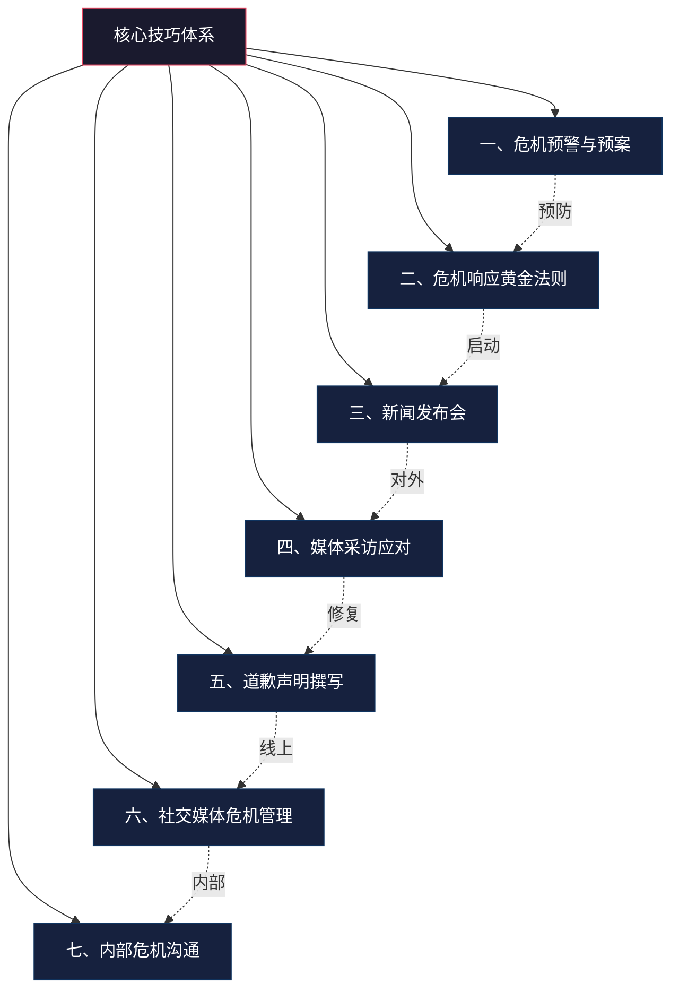
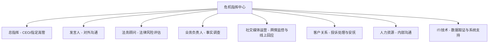
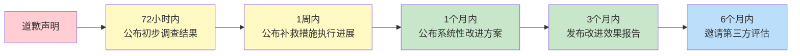

# 危机公关沟通——核心技巧

> 危机公关不是"灭火"的艺术，而是在风暴中重建信任的系统工程。真正的危机沟通高手，不是在危机来临时才展现能力，而是在平时就构建了一套完整的预警、响应、恢复体系。本章将从危机预警的底层逻辑出发，逐层拆解危机响应的黄金法则、媒体应对的核心技巧、社交媒体时代的危机管理策略、内部危机沟通机制，以及危机后的声誉重建方法。

## 一、危机预警与预案制定

### 1.1 理解危机的本质：为什么预警比应对更重要

危机不是突发事件，而是**长期隐患的集中爆发**。一项对全球500强企业的追踪研究表明，83%的重大危机在爆发前已有至少3个月的预警信号，但只有不到30%的企业在信号阶段采取了有效行动。这意味着，绝大多数危机的破坏力并非来自事件本身，而是来自**反应迟缓导致的信任崩塌**。

危机的本质可以从三个维度理解：

**信息维度：** 危机发生时，组织掌握的信息与公众期望获取的信息之间存在巨大鸿沟。这个信息真空会被谣言、猜测和恶意解读迅速填满。预警系统的核心任务就是在信息真空形成之前就介入。

**信任维度：** 品牌信任是一个长期积累、瞬间崩塌的资产。心理学中的"峰终定律"（Peak-End Rule）表明，人们对一段体验的记忆主要取决于峰值时刻和结束时刻。危机恰恰是品牌体验中的"负峰值"，如果处理不当，它会覆盖之前所有正面积累。

**传播维度：** 社交媒体时代的信息传播呈现"病毒式"特征——不是线性增长，而是指数级扩散。一条微博从发布到登上热搜，平均只需要47分钟（微博数据中心2024年报告）。这意味着传统的"24小时响应"窗口已经过时，组织必须具备在1小时内启动响应的能力。

### 1.2 建立舆情监测体系

危机沟通的第一道防线是有效的舆情监测。一个完善的舆情监测体系应包含以下要素：

**监测渠道覆盖：**

| 渠道类型 | 代表平台 | 监测重点 | 工具建议 |
|---------|---------|---------|---------|
| 社交媒体 | 微博、微信公众号、抖音、小红书、B站 | 品牌提及、话题标签、评论情感 | 新榜、飞瓜、蝉妈妈 |
| 新闻媒体 | 门户网站、行业媒体、地方媒体 | 新闻报道、专题策划、评论文章 | 清博大数据、鹰眼速读 |
| 论坛社区 | 知乎、贴吧、豆瓣、脉脉 | 问答讨论、爆料帖、负面评价 | 识微科技、新浪舆情通 |
| 电商/消费平台 | 大众点评、黑猫投诉、12315 | 投诉量、差评趋势、退货率 | 平台自有后台 |
| 境外平台 | Twitter/X、Reddit、YouTube、TikTok | 跨境传播、外媒报道 | Brandwatch、Meltwater |

**监测频率设置：**

- **日常状态：** 每2-4小时进行全面扫描，每日出具舆情日报
- **敏感时期：** 在产品发布、财报季、人事变动等敏感节点，切换为每30分钟扫描一次
- **危机状态：** 启动24小时不间断实时监测，每小时出具舆情快报
- **善后阶段：** 每日3次扫描，关注舆情长尾效应和二次发酵风险

**预警指标体系：**

一个科学的预警指标体系应当包含以下维度，每个维度设置分级阈值：

一级指标（必须立即响应）：
  - 负面信息在2小时内传播量超过10万+
  - 主流媒体（央视/人民日报等）介入报道
  - 监管部门发声或启动调查
  - 品牌相关话题登上微博热搜前10

二级指标（4小时内启动响应）：
  - 负面信息传播量在5万-10万之间
  - 行业媒体或地方媒体跟进报道
  - KOL（粉丝量100万+）发布负面内容
  - 品牌关键词搜索量突增300%以上

三级指标（24小时内关注评估）：
  - 个别消费者投诉引发小范围讨论
  - 竞品相关负面事件波及本品牌
  - 行业性问题引发消费者担忧

**分析报告机制：**

- **日常报告：** 涵盖舆情走势、热点话题、情感倾向分析、竞品对比
- **专项报告：** 危机信号出现时立即生成，包含事件溯源、影响评估、风险预判、建议措施
- **趋势报告：** 月度/季度舆情趋势分析，识别潜在风险点

### 1.3 危机分类分级与响应矩阵

**危机分类：**

| 危机类型 | 典型场景 | 风险特征 | 传播特点 |
|---------|---------|---------|---------|
| 产品质量危机 | 食品安全事故、产品缺陷召回 | 直接影响消费者安全和健康 | 传播极快，情绪化程度高 |
| 高管/员工危机 | 性骚扰、贪腐、不当言论 | 损害企业价值观形象 | 与当事人人格挂钩，难以切割 |
| 数据安全危机 | 用户数据泄露、隐私侵犯 | 涉及法律合规，影响面广 | 持续时间长，监管关注度高 |
| 营销传播危机 | 广告翻车、价值观争议 | 体现企业文化和判断力 | 容易引发二次创作和传播 |
| 供应链/合作方危机 | 供应商违规、合作伙伴暴雷 | 责任界定复杂 | 容易被"连坐" |
| 劳动用工危机 | 裁员争议、加班猝死、劳动纠纷 | 触发社会情绪共鸣 | 脉脉/知乎等职场社区发酵 |
| 环境/社会责任危机 | 污染排放、公益造假 | 涉及公共利益和道德评判 | 政府和NGO关注度高 |

**四级响应矩阵：**

| 等级 | 定义 | 响应时间 | 决策层级 | 响应方式 |
|------|------|---------|---------|---------|
| Ⅰ级（特别重大） | 影响企业生存，全网热搜，监管介入 | 30分钟内 | 董事长/CEO | 全面启动危机指挥中心，24小时值守 |
| Ⅱ级（重大） | 大范围负面传播，主流媒体关注 | 1小时内 | 高管团队 | 启动专项小组，统一口径发布 |
| Ⅲ级（较大） | 局部负面传播，行业媒体关注 | 4小时内 | 部门负责人 | 发布官方声明，定向沟通 |
| Ⅳ级（一般） | 个别投诉，小范围讨论 | 24小时内 | 一线团队 | 常规客服处理，持续监测 |

### 1.4 危机预案的要素

一份完整的危机沟通预案应包含以下核心要素：

**响应团队组建与职责分工：**

每个角色必须有A/B角备份，确保7×24小时可用。总指挥拥有最终决策权，但日常决策可以授权给发言人快速执行。

**标准沟通流程——六步闭环：**

1. **信息收集（15分钟）：** 确认事件真实性，收集关键事实（时间、地点、涉及人员、影响范围）
2. **评估研判（15分钟）：** 确定危机等级，判断传播趋势，识别核心风险
3. **策略制定（30分钟）：** 确定回应立场、核心信息、发布渠道、时间节点
4. **内容审批（30分钟）：** 法务审核、高管审批、口径统一
5. **对外发布（即时）：** 按既定渠道和顺序发布，确保信息一致
6. **效果评估（持续）：** 监测舆情反应，评估回应效果，必要时调整策略

**模板库准备：**

预案中应为每种常见危机场景准备回应模板。模板不是"填空式套话"，而是**结构化框架**——固定的逻辑骨架加上可替换的事实内容。例如：

> 初步声明模板：
> 我们已关注到[具体事件描述]。对此我们高度重视，已于[时间]成立专项工作组进行全面调查。
>
> [如有受害者]我们的首要关切是[受影响群体]的安全与权益。我们已[已采取的具体措施]。
>
> 我们承诺将在[具体时间]内公布调查进展。如有任何疑问，请联系[联络人/热线]。

模板必须定期更新（至少每季度一次），并结合最新案例进行修订。

### 1.5 危机模拟演练

制定预案只是第一步，定期的模拟演练才能确保预案的可执行性。不经过演练的预案，本质上只是一份"文档"而非"能力"。

**桌面推演（Tabletop Exercise）：**

- **频率：** 每季度一次
- **参与人员：** 危机响应团队全体成员
- **方式：** 由主持人抛出模拟危机场景，团队成员按照预案讨论应对决策
- **时长：** 2-4小时
- **输出：** 决策记录、问题清单、预案修订建议
- **成本：** 低，时间灵活，适合高频进行

**实战模拟（Full-Scale Simulation）：**

- **频率：** 每半年一次
- **参与人员：** 响应团队+外部顾问+模拟记者
- **方式：** 模拟真实的危机场景，包括媒体采访、新闻发布、社交媒体回应等全流程。外部顾问扮演"刺头记者"，提出尖锐问题
- **时长：** 半天至一天
- **输出：** 完整的危机应对记录、视频回放分析、个人表现评估
- **成本：** 中高，但对团队能力提升效果显著

**红队测试（Red Team Exercise）：**

- **频率：** 每年一次
- **参与人员：** 外部安全/公关顾问组建的"红队"
- **方式：** 红队从竞争对手、媒体、消费者、黑客等角度向组织发起多维度攻击，检验组织的危机预防和应对能力
- **输出：** 漏洞清单、能力评估报告、改进路线图

**演练后的复盘关键问题：**

1. 预警信号是否被及时发现？如果没有，原因是什么？
2. 内部信息传递是否顺畅？决策链条是否有延迟？
3. 对外声明是否准确、及时、有温度？
4. 发言人面对尖锐问题时的表现如何？
5. 社交媒体回应的速度和质量是否达标？
6. 内部员工是否在第一时间获得了统一口径？

***

## 二、危机响应的黄金法则

### 2.1 "黄金四小时"法则与新时代的时间窗口

传统公关理论中的"黄金24小时"法则在社交媒体时代已经被大幅压缩。根据复旦大学新闻学院2024年发布的《中国网络舆情传播研究报告》，重大危机事件从首次曝光到形成全网热议的平均时间已缩短至**4.2小时**。这意味着组织必须在4小时内完成从信息收集到初步回应的全部流程。

但"4小时"只是均值，实际上不同场景下的时间窗口差异巨大：

| 危机场景 | 时间窗口 | 原因 |
|---------|---------|------|
| 产品质量/安全事故 | 1-2小时 | 直接涉及人身安全，公众容忍度最低 |
| 高管不当言论/丑闻 | 2-4小时 | 社交媒体截图传播极快 |
| 数据泄露事件 | 4-8小时 | 需要技术确认，但不能等太久 |
| 营销传播翻车 | 2-6小时 | 网友截图传播+品牌方删除形成"二次传播" |
| 供应链/合作方问题 | 8-24小时 | 影响链条长，需要更多调查时间 |

**黄金四小时标准动作：**

**第0-30分钟——信息确认阶段：**
- 启动危机响应机制，通知核心团队
- 确认事件真实性（是事实还是谣言？）
- 收集已知信息：什么时间、什么地点、涉及谁、影响范围多大
- 判断信息来源的可信度和传播趋势

**第30-60分钟——策略制定阶段：**
- 确定危机等级（Ⅰ-Ⅳ级）
- 确定回应立场：承认、否认、还是"正在调查"
- 确定核心信息（不超过3条）
- 确定首发渠道（微博？官网？新闻通稿？）
- 起草初步声明

**第1-2小时——对外发布阶段：**
- 声明经法务和高管审核后发布
- 声明核心要素：已知晓事件 → 正在积极调查 → 将尽快公布更多信息 → 提供联络渠道
- 同步启动内部沟通（员工先于外部获知信息）
- 开始媒体定向沟通

**第2-4小时——监测调整阶段：**
- 持续监测舆情反应和传播趋势
- 评估初步声明的效果
- 根据公众反馈准备第二轮回应
- 与监管部门、主要客户等关键利益相关者直接沟通

### 2.2 "3C"回应原则

有效的危机回应应遵循"3C"原则。这不是简单的表态框架，而是一套经过心理学验证的信任重建机制：

**关心（Care）——建立情感连接：**

在危机场景中，公众的第一需求不是"知道真相"，而是"被看见"。神经科学研究表明，当人们处于焦虑和愤怒状态时，大脑的杏仁核（负责情绪处理）会抑制前额叶皮层（负责理性思考）的活动。这意味着，**先安抚情绪，再传递信息**才是正确的顺序。

关心的表达必须具体而非泛泛。对比以下两种表达：

> ❌ "我们对此次事件深表关切"
> ✅ "我们深切理解每一位家长在看到这条消息时的担忧——孩子的安全是我们最在意的事，也是我们不能妥协的底线"

**控制（Control）——展示行动力：**

公众在危机中最害怕的不是问题本身，而是"没人管"的感觉。组织需要清晰地传达：谁在负责？正在做什么？下一步是什么？

控制的表达需要包含三个要素：
1. **主体明确：** "由公司副总裁张XX亲自领导的专项工作组已于今日上午9时成立"
2. **行动具体：** "工作组已对涉事批次产品启动全面排查，预计48小时内完成"
3. **时间承诺：** "我们将在本周五（X月X日）18:00前公布第一阶段调查结果"

**承诺（Commitment）——建立长期信任：**

承诺不是空喊口号，而是具体的、可验证的、有时限的行动方案。承诺的可信度取决于三个条件：
- **可验证性：** 承诺的措施必须是可以被公众检验的
- **具体性：** 有明确的时间表、责任人、衡量标准
- **匹配性：** 承诺的力度要与问题的严重程度匹配

### 2.3 "SHOW"沟通框架

在危机沟通的具体内容设计上，"SHOW"框架提供了一个完整的叙事结构。它不是四个独立的要素，而是一个有内在逻辑的叙事弧线：

**S - 事实陈述（Statement of Facts）：**

事实陈述的核心原则是**"知道多少说多少，不知道的坦诚说明"**。

常见错误是两种极端：一种是"信息不足时选择沉默"，导致信息真空被谣言填满；另一种是"急于表态而猜测性发言"，导致后续不得不修正，进一步损害公信力。

事实陈述的标准句式：
> "截至目前，我们已确认的事实如下：[具体事实]。关于[尚未确认的部分]，我们正在进行[具体调查手段]，预计在[时间]内给出明确结论。"

**H - 人文关怀（Human Touch）：**

人文关怀不是表演悲伤，而是真诚地表达对受影响者的关切。关键在于**具体化**——将抽象的"关心"落实到具体的人、具体的感受、具体的行动上。

> ✅ "我们已经派出医疗团队前往事发地，目前已有12名伤者得到了及时救治。我们的客服团队正在逐一联系受影响的消费者，确认他们的具体情况和需求。"

**O - 行动承诺（Ongoing Actions）：**

行动承诺分为两个时间维度：
- **即时行动：** "我们已经做/正在做"——展示组织的即时响应能力
- **中长期措施：** "我们将要做"——展示组织的改进决心和系统性思考

**W - 未来展望（Way Forward）：**

未来展望的目的是将危机从"终点"转化为"转折点"。它需要做到三点：
1. 承认问题的严重性（不轻描淡写）
2. 展示改进的路线图（不只是口号）
3. 邀请公众参与监督（增加可信度）

***

## 三、新闻发布会组织技巧

### 3.1 什么情况下需要开新闻发布会

并非所有危机都需要召开新闻发布会。判断标准如下：

| 情形 | 是否需要发布会 | 替代方案 |
|------|-------------|---------|
| 全网热搜、主流媒体集中报道 | 必须召开 | 无替代 |
| 事件复杂、需要系统性解释 | 建议召开 | 详细的书面声明+视频说明 |
| 涉及公共安全或监管调查 | 必须召开 | 无替代 |
| 个别投诉、小范围讨论 | 不需要 | 官方声明或客服回应 |
| 谣言类事件 | 视传播程度而定 | 官方声明+证据展示 |

### 3.2 新闻发布会的筹备

**时机选择：**

新闻发布会的时机选择是一门平衡艺术——太早则信息不充分，可能说错话；太晚则失去主动权，被舆论定型。一般原则：

- **Ⅰ级危机：** 事发后12-24小时内召开（如需要更多调查时间，先发声明再开发布会）
- **Ⅱ级危机：** 事发后24-48小时内召开
- 如果事件仍在快速演变，可以先发简短声明，待情况明朗后再召开完整发布会

**场地与环境布置：**

- 选择正式、专业的场所（酒店会议室、公司会议厅），避免在事故现场举行
- 背景板使用简洁的企业标识+事件主题，避免过于商业化
- 确保音响、灯光、网络（直播需要）条件良好
- 设置独立的媒体工作区和签到区
- 准备充足的座位——宁可空座也不要座位不够（会给人"挤"的感觉，影响专业形象）

**发言人选择与培训：**

- 重大危机：CEO亲自出面（传达"最高层重视"的信号）
- 专业性危机（如技术故障、数据泄露）：CTO或相关专业高管+CEO组合
- 发言人必须经过专业媒体应对培训，不是"谁官大谁上"
- 必须有B角发言人，以防主发言人临时无法出席

**材料准备清单：**

1. **新闻通稿：** 2页以内，包含核心信息和关键事实
2. **事实清单（Fact Sheet）：** 按时间线梳理的事件经过，标注"已确认"和"调查中"
3. **Q&A文档：** 预判30-50个可能被问到的问题，准备回答口径。必须涵盖最尖锐、最敏感的问题——如果内部都过不了关的问题，更不要指望能对外搪塞
4. **背景资料：** 组织简介、行业背景、相关法规等
5. **视觉辅助：** 如有必要，准备PPT或图表来辅助说明复杂问题

### 3.3 发言人的沟通技巧

**开场陈述（控制在3-5分钟）：**

开场陈述是整场发布会的"定调"环节。结构如下：

1. 开头：表达对受影响者的关心（1分钟）
2. 主体：陈述已知事实和已采取的行动（2分钟）
3. 结尾：承诺后续措施和信息公开计划（1分钟）

**回答问题的核心技巧：**

- **倾听完整问题：** 不要打断记者，即使问题很长或有误导性。打断记者会被解读为"心虚"
- **复述关键点：** "您问的是关于XX方面的问题，对吗？"——这既是确认，也是争取思考时间
- **控制回答长度：** 每个回答控制在30秒至1分钟。过长的回答容易出错，也容易被断章取义
- **不要回答假设性问题：** "如果查明是你们的责任，你们会怎么做？"→ "我们现在关注的是查明事实，对于假设性的问题，我无法给出有意义的回答"
- **不要说"无可奉告"：** 这四个字在公众眼中等同于"我们有事隐瞒"。替代表达："这个问题涉及的内容目前仍在调查中，我们会在[具体时间]给出明确答复"
- **不知道就坦诚说：** "这个问题我现在确实没有答案，但我会在[时间]前给您回复"——坦诚比编造更有说服力

**非语言沟通的细节管理：**

非语言信号在危机场景中的重要性远超日常沟通。研究表明，人们判断一个人是否"可信"时，55%来自肢体语言，38%来自语调，只有7%来自说话内容（Albert Mehrabian, 1971）。

- **眼神：** 保持与记者的自然眼神接触。频繁回避目光会被解读为"有所隐瞒"
- **坐姿：** 坐姿端正，身体微微前倾（传达"我在认真回答你的问题"）
- **手势：** 使用开放性手势（手掌向上），避免交叉双臂（防御姿态）
- **语速语调：** 语速适中（每分钟150-170字），语调平稳，关键信息处适当放慢
- **面部表情：** 保持严肃但不僵硬。在涉及受害者时展现真诚的关切，在承诺改进时展现坚定
- **避免"说谎微表情"：** 不自觉地摸鼻子、揉眼睛、频繁吞咽等都可能被摄像机捕捉并放大解读

### 3.4 危机新闻稿的撰写

**标准结构与写作要点：**

一份专业的危机新闻稿应包含以下结构：

- **标题：** 简洁明确，概括核心信息，不超过20字。示例："XX公司就产品安全问题发布声明"
- **导语：** 回答5W（谁、什么、何时、何地、为什么），1-2句话
- **正文第一段（事实陈述）：** 客观、准确地描述事件经过，使用"已确认"和"调查中"区分确定与不确定的信息
- **正文第二段（已采取的行动）：** 具体措施、时间、负责人，用数据说话："已排查XX批次，涉及XX件产品"
- **正文第三段（态度与立场）：** 组织对事件的正式态度，对受影响者的直接表态
- **正文第四段（后续措施）：** 时间表明确的后续行动计划，信息公开承诺
- **引语：** 组织负责人的直接引语，表达态度和承诺。关键：引语要有温度，不能像念稿
- **联络信息：** 媒体联络人姓名、电话、邮箱

**写作红线：**

- 不使用"第一时间"（已被用烂，失去可信度）
- 不使用"高度重视"（空洞套话，读者自动过滤）
- 不使用"个别""极少数"等淡化表述
- 不使用被动语态回避责任主体（"错误发生了"→"我们犯了错误"）
- 不在声明中做法律辩护（声明是沟通工具，不是法庭答辩）

***

## 四、媒体采访应对技巧

### 4.1 采访前的准备

**了解采访者——建立记者档案：**

| 维度 | 需要了解的内容 | 信息来源 |
|------|-------------|---------|
| 报道风格 | 客观中立/深度调查/观点评论/娱乐八卦 | 记者过往作品 |
| 关注议题 | 消费者权益/企业治理/行业趋势 | 媒体栏目定位 |
| 态度倾向 | 友好/中立/质疑/对抗 | 历史互动记录 |
| 采访惯例 | 喜欢追问/善用数据/喜欢案例/偏好情绪化表达 | 同事经验分享 |
| 个人特点 | 资深/新锐/有特定行业背景 | 社交媒体/LinkedIn |

**确定核心信息——"三句话法则"：**

如果整个采访你只能说三句话，你最想让公众记住什么？这就是你的核心信息。核心信息的设计原则：

1. **数量限制：** 不超过3条，多了等于没有
2. **语言锤炼：** 每条信息必须能用一句话说清楚，不超过25个字
3. **记忆锚点：** 每条信息配一个具体的数字、案例或类比
4. **反复强调：** 在整个采访过程中，无论被问什么问题，都要找到机会回到核心信息

**支撑材料准备——"金字塔结构"：**

每条核心信息对应一个支撑金字塔：顶层是核心信息，底层分别是数据支撑、案例支撑和权威引用。采访前，为每条核心信息准备好这三类支撑材料，确保随时可以调用。

### 4.2 采访中的高级技巧

**"桥接"技术（Bridging）——掌握对话主动权：**

桥接技术不是"回避问题"，而是"在回应当前问题的基础上，将话题引向你想传达的信息"。关键在于桥接必须自然，不能生硬。

高明的桥接示例：
> 问："你们公司是不是因为压缩成本才导致了这次事故？"
> 答："我理解大家关注成本问题。实际上，过去三年我们在安全方面的投入增长了40%。这次事故的根本原因，我们的技术团队正在深入调查，初步判断与[具体原因]有关。这也是为什么我们决定[具体措施]。"

生硬的桥接（应该避免）：
> ❌ "这个问题很好，但更重要的是……"（记者会感到被操控）

**"旗帜"技术（Flagging）——让关键信息被记住：**

在信息过载的时代，你需要主动帮助记者找到"值得报道的点"：

- "如果今天只记住一件事，请记住这一点：……"
- "我要特别强调的是，这是行业内第一次……"
- "这是我们今天宣布的最重要的决定：……"

**"负面重复"的陷阱——一个极其常见的错误：**

当记者问"你们如何回应欺骗消费者的指控？"时，千万不能回答"我们没有欺骗消费者"——因为这句话在最终报道中仍然会出现"欺骗消费者"这个词，读者的大脑会将你的品牌与"欺骗"关联起来。

正确做法是**用正面表述替代负面表述**：

| 记者的负面表述 | 错误回应（重复负面） | 正确回应（正面替代） |
|-------------|-----------------|-----------------|
| "欺骗消费者" | "我们没有欺骗消费者" | "我们一直致力于为消费者提供透明、准确的信息" |
| "数据泄露" | "我们没有泄露数据" | "保护用户数据安全是我们的首要职责，我们已经采取了[措施]" |
| "压榨员工" | "我们没有压榨员工" | "我们为员工提供了[具体福利]，并在持续优化工作环境" |

**"桥接-旗帜-闭合"组合技：**

高级发言人会将三个技巧组合使用：
1. 先桥接（回应问题但不被牵着走）
2. 再旗帜（亮出你想传达的信息）
3. 最后闭合（给出一个有记忆点的结尾）

### 4.3 不同类型采访的差异化应对

**电视采访：**

电视是"视觉第一、内容第二"的媒体。画面比语言更有说服力。

- 着装：深色正装，避免纯白（过曝）和细条纹（摩尔纹）
- 眼神：演播室采访看主持人，远程连线看镜头
- 表情：保持自然严肃，在涉及受害者时展现真诚关切
- 手势：限制在"信任三角区"（胸部到腰部之间），避免过大动作
- 关键提醒：电视没有"撤回键"——说出去的每句话都可能被播出

**广播/播客采访：**

广播只有声音，语调和节奏就是你的一切。

- 语速：比日常说话略慢，每分钟140-160字
- 语调：有变化但不夸张，关键信息处适当加重
- 停顿：在重要观点前后留出1-2秒停顿，增强"分量感"
- 避免：纸张翻动声、椅子吱嘎声、不自觉的"嗯""啊"

**文字采访：**

文字采访的优势是可以给出更详细的回答，但风险是每个字都可能被引用。

- 回答可以更详细，但核心信息放在最前面
- 避免使用口语化的模糊表达（"大概""差不多"）
- 如果不希望某句话被引用，明确标注"以下内容仅供参考，不作为引述"
- 对于敏感问题，可以书面回复（有更多时间斟酌措辞）

**网络直播采访：**

网络直播没有剪辑机会，但有即时互动的优势。

- 背景：简洁、专业、无干扰元素
- 光线：面部光充足，避免背光
- 互动：可以适当关注弹幕，但不要被弹幕带偏
- 技术：提前测试设备，准备备用网络

***

## 五、道歉声明撰写技巧

### 5.1 道歉的心理学基础

道歉之所以有效，是因为它满足了人类心理中的三个基本需求：

1. **被尊重的需求：** 道歉表明犯错方承认对方受到了伤害，这是一种尊重
2. **确定性的需求：** 道歉承认了"确实发生了什么"，消除了不确定性
3. **安全感的需求：** 道歉中的承诺改进传达了"不会再发生"的信号

哈佛商学院2023年的一项研究分析了全球500起企业危机中的道歉声明，发现**包含具体行动承诺的道歉比纯粹的情感道歉，对品牌信任的修复效果高出2.3倍**。这说明"对不起"三个字本身的力量是有限的——真正有力量的是"对不起"+"我们正在做什么"+"我们会怎么做"。

### 5.2 道歉声明的完整结构

**第一层：承认事实（不含糊、不回避）**

> ✅ "2025年X月X日，我们公司生产的XX产品被检出XX含量超标。涉事批次为[批号]，共计[数量]件，已流入[地区]市场。"
> ❌ "近期有关于我公司产品的报道，我们对此深表关注。"

对比很明显——第一条信息具体、明确，第二条模糊、回避。公众在危机中最反感的就是"说了一大堆但什么都没说"。

**第二层：表达歉意和承担责任**

> ✅ "此次事件是我们不可推卸的责任。我们辜负了消费者的信任，对此我们深感愧疚，并向每一位受到影响的消费者及其家人诚挚道歉。"
> ❌ "如果消费者因此感到不满，我们表示歉意。"

第二条犯了道歉的大忌——"如果"暗示"可能没有伤害"，"感到不满"将问题归因于消费者的情绪而非企业的行为。

**第三层：已采取的补救措施**

具体、可量化、有时间节点：
- 已召回涉事批次产品，回收率XX%
- 开通24小时消费者服务热线，已接听XX个来电
- 对受影响消费者启动先行赔付方案，已赔付XX万元
- 委托第三方检测机构对全产品线进行安全检测

**第四层：长期改进承诺**

为从根本上杜绝此类问题，承诺应包含：
- 具体的流程/制度升级计划（附时间表）
- 引入第三方监督机制
- 建立消费者参与的质量监督委员会
- 定期公开改进进展报告

**第五层：展望未来**

> "我们深知，信任的重建需要时间和行动，而非言语。我们承诺将以最大的诚意和最严格的行动来回应每一位消费者的期待。如您有任何疑问，请随时联系[联络方式]。"

### 5.3 道歉声明的常见致命错误

**错误一：道歉变辩护**

典型症状：道歉的篇幅中，60%在解释"为什么会发生"，只有20%在道歉，20%在承诺改进。这会让公众觉得"你不是在道歉，你是在找借口"。

修正原则：道歉、行动、解释的篇幅比为4:4:2。解释要放在行动承诺之后，且只占很小篇幅。

**错误二：使用"被动语态"回避责任**

| 错误（被动语态） | 正确（主动语态） |
|---------------|---------------|
| "错误已经发生" | "我们犯了错误" |
| "产品出现了质量问题" | "我们的产品质量出了问题" |
| "消费者的利益受到了损害" | "我们损害了消费者的利益" |

**错误三：过度使用法律语言**

法律团队的参与是必要的，但道歉声明不应该是法律文件。当声明中出现"根据《XX法》第X条""我方保留追究相关责任方法律责任的权利"等表述时，它就从"道歉"变成了"免责声明"。

**错误四：缺乏可验证性**

空洞承诺的标志是使用"将进一步""持续加强""不断提高"等无法衡量的表述。公众已经对这类语言免疫。具体的时间表、数量、第三方背书才能增加可信度。

### 5.4 道歉的时机与尺度

**何时道歉——时机决策矩阵：**

| 事实状态 | 组织责任 | 建议策略 |
|---------|---------|---------|
| 事实已清楚 | 责任明确 | 立即道歉，不拖延 |
| 事实已清楚 | 责任不明确 | 先表达关切和歉意，承诺调查后明确责任 |
| 事实不清楚 | 可能有责任 | 先表达关切，承诺尽快调查，暂不做责任表态 |
| 事实不清楚 | 明显无责 | 发布澄清声明，对受影响者表达同情 |

**道歉的尺度——避免"过度道歉"陷阱：**

道歉的力度应与危机的严重程度和组织的责任程度精确匹配。过度道歉在两种情况下尤其危险：

1. **低责任归因的危机中过度道歉：** 会让公众怀疑"他们这么诚恳，一定有更大的隐情"，反而放大危机。例如，因自然灾害导致的供应链延迟，过度道歉会让消费者质疑企业的供应链管理能力。
2. **涉及法律纠纷时过度道歉：** 道歉中的每一句话都可能在法庭上被引用。法律团队需要在道歉声明发布前审核措辞，确保道歉的诚意表达不构成法律上的自认。

平衡之道：**共情但不认罪，关切但不揽责。** 用"我们对受影响的消费者深感关切"替代"我们承认负有全部责任"——前者表达人文关怀，后者可能成为法律证据。

### 5.5 道歉后的信任重建路径

道歉不是终点，而是信任重建的起点。一份道歉声明发布后，组织需要按照以下路径持续行动：

每个节点都需要有具体的、可验证的成果。信任重建的关键不是"说了什么"，而是"做到了什么"。公众会通过观察组织的持续行动来判断道歉是否真诚——行动上的持续一致性比语言上的完美更重要。

***

## 六、社交媒体危机管理

### 6.1 社交媒体危机的独特性质

社交媒体时代的危机与传统危机存在本质差异。理解这些差异是制定有效应对策略的前提：

**传播结构差异：**

传统危机遵循"事件→媒体→公众"的线性传播路径，组织可以通过管理媒体关系来控制叙事。社交媒体危机则是"事件→用户→算法→更大范围用户"的网状传播，组织无法通过单一节点控制信息流向。

**时间尺度差异：**

| 维度 | 传统危机 | 社交媒体危机 |
|------|---------|------------|
| 爆发速度 | 24-72小时 | 30分钟-2小时 |
| 舆论峰值 | 3-7天 | 4-24小时 |
| 公众记忆周期 | 数周至数月 | 数天（但可被重新激活） |
| 二次发酵概率 | 较低 | 极高（截图、搬运、考古） |

**情绪传导差异：**

社交媒体的算法机制天然倾向于放大极端情绪。一条理性分析的帖子获得的推荐量，往往远低于一条充满愤怒的吐槽。这意味着危机在社交媒体上的传播路径是"情绪驱动"而非"事实驱动"的——公众先被情绪感染，然后才（可能）去了解事实。

**"考古"风险：**

社交媒体的存档特性意味着，品牌过去发布的任何内容都可能在危机中被"考古"出来，与当前事件形成对比。某品牌在危机中承诺"消费者至上"，但网友迅速翻出其三年前一条"爱买不买"的客服回复截图——这种"考古"造成的杀伤力往往超过原始事件本身。

### 6.2 各平台危机应对策略

不同平台有不同的传播逻辑和用户生态，"一套话术打天下"的做法在社交媒体时代已经完全失效。

**微博——舆论主战场：**

微博是危机事件的核心发酵平台，具有公开性强、传播链短、热搜效应显著的特点。

应对策略：
- **首发阵地：** 危机声明首选微博发布（而非官网），因为公众和媒体第一时间会到微博搜索
- **评论区管理：** 不删评、不禁评（删评截图会成为新的危机素材），但可以置顶官方回复引导讨论方向
- **话题策略：** 如果已有负面话题登上热搜，不要另开话题"对冲"（会被解读为转移注意力），而是直接在负面话题下发布回应
- **节奏控制：** 微博的信息流更新极快，一条声明的热度通常只能维持4-6小时。需要在关键节点（如调查结果出炉、整改措施公布）发布新内容，保持信息的持续供给

**微信生态——深度沟通阵地：**

微信公众号适合发布长文声明和深度解释，朋友圈则依赖社交关系链传播。

应对策略：
- **公众号发布：** 将完整版声明、调查报告、改进方案等长内容放在公众号，微博/抖音只放摘要+链接
- **转发友好设计：** 朋友圈分享时只显示标题和摘要，标题必须在20字内传递核心信息
- **模板消息触达：** 如有服务号，可利用模板消息向关注用户推送危机进展
- **小程序配合：** 如涉及产品召回/退款，可通过小程序提供自助服务入口

**抖音/快手——短视频危机回应：**

短视频平台的危机传播特点是视觉冲击力强、情感渲染力大、评论区容易形成"舆论场"。

应对策略：
- **视频回应：** 用短视频（30-60秒）发布核心回应，由CEO或发言人出镜。视频比文字更有"人味"，更容易传递真诚感
- **评论区互动：** 安排专人回复评论区的高频问题，语气要亲切自然，避免官腔
- **不要删视频：** 如果品牌此前发布的视频在危机中被翻出嘲讽，不要删除（删除会被截图传播），而是在评论区或新视频中做出回应
- **KOL协作：** 与行业KOL合作发布客观分析内容，但必须披露合作关系，否则会引发"收买"质疑

**知乎——理性讨论阵地：**

知乎用户倾向深度分析，回答的长尾效应强（高赞回答长期占据搜索结果）。

应对策略：
- **专业回应：** 在相关问题下发布专业、有数据支撑的回答，由企业技术负责人或行业专家署名
- **不要水军操作：** 知乎社区对水军行为极度敏感，一旦被发现将引发更大反弹
- **接受批评：** 知乎上的批评往往是有理有据的，认真回应批评比删帖控评效果好得多

**小红书——消费决策阵地：**

小红书是产品类危机的重要发酵平台，"种草"变"拔草"的效应极为显著。

应对策略：
- **真实用户声音：** 邀请真实用户发布使用体验，比官方声明更有说服力
- **避免硬广：** 小红书用户对"软广"极为敏感，危机回应如果带有营销色彩会被立刻识破
- **私信沟通：** 对于投诉用户，通过私信一对一沟通解决问题，比公开回应更有效

### 6.3 社交媒体危机的操作清单

当危机在社交媒体上爆发时，团队应按以下清单逐项执行：

[ ] 1. 确认信息源：原始内容来自哪个平台？发布者是谁？
[ ] 2. 截图存档：所有相关帖子、评论、转发截图保存（原始内容可能被删除）
[ ] 3. 传播评估：当前传播量级？是否在上升？是否跨平台扩散？
[ ] 4. 情感分析：公众的主要情绪是什么（愤怒/失望/嘲讽/恐惧）？
[ ] 5. 核心诉求：公众最想知道什么？最不满的是什么？
[ ] 6. 启动响应：按危机等级启动对应级别的响应机制
[ ] 7. 首发回应：在传播量最大的平台发布初步回应
[ ] 8. 多平台同步：将回应同步到其他相关平台
[ ] 9. 评论区值守：安排专人在各平台评论区回应高频问题
[ ] 10. 持续监测：每30分钟更新一次传播数据和舆情走向

### 6.4 社交媒体危机中的"雷区"

以下行为在社交媒体危机中是绝对的禁忌，每一条都可能将危机升级：

**雷区一：删帖/控评/关评论。** 在社交媒体时代，删帖是最愚蠢的应对方式。删帖行为本身会被截图传播，形成"品牌删帖"的新危机素材，其传播力往往超过原始事件。更严重的是，删帖会被解读为"心虚"和"有隐情"，直接摧毁公众信任。

**雷区二：买水军/刷好评。** 水军行为在社交媒体上极易被识别——批量注册的新账号、高度相似的文案、异常的发布时间规律，都会被网友扒出。一旦被发现使用水军，品牌将从"犯了错"升级为"不诚实"，危机性质发生质变。

**雷区三：甩锅员工/临时工。** "这是个别员工的个人行为"是公众最反感的回应之一。它传递的信号是：组织不愿承担责任，而是将风险转嫁给弱势的一线员工。公众会追问：员工的行为难道不代表组织？组织的培训和管理在哪里？

**雷区四：情绪化对抗网友。** 品牌官方账号与网友发生争执、使用讽刺语气、甚至辱骂网友，是灾难性的错误。在危机中，品牌账号的每一条回复都会被放大审视，任何情绪化的表达都会成为新的攻击靶点。

**雷区五：拖延到热度自然消退。** 有些品牌采取"鸵鸟策略"，等待危机热度自然消退而不做任何回应。在信息爆炸的时代，这种策略偶尔能"赌"成功，但风险极高——任何一个新信息都可能重新激活讨论，而且沉默本身会被解读为"默认"。

***

## 七、内部危机沟通

### 7.1 为什么内部沟通比外部沟通更优先

危机沟通中有一个常被忽视的铁律：**员工必须先于外部获知信息**。这条原则的底层逻辑是：

**员工是组织的第一道"防线"，也是最大的"漏洞"。** 当员工从新闻推送或朋友圈而非内部渠道得知自家公司的危机时，会产生强烈的被背叛感和不安全感。这种负面情绪会通过三个渠道外溢：

1. **社交媒体泄露：** 员工在个人社交媒体上吐槽、抱怨、透露内部信息
2. **客户接触传导：** 一线员工面对客户询问时口径不一，加剧混乱
3. **人才流失加速：** 核心员工在危机中感到被忽视，加速离职决策

一项针对企业危机的追踪研究显示，**内部沟通失败导致的信息泄露，是危机"次生灾害"的首要来源**，占比达到38%。

### 7.2 内部危机沟通的时间线

内部沟通必须与外部沟通同步甚至超前，具体时间线如下：

| 时间节点 | 内部沟通动作 | 沟通内容 |
|---------|------------|---------|
| 危机确认后15分钟 | 核心团队电话/视频会议 | 事件基本情况、已知事实、初步评估 |
| 危机确认后30分钟 | 高管层通报 | 完整信息、应对策略、各自职责 |
| 危机确认后1小时 | 全员通报（邮件/内部通讯工具） | 简明事实、统一口径、行动指引 |
| 外部声明发布前15分钟 | 全员通报声明内容 | 声明全文、Q&A口径、行为准则 |
| 外部声明发布后 | 持续更新 | 舆情反馈、后续安排、口径调整 |

### 7.3 全员通报的标准格式

危机中的全员通报必须简洁、清晰、可操作。以下是一个经过验证的标准格式：

主题：【紧急通报】关于[事件简述]的情况说明

各位同事：

一、发生了什么
[2-3句话描述事件基本事实]

二、我们正在做什么
[3-5条已采取的行动]

三、你需要做什么
1. 不要在任何公开渠道（包括个人社交媒体）讨论此事
2. 如有外部人员询问，统一回复："请关注公司官方发布的消息"
3. 如遇到媒体采访请求，转交至[公关部联系人]
4. 如有客户投诉或询问，使用以下口径：[统一口径]

四、后续安排
[下次更新时间、获取信息的渠道]

[CEO/高管签名]
[时间]

### 7.4 口径管理——"一个声音"原则

危机中最致命的错误之一是"多个声音说话"——CEO说"正在调查"，公关部说"问题不大"，销售说"跟我们没关系"，客服说"可以退款"。这种信息不一致会让公众觉得组织内部混乱、缺乏诚信。

**口径管理的核心机制：**

1. **建立"口径库"：** 由危机指挥中心统一制定和更新所有对外/对内的标准口径
2. **设置"口径审批流程"：** 任何对外发布的口径必须经过指挥中心审批，任何个人不得擅自表态
3. **分发"口径卡片"：** 为不同岗位（客服、销售、前台、安保等）准备针对性的口径卡片，明确"能说什么""不能说什么""遇到什么问题转交给谁"
4. **实时更新机制：** 当调查有新进展或口径需要调整时，第一时间通知所有相关人员

**口径卡片示例（客服岗位）：**

[事件名称] 客服口径卡 v1.2 | 更新时间：2025-XX-XX XX:XX

能说的：
- "我们已知晓此事，正在积极处理中"
- "公司已成立专项工作组进行调查"
- "我们将尽快公布调查结果，届时会第一时间通知您"
- "如需进一步帮助，我为您转接专项服务热线：XXX-XXXX"

不能说的：
- 不要猜测事件原因
- 不要承诺具体的赔偿方案（除非已获得指挥中心授权）
- 不要评价任何媒体报道
- 不要说"这是个别案例""问题不大"

遇到以下情况立即升级：
- 媒体记者来电 → 转接公关部：XXX
- 政府/监管来电 → 转接法务部：XXX
- 消费者情绪激动 → 转接专项服务热线：XXX
- 员工内部咨询 → 转接HR：XXX

### 7.5 危机中的员工情绪管理

危机不仅是组织的危机，也是员工的危机。员工在危机中经历的心理阶段与组织的危机生命周期高度吻合：

**阶段一：震惊与不安（危机爆发初期）。** 员工对突发信息感到震惊，担心公司前景和个人工作安全。此时最需要的是**信息透明**——即使是"我们还不知道全部情况"也比沉默好。

**阶段二：焦虑与外部压力（危机蔓延期）。** 员工开始面临来自家人、朋友、社交圈的询问和质疑，产生社交压力。此时最需要的是**口径支持**——给员工一个简单、自信的回应框架，让他们在社交场合不至于"无话可说"。

**阶段三：疲劳与动摇（危机持续期）。** 如果危机持续时间较长，员工会出现应对疲劳，核心人才可能开始考虑跳槽。此时最需要的是**领导力展示**——高层领导的坚定态度和清晰愿景能有效稳定军心。

**阶段四：恢复与反思（危机消退期）。** 危机过去后，员工需要心理恢复和意义建构。此时最需要的是**复盘与表彰**——认可在危机中表现突出的员工，总结经验教训，将危机转化为组织成长的契机。

***

## 八、技能自检与实战检验

### 8.1 核心技巧掌握度自检清单

完成本章学习后，用以下清单检验自己的掌握程度：

危机预警与预案：
[ ] 我能说出至少3个舆情监测工具的名称和适用场景
[ ] 我能根据预警指标体系判断一个危机事件的等级
[ ] 我能画出危机响应团队的组织架构图

危机响应：
[ ] 我能准确复述"黄金四小时"每个阶段的标准动作
[ ] 我能用"3C"原则分析一个危机回应的好坏
[ ] 我能用"SHOW"框架撰写一份初步声明

新闻发布会：
[ ] 我能判断什么情况下需要召开新闻发布会
[ ] 我能列出新闻发布会筹备的完整清单
[ ] 我能应对至少3种记者的尖锐提问方式

媒体采访：
[ ] 我能用"桥接"技术将不利问题引向核心信息
[ ] 我能用正面表述替代负面重复
[ ] 我能针对电视/广播/文字/直播四种采访形式给出差异化建议

道歉声明：
[ ] 我能按照五层结构撰写一份完整的道歉声明
[ ] 我能识别道歉声明中的4种致命错误
[ ] 我能判断道歉的时机和尺度

社交媒体管理：
[ ] 我能说出至少4个平台的危机传播特征和应对策略
[ ] 我能列出社交媒体危机中的5大"雷区"
[ ] 我能按照操作清单执行社交媒体危机响应

内部沟通：
[ ] 我能设计一份全员通报的标准格式
[ ] 我能为客服岗位编写一份口径卡片
[ ] 我能描述危机中员工经历的四个心理阶段及对应支持措施

### 8.2 综合模拟练习

**场景：** 你的公司是一家知名连锁餐饮品牌，今天上午一段后厨视频在抖音爆火——视频显示后厨存在卫生问题（食材落地后直接使用、操作台不洁）。视频已获得50万+播放量，#XX品牌后厨#话题在微博开始发酵。你被任命为本次危机的总负责人。

**请在30分钟内完成以下任务：**

1. 判断危机等级（Ⅰ-Ⅳ级），说明判断依据
2. 确定回应立场和核心信息（不超过3条）
3. 起草一份200字以内的初步声明
4. 制定4小时内的行动时间表
5. 为客服岗位编写口径卡片
6. 撰写一份全员通报

完成上述任务后，对照本章的标准框架检查自己的答案，找出差距和改进空间。

***

## 本节要点速查

| 模块 | 核心原则 | 关键工具/框架 |
|------|---------|------------|
| 预警与预案 | 预警比应对更重要 | 舆情监测体系、四级响应矩阵、六步闭环 |
| 响应法则 | 速度与准确性平衡 | 黄金四小时、3C原则、SHOW框架 |
| 新闻发布会 | 不是所有危机都需要发布会 | 筹备清单、Q&A文档、发言人培训 |
| 媒体采访 | 掌握对话主动权 | 桥接技术、旗帜技术、正面替代 |
| 道歉声明 | 道歉+行动+承诺 | 五层结构、四大致命错误、时机决策矩阵 |
| 社交媒体 | 因平台制宜 | 平台策略矩阵、操作清单、五大雷区 |
| 内部沟通 | 员工先于外部获知 | 全员通报格式、口径卡片、员工情绪四阶段 |
