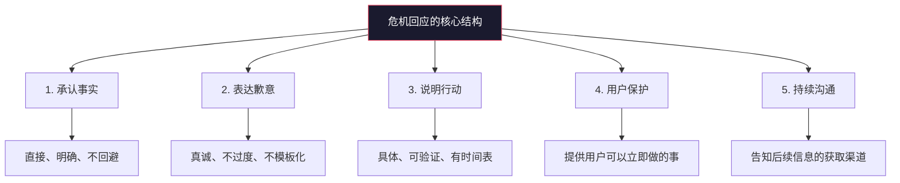

# 危机公关沟通——实战案例

## 引言：为什么要研究案例

理论是骨架，案例是血肉。情境危机沟通理论（SCCT）告诉你"可预防型危机应采取重建策略"，但只有当你看到三鹿在可预防型危机中采取了否认策略、最终破产的全过程，你才能真正理解这条原则的分量。

本章精选中外十余个代表性危机案例，覆盖产品安全、食品安全、数据泄露、ESG争议、高管失言、技术事故、社交媒体翻车等七大类型。每个案例按照**背景还原→沟通行为时间线→策略分析（对齐SCCT/IRT框架）→结果与数据→可迁移教训**五层结构展开，帮助你建立"看到危机就能分析"的思维框架。

```mermaid
graph LR
    A["案例分类"] --> B["成功案例"]
    A --> C["失败案例"]
    A --> D["社交媒体危机"]
    A --> E["争议/灰色案例"]
    B --> B1["强生泰诺"]
    B --> B2["海底捞老鼠门"]
    B --> B3["恒天然肉毒杆菌"]
    C --> C1["三鹿奶粉"]
    C --> C2["滴滴顺风车"]
    C --> C3["美联航拖拽"]
    C --> C4["三星Note7"]
    D --> D1["茶饮侮辱性命名"]
    D --> D2["食品品牌双标"]
    D --> D3["完美日记客服翻车"]
    E --> E1["华为孟晚舟"]
    E --> E2["特斯拉自动驾驶"]
    style A fill:#1a1a2e,stroke:#e94560,color:#fff
    style B fill:#166534,stroke:#22c55e,color:#fff
    style C fill:#7f1d1d,stroke:#ef4444,color:#fff
    style D fill:#78350f,stroke:#f59e0b,color:#fff
    style E fill:#1e3a5f,stroke:#3b82f6,color:#fff
```

---

## 一、成功案例深度分析

### 1.1 强生泰诺投毒事件（1982年）——危机沟通的"原点案例"

#### 背景还原

1982年9月底至10月初，美国芝加哥地区先后有7人因服用被氰化物污染的泰诺（Tylenol）胶囊死亡。泰诺当时是美国非处方止痛药市场的领导品牌，年销售额约12亿美元，占据37%的市场份额。投毒者至今未被确认，产品在供应链中的哪个环节被污染也始终是谜。

这不是强生的过错——它属于SCCT框架中的**受害型危机**（产品被恶意篡改）。但强生没有选择"我们也是受害者"的推卸立场，而是采取了远超公众预期的担当行动。

#### 沟通行为时间线

| 时间节点 | 强生行动 | 公众/媒体反应 |
|----------|----------|---------------|
| 9月29日 | 第一批死亡事件被媒体报道 | 公众恐慌开始蔓延 |
| 9月30日 | 强生CEO詹姆斯·伯克成立危机应对小组 | 媒体关注升温 |
| 10月1日 | 强生宣布全国召回所有泰诺胶囊，共3100万瓶，价值超1亿美元 | 消费者和媒体对强生的果断表示认可 |
| 10月2日-5日 | 伯克亲自接受CBS、NBC等主流媒体采访，公开所有已知信息 | 公众信任度开始回升 |
| 10月5日 | 强生开通24小时消费者热线，累计接听超10万个电话 | 消费者感受到被重视 |
| 10月中旬 | 配合FBI调查，每日发布调查进展 | 透明度赢得媒体正面报道 |
| 11月 | 推出防篡改三重密封包装，成为行业标准 | 被视为"化危为机"的典范 |
| 1983年2月 | 泰诺重新上架，配合大规模优惠券和广告 | 市场份额逐步恢复 |
| 1983年底 | 泰诺市场份额恢复至30%以上 | 几乎回到危机前水平 |

#### SCCT/IRT策略分析

**SCCT视角：**

强生面对的是受害型危机（产品被第三方恶意篡改），理论上组织的责任归因最低，可以采取否认或淡化策略。但强生选择了**重建策略**——大规模召回、公开道歉、产品创新——这远超SCCT对受害型危机的建议。结果证明，过度负责（over-accommodating）在某些场景下反而能最大化声誉收益。Coombs后来将这种现象称为"声誉保险"（reputational insurance）：你在危机中多付出的每一分担当，都会转化为未来的声誉资本。

**IRT视角：**

强生主要使用了**纠正行为**（开发防篡改包装）和**表达悔意**（公开致歉），同时辅以**强化策略**（提醒公众强生53年的良好历史记录）。这套组合拳精准且有力。

**关键决策拆解——为什么要召回全部产品？**

伯克在回忆这个决定时说："如果我们只召回芝加哥地区的产品，消费者会问：'你怎么确定其他地区的泰诺是安全的？'我们无法给出确定的答案。" 这个决策背后的心理学原理是**可得性偏差**（Availability Heuristic）：当7人死亡的画面已经深深印入公众脑海时，任何"概率上安全"的理性分析都无法消除恐惧。只有彻底的行动才能重建安全感。

#### 核心教训

1. **即使不是你的错，担当也能赢得回报。** SCCT的策略匹配原则是"底线"，不是"天花板"。当你的品牌足够重要、声誉资本足够深厚时，超出预期的负责态度能产生超额回报。
2. **行动比声明有力一百倍。** 强生没有停留在"我们深感痛心"的声明层面，而是用1亿美元的召回行动和产品创新来证明诚意。
3. **CEO亲自出面是不可替代的。** 伯克亲自上电视、亲自接听消费者电话，这种"最高级别的重视"是任何公关声明都无法替代的。
4. **危机可以成为行业标准的制定者。** 强生开发的防篡改包装后来被FDA采纳为行业标准，泰诺从"受害者"变成了"安全标准的定义者"。

---

### 1.2 海底捞"老鼠门"事件（2017年）——中国危机响应速度的标杆

#### 背景还原

2017年8月25日上午，《法制晚报》暗访报道发布，曝光海底捞北京太阳宫店和劲松店后厨存在老鼠爬行、用漏勺掏下水道、员工用顾客使用的火锅漏勺清理下水道等问题。视频和图片极具视觉冲击力，在微博、微信迅速引爆。

海底捞是中国火锅行业的标杆品牌，以"变态服务"著称，消费者对其有远高于行业平均水平的期待。这次危机属于SCCT框架中的**可预防型危机**——后厨卫生是企业完全可以控制的领域。

#### 沟通时间线

| 时间 | 海底捞行动 |
|------|-----------|
| 8月25日 11:00 | 报道发布，舆论迅速发酵 |
| 8月25日 14:00 | 海底捞发布第一份声明（报道发出约3小时后） |
| 8月25日 17:00 | 海底捞发布第二份声明，公布详细整改方案 |
| 8月26日 | 涉事两家门店停业整改 |
| 8月27日 | 海底捞邀请媒体和消费者代表参观后厨 |
| 9月初 | 全国门店启动"明厨亮灶"工程 |

#### 第一份声明逐句分析

海底捞的第一份声明之所以成为经典，在于它精准地踩中了每一个关键点：

| 声明原文（节选） | 分析 |
|-----------------|------|
| "经调查，媒体披露的问题属实" | **第一时间承认事实**，没有"正在核实""保留追究权利"等推诿措辞 |
| "问题的发生是深层次的管理问题" | **将责任归于管理层**，不甩锅给"个别员工"或"临时工" |
| "公司董事会决定：涉事两家门店停业整改、全面彻查" | **具体行动承诺**，不是空洞的"我们将严肃处理" |
| "感谢媒体和公众的监督" | **化敌为友**，将曝光者从"对手"重新定义为"帮助者" |

#### SCCT策略分析

按照SCCT框架，可预防型危机的责任归因最高，组织应采取**重建策略**（道歉+补偿）。海底捞完美执行了这一策略：

- **道歉**：承认问题属实，承担管理层责任
- **纠正行为**：停业整改、全国排查、明厨亮灶
- **增强策略**：感谢媒体监督（讨好），强调多年服务口碑（提醒）

一个精妙之处在于：海底捞的声明**没有过度承诺**。它没有说"以后绝不发生类似问题"（这几乎不可能兑现），而是承诺了具体的整改措施和时间表。这体现了"言行一致是底线"的原则。

#### 为什么海底捞能"逆转舆论"

海底捞事件后，社交媒体上出现了一个罕见的现象：大量消费者不仅没有抵制海底捞，反而对海底捞的回应表示赞赏，甚至出现了"公关满分"的讨论。这种"逆转"并非偶然：

1. **长期声誉资本的兑现。** 海底捞多年积累的"服务口碑"形成了深厚的信任储备，公众愿意给它"改过的机会"。
2. **对比效应。** 在此之前，中国企业的危机回应模板通常是"否认→沉默→甩锅→被迫承认"，海底捞的快速、真诚、担当式回应形成了强烈的"意外感"。
3. **声明的"温度"。** 海底捞的声明没有使用冰冷的官腔，而是用了温暖、诚恳的人性化表达，这在中国企业的危机回应中极为罕见。

#### 核心教训

1. **可预防型危机的核心策略是"认错+行动"，而非辩解。**
2. **声明的速度比完美更重要。** 3小时内回应，即使不够完美也远胜于24小时后的"完美声明"。
3. **将责任归于管理层而非基层员工，是赢得公众信任的关键。**
4. **"感谢监督"比"保留追究权利"高明一万倍。**

---

### 1.3 恒天然肉毒杆菌污染事件（2013年）——"主动披露"的力量

#### 背景还原

2013年8月，新西兰乳制品巨头恒天然（Fonterra）发现其生产的浓缩乳清蛋白可能被肉毒杆菌污染，涉及多个下游品牌（包括中国的多美滋、可口可乐等）。恒天然在内部检测结果确认之前，就主动向监管部门和公众披露了风险信息。

事后证明，最终检测结果显示产品中并未检出肉毒杆菌——这是一次"虚惊"。但恒天然的主动披露策略，使其在事后被广泛视为负责任企业的典范。

#### 策略分析

恒天然的案例挑战了一个常见误区：**"等确认了再说"**。恒天然的选择是"有风险就先说"，即使这意味着可能"白折腾"。这种策略的底层逻辑是：

- 如果最终确认有问题，主动披露让企业占据"坦诚"的道德高地
- 如果最终确认没有问题，企业损失的只是一次召回成本，但赢得了"宁可过度谨慎也不拿消费者冒险"的声誉

SCCT框架中，这属于**受害型或事故型危机**，恒天然的主动披露+快速召回策略属于**重建策略的前置使用**——在公众尚未施压时就主动承担超出应有份额的责任。

#### 核心教训

1. **主动披露 > 被动曝光。** 信息时代，隐瞒的成本远高于披露。
2. **"宁可过度反应"在涉及人身安全时是正确的策略。**
3. **"虚惊"不等于"白做"——公众会记住你的态度。**

---

## 二、失败案例深度分析

### 2.1 三鹿奶粉事件（2008年）——隐瞒与否认的毁灭性代价

#### 背景还原

2008年9月，中国爆发了震惊世界的三聚氰胺奶粉事件。三鹿集团生产的婴幼儿奶粉中被检出三聚氰胺，导致近30万名婴幼儿受害，其中数万人住院治疗，至少6名婴儿死亡。三聚氰胺是被人为添加到原料奶中的化学物质，用于伪造蛋白质含量检测指标。

#### 被掩盖的时间线——三鹿"早知道"

三鹿事件最令人震惊的不是危机本身，而是企业**早已知情却选择隐瞒**的事实：

| 时间 | 真实事件 | 三鹿的沟通行为 |
|------|----------|---------------|
| 2007年底-2008年初 | 开始收到消费者投诉，婴儿出现肾结石症状 | 内部记录但未对外披露 |
| 2008年3月 | 南京率先发现多例婴儿肾结石病例 | 未主动关联自身产品 |
| 2008年6月 | 内部检测确认产品含三聚氰胺 | 仍选择沉默 |
| 2008年8月 | 三鹿向地方政府报告，但未向公众披露 | 试图通过政府渠道"内部处理" |
| 2008年9月8日 | 媒体开始大规模报道 | 三鹿仍保持沉默 |
| 2008年9月11日 | 三鹿终于承认产品存在问题 | 距首次投诉已近一年 |
| 2008年9月12日 | 三鹿声称是"奶农掺假" | 试图推卸责任 |
| 2008年9月-12月 | 政府全面介入调查 | 多名高管被捕 |
| 2009年1月 | 三鹿集团正式破产 | 品牌彻底消亡 |

#### SCCT/IRT策略分析

**三鹿犯了危机沟通中最致命的错误：在可预防型危机中采取了隐瞒策略。**

按照SCCT框架，三鹿面对的是**可预防型危机**——食品安全问题是企业有责任也有能力预防的。正确策略是立即采取**重建策略**（召回+道歉+纠正行为）。但三鹿的实际选择是：

- **否认**（长期不承认产品有问题）
- **逃避责任**（推给奶农）
- **信息操控**（试图通过政府渠道压制信息）

每一步都踩在了SCCT理论明确标注的"雷区"上。

**IRT分析：** 三鹿的"奶农掺假"声明属于IRT中的**指责他人**策略。但在三聚氰胺事件中，消费者的核心诉求是"谁来保护我的孩子"，而不是"谁是供应链上的罪魁祸首"。推卸责任的声明不仅没有转移矛头，反而加深了公众对三鹿"不担当"的印象。

#### 数据冲击

- 受害婴幼儿：约30万人
- 住院治疗：约5.4万人
- 死亡：至少6人
- 三鹿集团：破产清算
- 高管判决：董事长田文华被判无期徒刑（后减刑）
- 行业影响：中国乳制品行业信任崩塌，此后数年进口奶粉市场份额飙升

#### 核心教训

1. **隐瞒是危机沟通中最昂贵的选择。** 三鹿如果在2008年3月首次收到投诉时就主动召回并公开致歉，虽然短期会有损失，但大概率能保住企业。
2. **"甩锅"在涉及人身安全的危机中绝对无效。** 消费者不关心供应链的哪个环节出了问题，他们关心的是"你能不能保证我的安全"。
3. **品牌信誉一旦崩塌就是不可逆的。** "三鹿"这个名字至今仍是中国食品安全危机的代名词，没有任何品牌修复的可能。
4. **危机中的每一步决策都会被事后审视。** 三鹿高管在2008年8月就已知情却未披露的事实，最终成为量刑的关键证据。

---

### 2.2 滴滴顺风车安全事件（2018年）——"第二次犯错"的毁灭性

#### 背景还原

2018年，滴滴顺风车平台先后发生两起乘客被司机杀害的恶性事件：

- **5月6日**：郑州空姐李某珠在乘坐滴滴顺风车途中被司机杀害
- **8月24日**：温州女孩赵某在乘坐滴滴顺风车时被司机杀害

两起事件间隔仅三个多月，第二起事件的"可预防性"成为公众愤怒的核心。

#### 两次危机的沟通对比

| 维度 | 第一次（5月） | 第二次（8月） |
|------|--------------|--------------|
| 回应速度 | 当天发声明 | 声明延迟，客服响应极慢 |
| 态度 | 道歉，承诺整改 | 道歉，但公众已不信任 |
| CEO出面 | 未第一时间出面 | 程维、柳青联合道歉（但已晚） |
| 具体措施 | 下线顺风车个性化标签、暂停夜间接单 | 全面下线顺风车业务 |
| 公众反应 | 基本接受 | 全面愤怒，#滴滴滚出中国#上热搜 |
| 后续效果 | 短暂平息 | 引发监管全面介入，APP下架整改 |

#### SCCT策略分析

两次事件都属于**可预防型危机**（平台有责任保障乘客安全）。第一次事件后，滴滴承诺了整改但整改不到位，导致第二次类似事件发生。SCCT理论中有一个重要概念叫**危机史（Crisis History）**：当组织有过类似危机的历史时，公众的责任归因会显著提高，组织需要采取更高级别的重建策略。

滴滴的致命错误在于：**第一次的承诺没有兑现。** 当公众发现滴滴的"整改"未能阻止悲剧再次发生时，所有的道歉和承诺都变成了"空话"的证据。这触发了SCCT中的**"声誉资本透支"**效应——第一次危机消耗了公众的信任储备，第二次危机时已经没有信任可供消耗。

#### 核心教训

1. **承诺必须兑现——这是危机沟通的铁律。** 无法兑现的承诺比不承诺更糟糕。
2. **客服系统是危机响应的第一道防线。** 第二次事件中，受害人家属和警方联系滴滴客服困难，这成为公众愤怒的引爆点。
3. **涉及人身安全的危机，CEO必须第一时间出面。** 延迟出面被视为"不重视"。
4. **"两次犯同样的错"是不可原谅的。** 公众可以接受一次失误，但不能接受"说了改却没改"。

---

### 2.3 美联航拖拽乘客事件（2017年）——CEO声明的"教科书级反面教材"

#### 背景还原

2017年4月9日，美国联合航空（United Airlines）3411航班因超售需要4名乘客让座。在无人自愿的情况下，安保人员强行将69岁的越南裔美国乘客David Dao从座位上拖拽至过道，导致其面部受伤、鼻骨骨折、脑震荡。同机乘客拍摄的视频在社交媒体上疯传。

#### CEO声明的三次"翻车"

**第一次声明（4月9日，事件当天）：**

> "我对必须重新安置（re-accommodate）这些乘客感到不安。"

问题：使用"重新安置"这种冷漠的企业术语来描述暴力拖拽事件，完全没有道歉。"不安"是对谁的不安？对乘客？对自己的员工？措辞模糊到令人生疑。

**第二次声明（4月10日，内部邮件泄露）：**

CEO Oscar Munoz在给员工的内部邮件中写道：

> "员工遵循了既定程序……我站在你们身后。"

这封邮件被泄露后，公众愤怒达到了顶点。CEO不仅没有道歉，反而在内部"表扬"了施暴的员工。

**第三次声明（4月11日，面对股价暴跌和全球抵制）：**

> "没有人应该被这样对待……我深感抱歉，承诺会做正确的事。"

此时，公众已经不再相信联航的任何声明。三次声明的口径从"不道歉→支持员工→深感抱歉"，前后矛盾，暴露了联航的根本问题：**不是不知道该说什么，而是在不同的利益诉求之间摇摆不定。**

#### SCCT/IRT策略分析

**SCCT视角：** 这是一起**可预防型危机**（超售是航空公司的商业决策，暴力驱逐是安保人员的执行问题）。正确策略是立即采取重建策略（道歉+补偿+纠正行为）。但联航最初的策略是否认+逃避责任（"乘客具有破坏性"），这直接违反了SCCT的匹配原则。

**IRT视角：** 联航最初的声明使用了**攻击指控者**策略——暗示乘客"具有破坏性且好斗"。但在有视频证据的情况下，攻击受害者是最危险的策略选择。Benoit的理论明确指出：**当事实清楚且有视觉证据时，否认和攻击策略几乎必然失败。**

#### 数据冲击

- 联航股价在事件后两天内下跌超过4%，市值蒸发超过10亿美元
- 事件在中国社交媒体上的传播量远超美国（受害者是亚裔），联航在中国市场的品牌形象遭受毁灭性打击
- 联航最终与David Dao达成庭外和解，金额未公开
- 美国国会就此事件举行听证会，推动航空乘客权益保护立法

#### 核心教训

1. **有视频证据时，否认和推诿是徒劳的。** 这是社交媒体时代的铁律——"眼见为实"的力量远超任何声明。
2. **内部邮件也是"公开沟通"。** 在信息泄露无处不在的时代，任何写下来的文字都可能成为"公开声明"。
3. **前后矛盾的声明比不声明更糟糕。** 它暴露了组织缺乏原则和真诚。
4. **跨文化传播需要专门应对。** 联航忽视了事件在中国社交媒体上的爆发，错过了在中国市场止损的窗口期。

---

### 2.4 三星Galaxy Note7电池爆炸事件（2016年）——"双重标准"的代价

#### 背景还原

2016年8月，三星Galaxy Note7上市后不久，全球陆续发生手机自燃和爆炸事件。三星于9月初宣布全球召回250万部Note7。但问题在于：三星在美国等地提供全额退款或换机，而在中国市场最初宣布"国行版Note7电池安全，不在召回范围内"。

#### 沟通失误分析

| 失误类型 | 具体表现 | SCCT/IRT定位 |
|----------|----------|-------------|
| 双重标准 | 中国市场与全球市场的召回标准不同 | 违背一致性原则 |
| 低估危机 | 初次召回后未能彻底解决问题，更换后的"安全版"再次爆炸 | 危机生命周期判断失误 |
| 推卸责任 | 最初暗示电池供应商（ATL）应承担主要责任 | IRT中的"指责他人"策略 |
| 信息不透明 | 未公开电池故障的根本原因调查 | 违背透明原则 |

三星在中国市场的"双重标准"策略尤其致命。2016年9月，三星全球召回Note7时声明"中国国行版使用不同电池供应商，不存在安全隐患"。但随后国行版Note7也发生了多起自燃事件，彻底打破了三星的"安全承诺"。中国官媒人民日报发表评论批评三星"对中国消费者存在歧视"。

#### 结果

- 三星最终全球永久停产Note7，召回全部约430万部手机
- 直接经济损失约53亿美元
- 三星在中国智能手机市场的份额从2013年的约20%跌至2017年的不足2%（虽Note7不是唯一原因，但它是标志性转折点）
- 三星在中国市场的品牌信任至今未完全恢复

#### 核心教训

1. **全球性危机不能有"双重标准"。** 在信息全球化的时代，任何地区性的差异化处理都会被曝光和放大。
2. **"我们查过了没问题"这种声明，如果事后被推翻，杀伤力是致命的。**
3. **产品质量问题的根源必须彻底解决后才能重新上市。** 二次爆炸摧毁了三星仅存的公信力。

---

## 三、社交媒体危机案例

社交媒体危机具有独特性：传播去中心化、情绪化讨论占上风、算法推荐加速扩散、用户生成内容主导叙事。以下是几个典型社交媒体危机的深度分析。

### 3.1 某茶饮品牌"侮辱性命名"事件

#### 事件还原

某知名茶饮品牌的小票上出现了侮辱性产品命名（如将正常订单标注为"穷b""傻X"等），消费者截图发到微博、小红书后迅速引爆。

#### 三阶段回应分析

| 阶段 | 品牌回应 | 公众反应 | 策略评估 |
|------|----------|----------|----------|
| 第一阶段 | "这是门店员工的个人行为" | 更大的愤怒——甩锅经典话术 | **IRT失败：指责他人** |
| 第二阶段 | 承认管理疏忽，停业整改，全国排查 | 愤怒开始平息 | **SCCT正确：重建策略** |
| 第三阶段 | 公布整改报告，加强员工培训 | 基本平息 | **纠正行为+持续更新** |

#### 可迁移教训

1. **"甩锅给员工"是社交媒体危机中最容易引爆公众情绪的策略。** 社交媒体用户天然同情"打工人"，将责任推给基层员工会被视为"资本家欺负劳动者"。
2. **社交媒体危机需要"迭代式回应"。** 不要试图一次性发布"完美声明"，而是在第一份简短声明后快速迭代更新。
3. **小票、外卖备注等"小细节"在社交媒体时代可能成为"大危机"。** 企业需要审视所有消费者可接触的文本内容。

---

### 3.2 某食品品牌"双标"事件

#### 事件还原

消费者通过对比发现某食品品牌在国内和海外市场使用不同配方——海外版配方更简洁，国内版含有更多添加剂。相关对比图文在微博、知乎广泛传播，"双标""歧视中国消费者"成为热门标签。

#### 策略失误分析

品牌的第一个回应是：**"我们的产品符合中国食品安全国家标准。"**

这个回应的致命问题在于：它从法律合规角度为自己辩护，但公众的愤怒不是源于"违法"，而是源于"不公平"。用SCCT的话说，品牌选择了**淡化策略**（"没那么严重"），但公众期待的是**重建策略**（"我们承认不妥，会改进"）。

**"合法不等于合理"**——这是社交媒体时代消费者维权的核心逻辑。品牌可以证明自己"合法"，但无法用法律来回应道德层面的质疑。

#### 核心教训

1. **法律合规不能替代道德回应。** 公众关心的是"你对不对"，不是"你违不违法"。
2. **"双标"指控在社交媒体时代极具传播力。** 它触发了"不公平"这一深层心理敏感点。
3. **回应策略必须匹配公众的真实诉求。** 如果公众要的是"公平"，你给的是"合规"，回应就等于失败。

---

### 3.3 完美日记客服"翻车"事件

#### 事件还原

国货美妆品牌完美日记的客服在处理消费者投诉时，使用了不恰当的措辞，相关截图在小红书和微博传播。作为新消费品牌的代表，完美日记的目标用户群体以年轻女性为主，对品牌态度和服务品质高度敏感。

#### 分析

这类"客服翻车"事件在社交媒体时代具有高度可复制性：

- **触发门槛低**：一段聊天截图就能引爆
- **传播速度快**：小红书的"种草"逻辑反向运作为"拔草"
- **情绪传染强**：消费者对客服态度的不满容易引发"我也遇到过"的共鸣

#### 可迁移教训

1. **客服是品牌的"第一线防线"也是"第一线风险"。** 企业需要对客服话术进行系统化培训和风险审查。
2. **社交媒体上的"截图文化"意味着每一次客服对话都是"公开对话"。** 客服人员需要像写公开声明一样谨慎。
3. **新消费品牌的危机承受力更弱。** 相比有数十年积累的传统品牌，新品牌的声誉储备更薄，一次危机就可能动摇根基。

---

## 四、争议案例——灰色地带的沟通困境

### 4.1 华为"孟晚舟事件"的长期危机沟通（2018-2021年）

#### 背景还原

2018年12月1日，华为CFO孟晚舟在加拿大温哥华被拘押，美国以"银行欺诈"和"违反伊朗制裁"为由引渡。此后近三年，华为面临来自美国的全面制裁——芯片断供、5G设备被多国禁用、操作系统受限。

#### 沟通策略拆解

华为的危机沟通策略具有高度独特性，与传统SCCT/IRT框架既有契合也有突破：

**叙事框架的重塑：**

华为将危机从"企业涉嫌违法"重新定义为"技术霸权对创新企业的打压"。这种**IRT中的超越策略**（Transcendence）——将具体事件置于更宏观的背景中——是华为沟通策略的核心。

**任正非的"媒体攻势"：**

2019年，任正非罕见地密集接受BBC、CNN、CBS、彭博社等国际主流媒体采访。这些采访有几个关键特点：
- 不回避敏感问题（女儿被拘押、军方背景质疑）
- 展现个人格局（"我爱我的女儿，但我也理解不同国家的法律体系"）
- 将话题引向技术竞争的本质（"5G不是武器，是基础设施"）

**内部凝聚力的维护：**

华为通过内部信、全员大会、"备胎转正"等叙事，将外部压力转化为内部凝聚力。"华为不需要美国芯片，我们有自己的备胎"——这句话不仅回应了技术制裁，更激发了员工的使命感和自豪感。

#### 争议点

华为的沟通策略并非没有争议：

- **是否过度"民族主义化"？** 将商业争议上升为国家博弈，可能限制了华为在国际市场的沟通空间。
- **信息选择性披露。** 华为对自身问题（如内部管理争议、海外市场策略）的披露是高度选择性的。
- **员工"自发支持"是否完全自发？** 有外界观察者质疑华为员工在社交媒体上的一致表态是否受到内部引导。

#### 核心教训

1. **长期危机需要"叙事工程"（Narrative Engineering）。** 不是被动回应每一个指控，而是主动构建一个对自身有利的宏观叙事。
2. **领导者的个人魅力在危机中是不可替代的战略资源。** 任正非的采访不是"公关动作"，而是"战略沟通"。
3. **内部沟通与外部沟通必须协调一致。** 华为的"备胎"叙事同时服务于内部凝聚和外部威慑两个目标。
4. **将危机转化为"使命感"是最高效的内部沟通策略。**

---

### 4.2 特斯拉自动驾驶事故的沟通困境

#### 背景还原

特斯拉的自动驾驶系统（Autopilot/FSD）自2016年以来已涉及数百起事故，其中数十起致命。每当发生致命事故，特斯拉都会面临"技术是否安全"的质疑。特斯拉CEO埃隆·马斯克（Elon Musk）的沟通方式极具争议性。

#### 沟通策略分析

特斯拉的沟通策略呈现出一种独特的"混合模式"：

| 维度 | 特斯拉的做法 | 分析 |
|------|-------------|------|
| 技术辩护 | 强调Autopilot比人类驾驶更安全，引用统计数据 | **IRT淡化策略**——降低事件的冒犯性 |
| CEO个人风格 | 马斯克在Twitter（现X）上直接回应批评者 | 极具个人风格但不可复制 |
| 法律立场 | 在正式声明中强调驾驶员未正确使用系统 | **IRT逃避责任——缺陷/用户过错** |
| 信息透明度 | 部分事故数据通过安全报告发布，但选择性较强 | 符合法律要求但不完全透明 |

#### 为什么特斯拉的"争议模式"能持续运作

1. **品牌人格化。** 特斯拉在很大程度上就是马斯克个人品牌的延伸。马斯克的"钢铁侠"人设给了特斯拉远超一般企业的"争议容忍度"。
2. **技术创新者的"叙事特权"。** 公众对"改变世界的创新者"有更高的宽容度——"他可能粗暴，但他正在改变世界"。
3. **支持者的"信仰效应"。** 特斯拉拥有一个高度忠诚的用户群体，他们会在社交媒体上主动为品牌辩护，形成"自发公关"效应。

#### 核心教训

1. **技术争议中的沟通核心是"用数据说话"，但数据的选择和呈现方式本身就是一种沟通行为。**
2. **CEO个人风格与品牌高度绑定是一把双刃剑——它放大了所有优点和缺点。**
3. **不是所有危机都需要"传统PR策略"。** 特斯拉的案例表明，在特定条件下（技术领先、品牌人格化、忠诚用户群），"非传统"的沟通方式也能运作。

---

## 五、危机回应的对话模式分析

### 5.1 正面回应模板——数据泄露场景

**情境：** 某电商平台被曝出用户数据泄露事件

**平台声明：**

> "我们确认，由于系统安全漏洞，部分用户的个人信息可能被未经授权的第三方获取。我们对此深感抱歉。目前，我们已经修复了安全漏洞，并正在逐一通知可能受影响的用户。我们建议所有用户立即修改密码，并开启双重验证。我们的安全团队正在24小时不间断地工作，确保用户数据安全。如有任何疑问，请拨打我们的安全热线：400-XXX-XXXX。"

**逐句分析：**

| 声明要素 | 对应内容 | SCCT/IRT定位 |
|----------|----------|-------------|
| 承认事实 | "我们确认……安全漏洞" | 纠正行为的前提——先承认问题 |
| 表达歉意 | "我们对此深感抱歉" | IRT表达悔意 |
| 说明行动 | "已修复安全漏洞""逐一通知用户" | SCCT重建策略——纠正行为 |
| 用户自助指南 | "修改密码""开启双重验证" | 辅助策略——信息更新 |
| 持续沟通承诺 | "24小时不间断工作" | 增强策略——讨好（表达关切） |
| 沟通渠道 | "安全热线：400-XXX-XXXX" | 辅助策略——双向沟通 |

### 5.2 负面回应模板——同一场景的错误示范

**不当回应：**

> "针对网上流传的所谓数据泄露信息，我们正在进行核实。目前无法确认信息的真实性。我们会依法维护自身权益，对不实信息保留追究法律责任的权利。请广大用户不要轻信谣言。"

**逐句分析：**

| 措辞 | 问题 |
|------|------|
| "所谓数据泄露信息" | 使用"所谓"暗示问题不存在，是**否认策略**——在事实清楚时使用否认是最危险的 |
| "无法确认信息的真实性" | 试图制造不确定性，但公众不会买账 |
| "依法维护自身权益" | 将重点放在"保护自己"而非"保护用户"，错置了优先级 |
| "不实信息""谣言" | 在公众已经恐慌时使用这些措辞，等于在说"你们是傻子才会信" |
| 整体缺失 | 没有歉意、没有行动承诺、没有用户保护建议、没有后续沟通渠道 |

### 5.3 对话模式的核心规律

通过对比正面和负面回应模板，可以提炼出以下规律：

---

## 六、跨案例对比分析

### 6.1 成功与失败案例的核心差异矩阵

| 对比维度 | 成功案例特征 | 失败案例特征 |
|----------|-------------|-------------|
| **响应速度** | 数小时内首次回应（海底捞3小时，强生24小时内） | 数天甚至数月（三鹿近一年，联航多次修改） |
| **态度定位** | 承认问题→承担责任→具体行动 | 否认→推诿→被迫承认→空洞道歉 |
| **责任归因** | 管理层承担（海底捞、强生） | 推给员工/供应商/受害者（三鹿、联航） |
| **信息透明度** | 主动披露（恒天然）、持续更新（强生） | 隐瞒（三鹿）、前后矛盾（联航） |
| **行动承诺** | 具体措施+时间表+可验证 | 空洞承诺、承诺不兑现（滴滴） |
| **沟通渠道** | CEO亲自出面+多渠道覆盖 | 管理层缺位、仅发书面声明 |
| **情感表达** | 真诚、温暖、有温度 | 冰冷、模板化、高高在上 |

### 6.2 SCCT策略匹配成功率

基于本章分析的案例，统计各类策略在不同危机类型中的成功率：

| SCCT策略 | 危机类型匹配 | 案例 | 效果 |
|----------|-------------|------|------|
| 重建策略（道歉+纠正） | 可预防型 | 海底捞 | ✓ 成功逆转舆论 |
| 重建策略（召回+创新） | 受害型 | 强生泰诺 | ✓ 超预期成功 |
| 重建策略（主动披露） | 事故型 | 恒天然 | ✓ "虚惊"中赢得声誉 |
| 否认+逃避责任 | 可预防型 | 美联航 | ✗ 市值蒸发10亿美元 |
| 隐瞒+否认+推诿 | 可预防型 | 三鹿 | ✗ 企业破产 |
| 淡化+法律辩护 | 可预防型 | 食品"双标" | ✗ 舆论持续发酵 |
| 承诺→不兑现 | 可预防型 | 滴滴 | ✗ 信任彻底崩塌 |

**规律总结：** 在可预防型危机中，任何偏离"重建策略"（道歉+纠正行为+透明沟通）的尝试都以失败告终。SCCT理论的策略匹配原则在实证层面得到了充分验证。

---

## 七、可迁移的实战框架

### 7.1 危机回应的"五步法"

基于本章所有案例的成功经验，提炼出一个可直接使用的危机回应框架：

**第一步：确认（Acknowledge）——在4小时内**
- 确认已知晓事件
- 表达对受影响者的关切
- 说明正在调查和处理
- 示例："我们已获悉[事件描述]，正在全力核实情况。我们对受影响的[对象]深表关切。"

**第二步：承认（Admit）——在事实基本清楚后**
- 明确承认问题的存在
- 承担应有的责任
- 不推诿、不找借口
- 示例："经调查确认，[问题描述]属实。这是我们的管理失误，我们对此承担全部责任。"

**第三步：行动（Act）——与声明同步发布**
- 列出具体整改措施
- 给出时间表
- 指定责任人
- 示例："我们将采取以下措施：1.[具体措施] 2.[具体措施] 3.[具体措施]。以上整改将在[时间]前完成，由[负责人]监督执行。"

**第四步：补偿（Amend）——根据危机严重程度**
- 向受影响者提供实质性补偿
- 补偿方案应具体、可执行
- 避免过度承诺
- 示例："对于受影响的[对象]，我们将提供[具体补偿方案]。"

**第五步：跟进（Follow through）——持续至危机平息**
- 定期发布整改进展
- 公开接受监督
- 邀请第三方验证
- 示例："我们将在每周五发布整改进展报告，欢迎媒体和公众监督。"

### 7.2 危机类型快速判断表

在危机发生的前30分钟内，使用以下表格快速判断危机类型和应采取的策略：

| 判断维度 | 低风险（受害型） | 中风险（事故型） | 高风险（可预防型） |
|----------|-----------------|-----------------|-------------------|
| **组织责任** | 外部因素为主 | 技术/操作失误 | 管理疏忽或故意行为 |
| **涉及安全** | 否 | 可能 | 是 |
| **有视觉证据** | 否 | 可能 | 是/否 |
| **SCCT策略** | 否认/淡化+增强 | 淡化+重建 | **必须重建** |
| **回应速度** | 24小时内 | 12小时内 | **4小时内** |
| **谁出面** | 公关负责人 | 副总裁以上 | **CEO** |

### 7.3 案例分析的"四维框架"

当你要分析一个新的危机案例时，使用以下四个维度：

1. **背景维度：** 什么类型的危机？SCCT分类是受害型、事故型还是可预防型？涉及哪些利益相关者？
2. **行为维度：** 企业实际做了什么？时间线是什么？每个节点的决策逻辑是什么？
3. **策略维度：** 用SCCT和IRT框架分析——采取了什么策略？是否与危机类型匹配？
4. **结果维度：** 短期效果（舆论、股价、销量）和长期效果（品牌、行业、制度）分别是什么？

这四个维度构成了一个可复制的案例分析模板，适用于任何危机事件。

---

## 八、进阶：危机沟通中的"反直觉"现象

### 8.1 "过度道歉"也可能失败

多数危机沟通指南强调"要道歉"，但SCCT理论的"适度原则"提醒我们：**过度道歉有时会适得其反。** 当组织在低责任危机（如受害型危机）中过度道歉时，反而会强化公众对组织责任的归因——"如果他们没错，为什么要道歉这么多次？"

**应用场景：** 当危机确实不是组织的过错时（如产品被第三方恶意篡改），表达关切和行动承诺即可，无需反复道歉。

### 8.2 "沉默"在极少数情况下是正确的

虽然"快速回应"是普遍原则，但在以下特殊情况下，短暂的沉默可能是正确的：

- 事实完全不清楚，贸然回应可能说错话
- 涉及正在进行的刑事调查，法律限制信息披露
- 情绪极度高涨时，任何回应都可能被曲解

但即使是"战略性沉默"，也需要在沉默期间通过非正式渠道传递"我们在关注、在行动"的信号——完全的消失是不可接受的。

### 8.3 "先内部后外部"的优先级

一个常被忽视的事实是：**员工是从新闻还是从内部渠道得知危机，决定了危机期间组织的凝聚力。** 华为在孟晚舟事件中的一个成功做法是：所有对外发布的重要信息，都先通过内部渠道告知员工。

员工是组织最重要的"大使"。如果员工从新闻中得知危机、对组织的回应一无所知，他们无法在社交媒体上、在亲友面前、在客户面前为组织辩护——甚至可能成为"内部爆料者"。

---

## 小结

本章通过十余个中外危机案例的深度分析，验证了情境危机沟通理论（SCCT）和形象修复理论（IRT）在实战中的有效性。核心规律可以归结为三句话：

**对可预防型危机，重建策略（道歉+纠正行为+透明沟通）是唯一正确的选择。** 任何偏离这个策略的尝试——否认、推诿、隐瞒、淡化——都在本章的失败案例中得到了充分验证。

**行动永远比言辞有力。** 强生的1亿美元召回、海底捞的停业整改、恒天然的主动披露——这些行动的说服力远超任何精心撰写的声明。

**危机沟通不是"公关技术"，而是组织价值观的体现。** 三鹿的隐瞒折射的是"利润优先"的价值观，强生的召回折射的是"消费者安全至上"的价值观。在危机的聚光灯下，组织的真实价值观无处遁形。

建议在学习完本章后，选择其中2-3个案例进行深度复盘（参考第五章练习方法），用四维框架（背景→行为→策略→结果）撰写案例分析报告，将知识转化为能力。
