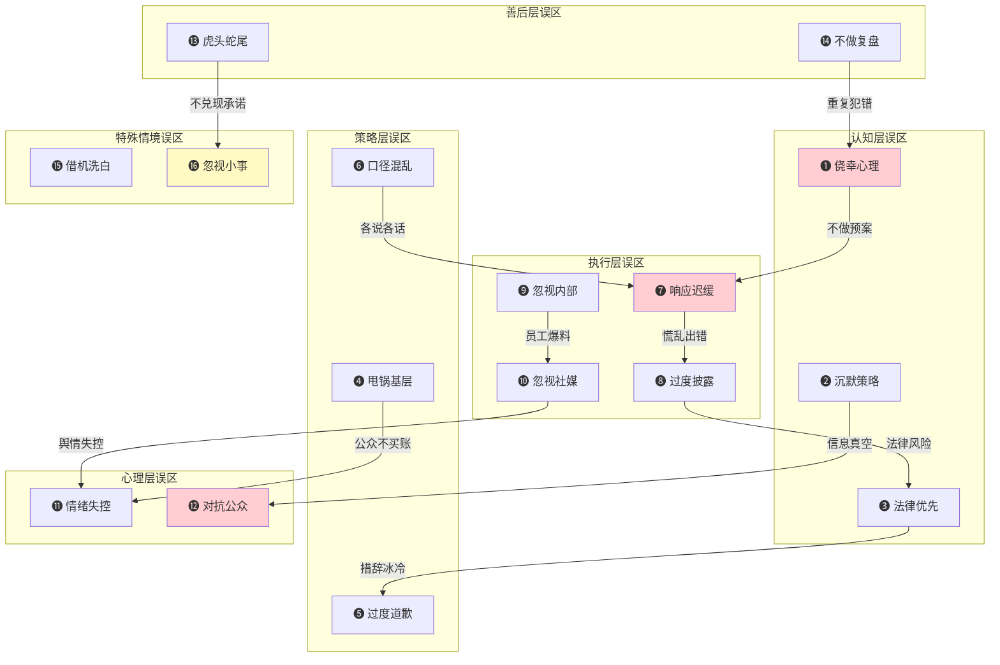

# 危机公关沟通——常见误区

## 误区全景图

危机公关中的误区不是孤立存在的，它们往往层层嵌套、互相触发。一个认知层面的误区会导致策略偏差，策略偏差又会在执行中被放大，最终形成难以挽回的声誉损失。下图展示了16个常见误区在危机生命周期中的分布及其连锁效应：



> **阅读指南：** 下文将16个误区按六个层面逐一拆解。每个误区均包含**典型表现→真实案例→深层机理→危害评估→纠正方法→实操模板**六个维度，帮助你从"知道错在哪"到"知道怎么改"。

---

## 一、态度与认知层面的误区

认知层面的误区是最根源性的问题。它们决定了组织对待危机的基本态度，一旦认知出现偏差，后续所有策略和执行都会走样。

### 误区一：危机不会发生在我身上

**典型表现：**

许多组织和个人存在侥幸心理，认为危机是"别人的事"。具体表现为：没有专门的危机管理岗位或预算；危机预案停留在纸面甚至从未制定；从未进行过危机模拟演练；对行业内的危机事件缺乏系统研究。

**真实案例：**

2017年，全球连锁酒店万豪（Marriott）在数据安全方面投入不足，其收购的喜达屋（Starwood）预订系统存在长期未修补的漏洞。2018年11月，万豪披露约5亿条客户记录被泄露，其中包括护照号码、信用卡信息等高度敏感数据。事后调查发现，喜达屋系统在2014年就已被入侵，而万豪在2016年完成收购后长达两年的时间里未能发现这一问题。万豪最终面临英国信息专员办公室（ICO）9900万英镑的罚款，以及多国监管机构的调查。

**深层机理——"正态分布偏见"：**

心理学研究表明，人类普遍存在"正态分布偏见"（Normalcy Bias），即倾向于认为事物会按照正常状态运行，极端事件不会发生在自己身上。这种认知偏差在组织层面表现为：管理层将危机视为小概率事件，不愿意为之投入资源；员工将危机预案视为"走形式"，演练敷衍了事。

**危害评估：**

| 维度 | 无预案组织 | 有预案组织 |
|------|-----------|-----------|
| 首次响应时间 | 24-72小时 | 1-4小时 |
| 决策质量 | 混乱、反复 | 有序、果断 |
| 媒体报道倾向 | 负面为主 | 中性偏正面 |
| 股价/市值影响 | 平均下跌12-15% | 平均下跌3-5% |
| 恢复周期 | 6-18个月 | 1-3个月 |

**纠正方法：**

1. **建立风险地图。** 每年至少进行一次全面的风险评估，识别组织面临的潜在危机类型，按照发生概率和影响程度进行分级。
2. **制定"一页纸预案"。** 不需要复杂的文件，但必须明确：谁负责什么、第一步做什么、信息如何流转。
3. **季度桌面推演。** 每季度用2小时进行一次桌面推演（Tabletop Exercise），模拟一个危机场景，让团队走一遍响应流程。
4. **建立"危机案例库"。** 持续收集同行业、同类型组织的危机案例，分析其成败得失。

**实操模板——危机风险评估矩阵：**

┌──────────────────────────────────────────────────────────┐
│                   危机风险评估矩阵                        │
├──────────────┬──────────┬──────────┬─────────────────────┤
│   风险类型    │ 发生概率  │ 影响程度  │     应对优先级       │
├──────────────┼──────────┼──────────┼─────────────────────┤
│ 产品质量问题  │  高(4)   │  极高(5) │   ★★★★★ 立即行动   │
│ 数据泄露      │  中(3)   │  极高(5) │   ★★★★★ 立即行动   │
│ 员工丑闻      │  中(3)   │  高(4)   │   ★★★★  重点监控   │
│ 供应链中断    │  中(3)   │  高(4)   │   ★★★★  重点监控   │
│ 舆论误解      │  高(4)   │  中(3)   │   ★★★   常规准备   │
│ 自然灾害      │  低(2)   │  高(4)   │   ★★★   常规准备   │
└──────────────┴──────────┴──────────┴─────────────────────┘

### 误区二：沉默是最好的策略

**典型表现：**

危机发生后选择沉默，不做任何公开回应。内部反复开会讨论但迟迟不发声。以"调查中"为由无限期推迟回应。等待其他热点新闻来"盖过"自己的危机。

**真实案例：**

2022年，某知名新能源汽车品牌发生多起疑似"刹车失灵"事故。该品牌最初的应对策略是保持沉默，拒绝回应媒体采访，仅在车主维权时通过法务部门发律师函威胁。结果，沉默不但没有让事件平息，反而激发了更大规模的舆论风暴。"刹车失灵"成为社交媒体热搜话题长达数周，大量潜在消费者因此转向竞品。最终该品牌不得不在更大的舆论压力下召开发布会，但此时公众信任已经被严重损害。

**深层机理——"信息真空效应"：**

传播学中的"信息真空理论"指出：当公众对某一事件有强烈的信息需求但无法从官方渠道获得信息时，非官方渠道（谣言、猜测、阴谋论）会迅速填补这一真空。在社交媒体时代，信息真空的存在时间以分钟计算——如果组织在事件发生后1小时内不发声，各种版本的"真相"就已经在社交媒体上广泛传播了。

**纠正方法——"黄金一小时"框架：**

危机发生后的第一个小时是决定性的。即使无法提供完整信息，也必须在这一小时内发布初步声明。

**实操模板——快速声明三要素：**

```markdown
【组织名称】关于[事件]的声明

1. **已知事实：** 我们已获悉[简述事件]。目前确认的信息是[已知事实]。
2. **正在行动：** 我们已启动[具体行动，如调查/召回/救助]，
   [具体部门/负责人]正在[具体工作]。
3. **后续承诺：** 我们将在[具体时间，如24小时/48小时]内发布
   进一步信息。如有紧急问题，请联系[联系方式]。

我们对[受影响方]深表关切。
```

**关键原则：** 80%准确的快速回应，胜过100%准确的迟来回应。

### 误区三：只关注法律风险，忽视声誉风险

**典型表现：**

所有对外声明都经过法律部门严格审查，措辞充满法律术语。声明中大量使用"我方""贵方"等冰冷的法律用语。以"无可奉告"或"一切以法律途径解决"来应对公众关切。拒绝承认任何道义责任，即使事实已经很清楚。

**真实案例：**

2010年英国石油公司（BP）墨西哥湾漏油事件中，CEO托尼·海沃德（Tony Hayward）在灾难持续期间多次发表不当言论，包括"我希望我的生活能回到正轨"（I'd like my life back）。BP的公关策略明显被法律团队主导，其声明充满了推卸责任和最小化问题的法律措辞。这种策略在法律上或许"安全"，但在公众眼中极为冷漠。BP的品牌价值在危机期间暴跌超过50%，海沃德被迫辞职。

**深层机理——"法律理性"与"公众感性"的冲突：**

法律思维追求精确、免责、证据链完整；公众沟通追求共情、担当、态度真诚。两种思维模式存在根本性冲突：

| 维度 | 法律思维 | 公众沟通思维 |
|------|---------|------------|
| 核心目标 | 降低法律责任 | 重建信任 |
| 语言风格 | 精确、谨慎、留余地 | 温暖、直接、有温度 |
| 对"道歉"的态度 | 可能构成认责，需避免 | 展现担当，应主动 |
| 对"承认"的态度 | 需充分调查后才能确认 | 先表态关切，再跟进细节 |
| 时间要求 | 宁慢勿错 | 宁快勿全 |

**纠正方法：**

1. **建立"双轨审核"机制。** 声明先由公关团队起草，确保人文温度；再由法律团队审核，确保不增加法律风险。两轮审核完成后才能发布。
2. **法律审核的边界。** 法律团队的职责是"删掉危险的话"，而不是"改掉所有有温度的话"。
3. **使用"感受+行动"公式。** 先表达对受影响者的关切和歉意（情感层面），再说明正在采取的行动（理性层面）。

**实操模板——法律与公关平衡的声明结构：**

第一段（共情）：对[受影响者]的遭遇，我们深感痛心/抱歉。
第二段（事实）：目前确认的情况是[已知事实]。
第三段（行动）：我们已采取以下措施：[具体行动1、2、3]。
第四段（承诺）：我们将持续跟进并及时通报进展。

---

## 二、沟通策略层面的误区

策略层面的误区往往是认知偏差的直接产物。当组织对危机的本质认识不清时，制定的沟通策略必然出现方向性错误。

### 误区四：推卸责任给基层员工

**典型表现：**

将危机归咎于"个别员工的违规操作"。使用"临时工""外包人员""实习生"等标签来切割组织责任。对外声明中强调"已开除涉事员工"，试图以此"给公众一个交代"。

**真实案例：**

2017年11月，某知名连锁幼儿园被曝教师涉嫌虐童。该企业最初的回应是将责任推给"个别教师的违规行为"，并声称已开除涉事教师。这一回应激起了更大的公众愤怒——家长和公众普遍认为，如果只是个别教师的问题，那管理层的日常监管在哪里？最终该企业股价暴跌超过40%，多地门店出现退园潮。

**深层机理——"归因理论"与"系统性责任"：**

社会心理学的归因理论（Attribution Theory）指出，人们在评价他人行为时，倾向于将其归因于内在因素（性格、态度）而非外在因素（环境、制度）。但在组织危机中，公众的归因逻辑恰恰相反——当一个组织内部的"个人"出现问题时，公众倾向于认为这是组织"系统性"管理失败的结果。推卸责任给个人不仅不能减轻组织的责任归属，反而会强化公众"管理混乱"的判断。

**纠正方法——"四步担责法"：**

1. **承认管理层责任。** "这是我们管理层的疏忽/失误。"
2. **表达歉意。** 向所有受影响者真诚道歉。
3. **说明改进措施。** 详细列出将如何改进管理制度。
4. **设定问责标准。** 内部处理不对外公开，但要让公众看到组织在严肃对待。

### 误区五：过度道歉

**典型表现：**

在没有明确责任的情况下急于"认罪"。反复道歉，每次声明都在重复"对不起"。过度自我贬低，使用"我们罪不可赦""我们不配得到原谅"等极端措辞。将道歉本身作为"解决"危机的主要手段，而没有实质性行动。

**真实案例：**

2018年，某航空公司因超售机票导致一名乘客被暴力拖下飞机的视频在网上疯传。该公司CEO最初的公开信不仅没有道歉，反而为员工的做法辩护。在舆论压力下，CEO随后发布了多封道歉信，一封比一封措辞更强烈，从"抱歉"到"深深的歉意"到"羞耻"。这种"挤牙膏式"的道歉策略反而让公众觉得缺乏诚意——如果真的觉得这么抱歉，为什么第一封信里不道歉？

**深层机理——"道歉通胀"效应：**

道歉的价值在于稀缺性和真诚度。当道歉变得频繁和廉价时，它的边际效果急剧递减。心理学研究表明，反复道歉还会产生"道歉通胀"（Apology Inflation）效应——每一次新的道歉都需要比上一次更强烈才能产生相同的效果，最终导致道歉完全失去意义。

**纠正方法——"一次到位"原则：**

道歉只需要一次，但那一次必须是真诚的、具体的、配套行动的。

**道歉的正确结构：**

1. 承认具体过错（不是泛泛地说"我们错了"）
2. 表达对受影响者的真实关切
3. 说明已采取和将采取的具体行动
4. 承诺改进并设定时间节点

**道歉的禁忌：**
- 不要用"如果有人感到受伤"这种条件句式
- 不要在道歉中夹带辩解
- 不要让道歉成为唯一的行动

### 误区六：口径不一致

**典型表现：**

不同部门对外说法不一致——客服说"正在处理"，公关说"已妥善解决"，法务说"责任不在我们"。不同渠道信息矛盾——官网说A，社交媒体说B，接受采访又说C。同一事件，前后两次声明的关键信息不一致。

**真实案例：**

2020年，某知名咖啡连锁品牌被曝使用过期原料。该品牌在不同渠道的回应口径明显不一致：官方微信公众号声称"个别门店管理疏忽"，官方微博称"正在全面排查"，而门店工作人员对记者说"从来没有过期原料的问题"。三种说法相互矛盾，让公众对品牌完全失去信任。最终该品牌不得不关闭涉事门店，全国范围进行整改。

**深层机理——"一致性"是信任的基础：**

传播学研究表明，信息来源的可信度（Source Credibility）很大程度上取决于一致性（Consistency）。当组织的口径前后不一、左右矛盾时，公众会将其解读为"不诚实"或"隐瞒真相"，即使实际情况只是内部沟通不畅。

**纠正方法——建立"单一信息源"机制：**

危机响应信息流：

                    ┌──────────┐
                    │ 信息核心组 │  ← 唯一的信息出口
                    └─────┬────┘
                 ┌────────┼────────┐
            ┌────┴───┐ ┌──┴──┐ ┌──┴──────┐
            │对外发言人│ │官方社媒│ │客服话术组│
            └────────┘ └─────┘ └─────────┘

规则：
1. 所有对外信息必须由核心组统一审批
2. 各渠道使用统一的"核心信息卡"（Key Messages Card）
3. 任何新信息先报告核心组，再对外发布
4. 客服/一线员工使用统一话术，不可自由发挥

**实操模板——核心信息卡：**

```markdown
## 核心信息卡 v[版本号]  更新时间：[时间]

### 一句话定性：
[用一句话描述事件性质，如"这是一起由XX导致的XX事件"]

### 三个核心要点：
1. [要点一：关于事实]
2. [要点二：关于行动]
3. [要点三：关于承诺]

### 绝对不能说的话：
- [敏感点1]
- [敏感点2]

### 标准回应（Q&A）：
Q: [最可能被问到的问题1]
A: [标准回答]
```

---

## 三、执行层面的误区

执行层面的误区往往是最"可惜"的——组织的认知和策略可能是对的，但在具体执行中犯了低级错误，导致前功尽弃。

### 误区七：反应速度过慢

**典型表现：**

危机发生后花数天进行"内部调查"才首次发声。层层审批导致声明迟迟无法发布。等待"所有信息都确认"后才回应。将危机响应等同于常规新闻发布，按照正常流程审批。

**真实案例：**

2011年，日本东京电力公司（TEPCO）在福岛核事故中的危机沟通被广泛批评为严重失职。事故发生后，TEPCO的公开声明频繁迟到、信息矛盾、含糊其辞。在事故初期的关键72小时内，TEPCO仅发布了寥寥几条声明，而社交媒体上的恐慌信息已经铺天盖地。日本政府最终不得不介入接管信息发布工作。TEPCO的案例成为危机响应迟缓的反面教材。

**数据支撑：**

根据危机管理研究机构的数据：

| 响应时间 | 舆论走势 | 恢复难度 |
|---------|---------|---------|
| 1小时内 | 可控 | 低 |
| 1-6小时 | 发酵 | 中 |
| 6-24小时 | 扩散 | 高 |
| 24-72小时 | 失控 | 极高 |
| 72小时以上 | 灾难性 | 可能无法恢复 |

**纠正方法——"分级响应"机制：**

危机发生
  │
  ├─ L1（重大）：涉及人身安全/大规模影响
  │    → 15分钟内启动应急小组
  │    → 1小时内发布初步声明
  │    → CEO级别亲自回应
  │
  ├─ L2（严重）：涉及产品质量/数据安全
  │    → 1小时内启动应急小组
  │    → 4小时内发布初步声明
  │    → VP级别回应
  │
  └─ L3（一般）：涉及服务投诉/个别问题
       → 4小时内启动应急小组
       → 12小时内发布回应
       → 部门负责人回应

**关键：** 预先授权。在预案中明确各级别的决策权限，危机发生时不需要再请示汇报。

### 误区八：信息过度披露

**典型表现：**

在声明中披露尚未确认的信息，后续不得不修正。公开内部调查过程和讨论细节。透露员工个人信息或客户隐私数据。为展示"透明"而主动提供更多背景信息，反而暴露了新的问题。

**真实案例：**

2018年，Facebook剑桥分析（Cambridge Analytica）数据丑闻爆发后，扎克伯格在多次回应中试图展示"完全透明"，但每次新的披露都暴露了更多此前未被公众知晓的数据滥用问题。例如，他承认Facebook在2015年就已知晓数据被滥用，但未及时告知用户——这一"透明"的披露反而加剧了公众的愤怒，成为后续国会听证会上的重要质询点。

**深层机理——"透明悖论"：**

过度透明和不透明同样危险。组织需要在透明度和信息安全之间找到平衡点。危机管理学者将其称为"透明悖论"（Transparency Paradox）：越是试图展示完全透明，越容易暴露新的问题，进而需要更多透明来解释，形成恶性循环。

**纠正方法——"三层信息"模型：**

| 层级 | 信息类型 | 处理方式 |
|------|---------|---------|
| 第一层 | 已确认的核心事实 | 立即公开 |
| 第二层 | 正在调查的信息 | 说明"正在调查"，给出时间表 |
| 第三层 | 敏感/未确认信息 | 不公开，仅限内部掌握 |

**实操检查清单：**

发布前自检：
□ 所有公开信息都已确认？
□ 是否涉及员工/客户隐私？
□ 是否涉及商业秘密？
□ 是否涉及未决法律事项？
□ 如果这份声明被放大100倍审视，是否经得起？
□ 法务团队已审核？

### 误区九：忽视内部沟通

**典型表现：**

员工从社交媒体或新闻上得知自己公司的危机。内部没有统一的口径指导，员工被外部询问时不知如何回答。管理层只关注外部媒体，不关注内部士气和信息需求。甚至有员工在社交媒体上发表与官方口径矛盾的言论。

**真实案例：**

2019年，某大型科技公司进行大规模裁员，但对外声称是"组织架构优化"。裁员消息首先在社交媒体上由被裁员工发布，引发大量讨论。在职员工对此毫不知情，在社交媒体上看到同事"被优化"的消息后陷入恐慌。部分员工在社交媒体上公开质疑公司的诚实度，造成二次舆论危机。

**深层机理——"内部人效应"：**

员工是组织最重要的"传播节点"。研究表明，一条信息从员工个人社交媒体发出，其可信度是组织官方渠道的3-5倍。如果员工不了解情况或对组织不满，他们就会成为最有力的"负面传播者"。

**纠正方法——"内外同步"原则：**

信息发布时序：

时间轴 ──────────────────────────────────→

内部通知     外部发布     内部补充
  │            │            │
  ▼            ▼            ▼
提前30-60分钟  对外声明     员工FAQ
告知全体员工   公开发布     话术指导
             │            │
             │            └── 如何回答外部询问
             │            └── 可以说什么/不可以说什么
             │
             └── 同步核心信息卡给全员

**实操模板——员工内部通报：**

```markdown
## 致全体员工：关于[事件]的内部通报

各位同事：

今天[时间]，我们面临了[简述事件]。我们希望通过这封内部信，
在对外发布之前先让每一位同事了解情况。

### 发生了什么：
[简明扼要的事实描述]

### 公司的立场和行动：
[正在采取的措施]

### 对大家的要求：
1. 不要在社交媒体上发表与事件相关的个人观点
2. 如有外部询问，请统一回复："请关注我们的官方发布"
3. 如有任何疑问，请联系[内部联系人/邮箱]

### 我们的承诺：
[对员工的承诺，如"保障岗位安全""持续更新进展"等]

[CEO/管理层签名]
```

### 误区十：忽视社交媒体

**典型表现：**

危机在社交媒体上爆发，但组织的回应只通过传统媒体（报纸、电视、新闻发布会）发布。组织没有社交媒体监测机制，不知道公众在说什么。对社交媒体上的谣言和误传不及时澄清。将社交媒体视为"年轻人的玩具"，不重视其影响力。

**真实案例：**

2017年，美联航（United Airlines）因强行拖拽乘客下飞机的视频在社交媒体上疯传而陷入严重危机。该视频在24小时内获得了超过1亿次浏览。然而美联航最初的回应仅通过新闻稿发布，措辞冷漠，称这是一次"重新安置"（re-accommodation）。这种在社交媒体时代用传统媒体思维应对危机的方式，让事件进一步恶化。美联航股价一度下跌超过4%。

**数据支撑：**

根据相关研究，社交媒体时代危机传播的关键数据：

- 危机消息在社交媒体上平均**1小时**内达到传播峰值
- 负面消息的传播速度是正面消息的**6倍**
- **78%**的消费者表示，品牌的社交媒体回应会影响其购买决策
- 危机期间，消费者期望品牌在**1小时内**在社交媒体上做出回应

**纠正方法：**

1. **建立7×24小时社交媒体监测。** 使用舆情监测工具（如新榜、清博、Brandwatch等）实时追踪关键词。
2. **在主流平台建立官方账号。** 至少覆盖微博、微信公众号、抖音、小红书等主要平台。
3. **制定"社媒危机回应SOP"。** 明确什么级别的舆情需要什么级别的回应。
4. **培养社交媒体回应团队。** 社交媒体回应需要不同于传统公关的技能——更快速、更口语化、更有互动感。

---

## 四、心理层面的误区

心理层面的误区往往在危机压力最大的时候出现。当组织代表或领导者被推到聚光灯下，承受巨大压力时，情绪管理就成为决定危机走向的关键因素。

### 误区十一：情绪化回应

**典型表现：**

面对媒体尖锐提问时情绪失控，当场发怒或落泪。在社交媒体上与批评者"对骂"。以讽刺或挖苦的语气回应公众质疑。在压力下说出不当言论（如BP CEO的"我想回到正常生活"）。

**真实案例：**

2020年，某知名房地产企业创始人在一次直播中面对业主关于房屋质量问题的投诉时情绪失控，当场指责业主"不讲道理""无理取闹"。这段视频被截取后在社交媒体上广泛传播，该企业形象遭受严重打击。原本只是个别项目的质量投诉，因为创始人的情绪化回应升级为全国性的品牌危机。

**深层机理——"情绪传染"效应：**

社会心理学中的"情绪传染"（Emotional Contagion）理论指出，人类会在无意识中模仿和吸收他人的情绪状态。当组织代表表现出愤怒或防御性情绪时，公众也会以愤怒和对抗来回应。反之，如果组织代表表现出冷静、关切和专业，公众的情绪也会趋于理性。

**纠正方法：**

1. **发言人事前准备。** 进行"压力测试"模拟——安排同事用最难听的话来提问，练习保持冷静。
2. **"三秒规则"。** 回答任何问题前先默数三秒，避免情绪化脱口而出。
3. **"不回应情绪，只回应事实"原则。** 无论对方多么激动，只针对事实部分进行回应。
4. **备选发言人制度。** 如果主发言人情绪状态不佳，立即启用备选人员。

**实操模板——发言人应急话术库：**

面对攻击性提问：
"我理解您的关切。让我就这个问题分享一下我们目前掌握的信息。"

面对重复追问：
"这个问题很重要，我的回答是[重复核心要点]。如果您需要更详细
的信息，我们会在[时间]发布完整报告。"

面对情绪化提问：
"我能感受到这件事给您带来的困扰。我们正在[具体行动]来解决
这个问题。"

面对超出事实范围的猜测：
"关于这一点，我们目前没有足够的信息来确认。一旦有更多信息，
我们会第一时间公布。"

### 误区十二：与公众对立

**典型表现：**

威胁起诉传播"不实信息"的个人或媒体。指责公众"不了解情况""被带节奏"。以高高在上的姿态"教育"公众。在声明中暗示批评者有"不可告人的动机"。

**真实案例：**

2018年，某知名餐饮品牌被曝使用过期食材后，其创始人在社交媒体上公开指责"竞争对手恶意抹黑""媒体断章取义"，甚至声称要起诉发帖的消费者。这种对抗性回应不仅没有平息危机，反而激起了更大范围的"抵制"运动。该品牌最终关闭了大量门店。

**深层机理——"第三方效应"与"对抗螺旋"：**

传播学中的"第三方效应"（Third-Person Effect）理论指出，人们倾向于认为媒体对他人（第三方）的影响大于对自己的影响。当组织攻击媒体或批评者时，旁观的"第三方"公众会自动站在被攻击方一边。组织与公众的对抗会形成"对抗螺旋"（Escalation Spiral）——每一次对抗都会激发更大规模的对抗。

**纠正方法——"共情优先"原则：**

收到批评/质疑时的正确反应路径：

批评 → 先共情（"我理解这个担忧"）
     → 再澄清事实（如有不实信息）
     → 最后承诺行动（"我们会..."）

错误路径：
批评 → 辩解 → 反击 → 升级

**黄金法则：** 赢了争论，输了民心，是危机沟通中最大的失败。

---

## 五、危机后的误区

许多组织在危机的"高光时刻"表现不错，但在危机热度消退后犯下严重错误，导致前期努力前功尽弃。

### 误区十三：危机一过就"翻篇"

**典型表现：**

危机热度下降后，立即停止所有相关沟通。承诺的改进措施没有后续进展报告。取消危机期间设立的专项工作组。高管不再关注此事，转而处理其他业务。

**真实案例：**

2008年三聚氰胺事件后，中国乳制品行业多家企业公开承诺进行全面整改。然而在事件热度消退后，许多企业并未真正落实承诺的整改措施。2010-2013年间，多个乳制品品牌再次曝出安全问题。公众将这些"二次危机"与2008年的承诺联系起来，对整个行业的信任跌至谷底。

**深层机理——"承诺-兑现"信用账户：**

每一次公开承诺都是在"信用账户"中存款。如果承诺没有兑现，不仅存款归零，还会产生"信用赤字"。研究表明，未兑现的承诺比从未承诺造成的信任损害更大——因为公众会觉得被"欺骗"了。

**纠正方法——"危机后承诺追踪"机制：**

| 承诺事项 | 完成时间 | 当前状态 | 下次更新 |
|---------|---------|---------|---------|
| [承诺1] | [日期] | [完成/进行中/延期] | [日期] |
| [承诺2] | [日期] | [完成/进行中/延期] | [日期] |

即使危机热度消退，也要按照承诺的时间节点定期发布进展报告。频率可以降低（从每天改为每周，再改为每月），但绝不能中断。

### 误区十四：不进行复盘总结

**典型表现：**

危机过后急于"恢复正常"，不做系统性复盘。复盘会变成"甩锅会"，没有实质结论。复盘结论停留在"下次要做得更好"的空话层面。复盘报告锁在柜子里，没有转化为预案更新。

**真实案例：**

英国石油公司（BP）在2005年德克萨斯城炼油厂爆炸事故（15人死亡）后承诺进行全面安全整改。然而调查显示，后续的整改大多流于形式。5年后的2010年，BP又发生了墨西哥湾漏油事故——很多被指出的安全隐患在两次事故中惊人地相似。如果BP在2005年事故后进行了真正深入的复盘和整改，2010年的灾难可能不会发生。

**纠正方法——"AAR复盘法"（After Action Review）：**

```markdown
## 危机复盘报告模板

### 一、事件概述
- 事件时间：
- 事件性质：
- 影响范围：

### 二、四维评估

#### 1. 预警是否有效？
- 有没有预兆被忽略？
- 监测机制是否发挥了作用？
- 差距在哪？

#### 2. 响应是否及时？
- 首次响应时间：__小时
- 目标响应时间：__小时
- 延迟原因分析：

#### 3. 策略是否恰当？
- 核心策略是什么？
- 公众反馈如何？
- 策略调整的时机和原因：

#### 4. 执行是否到位？
- 各团队协作情况：
- 信息发布质量：
- 资源调配情况：

### 三、关键教训（Top 3）
1. [最重要的教训]
2. [第二重要的教训]
3. [第三重要的教训]

### 四、改进措施
| 措施 | 负责人 | 完成时间 | 验收标准 |
|------|--------|---------|---------|
|      |        |         |         |

### 五、预案更新
- 需要新增的预案：
- 需要修改的预案：
- 需要废弃的预案：
```

---

## 六、特殊情境下的误区

以下误区出现在特定情境中，虽然不是所有危机都会遇到，但一旦触发，后果极为严重。

### 误区十五：在危机中"洗白"

**典型表现：**

在危机声明中夹带品牌宣传内容。利用危机事件的高关注度进行"借势营销"。在道歉的同时强调组织的"光辉历史"和"社会责任"。邀请KOL或媒体进行"正面报道"来对冲负面舆论。

**真实案例：**

2020年新冠疫情期间，某知名服装品牌在捐赠物资的同时大肆宣传，捐赠公告的品牌Logo比物资清单还醒目。更有甚者，部分品牌利用疫情进行"带货"营销，声称"购买本产品就是支持抗疫"。这些行为引发了公众的强烈反感，被批评为"发国难财"。

**深层机理——"动机归因"效应：**

公众在评价组织行为时，会自动推断其动机。当组织在危机中的善行被公众归因为"真心关怀"时，会产生正面效果；但当善行被归因为"借机营销"时，不仅不会产生正面效果，反而会加深负面印象。危机期间，公众对组织的"营销动机"高度敏感。

**纠正方法：**

危机期间的行为准则：

✓ 做：以解决问题为导向的所有行动
✓ 做：低调的实质性帮助（捐款不公开金额、志愿服务不拍照）
✓ 做：展示整改的具体措施和时间表

✗ 不做：任何带有品牌宣传性质的内容
✗ 不做：邀请媒体正面报道
✗ 不做：在道歉中夹带"我们的优势"
✗ 不做：利用危机话题进行任何形式的营销

### 误区十六：忽视"小事"酿成大祸

**典型表现：**

对个别消费者投诉敷衍了事。对网络差评不回复或模板化回复。对员工的内部举报不重视。认为"就一两个投诉，不会有什么影响"。

**真实案例：**

2018年，某知名连锁酒店被曝"客房卫生问题"——保洁员用同一块毛巾擦马桶和杯子。这一问题最初只是个别消费者在社交媒体上发帖投诉，并未引起广泛关注。然而酒店方面对投诉不予理会，甚至在帖子下回复"欢迎下次入住"。愤怒的消费者将酒店的态度截图二次传播，引发大量媒体关注和监管介入。最终调查发现，这并非个别现象，而是多个城市多家门店的普遍问题。

**深层机理——"冰山理论"：**

消费者投诉遵循"冰山理论"——每一个愿意投诉的消费者背后，至少有25-30个有同样不满但选择沉默的消费者。一个投诉可能代表着一个系统性问题。

**纠正方法——"投诉预警"系统：**

投诉数量与响应级别：

1-2次投诉/同类问题 → L3 关注级
  → 客服团队标准处理
  → 记录并归档

3-5次投诉/同类问题 → L2 警示级
  → 部门负责人介入
  → 排查是否存在系统性问题
  → 48小时内反馈处理结果

6次以上/同类问题 → L1 预警级
  → 管理层介入
  → 全面排查
  → 必要时主动公开说明
  → 制定整改方案

---

## 七、误区的系统性认知：十六个误区的关联与演化

上面逐一分析了16个误区，但在实际危机中，这些误区往往不是孤立出现的，而是互相触发、层层叠加的。理解误区之间的关联关系，才能真正避免"连锁反应"。

**典型的误区演化路径：**

侥幸心理（误区①）
    ↓ 不做预案
响应迟缓（误区⑦）
    ↓ 信息真空
沉默不语（误区②）
    ↓ 公众愤怒
情绪化回应（误区⑪）
    ↓ 火上浇油
对抗公众（误区⑫）
    ↓ 彻底失控
甩锅基层（误区④）
    ↓ 公众不接受
过度道歉（误区⑤）
    ↓ 失去分量
危机消退后翻篇（误区⑬）
    ↓ 不做复盘
下次危机重蹈覆辙（误区⑭）
    ↓ 回到起点
侥幸心理（误区①）

这个恶性循环说明：**危机沟通的改善必须是系统性的。** 只纠正一两个误区而不改变底层认知和机制，同样的错误还会重演。

---

## 八、误区自检清单

以下清单可用于定期自查，评估组织在危机沟通方面的准备状态。建议每季度进行一次自检。

### 认知层面自检

- [ ] 我们是否在过去12个月内进行过全面的风险评估？
- [ ] 我们是否有书面的危机沟通预案？
- [ ] 预案是否在过去6个月内进行过演练？
- [ ] 我们是否建立了行业危机案例库？

### 策略层面自检

- [ ] 我们是否明确了法律与公关的协调机制？
- [ ] 我们是否有标准化的声明模板？
- [ ] 我们是否建立了统一的核心信息卡机制？
- [ ] 各部门是否了解危机时的口径统一要求？

### 执行层面自检

- [ ] 危机发生后，我们能在1小时内发布初步声明吗？
- [ ] 我们是否建立了7×24小时社交媒体监测？
- [ ] 员工是否了解危机时的内部通报渠道？
- [ ] 员工是否知道如何应对外部询问？

### 善后层面自检

- [ ] 我们是否有标准化的复盘流程？
- [ ] 上次危机的改进措施是否全部落实？
- [ ] 危机后的承诺追踪机制是否在运行？

---

## 本节核心要点

| 层面 | 核心误区 | 纠正关键词 |
|------|---------|-----------|
| 认知 | 侥幸、沉默、法律优先 | 预案、快速发声、法PR平衡 |
| 策略 | 甩锅、过度道歉、口径混乱 | 担责、一次到位、单一信息源 |
| 执行 | 迟缓、过度披露、忽视内外 | 分级响应、三层信息、内外同步 |
| 心理 | 情绪化、对抗性 | 压力训练、共情优先 |
| 善后 | 虎头蛇尾、不复盘 | 承诺追踪、AAR复盘 |
| 特殊 | 借机洗白、忽视小事 | 低调行动、投诉预警 |

> 危机沟通的最高境界不是"犯了错如何补救"，而是"通过系统性的准备让错误不发生"。理解这16个误区及其背后的机理，是建立这种系统性能力的第一步。
