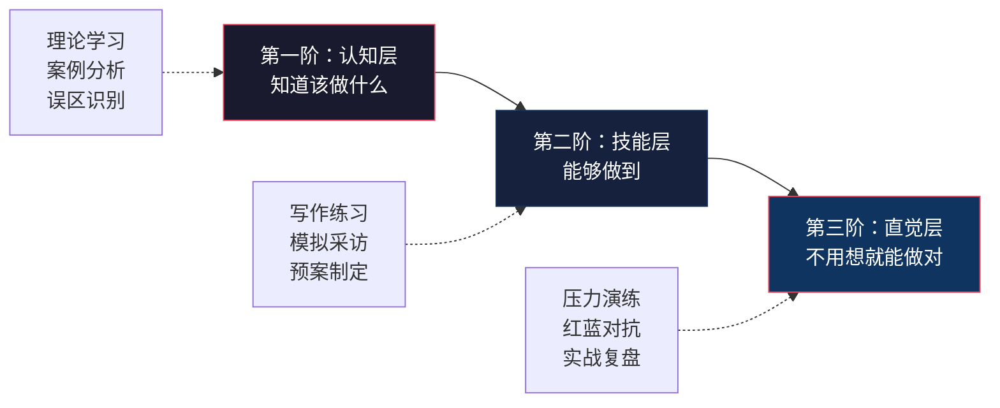

# 危机公关沟通——练习方法

> 危机沟通能力不是"读"出来的，而是"练"出来的。正如飞行员必须在模拟器中积累数百小时才能应对真实飞行中的突发状况，危机沟通者也必须通过系统化的刻意练习，将理论知识内化为本能反应。本章提供从个人基本功到组织级演练的完整练习体系，每一项练习都附有明确的目标、步骤、评估标准和常见陷阱，确保你练一次就进步一次。

## 一、练习体系总览

### 1.1 三阶能力模型

危机沟通能力的培养遵循"认知→技能→直觉"三个阶段，每个阶段对应不同的练习类型：

| 阶段 | 核心能力 | 练习类型 | 达标标志 |
|------|---------|---------|---------|
| 认知层 | 判断力——知道"应该做什么" | 案例分析、理论应用、误区识别 | 面对一个新案例，能在10分钟内给出合理的策略建议 |
| 技能层 | 执行力——能够"做得出来" | 写作练习、模拟采访、预案制定 | 能在30分钟内完成一份合格的危机声明，能在模拟采访中稳定发挥 |
| 直觉层 | 应变力——不用想就能"做对" | 高压演练、红蓝对抗、实战复盘 | 在无准备的情况下被抛入模拟危机，能在5分钟内启动正确响应 |

### 1.2 练习频率建议

| 练习类型 | 建议频率 | 每次时长 | 适合人群 |
|---------|---------|---------|---------|
| 舆情监测练习 | 每天 | 15-30分钟 | 所有人 |
| 道歉声明写作 | 每周1-2次 | 30-45分钟 | 公关从业者、管理者 |
| 案例深度分析 | 每周1次 | 1-2小时 | 所有人 |
| 媒体采访模拟 | 每两周1次 | 30-60分钟 | 发言人、高管 |
| 桌面推演 | 每季度1次 | 2-4小时 | 危机响应团队 |
| 全面实战模拟 | 每半年1次 | 半天至一天 | 组织级 |

---

## 二、基础能力练习

### 2.1 舆情监测练习

**练习目标：** 培养对危机信号的敏感度和判断力，建立"舆情嗅觉"。优秀的危机沟通者能够在负面信息刚出现时就判断出它是否会演变成危机——这种判断力不是天生的，而是通过长期观察和分析训练出来的。

#### 练习一：日常监测日记

**操作步骤：**

1. 每天花15-30分钟浏览微博热搜、抖音热榜、小红书热门话题、知乎热榜
2. 选择一个你熟悉的行业或品牌，追踪其相关话题至少一周
3. 使用以下模板记录每天的发现：

日期：____年__月__日
监测品牌/行业：________
━━━━━━━━━━━━━━━━━━━━━━
发现的负面信息：
  - 平台：____  内容摘要：____  传播量：____
  - 平台：____  内容摘要：____  传播量：____
情感倾向判断：正面__% / 中性__% / 负面__%
关键意见领袖动态：________
潜在升级风险评估：
  □ 低（个别投诉，无扩散趋势）
  □ 中（引发小范围讨论，有KOL参与）
  □ 高（快速传播，主流媒体关注，情绪化讨论占上风）
如果我是该品牌的公关负责人，我会：________
━━━━━━━━━━━━━━━━━━━━━━

4. 每周末回顾一周的记录，总结：哪些你预判会升级的事件真的升级了？哪些你忽略的信号后来变成了危机？

**进阶要求：** 连续练习4周后，你应该能够做到——看到一条负面信息，在5分钟内判断其升级概率，并给出理由。准确率目标：70%以上。

#### 练习二：危机信号回溯分析

**操作步骤：**

1. 选取3-5个近一年内发生的重大危机事件（建议涵盖不同行业）
2. 以时间为轴线，回溯事件爆发前的所有可识别信号：
   - 事件爆发前3-6个月：是否有零星投诉、行业预警、监管动向？
   - 事件爆发前1-3个月：是否有媒体报道、社交媒体讨论升温？
   - 事件爆发前1-2周：是否有明确的引爆点出现？
   - 事件爆发前24-48小时：是否有关键信息被曝光？
3. 用以下框架分析每个信号：

| 信号描述 | 出现时间 | 当时可见度 | 如果当时介入能否阻止危机 | 介入方式 |
|---------|---------|-----------|----------------------|---------|
| 例：消费者在黑猫投诉发布差评 | 爆发前3个月 | 低，仅投诉平台可见 | 可能，如果及时处理投诉并改进 | 客服主动联系、产品改进、补偿 |

4. 最终输出一份"预警信号时间线"图表，标注每个信号的最佳介入窗口

**核心洞察：** 通过这个练习你会发现，绝大多数危机都有至少2-3个"如果当时做了就不会爆发"的关键节点。理解这些节点，就是建立危机预警直觉的过程。

#### 练习三：舆情分析报告撰写

**操作步骤：**

1. 选择一个正在发酵的舆情事件
2. 在48小时内撰写一份不少于1500字的舆情分析报告，必须包含以下模块：

**报告结构模板：**

一、事件概述（200字）
  - 事件起因、经过、当前状态
  - 关键时间节点

二、传播路径分析（300字）
  - 信息源头（哪个平台、谁最先发布）
  - 扩散路径（从哪个平台到哪个平台，关键转发节点）
  - 当前传播规模（各平台数据汇总）

三、情感倾向分析（200字）
  - 正面/中性/负面评论比例
  - 主要情绪类型（愤怒、担忧、嘲讽、同情等）
  - 情感变化趋势

四、关键意见领袖分析（200字）
  - 参与讨论的KOL列表及其立场
  - KOL的影响力评估（粉丝量、互动率）
  - KOL对舆情走向的影响

五、利益相关者诉求分析（200字）
  - 各方诉求是什么
  - 诉求之间的冲突点

六、发展趋势预测（200字）
  - 最可能的走向
  - 可能的转折点
  - 预计持续时间

七、建议措施（200字）
  - 如果我是涉事方，当前应采取的行动
  - 短期（24小时内）、中期（一周内）、长期（一个月内）策略

3. 与同事或学习伙伴分享报告，听取不同视角的分析
4. 一周后回顾：你的预测准确吗？哪里判断对了，哪里判断错了？为什么？

### 2.2 危机沟通预案制定练习

**练习目标：** 掌握从零开始制定危机沟通预案的全流程方法。预案不是一份"写了就放抽屉"的文档，而是一套"随时能用"的行动系统。

#### 练习一：风险地图绘制

**操作步骤：**

1. 选择一个你所在的组织（公司、学校、社团，甚至个人品牌）
2. 使用"风险矩阵"方法系统识别潜在危机：

第一步：头脑风暴——列出所有可能的危机场景（至少20个）
  提示维度：
  - 产品/服务质量问题
  - 员工行为问题
  - 数据安全问题
  - 合作方/供应链问题
  - 高管个人问题
  - 营销传播失误
  - 竞争对手攻击
  - 监管政策变化
  - 自然灾害/不可抗力
  - 网络舆情/谣言

第二步：风险评估——对每个场景打分
  发生概率（1-5分）× 影响程度（1-5分）= 风险得分

第三步：绘制风险矩阵图

|  | 影响程度1 | 影响程度2 | 影响程度3 | 影响程度4 | 影响程度5 |
|--|---------|---------|---------|---------|---------|
| **概率5** | 5 | 10 | 15 | 20 | **25** |
| **概率4** | 4 | 8 | 12 | **16** | **20** |
| **概率3** | 3 | 6 | 9 | **12** | **15** |
| **概率2** | 2 | 4 | 6 | 8 | **10** |
| **概率1** | 1 | 2 | 3 | 4 | 5 |

> 高风险区（15-25分）：必须制定详细预案
> 中风险区（8-14分）：制定基本预案
> 低风险区（1-7分）：记录备案，定期复查

4. 确定优先级最高的3-5种危机场景，为每种场景制定详细预案

#### 练习二：完整预案撰写

**操作步骤：**

选择一种高风险危机场景，撰写一份不少于3000字的完整危机沟通预案：

━━━━━━━━━━━━━━━━━━━━━━━━━━━━━━━━━━━━━━━━
危机沟通预案：[场景名称]
版本：v1.0    制定日期：____年__月__日
━━━━━━━━━━━━━━━━━━━━━━━━━━━━━━━━━━━━━━━━

一、危机定义与分级
  1.1 什么情况构成此类型危机？
  1.2 分级标准：
      Ⅰ级（特别重大）：[具体标准]
      Ⅱ级（重大）：[具体标准]
      Ⅲ级（较大）：[具体标准]
      Ⅳ级（一般）：[具体标准]

二、响应团队
  2.1 团队成员及职责分工（含A/B角备份）
  2.2 联系方式清单（手机/微信/邮箱，确保24小时可达）
  2.3 决策授权机制（谁在什么情况下可以做什么决策）

三、响应流程
  3.1 信息收集阶段（谁负责收集什么信息，多长时间内完成）
  3.2 评估研判阶段（如何判断危机等级，谁来做判断）
  3.3 策略制定阶段（核心信息是什么，由谁审批）
  3.4 对外发布阶段（通过什么渠道，按什么顺序发布）
  3.5 持续管理阶段（如何监测效果，何时调整策略）

四、核心信息（Key Messages）
  4.1 针对消费者的核心信息（不超过3条）
  4.2 针对媒体的核心信息（不超过3条）
  4.3 针对员工的核心信息（不超过3条）
  4.4 针对投资者/合作方的核心信息（不超过3条）

五、沟通模板
  5.1 初步声明模板（200字以内）
  5.2 详细回应模板（500-800字）
  5.3 媒体问答要点（10个最可能被问到的问题及回答）
  5.4 社交媒体回应模板（针对不同平台的差异化版本）
  5.5 内部通知模板（全员版、管理层版）

六、利益相关者沟通计划
  6.1 优先级排序及沟通时间表
  6.2 每类群体的沟通渠道和方式
  6.3 预期反应及应对预案

七、监测与评估
  7.1 舆情监测指标
  7.2 沟通效果评估标准
  7.3 策略调整触发条件

八、附录
  8.1 媒体联系人清单
  8.2 法律顾问联系方式
  8.3 历史类似案例参考
━━━━━━━━━━━━━━━━━━━━━━━━━━━━━━━━━━━━━━━━

**自查清单（完成预案后逐一核对）：**

- [ ] 每个角色都有A/B角备份吗？
- [ ] 联系方式是最新的吗？能24小时联系到吗？
- [ ] 模板中的占位符都有明确的填写指引吗？
- [ ] 核心信息足够简洁（每条不超过一句话）吗？
- [ ] 预案经过至少一位有经验的人审阅了吗？
- [ ] 是否考虑了"次生危机"的可能性？

请有经验的同事或导师审阅并提供反馈。特别关注：预案中的假设是否合理？流程是否有遗漏？模板是否可直接使用？

---

## 三、核心技能练习

### 3.1 道歉声明撰写练习

**练习目标：** 掌握撰写高质量道歉声明的能力。道歉声明是危机沟通中最核心的文本类型——写好了能平息风波，写砸了会火上浇油。

**道歉六要素框架（必须熟记）：**

| 要素 | 说明 | 示例 |
|------|------|------|
| ① 承认事实 | 明确说明发生了什么，不回避、不含糊 | "我们确认在XX产品中发现了XX问题" |
| ② 表达歉意 | 真诚的情感表达，不是模板化的客套 | "我们对此深感抱歉，辜负了消费者的信任" |
| ③ 承担责任 | 明确责任主体，不甩锅、不推诿 | "这是我们的责任，我们不会将问题归咎于任何第三方" |
| ④ 解释原因 | 适度说明原因，但不是找借口 | "经初步调查，问题源于XX环节的XX疏漏" |
| ⑤ 承诺改正 | 具体的改进措施和时间表 | "我们将在XX天内完成XX，并建立XX机制防止再次发生" |
| ⑥ 提供补偿 | 对受影响者的实际补偿方案 | "已购买该产品的消费者可通过XX渠道申请退款或换货" |

#### 练习一：经典案例对比分析

**操作步骤：**

1. 收集6-10个真实的危机道歉声明（建议涵盖成功和失败案例），以下案例供参考：

**成功案例：**
- 海底捞2017年后厨事件道歉声明（快速、真诚、具体）
- 强生1982年泰诺投毒事件召回声明（果断、负责、以人为本）
- Airbnb 2011年房东房屋被毁事件CEO道歉信（个人化、有温度）

**失败案例：**
- 美联航2017年拖拽乘客事件CEO声明（冷淡、推卸责任）
- 某明星出轨道歉声明（避重就轻、缺乏诚意）
- 某企业数据泄露后的"不便"式道歉（模板化、无实质内容）

2. 对每份声明使用以下评分表进行评估：

声明评分表（每项1-5分）：
━━━━━━━━━━━━━━━━━━━━━━━━━━━━━━━━━━
要素                得分    评价
━━━━━━━━━━━━━━━━━━━━━━━━━━━━━━━━━━
① 承认事实          __/5    ________
② 表达歉意          __/5    ________
③ 承担责任          __/5    ________
④ 解释原因          __/5    ________
⑤ 承诺改正          __/5    ________
⑥ 提供补偿          __/5    ________
━━━━━━━━━━━━━━━━━━━━━━━━━━━━━━━━━━
额外评估：
  真诚度              __/5    ________
  具体性              __/5    ________
  时机把握            __/5    ________
  渠道选择            __/5    ________
━━━━━━━━━━━━━━━━━━━━━━━━━━━━━━━━━━
总分                __/65
━━━━━━━━━━━━━━━━━━━━━━━━━━━━━━━━━━

3. 写一份500字的对比分析报告：这些声明中，哪些要素的有无最直接影响了公众接受度？你发现了什么规律？

#### 练习二：失败道歉改写

**操作步骤：**

1. 找到一份被公众认为"失败"的道歉声明
2. 逐句分析其问题所在：
   - 哪些要素缺失了？
   - 哪些措辞触发了公众反感？
   - 哪些地方显得不真诚？
   - 信息结构有什么问题？
3. 根据六要素框架重新撰写一份改进版
4. 对比原版和改进版，写一段200字的改写说明，解释你做了哪些修改以及为什么

#### 练习三：限时写作挑战

**操作步骤：**

1. 选择以下场景之一（或随机抽取）：

| 场景编号 | 危机场景 | 难度 |
|---------|---------|------|
| A | 某连锁餐厅被曝使用过期食材，视频在网上疯传 | ★★ |
| B | 某科技公司发生用户数据泄露，涉及500万用户 | ★★★ |
| C | 某教育机构被曝虚假宣传，多名家长要求退款 | ★★ |
| D | 某企业CEO在社交媒体发表不当言论，引发众怒 | ★★★ |
| E | 某品牌新品发布后被曝抄袭独立设计师作品 | ★★★ |
| F | 某医院被曝过度医疗，患者家属在医院门口拉横幅 | ★★★★ |

2. 设定30分钟倒计时
3. 在30分钟内完成一份完整的道歉声明（包含六要素）
4. 请他人使用上述评分表进行评估
5. 根据反馈修改，记录：从初稿到终稿改了几版？每次修改了什么？

**自我评估标准：**

| 分数段 | 水平 | 说明 |
|-------|------|------|
| 50-65分 | 优秀 | 可以直接使用 |
| 35-49分 | 良好 | 需要局部修改 |
| 20-34分 | 及格 | 需要重大修改 |
| 20分以下 | 不及格 | 需要重新学习六要素框架 |

### 3.2 新闻发布会模拟练习

**练习目标：** 提升在新闻发布会上的沟通能力，包括开场陈述、Q&A应对和非语言沟通。

#### 练习一：开场陈述撰写与演练

**操作步骤：**

1. 选择一个危机场景，撰写一份3分钟的开场陈述（约500-600字）
2. 开场陈述必须包含：
   - 对事件的简要说明（30秒）
   - 组织的态度和立场（30秒）
   - 已采取的措施（60秒）
   - 下一步计划（60秒）
3. 对着镜子或手机录像进行练习，至少录制3遍
4. 回看录像，使用以下评估表自评：

非语言沟通评估表：
━━━━━━━━━━━━━━━━━━━━━━━━━━━━━━━━━━
维度              自评    改进点
━━━━━━━━━━━━━━━━━━━━━━━━━━━━━━━━━━
眼神接触          __/5    ________
面部表情          __/5    ________
站姿/坐姿         __/5    ________
手势运用          __/5    ________
语速控制          __/5    ________
语调变化          __/5    ________
停顿运用          __/5    ________
填充词频率        __/5    ________
（"嗯""那个""就是"等，越少越好）
整体自信度        __/5    ________
━━━━━━━━━━━━━━━━━━━━━━━━━━━━━━━━━━

5. 针对得分最低的2-3个维度，进行专项改进训练

#### 练习二：小组模拟新闻发布会

**操作步骤：**

1. 组建一个6-10人的练习小组
2. 角色分配：

| 角色 | 人数 | 职责 | 准备要点 |
|------|------|------|---------|
| 发言人 | 1人 | 代表组织对外沟通 | 熟悉事件背景、核心信息、口径 |
| 发言人助理 | 1人 | 提供资料支持、记录问题 | 准备所有参考资料和数据 |
| 记者（友善型） | 2-3人 | 提出基本但合理的问题 | 准备5-8个常规问题 |
| 记者（挑战型） | 1-2人 | 提出尖锐、诱导性问题 | 准备5-8个高难度问题 |
| 观察员 | 1-2人 | 全程观察并记录 | 准备评估表 |

3. 流程：
   - 发言人做3分钟开场陈述
   - 记者提问环节（15-20分钟）
   - 发言人总结发言（2分钟）
4. 观察员使用以下评估表：

发言人表现评估表：
━━━━━━━━━━━━━━━━━━━━━━━━━━━━━━━━━━━━━━━━━━
评估维度                    得分    具体观察
━━━━━━━━━━━━━━━━━━━━━━━━━━━━━━━━━━━━━━━━━━
开场陈述质量
  - 信息完整性              __/5    ________
  - 态度真诚度              __/5    ________
  - 逻辑清晰度              __/5    ________

Q&A应对
  - 回答准确性              __/5    ________
  - 核心信息传递            __/5    ________
  - 桥接技术运用            __/5    ________
  - 尖锐问题应对            __/5    ________
  - 是否回避关键问题        __/5    ________
  - 情绪控制                __/5    ________

非语言表现
  - 眼神接触                __/5    ________
  - 语速语调                __/5    ________
  - 肢体语言                __/5    ________

整体评价
  - 专业度                  __/5    ________
  - 可信度                  __/5    ________
━━━━━━━━━━━━━━━━━━━━━━━━━━━━━━━━━━━━━━━━━━
总分                        __/65
━━━━━━━━━━━━━━━━━━━━━━━━━━━━━━━━━━━━━━━━━━
三个做得好的地方：
1. ________________
2. ________________
3. ________________
三个需要改进的地方：
1. ________________
2. ________________
3. ________________
━━━━━━━━━━━━━━━━━━━━━━━━━━━━━━━━━━━━━━━━━━

5. 复盘讨论（15分钟）：所有参与者分享观察和建议
6. 进行第二轮模拟，改进不足之处，对比两轮表现

#### 练习三：尖锐问题应答训练

**操作步骤：**

1. 列出以下10类最难回答的问题类型，并为每类编写2个示例问题：

| 问题类型 | 示例 | 应对策略 |
|---------|------|---------|
| 诱导性问题 | "所以你承认是你们的错了？" | 重新定义问题框架 |
| 二选一陷阱 | "是疏忽还是故意？" | 拒绝虚假二选一 |
| 追问细节 | "具体是谁做的决定？" | 适度披露，保护内部 |
| 历史翻旧账 | "你们去年也有类似问题，怎么解释？" | 承认历史，聚焦当下 |
| 情感施压 | "受害者的家属怎么办？" | 表达同理心，给出行动 |
| 传言确认 | "有消息称内部早就知道了？" | 不确认不否认，回到事实 |
| 对比攻击 | "XX公司处理得比你们好多了？" | 不评价他人，聚焦自身 |
| 假设性问题 | "如果调查结果证实是你们的问题呢？" | 不做假设性承诺 |
| 数据质疑 | "你说的数字怎么证明？" | 提供来源，承诺透明 |
| 离题追问 | "你个人怎么看这件事？" | 引回组织立场 |

2. 与练习伙伴一对一模拟：伙伴随机提问，你即时回答
3. 每回答一个问题后，双方讨论：这个回答好在哪里？可以怎么改进？
4. 特别练习"桥接"技术——将不利问题引导到你想传递的核心信息上

**桥接技术句式库：**

转入核心信息：
  "这个问题很重要，但更重要的是……"
  "我想补充一个关键信息……"
  "从另一个角度看……"

表示理解后转入：
  "我理解您的关切，实际上我们已经……"
  "您说得对，这确实值得关注，我们的做法是……"

承认局限后转入：
  "目前调查仍在进行，但我们可以确认的是……"
  "关于这一点，我们会在X时间给出明确答复，但有一点是确定的……"

### 3.3 媒体采访模拟练习

**练习目标：** 提升应对不同类型媒体采访的能力。不同媒体形态（电视、文字、电话、短视频）对沟通者的要求差异极大，需要分别练习。

#### 练习一：电视/视频采访模拟

**操作步骤：**

1. 使用手机录制一段3-5分钟的模拟电视采访（练习伙伴扮演记者）
2. 注意以下要点：

电视采访检查清单：
━━━━━━━━━━━━━━━━━━━━━━━━━━━━━━━━━━
□ 着装得体（深色西装或商务休闲，避免花哨图案）
□ 眼神看镜头（不是看屏幕上的自己）
□ 表情自然（不过度严肃也不过度轻松）
□ 回答简洁（每个回答控制在30秒以内，约80-100字）
□ 语速适中（每分钟200-250字）
□ 避免专业术语（用普通人能听懂的语言）
□ 善用停顿（在关键信息前短暂停顿，增强效果）
□ 避免小动作（不摸脸、不转笔、不抖腿）
□ 坐姿稳定（不前后摇晃）
□ 结尾有力（最后一句话要有总结性）
━━━━━━━━━━━━━━━━━━━━━━━━━━━━━━━━━━

3. 回看录像，重点关注：你的回答是否能在30秒内传达一个完整信息？是否有口头禅？表情是否传递出自信和诚意？

#### 练习二：文字采访模拟

**操作步骤：**

1. 练习伙伴扮演记者，通过微信或邮件发送5-8个问题
2. 用文字方式逐一回答，注意：
   - 每个回答控制在150字以内
   - 用词准确，避免歧义
   - 考虑文字被截取后单独传播的后果（每一句是否都能独立成立？）
   - 避免使用"绝对""永远""从不"等极端词汇
3. 请第三方评估：这些回答是否可能被断章取义？是否有歧义？

#### 练习三：电话/语音采访模拟

**操作步骤：**

1. 练习伙伴通过电话进行采访（不看笔记）
2. 注意：
   - 语速比面对面沟通慢10-15%（电话传递非语言信息更少）
   - 适当重复关键信息（"我再强调一下……"）
   - 如果需要时间思考，用"这个问题很重要，让我准确回答"来争取时间
   - 不要在不确认对方是否录音的情况下说任何非正式的话
3. 练习结束后，听取通话录音，评估自己的表现

#### 练习四：短视频/直播场景模拟

**操作步骤：**

1. 录制一段60秒的危机回应短视频（模拟抖音/视频号发布）
2. 挑战在于：60秒内必须传达态度+事实+行动三个核心信息
3. 结构建议：

60秒回应结构：
  0-10秒：态度表达
    "关于XX事件，我们非常重视，也深感歉意。"
  10-30秒：事实说明
    "目前确认的情况是XX。"
  30-50秒：行动承诺
    "我们已经采取了XX措施，并将XX。"
  50-60秒：结尾
    "我们将持续通报进展，感谢大家的关注和监督。"

4. 注意：短视频场景下，语速、表情、背景、着装都会被放大审视

---

## 四、综合能力练习

### 4.1 危机模拟桌面推演（Tabletop Exercise）

**练习目标：** 综合运用危机沟通的所有理论和技能，在模拟环境中体验危机决策的全过程。桌面推演是"从知道到做到"的关键桥梁——在推演中犯的每一个错误，都是真实危机中少犯的一个错误。

#### 完整推演流程

**准备工作（推演前一周）：**

1. 组建8-12人的演练团队
2. 指定一名主持人（不参与决策，负责推进流程和注入新信息）
3. 准备详细的危机场景描述文档，包括：
   - 事件背景（组织基本信息、行业环境）
   - 事件经过（按时间线逐步披露）
   - 已知信息和未知信息
   - 各方反应（媒体、消费者、监管部门）

**场景示例模板：**

━━━━━━━━━━━━━━━━━━━━━━━━━━━━━━━━━━━━━━━━
桌面推演场景：XX奶茶品牌原料争议
━━━━━━━━━━━━━━━━━━━━━━━━━━━━━━━━━━━━━━━━

背景信息：
XX奶茶是国内知名连锁品牌，全国拥有3000+门店。
公司正在筹备IPO，预计3个月后上市。

事件时间线：

T+0（周一上午10:00）：
  一名自称"前员工"的用户在小红书发布视频，
  称XX奶茶使用过期原料，视频中展示了过期标签。
  视频发布2小时内获得5万播放量。

T+2小时（周一中午12:00）：
  视频被搬运到微博，多位美食博主转发。
  "XX奶茶过期原料"话题开始上升。
  黑猫投诉平台出现20+条相关投诉。

T+4小时（周一下午14:00）：
  话题登上微博热搜第15位。
  地方电视台记者开始联系公司。
  市场监管部门表示"已关注，将介入调查"。

[T+6小时、T+12小时、T+24小时...后续信息由主持人逐步注入]

你的任务：
在每个时间节点，团队需要在15分钟内做出决策并执行。
━━━━━━━━━━━━━━━━━━━━━━━━━━━━━━━━━━━━━━━━

4. 分配角色：

| 角色 | 职责 | 关键考量 |
|------|------|---------|
| CEO | 最终决策者 | 平衡短期舆论控制和长期品牌价值 |
| 公关总监 | 沟通策略制定者 | 信息准确性vs响应速度的平衡 |
| 法务顾问 | 法律风险评估 | 沟通措辞的法律后果 |
| 运营负责人 | 事实调查和业务处理 | 提供真实情况和可行方案 |
| 社交媒体经理 | 线上舆情管理和回应 | 实时监测和回应策略 |
| 媒体记者（2-3人） | 提出刁钻问题，模拟真实媒体 | 挖掘信息，制造压力 |
| 消费者代表 | 表达消费者诉求和情绪 | 模拟真实消费者反应 |
| 观察员 | 记录决策过程和关键节点 | 不参与决策，只记录 |

**推演流程（总时长3-4小时）：**

第一阶段：危机爆发（60分钟）
  10分钟：阅读初始场景信息
  15分钟：团队内部讨论，确定危机等级和初步策略
  15分钟：制定并审批第一份对外声明
  20分钟：模拟媒体回应（记者提问+发言人回答）

第二阶段：危机蔓延（60分钟）
  主持人注入新信息（如：更多媒体报道、监管部门声明、受害者发声）
  15分钟：重新评估形势，调整策略
  15分钟：制定第二轮沟通内容
  15分钟：模拟新闻发布会
  15分钟：模拟社交媒体危机管理

第三阶段：危机转折（45分钟）
  主持人注入转折性信息（如：调查结果出炉、竞争对手表态）
  15分钟：策略调整讨论
  15分钟：模拟内部沟通（给员工的通知）
  15分钟：模拟利益相关者沟通（给投资者/合作方的信息）

第四阶段：复盘（45-60分钟）
  观察员做全程回顾
  每个角色自评：你最满意和最不满意的一个决策
  团队讨论：如果重来一次，哪些决策会不同？
  提取3-5条可写入预案的改进建议

**复盘关键问题清单：**

决策质量：
  □ 危机等级判断是否准确？
  □ 响应速度是否达标？
  □ 策略选择是否恰当？
  □ 核心信息是否一致？

执行质量：
  □ 内部沟通是否顺畅？信息传递是否有延迟或失真？
  □ 对外声明是否准确、及时、有温度？
  □ 发言人面对尖锐问题时表现如何？
  □ 社交媒体回应的速度和质量是否达标？

协作质量：
  □ 团队成员之间的配合是否默契？
  □ 决策链条是否清晰？是否有"抢决策"或"推责任"的情况？
  □ 信息在团队内部的流通是否及时？

改进方向：
  □ 预案需要哪些修订？
  □ 团队能力需要哪些补强？
  □ 下次演练应重点练习什么？

### 4.2 案例深度分析练习

**练习目标：** 通过系统分析真实案例，建立"案例分析"的思维框架，提升危机判断力和决策力。

#### 分析框架——七维分析法

选择一个与你所在行业相关的危机案例，使用以下七维框架进行深度分析，撰写一份2000-3000字的案例分析报告：

━━━━━━━━━━━━━━━━━━━━━━━━━━━━━━━━━━━━━━━━
案例分析报告模板
━━━━━━━━━━━━━━━━━━━━━━━━━━━━━━━━━━━━━━━━

一、背景分析（300字）
  - 社会背景：事件发生时的社会舆论环境
  - 行业背景：该行业当时的整体状况和竞争格局
  - 组织背景：涉事组织的历史、规模、声誉状况

二、危机类型判断（200字）
  - 危机类型：受害型 / 事故型 / 可预防型（SCCT分类）
  - 危机等级：Ⅰ级 / Ⅱ级 / Ⅲ级 / Ⅳ级
  - 判断依据

三、时间线还原（300字）
  - 按时间顺序梳理关键节点
  - 标注每个节点的决策和行动

四、利益相关者分析（300字）
  - 识别所有受影响群体
  - 分析每类群体的核心诉求和影响力
  - 绘制利益相关者影响力-利益矩阵

五、沟通策略评估（400字）
  - 组织采取了什么策略？（否认/弱化/重建/强化？）
  - 策略是否与危机类型匹配？
  - 执行质量如何？（声明措辞、时机选择、渠道选择）
  - 沟通中有哪些亮点和失误？

六、效果评估（300字）
  - 舆情走向如何？（正面/负面/中性变化趋势）
  - 对品牌声誉的实际影响（可量化指标：股价、搜索指数、销量等）
  - 对利益相关者关系的影响

七、改进建议（200字）
  - 如果你是该组织的公关总监，你会如何改进？
  - 具体到：时机、措辞、渠道、策略

八、迁移思考（200字）
  - 这个案例对你所在组织有什么启示？
  - 你的组织是否有类似的风险点？
  - 你会如何将这个案例的教训写入预案？
━━━━━━━━━━━━━━━━━━━━━━━━━━━━━━━━━━━━━━━━

**推荐分析的经典案例清单：**

| 案例 | 年份 | 核心看点 | 推荐理由 |
|------|------|---------|---------|
| 强生泰诺投毒事件 | 1982 | 果断召回+信息透明 | 危机沟通教科书级案例 |
| 海底捞后厨事件 | 2017 | 快速认错+公开整改 | 中企危机公关标杆 |
| 美联航拖拽乘客 | 2017 | CEO声明失败+股价暴跌 | 反面教材，多轮沟通失误 |
| 三星Note7电池爆炸 | 2016 | 拖延+双重标准 | 跨国企业危机处理的教训 |
| 三聚氰胺事件 | 2008 | 沉默与否认的代价 | 行业性危机的处理差异 |
| 特斯拉自动驾驶事故 | 持续 | 技术争议中的沟通困境 | 技术型危机的特殊性 |

### 4.3 道歉心理学实验

**练习目标：** 通过受控实验理解有效道歉的心理机制，用数据而非直觉来指导道歉声明的撰写。

#### 实验一：道歉要素效果测试

**操作步骤：**

1. 设计同一危机场景下的三种不同版本道歉声明：

**版本A（仅承认错误）：**
> 我们确认在XX产品中发现了XX问题。我们对此事正在进行调查。

**版本B（承认+歉意+改正）：**
> 我们确认在XX产品中发现了XX问题。我们对此深感抱歉。我们已启动全面调查，并将在48小时内公布结果和整改方案。

**版本C（完整六要素）：**
> 我们确认在XX产品中发现了XX问题。我们对此深感抱歉，辜负了消费者的信任。这是我们的责任。经初步排查，问题源于XX环节的管理疏漏。我们已启动全面整改，将在48小时内公布详细方案。已购买相关产品的消费者可联系客服办理退款。我们欢迎社会各界监督我们的整改过程。

2. 请15-20位朋友随机分为三组，每组阅读一个版本
3. 使用以下问卷收集反馈：

道歉效果评估问卷：
━━━━━━━━━━━━━━━━━━━━━━━━━━━━━━━━━━
请根据阅读感受打分（1-5分）：

1. 这份道歉让你感到真诚吗？      __/5
2. 你愿意原谅这个组织吗？         __/5
3. 你认为这个组织会真正改进吗？    __/5
4. 你还会继续购买该品牌吗？       __/5
5. 你愿意向朋友推荐这个品牌吗？    __/5

开放问题：
6. 这份道歉中最打动你的是什么？________
7. 这份道歉中最让你不满的是什么？________
━━━━━━━━━━━━━━━━━━━━━━━━━━━━━━━━━━

4. 对比三组数据，分析：哪个要素的缺失对公众接受度影响最大？

#### 实验二：道歉者身份对比

**操作步骤：**

1. 设计同一危机场景下的两种道歉方式：
   - 方式A：CEO亲自出面道歉（附照片和签名）
   - 方式B：公关部门以组织名义道歉
2. 请15-20位朋友评估两种方式的效果差异
3. 分析"道歉者身份"对道歉效果的影响

**预期发现（基于学术研究）：**
- CEO亲自道歉在涉及价值观和道德问题时效果更好
- 专业团队道歉在涉及技术和操作问题时效果更好
- 无论哪种方式，"具体行动"比"情感表达"对恢复信任的影响更大

---

## 五、数字化危机沟通专项练习

### 5.1 社交媒体危机回应练习

**练习目标：** 掌握在不同社交平台上进行危机回应的差异化工法。每个平台的用户心态、传播逻辑和内容形态都不同，"一套话术打天下"的时代已经过去。

#### 平台差异化回应策略

| 平台 | 用户心态 | 内容形态 | 回应要点 | 注意事项 |
|------|---------|---------|---------|---------|
| 微博 | 吃瓜围观、情绪化 | 短文本+图片/视频 | 简洁有力、态度鲜明、配图说明 | 评论区管理至关重要 |
| 微信公众号 | 深度阅读、理性分析 | 长文 | 详尽完整、数据支撑、逻辑清晰 | 推送时机影响阅读量 |
| 抖音/快手 | 视觉冲击、感性认知 | 短视频 | 真人出镜、表情真诚、节奏紧凑 | 60秒内讲完核心信息 |
| 小红书 | 种草拔草、信任导向 | 图文笔记 | 真实体验感、避免官方腔调 | 用户对"广告感"极敏感 |
| 知乎 | 理性讨论、专业导向 | 长回答 | 专业深度、引用数据、承认不足 | 不要删帖，正面回应质疑 |

#### 练习：多平台同步回应

**操作步骤：**

1. 选择一个危机场景
2. 为以上5个平台各撰写一份回应内容
3. 确保：核心信息一致，但表达方式因平台而异
4. 请熟悉不同平台的朋友评估：每份内容是否"像那个平台上的原生内容"？

### 5.2 舆情数据解读练习

**练习目标：** 学会从数据中读出舆情走向，为决策提供依据。

**操作步骤：**

1. 选择一个正在发生的舆情事件
2. 收集以下数据：

数据收集清单：
  - 各平台话题阅读量/讨论量（微博、抖音、知乎）
  - 情感倾向比例（正面/中性/负面）
  - 传播曲线（每小时新增讨论量）
  - 关键传播节点（哪些账号推动了传播）
  - 评论区高频词云
  - 相关搜索词变化

3. 基于数据撰写一份500字的"数据解读备忘录"，回答：
   - 当前舆情处于什么阶段？（上升期/高峰期/衰退期）
   - 负面情绪的核心触发点是什么？
   - 未来24小时最可能的走向是什么？
   - 基于数据，最优先的回应策略是什么？

---

## 六、个人能力评估与持续提升

### 6.1 自我评估清单

完成本章所有练习后，使用以下评估表进行自我评估：

| 能力维度 | 评估标准 | 自评（1-5分） |
|---------|---------|---------------|
| 危机识别 | 能够在舆情早期阶段识别危机信号，准确判断升级概率 | |
| 快速响应 | 能够在黄金时间窗口内完成初步声明撰写和审批 | |
| 策略选择 | 能够根据危机类型和情境选择适当的沟通策略 | |
| 声明撰写 | 能够在30分钟内撰写一份包含六要素的合格道歉声明 | |
| 媒体应对 | 能够在模拟采访中稳定发挥，有效运用桥接技术 | |
| 社交媒体管理 | 能够针对不同平台制定差异化的危机回应策略 | |
| 内部沟通 | 能够在危机中快速统一内部口径，协调团队行动 | |
| 情绪管理 | 能够在高压环境下保持冷静、理性的判断和表达 | |
| 数据分析 | 能够从舆情数据中提取有价值的决策信息 | |
| 利益相关者管理 | 能够识别和平衡不同群体的诉求，制定差异化沟通策略 | |

**评分解读：**

| 平均分 | 水平 | 下一步行动 |
|-------|------|-----------|
| 4.0-5.0 | 精通 | 可以担任危机沟通顾问，建议参与实战和教学 |
| 3.0-3.9 | 熟练 | 重点突破薄弱项，增加实战模拟频率 |
| 2.0-2.9 | 入门 | 需要系统学习理论和大量基础练习 |
| 1.0-1.9 | 新手 | 建议从第一章理论基础开始完整学习 |

### 6.2 进阶学习路径

**理论深化推荐：**

| 书名 | 作者 | 核心价值 |
|------|------|---------|
| *Ongoing Crisis Communication* | W. Timothy Coombs | SCCT理论的系统阐述 |
| *Accounts, Excuses, and Apologies* | William Benoit | 形象修复理论的奠基之作 |
| *The Handbook of Crisis Communication* | Coombs & Holladay | 危机传播领域的百科全书 |
| *Crisis Communications* | Alan Jay Zaremba | 实操导向的危机沟通指南 |
| 《危机传播管理》 | 胡百精 | 中文语境下的危机传播理论 |

**学术期刊：**
- *Public Relations Review*——公关领域顶级期刊
- *Journal of Communication*——传播学顶级期刊
- *Journal of Contingencies and Crisis Management*——危机管理专业期刊
- *Management Communication Quarterly*——组织沟通研究

**日常积累习惯：**

1. **建立个人案例库：** 使用Notion、飞书或Excel，持续收集和分析新案例。每条记录包含：事件概述、沟通策略、效果评估、个人点评
2. **每周案例复盘：** 每周花1-2小时分析一个新案例，使用七维分析法
3. **月度模拟练习：** 每月进行一次个人模拟（写作+录像），跟踪自己的进步
4. **季度团队演练：** 每季度组织一次桌面推演，保持团队危机应对能力
5. **年度能力评估：** 每年用上述评估清单重新评估自己，对比去年的进步

### 6.3 练习成果记录模板

建议为每次练习建立记录，追踪进步：

━━━━━━━━━━━━━━━━━━━━━━━━━━━━━━━━━━━━━━━━
练习记录卡
━━━━━━━━━━━━━━━━━━━━━━━━━━━━━━━━━━━━━━━━
日期：____年__月__日
练习类型：□舆情监测 □声明写作 □采访模拟 □桌面推演 □案例分析 □其他
练习场景/主题：________

过程记录：
  用时：____分钟
  完成度：□完整 □部分完成 □中途放弃
  难度感受：□太简单 □适中 □有挑战 □太难

自我评估：
  做得好的地方：________
  需要改进的地方：________
  下次要尝试的改进：________

外部反馈（如有）：
  评价者：________
  评分：____/65
  关键建议：________

收获与反思：
________
________
━━━━━━━━━━━━━━━━━━━━━━━━━━━━━━━━━━━━━━━━

---

## 七、从练习到实战：关键过渡建议

### 7.1 为什么练习和实战差距很大？

练习中你有充分的时间思考，没有真实的舆论压力，犯了错也不会有实际后果。但真正的危机中，你会面对：

- **信息不完整：** 你必须在不知道全部事实的情况下做决策
- **时间极度紧迫：** 社交媒体时代，你可能只有1-2小时的响应窗口
- **多方压力同时到来：** 媒体追问、消费者愤怒、员工恐慌、监管关注，所有压力同时涌来
- **情绪消耗巨大：** 连续数天高强度应对，身体和精神都在透支
- **决策不可逆：** 每一个公开发出的声明都无法撤回

### 7.2 缩小练习与实战差距的方法

1. **增加练习压力：** 在练习中给自己设定更短的时间限制，让练习伙伴提出更刁钻的问题
2. **引入随机变量：** 在桌面推演中让主持人随时注入意外信息，训练应变能力
3. **复盘真实危机：** 不仅分析"他们做了什么"，更想象"如果是我，在那个时间点、那种压力下，我会做什么"
4. **积累小规模实战经验：** 主动参与组织中的小型舆情处理，积累真实经验
5. **建立危机心态：** 理解危机中的心理压力是真实的，提前练习压力管理技巧（深呼吸、正念冥想、积极自我对话）

### 7.3 你的第一场真实危机

当你第一次面对真实危机时，请记住：

- **不完美是正常的。** 没有人在第一次危机中表现出色，重要的是在过程中学习
- **速度优先于完美。** 一份80分的声明在1小时内发出，比一份100分的声明在24小时后发出有效得多
- **团队比个人重要。** 危机中不要试图一个人扛所有事情，信任你的团队
- **危机会结束。** 无论当前的压力有多大，危机终会过去。保持冷静，做好每一步

记住本章的核心原则：**真诚是最大的技巧，行动是最好的回应。**

