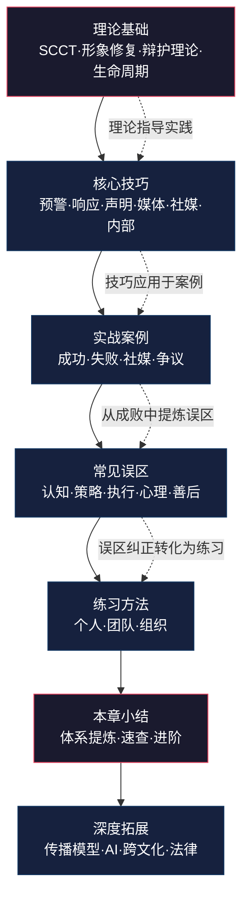

# 危机公关沟通——本章小结

> 本章小结不是简单的内容复述，而是全章知识体系的**结构化提炼**和**实战转化**。它承担三个功能：帮助你检验学习效果、提供危机来临时的速查手册、指明持续精进的方向。

## 一、全章知识体系总览

### 1.1 知识架构图

本章围绕"危机公关沟通"这一核心主题，从理论到实践构建了完整的知识体系。下图展示了七大模块之间的逻辑关系和知识流向：

### 1.2 核心学习路径

全章遵循"**道→法→术→器→练→拓**"的递进逻辑：

| 层次 | 对应章节 | 核心问题 | 学习产出 |
|------|----------|----------|----------|
| **道**（为什么） | 理论基础 | 危机沟通的底层逻辑是什么？ | 能用SCCT/IRT框架分析任何危机情境 |
| **法**（怎么想） | 核心技巧 | 危机来了先做什么、后做什么？ | 能制定完整的危机沟通预案 |
| **术**（怎么做） | 实战案例 | 别人是怎么成功/失败的？ | 能从案例中提取可迁移的策略 |
| **器**（避什么） | 常见误区 | 哪些做法看似合理实则致命？ | 能识别并避免16类常见错误 |
| **练**（如何精） | 练习方法 | 如何从知道变成做到？ | 能组织个人/团队/组织三级演练 |
| **拓**（如何深） | 深度拓展 | 危机沟通的前沿在哪里？ | 理解AI、跨文化、法律等前沿议题 |

---

## 二、理论框架：四大支柱

### 2.1 情境危机沟通理论（SCCT）

**核心主张：** 危机类型决定回应策略，不存在放之四海而皆准的万能方案。

SCCT由明尼苏达大学Timothy Coombs教授提出，是危机沟通领域最具影响力的理论框架。其核心是一张**危机类型-策略匹配矩阵**：

| 危机类型 | 定义 | 归因责任 | 最优策略 | 典型案例 |
|----------|------|----------|----------|----------|
| **受害型** | 组织本身也是受害者 | 低 | 否认策略+强化策略 | 谣言攻击、自然灾害波及、产品被蓄意篡改 |
| **事故型** | 非故意原因导致的危机 | 中 | 弱化策略+重建策略 | 技术故障、第三方失误引发的连带危机 |
| **可预防型** | 组织明知风险却未采取行动 | 高 | 重建策略（全面道歉+纠正） | 故意隐瞒信息、明知产品缺陷仍销售、违规操作 |

**关键洞察：** SCCT还有一个容易被忽略的变量——**声誉资本（Reputation Bank Account）**。长期积累良好声誉的组织在危机中享有更大的"容错空间"，公众更愿意给予其解释机会。强生在1982年泰诺事件中能全身而退，很大程度上因为其数十年积累的声誉资本。

**使用方法：** 面对一个危机事件时，按以下步骤应用SCCT：

1. **判断危机类型**——问自己：组织在此事件中有多大程度的"可预见性"和"可控性"？
2. **评估归因责任**——公众会将多少责任归因于组织？（注意：公众归因≠法律归因）
3. **匹配回应策略**——根据矩阵选择对应策略
4. **校准声誉资本**——组织的声誉存量能否支撑所选策略的"容错成本"？

### 2.2 形象修复理论（IRT）

**核心主张：** 形象修复有五大类策略，可以单独使用，也可以组合使用。

William Benoit提出的IRT理论提供了更为细化的策略工具箱：

| 策略大类 | 子策略 | 适用场景 | 风险提示 |
|----------|--------|----------|----------|
| **否认** | 简单否认、转移指责 | 确实被冤枉、有明确的第三方责任方 | 如果事后被证伪，公信力彻底崩塌 |
| **逃避责任** | 挑衅回应、能力不足、纯属意外、出于好意 | 非主观故意、客观条件限制 | 公众往往不接受"不是故意的"这一解释 |
| **降低冒犯** | 强化正面、淡化事态、区分比较、超越升华、反击指控者、补偿 | 危机影响可控、需要争取时间 | 淡化处理可能被视为不重视 |
| **纠正行为** | 承诺并实施具体改进措施 | 所有类型危机 | 承诺必须兑现，否则后果更严重 |
| **承认道歉** | 全面承认+真诚道歉+补偿方案 | 确实存在过错、公众期望道歉 | 过度道歉可能被视为承认法律责任 |

**关键提醒：** IRT五种策略不是互斥的。实战中最有效的往往是**组合策略**——例如"纠正行为+承认道歉"（海底捞模式）、"否认+强化正面"（被冤枉时的回应模式）。选择策略时，永远要考虑**法律维度**和**公关维度**的平衡——法律上建议沉默的时刻，公关上可能恰恰需要发声。

### 2.3 危机生命周期理论

**核心主张：** 危机有明确的时间维度，不同阶段需要不同的沟通重点。

| 阶段 | 特征 | 沟通重点 | 关键动作 |
|------|------|----------|----------|
| **潜伏期** | 信号出现但尚未爆发 | 预警与预防 | 启动监测、评估风险、准备预案 |
| **爆发期** | 事件公开化、舆论迅速升温 | 快速响应与信息控制 | 黄金窗口内发声、统一口径、启动危机团队 |
| **蔓延期** | 舆论持续发酵、多方介入 | 持续管理与动态调整 | 定期更新信息、管理利益相关者、应对次生危机 |
| **消退期** | 公众关注度下降 | 修复与复盘 | 执行改进措施、修复关系、总结教训 |

**关键洞察：** 危机的四个阶段并非线性推进——它可能在蔓延期因处理不当而**二次爆发**（如删帖被曝光、内部邮件泄露），也可能因积极沟通而**提前消退**。沟通者必须时刻准备阶段之间的跳跃。

### 2.4 利益相关者理论

**核心主张：** 危机沟通不是对"公众"的单向广播，而是与多个利益相关者群体的多方互动。

每个群体有不同的核心诉求和沟通优先级：

| 利益相关者 | 核心关切 | 沟通优先级 | 沟通渠道 | 沟通频率 |
|------------|----------|------------|----------|----------|
| 直接受影响者（消费者/用户） | 安全、赔偿、真相 | **最高** | 一对一沟通、客服热线、公告 | 实时 |
| 员工 | 事件真相、对自身的影响、组织走向 | **极高** | 内部邮件、全员会议、部门传达 | 每日至少一次 |
| 投资者/股东 | 财务影响、风险评估、管理层能力 | 高 | 财报说明会、投资者沟通、公告 | 按事件进展 |
| 媒体 | 事实真相、事件进展、组织态度 | 高 | 新闻发布会、媒体通稿、采访 | 每日更新 |
| 监管机构/政府 | 合规性、调查配合、整改措施 | 高 | 正式报告、主动沟通 | 按要求 |
| 合作伙伴/供应商 | 合作关系是否受影响、供应链稳定性 | 中 | 专属沟通渠道 | 按需 |
| 一般公众/社区 | 事件真相、组织态度、社会影响 | 中 | 社交媒体、官网、公开声明 | 按舆情节奏 |

**实操要点：** 危机爆发后的前4小时内，沟通资源应集中投放在"直接受影响者"和"员工"两个群体上。原因有二：第一，这是道德义务；第二，员工是组织的"内部媒体"——如果他们从新闻而非内部渠道得知危机，信息失控将从内部开始。

---

## 三、核心技能：六大模块

### 3.1 危机预警与预案

**预警系统三要素：**

1. **监测渠道覆盖**——社交媒体（微博、抖音、小红书、B站）、新闻媒体、论坛社区（知乎、脉脉）、电商/投诉平台（黑猫投诉、12315）、境外平台
2. **预警指标体系**——信息量突增（环比>300%）、情感极性偏移（负面>60%）、KOL介入（粉丝>50万的账号参与讨论）、传统媒体跟进、监管机构关注
3. **响应流程设计**——一级响应（全网热搜/监管介入，CEO级别介入）、二级响应（行业媒体关注/KOL扩散，VP级别介入）、三级响应（局部讨论/小范围投诉，公关部处理）

**预案核心模块：**

危机沟通预案（Crisis Communication Plan）
├── 1. 危机分类与分级标准
├── 2. 危机团队组织架构与联络表
├── 3. 响应流程图（按危机级别）
├── 4. 口径模板库（声明/道歉/FAQ）
├── 5. 媒体清单与联络方式
├── 6. 利益相关者沟通模板
├── 7. 社交媒体应急操作手册
├── 8. 内部沟通流程与模板
└── 9. 法律合规检查清单

### 3.2 首次回应

**黄金时间窗口的真相：**

"黄金4小时""黄金1小时"等说法的核心不是具体数字，而是**在谣言填补信息真空之前发布权威信息**。首次回应不需要完整答案，但需要传递三个信号：

1. **我们知道发生了什么**（信息掌控力）
2. **我们正在积极处理**（行动力）
3. **我们关心受影响的人**（同理心）

**首次回应模板框架：**

【关于[事件]的声明】

[时间]，[简述事件事实]。我们对此高度关注。

目前，我们已经采取以下措施：
1. [具体行动1]
2. [具体行动2]

我们将持续关注事件进展，并在[具体时间]发布进一步信息。
如需帮助，请联系[具体联系方式]。

[组织名称]
[日期]

### 3.3 道歉声明撰写

**六要素道歉法：**

| 要素 | 内容 | 示例 |
|------|------|------|
| ① 承认事实 | 清晰描述发生了什么 | "我们的产品在XX环节存在质量问题" |
| ② 表达歉意 | 真诚、具体、不推诿 | "我们对此深感抱歉，向所有受影响的消费者致歉" |
| ③ 解释原因 | 说明根因（不是借口） | "经初步调查，问题源于供应链XX环节的管理疏漏" |
| ④ 承诺改正 | 具体的改进措施 | "我们已立即停止相关产品线，启动全面排查" |
| ⑤ 提出补偿 | 对受影响者的具体补偿方案 | "所有受影响的消费者可获得[具体补偿]" |
| ⑥ 请求监督 | 表明接受公众监督的姿态 | "我们欢迎社会各界监督我们的整改进展" |

**措辞禁忌：**

| 禁忌表述 | 问题所在 | 更好的表述 |
|----------|----------|------------|
| "对造成的不便深表歉意" | "不便"严重弱化了事件的严重性 | "对造成的伤害深感痛心" |
| "如果有人感到被冒犯" | "如果"暗示组织不认为有错 | "我们的言行伤害了XX群体，对此我们深感抱歉" |
| "个别员工的个人行为" | 推卸组织责任 | "这是我们的管理失误，组织承担全部责任" |
| "正在积极调查中"（无后续） | 敷衍拖延 | "我们将在XX日前公布调查结果和改进方案" |

### 3.4 媒体应对

**桥接技术（Bridging）：** 当记者提出不利问题时，不直接拒绝也不掉入陷阱，而是"桥接"到你想传递的关键信息。

记者问："你们的产品出了这么大的安全事故，是不是质量管理有问题？"

❌ "这个问题我们不方便回答"（拒绝回答 → 显得心虚）
❌ "我们的质量管理一直很好"（否认 → 与事实矛盾时更被动）
✅ "消费者的安全是我们最重视的事情。目前我们已经[具体行动]，
    同时正在对整个生产流程进行全面审查。我们会在[时间]前
    公布完整的调查结果。"（桥接到行动和承诺）

**旗帜技术（Flagging）：** 在回答中突出你最想让记者记住的信息。

"我想特别强调的是……"
"最重要的一点是……"
"我希望公众了解的核心事实是……"

### 3.5 社交媒体危机管理

**社交媒体危机的五个独特特征：**

1. **去中心化传播**——信息不再由媒体把关人控制，每个用户都是传播节点
2. **情绪驱动**——社交媒体上传播最快的是情绪（愤怒>恐惧>悲伤>惊喜），而非事实
3. **算法放大**——平台推荐算法会将争议性内容推送给更多用户，形成正反馈循环
4. **截图永存**——删除的内容会被截图传播，"删帖"行为本身成为新的话题
5. **圈层共振**——不同平台（微博/知乎/小红书/B站）的用户群体和讨论逻辑差异巨大

**社交媒体回应原则：**

- **不要删帖**，除非内容涉及违法信息或侵犯他人隐私
- **不要关闭评论**，这会被解读为"心虚"
- **不要用模板化回复**应付每一条评论
- **要区分回应和争论**——回应质疑，但不与网民对骂
- **要善用"置顶声明"**——在自己的官方账号上置顶权威信息

### 3.6 内部危机沟通

**内部沟通的三大铁律：**

1. **员工必须先于媒体知道**——如果员工从新闻上才知道自己的公司出了事，组织的内部信任将瞬间崩塌
2. **口径必须统一**——给员工提供标准的对外应答话术（FAQ），避免"每个人一个说法"
3. **信息必须持续更新**——不能只在危机爆发时通知一次就消失，要建立定期更新机制

**内部沟通模板框架：**

主题：关于[事件]的内部通报（第X号）

各位同事：

[事实概述]
[组织立场]
[当前已采取的措施]
[对员工的影响和要求]
[标准对外应答话术]
[后续更新安排]

如有疑问，请联系[内部联络人]。
请勿在社交媒体上发布与本事件相关的个人观点。

---

## 四、实战案例核心教训

### 4.1 成功案例的共同模式

通过分析强生泰诺（1982）、海底捞后厨事件（2017）、恒天然肉毒杆菌事件（2013）等经典成功案例，可以提炼出**五项共同特征**：

| 特征 | 具体表现 | 代表案例 |
|------|----------|----------|
| **速度** | 在黄金窗口内做出实质性回应 | 海底捞3小时内发声明+整改措施 |
| **真诚** | 不推诿、不淡化、不敷衍 | 强生CEO亲自出面，态度明确 |
| **行动** | 回应伴随具体、可验证的行动 | 强生召回3100万瓶泰诺，损失1亿美元 |
| **担当** | 领导层亲自出面承担责任 | 海底捞声明直接写"董事会承担责任" |
| **透明** | 主动公开信息，不回避敏感问题 | 恒天然主动披露问题并启动全球召回 |

### 4.2 失败案例的共同模式

通过分析三鹿奶粉（2008）、美联航拖拽（2017）、三星Note7（2016）等经典失败案例，可以提炼出**五项致命错误**：

| 错误 | 具体表现 | 代价 |
|------|----------|------|
| **迟缓** | 错过黄金窗口，让谣言主导叙事 | 三鹿沉默期间，舆论完全失控 |
| **推诿** | 甩锅给第三方、基层员工、消费者 | 美联航CEO称"不得不重新安置乘客" |
| **傲慢** | 用法律思维回应公众情感诉求 | 美联航股价两天蒸发10亿美元 |
| **双重标准** | 对不同市场采取不同态度 | 三星对中国市场和欧美市场区别对待 |
| **信息失控** | 内部信息泄露、口径不一 | 多个声音说话，公众无所适从 |

### 4.3 争议案例的启示

有些危机案例没有绝对的对错，但提供了宝贵的策略思考空间：

- **华为孟晚舟事件**——企业危机与国家叙事交织时，如何平衡商业利益和政治立场？
- **特斯拉自动驾驶事故**——技术争议中的"不确定性沟通"——如何在科学争议未决时与公众沟通？
- **互联网企业数据泄露**——信息公开与用户恐慌之间的平衡——披露多少才"够"？

这些案例的共同启示是：**危机沟通没有标准答案，但有决策框架**。SCCT和IRT就是帮助你在灰色地带做出更优决策的工具。

---

## 五、16个常见误区速查

### 5.1 误区分类与纠正

| 层次 | 误区 | 核心危害 | 纠正方法 |
|------|------|----------|----------|
| **认知层** | ❶ 侥幸心理："不会发生在我身上" | 缺乏预案，危机来时手足无措 | 定期进行风险评估和模拟演练 |
| | ❷ 沉默策略："不回应就过去了" | 信息真空被谣言填满 | 即使信息不完整，也要表明态度 |
| | ❸ 法律优先："律师说不能道歉" | 公众看到的是冷漠，不是专业 | 法律和公关并行，寻找平衡点 |
| **策略层** | ❹ 甩锅基层："临时工干的" | 公众不接受，组织形象更差 | 组织承担系统性责任 |
| | ❺ 过度道歉："反复道歉多次" | 稀释道歉的诚意感 | 一次真诚道歉+持续行动证明 |
| | ❻ 口径混乱："各部门说法不一" | 公众对组织失去信任 | 统一口径，指定唯一发言人 |
| **执行层** | ❼ 响应迟缓："还在调查中"无下文 | 公众耐心有限，会转向负面解读 | 给出明确的时间承诺并兑现 |
| | ❽ 过度披露："把所有细节都说了" | 可能引发法律风险或新的争议 | 信息发布的"必要性原则" |
| | ❾ 忽视内部："只顾对外发声" | 员工从外部得知消息，信任崩塌 | 内部沟通先于或同步于外部沟通 |
| | ❿ 忽视社媒："那是年轻人的东西" | 错失舆情管控的关键阵地 | 建立社媒监测和快速回应机制 |
| | ⓫ 删帖控评："把负面评论删了" | 截图传播，引发更大反弹 | 不删帖，用事实回应 |
| | ⓬ 情绪化回应："网民太过分了" | 与公众对立，火上浇油 | 冷静回应，聚焦事实和行动 |
| **心理层** | ⓭ 过度承诺："保证再也不会发生" | 无法兑现的承诺摧毁信任 | 只承诺能做到的事 |
| | ⓮ 防御心态："我们没有错" | 即使无责，也需要表达关切 | 先共情再解释 |
| **善后层** | ⓯ 翻篇心态："危机过了就别提了" | 教训未被总结，同类危机再发 | 系统复盘+制度化改进 |
| | ⓰ 报复心理："追究爆料者责任" | 激化矛盾，引发二次危机 | 专注于自身改进 |

### 5.2 误区的连锁效应

误区不是孤立存在的。一个认知层面的错误会触发策略偏差，策略偏差在执行中被放大，最终形成难以挽回的声誉损失。典型的连锁效应链条：

侥幸心理(❶) → 缺乏预案 → 响应迟缓(❼) → 信息真空被谣言填充
→ 匆忙否认(❷/❸) → 事实反转 → 公信力崩塌 → 难以恢复

打破这条链条的关键节点是**❶侥幸心理**——如果你能克服这一个误区，建立了预案和演练机制，后续的大多数误区都可以避免。

---

## 六、自测：你的危机沟通能力到达了哪个层级

### 6.1 知识检验（20题快速自测）

**基础层（1-7题）：**

1. SCCT将危机分为哪三大类？各自的归因责任程度如何？
2. 形象修复理论（IRT）的五大策略分别是什么？
3. 危机生命周期的四个阶段各有什么沟通重点？
4. "黄金时间窗口"的核心含义是什么？
5. 首次回应需要传递哪三个信号？
6. 道歉声明的六要素是什么？
7. 利益相关者分析中，危机初期应优先沟通哪两个群体？

**进阶层（8-14题）：**

8. "桥接技术"和"旗帜技术"分别是什么？在什么场景下使用？
9. 社交媒体危机有哪些独特特征？为什么不能删帖？
10. 内部危机沟通的三大铁律是什么？
11. SCCT中的"声誉资本"变量如何影响策略选择？
12. "次生危机"是什么？如何预防？
13. 法律维度和公关维度冲突时，应如何平衡？
14. 如何判断一个负面舆情是否可能升级为危机？

**实战层（15-20题）：**

15. 一家餐厅被曝使用过期食材，老板第一时间应该说什么？
16. 公司发生数据泄露事件，已确认影响100万用户。请撰写首次回应声明的核心框架。
17. 记者问："你们的产品出了安全事故，是不是质量管理有问题？"如何用桥接技术回应？
18. 一家企业被指控对不同市场采取双重标准，应该选择SCCT中的哪种策略组合？
19. 危机后复盘报告应包含哪些核心模块？
20. 如果你是危机发言人，新闻发布会前需要做哪些准备？

**评分参考：**

| 答对数量 | 水平评估 | 建议 |
|----------|----------|------|
| 16-20题 | 精通级 | 可以担任危机沟通负责人，建议关注深度拓展和前沿议题 |
| 11-15题 | 熟练级 | 基础扎实，建议加强实战案例分析和模拟演练 |
| 6-10题 | 入门级 | 需要系统回顾理论基础和核心技巧模块 |
| 0-5题 | 新手级 | 建议按完整学习路径重新学习全章 |

### 6.2 能力矩阵自评

为以下六项能力打分（1-5分），绘制你的个人能力雷达图：

| 能力维度 | 自评（1-5分） | 检验标准 |
|----------|---------------|----------|
| **理论应用** | ___ | 能否在30分钟内用SCCT分析一个新案例？ |
| **预案制定** | ___ | 能否独立撰写一份完整的危机沟通预案？ |
| **文本撰写** | ___ | 能否在1小时内撰写一份专业的道歉声明？ |
| **媒体应对** | ___ | 能否在模拟采访中流畅使用桥接技术？ |
| **社媒管理** | ___ | 能否制定一份社交媒体危机应对方案？ |
| **复盘学习** | ___ | 能否从一个案例中提取3条以上可迁移的教训？ |

---

## 七、行动清单

### 7.1 立即行动（本周内）

- [ ] **风险评估**：对所在组织进行一次危机风险评估，列出3-5种最可能面临的危机场景，按"发生概率×影响程度"评分排序
- [ ] **预案检查**：检查组织是否已有危机沟通预案。如果没有，启动预案制定工作；如果有，检查最后一次更新时间
- [ ] **舆情基线**：关注3-5个与所在行业相关的社交媒体账号和监测工具，建立日常舆情监测习惯
- [ ] **案例积累**：收集3-5个近期的危机案例，用SCCT框架进行初步分析

### 7.2 短期行动（一个月内）

- [ ] **撰写预案**：选择一种最可能的危机场景，撰写一份完整的危机沟通预案（至少包含响应流程、口径模板、媒体清单三个模块）
- [ ] **声明练习**：选择一个近期的危机事件，撰写一份道歉声明，用六要素法自查
- [ ] **桌面推演**：组织一次小规模的危机模拟演练（3-5人，2小时，模拟一种危机场景的前4小时响应过程）
- [ ] **系统阅读**：阅读本章推荐的至少一本危机沟通相关书籍

### 7.3 中期行动（三个月内）

- [ ] **案例库建设**：建立个人的"危机案例库"，至少积累20个案例，按危机类型分类
- [ ] **全流程演练**：完成一次完整的危机模拟演练（包含首次回应→新闻发布→媒体采访→社媒管理→内部沟通全流程）
- [ ] **发言人培养**：培养或选定组织的危机发言人，安排至少一次专业培训
- [ ] **监测体系**：建立系统的社交媒体舆情监测机制，明确监测渠道、频率和预警阈值

### 7.4 长期行动（持续进行）

- [ ] **预案迭代**：每季度审视并更新危机沟通预案，将新案例、新工具、新平台纳入
- [ ] **定期演练**：每季度进行一次危机模拟演练，场景轮换（产品危机、人员危机、数据危机、ESG危机等）
- [ ] **持续学习**：关注危机沟通领域的最新研究和实践，订阅相关期刊和行业报告
- [ ] **复盘文化**：每次危机事件（无论组织内外）后进行复盘，提炼教训并更新预案

---

## 八、危机来临时的速查手册

### 8.1 第一小时行动清单

当你收到危机信号时，按以下顺序执行：

[0-15分钟] 确认与评估
├── 确认事件真实性（不要基于谣言行动）
├── 初步判断危机类型（受害型/事故型/可预防型）
├── 评估影响范围和严重程度
└── 通知危机团队核心成员

[15-30分钟] 启动响应
├── 召集危机团队（线上或线下）
├── 指定本次危机的总负责人和发言人
├── 收集已知事实，列出"已知/未知/正在核实"清单
└── 确定首批沟通对象（员工？消费者？媒体？）

[30-45分钟] 口径制定
├── 起草首次回应声明（使用模板框架）
├── 法律审核口径
├── 准备FAQ（预判5-10个最可能被问到的问题）
└── 统一内部信息：通知全体员工标准对外应答

[45-60分钟] 对外发声
├── 通过官方渠道发布首次回应
├── 如涉及直接受影响者，启动一对一沟通
├── 启动舆情实时监测
└── 确定下一次信息更新的时间

### 8.2 决策快速参考

面对常见的危机沟通决策点，以下速查表可以帮助你快速做出判断：

| 决策点 | 选项A | 选项B | 建议 |
|--------|-------|-------|------|
| 事实不清楚时 | 等待更多信息再回应 | 先发简短声明表明态度 | **选B**——信息真空会被谣言填补 |
| 法律顾问说不能道歉 | 完全听从法律建议 | 法律和公关团队协商平衡方案 | **选B**——法律无责≠公众接受 |
| 网上出现大量负面评论 | 删帖+关闭评论区 | 保留评论+用事实回应 | **选B**——删帖只会火上浇油 |
| 媒体要求采访 | 拒绝所有采访 | 安排发言人统一回应 | **选B**——沉默会被解读为心虚 |
| 内部有不同声音 | 让各部门自行回应 | 统一口径，指定唯一发言人 | **选B**——口径混乱比不回应更致命 |
| 危机似乎平息了 | 翻篇不提 | 进行系统复盘 | **选B**——不复盘的危机还会重来 |

---

## 九、进阶学习建议

### 9.1 推荐阅读

**经典著作（必读）：**

| 书名 | 作者 | 核心价值 | 适合人群 |
|------|------|----------|----------|
| 《危机管理》 | 薛澜等 | 中国危机管理领域的经典教材，结合中国制度环境和文化背景 | 所有读者 |
| 《Ongoing Crisis Communication》 | W. Timothy Coombs | SCCT理论的系统阐述，危机沟通研究的学术基石 | 希望深入理论的读者 |
| 《The Handbook of Crisis Communication》 | Coombs & Holladay | 危机沟通领域最全面的学术参考书 | 学术研究者、高级从业者 |
| 《Crisis Communication》 | Ulmer, Sellnow & Seeger | 强调危机沟通中的伦理维度和"正当性"建构 | 关注伦理维度的读者 |

**实战导向（推荐）：**

| 书名/资源 | 核心价值 |
|-----------|----------|
| 知名公关公司（如万博宣伟、奥美）的年度危机案例分析报告 | 了解业界最新实践和趋势 |
| 学术期刊《Public Relations Review》 | 危机沟通领域的最新研究成果 |
| Edelman Trust Barometer年度报告 | 全球公众信任度趋势，为危机沟通提供宏观背景 |

### 9.2 推荐实践

1. **案例复盘习惯**：每周选取一个热点危机事件，用SCCT框架进行分析，写成300-500字的分析笔记
2. **模拟练习**：与同事组成"红蓝对抗"小组，一方模拟危机场景，另一方进行危机回应
3. **专业社群**：加入危机沟通相关的专业社群（如公关从业者社群、企业传播研究社群），与同行交流经验
4. **实战参与**：如果所在组织发生小型危机事件，主动申请参与危机沟通工作，积累一线经验

### 9.3 推荐工具

| 工具类型 | 国内工具 | 国际工具 | 用途 |
|----------|----------|----------|------|
| 舆情监测 | 新榜、飞瓜、蝉妈妈、识微科技 | Brandwatch、Meltwater、Talkwalker | 实时舆情追踪 |
| 情感分析 | 清博大数据、鹰眼速读 | MonkeyLearn、Lexalytics | 公众情感趋势分析 |
| 媒体关系 | 媒体星球、美通社 | Cision、Muck Rack | 媒体联络和新闻稿发布 |
| 社媒管理 | 微博官方后台、新榜 | Hootsuite、Sprout Social | 社交媒体内容管理和监测 |

---

## 十、结语：从"知道"到"做到"

危机公关沟通是一门需要理论指导和实践磨练的综合技能。理论告诉你"应该怎么做"，案例告诉你"别人怎么做的"，误区告诉你"不要怎么做"，练习告诉你"自己怎么做到"。这四个环节缺一不可。

但最终，危机沟通的成败取决于一个根本性的问题：**你的组织是否真的把利益相关者的利益放在心上？** 所有的技巧、策略和工具都只是表达方式——如果背后没有真诚的关切和负责任的态度，再精巧的包装也会被公众识破。

记住本章的四条核心原则：

1. **速度与准确性的平衡**——快不等于草率，但不能让信息真空被谣言填满
2. **真诚是最大的技巧**——公众可以接受犯错，但不能接受欺骗
3. **利益相关者优先级管理**——先照顾直接受影响者和员工，再覆盖其他群体
4. **言行一致是底线**——承诺了就要做到，宁可少承诺、多行动

**最后一条建议：** 不要等到危机来了才想起这章内容。危机中最好的沟通，不是在危机发生时才开始的，而是在日常的准备、关系建设和组织文化中就已经奠基的。现在就打开你的行动清单，从第一项开始行动。
