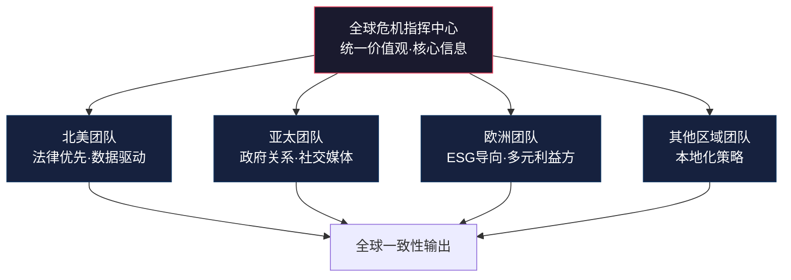
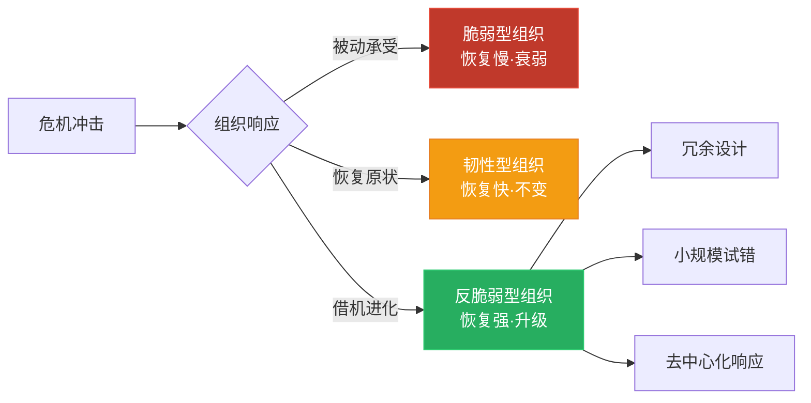
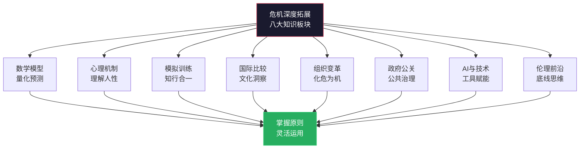

# 深度拓展：危机公关沟通的科学与实践

> 本章是全章的进阶篇。如果你已经掌握了SCCT、IRT等基础理论，熟悉危机沟通的核心技巧和常见误区，那么本章将带你进入更深的水域——从传播数学模型到认知心理学机制，从国际比较视角到AI时代的前沿工具，从组织变革的系统方法论到政府危机沟通的制度设计。每一个板块都力求"道法术器"贯通：先讲清原理，再给出方法，最后落地到可操作的工具和模板。

***

## 一、危机传播的数学模型与量化分析

### 1.1 为什么要用数学模型理解危机传播

直觉可以告诉你"这次危机传播得很快"，但无法告诉你"它会在什么时候到达峰值"、"投入多少资源可以将传播降低50%"、"哪个传播节点最值得干预"。数学模型的价值在于：将模糊的直觉转化为可量化、可预测、可比较的决策依据。

危机传播建模借鉴了三个学科的核心框架：流行病学（信息如何像病毒一样"感染"人群）、社会网络分析（网络结构如何影响传播路径）、以及行为经济学（个体决策如何被认知偏差扭曲）。理解这些模型不仅有学术价值，更直接影响危机管理团队的资源配置和时机选择。

### 1.2 SIR模型及其变体：从基础到应用

**经典SIR模型的危机传播诠释**

经典的SIR模型将人群分为三类：

- **易感者（Susceptible, S）：** 尚未接收到危机信息的公众群体
- **感染者（Infected, I）：** 已接收到危机信息并正在积极传播或受影响的群体
- **康复者（Recovered, R）：** 已了解危机信息但不再积极关注或传播的群体

其基本微分方程为：

dS/dt = -βSI
dI/dt = βSI - γI
dR/dt = γI

其中β表示信息传播率（每单位时间内一个"感染者"将信息传递给"易感者"的概率），γ表示信息遗忘或冷却率（"感染者"转变为"康复者"的速率）。基本再生数 R₀ = β/γ 决定了危机传播的规模：R₀ > 1 时危机信息会指数级扩散，R₀ < 1 时信息会自然消退。

**SEIR模型：引入"潜伏态"**

现实中，人们接收到危机信息后并不会立即传播——存在一个"消化期"。SEIR模型在SIR基础上增加了暴露态（Exposed, E）：

dS/dt = -βSI
dE/dt = βSI - αE
dI/dt = αE - γI
dR/dt = γI

参数α表示从"接收但未传播"到"积极传播"的转化速率。这个模型更准确地反映了社交媒体时代的信息传播特征：用户看到一条危机信息后，可能先在心里消化一段时间（截图、求证、讨论），然后才决定是否转发。舆情监测系统如果能估算出α值，就能更精准地预测"二次传播波峰"的到来时间。

**SIR模型的Python仿真代码**

以下代码可用于快速估算危机传播趋势，为资源配置提供参考：

```python
import numpy as np
from scipy.integrate import odeint
import matplotlib.pyplot as plt

def sir_crisis(y, t, beta, gamma):
    """SIR模型用于危机传播模拟"""
    S, I, R = y
    dS = -beta * S * I
    dI = beta * S * I - gamma * I
    dR = gamma * I
    return [dS, dI, dR]

# 参数设定：基于微博舆情拟合的经验值
beta = 0.35    # 传播率
gamma = 0.12   # 冷却率
R0 = beta / gamma
print(f"基本再生数 R₀ = {R0:.2f}")

# 初始条件：总人群100万，初始感染100人
N = 1_000_000
I0, R0_init = 100, 0
S0 = N - I0 - R0_init
y0 = [S0 / N, I0 / N, R0_init / N]  # 归一化

t = np.linspace(0, 10, 500)  # 模拟10个时间单位
result = odeint(sir_crisis, y0, t, args=(beta, gamma))
S, I, R = result.T

# 找到峰值时间和峰值感染比例
peak_idx = np.argmax(I)
peak_time = t[peak_idx]
peak_ratio = I[peak_idx] * 100

print(f"传播峰值时间: {peak_time:.1f} 时间单位（约{peak_time * 18:.0f}小时）")
print(f"峰值感染比例: {peak_ratio:.2f}%")
print(f"最终感染比例: {R[-1] * 100:.1f}%")

# 建议：在峰值前50%时间点部署核心回应资源
optimal_response = peak_time * 0.5
print(f"建议核心回应窗口: {optimal_response:.1f} 时间单位")
```

运行此脚本可以快速判断：当前传播参数下，危机大约何时到达峰值、最终影响范围多大、资源投放的最佳时间窗口在哪里。实际应用中，β和γ应通过实时舆情数据进行拟合更新——建议每2小时用最新的传播数据重新估算一次参数，动态调整响应策略。

### 1.3 网络传播模型：结构决定命运

现代社会的危机传播在复杂的社会网络中进行，网络拓扑结构对传播速度和范围有着决定性影响。

**小世界网络模型（Watts-Strogatz）**

小世界网络具有两个关键特征：高聚集系数（你的朋友们彼此也是朋友）和短平均路径长度（任意两个陌生人之间只需很少的"中间人"就能建立联系，即"六度分隔"）。在小世界网络中，危机信息可以通过少数几个"弱连接"（weak ties）快速扩散到整个网络。

这一理论对危机管理的启示是：不要只盯着直接相关的群体，那些看似关系较远的"弱连接"节点——跨行业的KOL、异地的地方媒体、关联行业的从业者——往往是信息突破局部传播圈的关键通道。

**无标度网络模型（Barabási-Albert）**

现实中的社交网络遵循"幂律分布"——少数节点拥有大量连接（如主流媒体、头部KOL、微博大V），大多数节点只有少量连接。这些高度连接的"枢纽节点"（hub）对危机信息的传播起着决定性作用。

实操含义：危机管理团队应建立一份"枢纽节点清单"，包括：
- 行业内影响力Top 50的KOL及其立场倾向
- 主流媒体中负责该领域的记者及其报道风格
- 监管部门的官方社交媒体账号及其发布频率
- 竞品的公关负责人及其可能的反应模式

当危机爆发时，优先对这些枢纽节点进行精准沟通，其效果远优于对全网进行无差别传播。

### 1.4 情感传播模型：情绪比信息跑得更快

危机传播不仅是信息的传递，更是情感的传染。

**情感传染理论（Hatfield et al.）**

情感传染是指个体的情感状态通过面部表情、语音语调、文字内容等渠道自动传递给他人。在社交媒体时代，纯文本也能携带强烈的情感信号——感叹号的数量、大写字母的使用、emoji的选择，都在传递情感。

纽约大学的一项研究分析了Twitter上超过100万条危机相关推文，发现：负面情感的传播速度是正面情感的3.6倍；愤怒情绪的传播范围是悲伤情绪的2.1倍；带有讽刺语气的内容比严肃陈述的内容获得更多的转发。这些数据直接指导危机回应的语气设计：在危机爆发初期，回应应以严肃、诚恳的语气为主，避免任何可能被解读为"轻视"或"推卸"的措辞。

**风险的社会放大框架（SARF, Kasperson et al.）**

SARF框架解释了为什么同等严重程度的事件在不同情境下引发的公众反应差异巨大。危机信息在传播过程中经过"放大站"（媒体、意见领袖、社交平台算法）和"衰减站"（专家解读、官方声明、时间流逝）的反复处理，最终呈现给公众的信号可能与原始事件相去甚远。

影响放大/衰减的关键因素：

| 放大因素 | 衰减因素 |
|---------|---------|
| 涉及儿童、孕妇等"高共情"群体 | 涉及对象为"不受欢迎"的群体 |
| 有现场视频或图片 | 只有文字描述 |
| 事件可归因于明确的责任方 | 原因复杂、难以归责 |
| 与公众日常生活密切相关 | 与普通消费者距离较远 |
| 发生在社交媒体活跃期（节假日等） | 发生在新闻淡季 |
| 与社会热点议题（如食品安全、环保）重叠 | 话题缺乏社会共鸣 |

危机管理团队应使用这个框架在危机爆发初期进行"放大风险评估"：如果当前事件命中了3个以上放大因素，应将其响应等级自动提升一级。

### 1.5 舆情监测实操：关键指标与阈值设定

数学模型需要数据输入，数据来自舆情监测。以下是实战中最常用的监测指标体系：

| 指标类别 | 具体指标 | 正常基线 | 黄色预警 | 橙色预警 | 红色预警 |
|---------|---------|---------|---------|---------|---------|
| 传播量 | 相关话题提及量/小时 | 品牌日常提及量的1-2倍 | 3-5倍 | 6-10倍 | >10倍 |
| 情感比 | 负面情感占比 | <15% | 15%-30% | 30%-50% | >50% |
| 扩散度 | 核心信息的转发层级 | 1-2层 | 3-4层 | 5-6层 | >6层 |
| 速度 | 负面信息增速（条/分钟） | <5 | 5-20 | 20-50 | >50 |
| 热度 | 是否登上热搜/热榜 | 未上榜 | 50名以后 | 20-50名 | 前20名 |
| 媒体层级 | 跟进报道的媒体级别 | 自媒体/小号 | 区域媒体 | 全国性媒体 | 央媒/国际媒体 |

阈值设定的关键原则：不要等到所有指标同时报警才启动响应。任何一个指标触及橙色预警，就应启动危机管理团队的初步评估；两个以上指标同时橙色或任何一个红色，应立即启动全面危机响应。

***

## 二、危机沟通的心理学深层机制

### 2.1 认知偏差：为什么公众"不讲道理"

危机沟通中，管理者最常犯的错误是假设公众是"理性人"——只要给出足够的事实和数据，公众就会改变看法。实际上，公众的判断受到一系列认知偏差的深刻影响。理解这些偏差不是为了"操纵"公众，而是为了设计更有效的沟通策略。

**确认偏差（Confirmation Bias）**

人们倾向于接受支持自己已有观点的信息，忽略或贬低与之矛盾的信息。在危机中，一旦公众形成了"这个企业有问题"的初始印象，他们就会选择性地关注负面信息、放大企业的每一个失误。

应对策略：在首次回应中就建立正面叙事框架。不要等到公众已经形成负面印象后再去"纠正"——那时确认偏差已经生效，你提供的每一个正面信息都会被过滤掉。强生在泰诺事件中的首份声明就明确将事件定性为"外部犯罪行为"而非"产品质量问题"，这个初始框架帮助公众在后续信息中保持了对强生的同情。

**负面偏差（Negativity Bias）**

人们对负面信息的关注度、记忆深度和情感反应强度都显著高于正面信息。一项经典的心理学实验发现，一次负面体验需要约5次正面体验才能抵消其对印象的影响。

应对策略：在危机后的声誉修复中，不要指望"做一件好事"就能翻盘。需要系统性地、持续性地创造正面体验，以5:1甚至更高的比例来对冲危机造成的负面印象。这意味着危机修复是一个至少持续数月的系统工程，而非一次公关活动。

**锚定效应（Anchoring Effect）**

人们在做判断时，会被最先接收到的信息"锚定"。在危机中，第一个被广泛传播的叙事版本往往会成为公众判断的"锚点"——即使后续出现更完整的信息，公众的判断也很难完全脱离这个锚点。

应对策略：争夺"第一叙事权"。在危机爆发后的第一个小时内，尽可能发布权威的初始叙事。这个叙事不需要包含所有细节，但需要提供一个基本框架：发生了什么、我们正在做什么、我们关心什么。一旦让谣言或竞争对手的叙事成为"第一锚点"，后续的纠偏成本将成倍增加。

**群体极化（Group Polarization）**

当持相似观点的人聚集在一起讨论时，群体的最终立场往往比个人的初始立场更加极端。社交媒体的"信息茧房"和"回声室效应"加剧了这一现象——在微博话题、微信群、贴吧等空间中，愤怒情绪会在群体互动中不断升级。

应对策略：不要试图在已经极化的群体中直接沟通（效果极差），而是通过"破圈"传播来影响尚未形成定见的中间群体。具体做法包括：在知乎等理性讨论平台发布深度分析、邀请受信任的第三方专家发表客观评价、通过员工和合作伙伴的社交网络进行"去中心化"传播。

**可得性启发（Availability Heuristic）**

人们倾向于根据"能想到的例子的容易程度"来判断事件的概率。如果最近刚发生过类似的危机事件，公众会高估同类事件的发生概率。例如，某航空公司发生一次事故后，公众对该航空公司事故率的感知会远高于统计数据——因为那一次事故"历历在目"。

应对策略：当行业刚经历重大危机时，即使是与你无关的事件，也要提高警惕——公众对整个行业的风险感知已经提升。此时主动展示你的安全措施和合规记录，可以有效对冲"连坐效应"。

**公正世界假设（Just-World Hypothesis）**

许多人持有"世界是公正的，好事发生在好人身上，坏事发生在做错事的人身上"这一隐含信念。在危机中，这种信念会导致公众"受害者有罪论"——"他们一定做了什么才会出事"——并倾向于将责任归咎于组织。

应对策略：不要忽视这一偏差的存在。在危机沟通中，如果组织确实有责任，主动承认比被动被审判更有利。如果组织无责，则需要清晰地展示"我们已经做了该做的一切"，以满足公众对"公正世界"的心理需求。

### 2.2 信任修复的心理学模型

Kim等人（2004）提出的信任修复模型指出，信任的建立和修复遵循不同的心理机制。建立信任是一个渐进的"加法"过程，而信任的崩塌是瞬间的"减法"过程——这就是为什么一次危机可以摧毁数十年积累的信任。

信任修复的关键变量：

**归因类型决定修复路径。** 如果公众将危机归因为"能力不足"（如管理失误、技术缺陷），组织可以通过展示改进能力和新措施来修复信任。但如果公众将危机归因为"品格问题"（如故意欺骗、道德败坏），修复的难度将呈指数级上升——因为品格被认为是稳定的、不易改变的特质。

**能力归因的修复路径：**
1. 承认具体的能力缺陷（而非泛泛道歉）
2. 展示详细的改进方案（投资金额、时间表、第三方验证）
3. 通过后续的正面表现持续证明能力提升
4. 邀请利益相关者参与监督和评估

**品格归因的修复路径：**
1. 道歉必须触及"价值观层面"——承认行为违背了组织的核心价值观
2. 对责任人进行可见的、严肃的处理（而非象征性处分）
3. 引入外部监督机制（独立委员会、第三方审计）
4. 接受更长的信任修复周期（通常以年为单位）

**信任修复的"双过程"模型详解**

信任修复本质上是一个认知过程和情感过程的叠加：

- **认知修复：** 通过提供证据（数据、报告、第三方认证）来改变公众的理性判断。适用于能力归因的危机。
- **情感修复：** 通过共情表达、道歉仪式、补偿行动来平复公众的情绪反应。适用于品格归因的危机。

实际操作中，两者需要同步进行——只做认知修复而忽视情感修复，会被认为"冷冰冰"；只做情感修复而忽视认知修复，会被认为"光说不练"。危机回应中，一段有效的声明应同时包含情感元素（"我们对受影响的家庭深感痛心"）和认知元素（"我们已投入X万元启动全面排查，预计在X天内完成"）。

### 2.3 恐慌传播与风险感知

危机中的公众恐慌不仅是对客观风险的反应，更是对主观风险感知的反应。Slovic（1987）的风险感知研究表明，公众对风险的判断受到以下心理因素的显著影响：

| 风险特征 | 公众感知为高风险 | 公众感知为低风险 |
|---------|----------------|----------------|
| 可控性 | 自己无法控制（如空气污染） | 自己可以选择规避（如吸烟） |
| 熟悉度 | 不了解的新风险（如新型病毒） | 日常熟悉的风险（如车祸） |
| 自愿性 | 被迫承受（如食品安全） | 自愿选择（如极限运动） |
| 受害者特征 | 儿童、孕妇 | 成年人、职业群体 |
| 灾难性 | 集中爆发、一次性大量伤亡 | 分散发生、逐步累积 |
| 公平性 | 受益者与受害者不同 | 受益者与受害者一致 |

这一框架的实际应用：在危机沟通中，如果事件具有"高风险感知"特征（如涉及儿童安全、非自愿暴露），组织应采用更高规格的回应——更多资源投入、更高层级出面、更强的补偿措施。反之，如果事件的客观风险远低于公众的主观感知，组织可以通过提供专业数据和权威解读来"校准"公众的风险判断。

### 2.4 心理距离与危机感知

Trope和Liberman的"建构水平理论"（Construal Level Theory）揭示了一个重要机制：人们对事件的心理距离越远，越倾向于用抽象的、概括性的方式理解它；心理距离越近，越倾向于用具体的、细节化的方式理解它。

这在危机沟通中的应用：

- **远距离受众（非直接受影响的公众）** 倾向于关注"原则性"问题——"企业有没有道德？""制度有没有缺陷？"——对他们的沟通应侧重价值观和系统性改进。
- **近距离受众（直接受影响的消费者/员工）** 倾向于关注"具体"问题——"我的损失怎么赔偿？""下一步具体怎么做？"——对他们的沟通应侧重具体行动方案和时间表。

最常见的错误是：用面向远距离受众的"大话套话"（"我们高度重视""我们将全面整改"）去回应近距离受众——这会适得其反，因为他们需要的是具体的、可操作的信息。

***

## 三、危机模拟训练的系统设计

### 3.1 为什么"知道"不等于"做到"

危机沟通的知识可以通过阅读获得，但危机沟通的能力只能通过训练获得。这就像游泳——你可以读完所有游泳教材，但在你真正下水之前，你不会游泳。危机模拟训练就是"下水"的过程。

Flin（1996）的研究发现，经历过至少一次高质量危机模拟训练的团队，在真实危机中的决策速度比未受训团队快40%，决策质量（以结果评估）高出25%。更重要的是，受训团队在危机中的"恐慌性失误"显著减少——因为训练帮助他们建立了"心理预案"，在压力下能够调用预存的反应模式而非被情绪淹没。

### 3.2 模拟训练的四层递进体系

**第一层：桌面推演（Tabletop Exercise）**

最低成本、最低风险的入门训练形式。参与者围坐桌旁，根据模拟情境讨论决策和行动方案。

| 要素 | 具体要求 |
|------|---------|
| 参与人数 | 8-20人 |
| 时长 | 2-4小时 |
| 频率 | 每季度1次 |
| 成本 | 低（内部组织即可） |
| 适合对象 | 全员基础训练 |
| 核心产出 | 决策记录、问题清单、预案修订建议 |

桌面推演的典型流程：

阶段一：场景介绍（20分钟）
  主持人介绍模拟情境，分发背景材料
  参与者阅读材料，准备角色

阶段二：分组讨论（60分钟）
  各小组根据预案讨论应对方案
  每组记录关键决策和理由

阶段三：信息注入（30分钟）
  主持人引入"突发变量"（如新证据曝光、监管介入、KOL发声）
  各组调整策略

阶段四：模拟回应（40分钟）
  各组模拟撰写声明、举行内部发布会
  其他组扮演记者提问

阶段五：复盘讨论（30分钟）
  对比各组方案的差异
  识别预案中的漏洞
  记录改进要点

**第二层：功能演练（Functional Exercise）**

针对特定功能模块的深度训练。不同于桌面推演的"纸上谈兵"，功能演练要求参与者实际执行危机管理的某个环节。

常见功能演练类型：
- **新闻发布会模拟：** 邀请外部人员扮演"刁钻记者"，测试发言人的应变能力。全程录像，事后逐帧分析发言人的表情管理、肢体语言、措辞选择。
- **声明撰写实战：** 在限定时间内（如30分钟）完成一份危机声明的撰写，然后由评审团从法律风险、情感温度、信息完整性三个维度评分。
- **社交媒体危机模拟：** 模拟微博热搜场景，要求参与者在实时涌入的评论和转发中做出回应决策。
- **利益相关者沟通模拟：** 由外部人员扮演愤怒的消费者、追问的记者、施压的监管者，测试参与者面对不同群体的沟通能力。

**第三层：全流程实战模拟（Full-Scale Exercise）**

最接近真实危机的训练形式。涉及多个部门、大量人员和实际的资源调动，通常持续半天到两天。

设计要点：
1. **场景真实性：** 模拟的危机场景应基于组织面临的实际风险设计，而非脱离现实的"假设"。最好使用历史上真实发生过的行业危机事件，进行"如果发生在我们身上"的推演。
2. **压力注入：** 通过控制信息释放节奏、引入意外变量（如"关键证人突然改变说法"、"竞品趁机发起攻击"、"内部信息泄露"），模拟真实危机中的不确定性和时间压力。
3. **全链条覆盖：** 从预警信号识别→内部启动→首次声明→媒体应对→利益相关者沟通→社交媒体管理→善后修复，完整走一遍全流程。
4. **第三方评估：** 邀请外部危机管理顾问全程观察并提供独立评估，避免"自说自话"的复盘。

**第四层：红蓝对抗（Red Team / Blue Team）**

借鉴军事和网络安全领域的对抗训练模式。"蓝队"是组织的危机管理团队，"红队"由外部顾问组成，从攻击者视角寻找组织的弱点。

红队的攻击角度：
- 从竞争对手角度：如何利用这次危机抢占市场
- 从媒体角度：如何挖掘更深的负面信息
- 从黑客/内部人士角度：如何获取和泄露内部信息
- 从监管角度：哪些合规漏洞可以被追究
- 从社交网络角度：如何制造和放大负面话题

### 3.3 模拟训练场景库设计

建立多样化的场景库，确保每次训练使用不同情境：

| 场景类型 | 典型情境 | 训练重点 | 适合层级 |
|---------|---------|---------|---------|
| 产品安全 | 食品中毒、产品缺陷致伤 | 召回流程、监管沟通、受害者关怀 | 全部四层 |
| 数据泄露 | 用户个人信息大规模外泄 | 合规通报、用户告知、技术排查 | 第二/三层 |
| 高管丑闻 | CEO私人行为被曝光 | 内部切割/力挺决策、投资者沟通 | 第三/四层 |
| 舆论风暴 | 一条社交媒体帖子引爆话题 | 速度应对、社交媒体管理 | 第一/二层 |
| 环境事故 | 化工泄漏、排放超标 | 政府沟通、社区安抚、ESG叙事 | 第三/四层 |
| 供应链危机 | 供应商违规被曝光 | 供应商管理叙事、替代方案 | 第一/二层 |
| 劳工争议 | 裁员、欠薪、工作条件曝光 | 员工关系、工会沟通、法律应对 | 第二/三层 |
| 跨国文化冲突 | 广告内容在某国引发文化争议 | 跨文化沟通、全球一致性 | 第三/四层 |

场景设计的核心原则：每个场景应包含"初始触发事件"和3-5个"升级变量"，升级变量在训练过程中逐步释放，模拟真实危机的演变轨迹。

### 3.4 模拟训练的评估框架

一次训练是否成功，不能靠"感觉不错"来判断，需要量化的评估指标：

| 评估维度 | 具体指标 | 评分标准（1-5分） |
|---------|---------|-----------------|
| 响应速度 | 从危机发生到首次回应的时间 | 5分：<30分钟；1分：>4小时 |
| 决策质量 | 关键决策点的判断准确性 | 由评估专家根据情境评判 |
| 信息一致性 | 不同渠道、不同发言人信息是否统一 | 矛盾点数量 |
| 情感管理 | 回应的共情程度、语气恰当性 | 由评估专家和"受害者扮演者"评分 |
| 利益相关者覆盖 | 是否对所有关键群体进行了针对性沟通 | 遗漏的群体数量 |
| 内部协调 | 跨部门协作的流畅程度 | 信息断点和决策延迟次数 |
| 资源调配 | 人力、物力资源的调动效率 | 资源到位时间 |
| 学习深度 | 复盘讨论中识别出的改进点数量和质量 | 由评估专家评判 |

### 3.5 常见模拟训练的坑

| 常见问题 | 表现 | 纠正方法 |
|---------|------|---------|
| 场景太简单 | 参与者轻松"过关"，没有压力感 | 引入"黑天鹅"变量，提高不确定性 |
| 走过场 | 参与者知道是"假的"，不够投入 | 增加匿名评分机制，与绩效挂钩 |
| 只演不练 | 模拟完就结束，没有复盘 | 强制输出改进清单，指定责任人和deadline |
| 高管缺席 | 只有一线员工参与，缺乏决策层练习 | 高层必须亲自参与至少1次/年全流程模拟 |
| 场景陈旧 | 每年用同一个场景 | 每次使用新的行业案例或最新热点事件 |
| 忽视内部沟通 | 只练习对外回应，不练内部协调 | 将内部沟通纳入模拟的强制环节 |
| 缺乏真实性 | 参与者无法进入角色状态 | 使用真实的社交媒体评论截图、真实的记者提问风格 |

***

## 四、国际危机公关模式的深度比较

### 4.1 比较分析框架

要进行有意义的国际比较，首先需要建立统一的分析框架。以下六个维度构成了比较的基础：

| 分析维度 | 核心问题 |
|---------|---------|
| 法律环境 | 法律体系如何影响危机回应的自由度？ |
| 媒体生态 | 媒体的独立性和议程设置能力如何？ |
| 文化价值观 | 集体主义vs个人主义如何影响公众期望？ |
| 政府角色 | 政府在危机管理中扮演什么角色？ |
| 社交媒体特征 | 本土社交平台的传播机制和用户行为有何特点？ |
| 行业惯例 | 危机公关行业的专业化程度和标准如何？ |

### 4.2 美国模式：法律优先与专业化

**法律环境的影响。** 美国的危机公关深受诉讼文化的影响。在一个"人人都可能被告"的法律环境中，组织的危机回应首先需要经过法务团队的审核。这导致美国的危机公关有时显得过于谨慎——"无可奉告"（No comment）在美国曾经是一种常见的危机回应方式，尽管研究表明这种方式对声誉的损害远大于收益。

**高度专业化的行业生态。** 美国拥有全球最成熟的公关行业。PRSA（美国公共关系协会）制定了详细的危机公关职业标准，大型公关公司（如Edelman、Weber Shandwick、Burson）拥有标准化的危机管理流程和工具。美国的危机公关培训体系也非常完善，从大学的传播学课程到行业认证（APR），形成了完整的人才培养链条。

**数据驱动的决策模式。** 美国的危机公关团队通常配备专业的数据分析能力，通过实时舆情监测工具（如Brandwatch、Meltwater、Cision）追踪危机传播的量化指标，并基于数据做出策略调整。

**经典案例：强生泰诺事件（1982年）。** 7人因被投毒的泰诺胶囊死亡。强生公司在美国FDA的配合下，一周内召回全美3100万瓶泰诺、损失超过1亿美元。CEO James Burke通过60多个电视采访和全国新闻发布会主导了叙事。事件后一年内泰诺恢复95%的市场份额。这一案例确立了"消费者安全优先于短期利润"的危机公关原则，至今仍是全球PR教科书的必讲案例。

### 4.3 日本模式：集体责任与关系修复

**集体主义文化的影响。** 日本社会强调"和"（wa）——组织和谐与集体利益。危机公关中，组织高层通常以集体名义承担责任，而非像美国那样指名道姓地追究个人责任。社长的公开鞠躬道歉是日本危机公关的标志性场景。

**"谢罪文化"的深层逻辑。** 在日本文化中，正式的道歉不仅仅是"说对不起"，而是一种仪式化的诚意表达。90度鞠躬（最敬礼）、辞职、降薪等行为，传递的是"我愿意为此付出代价"的信号。这种仪式化行为在日本文化中比语言更有说服力。

**"不给他人添麻烦"（迷惑をかけない）的双刃剑。** 这一文化准则一方面使日本企业极度重视产品品质和流程规范（减少危机发生概率），另一方面在危机发生后导致信息发布的严重延迟——组织害怕"发布不完整的信息会给公众添麻烦"，结果适得其反。

**反面教材：东京电力公司（TEPCO）福岛核事故（2011年）。** 2011年3月11日东日本大地震引发海啸，导致福岛第一核电站发生核泄漏。TEPCO的危机公关被广泛批评为"灾难性的失败"：信息延迟发布长达数小时、数据前后矛盾、高管在新闻发布会上表现冷漠、对受影响居民的安置措施迟缓。最致命的是，TEPCO在初期试图淡化事故严重程度，当事态升级后公信力已经崩塌。

TEPCO的失败揭示了日本模式的结构性弱点：在"不给他人添麻烦"的文化压力下，组织倾向于延迟发布不确定的信息，这在传统媒体时代尚可接受，但在社交媒体时代等同于将叙事权拱手让人。

### 4.4 中国模式：政府关系与社交媒体双轨

**政府关系的核心地位。** 在中国的危机管理生态中，政府监管部门的态度往往决定着危机的走向。一个被监管部门"点名"的企业面临的压力远大于仅被媒体批评的企业。因此，中国的危机公关团队通常将"与政府的沟通"放在优先级最高的位置。

**社交媒体的超强影响力。** 中国的社交媒体生态（微博、微信、抖音、小红书、B站）具有独特的传播特征：
- 微博的"热搜"机制使得话题可以在数小时内引爆全国关注
- 微信的"朋友圈"传播具有高度私密性，难以被监测和干预
- 抖音的算法推荐使得视觉化、情感化的内容传播力远超文字
- 小红书的"种草/拔草"机制使得产品类危机的商业影响更加直接
- B站的长视频评论文化使得深度分析内容（"扒皮视频"）成为独特的传播形态

**"真诚"在中国语境中的特殊含义。** 中国的公众对"真诚"的判断标准与西方有所不同。在中国语境中，"真诚"不仅意味着承认错误，还意味着"态度端正"——具体表现为：高层亲自出面而非通过声明、行动迅速而非仅停留在口头、补偿到位而非象征性。

**反面案例：长生生物疫苗造假（2018年）。** 长生生物科技被曝狂犬病疫苗生产记录造假。危机爆发后，长生生物的回应被广泛批评：CEO未及时公开回应、声明措辞官僚化、整改措施缺乏实质性内容。事件引发全国性恐慌，最终长生生物被强制退市、多名高管被刑事追诉。这一案例深刻说明：在中国语境下，涉及公共安全的危机中，任何"推卸"或"淡化"的尝试都将适得其反。

### 4.5 韩国模式：财阀体制与公众情绪共振

韩国的危机公关模式值得单独分析，因为其特殊的财阀经济结构和高度数字化的社会创造了独特的挑战。

**财阀的"系统性信任赤字"。** 韩国公众对大型财阀（三星、现代、SK等）天然持有复杂的感情——一方面是经济支柱，另一方面是特权象征。财阀企业的任何危机都会被放在"大企业vs普通民众"的叙事框架中放大。

**典型事件：韩进海运破产（2016年）。** 全球第七大航运公司韩进海运申请破产保护，导致数十亿美元的货物滞留海上。韩进的危机沟通被批评为信息不透明、对客户和员工缺乏关怀。这一事件不仅影响了韩进本身，还波及整个韩国航运业的声誉。

**教训：** 在财阀体制下，单一企业的危机往往被上升为"体制问题"，危机沟通不能仅限于企业层面，还需要回应公众对制度公平性的质疑。

### 4.6 欧洲模式：透明度与可持续发展

**法规驱动的透明度。** 欧盟的GDPR（通用数据保护条例）要求数据泄露事件必须在72小时内通知监管机构，这从法律层面强制了危机信息披露的及时性。欧洲的危机公关因此比其他地区更注重"合规性"和"透明度"。

**多元利益相关者的复杂博弈。** 欧洲的公共领域比中美都更加多元化——环保组织（如绿色和平）、消费者保护组织、工会、欧盟委员会等各方力量都对企业的危机应对提出不同诉求。这意味着欧洲的危机公关需要同时管理多个利益相关者群体，策略复杂度更高。

**ESG视角的危机管理。** 欧洲的危机公关越来越注重将危机转化为展示企业ESG（环境、社会、治理）承诺的机会。一次环境事故的危机回应如果能够同时推动企业的绿色转型，反而可能赢得利益相关者的长期信任。

**典型案例：大众汽车"柴油门"（2015年）。** 大众被曝在柴油车排放测试中使用作弊软件。危机爆发后，大众的初期回应堪称反面教材——CEO Martin Winterkorn的辞职声明被批评为"推卸责任"而非"承担责任"。但在后续阶段，大众进行了全面的战略转型：投入数百亿欧元发展电动汽车、设定明确的碳中和时间表、重组管理团队。这种将危机转化为战略转型契机的做法，是欧洲ESG导向危机管理的典型实践。

### 4.7 跨文化危机沟通的实践原则

基于以上比较，跨国组织在进行危机沟通时应遵循以下原则：

1. **"全球一致性 + 本地适应性"：** 核心价值观和事实信息全球统一，但表达方式、渠道选择和行动方案需要本地化
2. **建立本地化的危机管理团队：** 每个主要市场都应有了解当地文化和媒体生态的危机管理团队
3. **预设文化冲突场景：** 在预案中纳入跨文化冲突场景（如"在A国正常的行为在B国引发争议"），提前准备应对方案
4. **统一的"全球危机指挥中心"：** 确保各区域的危机信息实时汇总到全球指挥中心，避免"各说各话"



***

## 五、危机后的组织变革与学习

### 5.1 危机作为变革催化剂

哈佛商学院约翰·科特（John Kotter）在《领导变革》中指出，成功的组织变革需要克服"认知惰性"——组织成员对现状的习惯性依赖。而在平时推动变革，往往需要花费大量精力来"制造紧迫感"。危机天然地解决了这一步。

科特的八步变革模型在危机后的应用：

| 变革步骤 | 危机后的自然优势 | 需要主动推动的部分 |
|---------|-----------------|------------------|
| 1. 建立紧迫感 | 危机本身已创造了前所未有的紧迫感 | 防止"危机过后就好了"的心态回潮 |
| 2. 组建领导联盟 | 危机中的核心团队自然形成 | 扩展联盟，纳入变革所需的其他部门 |
| 3. 制定愿景和战略 | 危机暴露的问题指明了变革方向 | 将零散的改进点整合为系统性愿景 |
| 4. 传播变革愿景 | 全员对变革必要性有共识 | 将"修复危机"的叙事升级为"构建更好组织" |
| 5. 授权广泛行动 | 危机后的"改革窗口"减少了阻力 | 消除仍然存在的结构性障碍 |
| 6. 创造短期成效 | 快速可见的改进（如新制度上线） | 确保短期成效与长期愿景一致 |
| 7. 巩固成果 | 危机记忆提供了持续动力 | 防止"好了伤疤忘了疼" |
| 8. 融入文化 | 文化反思自然发生 | 将新行为模式固化为制度和流程 |

关键提醒：危机后的"变革窗口"通常只开放6-12个月。超过这个时间，组织成员的紧迫感会自然消退，变革阻力会重新上升。因此，危机后的变革必须在窗口期内快速启动。

### 5.2 危机后变革的五阶段模型

**第一阶段：止血与稳定（0-3个月）**

核心任务：稳定局面、控制损害、恢复基本运营。

具体行动：
1. 成立独立调查委员会（成员应包括外部专家），对危机进行全面调查
2. 对直接受影响的利益相关者进行一对一沟通和补偿
3. 恢复核心业务的正常运营
4. 启动内部员工的心理支持计划（危机中的员工也是"受害者"）

**第二阶段：反思与诊断（3-6个月）**

核心任务：深入分析危机的根本原因，而非停留在表面原因。

关键工具——"五个为什么"（5 Whys）分析法：

表面现象：产品出现质量问题
→ 为什么？生产线检测遗漏
→ 为什么？检测设备老化未及时更换
→ 为什么？维护预算被削减
→ 为什么？管理层过度追求短期利润
→ 为什么？公司文化中"增长优先于安全"的隐性价值观

根因：不是设备问题，不是流程问题，而是价值观问题

注意：很多组织的复盘只停在第一层或第二层原因——"是某个员工的操作失误"、"是某个部门的管理疏忽"。这种表面化的复盘无法防止类似危机再次发生。只有深挖到组织文化和制度层面的根本原因，才能实现真正的改进。

**第三阶段：变革规划（6-12个月）**

基于诊断结果，制定全面的变革计划。变革计划应覆盖四个维度：

| 变革维度 | 具体内容 | 输出物 |
|---------|---------|--------|
| 流程变革 | 修订危机管理流程、预警机制、决策链条 | 新版危机管理手册 |
| 组织变革 | 调整组织架构、增设岗位、明确职责 | 新的组织架构图和岗位说明书 |
| 文化变革 | 重塑核心价值观、建立安全/透明的文化 | 文化行为准则和评估标准 |
| 能力变革 | 提升全员的危机意识和沟通技能 | 培训计划和模拟演练计划 |

**第四阶段：变革实施（12-24个月）**

变革实施过程中最常遇到的三种阻力及其应对：

| 阻力类型 | 表现 | 应对策略 |
|---------|------|---------|
| 认知阻力 | "危机已经过去了，没必要这么大动作" | 持续传播危机教训，邀请受害者参与内部培训 |
| 利益阻力 | "新流程影响了我的权限/预算" | 将变革成效纳入绩效考核，领导层以身作则 |
| 能力阻力 | "新系统我不会用" | 提供系统培训和支持，设置"变革大使"辅导 |

**第五阶段：制度化（24个月以上）**

将变革成果固化为组织的"新常态"。关键动作：
- 将危机管理纳入年度经营计划和预算
- 建立"危机管理成熟度"评估体系，每年评估一次
- 将危机管理能力纳入管理层的晋升标准
- 建立组织级的"危机知识库"，记录每一次危机的经验教训

### 5.3 组织学习的结构化方法

**事后回顾（After Action Review, AAR）**

AAR是美军开发的结构化学习方法，已被广泛应用于企业界。其核心是四个问题：

1. 我们预期会发生什么？（计划/目标）
2. 实际发生了什么？（事实/结果）
3. 为什么会有差异？（原因分析）
4. 我们可以从中学到什么？（经验教训）

AAR的执行要点：
- 时间：危机结束后2周内进行，越早越好
- 参与者：所有参与危机处理的人员，而非仅管理层
- 氛围：无指责、无惩罚、聚焦学习
- 输出：书面的AAR报告，纳入组织知识库
- 跟踪：对AAR中提出的改进建议指定责任人和完成时间

**AAR标准议程模板（3小时版本）：**

第一部分：事实还原（60分钟）
  10min  主持人开场：明确规则（不追究、不辩护、只学习）
  20min  时间线重建：全员协作绘制危机从预警到恢复的完整时间线
  15min  关键决策点标注：在时间线上标记所有重大决策节点
  15min  数据回顾：舆情数据、财务损失、利益相关者反馈等客观数据

第二部分：差距分析（60分钟）
  15min  "预期vs实际"对比表填写（每组独立完成）
  20min  小组汇报与交叉质询
  15min  根因分析（5 Whys或鱼骨图）
  10min  归纳系统性问题（非个案问题）

第三部分：改进规划（45分钟）
  15min  头脑风暴：针对系统性问题的改进方案
  15min  方案评估与优先级排序
  15min  指定责任人、完成时间、验收标准

第四部分：总结（15分钟）
  10min  主持人总结关键发现和行动项
  5min   确认AAR报告的撰写和分发安排

**"危机日志"制度**

建立制度化的"危机日志"记录体系。每次危机结束后，由危机管理团队编写一份详细的危机日志，包含：
1. 危机时间线（从预警信号到完全恢复的完整记录）
2. 关键决策点和决策逻辑
3. 每个决策的实际效果评估
4. 成功经验的可复用要素
5. 失败教训的可改进措施
6. 对危机预案的修订建议

### 5.4 从危机中构建"反脆弱"能力

塔勒布（Nassim Taleb）在《反脆弱》中提出：有些系统不仅能够从冲击中恢复，还能在冲击中变得更强。组织应追求的不是"危机免疫"（不可能），而是"反脆弱"——每一次危机都让组织变得比之前更强大。

构建反脆弱能力的三个杠杆：
1. **冗余设计：** 在关键系统中保持冗余（如危机沟通团队有A/B角、关键决策有多条信息来源），虽然日常看起来"效率不高"，但在危机中提供关键的容错空间。
2. **小规模试错：** 通过频繁的小规模模拟演练（而非偶尔的大型演练），让组织在"低代价"的环境中不断暴露和修复弱点。
3. **去中心化响应：** 赋予一线团队更多的危机响应权限，使得危机的早期响应不依赖于层层审批。这需要平时的充分培训和清晰的授权框架。



***

## 六、政府危机公关的制度与实践

### 6.1 政府危机公关与企业危机公关的本质差异

| 对比维度 | 企业危机公关 | 政府危机公关 |
|---------|------------|------------|
| 首要目标 | 保护品牌和利润 | 维护公共安全和社会稳定 |
| 决策机制 | CEO/高管团队快速决策 | 多层级审批、跨部门协调 |
| 问责对象 | 股东和消费者 | 全体公民 |
| 信息约束 | 商业秘密保护 | 国家安全和公共秩序 |
| 资源调配 | 公司资源 | 国家资源（但受预算和程序限制） |
| 时间压力 | 品牌声誉衰减 | 社会恐慌和秩序风险 |
| 后果严重性 | 企业破产 | 社会动荡、政治危机 |

### 6.2 政府危机沟通的核心原则

**原则一：公众知情权与信息秩序的平衡**

政府有义务向公众披露危机信息，但同时需要维护信息秩序——避免因信息过载或不完整信息引发公众恐慌。这一平衡在实践中极为困难。

操作框架：
- 第一时间发布已确认的基本事实（什么、何时、何地）
- 同时说明尚未确认的信息和正在进行的调查
- 明确告知公众下一步信息发布的时间点
- 辟谣与正向引导并重——不仅要告诉公众"不是什么"，还要告诉"是什么"

**原则二：统一口径与多元声音的协调**

政府危机公关涉及多个部门和层级，最常见的失败是"各说各话"——不同部门发布的信息相互矛盾，严重损害政府公信力。

解决方案：建立"信息中枢"机制：
1. 指定一个部门或机构作为危机信息的唯一对外发布窗口
2. 其他部门的信息必须经过"信息中枢"的协调后才能发布
3. 建立"口径库"——为常见问题准备统一的标准答案
4. 每日举行跨部门信息同步会议，确保各方信息一致

**原则三：共情表达的制度化**

政府声明往往因为过于"官方"而缺乏感染力。危机中的公众不仅需要"知道政府在做什么"，更需要"感受到政府关心我们"。

具体做法：
- 领导人亲赴现场（视觉信号比文字更有说服力）
- 在声明中使用具体而非抽象的语言（"23个家庭受到影响"而非"部分群众"）
- 展示具体的救助行动而非仅宣布政策方向
- 建立受害者和家属的直接沟通渠道

**原则四：信息发布的节奏管理**

政府危机沟通中，信息发布不是"一锤子买卖"，而是一个需要精心管理节奏的持续过程：

时间轴：0h    1h    4h    12h   24h   48h   72h   1w
发布：  事件  初步  详细  阶段  完整  整改  后续  长期
       通报  情况  通报  进展  报告  方案  措施  规划

关键原则：
- 首次通报越快越好（"已知→正在核实→将及时通报"）
- 信息量逐次递增（避免"挤牙膏"式的被动披露）
- 每次发布必须预告下次发布时间
- 高频发布期（前72h）结束后转入常规更新节奏

### 6.3 国际政府危机沟通的典型模式

**美国FEMA模式：标准化应急响应**

联邦紧急事务管理署（FEMA）建立了标准化的应急响应体系（NIMS/ICS），将危机响应分为指挥、操作、计划、后勤四个功能模块。危机公关嵌入"公共信息官"（PIO）的角色中，负责统一对外信息发布。

特点：高度标准化、跨部门协调成熟、强调与州和地方政府的联动。但在政治敏感事件中容易受到政治因素干扰。

**英国金-银-铜三级指挥体系**

- **Gold（战略层）：** 负责总体战略决策，通常由高级官员组成
- **Silver（战术层）：** 负责战术规划和资源协调
- **Bronze（操作层）：** 负责一线执行

这一模式的优势在于清晰的权责划分和高效的决策传递。在2005年伦敦地铁爆炸案中，该体系被有效运用，确保了信息发布的及时性和一致性。

**新加坡模式：高效透明的技术治理**

新加坡政府以"小政府、高效率"著称。其危机沟通的特点：
- 危机信息发布的速度极快（通常在事件发生后数小时内）
- 信息高度透明，数据公开程度在亚洲国家中领先
- 严格的问责制度——危机处理不力的官员会被迅速调整
- 善用社交媒体进行直接的公众沟通

### 6.4 中国政府危机公关的发展与挑战

**发展轨迹：**

从2003年SARS疫情（信息公开严重不足→引发社会恐慌）到2008年汶川地震（信息相对开放→赢得国际赞誉），中国的政府危机公关经历了质的飞跃。近年来的发展包括：

1. **制度建设：** 《政府信息公开条例》《突发事件应对法》等法律制度的完善
2. **平台建设：** 政务微博、政务微信、政务抖音的普及，提供了直接面向公众的沟通渠道
3. **能力建设：** 新闻发言人制度的推广、领导干部媒介素养培训的加强
4. **技术赋能：** 大数据、AI等技术在舆情监测和预警中的应用

**当前面临的核心挑战：**

| 挑战 | 具体表现 | 改进方向 |
|------|---------|---------|
| 基层能力不足 | 县市级政府的危机公关能力参差不齐 | 加强基层培训、建立"下沉式"技术支援机制 |
| 社交媒体管理难度加大 | 民间舆论场与官方舆论场的张力 | 提升政务新媒体的内容质量和互动能力 |
| 国际传播能力弱 | 在国际危机中缺乏有效的对外传播渠道 | 培养多语种传播人才、善用国际社交媒体平台 |
| 公众期望与能力的落差 | 公众对政府的期望持续上升 | 缩小承诺与交付之间的差距，避免"过度承诺" |

### 6.5 数字政府时代的危机沟通新特征

随着政务服务数字化程度不断加深，政府危机沟通面临新的挑战：

**数据开放的双刃剑效应。** 政府数据开放平台使公众能够获取大量原始数据，这既提升了透明度，也意味着任何数据异常都可能被公众"自行发现"并放大。政府需要建立"数据异常主动通报"机制——在公众发现之前主动披露和解释数据异常。

**政务新媒体矩阵的协同管理。** 现代政府通常同时运营微博、微信、抖音、快手等多个平台账号。危机中，各平台的信息需要高度一致但表达形式需要适配——微博适合简洁有力的通报，微信公众号适合详细解读，抖音适合现场画面和领导人表态。建议建立"一次采集、多端适配"的内容生产流程。

**"网络问政"倒逼回应速度。** 网民通过政务平台直接提问和投诉已成为常态。危机中，大量涌入的网民提问如果得不到及时回应，会形成"政府不作为"的二次舆情。建议在危机期间设置专门的"网民回应小组"，对高频问题进行统一回应。

***

## 七、AI与技术驱动的危机沟通前沿

### 7.1 AI舆情监测：从"人工巡逻"到"智能预警"

传统的舆情监测依赖人工关键词搜索和经验判断，覆盖范围有限、响应速度慢。AI驱动的舆情监测系统在三个维度上实现了质的提升：

**自然语言处理（NLP）的情感分析。** 传统的关键词匹配只能告诉你"有人在讨论我们"，NLP情感分析能告诉你"他们在说什么、感觉如何、情绪在升温还是降温"。现代NLP模型能够识别讽刺、反语、隐喻等复杂的语言现象——例如，"这个产品质量真是'好'到让我无话可说"，关键词匹配会将其判定为正面，而NLP模型能够识别出引号和语境暗示的反讽。

**传播网络分析。** AI能够自动绘制危机信息的传播网络图，识别"超级传播者"节点和关键传播路径。这意味着危机管理团队不再需要凭直觉判断"应该先跟谁沟通"，而是可以基于数据精准定位优先级最高的沟通对象。

**异常检测与早期预警。** AI系统可以建立品牌的"正常舆情基线"，当舆情指标偏离基线时自动触发预警。例如，某品牌的日常负面提及率约为2%，当系统检测到负面提及率在30分钟内从2%跳升到8%时，即使绝对值看起来"不高"，也会触发橙色预警。这种基于"异常检测"的预警比基于"阈值"的预警更加灵敏。

### 7.2 生成式AI在危机沟通中的应用与风险

ChatGPT、文心一言等生成式AI的出现，为危机沟通带来了新的工具和新的挑战。

**应用场景：**

| 应用 | 具体方式 | 效率提升 |
|------|---------|---------|
| 声明草稿生成 | 输入关键事实，AI生成多版声明草稿供人工审核 | 草稿时间从2小时缩短到10分钟 |
| 多语言翻译 | 将中文声明快速翻译为多语种版本 | 翻译质量接近专业水准 |
| Q&A预判 | 基于事件特征，AI预测记者可能提出的问题并生成参考答案 | 预判覆盖率可达70%-80% |
| 舆情报告自动化 | 自动生成包含数据可视化、趋势分析的舆情报告 | 报告生成时间从4小时缩短到30分钟 |
| 情感校准 | 对拟发布的声明进行情感温度分析，检测可能引发公众反感的措辞 | 减少"无心之失"引发的次生舆情 |
| 历史案例检索 | 快速检索类似危机的历史处理方式和效果 | 决策参考时间从数天缩短到数分钟 |

**风险与注意事项：**

- **"AI味"识别：** 公众对AI生成的内容越来越敏感。一份明显是"AI写的"声明会被认为缺乏诚意。因此，AI生成的草稿必须经过人工润色和个性化调整。判断标准：如果一份声明可以不加修改地用于任何公司、任何危机，那它就太"AI味"了。
- **事实核查责任：** AI可能生成不准确的信息（"幻觉"问题）。在危机沟通中，任何不准确的信息都可能引发次生危机。因此，AI生成的所有内容在发布前必须经过严格的人工事实核查。
- **法律风险：** AI生成的声明可能包含法律上不恰当的措辞。法务审核仍然是不可省略的环节。
- **情感温度控制：** AI倾向于生成"安全"但"冰冷"的文本。危机沟通中需要的共情、温度和个性化，目前仍需人工注入。

**生成式AI使用的"三审"流程：**

AI生成初稿 → 第一审：事实核查（消除幻觉和错误数据）
           → 第二审：法律审核（消除法律风险措辞）
           → 第三审：情感润色（注入共情、个性化、温度）
           → 最终发布

### 7.3 深度伪造（Deepfake）带来的新威胁

深度伪造技术使得"制造虚假的视频和音频"变得越来越容易和逼真。这为危机沟通带来了前所未有的新威胁：

- **虚假视频攻击：** 竞争对手或恶意方可以制作高管发表不当言论的假视频，在社交媒体上传播。这种攻击的破坏力远超传统的文字谣言——因为"眼见为实"的心理使得人们更倾向于相信视频。
- **虚假音频攻击：** 伪造的电话录音或内部会议音频可能被用于勒索或舆论攻击。
- **"否认疲劳"：** 在深度伪造泛滥的环境中，企业对真实负面信息的否认也可能被公众怀疑为"是伪造的吧"——这反而削弱了企业的自我辩护能力。

**应对策略体系：**

| 策略类别 | 具体措施 | 适用阶段 |
|---------|---------|---------|
| 预防 | 建立企业官方音视频的数字水印体系 | 日常 |
| 预防 | 与技术公司签订深度伪造鉴定服务协议 | 日常 |
| 检测 | 一旦出现可疑内容，在2-4小时内出具技术鉴定报告 | 危机中 |
| 响应 | 主动声明"我们注意到可能存在虚假信息"，提供辨别真假的参考框架 | 危机中 |
| 法律 | 了解各国关于深度伪造的法律法规，必要时启动法律程序 | 危机中/后 |
| 教育 | 对公众进行"如何辨别深度伪造"的科普教育 | 日常 |

**2024年深度伪造技术现状：** AI生成的面部视频已达到"肉眼难以分辨"的水平，仅在眨眼频率、耳部细节、光线一致性等方面存在可被算法检测的微弱异常。这意味着传统的"看视频判断真假"已不再可靠，组织必须建立基于技术手段的鉴定能力。

### 7.4 社交媒体算法的变化对危机传播的影响

社交媒体平台的推荐算法不断演进，这对危机传播的模式产生了直接影响：

**短视频平台的"完播率"逻辑。** 抖音/TikTok的推荐算法高度依赖"完播率"——用户是否看完了整个视频。这意味着：短小精悍、情感冲击力强的危机相关视频更容易被推荐，而企业发布的冗长回应视频则可能被算法"埋没"。

应对策略：危机回应视频应控制在30-60秒以内，前3秒就要抓住注意力，核心信息必须在前15秒内传达完毕。

**"降权"与"限流"机制。** 各平台对敏感话题可能采取限流措施。这意味着即使企业发布了声明，也可能因为被算法判定为"敏感内容"而无法触达目标受众。

应对策略：不要依赖单一平台进行危机沟通，同时在多个渠道发布信息。利用搜索引擎优化（SEO）确保官网内容在搜索结果中排名靠前。

**AI生成内容（AIGC）的传播加速效应。** 生成式AI使得低成本、大规模生产内容成为可能。在危机中，恶意方可以利用AI在短时间内生产大量负面内容（仿冒新闻、伪造评论、批量制造话题），对企业形成"内容洪水"式的攻击。传统的舆情监测系统面对这种AIGC洪水可能被"淹没"——需要升级为基于AI的"反AIGC"检测能力。

### 7.5 危机沟通技术工具全景

| 工具类别 | 代表产品 | 核心功能 | 适用场景 |
|---------|---------|---------|---------|
| 舆情监测 | Brandwatch, Meltwater, 新浪舆情通, 清博大数据 | 全网监测、情感分析、趋势预警 | 日常监测和危机早期发现 |
| 传播分析 | Graphika, BuzzSumo, 微博传播分析 | 传播路径分析、KOL识别 | 危机中定位关键传播节点 |
| 声明辅助 | ChatGPT, 文心一言, Claude | 声明草稿生成、Q&A预判 | 危机中加速内容生产 |
| 媒体关系 | Cision, Muck Rack, 美通社 | 媒体数据库、新闻分发 | 危机中的媒体沟通 |
| 社交管理 | Hootsuite, Sprout Social, 微博管理后台 | 多平台统一管理、评论监控 | 危机中的社交媒体运营 |
| 应急指挥 | Everbridge, PagerDuty, 企业微信/钉钉 | 通知分发、任务协调、实时协作 | 危机中的内部协调 |
| 法律合规 | OneTrust, TrustArc | 数据泄露通报流程管理 | 数据安全类危机 |

***

## 八、危机沟通的伦理困境与前沿议题

### 8.1 危机沟通中的核心伦理困境

危机沟通不仅是一个技术问题，更是一个伦理问题。以下是危机沟通中最常见的三个伦理困境：

**困境一：透明度与法律风险的冲突**

理想的危机沟通要求尽可能高的透明度，但法律团队通常建议谨慎披露。过度透明可能暴露法律弱点、增加诉讼风险；过度谨慎则会被视为"隐瞒"，进一步损害信任。

实践中的平衡原则：
- **"能说的尽量说，不能说的说明为什么不能说"：** 如果某些信息因法律原因无法披露，应明确告知公众"因调查仍在进行，某些细节暂时无法公开"，而非简单沉默。
- **"事实导向"而非"态度导向"：** 在法律敏感时期，聚焦于已确认的客观事实（而非主观判断和承诺），可以降低法律风险。
- **"共情式回应"的技巧：** "我们理解受影响消费者的愤怒和担忧"——这句话既表达了共情，又没有构成对法律责任的承认。

**困境二：速度与准确性的冲突**

在"黄金四小时"的压力下，组织面临两难：快速回应可能包含不准确的信息，等待调查完成则可能错失最佳回应窗口。

实践中的平衡原则：
- **"渐进式披露"策略：** 先发布已确认的核心事实（"发生了什么"），承诺后续持续更新（"我们正在调查"），不在信息不完整时做出确定性声明（"避免过早下结论"）。
- **"三层信息架构"：** 第一层：已100%确认的事实；第二层：高概率但未完全确认的信息（标注"正在核实"）；第三层：推测和假设（不对外发布）。

**困境三：短期止血与长期诚信的冲突**

危机中，组织可能面临"说一个善意的谎言来平息事态"的诱惑。例如，淡化受影响的范围、夸大已采取的措施。短期来看，这可能有效降低舆论压力；但一旦谎言被揭穿（在社交媒体时代几乎必然），造成的信任损失将远超最初的危机。

核心原则：在社交媒体时代，任何谎言的"保质期"都不会超过24小时。真相最终会浮出水面，而组织在真相浮出时的态度将决定最终结局。

**困境四：隐私保护与公众知情权的冲突**

在危机中，组织可能掌握涉及个人隐私的信息——例如，食品安全事件中消费者的医疗记录、数据泄露事件中受影响用户的个人信息、劳工争议中员工的个人信息。公众和媒体会要求更多信息透明，但过度披露可能侵犯个人隐私并违反数据保护法规（如GDPR、《个人信息保护法》）。

实践中的平衡原则：
- **聚合数据替代个体数据：** "共有XX名消费者受影响"而非列出具体名单
- **获得知情同意：** 在可能的情况下，征得当事人同意后再披露其信息
- **脱敏处理：** 对必须披露的信息进行匿名化和脱敏处理
- **法律底线明确：** 在任何情况下都不违反数据保护法规，即使面临巨大的舆论压力

### 8.2 "受害者-恶棍"叙事的破解

公众在危机中倾向于将事件简化为"受害者 vs 恶棍"的二元叙事。一旦企业被归入"恶棍"角色，任何解释都会被解读为狡辩。

破解策略：
1. **快速占据"行动者"而非"被告"的位置：** 不要等着被审判，而是主动发起行动——召回、调查、整改、补偿。行动者比被告更有可能获得公众的同情。
2. **展示"人性面"：** 让公众看到企业背后的"人"——CEO亲自出面、员工的真诚表达、对受害者的个体化关怀。抽象的"公司"容易被妖魔化，具体的"人"更难被妖魔化。
3. **引入可信的第三方：** 独立调查机构、行业专家、消费者保护组织等第三方的背书，比企业的自我辩护更有说服力。
4. **将叙事框架从"过错"转向"改进"：** "我们犯了错，但这是我们采取的10项具体改进措施"——这种叙事既承认了错误，又展示了行动，有助于逐步扭转公众的认知。

### 8.3 数字时代的记忆管理

互联网创造了"永不遗忘"的数字记忆。一次危机事件可能在搜索引擎中持续影响品牌形象多年。

**搜索声誉管理（Search Reputation Management）策略：**

1. **内容对冲：** 在危机后持续产出高质量的正面内容（企业社会责任报告、行业贡献、正面用户故事），通过SEO优化使其在搜索引擎中排名靠前，逐步"稀释"负面内容的占比。
2. **平台多元化：** 确保正面内容出现在多个高权重平台（官方网站、行业媒体、学术平台、社交媒体），形成"多点覆盖"。
3. **时间杠杆：** 搜索引擎的算法通常给予较新内容更高的权重。持续更新的正面内容会随时间推移逐步取代旧的负面内容。
4. **法律途径：** 对于明显的虚假信息或诽谤内容，可以依法要求搜索引擎和平台进行删除或降权处理。

**"被遗忘权"的国际实践：** 欧盟GDPR第17条赋予公民"被遗忘权"（Right to be Forgotten），即在特定条件下要求搜索引擎删除与个人相关的过时或不相关链接。虽然这一权利主要适用于个人，但企业也可以借鉴其思路，在合法合规的前提下管理数字记忆。在中国，《个人信息保护法》也提供了类似的删除请求机制。

### 8.4 危机沟通从业者的自我修养

危机沟通是一项高压职业。长期处于危机情境中，从业者本身也可能面临心理健康风险：

| 职业风险 | 表现 | 预防措施 |
|---------|------|---------|
| 替代性创伤 | 长期接触灾难和痛苦信息导致的心理创伤 | 定期心理疏导、限制暴露时间 |
| 职业倦怠 | 持续高压导致的情感耗竭和效能感下降 | 轮岗制度、强制休假 |
| 决策疲劳 | 高频高压决策导致的判断力下降 | 团队分担决策负荷、建立决策检查清单 |
| 信息过载 | 持续监测舆情导致的注意力耗竭 | 使用AI工具过滤低价值信息、设定"信息断食"时间 |
| 道德困境内耗 | 长期在"说真话"和"保护组织"之间挣扎 | 明确个人伦理底线、建立同行支持网络 |

危机沟通团队的负责人应将团队成员的心理健康纳入管理范畴，而非仅仅关注"危机处理完了没有"。建议的制度安排：危机结束后的72小时内，为所有核心参与人员安排一次专业的心理减压（debriefing）；长期执行危机监测岗位的人员每季度轮换一次。

### 8.5 危机沟通的前沿议题

**社交媒体原住民代际差异。** Z世代（1997-2012年出生）对危机公关的期望与前几代人显著不同：他们更重视价值观一致性（"你的行动是否与你宣称的价值观匹配"）、更善于识别"表演性道歉"（performative apology）、更倾向于通过meme和二创来解构和传播危机信息。面向Z世代的危机沟通需要更加真诚、更具行动力、更能接受"被解构"的现实。

**Web3与去中心化平台的挑战。** 区块链和去中心化社交平台（如Mastodon、Bluesky）的兴起，意味着传统的"联系平台管理员删除内容"的策略可能失效。在去中心化平台上，信息一旦发布就几乎无法删除。组织需要提前思考在"不可删除"的信息环境中如何进行危机管理。

**跨国数据主权与信息管控。** 不同国家对数据存储、信息传播和内容审查有不同的法律要求。跨国危机中，组织可能面临"在A国要求删除的信息，在B国被法律要求保留"的困境。提前建立合规矩阵，明确各国法律对危机信息管理的具体要求，是避免"合规悖论"的前提。

***

## 本节总结

本章从八个维度对危机公关沟通进行了深度拓展：

| 板块 | 核心价值 | 关键工具/框架 |
|------|---------|-------------|
| 危机传播数学模型 | 将直觉转化为可量化的预测 | SIR/SEIR模型、网络拓扑分析、SARF框架、舆情指标阈值 |
| 沟通心理学机制 | 理解公众"为什么不讲道理" | 认知偏差清单、信任修复模型、风险感知矩阵、心理距离理论 |
| 模拟训练设计 | 从"知道"到"做到"的桥梁 | 四层递进体系、场景库、评估框架、常见陷阱清单 |
| 国际比较分析 | 理解文化如何塑造危机沟通 | 六维比较框架、五国模式对比、跨文化实践原则 |
| 组织变革与学习 | 将危机转化为组织进化的契机 | 科特八步模型、五阶段变革、AAR方法、反脆弱框架 |
| 政府危机公关 | 理解公共部门的特殊逻辑 | 核心原则、国际模式比较、中国发展路径 |
| AI与技术前沿 | 拥抱新工具、防范新威胁 | AI舆情监测、生成式AI应用、深度伪造应对、技术工具全景 |
| 伦理困境与前沿 | 在技术之上建立伦理底线 | 伦理困境框架、叙事破解策略、记忆管理、前沿议题 |



危机沟通的学习没有终点。技术在变化、媒体在变化、公众的期望在变化，但一些核心原则——真诚、快速、透明、负责——是超越时间和技术的。掌握这些原则，结合本章提供的工具和框架，你就能在任何危机中做出有效而有尊严的回应。
