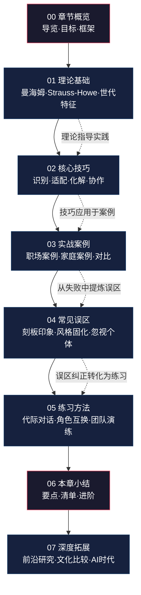
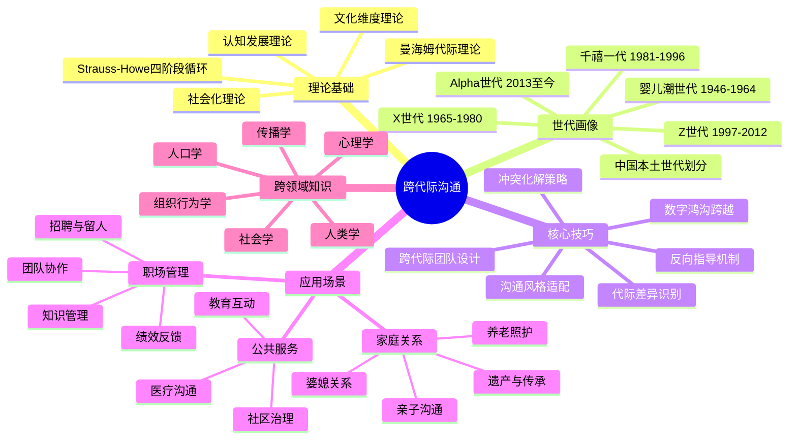

# 第二十三章 跨代际沟通

## 引言

在任何组织和家庭中，不同世代的人共处一室是再平常不过的场景。然而，这种看似自然的共处，却常常伴随着沟通的摩擦与误解。一位婴儿潮世代的管理者可能完全无法理解千禧一代员工为什么要在工作时间刷短视频；一位Z世代的年轻人可能觉得长辈的"好好读书、找份稳定工作"的建议完全过时；一位X世代的中层管理者可能感到自己夹在上下两代人之间，左右为难。

代际差异不仅存在于年龄数字的差异上，更深层次地体现在价值观、沟通偏好、技术习惯、工作态度和生活方式等多个维度。这些差异根植于不同世代所经历的历史事件、社会环境和技术变革。理解这些差异的本质，是实现有效跨代际沟通的基础。

本章将系统地探讨代际差异的形成原因、各世代的核心特征、跨代际沟通的技巧与策略，以及如何在职场和家庭中实现代际和谐。无论你是需要管理多代际团队的领导者，还是希望与长辈或晚辈建立更好关系的普通人，本章的内容都将为你提供有价值的指导。

### 一个直观的起点

2023年，某知名互联网公司的季度复盘会上，一位70后技术总监要求团队成员"把手机放下，认真开会"，而95后的产品经理直接反问："我们刚才在群里同步的信息，您没看到吗？"——双方都觉得自己在"正常沟通"，但彼此的认知模型完全不同：前者认为"开会=专注+面对面"，后者认为"开会=信息同步+多通道协作"。

类似的家庭场景同样普遍：一位母亲在家庭群里转发了十几条养生文章，女儿回复了一句"这些都是假的"，母亲从此沉默——双方都觉得自己是为了对方好，但沟通的结果却是情感伤害。

这些日常摩擦指向一个核心问题：**代际之间的沟通障碍，本质上不是"谁对谁错"的问题，而是不同成长环境塑造了不同的认知框架和表达习惯。** 理解这一点，是跨代际沟通的第一步。

---

## 章节结构

本章共分为七个部分，按照从理论到实践、从基础到进阶的逻辑顺序展开。下图展示了全章的知识脉络和各部分之间的关联关系：

### 各部分详细导览

**第一部分：章节概览（本文件）**

本文件是全章的导航地图。你正在阅读的这个部分将帮助你理解：
- 跨代际沟通为什么值得系统学习
- 本章涵盖哪些内容、各部分之间如何衔接
- 学完本章后你将获得哪些能力
- 学习前需要具备哪些基础知识
- 如何最高效地利用本章内容

建议在正式学习前通读本文件，建立全局认知后再逐节深入。

**第二部分：理论基础**

理论是实践的骨架。本部分将系统讲解代际理论的核心框架：
- **曼海姆的代际理论**：德国社会学家卡尔·曼海姆（Karl Mannheim）在1928年提出的经典理论。核心观点是"代际位置"（Generational Location）类似于"阶级位置"——同一时期经历重大历史事件的人群会形成独特的意识结构。你将理解代际身份不是年龄标签，而是社会经历的产物。
- **Strauss-Howe的世代理论**：威廉·斯特劳斯和尼尔·豪在《Generations》（1991）中提出的四阶段循环模型。他们将美国历史划分为反复出现的"觉醒-危机-高涨-解体"周期，每个周期对应不同的世代原型（先知、游侠、英雄、艺术家）。你将理解为什么不同世代呈现出截然不同的性格倾向。
- **五大世代深度画像**：婴儿潮世代（1946-1964）、X世代（1965-1980）、千禧一代/Generation Y（1981-1996）、Z世代（1997-2012）、Alpha世代（2013至今）。每个世代将从历史背景、核心价值观、沟通偏好、技术习惯、工作态度五个维度进行解析。
- **中国语境下的世代划分**：中国有独特的社会历史背景（改革开放、独生子女政策、互联网普及等），直接套用西方世代划分存在偏差。本部分将提供本土化的世代分析框架。

**第三部分：核心技巧**

从理论到操作的桥梁。本部分提供六大可落地的技能模块：

| 技能模块 | 核心内容 | 适用场景 |
|----------|----------|----------|
| 代际差异识别 | 通过语言、行为、偏好等信号判断对方的代际沟通模式 | 初次接触或沟通出现摩擦时 |
| 沟通风格适配 | 根据不同世代的偏好调整表达方式、渠道选择、反馈节奏 | 日常工作和生活沟通 |
| 代际冲突化解 | 识别冲突根源、选择适当的调解策略、重建共识 | 意见分歧或价值观碰撞时 |
| 跨代际团队协作 | 建立代际互补机制、设计包容性工作流程 | 多代际团队管理 |
| 反向指导实践 | 构建双向学习关系、消除年龄层级壁垒 | 组织知识管理和人才培养 |
| 数字鸿沟跨越 | 帮助不同技术熟练度的人群实现有效信息交换 | 技术培训和家庭数字支持 |

每个模块都包含具体的操作步骤、对话模板和注意事项，学完即可直接应用。

**第四部分：实战案例**

理论和技巧需要在真实场景中验证。本部分精选了多个具有代表性的中外案例：

- **职场正面案例**：某制造企业推行"代际师徒制"（老员工传授行业经验+新员工指导数字化工具），团队效率提升40%；某互联网公司设计"混合会议模式"（兼顾线上异步和线下同步），解决了不同世代对"开会"的认知差异。
- **职场反面案例**：某传统企业强制推行扁平化管理，忽略X世代管理者的中层协调价值，导致管理真空；某创业公司只招年轻人，声称"保持团队活力"，最终因缺乏经验而犯下低级错误。
- **家庭正面案例**：一位女儿通过"教妈妈拍短视频"的方式，打开了与母亲的深度沟通通道，母亲从"养生文转发者"变成了"家庭故事记录者"。
- **家庭反面案例**：一位父亲坚持"考公务员才是正经工作"的观念，与选择做自由职业的儿子关系破裂，三年不说话。

每个案例都从背景还原→沟通行为梳理→策略分析→结果评估四个维度展开，帮助你建立"案例分析"的思维框架。

**第五部分：常见误区**

跨代际沟通中，很多看似合理的做法实际上会适得其反。本部分将逐一拆解十大常见误区：

1. **"每一代人都一样"——代际标签的滥用**：代际特征是统计趋势，不是个体标签。用"你们90后都……"开头的句子几乎必然引发反感。
2. **"年轻人不懂事"——经验主义的傲慢**：将代际差异简单归因为"不够成熟"，忽略了不同世代面临的独特机遇和挑战。
3. **"老人思想落后"——技术优越感的陷阱**：技术熟练度不等于沟通能力，数字原住民在情感表达和人际深度上可能不及上一代。
4. **"尊重就是服从"——代际权力的误用**：长辈将"尊重"等同于"听话"，管理者将"服从"等同于"尊重"，两者都阻碍了真正的代际对话。
5. **"回避冲突就是和谐"——虚假和平的代价**：在代际差异面前选择沉默，看似避免了冲突，实际上积累了更大的不满。
6. **"用年轻人的方式沟通"——形式主义的适配**：学会用表情包不等于理解年轻人，表面模仿可能比不用更尴尬。
7. **"代际差异不可调和"——决定论的悲观**：将代际差异视为不可逾越的鸿沟，放弃了寻找共识的努力。
8. **"只关注职场代际问题"——场景窄化的盲区**：代际沟通的挑战同样存在于家庭、社区、公共服务等场景。
9. **"技术是万能解药"——工具理性的局限**：以为引入新工具就能解决代际沟通问题，忽略了信任、尊重和耐心等基础要素。
10. **"学一套方法就够了"——静态思维的陷阱**：代际格局在不断演变，Alpha世代正在成长，沟通策略需要持续更新。

**第六部分：练习方法**

知道不等于做到。本部分提供三类练习方案：

- **个人练习**：代际视角日记（记录每天与不同年龄段的人的沟通体验）、沟通风格自我评估、"如果我是TA"角色代入写作。
- **双向练习**：代际对话工作坊（结构化的跨代际对话）、"反向指导"配对实践（年轻人教长辈技术+长辈教年轻人经验）、价值观拍卖游戏。
- **团队练习**：多代际团队协作沙盘、代际冲突模拟演练、"代际友好型"工作流程设计。

每个练习都附有详细的操作指南、评估标准和常见问题解答。

**第七部分：本章小结**

全章的收束与升华。包含：
- 核心知识点总结（一页纸速查版）
- 跨代际沟通行动清单（可打印使用）
- 进阶学习资源推荐（书籍、论文、课程）
- 自我评估问卷（检验学习效果）

**第八部分：深度拓展**

为高级读者和研究者提供的延伸内容：
- 代际研究的前沿进展（最新学术成果和数据）
- 跨文化比较（中美日韩欧的代际差异对比）
- AI时代的代际沟通新命题（Z世代与AI共生、数字遗产传承）

---

## 学习目标

完成本章学习后，你将能够：

### 知识层面

1. **理解代际形成的社会学和心理学机制**：能够解释"为什么不同年代出生的人会有系统性的差异"，理解历史事件、技术变革和社会制度如何塑造一代人的共同认知框架。不仅知道"有差异"，更能说出"差异从何而来"。
2. **掌握五大世代的核心特征、价值观和沟通偏好**：能够准确描述婴儿潮、X世代、千禧一代、Z世代、Alpha世代各自的历史背景、核心价值观、沟通风格和技术习惯，并理解这些特征之间的内在逻辑关系。
3. **了解代际刻板印象与现实之间的差异**：能够区分"代际统计趋势"和"个体特征"的边界，避免将代际标签简单套用在具体个人身上。
4. **认识到跨代际沟通在职场和家庭中的重要性**：能够用数据和案例说明代际沟通不畅带来的具体成本（团队效率损失、家庭关系裂痕、社会资源浪费）。
5. **理解中国语境下代际问题的特殊性**：了解改革开放、独生子女政策、城镇化进程等中国特有的社会变迁如何塑造了独特的世代面貌。

### 技能层面

1. **能够识别不同世代的沟通风格并做出适当调整**：面对不同年龄段的沟通对象，能在5分钟内判断其主要沟通偏好，并调整自己的表达方式、信息密度和沟通渠道。
2. **能够在多代际团队中进行有效的沟通协调**：掌握"代际翻译"能力——将同一件事用不同世代能理解的语言和方式进行表达。
3. **能够化解代际冲突，促进代际理解**：面对代际摩擦时，能快速识别冲突的本质（价值观差异、表达方式差异、还是利益冲突），并选择适当的化解策略。
4. **能够与长辈和晚辈建立有效、尊重的沟通关系**：在家庭场景中，既能保持自身的独立性，又能维护代际关系的温度。
5. **能够设计"代际友好型"的沟通机制**：为团队或组织设计兼顾不同世代需求的沟通流程、会议模式和协作工具。

### 态度层面

1. **摒弃代际偏见，尊重每一代人的独特价值**：认识到每一代人都有其不可替代的智慧和经验，代际差异是互补资源而非对立矛盾。
2. **培养开放和包容的跨代际沟通心态**：面对与自己不同的沟通方式时，第一反应是"好奇"而非"排斥"，愿意投入时间去理解对方的认知框架。
3. **认识到代际差异是资源而非障碍**：能够在实际场景中有意识地利用代际差异带来的多元视角，提升决策质量和创新能力。
4. **建立持续学习的意识**：代际格局在不断演变，今天的"Z世代问题"明天可能变成"Alpha世代问题"，保持对代际动态的敏感度。

---

## 前置知识与读者准备

### 你需要具备的基础

本章内容设计为中级难度，假设读者已具备以下基础知识：

| 知识领域 | 最低要求 | 期望水平 |
|----------|----------|----------|
| 沟通基础 | 了解基本沟通模型（发送者→信息→接收者） | 理解非暴力沟通、主动倾听等核心技能 |
| 心理学常识 | 知道"认知偏差"和"刻板印象"的概念 | 了解社会认同理论和群体心理 |
| 社会学常识 | 知道"代际"这个词的大致含义 | 了解社会化过程和文化传承机制 |
| 职场经验 | 有过与不同年龄同事合作的经历 | 有管理多代际团队的实际经验 |
| 家庭关系 | 与父母或子女有基本的沟通 | 曾有意识地调整与长辈/晚辈的沟通方式 |

如果你对以上某些领域不太熟悉，建议先阅读本书相关章节进行补充，或者在学习过程中遇到不理解的概念时随时查阅。

### 自测：你的跨代际沟通基础水平

在正式学习前，试着回答以下问题（不需要查资料，凭直觉回答）：

1. 你能否说出"千禧一代"和"Z世代"的出生年份分界线？
2. 你的父母最常用的沟通渠道是什么？你呢？你们之间有"渠道差异"吗？
3. 当一位年长的同事说"我年轻的时候可不这样"，你觉得他的潜台词是什么？
4. 一位00后员工在工作群里用表情包回复任务安排，你觉得这合适吗？为什么？
5. 如果你是一位管理者，团队中有50后、70后、90后三代人，你会用什么方式传达一个重要决策？
6. "代际差异"和"个体差异"哪个更大？你能举一个反例吗？

如果你能清晰回答4个以上，说明你有较好的基础，可以快速浏览本章并重点关注核心技巧和实战案例部分。如果大部分问题答不上来，建议按顺序完整学习本章。

---

## 为什么跨代际沟通如此重要

### 一、人口结构的变化

全球范围内，人口结构正在发生深刻变化。在中国，随着人均寿命延长和生育率下降，多代同堂的家庭和多代共事的职场越来越普遍。具体来看：

**人口数据的现实。** 根据国家统计局数据，2023年中国60岁及以上人口达2.97亿，占总人口的21.1%；同时，每年有超过1000万大学毕业生进入职场。这意味着在许多企业中，员工年龄跨度可能达到30-40年，跨越四到五个世代。在家庭层面，随着人均预期寿命提高到78岁以上，"四世同堂"甚至"五世同堂"的家庭越来越多——这意味着一个家庭聚会中可能同时有经历过文革的老人、改革开放中成长的中年人、互联网时代出生的青年和移动互联网原住民的少年。

**代际重叠的加剧。** 过去，每一代人大约有20-25年的间隔，代际之间的接触主要发生在家庭内部。如今，由于退休年龄延迟和就业市场的变化，不同世代在职场中的重叠时间大幅延长。一位1960年出生的管理者可能需要与2000年出生的新员工直接共事——两者之间有40年的经历差异，这在人类历史上是前所未有的。

### 二、职场代际多元化

当前的职场中，婴儿潮世代（部分仍在工作）、X世代、千禧一代和Z世代四代同堂。每一代人都有不同的工作期望、沟通偏好和技术熟练度。管理者需要找到方法让这些不同世代的员工协同工作，发挥各自的优势。

**代际多元化的价值。** 麦肯锡2022年的一项研究显示，代际多元化的团队在创新指标上比同质化团队高出25%。原因是不同世代带来了不同的知识结构和问题解决视角——年长员工的行业洞察力和人脉网络，配合年轻员工的数字技能和新兴市场敏感度，可以产生"1+1>2"的协同效应。

**代际冲突的成本。** Gallup的调查显示，代际沟通不畅是员工离职的前五大原因之一。在35岁以下的离职员工中，有31%表示"与上级的沟通风格差异"是促使其离职的重要因素。招聘和培训一名新员工的成本通常是其年薪的50%-200%，这意味着代际沟通问题直接转化为真金白银的损失。

**管理复杂度的提升。** 传统的"一刀切"管理方式在多代际团队中几乎必然失效。例如，婴儿潮世代可能更看重"稳定性"和"忠诚度"，而Z世代更看重"灵活性"和"意义感"。一套激励制度如果只满足其中一代的需求，就可能对另一代产生反效果。

### 三、家庭代际沟通的挑战

随着技术的快速发展，代际之间的数字鸿沟日益加深。年轻人和长辈之间的沟通障碍不仅体现在语言和表达方式上，还体现在信息获取渠道、生活态度和价值观念上。

**数字鸿沟的具体表现。** 中国互联网络信息中心（CNNIC）的数据显示，60岁以上网民占比仅为14.3%，而20-29岁网民占比为17.2%。但更深层的差异不在于"是否上网"，而在于"如何使用网络"：老年人的互联网使用主要集中在即时通讯（微信）和短视频（抖音），而年轻人的使用场景更加多元化，包括知识获取、社交表达、消费决策等。这种"使用深度"的差异导致了信息获取和认知框架的系统性分化。

**"信息茧房"的代际效应。** 算法推荐机制加剧了代际信息隔离。父母在抖音上刷到的是养生、家庭伦理剧和怀旧内容，子女刷到的是科技、潮流和吐槽内容。即使使用同一个平台，两代人看到的"世界"截然不同，这使得共同话题越来越少。

**情感表达的代际差异。** 中国传统文化中的代际情感表达往往是含蓄的、行动导向的（"我给你做好吃的"="我爱你"），而年轻一代更倾向于直接的、语言化的情感表达。这种差异导致了"爱的错位"——长辈觉得自己已经表达了足够多的爱，晚辈却觉得"你从来没有真正理解过我"。

### 四、代际和谐的社会价值

跨代际沟通能力不仅关乎个人的社交质量，也关乎社会的和谐发展。促进代际理解和互助，有助于构建更加包容、更加有韧性的社会。

**社会凝聚力的基础。** 一个代际断裂的社会是脆弱的。当年轻人觉得"老年人拖了社会后腿"、老年人觉得"年轻人不靠谱"时，社会共识将难以形成，公共政策的推行也会遭遇阻力。代际理解是社会凝聚力的重要基石。

**知识传承的通道。** 人类文明的延续依赖于代际间的知识传递。当代际沟通不畅时，上一代积累的经验、智慧和文化传统可能在传递过程中断裂。许多非物质文化遗产的失传，正是因为缺乏有效的代际传承机制。

**创新活力的源泉。** 跨代际的思维碰撞是创新的重要驱动力。苹果公司的设计哲学之所以成功，部分原因在于乔布斯（婴儿潮世代）对简约美学的坚持与乔纳森·艾维（X世代）对材料工艺的精通之间的张力与融合。

---

## 知识体系全景图

下图展示了跨代际沟通的核心知识体系，帮助你理解本章内容在整个学科版图中的位置：

---

## 核心概念导览

在深入学习之前，让我们先了解本章将涉及的核心概念。以下表格涵盖本章最重要的概念，每个概念附带简要说明和首次出现的章节位置：

| 概念 | 简要说明 | 详解章节 |
|------|----------|----------|
| 代际（Generation） | 在相近时期出生、共享类似历史经历和社会环境的群体。代际不是简单的年龄分组，而是由共同的社会化经历塑造的"意识共同体"。 | 理论基础 |
| 代际特征（Generational Traits） | 某一世代群体表现出的共同行为模式和价值倾向。这些特征是统计趋势而非个体标签，存在显著的内部变异。 | 理论基础 |
| 代际刻板印象（Generational Stereotypes） | 对某世代群体的简化、固化的认知，如"90后不能吃苦""老年人不懂科技"。刻板印象会阻碍有效沟通，因为它预设了判断而非观察。 | 常见误区 |
| 数字鸿沟（Digital Divide） | 不同世代在技术使用能力和习惯上的差距。不仅体现在"会不会用"，更体现在"怎么用""用来做什么"的深层差异。 | 核心技巧 |
| 反向指导（Reverse Mentoring） | 年轻员工指导年长员工学习新技能或新观念的双向学习机制。由通用电气（GE）在1999年首创，现已成为许多跨国企业的标准人才发展工具。 | 核心技巧 |
| 代际同理心（Generational Empathy） | 理解和感受不同世代经历和视角的能力。不是简单的"我知道你不一样"，而是"我能理解你为什么不一样"。 | 核心技巧 |
| 社会化（Socialization） | 个体通过与社会环境的互动，内化社会规范、价值观和行为方式的过程。不同世代在社会化过程中接触的核心媒介不同（广播→电视→互联网→移动互联网→AI），塑造了不同的认知框架。 | 理论基础 |
| 代际位置（Generational Location） | 曼海姆理论中的核心概念，指某一代人在社会历史结构中所处的位置。类似于马克思的"阶级位置"，代际位置决定了个体能够接触到的经验范围。 | 理论基础 |
| 代际翻译（Generational Translation） | 将同一种信息用不同世代能够理解和接受的方式重新表达的能力。这是跨代际沟通的核心技能之一。 | 核心技巧 |
| 代际互补（Generational Complementarity） | 不同世代在知识、技能、视角上的互补关系。有效的代际沟通能够将这种互补性转化为团队和组织的竞争优势。 | 核心技巧 |
| 代际冲突（Generational Conflict） | 因代际差异导致的价值观碰撞和行为摩擦。冲突本身不是问题，处理不当才是。健康的代际冲突可以促进创新和自我反思。 | 核心技巧 |
| 共同意义空间（Shared Meaning Space） | 不同世代之间能够达成理解和共识的认知交集。跨代际沟通的目标之一是扩大这个共同空间。 | 核心技巧 |

这些概念将在后续各节中详细展开，每个概念都会配有理论讲解、应用示例和操作指南，帮助你不仅"知道"还能"用到"。

---

## 学习路径建议

本章内容量较大，不同背景的读者可以采用不同的学习路径：

### 路径A：完整学习（推荐，约8-10小时）

适合：人力资源从业者、企业管理者、社会学/心理学学生、希望系统提升代际沟通能力的读者

按顺序阅读所有章节，完成每个练习。重点投入在理论基础和核心技巧部分，建议边学边做笔记，每完成一节后用自测问题检验理解程度。实战案例部分建议先自己分析，再对照书中的分析框架进行对比。

### 路径B：快速掌握（约3-4小时）

适合：已有一定沟通基础、需要快速补充代际知识的读者

跳过理论基础部分（或快速浏览），重点学习核心技巧中的"沟通风格适配"和"代际冲突化解"模块，通读实战案例部分的正面和反面案例各2个，完成常见误区部分的阅读。

### 路径C：场景导向（约2小时）

适合：面临具体代际沟通问题的读者

根据你面临的场景直接跳转：
- **职场管理问题** → 核心技巧→跨代际团队协作 + 实战案例中的职场部分
- **家庭沟通问题** → 核心技巧→沟通风格适配 + 实战案例中的家庭部分
- **亲子冲突问题** → 核心技巧→代际冲突化解 + 常见误区中的相关条目
- **"如何跟年轻人/老年人沟通"** → 理论基础→世代画像（找到对方所属世代的特征）

问题解决后，再回头进行完整学习，建立系统化的知识框架。

---

## 本章核心原则

在深入各节内容之前，请牢记以下四条核心原则，它们贯穿全章所有内容：

**原则一：代际特征是趋势，不是标签。** 任何关于"X世代如何""Z世代怎样"的描述，都是基于大样本的统计趋势，而非对每个个体的准确定义。用代际标签去预判一个人的行为，和用星座去预判一样不靠谱。正确的做法是：先了解代际趋势作为参考框架，再通过实际沟通去了解具体的个人。

**原则二：理解先于判断。** 跨代际沟通的第一步不是"说服对方"，而是"理解对方"。当你听到一个让你不舒服的代际观点时，先问"他为什么会这样想"，而不是"他怎么可以这样想"。理解不等于认同，但理解是达成共识的前提。

**原则三：差异是资源，不是障碍。** 代际差异带来了多元化的视角、知识和技能。一个只有年轻人的团队和一个只有老年人的团队，都不如一个代际多元化的团队有创造力。关键不是消除差异，而是学会利用差异。

**原则四：沟通是一种能力，需要持续练习。** 跨代际沟通不是读一本书就能掌握的技能。它需要在真实场景中不断练习、反思和调整。每一次代际摩擦都是一次学习机会——前提是你愿意从中学习，而不是简单地归咎于"对方太固执"。

---

## 结语

跨代际沟通是一门融合了社会学、心理学、组织行为学和传播学等多个学科知识的综合性技能。它要求我们既要有宏观的视野（理解时代变迁如何塑造一代人），又要有微观的敏感（觉察每一个具体沟通场景中的代际信号）；既要有理论的深度（理解代际差异的根源），又要有实践的温度（在真实的人际关系中运用这些理解）。

在接下来的章节中，我们将深入探讨每一个核心主题，通过理论讲解、技巧传授、案例分析和实践练习，帮助你成为一名优秀的跨代际沟通者。记住，代际差异是人类社会的常态，而学会在差异中建立连接，是一种值得终身修炼的能力。

本章的最后一节将提供一份完整的"跨代际沟通行动清单"，你可以在日常工作和生活中随时查阅。当你遇到代际沟通的困惑时，这份清单将成为你可靠的参考指南。

现在，让我们从理论基础开始，一步步构建你的跨代际沟通能力。
