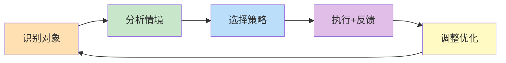

# 跨代际沟通——理论基础

> 代际差异不是缺陷，而是不同历史环境塑造的适应性策略。理解差异的根源，是实现有效跨代际沟通的第一步。

## 一、代际理论概述

### 1.1 什么是"代"

"代"（Generation）是一个社会学概念，指在相近历史时期出生、共享类似社会经历和文化记忆的群体。这个概念不是简单的年龄分组，而是社会学、心理学和历史学的交叉产物。

德国社会学家卡尔·曼海姆（Karl Mannheim）在其1928年的经典论文《代的问题》（Das Problem der Generationen）中奠定了代际研究的理论基石。他指出，一代人之所以形成独特的意识，是因为他们在性格塑造的关键时期——通常是15岁到25岁的"敏感期"——经历了相同的重大历史事件和社会变革。这段时期的记忆和经验会被深刻编码进一代人的认知框架，成为他们理解世界的基础透镜。

曼海姆的代际理论包含三个核心概念：

**代际位置（Generational Location）：** 类似于社会阶层的概念，指出生在特定历史时期的人所共享的潜在经验和视角。就像一个人出生在特定阶层会塑造其世界观一样，出生在特定历史时期也会产生类似效果。代际位置是被动的——你无法选择自己出生的时代。

**实际代际单元（Actual Generation）：** 当代际位置中的成员被特定历史事件激活，形成共同的意识和行动时，就形成了实际代际单元。例如，2020年新冠疫情将全球Z世代和千禧一代同时"激活"，塑造了他们对远程工作、心理健康和不确定性的共同认知。

**代际单元（Generation Unit）：** 在同一代中，由于对同一历史事件的不同反应，可能形成不同的代际单元。例如，同为千禧一代，有人成为"斜杠青年"追求多元身份，有人追求"考公上岸"寻求稳定；同为Z世代，有人投身Web3创业，有人选择"躺平"。这种内部分化同样重要，提醒我们不能将任何一代人视为铁板一块。

曼海姆理论的核心洞见在于：代际意识不是自然产生的，而是被历史事件"激活"的。没有重大事件的冲击，一个年龄群体就不会形成代际认同。这解释了为什么和平繁荣时期的代际边界往往模糊，而动荡变革时期则会产生鲜明的代际分野。

### 1.2 Strauss-Howe世代理论

美国学者威廉·斯特劳斯（William Strauss）和尼尔·豪（Neil Howe）在1991年出版的《世代》（Generations）和1997年的《第四次转折》（The Fourth Turning）中，提出了一个影响深远的四阶段循环理论。

他们认为，美国历史可以被理解为一系列约80-90年的"大周期"（相当于人的一生），每个大周期包含四个阶段，每个阶段约20-25年，由不同的世代主导：

**四个阶段及其对应的世代原型：**

| 阶段 | 名称 | 特征 | 主导世代原型 |
|------|------|------|-------------|
| 第一阶段 | 高潮（High） | 新的社会秩序建立，集体认同感增强，制度权威达到顶峰 | 先知型（Prophet） |
| 第二阶段 | 觉醒（Awakening） | 价值观发生转变，精神追求兴起，旧制度受到挑战 | 游侠型（Nomad） |
| 第三阶段 | 解体（Unraveling） | 个人主义兴起，社会凝聚力下降，制度信任崩塌 | 英雄型（Hero） |
| 第四阶段 | 危机（Crisis） | 社会面临重大挑战，需要集体行动，旧秩序被摧毁 | 艺术家型（Artist） |

Strauss-Howe理论的四个世代原型：

- **先知型（Prophet）：** 成长于高潮期，价值观坚定，善于道德引导。对应婴儿潮一代。
- **游侠型（Nomad）：** 成长于觉醒期，务实独立，适应力强。对应X世代。
- **英雄型（Hero）：** 成长于解体期，自信果断，善于集体行动。对应千禧一代。
- **艺术家型（Artist）：** 成长于危机期，灵活适应，善于调和。对应Z世代。

**批判性评价：** 这一理论虽然提供了一个优雅的分析框架，但也存在明显局限。首先，它主要基于美国历史经验，直接套用到中国语境需要谨慎。其次，20-25年的代际划分过于整齐，现实中代际边界是渐变的而非断裂的。第三，该理论有历史决定论倾向，低估了个体能动性。尽管如此，其核心洞见——社会环境塑造代际特征——仍然具有普遍参考价值。

### 1.3 代际形成的中国视角

在中国语境下，代际的形成具有独特的社会历史背景。中国的快速社会变革使得代际差异比许多其他国家更加显著，因为每一代人经历的社会环境几乎是"翻天覆地"的变化。

**政治运动的影响：** 不同世代对中国政治运动的经历和记忆差异巨大。经历过"文革"的一代人对政治表达更加谨慎，对权威的态度也更为复杂。这种历史记忆会通过家庭教育和文化叙事传递给下一代，形成"代际创伤"效应。

**经济改革的影响：** 改革开放前后出生的人，在经济条件、生活方式和价值观念上存在根本性差异。1978年前出生的人经历了物质匮乏，形成了强烈的储蓄意识和风险规避倾向；1978年后出生的人则在经济快速增长中成长，对消费和投资持更加开放的态度。到1990年代后出生的人，物质条件已经大幅改善，他们更关注体验、意义和自我实现。

**技术变革的影响：** 中国互联网的快速普及使得不同世代在数字素养上的差距更加明显。2000年前后出生的Z世代是"移动互联网原住民"，而他们的父母——X世代和早期千禧一代——则经历了从BB机、固定电话到智能手机的完整技术演变。这种技术经验的代际差异直接影响了沟通方式和信息获取习惯。

**全球化的影响：** 不同世代对全球化、西方文化和国际视野的接触程度不同。1980年代后出生的人在改革开放的环境中成长，对国际文化更加熟悉；2000年后出生的人则在中国经济崛起和文化自信增强的背景下成长，民族认同感更强。

**独生子女政策的影响：** 这是中国特有的代际塑造因素。独生子女政策（1980-2015）创造了一代独特的"小皇帝"和"小公主"，他们在家庭资源集中、同伴互动有限的环境中成长，形成了独特的社交模式和沟通风格。

### 1.4 代际划分的争议与反思

代际划分虽然有助于我们理解社会变迁，但也存在重要的局限性：

**边界模糊性：** 代际边界并非截然分明。一个1996年出生的人和一个1997年出生的人，虽然被划入不同的"世代"，但在实际经历和价值观上可能几乎没有差异。代际边界更像是光谱而非断层。

**个体差异大于代际差异：** 同一世代内部的个体差异，往往远大于世代之间的平均差异。一个50岁的科技从业者和一个25岁的传统手艺人，在工作方式和价值观上可能比他们各自与同龄人的差异更大。

**社会经济地位的调节作用：** 经济条件、教育水平、城乡差异等因素会显著调节代际特征的表现。农村Z世代和城市Z世代的生活经验可能截然不同。

**文化差异的干扰：** 代际划分标准主要来自西方学术传统，直接套用到中国、日本、印度等非西方社会时需要谨慎修正。

尽管存在这些局限，代际视角仍然是理解沟通差异的有力工具——只要我们记住它是启发式框架，而非绝对真理。

***

## 二、五大世代特征分析

### 2.1 婴儿潮世代（1946-1964年出生）

**历史背景：**

婴儿潮世代出生在二战后的生育高峰期。在中国语境下，这一代人大致对应1940年代末至1960年代初出生的人群。他们经历了新中国成立、土地改革、大跃进、三年困难时期、文化大革命、上山下乡等重大历史事件，也亲历了改革开放带来的巨大变化。这些经历塑造了他们独特的精神气质：既经历过苦难，也见证了重生。

**核心特征：**

**价值观：**
- 高度重视集体主义和社会责任，"国家利益高于个人利益"是根深蒂固的信念
- 强调勤奋工作和吃苦耐劳，"吃得苦中苦，方为人上人"是他们的座右铭
- 尊重权威和等级秩序，认为"长幼有序"是社会稳定的基石
- 重视储蓄和经济安全，经历过物质匮乏的人对"未雨绸缪"有深刻理解
- 对"铁饭碗"和稳定工作有深厚情感，这不仅是经济考量，更是身份认同的一部分

**工作态度：**
- 忠诚度高，倾向于在一家单位长期工作，"从一而终"被视为美德
- 重视资历和经验，相信"姜还是老的辣"
- 习惯面对面沟通，认为"见面三分情"
- 对加班和额外付出有较高的接受度，"奉献精神"是核心职业价值
- 重视"论资排辈"的晋升体系，认为这是公平的体现

**沟通偏好：**
- 偏好面对面交流或电话沟通，认为这些方式更能传递诚意和情感
- 重视正式的、尊重的沟通方式，称呼、礼仪、措辞都很重要
- 对非语言信号（如肢体语言、眼神接触、语气变化）敏感
- 倾向于通过层级渠道传递信息，"越级汇报"是大忌
- 对直接的冲突和批评可能感到不适，倾向于迂回表达

**技术使用：**
- 技术使用相对保守，学习新技术需要更多时间和耐心
- 对纸质文件和传统工具有偏好，认为"白纸黑字"更可靠
- 可能对数字化转型感到焦虑或抵触，需要更多支持和鼓励
- 典型技术痛点：复杂的密码管理、频繁的软件更新、过于扁平的界面设计

**与这一代人沟通的要点：**
- 使用正式称呼（如"张总"、"李老师"），避免过于随意
- 面对面或电话沟通优先，重要事项不要只发微信
- 给予充分的尊重和认可，特别是对其经验和贡献的肯定
- 避免当众批评，如有分歧私下沟通
- 提供清晰的步骤指引，不要假设他们能快速掌握新技术

### 2.2 X世代（1965-1980年出生）

**历史背景：**

X世代成长于经济转型和社会变革的时期。在中国，这一代人经历了文革结束、改革开放、市场经济兴起、大学扩招、住房商品化等重大变革。他们是"过渡的一代"——既见证了计划经济的尾声，又全面拥抱了市场经济。他们是中国第一代"下海"创业者的主体，也是第一批真正意义上的"打工人"。

这一代人被称为"三明治一代"：上有父母需要赡养（婴儿潮一代），下有子女需要培养（Z世代），同时还要应对职场竞争和经济压力。这种夹缝中的位置塑造了他们务实、坚韧但也略带疲惫的性格。

**核心特征：**

**价值观：**
- 务实主义，注重实际结果，"不管黑猫白猫，能抓住老鼠就是好猫"
- 独立自主，自我依赖，不指望"组织"解决一切问题
- 工作与生活平衡的追求者，但现实中往往"两头兼顾"
- 对权威持审慎态度，但不激进反叛，更倾向于"在体制内寻找空间"
- 重视个人能力和专业技能，相信"一技之长"是安身立命的根本

**工作态度：**
- 兼具忠诚度和独立性，既有"老黄牛"的一面，也有"自己当老板"的野心
- 重视工作成果而非工作时长，对形式主义的加班文化反感
- 能够适应不同的工作环境，是"万金油"型人才
- 是连接传统与现代的桥梁，既能理解上级的"老派"思维，也能跟上下属的"新潮"想法
- 对"996"文化有复杂态度——既觉得不合理，又担心不参与会被淘汰

**沟通偏好：**
- 适应面对面沟通和电子沟通（如电子邮件、微信），切换自如
- 直接、简洁、注重效率，不喜欢绕弯子
- 能够在正式和非正式沟通之间灵活切换
- 重视事实和数据，"说数字，别说形容词"
- 对冗长的会议和无效沟通感到厌烦，"有事说事"是他们的沟通哲学

**技术使用：**
- 技术适应能力强，是数字化转型的积极参与者
- 能够熟练使用电子邮件、即时通讯等工具
- 对新技术持开放但审慎的态度，会先评估"值不值得学"
- 典型优势：既能用Excel做数据分析，也能用微信建群协调

**与这一代人沟通的要点：**
- 效率第一，开门见山，减少寒暄
- 用数据和事实说话，避免空洞的愿景描述
- 尊重其专业判断，不要事无巨细地指导
- 提供足够的自主权和决策空间
- 理解他们的"两头压力"，对其时间表示尊重

### 2.3 千禧一代（1981-1996年出生）

**历史背景：**

千禧一代（也称Y世代）成长于中国经济高速增长、互联网快速普及的时期。他们是中国第一代独生子女的主体，经历了大学扩招、房价飙升、全球化、互联网泡沫与崛起等重大社会变革。

这一代人有几个独特的历史标签：他们是"扩招一代"——大学文凭从稀缺品变成了"标配"，学历贬值成为他们面临的现实；他们是"房奴一代"——房价的飞速上涨使得"买房"成为他们人生中最大的经济压力；他们是"互联网一代"——从拨号上网到移动互联网，他们见证了数字世界的从无到有。

**核心特征：**

**价值观：**
- 重视自我实现和个人成长，"成为更好的自己"是核心追求
- 追求工作意义感和使命感，不满足于"只为赚钱"
- 开放、包容、多元化，对不同的生活方式持尊重态度
- 重视体验而非物质，"花钱买经历"比"花钱买东西"更有吸引力
- 对社会问题有较高的关注度，是社交媒体上公共讨论的积极参与者

**工作态度：**
- 期望工作有意义和价值，"有意义的辛苦"和"无意义的轻松"之间，他们选前者
- 重视职业发展机会和学习成长，"能学到东西"是选择工作的重要因素
- 对"加班文化"有抵触情绪，但愿意为真正重要的项目全力以赴
- 期望灵活的工作安排，远程办公对他们来说不是"福利"而是"基本权利"
- 更容易跳槽，对组织的忠诚度相对较低——忠诚度是"挣来的"，不是"默认的"

**沟通偏好：**
- 数字化沟通的主力（微信、QQ、钉钉等），文字沟通是日常
- 喜欢即时反馈，发了消息希望尽快得到回复
- 重视沟通的平等性和参与感，不喜欢"一言堂"
- 对单向的、权威式的沟通感到不适，"你可以不同意我，但要让我把话说完"
- 喜欢视觉化和简洁的沟通方式，长篇大论的文字会让他们失去耐心

**技术使用：**
- 数字原住民的"前辈"，技术熟练度高
- 能够快速适应新平台和新工具
- 社交媒体的重度用户，微信朋友圈、微博、小红书是主要社交阵地
- 典型痛点：对过度依赖技术感到矛盾——既享受便利，又担忧"被手机绑架"

**与这一代人沟通的要点：**
- 提供"为什么"而不仅仅是"做什么"，他们需要理解工作的意义
- 给予即时反馈和认可，不要等到年底考核才说
- 使用平等的沟通方式，避免居高临下的姿态
- 支持灵活的工作方式，结果比过程重要
- 尊重其工作与生活的边界，非紧急事项不要在休息时间联系

### 2.4 Z世代（1997-2012年出生）

**历史背景：**

Z世代是真正的数字原住民，从出生起就生活在互联网和移动设备普及的环境中。他们成长于中国经济持续增长、社交媒体蓬勃发展、全球化深入的时代。疫情（COVID-19）对这一代人的成长产生了深远影响——远程学习、社交隔离、经济不确定性塑造了他们独特的世界观。

在中国，Z世代有几个独特的标签：他们是"移动互联网原住民"——智能手机是他们认识世界的第一个窗口；他们是"后独生子女时代"——独生子女政策逐步放开，但他们的成长模式已经被塑造；他们是"内卷一代"——激烈的教育竞争和就业压力是他们成长的背景音；他们也是"国潮一代"——对中华文化有强烈的认同感和自豪感。

**核心特征：**

**价值观：**
- 高度重视真实性和个性表达，对"装"和"虚伪"零容忍
- 关注社会公正和环境保护，是"行动主义"的天然盟友
- 对多样性和平等有强烈的认同，是LGBTQ+权益、性别平等的坚定支持者
- 重视心理健康和自我关怀，"内耗"是他们高频使用的词汇
- 对品牌和组织的"真诚度"有较高要求，能迅速识破营销话术

**工作态度：**
- 追求工作与生活的融合（而非仅仅是平衡），工作是生活的一部分，不是对立面
- 期望有意义的工作和快速的职业发展，"三年当总监"不是野心而是期望
- 对"画饼"文化和空洞的承诺高度敏感，"别跟我谈情怀，先说薪资"
- 重视工作环境的文化和氛围，"和谁一起工作"比"在哪里工作"更重要
- 副业和"斜杠"文化的参与者，"主业求稳，副业求变"是常见策略

**沟通偏好：**
- 视频和图像优先（短视频、表情包、GIF、meme），文字是"最后手段"
- 重视即时性和互动性，单向传递信息会让他们感到被忽视
- 喜欢非正式、轻松的沟通风格，过度正式会让他们感到距离感
- 对长篇文字和正式邮件可能感到不耐烦，"能用表情包说的，不用文字"
- 社交媒体是主要的社交和信息获取渠道，抖音、B站、小红书是他们的"信息源"

**技术使用：**
- 技术熟练度极高，能够快速掌握新工具
- 多平台、多设备同时使用，"分屏操作"是基本技能
- 对技术的依赖程度高，"手机没电"等于"与世隔绝"
- 典型优势：信息筛选能力强，能在海量信息中快速找到有用内容

**与这一代人沟通的要点：**
- 使用他们习惯的沟通渠道和方式，不要强迫他们适应"老派"沟通
- 保持真实和真诚，任何"装"都会被立刻识别
- 提供即时反馈和互动机会，单向灌输是最差的沟通方式
- 尊重其心理健康需求，不要用"吃苦耐劳"来否定其压力
- 用"共创"而非"指导"的姿态沟通，让他们感到被尊重和参与

### 2.5 Alpha世代（2013年及以后出生）

**历史背景：**

Alpha世代是Z世代的子女，出生在人工智能、物联网和社交媒体高度发达的时代。他们是iPad一代、AI助手一代，成长于一个万物互联、信息爆炸的环境中。截至2025年，最年长的Alpha世代已经12岁，开始进入青春期，其世代特征正在逐渐显现。

**核心特征（基于已观察到的趋势和预测）：**

**技术与认知：**
- 可能成为技术依赖度最高的一代，AI助手对他们来说如同"数字保姆"
- 注意力模式更加碎片化，多任务处理成为本能
- 信息过载的应对能力可能更强，但也面临深度思考能力下降的风险
- 虚拟现实（VR）和增强现实（AR）可能成为他们学习和娱乐的常规工具

**教育与学习：**
- 教育方式更加个性化和技术化，在线学习、自适应学习平台是常态
- 游戏化学习和互动式教育体验将成为主流
- 跨文化接触更加频繁，全球化视野更加自然

**社交与情感：**
- 社交方式更加虚拟化，线上社交和线下社交的界限进一步模糊
- 对全球性问题（如气候变化、AI伦理）有更早的认知和更强的关注
- 心理健康意识更强，但也面临社交媒体带来的新型心理压力
- 家庭教育中多代际影响更加复杂——父母是千禧一代或Z世代，祖父母是婴儿潮或X世代

**对跨代际沟通的启示：**

Alpha世代目前仍是儿童和少年，他们的完整世代特征尚未完全成型。但我们可以预判几个趋势：
- 他们将是第一代"AI原住民"，与AI的交互能力远超前辈
- 他们对"真实性"的要求可能比Z世代更高，因为AI生成内容的泛滥使得"什么是真的"成为核心问题
- 他们的沟通方式可能更加多模态——文字、语音、视频、AR、VR的无缝切换
- 他们需要学习在虚拟世界和现实世界之间建立健康的关系

***

## 三、代际沟通的理论模型

### 3.1 代际学习风格理论

不同世代有不同的学习和信息处理风格，这直接影响了他们的沟通偏好。美国教育心理学家David Kolb的经验学习理论和Neil Fleming的VARK模型可以帮助我们理解这些差异。

**婴儿潮世代——系统性学习者：**
倾向于系统性学习，喜欢结构化的信息呈现。偏好面对面教学和师徒制，认为"手把手教"是最有效的学习方式。信息处理风格是"先理解全局，再关注细节"。他们习惯于线性学习路径：听讲→笔记→复习→实践。

**X世代——实践性学习者：**
倾向于实践性学习，喜欢"边做边学"（learning by doing）。对理论与实践结合的内容接受度高，不喜欢纯粹的理论讲解。信息处理风格是"给我一个案例，我就能理解原理"。他们善于从错误中学习，对"试错"持开放态度。

**千禧一代——协作性学习者：**
倾向于协作性学习，喜欢小组讨论和项目制学习。对多媒体和互动式内容接受度高。信息处理风格是"一起讨论比独自看书更有效"。他们善于利用在线资源进行自主学习，但需要与他人的交流来深化理解。

**Z世代——碎片化学习者：**
倾向于碎片化学习，喜欢短视频、微课程、信息图等形式。注意力持续时间相对较短（研究显示平均8秒），但信息筛选能力强。信息处理风格是"给我关键信息，其他的我自己搜"。他们善于多源信息整合，能在不同平台和格式之间快速切换。

**代际学习风格对比表：**

| 维度 | 婴儿潮 | X世代 | 千禧一代 | Z世代 |
|------|--------|-------|----------|-------|
| 学习偏好 | 系统性、结构化 | 实践性、案例驱动 | 协作性、互动式 | 碎片化、视觉化 |
| 信息渠道 | 书籍、讲座 | 案例、实操 | 讨论、多媒体 | 短视频、搜索 |
| 认知风格 | 线性、逻辑 | 问题导向 | 发散、整合 | 多源、跳跃 |
| 反馈需求 | 阶段性、总结性 | 结果导向 | 即时、频繁 | 实时、互动 |
| 最佳教学法 | 讲授+师徒制 | 案例教学+实践 | 项目制+小组讨论 | 微课+游戏化 |

### 3.2 代际价值观冲突模型

代际冲突往往源于价值观的差异。以下是对几个核心冲突维度的深入分析：

**个人主义 vs 集体主义：**

这是代际冲突中最根本的维度。年长世代更强调集体利益和社会责任——"个人服从组织"是基本准则；年轻世代更强调个人价值和自我实现——"我首先是我自己，然后才是员工/子女/公民"。

这种冲突在职场中表现为：老一代认为"加班是应该的，因为团队需要"，年轻一代认为"加班是选择，不是义务"。在家庭中表现为：老一代认为"结婚生子是人生必经之路"，年轻一代认为"这是个人选择，不是社会期待"。

**稳定 vs 变化：**

年长世代更追求稳定和可预测性——"宁可收入少一点，也要稳定"。年轻世代更拥抱变化和不确定性——"稳定意味着停滞，变化意味着机会"。

这种冲突在职业选择中尤为明显。老一代推崇"铁饭碗"（公务员、国企、事业单位），年轻一代更倾向于"风口"（互联网、创业、自由职业）。实际上，两种选择都有其合理性——稳定提供了安全感，变化提供了成长空间，关键在于个人的风险承受能力和人生阶段。

**等级 vs 平等：**

年长世代更接受等级秩序和权威——"领导说了算"是工作场所的基本规则。年轻世代更追求平等和民主——"人人有权表达意见"是基本信念。

这种冲突在会议场景中表现得最明显：老一代习惯"领导先说，下属后说"的秩序，年轻一代希望"谁有好想法谁就说"。在称呼上，老一代习惯"张总"、"李处"等正式称谓，年轻一代更喜欢直呼其名或用昵称。

**物质 vs 体验：**

年长世代更重视物质积累和经济安全——"有房有车"是成功的标志。年轻世代更重视体验和生活品质——"去过多少地方、经历过什么"比"拥有什么"更重要。

这种冲突在消费行为上表现得最直观：老一代习惯储蓄，"月光族"在他们看来是不负责任的表现；年轻一代更愿意为体验付费，"为了省钱而牺牲生活品质"在他们看来是不值得的。

### 3.3 代际沟通偏好差异矩阵

以下矩阵全面展示了不同世代在沟通各个维度上的差异，可作为跨代际沟通的快速参考：

| 维度 | 婴儿潮 | X世代 | 千禧一代 | Z世代 |
|------|--------|-------|----------|-------|
| 主要沟通渠道 | 面对面/电话 | 电子邮件 | 微信/即时通讯 | 短视频/社交媒体 |
| 沟通风格 | 正式/尊重 | 直接/高效 | 平等/协作 | 非正式/创意 |
| 反馈期望 | 定期/正式 | 结果导向 | 即时/频繁 | 实时/互动 |
| 信息呈现 | 详细/结构化 | 简洁/要点式 | 视觉化/多媒体 | 短小/碎片化 |
| 决策方式 | 自上而下 | 分析型 | 协商型 | 数据+直觉 |
| 冲突处理 | 迂回/回避 | 直面对抗 | 对话协商 | 表达感受 |
| 时间观念 | 长期规划 | 中期务实 | 短期灵活 | 即时响应 |
| 权威态度 | 尊重服从 | 审慎质疑 | 平等对话 | 解构挑战 |
| 信任建立 | 时间+忠诚 | 能力+结果 | 透明+价值 | 真实+一致性 |

### 3.4 媒介丰富度理论与代际适配

媒介丰富度理论（Media Richness Theory，由Daft和Lengel于1984年提出）为跨代际沟通提供了重要的实践指导。该理论认为，不同的沟通媒介在传递信息的"丰富度"上存在差异：

**高丰富度媒介：** 面对面沟通 > 视频通话 > 电话 > 即时消息
**低丰富度媒介：** 电子邮件 > 正式文件 > 公告通知

代际适配原则：
- **婴儿潮世代：** 偏好高丰富度媒介。重要事项用面对面或电话，减少误解。电子邮件用于正式记录和确认。
- **X世代：** 适配中等丰富度媒介。电子邮件是首选，紧急事项用电话。避免过度使用即时消息（他们觉得"被打扰"）。
- **千禧一代：** 适配中等偏低丰富度媒介。微信/即时消息是首选，重要事项再升级到电话或面对面。
- **Z世代：** 适配多模态媒介。他们习惯在不同媒介之间切换——文字不够就发语音，语音不够就发视频。关键是内容的即时性和互动性。

***

## 四、代际刻板印象与现实

### 4.1 常见的代际刻板印象

每一代人都被贴上了各种标签，这些标签往往是对复杂现实的过度简化。理解这些刻板印象，是超越它们的第一步。

**对婴儿潮世代的刻板印象：**
- "技术恐惧者"——实际上，许多婴儿潮世代已经熟练使用智能手机和社交媒体
- "思想僵化"——实际上，这一代人经历了中国最大的社会变革，适应能力不容小觑
- "不愿改变"——实际上，许多人在退休后积极学习新技能，发展新兴趣
- "权威主义者"——实际上，许多人对年轻一代持开放和支持态度

**对X世代的刻板印象：**
- "愤世嫉俗"——实际上，他们的"务实"源于对现实的清醒认识
- "不够忠诚"——实际上，他们在动荡的经济环境中学会了灵活应变
- "忽视家庭"——实际上，他们承担了最大的家庭压力（赡养父母+抚养子女）
- "被忽视的一代"——确实，媒体和学术界对这一代的关注相对较少

**对千禧一代的刻板印象：**
- "懒惰"——实际上，他们面对的工作竞争比前辈更加激烈
- "自我中心"——实际上，他们对社会问题的关注度高于前辈
- "不能承受压力"——实际上，他们面对的经济压力（房价、教育成本）远超前辈
- "频繁跳槽"——实际上，这是对不稳定劳动市场的理性适应

**对Z世代的刻板印象：**
- "注意力不集中"——实际上，他们的注意力模式是适应信息过载的结果
- "过度依赖技术"——实际上，技术是他们高效处理信息的工具
- "缺乏耐心"——实际上，他们对低效沟通的容忍度确实更低，但这未必是坏事
- "抗压能力差"——实际上，他们更愿意表达和面对心理健康问题，而不是"硬撑"

### 4.2 刻板印象的危害机制

代际刻板印象会产生多重负面影响，理解这些机制有助于我们有意识地避免它们：

**自我实现预言（Self-Fulfilling Prophecy）：** 当我们预设某一代人具有某种特征时，我们的行为可能会促使对方表现出这种特征。例如，如果我们认为Z世代"不能承受压力"，就可能减少对他们有挑战性的任务分配，结果他们确实缺乏锻炼和成长的机会。

**确认偏误（Confirmation Bias）：** 一旦我们形成了对某一代人的刻板印象，就会不自觉地选择性关注那些"证实"这一印象的信息，忽略那些"证伪"的信息。一个认为"千禧一代懒惰"的管理者，可能只注意到年轻员工的休息时间，忽略他们的高效产出。

**沟通障碍：** 刻板印象会让我们在沟通前就形成偏见，影响我们的倾听和理解能力。当我们带着"这一代人就是这样的"预设去沟通时，就失去了真正了解对方的机会。

**人才流失：** 在职场中，代际刻板印象可能导致对某一年龄群体的不公平对待。研究显示，年龄歧视是导致中高龄员工离职的重要因素之一。同样，对年轻员工的偏见也会影响他们的工作满意度和忠诚度。

**关系损害：** 在家庭中，代际刻板印象可能加剧代际冲突。"你这一代人就是不懂事"这类标签化表达，会直接伤害亲子关系。

### 4.3 超越刻板印象的实践方法

**认识个体差异：** 同一世代内部的个体差异，往往大于世代之间的平均差异。一个45岁的程序员和一个45岁的公务员，在工作方式和价值观上可能截然不同。不要用世代标签来定义任何一个具体的人。

**理解形成背景：** 每一代人的特征都有其历史和社会根源。理解这些背景，有助于我们超越表面的标签，看到"为什么他们会这样想"。同理心是消除偏见的最佳武器。

**关注共同需求：** 尽管表达方式不同，所有世代的人在基本需求上是相通的——被尊重、被理解、有价值感、有归属感、有安全感。沟通的本质不是适配"世代特征"，而是满足"人的需求"。

**保持开放心态：** 不要让世代标签限制了你对他人的认知和期待。每个人都是独特的个体，值得被以开放的心态去了解。最好的跨代际沟通者，是那些能够"忘记"代际标签，真正看到眼前这个人的人。

**实践"个体化了解"：** 在正式沟通前，花时间了解对方的个人偏好、沟通习惯和价值取向。这比依赖代际标签有效得多。简单的提问——"你更喜欢怎样的沟通方式？"——往往比任何代际理论都更有用。

***

## 五、代际沟通的社会心理学基础

### 5.1 社会认同理论

社会认同理论（Social Identity Theory，由Henri Tajfel和John Turner于1970年代提出）是理解代际冲突的重要理论框架。

**核心机制：** 人们通过将自己归类到特定的社会群体来定义自我。世代认同是社会认同的一种重要形式。当人们认同自己的世代身份时，会倾向于：

- **内群体偏好（In-group Favoritism）：** 强化本世代的正面特征，认为"我们这一代"更优秀
- **外群体偏见（Out-group Bias）：** 夸大其他世代的负面特征，对"他们那一代"持批评态度
- **社会比较（Social Comparison）：** 与其他世代进行比较，以维护积极的自我形象
- **群体极化（Group Polarization）：** 在代际冲突中维护本世代的立场，即使本方观点并不完全合理

**实际影响：** 当一个团队中存在明显的代际张力时，社会认同理论预测：人们会更倾向于与同代人合作，对跨代合作持保留态度。打破这种模式的关键是创造"超级ordinate identity"（超ordinate认同）——让团队成员首先认同"我们是同一个团队"，而不是"我们是不同世代"。

### 5.2 群际接触理论

群际接触理论（Intergroup Contact Theory，由Gordon Allport于1954年提出）认为，不同群体之间的积极接触可以减少偏见和歧视。这一理论最初用于研究种族关系，但同样适用于代际关系。

**有效代际接触的四个条件：**

1. **平等的地位关系：** 在接触过程中，不同世代的成员应处于平等的地位。如果年轻员工在会议上被"压着"说话，这种接触不但不会减少偏见，反而会加剧偏见。

2. **合作性的共同目标：** 不同世代的成员需要为共同的目标而努力。例如，让老员工和新员工共同负责一个项目，比让他们各自独立工作更能促进理解和尊重。

3. **制度性的支持：** 组织需要通过制度和文化来支持跨代际合作。例如，建立"反向导师制"（年轻员工教老员工新技术，老员工教年轻员工行业经验），就是一种有效的制度设计。

4. **个体化的了解：** 接触需要深入到个人层面，而不是停留在群体标签上。"我认识了一个50岁的同事，他比我想象的开放多了"比"50岁的人都很保守"更有价值。

### 5.3 沟通适应理论

沟通适应理论（Communication Accommodation Theory，由Howard Giles于1970年代提出）认为，人们在沟通中会根据对方的特征调整自己的沟通风格。这一理论为跨代际沟通提供了直接的实践指导。

**三种适应策略：**

**趋同（Convergence）：** 调整自己的沟通风格以接近对方，增进理解。例如，一个婴儿潮世代的管理者学习使用微信工作群，或者一个Z世代员工在与上级沟通时使用更正式的措辞。趋同是建立融洽关系的有效策略。

**趋异（Divergence）：** 强调自己与对方的差异，强化群体界限。例如，一个年轻员工故意使用网络用语来表达"我不是你们那个世界的人"。趋异在某些情况下是维护身份认同的需要，但在工作沟通中通常适得其反。

**保持（Maintenance）：** 不改变自己的沟通风格，坚持自己的方式。这在某些情况下是合理的——例如，坚持使用清晰的书面记录来避免误解——但如果完全不顾对方的偏好，可能被视为不尊重。

**最佳实践：** 有效的跨代际沟通需要"适度趋同"——既不是完全模仿对方（那会显得虚假），也不是固守自己的风格（那会显得固执），而是在保持自我的同时，做出适当的调整以促进理解。这需要：

- 观察对方的沟通习惯和偏好
- 在不失去自我的前提下，适配对方的风格
- 灵活切换——同一个人在不同场景下可能需要不同的沟通方式
- 当不确定时，直接询问对方的偏好

### 5.4 面子理论与代际沟通

在中国文化语境下，面子（Face）理论对理解代际沟通尤为重要。社会学家胡先缙将面子分为两类：

**脸（Lian）：** 指社会对个人道德品格的信任，一旦丧失几乎无法恢复。
**面子（Mianzi）：** 指个人通过成就、地位、人脉等获得的社会声望，可以通过努力提升。

在跨代际沟通中，面子的维护至关重要：

**对年长者的面子维护：** 在中国文化中，"给长辈留面子"是基本的社交礼仪。这意味着：不要当众指出年长者的错误，不要在公开场合挑战其权威，不要使用会让其感到"不懂"的表达方式。这不意味着要隐瞒真相，而是要选择合适的方式和场合。

**对年轻者的面子维护：** 虽然传统上更强调对长者的面子维护，但在跨代际沟通中，年轻者同样需要被尊重。当众批评年轻人的想法"太天真"或"不懂事"，不仅伤害其面子，也会关闭未来的沟通渠道。

**面子维护的沟通技巧：**
- 批评私下进行，表扬公开进行
- 使用"三明治反馈法"：肯定→建议→鼓励
- 用"我"而非"你"的表达方式："我觉得这个方案可能有风险"比"你的方案有问题"更好
- 给对方台阶下："可能是我没说清楚"比"你没听懂"更容易被接受

### 5.5 归因理论与代际误解

归因理论（Attribution Theory）解释了人们如何解释他人行为的原因。在跨代际沟通中，归因偏差是产生误解的重要原因。

**基本归因错误（Fundamental Attribution Error）：** 人们倾向于将他人的行为归因于其性格或态度（内在因素），而将自己的行为归因于环境或情境（外在因素）。

在代际语境下的表现：
- 看到年轻员工迟到，老一代倾向于认为"这人态度不端正"（内在归因），而非"他昨晚加班到凌晨"（外在归因）
- 看到老一代拒绝新方案，年轻一代倾向于认为"他们思想僵化"（内在归因），而非"他们经历过类似方案失败"（外在归因）

**克服归因偏差的方法：**
- 暂停判断，先问"发生了什么？"而非"这个人怎么了？"
- 寻求更多信息——"你能告诉我为什么你这么选择吗？"
- 做善意假设——"他这样做可能有他的道理"
- 换位思考——"如果我处在他的人生阶段和经历中，我会怎么想？"

***

## 六、跨代际沟通的神经科学视角

### 6.1 大脑可塑性与代际差异

神经科学研究表明，大脑具有终身可塑性（neuroplasticity），但其可塑程度随年龄增长而递减。这意味着不同世代的人在信息处理和学习方式上确实存在生理层面的差异。

**关键发现：**

- **工作记忆容量：** 随年龄增长，工作记忆容量（同时处理多个信息的能力）会自然下降。这解释了为什么年长者在多任务处理和快速切换场景中可能表现较弱，但在深度专注和单任务处理上可能更强。

- **流体智力与晶体智力：** 流体智力（解决新问题的能力）在20多岁达到顶峰后逐渐下降；晶体智力（积累的知识和经验）则持续增长到60岁以后。这意味着年轻人更擅长应对全新挑战，年长者更擅长利用经验和模式识别。

- **技术适应的神经基础：** 经常使用数字技术的人，其大脑在处理视觉信息和多任务方面会形成更高效的神经通路。Z世代在这些方面的优势，部分源于大脑在发育关键期的适应性改变。

### 6.2 压力反应与代际差异

不同世代对压力的生理和心理反应模式存在差异，这直接影响了他们在沟通中的表现：

- **婴儿潮世代：** 更习惯"忍耐型"压力应对，在压力下倾向于保持沉默或独自消化。沟通中可能表现为"什么事都自己扛"。
- **X世代：** 采取"行动型"压力应对，在压力下倾向于直接解决问题。沟通中可能表现为"别说问题，说解决方案"。
- **千禧一代：** 采取"表达型"压力应对，在压力下倾向于寻求社会支持。沟通中可能表现为"我需要跟人聊聊"。
- **Z世代：** 采取"觉察型"压力应对，对心理健康有更高的觉察度。沟通中可能表现为"我今天状态不好，需要调整一下"。

理解这些差异有助于在跨代际沟通中更好地支持对方——而不是用自己的压力应对方式去评判他人。

***

## 七、跨文化视角下的代际沟通

### 7.1 中国代际沟通的特殊性

中国的代际沟通具有几个独特的文化特征，这些特征使其与其他国家（特别是西方国家）的代际沟通存在显著差异：

**孝道文化的影响：** 中国传统文化中的"孝道"为代际关系设定了独特的规范。"父母呼，应勿缓；父母命，行勿懒"——这类训诫在老一代人的成长过程中是核心教育内容。然而，现代年轻人对"孝"的理解更倾向于"情感陪伴"而非"无条件服从"，这种理解的差异是代际冲突的重要来源。

**面子文化的调节作用：** 如前所述，面子在中国文化中扮演着重要角色。这使得中国语境下的代际冲突往往不会公开爆发，而是以"忍耐"和"回避"的形式存在。表面和谐下可能隐藏着深层不满。

**"啃老"与"催婚"现象：** 这两个具有中国特色的代际议题，集中体现了传统期待与现代现实的冲突。老一代认为成年子女应该经济独立并尽早结婚生子；年轻一代面对高房价和高生活成本，经济独立的时间节点大幅推后，婚恋观念也更加多元。

### 7.2 全球化对代际差异的调节

全球化和互联网使得不同国家的同代人之间的相似性增加，而同一国家不同代人之间的差异性也因全球影响而扩大。中国的Z世代与美国的Z世代在许多方面（社交媒体使用、消费偏好、价值取向）比他们各自与本国婴儿潮一代的相似度更高。这种"全球代际趋同"现象是跨文化代际沟通的重要背景。

***

## 八、代际沟通的实践框架

### 8.1 代际沟通诊断模型

在实际沟通前，可以通过以下四步模型进行诊断：

**第一步：识别对象**
- 对方属于哪个世代？（注意：不要过度依赖世代标签）
- 对方的个人沟通偏好是什么？
- 对方当前的情绪状态和压力水平如何？

**第二步：分析情境**
- 这是一次什么性质的沟通？（日常/正式/冲突/敏感）
- 沟通的目标是什么？（信息传递/情感支持/问题解决/决策制定）
- 沟通发生的场景是什么？（工作/家庭/社交）

**第三步：选择策略**
- 选择合适的媒介（面对面/电话/即时消息/邮件）
- 调整语言风格（正式/非正式/技术性/通俗）
- 准备合适的信息量和结构（详细/简洁/视觉化）

**第四步：执行与反馈**
- 执行沟通计划
- 观察对方的反应（语言和非语言信号）
- 根据反馈实时调整

### 8.2 世代适配沟通清单

以下清单提供了一系列具体的沟通适配建议，可根据实际情况灵活运用：

**与婴儿潮世代沟通时：**
- [ ] 使用正式称呼，避免过于随意的表达
- [ ] 面对面或电话沟通优先
- [ ] 提供完整、详细的背景信息
- [ ] 给予充分的尊重和认可
- [ ] 避免当众批评，分歧私下沟通
- [ ] 对技术操作提供清晰的步骤指引
- [ ] 不要催促决策，给予充足的思考时间

**与X世代沟通时：**
- [ ] 开门见山，减少不必要的寒暄
- [ ] 用数据和事实说话
- [ ] 提供选项和分析，让其自主决策
- [ ] 尊重其专业判断和经验
- [ ] 邮件为主，紧急事项用电话
- [ ] 提供足够的自主权和决策空间
- [ ] 理解其"两头压力"，对其时间表示尊重

**与千禧一代沟通时：**
- [ ] 解释"为什么"而不仅仅是"做什么"
- [ ] 提供即时反馈和认可
- [ ] 使用平等的沟通方式
- [ ] 支持灵活的工作安排
- [ ] 尊重工作与生活的边界
- [ ] 提供成长机会和学习资源
- [ ] 使用微信等即时通讯工具

**与Z世代沟通时：**
- [ ] 使用他们习惯的渠道和方式
- [ ] 保持真实和真诚
- [ ] 提供即时反馈和互动机会
- [ ] 尊重其心理健康需求
- [ ] 用"共创"而非"指导"的姿态
- [ ] 接受非正式的沟通风格
- [ ] 提供视觉化、碎片化的信息

***

## 九、常见误区与纠正

### 误区一："代际标签就是真理"

**表现：** "他是80后，肯定受不了加班"、"她是Z世代，肯定不愿意接电话"

**纠正：** 代际特征是统计意义上的趋势，不是个体命运。每个人都是独特的个体，受到家庭背景、教育经历、个人性格、职业选择等多重因素的影响。世代只是其中一个变量，而且往往不是最重要的变量。

### 误区二："适配就是迁就"

**表现：** "为什么要我改变？年轻人应该适应社会"

**纠正：** 沟通适配不是单方面的迁就，而是双向的调整。有效的跨代际沟通需要双方都做出努力。而且，适配不意味着放弃自己的原则和风格，而是在保持自我的前提下，选择对方更容易接受的表达方式。

### 误区三："年轻人的方式就是更好的方式"

**表现：** "纸质文件太落后了"、"见面开会太浪费时间了"

**纠正：** 没有绝对"更好"的沟通方式，只有"更适合"的沟通方式。面对面沟通在建立信任、处理复杂问题、传递情感方面，仍然优于任何数字工具。关键不是追赶最新潮流，而是根据沟通目标选择最合适的媒介。

### 误区四："代际冲突是不可避免的"

**表现：** "他们那代人就是不懂"、"代沟是无法跨越的"

**纠正：** 代际差异确实存在，但冲突不是必然结果。差异可以成为互补的资源——年长者的经验加上年轻者的创新，往往比任何单一代际的视角都更全面。关键在于如何将差异转化为协作的优势。

### 误区五："我只需要适配对方的世代特征"

**表现：** "Z世代喜欢短视频，所以我所有沟通都用短视频"

**纠正：** 沟通适配需要考虑多个维度——不仅是世代，还有个人偏好、具体场景、信息性质、紧急程度等。同一个人在不同场景下可能需要不同的沟通方式。一个Z世代员工在处理重要合同条款时，可能更希望收到详细的书面文件而非短视频。

***

## 十、小结与前瞻

代际沟通的理论基础为我们提供了理解差异的框架。曼海姆的代际理论帮助我们理解代际意识的形成机制，Strauss-Howe理论提供了代际循环的宏观视角，社会心理学理论揭示了代际冲突的心理根源。

但理论的价值在于指导实践。在接下来的章节中，我们将把这些理论转化为具体的方法论和实操技巧，帮助读者在职场、家庭和社会交往中实现有效的跨代际沟通。

最后需要强调的是：**代际沟通的本质不是"适配不同世代"，而是"理解不同的人"。** 世代只是理解一个人的众多维度之一。最好的沟通者，是那些能够超越标签、看到个体的人。

> "不是年轻人和老年人之间有代沟，而是善于沟通的人和不善于沟通的人之间有鸿沟。"
